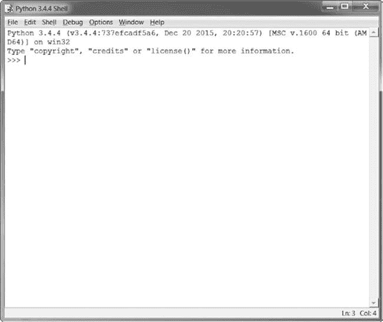

# 致谢

> 原文：[`inventwithpython.com/invent4thed/chapter0.html`](https://inventwithpython.com/invent4thed/chapter0.html)
> 
> 译者：[飞龙](https://github.com/wizardforcel)
> 
> 协议：[CC BY-NC-SA 4.0](https://creativecommons.org/licenses/by-nc-sa/4.0/)

没有 No Starch Press 团队的出色工作，这本书就不可能问世。感谢我的出版商 Bill Pollock；感谢我的编辑 Laurel Chun、Jan Cash 和 Tyler Ortman，在整个过程中给予我的难以置信的帮助；感谢我的技术编辑 Ari Lacenski 进行了彻底的审查；感谢 Josh Ellingson 再次为我设计了出色的封面。


当我还是个孩子的时候，我第一次玩视频游戏就迷上了。但我不只是想玩视频游戏，我想制作它们。我找到了一本像这样的书，教我如何编写我的第一个程序和游戏。这很有趣，也很容易。我制作的第一个游戏就像这本书中的游戏一样。它们没有我父母为我买的任天堂游戏那么花哨，但它们是我自己制作的游戏。

现在，作为一个成年人，我依然喜欢编程，并且还能从中获得报酬。但即使你不想成为一名计算机程序员，编程也是一项有用且有趣的技能。它训练你的大脑以逻辑思维，制定计划，并在发现代码错误时重新考虑你的想法。

许多面向初学者的编程书籍分为两类。第一类包括那些不是教授编程而是“游戏创作软件”或者简化了太多以至于所教授的不再是编程的语言。另一类包括那些像数学教科书一样教授编程的书籍——所有原则和概念，读者很少能在现实生活中应用。这本书采取了不同的方法，通过制作视频游戏来教你编程。我会直接展示游戏的源代码，并从示例中解释编程原理。这种方法对我学习编程很有帮助。我学习其他人的程序是如何工作的，我就越能为自己的程序想到更多的点子。

你所需要的只是一台计算机，一个名为 Python 解释器的免费软件，以及这本书。一旦你学会了这本书中的游戏，你就能够自己开发游戏了。

计算机是令人难以置信的机器，学习如何编程它们并不像人们想象的那么难。计算机*程序*是一堆计算机能够理解的指令，就像故事书是读者能够理解的一堆句子一样。要指导计算机，你需要用计算机能够理解的语言编写程序。这本书将教你一种名为 Python 的编程语言。还有许多其他编程语言可以学习，比如 BASIC、Java、JavaScript、PHP 和 C++。

当我还是个孩子的时候，我学习了 BASIC，但像 Python 这样的新编程语言甚至更容易学习。Python 也被专业程序员在工作中和在编程时使用。而且它完全免费安装和使用——你只需要一个互联网连接来下载它。

因为视频游戏无非就是计算机程序，它们也是由指令组成的。从这本书中你将创建的游戏与 Xbox、PlayStation 或任天堂的游戏相比显得简单。这些游戏没有花哨的图形，因为它们的目的是教你编码基础。它们故意简单，这样你就可以专注于学习编程。游戏不一定要复杂才能有趣！

### 这本书是为谁准备的？

编程并不难，但很难找到教你用编程做有趣事物的材料。其他计算机书籍涵盖了许多新手程序员不需要的主题。这本书将教你如何编写自己的游戏；你将学到一项有用的技能，并有有趣的游戏可以展示！这本书适合：

+   想自学编程的完全初学者，即使他们没有任何经验。

+   想通过制作游戏学习编程的孩子和青少年。

+   想要教授他人编程的成年人和教师。

+   任何想通过学习专业编程语言来学习编程的人，无论年龄大小。

### 关于本书

在本书的大多数章节中，都介绍和解释了一个新的游戏项目。一些章节涵盖了额外的有用主题，比如调试。随着游戏的使用，新的编程概念也得到了解释，并且这些章节应该按顺序阅读。以下是每个章节的简要概述：

+   **第 1 章：交互式 Shell**解释了如何使用 Python 的交互式 Shell 逐行实验代码。

+   **第 2 章：编写程序**介绍了如何在 Python 的文件编辑器中编写完整的程序。

+   在**第 3 章：猜数字**中，您将编写本书中的第一个游戏，猜数字游戏，要求玩家猜一个秘密数字，然后提供关于猜测是否太高或太低的提示。

+   在**第 4 章：讲笑话程序**中，您将编写一个简单的程序，告诉用户几个笑话。

+   在**第 5 章：龙之境界**中，您将编写一个猜谜游戏，玩家必须在两个洞穴中进行选择：一个有友好的龙，另一个有饥饿的龙。

+   **第 6 章：使用调试器**介绍了如何使用调试器来修复代码中的问题。

+   **第 7 章：使用流程图设计 Hangman**解释了如何使用流程图来规划较长的程序，比如 Hangman 游戏。

+   在**第 8 章：编写 Hangman 代码**中，您将编写 Hangman 游戏，按照第 7 章的流程图。

+   **第 9 章：扩展 Hangman**通过使用 Python 的字典数据类型，为 Hangman 游戏增加了新功能。

+   在**第 10 章：井字游戏**中，您将学习如何编写一个人机对战的井字游戏，使用人工智能。

+   在**第 11 章：Bagels 推理游戏**中，您将学习如何制作一个名为 Bagels 的推理游戏，玩家必须根据线索猜测秘密数字。

+   **第 12 章：笛卡尔坐标系**解释了笛卡尔坐标系，您将在以后的游戏中使用它。

+   在**第 13 章：声纳寻宝**中，您将学习如何编写一个寻宝游戏，玩家在海洋中寻找失落的宝箱。

+   在**第 14 章：凯撒密码**中，您将创建一个简单的加密程序，让您编写和解码秘密消息。

+   在**第 15 章：反转棋游戏**中，您将编写一个高级的人机对战反转棋类游戏，其中有一个几乎无法战胜的人工智能对手。

+   **第 16 章：反转棋人工智能模拟**扩展了第 15 章中的反转棋游戏，使多个人工智能在计算机对战中竞争。

+   **第 17 章：创建图形**介绍了 Python 的`pygame`模块，并向您展示如何使用它来绘制 2D 图形。

+   **第 18 章：动画图形**向您展示如何使用`pygame`来制作动画图形。

+   在**第 19 章：碰撞检测**中，您将学习如何在 2D 游戏中检测物体之间的碰撞。

+   在**第 20 章：使用声音和图像**中，您将通过添加声音和图像来改进您简单的`pygame`游戏。

+   **第 21 章：带声音和图像的躲避者游戏**结合了第 17 章到第 20 章中的概念，制作了一个名为 Dodger 的动画游戏。

### 如何使用本书

本书的大多数章节都将以章节特色程序的示例运行开始。这个示例运行向你展示了当你运行程序时程序是什么样子的。用户输入的部分以粗体显示。

我建议你自己将每个程序的代码输入到 IDLE 的文件编辑器中，而不是下载或复制粘贴。如果你花时间输入代码，你会记得更多。

#### 行号和缩进

在输入本书的源代码时，不要在每行开头输入行号。例如，如果你看到以下代码行，你不需要在左边输入`9.`，或者紧随其后的一个空格：

```py
number = random.randint(1, 20)
```

你只需要输入这个：

```py
number = random.randint(1, 20)
```

这些数字只是为了让本书能够指明程序中的特定行。它们不是实际程序源代码的一部分。

除了行号，按照本书中的代码精确输入。注意到一些代码行是以四个或八个（或更多）空格缩进的。行首的空格会改变 Python 解释指令的方式，所以它们非常重要。

让我们看一个例子。这里缩进的空格用黑色圆圈（•）标记，这样你就可以看到它们。

```py
while guesses < 10:
••••if number == 42:
••••••••print('Hello')
```

第一行没有缩进，第二行缩进了四个空格，第三行缩进了八个空格。尽管本书中的示例没有黑色圆圈来标记空格，但在 IDLE 中每个字符的宽度都是相同的，所以你可以通过上一行或下一行的字符数量来计算空格的数量。

#### 长代码行

有些代码指令在书中太长，无法放在一行上，会换到下一行。但是这一行在你的电脑屏幕上是可以放下的，所以不要按回车键，全部在一行上输入。你可以通过左边的行号来看一个新指令何时开始。这个例子只有两条指令：

```py
print('This is the first instruction!xxxxxxxxxxxxxxxxxxxxxxxxxxxxxxxxxxxxxx
     xxxxxxxxxxxx')
print('This is the second instruction, not the third instruction.')
```

第一条指令在页面上换行到第二行，但第二行没有行号，所以你可以看到它仍然是代码的第一行。

### 下载和安装 Python

你需要安装一个叫做 Python 解释器的软件。*解释器*程序能理解你用 Python 写的指令。从现在开始，我会简称 Python 解释器软件为*Python*。

在这一部分，我将向你展示如何下载和安装 Python 3——具体来说，是 Python 3.4——在 Windows、OS X 或 Ubuntu 上。Python 有比 3.4 更新的版本，但是`pygame`模块，它在第 17 章到第 21 章中使用，目前只支持到 3.4。

重要的是要知道 Python 2 和 Python 3 之间有一些重大的区别。本书中的程序使用的是 Python 3，如果你尝试用 Python 2 运行它们，你会得到错误。这是如此重要，事实上，我已经添加了一个卡通企鹅来提醒你。


在 Windows 上，从[`www.python.org/downloads/release/python-344/`](https://www.python.org/downloads/release/python-344/)下载 Windows x86-64 MSI 安装程序，然后双击它。你可能需要输入计算机的管理员密码。按照安装程序在屏幕上显示的指令安装 Python，如下所列：

1.  选择**为所有用户安装**，然后点击**下一步**。

1.  点击**下一步**跳过自定义 Python 部分，安装到*C:\Python34*文件夹。

1.  点击**下一步**跳过自定义 Python 部分。

在 OS X 上，从[`www.python.org/downloads/release/python-344/`](https://www.python.org/downloads/release/python-344/)下载 Mac OS X 64 位/32 位安装程序，然后双击它。按照安装程序在屏幕上显示的指令安装 Python，如下所列：

1.  如果您收到警告“‘Python.mpkg’无法打开，因为它来自未知开发者”，请在右键单击*Python.mpkg*文件时按住 CONTROL，然后从出现的菜单中选择**打开**。您可能需要输入计算机的管理员密码。

1.  点击**继续**通过欢迎部分，并点击**同意**接受许可协议。

1.  选择*Macintosh HD*（或您的硬盘命名的任何内容）并点击**安装**。

如果您正在运行 Ubuntu，您可以按照以下步骤从 Ubuntu 软件中心安装 Python：

1.  打开 Ubuntu 软件中心。

1.  在窗口右上角的搜索框中输入`Python`。

1.  选择**IDLE（Python 3.4 GUI 64 位）**。

1.  点击**安装**。您可能需要输入管理员密码以完成安装。

如果上述步骤不起作用，您可以在[`www.nostarch.com/inventwithpython/`](https://www.nostarch.com/inventwithpython/)找到替代的 Python 3.4 安装说明。

### 启动 IDLE

IDLE 代表**I**nteractive **D**eve**L**opment **E**nvironment。IDLE 就像一个用于编写 Python 程序的文字处理器。在每个操作系统上启动 IDLE 都是不同的：

+   在 Windows 上，点击屏幕左下角的**开始**菜单，输入`IDLE`，然后选择**IDLE（Python GUI）**。

+   在 OS X 上，打开 Finder 并点击**应用程序**。双击**Python 3.***x*，然后双击 IDLE 图标。

+   在 Ubuntu 或其他 Linux 发行版上，打开终端窗口并输入`idle3`。您也可以点击屏幕顶部的**应用程序**，然后点击**编程**和**IDLE 3**。

当您第一次运行 IDLE 时出现的窗口是*交互式 shell*，如图 1 所示。您可以在`>>>`提示符下输入 Python 指令，Python 将执行它们。计算机执行指令后，新的`>>>`提示符将等待您的下一条指令。



*图 1：IDLE 程序的交互式 shell*

### 在线寻求帮助

您可以在[`www.nostarch.com/inventwithpython/`](https://www.nostarch.com/inventwithpython/)找到本书的源代码文件和其他资源。如果您想要询问与本书相关的编程问题，请访问[`reddit.com/r/inventwithpython/`](https://reddit.com/r/inventwithpython/)，或者您可以将您的编程问题发送到[[email protected]](/cdn-cgi/l/email-protection#2e4f426e4740584b405a59475a465e575a464140004d4143)。

在提问之前，请确保执行以下操作：

+   如果您在本书中输入程序但出现错误，请在询问问题之前使用[`www.nostarch.com/inventwithpython#diff`](https://www.nostarch.com/inventwithpython#diff)在线差异工具检查拼写错误。将您的代码复制并粘贴到差异工具中，以查找书中代码和您的代码之间的任何差异。

+   搜索网络，看看是否有人已经提出（并回答）了您的问题。

请记住，您提出编程问题的措辞越好，其他人就越能帮助您。在提出编程问题时，请执行以下操作：

+   解释您在出现错误时尝试做什么。这将让您的帮助者知道您是否完全走错了路。

+   复制并粘贴整个错误消息和您的代码。

+   提供您的操作系统和版本。

+   解释您已经尝试解决问题的方法。这告诉人们您已经努力尝试自己解决问题。

+   要有礼貌。不要要求帮助或者催促您的帮助者快速回复。

现在您知道如何寻求帮助，您将很快学会编写自己的电脑游戏！
