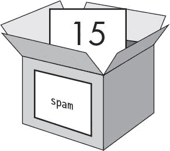

# 一、交互式 shell

> 原文：[`inventwithpython.com/invent4thed/chapter1.html`](https://inventwithpython.com/invent4thed/chapter1.html)
> 
> 译者：[飞龙](https://github.com/wizardforcel)
> 
> 协议：[CC BY-NC-SA 4.0](https://creativecommons.org/licenses/by-nc-sa/4.0/)

在您可以制作游戏之前，您需要学习一些基本的编程概念。您将从本章开始学习如何使用 Python 的交互式 shell 并执行基本的算术运算。

**本章涵盖的主题**

+   运算符

+   整数和浮点数

+   值

+   表达式

+   语法错误

+   将值存储在变量中

### 一些简单的数学

按照“启动 IDLE”中的步骤在第 xxvi 页上启动 IDLE。首先，您将使用 Python 解决一些简单的数学问题。交互式 shell 可以像计算器一样工作。在交互式 shell 的`>>>`提示符处键入`2 + 2`，然后按 ENTER 键。 （在某些键盘上，此键是 RETURN。）图 1-1 显示了这个数学问题在交互式 shell 中的样子-请注意它响应数字`4`。


*图 1-1：* 在交互式 shell 中输入 2 + 2

这个数学问题是一个简单的编程指令。加号（`+`）告诉计算机将数字`2`和`2`相加。计算机执行此操作，并在下一行返回数字`4`。表 1-1 列出了 Python 中可用的其他数学符号。

**表 1-1：** 数学运算符

| **运算符** | **操作** |
| --- | --- |
| `+` | 加法 |
| `-` | 减法 |
| `*` | 乘法 |
| `/` | 除法 |

减号（`-`）减去数字，星号（`*`）乘以数字，斜杠（`/`）除以数字。这样使用时，`+`，`-`，`*`和`/`被称为*运算符*。运算符告诉 Python 如何处理它们周围的数字。

#### 整数和浮点数

*整数*（或简称*整数*）是诸如`4`，`99`和`0`的整数。*浮点数*（或简称*浮点数*）是分数或带有小数点的数字，如`3.5`，`42.1`和`5.0`。在 Python 中，`5`是一个整数，但`5.0`是一个浮点数。这些数字被称为*值*。（稍后我们将学习除了数字之外的其他种类的值。）在您在 shell 中输入的数学问题中，`2`和`2`是整数值。

#### 表达式

数学问题`2 + 2`是*表达式*的一个例子。如图 1-2 所示，表达式由值（数字）和运算符（数学符号）组成，产生代码可以使用的新值。计算机可以在几秒钟内解决数百万个表达式。


*图 1-2：表达式由值和运算符组成。*

尝试将其中一些表达式输入交互式 shell，每次输入后按 ENTER：

```py
>>> 2+2+2+2+2
10
>>> 8*6
48
>>> 10-5+6
11
>>> 2  +        2
4
```

这些表达式看起来都像普通的数学方程，但请注意`2  +        2`示例中的所有空格。在 Python 中，您可以在值和运算符之间添加任意数量的空格。但是，当将它们输入交互式 shell 时，您必须始终从行的开头（没有空格）开始指令。

### 评估表达式

当计算机解决表达式`10 + 5`并返回值`15`时，它已经*评估*了表达式。评估表达式将表达式减少为单个值，就像解决数学问题将问题减少为单个数字：答案。例如，表达式`10 + 5`和`10 + 3 + 2`都求值为`15`。

当 Python 评估表达式时，它遵循与您进行数学运算时一样的操作顺序。只有几条规则：

+   括号内表达式的部分首先进行评估。

+   乘法和除法在加法和减法之前进行。

+   评估是从左到右执行的。

表达式 `1 + 2 * 3 + 4` 求值为 `11`，而不是 `13`，因为首先评估 `2 * 3`。如果表达式是 `(1 + 2) * (3 + 4)`，它将求值为 `21`，因为括号内的 `(1 + 2)` 和 `(3 + 4)` 在乘法之前被评估。

表达式可以是任意大小，但它们总是会求值为一个单一的值。即使单个值也是表达式。例如，表达式 `15` 求值为值 `15`。表达式 `8 * 3 / 2 + 2 + 7 - 9` 通过以下步骤求值为值 `12.0`：


尽管计算机正在执行所有这些步骤，但你在交互式 shell 中看不到它们。交互式 shell 只会显示结果：

```py
>>> 8 * 3 / 2 + 2 + 7 - 9
12.0
```

注意，带有 `/` 除法运算符的表达式总是求值为浮点数；例如，`24 / 2` 求值为 `12.0`。即使有一个浮点数值的数学运算也会求值为浮点数值，所以 `12.0 + 2` 求值为 `14.0`。

### 语法错误

如果你在交互式 shell 中输入 `5 +`，你会得到以下错误消息：

```py
>>> 5 +
SyntaxError: invalid syntax
```

这个错误发生是因为 `5 +` 不是一个表达式。表达式是由运算符连接的值，`+` 运算符期望在它之前*和*之后有一个值。当期望的值缺失时，会出现错误消息。

`SyntaxError` 意味着 Python 无法理解指令，因为你输入错误了。计算机编程不仅仅是给计算机指令，还要知道如何正确地给它这些指令。

不过不要担心犯错。错误不会损坏你的计算机。只需在下一个 `>>>` 提示符下正确地重新输入指令到交互式 shell 中。

### 在变量中存储值

当一个表达式求值为一个值时，你可以通过将其存储在*变量*中来稍后使用该值。把变量想象成一个可以容纳值的盒子。

*赋值语句*会将一个值存储在变量中。输入变量名称，然后是等号（`=`），这被称为*赋值运算符*，然后是要存储在变量中的值。例如，输入以下内容到交互式 shell 中：

```py
>>> spam = 15
>>>
```

`spam` 变量的盒子现在存储值 `15`，如图 1-3 所示。



*图 1-3：变量就像可以容纳值的盒子。*

当你按下 ENTER 键时，你不会看到任何响应。在 Python 中，如果没有出现错误消息，你就知道指令是成功的。`>>>` 提示符会出现，这样你就可以输入下一个指令。

与表达式不同，*语句*是不会求值为任何值的指令。这就是为什么在 `spam = 15` 后的交互式 shell 中的下一行没有显示任何值。如果你对哪些指令是表达式，哪些是语句感到困惑，记住表达式会求值为一个单一的值。任何其他类型的指令都是语句。

变量存储值，而不是表达式。例如，考虑语句 `spam = 10 + 5` 和 `spam = 10 + 7 - 2` 中的表达式。它们都求值为 `15`。最终结果是一样的：两个赋值语句都将值 `15` 存储在变量 `spam` 中。

一个好的变量名称描述了它包含的数据。想象一下，你搬到了一个新房子，并且给所有的搬运箱贴上了 *东西* 的标签。你永远找不到任何东西！`spam`、`eggs` 和 `bacon` 这些变量名称是本书中用于变量的示例名称。

第一次在赋值语句中使用变量时，Python 会创建该变量。要检查变量中的值，输入变量名称到交互式 shell 中：

```py
>>> spam = 15
>>> spam
15
```

表达式 `spam` 的值是变量 `spam` 中的值：`15`。

你也可以在表达式中使用变量。尝试在交互式 shell 中输入以下内容：

```py
>>> spam = 15
>>> spam + 5
20
```

你将变量`spam`的值设置为`15`，所以输入`spam + 5`就像输入表达式`15 + 5`。以下是`spam + 5`被评估的步骤：


在赋值语句创建变量之前，你不能使用变量。如果你尝试这样做，Python 会给你一个`NameError`，因为还没有这样的变量。变量名拼写错误也会导致这个错误：

```py
>>> spam = 15
>>> spma
Traceback (most recent call last):
  File "<pyshell#8>", line 1, in <module>
    spma
NameError: name 'spma' is not defined
```

出现错误是因为有一个`spam`变量，但没有`spma`变量。

你可以通过输入另一个赋值语句来更改变量中存储的值。例如，将以下内容输入交互式 shell 中：

```py
>>> spam = 15
>>> spam + 5
20
>>> spam = 3
>>> spam + 5
8
```

当你第一次输入`spam + 5`时，表达式的值为`20`，因为你在`spam`中存储了`15`。然而，当你输入`spam = 3`时，变量的盒子中的值`15`被替换或*覆盖*为值`3`，因为变量一次只能保存一个值。因为`spam`的值现在是`3`，所以当你输入`spam + 5`时，表达式的值为`8`。覆盖就像是从变量的盒子中取出一个值，然后放入一个新值，如图 1-4 所示。


*图 1-4：*spam*中的值*15*被*3*覆盖。

你甚至可以使用`spam`变量中的值来为`spam`赋一个新值：

```py
>>> spam = 15
>>> spam = spam + 5
20
```

赋值语句`spam = spam + 5`表示，“`spam`变量的新值将是`spam`的当前值加上五。”要多次增加`spam`中的值`5`，请将以下内容输入交互式 shell 中：

```py
>>> spam = 15
>>> spam = spam + 5
>>> spam = spam + 5
>>> spam = spam + 5
>>> spam
30
```

在这个例子中，你在第一条语句中为`spam`赋了一个值`15`。在下一条语句中，你将`5`加到`spam`的值上，并将`spam`赋予新值`spam + 5`，这个值为`20`。当你这样做三次时，`spam`的值为`30`。

到目前为止，我们只看了一个变量，但是你可以在你的程序中创建尽可能多的变量。例如，让我们给两个名为`eggs`和`bacon`的变量分配不同的值，如下所示：

```py
>>> bacon = 10
>>> eggs = 15
```

现在`bacon`变量中有`10`，`eggs`变量中有`15`。每个变量都是它自己的盒子，有自己的值，如图 1-5 所示。


图 1-5：*bacon*和*eggs*变量分别存储值。

在交互式 shell 中输入`spam = bacon + eggs`，然后检查`spam`的新值：

```py
>>> bacon = 10
>>> eggs = 15
>>> spam = bacon + eggs
>>> spam
25
```

`spam`中的值现在是`25`。当你加上`bacon`和`eggs`时，你正在加上它们的值，分别为`10`和`15`。变量包含值，而不是表达式，所以`spam`变量被赋予了值`25`，而不是表达式`bacon + eggs`。在`spam = bacon + eggs`语句将值`25`赋给`spam`之后，改变`bacon`或`eggs`不会影响`spam`。

### 总结

在本章中，你学习了编写 Python 指令的基础知识。因为计算机没有常识，只能理解特定的指令，Python 需要你准确告诉它要做什么。

表达式是值（如`2`或`5`）与运算符（如`+`或`-`）的组合。Python 可以评估表达式，即将表达式简化为单个值。你可以将值存储在变量中，以便你的程序可以记住这些值并在以后使用它们。

Python 中还有其他类型的运算符和值。在下一章中，你将学习一些更基本的概念，并编写你的第一个程序。你将学习如何在表达式中处理文本。Python 不仅仅局限于数字；它不仅仅是一个计算器！
