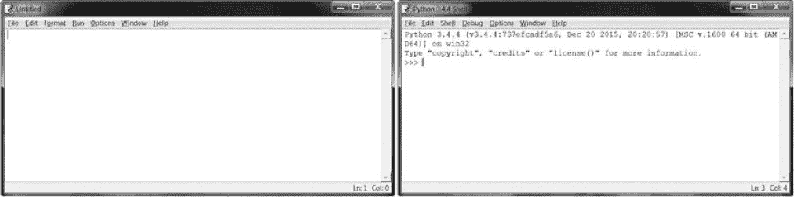
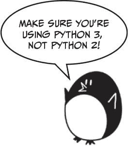
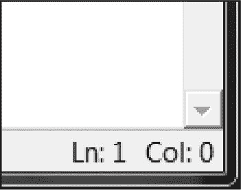
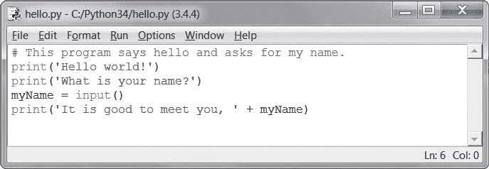
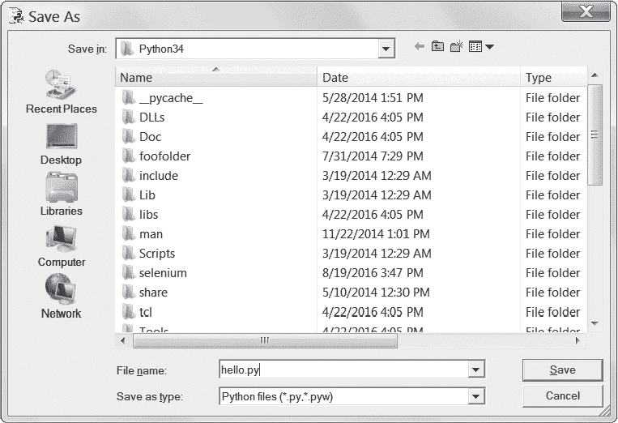
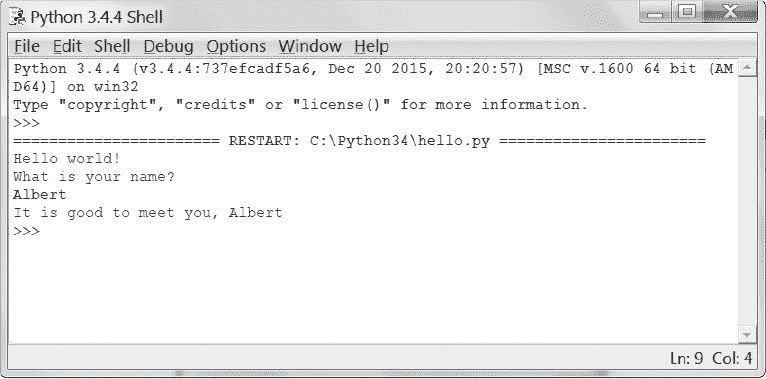
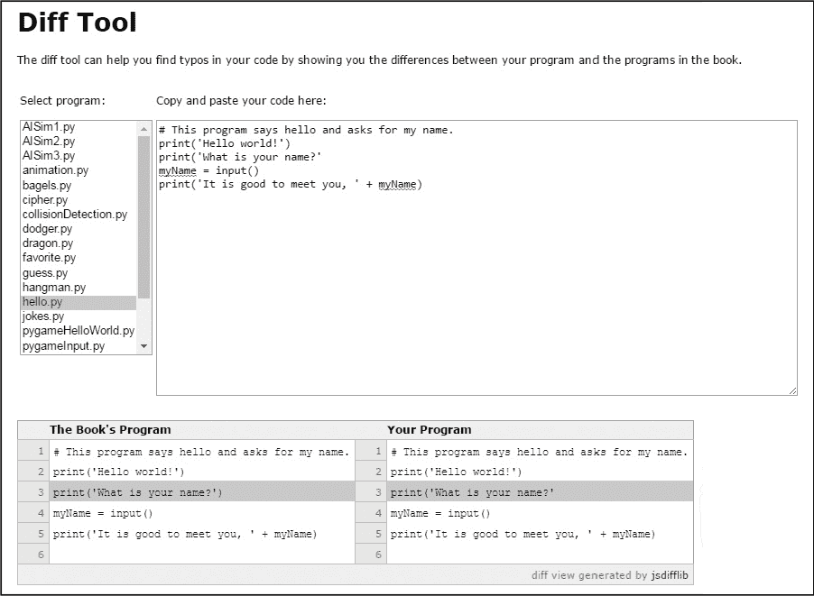
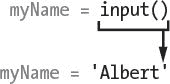
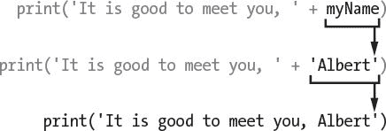

# 二、编写程序

> 原文：[`inventwithpython.com/invent4thed/chapter2.html`](https://inventwithpython.com/invent4thed/chapter2.html)
> 
> 译者：[飞龙](https://github.com/wizardforcel)
> 
> 协议：[CC BY-NC-SA 4.0](https://creativecommons.org/licenses/by-nc-sa/4.0/)

现在让我们看看 Python 可以用文本做什么。几乎所有程序都向用户显示文本，并且用户通过键盘向程序输入文本。在本章中，您将制作您的第一个程序，该程序可以做这两件事。您将学习如何将文本存储在变量中，组合文本，并在屏幕上显示文本。您将创建的程序显示问候语`Hello world!`并要求用户输入姓名。

**本章涵盖的主题**

+   字符串

+   字符串连接

+   数据类型（如字符串或整数）

+   使用文件编辑器编写程序

+   在 IDLE 中保存和运行程序

+   执行流程

+   注释

+   `print()` 函数

+   `input()` 函数

+   大小写敏感

### 字符串值

在 Python 中，文本值称为*字符串*。字符串值可以像整数或浮点值一样使用。您可以将字符串存储在变量中。在代码中，字符串值以单引号`'`开始和结束。将此代码输入交互式 shell：

```py
>>> spam = 'hello'
```

单引号告诉 Python 字符串从哪里开始和结束。它们不是字符串值文本的一部分。现在，如果您在交互式 shell 中输入`spam`，您将看到`spam`变量的内容。请记住，Python 将变量求值为变量内部存储的值。在这种情况下，这是字符串`'hello'`。

```py
>>> spam = 'hello'
>>> spam
'hello'
```

字符串可以包含任何键盘字符，并且可以任意长。以下都是字符串的示例：

```py
'hello'
'Hi there!'
'KITTENS'
'7 apples, 14 oranges, 3 lemons'
'Anything not pertaining to elephants is irrelephant.'
'A long time ago, in a galaxy far, far away...'
'O*&#wY%*&OCfsdYO*&gfC%YO*&%3yc8r2'
```

### 字符串连接

您可以使用运算符将字符串值与运算符组合成表达式，就像整数和浮点值一样。当您使用`+`运算符组合两个字符串时，称为*字符串连接*。将`'Hello' + 'World!'`输入交互式 shell：

```py
>>> 'Hello' + 'World!'
'HelloWorld!'
```

该表达式求值为单个字符串值`'HelloWorld!'`。两个连接的字符串中没有空格，因此单词之间也没有空格，与以下示例不同：

```py
>>> 'Hello ' + 'World!'
'Hello World!'
```

`+` 运算符在字符串和整数值上的工作方式不同，因为它们是不同的*数据类型*。所有值都有一个数据类型。值`'Hello'`的数据类型是字符串。值`5`的数据类型是整数。数据类型告诉 Python 在评估表达式时应该做什么。`+` 运算符连接字符串值，但是添加整数和浮点数值。

### 在 IDLE 的文件编辑器中编写程序

到目前为止，您一直在逐个输入 IDLE 的交互式 shell 中的指令。但是，当您编写程序时，您会输入多个指令并一次性运行它们，这就是您接下来要做的事情。现在是时候编写您的第一个程序了！

除了解释器，IDLE 还有另一个部分称为*文件编辑器*。要打开它，请单击交互式 shell 顶部的**文件**菜单。然后选择**新建文件**。将出现一个空白窗口，供您输入程序代码，如图 2-1 所示。



图 2-1：文件编辑器（左）和交互式 shell（右）

这两个窗口看起来很相似，但请记住：交互式 shell 将显示`>>>`提示，而文件编辑器不会。

#### 创建 Hello World 程序

程序员传统上会让他们的第一个程序在屏幕上显示`Hello world!`。现在您将创建自己的 Hello World 程序。



当输入程序时，请记住不要输入每行代码开头的数字。它们是为了让本书可以按行号引用代码。文件编辑器的右下角将告诉您光标在哪里，这样您就可以检查自己在哪一行代码上。图 2-2 显示光标在第 1 行（在编辑器上下移动）和第 0 列（在左右移动）。



*图 2-2：文件编辑器的右下角告诉您光标在哪一行*

将以下文本输入到新的文件编辑器窗口中。这是程序的*源代码*。它包含了 Python 在运行程序时将遵循的指令。

`hello.py`

```py
# This program says hello and asks for my name.
print('Hello world!')
print('What is your name?')
myName = input()
print('It is good to meet you, ' + myName)
```

IDLE 将使用不同的颜色写入不同类型的指令。在输入代码后，窗口应该看起来像图 2-3。



*图 2-3：输入代码后文件编辑器的样子*

检查确保您的 IDLE 窗口看起来一样。

#### 保存您的程序

输入源代码后，请单击**文件** !image](img/6213f577c15feb006bdab7161d1cfc75.png) **另存为** 进行保存。或者按下 CTRL-S 进行快捷键保存。[图 2-4 显示将打开的另存为窗口。在文件名文本字段中输入*hello.py*，然后单击**保存**。



*图 2-4：保存程序*

在编写程序时，应该经常保存程序。这样，如果计算机崩溃或者您意外退出 IDLE，您不会丢失太多工作。

要加载之前保存的程序，请单击**文件**  **打开**。在出现的窗口中选择*hello.py*文件，然后单击**打开**按钮。您保存的*hello.py*程序将在文件编辑器中打开。

#### 运行您的程序

现在是运行程序的时候了。单击**运行**  **运行模块**。或者从文件编辑器中按下 F5（在 OS X 上是 FN-5）。您的程序将在交互式 shell 中运行。

当程序要求输入您的名字时，请输入。这将看起来像图 2-5。



*图 2-5：运行 hello.py 后的交互式 shell*

当您输入您的名字并按下回车键时，程序将以您的名字向您问候。恭喜！您已经编写了您的第一个程序，现在是一名计算机程序员。再次按 F5 运行程序，然后输入另一个名字。

如果出现错误，请使用在线 diff 工具将您的代码与本书的代码进行比较，网址为*https://www.nostarch.com/inventwithpython#diff](https://www.nostarch.com/inventwithpython#diff)*。从文件编辑器中复制并粘贴您的代码到网页上，然后单击**比较**按钮。该工具将突出显示您的代码与本书中代码之间的任何差异，如[图 2-6 所示。

在编码过程中，如果出现以下形式的`NameError`，这意味着您正在使用 Python 2 而不是 Python 3。

```py
Hello world!
What is your name?
Albert
Traceback (most recent call last):
  File "C:/Python26/test1.py", line 4, in <module>
    myName = input()
  File "<string>", line 1, in <module>
NameError: name 'Albert' is not defined
```

要解决问题，请安装 Python 3.4 并重新运行程序。（参见“下载和安装 Python”第 xxv 页。）



*图 2-6：使用 diff 工具* [`www.nostarch.com/inventwithpython#diff`](https://www.nostarch.com/inventwithpython#diff)

### Hello World 程序的工作原理

每行代码都是 Python 解释的一条指令。这些指令组成了程序。计算机程序的指令就像食谱中的步骤一样。Python 按顺序完成程序中的每个指令，从程序的顶部向下移动。

Python 当前在程序中工作的步骤称为*执行*。程序开始时，执行位于第一条指令处。执行指令后，Python 会向下移动到下一条指令。

让我们看看代码的每一行都在做什么。我们将从第 1 行开始。

#### 程序员的注释

Hello World 程序的第一行是*注释*：

```py
# This program says hello and asks for my name.
```

井号(`#`)后面的任何文本都是注释。注释是程序员关于代码功能的注释；它们不是为 Python 编写的，而是为你，程序员。Python 在运行程序时会忽略注释。程序员通常在代码顶部放置注释，以便为他们的程序命名。Hello World 程序中的注释告诉你程序会打招呼并询问你的名字。

#### 函数：程序内的迷你程序

*函数*有点像程序中的迷你程序，其中包含 Python 执行的几条指令。函数的好处是你只需要知道它们做什么，而不需要知道它们是如何做的。Python 已经提供了一些内置函数。我们在 Hello World 程序中使用了`print()`和`input()`。

*函数调用*是一条指令，告诉 Python 运行函数内部的代码。例如，你的程序调用`print()`函数在屏幕上显示一个字符串。`print()`函数将你在括号中输入的字符串作为输入，并在屏幕上显示该文本。

##### print()函数

Hello World 程序的第 2 行和第 3 行是对`print()`的调用：

```py
print('Hello world!')
print('What is your name?')
```

函数调用括号中的值是*参数*。第 2 行`print()`函数调用的参数是`'Hello world!'`，第 3 行`print()`函数调用的参数是`'What is your name?'`。这称为*传递*参数给函数。

##### input()函数

第 4 行是一个带有变量`myName`和函数调用`input()`的赋值语句：

```py
myName = input()
```

当调用`input()`时，程序会等待用户输入文本。用户输入的文本字符串将成为函数调用评估的值。函数调用可以在任何可以使用值的表达式中使用。

函数调用评估的值称为*返回值*。（实际上，“函数调用返回的值”和“函数调用评估的值”意思相同。）在这种情况下，`input()`函数的返回值是用户输入的字符串：他们的名字。如果用户输入`Albert`，`input()`函数调用将求值为字符串`'Albert'`。评估如下：



这就是字符串值`'Albert'`存储在`myName`变量中的方式。

##### 函数调用中的表达式

Hello World 程序的最后一行是另一个`print()`函数调用：

```py
print('It is good to meet you, ' + myName)
```

表达式`'It is good to meet you, ' + myName`在`print()`的括号中。因为参数总是单个值，Python 首先评估这个表达式，然后将该值作为参数传递。如果`myName`中存储的是`'Albert'`，评估如下：



这就是程序通过名字向用户问候的方式。

#### 程序结束

一旦程序执行最后一行，它就会*终止*或*退出*。这意味着程序停止运行。Python 忘记了所有存储在变量中的值，包括存储在`myName`中的字符串。如果再次运行程序并输入不同的名称，程序将认为那是你的名字。

```py
Hello world!
What is your name?
Carolyn
It is good to meet you, Carolyn
```

记住，计算机会完全按照你编程的指令执行。计算机很笨，只会严格按照你给它的指令执行。计算机不在乎你输入你的名字、别人的名字或者一些愚蠢的东西。输入任何你想输入的东西。计算机会以同样的方式对待它：

```py
Hello world!
What is your name?
poop
It is good to meet you, poop
```

### 变量命名

给变量起描述性的名称可以更容易理解程序的功能。您可以将`myName`变量命名为`abrahamLincoln`或`nAmE`，Python 也会运行程序。但这些名称并不能告诉您有关变量可能包含的信息。正如第 1 章所讨论的，如果您搬家并且将每个搬运箱标记为*Stuff*，那将毫无帮助！本书的交互式 Shell 示例使用变量名`spam`、`eggs`和`bacon`，因为这些示例中的变量名并不重要。然而，本书的程序都使用描述性名称，您的程序也应该如此。

变量名是*区分大小写*的，这意味着不同大小写的相同变量名被视为不同的变量。因此，在 Python 中，`spam`、`SPAM`、`Spam`和`sPAM`是四个不同的变量。它们各自包含自己的值。在程序中使用不同大小写的变量是一个不好的主意。而是应该为您的变量使用描述性的名称。

变量名通常是小写的。如果变量名中有多个单词，最好将第一个单词之后的每个单词大写。例如，变量名`whatIHadForBreakfastThisMorning`比`whatihadforbreakfastthismorning`更容易阅读。以这种方式大写您的变量称为*驼峰命名法*（因为它类似于骆驼背上的驼峰），它可以使您的代码更易读。程序员也更喜欢使用更短的变量名来使代码更易于理解：`breakfast`或`foodThisMorning`比`whatIHadForBreakfastThisMorning`更易读。这些是*约定*——在 Python 编程中做事情的可选但标准方式。

### 总结

一旦您了解如何使用字符串和函数，您就可以开始制作与用户交互的程序。这很重要，因为文本是用户和计算机之间主要的交流方式。用户通过键盘使用`input()`函数输入文本，计算机则使用`print()`函数在屏幕上显示文本。

字符串只是一种新数据类型的值。所有值都有数据类型，值的数据类型会影响`+`运算符的功能。

函数用于执行程序中的复杂指令。Python 有许多内置函数，您将在本书中学习到。函数调用可以在表达式中的任何值处使用。

您的程序中 Python 当前正在执行的指令或步骤称为执行。在第 3 章中，您将学习如何使执行以除了直接向下执行程序之外的其他方式移动。一旦您学会了这一点，您就可以开始创建游戏了！
