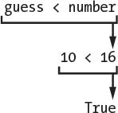

# 三、猜数字

> 原文：[`inventwithpython.com/invent4thed/chapter3.html`](https://inventwithpython.com/invent4thed/chapter3.html)
> 
> 译者：[飞龙](https://github.com/wizardforcel)
> 
> 协议：[CC BY-NC-SA 4.0](https://creativecommons.org/licenses/by-nc-sa/4.0/)


在本章中，你将制作一个猜数字游戏。计算机会想一个从 1 到 20 的秘密数字，并要求用户猜测。每次猜测后，计算机会告诉用户数字是太高还是太低。如果用户能在六次内猜中数字，他们就赢了。

这是一个很好的编程游戏，因为它涵盖了短程序中的许多编程概念。你将学习如何将值转换为不同的数据类型，以及何时需要这样做。由于这个程序是一个游戏，从现在开始我们将称用户为*玩家*。

**本章涵盖的主题**

+   `import` 语句

+   模块

+   `randint()` 函数

+   `for` 语句

+   块

+   `str()`、`int()` 和 `float()` 函数

+   布尔值

+   比较运算符

+   条件

+   `=` 和 `==` 之间的区别

+   `if` 语句

+   `break` 语句

### 猜数字的示例运行

当运行猜数字程序时，玩家的输入如下所示。玩家的输入以粗体标记。

```py
Hello! What is your name?
Albert
Well, Albert, I am thinking of a number between 1 and 20.
Take a guess.
10
Your guess is too high.
Take a guess.
2
Your guess is too low.
Take a guess.
4
Good job, Albert! You guessed my number in 3 guesses!
```

### 猜数字的源代码

通过单击**文件**  **新建窗口** 打开一个新的文件编辑器窗口。在出现的空白窗口中，输入源代码并将其保存为 *guess.py*。然后按 F5 运行程序。


当你把这段代码输入到文件编辑器中时，一定要注意行首的空格。有些行需要缩进四个或八个空格。

如果输入此代码后出现错误，请使用在线差异工具将你输入的代码与本书代码进行比较，网址为 [`www.nostarch.com/inventwithpython#diff`](https://www.nostarch.com/inventwithpython#diff)。

`guess.py`

```py
# This is a Guess the Number game.
import random

guessesTaken = 0

print('Hello! What is your name?')
myName = input()

number = random.randint(1, 20)
print('Well, ' + myName + ', I am thinking of a number between 1 and 20.')

for guessesTaken in range(6):
    print('Take a guess.') # Four spaces in front of "print"
    guess = input()
    guess = int(guess)

    if guess < number:
        print('Your guess is too low.') # Eight spaces in front of "print"

    if guess > number:
        print('Your guess is too high.')

    if guess == number:
        break

if guess == number:
    guessesTaken = str(guessesTaken + 1)
    print('Good job, ' + myName + '! You guessed my number in ' +
          guessesTaken + ' guesses!')

if guess != number:
    number = str(number)
    print('Nope. The number I was thinking of was ' + number + '.')
```

### 导入 random 模块

让我们来看看这个程序的前两行：

```py
# This is a Guess the Number game.
import random
```

第一行是一个注释，你在第 2 章中见过。记住 Python 会忽略 `#` 字符后的所有内容。这里的注释只是提醒我们这个程序的作用是什么。

第二行是一个 `import` 语句。记住，语句是执行某些操作的指令，但不像表达式那样求值。你已经见过赋值语句，它将一个值存储在一个变量中。

虽然 Python 包含许多内置函数，但有些函数是写在称为*模块*的单独程序中的。你可以通过使用 `import` 语句将这些函数的模块导入到你的程序中来使用这些函数。

第 2 行导入了 `random` 模块，以便程序可以调用 `randint()` 函数。这个函数将为玩家生成一个随机数来猜测。

现在你已经导入了 `random` 模块，需要设置一些变量来存储程序稍后将使用的值。

第 4 行创建了一个名为 `guessesTaken` 的新变量：

```py
guessesTaken = 0
```

你将把玩家猜测的次数存储在这个变量中。由于在程序的这一点上玩家还没有进行任何猜测，所以在这里存储整数 `0`。

```py
print('Hello! What is your name?')
myName = input()
```

第 6 行和第 7 行与第 2 章中的 Hello World 程序中的行相同。程序员经常重用其他程序中的代码来节省工作量。

第 6 行是对 `print()` 的函数调用。记住，函数就像你程序中的一个小型程序。当你的程序调用一个函数时，它会运行这个小程序。`print()` 中的代码会在屏幕上显示你传递给它的字符串参数。

第 7 行让玩家输入他们的名字并将其存储在 `myName` 变量中。记住，这个字符串可能并不是玩家的真实姓名；它只是玩家输入的任何字符串。计算机是愚蠢的，会按照它们的指令执行，不管怎样。

### 使用 random.randint()函数生成随机数

现在你的其他变量都设置好了，你可以使用`random`模块的函数来设置计算机的秘密数字：

```py
number = random.randint(1, 20)
```

第 9 行调用了一个名为`randint()`的新函数，并将返回值存储在`number`中。记住，函数调用可以是表达式的一部分，因为它们会求值为一个值。

`randint()`函数由`random`模块提供，所以你必须使用`random.randint()`（别忘了句号！）告诉 Python 函数`randint()`在`random`模块中。

`randint()`将返回两个整数参数之间（包括这两个整数）的随机整数。第 9 行在函数名后的括号内传递了用逗号分隔的`1`和`20`。`randint()`返回的随机整数存储在一个名为`number`的变量中——这就是玩家试图猜测的秘密数字。

只需片刻，回到交互式 shell，输入`import random`导入`random`模块。然后输入`random.randint(1, 20)`看看函数调用的结果。它将返回一个介于`1`和`20`之间的整数。再次重复代码，函数调用将返回另一个整数。`randint()`函数每次返回一个随机整数，就像掷骰子每次都会得到一个随机数一样。例如，输入以下内容到交互式 shell。当你调用`randint()`函数时得到的结果可能会不同（毕竟是随机的！）。

```py
>>> import random
>>> random.randint(1, 20)
12
>>> random.randint(1, 20)
18
>>> random.randint(1, 20)
3
>>> random.randint(1, 20)
18
>>> random.randint(1, 20)
7
```

你也可以通过改变参数尝试不同范围的数字。例如，输入`random.randint(1, 4)`来获得介于`1`和`4`之间的整数（包括`1`和`4`）。或者尝试`random.randint(1000, 2000)`来获得介于`1000`和`2000`之间的整数。

在交互式 shell 中输入此代码，看看你得到了什么数字：

```py
>>> random.randint(1, 4)
3
>>> random.randint(1000, 2000)
1294
```

你可以稍微改变游戏的代码，使游戏的行为有所不同。在我们的原始代码中，我们使用介于`1`和`20`之间的整数：

```py
number = random.randint(1, 20)
print('Well, ' + myName + ', I am thinking of a number between 1 and 20.')
```

尝试将整数范围改为`(1, 100)`：

```py
number = random.randint(1, 100)
print('Well, ' + myName + ', I am thinking of a number between 1 and 100.')
```

现在计算机将想一个介于`1`和`100`之间的整数，而不是`1`和`20`。改变第 9 行将改变随机数的范围，但记得同时改变第 10 行，以便游戏告诉玩家新的范围而不是旧的范围。

你可以在游戏中随时使用`randint()`函数添加随机性。你会在许多游戏中使用随机性。（想想有多少桌游使用骰子。）

### 欢迎玩家

计算机给`number`分配一个随机整数后，会向玩家打招呼：

```py
print('Well, ' + myName + ', I am thinking of a number between 1 and 20.')
```

在第 10 行，`print()`欢迎玩家，并告诉他们计算机正在想一个随机数。

乍一看，第 10 行可能看起来有多个字符串参数，但仔细检查一下。三个字符串之间的`+`运算符将它们连接成一个字符串。而这个字符串是传递给`print()`的参数。如果你仔细看，你会发现逗号在引号内并且是字符串的一部分。

### 流程控制语句

在之前的章节中，程序执行从程序顶部的指令开始，直接向下移动，按顺序执行每个指令。但是通过`for`、`if`、`else`和`break`语句，你可以根据条件使执行循环或跳过指令。这些类型的语句是*流程控制语句*，因为它们改变程序执行的流程，使其在程序中移动时改变。

#### 使用循环重复代码

第 12 行是一个`for`语句，表示`for`循环的开始：

```py
for guessesTaken in range(6):
```

*循环*让你可以一遍又一遍地执行代码。第 12 行将重复其代码六次。`for`语句以`for`关键字开始，后面跟着一个新的变量名、`in`关键字、调用`range()`函数指定它应该执行的循环次数，以及一个冒号。让我们再讨论一些其他概念，这样你就可以使用循环了。

#### 使用块进行分组

几行代码可以组合在一起形成一个*块*。代码块中的每一行都至少以与块中第一行相同数量的空格开头。通过查看行首的空格数量，可以确定块的开始和结束。这就是所谓的*缩进*。

Python 程序员通常使用四个*额外*空格来开始一个块。任何后续的行，只要缩进相同，都是块的一部分。当有一行代码的缩进*与块开始之前的缩进相同时*，块就结束了。也可以在其他块内有块。图 3-1 显示了一个带有轮廓和编号的代码图。


*图 3-1：块及其缩进的示例。灰色点代表空格。*

在图 3-1 中，第 12 行没有缩进，也不在任何块内。第 13 行缩进了四个空格。由于这一行的缩进比上一行多，一个新的块从这里开始。之后的每一行，只要缩进相同或更多，都被视为块 ➊ 的一部分。如果 Python 遇到另一行的缩进少于块的第一行，那么块已经结束。空行会被忽略。

第 18 行缩进了八个空格，开始了块 ➋。这个块是*在*块 ➊ *内*的。但是下一行，第 20 行，只缩进了四个空格。由于缩进减少，您知道第 18 行的块 ➋ 已经结束了，并且因为第 20 行的缩进与第 13 行相同，所以它在块 ➊ 中。

第 21 行再次增加缩进到八个空格，因此又开始了一个新的块：块 ➌。在第 23 行，我们退出了块 ➌，在第 24 行，我们进入了块 ➍。块 ➊ 和块 ➍ 都在第 24 行结束。

#### 使用 for 语句进行循环

`for`语句标志着循环的开始。循环重复执行相同的代码。当执行到达`for`语句时，它进入`for`语句后面的块。在运行完块中的所有代码后，执行将返回到块的顶部，重新运行所有代码。

在交互式 shell 中输入以下内容：

```py
>>> for i in range(3):
    print('Hello! i is set to', i)

Hello! i is set to 0
Hello! i is set to 1
Hello! i is set to 2
```

注意，在输入`for i in range(3):`并按 ENTER 后，交互式 shell 没有显示另一个`>>>`提示，因为它期望您输入一块代码。在输入最后一条指令后再次按 ENTER，告诉交互式 shell 您已经输入完代码块了。（这仅适用于在交互式 shell 中工作时。在文件编辑器中编写*.py*文件时，不需要插入空行。）

让我们看一下*guess.py*第 12 行的`for`循环：

```py
for guessesTaken in range(6):
    print('Take a guess.') # Four spaces in front of "print"
    guess = input()
    guess = int(guess)

    if guess < number:
        print('Your guess is too low.') # Eight spaces in front of "print"

    if guess > number:
        print('Your guess is too high.')

    if guess == number:
        break

if guess == number:
```

在猜数字游戏中，`for`块从第 12 行的`for`语句开始，而`for`块之后的第一行是第 26 行。

`for`语句的条件后总是有一个冒号（`:`）。以冒号结尾的语句期望下一行有一个新的块。这在图 3-2 中有所体现。


图 3-2：*循环执行流*

图 3-2 显示了执行流程。执行将进入第 13 行的`for`块并继续向下进行。一旦程序到达`for`块的末尾，执行不会继续向下执行，而是会循环回到第 13 行`for`块的开始。这样做了六次，因为`for`语句中调用了`range(6)`函数。执行循环的每一次称为*迭代*。

将`for`语句视为“执行以下代码块一定次数”。

### 获取玩家的猜测

第 13 行和第 14 行要求玩家猜测秘密数字，并让他们输入他们的猜测：

```py
    print('Take a guess.') # Four spaces in front of "print"
    guess = input()
```

玩家输入的数字存储在名为`guess`的变量中。

### 使用 int()、float()和 str()函数转换值

第 15 行调用了一个名为`int()`的新函数：

```py
    guess = int(guess)
```

`int()`函数接受一个参数，并将参数的值作为整数返回。

在交互式 shell 中输入以下内容，以查看`int()`函数的工作原理：

```py
>>> int('42')
42
```

`int('42')`调用将返回整数值`42`。

```py
>>> 3 + int('2')
5
```

`3 + int('2')`这一行显示了一个使用`int()`返回值作为表达式一部分的表达式。它求值为整数值`5`：


尽管你可以将字符串传递给`int()`，但你不能传递任意字符串。将`'forty-two'`传递给`int()`将导致错误：

```py
>>> int('forty-two')
Traceback (most recent call last):
  File "<pyshell#5>", line 1, in <module>
    int('forty-two')
ValueError: invalid literal for int() with base 10: 'forty-two'
```

传递给`int()`的字符串必须由数字组成。

在猜数字游戏中，我们使用`input()`函数获取玩家的数字。记住，`input()`函数总是返回玩家输入的文本的*字符串*。如果玩家输入`5`，`input()`函数将返回字符串值`'5'`，而不是整数值`5`。但是我们稍后需要将玩家的数字与整数进行比较，Python 不能使用`<`和`>`比较运算符来比较字符串和整数值：

```py
>>> 4 < '5'
Traceback (most recent call last):
  File "<pyshell#0>", line 1, in <module>
    4 < '5'
TypeError: unorderable types: int() < str()
```

因此，我们需要将字符串转换为整数：

```py
    guess = input()
    guess = int(guess)
```

在第 14 行，我们将`guess`变量赋值为玩家输入的数字的字符串值。第 15 行用`int()`返回的整数值覆盖了`guess`中的字符串值。代码`int(guess)`返回了一个基于提供的字符串的新整数值，`guess =`将该新值赋给了`guess`。这样，程序后面的代码可以比较`guess`是否大于、小于或等于`number`变量中的秘密数字。

`float()`和`str()`函数同样会返回传递给它们的参数的浮点数和字符串版本。在交互式 shell 中输入以下内容：

```py
>>> float('42')
42.0
>>> float(42)
42.0
```

当字符串`'42'`或整数`42`传递给`float()`时，将返回浮点数`42.0`。

现在尝试使用`str()`函数：

```py
>>> str(42)
'42'
>>> str(42.0)
'42.0'
```

当整数`42`传递给`str()`时，将返回字符串`'42'`。但是当浮点数`42.0`传递给`str()`时，将返回字符串`'42.0'`。

使用`int()`、`float()`和`str()`函数，你可以将一个数据类型的值转换为另一个数据类型的值。

### 布尔数据类型

Python 中的每个值都属于一个数据类型。到目前为止介绍的数据类型有整数、浮点数、字符串，现在还有布尔值。*布尔*数据类型只有两个值：`True`或`False`。布尔值必须用大写的`T`或`F`输入，其余值的名称用小写。

布尔值可以像其他数据类型一样存储在变量中：

```py
>>> spam = True
>>> eggs = False
```

在这个例子中，你将`spam`设置为`True`，将`eggs`设置为`False`。记得将第一个字母大写。

你将使用布尔值（简称*bools*）与比较运算符一起形成条件。我们将先讨论比较运算符，然后再讨论条件。

#### 比较运算符

*比较运算符*比较两个值，并求值为`True`或`False`布尔值。表 3-1 列出了所有比较运算符。

**表 3-1：**比较运算符

| **运算符** | **操作** |
| --- | --- |
| `<` | 小于 |
| `>` | 大于 |
| `<=` | 小于或等于 |
| `>=` | 大于或等于 |
| `==` | 等于 |
| `!=` | 不等于 |

你已经了解了`+`、`-`、`*`和`/`数学运算符。像任何运算符一样，比较运算符与值结合形成表达式，比如`guessesTaken < 6`。

猜数字程序的第 17 行使用了小于比较运算符：

```py
    if guess < number:
```

我们将很快更详细地讨论`if`语句；现在，让我们只看一下跟在`if`关键字后面的表达式（`guess < number`部分）。这个表达式包含两个值（变量`guess`和`number`中的值）由一个运算符（`<`，或小于号）连接而成。

#### 使用条件检查 True 或 False

*条件*是一个将两个值与比较运算符（如`<`或`>`）组合的表达式，并求值为布尔值。条件只是另一个名称，用于求值为`True`或`False`的表达式。我们使用条件的一个地方是在`if`语句中。

例如，第 17 行的条件`guess < number`询问：“`guess`中存储的值是否小于`number`中存储的值？”如果是，则条件求值为`True`。如果不是，则条件求值为`False`。

假设`guess`存储整数`10`，`number`存储整数`16`。因为`10`小于`16`，所以这个条件求值为布尔值`True`。评估如下所示：



#### 尝试布尔值、比较运算符和条件

在交互式 shell 中输入以下表达式以查看它们的布尔结果：

```py
>>> 0 < 6
True
>>> 6 < 0
False
```

条件`0 < 6`返回布尔值`True`，因为数字`0`小于数字`6`。但是因为`6`不小于`0`，所以条件`6 < 0`求值为`False`。

请注意，`10 < 10`求值为`False`，因为数字`10`不小于数字`10`：

```py
>>> 10 < 10
False
```

这些值是相同的。如果 Alice 和 Bob 的身高相同，你不会说 Alice 比 Bob 高或 Alice 比 Bob 矮。这两个陈述都是错误的。

现在将这些表达式输入到交互式 shell 中：

```py
>>> 10 == 10
True
>>> 10 == 11
False
>>> 11 == 10
False
>>> 10 != 10
False
```

在这个例子中，`10`等于`10`，所以`10 == 10`求值为`True`。但`10`不等于`11`，所以`10 == 11`是`False`。即使顺序颠倒，`11`仍然不等于`10`，所以`11 == 10`是`False`。最后，`10`等于`10`，所以`10 != 10`是`False`。

您还可以使用比较运算符评估字符串表达式：

```py
>>> 'Hello' == 'Hello'
True
>>> 'Goodbye' != 'Hello'
True
>>> 'Hello' == 'HELLO'
False
```

`'Hello'`等于`'Hello'`，所以`'Hello' == 'Hello'`是`True`。`'Goodbye'`不等于`'Hello'`，所以`'Goodbye' != 'Hello'`也是`True`。

请注意，最后一行求值为`False`。在 Python 中，大写和小写字母不相同，所以`'Hello'`不等于`'HELLO'`。

字符串和整数值永远不会相等。例如，将以下内容输入到交互式 shell 中：

```py
>>> 42 == 'Hello'
False
>>> 42 != '42'
True
```

在第一个例子中，`42`是一个整数，`'Hello'`是一个字符串，所以这些值不相等，表达式求值为`False`。在第二个例子中，字符串`'42'`仍然不是一个整数，所以表达式“整数`42`不等于字符串`'42'`”求值为`True`。

#### =和==之间的区别

要小心不要混淆赋值运算符`=`和等于比较运算符`==`。等号`=`用于赋值语句将值存储到变量中，而双等号`==`用于表达式，以查看两个值是否相等。很容易在本意使用一个时意外使用另一个。

也许有助于记住等于比较运算符`==`和不等于比较运算符`!=`都有两个字符。

### if 语句

第 17 行是一个`if`语句：

```py
    if guess < number:
        print('Your guess is too low.') # Eight spaces in front of "print"
```

`if`语句后面的代码块将在`if`语句的条件求值为`True`时运行。如果条件为`False`，则跳过`if`块中的代码。使用`if`语句，您可以使程序仅在需要时运行特定代码。

第 17 行检查玩家的猜测是否小于计算机的秘密数字。如果是，则执行移动到第 18 行的`if`块内，并打印一条消息告诉玩家他们的猜测太低了。

第 20 行检查玩家的猜测是否大于秘密数字：

```py
    if guess > number:
        print('Your guess is too high.')
```

如果这个条件为`True`，那么`print()`函数调用会告诉玩家他们的猜测太高。

### 使用 break 语句提前离开循环

第 23 行的`if`语句检查玩家猜测的数字是否等于秘密数字。如果是，程序会执行第 24 行的`break`语句：

```py
    if guess == number:
        break
```

`break`语句告诉执行立即跳出`for`块，到达`for`块结束后的第一行。`break`语句只在循环内找到，比如在`for`块中。

### 检查玩家是否赢了

`for`块在没有缩进的下一行代码结束，即第 26 行：

```py
if guess == number:
```

执行离开`for`块，要么是因为它已经循环了六次（当玩家猜错次数用尽时），要么是因为第 24 行的`break`语句已经执行（当玩家猜对了数字）。

第 26 行检查玩家是否猜对了。如果是，执行进入第 27 行的`if`块：

```py
    guessesTaken = str(guessesTaken + 1)
    print('Good job, ' + myName + '! You guessed my number in ' +
          guessesTaken + ' guesses!')
```

第 27 行和第 28 行只有在第 26 行的`if`语句的条件为`True`时执行（也就是说，如果玩家正确猜到了计算机的数字）。

第 27 行调用`str()`函数，它返回`guessesTaken + 1`的字符串形式（因为`range`函数从 0 到 5 而不是从 1 到 6）。第 28 行连接字符串，告诉玩家他们赢了多少次猜测。只有字符串值可以连接到其他字符串。这就是为什么第 27 行必须将`guessesTaken + 1`更改为字符串形式。否则，尝试将字符串与整数连接会导致 Python 显示错误。

### 检查玩家是否输了

如果玩家猜错次数用尽，执行将到达这行代码：

```py
if guess != number:
```

第 30 行使用不等于比较运算符`!=`来检查玩家的最后一次猜测是否不等于秘密数字。如果这个条件计算为`True`，执行将进入第 31 行的`if`块。

第 31 行和第 32 行在`if`块内，只有在第 30 行的条件为`True`时执行：

```py
    number = str(number)
    print('Nope. The number I was thinking of was ' + number + '.')
```

在这个块中，程序告诉玩家秘密数字是多少。这需要连接字符串，但`number`存储的是一个整数值。第 31 行用一个字符串覆盖`number`，这样它就可以与第 32 行的`'Nope. The number I was thinking of was '`和`'.'`字符串连接起来。

此时，执行已经到达代码的末尾，程序终止。恭喜！你刚刚编写了你的第一个真正的游戏！

你可以通过改变玩家获得的猜测次数来调整游戏的难度。要让玩家只有四次猜测，改变第 12 行的代码：

```py
for guessesTaken in range(4):
```

通过将`4`传递给`range()`，你确保循环内的代码只运行四次，而不是六次。这会使游戏变得更加困难。要使游戏变得更容易，传递一个更大的整数给`range()`函数调用。这将导致循环运行几次*更多*，并接受*更多*玩家的猜测。

### 摘要

编程只是为程序编写代码的行为，也就是创建可以由计算机执行的程序。

当你看到有人使用计算机程序（例如，玩你的猜数字游戏），你只会看到一些文本出现在屏幕上。程序根据它的指令和玩家用键盘输入的文本（程序的*输入*）决定在屏幕上显示什么文本（程序的*输出*）。程序只是一系列根据用户输入进行操作的指令。

有几种指令：

+   **表达式**是由运算符连接的值。表达式都被计算为单个值。例如，`2 + 2`计算为`4`或`'Hello' + ' ' + 'World'`计算为`'Hello World'`。当表达式紧邻`if`和`for`关键字时，你也可以称它们为*条件*。

+   **赋值语句**将值存储在变量中，以便以后在程序中记住这些值。

+   **if**、**for** 和 **break** **语句**是流程控制语句，可以使执行跳过指令、循环执行指令或跳出循环。函数调用也通过跳转到函数内部的指令来改变执行流程。

+   **print()** 和 **input()** **函数**在屏幕上显示文本并从键盘获取文本。处理程序的*输入*和*输出*的指令称为*I/O*（发音为*eye oh*）。

就是这样 - 就这四样东西。当然，关于这四种类型的指令还有许多细节需要学习。在后面的章节中，你将了解更多的数据类型和运算符，更多的流程控制语句，以及许多其他与 Python 一起使用的函数。除了文本之外，还有不同类型的 I/O，比如鼠标输入和声音和图形输出。
