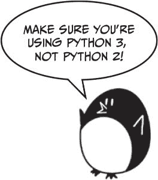

# 四、笑话程序

> 原文：[`inventwithpython.com/invent4thed/chapter4.html`](https://inventwithpython.com/invent4thed/chapter4.html)
> 
> 译者：[飞龙](https://github.com/wizardforcel)
> 
> 协议：[CC BY-NC-SA 4.0](https://creativecommons.org/licenses/by-nc-sa/4.0/)

本章的程序向用户讲述了一些笑话，并演示了更高级的使用字符串与`print()`函数的方法。本书中的大多数游戏都将使用简单的文本进行输入和输出。输入是用户在键盘上输入的文本，输出是显示在屏幕上的文本。

**本章涵盖的主题**

+   转义字符

+   使用单引号和双引号表示字符串

+   使用`print()`的`end`关键字参数来跳过换行

你已经学会了如何使用`print()`函数显示简单的文本输出。现在让我们更深入地了解 Python 中字符串和`print()`的工作原理。

### 笑话示例运行

当用户运行笑话程序时，他们看到的是这样的：

```py
What do you get when you cross a snowman with a vampire?
Frostbite!

What do dentists call an astronaut's cavity?
A black hole!

Knock knock.
Who's there?
Interrupting cow.
Interrupting cow wh-MOO!
```

### 笑话的源代码

通过点击**文件****新建窗口**，打开一个新的文件编辑器窗口。在出现的空白窗口中，输入源代码并将其保存为*jokes.py*。然后按 F5 运行程序。



如果输入这段代码后出现错误，请使用在线 diff 工具将你输入的代码与书中的代码进行比较，网址为[`www.nostarch.com/inventwithpython#diff`](https://www.nostarch.com/inventwithpython#diff)。

`jokes.py`

```py
print('What do you get when you cross a snowman with a vampire?')
input()
print('Frostbite!')
print()
print('What do dentists call an astronaut\'s cavity?')
input()
print('A black hole!')
print()
print('Knock knock.')
input()
print("Who's there?")
input()
print('Interrupting cow.')
input()
print('Interrupting cow wh', end='')
print('-MOO!')
```

### 代码的工作原理

让我们先看一下代码的前四行：

```py
print('What do you get when you cross a snowman with a vampire?')
input()
print('Frostbite!')
print()
```

第 1 行和第 3 行使用`print()`函数调用来询问并给出第一个笑话的答案。你不希望用户立即看到笑话的结尾，所以在第一个`print()`后有一个对`input()`函数的调用。用户会看到笑话，按 ENTER 键，然后看到结尾。

用户仍然可以输入一个字符串并按 ENTER 键，但是这个返回的字符串并没有被存储在任何变量中。程序会忘记它并移到下一行代码。

最后一个`print()`函数调用没有字符串参数。这告诉程序只打印一个空行。空行有助于保持文本不显得拥挤。

### 转义字符

第 5 到 8 行打印了下一个笑话的问题和答案：

```py
print('What do dentists call an astronaut\'s cavity?')
input()
print('A black hole!')
print()
```

在第 5 行，单引号前面有一个反斜杠：`\'`。（请注意，`\`是反斜杠，`/`是正斜杠。）这个反斜杠告诉你它后面的字母是一个转义字符。*转义字符*允许你打印出在源代码中难以或不可能输入的特殊字符，比如以单引号开头和结尾的字符串值中的单引号。

在这种情况下，如果我们不包括反斜杠，`astronaut\'s`中的单引号会被解释为字符串的结束。但是这个引号需要*作为*字符串的一部分。转义的单引号告诉 Python 应该将单引号包含在字符串中。

但是如果你真的想显示一个反斜杠呢？

从你的*jokes.py*程序切换到交互式 shell，并输入这个`print()`语句：

```py
>>> print('They flew away in a green\teal helicopter.')
They flew away in a green    eal helicopter.
```

这条指令没有打印出反斜杠，因为`teal`中的`t`被解释为转义字符，因为它在反斜杠后面。`\t`模拟了在键盘上按下 TAB 键。

这行代码将给出正确的输出：

```py
>>> print('They flew away in a green\\teal helicopter.')
They flew away in a green\teal helicopter.
```

这样`\\`就是一个反斜杠字符，而没有`\t`被解释为 TAB。

表 4-1 是 Python 中一些转义字符的列表，包括`\n`，这是换行转义字符，你之前用过。

**表 4-1：**转义字符

| **转义字符** | **实际打印的内容** |
| --- | --- |
| `\\` | 反斜杠（`\`）|
| `\'` | 单引号（`'`）|
| `\"` | 双引号（`"`）|
| `\n` | 换行 |
| `\t` | 制表符 |

Python 中还有一些其他转义字符，但这些字符是你创建游戏时最有可能需要的字符。

### 单引号和双引号

当我们还在交互式 shell 中时，让我们更仔细地看一下引号。在 Python 中，字符串并不总是要用单引号括起来的。你也可以用双引号括起来。这两行打印的是相同的内容：

```py
>>> print('Hello world')
Hello world
>>> print("Hello world")
Hello world
```

但你不能混合使用引号。这行会报错，因为它同时使用了两种引号类型：

```py
>>> print('Hello world")
SyntaxError: EOL while scanning single-quoted string
```

我喜欢使用单引号，这样就不必按住 SHIFT 键来输入它们。它们更容易输入，而 Python 也无所谓。

另外，请注意，就像你需要在单引号括起的字符串中使用`\'`来表示单引号一样，你需要在双引号括起的字符串中使用`\"`来表示双引号。看这个例子：

```py
>>> print('I asked to borrow Abe\'s car for a week. He said, "Sure."')
I asked to borrow Abe's car for a week. He said, "Sure."
```

你使用单引号来括起字符串，因此你需要在`Abe\'s`的单引号前添加反斜杠。但`"Sure."`中的双引号不需要反斜杠。Python 解释器足够聪明，知道如果一个字符串以一种引号开始，另一种引号并不意味着字符串结束。

现在看另一个例子：

```py
>>> print("She said, \"I can't believe you let them borrow your car.\"")
She said, "I can't believe you let them borrow your car."
```

字符串用双引号括起来，因此你需要为字符串中的所有双引号添加反斜杠。在`can't`中不需要转义单引号。

总之，在单引号字符串中，你不需要转义双引号，但需要转义单引号；在双引号字符串中，你不需要转义单引号，但需要转义双引号。

### print()函数的 end 关键字参数

现在让我们回到*jokes.py*，看一下第 9 到 16 行：

```py
print('Knock knock.')
input()
print("Who's there?")
input()
print('Interrupting cow.')
input()
print('Interrupting cow wh', end='')
print('-MOO!')
```

你注意到了第 15 行`print()`函数的第二个参数吗？通常，`print()`会在打印的字符串末尾添加一个换行符。这就是为什么空的`print()`函数会打印一个换行符。但`print()`可以选择性地有第二个参数：`end`。

记住，参数是函数调用中传递的值。传递给`print()`的空字符串称为*关键字参数*。`end=''`中的`end`称为*关键字参数*。要将关键字参数传递给这个关键字参数，你必须在它之前输入`end=`。

当我们运行这部分代码时，输出是

```py
Knock knock.
Who's there?
Interrupting cow.
Interrupting cow wh-MOO!
```

因为我们将空字符串传递给了`end`参数，`print()`函数会添加一个空字符串而不是添加一个换行符。这就是为什么`'-MOO!'`出现在前一行的旁边，而不是在自己的一行上。在打印`'Interrupting cow wh'`字符串后没有换行符。

### 总结

本章探讨了使用`print()`函数的不同方式。转义字符用于在代码中使用键盘难以输入的字符。如果你想在字符串中使用特殊字符，你必须使用反斜杠转义字符`\`，后面跟着另一个字母表示特殊字符。例如，`\n`表示换行。如果你的特殊字符是反斜杠本身，你使用`\\`。

`print()`函数会自动在字符串末尾添加一个换行符。大多数情况下，这是一个方便的快捷方式。但有时你不想要换行符。要更改这一点，你可以将空字符串作为`print()`的`end`关键字参数的关键字参数传递。例如，要在屏幕上打印`spam`而不带换行符，你可以调用`print('spam', end='')`。
