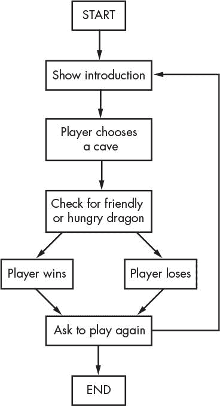
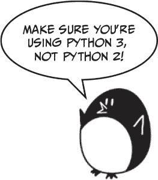
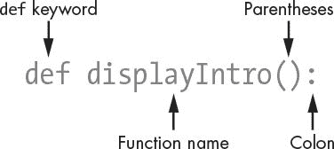
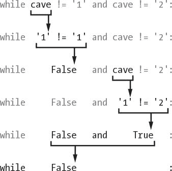

# 五、龙之境

> 原文：[`inventwithpython.com/invent4thed/chapter5.html`](https://inventwithpython.com/invent4thed/chapter5.html)
> 
> 译者：[飞龙](https://github.com/wizardforcel)
> 
> 协议：[CC BY-NC-SA 4.0](https://creativecommons.org/licenses/by-nc-sa/4.0/)


本章中您将创建的游戏名为龙之境。玩家需要在两个洞穴之间做出选择，这两个洞穴分别藏有宝藏和一定的厄运。

### 如何玩龙之境

在这个游戏中，玩家身处一个充满龙的土地。这些龙都住在洞穴里，洞穴里堆满了它们收集的宝藏。一些龙是友好的，会分享它们的宝藏。其他龙是饥饿的，会吃掉进入它们洞穴的任何人。玩家走近两个洞穴，一个有友好的龙，另一个有饥饿的龙，但不知道哪个洞穴里有哪种龙。玩家必须在两者之间做出选择。

**本章涵盖的主题**

+   流程图

+   使用`def`关键字创建您自己的函数

+   多行字符串

+   `while`语句

+   `and`、`or`和`not`布尔运算符

+   真值表

+   `return` 关键字

+   全局和局部变量范围

+   参数和参数

+   `sleep()`函数

### 龙之境的示例运行

当运行 Dragon Realm 游戏时，游戏看起来是这样的。玩家的输入是用粗体标出的。

```py
You are in a land full of dragons. In front of you,
you see two caves. In one cave, the dragon is friendly
and will share his treasure with you. The other dragon
is greedy and hungry, and will eat you on sight.
Which cave will you go into? (1 or 2)
1
You approach the cave...
It is dark and spooky...
A large dragon jumps out in front of you! He opens his jaws and...
Gobbles you down in one bite!
Do you want to play again? (yes or no)
no
```

### 龙之境的流程图

在开始编写代码之前，将您的游戏或程序需要做的一切都写下来通常会有所帮助。这样做时，您正在*设计程序*。

例如，绘制一个流程图可能会有所帮助。*流程图*是一种图表，显示了游戏中可能发生的每一个动作以及这些动作是如何连接的。图 5-1 是龙之境的流程图。

要查看游戏中发生的情况，请将手指放在“开始”框上。然后从该框中的一个箭头指向另一个框。您的手指就像程序执行一样。当您的手指落在“结束”框上时，程序终止。



*图 5-1：龙之境游戏的流程图*

当您到达“检查友好或饥饿的龙”框时，您可以进入“玩家获胜”框或“玩家失败”框。在这个分支点上，程序可以朝不同的方向发展。无论如何，这两条路径最终都会到达“询问是否再玩一次”框。

### 龙之境的源代码

通过点击**文件****新建窗口**打开一个新的文件编辑窗口。输入源代码并将其保存为*dragon.py*。然后按 F5 运行程序。如果出现错误，请使用在线 diff 工具比较您输入的代码与书中的代码，网址为[`www.nostarch.com/inventwithpython#diff`](https://www.nostarch.com/inventwithpython#diff)。



`dragon.py`

```py
import random
import time

def displayIntro():
    print('''You are in a land full of dragons. In front of you,
you see two caves. In one cave, the dragon is friendly
and will share his treasure with you. The other dragon
is greedy and hungry, and will eat you on sight.''')
    print()

def chooseCave():
    cave = ''
    while cave != '1' and cave != '2':
        print('Which cave will you go into? (1 or 2)')
        cave = input()

    return cave

def checkCave(chosenCave):
    print('You approach the cave...')
    time.sleep(2)
    print('It is dark and spooky...')
    time.sleep(2)
    print('A large dragon jumps out in front of you! He opens his jaws
          and...')
    print()
    time.sleep(2)

    friendlyCave = random.randint(1, 2)

    if chosenCave == str(friendlyCave):
        print('Gives you his treasure!')
    else:
        print('Gobbles you down in one bite!')

playAgain = 'yes'
while playAgain == 'yes' or playAgain == 'y':
    displayIntro()
    caveNumber = chooseCave()
    checkCave(caveNumber)

    print('Do you want to play again? (yes or no)')
    playAgain = input()
```

让我们更详细地看一下源代码。

### 导入 random 和 time 模块

该程序导入了两个模块：

```py
import random
import time
```

`random`模块提供了`randint()`函数，我们在第 3 章的猜数字游戏中使用了这个函数。第 2 行导入了`time`模块，其中包含与时间相关的函数。

### 龙之境中的函数

函数让您可以多次运行相同的代码，而无需一遍又一遍地复制和粘贴该代码。相反，您将该代码放在一个函数中，并在需要时调用该函数。因为您只需在函数中编写一次代码，所以如果函数的代码出现错误，您只需在程序中的一个地方进行更改。

您已经使用了一些函数，比如`print()`、`input()`、`randint()`、`str()`和`int()`。您的程序已经调用这些函数来执行其中的代码。在 Dragon Realm 游戏中，您将使用`def`语句编写自己的函数。

#### def 语句

第 4 行是一个`def`语句：

```py
def displayIntro():
    print('''You are in a land full of dragons. In front of you,
you see two caves. In one cave, the dragon is friendly
and will share his treasure with you. The other dragon
is greedy and hungry, and will eat you on sight.''')
    print()
```

`def`语句定义了一个新的函数（在这种情况下是`displayIntro()`函数），你可以在程序的其他地方调用它。

图 5-2 显示了`def`语句的部分。它有`def`关键字，后面跟着一个带括号的函数名，然后是一个冒号(`:`)。`def`语句之后的块称为`def`块。



*图 5-2：* def *语句的部分*

#### 调用函数

当你*定义*一个函数时，你在接下来的块中指定它运行的指令。当你*调用*一个函数时，`def`块中的代码会执行。除非你调用这个函数，`def`块中的指令不会执行。

换句话说，当执行到`def`语句时，它会跳到`def`块之后的第一行。但是当一个函数被调用时，执行会移动到函数内部的`def`块的第一行。

例如，看看第 37 行对`displayIntro()`函数的调用：

```py
    displayIntro()
```

调用这个函数会运行`print()`调用，显示“你现在处于一个充满龙的土地...”的介绍。

#### 放置函数定义的位置

函数的`def`语句和`def`块必须在调用函数之前，就像在使用变量之前必须为变量赋值一样。如果你把函数调用放在函数定义之前，你会得到一个错误。让我们看一个短程序作为例子。打开一个新的文件编辑窗口，输入这段代码，保存为*example.py*，然后运行它：

```py
sayGoodbye()

def sayGoodbye():
    print('Goodbye!')
```

如果你尝试运行这个程序，Python 会给你一个错误消息，看起来像这样：

```py
Traceback (most recent call last):
  File "C:/Users/Al/AppData/Local/Programs/Python/Python36/example.py",
    line 1, in <module>
    sayGoodbye()
NameError: name 'sayGoodbye' is not defined
```

要修复这个错误，把函数定义移到函数调用之前。

```py
def sayGoodbye():
    print('Goodbye!')

sayGoodbye()
```

现在，函数在被调用之前被定义，所以 Python 会知道`sayGoodbye()`应该做什么。否则，当它被调用时，Python 不会有`sayGoodbye()`的指令，因此无法运行它。

### 多行字符串

到目前为止，我们在`print()`函数调用中的所有字符串都在一行上，并且在开头和结尾都有一个引号字符。然而，如果你在字符串的开头和结尾使用三个引号，它可以跨越多行。这就是*多行字符串*。

输入以下内容到交互式 shell 中，看看多行字符串是如何工作的：

```py
>>> fizz = '''Dear Alice,
I will return to Carol's house at the end of the month.
Your friend,
Bob'''
>>> print(fizz)
Dear Alice,
I will return to Carol's house at the end of the month.
Your friend,
Bob
```

注意打印字符串中的换行符。在多行字符串中，换行符被包含在字符串中。只要不连续使用三个引号，你就不必使用`\n`转义字符或转义引号。这些换行符使得在涉及大量文本时代码更容易阅读。

### 如何使用 while 语句循环

第 11 行定义了另一个名为`chooseCave()`的函数：

```py
def chooseCave():
```

这个函数的代码询问玩家想要进入哪个洞穴，要么是`1`要么是`2`。我们需要使用`while`语句来询问玩家选择洞穴，这标志着一个新类型的循环的开始：`while`循环。

不像`for`循环会循环特定次数，`while`循环会重复直到某个条件为`True`。当执行到`while`语句时，它会评估`while`关键字旁边的条件。如果条件求值为`True`，执行会移动到接下来的块，称为`while`块。如果条件求值为`False`，执行会跳过`while`块。

你可以把`while`语句看作几乎和`if`语句一样。如果它们的条件为`True`，程序执行会进入这两个语句的块。但是当`while`循环的条件到达块的末尾时，它会回到`while`语句重新检查条件。

看看`chooseCave()`的`def`块，看看`while`循环是如何工作的：

```py
    cave = ''
    while cave != '1' and cave != '2':
```

第 12 行创建了一个名为`cave`的新变量，并在其中存储了一个空字符串。然后在第 13 行开始了一个`while`循环。`chooseCave()`函数需要确保玩家输入了`1`或`2`而不是其他内容。在这里的循环中，一直询问玩家选择哪个洞，直到他们输入了这两个有效的回答之一。这被称为*输入验证*。

条件中还包含了一个你以前没有见过的新运算符：`and`。就像`-`和`*`是数学运算符，`==`和`!=`是比较运算符一样，`and`运算符是布尔运算符。让我们更仔细地看看布尔运算符。

### 布尔运算符

布尔逻辑处理的是真或假的事物。布尔运算符比较值并求值为单个布尔值。

想象一下这句话：“猫有胡须，狗有尾巴。”“猫有胡须”是真的，“狗有尾巴”也是真的，所以整个句子“猫有胡须*和*狗有尾巴”是真的。

但是句子“猫有胡须，狗有翅膀”就是假的。尽管“猫有胡须”是真的，狗没有翅膀，所以“狗有翅膀”是假的。在布尔逻辑中，事物只能是完全真或完全假。因为有*and*这个词，整个句子只有*两个*部分都是真的时才是真的。如果一个或两个部分是假的，那么整个句子就是假的。

#### and 运算符

Python 中的`and`运算符也需要整个布尔表达式为`True`或`False`。如果`and`关键字两侧的布尔值都为`True`，那么表达式求值为`True`。如果两侧的布尔值中有一个或两个为`False`，那么表达式求值为`False`。

在交互式 shell 中输入以下带有`and`运算符的表达式：

```py
>>> True and True
True
>>> True and False
False
>>> False and True
False
>>> False and False
False
>>> spam = 'Hello'
>>> 10 < 20 and spam == 'Hello'
True
```

`and`运算符可以用来评估任何两个布尔表达式。在最后一个例子中，`10 < 20`求值为`True`，`spam == 'Hello'`也求值为`True`，所以被`and`运算符连接的两个布尔表达式求值为`True`。

如果你忘记了布尔运算符的工作原理，你可以查看它的*真值表*，它显示了每种布尔值组合的评估方式。表 5-1 显示了`and`运算符的每种组合。

**表 5-1：** and 运算符的真值表

| **A** `and` **B** | **求值为** |
| --- | --- |
| `True and True` | `True` |
| `True and False` | `False` |
| `False and True` | `False` |
| `False and False` | `False` |

#### or 运算符

`or`运算符类似于`and`运算符，只是如果两个布尔值中*任一个*为`True`，它就求值为`True`。`or`运算符求值为`False`的唯一情况是如果两个布尔值都为`False`。

现在在交互式 shell 中输入以下内容：

```py
>>> True or True
True
>>> True or False
True
>>> False or True
True
>>> False or False
False
>>> 10 > 20 or 20 > 10
True
```

在最后一个例子中，`10`不大于`20`，但`20`大于`10`，所以第一个表达式求值为`False`，第二个表达式求值为`True`。因为第二个表达式是`True`，所以整个表达式求值为`True`。

`or`运算符的真值表显示在表 5-2 中。

**表 5-2：** or 运算符的真值表

| **A** `or` **B** | **求值为** |
| --- | --- |
| `True or True` | `True` |
| `True or False` | `True` |
| `False or True` | `True` |
| `False or False` | `False` |

#### not 运算符

而不是结合两个值，`not`运算符只作用于一个值。`not`运算符的结果是相反的布尔值：`True`表达式求值为`False`，`False`表达式求值为`True`。

在交互式 shell 中输入以下内容：

```py
>>> not True
False
>>> not False
True
>>> not ('black' == 'white')
True
```

`not`运算符也可以用于任何布尔表达式。在最后一个例子中，表达式`'black' == 'white'`求值为`False`。这就是为什么`not ('black' == 'white')`是`True`。

`not`运算符的真值表显示在表 5-3 中。

**表 5-3：** not 运算符的真值表

| `not` **A** | **求值为** |
| --- | --- |
| `not True` | `False` |
| `not False` | `True` |

#### 评估布尔运算符

再次看一下 Dragon Realm 游戏的第 13 行：

```py
    while cave != '1' and cave != '2':
```

条件由`and`布尔运算符连接的两部分。只有当两部分都为`True`时，条件才为`True`。

第一次检查`while`语句的条件时，`cave`被设置为空字符串`''`。空字符串不等于字符串`'1'`，所以左侧求值为`True`。空字符串也不等于字符串`'2'`，所以右侧求值为`True`。

因此条件变成了`True and True`。因为两个值都为`True`，整个条件求值为`True`，所以程序执行进入`while`块，程序将尝试为`cave`分配一个非空值。

第 14 行要求玩家选择一个洞穴：

```py
    while cave != '1' and cave != '2':
        print('Which cave will you go into? (1 or 2)')
        cave = input()
```

第 15 行让玩家输入他们的响应并按 ENTER 键。这个响应存储在`cave`中。执行此代码后，执行将循环回到`while`语句的顶部，并重新检查第 13 行的条件。

如果玩家输入了`1`或`2`，那么`cave`将是`'1'`或`'2'`（因为`input()`始终返回字符串）。这使得条件为`False`，程序执行将继续执行`while`循环之后的代码。例如，如果用户输入了`'1'`，那么评估将如下所示：



但如果玩家输入了`3`或`4`或`HELLO`，那么该响应将是无效的。条件将为`True`，并进入`while`块再次询问玩家。程序会一直询问玩家选择哪个洞穴，直到他们输入`1`或`2`为止。这确保一旦执行继续，`cave`变量包含有效的响应。

### 返回值

第 17 行有一个新的`return`语句：

```py
    return cave
```

`return`语句只出现在`def`块内，其中定义了一个函数——在本例中是`chooseCave()`。记得`input()`函数返回玩家输入的字符串值吗？`chooseCave()`函数也会返回一个值。第 17 行返回存储在`cave`中的字符串，要么是`'1'`，要么是`'2'`。

一旦`return`语句执行，程序执行立即跳出`def`块（就像`break`语句使执行跳出`while`块一样）。程序执行将返回到具有函数调用的行。函数调用本身将求值为函数的返回值。

请跳到第 38 行，`chooseCave()`函数被调用的地方：

```py
    caveNumber = chooseCave()
```

在第 38 行，当程序调用`chooseCave()`函数时，该函数在第 11 行定义，函数调用会评估`cave`中的字符串，然后存储在`caveNumber`中。`chooseCave()`内的`while`循环确保`chooseCave()`只会返回`'1'`或`'2'`作为其返回值。因此`caveNumber`只能有这两个值中的一个。

### 全局作用域和局部作用域

有一些特殊的变量是在函数内创建的，比如第 12 行的`chooseCave()`函数中的`cave`变量：

```py
    cave = ''
```

每当调用函数时，都会创建一个*局部作用域*。在该函数中分配的任何变量都存在于局部作用域中。将作用域视为变量的容器。局部作用域中的变量之所以特殊，是因为它们在函数返回时被遗忘，并且如果再次调用函数，它们将被重新创建。局部变量的值在函数调用之间不会被记住。

在函数外分配的变量存在于*全局作用域*中。全局作用域只有一个，在程序开始时创建。当程序终止时，全局作用域被销毁，其中的所有变量都被遗忘。否则，下次运行程序时，变量将记住上次运行时的值。

本地范围存在的变量称为*本地变量*，而全局范围存在的变量称为*全局变量*。变量必须是其中之一；它不能既是本地的又是全局的。

变量`cave`是在`chooseCave()`函数内创建的。这意味着它是在`chooseCave()`函数的本地范围内创建的。当`chooseCave()`返回时，它将被遗忘，并且如果第二次调用`chooseCave()`，它将被重新创建。

本地和全局变量可以具有相同的名称，但它们是不同的变量，因为它们在不同的范围内。让我们编写一个新程序来说明这些概念：

```py
   def bacon():
➊     spam = 99      # Creates a local variable named spam
➋     print(spam)    # Prints 99

➌ spam = 42      # Creates a global variable named spam
➍ print(spam)    # Prints 42
➎ bacon()        # Calls the bacon() function and prints 99
➏ print(spam)    # Prints 42
```

我们首先创建一个名为`bacon()`的函数。在`bacon()`中，我们创建一个名为`spam`的变量，并将其赋值为`99` ➊。在 ➋，我们调用`print()`来打印这个本地的`spam`变量，它是`99`。在 ➌，还声明了一个名为`spam`的全局变量，并将其设置为`42`。这个变量是全局的，因为它在所有函数之外。当全局`spam`变量传递给`print()`时，在 ➍，它打印`42`。当在 ➎调用`bacon()`函数时，➊和 ➋被执行，并且本地的`spam`变量被创建，设置，然后打印。因此调用`bacon()`会打印值`99`。在`bacon()`函数调用返回后，本地的`spam`变量被遗忘。如果我们在 ➏打印`spam`，我们正在打印全局变量，因此输出为`42`。

运行时，此代码将输出以下内容：

```py
42
99
42
```

变量的创建位置决定了它所在的范围。在编写程序时，请记住这一点。

### 函数参数

Dragon Realm 程序中定义的下一个函数名为`checkCave()`。

```py
def checkCave(chosenCave):
```

请注意括号之间的文本`chosenCave`。这是一个*参数*：函数代码使用的本地变量。当调用函数时，调用的参数是分配给参数的值。

让我们回到交互式 shell 片刻。请记住，对于某些函数调用，如`str()`或`randint()`，您需要在括号之间传递一个或多个参数：

```py
>>> str(5)
'5'
>>> random.randint(1, 20)
14
>>> len('Hello')
5
```

此示例包括一个您尚未见过的 Python 函数：`len()`。`len()`函数返回一个整数，指示传递给它的字符串中有多少个字符。在这种情况下，它告诉我们字符串`'Hello'`有`5`个字符。

当调用`checkCave()`时，您还将传递一个参数。此参数存储在名为`chosenCave`的新变量中，该变量是`checkCave()`的参数。

以下是一个演示如何定义带有参数（`name`）的函数（`sayHello`）的简短程序：

```py
def sayHello(name):
    print('Hello, ' + name + '. Your name has ' + str(len(name)) +
      ' letters.')
sayHello('Alice')
sayHello('Bob')
spam = 'Carol'
sayHello(spam)
```

当您在括号中调用`sayHello()`并传递参数时，参数被分配给`name`参数，并执行函数中的代码。`sayHello()`函数中只有一行代码，即`print()`函数调用。在`print()`函数调用中有一些字符串和`name`变量，以及对`len()`函数的调用。在这里，`len()`用于计算`name`中的字符数。如果运行程序，输出如下：

```py
Hello, Alice. Your name has 5 letters.
Hello, Bob. Your name has 3 letters.
Hello, Carol. Your name has 5 letters.
```

对于每次调用`sayHello()`，都会打印问候语和`name`参数的长度。请注意，因为字符串`'Carol'`赋给了`spam`变量，`sayHello(spam)`等同于`sayHello('Carol')`。

### 显示游戏结果

让我们回到 Dragon Realm 游戏的源代码：

```py
    print('You approach the cave...')
    time.sleep(2)
```

`time`模块有一个名为`sleep()`的函数，可以暂停程序。第 21 行传递整数值`2`，以便`time.sleep()`将程序暂停 2 秒。

```py
    print('It is dark and spooky...')
    time.sleep(2)
```

在这里，代码打印了一些文本，并等待另外 2 秒。这些短暂的暂停增加了游戏的悬念，而不是一次性显示所有文本。在第 4 章的笑话程序中，您调用`input()`函数以暂停，直到玩家按下 ENTER 键。在这里，玩家除了等待几秒钟外，不必做任何事情。

```py
    print('A large dragon jumps out in front of you! He opens his jaws
          and...')
    print()
    time.sleep(2)
```

悬念逐渐增加，我们的程序接下来将确定哪个洞穴有友好的龙。

### 决定哪个洞穴有友好的龙

第 28 行调用`randint()`函数，它将随机返回`1`或`2`。

```py
    friendlyCave = random.randint(1, 2)
```

这个整数值存储在`friendlyCave`中，并指示拥有友好龙的洞穴。

```py
    if chosenCave == str(friendlyCave):
        print('Gives you his treasure!')
```

第 30 行检查玩家在`chosenCave`变量中选择的洞穴（`'1'`或`'2'`）是否等于友好的龙洞穴。

但`friendlyCave`中的值是一个整数，因为`randint()`返回整数。你不能用`==`符号比较字符串和整数，因为它们永远不会相等：`'1'`不等于`1`，`'2'`不等于`2`。

所以`friendlyCave`传递给`str()`函数，它返回`friendlyCave`的字符串值。现在值将具有相同的数据类型，并且可以有意义地相互比较。我们也可以将`chosenCave`转换为整数值。然后第 30 行将如下所示：

```py
    if int(chosenCave) == friendlyCave:
```

如果`chosenCave`等于`friendlyCave`，条件求值为`True`，第 31 行告诉玩家他们赢得了宝藏。

现在我们必须添加一些代码来运行，如果条件为假。第 32 行是一个`else`语句：

```py
    else:
        print('Gobbles you down in one bite!')
```

`else`语句只能在`if`块之后出现。如果`if`语句的条件为`False`，则`else`块执行。可以将其视为程序的一种方式，即“如果此条件为真，则执行`if`块，否则执行`else`块”。

在这种情况下，当`chosenCave`不等于`friendlyCave`时，`else`语句运行。然后，运行第 33 行的`print()`函数调用，告诉玩家他们被龙吃掉了。

### 游戏循环

程序的第一部分定义了几个函数，但没有运行它们内部的代码。第 35 行是程序的主要部分开始的地方，因为它是第一行运行的地方：

```py
playAgain = 'yes'
while playAgain == 'yes' or playAgain == 'y':
```

这一行是程序的主要部分开始的地方。之前的`def`语句只是定义了函数。它们没有运行这些函数内部的代码。

第 35 和 36 行设置了一个包含游戏其余代码的循环。在游戏结束时，玩家可以告诉程序他们是否想再玩一次。如果是，执行进入`while`循环，再次运行整个游戏。如果不是，`while`语句的条件将为`False`，执行将移动到程序的末尾并终止。

第一次执行到这个`while`语句时，第 35 行刚刚将'yes'赋给了`playAgain`变量。这意味着在程序开始时条件将为`True`。这保证了执行至少进入循环一次。

#### 调用程序中的函数

第 37 行调用`displayIntro()`函数：

```py
    displayIntro()
```

这不是一个 Python 函数——它是你在第 4 行之前定义的函数。当调用此函数时，程序执行跳转到第 5 行的`displayIntro()`函数的第一行。当函数中的所有行都被执行后，执行跳回到第 37 行并继续向下移动。

第 38 行还调用了一个你定义的函数：

```py
    caveNumber = chooseCave()
```

记住`chooseCave()`函数允许玩家选择他们想要进入的洞穴。当第 17 行的`return cave`执行时，程序执行跳回到第 38 行。`chooseCave()`调用然后评估返回值，这将是一个整数值，代表玩家选择进入的洞穴。这个返回值存储在一个名为`caveNumber`的新变量中。

然后程序执行继续到第 39 行：

```py
    checkCave(caveNumber)
```

第 39 行调用`checkCave()`函数，将`caveNumber`中的值作为参数传递。执行不仅跳转到第 20 行，而且`caveNumber`中的值被复制到`checkCave()`函数内的参数`chosenCave`中。这是根据玩家选择进入的洞穴显示`'给你他的宝藏！'`或`'一口吞下你！'`的函数。

#### 询问玩家是否再玩一次

无论玩家赢还是输，都会被问是否要再玩一次。

```py
    print('Do you want to play again? (yes or no)')
    playAgain = input()
```

变量`playAgain`存储玩家输入的内容。第 42 行是`while`块的最后一行，因此程序跳回到第 36 行检查`while`循环的条件：`playAgain == 'yes' or playAgain == 'y'`。

如果玩家输入字符串`'yes'`或`'y'`，则执行将再次进入 37 行的循环。

如果玩家输入`'no'`或`'n'`或类似`'亚伯拉罕·林肯'`的愚蠢字符串，则条件为`False`，程序执行将继续到`while`块后的行。但由于`while`块后没有任何行，程序将终止。

需要注意的一件事：字符串`'YES'`不等于字符串`'yes'`，因为计算机不认为大小写字母是相同的。如果玩家输入字符串`'YES'`，那么`while`语句的条件将求值为`False`，程序仍将终止。稍后，飞行棋程序将向您展示如何避免这个问题。（见“`lower()`和`upper()`字符串方法”在第 101 页。）

您刚刚完成了第二个游戏！在龙之境中，您使用了许多在猜数字游戏中学到的知识，并学会了一些新技巧。如果您对这个程序中的一些概念不理解，请再次查看源代码的每一行，并尝试更改代码以查看程序的变化。

在第 6 章中，您不会创建另一个游戏。相反，您将学习如何使用 IDLE 的一个特性，称为*调试器*。

### 总结

在龙之境游戏中，您创建了自己的函数。函数是程序中的迷你程序。函数内部的代码在调用函数时运行。通过将代码分解为函数，您可以将代码组织成更短、更易于理解的部分。

参数是在函数调用时复制到函数参数中的值。函数调用本身会求值为返回值。

您还学习了变量作用域。在函数内创建的变量存在于局部作用域中，而在所有函数之外创建的变量存在于全局作用域中。全局作用域中的代码无法使用局部变量。如果局部变量与全局变量同名，Python 会将其视为单独的变量。将新值赋给局部变量不会改变全局变量的值。

变量作用域可能看起来很复杂，但对于将函数组织为程序其余部分的独立代码块非常有用。因为每个函数都有自己的局部作用域，所以您可以确保一个函数中的代码不会导致其他函数中的错误。

几乎每个程序都有函数，因为它们非常有用。通过理解函数的工作原理，您可以节省大量的输入，并使错误更容易修复。
