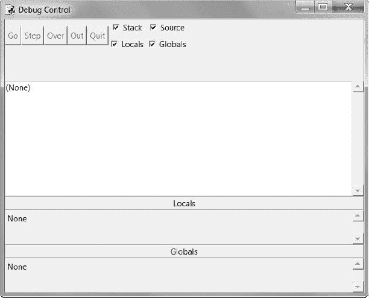
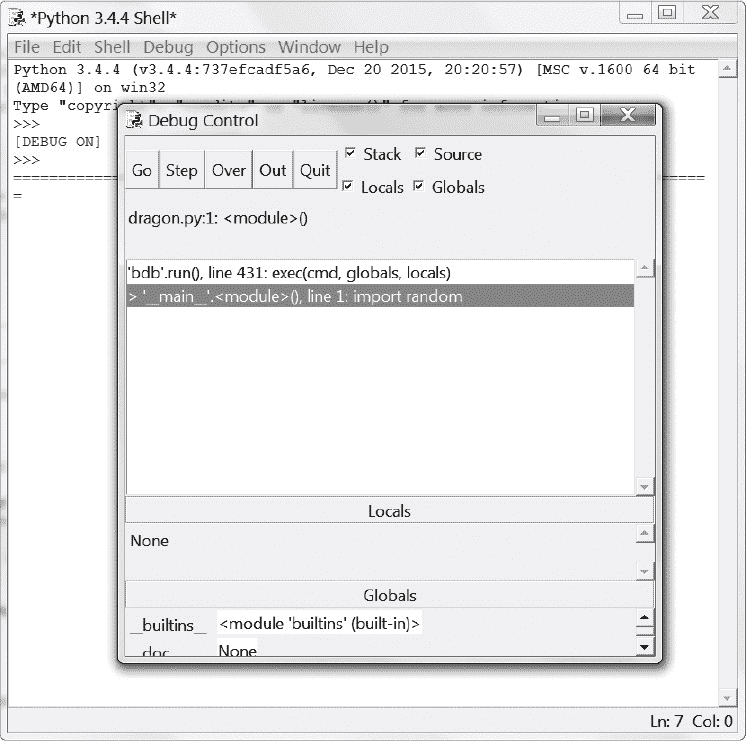
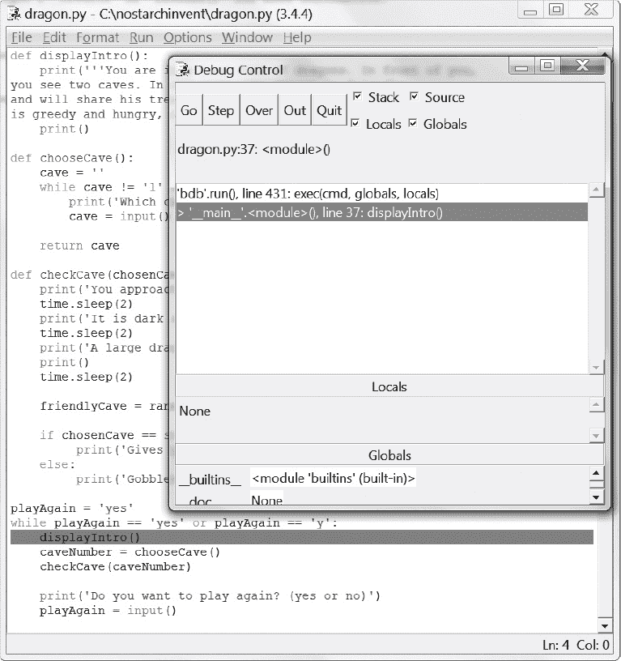
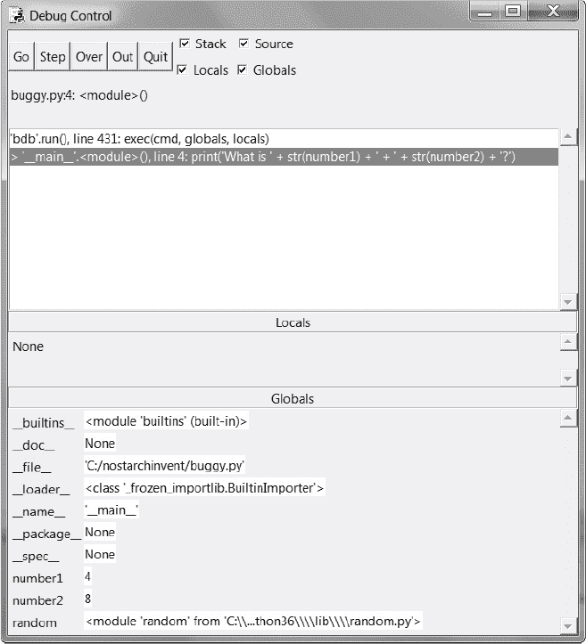
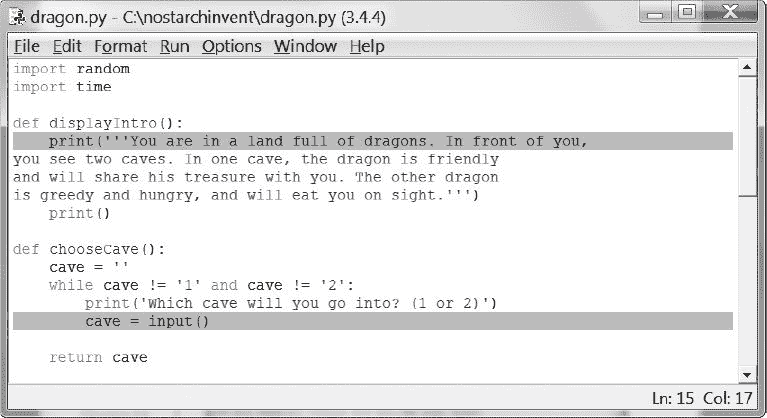
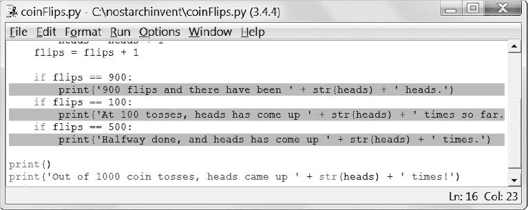

# 六、使用调试器

> 原文：[`inventwithpython.com/invent4thed/chapter6.html`](https://inventwithpython.com/invent4thed/chapter6.html)
> 
> 译者：[飞龙](https://github.com/wizardforcel)
> 
> 协议：[CC BY-NC-SA 4.0](https://creativecommons.org/licenses/by-nc-sa/4.0/)


如果你输入错误的代码，计算机就不会给你正确的程序。计算机程序总是会按照你告诉它的去做，但你告诉它的可能不是你真正*想*让它做的。这些错误是计算机程序中的*bug*。当程序员没有仔细考虑程序到底在做什么时，就会出现 bug。

**本章涵盖的主题**

+   三种类型的错误

+   IDLE 的调试器

+   Go 和 Quit 按钮

+   步入、步过和步出

+   断点

### 错误类型

你的程序可能会出现三种类型的错误：

**语法错误** 这种 bug 来自于拼写错误。当 Python 解释器遇到语法错误时，是因为你的代码没有按照正确的 Python 语言编写。即使是一个语法错误的 Python 程序也无法运行。

**运行时错误** 这些 bug 发生在程序运行时。程序会一直运行直到它到达有错误的那行代码，然后程序会以错误消息终止（这称为*崩溃*）。Python 解释器会显示一个*回溯*：显示包含问题的那行的错误消息。

**语义错误** 这些 bug 是最难修复的，它们不会使程序崩溃，但会阻止程序做程序员打算让它做的事情。例如，如果程序员希望变量`total`是变量`a`、`b`和`c`中值的*和*，但写成了`total = a * b * c`，那么`total`中的值就是错误的。这可能会在程序后面导致程序崩溃，但是语义 bug 发生的地方可能不会立即显而易见。

发现程序中的 bug 可能很困难，甚至你可能都没有注意到它们！运行程序时，你可能会发现有时函数没有在应该调用它们的时候被调用，或者可能调用了太多次。你可能会错误地编写`while`循环的条件，导致它循环的次数不对。你可能会写一个永远不会退出的循环，这种语义错误称为*无限循环*。要停止陷入无限循环的程序，你可以在交互式 shell 中按下 CTRL-C。

实际上，通过在交互式 shell 中输入以下代码来创建一个无限循环（记得按两次 ENTER 来让交互式 shell 知道你已经输入完`while`块）：

```py
>>> while True:
        print('Press Ctrl-C to stop this infinite loop!!!')
```

现在按住 CTRL-C 来停止程序。交互式 shell 会显示如下内容：

```py
Press Ctrl-C to stop this infinite loop!!!
Press Ctrl-C to stop this infinite loop!!!
Press Ctrl-C to stop this infinite loop!!!
Press Ctrl-C to stop this infinite loop!!!
Press Ctrl-C to stop this infinite loop!!!
Traceback (most recent call last):
  File "<pyshell#1>", line 2, in <module>
    print('Press Ctrl-C to stop this infinite loop!!!')
  File "C:\Program Files\Python 3.5\lib\idlelib\PyShell.py", line 1347, in
write
    return self.shell.write(s, self.tags)
KeyboardInterrupt
```

`while`循环总是`True`，所以程序会一直打印同一行，直到用户停止。在这个例子中，我们按下 CTRL-C 来停止无限循环，`while`循环执行了五次后。

### 调试器

要找出 bug 的来源可能很困难，因为代码行执行得很快，变量中的值也经常变化。*调试器*是一个程序，它让你逐行步进你的代码，按照 Python 执行每条指令的顺序。调试器还会显示每一步中变量中存储的值。

#### 启动调试器

在 IDLE 中，打开你在第 5 章中制作的 Dragon Realm 游戏。打开*dragon.py*文件后，点击交互式 shell，然后点击**调试** !image](img/6213f577c15feb006bdab7161d1cfc75.png) **调试器**以显示调试控制窗口（[图 6-1）。

当调试器运行时，调试控制窗口会显示如图 6-2。确保选择**堆栈**、**本地**、**源**和**全局**复选框。

现在，当您按下 F5 运行 Dragon Realm 游戏时，IDLE 的调试器将激活。这被称为在调试器下运行程序。当您在调试器下运行 Python 程序时，程序将在执行第一条指令之前停止。如果您点击文件编辑器的标题栏（并且在调试控制窗口中选择了**源代码**复选框），第一条指令将会被用灰色突出显示。调试控制窗口显示执行位于第 1 行，即`import random`行。



*图 6-1：调试控制窗口*



*图 6-2：在调试器下运行 Dragon Realm 游戏*

#### 使用调试器逐步执行程序

调试器允许您一次执行一条指令；这个过程称为*步进*。现在通过点击调试控制窗口中的**步进**按钮来执行单个指令。Python 将执行`import random`指令，然后在执行下一条指令之前停止。调试控制窗口会显示当您点击“步进”按钮时即将执行的行，所以现在执行应该在第 2 行，即`import time`行。点击**退出**按钮暂时终止程序。

以下是在调试器下运行 Dragon Realm 时点击“步进”按钮时发生的情况的摘要。按 F5 重新开始运行 Dragon Realm，然后按照以下说明操作：

1.  点击“步进”按钮两次来运行两个`import`行。

1.  点击**步进**按钮三次来执行三个`def`语句。

1.  再次点击**步进**按钮来定义`playAgain`变量。

1.  点击**运行**来运行程序的其余部分，或点击**退出**来终止程序。

调试器跳过了第 3 行，因为它是空行。请注意，您只能使用调试器向前步进；无法后退。

##### 全局区域

调试控制窗口中的*全局区域*是显示所有全局变量的地方。请记住，全局变量是在任何函数之外创建的变量（即在全局范围内）。

在全局区域中函数名称旁边的文本看起来像`"<function checkCave at 0x012859B0>"`。模块名称旁边也有令人困惑的文本，如`"<module 'random' from 'C:\\Python31\\lib\\random.pyc'>"`。您不需要知道这些文本的含义来调试程序。只需查看函数和模块是否在全局区域中，就可以知道函数是否已定义或模块是否已导入。

您还可以忽略全局区域中的`__builtins__`、`__doc__`、`__name__`和其他类似行。 （这些是出现在每个 Python 程序中的变量。）

在 Dragon Realm 程序中，三个`def`语句，用于执行和定义函数，将出现在调试控制窗口的全局区域中。当创建`playAgain`变量时，它也将显示在全局区域中。变量名称旁边将是字符串'yes'。调试器允许您在程序运行时查看所有变量的值。这对于修复错误很有用。

##### 局部区域

除了全局区域，还有一个*局部区域*，它显示了局部范围变量及其值。当程序执行位于函数内部时，局部区域将包含变量。当执行位于全局范围时，此区域为空。

##### 运行和退出按钮

如果您厌倦了反复点击“步进”按钮，只想让程序正常运行，点击调试控制窗口顶部的“运行”按钮。这将告诉程序正常运行而不是逐步执行。

要完全终止程序，请点击调试控制窗口顶部的退出按钮。程序将立即退出。如果您必须从程序的开始处重新开始调试，这将非常有帮助。

##### 步进进入、跳过和退出

使用调试器启动 Dragon Realm 程序。保持步进直到调试器位于第 37 行。如图 6-3 所示，这是带有`displayIntro()`的行。当您再次点击 Step 时，调试器将跳转到此函数调用并出现在第 5 行，即`displayIntro()`函数中的第一行。这种步进，就是您迄今为止一直在做的，称为*步进进入*。

当执行暂停在第 5 行时，您将希望停止步进。如果再次单击 Step，调试器将进入`print()`函数。`print()`函数是 Python 的内置函数之一，因此使用调试器逐步执行它并不有用。Python 自己的函数，如`print()`、`input()`、`str()`和`randint()`，已经经过仔细检查，不会导致程序中的错误。您可以假设它们不是导致程序错误的部分。

您不希望浪费时间逐步执行`print()`函数的内部。因此，不要点击 Step 以进入`print()`函数的代码，而是点击**Over**。这将*跳过*`print()`函数内部的代码。`print()`内部的代码将以正常速度执行，然后一旦执行返回`print()`，调试器将暂停。

跳过是一种方便的方式，可以跳过函数内部的代码。现在调试器将暂停在第 38 行，`caveNumber = chooseCave()`。

再次单击**Step**以进入`chooseCave()`函数。继续逐步执行代码，直到第 15 行，即`input()`调用。程序将等待您在交互式 shell 中键入响应，就像在正常运行程序时一样。如果您现在尝试单击 Step 按钮，将不会发生任何事情，因为程序正在等待键盘响应。



*图 6-3：保持步进直到达到第 37 行。*

返回交互式 shell 并键入您想要进入的洞穴。在您键入之前，闪烁的光标必须位于交互式 shell 的底行。否则，您键入的文本将不会出现。

一旦按下 ENTER，调试器将继续逐行执行代码。

接下来，在调试控制窗口上点击**Out**按钮。这被称为*跳出*，因为它会导致调试器跳过尽可能多的行，直到执行返回所在的函数。跳出后，执行将位于调用该函数的下一行。

如果您不在一个函数内部，单击 Out 将导致调试器执行程序中的所有剩余行。这与单击 Go 按钮时发生的行为相同。

以下是每个按钮的功能概述：

**Go**正常执行剩余的代码，或者直到达到断点（参见“设置断点”第 73 页）。

**Step**执行一条指令或一步。如果该行是一个函数调用，调试器将进入该函数。

**Over**执行一条指令或一步。如果该行是一个函数调用，调试器不会*步进*进入函数，而是*跳过*该调用。

**Out**保持跳过代码行，直到调试器离开单击 Out 时所在的函数。这会*跳出*该函数。

立即终止程序。

现在我们知道如何使用调试器，让我们尝试在一些程序中查找错误。

### 查找错误

调试器可以帮助您找出程序中的错误原因。例如，这是一个带有错误的小程序。该程序为用户提供一个随机的加法问题。在交互式 shell 中，单击**文件****新建窗口**以打开一个新的文件编辑器窗口。将此程序输入到该窗口中，并将其保存为*buggy.py*。

`buggy.py`

```py
import random
number1 = random.randint(1, 10)
number2 = random.randint(1, 10)
print('What is ' + str(number1) + ' + ' + str(number2) + '?')
answer = input()
if answer == number1 + number2:
    print('Correct!')
else:
    print('Nope! The answer is ' + str(number1 + number2))
```

按照显示的程序输入程序，即使你已经知道错误在哪里。然后按 F5 运行程序。运行程序时可能会看起来像这样：

```py
What is 5 + 1?
6
Nope! The answer is 6
```

这是一个错误！程序不会崩溃，但它没有正确工作。即使输入了正确答案，程序也会说用户是错误的。

在调试器下运行程序将有助于找到错误的原因。在交互式 shell 的顶部，点击**Debug**  **Debugger**来显示调试控制窗口。（确保你已经勾选了**Stack**、**Source**、**Locals**和**Globals**复选框。）然后在文件编辑器中按 F5 运行程序。这次它将在调试器下运行。

调试器从`import random`行开始。

```py
import random
```

这里没有发生特别的事情，所以只需点击**Step**来执行它。你会看到`random`模块添加到了全局区域。

再次点击**Step**运行第 2 行：

```py
number1 = random.randint(1, 10)
```

一个新的文件编辑器窗口将出现，其中包含*random.py*文件。你已经进入了`random`模块内部的`randint()`函数。你知道 Python 的内置函数不会是你的错误的源头，所以点击**Out**来从`randint()`函数中跳出，回到你的程序。然后关闭*random.py*文件的窗口。下次，你可以点击 Over 来跳过`randint()`函数的步骤，而不是进入它。

第 3 行也是一个`randint()`函数调用：

```py
number2 = random.randint(1, 10)
```

通过点击**Over**跳过进入这段代码的步骤。

第 4 行是一个`print()`调用，用来显示随机数给玩家看：

```py
print('What is ' + str(number1) + ' + ' + str(number2) + '?')
```

你甚至在打印它们之前就知道程序将打印什么数字！只需查看调试控制窗口的全局区域。你可以看到`number1`和`number2`变量，旁边是存储在这些变量中的整数值。

`number1`变量的值为`4`，`number2`变量的值为`8`。（你的随机数可能会不同。）当你点击 Step 时，`str()`函数将连接这些整数的字符串版本，并且程序将用这些值在`print()`调用中显示字符串。当我运行调试器时，它看起来像图 6-4。

点击**Step**从第 5 行执行`input()`。

```py
answer = input()
```

调试器会等待玩家在程序中输入响应。在交互式 shell 中输入正确的答案（在我的情况下是 12）。调试器将恢复并移动到第 6 行：

```py
if answer == number1 + number2:
    print('Correct!')
```

第 6 行是一个`if`语句。条件是`answer`的值必须与`number1`和`number2`的和相匹配。如果条件为`True`，调试器将移动到第 7 行。如果条件为`False`，调试器将移动到第 9 行。点击**Step**再次找出它去哪里了。

```py
else:
    print('Nope! The answer is ' + str(number1 + number2))
```



*图 6-4：*number1 *设置为* 4*，而* number2 *设置为* 8。

现在调试器在第 9 行！发生了什么？`if`语句中的条件必须是`False`。查看`number1`、`number2`和`answer`的值。注意`number1`和`number2`是整数，所以它们的和也将是一个整数。但`answer`是一个字符串。

这意味着`answer == number1 + number2`会被计算为`'12' == 12`。一个字符串值和一个整数值永远不会相等，所以条件计算为`False`。

这就是程序中的错误：代码在应该使用`int(answer)`时使用了`answer`。将第 6 行改为`int(answer) == number1 + number2`，然后再次运行程序。

```py
What is 2 + 3?
5
Correct!
```

现在程序可以正确运行。再次运行程序，故意输入一个错误的答案。你现在已经调试了这个程序！记住，计算机会精确地按照你输入的程序来运行，即使你输入的不是你想要的。

### 设置断点

逐行浏览代码可能仍然太慢。通常你会希望程序以正常速度运行，直到达到某一行。当你希望调试器在执行到达某一行时接管控制时，你可以在该行上设置一个*断点*。如果你认为你的代码有问题，比如在第 17 行，只需在该行（或者在该行之前几行）设置一个断点。

当执行到那一行时，程序将会进入调试器。然后你可以逐行查看发生了什么。点击“Go”将会正常执行程序，直到达到另一个断点或程序结束。

在 Windows 上设置断点，右键单击文件编辑器中的行，然后从出现的菜单中选择**Set Breakpoint**。在 OS X 上，CTRL-单击以打开菜单，然后选择**Set Breakpoint**。你可以在任意行上设置断点。文件编辑器会用黄色高亮显示每个断点行。图 6-5 显示了一个断点的示例。



*图 6-5：带有两个设置断点的文件编辑器*

要删除断点，点击该行并从出现的菜单中选择**Clear Breakpoint**。

### 使用断点

接下来我们将看一个调用`random.randint(0, 1)`来模拟抛硬币的程序。如果函数返回整数`1`，那就是正面，如果返回整数`0`，那就是反面。`flips`变量将跟踪已经抛了多少次硬币。`heads`变量将跟踪有多少次是正面。

程序将进行 1000 次抛硬币。这对一个人来说需要一个多小时，但计算机可以在一秒内完成！这个程序没有 bug，但调试器可以让我们在程序运行时查看程序的状态。将以下代码输入到文件编辑器中，并保存为*coinFlips.py*。如果输入此代码后出现错误，请使用在线 diff 工具将你输入的代码与本书代码进行比较，网址为[`www.nostarch.com/inventwithpython#diff`](https://www.nostarch.com/inventwithpython#diff)。

`coinFlips.py`

```py
import random
print('I will flip a coin 1000 times. Guess how many times it will come up
      heads. (Press enter to begin)')
input()
flips = 0
heads = 0
while flips < 1000:
    if random.randint(0, 1) == 1:
        heads = heads + 1
    flips = flips + 1

    if flips == 900:
        print('900 flips and there have been ' + str(heads) + ' heads.')
    if flips == 100:
        print('At 100 tosses, heads has come up ' + str(heads) + ' times
              so far.')
    if flips == 500:
        print('Halfway done, and heads has come up ' + str(heads) +
              ' times.')

print()
print('Out of 1000 coin tosses, heads came up ' + str(heads) + ' times!')
print('Were you close?')
```

程序运行得相当快。它花费更多时间等待用户按下 ENTER 键，而不是进行抛硬币。假设你想看它一次抛一个硬币。在交互式 shell 窗口中，点击**Debug**  **Debugger**以打开调试控制窗口。然后按 F5 运行程序。

程序将在调试器中从第 1 行开始。在调试控制窗口中按三次**Step**来执行前三行（即第 1、2 和 3 行）。你会注意到按钮变为禁用状态，因为调用了`input()`，交互式 shell 正在等待用户输入。点击交互式 shell 并按 ENTER 键。（确保点击交互式 shell 文本下方；否则，IDLE 可能无法接收到你的按键输入。）

你可以点击“Step”几次，但你会发现要完整运行整个程序需要相当长的时间。相反，设置断点在第 12、14 和 16 行，这样当`flips`等于`900`、`100`和`500`时，调试器就会中断。文件编辑器将会用高亮显示这些行，如图 6-6 所示。



*图 6-6：在*coinflips.py*中设置了三个断点*

设置断点后，在调试控制窗口中点击**Go**。程序将以正常速度运行，直到达到下一个断点。当`flip`设置为`100`时，第 13 行的`if`语句条件为`True`。这导致执行第 14 行（其中设置了断点），告诉调试器停止程序并接管控制。查看调试控制窗口的全局区域，看看`flips`和`heads`的值是多少。

再次点击**Go**，程序将继续执行，直到达到第 16 行的下一个断点。再次查看`flips`和`heads`中的值已经发生了变化。

再次点击**Go**以继续执行，直到达到下一个断点，即第 12 行。

### 总结

编写程序只是编程的第一部分。下一部分是确保您编写的代码实际上能够正常工作。调试器可以让您逐行执行代码。您可以检查哪些行以什么顺序执行，以及变量包含什么值。当逐行执行太慢时，您可以设置断点，以便在您想要的行处停止调试器。

使用调试器是了解程序正在执行的操作的好方法。虽然本书提供了我们使用的所有游戏代码的解释，但调试器可以帮助您自己找出更多信息。

