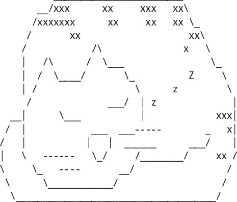
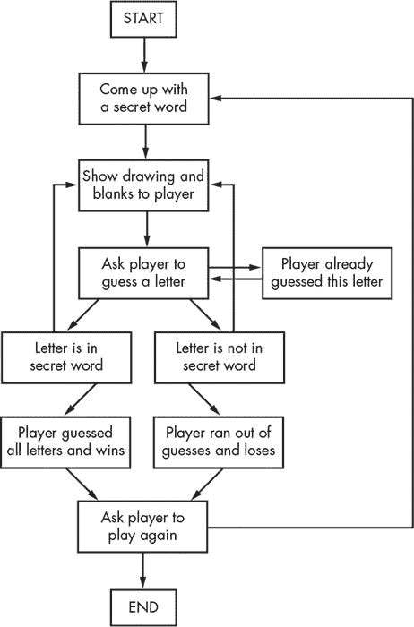
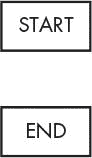
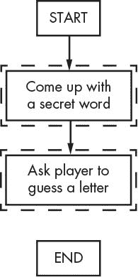
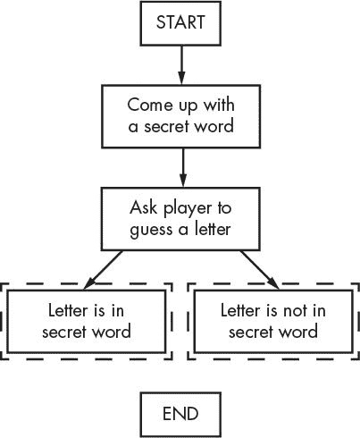
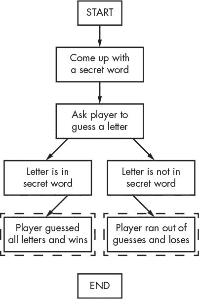
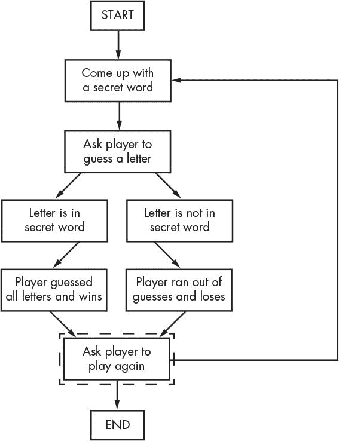
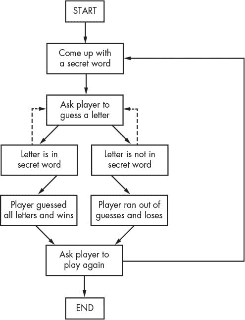
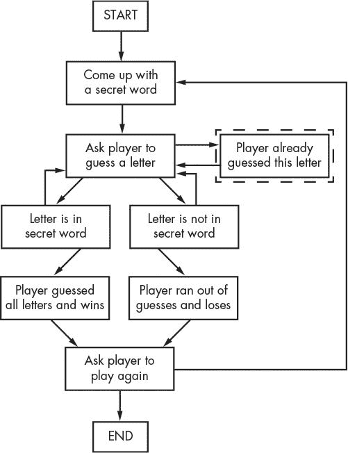

# 七、使用流程图设计“猜词游戏”

> 原文：[`inventwithpython.com/invent4thed/chapter7.html`](https://inventwithpython.com/invent4thed/chapter7.html)
> 
> 译者：[飞龙](https://github.com/wizardforcel)
> 
> 协议：[CC BY-NC-SA 4.0](https://creativecommons.org/licenses/by-nc-sa/4.0/)


在本章中，你将设计一个“猜词游戏”。这个游戏比我们之前的游戏更复杂，但也更有趣。因为游戏比较复杂，我们将首先通过在本章中创建一个流程图来仔细规划它。在第 8 章中，我们将实际编写“猜词游戏”的代码。

**本章涵盖的主题**

+   ASCII 艺术

+   使用流程图设计程序

### 如何玩“猜词游戏”

“猜词游戏”是一个供两个人玩的游戏，其中一名玩家想一个单词，然后在页面上为单词中的每个字母画一条空白线。然后第二名玩家尝试猜测可能在单词中的字母。

如果第二名玩家猜测字母正确，第一名玩家会在正确的空白中写下这个字母。但如果第二名玩家猜错，第一名玩家会画出一个悬挂人的一个身体部位。第二名玩家必须在悬挂人完全被画出之前猜出单词中的所有字母才能赢得游戏。

### “猜词游戏”的示例运行

这是玩家在运行你将在第 8 章中编写的“猜词游戏”程序时可能看到的示例。玩家输入的文本是粗体。

```py
H A N G M A N
  +---+
      |
      |
      |
     ===
Missed letters:
_ _ _
Guess a letter.
a
  +---+
      |
      |
      |
     ===
Missed letters:
_ a _
Guess a letter.
o
  +---+
  O   |
      |
      |
     ===
Missed letters: o
_ a _
Guess a letter.
r
  +---+
  O   |
  |   |
      |
     ===
Missed letters: or
_ a _
Guess a letter.
t
  +---+
  O   |
  |   |
      |
     ===
Missed letters: or
_ a t
Guess a letter.
a
You have already guessed that letter. Choose again.
Guess a letter.
c
Yes! The secret word is "cat"! You have won!
Do you want to play again? (yes or no)
no
```

### ASCII 艺术

“猜词游戏”的图形是打印在屏幕上的键盘字符。这种图形称为*ASCII 艺术*（发音为*ask-ee*），这是表情符号的一种前身。这是一个用 ASCII 艺术绘制的猫的例子：



“猜词游戏”的图片将如下 ASCII 艺术所示：

```py
  +---+    +---+    +---+    +---+    +---+    +---+    +---+
      |    O   |    O   |    O   |    O   |    O   |    O   |
      |        |    |   |   /|   |   /|\  |   /|\  |   /|\  |
      |        |        |        |        |   /    |   / \  |
     ===      ===      ===      ===      ===      ===      ===
```

### 使用流程图设计程序

这个游戏比你到目前为止见过的游戏要复杂一些，所以让我们花点时间思考它是如何组合在一起的。首先，你将创建一个流程图（就像第 5-1 章上的那个，第 47 页上的“龙之境界”游戏）来帮助可视化这个程序将要做什么。

如第 5 章中所讨论的，流程图是一种显示一系列步骤的图表，其中的框用箭头连接。每个框代表一个步骤，箭头显示可能的下一步。把手指放在流程图的 START 框上，然后沿着箭头跟踪程序，直到到达 END 框。你只能按箭头的方向从一个框移动到另一个框。除非有一个指向后退的箭头，否则你永远不能后退，就像“玩家已经猜过这个字母”框中那样。

图 7-1 是“猜词游戏”的完整流程图。



*图 7-1：猜词游戏的完整流程图*

当然，你不一定*要*制作流程图；你可以直接开始编写代码。但通常一旦你开始编程，你会想到必须添加或更改的东西。你可能最终不得不删除大量的代码，这将是一种浪费。为了避免这种情况，最好在开始编写代码之前计划程序将如何工作。

#### 创建流程图

你的流程图不一定要像图 7-1 中的那样。只要*你*能理解你的流程图，在你开始编码时它就会很有帮助。你可以从一个 START 和一个 END 框开始制作流程图，就像图 7-2 中所示的那样。

现在想想当你玩“猜词游戏”时会发生什么。首先，计算机会想一个秘密单词。然后玩家猜字母。为这些事件添加框，就像图 7-3 中所示的那样。每个流程图中的新框都有虚线轮廓。



*图 7-2：用一个 START 和一个 END 框开始你的流程图。*



图 7-3：用描述绘制“吊死人”的前两个步骤。

但是玩家猜一个字母后游戏并不会结束。程序需要检查该字母是否在秘密单词中。

#### 从流程图框中分支出去

有两种可能性：字母要么在单词中，要么不在。你将为流程图添加两个新框，每种情况一个。这在流程图中创建了一个分支，如图 7-4 所示。



图 7-4：分支有两个箭头指向不同的框。

如果字母在秘密单词中，检查玩家是否猜对了所有字母并赢得了比赛。如果字母不在秘密单词中，检查吊死人是否完成并且玩家已经输了。也为这些情况添加框。

流程图现在看起来像图 7-5。



图 7-5：分支后，步骤继续沿着各自的路径。

你不需要从“字母在秘密单词中”框到“玩家猜测次数用完并且失败”框的箭头，因为如果玩家刚刚猜对，他们不可能失败。如果玩家刚刚猜错，他们也不可能赢，所以你也不需要为此画箭头。

#### 结束或重新开始游戏

玩家赢了或输了之后，询问他们是否想要用新的秘密单词再玩一次。如果玩家不想再玩，程序结束；否则，程序继续并想出一个新的秘密单词。这在图 7-6 中显示。



图 7-6：在要求玩家再次玩之后，流程图分支出去。

#### 再次猜测

流程图现在看起来大部分都完成了，但我们还缺少一些东西。首先，玩家不只猜一个字母；他们会一直猜字母直到赢或输。如图 7-7 所示，画出两个新的箭头。

如果玩家再次猜相同的字母怎么办？与其再次计数这个字母，不如允许他们猜一个不同的字母。这个新框显示在图 7-8 中。



图 7-7：虚线箭头显示玩家可以再次猜测。



图 7-8：添加一个步骤，以防玩家猜测他们已经猜过的字母。

如果玩家两次猜相同的字母，流程图会回到“要求玩家猜一个字母”的框。

#### 向玩家提供反馈

玩家需要知道他们在游戏中的表现如何。程序应该向他们显示吊死人的图画和秘密单词（未猜出的字母用空格表示）。这些视觉效果将让他们看到自己离赢得或输掉比赛有多近。

每次玩家猜测一个字母时，此信息都会更新。在“想一个秘密单词”框和“要求玩家猜一个字母”框之间的流程图中添加一个“向玩家显示图画和空白”框，如图 7-9 所示。


图 7-9：添加一个“向玩家显示图画和空白”框，以向玩家提供反馈。

看起来不错！这个流程图完全映射了“吊死人”游戏中可能发生的一切顺序。当你设计自己的游戏时，流程图可以帮助你记住需要编写的所有内容。

### 总结

首先草拟程序的流程图可能看起来很费力。毕竟，人们想玩游戏，而不是看流程图！但是通过在编写代码之前考虑程序的工作原理，可以更容易地进行更改和识别问题。

如果你首先开始编写代码，你可能会发现一些问题，这些问题需要你改变已经编写的代码，浪费时间和精力。每次改变代码时，你都有可能因改变过少或过多而产生新的错误。在构建之前知道你想要构建什么要高效得多。现在我们有了一个流程图，让我们在第 8 章中创建猜词游戏程序！


