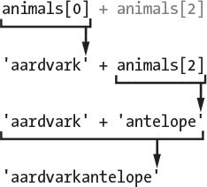
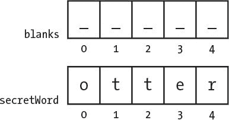
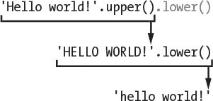
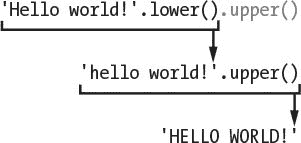
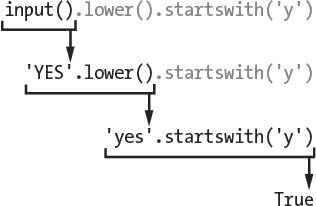

# 八、编写 Hangman 代码

> 原文：[`inventwithpython.com/invent4thed/chapter8.html`](https://inventwithpython.com/invent4thed/chapter8.html)
> 
> 译者：[飞龙](https://github.com/wizardforcel)
> 
> 协议：[CC BY-NC-SA 4.0](https://creativecommons.org/licenses/by-nc-sa/4.0/)

本章的游戏引入了许多新概念，但不用担心：在实际编写游戏之前，你将在交互式 shell 中进行实验。你将学习*方法*，这些方法是附加到值上的函数。你还将学习一个叫做*list*的新数据类型。一旦你理解了这些概念，编写 Hangman 游戏将会更容易。

**本章涵盖的主题**

+   列表

+   `in`运算符

+   方法

+   `split()`、`lower()`、`upper()`、`startswith()`和`endswith()`字符串方法

+   `elif`语句

### Hangman 的源代码

本章的游戏比之前的游戏要长一些，但其中大部分是用于绘制悬吊人图片的 ASCII 艺术。将以下内容输入到文件编辑器中，并将其保存为*hangman.py*。如果输入以下代码后出现错误，请使用在线 diff 工具将你输入的代码与书中的代码进行比较。


`hangman.py`

```py
import random
HANGMAN_PICS = ['''
  +---+
      |
      |
      |
     ===''', '''
  +---+
  O   |
      |
      |
     ===''', '''
  +---+
  O   |
  |   |
      |
     ===''', '''
  +---+
  O   |
 /|   |
      |
     ===''', '''
  +---+
  O   |
 /|\  |
      |
     ===''', '''
  +---+
  O   |
 /|\  |
 /    |
     ===''', '''
  +---+
  O   |
 /|\  |
 / \  |
     ===''']
words = 'ant baboon badger bat bear beaver camel cat clam cobra cougar
       coyote crow deer dog donkey duck eagle ferret fox frog goat goose hawk
       lion lizard llama mole monkey moose mouse mule newt otter owl panda
       parrot pigeon python rabbit ram rat raven rhino salmon seal shark sheep
       skunk sloth snake spider stork swan tiger toad trout turkey turtle
       weasel whale wolf wombat zebra'.split()

def getRandomWord(wordList):
    # This function returns a random string from the passed list of
           strings.
    wordIndex = random.randint(0, len(wordList) - 1)
    return wordList[wordIndex]

def displayBoard(missedLetters, correctLetters, secretWord):
    print(HANGMAN_PICS[len(missedLetters)])
    print()

    print('Missed letters:', end=' ')
    for letter in missedLetters:
        print(letter, end=' ')
    print()

    blanks = '_' * len(secretWord)

    for i in range(len(secretWord)): # Replace blanks with correctly
           guessed letters.
        if secretWord[i] in correctLetters:
            blanks = blanks[:i] + secretWord[i] + blanks[i+1:]

    for letter in blanks: # Show the secret word with spaces in between
           each letter.
        print(letter, end=' ')
    print()

def getGuess(alreadyGuessed):
    # Returns the letter the player entered. This function makes sure the
           player entered a single letter and not something else.
    while True:
        print('Guess a letter.')
        guess = input()
        guess = guess.lower()
        if len(guess) != 1:
            print('Please enter a single letter.')
        elif guess in alreadyGuessed:
            print('You have already guessed that letter. Choose again.')
        elif guess not in 'abcdefghijklmnopqrstuvwxyz':
            print('Please enter a LETTER.')
        else:
            return guess

def playAgain():
    # This function returns True if the player wants to play again;
           otherwise, it returns False.
    print('Do you want to play again? (yes or no)')
    return input().lower().startswith('y')


print('H A N G M A N')
missedLetters = ''
correctLetters = ''
secretWord = getRandomWord(words)
gameIsDone = False

while True:
    displayBoard(missedLetters, correctLetters, secretWord)

    # Let the player enter a letter.
    guess = getGuess(missedLetters + correctLetters)

    if guess in secretWord:
        correctLetters = correctLetters + guess

        # Check if the player has won.
        foundAllLetters = True
        for i in range(len(secretWord)):
            if secretWord[i] not in correctLetters:
                foundAllLetters = False
                break
        if foundAllLetters:
            print('Yes! The secret word is "' + secretWord +
                   '"! You have won!')
            gameIsDone = True
    else:
        missedLetters = missedLetters + guess

        # Check if player has guessed too many times and lost.
        if len(missedLetters) == len(HANGMAN_PICS) - 1:
            displayBoard(missedLetters, correctLetters, secretWord)
            print('You have run out of guesses!\nAfter ' +
                   str(len(missedLetters)) + ' missed guesses and ' +
                   str(len(correctLetters)) + ' correct guesses,
                   the word was "' + secretWord + '"')
            gameIsDone = True

    # Ask the player if they want to play again (but only if the game is
           done).
    if gameIsDone:
        if playAgain():
            missedLetters = ''
            correctLetters = ''
            gameIsDone = False
            secretWord = getRandomWord(words)
        else:
            break
```

### 导入 random 模块

Hangman 程序会从单词列表中随机选择一个秘密单词供玩家猜测。`random`模块将提供这种能力，因此第 1 行导入它。

```py
import random
```

但是第 2 行的`HANGMAN_PICS`变量看起来与我们迄今为止看到的变量有些不同。为了理解这段代码的含义，我们需要学习一些更多的概念。

### 常量变量

第 2 到 37 行是`HANGMAN_PICS`变量的一个长赋值语句。

```py
HANGMAN_PICS = ['''
3.   +---+
      |
      |
      |
     ===''', '''
--snip--
    ===''']
```

`HANGMAN_PICS`变量的名称全部由大写字母组成。这是常量变量的编程约定。*常量*是指变量的值从第一次赋值语句开始就不会改变。尽管你可以像其他变量一样改变`HANGMAN_PICS`中的值，但全大写的名称会提醒你不要这样做。

与所有约定一样，你不一定*必须*遵循这个约定。但这样做可以让其他程序员更容易阅读你的代码。他们会知道`HANGMAN_PICS`将始终具有从第 2 行到第 37 行赋值的值。

### 列表数据类型

`HANGMAN_PICS`包含多个多行字符串。它可以这样做是因为它是一个列表。列表具有可以包含多个其他值的列表值。将其输入到交互式 shell 中：

```py
>>> animals = ['aardvark', 'anteater', 'antelope', 'albert']
>>> animals
['aardvark', 'anteater', 'antelope', 'albert']
```

`animals`中的列表值包含四个值。列表值以左方括号`[`开始，以右方括号`]`结束。这就像字符串以引号开始和结束一样。

逗号分隔列表中的各个值。这些值也称为*项*。`HANGMAN_PICS`中的每个项都是一个多行字符串。

列表可以让你存储多个值，而不需要为每个值使用一个变量。如果没有列表，代码会像这样：

```py
>>> animals1 = 'aardvark'
>>> animals2 = 'anteater'
>>> animals3 = 'antelope'
>>> animals4 = 'albert'
```

如果有数百或数千个字符串，这段代码将很难管理。但列表可以轻松地包含任意数量的值。

#### 使用索引访问项目

你可以通过在列表变量的末尾添加方括号并在它们之间加上一个数字来访问列表中的项目。方括号之间的数字是*索引*。在 Python 中，列表中第一项的索引是`0`。第二项的索引是`1`，第三项的索引是`2`，依此类推。因为索引从`0`开始而不是`1`，所以我们说 Python 列表是*零索引*的。

在我们仍然在交互式 shell 中并且正在使用`animals`列表时，输入`animals[0]`，`animals[1]`，`animals[2]`和`animals[3]`来查看它们的评估情况：

```py
>>> animals[0]
'aardvark'
>>> animals[1]
'anteater'
>>> animals[2]
'antelope'
>>> animals[3]
'albert'
```

请注意，列表中的第一个值`'aardvark'`存储在索引`0`而不是索引`1`中。列表中的每个项目都按顺序从`0`开始编号。

使用方括号，您可以像对待任何其他值一样对待列表中的项目。例如，在交互式 shell 中输入`animals[0] + animals[2]`：

```py
>>> animals[0] + animals[2]
'aardvarkantelope'
```

`animals`列表中索引`0`和`2`处的变量都是字符串，因此这些值被连接。计算如下所示：



##### 超出范围的索引和 IndexError

如果尝试访问列表中不存在的索引，将会收到一个`IndexError`，导致程序崩溃。要查看此错误的示例，请在交互式 shell 中输入以下内容：

```py
>>> animals = ['aardvark', 'anteater', 'antelope', 'albert']
>>> animals[9999]
Traceback (most recent call last):
  File "", line 1, in
    animals[9999]
IndexError: list index out of range
```

因为索引`9999`处没有值，所以会收到一个错误。

##### 使用索引赋值更改列表项

您还可以使用*索引赋值*更改列表中项目的值。在交互式 shell 中输入以下内容：

```py
>>> animals = ['aardvark', 'anteater', 'antelope', 'albert']
>>> animals[1] = 'ANTEATER'
>>> animals
['aardvark', 'ANTEATER', 'antelope', 'albert']
```

新的`'ANTEATER'`字符串覆盖了`animals`列表中的第二个项目。因此，单独输入`animals[1]`会计算列表当前的第二个项目，但在赋值运算符的左侧使用它会将一个新值赋给列表的第二个项目。

#### 列表连接

您可以使用`+`运算符将多个列表连接成一个列表，就像对字符串一样。这样做被称为*列表连接*。要查看此操作，请在交互式 shell 中输入以下内容：

```py
>>> [1, 2, 3, 4] + ['apples', 'oranges'] + ['Alice', 'Bob']
[1, 2, 3, 4, 'apples', 'oranges', 'Alice', 'Bob']
```

`['apples'] + ['oranges']`将计算为`['apples', 'oranges']`。但`['apples'] + 'oranges'`将导致错误。您不能使用`+`运算符将列表值和字符串值相加。如果要在列表末尾添加值而不使用列表连接，请使用`append()`方法（在“`reverse()`和`append()`列表方法”中描述）。

#### in 运算符

`in`运算符可以告诉您值是否在列表中。使用`in`运算符的表达式返回一个布尔值：如果值在列表中则返回`True`，否则返回`False。在交互式 shell 中输入以下内容：

```py
>>> animals = ['aardvark', 'anteater', 'antelope', 'albert']
>>> 'antelope' in animals
True
>>> 'ant' in animals
False
```

表达式`'antelope' in animals`返回`True`，因为字符串`'antelope'`是`animals`列表中的值之一。它位于索引`2`。但当您输入表达式`'ant' in animals`时，它返回`False`，因为字符串`'ant'`在列表中不存在。

`in`运算符也适用于字符串，检查一个字符串是否存在于另一个字符串中。在交互式 shell 中输入以下内容：

```py
>>> 'hello' in 'Alice said hello to Bob.'
True
```

将多行字符串列表存储在`HANGMAN_PICS`变量中涵盖了许多概念。例如，您看到列表对于在单个变量中存储多个值非常有用。您还学习了一些处理列表的技巧，比如索引赋值和列表连接。方法是您将学习如何在 Hangman 游戏中使用的另一个新概念；我们将在下面进行探讨。

### 调用方法

*方法*是附加到值的函数。要调用方法，必须使用句点将其附加到特定值上。Python 有许多有用的方法，我们将在 Hangman 程序中使用其中一些。

但首先，让我们看一些列表和字符串方法。

#### reverse()和 append()列表方法

列表数据类型有一些您可能经常使用的方法：`reverse()`和`append()`。`reverse()`方法将颠倒列表中项目的顺序。尝试输入`spam = [1, 2, 3, 4, 5, 6, 'meow', 'woof']`，然后输入`spam.reverse()`以颠倒列表。然后输入`spam`以查看变量的内容。

```py
>>> spam = [1, 2, 3, 4, 5, 6, 'meow', 'woof']
>>> spam.reverse()
>>> spam
['woof', 'meow', 6, 5, 4, 3, 2, 1]
```

您将使用最常见的列表方法之一是`append()`。此方法将传递的值添加到列表的末尾。尝试在交互式 shell 中输入以下内容：

```py
>>> eggs = []
>>> eggs.append('hovercraft')
>>> eggs
['hovercraft']
>>> eggs.append('eels')
>>> eggs
['hovercraft', 'eels']
```

这些方法确实会更改它们调用的列表。它们不会返回一个新的列表。我们说这些方法会*原地*更改列表。

#### split()字符串方法

字符串数据类型有一个`split()`方法，它返回一个由已分割字符串制成的字符串列表。尝试使用`split()`方法，输入以下内容到交互式 shell 中：

```py
>>> sentence = input()
My very energetic mother just served us nachos.
>>> sentence.split()
['My', 'very', 'energetic', 'mother', 'just', 'served', 'us', 'nachos.']
```

结果是一个包含八个字符串的列表，原始字符串中的每个单词都有一个字符串。分割发生在字符串中的空格处。这些空格不包括在列表的任何项目中。

“绞刑”程序的第 38 行也使用了`split()`方法，如下所示。代码很长，但实际上只是一个简单的赋值语句，最后有一个`split()`方法调用，其中有一个由空格分隔的单词的长字符串。`split()`方法求值为一个列表，其中字符串中的每个单词都是一个单独的列表项。

```py
words = 'ant baboon badger bat bear beaver camel cat clam cobra cougar
      coyote crow deer dog donkey duck eagle ferret fox frog goat goose hawk
      lion lizard llama mole monkey moose mouse mule newt otter owl panda
      parrot pigeon python rabbit ram rat raven rhino salmon seal shark sheep
      skunk sloth snake spider stork swan tiger toad trout turkey turtle
      weasel whale wolf wombat zebra'.split()
```

使用`split()`来编写这个程序会更容易。如果一开始就创建了一个列表，你将不得不为每个单词输入`['ant', 'baboon', 'badger'`等等，每个单词都要加上引号和逗号。

你也可以在第 38 行的字符串中添加自己的单词，或者删除你不想在游戏中出现的任何单词。只要确保单词之间有空格。

### 从单词列表中获取秘密单词

第 40 行定义了`getRandomWord()`函数。一个列表参数将被传递给它的`wordList`参数。这个函数将从`wordList`中返回一个秘密单词。

```py
def getRandomWord(wordList):
    # This function returns a random string from the passed list of
          strings.
    wordIndex = random.randint(0, len(wordList) - 1)
    return wordList[wordIndex]
```

在第 42 行，我们通过调用`randint()`并传入两个参数，将这个列表的随机索引存储在`wordIndex`变量中。第一个参数是`0`（表示第一个可能的索引），第二个参数是表达式`len(wordList) - 1`的值（表示`wordList`中的最后一个可能的索引）。

请记住，列表索引从`0`开始，而不是`1`。如果你有一个包含三个项目的列表，第一个项目的索引是`0`，第二个项目的索引是`1`，第三个项目的索引是`2`。这个列表的长度是 3，但索引`3`将在最后一个索引之后。这就是为什么第 42 行从`wordList`的长度中减去`1`。第 42 行的代码将在`wordList`的大小如何都能工作。现在，如果你愿意，你可以添加或删除`wordList`中的字符串。

`wordIndex`变量将被设置为传递给`wordList`参数的列表的随机索引。第 43 行将返回存储在`wordIndex`中的整数的`wordList`中的元素。

假设`['apple', 'orange', grape']`被传递为`getRandomWord()`的参数，并且`randint(0, 2)`返回整数`2`。这意味着第 43 行将求值为`return wordList[2]`，然后求值为`return 'grape'`。这就是`getRandomWord()`如何从`wordList`中返回一个随机字符串。

因此，`getRandomWord()`的输入是一个字符串列表，返回值输出是从该列表中随机选择的字符串。在“绞刑”游戏中，这就是玩家要猜测的秘密单词是如何选择的。

### 向玩家显示板

接下来，您需要一个函数来在屏幕上打印“绞刑”板。它还应该显示玩家已经正确（和错误）猜到了多少个字母。

```py
def displayBoard(missedLetters, correctLetters, secretWord):
    print(HANGMAN_PICS[len(missedLetters)])
    print()
```

这段代码定义了一个名为`displayBoard()`的新函数。这个函数有三个参数：

`missedLetters` 玩家猜测的不在秘密单词中的字母的字符串

`correctLetters` 玩家猜测的在秘密单词中的字母的字符串

`secretWord` 玩家试图猜测的秘密单词的字符串

第一个`print()`函数调用将显示板。全局变量`HANGMAN_PICS`有一个字符串列表，每个可能的板都有一个字符串。（请记住，全局变量可以从函数内部读取。）`HANGMAN_PICS[0]`显示一个空的绞刑架，`HANGMAN_PICS[1]`显示头部（当玩家错过一个字母时），`HANGMAN_PICS[2]`显示头部和身体（当玩家错过两个字母时），依此类推，直到`HANGMAN_PICS[6]`，显示完整的绞刑架。

`missedLetters`中的字母数量将反映玩家猜错的次数。调用`len(missedLetters)`来找出这个数字。因此，如果`missedLetters`是`'aetr'`，那么`len('aetr'`)将返回`4`。打印`HANGMAN_PICS[4]`将显示四次猜错时适当的吊死人图片。这就是第 46 行中`HANGMAN_PICS[len(missedLetters)]`的评估结果。

第 49 行打印了字符串`'Missed letters:'`，末尾带有空格字符而不是换行符：

```py
    print('Missed letters:', end=' ')
    for letter in missedLetters:
        print(letter, end=' ')
    print()
```

第 50 行的`for`循环将遍历字符串`missedLetters`中的每个字符并将其打印到屏幕上。请记住，`end=' '`将用单个空格字符替换在字符串后打印的换行符。例如，如果`missedLetters`是`'ajtw'`，这个`for`循环将显示`a j t w`。

`displayBoard()`函数的其余部分（第 54 至 62 行）显示了错过的字母，并创建了一个包含所有尚未猜出字母的秘密单词的字符串。它使用`range()`函数和列表切片来实现这一点。

#### list()和 range()函数

当使用一个参数调用`range()`时，它将返回一个整数范围对象，从`0`到（但不包括）参数。这个范围对象用于`for`循环，但也可以用`list()`函数转换为更熟悉的列表数据类型。将`list(range(10))`输入到交互式 shell 中：

```py
>>> list(range(10))
[0, 1, 2, 3, 4, 5, 6, 7, 8, 9]
>>> list('Hello')
['H', 'e', 'l', 'l', 'o']
```

`list()`函数类似于`str()`或`int()`函数。它接受传递给它的值并返回一个列表。使用`range()`函数很容易生成大型列表。例如，输入`list(range(10000))`到交互式 shell 中：

```py
>>> list(range(10000))
[0, 1, 2, 3, 4, 5, 6, 7, 8, 9, 10, 11, 12, 13, 14, 15,...
      --snip--
...9989, 9990, 9991, 9992, 9993, 9994, 9995, 9996, 9997, 9998, 9999]
```

列表太大，甚至无法放入屏幕。但是您可以将列表存储在一个变量中：

```py
>>> spam = list(range(10000))
```

如果向`range()`传递两个整数参数，则它返回的范围对象是从第一个整数参数到第二个整数参数（但不包括第二个整数参数）。接下来，将`list(range(10, 20))`输入到交互式 shell 中：

```py
>>> list(range(10, 20))
[10, 11, 12, 13, 14, 15, 16, 17, 18, 19]
```

如您所见，我们的列表只到 19，不包括 20。

#### 列表和字符串切片

*列表切片*使用另一个列表的子集创建一个新的列表值。要切片一个列表，请在列表名称后的方括号中指定两个索引（开始和结束）并用冒号分隔。例如，将以下内容输入到交互式 shell 中：

```py
>>> spam = ['apples', 'bananas', 'carrots', 'dates']
>>> spam[1:3]
['bananas', 'carrots']
```

表达式`spam[1:3]`求值为一个包含`spam`中从索引`1`到（但不包括）索引`3`的项目的列表。

如果省略第一个索引，Python 将自动认为您想要第一个索引为`0`：

```py
>>> spam = ['apples', 'bananas', 'carrots', 'dates']
>>> spam[:2]
['apples', 'bananas']
```

如果省略第二个索引，Python 将自动认为您想要列表的其余部分：

```py
>>> spam = ['apples', 'bananas', 'carrots', 'dates']
>>> spam[2:]
['carrots', 'dates']
```

您还可以像对列表一样对字符串使用切片。字符串中的每个字符就像列表中的一个项目。将以下内容输入到交互式 shell 中：

```py
>>> myName = 'Zophie the Fat Cat'
>>> myName[4:12]
'ie the F'
>>> myName[:10]
'Zophie the'
>>> myName[7:]
'the Fat Cat'
```

Hangman 代码的下一部分使用了切片。

#### 显示带空白的秘密单词

现在，您想打印出秘密单词，但对于尚未猜出的字母，您可以使用下划线字符（`_`）来表示。首先，为秘密单词中的每个字母创建一个仅包含一个下划线的字符串。然后，用`correctLetters`中的每个字母替换空白。

因此，如果秘密单词是`'otter'`，那么被掩盖的字符串将是`'_____'`（五个下划线）。如果`correctLetters`是字符串`'rt'`，您将把字符串更改为`'_tt_r'`。第 54 至 58 行是执行此操作的代码的一部分。

```py
    blanks = '_' * len(secretWord)

    for i in range(len(secretWord)): # Replace blanks with correctly
          guessed letters.
        if secretWord[i] in correctLetters:
            blanks = blanks[:i] + secretWord[i] + blanks[i+1:]
```

第 54 行使用字符串复制创建了一个由下划线组成的`blanks`变量。请记住，`*`运算符可以用于字符串和整数，因此表达式`'_' * 5`求值为`'_____'`。这将确保`blanks`中的下划线数量与`secretWord`中的字母数量相同。

第 56 行有一个`for`循环，它遍历`secretWord`中的每个字母，并用实际字母替换下划线，如果它存在于`correctLetters`中。

让我们再看一下前面的示例，其中`secretWord`的值为`'otter'`，`correctLetters`中的值为`'tr'`。您希望向玩家显示字符串`'_tt_r'`。让我们找出如何创建这个字符串。

第 56 行的`len(secretWord)`调用会返回`5`。`range(len(secretWord))`调用变成了`range(5)`，这使得`for`循环迭代`0`、`1`、`2`、`3`和`4`。

因为`i`的值将取得`[0, 1, 2, 3, 4]`中的每个值，所以`for`循环中的代码如下：

```py
if secretWord[0] in correctLetters:
    blanks = blanks[:0] + secretWord[0] + blanks[1:]

if secretWord[1] in correctLetters:
    blanks = blanks[:1] + secretWord[1] + blanks[2:]
--snip--
```

我们只显示了`for`循环的前两次迭代，但是从`0`开始，`i`将取得范围内的每个数字的值。在第一次迭代中，`i`取值为`0`，因此`if`语句检查`secretWord`中索引为`0`的字母是否在`correctLetters`中。循环会逐个字母在`secretWord`中执行此操作。

如果您对`secretWord0]`或`blanks[3:]`之类的值感到困惑，请查看[图 8-1。它显示了`secretWord`和`blanks`变量的值以及字符串中每个字母的索引。



*图 8-1：*blanks*和*secretWord*字符串的索引*

如果您用它们表示的值替换列表切片和列表索引，则循环代码如下：

```py
if 'o' in 'tr': # False
    blanks = '' + 'o' + '____' # This line is skipped.
--snip--
if 'r' in 'tr': # True
    blanks = '_tt_' + 'r' + '' # This line is executed.

# blanks now has the value '_tt_r'.
```

在`secretWord`为`'otter'`且`correctLetters`为`'tr'`时，前面的代码示例都执行*相同的操作*。接下来的几行代码会打印`blanks`的新值，每个字母之间有空格：

```py
    for letter in blanks: # Show the secret word with spaces in between
          each letter.
        print(letter, end=' ')
    print()
```

请注意，第 60 行的`for`循环没有调用`range()`函数。它不是在范围对象上进行迭代，而是在`blanks`变量中的字符串值上进行迭代。在每次迭代中，`letter`变量从`blanks`中的`'otter'`字符串中取出一个新字符。

在添加空格后打印输出将是`'_ t t _ r'`。

### 获取玩家的猜测

将调用`getGuess()`函数，以便玩家可以输入一个猜测的字母。该函数将字母作为字符串返回。此外，`getGuess()`将确保玩家在返回函数之前输入有效的字母。

```py
def getGuess(alreadyGuessed):
    # Returns the letter the player entered. This function makes sure the
          player entered a single letter and not something else.
```

玩家猜测的字母串作为`alreadyGuessed`参数传递。然后`getGuess()`函数要求玩家猜测一个字母。这个单个字母将是`getGuess()`的返回值。现在，因为 Python 是区分大小写的，我们需要确保玩家的猜测是小写字母，以便我们可以将其与秘密单词进行比较。这就是`lower()`方法的用武之地。

#### lower()和 upper()字符串方法

在交互式 shell 中输入`'Hello world!'.lower()`来查看`lower()`方法的示例：

```py
>>> 'Hello world!'.lower()
'hello world!'
```

`lower()`方法返回一个所有字符都为小写的字符串。字符串还有一个`upper()`方法，它返回一个所有字符都为大写的字符串。尝试输入`'Hello world!'.upper()`到交互式 shell 中：

```py
>>> 'Hello world!'.upper()
'HELLO WORLD!'
```

因为`upper()`方法返回一个字符串，您也可以在该字符串上调用一个方法。

现在将其输入交互式 shell：

```py
>>> 'Hello world!'.upper().lower()
'hello world!'
```

`'Hello world!'.upper()`求值为字符串`'HELLO WORLD!'`，然后调用字符串的`lower()`方法。这将返回字符串`'hello world!'`，这是评估的最终值：



顺序很重要。`'Hello world!'.lower().upper()`与`'Hello world!'.upper().lower()`不同：

```py
>>> 'Hello world!'.lower().upper()
'HELLO WORLD!'
```

该评估如下：



如果一个字符串存储在一个变量中，您也可以在该变量上调用一个字符串方法：

```py
>>> spam = 'Hello world!'
>>> spam.upper()
'HELLO WORLD!'
```

这段代码不会改变`spam`中的值。`spam`变量仍将包含`'Hello world!'`。

回到“猜词游戏”程序，我们在询问玩家猜测时使用`lower()`：

```py
    while True:
        print('Guess a letter.')
        guess = input()
        guess = guess.lower()
```

即使玩家输入一个大写字母作为猜测，`getGuess()`函数也会返回一个小写字母。

#### 离开 while 循环

第 66 行的`while`循环将继续要求玩家输入一个字母，直到他们输入一个之前没有猜过的单个字母。

`while`循环的条件只是布尔值`True`。这意味着执行离开这个循环的唯一方法是执行`break`语句，离开循环，或者`return`语句，不仅离开循环，而且离开整个函数。

循环内的代码要求玩家输入一个字母，存储在变量`guess`中。如果玩家输入一个大写字母，它将在第 69 行被覆盖为小写字母。

### elif 语句

Hangman 程序的下一部分使用了`elif`语句。你可以将`elif`或`else-if`语句看作是这样说的：“如果这是真的，就这样做。或者如果接下来的条件是真的，就那样做。或者如果它们都不是真的，就做最后的事情。”看一下下面的代码：

```py
if catName == 'Fuzzball':
    print('Your cat is fuzzy.')
elif catName == 'Spots':
    print('Your cat is spotted.')
else:
    print('Your cat is not fuzzy or spotted.')
```

如果`catName`变量等于字符串`'Fuzzball'`，那么`if`语句的条件是`True`，并且`if`块告诉用户他们的猫是毛茸茸的。然而，如果这个条件是`False`，那么 Python 接下来尝试`elif`语句的条件。如果`catName`是`'Spots'`，那么字符串`'Your cat is spotted.'`将被打印到屏幕上。如果两者都是`False`，那么代码会告诉用户他们的猫既不是毛茸茸的也不是有斑点的。

你可以有任意多的`elif`语句：

```py
if catName == 'Fuzzball':
    print('Your cat is fuzzy.')
elif catName == 'Spots':
    print('Your cat is spotted.')
elif catName == 'Chubs':
    print('Your cat is chubby.')
elif catName == 'Puff':
    print('Your cat is puffy.')
else:
    print('Your cat is neither fuzzy nor spotted nor chubby nor puffy.')
```

当`elif`条件中的一个为`True`时，它的代码被执行，然后执行跳到`else`块之后的第一行。因此，在`if`-`elif`-`else`语句中的块中*只有一个*会被执行。如果不需要`else`块，也可以省略`else`块，只使用`if`-`elif`语句。

### 确保玩家输入了有效的猜测

`guess`变量包含玩家的字母猜测。程序需要确保他们输入了一个有效的猜测：一个，且仅有一个，尚未被猜过的字母。如果他们没有，执行将循环回去再次要求他们输入一个字母。

```py
        if len(guess) != 1:
            print('Please enter a single letter.')
        elif guess in alreadyGuessed:
            print('You have already guessed that letter. Choose again.')
        elif guess not in 'abcdefghijklmnopqrstuvwxyz':
            print('Please enter a LETTER.')
        else:
            return guess
```

第 70 行的条件检查`guess`是否不是一个字符长，第 72 行的条件检查`guess`是否已经存在于`alreadyGuessed`变量中，第 74 行的条件检查`guess`是否不是标准英语字母表中的字母。如果这些条件中有任何一个为`True`，游戏会提示玩家输入一个新的猜测。

如果所有这些条件都是`False`，那么`else`语句的块将被执行，`getGuess()`返回第 77 行的`guess`的值。

记住，在`if`-`elif`-`else`语句中，只有一个块会被执行。

### 要求玩家再玩一次

`playAgain()`函数只有一个`print()`函数调用和一个`return`语句：

```py
def playAgain():
    # This function returns True if the player wants to play again;
          otherwise, it returns False.
    print('Do you want to play again? (yes or no)')
    return input().lower().startswith('y')
```

`return`语句有一个看起来复杂的表达式，但你可以分解它。这是 Python 如何评估这个表达式的步骤，如果用户输入`YES`：



`playAgain()`函数的目的是让玩家输入 yes 或 no，告诉程序他们是否想再玩一轮 Hangman。玩家应该能够输入`YES`、`yes`、`Y`或以`y`开头的任何其他内容来表示“是”。如果玩家输入`YES`，那么`input()`的返回值是字符串`'YES'`。`'YES'.lower()`返回附加字符串的小写版本。因此`'YES'.lower()`的返回值是`'yes'`。

但是有第二个方法调用，`startswith('y')`。这个函数如果相关的字符串以括号中的字符串参数开头，则返回`True`，如果不是，则返回`False`。`'yes'.startswith('y')`的返回值是`True`。

就是这样——你评估了这个表达式！它让玩家输入一个响应，将响应设置为小写，检查它是否以字母 y 开头，如果是，则返回 True，如果不是，则返回 False。

顺便说一句，还有一个 endswith(someString)字符串方法，如果字符串以 someString 结尾，则返回 True，如果不是，则返回 False。endswith()有点像 startswith()的相反。

### 回顾绞刑函数

这就是我们为这个游戏创建的所有函数！让我们来回顾一下它们：

getRandomWord(wordList)接受传递给它的字符串列表，并从中返回一个字符串。这就是为玩家猜测选择一个单词的方式。

显示板（missedLetters，correctLetters，secretWord）显示板的当前状态，包括玩家到目前为止猜对了多少秘密单词和玩家猜错的字母。此函数需要传递三个参数才能正确工作。correctLetters 和 missedLetters 是由玩家猜测的字母组成的字符串，分别是秘密单词中的字母和不在秘密单词中的字母。而 secretWord 是玩家试图猜测的秘密单词。此函数没有返回值。

getGuess(alreadyGuessed)接受玩家已经猜过的字母的字符串，并将继续要求玩家输入不在 alreadyGuessed 中的字母。此函数返回玩家猜测的有效字母的字符串。

playAgain()询问玩家是否想再玩一局绞刑游戏。如果玩家想玩，此函数返回 True，否则返回 False。

在函数之后，程序的主要部分从第 85 行开始。到目前为止，一切都只是函数定义和对 HANGMAN_PICS 的大型赋值语句。

### 游戏循环

绞刑游戏的主要部分显示游戏的名称，设置一些变量，并执行一个 while 循环。本节逐步介绍了程序的其余部分。

```py
print('H A N G M A N')
missedLetters = ''
correctLetters = ''
secretWord = getRandomWord(words)
gameIsDone = False
```

第 85 行是游戏运行时执行的第一个 print()调用。它显示游戏的标题。接下来，将空字符串分配给 missedLetters 和 correctLetters 变量，因为玩家还没有猜测任何错误或正确的字母。

第 88 行的 getRandomWord(words)调用将求值为从 words 列表中随机选择的单词。

第 89 行将 gameIsDone 设置为 False。当代码想要发出游戏结束的信号并询问玩家是否想再玩时，代码将 gameIsDone 设置为 True。

#### 调用 displayBoard()函数

程序的其余部分由一个 while 循环组成。循环的条件始终为 True，这意味着它将一直循环，直到遇到 break 语句为止。（这发生在第 126 行。）

```py
while True:
    displayBoard(missedLetters, correctLetters, secretWord)
```

第 92 行调用 displayBoard()函数，将设置在第 86、87 和 88 行的三个变量传递给它。根据玩家正确猜测和猜错的字母数量，此函数向玩家显示适当的绞刑板。

#### 让玩家输入他们的猜测

接下来调用 getGuess()函数，让玩家输入他们的猜测。

```py
    # Let the player enter a letter.
    guess = getGuess(missedLetters + correctLetters)
```

getGuess()函数需要一个 alreadyGuessed 参数，以便它可以检查玩家是否输入了他们已经猜过的字母。第 95 行将 missedLetters 和 correctLetters 变量中的字符串连接起来，并将结果作为 alreadyGuessed 参数的参数。

#### 检查字母是否在秘密单词中

如果 guess 字符串存在于 secretWord 中，则此代码将 guess 连接到 correctLetters 字符串的末尾：

```py
    if guess in secretWord:
        correctLetters = correctLetters + guess
```

这个字符串将是 correctLetters 的新值。

#### 检查玩家是否获胜

程序如何知道玩家是否猜出了秘密单词中的每个字母？嗯，`correctLetters`包含了玩家正确猜出的每个字母，`secretWord`是秘密单词本身。但你不能简单地检查`correctLetters == secretWord`。如果`secretWord`是字符串`otter`，而`correctLetters`是字符串`orte`，那么`correctLetters == secretWord`将是`False`，即使玩家已经猜出了秘密单词中的每个字母。

你能确定玩家赢了的唯一方法是迭代`secretWord`中的每个字母，并查看它是否存在于`correctLetters`中。只有当`secretWord`中的每个字母都存在于`correctLetters`中时，玩家才算赢了。

```py
        # Check if the player has won.
        foundAllLetters = True
        for i in range(len(secretWord)):
            if secretWord[i] not in correctLetters:
                foundAllLetters = False
                break
```

如果在`secretWord`中找到一个不在`correctLetters`中的字母，你就知道玩家*没有*猜出所有的字母。在循环开始之前，新变量`foundAllLetters`在第 101 行被设置为`True`。循环开始时假设秘密单词中的所有字母都已经被找到。但是在第 104 行的循环代码中，当它发现一个不在`correctLetters`中的`secretWord`中的字母时，它会将`foundAllLetters`改为`False`。

如果秘密单词中的所有字母都被找到，玩家会被告知他们赢了，并且`gameIsDone`被设置为`True`：

```py
        if foundAllLetters:
            print('Yes! The secret word is "' + secretWord +
                   '"! You have won!')
            gameIsDone = True
```

#### 处理错误的猜测

第 109 行是`else`块的开始。

```py
    else:
        missedLetters = missedLetters + guess
```

记住，这个块中的代码将在条件为`False`时执行。但是哪个条件？要找出来，把手指指向`else`关键字的开始，然后向上移动。你会发现`else`关键字的缩进与第 97 行的`if`关键字的缩进是一样的：

```py
    if guess in secretWord:
--snip--
    else:
        missedLetters = missedLetters + guess
```

因此，如果第 97 行的条件（`guess in secretWord`）是`False`，那么执行将进入这个`else`块。

错误猜测的字母会在第 110 行连接到`missedLetters`字符串中。这就像第 98 行对玩家正确猜出的字母所做的一样。

#### 检查玩家是否输了

每次玩家猜错时，代码都会将错误的字母连接到`missedLetters`字符串中。因此，`missedLetters`的长度——或者在代码中，`len(missedLetters)`——也是错误猜测的次数。

```py
        # Check if player has guessed too many times and lost.
        if len(missedLetters) == len(HANGMAN_PICS) - 1:
            displayBoard(missedLetters, correctLetters, secretWord)
            print('You have run out of guesses!\nAfter ' +
                   str(len(missedLetters)) + ' missed guesses and ' +
                   str(len(correctLetters)) + ' correct guesses,
                   the word was "' + secretWord + '"')
            gameIsDone = True
```

`HANGMAN_PICS`列表有七个 ASCII 艺术字符串。因此，当`missedLetters`字符串的长度等于`len(HANGMAN_PICS) - 1`（即 6）时，玩家已经用完了猜测的机会。你知道玩家已经输了，因为吊死人的图片已经完成。记住，`HANGMAN_PICS[0]`是列表中的第一项，`HANGMAN_PICS[6]`是最后一项。

第 115 行打印秘密单词，第 116 行将`gameIsDone`变量设置为`True`。

```py
    # Ask the player if they want to play again (but only if the game is
           done).
    if gameIsDone:
        if playAgain():
            missedLetters = ''
            correctLetters = ''
            gameIsDone = False
            secretWord = getRandomWord(words)
```

#### 结束或重置游戏

无论玩家在猜测字母后是赢了还是输了，游戏都应该询问玩家是否想再玩一次。`playAgain()`函数处理从玩家那里得到“是”或“否”，因此在第 120 行调用它。

如果玩家想再玩一次，那么`missedLetters`和`correctLetters`中的值必须重置为空字符串，`gameIsDone`重置为`False`，并且新的秘密单词存储在`secretWord`中。这样，当执行回到第 91 行的`while`循环的开头时，游戏板将被重置为一个新的游戏。

如果玩家在被问及是否想再玩一次时没有输入以`y`开头的内容，那么第 120 行的条件将是`False`，并且`else`块将执行：

```py
        else:
            break
```

`break`语句导致执行跳转到循环后的第一条指令。但是因为循环后没有更多的指令，程序终止。

### 总结

“Hangman”是我们迄今为止最复杂的游戏，而且在制作过程中你学到了几个新概念。随着你的游戏变得越来越复杂，草拟程序中应该发生的流程图是一个好主意。

列表是可以包含其他值的值。方法是附加到值的函数。列表有一个`append()`方法。字符串有`lower()`、`upper()`、`split()`、`startswith()`和`endswith()`方法。在本书的其余部分，您将学习更多的数据类型和方法。

`elif`语句允许您在`if`-`else`语句中间添加“或者-否则如果”子句。


