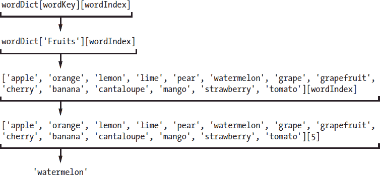

# 九、扩展猜词游戏

> 原文：[`inventwithpython.com/invent4thed/chapter9.html`](https://inventwithpython.com/invent4thed/chapter9.html)
> 
> 译者：[飞龙](https://github.com/wizardforcel)
> 
> 协议：[CC BY-NC-SA 4.0](https://creativecommons.org/licenses/by-nc-sa/4.0/)


现在你已经创建了一个基本的猜词游戏，让我们看看如何通过新功能来扩展它。在本章中，你将为计算机添加多个词组，并且能够改变游戏的难度级别。

**本章涵盖的主题**

+   字典数据类型

+   键值对

+   `keys()`和`values()`字典方法

+   多变量赋值

### 添加更多的猜测

在玩了几次猜词游戏之后，你可能会觉得六次猜测对玩家来说不够。你可以通过向`HANGMAN_PICS`列表添加更多的多行字符串来轻松地给他们更多的猜测。

将你的*hangman.py*程序另存为*hangman2.py*。然后在第 37 行和之后添加以下指令，以扩展包含吊死人 ASCII 艺术的列表：

```py
      ===''', '''
   +---+
  [O   |
  /|\  |
  / \  |
      ===''', '''
   +---+
  [O]  |
  /|\  |
  / \  |
      ===''']
```

这段代码将两个新的多行字符串添加到`HANGMAN_PICS`列表中，一个是画了吊死人的左耳，另一个是画了两只耳朵。因为程序会告诉玩家他们输了，基于`len(missedLetters) == len(HANGMAN_PICS) - 1`，这是你需要做的唯一改变。程序的其余部分可以很好地使用新的`HANGMAN_PICS`列表。

### 字典数据类型

在猜词游戏的第一个版本中，我们使用了一个动物词汇表，但是你可以在第 48 行更改单词列表。你可以有颜色：

```py
words = 'red orange yellow green blue indigo violet white black brown'
      .split()
```

或者形状：

```py
words = 'square triangle rectangle circle ellipse rhombus trapezoid
      chevron pentagon hexagon septagon octagon'.split()
```

或者水果：

```py
words = 'apple orange lemon lime pear watermelon grape grapefruit cherry
      banana cantaloupe mango strawberry tomato'.split()
```

通过一些修改，你甚至可以改变代码，使得猜词游戏使用动物、颜色、形状或水果等词组。程序可以告诉玩家秘密单词来自哪个词组。

要进行这种改变，你需要一个叫做*字典*的新数据类型。字典是一个像列表一样的值的集合。但是，你可以使用任何数据类型的索引来访问字典中的项，而不是使用整数索引。对于字典，这些索引被称为*键*。

字典使用`{`和`}`（大括号）而不是`[`和`]`（方括号）。在交互式 shell 中输入以下内容：

```py
>>> spam = {'hello':'Hello there, how are you?', 4:'bacon', 'eggs':9999 }
```

大括号之间的值是*键值对*。键在冒号的左边，键的值在右边。你可以通过使用键来访问值，就像列表中的项一样。要查看一个例子，请在交互式 shell 中输入以下内容：

```py
>>> spam = {'hello':'Hello there, how are you?', 4:'bacon', 'eggs':9999}
>>> spam['hello']
'Hello there, how are you?'
>>> spam[4]
'bacon'
>>> spam['eggs']
9999
```

在方括号之间不是放一个整数，而是使用一个字符串键。在`spam`字典中，我使用了整数`4`和字符串`'eggs'`作为键。

#### 使用 len()获取字典的大小

你可以使用`len()`函数获取字典中键值对的数量。例如，在交互式 shell 中输入以下内容：

```py
>>> stuff = {'hello':'Hello there, how are you?', 4:'bacon', 'spam':9999}
>>> len(stuff)
3
```

`len()`函数将返回一个整数值，表示键值对的数量，这里是`3`。

#### 字典和列表的区别

字典和列表之间的一个区别是，字典可以有任何数据类型的键，正如你所见。但是要记住，因为`0`和`'0'`是不同的值，它们将成为不同的键。在交互式 shell 中输入以下内容：

```py
>>> spam = {'0':'a string', 0:'an integer'}
>>> spam[0]
'an integer'
>>> spam['0']
'a string'
```

你也可以使用`for`循环遍历列表和字典中的键。要查看它是如何工作的，请在交互式 shell 中输入以下内容：

```py
>>> favorites = {'fruit':'apples', 'animal':'cats', 'number':42}
>>> for k in favorites:
        print(k)
fruit
number
animal
>>> for k in favorites:
        print(favorites[k])
apples
42
cats
```

键和值可能以不同的顺序打印出来，因为与列表不同，字典是无序的。列表`listStuff`中的第一项将是`listStuff[0]`。但是字典中没有第一项，因为字典没有任何排序。在这段代码中，Python 只是根据它如何存储字典在内存中来选择顺序，这并不能保证始终相同。

在交互式 shell 中输入以下内容：

```py
>>> favorites1 = {'fruit':'apples', 'number':42, 'animal':'cats'}
>>> favorites2 = {'animal':'cats', 'number':42, 'fruit':'apples'}
>>> favorites1 == favorites2
True
```

表达式`favorites1 == favorites2`的评估结果为`True`，因为字典是无序的，如果它们具有相同的键-值对，则被认为是相等的。与此同时，列表是有序的，因此具有不同顺序的相同值的两个列表不相等。要查看区别，请在交互式 shell 中输入以下内容：

```py
>>> listFavs1 = ['apples', 'cats', 42]
>>> listFavs2 = ['cats', 42, 'apples']
>>> listFavs1 == listFavs2
False
```

表达式`listFavs1 == listFavs2`的评估结果为`False`，因为列表的内容排序不同。

#### keys()和 values()字典方法

字典有两个有用的方法，`keys()`和`values()`。它们将分别返回类型为`dict_keys`和`dict_values`的值。与范围对象一样，这些数据类型的列表形式由`list()`返回。

在交互式 shell 中输入以下内容：

```py
>>> favorites = {'fruit':'apples', 'animal':'cats', 'number':42}
>>> list(favorites.keys())
['fruit', 'number', 'animal']
>>> list(favorites.values())
['apples', 42, 'cats']
```

使用`keys()`或`values()`方法与`list()`一起，您可以获得字典的键或值的列表。

#### 在 Hangman 中使用字典的单词

让我们更改新 Hangman 游戏中的代码，以支持不同的秘密单词集。首先，将分配给`words`的值替换为一个键为字符串，值为字符串列表的字典。字符串方法`split()`将返回一个包含一个单词的字符串列表。

```py
words = {'Colors':'red orange yellow green blue indigo violet white black
      brown'.split(),
'Shapes':'square triangle rectangle circle ellipse rhombus trapezoid
      chevron pentagon hexagon septagon octagon'.split(),
'Fruits':'apple orange lemon lime pear watermelon grape grapefruit cherry
      banana cantaloupe mango strawberry tomato'.split(),
'Animals':'bat bear beaver cat cougar crab deer dog donkey duck eagle
      fish frog goat leech lion lizard monkey moose mouse otter owl panda
      python rabbit rat shark sheep skunk squid tiger turkey turtle weasel
      whale wolf wombat zebra'.split()}
```

第 48 到 51 行仍然只是一个赋值语句。指令直到第 51 行的最后一个大括号结束。

### 从列表中随机选择

`random`模块中的`choice()`函数接受一个列表参数并从中返回一个随机值。这类似于以前的`getRandomWord()`函数所做的。您将在`getRandomWord()`函数的新版本中使用`choice()`。

要了解`choice()`函数的工作原理，请在交互式 shell 中输入以下内容：

```py
>>> import random
>>> random.choice(['cat', 'dog', 'mouse'])
'mouse'
>>> random.choice(['cat', 'dog', 'mouse'])
'cat'
```

就像`randint()`函数每次返回一个随机整数一样，`choice()`函数从列表中返回一个随机值。

更改`getRandomWord()`函数，使其参数成为字符串列表的字典，而不仅仅是字符串列表。以下是该函数最初的样子：

```py
def getRandomWord(wordList):
    # This function returns a random string from the passed list of
          strings.
    wordIndex = random.randint(0, len(wordList) - 1)
    return wordList[wordIndex]
```

更改此函数中的代码，使其看起来像这样：

```py
def getRandomWord(wordDict):
    # This function returns a random string from the passed dictionary of
          lists of strings and its key.
    # First, randomly select a key from the dictionary:
    wordKey = random.choice(list(wordDict.keys()))

    # Second, randomly select a word from the key's list in the
          dictionary:
    wordIndex = random.randint(0, len(wordDict[wordKey]) - 1)

    return [wordDict[wordKey][wordIndex], wordKey]
```

我们已将`wordList`参数的名称更改为`wordDict`，以使其更具描述性。现在，函数首先通过调用`random.choice()`从`wordDict`字典中选择一个随机键，而不是从字符串列表中选择一个随机单词。而且，函数返回的不再是字符串`wordList[wordIndex]`，而是一个包含两个项目的列表。第一个项目是`wordDict[wordKey][wordIndex]`。第二个项目是`wordKey`。

第 61 行的`wordDict[wordKey][wordIndex]`表达式可能看起来很复杂，但它只是一个你可以一步一步评估的表达式，就像其他任何东西一样。首先，想象一下`wordKey`的值是`'Fruits'`，`wordIndex`的值是`5`。这是`wordDict[wordKey][wordIndex]`的评估方式：



在这种情况下，该函数返回的列表中的项目将是字符串`'watermelon'`。（请记住，索引从`0`开始，因此`[5]`指的是列表中的第六个项目，而不是第五个。）

因为`getRandomWord()`函数现在返回的是一个包含两个项目的列表，而不是一个字符串，所以`secretWord`将被分配一个列表，而不是一个字符串。您可以使用多重赋值将这两个项目分配到两个单独的变量中，我们将在“多重赋值”中进行介绍。

### 从列表中删除项目

`del`语句将从列表中删除特定索引处的项目。因为`del`是一个语句，而不是一个函数或运算符，所以它没有括号，也不会求值为返回值。要尝试它，请在交互式 shell 中输入以下内容：

```py
>>> animals = ['aardvark', 'anteater', 'antelope', 'albert']
>>> del animals[1]
>>> animals
['aardvark', 'antelope', 'albert']
```

注意，当你删除索引为`1`的项目时，原来在索引`2`的项目成为了新的索引`1`的值；原来在索引`3`的项目成为了新的索引`2`的值；依此类推。删除的项目上面的所有项目都向下移动了一个索引。

你可以一遍又一遍地输入`del animals[1]`来不断删除列表中的项目：

```py
>>> animals = ['aardvark', 'anteater', 'antelope', 'albert']
>>> del animals[1]
>>> animals
['aardvark', 'antelope', 'albert']
>>> del animals[1]
>>> animals
['aardvark', 'albert']
>>> del animals[1]
>>> animals
['aardvark']
```

`HANGMAN_PICS`列表的长度也是玩家的猜测次数。通过从该列表中删除字符串，你可以减少猜测次数，使游戏变得更加困难。

在程序的`print('H A N G M A N')`和`missedLetters = ''`之间添加以下代码行：

```py
print('H A N G M A N')

difficulty = 'X'
while difficulty not in 'EMH':
    print('Enter difficulty: E - Easy, M - Medium, H - Hard')
    difficulty = input().upper()
if difficulty == 'M':
    del HANGMAN_PICS[8]
    del HANGMAN_PICS[7]
if difficulty == 'H':
    del HANGMAN_PICS[8]
    del HANGMAN_PICS[7]
    del HANGMAN_PICS[5]
    del HANGMAN_PICS[3]

missedLetters = ''
```

这段代码从`HANGMAN_PICS`列表中删除项目，根据所选的难度级别使其变短。难度级别增加时，`HANGMAN_PICS`列表中会删除更多的项目，导致猜测次数减少。Hangman 游戏中的其余代码使用此列表的长度来判断玩家是否已经用完了猜测次数。

### 多重赋值

*多重赋值*是一种在一行代码中为多个变量赋值的快捷方式。要使用多重赋值，用逗号分隔变量，并将它们赋给一个值列表。例如，输入以下内容到交互式 shell 中：

```py
>>> spam, eggs, ham = ['apples', 'cats', 42]
>>> spam
'apples'
>>> eggs
'cats'
>>> ham
42
```

前面的例子等同于以下赋值语句：

```py
>>> spam = ['apples', 'cats', 42][0]
>>> eggs = ['apples', 'cats', 42][1]
>>> ham = ['apples', 'cats', 42][2]
```

你必须在`=`赋值运算符的左侧放置与右侧列表中的项目数量相同的变量。Python 会自动将列表中的第一个项目的值赋给第一个变量，第二个项目的值赋给第二个变量，依此类推。如果变量和项目的数量不一样，Python 解释器会给出错误，如下所示：

```py
>>> spam, eggs, ham, bacon = ['apples', 'cats', 42, 10, 'hello']
Traceback (most recent call last):
  File "<pyshell#8>", line 1, in <module>
    spam, eggs, ham, bacon = ['apples', 'cats', 42, 10, 'hello']
ValueError: too many values to unpack

>>> spam, eggs, ham, bacon = ['apples', 'cats']
Traceback (most recent call last):
  File "<pyshell#9>", line 1, in <module>
    spam, eggs, ham, bacon = ['apples', 'cats']
ValueError: need more than 2 values to unpack
```

更改 Hangman 代码的第 120 行和第 157 行，使用`getRandomWord()`的返回值进行多重赋值：

```py
correctLetters = ''
secretWord, secretSet = getRandomWord(words)
gameIsDone = False
--snip--
            gameIsDone = False
            secretWord, secretSet = getRandomWord(words)
        else:
            break
```

第 120 行将`getRandomWord(words)`返回的两个值分配给`secretWord`和`secretSet`。如果玩家选择再玩一局，第 157 行会再次执行这个操作。

### 打印玩家的单词类别

你将要做的最后一个更改是告诉玩家他们正在尝试猜测哪个单词集。这样，玩家就会知道秘密单词是动物、颜色、形状还是水果。以下是原始代码：

```py
while True:
    displayBoard(missedLetters, correctLetters, secretWord)
```

在你的新版 Hangman 中，添加第 124 行，使你的程序看起来像这样：

```py
while True:
    print('The secret word is in the set: ' + secretSet)
    displayBoard(missedLetters, correctLetters, secretWord)
```

现在你已经完成了对 Hangman 程序的更改。秘密单词不再只是一个字符串列表，而是从许多不同的字符串列表中选择的。程序还会告诉玩家秘密单词来自哪个单词集。尝试玩这个新版本。你可以很容易地在第 48 行开始更改`words`字典，以包含更多的单词集。

### 总结

我们已经完成了 Hangman！在本章中添加额外功能时，你学到了一些新概念。即使在完成编写游戏之后，你也可以随着对 Python 编程的更多了解，随时添加更多功能。

字典与列表类似，不同之处在于它们可以使用任何类型的值作为索引，而不仅仅是整数。字典中的索引称为键。多重赋值是一种快捷方式，用于将多个变量赋值为列表中的值。

与本书中之前的游戏相比，Hangman 相当先进。但是在这一点上，你已经掌握了编写程序的大部分基本概念：变量、循环、函数以及列表和字典等数据类型。本书后面的程序仍然会是一个挑战，但你已经完成了最陡峭的部分！
