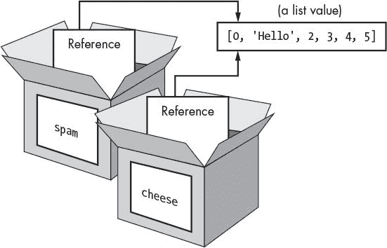
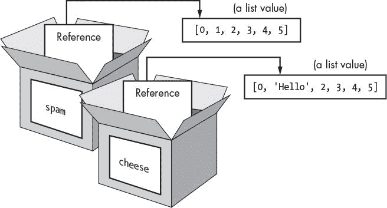

# 十、井字棋

> 原文：[`inventwithpython.com/invent4thed/chapter10.html`](https://inventwithpython.com/invent4thed/chapter10.html)
> 
> 译者：[飞龙](https://github.com/wizardforcel)
> 
> 协议：[CC BY-NC-SA 4.0](https://creativecommons.org/licenses/by-nc-sa/4.0/)


本章介绍了一个井字棋游戏。井字棋通常由两个人玩。一个玩家是*X*，另一个玩家是*O*。玩家轮流放置他们的*X*或*O*。如果一个玩家在一行、一列或对角线上获得了三个标记，他们就赢了。当棋盘填满时，没有玩家获胜，游戏以平局结束。

本章并没有介绍太多新的编程概念。用户将与一个简单的人工智能对战，我们将使用现有的编程知识来编写它。*人工智能（AI）*是一个可以智能地响应玩家动作的计算机程序。玩井字棋的 AI 并不复杂；它实际上只是几行代码。

让我们从程序的一个示例运行开始。玩家通过输入他们想要占据的空间的数字来进行移动。为了帮助我们记住列表中的哪个索引对应哪个空间，我们将对棋盘进行编号，就像键盘的数字键盘一样，如图 10-1 所示。


*图 10-1：棋盘的编号就像键盘的数字键盘一样。*

**本章涉及的主题**

+   人工智能

+   列表引用

+   短路评估

+   `None` 值

### 井字棋的示例运行

当用户运行井字棋程序时，他们看到的是这样的。玩家输入的文本是粗体。

```py
Welcome to Tic-Tac-Toe!
Do you want to be X or O?
X
The computer will go first.
O| |
-+-+-
 | |
-+-+-
 | |
What is your next move? (1-9)
3
O| |
-+-+-
 | |
-+-+-
O| |X

What is your next move? (1-9)
4
O| |O
-+-+-
X| |
-+-+-
O| |X
What is your next move? (1-9)
5
O|O|O
-+-+-
X|X|
-+-+-
O| |X
The computer has beaten you! You lose.
Do you want to play again? (yes or no)
no
```

### 井字棋的源代码

在一个新文件中，输入以下源代码并将其保存为*tictactoe.py*。然后按 F5 运行游戏。如果出现错误，请使用在线 diff 工具将你输入的代码与本书代码进行比较。


`tictactoe.py`

```py
# Tic-Tac-Toe

import random

def drawBoard(board):
    # This function prints out the board that it was passed.

    # "board" is a list of 10 strings representing the board (ignore
           index 0).
    print(board[7] + '|' + board[8] + '|' + board[9])
    print('-+-+-')
    print(board[4] + '|' + board[5] + '|' + board[6])
    print('-+-+-')
    print(board[1] + '|' + board[2] + '|' + board[3])

def inputPlayerLetter():
    # Lets the player type which letter they want to be.
    # Returns a list with the player's letter as the first item and the
           computer's letter as the second.
    letter = ''
    while not (letter == 'X' or letter == 'O'):
        print('Do you want to be X or O?')
        letter = input().upper()

    # The first element in the list is the player's letter; the second is
           the computer's letter.
    if letter == 'X':
        return ['X', 'O']
    else:
        return ['O', 'X']

def whoGoesFirst():
    # Randomly choose which player goes first.
    if random.randint(0, 1) == 0:
        return 'computer'
    else:
        return 'player'

def makeMove(board, letter, move):
    board[move] = letter

def isWinner(bo, le):
    # Given a board and a player's letter, this function returns True if
           that player has won.
    # We use "bo" instead of "board" and "le" instead of "letter" so we
           don't have to type as much.
    return ((bo[7] == le and bo[8] == le and bo[9] == le) or # Across the
           top
    (bo[4] == le and bo[5] == le and bo[6] == le) or # Across the middle
    (bo[1] == le and bo[2] == le and bo[3] == le) or # Across the bottom
    (bo[7] == le and bo[4] == le and bo[1] == le) or # Down the left side
    (bo[8] == le and bo[5] == le and bo[2] == le) or # Down the middle
    (bo[9] == le and bo[6] == le and bo[3] == le) or # Down the right
           side
    (bo[7] == le and bo[5] == le and bo[3] == le) or # Diagonal
    (bo[9] == le and bo[5] == le and bo[1] == le)) # Diagonal

def getBoardCopy(board):
    # Make a copy of the board list and return it.
    boardCopy = []
    for i in board:
        boardCopy.append(i)
    return boardCopy

def isSpaceFree(board, move):
    # Return True if the passed move is free on the passed board.
    return board[move] == ' '

def getPlayerMove(board):
    # Let the player enter their move.
    move = ' '
    while move not in '1 2 3 4 5 6 7 8 9'.split() or not
           isSpaceFree(board, int(move)):
        print('What is your next move? (1-9)')
        move = input()
    return int(move)

def chooseRandomMoveFromList(board, movesList):
    # Returns a valid move from the passed list on the passed board.
    # Returns None if there is no valid move.
    possibleMoves = []
    for i in movesList:
        if isSpaceFree(board, i):
            possibleMoves.append(i)

    if len(possibleMoves) != 0:
        return random.choice(possibleMoves)
    else:
        return None

def getComputerMove(board, computerLetter):
    # Given a board and the computer's letter, determine where to move
           and return that move.
    if computerLetter == 'X':
        playerLetter = 'O'
    else:
        playerLetter = 'X'

    # Here is the algorithm for our Tic-Tac-Toe AI:
    # First, check if we can win in the next move.
    for i in range(1, 10):
        boardCopy = getBoardCopy(board)
        if isSpaceFree(boardCopy, i):
            makeMove(boardCopy, computerLetter, i)
            if isWinner(boardCopy, computerLetter):
                return i

    # Check if the player could win on their next move and block them.
    for i in range(1, 10):
        boardCopy = getBoardCopy(board)
        if isSpaceFree(boardCopy, i):
            makeMove(boardCopy, playerLetter, i)
            if isWinner(boardCopy, playerLetter):
                return i

    # Try to take one of the corners, if they are free.
    move = chooseRandomMoveFromList(board, [1, 3, 7, 9])
    if move != None:
        return move

    # Try to take the center, if it is free.
    if isSpaceFree(board, 5):
        return 5

    # Move on one of the sides.
    return chooseRandomMoveFromList(board, [2, 4, 6, 8])

def isBoardFull(board):
    # Return True if every space on the board has been taken. Otherwise,
           return False.
    for i in range(1, 10):
        if isSpaceFree(board, i):
            return False
    return True


print('Welcome to Tic-Tac-Toe!')

while True:
    # Reset the board.
    theBoard = [' '] * 10
    playerLetter, computerLetter = inputPlayerLetter()
    turn = whoGoesFirst()
    print('The ' + turn + ' will go first.')
    gameIsPlaying = True

    while gameIsPlaying:
        if turn == 'player':
            # Player's turn
            drawBoard(theBoard)
            move = getPlayerMove(theBoard)
            makeMove(theBoard, playerLetter, move)

            if isWinner(theBoard, playerLetter):
                drawBoard(theBoard)
                print('Hooray! You have won the game!')
                gameIsPlaying = False
            else:
                if isBoardFull(theBoard):
                    drawBoard(theBoard)
                    print('The game is a tie!')
                    break
                else:
                    turn = 'computer'

        else:
            # Computer's turn
            move = getComputerMove(theBoard, computerLetter)
            makeMove(theBoard, computerLetter, move)

            if isWinner(theBoard, computerLetter):
                drawBoard(theBoard)
                print('The computer has beaten you! You lose.')
                gameIsPlaying = False
            else:
                if isBoardFull(theBoard):
                    drawBoard(theBoard)
                    print('The game is a tie!')
                    break
                else:
                    turn = 'player'

    print('Do you want to play again? (yes or no)')
    if not input().lower().startswith('y'):
        break
```

### 程序设计

图 10-2 显示了井字棋程序的流程图。程序首先要求玩家选择他们的字母，*X*或*O*。谁先行动是随机选择的。然后玩家和计算机轮流进行移动。


*图 10-2：井字棋的流程图*

流程图左侧的框显示了玩家回合时发生的事情，右侧的框显示了计算机回合时发生的事情。玩家或计算机进行移动后，程序会检查他们是否赢了或导致了平局，然后游戏会切换回合。游戏结束后，程序会询问玩家是否想再玩一次。

#### 将棋盘表示为数据

首先，你必须想出如何将棋盘表示为变量中的数据。在纸上，井字棋棋盘被绘制为一对水平线和一对垂直线，每个九个空间中有一个*X*、*O*或空格。

在程序中，井字棋棋盘被表示为一个字符串列表，就像猜词游戏的 ASCII 艺术一样。每个字符串代表棋盘上的九个空间中的一个。这些字符串要么是`'X'`代表*X*玩家，要么是`'O'`代表*O*玩家，要么是一个单个空格`' '`代表空白空间。

请记住，我们的棋盘布局就像键盘上的数字键盘一样。因此，如果一个包含 10 个字符串的列表存储在一个名为`board`的变量中，那么`board[7]`将是棋盘上的左上角空间，`board[8]`将是顶部中间空间，`board[9]`将是顶部右侧空间，依此类推。程序会忽略列表中索引为`0`的字符串。玩家将输入 1 到 9 的数字来告诉游戏他们想要移动到哪个空间。

#### 与游戏人工智能进行策略

AI 需要能够查看棋盘并决定它将移动到哪种类型的空间。为了清楚起见，我们将在井字棋棋盘上标记三种类型的空间：角落、侧面和中心。图 10-3 中的图表显示了每个空间是什么。

AI 玩井字棋的策略将遵循一个简单的*算法*——一系列指令来计算结果。单个程序可以利用几种不同的算法。算法可以用流程图表示。井字棋 AI 的算法将计算最佳移动，如图 10-4 所示。


图 10-3：侧面、角落和中心空间的位置


*图 10-4：方框代表“获取计算机移动”的五个步骤。指向左边的箭头指向“检查计算机是否赢了”方框。*

AI 的算法有以下步骤：

1.  查看计算机是否可以赢得比赛。如果可以，就走这一步。否则，转到步骤 2。

1.  查看玩家是否可以进行一步棋，导致计算机输掉比赛。如果可以，就移动到那里阻止玩家。否则，转到步骤 3。

1.  检查角落空间（空间 1、3、7 或 9）是否有空闲。如果有，就移动到那里。如果没有空闲的角落空间，就转到步骤 4。

1.  检查中心是否空闲。如果是，就移动到那里。如果不是，就转到步骤 5。

1.  在任何一个侧面空间上移动（空间 2、4、6 或 8）。如果执行到步骤 5，就没有更多的步骤了，因为侧面空间是唯一剩下的空间。

所有这些都发生在图 10-2 中的“获取计算机移动”框中。您可以将这些信息添加到图 10-4 中的框中。

这个算法在`getComputerMove()`和`getComputerMove()`调用的其他函数中实现。

### 导入随机模块

前几行是由注释和导入`random`模块的行组成，以便您可以在以后调用`randint()`函数：

```py
# Tic-Tac-Toe

import random
```

您之前已经见过这两个概念，所以让我们继续进行程序的下一部分。

### 在屏幕上打印棋盘

在代码的下一部分，我们定义一个绘制棋盘的函数：

```py
def drawBoard(board):
    # This function prints out the board that it was passed.

    # "board" is a list of 10 strings representing the board (ignore
          index 0).
    print(board[7] + '|' + board[8] + '|' + board[9])
    print('-+-+-')
    print(board[4] + '|' + board[5] + '|' + board[6])
    print('-+-+-')
    print(board[1] + '|' + board[2] + '|' + board[3])
```

`drawBoard()`函数打印由`board`参数表示的游戏棋盘。请记住，棋盘表示为包含 10 个字符串的列表，其中索引为`1`的字符串是井字棋棋盘上空间 1 的标记，依此类推。索引为`0`的字符串被忽略。游戏的许多函数通过将包含 10 个字符串的列表作为棋盘来工作。

确保字符串中的间距正确；否则，在屏幕上打印时，棋盘会看起来很奇怪。以下是一些示例调用（带有`board`参数）到`drawBoard()`以及函数将打印什么。

```py
>>> drawBoard([' ', ' ', ' ', ' ', 'X', 'O', ' ', 'X', ' ', 'O'])
X| |
-+-+-
X|O|
-+-+-
 | |
>>> drawBoard([' ', ' ', ' ', ' ', ' ', ' ', ' ', ' ', ' ', ' '])
 | |
-+-+-
 | |
-+-+-
 | |
```

程序将每个字符串取出，并根据键盘数字键的顺序放在棋盘上，如图 10-1 所示，因此前三个字符串是棋盘的底行，接下来的三个字符串是中间行，最后三个字符串是顶行。

### 让玩家选择 X 或 O

接下来，我们将定义一个函数来为玩家分配*X*或*O*：

```py
def inputPlayerLetter():
    # Lets the player enter which letter they want to be.
    # Returns a list with the player's letter as the first item and the
          computer's letter as the second.
    letter = ''
    while not (letter == 'X' or letter == 'O'):
        print('Do you want to be X or O?')
        letter = input().upper()
```

`inputPlayerLetter()`函数询问玩家是否想成为*X*或*O*。`while`循环的条件包含括号，这意味着括号内的表达式首先被评估。如果`letter`变量设置为`'X'`，表达式将这样评估：


如果`letter`的值是`'X'`或`'O'`，那么循环的条件是`False`，并且让程序执行继续超出`while`块。如果条件是`True`，程序将继续要求玩家选择一个字母，直到玩家输入*X*或*O*。第 21 行使用`upper()`字符串方法自动将`input()`调用返回的字符串更改为大写字母。

下一个函数返回一个包含两个项的列表：

```py
    # The first element in the list is the player's letter; the second is
          the computer's letter.
    if letter == 'X':
        return ['X', 'O']
    else:
        return ['O', 'X']
```

第一项（索引为`0`的字符串）是玩家的字母，第二项（索引为`1`的字符串）是计算机的字母。`if`和`else`语句选择适当的列表进行返回。

### 决定谁先走

接下来，我们创建一个使用`randint()`来选择玩家或计算机先行的函数：

```py
def whoGoesFirst():
    # Randomly choose which player goes first.
    if random.randint(0, 1) == 0:
        return 'computer'
    else:
        return 'player'
```

`whoGoesFirst()`函数进行虚拟抛硬币，以确定是计算机先走还是玩家先走。抛硬币是通过调用`random.randint(0, 1)`来完成的。函数有 50%的概率返回`0`，50%的概率返回`1`。如果这个函数调用返回`0`，`whoGoesFirst()`函数返回字符串`'computer'`。否则，函数返回字符串`'player'`。调用这个函数的代码将使用返回值来确定谁将首先行动。

### 在棋盘上放置标记

`makeMove()`函数很简单：

```py
def makeMove(board, letter, move):
    board[move] = letter
```

参数是`board`、`letter`和`move`。变量`board`是包含 10 个字符串的列表，表示棋盘的状态。变量`letter`是玩家的字母（`'X'`或`'O'`）。变量`move`是玩家想要走的棋盘位置（是从`1`到`9`的整数）。

但是等等——在第 37 行，这段代码似乎改变了`board`列表中的一个项目为`letter`中的值。然而，由于这段代码在一个函数中，当函数返回时，`board`参数将被遗忘。那么对`board`的更改也应该被遗忘了吧？

实际上，情况并非如此，因为当你将它们作为参数传递给函数时，列表是特殊的。实际上，你传递的是对列表的*引用*，而不是列表本身。让我们了解一下列表和对列表的引用之间的区别。

#### 列表引用

在交互式 shell 中输入以下内容：

```py
>>> spam = 42
>>> cheese = spam
>>> spam = 100
>>> spam
100
>>> cheese
42
```

从你目前所知的结果来看是有意义的。你将`42`赋给`spam`变量，然后将`spam`中的值赋给变量`cheese`。当你稍后将`spam`覆盖为`100`时，这不会影响`cheese`中的值。这是因为`spam`和`cheese`是存储不同值的不同变量。

但是列表不是这样工作的。当你将一个列表分配给一个变量时，你实际上是将一个列表引用分配给变量。*引用*是一个指向存储某些数据的位置的值。让我们看一些代码，这将使这更容易理解。在交互式 shell 中输入以下内容：

```py
➊ >>> spam = [0, 1, 2, 3, 4, 5]
➋ >>> cheese = spam
➌ >>> cheese[1] = 'Hello!'
   >>> spam
   [0, 'Hello!', 2, 3, 4, 5]
   >>> cheese
   [0, 'Hello!', 2, 3, 4, 5]
```

代码只改变了`cheese`列表，但似乎`cheese`和`spam`列表都发生了变化。这是因为`spam`变量不包含列表值本身，而是包含对列表的引用，如图 10-5 所示。列表本身不包含在任何变量中，而是存在于它们之外。


*图 10-5：*spam*列表在*➊*处创建。变量不存储列表，而是存储对列表的引用。*

注意，`cheese = spam`将`spam`中的*列表引用*复制到`cheese` ➋，而不是复制列表值本身。现在`spam`和`cheese`都存储一个引用，指向相同的列表值。但只有一个列表，因为列表本身没有被复制。图 10-6 显示了这种复制。


*图 10-6：*spam*和*cheese*变量存储对同一列表的两个引用。*

因此，➌处的`cheese1] = 'Hello!'`行更改了`spam`引用的相同列表。这就是为什么`spam`返回与`cheese`相同的列表值。它们都有引用，指向相同的列表，如[图 10-7 所示。



*图 10-7：更改列表会更改所有引用该列表的变量。*

如果你想要`spam`和`cheese`存储两个不同的列表，你必须创建两个列表而不是复制一个引用：

```py
>>> spam = [0, 1, 2, 3, 4, 5]
>>> cheese = [0, 1, 2, 3, 4, 5]
```

在前面的例子中，`spam`和`cheese`存储两个不同的列表（即使这些列表在内容上是相同的）。现在，如果您修改其中一个列表，它不会影响另一个，因为`spam`和`cheese`引用了两个不同的列表：

```py
>>> spam = [0, 1, 2, 3, 4, 5]
>>> cheese = [0, 1, 2, 3, 4, 5]
>>> cheese[1] = 'Hello!'
>>> spam
[0, 1, 2, 3, 4, 5]
>>> cheese
[0, 'Hello!', 2, 3, 4, 5]
```

图 10-8 显示了此示例中变量和列表值的设置方式。

字典的工作方式相同。变量不存储字典；它们存储对字典的*引用*。



*图 10-8：*spam*和*cheese*变量现在分别存储对两个不同列表的引用。*

#### 在 makeMove()中使用列表引用

让我们回到`makeMove()`函数：

```py
def makeMove(board, letter, move):
    board[move] = letter
```

当将列表值传递给`board`参数时，函数的局部变量实际上是对列表的引用的副本，而不是列表本身的副本。因此，对此函数中`board`的任何更改也将应用于原始列表。即使`board`是局部变量，`makeMove()`函数也会修改原始列表。

`letter`和`move`参数是您传递的字符串和整数值的副本。由于它们是值的副本，如果您在此函数中修改`letter`或`move`，则在调用`makeMove()`时使用的原始变量不会被修改。

### 检查玩家是否获胜

`isWinner()`函数中的第 42 到 49 行实际上是一个很长的`return`语句：

```py
def isWinner(bo, le):
    # Given a board and a player's letter, this function returns True if
          that player has won.
    # We use "bo" instead of "board" and "le" instead of "letter" so we
          don't have to type as much.
    return ((bo[7] == le and bo[8] == le and bo[9] == le) or # Across the
          top
    (bo[4] == le and bo[5] == le and bo[6] == le) or # Across the middle
    (bo[1] == le and bo[2] == le and bo[3] == le) or # Across the bottom
    (bo[7] == le and bo[4] == le and bo[1] == le) or # Down the left side
    (bo[8] == le and bo[5] == le and bo[2] == le) or # Down the middle
    (bo[9] == le and bo[6] == le and bo[3] == le) or # Down the right
          side
    (bo[7] == le and bo[5] == le and bo[3] == le) or # Diagonal
    (bo[9] == le and bo[5] == le and bo[1] == le)) # Diagonal
```

`bo`和`le`名称是`board`和`letter`参数的快捷方式。这些更短的名称意味着您在此函数中输入的内容更少。请记住，Python 不在乎您给变量取什么名字。

在 Tic-Tac-Toe 中有八种可能的获胜方式：您可以在顶部、中部或底部行中有一条线；您可以在左侧、中间或右侧列中有一条线；或者您可以在两个对角线中的任何一个上有一条线。

条件的每一行都检查给定行的三个空格是否等于提供的字母（与`and`运算符结合）。您使用`or`运算符组合每一行以检查八种不同的获胜方式。这意味着只有八种方式中的一种必须为`True`，我们才能说拥有`le`中字母的玩家是赢家。

假设`le`是`'O'`，`bo`是`[' ', 'O', 'O', 'O', ' ', 'X', ' ', 'X', ' ', ' ']`。棋盘看起来是这样的：

```py
X| |
-+-+-
 |X|
-+-+-
O|O|O
```

以下是第 42 行`return`关键字后的表达式的评估方式。首先，Python 用每个变量的值替换变量`bo`和`le`：

返回（（'X' == 'O' and ' ' == 'O' and ' ' == 'O'）或

（' ' == 'O' and 'X' == 'O' and ' ' == 'O'）或

（'O' == 'O' and 'O' == 'O' and 'O' == 'O'）或

（'X' == 'O' and ' ' == 'O' and 'O' == 'O'）或

（' ' == 'O' and 'X' == 'O' and 'O' == 'O'）或

（' ' == 'O' and ' ' == 'O' and 'O' == 'O'）或

（'X' == 'O' and 'X' == 'O' and 'O' == 'O'）或

（' ' == 'O' and 'X' == 'O' and 'O' == 'O'））

接下来，Python 评估括号内的所有`==`比较为布尔值：

返回（（False 和 False 和 False）或

（False 和 False 和 False）或

（True 和 True 和 True）或

（False 和 False 和 True）或

（False 和 False 和 True）或

（False 和 False 和 True）或

（False 和 False 和 True）或

（False 和 False 和 True））

然后 Python 解释器评估括号内的所有表达式：

返回（（False）或

（False）或

（True）或

（False）或

（False）或

（False）或

（False）或

（False））

由于现在每个内部括号中只有一个值，您可以去掉它们：

返回（False 或

False 或

True 或

False 或

False 或

False 或

False 或

False）

现在 Python 评估由所有这些`or`运算符连接的表达式：

返回（True）

再次去掉括号，你会得到一个值：

返回 True

因此，对于`bo`和`le`的这些值，表达式将求值为`True`。这是程序如何判断玩家是否赢得了比赛。

### 复制棋盘数据

`getBoardCopy()`函数允许您轻松地复制表示游戏中井字棋棋盘的给定 10 个字符串列表。

```py
def getBoardCopy(board):
    # Make a copy of the board list and return it.
    boardCopy = []
    for i in board:
        boardCopy.append(i)
    return boardCopy
```

当 AI 算法计划其移动时，有时需要对棋盘的临时副本进行修改，而不更改实际棋盘。在这些情况下，我们调用此函数来复制棋盘的列表。新列表在第 53 行创建。

现在，`boardCopy`中存储的列表只是一个空列表。`for`循环将遍历`board`参数，将实际棋盘中的字符串值的副本附加到复制的棋盘中。`getBoardCopy()`函数建立了实际棋盘的副本后，它会返回对`boardCopy`中这个新棋盘的引用，而不是对`board`中原始棋盘的引用。

### 检查棋盘上的空格是否空闲

给定一个井字棋棋盘和一个可能的移动，简单的`isSpaceFree()`函数返回该移动是否可用：

```py
def isSpaceFree(board, move):
    # Return True if the passed move is free on the passed board.
    return board[move] == ' '
```

请记住，棋盘列表中的空格标记为单个空格字符串。如果空格的索引处的项目不等于`' '`，则该空格已被占用。

### 让玩家输入移动

`getPlayerMove()`函数要求玩家输入他们想要移动的空格的数字：

```py
def getPlayerMove(board):
    # Let the player enter their move.
    move = ' '
    while move not in '1 2 3 4 5 6 7 8 9'.split() or not
          isSpaceFree(board, int(move)):
        print('What is your next move? (1-9)')
        move = input()
    return int(move)
```

第 65 行的条件是，如果`or`运算符左侧或右侧的表达式中的任何一个为`True`，则条件为`True`。循环确保在玩家输入 1 到 9 之间的整数之前，执行不会继续。它还检查传递给`board`参数的井字棋棋盘中输入的空格是否已被占用。`while`循环内的两行代码只是要求玩家输入 1 到 9 的数字。

左侧的表达式检查玩家的移动是否等于`'1'`、`'2'`、`'3'`，依此类推，直到`'9'`，方法是创建包含这些字符串的列表（使用`split()`方法），并检查`move`是否在此列表中。在这个表达式中，`'1 2 3 4 5 6 7 8 9'.split()`求值为`['1', '2', '3', '4', '5', '6', '7', '8', '9']`，但前者更容易输入。

右侧的表达式检查玩家输入的移动是否是棋盘上的空格，通过调用`isSpaceFree()`。请记住，如果您传递的移动在棋盘上是可用的，`isSpaceFree()`将返回`True`。请注意，`isSpaceFree()`期望`move`是一个整数，因此`int()`函数返回`move`的整数形式。

`not`运算符被添加到两侧，以便当这些要求中的任何一个未满足时，条件为`True`。这会导致循环一遍又一遍地要求玩家输入一个数字，直到他们输入一个合适的移动。

最后，第 68 行返回玩家输入的移动的整数形式。`input()`返回字符串，因此调用`int()`函数返回字符串的整数形式。

### 短路求值

你可能已经注意到`getPlayerMove()`函数中可能存在问题。如果玩家输入了`'Z'`或其他非整数字符串会怎么样？在`or`左侧的表达式`move not in '1 2 3 4 5 6 7 8 9'.split()`会返回`False`，然后 Python 会评估`or`运算符右侧的表达式。

但是调用`int('Z')`会导致 Python 出错，因为`int()`函数只能接受数字字符的字符串，如`'9'`或`'0'`，而不能接受`'Z'`之类的字符串。

要查看此类错误的示例，请在交互式 shell 中输入以下内容：

```py
>>> int('42')
42
>>> int('Z')
Traceback (most recent call last):
  File "<pyshell#3>", line 1, in <module>
    int('Z')
ValueError: invalid literal for int() with base 10: 'Z'
```

但是当您玩井字游戏并尝试输入`'Z'`作为您的移动时，不会发生此错误。这是因为`while`循环的条件被短路了。

*短路*意味着表达式只评估了一部分，因为表达式的其余部分不会改变表达式的评估结果。以下是一个很好的短路示例的简短程序。在交互式 shell 中输入以下内容：

```py
>>> def ReturnsTrue():
        print('ReturnsTrue() was called.')
        return True
>>> def ReturnsFalse():
        print('ReturnsFalse() was called.')
        return False
>>> ReturnsTrue()
ReturnsTrue() was called.
True
>>> ReturnsFalse()
ReturnsFalse() was called.
False
```

当调用`ReturnsTrue()`时，它打印`'ReturnsTrue() was called.'`，然后还显示`ReturnsTrue()`的返回值。`ReturnsFalse()`也是一样。

现在在交互式 shell 中输入以下内容：

```py
>>> ReturnsFalse() or ReturnsTrue()
ReturnsFalse() was called.
ReturnsTrue() was called.
True
>>> ReturnsTrue() or ReturnsFalse()
ReturnsTrue() was called.
True
```

第一部分是有道理的：表达式`ReturnsFalse() or ReturnsTrue()`调用了这两个函数，因此您会看到这两个打印消息。

但第二个表达式只显示`'ReturnsTrue() was called.'`，而不是`'ReturnsFalse() was called.'`。这是因为 Python 根本没有调用`ReturnsFalse()`。由于`or`运算符的左侧是`True`，`ReturnsFalse()`返回什么并不重要，因此 Python 不会调用它。评估被短路了。

对于`and`运算符也是一样。现在在交互式 shell 中输入以下内容：

```py
>>> ReturnsTrue() and ReturnsTrue()
ReturnsTrue() was called.
ReturnsTrue() was called.
True
>>> ReturnsFalse() and ReturnsFalse()
ReturnsFalse() was called.
False
```

同样，如果`and`运算符的左侧是`False`，那么整个表达式就是`False`。右侧是`True`或`False`都无关紧要，因此 Python 不会评估它。`False and True`和`False and False`都求值为`False`，因此 Python 短路了评估。

让我们回到井字游戏程序的第 65 到 68 行：

```py
    while move not in '1 2 3 4 5 6 7 8 9'.split() or not
          isSpaceFree(board, int(move)):
        print('What is your next move? (1-9)')
        move = input()
    return int(move)
```

由于`or`运算符左侧的条件部分（`move not in '1 2 3 4 5 6 7 8 9'.split()`）求值为`True`，Python 解释器知道整个表达式将求值为`True`。右侧的表达式求值为`True`或`False`都无关紧要，因为`or`运算符的两侧只需要一个值为`True`整个表达式才为`True`。

因此，Python 停止检查表达式的其余部分，甚至不会评估`not isSpaceFree(board, int(move))`部分。这意味着只要`move not in '1 2 3 4 5 6 7 8 9'.split()`为`True`，`int()`和`isSpaceFree()`函数就不会被调用。

对于程序来说，这很好，因为如果条件的右侧是`True`，那么`move`不是单个数字的字符串。这将导致`int()`给我们一个错误。但是如果`move not in '1 2 3 4 5 6 7 8 9'.split()`求值为`True`，Python 会短路`not isSpaceFree(board, int(move))`，并且不会调用`int(move)`。

### 从移动列表中选择移动

现在让我们看一下程序后面的 AI 代码中稍后会用到的`chooseRandomMoveFromList()`函数：

```py
def chooseRandomMoveFromList(board, movesList):
    # Returns a valid move from the passed list on the passed board.
    # Returns None if there is no valid move.
    possibleMoves = []
    for i in movesList:
        if isSpaceFree(board, i):
            possibleMoves.append(i)
```

请记住，`board`参数是表示井字游戏板的字符串列表。第二个参数`movesList`是一个可能的空间的整数列表，可以从中选择。例如，如果`movesList`是`[1, 3, 7, 9]`，那么`chooseRandomMoveFromList()`应该返回一个角落空间的整数。

然而，`chooseRandomMoveFromList()`首先检查空间是否有效进行移动。`possibleMoves`列表最初为空列表。然后`for`循环遍历`movesList`。导致`isSpaceFree()`返回`True`的移动使用`append()`方法添加到`possibleMoves`中。

此时，`possibleMoves`列表中包含`movesList`中的所有移动，这些移动也是空闲空间。然后程序检查列表是否为空：

```py
    if len(possibleMoves) != 0:
        return random.choice(possibleMoves)
    else:
        return None
```

如果列表不为空，则至少有一个可能在棋盘上进行的移动。

但是这个列表可能是空的。例如，如果`movesList`是`[1, 3, 7, 9]`，但是由`board`参数表示的棋盘已经有所有的角落空间被占据，那么`possibleMoves`列表将是`[]`。在这种情况下，`len(possibleMoves)`的值为`0`，函数返回值为`None`。

### None 值

`None`值表示缺少值。`None`是数据类型`NoneType`的唯一值。当你需要一个表示“不存在”或“以上都不是”的值时，你可以使用`None`值。

例如，假设你有一个名为`quizAnswer`的变量，它保存了用户对某个判断题的答案。该变量可以保存用户的答案为`True`或`False`。但是如果用户没有回答这个问题，你不希望将`quizAnswer`设置为`True`或`False`，因为那样看起来就像用户回答了这个问题。相反，如果用户跳过了这个问题，你可以将`quizAnswer`设置为`None`。

顺便说一句，`None`不像其他值一样在交互式 shell 中显示出来：

```py
>>> 2 + 2
4
>>> 'This is a string value.'
'This is a string value.'
>>> None
>>>
```

第一个两个表达式的值作为输出打印在下一行，但是`None`没有值，所以没有打印出来。

似乎不返回任何东西的函数实际上返回`None`值。例如，`print()`返回`None`：

```py
>>> spam = print('Hello world!')
Hello world!
>>> spam == None
True
```

在这里，我们将`print('Hello world!')`赋值给`spam`。`print()`函数，像所有函数一样，有一个返回值。即使`print()`打印一个输出，函数调用也会返回`None`。IDLE 不会在交互式 shell 中显示`None`，但是你可以看出`spam`被设置为`None`，因为`spam == None`的值为`True`。

### 创建计算机的 AI

`getComputerMove()`函数包含 AI 的代码：

```py
def getComputerMove(board, computerLetter):
    # Given a board and the computer's letter, determine where to move
          and return that move.
    if computerLetter == 'X':
        playerLetter = 'O'
    else:
        playerLetter = 'X'
```

第一个参数是`board`参数的井字棋棋盘。第二个参数是计算机使用的字母——在`computerLetter`参数中是`'X'`或`'O'`。前几行只是将另一个字母分配给一个名为`playerLetter`的变量。这样，相同的代码可以用于计算机是*X*还是*O*。

记住井字棋 AI 算法是如何工作的：

1.  看看计算机是否可以进行一步获胜的移动。如果可以，就进行该移动。否则，转到步骤 2。

1.  看看玩家是否可以进行一步导致计算机输掉游戏的移动。如果可以，计算机应该移动到那里来阻止玩家。否则，转到步骤 3。

1.  检查是否有任何一个角落（空格 1、3、7 或 9）是空的。如果没有角落空间是空的，转到步骤 4。

1.  检查中心是否空闲。如果是，就移动到那里。如果不是，转到步骤 5。

1.  在任何一侧移动（空格 2、4、6 或 8）。没有更多的步骤，因为如果执行到这一步，侧面空间是唯一剩下的空间。

该函数将返回一个表示计算机移动的整数，从`1`到`9`。让我们逐步了解代码中如何实现这些步骤。

#### 检查计算机是否可以在一步内获胜

在任何其他操作之前，如果计算机可以在下一步获胜，它应该立即进行获胜的移动。

```py
    # Here is the algorithm for our Tic-Tac-Toe AI:
    # First, check if we can win in the next move.
    for i in range(1, 10):
        boardCopy = getBoardCopy(board)
        if isSpaceFree(boardCopy, i):
            makeMove(boardCopy, computerLetter, i)
            if isWinner(boardCopy, computerLetter):
                return i
```

从第 92 行开始的`for`循环遍历从 1 到 9 的每个可能的移动。循环内的代码模拟了如果计算机进行了该移动会发生什么。

循环中的第一行（第 93 行）复制了`board`列表。这样做是为了循环内的模拟移动不会修改存储在`board`变量中的真实井字棋棋盘。`getBoardCopy()`返回一个相同但是独立的棋盘列表值。

第 94 行检查空格是否空闲，如果是，就模拟在棋盘的副本上进行移动。如果这个移动导致计算机获胜，函数返回该移动的整数。

如果没有空格导致获胜，循环结束，程序执行继续到第 100 行。

#### 检查玩家是否可以在一步内获胜

接下来，代码将模拟人类玩家在每个空格上的移动：

```py
    # Check if the player could win on their next move and block them.
    for i in range(1, 10):
        boardCopy = getBoardCopy(board)
        if isSpaceFree(boardCopy, i):
            makeMove(boardCopy, playerLetter, i)
            if isWinner(boardCopy, playerLetter):
                return i
```

该代码类似于第 92 行的循环，只是玩家的字母放在了棋盘副本上。如果`isWinner()`函数显示玩家可以通过一步走棋获胜，那么计算机将返回相同的走法来阻止这种情况发生。

如果人类玩家无法在一步走棋中获胜，`for`循环结束，执行继续到第 108 行。

#### 检查角落、中心和侧面空格（按顺序）

如果计算机无法获胜并且不需要阻止玩家的移动，它将移动到角落、中心或侧面空格，具体取决于可用的空格。

计算机首先尝试移动到其中一个角落空间：

```py
    # Try to take one of the corners, if they are free.
    move = chooseRandomMoveFromList(board, [1, 3, 7, 9])
    if move != None:
        return move
```

使用列表`[1, 3, 7, 9]`调用`chooseRandomMoveFromList()`函数确保函数返回其中一个角落空间的整数：1、3、7 或 9。

如果所有角落空间都被占据，`chooseRandomMoveFromList()`函数将返回`None`，执行将继续到 113 行：

```py
    # Try to take the center, if it is free.
    if isSpaceFree(board, 5):
        return 5
```

如果没有一个角落是可用的，114 行将移动到中心空间（如果它是空的）。如果中心空间不是空的，执行将继续到 117 行：

```py
    # Move on one of the sides.
    return chooseRandomMoveFromList(board, [2, 4, 6, 8])
```

这段代码还调用了`chooseRandomMoveFromList()`，只是你给它传递了一个侧面空间的列表：`[2, 4, 6, 8]`。这个函数不会返回`None`，因为侧面空间是可能剩下的唯一空间。这结束了`getComputerMove()`函数和 AI 算法。

#### 检查棋盘是否已满

最后一个函数是`isBoardFull()`：

```py
def isBoardFull(board):
    # Return True if every space on the board has been taken. Otherwise,
           return False.
    for i in range(1, 10):
        if isSpaceFree(board, i):
            return False
    return True
```

如果`board`参数中的 10 个字符串列表在每个索引（除了被忽略的索引`0`）中都有`'X'`或`'O'`，则此函数返回`True`。`for`循环让我们检查`board`列表上的索引`1`到`9`。一旦它在棋盘上找到一个空格（也就是说，当`isSpaceFree(board, i)`返回`True`时），`isBoardFull()`函数将返回`False`。

如果执行成功通过循环的每次迭代，那么没有空格。然后 124 行将执行`return True`。

### 游戏循环

127 行是第一个不在函数内的代码行，因此它是运行此程序时执行的第一行代码。

```py
print('Welcome to Tic-Tac-Toe!')
```

这行在游戏开始前问候玩家。然后程序在 129 行进入`while`循环：

```py
while True:
    # Reset the board.
    theBoard = [' '] * 10
```

`while`循环一直循环，直到执行遇到`break`语句。第 131 行在名为`theBoard`的变量中设置了主井字棋棋盘。棋盘开始为空，我们用包含 10 个单个空格字符串的列表表示。与其输入完整的列表，第 131 行使用列表复制。输入`[' '] * 10`比`[' ', ' ', ' ', ' ', ' ', ' ', ' ', ' ', ' ', ' ']`更短。

#### 选择玩家的标记和谁先走

接下来，`inputPlayerLetter()`函数允许玩家输入他们想要成为*X*还是*O*：

```py
    playerLetter, computerLetter = inputPlayerLetter()
```

该函数返回一个包含两个字符串的列表，要么`['X', 'O']`，要么`['O', 'X']`。我们使用多重赋值将`playerLetter`设置为返回列表中的第一项，将`computerLetter`设置为第二项。

从那里，`whoGoesFirst()`函数随机决定谁先走，返回字符串`'player'`或字符串`'computer'`，然后第 134 行告诉玩家谁将先走：

```py
    turn = whoGoesFirst()
    print('The ' + turn + ' will go first.')
    gameIsPlaying = True
```

`gameIsPlaying`变量跟踪游戏是否仍在进行中，或者是否有人赢了或打成平局。

#### 运行玩家回合

第 137 行的循环将在`gameIsPlaying`设置为`True`时在玩家回合和计算机回合的代码之间来回执行：

```py
    while gameIsPlaying:
        if turn == 'player':
            # Player's turn
            drawBoard(theBoard)
            move = getPlayerMove(theBoard)
            makeMove(theBoard, playerLetter, move)
```

`turn`变量最初由 133 行的`whoGoesFirst()`调用设置为`'player'`或`'computer'`。如果`turn`等于`'computer'`，那么 138 行的条件为`False`，执行跳转到 156 行。

但是如果第 138 行的评估结果为`True`，第 140 行调用`drawBoard()`并将`theBoard`变量传递给打印出井字棋棋盘。然后`getPlayerMove()`让玩家输入他们的移动（并确保它是有效的移动）。`makeMove()`函数将玩家的*X*或*O*添加到`theBoard`。

现在玩家已经下完了棋，程序应该检查他们是否赢得了比赛：

```py
            if isWinner(theBoard, playerLetter):
                drawBoard(theBoard)
                print('Hooray! You have won the game!')
                gameIsPlaying = False
```

如果`isWinner()`函数返回`True`，`if`块的代码会显示获胜的棋盘，并打印一条消息告诉玩家他们赢了。`gameIsPlaying`变量也被设置为`False`，以便执行不会继续到计算机的回合。

如果玩家在上一步没有赢，也许他们的移动填满了整个棋盘并打成平局。程序接下来用一个`else`语句检查这个条件：

```py
            else:
                if isBoardFull(theBoard):
                    drawBoard(theBoard)
                    print('The game is a tie!')
                    break
```

在这个`else`块中，如果`isBoardFull()`函数返回`True`，表示没有更多的移动可供选择。在这种情况下，从第 149 行开始的`if`块会显示平局的棋盘，并告诉玩家发生了平局。然后执行跳出`while`循环并跳转到第 173 行。

如果玩家没有赢得比赛或打成平局，程序会进入另一个`else`语句：

```py
            else:
                turn = 'computer'
```

第 154 行将`turn`变量设置为'computer'，以便程序在下一次迭代中执行计算机的回合代码。

#### 运行计算机的回合

如果行 138 的条件不是'player'，那么就是计算机的回合。这个`else`块中的代码与玩家回合的代码类似：

```py
        else:
            # Computer's turn
            move = getComputerMove(theBoard, computerLetter)
            makeMove(theBoard, computerLetter, move)

            if isWinner(theBoard, computerLetter):
                drawBoard(theBoard)
                print('The computer has beaten you! You lose.')
                gameIsPlaying = False
        else:
            if isBoardFull(theBoard):
                drawBoard(theBoard)
                print('The game is a tie!')
                break
            else:
                turn = 'player'
```

第 157 到 171 行几乎与第 139 到 154 行的玩家回合的代码相同。唯一的区别是这段代码使用计算机的字母并调用`getComputerMove()`。

如果比赛没有赢得或打成平局，第 171 行将`turn`设置为玩家的回合。在`while`循环内没有更多的代码行，所以执行会跳回到第 137 行的`while`语句。

#### 询问玩家是否再玩一次

最后，程序询问玩家是否想再玩一局：

```py
    print('Do you want to play again? (yes or no)')
    if not input().lower().startswith('y'):
        break
```

在第 137 行的`while`语句开始的`while`块之后，立即执行 173 到 175 行。当比赛结束时，`gameIsPlaying`被设置为`False`，所以此时游戏会询问玩家是否想再玩一次。

`not input().lower().startswith('y')`表达式如果玩家输入的内容不以'y'开头，则为`True`。在这种情况下，`break`语句执行。这将跳出从第 129 行开始的`while`循环。但是因为在该`while`块之后没有更多的代码行，程序终止并结束游戏。

### 摘要

创建一个带有 AI 的程序归结为仔细考虑 AI 可能遇到的所有可能情况，以及在每种情况下它应该如何做出反应。井字棋 AI 很简单，因为井字棋中可能的移动不像国际象棋或跳棋那样多。

我们的计算机 AI 检查是否有可能获胜的移动。否则，它会检查是否必须阻止玩家的移动。然后 AI 简单地选择任何可用的角落空间，然后中心空间，然后侧面空间。这是计算机要遵循的一个简单算法。

实现我们的 AI 的关键是复制棋盘数据并在副本上模拟移动。这样，AI 代码可以看到移动是否导致胜利或失败。然后 AI 可以在真正的棋盘上进行移动。这种模拟对于预测什么是或不是一个好的移动是有效的。


