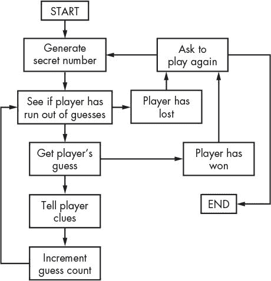

# 十一、BAGELS 推理游戏

> 原文：[`inventwithpython.com/invent4thed/chapter11.html`](https://inventwithpython.com/invent4thed/chapter11.html)
> 
> 译者：[飞龙](https://github.com/wizardforcel)
> 
> 协议：[CC BY-NC-SA 4.0](https://creativecommons.org/licenses/by-nc-sa/4.0/)


Bagels 是一个推理游戏，玩家试图猜出计算机生成的随机三位数（不重复数字）。每次猜测后，计算机会给玩家三种类型的线索：

**Bagels** 猜测的三个数字中没有一个在秘密数字中。

**Pico** 一个数字在秘密数字中，但是猜测的数字位置不对。

**费米** 猜测中有一个正确的数字在正确的位置。

计算机可以给出多个线索，这些线索按字母顺序排序。如果秘密数字是 456，玩家的猜测是 546，线索将是“fermi pico pico”。 “fermi”来自 6，“pico pico”来自 4 和 5。

在本章中，您将学习一些 Python 提供的新方法和函数。您还将了解增强赋值运算符和字符串插值。虽然它们不能让您做任何以前做不到的事情，但它们是使编码更容易的好快捷方式。

**本章涵盖的主题**

+   `random.shuffle()`函数

+   增强赋值运算符，`+=`, `-=`, `*=`, `/=`

+   `sort()`列表方法

+   `join()`字符串方法

+   字符串插值

+   转换说明符`%s`

+   嵌套循环

### Bagels 的示例运行

当用户运行 Bagels 程序时，用户看到的文本如下。玩家输入的文本显示为粗体。

```py
I am thinking of a 3-digit number. Try to guess what it is.
The clues I give are...
When I say:    That means:
  Bagels       None of the digits is correct.
  Pico         One digit is correct but in the wrong position.
  Fermi        One digit is correct and in the right position.
I have thought up a number. You have 10 guesses to get it.
Guess #1:
123
Fermi
Guess #2:
453
Pico
Guess #3:
425
Fermi
Guess #4:
326
Bagels
Guess #5:
489
Bagels
Guess #6:
075
Fermi Fermi
Guess #7:
015
Fermi Pico
Guess #8:
175
You got it!
Do you want to play again? (yes or no)
no
```

### Bagels 的源代码

在一个新文件中，输入以下源代码并将其保存为*bagels.py*。然后按 F5 运行游戏。如果出现错误，请将您输入的代码与书中的代码进行比较，使用在线 diff 工具[`www.nostarch.com/inventwithpython#diff`](https://www.nostarch.com/inventwithpython#diff)。


`bagels.py`

```py
import random

NUM_DIGITS = 3
MAX_GUESS = 10

def getSecretNum():
    # Returns a string of unique random digits that is NUM_DIGITS long.
    numbers = list(range(10))
    random.shuffle(numbers)
    secretNum = ''
    for i in range(NUM_DIGITS):
        secretNum += str(numbers[i])
    return secretNum

def getClues(guess, secretNum):
    # Returns a string with the Pico, Fermi, & Bagels clues to the user.
    if guess == secretNum:
        return 'You got it!'

    clues = []
    for i in range(len(guess)):
        if guess[i] == secretNum[i]:
            clues.append('Fermi')
        elif guess[i] in secretNum:
            clues.append('Pico')
    if len(clues) == 0:
        return 'Bagels'

    clues.sort()
    return ' '.join(clues)

def isOnlyDigits(num):
    # Returns True if num is a string of only digits. Otherwise, returns
          False.
    if num == '':
        return False

    for i in num:
        if i not in '0 1 2 3 4 5 6 7 8 9'.split():
            return False

    return True


print('I am thinking of a %s-digit number. Try to guess what it is.' %
      (NUM_DIGITS))
print('The clues I give are...')
print('When I say:    That means:')
print(' Bagels        None of the digits is correct.')
print(' Pico          One digit is correct but in the wrong position.')
print(' Fermi         One digit is correct and in the right position.')

while True:
    secretNum = getSecretNum()
    print('I have thought up a number. You have %s guesses to get it.' %
          (MAX_GUESS))

    guessesTaken = 1
    while guessesTaken <= MAX_GUESS:
        guess = ''
        while len(guess) != NUM_DIGITS or not isOnlyDigits(guess):
            print('Guess #%s: ' % (guessesTaken))
            guess = input()

        print(getClues(guess, secretNum))
        guessesTaken += 1

        if guess == secretNum:
            break
        if guessesTaken > MAX_GUESS:
            print('You ran out of guesses. The answer was %s.' %
                  (secretNum))

    print('Do you want to play again? (yes or no)')
    if not input().lower().startswith('y'):
        break
```

### Bagels 的流程图

图 11-1 中的流程图描述了游戏中发生的事情以及每个步骤发生的顺序。

Bagels 的流程图非常简单。计算机生成一个秘密数字，玩家试图猜出该数字，计算机根据他们的猜测给出线索。这一过程一遍又一遍地进行，直到玩家赢了或输了。游戏结束后，无论玩家赢还是输，计算机都会询问玩家是否想再玩一次。



*图 11-1：Bagels 游戏的流程图*

### 导入随机数和定义 getSecretNum()

在程序开始时，我们将导入`random`模块并设置一些全局变量。然后我们将定义一个名为`getSecretNum()`的函数。

```py
import random

NUM_DIGITS = 3
MAX_GUESS = 10

def getSecretNum():
    # Returns a string of unique random digits that is NUM_DIGITS long.
```

我们使用常量变量`NUM_DIGITS`代替整数`3`作为答案中数字的数量。玩家猜测次数也是一样，我们使用常量变量`MAX_GUESS`代替整数`10`。现在很容易改变猜测次数或秘密数字的数量。只需更改第 3 行或第 4 行的值，程序的其余部分仍将正常工作，无需进行其他更改。

`getSecretNum()`函数生成一个只包含唯一数字的秘密数字。如果秘密数字中没有重复的数字，Bagels 游戏会更有趣，比如`'244'`或`'333'`。我们将使用一些新的 Python 函数来实现这一点。

### 洗牌一个独特的数字集

`getSecretNum()`的前两行对一组不重复的数字进行了洗牌：

```py
    numbers = list(range(10))
    random.shuffle(numbers)
```

第 8 行的`list(range(10))`求值为`[0, 1, 2, 3, 4, 5, 6, 7, 8, 9]`，因此`numbers`变量包含所有 10 个数字的列表。

#### 使用 random.shuffle()函数更改列表项顺序

`random.shuffle()`函数会随机更改列表项的顺序（在本例中是数字列表）。此函数不返回值，而是修改您传递给它的列表*原地*。这类似于第 10 章中的井字棋游戏中的`makeMove()`函数修改了传递给它的列表，而不是返回具有更改的新列表。这就是为什么您*不*编写像`numbers = random.shuffle(numbers)`这样的代码。

尝试通过将以下代码输入交互式 shell 来尝试使用`shuffle()`函数：

```py
>>> import random
>>> spam = list(range(10))
>>> print(spam)
[0, 1, 2, 3, 4, 5, 6, 7, 8, 9]
>>> random.shuffle(spam)
>>> print(spam)
[3, 0, 5, 9, 6, 8, 2, 4, 1, 7]
>>> random.shuffle(spam)
>>> print(spam)
[9, 8, 3, 5, 4, 7, 1, 2, 0, 6]
```

每次在`spam`上调用`random.shuffle()`时，`spam`列表中的项目都会被洗牌。您将看到我们如何使用`shuffle()`函数来生成下一个秘密数字。

#### 从洗牌后的数字中获取秘密数字

秘密数字将是洗牌后的整数列表的前`NUM_DIGITS`位的字符串：

```py
    secretNum = ''
    for i in range(NUM_DIGITS):
        secretNum += str(numbers[i])
    return secretNum
```

`secretNum`变量最初为空字符串。第 11 行的`for`循环迭代`NUM_DIGITS`次。在循环的每次迭代中，从洗牌列表中的索引`i`处提取整数，将其转换为字符串，并连接到`secretNum`的末尾。

例如，如果`numbers`指的是列表`[9, 8, 3, 5, 4, 7, 1, 2, 0, 6]`，那么在第一次迭代中，`numbers[0]`（即`9`）将被传递给`str()`；这将返回`'9'`，它将被连接到`secretNum`的末尾。在第二次迭代中，`numbers[1]`（即`8`）发生了同样的情况，在第三次迭代中，`numbers[2]`（即`3`）也是如此。返回的`secretNum`的最终值是`'983'`。

请注意，此函数中的`secretNum`包含一个字符串，而不是整数。这可能看起来很奇怪，但请记住，您不能连接整数。表达式`9 + 8 + 3`计算结果为`20`，但您想要的是`'9' + '8' + '3'`，计算结果为`'983'`。

### 增强赋值运算符

第 12 行的`+=`运算符是*增强赋值运算符*之一。通常，如果要将值添加或连接到变量，您将使用类似以下的代码：

```py
>>> spam = 42
>>> spam = spam + 10
>>> spam
52
>>> eggs = 'Hello '
>>> eggs = eggs + 'world!'
>>> eggs
'Hello world!'
```

增强赋值运算符是一种可以使您摆脱重新输入变量名的快捷方式。以下代码与先前的代码执行相同的操作：

```py
>>> spam = 42
>>> spam += 10       # The same as spam = spam + 10
>>> spam
52
>>> eggs = 'Hello '
>>> eggs += 'world!' # The same as eggs = eggs + 'world!'
>>> eggs
'Hello world!'
```

还有其他增强赋值运算符。将以下内容输入交互式 shell：

```py
>>> spam = 42
>>> spam -= 2
>>> spam
40
```

语句`spam –= 2`与语句`spam = spam – 2`相同，因此表达式计算结果为`spam = 42 – 2`，然后为`spam = 40`。

还有用于乘法和除法的增强赋值运算符：

```py
>>> spam *= 3
>>> spam
120
>>> spam /= 10
>>> spam
12.0
```

语句`spam *= 3`与`spam = spam * 3`相同。因此，由于`spam`之前设置为`40`，完整表达式将是`spam = 40 * 3`，计算结果为`120`。表达式`spam /= 10`与`spam = spam / 10`相同，`spam = 120 / 10`计算结果为`12.0`。请注意，在除法后，`spam`变成了浮点数。

### 计算要给出的线索

`getClues()`函数将根据`guess`和`secretNum`参数返回一个包含 fermi、pico 和 bagels 线索的字符串。

```py
def getClues(guess, secretNum):
    # Returns a string with the Pico, Fermi, & Bagels clues to the user.
    if guess == secretNum:
        return 'You got it!'

    clues = []
    for i in range(len(guess)):
        if guess[i] == secretNum[i]:
            clues.append('Fermi')
        elif guess[i] in secretNum:
            clues.append('Pico')
```

最明显的步骤是检查猜测是否与秘密数字相同，我们在第 17 行中进行了检查。在这种情况下，第 18 行返回`'You got it!'`。

如果猜测与秘密数字不同，程序必须找出给玩家什么线索。`clues`中的列表将从空开始，并根据需要添加`'Fermi'`和`'Pico'`字符串。

程序通过循环遍历`guess`和`secretNum`中的每个可能的索引来执行此操作。这两个变量中的字符串将具有相同的长度，因此第 21 行可以使用`len(guess)`或`len(secretNum)`中的任何一个，并且效果相同。当`i`的值从`0`变化到`1`到`2`等时，第 22 行检查`guess`的第一个、第二个、第三个等字符是否与`secretNum`相应索引处的字符相同。如果是，第 23 行将字符串`'Fermi'`添加到`clues`中。

否则，第 24 行检查`guess`中第`i`个位置的数字是否存在于`secretNum`中的任何位置。如果是，你就知道这个数字在秘密数字中的某个位置，但不在同一个位置。在这种情况下，第 25 行将`'Pico'`添加到`clues`中。

如果循环后`clues`列表为空，那么你就知道`guess`中根本没有正确的数字：

```py
    if len(clues) == 0:
        return 'Bagels'
```

在这种情况下，第 27 行返回字符串`'Bagels'`作为唯一的线索。

### sort()列表方法

列表有一个名为`sort()`的方法，它可以按字母顺序或数字顺序排列列表项。当调用`sort()`方法时，它不会返回排序后的列表，而是在原地对列表进行排序。这就像`shuffle()`方法的工作方式一样。

你绝对不想使用`return spam.sort()`，因为那会返回值`None`。相反，你需要另外一行`spam.sort()`，然后再加上`return spam`这一行。

在交互式 shell 中输入以下内容：

```py
>>> spam = ['cat', 'dog', 'bat', 'anteater']
>>> spam.sort()
>>> spam
['anteater', 'bat', 'cat', 'dog']
>>> spam = [9, 8, 3, 5.5, 5, 7, 1, 2.1, 0, 6]
>>> spam.sort()
>>> spam
[0, 1, 2.1, 3, 5, 5.5, 6, 7, 8, 9]
```

当我们对字符串列表进行排序时，字符串按字母顺序返回，但当我们对数字列表进行排序时，数字按数字顺序返回。

在第 29 行，我们对`clues`使用`sort()`：

```py
    clues.sort()
```

你希望按字母顺序对`clue`列表进行排序的原因是为了摆脱会帮助玩家更轻松猜出秘密数字的额外信息。如果`clues`是`['Pico', 'Fermi', 'Pico']`，那会告诉玩家猜测的中间数字在正确的位置。由于另外两个线索都是`Pico`，玩家会知道他们只需要交换第一个和第三个数字就能得到秘密数字。

如果线索总是按字母顺序排序，玩家就无法确定`Fermi`线索指的是哪个数字。这使得游戏更加困难和有趣。

### join()字符串方法

`join()`字符串方法将一组字符串作为一个单独的字符串连接在一起返回。

```py
    return ' '.join(clues)
```

方法调用的字符串（在第 30 行，这是一个单个空格，`' '`）出现在列表中的每个字符串之间。要查看示例，请在交互式 shell 中输入以下内容：

```py
>>> ' '.join(['My', 'name', 'is', 'Zophie'])
'My name is Zophie'
>>> ', '.join(['Life', 'the Universe', 'and Everything'])
'Life, the Universe, and Everything'
```

因此，第 30 行返回的字符串是`clue`中的每个字符串与每个字符串之间的单个空格组合在一起。`join()`字符串方法有点像`split()`字符串方法的相反。`split()`从分割的字符串返回一个列表，而`join()`从组合的列表返回一个字符串。

### 检查字符串是否只包含数字

`isOnlyDigits()`函数有助于确定玩家输入了有效的猜测：

```py
def isOnlyDigits(num):
    # Returns True if num is a string of only digits. Otherwise, returns
          False.
    if num == '':
        return False
```

第 34 行首先检查`num`是否为空字符串，如果是，则返回`False`。

然后`for`循环遍历字符串`num`中的每个字符：

```py
    for i in num:
        if i not in '0 1 2 3 4 5 6 7 8 9'.split():
            return False

    return True
```

`i`的值将在每次迭代中有一个单个字符。在`for`块内部，代码检查`i`是否存在于`'0 1 2 3 4 5 6 7 8 9'.split()`返回的列表中。（`split()`的返回值等同于`['0', '1', '2', '3', '4', '5', '6', '7', '8', '9']`。）如果`i`不存在于该列表中，你就知道`num`中有一个非数字字符。在这种情况下，第 39 行返回`False`。

但是，如果执行继续超过`for`循环，那么你就知道`num`中的每个字符都是一个数字。在这种情况下，第 41 行返回`True`。

### 开始游戏

在所有函数定义之后，第 44 行是程序的实际开始：

```py
print('I am thinking of a %s-digit number. Try to guess what it is.' %
      (NUM_DIGITS))
print('The clues I give are...')
print('When I say:    That means:')
print('  Bagels       None of the digits is correct.')
print('  Pico         One digit is correct but in the wrong position.')
print('  Fermi        One digit is correct and in the right position.')
```

`print()`函数调用告诉玩家游戏规则以及 pico、fermi 和 bagels 线索的含义。第 44 行的`print()`调用在末尾添加了`% (NUM_DIGITS)`，并在字符串内部使用了`%s`。这是一种称为*字符串插值*的技术。

### 字符串插值

字符串插值，也称为*字符串格式化*，是一种编码快捷方式。通常，如果你想在另一个字符串中使用变量中的字符串值，你必须使用`+`连接运算符：

```py
>>> name = 'Alice'
>>> event = 'party'
>>> location = 'the pool'
>>> day = 'Saturday'
>>> time = '6:00pm'
>>> print('Hello, ' + name + '. Will you go to the ' + event + ' at ' +
location + ' this ' + day + ' at ' + time + '?')
Hello, Alice. Will you go to the party at the pool this Saturday at 6:00pm?
```

如您所见，键入连接多个字符串可能会耗费时间。相反，您可以使用字符串插值，它允许您在字符串中放置类似`%s`的占位符。这些占位符称为*转换说明符*。一旦放入转换说明符，您可以在字符串的末尾放置所有变量名。每个`%s`都将被最后一行的变量替换，替换的顺序与输入变量的顺序相同。例如，以下代码与前面的代码执行相同的操作：

```py
>>> name = 'Alice'
>>> event = 'party'
>>> location = 'the pool'
>>> day = 'Saturday'
>>> time = '6:00pm'
>>> print('Hello, %s. Will you go to the %s at %s this %s at %s?' % (name,
event, location, day, time))
Hello, Alice. Will you go to the party at the pool this Saturday at 6:00pm?
```

请注意，第一个变量名用于第一个`%s`，第二个变量用于第二个`%s`，依此类推。您必须具有与变量数量相同的`%s`转换说明符。

使用字符串插值而不是字符串连接的另一个好处是，插值适用于任何数据类型，而不仅仅是字符串。所有值都会自动转换为字符串数据类型。如果将整数连接到字符串，将会出现错误：

```py
>>> spam = 42
>>> print('Spam == ' + spam)
Traceback (most recent call last):
  File "<stdin>", line 1, in <module>
TypeError: Can't convert 'int' object to str implicitly
```

字符串连接只能组合两个字符串，但`spam`是一个整数。您必须记住将`spam`替换为`str(spam)`而不是`spam`。

现在将其输入交互式 shell：

```py
>>> spam = 42
>>> print('Spam is %s' % (spam))
Spam is 42
```

使用字符串插值，这种转换到字符串的操作是由程序自动完成的。

### 游戏循环

第 51 行是一个无限的`while`循环，其条件为`True`，因此它将一直循环，直到执行`break`语句：

```py
while True:
    secretNum = getSecretNum()
    print('I have thought up a number. You have %s guesses to get it.' %
          (MAX_GUESS))

    guessesTaken = 1
    while guessesTaken <= MAX_GUESS:
```

在无限循环中，您从`getSecretNum()`函数中获得一个秘密数字。这个秘密数字被分配给`secretNum`。请记住，`secretNum`中的值是一个字符串，而不是一个整数。

第 53 行使用字符串插值告诉玩家秘密数字中有多少位数字。第 55 行将变量`guessesTaken`设置为`1`，标记这是第一次猜测。然后第 56 行有一个新的`while`循环，只要玩家还有猜测次数，就会循环。在代码中，这是当`guessesTaken`小于或等于`MAX_GUESS`时。

请注意，第 56 行的`while`循环位于第 51 行开始的另一个`while`循环内。这些内部循环称为*嵌套循环*。任何`break`或`continue`语句，例如第 66 行的`break`语句，只会中断或继续最内层的循环，而不会中断或继续任何外部循环。

#### 获取玩家的猜测

`guess`变量保存了从`input()`返回的玩家猜测。代码不断循环并要求玩家猜测，直到他们输入有效的猜测：

```py
        guess = ''
        while len(guess) != NUM_DIGITS or not isOnlyDigits(guess):
            print('Guess #%s: ' % (guessesTaken))
            guess = input()
```

有效的猜测只包含数字，并且与秘密数字的位数相同。从第 58 行开始的`while`循环检查猜测的有效性。

第 57 行将`guess`变量设置为空字符串，因此第 58 行的`while`循环条件第一次检查时为`False`，确保执行进入从第 59 行开始的循环。

#### 获取玩家猜测的线索

在执行超过从第 58 行开始的`while`循环后，`guess`包含一个有效的猜测。现在程序将`guess`和`secretNum`传递给`getClues()`函数：

```py
        print(getClues(guess, secretNum))
        guessesTaken += 1
```

它返回一串线索，这些线索在第 62 行显示给玩家。第 63 行使用增强赋值运算符进行加法，递增`guessesTaken`。

#### 检查玩家是赢了还是输了

现在我们要弄清楚玩家是赢了还是输了游戏：

```py
        if guess == secretNum:
            break
        if guessesTaken > MAX_GUESS:
            print('You ran out of guesses. The answer was %s.' %
                  (secretNum))
```

如果`guess`的值与`secretNum`相同，玩家已经正确猜出了秘密数字，并且第 66 行跳出了从第 56 行开始的`while`循环。如果不是，则执行继续到第 67 行，程序检查玩家是否已经用完了猜测次数。

如果玩家还有更多的猜测，执行会跳回到第 56 行的`while`循环，让玩家再猜一次。如果玩家用完了猜测次数（或程序在第 66 行的`break`语句中跳出循环），执行将继续到第 70 行。

#### 要求玩家再玩一次

第 70 行询问玩家是否想再玩一次：

```py
    print('Do you want to play again? (yes or no)')
    if not input().lower().startswith('y'):
        break
```

玩家的响应由`input()`返回，对其调用`lower()`方法，然后对其调用`startswith()`方法来检查玩家的响应是否以`y`开头。如果不是，则程序会跳出从第 51 行开始的`while`循环。由于在此循环之后没有更多的代码，程序终止。

如果响应确实以`y`开头，程序不会执行`break`语句，并且执行会跳回到第 51 行。然后程序会生成一个新的秘密数字，这样玩家就可以玩一个新游戏。

### 摘要

贝果是一个简单的游戏，但很难赢。但如果你继续玩，最终会发现使用游戏给出的线索来猜测的更好的方法。这很像您在继续编程时会变得更好一样。

本章介绍了一些新的函数和方法——`shuffle()`、`sort()`和`join()`，以及一些方便的快捷方式。增强赋值运算符在想要改变变量的相对值时需要输入更少的内容；例如，`spam = spam + 1`可以缩短为`spam += 1`。通过字符串插值，您可以在字符串中放置`%s`（称为*转换说明符*），使您的代码更易读，而不是使用许多字符串连接操作。

在第 12 章中，我们不会进行任何编程，但是后面章节中的游戏将需要笛卡尔坐标和负数的概念。这些数学概念不仅在我们将要制作的声纳寻宝、反转棋和躲避者游戏中使用，而且在许多其他游戏中也会用到。即使你已经了解这些概念，也请阅读第 12 章进行简要复习。

