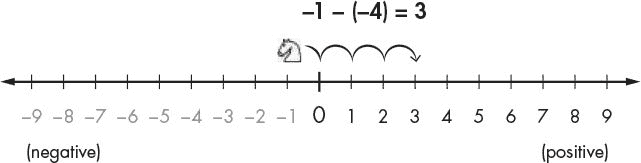

# 十二、笛卡尔坐标系

> 原文：[`inventwithpython.com/invent4thed/chapter12.html`](https://inventwithpython.com/invent4thed/chapter12.html)
> 
> 译者：[飞龙](https://github.com/wizardforcel)
> 
> 协议：[CC BY-NC-SA 4.0](https://creativecommons.org/licenses/by-nc-sa/4.0/)


本章介绍了您将在本书的其余部分中使用的一些简单数学概念。在二维（2D）游戏中，屏幕上的图形可以向左、向右、向上或向下移动。这些游戏需要一种将屏幕上的位置转换为程序可以处理的整数的方法。

*图 12-2：相同的棋盘，但行和列都有数字坐标*

本章涵盖的主题


您可以将棋盘视为笛卡尔坐标系。通过使用行标签和列标签，您可以给出一个坐标，该坐标仅适用于棋盘上的一个空间。如果您在数学课上学过笛卡尔坐标系，您可能知道数字用于行和列。使用数字坐标的棋盘将看起来像图 12-2。

注意，要使黑色骑士移动到白色骑士的位置，黑色骑士必须向上移动两个空间并向右移动四个空间。但是，您不需要查看棋盘来弄清楚这一点。如果您知道白色骑士位于（5,6），黑色骑士位于（1,4），您可以使用减法来弄清楚这一信息。

+   像素

+   加法的交换律

+   x 轴和 y 轴

### 这就是*笛卡尔坐标系*的用武之地。*坐标*是表示屏幕上特定点的数字。这些数字可以存储为程序变量中的整数。

引用国际象棋棋盘上特定位置的常见方法是用字母和数字标记每一行和列。图 12-1 显示了一个每一行和列都有标记的国际象棋棋盘。


*图 12-1：一个带有黑色骑士（a，4）和白色骑士（e，6）的样本棋盘*

+   笛卡尔坐标系

棋盘上空间的坐标是行和列的组合。在国际象棋中，骑士棋子看起来像马头。图 12-1 中的白色骑士位于点（e，6），因为它在列 e 和行 6，黑色骑士位于点（a，4），因为它在列 a 和行 4。

沿列向左和向右的数字是*x 轴*的一部分。沿行向上和向下的数字是*y 轴*的一部分。坐标始终以 x 坐标优先，然后是 y 坐标。在图 12-2 中，白色骑士的 x 坐标为 5，y 坐标为 6，因此白色骑士位于坐标（5,6），而不是（6,5）。同样，黑色骑士位于坐标（1,4），而不是（4,1），因为黑色骑士的 x 坐标为 1，y 坐标为 4。

+   负数

+   绝对值和`abs()`函数

从白色骑士的 x 坐标中减去黑色骑士的 x 坐标：5-1=4。黑色骑士必须沿 x 轴移动四个空间。现在从白色骑士的 y 坐标中减去黑色骑士的 y 坐标：6-4=2。黑色骑士必须沿 y 轴移动两个空间。

**网格和笛卡尔坐标**

通过对坐标数字进行一些数学运算，您可以计算出两个坐标之间的距离。

### 负数

笛卡尔坐标系也使用*负数*——小于零的数。数前的减号表示它是负数：-1 小于 0。-2 小于-1。但 0 本身既不是正数也不是负数。在图 12-3 中，你可以看到数轴上正数向右增加，负数向左减少。


*图 12-3：带有正数和负数的数轴*

数轴对于理解减法和加法很有用。你可以将表达式 5+3 看作白色骑士从位置 5 开始向右移动 3 个空格。正如你在图 12-4 中所看到的，白色骑士最终停在位置 8。这是有道理的，因为 5+3 等于 8。


*图 12-4：将白色骑士向右移动会增加坐标。*

你通过将白色骑士向左移动来进行减法。因此，如果表达式是 5-6，白色骑士从位置 5 开始向左移动 6 个空格，如图 12-5 所示。


*图 12-5：将白色骑士向左移动会减少坐标。*

白色骑士最终停在位置-1。这意味着 5-6 等于-1。

如果你加或减一个负数，白色骑士的移动方向与正数相反。如果你加一个负数，骑士向左移动。如果你减去一个负数，骑士向右移动。表达式-1-（-4）将等于 3，如图 12-6 所示。注意-1-（-4）的答案与-1+4 相同。



*图 12-6：骑士从-6 开始向右移动 4 个空格。*

你可以将 x 轴看作一个数轴。再加上一个上下移动的 y 轴。如果将这两个数轴放在一起，就会得到一个像图 12-7 中的笛卡尔坐标系。

添加一个正数（或减去一个负数）会使骑士在 y 轴上向上移动，或者在 x 轴上向右移动，而减去一个正数（或加上一个负数）会使骑士在 y 轴上向下移动，或者在 x 轴上向左移动。

中心的（0，0）坐标被称为*原点*。你可能在数学课上使用过这样的坐标系。正如你将要看到的，这些坐标系有很多小技巧，可以帮助你更容易地计算坐标。


*图 12-7：将两个数轴放在一起可以创建笛卡尔坐标系。*

### 计算机屏幕的坐标系

你的计算机屏幕由*像素*组成，是屏幕可以显示的最小颜色点。计算机屏幕通常使用一个坐标系，原点（0，0）位于左上角，向下和向右增加。你可以在图 12-8 中看到这一点，该图显示了一个分辨率为 1920 像素宽和 1080 像素高的笔记本电脑屏幕。

没有负坐标。大多数计算机图形在屏幕上使用这种坐标系，你将在本书的游戏中使用它。对于编程来说，了解坐标系的工作原理很重要，无论是数学使用的还是计算机屏幕使用的。


*图 12-8：计算机屏幕上的笛卡尔坐标系*

### 数学技巧

当你面前有一个数轴时，加减负数就很容易。即使没有数轴，也可以很容易。以下是三个技巧，可以帮助你自己加减负数。

#### 技巧 1：减号吃掉它左边的加号

当你看到一个减号和左边有一个加号时，你可以用减号替换加号。想象减号“吃掉”左边的加号。答案仍然是一样的，因为加上一个负值就等同于减去一个正值。所以 4 + -2 和 4 - 2 都等于 2，如下所示：


#### 技巧 2：两个负号合并成一个加号

当你看到两个负号相邻而没有数字在它们中间时，它们可以合并成一个加号。答案仍然是一样的，因为减去一个负值就等同于加上一个正值：


#### 技巧 3：两个相加的数字可以交换位置

你总是可以交换加法中的数字。这就是*加法的交换律*。这意味着像 6 + 4 到 4 + 6 的交换不会改变答案，当你数一下图 12-9 中的方块时就会发现。


*图 12-9：加法的交换律让你可以交换数字。*

假设你正在加一个负数和一个正数，比如-6 + 8。因为你在加数字，所以你可以交换数字的顺序而不改变答案。这意味着-6 + 8 和 8 + -6 是一样的。然后当你看 8 + -6 时，你会发现减号可以吃掉左边的加号，问题变成了 8 - 6 = 2，如下所示：


你已经重新排列了问题，这样就更容易解决，而不需要使用计算器或计算机。

### 绝对值和 abs()函数

一个数的*绝对值*是没有负号的数。因此，正数不变，但负数变成正数。例如，-4 的绝对值是 4。-7 的绝对值是 7。5 的绝对值（已经是正数）就是 5。

你可以通过减去它们的位置并取差的绝对值来计算两个对象之间的距离。想象一下，白色骑士在位置 4，黑色骑士在位置-2。距离将是 6，因为 4 - -2 是 6，6 的绝对值是 6。

无论数字的顺序如何，它都适用。例如，-2 - 4（即负二减四）是-6，-6 的绝对值也是 6。

Python 的`abs()`函数返回一个整数的绝对值。在交互式 shell 中输入以下内容：

```py
>>> abs(-5)
5
>>> abs(42)
42
>>> abs(-10.5)
10.5
```

-5 的绝对值是 5。正数的绝对值就是这个数，所以 42 的绝对值是 42。即使是带小数的偶数也有绝对值，所以-10.5 的绝对值是 10.5。

### 总结

大多数编程不需要理解很多数学。直到这一章，我们一直在使用简单的加法和乘法。

笛卡尔坐标系用于描述二维区域中某个位置的位置。坐标有两个数字：x 坐标和 y 坐标。x 轴左右运行，y 轴上下运行。在计算机屏幕上，原点在左上角，坐标向右和向下增加。

在本章中学到的三个数学技巧使得加减正负整数变得容易。第一个技巧是减号会吃掉左边的加号。第二个技巧是两个负号相邻会合并成一个加号。第三个技巧是你可以交换要相加的数字的位置。

本书中的其余游戏都使用这些概念，因为它们都有二维区域。所有图形游戏都需要理解笛卡尔坐标是如何工作的。


