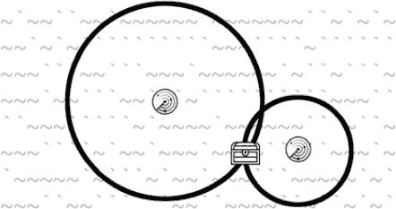

# 十三、声纳寻宝

> 原文：[`inventwithpython.com/invent4thed/chapter13.html`](https://inventwithpython.com/invent4thed/chapter13.html)
> 
> 译者：[飞龙](https://github.com/wizardforcel)
> 
> 协议：[CC BY-NC-SA 4.0](https://creativecommons.org/licenses/by-nc-sa/4.0/)


本章的声纳寻宝游戏是第一个使用你在第 12 章中学到的笛卡尔坐标系的游戏。这个游戏还使用了数据结构，这只是说它有包含其他列表和类似复杂变量的列表值。随着你编写的游戏变得更加复杂，你需要将数据组织成数据结构。

在本章的游戏中，玩家在海洋的各个地方放置声纳设备来寻找沉没的宝藏。*声纳*是船只用来在海底找到物体的技术。这个游戏中的声纳设备告诉玩家最近的宝藏箱离他有多远，但没有告诉他方向。但是通过放置多个声纳设备，玩家可以找出宝藏箱的位置。

**本章涵盖的主题**

+   数据结构

+   毕达哥拉斯定理

+   `remove()` 列表方法

+   `isdigit()` 字符串方法

+   `sys.exit()` 函数

有 3 个宝箱可供寻找，玩家只有 20 个声纳设备来找到它们。想象一下，你在图 13-1 中看不到宝箱。因为每个声纳设备只能找到离宝箱的距离，而不是宝箱的方向，所以宝藏可能在声纳设备周围的环上的任何地方。


*图 13-1：声纳设备的圆环触碰到（隐藏的）宝箱。*

但是多个声纳设备一起工作可以将宝藏箱的位置缩小到环交叉的确切坐标处（见图 13-2）。



*Figure 13-2: Combining multiple rings shows where treasure chests could be hidden.*

### 声纳寻宝的示例运行

当用户运行声纳寻宝程序时，用户看到的内容如下。玩家输入的文本以粗体显示。

```py
S O N A R !

Would you like to view the instructions? (yes/no)
no
             1         2         3         4         5
   012345678901234567890123456789012345678901234567890123456789

 0 ~`~``~``~``~`~`~```~`~``````~```~`~~~`~~```~~`~~~~~`~~`~~~~` 0
 1 ~~~~~`~~~~~````~``~~```~``~`~`~`~``~~```~~~`~`~```~~~~`~`~~` 1
 2 ```~````~``~`~`~~~``~~`````~~``~``~``~~```~~``~~`~~~````~~`~ 2
 3 `````~~``````~`~~~~~```~~``~~~`~`~~~~~~`````~`~```~~~``~``~` 3
 4 ~~~`~~~`~`~~~``~~~`~`~``~~~~``~~~~``~~~~`~`~``~~```~``~~`~`~ 4
 5 `~``~````~`~`~~``~~~~``````~```~~~~````````~``~~~`~~``~~```` 5
 6 ~`~```~~`~~```~````````~~```~```~~~~``~~~`~`~~`~``~~~`~~`~`` 6
 7 ~`~~~```~``~```~`~```~~~~~~~`~~`~`~~~~``~```~~~`~```~``~``~` 7
 8 `~``~~`~`~~`~~`~~``~```~````~`~```~``~````~~~````~~``~~``~~` 8
 9 ~`~``~~````~~```~`~~```~~`~``~`~~``~`~`~~~~`~`~~`~`~```~~``` 9
10 `~~~~~~`~``~``~~~``~``~~~~`~``~```~`~~``~~~~~~``````~~`~``~~ 10
11 ~``~~~````~`~~`~~~`~~~``~``````~`~``~~~~`````~~~``````~`~`~~ 11
12 ~~~~~``~`~````~```~`~`~`~~`~~`~``~~~~~~~`~~```~~``~~`~~~~``` 12
13 `~~```~~````````~~~`~~~```~~~~~~~~`~~``~~`~```~`~~````~~~``~ 13
14 ```~``~`~`~``~```~`~``~`~``~~```~`~~~``~~``~```~`~~`~``````~ 14

   012345678901234567890123456789012345678901234567890123456789
             1         2         3         4         5
You have 20 sonar device(s) left. 3 treasure chest(s) remaining.
Where do you want to drop the next sonar device? (0-59 0-14) (or type quit)
25 5
             1         2         3         4         5
   012345678901234567890123456789012345678901234567890123456789

 0 ~`~``~``~``~`~`~```~`~``````~```~`~~~`~~```~~`~~~~~`~~`~~~~` 0
 1 ~~~~~`~~~~~````~``~~```~``~`~`~`~``~~```~~~`~`~```~~~~`~`~~` 1
 2 ```~````~``~`~`~~~``~~`````~~``~``~``~~```~~``~~`~~~````~~`~ 2
 3 `````~~``````~`~~~~~```~~``~~~`~`~~~~~~`````~`~```~~~``~``~` 3
 4 ~~~`~~~`~`~~~``~~~`~`~``~~~~``~~~~``~~~~`~`~``~~```~``~~`~`~ 4
 5 `~``~````~`~`~~``~~~~````5`~```~~~~````````~``~~~`~~``~~```` 5
 6 ~`~```~~`~~```~````````~~```~```~~~~``~~~`~`~~`~``~~~`~~`~`` 6
 7 ~`~~~```~``~```~`~```~~~~~~~`~~`~`~~~~``~```~~~`~```~``~``~` 7
 8 `~``~~`~`~~`~~`~~``~```~````~`~```~``~````~~~````~~``~~``~~` 8
 9 ~`~``~~````~~```~`~~```~~`~``~`~~``~`~`~~~~`~`~~`~`~```~~``` 9
10 `~~~~~~`~``~``~~~``~``~~~~`~``~```~`~~``~~~~~~``````~~`~``~~ 10
11 ~``~~~````~`~~`~~~`~~~``~``````~`~``~~~~`````~~~``````~`~`~~ 11
12 ~~~~~``~`~````~```~`~`~`~~`~~`~``~~~~~~~`~~```~~``~~`~~~~``` 12
13 `~~```~~````````~~~`~~~```~~~~~~~~`~~``~~`~```~`~~````~~~``~ 13
14 ```~``~`~`~``~```~`~``~`~``~~```~`~~~``~~``~```~`~~`~``````~ 14

   012345678901234567890123456789012345678901234567890123456789
             1         2         3         4         5
Treasure detected at a distance of 5 from the sonar device.
You have 19 sonar device(s) left. 3 treasure chest(s) remaining.
Where do you want to drop the next sonar device? (0-59 0-14) (or type quit)
30 5
             1         2         3         4         5
   012345678901234567890123456789012345678901234567890123456789

 0 ~`~``~``~``~`~`~```~`~``````~```~`~~~`~~```~~`~~~~~`~~`~~~~` 0
 1 ~~~~~`~~~~~````~``~~```~``~`~`~`~``~~```~~~`~`~```~~~~`~`~~` 1
 2 ```~````~``~`~`~~~``~~`````~~``~``~``~~```~~``~~`~~~````~~`~ 2
 3 `````~~``````~`~~~~~```~~``~~~`~`~~~~~~`````~`~```~~~``~``~` 3
 4 ~~~`~~~`~`~~~``~~~`~`~``~~~~``~~~~``~~~~`~`~``~~```~``~~`~`~ 4
 5 `~``~````~`~`~~``~~~~````5`~``3~~~~````````~``~~~`~~``~~```` 5
 6 ~`~```~~`~~```~````````~~```~```~~~~``~~~`~`~~`~``~~~`~~`~`` 6
 7 ~`~~~```~``~```~`~```~~~~~~~`~~`~`~~~~``~```~~~`~```~``~``~` 7
 8 `~``~~`~`~~`~~`~~``~```~````~`~```~``~````~~~````~~``~~``~~` 8
 9 ~`~``~~````~~```~`~~```~~`~``~`~~``~`~`~~~~`~`~~`~`~```~~``` 9
10 `~~~~~~`~``~``~~~``~``~~~~`~``~```~`~~``~~~~~~``````~~`~``~~ 10
11 ~``~~~````~`~~`~~~`~~~``~``````~`~``~~~~`````~~~``````~`~`~~ 11
12 ~~~~~``~`~````~```~`~`~`~~`~~`~``~~~~~~~`~~```~~``~~`~~~~``` 12
13 `~~```~~````````~~~`~~~```~~~~~~~~`~~``~~`~```~`~~````~~~``~ 13
14 ```~``~`~`~``~```~`~``~`~``~~```~`~~~``~~``~```~`~~`~``````~ 14

   012345678901234567890123456789012345678901234567890123456789
             1         2         3         4         5
Treasure detected at a distance of 3 from the sonar device.
You have 18 sonar device(s) left. 3 treasure chest(s) remaining.
Where do you want to drop the next sonar device? (0-59 0-14) (or type quit)
25 10
             1         2         3         4         5
   012345678901234567890123456789012345678901234567890123456789

 0 ~`~``~``~``~`~`~```~`~``````~```~`~~~`~~```~~`~~~~~`~~`~~~~` 0
 1 ~~~~~`~~~~~````~``~~```~``~`~`~`~``~~```~~~`~`~```~~~~`~`~~` 1
 2 ```~````~``~`~`~~~``~~`````~~``~``~``~~```~~``~~`~~~````~~`~ 2
 3 `````~~``````~`~~~~~```~~``~~~`~`~~~~~~`````~`~```~~~``~``~` 3
 4 ~~~`~~~`~`~~~``~~~`~`~``~~~~``~~~~``~~~~`~`~``~~```~``~~`~`~ 4
 5 `~``~````~`~`~~``~~~~````5`~``3~~~~````````~``~~~`~~``~~```` 5
 6 ~`~```~~`~~```~````````~~```~```~~~~``~~~`~`~~`~``~~~`~~`~`` 6
 7 ~`~~~```~``~```~`~```~~~~~~~`~~`~`~~~~``~```~~~`~```~``~``~` 7
 8 `~``~~`~`~~`~~`~~``~```~````~`~```~``~````~~~````~~``~~``~~` 8
 9 ~`~``~~````~~```~`~~```~~`~``~`~~``~`~`~~~~`~`~~`~`~```~~``` 9
10 `~~~~~~`~``~``~~~``~``~~~4`~``~```~`~~``~~~~~~``````~~`~``~~ 10
11 ~``~~~````~`~~`~~~`~~~``~``````~`~``~~~~`````~~~``````~`~`~~ 11
12 ~~~~~``~`~````~```~`~`~`~~`~~`~``~~~~~~~`~~```~~``~~`~~~~``` 12
13 `~~```~~````````~~~`~~~```~~~~~~~~`~~``~~`~```~`~~````~~~``~ 13
14 ```~``~`~`~``~```~`~``~`~``~~```~`~~~``~~``~```~`~~`~``````~ 14

   012345678901234567890123456789012345678901234567890123456789
             1         2         3         4         5
Treasure detected at a distance of 4 from the sonar device.
You have 17 sonar device(s) left. 3 treasure chest(s) remaining.
Where do you want to drop the next sonar device? (0-59 0-14) (or type quit)
29 8
             1         2         3         4         5
   012345678901234567890123456789012345678901234567890123456789
 0 ~`~``~``~``~`~`~```~`~``````~```~`~~~`~~```~~`~~~~~`~~`~~~~` 0
 1 ~~~~~`~~~~~````~``~~```~``~`~`~`~``~~```~~~`~`~```~~~~`~`~~` 1
 2 ```~````~``~`~`~~~``~~`````~~``~``~``~~```~~``~~`~~~````~~`~ 2
 3 `````~~``````~`~~~~~```~~``~~~`~`~~~~~~`````~`~```~~~``~``~` 3
 4 ~~~`~~~`~`~~~``~~~`~`~``~~~~``~~~~``~~~~`~`~``~~```~``~~`~`~ 4
 5 `~``~````~`~`~~``~~~~````X`~``X~~~~````````~``~~~`~~``~~```` 5
 6 ~`~```~~`~~```~````````~~```~```~~~~``~~~`~`~~`~``~~~`~~`~`` 6
 7 ~`~~~```~``~```~`~```~~~~~~~`~~`~`~~~~``~```~~~`~```~``~``~` 7
 8 `~``~~`~`~~`~~`~~``~```~````~X~```~``~````~~~````~~``~~``~~` 8
 9 ~`~``~~````~~```~`~~```~~`~``~`~~``~`~`~~~~`~`~~`~`~```~~``` 9
10 `~~~~~~`~``~``~~~``~``~~~X`~``~```~`~~``~~~~~~``````~~`~``~~ 10
11 ~``~~~````~`~~`~~~`~~~``~``````~`~``~~~~`````~~~``````~`~`~~ 11
12 ~~~~~``~`~````~```~`~`~`~~`~~`~``~~~~~~~`~~```~~``~~`~~~~``` 12
13 `~~```~~````````~~~`~~~```~~~~~~~~`~~``~~`~```~`~~````~~~``~ 13
14 ```~``~`~`~``~```~`~``~`~``~~```~`~~~``~~``~```~`~~`~``````~ 14

   012345678901234567890123456789012345678901234567890123456789
             1         2         3         4         5
You have found a sunken treasure chest!
You have 16 sonar device(s) left. 2 treasure chest(s) remaining.
Where do you want to drop the next sonar device? (0-59 0-14) (or type quit)
--snip--
```

### 声纳寻宝的源代码

在新文件中输入以下源代码并将文件保存为*sonar.py*。然后按 F5（或 OS X 上的 FN-F5）运行它。如果在输入此代码后出现错误，请使用在线 diff 工具将您输入的代码与本书代码进行比较，网址为[`www.nostarch.com/inventwithpython#diff`](https://www.nostarch.com/inventwithpython#diff)。


`sonar.py`

```py
# Sonar Treasure Hunt

import random
import sys
import math

def getNewBoard():
    # Create a new 60x15 board data structure.
    board = []
    for x in range(60): # The main list is a list of 60 lists.
        board.append([])
        for y in range(15): # Each list in the main list has
               15 single-character strings.
            # Use different characters for the ocean to make it more
                   readable.
            if random.randint(0, 1) == 0:
                board[x].append('~')
            else:
                board[x].append('`')
    return board

def drawBoard(board):
    # Draw the board data structure.
    tensDigitsLine = '    ' # Initial space for the numbers down the left
           side of the board
    for i in range(1, 6):
        tensDigitsLine += (' ' * 9) + str(i)

    # Print the numbers across the top of the board.
    print(tensDigitsLine)
    print('   ' + ('0123456789' * 6))
    print()

    # Print each of the 15 rows.
    for row in range(15):
        # Single-digit numbers need to be padded with an extra space.
        if row < 10:
            extraSpace = ' '
        else:
            extraSpace = ''

        # Create the string for this row on the board.
        boardRow = ''
        for column in range(60):
            boardRow += board[column][row]

        print('%s%s %s %s' % (extraSpace, row, boardRow, row))

    # Print the numbers across the bottom of the board.
    print()
    print(' ' + ('0123456789' * 6))
    print(tensDigitsLine)

def getRandomChests(numChests):
    # Create a list of chest data structures (two-item lists of x, y int
           coordinates).
    chests = []
    while len(chests) < numChests:
        newChest = [random.randint(0, 59), random.randint(0, 14)]
        if newChest not in chests: # Make sure a chest is not already
               here.
            chests.append(newChest)
    return chests

def isOnBoard(x, y):
    # Return True if the coordinates are on the board; otherwise, return
           False.
    return x >= 0 and x <= 59 and y >= 0 and y <= 14

def makeMove(board, chests, x, y):
    # Change the board data structure with a sonar device character.
           Remove treasure chests from the chests list as they are found.
    # Return False if this is an invalid move.
    # Otherwise, return the string of the result of this move.
    smallestDistance = 100 # Any chest will be closer than 100.
    for cx, cy in chests:
        distance = math.sqrt((cx - x) * (cx - x) + (cy - y) * (cy - y))

        if distance < smallestDistance: # We want the closest treasure
               chest.
            smallestDistance = distance

    smallestDistance = round(smallestDistance)

    if smallestDistance == 0:
        # xy is directly on a treasure chest!
        chests.remove([x, y])
        return 'You have found a sunken treasure chest!'
    else:
        if smallestDistance < 10:
            board[x][y] = str(smallestDistance)
            return 'Treasure detected at a distance of %s from the sonar
                   device.' % (smallestDistance)
        else:
            board[x][y] = 'X'
            return 'Sonar did not detect anything. All treasure chests
                   out of range.'

def enterPlayerMove(previousMoves):
    # Let the player enter their move. Return a two-item list of int
           xy coordinates.
    print('Where do you want to drop the next sonar device? (0-59 0-14)
           (or type quit)')
    while True:
        move = input()
        if move.lower() == 'quit':
            print('Thanks for playing!')
            sys.exit()

        move = move.split()
        if len(move) == 2 and move[0].isdigit() and move[1].isdigit() and
               isOnBoard(int(move[0]), int(move[1])):
            if [int(move[0]), int(move[1])] in previousMoves:
                print('You already moved there.')
                continue
            return [int(move[0]), int(move[1])]

        print('Enter a number from 0 to 59, a space, then a number from
               0 to 14.')

def showInstructions():
    print('''Instructions:
You are the captain of the Simon, a treasure-hunting ship. Your current
       mission
is to use sonar devices to find three sunken treasure chests at the
       bottom of
the ocean. But you only have cheap sonar that finds distance, not
       direction.

Enter the coordinates to drop a sonar device. The ocean map will be
       marked with
how far away the nearest chest is, or an X if it is beyond the sonar
       device's
range. For example, the C marks are where chests are. The sonar device
       shows a
3 because the closest chest is 3 spaces away.

                    1         2         3
          012345678901234567890123456789012

        0 ~~~~`~```~`~``~~~``~`~~``~~~``~`~ 0
        1 ~`~`~``~~`~```~~~```~~`~`~~~`~~~~ 1
        2 `~`C``3`~~~~`C`~~~~`````~~``~~~`` 2
        3 ````````~~~`````~~~`~`````~`~``~` 3
        4 ~`~~~~`~~`~~`C`~``~~`~~~`~```~``~ 4

          012345678901234567890123456789012
                    1         2         3
(In the real game, the chests are not visible in the ocean.)

Press enter to continue...''')
    input()

    print('''When you drop a sonar device directly on a chest, you
           retrieve it and the other
sonar devices update to show how far away the next nearest chest is. The
       chests
are beyond the range of the sonar device on the left, so it shows an X.

                    1         2         3
          012345678901234567890123456789012

        0 ~~~~`~```~`~``~~~``~`~~``~~~``~`~ 0
        1 ~`~`~``~~`~```~~~```~~`~`~~~`~~~~ 1
        2 `~`X``7`~~~~`C`~~~~`````~~``~~~`` 2
        3 ````````~~~`````~~~`~`````~`~``~` 3
        4 ~`~~~~`~~`~~`C`~``~~`~~~`~```~``~ 4

          012345678901234567890123456789012
                    1         2         3

The treasure chests don't move around. Sonar devices can detect treasure
       chests
up to a distance of 9 spaces. Try to collect all 3 chests before running
       out of
sonar devices. Good luck!

Press enter to continue...''')
    input()


print('S O N A R !')
print()
print('Would you like to view the instructions? (yes/no)')
if input().lower().startswith('y'):
    showInstructions()

while True:
    # Game setup
    sonarDevices = 20
    theBoard = getNewBoard()
    theChests = getRandomChests(3)
    drawBoard(theBoard)
    previousMoves = []

    while sonarDevices > 0:
        # Show sonar device and chest statuses.
        print('You have %s sonar device(s) left. %s treasure chest(s)
               remaining.' % (sonarDevices, len(theChests)))

        x, y = enterPlayerMove(previousMoves)
        previousMoves.append([x, y]) # We must track all moves so that
               sonar devices can be updated.

        moveResult = makeMove(theBoard, theChests, x, y)
        if moveResult == False:
            continue
        else:
            if moveResult == 'You have found a sunken treasure chest!':
                # Update all the sonar devices currently on the map.
                for x, y in previousMoves:
                    makeMove(theBoard, theChests, x, y)
            drawBoard(theBoard)
            print(moveResult)

        if len(theChests) == 0:
            print('You have found all the sunken treasure chests!
                   Congratulations and good game!')
            break

        sonarDevices -= 1

    if sonarDevices == 0:
        print('We\'ve run out of sonar devices! Now we have to turn the
               ship around and head')
        print('for home with treasure chests still out there! Game
               over.')
        print('    The remaining chests were here:')
        for x, y in theChests:
            print('    %s, %s' % (x, y))

    print('Do you want to play again? (yes or no)')
    if not input().lower().startswith('y'):
        sys.exit()
```

### 程序设计

在尝试理解源代码之前，玩几次游戏以了解发生了什么。声纳寻宝游戏使用列表的列表和其他复杂的变量，称为*数据结构*。数据结构存储值的排列以表示某些东西。例如，在第 10 章中，井字棋板数据结构是一个字符串列表。字符串代表*X*、*O*或空格，列表中字符串的索引代表棋盘上的空格。声纳寻宝游戏将有类似的数据结构来表示宝箱和声纳设备的位置。

### 导入 random、sys 和 math 模块

在程序开始时，我们导入`random`、`sys`和`math`模块：

```py
# Sonar Treasure Hunt

import random
import sys
import math
```

`sys`模块包含`exit()`函数，用于立即终止程序。`sys.exit()`调用后的代码行将不会运行；程序就像已经到达了结尾一样停止。此函数稍后在程序中使用。

`math`模块包含`sqrt()`函数，用于找到一个数字的平方根。平方根背后的数学在第 186 页的“寻找最近的宝箱”中有解释。

### 创建新游戏板

每个新游戏的开始都需要一个新的`board`数据结构，由`getNewBoard()`创建。声纳寻宝游戏板是一个 ASCII 艺术海洋，周围有 x 和 y 坐标。

当我们使用`board`数据结构时，我们希望能够以与访问笛卡尔坐标相同的方式访问其坐标系统。为此，我们将使用一个列表的列表来调用棋盘上的每个坐标，如`board[x][y]`。x 坐标在 y 坐标之前——要获取坐标（26, 12）处的字符串，您访问`board[26][12]`，而不是`board[12][26]`。

```py
def getNewBoard():
    # Create a new 60x15 board data structure.
    board = []
    for x in range(60): # The main list is a list of 60 lists.
        board.append([])
        for y in range(15): # Each list in the main list has
              15 single-character strings.
            # Use different characters for the ocean to make it more
                  readable.
          if random.randint(0, 1) == 0:
              board[x].append('~')
          else:
              board[x].append('`')
```

`board`数据结构是一个字符串列表的列表。第一个列表代表 x 坐标。由于游戏板宽 60 个字符，因此这个第一个列表需要包含 60 个列表。在第 10 行，我们创建了一个`for`循环，将 60 个空列表附加到其中。

但`board`不仅仅是 60 个空列表的列表。这 60 个列表中的每一个代表游戏板的一个 x 坐标。棋盘上有 15 行，因此这 60 个列表中的每一个必须包含 15 个字符串。第 12 行是另一个`for`循环，它添加了 15 个表示海洋的单字符字符串。

海洋将是一堆随机选择的`'~'`和`'`字符串。波浪（`~`）和反引号（`` ` ``）字符——键盘上 1 键旁边的波浪符号`~`将用于海洋波浪。要确定使用哪个字符，第 14 至 17 行应用此逻辑：如果`random.randint()`的返回值为`0`，则添加`'~'`字符串；否则，添加``'`'``字符串。这将使海洋看起来随机而波涛汹涌。

举个小例子，如果`board`设置为``[['~', '~', '`'], [['~', '~', '`'], [['~', '~', '`'], ['~', '`', '`'], ['`', '~', '`']]``，那么它绘制的棋盘将如下所示：

```py
~~~~`
~~~`~
`````
```

最后，函数返回第 18 行的`board`变量中的值：

```py
    return board
```

### 绘制游戏板

接下来，我们将定义`drawBoard()`方法，每当我们实际绘制新棋盘时都会调用它：

```py
def drawBoard(board):
```

带有边缘坐标的完整游戏板如下所示：

```py
             1         2         3         4         5
   012345678901234567890123456789012345678901234567890123456789
 0 ~~~`~``~~~``~~~~``~`~`~`~`~~`~~~`~~`~``````~~`~``~`~~```~`~` 0
 1 `~`~````~~``~`~```~```~```~`~~~``~~`~~~``````~`~``~~``~~`~~` 1
 2 ```~~~~`~`~~```~~~``~````~~`~`~~`~`~`~```~~`~``~~`~`~~~~~~`~ 2
 3 ~~~~`~~~``~```~``~~`~`~~`~`~~``~````~`~````~```~`~`~`~`````~ 3
 4 ~```~~~~~`~~````~~~~```~~~`~`~`~````~`~~`~`~~``~~`~``~`~``~~ 4
 5 `~```~`~`~~`~~~```~~``~``````~~``~`~`~~~~`~~``~~~~~~`~```~~` 5
 6 ``~~`~~`~``~`````~````~~``~`~~~~`~~```~~~``~`~`~~``~~~```~~~ 6
 7 ``~``~~~~~~```~`~```~~~``~`~``~`~~~~~~```````~~~`~~`~~`~~`~~ 7
 8 ~~`~`~~```~``~~``~~~``~~`~`~~`~`~```~```~~~```~~~~~~`~`~~~~` 8
 9 ```~``~`~~~`~~```~``~``~~~```~````~```~`~~`~~~~~`~``~~~~~``` 9
10 `~~~~```~`~````~`~`~~``~`~~~~`~``~``~```~~```````~`~``~````` 10
11 ~~`~`~~`~``~`~~~````````````````~~`````~`~~``~`~~~~`~~~`~~`~ 11
12 ~~`~~~~```~~~`````~~``~`~`~~``````~`~~``~```````~~``~~~`~~`~ 12
13 `~``````~~``~`~~~```~~~~```~~`~`~~~`~```````~~`~```~``~`~~~~ 13
14 ~~~``~```~`````~~`~`~``~~`~``~`~~`~`~``~`~``~~``~`~``~```~~~ 14
   012345678901234567890123456789012345678901234567890123456789
             1         2         3         4         5
```

`drawBoard()`函数中的绘制有四个步骤：

1.  创建一个字符串变量，其中 1、2、3、4 和 5 之间用宽间隔分隔。这些数字标记了 x 轴上的 10、20、30、40 和 50 的坐标。

1.  使用该字符串在屏幕顶部显示 x 轴坐标。

1.  打印海洋的每一行以及屏幕两侧的 y 轴坐标。

1.  在底部再次打印 x 轴。在所有侧面都有坐标使得更容易看到在哪里放置声纳设备。

#### 在棋盘顶部绘制 x 坐标

`drawBoard()`的第一部分在棋盘顶部打印 x 轴。因为我们希望棋盘的每个部分都是均匀的，所以每个坐标标签只能占用一个字符空间。当坐标编号达到 10 时，每个数字有两位数，因此我们将十位数放在单独的一行上，如图 13-3 所示。x 轴的组织方式是第一行显示十位数，第二行显示个位数。


*图 13-3：用于打印游戏板顶部的间距*

22 到 24 行创建了棋盘第一行的字符串，这是 x 轴的十位部分：

```py
    # Draw the board data structure.
    tensDigitsLine = '    ' # Initial space for the numbers down the left
          side of the board
    for i in range(1, 6):
        tensDigitsLine += (' ' * 9) + str(i)
```

第一行上标记十位数的数字之间都有 9 个空格，数字 1 前面有 13 个空格。22 到 24 行创建了一个包含此行的字符串，并将其存储在名为`tensDigitsLine`的变量中：

```py
    # Print the numbers across the top of the board.
    print(tensDigitsLine)
    print('   ' + ('0123456789' * 6))
    print()
```

要打印游戏板顶部的数字，首先打印`tensDigitsLine`变量的内容。然后，在下一行打印三个空格（以便这一行正确对齐），然后打印字符串`'0123456789'`六次：`('0123456789' * 6)`。

#### 绘制海洋

32 到 44 行打印海洋波浪的每一行，包括沿着两侧标记 y 轴的数字：

```py
    # Print each of the 15 rows.
    for row in range(15):
        # Single-digit numbers need to be padded with an extra space.
        if row < 10:
            extraSpace = ' '
        else:
            extraSpace = ''
```

`for`循环打印了 0 到 14 行，以及棋盘两侧的行号。

但我们与 x 轴遇到的问题相同。只有一位数字的数字（例如 0,1,2 等）在打印时只占用一个空间，但是两位数字（例如 10,11 和 12）占用两个空间。如果坐标大小不同，行将不对齐。棋盘将如下所示：

```py
8 ~~`~`~~```~``~~``~~~``~~`~`~~`~`~```~```~~~```~~~~~~`~`~~~~` 8
9 ```~``~`~~~`~~```~``~``~~~```~````~```~`~~`~~~~~`~``~~~~~``` 9
10 `~~~~```~`~````~`~`~~``~`~~~~`~``~``~```~~```````~`~``~````` 10
11 ~~`~`~~`~``~`~~~````````````````~~`````~`~~``~`~~~~`~~~`~~`~ 11
```

解决方法很简单：在所有个位数前面加一个空格。第 34 到 37 行将变量`extraSpace`设置为空格或空字符串。总是打印`extraSpace`变量，但它有一个仅用于个位数行号的空格字符。否则，它是一个空字符串。这样，打印时所有的行都会排成一行。

#### 在海洋中打印一行

`board` 参数是整个海浪的数据结构。第 39 到 44 行读取`board`变量并打印一行：

```py
    # Create the string for this row on the board.
    boardRow = ''
    for column in range(60):
        boardRow += board[column][row]

    print('%s%s %s %s' % (extraSpace, row, boardRow, row))
```

在第 40 行，`boardRow`以一个空白字符串开始。第 32 行上的`for`循环为要打印的当前海浪行设置`row`变量。在这个循环的第 41 行是另一个`for`循环，它迭代当前行的每一列。我们通过在这个循环中连接`board[column][row]`来生成`boardRow`，这意味着将`board[0][row]`, `board[1][row]`, `board[2][row]`等连接到`board[59][row]`。这是因为该行包含从索引`0`到索引`59`的 60 个字符。

第 41 行的`for`循环遍历整数`0`到`59`。在每次迭代中，将板数据结构中的下一个字符复制到`boardRow`的末尾。循环结束时，`boardRow`中包含了整行的 ASCII 艺术波浪。然后在第 44 行打印`boardRow`中的字符串以及行号。

#### 在棋盘底部绘制 X 坐标

第 46 行到 49 行与第 26 行到 29 行类似：

```py
    # Print the numbers across the bottom of the board.
    print()
    print('   ' + ('0123456789' * 6))
    print(tensDigitsLine)
```

这些线在板的底部打印 x 坐标。

### 创建随机宝箱

游戏会随机决定隐藏宝箱的位置。宝箱被表示为包含两个整数的列表的列表。这两个整数分别是一个宝箱的 x 和 y 坐标。例如，如果宝箱的数据结构是`[[2, 2], [2, 4], [10, 0]]`，那么这意味着有三个宝箱，一个在`(2, 2)`，另一个在`(2, 4)`，第 三个在`(10, 0`)。

`getRandomChests()`函数会在随机分配的坐标上创建一定数量的宝箱数据结构：

```py
def getRandomChests(numChests):
    # Create a list of chest data structures (two-item lists of x, y int
          coordinates).
    chests = []
    while len(chests) < numChests:
        newChest = [random.randint(0, 59), random.randint(0, 14)]
        if newChest not in chests: # Make sure a chest is not already
              here.
            chests.append(newChest)
    return chests
```

`numChets`参数告诉函数要生成多少个宝库。第 54 行的`while`循环将迭代，直到所有箱子都被分配了坐标。选择两个随机整数作为第 55 行的坐标。x 坐标可以是从 0 到 59 的任何位置，y 坐标可以是 0 到 14\的任何位置。`[random.randint(0, 59), random.randint(0, 14)]`表达式的计算结果为一个列表值，如`[2, 2]`或`[2, 4]`或`[10, 0]`。如果这些坐标还不存在于`chests`列表中，则将它们附加到第 57 行的`chests`中。

### 确定移动是否有效

当玩家输入他们想要放置声纳设备的 x 和 y 坐标时，我们需要确保这些数字是有效的。如前所述，移动有效有两个条件：x 坐标必须在 0 到 59 之间，y 坐标必须在 1 到 14 之间。

`isOnBoard()`函数使用一个带有`and`运算符的简单表达式，将这些条件组合成一个表达式，并确保表达式的每个部分都是`True`：

```py
def isOnBoard(x, y):
    # Return True if the coordinates are on the board; otherwise, return
          False.
    return x >= 0 and x <= 59 and y >= 0 and y <= 14
```

因为我们使用了 and 布尔运算符，如果坐标中有一个是无效的，那么整个表达式的值就会被求值为 False。

### 在棋盘上放置一个移动

在声纳寻宝游戏中，游戏板被更新以显示一个数字，代表每个声纳设备到最近宝藏箱的距离。因此，当玩家通过给程序提供 x 和 y 坐标来进行移动时，游戏板会根据宝藏箱的位置而改变。

```py
def makeMove(board, chests, x, y):
    # Change the board data structure with a sonar device character.
          Remove treasure chests from the chests list as they are found.
    # Return False if this is an invalid move.
    # Otherwise, return the string of the result of this move.
```

`makeMove()` 函数接受四个参数：游戏板的数据结构，宝藏箱的数据结构，x 坐标和 y 坐标。`makeMove()` 函数将返回一个描述移动响应的字符串值：

+   如果坐标直接落在宝藏箱上，`makeMove()` 返回`'You have found a sunken treasure chest!'`。

+   如果坐标距离宝藏箱不超过 9 个单位，`makeMove()` 返回`'Sonar did not detect anything. All treasure chests out of range.'`（其中 `%s` 被替换为整数距离）。

+   否则，`makeMove()` 将返回`'You have found a sunken treasure chest!'`。

给定玩家想要放置声纳设备的坐标以及宝藏箱的 x 和 y 坐标列表，你需要一个算法来找出哪个宝藏箱最近。

#### 寻找最近的宝藏箱

68 到 75 行是一个算法，用于确定哪个宝藏箱离声纳设备最近。

```py
    smallestDistance = 100 # Any chest will be closer than 100.
    for cx, cy in chests:
        distance = math.sqrt((cx - x) * (cx - x) + (cy - y) * (cy - y))

        if distance < smallestDistance: # We want the closest treasure
              chest.
            smallestDistance = distance
```

`x`和`y`参数是整数（比如`3`和`5`），它们一起表示玩家猜测的游戏板上的位置。`chests`变量将具有诸如`[5, 0], [0, 2], [4, 2]`的值，表示三个宝藏箱的位置。[图 13-4 说明了这个值。

要找到声纳设备与宝藏箱之间的距离，我们需要进行一些数学运算， 以找到两个 x 和 y 坐标之间的距离。假设我们将声纳设备放在(3, 5)处，并想找到到(4, 2)处宝藏箱的距离。


图 13-4：由[[5, 0], [0, 2], [4, 2]]表示的宝箱

要找到两组 x 和 y 坐标之间的距离，我们将使用*毕达哥拉斯定理*。这个定理适用于*直角三角形*——一个角是 90 度的三角形，就像矩形中找到的那种角。毕达哥拉斯定理说，三角形的对角线可以从水平和垂直两边的长度计算出来。图 13-5 显示了在声纳设备（3, 5）和宝箱（4, 2）之间绘制的直角三角形。


图 13-5：在声纳设备上画了一个直角三角形和一个宝藏箱的板子

毕达哥拉斯定理是*a*² *+ b*² *= c*²，其中*a*是水平边的 长度，*b*是垂直边的长度，*c*是对角边的长度，或者叫做*斜边*。这些长度都是*平方*的，意味着这个数字被自己相乘。将一个数字的平方根称为找到这个数字的*平方根*，这就是我们要从*c*²得到*c*的过程。

让我们使用毕达哥拉斯定理来找到声纳设备在(3, 5)处 和宝藏箱在(4, 2)处之间的距离：

1.   要找到*a*，请从第一个 x 坐标 3 中减去第二个 x 坐标 4：3 - 4 = -1。\

2.   要找到*a*²，请将*a*乘以*a*：-1 × -1 = 1。 （负数乘以负数总是正数。）\

3.   要找到*b*，请从第一个 y 坐标 5 中减去第二个 y 坐标 2：5 - 2 = 3。

4.   要找到*b*²，请将*b*乘以*b*：3 × 3 = 9。

5.   要找到*c*²，请将*a*²和*b*²相加：1 + 9 = 10。

6.   要从*c*²得到*c*，您需要找到*c*²的平方根。

我们在第 5 行导入的`math`模块有一个名为`sqrt()`的平方根函数。在交互式 shell 中输入以下内容：


```py
>>> import math
>>> math.sqrt(10)
3.1622776601683795
>>> 3.1622776601683795 * 3.1622776601683795
10.000000000000002
```

注意，将一个平方根乘以自身会得到一个平方数。（`10`末尾的额外`2`来自于`sqrt()`函数中不可避免的轻微不精确性。）\

通过将*c*²传递给`sqrt()`，我们可以知道声纳设备距离宝藏箱 3.16 个单位。游戏会将其四舍五入为 3。

让我们再次看一下 68 到 70 行：

```py
    smallestDistance = 100 # Any chest will be closer than 100.
    for cx, cy in chests:
        distance = math.sqrt((cx - x) * (cx - x) + (cy - y) * (cy - y))
```

第 69 行的`for`循环内的代码计算了每个宝箱的距离。第 68 行在循环开始时给`smallestDistance`赋予了一个不可能的长距离`100`，这样你找到的至少一个宝箱将会在第 73 行被放入`smallestDistance`。因为`cx - x`代表宝箱和声纳设备之间的水平距离*a*，`(cx - x) * (cx - x)`是我们毕达哥拉斯定理计算的*a*²。它被加到`(cy - y) * (cy - y)`，即*b*²。这个和是*c*²，并传递给`sqrt()`来得到宝箱和声纳设备之间的距离。

我们想要找到声纳设备和最近宝箱之间的距离，所以如果这个距离小于最小距离，它会在第 73 行被保存为新的最小距离：

```py
        if distance < smallestDistance: # We want the closest treasure
              chest.
            smallestDistance = distance
```

当`for`循环结束时，你就知道`smallestDistance`保存着声纳设备与游戏中所有宝藏箱之间的最短距离。

#### 使用 remove()列表方法删除数值

`remove()`列表方法会移除匹配传入参数的第一个数值。例如，将以下内容输入到交互式 shell 中：

```py
>>> x = [42, 5, 10, 42, 15, 42]
>>> x.remove(10)
>>> x
[42, 5, 42, 15, 42]

```

`x`列表中的`10`值已被移除。

现在将以下内容输入到交互式 shell 中：

```py
>>> x = [42, 5, 10, 42, 15, 42]
>>> x.remove(42)
>>> x
[5, 10, 42, 15, 42]
```

请注意，只有第一个`42`值被移除了，第二个和第三个仍然存在。`remove()`方法只会移除你传递给它的值的第一个出现的位置。

如果你尝试移除列表中不存在的值，你会收到一个错误：

```py
>>> x = [5, 42]
>>> x.remove(10)
Traceback (most recent call last):
  File "<stdin>", line 1, in <module>
ValueError: list.remove(x): x not in list
```

与`append()`方法类似，`remove()`方法是在列表上调用的，不会返回一个列表。你应该使用像`x.remove(42)`这样的代码，而不是`x = x.remove(42)`。

让我们回到游戏中找到声纳设备和宝箱之间的距离。`smallestDistance`等于`0`的唯一时机是当声纳设备 的 x 和 y 坐标与宝箱的 x 和 y 坐标相同时。这意味着玩家已经正确猜到了宝箱的位置。

```py
    if smallestDistance == 0:
        # xy is directly on a treasure chest!
        chests.remove([x, y])
        return 'You have found a sunken treasure chest!'
```

当发生这种情况时，程序使用`remove()`列表方法从`chests`数据结构中移除这个宝箱的两个整数列表。然后函数返回`'You have found a sunken treasure chest!'`。

但是如果`smallestDistance`不是`0`，玩家没有猜中宝箱的确切位置，那么从第 81 行开始的`else`块将被执 行：


```py
    else:
        if smallestDistance < 10:
            board[x][y] = str(smallestDistance)
            return 'Treasure detected at a distance of %s from the sonar
                  device.' % (smallestDistance)
        else:
            board[x][y] = 'X'
            return 'Sonar did not detect anything. All treasure chests
                  out of range.'
```

如果声纳设备到宝藏箱的距离小于 10，第 83 行用`smallestDistance`的字符串版本标记棋盘。如果不是，则用`'X'`标记棋盘。这 样，玩家就知道每个声纳设备离宝藏箱有多近。如果玩家看到一个 0，他们就知道他们离得很远。

#### 获取玩家的移动

`enterPlayerMove()`函数收集玩家下一步移动的 x 和 y 坐标：

```py
def enterPlayerMove(previousMoves):
    # Let the player enter their move. Return a two-item list of int
          xy coordinates.
    print('Where do you want to drop the next sonar device? (0-59 0-14)
          (or type quit)')
    while True:
        move = input()
        if move.lower() == 'quit':
            print('Thanks for playing!')
            sys.exit()
```

`previousMoves`参数是一个包含前几次玩家放置声纳设备的位置的二维整数列表。这些信息将被用来确保玩家不能在已经放置过 声纳设备的地方再次放置。

`while`循环会一直询问玩家下一步的移动，直到他们输入一个没有放置声纳设备的位置。玩家也可以输 入`'quit'`来退出游戏。在这种情况下，第 96 行调用`sys.exit()`函数立即终止程序。

假设玩家没有输入`'quit'`，代码会检查输入是否是由一个空格分隔的两个整数。第 98 行调用`split()`方法来将`move`的新值分割。

```py
            move = move.split()
            if len(move) == 2 and move[0].isdigit() and move[1].isdigit() and
               isOnBoard(int(move[0]), int(move[1])):
            if [int(move[0]), int(move[1])] in previousMoves:
                print('You already moved there.')
                continue
            return [int(move[0]), int(move[1])]

        print('Enter a number from 0 to 59, a space, then a number from
               0 to 14.')
```

如果玩家输入了像`'1 2 3'`这样的值，那么`split()`返回的列表将是`'1'，'2'，'3'`。在这种情况下，表达式`len(move) == 2`将是`False`（move 中的列表应该只有两个数字，因为它表示一个坐标），整个表达式将立即求值为`False`。Python 不会检查表达式的 其余部分，因为它采用了短路运算（这在第 139 页的“短路评估”中有描述）。

如果列表的长度是`2`，那么这两个值将分别在索引`move[0]`和`move[1]`。要检查这些值是否是数字（如`'2'`或`'17'`），你可以使用类似于“[检查字符串是否只包含数字]”第 158 页的`isOnlyDigits()`函数。但是 Python 已经有一个可以做到这一点的方法。

字符串方法`isdigit()`如果字符串完全由数字组成，则返回`True`。否则，它返回`False`。在交互式 shell 中输入以下内容：

```py
>>> '42'.isdigit()
True
>>> 'forty'.isdigit()
False
>>> ''.isdigit()
False
>>> 'hello'.isdigit()
False
>>> x = '10'
>>> x.isdigit()
True
```

`move[0].isdigit()` 和 `move[1].isdigit()` 必须都为 `True` 才能使整个条件为 `True`。第 99 行条件的最后部分调用 `isOnBoard()` 函数来检查 x 和 y 坐标是否存在于棋盘上。

如果整个条件为 `True`，第 100 行检查移动是否存在于 `previousMoves` 列表中。如果存在，那么第 102 行的 `continue` 语句会导致执行返回到第 92 行 `while` 循环的开始，然后再次要求玩家移动。如果不存在，第 103 行返回一个包含 x 和 y 坐标的两个整数的列表。

### 为玩家打印游戏说明

`showInstructions()` 函数是一对 `print()` 调用，用于打印多行字符串：

```py
def showInstructions():
    print('''Instructions:
You are the captain of the Simon, a treasure-hunting ship. Your current
       mission
--snip--
Press enter to continue...''')
    input()
```

`input()`函数给玩家一个机会在打印下一个字符串之前按下 ENTER 键。这是因为 IDLE 窗口一次只能显示那么多文本，我们不希望玩家不得不向上滚动以阅读文本的开头。玩家按下 ENTER 键后，函数返回到调用该函数的行。

### 游戏循环

现在我们已经输入了游 戏将调用的所有函数，让我们进入游戏的主要部分。在运行程序后玩家看到的第一件事是由第 159 行打印的游戏标题。这是程序的主要部 分，它首先提供玩家说明，然后设置游戏将使用的变量。

```py
print('S O N A R !')
print()
print('Would you like to view the instructions? (yes/no)')
if input().lower().startswith('y'):
showInstructions()

while True:
    # Game setup
    sonarDevices = 20
    theBoard = getNewBoard()
    theChests = getRandomChests(3)
    drawBoard(theBoard)
    previousMoves = []
```

表达式 `input().lower().startswith('y')` 允许玩家请求说明，如果玩家输入以 `'y'` 或 `'Y'` 开头的字符串，则该表达式 的值为 `True`。例如：


如果这个条件是`True`，则在第 163 行调用`showInstructions()`。否则，游戏开始。

在第 167 到 171 行设置了几个变量；这些 在表 13-1 中有描述。

**表 13-1：** 主游戏循环中使用的变量

| **变量** | **描述** |
| --- | --- |
| `sonarDevices` | 玩家剩余的声纳设备（和回合）数量。 |
| `theBoard` | 用于这个游戏的棋盘数据结构。 |
| `theChests` | 宝箱数据结构的列表 。`getRandomChests()`在棋盘上的随机位置返回三个宝藏宝箱的列表。 |
| `previousMoves` | 玩家在游戏中所做的所有 x 和 y 移动的 列表。 |

我们很快就要使用这些变量，所以在继续之前，请确保查看它们的描述！

#### 为玩家显示游戏状态

第 173 行的`while`循 环会在玩家剩余声纳设备时执行，并打印一条消息告诉他们剩下多少声纳设备和宝藏。

```py
    while sonarDevices > 0:
        # Show sonar device and chest statuses.
        print('You have %s sonar device(s) left. %s treasure chest(s)
               remaining.' % (sonarDevices, len(theChests)))

```

打印剩余设备数量后，`while`循环继续执行。

#### 处理玩家的移动

第 177 行仍然是`while`循环的一部分，并使用多重赋值将`x`和`y`变量分配给表示玩家移动坐标的两项列表，该列表由`enterPlayerMove()`返回。我们将传入`previousMoves`，以便`enterPlayerMove()`的代码可以确保玩家不会重复之前的移动。

```py
        x, y = enterPlayerMove(previousMoves)
        previousMoves.append([x, y]) # We must track all moves so that
               sonar devices can be updated.

        moveResult = makeMove(theBoard, theChests, x, y)
        if moveResult == False:
            continue
```

然后将`x`和`y`变量附加到`previousMoves`列表的末尾。`previousMoves`变量是玩家在这个游戏中所做的每一步移动的 x 和 y 坐标的列表。这个列表稍后在程序的第 177 和 186 行中使用。

`x`、`y`、`theBoard`和`theChests`变量都传递给第 180 行的`makeMove()`函数。这个函数对棋盘上放置声纳设备进行必要的修改。

如果`makeMove()`返回`False`，那么传递给它的`x`和`y`值存在问题。`continue`语句将执行返回到第 173 行的`while`循环的开始，再次要求玩家输入 x 和 y 坐标。

#### 寻找沉没的宝藏箱

如果`makeMove()`没有返回`False`，它会返回一个表示该移动结果的字符串。如果这个字符串是`'You have found a sunken treasure chest!'`，那么棋盘上所有的声纳设备都应该更新以侦测到下一个最近的宝藏箱。

```py
        else:
            if moveResult == 'You have found a sunken treasure chest!':
                # Update all the sonar devices currently on the map.
                for x, y in previousMoves:
                    makeMove(theBoard, theChests, x, y)
                drawBoard(theBoard)
                print(moveResult)
```

所有声纳设备的 x 和 y 坐标都在`previousMoves`中。通过在第 186 行对`previousMoves`进行迭代，您可以再次将所有这些 x 和 y 坐标 传递给`makeMove()`函数，以便在棋盘上重新绘制这些值。因为程序在这里不打印任何新文本，玩家并不会意识到程序正在重做所有先前的移动。它看起来只是棋盘自己更新了。

#### 检查玩家是否获胜

请记住，`makeMove()`函数修改了您发送给它的`theChests`列表。因为`theChests`是一个列表，所以在函数内部对其进行的任何更改都将在函数执行返回后持续存在。当找到宝藏箱时，`makeMove()`函数会从`theChests`中移除物品，因此最终（如果玩家继续猜对）所有的宝藏箱都将被移除。（请记住，“宝藏箱”指的是`theChests`列表中包含的 x 和 y 坐标的两个项目列表。）

```py
        if len(theChests) == 0:
            print('You have found all the sunken treasure chests!
                   Congratulations and good game!')
            break
```

当板上所有的宝箱都被找到并从`theChests`中移除后，`theChests`列表的长度将为`0`。当这种情况发生时，代码会向玩家显示 祝贺的消息，然后执行`break`语句来跳出这个`while`循环。执行将会移动到第 197 行，即`while`块之后的第一行。

#### 检查玩家 是否输了

第 195 行是从第 173 行开始的`while`循环的最后一行。

```py
        sonarDevices -= 1
```

该程序减少了`sonarDevices`变量，因为玩家使用了一个声纳设备。如果玩家继续错过宝藏，最终`sonarDevices`将减少到`0`。 在这一行之后，执行会跳转回到第 173 行，这样它可以重新评估`while`语句的条件（即`sonarDevices > 0`）。

如果`sonarDevices`是`0`，那么条件将是`False`，执行将继续在第 197 行的`while`块之外。但在那之前，条件将保持为`True`，玩家可以继续猜测。

```py
    if sonarDevices == 0:
        print('We\'ve run out of sonar devices! Now we have to turn the
               ship around and head')
        print('for home with treasure chests still out there! Game
               over.')
        print('    The remaining chests were here:')
        for x, y in theChests:
            print(' %s, %s' % (x, y))
```

197 行是`while`循环之外的第一行。当执行到这一点时，游戏结束了。如果`sonarDevices`是`0`，你就知道玩家在找到所有宝箱 之前用完了声纳设备并且输了。

198 到 200 行会告诉玩家他们输了。201 行的`for`循环将遍历`theChests`中剩下的宝箱，并显示它们 的位置，这样玩家就可以看到宝箱隐藏的地方。

#### 使用 sys.exit()函数终止程序

无论输赢，程序都会让玩家决定是否要继续 玩。如果玩家没有输入`'yes'`或`'Y'`，或者输入了以字母*y*开头的其他字符串，那么`not input().lower().startswith('y')`就会被求值为`True`，并且`sys.exit()`函数就会被执行。这会导致程序终止。

```py
    print('Do you want to play again? (yes or no)')
    if not input().lower().startswith('y'):
        sys.exit()
```

否则，执行跳转回到第 165 行的`while`循环的开始，开始新的游戏。

### 总结

还记得我们的井字游戏是如何用 1 到 9 编号的吗？这种坐标系统对于少于 10 个空间的棋盘可能还可以。但是声纳寻宝棋盘有 900 个空间！我们在第 12 章中学到的笛卡尔坐标系真的让所有这些空间都变得可管理，特别是当我们的游戏需要找到棋盘上两点之间的距离时。

使用笛卡尔坐标系的游戏中的位置可以存储在一个列表的列表中，其中第一个索引是 x 坐标，第二个索引是 y 坐标。这样就可以很容易地使用`board[x][y]`访问坐标。

这些数据结构（比如用于海洋和宝藏位置的数据结构）使得能够将复杂的概念表示为数据，而你的游戏程序主要是关于修改这些数据结构。

在下一章中，我们将把字母表示为数字。通过将文本表示为数字，我们可以对其进行数学运算，以加密或解密秘密消息。
