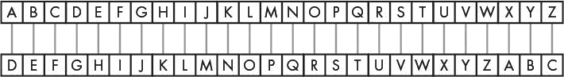

# 十四、凯撒密码

> 原文：[`inventwithpython.com/invent4thed/chapter14.html`](https://inventwithpython.com/invent4thed/chapter14.html)
> 
> 译者：[飞龙](https://github.com/wizardforcel)
> 
> 协议：[CC BY-NC-SA 4.0](https://creativecommons.org/licenses/by-nc-sa/4.0/)


本章的程序并不是一个真正的游戏，但它仍然很有趣。该程序将把普通英语转换成秘密代码。它还可以将秘密代码转换回普通英语。只有知道秘密代码的人才能理解这些消息。

由于这个程序操纵文本将其转换为秘密消息，你将学习几个新的用于操纵字符串的函数和方法。你还将学习程序如何能够像处理数字一样处理文本字符串。

**本章涉及的主题**

+   密码学和密码

+   密文、明文、密钥和符号

+   加密和解密

+   凯撒密码

+   `find()`字符串方法

+   密码分析

+   穷举法技术

### 密码学和加密

编写秘密代码的科学称为*密码学*。几千年来，密码学使得发送只有发件人和收件人能够阅读的秘密消息成为可能，即使有人捕获信使并阅读了编码消息。秘密代码系统称为*密码*。本章程序使用的密码称为*凯撒密码*。

在密码学中，我们称要保密的消息为*明文*。假设我们有一条看起来像这样的明文消息：

```py
There is a clue behind the bookshelf.
```

将明文转换为编码消息称为*加密*明文。明文被加密成*密文*。密文看起来像随机字母，所以我们不能通过查看密文来理解原始明文是什么。以下是前面的示例加密成密文：

```py
aolyl pz h jsBl ilopuk Aol ivvrzolsm.
```

如果你知道用于加密消息的密码，你可以将*密文*解密回明文。（解密是加密的反向操作。）

许多密码使用*密钥*，这些密钥是让你解密使用特定密码加密的密文的秘密值。可以将密码看作是门锁。只有用特定的钥匙才能打开它。

如果你对编写密码学程序感兴趣，可以阅读我的书*使用 Python 黑客秘密密码*。可以从[http://inventwithpython.com/hacking/](https://inventwithpython.com/hacking/)免费下载。

### 凯撒密码的工作原理

凯撒密码是有史以来最早的密码之一。在这种密码中，你通过用“移位”字母替换消息中的每个字母来加密消息。在密码学中，加密的字母称为*符号*，因为它们可以是字母、数字或任何其他符号。如果你将字母 A 向后移动一个空格，你会得到字母 B。如果你将字母 A 向后移动两个空格，你会得到字母 C。图 14-1 显示了一些字母向后移动三个空格的示例。


*图 14-1：凯撒密码将字母向后移动三个空格。这里，B 变成了 E。*

要获得每个移位后的字母，可以画一排方框，每个方框内写上字母表中的每个字母。然后在下面再画一排方框，但是从某个特定的空格开始写字母。当你到达明文字母表的末尾时，回到 A。图 14-2 显示了一个字母向后移动三个空格的示例。



*图 14-2：整个字母表向后移动三个空格*

凯撒密码中，你将字母移动的空格数（在 1 到 26 之间）就是密钥。除非你知道密钥（用于加密消息的数字），否则你将无法解密秘密代码。图 14-2 中的示例显示了密钥 3 的字母转换。

**注意**

*虽然有 26 个可能的密钥，但使用 26 加密消息将导致密文与明文完全相同！*

如果您使用密钥 3 加密明文单词 HOWDY，则：

+   字母 H 变成 K。

+   字母 O 变成 R。

+   字母 W 变成 Z。

+   字母 D 变成 G。

+   字母 Y 变成 B。

因此，使用密钥 3 的 HOWDY 的密文变为 KRZGB。要使用密钥 3 解密 KRZGB，我们从底部的框返回到顶部。

如果您想将小写字母与大写字母区分开，那么请将另外 26 个框添加到已有的框中，并用 26 个小写字母填充它们。现在使用密钥 3，字母 Y 变成 b，如图 14-3 所示。


*图 14-3：整个字母表，现在包括小写字母，向后移动三个空格*

密码的工作方式与仅使用大写字母时相同。实际上，如果您想要使用另一种语言字母表的字母，您可以写下这些字母的框，以创建您的密码。

### 凯撒密码的示例运行

这是凯撒密码程序加密消息的示例运行：

```py
Do you wish to encrypt or decrypt a message?
encrypt
Enter your message:
The sky above the port was the color of television, tuned to a dead channel.
Enter the key number (1-52)
13
Your translated text is:
gur FxL noBIr Gur CBEG JnF Gur pByBE Bs GryrIvFvBA, GHArq GB n qrnq punAAry.
```

现在运行程序并解密刚刚加密的文本：

```py
Do you wish to encrypt or decrypt a message?
decrypt
Enter your message:
gur FxL noBIr Gur CBEG JnF Gur pByBE Bs GryrIvFvBA, GHArq GB n qrnq punAAry.
Enter the key number (1-52)
13
Your translated text is:
The sky above the port was the color of television, tuned to a dead channel.
```

如果您没有使用正确的密钥解密，文本将无法正确解密：

```py
Do you wish to encrypt or decrypt a message?
decrypt
Enter your message:
gur FxL noBIr Gur CBEG JnF Gur pByBE Bs GryrIvFvBA, GHArq GB n qrnq punAAry.
Enter the key number (1-52)
15
Your translated text is:
Rfc qiw YZmtc rfc nmpr uYq rfc amjmp md rcjctgqgml, rslcb rm Y bcYb afYllcj.
```

### 凯撒密码的源代码

输入此凯撒密码程序的源代码，然后将文件保存为*cipher.py*。

如果在输入此代码后出现错误，请使用在线差异工具将您输入的代码与本书代码进行比较，网址为[`www.nostarch.com/inventwithpython#diff`](https://www.nostarch.com/inventwithpython#diff)。


`cipher.py`

```py
# Caesar Cipher
SYMBOLS = 'ABCDEFGHIJKLMNOPQRSTUVWXYZabcdefghijklmnopqrstuvwxyz'
MAX_KEY_SIZE = len(SYMBOLS)

def getMode():
    while True:
        print('Do you wish to encrypt or decrypt a message?')
        mode = input().lower()
        if mode in ['encrypt', 'e', 'decrypt', 'd']:
            return mode
        else:
            print('Enter either "encrypt" or "e" or "decrypt" or "d".')

def getMessage():
    print('Enter your message:')
    return input()

def getKey():
    key = 0
    while True:
        print('Enter the key number (1-%s)' % (MAX_KEY_SIZE))
        key = int(input())
        if (key >= 1 and key <= MAX_KEY_SIZE):
            return key

def getTranslatedMessage(mode, message, key):
    if mode[0] == 'd':
        key = -key
    translated = ''

    for symbol in message:
        symbolIndex = SYMBOLS.find(symbol)
        if symbolIndex == -1: # Symbol not found in SYMBOLS.
            # Just add this symbol without any change.
            translated += symbol
        else:
            # Encrypt or decrypt.
            symbolIndex += key

            if symbolIndex >= len(SYMBOLS):
                symbolIndex -= len(SYMBOLS)
            elif symbolIndex < 0:
                symbolIndex += len(SYMBOLS)

            translated += SYMBOLS[symbolIndex]
    return translated

mode = getMode()
message = getMessage()
key = getKey()
print('Your translated text is:')
print(getTranslatedMessage(mode, message, key))
```

### 设置最大密钥长度

加密和解密过程是彼此的相反，但它们共享大部分相同的代码。让我们看看每行是如何工作的：

```py
# Caesar Cipher
SYMBOLS = 'ABCDEFGHIJKLMNOPQRSTUVWXYZabcdefghijklmnopqrstuvwxyz'
MAX_KEY_SIZE = len(SYMBOLS)
```

`MAX_KEY_SIZE`是一个常量，存储`SYMBOLS`的长度（`52`）。这个常量提醒我们，在这个程序中，密码中使用的密钥应该始终在 1 和 52 之间。

### 决定加密或解密消息

`getMode()`函数让用户决定他们想要使用程序的加密或解密模式：

```py
def getMode():
    while True:
        print('Do you wish to encrypt or decrypt a message?')
        mode = input().lower()
        if mode in ['encrypt', 'e', 'decrypt', 'd']:
            return mode
        else:
            print('Enter either "encrypt" or "e" or "decrypt" or "d".')
```

第 8 行调用`input()`让用户输入他们想要的模式。然后在这个字符串上调用`lower()`方法，以返回字符串的小写版本。从`input().lower()`返回的值存储在`mode`中。`if`语句的条件检查存储在`mode`中的字符串是否存在于`['encrypt', 'e', 'decrypt', 'd']`列表中。

只要`mode`等于`'encrypt'`、`'e'`、`'decrypt'`或`'d'`，此函数将返回`mode`中的字符串。因此，`getMode()`将返回字符串`mode`。如果用户输入的内容不是`'encrypt'`、`'e'`、`'decrypt'`或`'d'`，则`while`循环将再次询问他们。

### 从玩家获取消息

`getMessage()`函数只是从用户那里获取要加密或解密的消息并返回它：

```py
def getMessage():
    print('Enter your message:')
    return input()
```

`input()`的调用与`return`结合在一起，这样我们只使用一行而不是两行。

### 从玩家获取密钥

`getKey()`函数让玩家输入他们将用于加密或解密消息的密钥：

```py
def getKey():
    key = 0
    while True:
        print('Enter the key number (1-%s)' % (MAX_KEY_SIZE))
        key = int(input())
        if (key >= 1 and key <= MAX_KEY_SIZE):
            return key
```

`while`循环确保函数保持循环，直到用户输入有效的密钥。这里的有效密钥是介于整数值`1`和`52`之间的值（记住`MAX_KEY_SIZE`是`52`，因为`SYMBOLS`变量中有 52 个字符）。`getKey()`函数然后返回这个密钥。第 22 行将`key`设置为用户输入的整数版本，因此`getKey()`返回一个整数。

### 加密或解密消息

`getTranslatedMessage()`函数执行实际的加密和解密：

```py
def getTranslatedMessage(mode, message, key):
    if mode[0] == 'd':
        key = -key
    translated = ''
```

它有三个参数：

`mode`这将设置函数为加密模式或解密模式。

`message`这是要加密（或解密）的明文（或密文）。

`key`这是在这个密码中使用的密钥。

第 27 行检查`mode`变量中的第一个字母是否为字符串`'d'`。如果是，则程序处于解密模式。解密和加密模式之间唯一的区别是，在解密模式中，密钥设置为其负版本。例如，如果`key`是整数`22`，那么解密模式将其设置为`-22`。原因在“加密或解密每个字母”中的第 205 页中有解释。

`translated`变量将包含结果的字符串：密文（如果您正在加密）或明文（如果您正在解密）。它起初为空字符串，并且已加密或解密的字符连接到其末尾。但是，在我们开始将字符连接到`translated`之前，我们需要加密或解密文本，我们将在`getTranslatedMessage()`的其余部分中进行。

#### 使用 find()字符串方法查找传递的字符串

为了将字母移动以进行加密或解密，我们首先需要将它们转换为数字。`SYMBOLS`字符串中每个字母的数字将是它出现的索引。由于字母 A 在`SYMBOLS[0]`处，数字`0`将表示大写字母 A。如果我们想要使用密钥 3 对其进行加密，我们只需使用 0 + 3 来获取加密字母的索引：`SYMBOLS[3]`或`'D'`。

我们将使用`find()`字符串方法，该方法在调用该方法的字符串中查找传递的字符串的第一次出现。在交互式 shell 中输入以下内容：

```py
>>> 'Hello world!'.find('H')
0
>>> 'Hello world!'.find('o')
4
>>> 'Hello world!'.find('ell')
1
```

`'Hello world!'.find('H')`返回`0`，因为在字符串`'Hello world!'`的第一个索引处找到了`'H'`。请记住，索引从`0`开始，而不是`1`。代码`'Hello world!'.find('o')`返回`4`，因为小写的`'o'`首次出现在`'Hello'`的末尾。`find()`方法在第一次出现后停止查找，所以`'world'`中的第二个`'o'`不重要。您还可以查找多于一个字符的字符串。字符串`'ell'`从索引`1`开始找到。

如果找不到传递的字符串，则`find()`方法返回`-1`：

```py
>>> 'Hello world!'.find('xyz')
-1
```

让我们回到凯撒密码程序。第 31 行是一个`for`循环，它对`message`字符串中的每个字符进行迭代：

```py
    for symbol in message:
        symbolIndex = SYMBOLS.find(symbol)
        if symbolIndex == -1: # Symbol not found in SYMBOLS.
            # Just add this symbol without any change.
            translated += symbol
```

`find()`方法用于第 32 行获取`symbol`中字符串的索引。如果`find()`返回`-1`，则`symbol`中的字符将被添加到`translated`中而不会发生任何更改。这意味着任何不属于字母表的字符，例如逗号和句号，都不会被更改。

#### 加密或解密每个字母

一旦找到了字母的索引号，将密钥添加到数字中将执行移位并为您提供加密字母的索引。

第 38 行执行此加法以获得加密（或解密）字母。

```py
            # Encrypt or decrypt.
            symbolIndex += key
```

请记住，在第 28 行，我们将`key`中的整数变为负数以进行解密。现在添加密钥的代码将对其进行减法，因为添加负数与减法相同。

但是，如果此加法（或减法，如果`key`为负数）导致`symbolIndex`超过`SYMBOLS`的最后一个索引，我们需要将其环绕到列表的开头`0`。这由从第 40 行开始的`if`语句处理：

```py
            if symbolIndex >= len(SYMBOLS):
                symbolIndex -= len(SYMBOLS)
            elif symbolIndex < 0:
                symbolIndex += len(SYMBOLS)

            translated += SYMBOLS[symbolIndex]
```

第 40 行检查`symbolIndex`是否已经超过了`SYMBOLS`字符串的最后一个索引，方法是将其与`SYMBOLS`字符串的长度进行比较。如果是，第 41 行将`SYMBOLS`的长度从`symbolIndex`中减去。如果`symbolIndex`现在是负数，则索引需要环绕到`SYMBOLS`字符串的另一侧。第 42 行检查在添加解密密钥后`symbolIndex`的值是否为负数。如果是，第 43 行将`SYMBOLS`的长度添加到`symbolIndex`中。

`symbolIndex`变量现在包含了正确加密或解密符号的索引。`SYMBOLS[symbolIndex]`将指向这个索引的字符，并且这个字符将被添加到第 45 行的`translated`的末尾。

执行回到第 31 行，重复这个过程，直到`message`中的下一个字符。一旦循环结束，函数将在第 46 行返回加密（或解密）字符串`translated`：

```py
    return translated
```

`getTranslatedMessage()`函数中的最后一行返回`translated`字符串。

### 开始程序

程序的开始调用了之前定义的三个函数，以从用户那里获取`mode`、`message`和`key`：

```py
mode = getMode()
message = getMessage()
key = getKey()
print('Your translated text is:')
print(getTranslatedMessage(mode, message, key))
```

这三个值被传递给`getTranslatedMessage()`，其返回值（`translated`字符串）被打印给用户。

**扩展符号**

如果你想加密数字、空格和标点符号，只需将它们添加到第 2 行的`SYMBOLS`字符串中。例如，你可以通过将第 2 行更改为以下内容，让你的密码程序加密数字、空格和标点符号：

```py
SYMBOLS = 'ABCDEFGHIJKLMNOPQRSTUVWXYZabcdefghijklmnopqrstuvwxyz 123
     4567890!@#$%^&*()'
```

请注意，`SYMBOLS`字符串在小写字母`z`后面有一个空格字符。

如果你愿意，你可以在这个列表中添加更多的字符。而且你不需要改变你的程序的其余部分，因为所有需要字符列表的代码行都只使用`SYMBOLS`常量。

只需确保每个字符在字符串中只出现一次。此外，您需要使用与加密时相同的`SYMBOLS`字符串来解密您的消息。

### 暴力破解技术

这就是整个凯撒密码。然而，虽然这种密码可能会愚弄一些不懂密码学的人，但对于了解*密码分析*的人来说，它不会保密消息。虽然密码学是制作密码的科学，但密码分析是破译密码的科学。

密码学的整个目的是确保如果其他人拿到了加密消息，他们无法弄清原始文本。假设我们是密码破译者，我们手上只有这个加密文本：

```py
LwCjBA uiG vwB jm xtmiAivB, jCB kmzBiqvBG qA ijACzl.
```

*暴力破解*是一种尝试每个可能的密钥直到找到正确密钥的技术。因为只有 52 个可能的密钥，所以对于密码分析家来说，编写一个解密每个可能密钥的黑客程序将是很容易的。然后他们可以寻找解密为普通英语的密钥。让我们给程序添加一个暴力破解的功能。

### 添加暴力破解模式

首先，更改第 7、9 和 12 行，这些行在`getMode()`函数中，看起来像下面这样（修改部分用粗体标出）：

```py
def getMode():
    while True:
        print('Do you wish to encrypt or decrypt or brute-force a
              message?')
        mode = input().lower()
        if mode in ['encrypt', 'e', 'decrypt', 'd', 'brute', 'b']:
            return mode
        else:
            print('Enter either "encrypt" or "e" or "decrypt" or "d" or
                  "brute" or "b".')
```

这段代码将允许用户选择暴力破解作为一种模式。

接下来，对程序的主要部分进行以下更改：

```py
mode = getMode()
message = getMessage()
if mode[0] != 'b':
    key = getKey()
print('Your translated text is:')
if mode[0] != 'b':
    print(getTranslatedMessage(mode, message, key))
else:
    for key in range(1, MAX_KEY_SIZE + 1):
        print(key, getTranslatedMessage('decrypt', message, key))
```

如果用户不处于暴力破解模式，他们会被要求输入一个密钥，然后进行原始的`getTranslatedMessage()`调用，并打印出翻译后的字符串。

然而，如果用户处于暴力破解模式，那么`getTranslatedMessage()`循环迭代从`1`一直到`MAX_KEY_SIZE`（即`52`）。请记住，`range()`函数返回一个整数列表，最多到第二个参数，但不包括第二个参数，这就是为什么我们要加上`+1`。然后程序将打印出消息的每种可能的翻译（包括在翻译中使用的密钥号）。以下是对这个修改后程序的示例运行：

```py
Do you wish to encrypt or decrypt or brute-force a message?
brute
Enter your message:
LwCjBA uiG vwB jm xtmiAivB, jCB kmzBiqvBG qA ijACzl.
Your translated text is:
1 KvBiAz thF uvA il wslhzhuA, iBA jlyAhpuAF pz hizByk.
2 JuAhzy sgE tuz hk vrkgygtz, hAz ikxzgotzE oy ghyAxj.
3 Itzgyx rfD sty gj uqjfxfsy, gzy hjwyfnsyD nx fgxzwi.
4 Hsyfxw qeC rsx fi tpiewerx, fyx givxemrxC mw efwyvh.
5 Grxewv pdB qrw eh sohdvdqw, exw fhuwdlqwB lv devxug.
6 Fqwdvu ocA pqv dg rngcucpv, dwv egtvckpvA ku cduwtf.
7 Epvcut nbz opu cf qmfbtbou, cvu dfsubjouz jt bctvse.
8 Doubts may not be pleasant, but certainty is absurd.
9 Cntasr lZx mns ad okdZrZms, ats bdqsZhmsx hr Zartqc.
10 BmsZrq kYw lmr Zc njcYqYlr, Zsr acprYglrw gq YZqspb.
11 AlrYqp jXv klq Yb mibXpXkq, Yrq ZboqXfkqv fp XYproa.
12 zkqXpo iWu jkp Xa lhaWoWjp, Xqp YanpWejpu eo WXoqnZ.
--snip--
```

在查看每一行后，你会发现第八条消息不是无意义的，而是普通的英语！密码分析家可以推断出这个加密文本的原始密钥必须是`8`。这种暴力破解方法在凯撒大帝和罗马帝国时代是很难做到的，但今天我们有计算机可以在短时间内快速地处理数百万甚至数十亿个密钥。

### 总结

计算机擅长做数学。当我们创建一个系统将某些信息转换为数字（就像我们用文本和序数或空间和坐标系这样做时），计算机程序可以快速高效地处理这些数字。编写程序的一个重要部分是弄清楚如何将要操作的信息表示为 Python 能理解的值。

虽然我们的凯撒密码程序可以加密消息，使它们对那些需要用铅笔和纸来解密的人保持秘密，但该程序无法对那些知道如何让计算机处理信息的人保密。（我们的穷举模式证明了这一点。）

在第 15 章中，我们将创建反转棋（也称为黑白棋或奥赛罗）。这个游戏的人工智能比第 10 章中玩井字游戏的人工智能要先进得多。事实上，它非常优秀，以至于大部分时间你都无法打败它！


