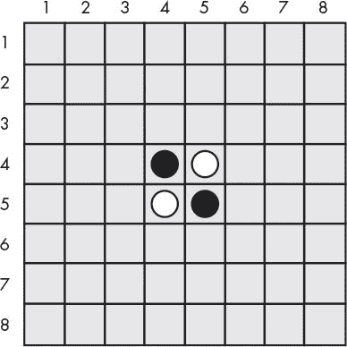
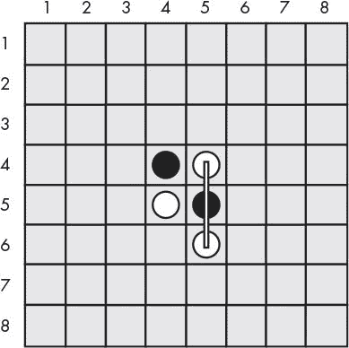
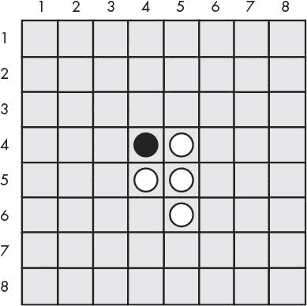
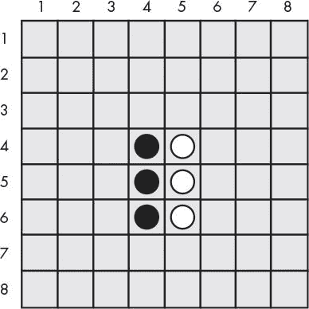
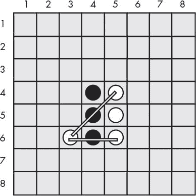
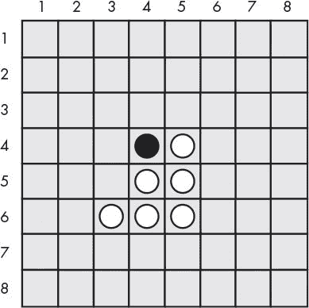
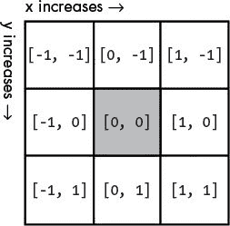

# 十五、反转棋游戏

> 原文：[`inventwithpython.com/invent4thed/chapter15.html`](https://inventwithpython.com/invent4thed/chapter15.html)
> 
> 译者：[飞龙](https://github.com/wizardforcel)
> 
> 协议：[CC BY-NC-SA 4.0](https://creativecommons.org/licenses/by-nc-sa/4.0/)


在本章中，我们将制作反转棋，也称为黑白棋或奥赛罗。这个双人棋盘游戏是在网格上进行的，因此我们将使用带有 x 和 y 坐标的笛卡尔坐标系。我们的游戏版本将具有比第 10 章中的井字棋 AI 更先进的计算机 AI。事实上，这个 AI 非常强大，几乎每次你玩都会打败你。（每次我和它对战时都输！）

**本章涵盖的主题**

+   如何玩反转棋

+   `bool()`函数

+   在反转棋棋盘上模拟移动

+   编写反转棋 AI

### 如何玩反转棋

反转棋有一个 8×8 的棋盘和一面是黑色，一面是白色的棋子（我们的游戏将使用*O*和*X*）。起始棋盘看起来像图 15-1。



图 15-1：起始的反转棋棋盘上有两个白色棋子和两个黑色棋子。

两名玩家轮流在棋盘上放置自己选择的颜色（黑色或白色）的棋子。当玩家在棋盘上放置一个棋子时，任何对手的棋子如果处于新棋子和玩家颜色的其他棋子之间，就会被翻转。例如，当白棋玩家在空格(5, 6)放置一个新的白棋，如图 15-2 中所示，黑棋在(5, 5)处于两个白棋之间，因此它会翻转成白色，如图 15-3 中所示。游戏的目标是以自己的颜色结束比对手的颜色拥有更多的棋子。



图 15-2：白棋放置了一个新的棋子。



图 15-3：白棋的移动导致黑棋的一个棋子翻转。

黑棋接下来可以做类似的移动，将黑棋放在(4, 6)处，这将翻转(4, 5)处的白棋。这将导致棋盘看起来像图 15-4。



图 15-4：黑棋放置了一个新的棋子，翻转了白棋的一个棋子。

只要它们处于玩家新棋子和该颜色的现有棋子之间，所有方向的棋子都会被翻转。在图 15-5 中，白棋在(3, 6)处放置一个棋子，并在两个方向上翻转了黑棋（由线标记）。结果如图 15-6 所示。

每名玩家可以在一两步内迅速翻转棋盘上的许多棋子。玩家必须始终进行至少翻转一个棋子的移动。游戏在任一玩家无法移动或棋盘完全填满时结束。拥有自己颜色的棋子最多的玩家获胜。



图 15-5：白棋在(3, 6)处的第二步将翻转黑棋的两个棋子。



图 15-6：白棋的第二步后的棋盘。

我们为这个游戏制作的 AI 将寻找它可以采取的棋盘上的任何角落移动。如果没有角落移动可用，计算机将选择夺取最多棋子的移动。

### 反转棋的示例运行

当用户运行反转棋程序时，用户看到的内容如下。玩家输入的文本是粗体。

```py
Welcome to Reversegam!
Do you want to be X or O?
x
The player will go first.
  12345678
 +--------+
1|        |1
2|        |2
3|        |3
4|   XO   |4
5|   OX   |5
6|        |6
7|        |7
8|        |8
 +--------+
  12345678
You: 2 points. Computer: 2 points.
Enter your move, "quit" to end the game, or "hints" to toggle hints.
53
  12345678
 +--------+
1|        |1
2|        |2
3|    X   |3
4|   XX   |4
5|   OX   |5
6|        |6
7|        |7
8|        |8
 +--------+
  12345678
You: 4 points. Computer: 1 points.
Press Enter to see the computer's move.

--snip--

  12345678
 +--------+
1|OOOOOOOO|1
2|OXXXOOOO|2
3|OXOOOOOO|3
4|OXXOXXOX|4
5|OXXOOXOX|5
6|OXXXXOOX|6
7|OOXXOOOO|7
8|OOXOOOOO|8
 +--------+
  12345678
X scored 21 points. O scored 43 points.
You lost. The computer beat you by 22 points.
Do you want to play again? (yes or no)
no
```

如你所见，AI 在打败我时表现得非常出色，43 比 21。为了帮助玩家，我们将编程游戏提供提示。玩家可以将`hints`作为他们的移动输入，这将切换提示模式。在提示模式下，玩家可以在棋盘上看到所有可能的移动，显示为句点（.），就像这样：

```py
  12345678
 +--------+
1|        |1
2|   .    |2
3|  XO.   |3
4|   XOX  |4
5|   OOO  |5
6|   . .  |6
7|        |7
8|        |8
 +--------+
  12345678
```

如你所见，根据棋盘上显示的提示，玩家可以在(4, 2)、(5, 3)、(4, 6)或(6, 6)处移动。

### 反转棋的源代码

与我们之前的游戏相比，反转棋是一个庞大的程序。它将近 300 行长！但不用担心：其中许多是注释或空行，用来分隔代码并使其更易读。


与我们其他的程序一样，我们将首先创建几个函数来执行与反转棋相关的任务，主要部分将调用这些函数。大约前 250 行代码是为这些辅助函数而写的，最后 30 行代码实现了反转棋游戏本身。

如果在输入此代码后出现错误，请使用在线 diff 工具将您的代码与本书代码进行比较，网址为[`www.nostarch.com/inventwithpython#diff`](https://www.nostarch.com/inventwithpython#diff)。

`reversegam.py`

```py
# Reversegam: a clone of Othello/Reversi
import random
import sys
WIDTH = 8 # Board is 8 spaces wide.
HEIGHT = 8 # Board is 8 spaces tall.
def drawBoard(board):
    # Print the board passed to this function. Return None.
    print('  12345678')
    print(' +--------+')
    for y in range(HEIGHT):
        print('%s|' % (y+1), end='')
        for x in range(WIDTH):
            print(board[x][y], end='')
        print('|%s' % (y+1))
    print(' +--------+')
    print('  12345678')

def getNewBoard():
    # Create a brand-new, blank board data structure.
    board = []
    for i in range(WIDTH):
        board.append([' ', ' ', ' ', ' ', ' ', ' ', ' ', ' '])
    return board

def isValidMove(board, tile, xstart, ystart):
    # Return False if the player's move on space xstart, ystart is
           invalid.
    # If it is a valid move, return a list of spaces that would become
           the player's if they made a move here.
    if board[xstart][ystart] != ' ' or not isOnBoard(xstart, ystart):
        return False

    if tile == 'X':
        otherTile = 'O'
    else:
        otherTile = 'X'

    tilesToFlip = []
    for xdirection, ydirection in [[0, 1], [1, 1], [1, 0], [1, -1],
           [0, -1], [-1, -1], [-1, 0], [-1, 1]]:
        x, y = xstart, ystart
        x += xdirection # First step in the x direction
        y += ydirection # First step in the y direction
        while isOnBoard(x, y) and board[x][y] == otherTile:
            # Keep moving in this x & y direction.
            x += xdirection
            y += ydirection
            if isOnBoard(x, y) and board[x][y] == tile:
                # There are pieces to flip over. Go in the reverse
                       direction until we reach the original space, noting all
                       the tiles along the way.
            while True:
                x -= xdirection
                y -= ydirection
                if x == xstart and y == ystart:
                    break
                tilesToFlip.append([x, y])

    if len(tilesToFlip) == 0: # If no tiles were flipped, this is not a
           valid move.
        return False
    return tilesToFlip

def isOnBoard(x, y):
    # Return True if the coordinates are located on the board.
    return x >= 0 and x <= WIDTH - 1 and y >= 0 and y <= HEIGHT - 1

def getBoardWithValidMoves(board, tile):
    # Return a new board with periods marking the valid moves the player
           can make.
    boardCopy = getBoardCopy(board)

    for x, y in getValidMoves(boardCopy, tile):
        boardCopy[x][y] = '.'
    return boardCopy

def getValidMoves(board, tile):
    # Return a list of [x,y] lists of valid moves for the given player
           on the given board.
    validMoves = []
    for x in range(WIDTH):
        for y in range(HEIGHT):
            if isValidMove(board, tile, x, y) != False:
                validMoves.append([x, y])
    return validMoves

def getScoreOfBoard(board):
    # Determine the score by counting the tiles. Return a dictionary
           with keys 'X' and 'O'.
    xscore = 0
    oscore = 0
    for x in range(WIDTH):
        for y in range(HEIGHT):
            if board[x][y] == 'X':
                xscore += 1
            if board[x][y] == 'O':
                oscore += 1
    return {'X':xscore, 'O':oscore}

def enterPlayerTile():
    # Let the player enter which tile they want to be.
    # Return a list with the player's tile as the first item and the
           computer's tile as the second.
    tile = ''
    while not (tile == 'X' or tile == 'O'):
        print('Do you want to be X or O?')
        tile = input().upper()

    # The first element in the list is the player's tile, and the second
           is the computer's tile.
    if tile == 'X':
        return ['X', 'O']
    else:
        return ['O', 'X']

def whoGoesFirst():
    # Randomly choose who goes first.
    if random.randint(0, 1) == 0:
        return 'computer'
    else:
        return 'player'

def makeMove(board, tile, xstart, ystart):
    # Place the tile on the board at xstart, ystart and flip any of the
           opponent's pieces.
    # Return False if this is an invalid move; True if it is valid.
    tilesToFlip = isValidMove(board, tile, xstart, ystart)

    if tilesToFlip == False:
        return False

    board[xstart][ystart] = tile
    for x, y in tilesToFlip:
        board[x][y] = tile
    return True

def getBoardCopy(board):
    # Make a duplicate of the board list and return it.
    boardCopy = getNewBoard()

    for x in range(WIDTH):
        for y in range(HEIGHT):
            boardCopy[x][y] = board[x][y]

    return boardCopy

def isOnCorner(x, y):
    # Return True if the position is in one of the four corners.
    return (x == 0 or x == WIDTH - 1) and (y == 0 or y == HEIGHT - 1)

def getPlayerMove(board, playerTile):
    # Let the player enter their move.
    # Return the move as [x, y] (or return the strings 'hints' or
           'quit').
    DIGITS1TO8 = '1 2 3 4 5 6 7 8'.split()
    while True:
        print('Enter your move, "quit" to end the game, or "hints" to
               toggle hints.')
        move = input().lower()
        if move == 'quit' or move == 'hints':
            return move

        if len(move) == 2 and move[0] in DIGITS1TO8 and move[1] in
               DIGITS1TO8:
            x = int(move[0]) - 1
            y = int(move[1]) - 1
            if isValidMove(board, playerTile, x, y) == False:
                continue
            else:
                break
        else:
            print('That is not a valid move. Enter the column (1-8) and
                   then the row (1-8).')
            print('For example, 81 will move on the top-right corner.')

    return [x, y]

def getComputerMove(board, computerTile):
    # Given a board and the computer's tile, determine where to
    # move and return that move as an [x, y] list.
    possibleMoves = getValidMoves(board, computerTile)
    random.shuffle(possibleMoves) # Randomize the order of the moves.

    # Always go for a corner if available.
    for x, y in possibleMoves:
        if isOnCorner(x, y):
            return [x, y]

    # Find the highest-scoring move possible.
    bestScore = -1
    for x, y in possibleMoves:
        boardCopy = getBoardCopy(board)
        makeMove(boardCopy, computerTile, x, y)
        score = getScoreOfBoard(boardCopy)[computerTile]
        if score > bestScore:
            bestMove = [x, y]
            bestScore = score
    return bestMove

def printScore(board, playerTile, computerTile):
    scores = getScoreOfBoard(board)
    print('You: %s points. Computer: %s points.' % (scores[playerTile],
           scores[computerTile]))

def playGame(playerTile, computerTile):
    showHints = False
    turn = whoGoesFirst()
    print('The ' + turn + ' will go first.')

    # Clear the board and place starting pieces.
    board = getNewBoard()
    board[3][3] = 'X'
    board[3][4] = 'O'
    board[4][3] = 'O'
    board[4][4] = 'X'

    while True:
        playerValidMoves = getValidMoves(board, playerTile)
        computerValidMoves = getValidMoves(board, computerTile)

        if playerValidMoves == [] and computerValidMoves == []:
            return board # No one can move, so end the game.

        elif turn == 'player': # Player's turn
            if playerValidMoves != []:
                if showHints:
                    validMovesBoard = getBoardWithValidMoves(board,
                           playerTile)
                    drawBoard(validMovesBoard)
                else:
                    drawBoard(board)
                printScore(board, playerTile, computerTile)

                move = getPlayerMove(board, playerTile)
                if move == 'quit':
                    print('Thanks for playing!')
                    sys.exit() # Terminate the program.
                elif move == 'hints':
                    showHints = not showHints
                    continue
                else:
                    makeMove(board, playerTile, move[0], move[1])
            turn = 'computer'

        elif turn == 'computer': # Computer's turn
            if computerValidMoves != []:
                drawBoard(board)
                printScore(board, playerTile, computerTile)

                input('Press Enter to see the computer\'s move.')
                move = getComputerMove(board, computerTile)
                makeMove(board, computerTile, move[0], move[1])
            turn = 'player'


print('Welcome to Reversegam!')

playerTile, computerTile = enterPlayerTile()

while True:
    finalBoard = playGame(playerTile, computerTile)

    # Display the final score.
    drawBoard(finalBoard)
    scores = getScoreOfBoard(finalBoard)
    print('X scored %s points. O scored %s points.' % (scores['X'],
           scores['O']))
    if scores[playerTile] > scores[computerTile]:
        print('You beat the computer by %s points! Congratulations!' %
               (scores[playerTile] - scores[computerTile]))
    elif scores[playerTile] < scores[computerTile]:
        print('You lost. The computer beat you by %s points.' %
               (scores[computerTile] - scores[playerTile]))
    else:
        print('The game was a tie!')

    print('Do you want to play again? (yes or no)')
    if not input().lower().startswith('y'):
        break
```

### 导入模块和设置常量

与我们其他的游戏一样，我们首先通过导入模块来开始这个程序：

```py
# Reversegam: a clone of Othello/Reversi
import random
import sys
WIDTH = 8  # Board is 8 spaces wide.
HEIGHT = 8 # Board is 8 spaces tall.
```

第 2 行导入`random`模块以使用其`randint()`和`choice()`函数。第 3 行导入`sys`模块以使用其`exit()`函数。

第 4 行和第 5 行设置了两个常量，`WIDTH`和`HEIGHT`，用于设置游戏棋盘。

### 游戏棋盘数据结构

让我们弄清楚棋盘的数据结构。这个数据结构是一个列表的列表，就像第 13 章中的 Sonar Treasure Hunt 游戏中的那个一样。列表的列表被创建，以便`board[x][y]`将表示 x 轴（左/右）上位置为`x`，y 轴（上/下）上位置为`y`的空间上的字符。

这个字符可以是`' '`（代表空位置的空格），`'.'`（代表提示模式中的可能移动），或者是`'X'`或`'O'`（代表瓷砖的字母）。每当看到名为`board`的参数时，它意味着是这种类型的列表-列表数据结构。

重要的是要注意，虽然游戏棋盘的 x 和 y 坐标范围是从 1 到 8，但列表数据结构的索引范围是从 0 到 7。我们的代码需要进行轻微调整以解决这个问题。

#### 在屏幕上绘制棋盘数据结构

棋盘数据结构只是一个 Python 列表值，但我们需要一种更好的方式来在屏幕上呈现它。`drawBoard()`函数接受一个棋盘数据结构，并在屏幕上显示它，以便玩家知道瓷砖放在哪里：

```py
def drawBoard(board):
    # Print the board passed to this function. Return None.
    print('  12345678')
    print(' +--------+')
    for y in range(HEIGHT):
        print('%s|' % (y+1), end='')
        for x in range(WIDTH):
            print(board[x][y], end='')
        print('|%s' % (y+1))
    print(' +--------+')
    print('  12345678')
```

`drawBoard()`函数根据`board`中的数据结构打印当前游戏棋盘。

第 8 行是对每个棋盘执行的第一个`print()`函数调用，并打印了沿着棋盘顶部的 x 轴的标签。第 9 行打印了棋盘的顶部水平线。第 10 行的`for`循环将循环八次，每次为一行。第 11 行打印了位于棋盘左侧的 y 轴标签，并且它有一个`end=''`关键字参数，以打印空行而不是新行。

这样，第 12 行的另一个循环（也循环八次，每次为行中的每一列）将打印每个位置以及`board[x][y]`中存储的`X`、`O`、`.`或空格，取决于存储在`board[x][y]`中的内容。第 13 行的`print()`函数调用在这个循环内部也有一个`end=''`关键字参数，以便不打印换行符。这将在屏幕上产生一个看起来像`'1|XXXXXXXX|1'`的单行（如果每个`board[x][y]`值都是`'X'`）。

内部循环完成后，第 15 行和第 16 行的`print()`函数调用打印底部水平线和 x 轴标签。

当第 13 行的`for`循环打印行八次时，它形成整个棋盘：

```py
  12345678
 +--------+
1|XXXXXXXX|1
2|XXXXXXXX|2
3|XXXXXXXX|3
4|XXXXXXXX|4
5|XXXXXXXX|5
6|XXXXXXXX|6
7|XXXXXXXX|7
8|XXXXXXXX|8
 +--------+
  12345678
```

当然，棋盘上的一些空格将是另一位玩家的标记（`O`），如果提示模式打开，则为句点（`.`），或者为空位置的空格。

#### 创建一个新的棋盘数据结构

`drawBoard()`函数将在屏幕上显示一个棋盘数据结构，但我们也需要一种方法来创建这些棋盘数据结构。`getNewBoard()`函数返回一个包含八个列表的列表，每个列表包含八个`' '`字符串，表示一个没有移动的空白棋盘：

```py
def getNewBoard():
    # Create a brand-new, blank board data structure.
    board = []
    for i in range(WIDTH):
        board.append([' ', ' ', ' ', ' ', ' ', ' ', ' ', ' '])
    return board
```

第 20 行创建包含内部列表的列表。`for`循环在这个列表内添加了八个内部列表。这些内部列表有八个字符串，表示棋盘上的八个空格。总之，这段代码创建了一个有 64 个空格的棋盘——一个空白的反转棋棋盘。

### 检查移动是否有效

给定棋盘的数据结构、玩家的棋子以及玩家移动的 x 和 y 坐标，`isValidMove()`函数应该在这些坐标上允许反转棋游戏规则的移动时返回`True`，如果不允许则返回`False`。为了使移动有效，它必须在棋盘上，并且至少翻转对手的一个棋子。

这个函数在棋盘上使用了几个 x 和 y 坐标，所以`xstart`和`ystart`变量跟踪原始移动的 x 和 y 坐标。

```py
def isValidMove(board, tile, xstart, ystart):
    # Return False if the player's move on space xstart, ystart is
          invalid.
    # If it is a valid move, return a list of spaces that would become
          the player's if they made a move here.
    if board[xstart][ystart] != ' ' or not isOnBoard(xstart, ystart):
        return False

    if tile == 'X':
        otherTile = 'O'
    else:
        otherTile = 'X'

    tilesToFlip = []
```

第 28 行检查 x 和 y 坐标是否在游戏棋盘上，并且使用`isOnBoard()`函数（我们稍后在程序中定义）检查空格是否为空。这个函数确保 x 和 y 坐标都在棋盘的`0`到`WIDTH`或`HEIGHT`之间，减去`1`。

玩家的棋子（无论是人类玩家还是计算机玩家）在`tile`中，但这个函数需要知道对手的棋子。如果玩家的棋子是`X`，那么显然对手的棋子是`O`，反之亦然。我们在 31 到 34 行使用`if-else`语句来实现这一点。

最后，如果给定的 x 和 y 坐标是有效的移动，`isValidMove()`将返回一个列表，其中包含此移动将翻转的所有对手的棋子。我们创建一个新的空列表`tilesToFlip`，用于存储所有棋子的坐标。

#### 检查每个八个方向

为了使移动有效，它需要至少翻转对手的一个棋子，通过将当前玩家的新棋子夹在玩家旧棋子之间。这意味着新棋子必须与对手的一个棋子相邻。

第 37 行的`for`循环遍历了一个列表，表示程序将检查对手棋子的方向：

```py
    for xdirection, ydirection in [[0, 1], [1, 1], [1, 0], [1, -1],
          [0, -1], [-1, -1], [-1, 0], [-1, 1]]:
```

游戏棋盘是一个笛卡尔坐标系，有 x 和 y 方向。有八个方向要检查：上、下、左、右和四个对角线方向。列表 37 行的列表中的每个八个两项列表用于检查这些方向中的一个。程序通过将两项列表中的第一个值添加到 x 坐标，将第二个值添加到 y 坐标来检查一个方向。

因为 x 坐标向右增加，所以可以通过将`1`添加到 x 坐标来检查右方向。因此，`[1, 0]`列表将`1`添加到 x 坐标，将`0`添加到 y 坐标。检查左方向则相反：你需要从 x 坐标中减去`1`（即添加`-1`）。

但是，要对角线检查，你需要对坐标进行加法或减法。例如，将`1`添加到 x 坐标并将`-1`添加到 y 坐标将导致检查向上右对角线方向。

图 15-7 显示了一个图表，以便更容易记住每个两项列表代表哪个方向。



*图 15-7：每个两项列表表示八个方向之一。*

第 37 行的`for`循环遍历了每个两项列表，以便检查每个方向。在`for`循环内，`x`和`y`变量分别在第 38 行使用多重赋值设置为与`xstart`和`ystart`相同的值。`xdirection`和`ydirection`变量设置为两项列表中的值，并根据正在检查的方向改变`x`和`y`变量。

```py
    for xdirection, ydirection in [[0, 1], [1, 1], [1, 0], [1, -1],
          [0, -1], [-1, -1], [-1, 0], [-1, 1]]:
        x, y = xstart, ystart
        x += xdirection # First step in the x direction
        y += ydirection # First step in the y direction
```

`xstart`和`ystart`变量将保持不变，以便程序可以记住它最初从哪个空格开始。

记住，要移动有效，必须在棋盘上并且紧邻对手的棋子之一。（否则，没有对手的棋子可以翻转，移动必须翻转至少一个棋子才有效。）第 41 行检查了这个条件，如果不是`True`，则执行返回到`for`语句以检查下一个方向。

```py
        while isOnBoard(x, y) and board[x][y] == otherTile:
            # Keep moving in this x & y direction.
            x += xdirection
            y += ydirection
```

但是，如果第一个检查的空格确实有对手的棋子，那么程序应该在该方向上检查更多的对手的棋子，直到达到玩家的棋子之一或棋盘的末端。使用`xdirection`和`ydirection`再次检查相同方向的下一个棋子，使`x`和`y`成为要检查的下一个坐标。因此，程序在第 43 和 44 行改变了`x`和`y`。

#### 找出是否有可以翻转的棋子

接下来，我们检查是否有可以翻转的相邻棋子。

```py
            if isOnBoard(x, y) and board[x][y] == tile:
                # There are pieces to flip over. Go in the reverse
                      direction until we reach the original space, noting all
                      the tiles along the way.
                while True:
                    x -= xdirection
                    y -= ydirection
                    if x == xstart and y == ystart:
                        break
                    tilesToFlip.append([x, y])
```

第 45 行的`if`语句检查坐标是否被玩家自己的棋子占据。这个棋子将标记由玩家的棋子围绕对手的棋子形成的夹心的末端。我们还需要记录所有应该翻转的对手的棋子的坐标。

`while`循环在第 48 和 49 行反向移动`x`和`y`。直到`x`和`y`回到原始的`xstart`和`ystart`位置，`xdirection`和`ydirection`从`x`和`y`中减去，并且每个`x`和`y`位置都被附加到`tilesToFlip`列表中。当`x`和`y`达到`xstart`和`ystart`位置时，第 51 行中断了循环的执行。由于原始的`xstart`和`ystart`位置是一个空格（我们确保这是在第 28 和 29 行的情况下），因此第 41 行`while`循环的条件将是`False`。程序继续执行到第 37 行，`for`循环检查下一个方向。

`for`循环在所有八个方向上执行此操作。循环结束后，`tilesToFlip`列表将包含我们所有对手的棋子的 x 和 y 坐标，如果玩家在`xstart`，`ystart`上移动，这些棋子将被翻转。记住，`isValidMove()`函数只是检查原始移动是否有效；它实际上不会永久改变游戏棋盘的数据结构。

如果八个方向中没有一个最终翻转了对手的棋子，那么`tilesToFlip`将是一个空列表：

```py
    if len(tilesToFlip) == 0: # If no tiles were flipped, this is not a
          valid move.
        return False
    return tilesToFlip
```

这表明这个移动是无效的，`isValidMove()`应该返回`False`。否则，`isValidMove()`返回`tilesToFlip`。

### 检查有效坐标

`isOnBoard()`函数从`isValidMove()`中调用。它简单地检查给定的 x 和 y 坐标是否在棋盘上。例如，x 坐标为`4`，y 坐标为`9999`将不在棋盘上，因为 y 坐标只能到`7`，这等于`WIDTH - 1`或`HEIGHT - 1`。

```py
def isOnBoard(x, y):
    # Return True if the coordinates are located on the board.
    return x >= 0 and x <= WIDTH - 1 and y >= 0 and y <= HEIGHT - 1
```

调用此函数相当于第 72 行的布尔表达式，检查`x`和`y`是否在`0`和`WIDTH`或`HEIGHT`减去`1`之间，即`7`。

#### 获取所有有效移动的列表

现在让我们创建一个提示模式，显示一个标有所有可能移动的棋盘。`getBoardWithValidMoves()`函数返回一个游戏棋盘数据结构，其中对于所有有效移动的空格都有句点（`.`）：

```py
def getBoardWithValidMoves(board, tile):
    # Return a new board with periods marking the valid moves the player
          can make.
    boardCopy = getBoardCopy(board)

    for x, y in getValidMoves(boardCopy, tile):
        boardCopy[x][y] = '.'
    return boardCopy
```

此函数创建一个名为`boardCopy`的重复游戏`board`数据结构（由第 64 行的`getBoardCopy()`返回），而不是修改传递给它的`board`参数中的数据结构。第 66 行调用`getValidMoves()`以获取玩家可以进行的所有合法移动的 x 和 y 坐标列表。在这些空格中，用句点标记板副本并返回。

`getValidMoves()`函数返回一个两项列表的列表。这两项列表保存了`board`参数中给定的`tile`的所有有效移动的 x 和 y 坐标：

```py
def getValidMoves(board, tile):
    # Return a list of [x,y] lists of valid moves for the given player
          on the given board.
    validMoves = []
    for x in range(WIDTH):
        for y in range(HEIGHT):
            if isValidMove(board, tile, x, y) != False:
                validMoves.append([x, y])
    return validMoves
```

此函数使用嵌套循环（第 73 和 74 行）来检查每个 x 和 y 坐标（共 64 个），通过调用该空间上的`isValidMove()`并检查它是否返回`False`或可能移动的列表（在这种情况下，移动是有效的）。每个有效的 x 和 y 坐标都附加到`validMoves`列表中。

#### 调用 bool()函数

您可能已经注意到，尽管此函数返回一个列表，程序仍会检查第 75 行的`isValidMove()`是否返回`False`。要理解这是如何工作的，您需要更多了解布尔值和`bool()`函数。

`bool()`函数类似于`int()`和`str()`函数。它返回传递给它的值的布尔值形式。

大多数数据类型都有一个被视为该数据类型的`False`值的值。其他每个值都被视为`True`。例如，整数`0`，浮点数`0.0`，空字符串，空列表和空字典在作为`if`或循环语句的条件时都被视为`False`。所有其他值都是`True`。在交互式 shell 中输入以下内容：

```py
>>> bool(0)
False
>>> bool(0.0)
False
>>> bool('')
False
>>> bool([])
False
>>> bool({})
False
>>> bool(1)
True
>>> bool('Hello')
True
>>> bool([1, 2, 3, 4, 5])
True
>>> bool({'spam':'cheese', 'fizz':'buzz'})
True
```

条件会自动解释为布尔值。这就是为什么第 75 行的条件能够正确工作。对`isValidMove()`函数的调用要么返回布尔值`False`，要么返回非空列表。

如果想象整个条件都放在对`bool()`的调用中，那么第 75 行的条件`False`就变成了`bool(False)`（当然，求值为`False`）。将非空列表作为`bool()`的参数放置，将返回`True`。

### 获取游戏板的分数

`getScoreOfBoard()`函数使用嵌套的`for`循环来检查板上的所有 64 个位置，并查看哪个玩家的瓷砖（如果有）在上面：

```py
def getScoreOfBoard(board):
    # Determine the score by counting the tiles. Return a dictionary
          with keys 'X' and 'O'.
    xscore = 0
    oscore = 0
    for x in range(WIDTH):
        for y in range(HEIGHT):
            if board[x][y] == 'X':
                xscore += 1
            if board[x][y] == 'O':
                oscore += 1
    return {'X':xscore, 'O':oscore}
```

对于每个`X`瓷砖，代码在第 86 行增加`xscore`。对于每个`O`瓷砖，代码在第 88 行增加`oscore`。然后函数以字典形式返回`xscore`和`oscore`。

### 获取玩家的选择

`enterPlayerTile()`函数询问玩家想要成为哪种瓷砖，*X*或*O*：

```py
def enterPlayerTile():
    # Let the player enter which tile they want to be.
    # Return a list with the player's tile as the first item and the
          computer's tile as the second.
    tile = ''
    while not (tile == 'X' or tile == 'O'):
        print('Do you want to be X or O?')
        tile = input().upper()

    # The first element in the list is the player's tile, and the second
          is the computer's tile.
    if tile == 'X':
        return ['X', 'O']
    else:
        return ['O', 'X']
```

`for`循环将一直循环，直到玩家输入大写或小写的`X`或`O`。然后`enterPlayerTile()`函数返回一个两项列表，玩家的选择是第一项，计算机的选择是第二项。稍后，第 241 行调用`enterPlayerTile()`并使用多重赋值将这两个返回的项放入两个变量中。

### 确定谁先走

`whoGoesFirst()`函数随机选择谁先走，并返回字符串`'computer'`或字符串`'player'`：

```py
def whoGoesFirst():
    # Randomly choose who goes first.
    if random.randint(0, 1) == 0:
        return 'computer'
    else:
        return 'player'
```

### 在板上放置一个瓷砖

当玩家想要在板上放置一个瓷砖并根据反转棋的规则翻转其他瓷砖时，将调用`makeMove()`函数：

```py
def makeMove(board, tile, xstart, ystart):
    # Place the tile on the board at xstart, ystart and flip any of the
           opponent's pieces.
    # Return False if this is an invalid move; True if it is valid.
    tilesToFlip = isValidMove(board, tile, xstart, ystart)
```

此函数直接修改了传递的`board`数据结构。对`board`变量的更改（因为它是一个列表引用）将应用于全局范围。

大部分工作由第 115 行的`isValidMove()`完成，它返回需要翻转的瓷砖的 x 和 y 坐标的列表（在一个两项列表中）。请记住，如果`xstart`和`ystart`参数指向无效移动，`isValidMove()`将返回布尔值`False`，第 117 行对此进行了检查：

```py
    if tilesToFlip == False:
        return False

    board[xstart][ystart] = tile
    for x, y in tilesToFlip:
        board[x][y] = tile
    return True
```

如果`isValidMove()`的返回值（现在存储在`tilesToFlip`中）为`False`，那么`makeMove()`也会在第 118 行返回`False`。

否则，`isValidMove()`返回一个列表，其中包含要放置瓷砖的棋盘空间（`tile`中的`'X'`或`'O'`字符串）。第 120 行设置玩家移动的空间。第 121 行的`for`循环设置了所有在`tilesToFlip`中的瓷砖。

### 复制棋盘数据结构

`getBoardCopy()`函数与`getNewBoard()`不同。`getNewBoard()`函数创建一个只有空格和四个起始瓷砖的空白游戏棋盘数据结构。`getBoardCopy()`创建一个空白游戏棋盘数据结构，然后使用嵌套循环将`board`参数中的所有位置复制到副本棋盘数据结构中。AI 使用`getBoardCopy()`函数，以便可以对游戏棋盘副本进行更改，而不会改变真实的游戏棋盘。这种技术也被 Tic-Tac-Toe 程序在第 10 章中使用过。

```py
def getBoardCopy(board):
    # Make a duplicate of the board list and return it.
    boardCopy = getNewBoard()

    for x in range(WIDTH):
        for y in range(HEIGHT):
            boardCopy[x][y] = board[x][y]

    return boardCopy
```

调用`getNewBoard()`设置`boardCopy`为一个新的游戏棋盘数据结构。然后两个嵌套的`for`循环将`board`中的 64 个瓷砖复制到`boardCopy`中的重复棋盘数据结构中。

### 确定空间是否在角落

`isOnCorner()`函数返回`True`，如果坐标位于角落空间，坐标为(0, 0)，(7, 0)，(0, 7)，或(7, 7)：

```py
def isOnCorner(x, y):
    # Return True if the position is in one of the four corners.
    return (x == 0 or x == WIDTH - 1) and (y == 0 or y == HEIGHT - 1)
```

否则，`isOnCorner()`返回`False`。我们稍后会在 AI 中使用这个函数。

### 获取玩家的移动

调用`getPlayerMove()`函数，让玩家输入他们下一步移动的坐标（并检查移动是否有效）。玩家还可以输入`hints`来打开提示模式（如果关闭了）或关闭提示模式（如果打开了）。最后，玩家可以输入`quit`来退出游戏。

```py
def getPlayerMove(board, playerTile):
    # Let the player enter their move.
    # Return the move as [x, y] (or return the strings 'hints' or
           'quit').
    DIGITS1TO8 = '1 2 3 4 5 6 7 8'.split()
```

`DIGITS1TO8`常量变量是列表`['1', '2', '3', '4', '5', '6', '7', '8']`。`getPlayerMove()`函数多次使用`DIGITS1TO8`，这个常量比完整的列表值更易读。不能使用`isdigit()`方法，因为这将允许输入 0 和 9，这在 8×8 棋盘上是无效的坐标。

`while`循环会一直循环，直到玩家输入有效的移动：

```py
    while True:
        print('Enter your move, "quit" to end the game, or "hints" to
               toggle hints.')
        move = input().lower()
        if move == 'quit' or move == 'hints':
            return move
```

第 146 行检查玩家是否想要退出或切换提示模式，第 147 行返回字符串`'quit'`或`'hints'`。在`input()`返回的字符串上调用`lower()`方法，以便玩家可以输入`HINTS`或`Quit`，并且命令仍然可以被理解。

调用`getPlayerMove()`的代码将处理玩家想要退出或切换提示模式时的操作。如果玩家输入坐标进行移动，第 149 行的`if`语句会检查移动是否有效：

```py
        if len(move) == 2 and move[0] in DIGITS1TO8 and move[1] in
               DIGITS1TO8:
            x = int(move[0]) - 1
            y = int(move[1]) - 1
            if isValidMove(board, playerTile, x, y) == False:
                continue
            else:
                break
```

游戏期望玩家输入他们的移动的 x 和 y 坐标作为两个数字，中间没有任何东西。第 149 行首先检查玩家输入的字符串的大小是否为`2`。之后，它还检查`move[0]`（字符串中的第一个字符）和`move[1]`（字符串中的第二个字符）是否是存在于`DIGITS1TO8`中的字符串。

请记住，游戏棋盘数据结构的索引范围是从 0 到 7，而不是从 1 到 8。当在`drawBoard()`中显示棋盘时，代码会打印 1 到 8，因为非程序员习惯于从 1 开始而不是从 0 开始。因此，为了将`move[0]`和`move[1]`中的字符串转换为整数，第 150 行和第 151 行分别从`x`和`y`中减去 1。

即使玩家输入了正确的移动，代码也需要检查移动是否符合反转棋的规则。这是通过`isValidMove()`函数完成的，该函数接收游戏棋盘数据结构、玩家的瓷砖以及移动的 x 和 y 坐标。

如果`isValidMove()`返回`False`，第 153 行的`continue`语句会执行。然后执行返回到`while`循环的开始，并再次要求玩家输入有效的移动。否则，玩家输入了有效的移动，执行需要跳出`while`循环。

如果第 149 行的`if`语句条件为`False`，则玩家没有输入有效的移动。第 157 和 158 行指导他们如何正确输入移动：

```py
        else:
            print('That is not a valid move. Enter the column (1-8) and
                   then the row (1-8).')
            print('For example, 81 will move on the top-right corner.')
```

之后，执行回到第 143 行的`while`语句，因为第 158 行不仅是`else`块中的最后一行，也是`while`块中的最后一行。`while`循环将一直循环，直到玩家输入有效的移动。如果玩家输入 x 和 y 坐标，第 160 行将执行：

```py
    return [x, y]
```

最后，如果第 160 行执行，`getPlayerMove()`将返回一个包含玩家有效移动的 x 和 y 坐标的两项列表。

### 获取计算机的移动

`getComputerMove()`函数是实现 AI 算法的地方：

```py
def getComputerMove(board, computerTile):
    # Given a board and the computer's tile, determine where to
    # move and return that move as an [x, y] list.
    possibleMoves = getValidMoves(board, computerTile)
```

通常，您会使用`getValidMoves()`的结果进行提示模式，它将在棋盘上打印`。`以向玩家显示他们可以进行的所有潜在移动。但如果使用计算机 AI 的棋子（在`computerTile`中）调用`getValidMoves()`，它还将找到*计算机*可以进行的所有可能移动。AI 将从此列表中选择最佳移动。

首先，`random.shuffle()`函数将随机化`possibleMoves`列表中的移动顺序：

```py
    random.shuffle(possibleMoves) # Randomize the order of the moves.
```

我们要对`possibleMoves`列表进行洗牌，因为这将使 AI 变得不那么可预测；否则，玩家可以简单地记住赢得比赛所需的移动，因为计算机的响应总是相同的。让我们来看看算法。

#### 使用角落移动进行策略

在反转棋中，角落移动是个好主意，因为一旦在角落放置了一个棋子，它就永远不能翻转。第 169 行循环遍历`possibleMoves`中的每个移动。如果其中任何一个在角落上，程序将返回该空间作为计算机的移动：

```py
    # Always go for a corner if available.
    for x, y in possibleMoves:
        if isOnCorner(x, y):
            return [x, y]
```

由于`possibleMoves`是一个包含两个项目的列表，我们将在`for`循环中使用多重赋值来设置`x`和`y`。如果`possibleMoves`包含多个角落移动，将始终使用第一个移动。但由于在第 166 行对`possibleMoves`进行了洗牌，列表中第一个角落移动是随机的。

#### 获取最高得分移动的列表

如果没有角落移动，程序将循环遍历可能移动的整个列表，并找出哪个结果得分最高。然后，`bestMove`设置为代码迄今为止找到的得分最高的移动，`bestScore`设置为最佳移动的分数。这将重复，直到找到得分最高的可能移动。

```py
    # Find the highest-scoring move possible.
    bestScore = -1
    for x, y in possibleMoves:
        boardCopy = getBoardCopy(board)
        makeMove(boardCopy, computerTile, x, y)
        score = getScoreOfBoard(boardCopy)[computerTile]
        if score > bestScore:
            bestMove = [x, y]
            bestScore = score
    return bestMove
```

第 174 行首先将`bestScore`设置为`-1`，以便代码检查的第一个移动将设置为第一个`bestMove`。这确保了在返回时，`bestMove`将设置为`possibleMoves`中的移动之一。

在第 175 行，`for`循环将`x`和`y`设置为`possibleMoves`中的每个移动。在模拟移动之前，第 176 行通过调用`getBoardCopy()`创建一个重复的游戏棋盘数据结构。您需要一个可以修改的副本，而不会改变存储在`board`变量中的真实游戏棋盘数据结构。

然后，第 177 行调用`makeMove()`，传递重复的棋盘（存储在`boardCopy`中）而不是真正的棋盘。这将模拟如果进行了该移动，真实棋盘上会发生什么。`makeMove()`函数将处理在重复棋盘上放置计算机的棋子和翻转玩家的棋子。

第 178 行调用`getScoreOfBoard()`并使用重复的棋盘，它返回一个字典，其中键是`'X'`和`'O'`，值是分数。当循环中的代码找到一个比`bestScore`更高的分数时，第 179 至 181 行将把该移动和分数存储为`bestMove`和`bestScore`中的新值。在`possibleMoves`完全迭代完成后，将返回`bestMove`。

例如，假设`getScoreOfBoard()`返回字典`{'X':22, 'O':8}`，`computerTile`为`'X'`。那么`getScoreOfBoard(boardCopy)[computerTile]`将求值为`{'X':22, 'O':8}['X']`，然后求值为`22`。如果`22`大于`bestScore`，则将`bestScore`设置为`22`，并将`bestMove`设置为当前的`x`和`y`值。

当这个`for`循环结束时，你可以确定`bestScore`是移动可能获得的最高分数，并且该移动存储在`bestMove`中。

尽管代码总是选择这些平局中的第一个，但由于在第 166 行对列表顺序进行了洗牌，选择看起来是随机的。这确保了当有多个最佳移动时，AI 不会是可预测的。

### 将分数打印到屏幕上

`showPoints()`函数调用`getScoreOfBoard()`函数，然后打印玩家和计算机的分数：

```py
def printScore(board, playerTile, computerTile):
    scores = getScoreOfBoard(board)
    print('You: %s points. Computer: %s points.' % (scores[playerTile],
           scores[computerTile]))
```

请记住，`getScoreOfBoard()`返回一个字典，键为`'X'`和`'O'`，值为*X*和*O*玩家的分数。

这就是反转棋游戏的所有函数。`playGame()`函数中的代码实现了实际的游戏，并根据需要调用这些函数。

### 开始游戏

`playGame()`函数调用我们编写的先前函数来进行单场比赛：

```py
def playGame(playerTile, computerTile):
    showHints = False
    turn = whoGoesFirst()
    print('The ' + turn + ' will go first.')

    # Clear the board and place starting pieces.
    board = getNewBoard()
    board[3][3] = 'X'
    board[3][4] = 'O'
    board[4][3] = 'O'
    board[4][4] = 'X'
```

`playGame()`函数传递给`playerTile`和`computerTile`字符串`'X'`或`'O'`。第 190 行确定先手玩家。`turn`变量包含字符串`'computer'`或`'player'`，以跟踪轮到谁了。第 194 行创建一个空白的棋盘数据结构，而第 195 到 198 行设置了棋盘上的初始四个方块。游戏现在准备好开始了。

#### 检查僵局

在获取玩家或计算机的轮次之前，我们需要检查他们是否有可能移动。如果没有，那么游戏就陷入僵局并应该结束。（如果只有一方没有有效移动，轮次将跳到另一方。）

```py
    while True:
        playerValidMoves = getValidMoves(board, playerTile)
        computerValidMoves = getValidMoves(board, computerTile)

        if playerValidMoves == [] and computerValidMoves == []:
            return board # No one can move, so end the game.
```

第 200 行是运行玩家和计算机轮次的主循环。只要这个循环不断循环，游戏就会继续。但在运行这些轮次之前，第 201 和 202 行检查双方是否可以通过获取有效移动列表来进行移动。如果这两个列表都为空，那么任何一方都无法进行移动。第 205 行通过返回最终棋盘退出`playGame()`函数，结束游戏。

#### 运行玩家的轮次

如果游戏不是陷入僵局，程序通过检查`turn`是否设置为字符串`'player'`来确定是否轮到玩家：

```py
        elif turn == 'player': # Player's turn
            if playerValidMoves != []:
                if showHints:
                    validMovesBoard = getBoardWithValidMoves(board,
                           playerTile)
                    drawBoard(validMovesBoard)
                else:
                    drawBoard(board)
                printScore(board, playerTile, computerTile)
```

第 207 行开始一个包含代码的`elif`块，如果是玩家的轮次，则运行该代码。（从第 227 行开始的`elif`块包含计算机的轮次的代码。）

只有当玩家有有效移动时，所有这些代码才会运行，第 208 行通过检查`playerValidMoves`不为空来确定。我们通过在第 211 或 213 行调用`drawBoard()`在屏幕上显示棋盘。

如果提示模式打开（即`showHints`为`True`），则棋盘数据结构应该在玩家可以移动的每个有效空间上显示`。`，这是通过`getBoardWithValidMoves()`函数实现的。它传递一个游戏棋盘数据结构，并返回一个也包含句点（`.`）的副本。第 211 行将此棋盘传递给`drawBoard()`函数。

如果提示模式关闭，那么第 213 行将`board`传递给`drawBoard()`。

在向玩家打印游戏棋盘之后，您还希望通过在第 214 行调用`printScore()`来打印当前分数。

接下来，玩家需要输入他们的移动。`getPlayerMove()`函数处理这个，并且它的返回值是玩家移动的 x 和 y 坐标的两项列表：

```py
                move = getPlayerMove(board, playerTile)
```

当我们定义`getPlayerMove()`时，我们已经确保玩家的移动是有效的。

`getPlayerMove()`函数可能返回字符串`'quit'`或`'hints'`，而不是棋盘上的移动。行 217 到 222 处理这些情况：

```py
                if move == 'quit':
                    print('Thanks for playing!')
                    sys.exit() # Terminate the program.
                elif move == 'hints':
                    showHints = not showHints
                    continue
                else:
                    makeMove(board, playerTile, move[0], move[1])
            turn = 'computer'
```

如果玩家输入`quit`作为他们的移动，那么`getPlayerMove()`将返回字符串`'quit'`。在这种情况下，第 219 行调用`sys.exit()`来终止程序。

如果玩家输入`hints`作为他们的移动，那么`getPlayerMove()`将返回字符串`'hints'`。在这种情况下，您希望打开提示模式（如果它关闭了）或关闭提示模式（如果它打开了）。

第 221 行的`showHints = not showHints`赋值语句处理了这两种情况，因为`not False`求值为`True`，`not True`求值为`False`。然后`continue`语句将执行移动到循环的开始（`turn`没有改变，所以它仍然是玩家的回合）。

否则，如果玩家没有退出或切换提示模式，第 224 行调用`makeMove()`在棋盘上进行玩家的移动。

最后，第 225 行将`turn`设置为`'computer'`。执行流程跳过了`else`块，到达了`while`块的末尾，所以执行跳回到第 200 行的`while`语句。不过，这一次将是计算机的回合。

#### 运行计算机的回合

如果`turn`变量包含字符串`'computer'`，那么计算机的回合代码将运行。它类似于玩家回合的代码，有一些变化：

```py
        elif turn == 'computer': # Computer's turn
            if computerValidMoves != []:
                drawBoard(board)
                printScore(board, playerTile, computerTile)

                input('Press Enter to see the computer\'s move.')
                move = getComputerMove(board, computerTile)
                makeMove(board, computerTile, move[0], move[1])
```

在使用`drawBoard()`打印棋盘后，程序还通过调用第 230 行的`showPoints()`打印当前得分。

第 232 行调用`input()`来暂停脚本，以便玩家可以查看棋盘。这与在第 4 章中的 Jokes 程序中使用`input()`暂停的方式非常相似。与在调用`input()`之前使用`print()`调用打印字符串不同，您可以通过将字符串传递给`input()`来做同样的事情。

玩家查看了棋盘并按下 ENTER 后，第 233 行调用`getComputerMove()`来获取计算机下一步移动的 x 和 y 坐标。这些坐标使用多重赋值存储在变量`x`和`y`中。

最后，`x`和`y`以及游戏棋盘数据结构和计算机的棋子被传递给`makeMove()`函数。这将在`board`上反映出计算机的移动。第 233 行调用`getComputerMove()`得到了计算机的移动（并将其存储在变量`x`和`y`中）。第 234 行调用`makeMove()`在棋盘上进行了移动。

接下来，第 235 行将`turn`变量设置为`'player'`：

```py
            turn = 'player'
```

在第 235 行之后`while`块中没有更多的代码，所以执行会回到第 200 行的`while`语句。

### 游戏循环

这就是我们为反转棋制作的所有函数。从第 239 行开始，程序的主要部分通过调用`playGame()`来运行游戏，但它还显示最终得分，并询问玩家是否想再玩一次：

```py
print('Welcome to Reversegam!')

playerTile, computerTile = enterPlayerTile()
```

程序从第 239 行开始欢迎玩家，并询问他们是否想成为*X*或*O*。第 241 行使用多重赋值技巧将`playerTile`和`computerTile`设置为`enterPlayerTile()`返回的两个值。

第 243 行的`while`循环运行每一局游戏：

```py
while True:
    finalBoard = playGame(playerTile, computerTile)

    # Display the final score.
    drawBoard(finalBoard)
    scores = getScoreOfBoard(finalBoard)
    print('X scored %s points. O scored %s points.' % (scores['X'],
           scores['O']))
    if scores[playerTile] > scores[computerTile]:
        print('You beat the computer by %s points! Congratulations!' %
               (scores[playerTile] - scores[computerTile]))
    elif scores[playerTile] < scores[computerTile]:
        print('You lost. The computer beat you by %s points.' %
               (scores[computerTile] - scores[playerTile]))
    else:
        print('The game was a tie!')
```

它通过调用`playGame()`开始。这个函数调用直到游戏结束才返回。`playGame()`返回的棋盘数据结构将传递给`getScoreOfBoard()`来计算*X*和*O*的棋子数量，以确定最终得分。第 249 行显示最终得分。

如果玩家的棋子比电脑的棋子多，第 251 行祝贺玩家获胜。如果电脑赢了，第 253 行告诉玩家他们输了。否则，第 255 行告诉玩家游戏是平局。

### 询问玩家是否再玩一次

游戏结束后，询问玩家是否想再玩一次：

```py
    print('Do you want to play again? (yes or no)')
    if not input().lower().startswith('y'):
        break
```

如果玩家没有输入以字母*y*开头的回复，比如`yes`或`YES`或`Y`，那么第 258 行的条件将求值为`True`，并且第 259 行将跳出从第 243 行开始的`while`循环，从而结束游戏。否则，这个`while`循环会自然循环，并且再次调用`playGame()`开始下一局游戏。

### 摘要

反转棋 AI 可能看起来几乎是无敌的，但这并不是因为计算机比我们聪明；它只是快得多！它遵循的策略很简单：如果可以的话，移动到角落，否则进行可以翻转最多瓦片的移动。人类也可以做到这一点，但要计算每个可能的有效移动会翻转多少瓦片是很耗时的。对于计算机来说，计算这个数字很简单。

这个游戏类似于声纳寻宝游戏，因为它使用网格作为游戏板。它也像井字游戏，因为有一个人工智能为计算机规划最佳移动。本章只介绍了一个新概念：在条件的上下文中，空列表、空字符串和整数`0`都会求值为`False`。除此之外，这个游戏使用了你已经了解的编程概念！

在第 16 章中，你将学习如何让人工智能在计算机游戏中相互对战。


