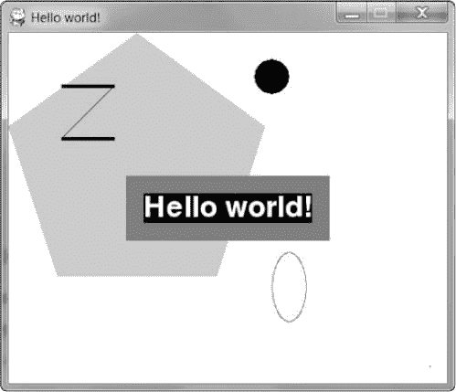
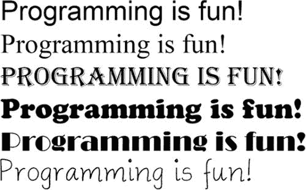
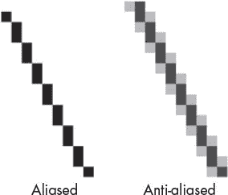
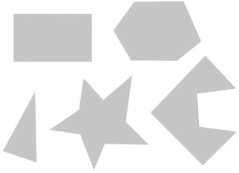

# 十七、创建图形

> 原文：[`inventwithpython.com/invent4thed/chapter17.html`](https://inventwithpython.com/invent4thed/chapter17.html)
> 
> 译者：[飞龙](https://github.com/wizardforcel)
> 
> 协议：[CC BY-NC-SA 4.0](https://creativecommons.org/licenses/by-nc-sa/4.0/)


到目前为止，我们所有的游戏都只使用了文本。文本作为输出显示在屏幕上，玩家输入文本作为输入。只使用文本使得编程变得容易学习。但在本章中，我们将使用`pygame`模块制作一些更加令人兴奋的高级图形程序。

第 17 章、第 18 章、第 19 章和第 20 章将教你如何使用`pygame`制作具有图形、动画、鼠标输入和声音的游戏。在这些章节中，我们将编写演示`pygame`概念的简单程序的源代码。然后在第 21 章，我们将整合我们学到的所有概念来创建一个游戏。

**本章涵盖的主题**

+   安装`pygame`

+   `pygame`中的颜色和字体

+   锯齿和抗锯齿图形

+   属性

+   `pygame.font.Font`、`pygame.Surface`、`pygame.Rect`和`pygame.PixelArray`数据类型

+   构造函数

+   `pygame`的绘图功能

+   表面对象的`blit()`方法

+   事件

### 安装 pygame

`pygame`模块帮助开发者通过在计算机屏幕上更容易绘制图形或向程序添加音乐来创建游戏。该模块不随 Python 一起提供，但与 Python 一样，可以免费下载。在[`www.nostarch.com/inventwithpython/`](https://www.nostarch.com/inventwithpython/)下载`pygame`，并按照你的操作系统的说明进行操作。

安装程序文件下载完成后，打开它并按照说明进行操作，直到`pygame`安装完成。要检查它是否安装正确，输入以下内容到交互式 shell 中：

```py
>>> import pygame
```

如果按下回车后什么都没有出现，那么你就知道`pygame`已经成功安装了。如果出现错误`ImportError: No module named pygame`，请尝试重新安装`pygame`（并确保你正确输入了`import pygame`）。

**注意**

*在编写 Python 程序时，不要将文件保存为* pygame.py*。如果你这样做，*`import pygame`*行将导入你的文件而不是真正的*`pygame`*模块，你的代码将无法工作。*

### pygame 中的 Hello World

首先，我们将制作一个新的`pygame` Hello World 程序，就像你在书的开头创建的那样。这一次，你将使用`pygame`在图形窗口中显示`Hello world!`，而不是作为文本。在本章中，我们将只是使用`pygame`在窗口上绘制一些形状和线条，但你将很快使用这些技能来制作你的第一个动画游戏。

`pygame`模块与交互式 shell 不兼容，所以你只能在文件编辑器中编写使用`pygame`的程序；你不能通过交互式 shell 逐条发送指令。

此外，`pygame`程序不使用`print()`或`input()`函数。没有文本输入或输出。相反，`pygame`通过在单独的窗口中绘制图形和文本来显示输出。`pygame`的输入来自键盘和鼠标通过*事件*，这些在“事件和游戏循环”中有介绍，第 270 页。

### pygame Hello World 的示例运行

当你运行图形化的 Hello World 程序时，你应该会看到一个新的窗口，看起来像图 17-1。



*图 17-1：* pygame *Hello World 程序*

使用窗口而不是控制台的好处是文本可以出现在窗口的任何位置，而不仅仅是在你打印的先前文本之后。文本也可以是任何颜色和大小。窗口就像一个画布，你可以在上面画任何你喜欢的东西。

### pygame Hello World 的源代码

将以下代码输入文件编辑器并将其保存为*pygameHelloWorld.py*。如果在输入此代码后出现错误，请将你输入的代码与本书代码进行比较，使用在线差异工具[`www.nostarch.com/inventwithpython#diff`](https://www.nostarch.com/inventwithpython#diff)。


*pygame HelloWorld.py*

```py
import pygame, sys
from pygame.locals import *

# Set up pygame.
pygame.init()

# Set up the window.
windowSurface = pygame.display.set_mode((500, 400), 0, 32)
pygame.display.set_caption('Hello world!')

# Set up the colors.
BLACK = (0, 0, 0)
WHITE = (255, 255, 255)
RED = (255, 0, 0)
GREEN = (0, 255, 0)
BLUE = (0, 0, 255)

# Set up the fonts.
basicFont = pygame.font.SysFont(None, 48)

# Set up the text.
text = basicFont.render('Hello world!', True, WHITE, BLUE)
textRect = text.get_rect()
textRect.centerx = windowSurface.get_rect().centerx
textRect.centery = windowSurface.get_rect().centery

# Draw the white background onto the surface.
windowSurface.fill(WHITE)

# Draw a green polygon onto the surface.
pygame.draw.polygon(windowSurface, GREEN, ((146, 0), (291, 106),
      (236, 277), (56, 277), (0, 106)))

# Draw some blue lines onto the surface.
pygame.draw.line(windowSurface, BLUE, (60, 60), (120, 60), 4)
pygame.draw.line(windowSurface, BLUE, (120, 60), (60, 120))
pygame.draw.line(windowSurface, BLUE, (60, 120), (120, 120), 4)

# Draw a blue circle onto the surface.
pygame.draw.circle(windowSurface, BLUE, (300, 50), 20, 0)

# Draw a red ellipse onto the surface.
pygame.draw.ellipse(windowSurface, RED, (300, 250, 40, 80), 1)

# Draw the text's background rectangle onto the surface.
pygame.draw.rect(windowSurface, RED, (textRect.left - 20,
      textRect.top - 20, textRect.width + 40, textRect.height + 40))

# Get a pixel array of the surface.
pixArray = pygame.PixelArray(windowSurface)
pixArray[480][380] = BLACK
del pixArray

# Draw the text onto the surface.
windowSurface.blit(text, textRect)

# Draw the window onto the screen.
pygame.display.update()

# Run the game loop.
while True:
    for event in pygame.event.get():
        if event.type == QUIT:
            pygame.quit()
            sys.exit()
```

### 导入 pygame 模块

让我们逐行查看这些代码，并找出它们的作用。

首先，你需要导入`pygame`模块，这样你就可以调用它的函数。你可以在同一行上导入多个模块，用逗号分隔模块名。第 1 行导入了`pygame`和`sys`模块：

```py
import pygame, sys
from pygame.locals import *
```

第二行导入了`pygame.locals`模块。这个模块包含许多与`pygame`一起使用的常量变量，比如`QUIT`，它帮助你退出程序，以及`K_ESCAPE`，它代表 ESC 键。

第 2 行还允许你在不必在每个从模块调用的方法、常量或其他内容前面输入`pygames.locals.`的情况下使用`pygames.locals`模块。

如果你的程序中有`from sys import *`而不是`import sys`，你可以在你的代码中调用`exit()`而不是`sys.exit()`。但大多数情况下最好使用完整的函数名，这样你就知道函数在哪个模块中。

### 初始化 pygame

所有`pygame`程序在导入`pygame`模块后必须调用`pygame.init()`，但在调用任何其他`pygame`函数之前：

```py
# Set up pygame.
pygame.init()
```

这将初始化`pygame`，使其准备好使用。你不需要知道`init()`做了什么；你只需要记住在使用任何其他`pygame`函数之前调用它。

### 设置 pygame 窗口

第 8 行通过在`pygame.display`模块中调用`set_mode()`方法创建了一个*图形用户界面(GUI)*窗口。（`display`模块是`pygame`模块内的一个模块。即使`pygame`模块也有自己的模块！）

```py
# Set up the window.
windowSurface = pygame.display.set_mode((500, 400), 0, 32)
pygame.display.set_caption('Hello world!')
```

这些方法帮助设置`pygame`运行的窗口。就像声纳寻宝游戏一样，窗口使用一个坐标系统，但窗口的坐标系统是以像素为单位的。

*像素*是计算机屏幕上最小的点。屏幕上的单个像素可以以任何颜色点亮。屏幕上的所有像素共同工作，显示你看到的图片。我们将使用*元组*创建一个宽度为 500 像素、高度为 400 像素的窗口。

#### 元组

元组值类似于列表，只是它们使用圆括号而不是方括号。此外，像字符串一样，元组是不可修改的。例如，将以下内容输入交互式 shell：

```py
   >>> spam = ('Life', 'Universe', 'Everything', 42)
➊ >>> spam[0]
   'Life'
   >>> spam[3]
   42
➋ >>> spam[1:3]
   ('Universe', 'Everything')
➌ >>> spam[3] = 'Hello'
➍ Traceback (most recent call last):
     File "<stdin>", line 1, in <module>
   TypeError: 'tuple' object does not support item assignment
```

正如你从示例中看到的，如果你想获取元组的一个项目➊或一系列项目➋，你仍然使用方括号，就像你对待列表一样。然而，如果你尝试将索引为`3`的项目更改为字符串`'Hello'` ➌，Python 将引发错误 ➍。

我们将使用元组来设置`pygame`窗口。`pygame.display.set_mode()`方法有三个参数。第一个是一个包含两个整数的元组，用于窗口的宽度和高度，以像素为单位。要设置一个 500x400 像素的窗口，可以使用元组`(500, 400)`作为`set_mode()`的第一个参数。第二个和第三个参数是高级选项，超出了本书的范围。只需分别为它们传递`0`和`32`。

#### 表面对象

`set_mode()`函数返回一个`pygame.Surface`对象（我们将其简称为`Surface`对象）。*对象*只是数据类型的值，具有方法的引用。例如，字符串在 Python 中是对象，因为它们有数据（字符串本身）和方法（如`lower()`和`split()`）。`Surface`对象表示窗口。

变量存储对对象的引用，就像它们为列表和字典存储引用一样（参见“列表引用”第 132 页）。

第 9 行的`set_caption()`方法只是将窗口的标题设置为`'Hello World!'`。标题位于窗口的左上角。

### 设置颜色变量

像素的三原色是红色、绿色和蓝色。通过组合不同数量的这三种颜色（这是您的计算机屏幕所做的），您可以形成任何其他颜色。在`pygame`中，颜色由三个整数的元组表示。这些称为*RGB 颜色*值，我们将在程序中使用它们来为像素分配颜色。由于我们不想每次在程序中使用特定颜色时都重写一个三数元组，我们将创建常量来保存以颜色命名的元组：

```py
# Set up the colors.
BLACK = (0, 0, 0)
WHITE = (255, 255, 255)
RED = (255, 0, 0)
GREEN = (0, 255, 0)
BLUE = (0, 0, 255)
```

元组中的第一个值确定颜色中有多少红色。值为`0`表示颜色中没有红色，值为`255`表示颜色中有最大量的红色。第二个值是绿色，第三个值是蓝色。这三个整数形成一个 RGB 元组。

例如，元组`(0, 0, 0)`没有红色、绿色或蓝色。结果颜色完全是黑色，就像第 12 行一样。元组`(255, 255, 255)`具有最大量的红色、绿色和蓝色，导致白色，就像第 13 行一样。

我们还将使用红色、绿色和蓝色，这些颜色在第 14 至 16 行中分配。元组`(255, 0, 0)`表示最大量的红色但没有绿色或蓝色，因此结果颜色是红色。类似地，`(0, 255, 0)`是绿色，`(0, 0, 255)`是蓝色。

您可以混合红色、绿色和蓝色的数量来获得任何颜色的任何阴影。表 17-1 列出了一些常见颜色及其 RGB 值。网页[`www.nostarch.com/inventwithpython/`](https://www.nostarch.com/inventwithpython/)列出了更多不同颜色的元组值。

**表 17-1：**颜色及其 RGB 值

| **颜色** | **RGB 值** | 
 | --- | --- | 
 | 黑色 | (0, 0, 0) | 
 | 蓝色 | (0, 0, 255) | 
 | 灰色 | (128, 128, 128) | 
 | 绿色 | (0, 128, 0) | 
 | 酸橙色 | (0, 255, 0) | 
 | 紫色 | (128, 0, 128) | 
 | 红色 | (255, 0, 0) | 
 | 青色 | (0, 128, 128) | 
 | 白色 | (255, 255, 255) | 
 | 黄色 | (255, 255, 0) |

我们将只使用我们已经定义的五种颜色，但在您的程序中，您可以使用任何这些颜色，甚至可以编造不同的颜色。

### 在 pygame 窗口上写文本

在窗口上写文本与我们在基于文本的游戏中所做的`print()`有些不同。为了在窗口上写文本，我们需要先进行一些设置。

#### 使用字体来设置文本样式

字体是以单一风格绘制的完整的字母、数字、符号和字符集。每当我们需要在`pygame`窗口上打印文本时，我们都会使用字体。图 17-2 显示了相同句子以不同字体打印的情况。



*图 17-2：不同字体的示例*

在我们之前的游戏中，我们只告诉 Python 打印文本。用于显示此文本的颜色、大小和字体完全由您的操作系统确定。Python 程序无法更改字体。但是，`pygame`可以在计算机上的任何字体上绘制文本。

第 19 行通过调用`pygame.font.SysFont()`函数并传入两个参数创建了一个`pygame.font.Font`对象（简称`Font`对象）：

```py
# Set up the fonts.
basicFont = pygame.font.SysFont(None, 48)
```

第一个参数是字体的名称，但我们将传递`None`值以使用默认系统字体。第二个参数是字体的大小（以*点*为单位）。我们将在默认字体上以 48 点的大小在窗口上绘制`'Hello world!'`。生成像`Hello world!`这样的文本的字母图像称为*渲染*。

#### 渲染字体对象

您存储在`basicFont`变量中的`Font`对象具有一个名为`render()`的方法。此方法将返回一个带有文本绘制的`Surface`对象。`render()`的第一个参数是要绘制的文本字符串。第二个参数是一个布尔值，用于确定是否*反锯齿*字体。反锯齿会使文本略微模糊，使其看起来更平滑。图 17-3 显示了有无反锯齿的线条样子。



*图 17-3：锯齿线和反锯齿线的放大视图*

在第 22 行，我们传递`True`以使用反锯齿：

```py
# Set up the text.
text = basicFont.render('Hello world!', True, WHITE, BLUE)
```

第 22 行的第三个和第四个参数都是 RGB 元组。第三个参数是文本将呈现的颜色（在本例中为白色），第四个是文本背后的背景颜色（蓝色）。我们将`Surface`对象分配给变量`text`。

一旦我们设置了`Font`对象，我们就需要将其放置在窗口上的某个位置。

#### 使用 Rect 属性设置文本位置

`pygame.Rect`数据类型（简称`Rect`）表示特定大小和位置的矩形区域。这是我们用来设置窗口上对象位置的方法。

要创建一个新的`Rect`对象，您需要调用函数`pygame.Rect()`。请注意，`pygame.Rect()`函数与`pygame.Rect`数据类型具有相同的名称。具有与其数据类型相同名称的函数，用于创建其数据类型的对象或值，称为*构造函数*。`pygame.Rect()`函数的参数是左上角的 x 和 y 坐标的整数，然后是宽度和高度，都以像素为单位。函数名称与参数如下：`pygame.Rect(left`，top，width，height)。

当我们创建`Font`对象时，已经为其创建了一个`Rect`对象，所以现在我们只需要检索它。为此，我们使用`text`上的`get_rect()`方法，并将`Rect`分配给`textRect`：

```py
textRect = text.get_rect()
textRect.centerx = windowSurface.get_rect().centerx
textRect.centery = windowSurface.get_rect().centery
```

方法与对象相关联，*属性*是与对象相关联的变量。`Rect`数据类型具有许多属性，用于描述它们所代表的矩形。为了在窗口上设置`textRect`的位置，我们需要将其中心`x`和`y`值分配给窗口上的像素坐标。由于每个`Rect`对象已经具有存储`Rect`中心的 x 和 y 坐标的属性，分别称为`centerx`和`centery`，我们只需要分配这些坐标值。

我们希望将`textRect`放在窗口的中心，因此我们需要获取`windowSurface Rect`，获取其`centerx`和`centery`属性，然后将这些属性分配给`textRect`的`centerx`和`centery`属性。我们在第 24 和 25 行中执行此操作。

有许多其他`Rect`属性可以使用。表 17-2 是名为`myRect`的`Rect`对象的属性列表。

**表 17-2：** Rect 属性

| `pygame.Rect` **属性** | **描述** | 
| --- | --- | 
| `myRect.left` | 矩形左侧的 x 坐标的整数值 | 
| `myRect.right` | 矩形右侧的 x 坐标的整数值 | 
| `myRect.top` | 矩形顶部的 y 坐标的整数值 | 
| `myRect.bottom` | 矩形底部的 y 坐标的整数值 | 
| `myRect.centerx` | 矩形中心的 x 坐标的整数值 | 
| `myRect.centery` | 矩形中心的 y 坐标的整数值 | 
| `myRect.width` | 矩形的宽度的整数值 | 
| `myRect.height` | 矩形的高度的整数值 | 
| `myRect.size` | 两个整数的元组：`(width, height)` | 
| `myRect.topleft` | 两个整数的元组：`(left, top)` | 
| `myRect.topright` | 两个整数的元组：`(right, top)` | 
| `myRect.bottomleft` | 两个整数的元组：`(left, bottom)` |
| `myRect.bottomright` | 一个包含两个整数的元组：`(right, bottom)` |
| `myRect.midleft` | 一个包含两个整数的元组：`(left, centery)` |
| `myRect.midright` | 一个包含两个整数的元组：`(right, centery)` |
| `myRect.midtop` | 一个包含两个整数的元组：`(centerx, top)` |
| `myRect.midbottom` | 一个包含两个整数的元组：`(centerx, bottom)` |

`Rect`对象的好处是，如果您修改了这些属性中的任何一个，所有其他属性也将自动修改。例如，如果您创建一个宽 20 像素，高 20 像素，并且左上角坐标为`(30, 40)`的`Rect`对象，那么右侧的 x 坐标将自动设置为`50`（因为 20 + 30 = 50）。

或者，如果您改变`left`属性为`100`，那么`pygame`将自动将`right`属性更改为`120`（因为 20 + 100 = 120）。该`Rect`对象的每个其他属性也将被更新。

**关于方法、模块和数据类型的更多信息**

在`pygame`模块内部有`font`和`surface`模块，而在*这些*模块内部有`Font`和`Surface`数据类型。`pygame`程序员以小写字母开头命名模块，以大写字母开头命名数据类型，以便更容易区分数据类型和模块。

请注意，`Font`对象（存储在第 23 行的`text`变量中）和`Surface`对象（存储在第 24 行的`windowSurface`变量中）都有一个名为`get_rect()`的方法。从技术上讲，这是两种不同的方法，但是`pygame`的程序员给它们取了相同的名字，因为它们都做同样的事情：返回表示`Font`或`Surface`对象的大小和位置的`Rect`对象。

### 用颜色填充 Surface 对象

对于我们的程序，我们希望用颜色白色填充存储在`windowSurface`中的整个表面。`fill()`函数将使用您传递的颜色完全覆盖表面。 （请记住，`WHITE`变量在第 13 行被设置为值`(255, 255, 255)`。）

```py
# Draw the white background onto the surface.
windowSurface.fill(WHITE)
```

请注意，在`pygame`中，当您调用`fill()`方法或任何其他绘图函数时，屏幕上的窗口不会改变。相反，这些将改变`Surface`对象，您必须使用`pygame.display.update()`函数将新的`Surface`对象渲染到屏幕上才能看到更改。

这是因为修改计算机内存中的`Surface`对象比修改屏幕上的图像要快得多。在所有绘图函数绘制到`Surface`对象之后，一次性绘制到屏幕上要比在屏幕上绘制更有效。

### pygame 的绘图函数

到目前为止，我们已经学会了如何用颜色填充`pygame`窗口并添加文本，但是`pygame`还有一些函数可以让您绘制形状和线条。每个形状都有自己的函数，您可以将这些形状组合成不同的图片用于您的图形游戏。

#### 绘制多边形

`pygame.draw.polygon()`函数可以绘制任何多边形形状。*多边形*是一个具有直线边的多边形。圆和椭圆不是多边形，因此我们需要使用不同的函数来绘制这些形状。

函数的参数按顺序如下：

1.  要在上面绘制多边形的`Surface`对象。

1.  多边形的颜色。

1.  一个包含 x 和 y 坐标的点的元组的元组，以便按顺序绘制。最后一个元组将自动连接到第一个元组以完成形状。

1.  可选的多边形线宽的整数。如果没有这个，多边形将被填充。

在第 31 行，我们在白色的`Surface`对象上绘制了一个绿色的多边形。

```py
# Draw a green polygon onto the surface.
pygame.draw.polygon(windowSurface, GREEN, ((146, 0), (291, 106),
      (236, 277), (56, 277), (0, 106)))
```

我们希望我们的多边形被填充，所以我们不给出最后一个可选的整数线宽。图 17-4 显示了一些多边形的示例。



*图 17-4：多边形的示例*

#### 绘制线条

`pygame.draw.line()`函数只是从屏幕上的一个点到另一个点绘制一条线。`pygame.draw.line()`的参数依次为：

1.  要在其上绘制线的`Surface`对象。

1.  线的颜色。

1.  一个包含两个整数的元组，表示线的一端的 x 和 y 坐标。

1.  一个包含两个整数的元组，表示线的另一端的 x 和 y 坐标。

1.  可选的，表示线的宽度的整数。

在 34 到 36 行，我们三次调用`pygame.draw.line()`：

```py
# Draw some blue lines onto the surface.
pygame.draw.line(windowSurface, BLUE, (60, 60), (120, 60), 4)
pygame.draw.line(windowSurface, BLUE, (120, 60), (60, 120))
pygame.draw.line(windowSurface, BLUE, (60, 120), (120, 120), 4)
```

如果不指定`width`参数，它将采用默认值`1`。在 34 和 36 行，我们传递`4`作为宽度，因此线条将有 4 像素厚。在 34、35 和 36 行的三个`pygame.draw.line()`调用绘制了`Surface`对象上的蓝色 Z。

#### 绘制圆

`pygame.draw.circle()`函数在`Surface`对象上绘制圆。它的参数依次为：

1.  要在其上绘制圆的`Surface`对象。

1.  圆的颜色。

1.  一个包含两个整数的元组，表示圆的中心的 x 和 y 坐标。

1.  圆的半径的整数（即大小）。

1.  可选的，表示线的宽度的整数。宽度为`0`意味着圆将被填充。

第 39 行在`Surface`对象上绘制了一个蓝色圆：

```py
# Draw a blue circle onto the surface.
pygame.draw.circle(windowSurface, BLUE, (300, 50), 20, 0)
```

这个圆的中心位于 x 坐标 300 和 y 坐标 50。圆的半径为 20 像素，填充为蓝色。

#### 绘制椭圆

`pygame.draw.ellipse()`函数类似于`pygame.draw.circle()`函数，但它绘制的是一个椭圆，类似于一个扁平的圆。`pygame.draw.ellipse()`函数的参数依次为：

1.  要在其上绘制椭圆的`Surface`对象。

1.  椭圆的颜色。

1.  一个包含四个整数的元组，表示椭圆的`Rect`对象的左上角和宽度和高度。

1.  可选的，表示线的宽度的整数。宽度为`0`意味着椭圆将被填充。

第 42 行在`Surface`对象上绘制了一个红色椭圆：

```py
# Draw a red ellipse onto the surface.
pygame.draw.ellipse(windowSurface, RED, (300, 250, 40, 80), 1)
```

椭圆的左上角位于 x 坐标 300 和 y 坐标 250。形状宽 40 像素，高 80 像素。椭圆的轮廓宽 1 像素。

#### 绘制矩形

`pygame.draw.rect()`函数将绘制一个矩形。`pygame.draw.rect()`函数的参数依次为：

1.  要在其上绘制矩形的`Surface`对象。

1.  矩形的颜色。

1.  一个包含四个整数的元组，分别表示左上角的 x 和 y 坐标以及矩形的宽度和高度。作为第三个参数的四个整数的元组，也可以传递一个`Rect`对象。

在 Hello World 程序中，我们希望绘制的矩形在`text`的四周可见 20 像素。请记住，在第 23 行，我们创建了一个`textRect`来包含我们的文本。在第 45 行，我们将矩形的左上点设置为`textRect`的左上点减 20（我们减去因为随着向左和向上移动，坐标会减小）：

```py
# Draw the text's background rectangle onto the surface.
pygame.draw.rect(windowSurface, RED, (textRect.left - 20,
      textRect.top - 20, textRect.width + 40, textRect.height + 40))
```

矩形的宽度和高度等于`textRect`的宽度和高度加 40。我们使用 40 而不是 20，因为左上角向后移动了 20 像素，所以您需要弥补这个空间。

#### 着色像素

第 48 行创建了一个`pygame.PixelArray`对象（简称`PixelArray`对象）。`PixelArray`对象是一个颜色元组的列表，表示您传递给它的`Surface`对象。

`PixelArray`对象为您提供了高像素级别的控制，因此如果您需要向屏幕绘制非常详细或自定义的图像，而不仅仅是大形状，这是一个不错的选择。

我们将使用`PixelArray`将`windowSurface`上的一个像素涂黑。当您运行`pygame` Hello World 时，您可以在窗口的右下角看到这个像素。

第 48 行将`windowSurface`传递给`pygame.PixelArray()`调用，因此在第 49 行将`BLACK`赋值给`pixArray[480][380]`将使坐标`(480, 380)`处的像素变为黑色：

```py
# Get a pixel array of the surface.
pixArray = pygame.PixelArray(windowSurface)
pixArray[480][380] = BLACK
```

pygame 模块将自动修改 windowSurface 对象以进行此更改。

PixelArray 对象中的第一个索引是 x 坐标。第二个索引是 y 坐标。PixelArray 对象使得可以轻松地将 Surface 对象上的单个像素设置为特定颜色。

每次从 Surface 对象创建 PixelArray 对象时，该 Surface 对象都会被锁定。这意味着不能在该 Surface 对象上进行任何 blit()方法调用（下面描述）。要解锁 Surface 对象，必须使用 del 运算符删除 PixelArray 对象：

```py
del pixArray
```

如果忘记这样做，将收到错误消息，内容为`pygame.error: Surfaces must not be locked during blit`。

### Surface 对象的 blit()方法

`blit()`方法将一个 Surface 对象的内容绘制到另一个 Surface 对象上。由`render()`方法创建的所有文本对象都存在于它们自己的 Surface 对象上。pygame 绘图方法都可以指定要在其上绘制形状或线条的 Surface 对象，但我们的文本存储在 text 变量中，而不是绘制到 windowSurface 上。为了在我们希望出现的 Surface 上绘制文本，我们必须使用 blit()方法：

```py
# Draw the text onto the surface.
windowSurface.blit(text, textRect)
```

第 53 行将存储在 windowSurface 变量中的 Surface 对象上的'Hello world!' Surface 对象绘制到 text 变量（在第 22 行定义）上。

blit()的第二个参数指定了 text 表面应该在 windowSurface 上绘制的位置。在第 23 行调用 text.get_rect()得到的 Rect 对象被传递给这个参数。

### 将 Surface 对象绘制到屏幕上

由于在 pygame 中直到调用函数 pygame.display.update()才会实际绘制到屏幕上，我们在第 56 行调用它来显示我们更新的 Surface 对象：

```py
# Draw the window onto the screen.
pygame.display.update()
```

为了节省内存，你不希望在每个绘图函数之后都更新屏幕；相反，你希望在所有绘图函数调用之后只更新一次屏幕。

### 事件和游戏循环

在以前的游戏中，所有程序都会立即打印所有内容，直到达到`input()`函数调用。在那时，程序将停止并等待用户输入并按 ENTER 键。但是 pygame 程序不断通过*游戏循环*运行，该循环每秒执行大约 100 次代码行。

游戏循环不断检查新事件，更新窗口的状态，并在屏幕上绘制窗口。*事件*是由 pygame 在用户按键，点击或移动鼠标，或执行程序识别的其他一些动作时生成的。Event 是 pygame.event.Event 数据类型的对象。

第 59 行是游戏循环的开始：

```py
# Run the game loop.
while True:
```

while 语句的条件设置为 True，以便它永远循环。循环退出的唯一时间是如果事件导致程序终止。

#### 获取事件对象

函数`pygame.event.get()`检查自上次调用`pygame.event.get()`以来生成的任何新的 pygame.event.Event 对象（简称为 Event 对象）。这些事件作为 Event 对象的列表返回，然后程序将执行这些事件以响应事件执行某些操作。所有 Event 对象都有一个名为 type 的属性，告诉我们事件的类型。在本章中，我们只需要使用 QUIT 事件类型，该类型告诉我们用户何时退出程序：

```py
    for event in pygame.event.get():
        if event.type == QUIT:
```

在第 60 行，我们使用 for 循环遍历 pygame.event.get()返回的事件对象列表中的每个 Event 对象。如果事件的 type 属性等于我们在程序开始时导入的 pygame.locals 模块中的常量变量 QUIT，那么你就知道 QUIT 事件已经生成。

当用户关闭程序窗口或计算机关闭并尝试终止所有运行中的程序时，`pygame`模块会生成`QUIT`事件。接下来，我们将告诉程序在检测到`QUIT`事件时该做什么。

#### 退出程序

如果生成了`QUIT`事件，程序将调用`pygame.quit()`和`sys.exit()`：

```py
            pygame.quit()
            sys.exit()
```

`pygame.quit()`函数有点像`init()`的相反。在退出程序之前，您需要调用它。如果您忘记了，可能会导致 IDLE 在程序结束后挂起。第 62 和 63 行退出`pygame`并结束程序。

### 摘要

在本章中，我们涵盖了许多新主题，这些主题将使我们能够做的事情比以前的游戏要多得多。与仅通过调用`print()`和`input()`来处理文本不同，`pygame`程序有一个空白窗口—由`pygame.display.set_mode()`创建—我们可以在上面绘制。`pygame`的绘图函数让您可以在窗口中以许多颜色绘制形状。您还可以创建各种大小的文本。这些绘图可以位于窗口内的任何 x 和 y 坐标，而不像`print()`创建的文本。

尽管代码更复杂，但`pygame`程序比文本游戏更有趣。接下来，让我们学习如何创建具有动画图形的游戏。


