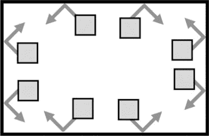

# 十八、让图形动起来

> 原文：[`inventwithpython.com/invent4thed/chapter18.html`](https://inventwithpython.com/invent4thed/chapter18.html)
> 
> 译者：[飞龙](https://github.com/wizardforcel)
> 
> 协议：[CC BY-NC-SA 4.0](https://creativecommons.org/licenses/by-nc-sa/4.0/)

现在您已经学会了一些`pygame`技巧，我们将编写一个程序来使盒子在窗口中反弹。这些盒子颜色和大小不同，只能沿对角线方向移动。为了使盒子动起来，我们将在游戏循环的每次迭代中将它们移动几个像素。这将使它看起来像盒子在屏幕上移动。

**本章涵盖的主题**

+   使用游戏循环来使对象动画化

+   改变对象的方向

### 动画程序的示例运行

当您运行动画程序时，它将类似于图 18-1。方块将从窗口的边缘反弹。


*图 18-1：动画程序的屏幕截图*

### 动画程序的源代码

将以下程序输入文件编辑器并保存为*animation.py*。如果在输入此代码后出现错误，请使用在线差异工具比较您输入的代码与本书代码的差异，网址为[`www.nostarch.com/inventwithpython#diff`](https://www.nostarch.com/inventwithpython#diff)。


`animation.py`

```py
import pygame, sys, time
from pygame.locals import *

# Set up pygame.
pygame.init()

# Set up the window.
WINDOWWIDTH = 400
WINDOWHEIGHT = 400
windowSurface = pygame.display.set_mode((WINDOWWIDTH, WINDOWHEIGHT),
      0, 32)
pygame.display.set_caption('Animation')

# Set up direction variables.
DOWNLEFT = 'downleft'
DOWNRIGHT = 'downright'
UPLEFT = 'upleft'
UPRIGHT = 'upright'

MOVESPEED = 4

# Set up the colors.
WHITE = (255, 255, 255)
RED = (255, 0, 0)
GREEN = (0, 255, 0)
BLUE = (0, 0, 255)

# Set up the box data structure.
b1 = {'rect':pygame.Rect(300, 80, 50, 100), 'color':RED, 'dir':UPRIGHT}
b2 = {'rect':pygame.Rect(200, 200, 20, 20), 'color':GREEN, 'dir':UPLEFT}
b3 = {'rect':pygame.Rect(100, 150, 60, 60), 'color':BLUE, 'dir':DOWNLEFT}
boxes = [b1, b2, b3]

# Run the game loop.
while True:
    # Check for the QUIT event.
    for event in pygame.event.get():
        if event.type == QUIT:
            pygame.quit()
            sys.exit()

    # Draw the white background onto the surface.
    windowSurface.fill(WHITE)

    for b in boxes:
        # Move the box data structure.
        if b['dir'] == DOWNLEFT:
            b['rect'].left -= MOVESPEED
            b['rect'].top += MOVESPEED
        if b['dir'] == DOWNRIGHT:
            b['rect'].left += MOVESPEED
            b['rect'].top += MOVESPEED
        if b['dir'] == UPLEFT:
            b['rect'].left -= MOVESPEED
            b['rect'].top -= MOVESPEED
        if b['dir'] == UPRIGHT:
            b['rect'].left += MOVESPEED
            b['rect'].top -= MOVESPEED

        # Check whether the box has moved out of the window.
        if b['rect'].top < 0:
            # The box has moved past the top.
            if b['dir'] == UPLEFT:
                b['dir'] = DOWNLEFT
            if b['dir'] == UPRIGHT:
                b['dir'] = DOWNRIGHT
        if b['rect'].bottom > WINDOWHEIGHT:
            # The box has moved past the bottom.
            if b['dir'] == DOWNLEFT:
                b['dir'] = UPLEFT
            if b['dir'] == DOWNRIGHT:
                b['dir'] = UPRIGHT
        if b['rect'].left < 0:
            # The box has moved past the left side.
            if b['dir'] == DOWNLEFT:
                b['dir'] = DOWNRIGHT
            if b['dir'] == UPLEFT:
                b['dir'] = UPRIGHT
        if b['rect'].right > WINDOWWIDTH:
            # The box has moved past the right side.
            if b['dir'] == DOWNRIGHT:
                b['dir'] = DOWNLEFT
            if b['dir'] == UPRIGHT:
                b['dir'] = UPLEFT

        # Draw the box onto the surface.
        pygame.draw.rect(windowSurface, b['color'], b['rect'])

    # Draw the window onto the screen.
    pygame.display.update()
    time.sleep(0.02)
```

### 移动和反弹盒子

在这个程序中，我们将有三个不同颜色的盒子在窗口中移动并在墙壁上反弹。在接下来的章节中，我们将使用这个程序作为基础，制作一个我们可以控制其中一个盒子的游戏。为此，首先我们需要考虑我们希望盒子如何移动。

每个盒子将沿着四个对角方向移动。当盒子撞到窗口的边缘时，它应该反弹并沿着新的对角方向移动。盒子将如图 18-2 所示反弹。



*图 18-2：盒子将如何反弹*

盒子在反弹后移动的新方向取决于两件事：反弹前的移动方向和反弹的墙壁。盒子可以有八种可能的反弹方式：每个墙壁有两种不同的方式。例如，如果一个盒子向下和向右移动，然后从窗口的底边反弹，我们希望盒子的新方向是向上和向右。

我们可以使用`Rect`对象来表示盒子的位置和大小，使用三个整数的元组来表示盒子的颜色，以及使用一个整数来表示盒子当前移动的四个对角方向中的哪一个。

游戏循环将调整`Rect`对象中盒子的 x 和 y 位置，并在每次迭代时在屏幕上绘制所有盒子的当前位置。随着程序执行在循环上迭代，盒子将逐渐在屏幕上移动，看起来它们平滑地移动和反弹。

### 设置常量变量

第 1 至 5 行只是设置我们的模块并初始化`pygame`，就像我们在第 17 章中所做的那样：

```py
import pygame, sys, time
from pygame.locals import *

# Set up pygame.
pygame.init()

# Set up the window.
WINDOWWIDTH = 400
WINDOWHEIGHT = 400
windowSurface = pygame.display.set_mode((WINDOWWIDTH, WINDOWHEIGHT),
      0, 32)
pygame.display.set_caption('Animation')
```

在第 8 和 9 行，我们定义了窗口宽度和高度的两个常量，然后在第 10 行，我们使用这些常量设置了`windowSurface`，它将代表我们的`pygame`窗口。第 11 行使用`set_caption()`将窗口的标题设置为'动画'。

在这个程序中，您会看到窗口宽度和高度的大小不仅用于调用`set_mode()`。我们将使用常量变量，这样如果您想要更改窗口的大小，只需更改第 8 和 9 行。由于窗口的宽度和高度在程序执行期间不会改变，因此常量变量是一个好主意。

#### 方向的常量变量

我们将为框可以移动的四个方向使用常量变量：

```py
# Set up direction variables.
DOWNLEFT = 'downleft'
DOWNRIGHT = 'downright'
UPLEFT = 'upleft'
UPRIGHT = 'upright'
```

你可以使用任何你想要的值来代替使用常量变量来表示这些方向。例如，你可以直接使用字符串`'downleft'`来表示向下和向左的对角方向，并在每次需要指定该方向时重新输入该字符串。然而，如果你不小心拼错了`'downleft'`字符串，你的程序会表现得很奇怪，即使程序不会崩溃。

如果你使用常量变量而不小心拼错了变量名，Python 会注意到没有该名称的变量，并用错误使程序崩溃。这仍然是一个相当糟糕的 bug，但至少你会立即知道并且可以修复它。

我们还创建了一个常量变量来确定框移动的速度：

```py
MOVESPEED = 4
```

常量变量`MOVESPEED`中的值`4`告诉程序每次通过游戏循环迭代时每个框应该移动多少像素。

#### 颜色的常量变量

第 22 到 25 行设置了颜色的常量变量。记住，`pygame`使用三个整数值的元组来表示红色、绿色和蓝色的数量，称为 RGB 值。整数的范围是从`0`到`255`。

```py
# Set up the colors.
WHITE = (255, 255, 255)
RED = (255, 0, 0)
GREEN = (0, 255, 0)
BLUE = (0, 0, 255)
```

常量变量用于可读性，就像`pygame` Hello World 程序中一样。

### 设置框数据结构

接下来我们将定义框。为了简化，我们将设置一个字典作为数据结构（参见“字典数据类型”第 112 页）。字典将具有键`'rect'`（值为`Rect`对象）、`'color'`（值为三个整数的元组）和`'dir'`（值为一个方向常量变量）。我们现在只设置了三个框，但是你可以通过定义更多的数据结构来设置更多的框。我们稍后将使用的动画代码可以用来为你在设置数据结构时定义的任意数量的框进行动画。

变量`b1`将存储一个这样的框数据结构：

```py
# Set up the box data structure.
b1 = {'rect':pygame.Rect(300, 80, 50, 100), 'color':RED, 'dir':UPRIGHT}
```

这个框的左上角位于 x 坐标`300`和 y 坐标`80`。它的宽度为`50`像素，高度为`100`像素。它的颜色是`RED`，初始方向是`UPRIGHT`。

第 29 和 30 行创建了另外两个类似的数据结构，用于不同大小、位置、颜色和方向的框：

```py
b2 = {'rect':pygame.Rect(200, 200, 20, 20), 'color':GREEN, 'dir':UPLEFT}
b3 = {'rect':pygame.Rect(100, 150, 60, 60), 'color':BLUE, 'dir':DOWNLEFT}
boxes = [b1, b2, b3]
```

如果你需要从列表中检索一个框或值，你可以使用索引和键。输入`boxes[0]`将访问`b1`中的字典数据结构。如果我们输入`boxes[0]['color']`，那将访问`b1`中的`'color'`键，因此表达式`boxes[0]['color']`将求值为`(255, 0, 0)`。你可以通过从`boxes`开始引用任何框数据结构中的任何值。然后，`b1`、`b2`和`b3`这三个字典被存储在`boxes`变量的列表中。

### 游戏循环

游戏循环处理移动框的动画。动画是通过绘制一系列具有轻微差异的图片来实现的，这些图片依次显示。在我们的动画中，图片将是移动的框，而轻微的差异将在每个框的位置上。每个框在每张图片中移动 4 个像素。图片显示得如此之快，以至于框看起来像是在屏幕上平稳地移动。如果一个框撞到窗口的边缘，那么游戏循环将通过改变它的方向使框弹起。

现在我们知道游戏循环将如何工作一点点，让我们来编写代码吧！

#### 处理玩家退出时

当玩家通过关闭窗口退出时，我们需要像我们之前做`pygame` Hello World 程序那样停止程序。我们需要在游戏循环中这样做，以便我们的程序不断检查是否有`QUIT`事件发生。第 34 行开始循环，第 36 到 39 行处理退出：

```py
# Run the game loop.
while True:
    # Check for the QUIT event.
    for event in pygame.event.get():
        if event.type == QUIT:
            pygame.quit()
            sys.exit()
```

之后，我们要确保`windowSurface`已经准备好被绘制。稍后，我们将使用`rect()`方法在`windowSurface`上绘制每个框。在游戏循环的每次迭代中，代码重新绘制整个窗口，新的框每次都会稍微移动一些像素。当我们这样做时，我们并不是重新绘制整个`Surface`对象；相反，我们只是向`windowSurface`添加`Rect`对象的绘制。但是当游戏循环迭代以再次绘制所有`Rect`对象时，它会重新绘制每个`Rect`，而不会擦除旧的`Rect`绘制。如果我们让游戏循环继续在屏幕上绘制`Rect`对象，最终我们会得到一串`Rect`对象，而不是平滑的动画。为了避免这种情况，我们需要在每次游戏循环迭代时清除窗口。

为了做到这一点，第 42 行填充整个`Surface`为白色，以便擦除先前在其上绘制的任何东西：

```py
    # Draw the white background onto the surface.
    windowSurface.fill(WHITE)
```

如果不调用`windowSurface.fill(WHITE)`来将整个窗口涂白，然后在新位置绘制矩形，你将得到一串`Rect`对象。如果你想尝试一下并看看会发生什么，你可以在第 42 行的开头加上`#`注释掉该行。

一旦`windowSurface`填满，我们就可以开始绘制所有的`Rect`对象。

#### 移动每个框

为了更新每个框的位置，我们需要在游戏循环内迭代`boxes`列表：

```py
    for b in boxes:
```

在`for`循环内，你将把当前的框称为`b`，以使代码更容易输入。我们需要根据框已经移动的方向来改变每个框，因此我们将使用`if`语句来通过检查框数据结构内的`dir`键来确定框的方向。然后我们将根据框移动的方向改变框的位置。

```py
        # Move the box data structure.
        if b['dir'] == DOWNLEFT:
            b['rect'].left -= MOVESPEED
            b['rect'].top += MOVESPEED
        if b['dir'] == DOWNRIGHT:
            b['rect'].left += MOVESPEED
            b['rect'].top += MOVESPEED
        if b['dir'] == UPLEFT:
            b['rect'].left -= MOVESPEED
            b['rect'].top -= MOVESPEED
        if b['dir'] == UPRIGHT:
            b['rect'].left += MOVESPEED
            b['rect'].top -= MOVESPEED
```

设置每个框的`left`和`top`属性的新值取决于框的方向。如果方向是`DOWNLEFT`或`DOWNRIGHT`，则要*增加*`top`属性。如果方向是`UPLEFT`或`UPRIGHT`，则要*减少*`top`属性。

如果框的方向是`DOWNRIGHT`或`UPRIGHT`，则要*增加*`left`属性。如果方向是`DOWNLEFT`或`UPLEFT`，则要*减少*`left`属性。

这些属性的值将根据存储在`MOVESPEED`中的整数的数量增加或减少，该整数存储了每次游戏循环迭代中框移动的像素数。我们在第 19 行设置了`MOVESPEED`。

例如，如果`b['dir']`设置为`'downleft'`，`b['rect'].left`设置为`40`，`b['rect'].top`设置为`100`，那么第 46 行的条件将为`True`。如果`MOVESPEED`设置为`4`，那么第 47 和 48 行将改变`Rect`对象，使得`b['rect'].left`为`36`，`b['rect'].top`为`104`。然后改变`Rect`值会导致第 86 行的绘图代码在其先前位置的稍微向下和向左绘制矩形。

#### 弹跳框

在第 44 到 57 行移动框之后，我们需要检查框是否已经超出了窗口的边缘。如果是，你想要让框弹跳。在代码中，这意味着`for`循环将为框的`'dir'`键设置一个新值。框将在游戏循环的下一次迭代中朝着新的方向移动。这使得看起来像框已经从窗口的一侧弹开了。

在第 60 行的`if`语句中，我们确定如果框的`Rect`对象的`top`属性小于`0`，则框已经移动到窗口的顶部边缘：

```py
        # Check whether the box has moved out of the window.
        if b['rect'].top < 0:
            # The box has moved past the top.
            if b['dir'] == UPLEFT:
                b['dir'] = DOWNLEFT
            if b['dir'] == UPRIGHT:
                b['dir'] = DOWNRIGHT
```

在这种情况下，方向将根据框移动的方向进行更改。如果框是向`UPLEFT`移动的，那么现在将移动到`DOWNLEFT`；如果它是向`UPRIGHT`移动的，那么现在将移动到`DOWNRIGHT`。

第 66 到 71 行处理了框移动到窗口底部边缘之外的情况：

```py
        if b['rect'].bottom > WINDOWHEIGHT:
            # The box has moved past the bottom.
            if b['dir'] == DOWNLEFT:
                b['dir'] = UPLEFT
            if b['dir'] == DOWNRIGHT:
                b['dir'] = UPRIGHT
```

这些行检查`bottom`属性（而不是`top`属性）是否*大于*`WINDOWHEIGHT`中的值。记住，y 坐标从窗口顶部的`0`开始，并在底部增加到`WINDOWHEIGHT`。

第 72 到 83 行处理了方块在撞击边缘时的行为。

```py
        if b['rect'].left < 0:
            # The box has moved past the left side.
            if b['dir'] == DOWNLEFT:
                b['dir'] = DOWNRIGHT
            if b['dir'] == UPLEFT:
                b['dir'] = UPRIGHT
        if b['rect'].right > WINDOWWIDTH:
            # The box has moved past the right side.
            if b['dir'] == DOWNRIGHT:
                b['dir'] = DOWNLEFT
            if b['dir'] == UPRIGHT:
                b['dir'] = UPLEFT
```

第 78 到 83 行与第 72 到 77 行类似，但是检查方块的右侧是否移动到了窗口的右边缘。记住，x 坐标从窗口的左边缘开始为`0`，并在窗口的右边缘增加到`WINDOWWIDTH`。

#### 在它们的新位置上在窗口上绘制方块

每当方块移动时，我们需要通过调用`pygame.draw.rect()`函数在`windowSurface`上绘制它们的新位置：

```py
        # Draw the box onto the surface.
        pygame.draw.rect(windowSurface, b['color'], b['rect'])
```

你需要将`windowSurface`传递给函数，因为它是要在其上绘制矩形的`Surface`对象。将`b['color']`传递给函数，因为它是矩形的颜色。最后，传递`b['rect']`，因为它是具有矩形位置和大小的`Rect`对象。

第 86 行是`for`循环的最后一行。

#### 在屏幕上绘制窗口

在`for`循环之后，`boxes`列表中的每个方块都将被绘制，因此你需要调用`pygame.display.update()`来在屏幕上绘制`windowSurface`：

```py
    # Draw the window onto the screen.
    pygame.display.update()
    time.sleep(0.02)
```

计算机可以移动、弹跳和绘制方块得非常快，以至于如果程序以全速运行，所有的方块看起来都像一片模糊。为了使程序运行得足够慢，以至于我们能看到方块，我们需要添加`time.sleep(0.02)`。你可以尝试注释掉`time.sleep(0.02)`这一行，并运行程序看看它是什么样子。调用`time.sleep()`将在每次方块移动之间暂停程序 0.02 秒，或 20 毫秒。

在这一行之后，执行返回到游戏循环的开始，并重新开始整个过程。这样，方块们不断地移动一点，撞到墙上，并在屏幕上以它们的新位置被绘制出来。

### 总结

本章介绍了创建计算机程序的全新方式。之前章节的程序会停下来等待玩家输入文本。然而，在我们的动画程序中，程序会不断更新数据结构，而不需要等待玩家的输入。

记住我们在 Hangman 和 Tic-Tac-Toe 游戏中有代表棋盘状态的数据结构。这些数据结构被传递给`drawBoard()`函数以在屏幕上显示。我们的动画程序类似。`boxes`变量保存了一个代表要绘制到屏幕上的方块的数据结构列表，并且这些方块是在游戏循环内绘制的。

但是没有调用`input()`，我们怎么从玩家那里获取输入呢？在第 19 章中，我们将介绍程序如何知道玩家何时按下键盘上的按键。我们还将学习一个叫做碰撞检测的新概念。
