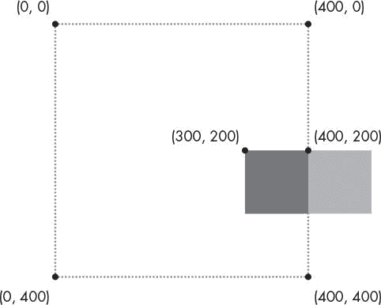

# 十九、碰撞检测

> 原文：[`inventwithpython.com/invent4thed/chapter19.html`](https://inventwithpython.com/invent4thed/chapter19.html)
> 
> 译者：[飞龙](https://github.com/wizardforcel)
> 
> 协议：[CC BY-NC-SA 4.0](https://creativecommons.org/licenses/by-nc-sa/4.0/)


*碰撞检测*涉及确定屏幕上的两个物体何时相互接触（即发生碰撞）。碰撞检测对于游戏非常有用。例如，如果玩家触碰到敌人，他们可能会失去生命值。或者如果玩家触碰到硬币，他们应该自动捡起它。碰撞检测可以帮助确定游戏角色是否站在坚实的地面上，或者他们脚下只有空气。

在我们的游戏中，碰撞检测将确定两个矩形是否重叠。本章的示例程序将涵盖这种基本技术。我们还将看看我们的`pygame`程序如何通过键盘和鼠标接受玩家的输入。这比我们为文本程序所做的调用`input()`函数要复杂一些。但在 GUI 程序中使用键盘要更加互动，而在我们的文本游戏中甚至无法使用鼠标。这两个概念将使您的游戏更加令人兴奋！

**本章涵盖的主题**

+   `Clock`对象

+   `pygame`中的键盘输入

+   `pygame`中的鼠标输入

+   碰撞检测

+   在迭代列表时不修改列表

### 碰撞检测程序的示例运行

在这个程序中，玩家使用键盘的箭头键在屏幕上移动一个黑色的方块。较小的绿色方块代表食物，出现在屏幕上，方块触碰到它们时会“吃”掉它们。玩家可以在窗口的任何地方点击以创建新的食物方块。此外，按 ESC 键退出程序，按 X 键将玩家传送到屏幕上的随机位置。

图 19-1 显示了程序完成后的样子。


*图 19-1：* pygame *碰撞检测程序的屏幕截图*

### 碰撞检测程序的源代码

开始一个新文件，输入以下代码，然后将其保存为*collisionDetection.py*。如果在输入此代码后出现错误，请使用在线 diff 工具将您输入的代码与本书代码进行比较，网址为[`www.nostarch.com/inventwithpython#diff`](https://www.nostarch.com/inventwithpython#diff)。


*collision Detection.py*

```py
import pygame, sys, random
from pygame.locals import *

# Set up pygame.
pygame.init()
mainClock = pygame.time.Clock()

# Set up the window.
WINDOWWIDTH = 400
WINDOWHEIGHT = 400
windowSurface = pygame.display.set_mode((WINDOWWIDTH, WINDOWHEIGHT),
       0, 32)
pygame.display.set_caption('Collision Detection')

# Set up the colors.
BLACK = (0, 0, 0)
GREEN = (0, 255, 0)
WHITE = (255, 255, 255)

# Set up the player and food data structures.
foodCounter = 0
NEWFOOD = 40
FOODSIZE = 20
player = pygame.Rect(300, 100, 50, 50)
foods = []
for i in range(20):
    foods.append(pygame.Rect(random.randint(0, WINDOWWIDTH - FOODSIZE),
           random.randint(0, WINDOWHEIGHT - FOODSIZE), FOODSIZE, FOODSIZE))

# Set up movement variables.
moveLeft = False
moveRight = False
moveUp = False
moveDown = False

MOVESPEED = 6


# Run the game loop.
while True:
    # Check for events.
    for event in pygame.event.get():
        if event.type == QUIT:
            pygame.quit()
            sys.exit()
        if event.type == KEYDOWN:
            # Change the keyboard variables.
            if event.key == K_LEFT or event.key == K_a:
                moveRight = False
                moveLeft = True
            if event.key == K_RIGHT or event.key == K_d:
                moveLeft = False
                moveRight = True
            if event.key == K_UP or event.key == K_w:
                moveDown = False
                moveUp = True
            if event.key == K_DOWN or event.key == K_s:
                moveUp = False
                moveDown = True
        if event.type == KEYUP:
            if event.key == K_ESCAPE:
                pygame.quit()
                sys.exit()
            if event.key == K_LEFT or event.key == K_a:
                moveLeft = False
            if event.key == K_RIGHT or event.key == K_d:
                moveRight = False
            if event.key == K_UP or event.key == K_w:
                moveUp = False
            if event.key == K_DOWN or event.key == K_s:
                moveDown = False
            if event.key == K_x:
                player.top = random.randint(0, WINDOWHEIGHT -
                       player.height)
                player.left = random.randint(0, WINDOWWIDTH -
                       player.width)

        if event.type == MOUSEBUTTONUP:
            foods.append(pygame.Rect(event.pos[0], event.pos[1],
                   FOODSIZE, FOODSIZE))

    foodCounter += 1
    if foodCounter >= NEWFOOD:
        # Add new food.
        foodCounter = 0
        foods.append(pygame.Rect(random.randint(0, WINDOWWIDTH -
               FOODSIZE), random.randint(0, WINDOWHEIGHT - FOODSIZE),
               FOODSIZE, FOODSIZE))

    # Draw the white background onto the surface.
    windowSurface.fill(WHITE)

    # Move the player.
    if moveDown and player.bottom < WINDOWHEIGHT:
        player.top += MOVESPEED
    if moveUp and player.top > 0:
        player.top -= MOVESPEED
    if moveLeft and player.left > 0:
        player.left -= MOVESPEED
    if moveRight and player.right < WINDOWWIDTH:
        player.right += MOVESPEED

    # Draw the player onto the surface.
    pygame.draw.rect(windowSurface, BLACK, player)

    # Check whether the player has intersected with any food squares.
    for food in foods[:]:
        if player.colliderect(food):
            foods.remove(food)

    # Draw the food.
    for i in range(len(foods)):
        pygame.draw.rect(windowSurface, GREEN, foods[i])

    # Draw the window onto the screen.
    pygame.display.update()
    mainClock.tick(40)
```

### 导入模块

`pygame` 碰撞检测程序导入了与第 18 章中的动画程序相同的模块，还有`random`模块：

```py
import pygame, sys, random
from pygame.locals import *
```

### 使用时钟来控制程序的节奏

第 5 到 17 行大部分做的事情与动画程序相同：它们初始化了`pygame`，设置了`WINDOWHEIGHT`和`WINDOWWIDTH`，并分配了颜色和方向常量。

然而，第 6 行是新的：

```py
mainClock = pygame.time.Clock()
```

在动画程序中，调用`time.sleep(0.02)`会减慢程序的运行速度，以防止它运行得太快。虽然这个调用在所有计算机上都会暂停 0.02 秒，但程序的其余部分的速度取决于计算机的速度。如果我们希望这个程序在任何计算机上以相同的速度运行，我们需要一个函数，在快速计算机上暂停时间更长，在慢速计算机上暂停时间更短。

`pygame.time.Clock`对象可以在任何计算机上暂停适当的时间。第 110 行在游戏循环内调用了`mainClock.tick(40)`。对`Clock`对象的`tick()`方法的调用等待足够的时间，以便它以大约 40 次迭代每秒的速度运行，无论计算机的速度如何。这确保游戏永远不会比您预期的速度更快。对`tick()`的调用应该只出现一次在游戏循环中。

### 设置窗口和数据结构

第 19 到 22 行设置了一些用于在屏幕上出现的食物方块的变量：

```py
# Set up the player and food data structures.
foodCounter = 0
NEWFOOD = 40
FOODSIZE = 20
```

`foodCounter`变量将从值`0`开始，`NEWFOOD`为`40`，`FOODSIZE`为`20`。稍后我们将看到这些变量在创建食物时如何使用。

第 23 行设置了玩家位置的`pygame.Rect`对象：

```py
player = pygame.Rect(300, 100, 50, 50)
```

`player`变量有一个`pygame.Rect`对象，表示方块的大小和位置。玩家的方块将像动画程序中的方块一样移动（参见“移动每个方块”在第 280 页），但在这个程序中，玩家可以控制方块的移动方向。

接下来，我们设置了一些代码来跟踪食物方块：

```py
foods = []
for i in range(20):
    foods.append(pygame.Rect(random.randint(0, WINDOWWIDTH - FOODSIZE),
          random.randint(0, WINDOWHEIGHT - FOODSIZE), FOODSIZE, FOODSIZE))
```

程序将使用`foods`列表来跟踪每个食物方块的`Rect`对象。第 25 和 26 行在屏幕周围随机放置了 20 个食物方块。您可以使用`random.randint()`函数来生成随机的 x 和 y 坐标。

在第 26 行，程序调用`pygame.Rect()`构造函数来返回一个新的`pygame.Rect`对象。它将表示一个新食物方块的位置和大小。`pygame.Rect()`的前两个参数是左上角的 x 和 y 坐标。您希望随机坐标在`0`和窗口大小减去食物方块大小之间。如果将随机坐标设置在`0`和窗口大小之间，那么食物方块可能会被推到窗口之外，就像图 19-2 中一样。

`pygame.Rect()`的第三个和第四个参数是食物方块的宽度和高度。宽度和高度都是`FOODSIZE`常量中的值。



*图 19-2：对于 400×400 窗口中的 100×100 方块，将左上角设置为 400 会将矩形放在窗口外。要在内部，左边缘应该设置为 300。*

`pygame.Rect()`的第三个和第四个参数是食物方块的宽度和高度。宽度和高度都是`FOODSIZE`常量中的值。

### 设置跟踪移动的变量

从第 29 行开始，代码设置了一些变量，用于跟踪玩家方块的移动方向：

```py
# Set up movement variables.
moveLeft = False
moveRight = False
moveUp = False
moveDown = False
```

这四个变量具有布尔值，用于跟踪哪个箭头键被按下，并最初设置为`False`。例如，当玩家按下键盘上的左箭头键移动方块时，`moveLeft`被设置为`True`。当他们松开键时，`moveLeft`被设置回`False`。

第 34 到 43 行几乎与以前的`pygame`程序中的代码相同。这些行处理游戏循环的开始以及玩家退出程序时的操作。我们将跳过对此代码的解释，因为我们在上一章中已经涵盖过了。

### 处理事件

`pygame`模块可以根据鼠标或键盘的用户输入生成事件。以下是`pygame.event.get()`可以返回的事件：

`QUIT` 当玩家关闭窗口时生成。

`KEYDOWN` 当玩家按下键时生成。具有`key`属性，告诉按下了哪个键。还有一个`mod`属性，告诉按下该键时是否按下了 SHIFT、CTRL、ALT 或其他键。

`KEYUP` 当玩家释放键时生成。具有与`KEYDOWN`类似的`key`和`mod`属性。

`MOUSEMOTION`：每当鼠标在窗口上移动时生成。具有`pos`属性（缩写为*position*），返回窗口中鼠标位置的元组`(x, y)`。`rel`属性还返回一个`(x, y)`元组，但它给出自上一个`MOUSEMOTION`事件以来的相对坐标。例如，如果鼠标从`(200, 200)`向左移动 4 像素到`(196, 200)`，那么`rel`将是元组值`(-4, 0)`。`button`属性返回一个三个整数的元组。元组中的第一个整数是左鼠标按钮，第二个整数是中间鼠标按钮（如果存在），第三个整数是右鼠标按钮。如果鼠标移动时它们没有被按下，则这些整数将为`0`，如果它们被按下，则为`1`。

`MOUSEBUTTONDOWN`：当鼠标在窗口中按下按钮时生成。此事件具有`pos`属性，它是鼠标按下按钮时鼠标位置的`(x, y)`元组。还有一个`button`属性，它是从`1`到`5`的整数，告诉哪个鼠标按钮被按下，如表 19-1 中所述。

`MOUSEBUTTONUP`：当鼠标按钮释放时生成。这与`MOUSEBUTTONDOWN`具有相同的属性。

当生成`MOUSEBUTTONDOWN`事件时，它具有`button`属性。`button`属性是与鼠标可能具有的不同类型的按钮相关联的值。例如，左键的值为`1`，右键的值为`3`。表 19-1 列出了鼠标事件的所有`button`属性，但请注意，鼠标可能没有这里列出的所有`button`值。

**表 19-1：** `button`属性值

| **`button`的值** | **鼠标按钮** | 
 | --- | --- | 
 | 1 | 左键 | 
 | 2 | 中键 | 
 | 3 | 右键 | 
 | 4 | 滚轮向上滚动 | 
 | 5 | 滚轮向下滚动 |

我们将使用这些事件来让玩家使用`KEYDOWN`事件和鼠标按钮点击来控制框。

#### 处理 KEYDOWN 事件

处理按键和释放事件的代码从第 44 行开始；它包括`KEYDOWN`事件类型：

```py
        if event.type == KEYDOWN:
```

如果事件类型是`KEYDOWN`，则`Event`对象具有一个`key`属性，指示按下了哪个键。当玩家按下箭头键或 WASD 键（发音为*wazz-dee*，这些键与箭头键的布局相同，但位于键盘左侧）时，我们希望移动框。我们将使用`if`语句来检查按下的键，以便确定框应该移动的方向。

第 46 行将`key`属性与`K_LEFT`和`K_a`进行比较，它们是表示键盘上左箭头键和 WASD 中 A 的`pygame.locals`常量。第 46 至 57 行检查每个箭头和 WASD 键：

```py
            # Change the keyboard variables.
            if event.key == K_LEFT or event.key == K_a:
                moveRight = False
                moveLeft = True
            if event.key == K_RIGHT or event.key == K_d:
                moveLeft = False
                moveRight = True
            if event.key == K_UP or event.key == K_w:
                moveDown = False
                moveUp = True
            if event.key == K_DOWN or event.key == K_s:
                moveUp = False
                moveDown = True
```

当按下这些键之一时，代码告诉 Python 将相应的移动变量设置为`True`。Python 还会将相反方向的移动变量设置为`False`。

例如，当按下左箭头键时，程序执行第 47 和 48 行。在这种情况下，Python 将`moveLeft`设置为`True`，`moveRight`设置为`False`（即使`moveRight`可能已经是`False`，Python 也会将其设置为`False`，以确保）。

在第 46 行，`event.key`可以等于`K_LEFT`或`K_a`。如果按下左箭头键，则`event.key`中的值将设置为与`K_LEFT`相同的值，如果按下 A 键，则设置为与`K_a`相同的值。

通过执行第 47 和 48 行的代码，如果按键是`K_LEFT`或`K_a`，则左箭头键和 A 键将执行相同的操作。W、A、S 和 D 键用作更改移动变量的替代键，让玩家可以使用左手而不是右手。您可以在图 19-3 中看到这两组键的示例。


*图 19-3：WASD 键可以编程为与箭头键执行相同的操作。*

字母和数字键的常量很容易找到：A 键的常量是`K_a`，B 键的常量是`K_b`，依此类推。3 键的常量是`K_3`。表 19-2 列出了其他键盘键的常用常量变量。

**表 19-2：**键盘键的常量变量

| `pygame` **常量变量** | **键盘键** | 
| --- | --- | 
| `K_LEFT` | 左箭头 | 
| `K_RIGHT` | 右箭头 | 
| `K_UP` | 上箭头 | 
| `K_DOWN` | 下箭头 | 
| `K_ESCAPE` | ESC | 
| `K_BACKSPACE` | 退格键 | 
| `K_TAB` | TAB | 
| `K_RETURN` | RETURN 或 ENTER | 
| `K_SPACE` | 空格键 | 
| `K_DELETE` | DEL | 
| `K_LSHIFT` | 左 SHIFT | 
| `K_RSHIFT` | 右 SHIFT | 
| `K_LCTRL` | 左 CTRL | 
| `K_RCTRL` | 右 CTRL | 
| `K_LALT` | 左 ALT | 
| `K_RALT` | 右 ALT | 
| `K_HOME` | HOME | 
| `K_END` | END | 
| `K_PAGEUP` | PGUP | 
| `K_PAGEDOWN` | PGDN | 
| `K_F1` | F1 | 
| `K_F2` | F2 | 
| `K_F3` | F3 | 
| `K_F4` | F4 | 
| `K_F5` | F5 | 
| `K_F6` | F6 | 
| `K_F7` | F7 | 
| `K_F8` | F8 | 
| `K_F9` | F9 | 
| `K_F10` | F10 | 
| `K_F11` | F11 | 
| `K_F12` | F12 |

#### 处理 KEYUP 事件

当玩家释放他们按下的键时，将生成一个`KEYUP`事件：

```py
        if event.type == KEYUP:
```

如果玩家释放的键是 ESC，则 Python 应终止程序。请记住，在`pygame`中，您必须在调用`sys.exit()`函数之前调用`pygame.quit()`函数，我们在第 59 到 61 行中这样做：

```py
            if event.key == K_ESCAPE:
                pygame.quit()
                sys.exit()
```

第 62 到 69 行如果释放了该方向键，则将移动变量设置为`False`： 

```py
            if event.key == K_LEFT or event.key == K_a:
                moveLeft = False
            if event.key == K_RIGHT or event.key == K_d:
                moveRight = False
            if event.key == K_UP or event.key == K_w:
                moveUp = False
            if event.key == K_DOWN or event.key == K_s:
                moveDown = False
```

通过`KEYUP`事件将移动变量设置为`False`会使框停止移动。

### 传送玩家

您还可以将传送添加到游戏中。如果玩家按下 X 键，则第 71 和 72 行将玩家框的位置设置为窗口上的随机位置：

```py
            if event.key == K_x:
                player.top = random.randint(0, WINDOWHEIGHT -
                      player.height)
                player.left = random.randint(0, WINDOWWIDTH -
                      player.width)
```

第 70 行检查玩家是否按下了 X 键。然后，第 71 行设置一个随机的 x 坐标，将玩家传送到窗口的高度减去玩家矩形的高度之间。第 72 行执行类似的代码，但是针对 y 坐标。这使玩家可以通过按 X 键在窗口周围传送，但他们无法控制将传送到哪里——这是完全随机的。

### 添加新的食物方块

玩家可以通过两种方式向屏幕添加新的食物方块。他们可以单击窗口中希望新食物方块出现的位置，或者他们可以等到游戏循环迭代`NEWFOOD`次数，这样新的食物方块将在窗口上随机生成。

我们首先看一下如何通过玩家的鼠标输入添加食物：

```py
        if event.type == MOUSEBUTTONUP:
            foods.append(pygame.Rect(event.pos[0], event.pos[1],
                  FOODSIZE, FOODSIZE))
```

鼠标输入与键盘输入一样通过事件处理。当玩家在单击鼠标后释放鼠标按钮时，将发生`MOUSEBUTTONUP`事件。

第 75 行中，x 坐标存储在`event.pos[0]`中，y 坐标存储在`event.pos[1]`中。第 75 行创建一个新的`Rect`对象来表示一个新的食物方块，并将其放置在`MOUSEBUTTONUP`事件发生的地方。通过向`foods`列表添加新的`Rect`对象，代码在屏幕上显示一个新的食物方块。

除了可以由玩家自行添加外，食物方块还可以通过第 77 到 81 行的代码自动生成：

```py
    foodCounter += 1
    if foodCounter >= NEWFOOD:
        # Add new food.
        foodCounter = 0
        foods.append(pygame.Rect(random.randint(0, WINDOWWIDTH -
              FOODSIZE), random.randint(0, WINDOWHEIGHT - FOODSIZE),
              FOODSIZE, FOODSIZE))
```

变量`foodCounter`跟踪应添加食物的频率。每次游戏循环迭代时，`foodCounter`在第 77 行增加`1`。

一旦`foodCounter`大于或等于常量`NEWFOOD`，`foodCounter`将被重置，并且通过第 81 行生成一个新的食物方块。您可以通过调整第 21 行上的`NEWFOOD`来改变添加新食物方块的速度。

84 行只是用白色填充窗口表面，我们在“处理玩家退出时”和第 279 页中已经讨论过了，所以我们将继续讨论玩家如何在屏幕上移动。

### 在窗口中移动玩家

我们已将移动变量（`moveDown`，`moveUp`，`moveLeft`和`moveRight`）设置为`True`或`False`，具体取决于玩家按下了哪些键。现在我们需要移动玩家的方框，该方框由存储在`player`中的`pygame.Rect`对象表示。我们将通过调整`player`的 x 和 y 坐标来实现这一点。

```py
    # Move the player.
    if moveDown and player.bottom < WINDOWHEIGHT:
        player.top += MOVESPEED
    if moveUp and player.top > 0:
        player.top -= MOVESPEED
    if moveLeft and player.left > 0:
        player.left -= MOVESPEED
    if moveRight and player.right < WINDOWWIDTH:
        player.right += MOVESPEED
```

如果`moveDown`设置为`True`（并且玩家的方框底部不在窗口的底部之下），则第 88 行将通过将`MOVESPEED`添加到玩家当前的`top`属性来向下移动玩家的方框。第 89 到 94 行对其他三个方向执行相同的操作。

#### 在窗口上绘制玩家

第 97 行在窗口上绘制玩家的方框：

```py
    # Draw the player onto the surface.
    pygame.draw.rect(windowSurface, BLACK, player)
```

在移动方框之后，第 97 行将其绘制在新位置。传递给第一个参数的`windowSurface`告诉 Python 在哪个`Surface`对象上绘制矩形。存储在`BLACK`变量中的`(0, 0, 0)`告诉 Python 绘制黑色矩形。存储在`player`变量中的`Rect`对象告诉 Python 要绘制的矩形的位置和大小。

#### 检查碰撞

在绘制食物方块之前，程序需要检查玩家的方框是否与任何方块重叠。如果是，则需要从`foods`列表中删除该方块。这样，Python 就不会绘制任何盒子已经吃掉的食物方块。

我们将在第 101 行使用所有`Rect`对象都具有的碰撞检测方法`colliderect()`：

```py
    # Check whether the player has intersected with any food squares.
    for food in foods[:]:
        if player.colliderect(food):
            foods.remove(food)
```

在每次`for`循环迭代中，将`foods`（复数）列表中的当前食物方块放入变量`food`（单数）中。`pygame.Rect`对象的`colliderect()`方法将玩家矩形的`pygame.Rect`对象作为参数，并在两个矩形发生碰撞时返回`True`，如果它们没有发生碰撞，则返回`False`。如果为`True`，第 102 行将从`foods`列表中移除重叠的食物方块。

**不要在迭代列表时更改列表**

请注意，这个`for`循环与我们以前看到的任何其他`for`循环略有不同。如果您仔细看第 100 行，它并不是在`foods`上进行迭代，而是在`foods[:]`上进行迭代。

记住切片的工作原理。`foods[:2]`将计算列表的副本，其中包含从开头到（但不包括）索引`2`的项目。`foods[:]`将为您提供包含从开头到结尾的项目的列表的副本。基本上，`foods[:]`创建一个新列表，其中包含`foods`中所有项目的副本。这是复制列表的一种更简洁的方法，比如在第 10 章的井字棋游戏中`getBoardCopy()`函数所做的。

在迭代列表时，您不能添加或删除项目。如果 foods 列表的大小始终在变化，Python 可能会丢失 food 变量的下一个值应该是什么。想象一下，当有人添加或删除果冻豆时，要数出罐子里果冻豆的数量会有多困难。

但是，如果您迭代列表的副本（并且副本永远不会更改），则从原始列表中添加或删除项目将不会成为问题。

### 在窗口上绘制食物方块

第 105 行和 106 行的代码类似于我们用来为玩家绘制黑色方框的代码：

```py
    # Draw the food.
    for i in range(len(foods)):
        pygame.draw.rect(windowSurface, GREEN, foods[i])
```

第 105 行循环遍历`foods`列表中的每个食物方块，第 106 行将食物方块绘制到`windowSurface`上。

现在玩家和食物方块都在屏幕上，窗口已准备好更新，因此我们在第 109 行调用`update()`方法，并通过在我们之前创建的`Clock`对象上调用`tick()`方法来完成程序：

```py
    # Draw the window onto the screen.
    pygame.display.update()
    mainClock.tick(40)
```

程序将继续通过游戏循环并保持更新，直到玩家退出。

### 总结

本章介绍了碰撞检测的概念。在图形游戏中，检测两个矩形之间的碰撞是如此普遍，以至于`pygame`为`pygame.Rect`对象提供了自己的碰撞检测方法，名为`colliderect()`。

这本书中的前几个游戏都是基于文本的。程序的输出是打印在屏幕上的文本，输入是玩家在键盘上输入的文本。但是图形程序也可以接受键盘和鼠标输入。

此外，这些程序可以在玩家按下或释放单个键时响应单个按键。玩家不必输入整个响应并按下 ENTER 键。这样可以实现即时反馈和更加互动的游戏。

这个交互式程序很有趣，但让我们超越绘制矩形。在第 20 章中，你将学习如何使用`pygame`加载图像和播放音效。


