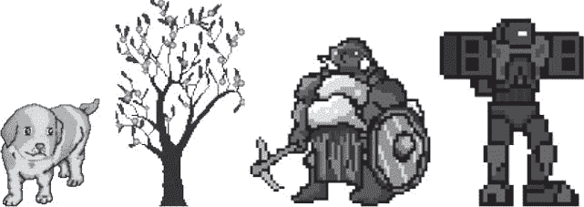

# 二十、使用声音和图像

> 原文：[`inventwithpython.com/invent4thed/chapter20.html`](https://inventwithpython.com/invent4thed/chapter20.html)
> 
> 译者：[飞龙](https://github.com/wizardforcel)
> 
> 协议：[CC BY-NC-SA 4.0](https://creativecommons.org/licenses/by-nc-sa/4.0/)


在第 18 章和第 19 章中，您学习了如何制作具有图形并可以接受键盘和鼠标输入的 GUI 程序。您还学会了如何绘制不同的形状。在本章中，您将学习如何向游戏中添加声音、音乐和图像。

**本章涵盖的主题**

+   声音和图像文件

+   绘制和调整精灵的大小

+   添加音乐和声音

+   切换声音开关

### 使用精灵添加图像

*sprite*是屏幕上用作图形的一部分的单个二维图像。图 20-1 显示了一些示例 sprite。



*图 20-1：一些精灵的示例*

精灵图像绘制在背景上。您可以水平翻转精灵图像，使其面向另一边。您还可以在同一窗口上多次绘制相同的精灵图像，并且可以调整精灵的大小，使其比原始精灵图像大或小。背景图像也可以被视为一个大精灵。图 20-2 显示了精灵一起使用。


*图 20-2：一个完整的场景，精灵绘制在背景上* 

下一个程序将演示如何使用`pygame`播放声音和绘制精灵。

### 声音和图像文件

精灵存储在计算机上的图像文件中。`pygame`可以使用几种图像格式。要了解图像文件使用的格式，请查看文件名的末尾（最后一个句点之后）。这称为*文件扩展名*。例如，文件*player.png*是 PNG 格式。`pygame`支持的图像格式包括 BMP、PNG、JPG 和 GIF。

您可以从网络浏览器下载图像。在大多数网络浏览器上，您可以通过右键单击网页中的图像，然后从出现的菜单中选择“保存”来这样做。记住您保存图像文件的硬盘位置，因为您需要将下载的图像文件复制到与 Python 程序的*.py*文件相同的文件夹中。您还可以使用诸如 Microsoft Paint 或 Tux Paint 之类的绘图程序创建自己的图像。

`pygame`支持的声音文件格式为 MIDI、WAV 和 MP3。您可以像下载图像文件一样从互联网下载音效文件，但音频文件必须是这三种格式之一。如果您的计算机有麦克风，您还可以录制声音并制作自己的 WAV 文件以在游戏中使用。

### Sprites and Sounds 程序的示例运行

本章的程序与第 19 章的碰撞检测程序相同。但是，在本程序中，我们将使用精灵而不是普通的方块。我们将使用一个人的精灵来代表玩家，而不是黑色方块，以及樱桃的精灵，而不是绿色的食物方块。我们还将播放背景音乐，并在玩家精灵吃掉樱桃时添加声音效果。

在这个游戏中，玩家精灵将吃掉樱桃精灵，并且在吃掉樱桃时，它会变大。当您运行程序时，游戏将看起来像图 20-3。


*图 20-3：Sprites and Sounds 游戏的屏幕截图*

### Sprites and Sounds 程序的源代码

开始一个新文件，输入以下代码，然后将其保存为*spritesAndSounds.py*。你可以从本书的网站[`www.nostarch.com/inventwithpython/`](https://www.nostarch.com/inventwithpython/)下载我们在本程序中使用的图像和声音文件。将这些文件放在与*spritesAndSounds.py*程序相同的文件夹中。


如果在输入此代码后出现错误，请使用在线的 diff 工具比较你输入的代码和书中的代码，网址为[`www.nostarch.com/inventwithpython#diff`](https://www.nostarch.com/inventwithpython#diff)。

*spritesAnd Sounds.py*

```py
import pygame, sys, time, random
from pygame.locals import *

# Set up pygame.
pygame.init()
mainClock = pygame.time.Clock()

# Set up the window.
WINDOWWIDTH = 400
WINDOWHEIGHT = 400
windowSurface = pygame.display.set_mode((WINDOWWIDTH, WINDOWHEIGHT),
       0, 32)
pygame.display.set_caption('Sprites and Sounds')

# Set up the colors.
WHITE = (255, 255, 255)

# Set up the block data structure.
player = pygame.Rect(300, 100, 40, 40)
playerImage = pygame.image.load('player.png')
playerStretchedImage = pygame.transform.scale(playerImage, (40, 40))
foodImage = pygame.image.load('cherry.png')
foods = []
for i in range(20):
    foods.append(pygame.Rect(random.randint(0, WINDOWWIDTH - 20),
           random.randint(0, WINDOWHEIGHT - 20), 20, 20))

foodCounter = 0
NEWFOOD = 40

# Set up keyboard variables.
moveLeft = False
moveRight = False
moveUp = False
moveDown = False

MOVESPEED = 6

# Set up the music.
pickUpSound = pygame.mixer.Sound('pickup.wav')
pygame.mixer.music.load('background.mid')
pygame.mixer.music.play(-1, 0.0)
musicPlaying = True

# Run the game loop.
while True:
    # Check for the QUIT event.
    for event in pygame.event.get():
        if event.type == QUIT:
            pygame.quit()
            sys.exit()
        if event.type == KEYDOWN:
            # Change the keyboard variables.
            if event.key == K_LEFT or event.key == K_a:
                moveRight = False
                moveLeft = True
            if event.key == K_RIGHT or event.key == K_d:
                moveLeft = False
                moveRight = True
            if event.key == K_UP or event.key == K_w:
                moveDown = False
                moveUp = True
            if event.key == K_DOWN or event.key == K_s:
                moveUp = False
                moveDown = True
        if event.type == KEYUP:
            if event.key == K_ESCAPE:
                pygame.quit()
                sys.exit()
            if event.key == K_LEFT or event.key == K_a:
                moveLeft = False
            if event.key == K_RIGHT or event.key == K_d:
                moveRight = False
            if event.key == K_UP or event.key == K_w:
                moveUp = False
            if event.key == K_DOWN or event.key == K_s:
                moveDown = False
            if event.key == K_x:
                player.top = random.randint(0, WINDOWHEIGHT -
                       player.height)
                player.left = random.randint(0, WINDOWWIDTH -
                       player.width)
            if event.key == K_m:
                if musicPlaying:
                    pygame.mixer.music.stop()
                else:
                    pygame.mixer.music.play(-1, 0.0)
                musicPlaying = not musicPlaying

        if event.type == MOUSEBUTTONUP:
            foods.append(pygame.Rect(event.pos[0] - 10,
                   event.pos[1] - 10, 20, 20))

    foodCounter += 1
    if foodCounter >= NEWFOOD:
        # Add new food.
        foodCounter = 0
        foods.append(pygame.Rect(random.randint(0, WINDOWWIDTH - 20),
               random.randint(0, WINDOWHEIGHT - 20), 20, 20))

    # Draw the white background onto the surface.
    windowSurface.fill(WHITE)

    # Move the player.
    if moveDown and player.bottom < WINDOWHEIGHT:
        player.top += MOVESPEED
    if moveUp and player.top > 0:
        player.top -= MOVESPEED
    if moveLeft and player.left > 0:
        player.left -= MOVESPEED
    if moveRight and player.right < WINDOWWIDTH:
        player.right += MOVESPEED


    # Draw the block onto the surface.
    windowSurface.blit(playerStretchedImage, player)

    # Check whether the block has intersected with any food squares.
    for food in foods[:]:
        if player.colliderect(food):
            foods.remove(food)
            player = pygame.Rect(player.left, player.top,
                   player.width + 2, player.height + 2)
            playerStretchedImage = pygame.transform.scale(playerImage,
                   (player.width, player.height))
            if musicPlaying:
                pickUpSound.play()

    # Draw the food.
    for food in foods:
        windowSurface.blit(foodImage, food)

    # Draw the window onto the screen.
    pygame.display.update()
    mainClock.tick(40)
```

### 设置窗口和数据结构

这个程序中的大部分代码与第 19 章中的碰撞检测程序相同。我们只关注添加精灵和声音的部分。首先，在第 12 行，让我们将标题栏的标题设置为描述这个程序的字符串：

```py
pygame.display.set_caption('Sprites and Sounds')
```

为了设置标题，你需要将字符串`'Sprites and Sounds'`传递给`pygame.display.set_caption()`函数。

#### 添加一个精灵

现在我们已经设置好标题，我们需要实际的精灵。我们将使用三个变量来表示玩家，而不是之前程序中只使用一个。

```py
# Set up the block data structure.
player = pygame.Rect(300, 100, 40, 40)
playerImage = pygame.image.load('player.png')
playerStretchedImage = pygame.transform.scale(playerImage, (40, 40))
foodImage = pygame.image.load('cherry.png')
```

第 18 行的`player`变量将存储一个`Rect`对象，用于跟踪玩家的位置和大小。`player`变量不包含玩家的图像。在程序开始时，玩家的左上角位于(300, 100)，玩家的初始高度和宽度为 40 像素。

表示玩家的第二个变量是第 19 行的`playerImage`。`pygame.image.load()`函数传递了要加载的图像文件的文件名字符串。返回值是一个`Surface`对象，其中包含图像文件中的图形。我们将这个`Surface`对象存储在`playerImage`中。

#### 改变精灵的大小

在第 20 行，我们将使用`pygame.transform`模块中的一个新函数。`pygame.transform.scale()`函数可以缩小或放大精灵。第一个参数是一个带有图像的`Surface`对象。第二个参数是一个元组，表示第一个参数中图像的新宽度和高度。`scale()`函数返回一个带有以新尺寸绘制的图像的`Surface`对象。在本章的程序中，当玩家吃更多樱桃时，我们将使玩家精灵拉伸变大。我们将原始图像存储在`playerImage`变量中，而拉伸后的图像存储在`playerStretchedImage`变量中。

在第 21 行，我们再次调用`load()`来创建一个带有樱桃图像的`Surface`对象。确保*player.png*和*cherry.png*文件与*spritesAndSounds.py*文件在同一个文件夹中；否则，`pygame`将无法找到它们并报错。

### 设置音乐和声音

接下来需要加载声音文件。`pygame`中有两个用于声音的模块。`pygame.mixer`模块可以在游戏过程中播放短声音效果。`pygame.mixer.music`模块可以播放背景音乐。

#### 添加声音文件

调用`pygame.mixer.Sound()`构造函数来创建一个`pygame.mixer.Sound`对象（简称为`Sound`对象）。这个对象有一个`play()`方法，当调用时会播放声音效果。

```py
# Set up the music.
pickUpSound = pygame.mixer.Sound('pickup.wav')
pygame.mixer.music.load('background.mid')
pygame.mixer.music.play(-1, 0.0)
musicPlaying = True
```

第 39 行调用`pygame.mixer.music.load()`来加载背景音乐，第 40 行调用`pygame.mixer.music.play()`来开始播放它。第一个参数告诉`pygame`在第一次播放后播放背景音乐的次数。因此，传递`5`会导致`pygame`播放背景音乐六次。在这里，我们传递参数`-1`，这是一个特殊值，使背景音乐永远重复播放。

`play()`的第二个参数是开始播放声音文件的时间点。传递`0.0`将从开头播放背景音乐。传递`2.5`将从开头开始播放背景音乐 2.5 秒。

最后，`musicPlaying`变量具有一个布尔值，告诉程序是否应该播放背景音乐和声音效果。给玩家选择在没有声音的情况下运行程序是很好的。

#### 切换声音的开关

按 M 键可以打开或关闭背景音乐。如果`musicPlaying`设置为`True`，则当前正在播放背景音乐，我们应该通过调用`pygame.mixer.music.stop()`来停止它。如果`musicPlaying`设置为`False`，则当前没有播放背景音乐，我们应该通过调用`play()`来开始播放。第 79 到 84 行使用`if`语句来实现这一点：

```py
            if event.key == K_m:
                if musicPlaying:
                    pygame.mixer.music.stop()
                else:
                    pygame.mixer.music.play(-1, 0.0)
                musicPlaying = not musicPlaying
```

无论音乐是否正在播放，我们都希望切换`musicPlaying`中的值。*切换*布尔值意味着将值设置为其当前值的相反值。`musicPlaying = not musicPlaying`这一行将变量设置为`False`，如果它当前为`True`，或者如果它当前为`False`，则将其设置为`True`。想象一下切换就像你打开或关闭灯开关时发生的事情：切换灯开关会将其设置为相反的设置。

### 在窗口上绘制玩家

请记住，存储在`playerStretchedImage`中的值是一个`Surface`对象。第 110 行使用`blit()`将玩家的精灵绘制到窗口的`Surface`对象上（存储在`windowSurface`中）：

```py
    # Draw the block onto the surface.
    windowSurface.blit(playerStretchedImage, player)
```

`blit()`方法的第二个参数是一个`Rect`对象，指定在`Surface`对象上绘制精灵的位置。程序使用存储在`player`中的`Rect`对象，它跟踪玩家在窗口中的位置。

### 检查碰撞

这段代码与以前的程序中的代码类似，但有几行新代码：

```py
        if player.colliderect(food):
            foods.remove(food)
            player = pygame.Rect(player.left, player.top,
                   player.width + 2, player.height + 2)
            playerStretchedImage = pygame.transform.scale(playerImage,
                   (player.width, player.height))
            if musicPlaying:
                pickUpSound.play()
```

当玩家精灵吃掉樱桃之一时，其大小增加两个像素的高度和宽度。在第 116 行，一个比旧的`Rect`对象大两个像素的新`Rect`对象将被分配为`player`的新值。

虽然`Rect`对象表示玩家的位置和大小，但玩家的图像存储在`playerStretchedImage`中，作为`Surface`对象。在第 117 行，程序通过调用`scale()`创建一个新的拉伸图像。

拉伸图像通常会使图像略微失真。如果你不断地重新拉伸已经拉伸过的图像，失真会迅速累积。但通过每次将原始图像拉伸到新的尺寸——通过传递`playerImage`，而不是`playerStretchedImage`，作为`scale()`的第一个参数——你只会使图像失真一次。

最后，第 119 行调用存储在`pickUpSound`变量中的`Sound`对象上的`play()`方法。但只有当`musicPlaying`设置为`True`时才会这样做（这意味着声音已打开）。

### 在窗口上绘制樱桃

在以前的程序中，你调用`pygame.draw.rect()`函数为`foods`列表中存储的每个`Rect`对象绘制一个绿色的正方形。然而，在这个程序中，你想要绘制樱桃精灵。调用`blit()`方法并传递存储在`foodImage`中的`Surface`对象，上面绘制了樱桃图像：

```py
    # Draw the food.
    for food in foods:
        windowSurface.blit(foodImage, food)
```

`food`变量包含`foods`中的每个`Rect`对象，在每次`for`循环中告诉`blit()`方法在哪里绘制`foodImage`。

### 总结

你已经为你的游戏添加了图像和声音。这些称为精灵的图像看起来比以前的程序中使用的简单绘制的形状要好得多。精灵可以被缩放（即拉伸）到更大或更小的尺寸，因此我们可以以任何我们想要的尺寸显示精灵。本章介绍的游戏还有一个背景并播放声音效果。

现在我们知道如何创建窗口，显示精灵，绘制基本图形，收集键盘和鼠标输入，播放声音，并实现碰撞检测，我们准备在`pygame`中创建一个图形游戏。第 21 章将所有这些元素结合起来，打造我们迄今为止最先进的游戏。


