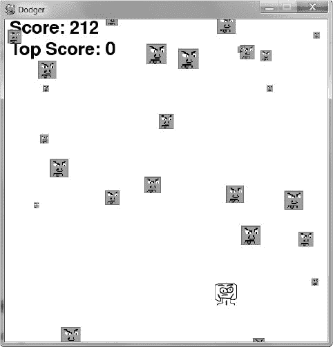
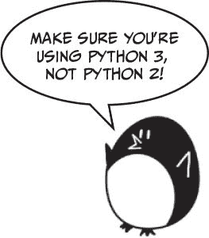

# 二十一、有声音和图像的《躲避者》游戏

> 原文：[`inventwithpython.com/invent4thed/chapter21.html`](https://inventwithpython.com/invent4thed/chapter21.html)
> 
> 译者：[飞龙](https://github.com/wizardforcel)
> 
> 协议：[CC BY-NC-SA 4.0](https://creativecommons.org/licenses/by-nc-sa/4.0/)

前面的四章介绍了 `pygame` 模块，并演示了如何使用它的许多功能。在本章中，我们将利用这些知识创建一个名为《躲避者》的图形游戏。

**本章涵盖的主题**

+   `pygame.FULLSCREEN` 标志

+   `move_ip() Rect` 方法

+   实现作弊码

+   修改《躲避者》游戏

在《躲避者》游戏中，玩家控制一个精灵（玩家角色），必须躲避从屏幕顶部掉落的一大堆坏人。玩家能够躲避坏人的时间越长，他们的得分就会越高。

只是为了好玩，我们还将在这个游戏中添加一些作弊模式。如果玩家按住 X 键，每个坏人的速度都会降低到超慢的速度。如果玩家按住 Z 键，坏人将会改变方向，向上而不是向下移动。

### 基本 pygame 数据类型的回顾

在我们开始制作《躲避者》之前，让我们回顾一下 `pygame` 中使用的一些基本数据类型：

`pygame.Rect`

`Rect` 对象表示矩形空间的位置和大小。位置由 `Rect` 对象的 `topleft` 属性（或 `topright`、`bottomleft` 和 `bottomright` 属性）确定。这些角属性是 x 和 y 坐标的整数元组。大小由 `width` 和 `height` 属性确定，这些属性是指示矩形有多长或多高的整数像素。`Rect` 对象有一个 `colliderect()` 方法，用于检查它们是否与另一个 `Rect` 对象发生碰撞。

`pygame.Surface`

`Surface` 对象是有色像素区域。`Surface` 对象表示一个矩形图像，而 `Rect` 对象只表示一个矩形空间和位置。`Surface` 对象有一个 `blit()` 方法，用于将一个 `Surface` 对象上的图像绘制到另一个 `Surface` 对象上。`pygame.display.set_mode()` 函数返回的 `Surface` 对象是特殊的，因为在该 `Surface` 对象上绘制的任何东西在调用 `pygame.display.update()` 时会显示在用户的屏幕上。

`pygame.event.Event`

`pygame.event` 模块在用户提供键盘、鼠标或其他输入时生成 `Event` 对象。`pygame.event.get()` 函数返回这些 `Event` 对象的列表。您可以通过检查其 `type` 属性来确定 `Event` 对象的类型。`QUIT`、`KEYDOWN` 和 `MOUSEBUTTONUP` 是一些事件类型的示例（有关所有事件类型的完整列表，请参见“处理事件”第 292 页）。

`pygame.font.Font`

`pygame.font` 模块使用 `Font` 数据类型，表示 `pygame` 中文本使用的字体。传递给 `pygame.font.SysFont()` 的参数是字体名称的字符串（通常传递 `None` 作为字体名称以获取默认系统字体）和字体大小的整数。

`pygame.time.Clock`

`pygame.time` 模块中的 `Clock` 对象有助于防止我们的游戏运行得比玩家能看到的更快。`Clock` 对象有一个 `tick()` 方法，可以传递我们希望游戏运行的每秒帧数（FPS）。FPS 越高，游戏运行得越快。

### 《躲避者》的示例运行

当您运行这个程序时，游戏将会看起来像图 21-1。



*图 21-1：《躲避者》游戏的屏幕截图*

### 《躲避者》的源代码

在一个新文件中输入以下代码，并将其保存为 *dodger.py*。您可以从 [`www.nostarch.com/inventwithpython/`](https://www.nostarch.com/inventwithpython/) 下载代码、图像和声音文件。将图像和声音文件放在与 *dodger.py* 相同的文件夹中。



如果在输入此代码后出现错误，请使用在线 diff 工具将你输入的代码与本书代码进行比较，网址为 [`www.nostarch.com/inventwithpython#diff`](https://www.nostarch.com/inventwithpython#diff)。

`dodger.py`

```py
import pygame, random, sys
from pygame.locals import *

WINDOWWIDTH = 600
WINDOWHEIGHT = 600
TEXTCOLOR = (0, 0, 0)
BACKGROUNDCOLOR = (255, 255, 255)
FPS = 60
BADDIEMINSIZE = 10
BADDIEMAXSIZE = 40
BADDIEMINSPEED = 1
BADDIEMAXSPEED = 8
ADDNEWBADDIERATE = 6
PLAYERMOVERATE = 5

def terminate():
    pygame.quit()
    sys.exit()

def waitForPlayerToPressKey():
    while True:
        for event in pygame.event.get():
            if event.type == QUIT:
                terminate()
            if event.type == KEYDOWN:
                if event.key == K_ESCAPE: # Pressing ESC quits.
                    terminate()
                return

def playerHasHitBaddie(playerRect, baddies):
    for b in baddies:
        if playerRect.colliderect(b['rect']):
            return True
    return False

def drawText(text, font, surface, x, y):
    textobj = font.render(text, 1, TEXTCOLOR)
    textrect = textobj.get_rect()
    textrect.topleft = (x, y)
    surface.blit(textobj, textrect)

# Set up pygame, the window, and the mouse cursor.
pygame.init()
mainClock = pygame.time.Clock()
windowSurface = pygame.display.set_mode((WINDOWWIDTH, WINDOWHEIGHT))
pygame.display.set_caption('Dodger')
pygame.mouse.set_visible(False)

# Set up the fonts.
font = pygame.font.SysFont(None, 48)

# Set up sounds.
gameOverSound = pygame.mixer.Sound('gameover.wav')
pygame.mixer.music.load('background.mid')

# Set up images.
playerImage = pygame.image.load('player.png')
playerRect = playerImage.get_rect()
baddieImage = pygame.image.load('baddie.png')

# Show the "Start" screen.
windowSurface.fill(BACKGROUNDCOLOR)
drawText('Dodger', font, windowSurface, (WINDOWWIDTH / 3),
       (WINDOWHEIGHT / 3))
drawText('Press a key to start.', font, windowSurface,
       (WINDOWWIDTH / 3) - 30, (WINDOWHEIGHT / 3) + 50)
pygame.display.update()
waitForPlayerToPressKey()

topScore = 0
while True:
    # Set up the start of the game.
    baddies = []
    score = 0
    playerRect.topleft = (WINDOWWIDTH / 2, WINDOWHEIGHT - 50)
    moveLeft = moveRight = moveUp = moveDown = False
    reverseCheat = slowCheat = False
    baddieAddCounter = 0
    pygame.mixer.music.play(-1, 0.0)

    while True: # The game loop runs while the game part is playing.
        score += 1 # Increase score.

        for event in pygame.event.get():
            if event.type == QUIT:
                terminate()

            if event.type == KEYDOWN:
                if event.key == K_z:
                    reverseCheat = True
                if event.key == K_x:
                    slowCheat = True
                if event.key == K_LEFT or event.key == K_a:
                    moveRight = False
                    moveLeft = True
                if event.key == K_RIGHT or event.key == K_d:
                    moveLeft = False
                    moveRight = True
                if event.key == K_UP or event.key == K_w:
                    moveDown = False
                    moveUp = True
                if event.key == K_DOWN or event.key == K_s:
                    moveUp = False
                    moveDown = True

            if event.type == KEYUP:
                if event.key == K_z:
                    reverseCheat = False
                    score = 0
                if event.key == K_x:
                    slowCheat = False
                    score = 0
                if event.key == K_ESCAPE:
                    terminate()

                if event.key == K_LEFT or event.key == K_a:
                    moveLeft = False
                if event.key == K_RIGHT or event.key == K_d:
                    moveRight = False
                if event.key == K_UP or event.key == K_w:
                    moveUp = False
                if event.key == K_DOWN or event.key == K_s:
                    moveDown = False

            if event.type == MOUSEMOTION:
                # If the mouse moves, move the player to the cursor.
                playerRect.centerx = event.pos[0]
                playerRect.centery = event.pos[1]
        # Add new baddies at the top of the screen, if needed.
        if not reverseCheat and not slowCheat:
            baddieAddCounter += 1
        if baddieAddCounter == ADDNEWBADDIERATE:
            baddieAddCounter = 0
            baddieSize = random.randint(BADDIEMINSIZE, BADDIEMAXSIZE)
            newBaddie = {'rect': pygame.Rect(random.randint(0,
                                WINDOWWIDTH - baddieSize), 0 - baddieSize,
                                baddieSize, baddieSize),
                         'speed': random.randint(BADDIEMINSPEED,
                                BADDIEMAXSPEED),
                         'surface':pygame.transform.scale(baddieImage,
                                (baddieSize, baddieSize)),
                        }

            baddies.append(newBaddie)

        # Move the player around.
        if moveLeft and playerRect.left > 0:
            playerRect.move_ip(-1 * PLAYERMOVERATE, 0)
        if moveRight and playerRect.right < WINDOWWIDTH:
            playerRect.move_ip(PLAYERMOVERATE, 0)
        if moveUp and playerRect.top > 0:
            playerRect.move_ip(0, -1 * PLAYERMOVERATE)
        if moveDown and playerRect.bottom < WINDOWHEIGHT:
            playerRect.move_ip(0, PLAYERMOVERATE)

        # Move the baddies down.
        for b in baddies:
            if not reverseCheat and not slowCheat:
                b['rect'].move_ip(0, b['speed'])
            elif reverseCheat:
                b['rect'].move_ip(0, -5)
            elif slowCheat:
                b['rect'].move_ip(0, 1)

        # Delete baddies that have fallen past the bottom.
        for b in baddies[:]:
            if b['rect'].top > WINDOWHEIGHT:
                baddies.remove(b)

        # Draw the game world on the window.
        windowSurface.fill(BACKGROUNDCOLOR)

        # Draw the score and top score.
        drawText('Score: %s' % (score), font, windowSurface, 10, 0)
        drawText('Top Score: %s' % (topScore), font, windowSurface,
               10, 40)

        # Draw the player's rectangle.
        windowSurface.blit(playerImage, playerRect)

        # Draw each baddie.
        for b in baddies:
            windowSurface.blit(b['surface'], b['rect'])

        pygame.display.update()

        # Check if any of the baddies have hit the player.
        if playerHasHitBaddie(playerRect, baddies):
            if score > topScore:
                topScore = score # Set new top score.
            break

        mainClock.tick(FPS)

    # Stop the game and show the "Game Over" screen.
    pygame.mixer.music.stop()
    gameOverSound.play()

    drawText('GAME OVER', font, windowSurface, (WINDOWWIDTH / 3),
           (WINDOWHEIGHT / 3))
    drawText('Press a key to play again.', font, windowSurface,
           (WINDOWWIDTH / 3) - 80, (WINDOWHEIGHT / 3) + 50)
    pygame.display.update()
    waitForPlayerToPressKey()

    gameOverSound.stop()
```

### 导入模块

Dodger 游戏导入了与之前的 `pygame` 程序相同的模块：`pygame`、`random`、`sys` 和 `pygame.locals`。

```py
import pygame, random, sys
from pygame.locals import *
```

`pygame.locals` 模块包含了 `pygame` 使用的几个常量变量，比如事件类型（`QUIT`，`KEYDOWN` 等）和键盘按键（`K_ESCAPE`，`K_LEFT` 等）。通过使用 `from pygame.locals import *` 语法，你可以在源代码中直接使用 `QUIT` 而不是 `pygame.locals.QUIT`。

### 设置常量变量

第 4 到 7 行设置了窗口尺寸、文本颜色和背景颜色的常量：

```py
WINDOWWIDTH = 600
WINDOWHEIGHT = 600
TEXTCOLOR = (0, 0, 0)
BACKGROUNDCOLOR = (255, 255, 255)
```

我们使用常量变量是因为它们比我们手动输入的值更具描述性。例如，`windowSurface.fill(BACKGROUNDCOLOR)` 这一行比 `windowSurface.fill((255, 255, 255))` 更容易理解。

你可以通过改变常量变量来轻松改变游戏。通过改变第 4 行的 `WINDOWWIDTH`，你会自动改变代码中所有使用 `WINDOWWIDTH` 的地方。如果你使用的是值 `600`，那么你需要在代码中每次出现 `600` 的地方都进行修改。改变常量的值一次会更容易。

在第 8 行，你设置了 `FPS` 的常量，即每秒帧数，你希望游戏运行的帧数。

```py
FPS = 60
```

*帧* 是通过游戏循环的单次迭代绘制的屏幕。你将 `FPS` 传递给第 186 行的 `mainClock.tick()` 方法，以便函数知道暂停程序的时间。这里 `FPS` 设置为 `60`，但你可以将 `FPS` 更改为更高的值以使游戏运行更快，或者更改为更低的值以减慢游戏速度。

第 9 到 13 行设置了更多的坏蛋下落的常量变量：

```py
BADDIEMINSIZE = 10
BADDIEMAXSIZE = 40
BADDIEMINSPEED = 1
BADDIEMAXSPEED = 8
ADDNEWBADDIERATE = 6
```

坏蛋的宽度和高度将在 `BADDIEMINSIZE` 和 `BADDIEMAXSIZE` 之间。坏蛋在屏幕上下落的速度将在 `BADDIEMINSPEED` 和 `BADDIEMAXSPEED` 之间，每次游戏循环迭代的像素数。并且每经过 `ADDNEWBADDIERATE` 次游戏循环迭代，一个新的坏蛋将被添加到窗口顶部。

最后，`PLAYERMOVERATE` 存储了玩家角色在游戏循环的每次迭代中在窗口中移动的像素数（如果角色正在移动）：

```py
PLAYERMOVERATE = 5
```

通过增加这个数字，你可以增加角色移动的速度。

### 定义函数

你将为这个游戏创建几个函数。`terminate()` 和 `waitForPlayerToPressKey()` 函数将分别结束和暂停游戏，`playerHasHitBaddie()` 函数将跟踪玩家与坏蛋的碰撞，`drawText()` 函数将在屏幕上绘制得分和其他文本。

#### 结束和暂停游戏

`pygame` 模块要求你同时调用 `pygame.quit()` 和 `sys.exit()` 来结束游戏。第 16 到 18 行将它们都放入一个名为 `terminate()` 的函数中。

```py
def terminate():
    pygame.quit()
    sys.exit()
```

现在你只需要调用 `terminate()` 而不是同时调用 `pygame.quit()` 和 `sys.exit()`。

有时你会希望暂停程序，直到玩家按下一个键，比如在游戏开始时出现 *Dodger* 标题文本或者在结束时显示 *Game Over* 时。第 20 到 24 行创建了一个名为 `waitForPlayerToPressKey()` 的新函数：

```py
def waitForPlayerToPressKey():
    while True:
        for event in pygame.event.get():
            if event.type == QUIT:
                terminate()
```

在这个函数内部，有一个无限循环，只有在接收到 `KEYDOWN` 或 `QUIT` 事件时才会中断。在循环开始时，`pygame.event.get()` 返回一个 `Event` 对象列表供检查。

如果玩家在程序等待玩家按键时关闭了窗口，`pygame` 将生成一个 `QUIT` 事件，在第 23 行通过 `event.type` 进行检查。如果玩家退出，Python 将在第 24 行调用 `terminate()` 函数。

如果游戏收到`KEYDOWN`事件，它应首先检查是否按下了 ESC 键：

```py
            if event.type == KEYDOWN:
                if event.key == K_ESCAPE: # Pressing ESC quits.
                    terminate()
                return
```

如果玩家按下 ESC，则程序应该终止。如果不是这种情况，那么执行将跳过第 27 行的`if`块，直接到`return`语句，退出`waitForPlayerToPressKey()`函数。

如果没有生成`QUIT`或`KEYDOWN`事件，代码将继续循环。由于循环什么也不做，这将使游戏看起来像已经冻结，直到玩家按下键。

#### 跟踪坏人碰撞

如果玩家的角色与坏人之一发生碰撞，则`playerHasHitBaddie()`函数将返回`True`：

```py
def playerHasHitBaddie(playerRect, baddies):
    for b in baddies:
        if playerRect.colliderect(b['rect']):
            return True
    return False
```

`baddies`参数是坏人字典数据结构的列表。这些字典中的每一个都有一个'rect'键，该键的值是表示坏人大小和位置的`Rect`对象。

`playerRect`也是一个`Rect`对象。`Rect`对象有一个名为`colliderect()`的方法，如果`Rect`对象与传递给它的`Rect`对象发生碰撞，则返回`True`。否则，`colliderect()`返回`False`。

第 31 行的`for`循环遍历`baddies`列表中的每个坏人字典。如果任何这些坏人与玩家的角色发生碰撞，则`playerHasHitBaddie()`返回`True`。如果代码成功遍历`baddies`列表中的所有坏人而没有检测到碰撞，则`playerHasHitBaddie()`返回`False`。

#### 向窗口绘制文本

在窗口上绘制文本涉及一些步骤，我们通过`drawText()`来完成。这样，当我们想要在屏幕上显示玩家得分或*游戏结束*文本时，只需要调用一个函数。

```py
def drawText(text, font, surface, x, y):
    textobj = font.render(text, 1, TEXTCOLOR)
    textrect = textobj.get_rect()
    textrect.topleft = (x, y)
    surface.blit(textobj, textrect)
```

首先，第 37 行的`render()`方法调用创建了一个`Surface`对象，以特定字体呈现文本。

接下来，您需要知道`Surface`对象的大小和位置。您可以使用`get_rect() Surface`方法获取包含此信息的`Rect`对象。

从第 38 行的`get_rect()`返回的`Rect`对象中复制了`Surface`对象的宽度和高度信息。第 39 行通过为其`topleft`属性设置一个新的元组值来更改`Rect`对象的位置。

最后，第 40 行将渲染文本的`Surface`对象绘制到传递给`drawText()`函数的`Surface`对象上。在`pygame`中显示文本比简单调用`print()`函数需要更多步骤。但是，如果将此代码放入名为`drawText()`的单个函数中，那么您只需要调用此函数即可在屏幕上显示文本。

### 初始化 pygame 和设置窗口

现在常量变量和函数已经完成，我们将开始调用设置窗口和时钟的`pygame`函数：

```py
# Set up pygame, the window, and the mouse cursor.
pygame.init()
mainClock = pygame.time.Clock()
```

第 43 行通过调用`pygame.init()`函数设置了`pygame`。第 44 行创建了一个`pygame.time.Clock()`对象，并将其存储在`mainClock`变量中。这个对象将帮助我们防止程序运行得太快。

第 45 行创建了一个用于窗口显示的新`Surface`对象：

```py
windowSurface = pygame.display.set_mode((WINDOWWIDTH, WINDOWHEIGHT))
```

请注意，`pygame.display.set_mode()`只传递了一个参数：一个元组。`pygame.display.set_mode()`的参数不是两个整数，而是一个包含两个整数的元组。您可以通过传递一个包含`WINDOWWIDTH`和`WINDOWHEIGHT`常量变量的元组来指定此`Surface`对象（和窗口）的宽度和高度。

`pygame.display.set_mode()`函数有第二个可选参数。您可以传递`pygame.FULLSCREEN`常量以使窗口填满整个屏幕。看一下对第 45 行的修改：

```py
windowSurface = pygame.display.set_mode((WINDOWWIDTH, WINDOWHEIGHT),
      pygame.FULLSCREEN)
```

`WINDOWWIDTH`和`WINDOWHEIGHT`参数仍然用于窗口的宽度和高度，但图像将被拉伸以适应屏幕。尝试在全屏模式和非全屏模式下运行程序。

第 46 行将窗口的标题设置为字符串'Dodger'：

```py
pygame.display.set_caption('Dodger')
```

此标题将显示在窗口顶部的标题栏中。

在 Dodger 中，鼠标光标不应该可见。您希望鼠标能够移动玩家角色在屏幕上移动，但鼠标光标会妨碍角色图像。我们可以用一行代码使鼠标不可见：

```py
pygame.mouse.set_visible(False)
```

调用`pygame.mouse.set_visible(False)`告诉`pygame`使光标不可见。

### 设置字体、声音和图像对象

由于我们在这个程序中在屏幕上显示文本，我们需要为文本提供一个`Font`对象给`pygame`模块使用。第 50 行通过调用`pygame.font.SysFont()`创建了一个`Font`对象：

```py
# Set up the fonts.
font = pygame.font.SysFont(None, 48)
```

传递`None`使用默认字体。传递`48`给字体一个 48 点的大小。

接下来，我们将创建`Sound`对象并设置背景音乐：

```py
# Set up sounds.
gameOverSound = pygame.mixer.Sound('gameover.wav')
pygame.mixer.music.load('background.mid')
```

`pygame.mixer.Sound()`构造函数创建一个新的`Sound`对象，并将对此对象的引用存储在`gameOverSound`变量中。在您自己的游戏中，您可以创建任意数量的`Sound`对象，每个对象都有不同的声音文件。

`pygame.mixer.music.load()`函数加载一个声音文件用于背景音乐。这个函数不返回任何对象，一次只能加载一个背景音乐文件。背景音乐将在游戏期间持续播放，但`Sound`对象只会在玩家撞到坏人而输掉游戏时播放。

您可以为这个游戏使用任何 WAV 或 MIDI 文件。一些声音文件可以从本书的网站[`www.nostarch.com/inventwithpython/`](https://www.nostarch.com/inventwithpython/)下载。您也可以为这个游戏使用自己的声音文件，只要您将文件命名为*gameover.wav*和*background.mid*，或者更改第 53 和 54 行使用的字符串以匹配您想要的文件名。

接下来，您将加载用于玩家角色和坏人的图像文件：

```py
# Set up images.
playerImage = pygame.image.load('player.png')
playerRect = playerImage.get_rect()
baddieImage = pygame.image.load('baddie.png')
```

角色的图像存储在*player.png*中，坏人的图像存储在*baddie.png*中。所有坏人看起来都一样，所以你只需要一个图像文件。您可以从本书的网站[`www.nostarch.com/inventwithpython/`](https://www.nostarch.com/inventwithpython/)下载这些图像。

### 显示开始画面

游戏刚开始时，Python 应该在屏幕上显示 Dodger 标题。您还希望告诉玩家他们可以通过按任意键开始游戏。这个画面出现是为了让玩家在运行程序后有时间准备开始玩。

在 63 和 64 行，我们编写代码调用`drawText()`函数：

```py
# Show the "Start" screen.
windowSurface.fill(BACKGROUNDCOLOR)
drawText('Dodger', font, windowSurface, (WINDOWWIDTH / 3),
      (WINDOWHEIGHT / 3))
drawText('Press a key to start.', font, windowSurface,
      (WINDOWWIDTH / 3) - 30, (WINDOWHEIGHT / 3) + 50)
pygame.display.update()
waitForPlayerToPressKey()
```

我们将向此函数传递五个参数：

1.  您希望出现的文本字符串

1.  您希望字符串出现的字体

1.  文本将被渲染到的`Surface`对象

1.  在`Surface`对象上的 x 坐标，用于绘制文本

1.  在`Surface`对象上的 y 坐标，用于绘制文本

这可能看起来是一个很多参数的函数调用，但请记住，每次调用此函数调用将替换五行代码。这缩短了程序，并使查找错误变得更容易，因为要检查的代码更少。

`waitForPlayerToPressKey()`函数通过循环暂停游戏，直到生成`KEYDOWN`事件。然后执行中断循环，程序继续运行。

### 开始游戏

现在所有函数都已定义，我们可以开始编写主游戏代码。第 68 行及以后将调用我们之前定义的函数。程序首次运行时，`topScore`变量的值为`0`。每当玩家输掉游戏并且得分大于当前最高分时，最高分将被替换为这个更大的分数。

```py
topScore = 0
while True:
```

从第 69 行开始的无限循环在技术上不是游戏循环。游戏循环处理游戏运行时的事件和绘制窗口。相反，这个`while`循环在每次玩家开始新游戏时迭代。当玩家输掉游戏并且游戏重置时，程序的执行会循环回到第 69 行。

一开始，您还希望将`baddies`设置为空列表：

```py
    # Set up the start of the game.
    baddies = []
    score = 0
```

`baddies`变量是一个包含以下键的字典对象列表：

'rect'描述了坏人的位置和大小的`Rect`对象。

'speed'坏人下落的速度。这个整数表示每次游戏循环迭代的像素。

'surface'拥有缩放的坏人图像绘制在上面的`Surface`对象。这是绘制到`pygame.display.set_mode()`返回的`Surface`对象的`Surface`。

第 72 行将玩家的分数重置为`0`。

玩家的起始位置在屏幕中央，距离底部 50 像素，由第 73 行设置：

```py
    playerRect.topleft = (WINDOWWIDTH / 2, WINDOWHEIGHT - 50)
```

第 73 行元组的第一个项目是左边缘的 x 坐标，第二个项目是顶边缘的 y 坐标。

接下来，我们设置玩家移动和作弊的变量：

```py
    moveLeft = moveRight = moveUp = moveDown = False
    reverseCheat = slowCheat = False
    baddieAddCounter = 0
```

移动变量`moveLeft`、`moveRight`、`moveUp`和`moveDown`都设置为`False`。`reverseCheat`和`slowCheat`变量也设置为`False`。只有当玩家按住 Z 和 X 键启用这些作弊时，它们才会被设置为`True`。

`baddieAddCounter`变量是一个计数器，告诉程序何时在屏幕顶部添加一个新的坏人。`baddieAddCounter`的值每次游戏循环迭代时增加 1。（这类似于“添加新食物方块”中的代码在第 295 页。）

当`baddieAddCounter`等于`ADDNEWBADDIERATE`时，`baddieAddCounter`重置为`0`，并在屏幕顶部添加一个新的坏人。（这个检查稍后在第 130 行进行。）

背景音乐在第 77 行开始播放，调用了`pygame.mixer.music.play()`函数：

```py
    pygame.mixer.music.play(-1, 0.0)
```

因为第一个参数是`-1`，`pygame`会无限重复播放音乐。第二个参数是一个浮点数，表示音乐开始播放的秒数。传递`0.0`意味着音乐从头开始播放。

### 游戏循环

游戏循环的代码不断更新游戏世界的状态，改变玩家和坏人的位置，处理由`pygame`生成的事件，并在屏幕上绘制游戏世界。所有这些都会在几十次每秒发生，使游戏实时运行。

第 79 行是主游戏循环的开始：

```py
    while True: # The game loop runs while the game part is playing.
        score += 1 # Increase score.
```

第 80 行在游戏循环的每次迭代中增加玩家的分数。玩家能够在不失去的情况下走得越久，他们的分数就越高。循环只有在玩家输掉游戏或退出程序时才会退出。

#### 处理键盘事件

程序将处理四种类型的事件：`QUIT`、`KEYDOWN`、`KEYUP`和`MOUSEMOTION`。

第 82 行是事件处理代码的开始：

```py
        for event in pygame.event.get():
            if event.type == QUIT:
                terminate()
```

它调用`pygame.event.get()`，返回一个`Event`对象列表。每个`Event`对象表示自上次调用`pygame.event.get()`以来发生的事件。代码检查`Event`对象的`type`属性，看看它是什么类型的事件，然后相应地处理它。

如果`Event`对象的`type`属性等于`QUIT`，那么用户已经关闭了程序。`QUIT`常量变量是从`pygame.locals`模块导入的。

如果事件的类型是`KEYDOWN`，玩家已经按下了一个键：

```py
            if event.type == KEYDOWN:
                if event.key == K_z:
                    reverseCheat = True
                if event.key == K_x:
                    slowCheat = True
```

第 87 行检查事件是否描述了按下`Z`键，条件为`event.key == K_z`。如果条件为`True`，Python 将`reverseCheat`变量设置为`True`以激活反向作弊。类似地，第 89 行检查是否按下`X`键以激活减速作弊。

第 91 到 102 行检查事件是否由玩家按下箭头或 WASD 键生成。这段代码类似于前几章的与键盘相关的代码。

如果事件的类型是`KEYUP`，玩家已经释放了一个键：

```py
            if event.type == KEYUP:
                if event.key == K_z:
                    reverseCheat = False
                    score = 0
                if event.key == K_x:
                    slowCheat = False
                    score = 0
```

第 105 行检查玩家是否释放了 Z 键，这将停用反向作弊。在这种情况下，第 106 行将`reverseCheat`设置为`False`，第 107 行将分数重置为`0`。分数重置是为了阻止玩家使用作弊。

第 108 行到第 110 行对 X 键和慢速作弊做了同样的事情。释放 X 键时，`slowCheat`设置为`False`，玩家的分数重置为`0`。

在游戏进行期间，玩家可以随时按 ESC 键退出：

```py
                if event.key == K_ESCAPE:
                    terminate()
```

第 111 行通过检查`event.key == K_ESCAPE`来确定释放的键是否是 ESC。如果是，第 112 行调用`terminate()`函数退出程序。

第 114 行到第 121 行检查玩家是否停止按住箭头或 WASD 键之一。在这种情况下，代码将相应的移动变量设置为`False`。这类似于第 19 章和第 20 章程序中的移动代码。

#### 处理鼠标移动

现在你已经处理了键盘事件，让我们处理可能生成的任何鼠标事件。《躲避球》游戏如果玩家点击了鼠标按钮，不会有任何反应，但是当玩家移动鼠标时会有反应。这给玩家在游戏中控制角色的两种方式：键盘或鼠标。

`MOUSEMOTION`事件在鼠标移动时生成：

```py
            if event.type == MOUSEMOTION:
                # If the mouse moves, move the player to the cursor.
                playerRect.centerx = event.pos[0]
                playerRect.centery = event.pos[1]
```

`type`设置为`MOUSEMOTION`的`Event`对象还有一个名为`pos`的属性，用于存储鼠标事件的位置。`pos`属性存储了鼠标光标在窗口中移动的 x 和 y 坐标的元组。如果事件的类型是`MOUSEMOTION`，玩家的角色将移动到鼠标光标的位置。

第 125 行和第 126 行将玩家角色的中心 x 和 y 坐标设置为鼠标光标的 x 和 y 坐标。

### 添加新的坏蛋

在游戏循环的每次迭代中，代码将`baddieAddCounter`变量增加一：

```py
        # Add new baddies at the top of the screen, if needed.
        if not reverseCheat and not slowCheat:
            baddieAddCounter += 1
```

只有在作弊未启用时才会发生。请记住，只要按住 Z 和 X 键，`reverseCheat`和`slowCheat`就会设置为`True`。在按住 Z 和 X 键时，`baddieAddCounter`不会增加。因此，新的坏蛋不会出现在屏幕顶部。

当`baddieAddCounter`达到`ADDNEWBADDIERATE`中的值时，是时候在屏幕顶部添加一个新的坏蛋了。首先，将`baddieAddCounter`重置为`0`：

```py
        if baddieAddCounter == ADDNEWBADDIERATE:
            baddieAddCounter = 0
            baddieSize = random.randint(BADDIEMINSIZE, BADDIEMAXSIZE)
            newBaddie = {'rect': pygame.Rect(random.randint(0,
                                WINDOWWIDTH - baddieSize), 0 - baddieSize,
                                baddieSize, baddieSize),
                        'speed': random.randint(BADDIEMINSPEED,
                                BADDIEMAXSPEED),
                        'surface':pygame.transform.scale(baddieImage,
                                (baddieSize, baddieSize)),
                        }
```

第 132 行生成了坏蛋的像素大小。大小将是`BADDIEMINSIZE`和`BADDIEMAXSIZE`之间的随机整数，这些常量分别在第 9 行和第 10 行设置为`10`和`40`。

第 133 行是创建新坏蛋数据结构的地方。请记住，`baddies`的数据结构只是一个带有键`'rect'`、`'speed'`和`'surface'`的字典。`'rect'`键保存对存储坏蛋位置和大小的`Rect`对象的引用。对`pygame.Rect()`构造函数的调用有四个参数：区域顶部边缘的 x 坐标、区域左边缘的 y 坐标、像素宽度和像素高度。

坏蛋需要出现在窗口顶部的随机位置，因此将`random.randint(0, WINDOWWIDTH - baddieSize)`传递给坏蛋左边缘的 x 坐标。之所以传递`WINDOWWIDTH - baddieSize`而不是`WINDOWWIDTH`，是因为如果坏蛋的左边缘太靠右，那么坏蛋的一部分将超出窗口边缘，不会在屏幕上可见。

坏蛋的底边应该位于窗口顶边的上方。窗口顶边的 y 坐标是`0`。为了将坏蛋的底边放在那里，将顶边设置为`0 - baddieSize`。

坏蛋的宽度和高度应该相同（图像是一个正方形），因此将`baddieSize`传递给第三个和第四个参数。

坏人在屏幕上移动的速度设置在`'speed'`键中。将其设置为`BADDIEMINSPEED`和`BADDIEMAXSPEED`之间的随机整数。

然后，在第 138 行，将新创建的坏人数据结构添加到坏人数据结构列表中：

```py
            baddies.append(newBaddie)
```

程序使用这个列表来检查玩家是否与任何坏人发生了碰撞，并确定在窗口上绘制坏人的位置。

### 移动玩家角色和坏人

四个移动变量`moveLeft`、`moveRight`、`moveUp`和`moveDown`在`pygame`生成`KEYDOWN`和`KEYUP`事件时分别设置为`True`和`False。

如果玩家的角色向左移动，并且玩家角色的左边缘大于`0`（即窗口的左边缘），那么`playerRect`应该向左移动：

```py
        # Move the player around.
        if moveLeft and playerRect.left > 0:
            playerRect.move_ip(-1 * PLAYERMOVERATE, 0)
```

`move_ip()`方法将`Rect`对象的位置水平或垂直移动一定数量的像素。`move_ip()`的第一个参数是将`Rect`对象向右移动的像素数（要向左移动，传递一个负整数）。第二个参数是将`Rect`对象向下移动的像素数（要向上移动，传递一个负整数）。例如，`playerRect.move_ip(10, 20)`将使`Rect`对象向右移动 10 个像素，向下移动 20 个像素，`playerRect.move_ip(-5, -15)`将使`Rect`对象向左移动 5 个像素，向上移动 15 个像素。

`move_ip()`末尾的*ip*代表“原地”。这是因为该方法改变了`Rect`对象本身，而不是返回具有更改的新`Rect`对象。还有一个`move()`方法，它不会改变`Rect`对象，而是在新位置创建并返回一个新的`Rect`对象。

你总是会移动`playerRect`对象的像素数为`PLAYERMOVERATE`。要得到一个整数的负形式，将其乘以`-1`。在第 142 行，由于`PLAYERMOVERATE`中存储了`5`，表达式`-1 * PLAYERMOVERATE`的值为`-5`。因此，调用`playerRect.move_ip(-1 * PLAYERMOVERATE, 0)`将使`playerRect`的位置向左移动 5 个像素。

第 143 到 148 行对其他三个方向进行了相同的操作：右、上和下。

```py
        if moveRight and playerRect.right < WINDOWWIDTH:
            playerRect.move_ip(PLAYERMOVERATE, 0)
        if moveUp and playerRect.top > 0:
            playerRect.move_ip(0, -1 * PLAYERMOVERATE)
        if moveDown and playerRect.bottom < WINDOWHEIGHT:
            playerRect.move_ip(0, PLAYERMOVERATE)
```

在第 143 到 148 行的三个`if`语句中，检查其移动变量是否设置为`True`，并且玩家的`Rect`对象的边缘是否在窗口内。然后调用`move_ip()`来移动`Rect`对象。

现在，代码循环遍历`baddies`列表中的每个坏人数据结构，使它们向下移动一点：

```py
        # Move the baddies down.
        for b in baddies:
            if not reverseCheat and not slowCheat:
                b['rect'].move_ip(0, b['speed'])
```

如果没有激活任何作弊码，那么坏人的位置向下移动与其速度（存储在`'speed'`键中）相等的像素数。

### 实现作弊码

如果反向作弊被激活，那么坏人应该向上移动 5 个像素：

```py
            elif reverseCheat:
                b['rect'].move_ip(0, -5)
```

将`move_ip()`的第二个参数传递为`-5`将使`Rect`对象向上移动 5 个像素。

如果慢速作弊被激活，那么坏人仍然应该向下移动，但速度为每次游戏循环迭代 1 个像素：

```py
            elif slowCheat:
                b['rect'].move_ip(0, 1)
```

当慢速作弊被激活时，坏人的正常速度（同样存储在坏人数据结构的`'speed'`键中）将被忽略。

### 移除坏人

任何掉到窗口底部以下的坏人都应该从`baddies`列表中移除。记住，不应该在迭代列表时添加或移除列表项。不要使用`for`循环迭代`baddies`列表，而是使用`baddies`列表的*副本*进行迭代。要创建这个副本，使用空切片操作符`[:]`：

```py
        # Delete baddies that have fallen past the bottom.
        for b in baddies[:]:
```

第 160 行的`for`循环使用变量`b`来遍历`baddies[:]`中的当前项。如果坏人在窗口的底部以下，我们应该将其移除，这在第 162 行中完成：

```py
            if b['rect'].top > WINDOWHEIGHT:
                baddies.remove(b)
```

`b`字典是`baddies[:]`列表中的当前坏蛋数据结构。列表中的每个坏蛋数据结构都是一个带有`'rect'`键的字典，该键存储一个`Rect`对象。因此，`b['rect']`是坏蛋的`Rect`对象。最后，`top`属性是矩形区域顶部边缘的 y 坐标。请记住，y 坐标向下增加。因此，`b['rect'].top > WINDOWHEIGHT`将检查坏蛋的顶部边缘是否在窗口底部以下。如果这个条件为`True`，那么第 162 行将从`baddies`列表中删除坏蛋数据结构。

### 绘制窗口

在更新所有数据结构之后，应使用`pygame`的图像函数绘制游戏世界。因为游戏循环每秒执行多次，当坏蛋和玩家在新位置绘制时，它们看起来就像是平稳移动的。

在绘制任何其他内容之前，第 165 行填充整个屏幕以擦除先前绘制的任何内容：

```py
        # Draw the game world on the window.
        windowSurface.fill(BACKGROUNDCOLOR)
```

请记住，`windowSurface`中的`Surface`对象很特殊，因为它是由`pygame.display.set_mode()`返回的。因此，在该`Surface`对象上绘制的任何内容都将在调用`pygame.display.update()`后出现在屏幕上。

#### 绘制玩家得分

第 168 和 169 行在窗口的左上角渲染了当前得分和最高得分的文本。

```py
        # Draw the score and top score.
        drawText('Score: %s' % (score), font, windowSurface, 10, 0)
        drawText('Top Score: %s' % (topScore), font, windowSurface,
               10, 40)
```

`'Score: %s' % (score)` 表达式使用字符串插值将`score`变量的值插入字符串中。这个字符串、存储在`font`变量中的`Font`对象、用于绘制文本的`Surface`对象，以及文本应放置的 x 和 y 坐标都被传递给`drawText()`方法，该方法将处理对`render()`和`blit()`方法的调用。

对于最高得分，做同样的事情。将`40`作为 y 坐标传递，而不是`0`，这样最高得分的文本就会出现在当前得分的文本下方。

#### 绘制玩家角色和坏蛋

关于玩家的信息保存在两个不同的变量中。`playerImage`是一个包含玩家角色图像的所有彩色像素的`Surface`对象。`playerRect`是一个存储玩家角色大小和位置的`Rect`对象。

`blit()`方法在`windowSurface`上绘制玩家角色的图像（在`playerImage`中）在`playerRect`的位置：

```py
        # Draw the player's rectangle.
        windowSurface.blit(playerImage, playerRect)
```

第 175 行的`for`循环在`windowSurface`对象上绘制每个坏蛋：

```py
        # Draw each baddie.
        for b in baddies:
            windowSurface.blit(b['surface'], b['rect'])
```

`baddies`列表中的每个项目都是一个字典。字典的`'surface'`和`'rect'`键包含了带有坏蛋图像的`Surface`对象和带有位置和大小信息的`Rect`对象。

现在，所有内容都已经绘制到`windowSurface`上，我们需要更新屏幕，以便玩家可以看到其中的内容：

```py
        pygame.display.update()
```

通过调用`update()`将这个`Surface`对象绘制到屏幕上。

### 检查碰撞

第 181 行检查玩家是否与任何坏蛋发生碰撞，调用`playerHasHitBaddie()`。如果玩家的角色与`baddies`列表中的任何一个坏蛋发生碰撞，则此函数将返回`True`。否则，该函数返回`False`。

```py
        # Check if any of the baddies have hit the player.
        if playerHasHitBaddie(playerRect, baddies):
            if score > topScore:
                topScore = score # Set new top score.
            break
```

如果玩家的角色撞到了坏蛋，并且当前得分高于最高得分，那么第 182 和 183 行将更新最高得分。程序的执行会在第 184 行跳出游戏循环，并移动到第 189 行，结束游戏。

为了防止计算机尽可能快地运行游戏循环（这对玩家来说太快了），调用`mainClock.tick()`来暂停游戏很短的时间：

```py
        mainClock.tick(FPS)
```

这个暂停时间将足够长，以确保每秒大约进行`40`次（存储在`FPS`变量内部的值）游戏循环迭代。

### 游戏结束画面

当玩家失败时，游戏停止播放背景音乐，并播放“游戏结束”音效：

```py
    # Stop the game and show the "Game Over" screen.
    pygame.mixer.music.stop()
    gameOverSound.play()
```

第 189 行调用`pygame.mixer.music`模块中的`stop()`函数来停止背景音乐。第 190 行调用`gameOverSound`中存储的`Sound`对象的`play()`方法。

然后，第 192 行和第 193 行调用`drawText()`函数将“游戏结束”文本绘制到`windowSurface`对象上：

```py
    drawText('GAME OVER', font, windowSurface, (WINDOWWIDTH / 3),
           (WINDOWHEIGHT / 3))
    drawText('Press a key to play again.', font, windowSurface,
           (WINDOWWIDTH / 3) - 80, (WINDOWHEIGHT / 3) + 50)
    pygame.display.update()
    waitForPlayerToPressKey()
```

第 194 行调用`update()`来将这个`Surface`对象绘制到屏幕上。在显示这个文本后，游戏会停止，直到玩家按下键，调用`waitForPlayerToPressKey()`函数。

玩家按下键后，程序执行从第 195 行的`waitForPlayerToPressKey()`调用返回。根据玩家按键的时间长短，可能会播放“游戏结束”音效。为了在新游戏开始之前停止这个音效，第 197 行调用`gameOverSound.stop()`：

```py
    gameOverSound.stop()
```

我们的图形游戏就到这里了！

### 修改躲避者游戏

你可能会发现游戏太容易或太难。幸运的是，游戏很容易修改，因为我们花时间使用常量变量而不是直接输入值。现在，我们只需要修改常量变量中设置的值就可以改变游戏。

例如，如果你想让游戏总体运行速度变慢，可以将第 8 行的`FPS`变量更改为较小的值，比如`20`。这将使坏人和玩家角色移动得更慢，因为游戏循环每秒只执行`20`次，而不是`40`次。

如果你只想减慢坏人的速度而不是玩家的速度，那么将`BADDIEMAXSPEED`更改为较小的值，比如`4`。这将使所有坏人在游戏循环中的每次迭代之间移动 1（`BADDIEMINSPEED`中的值）到 4 个像素，而不是 1 到 8 个像素。

如果你想让游戏有更少但更大的坏人，而不是许多较小的坏人，那么将`ADDNEWBADDIERATE`增加到`12`，`BADDIEMINSIZE`增加到`40`，`BADDIEMAXSIZE`增加到`80`。现在，坏人每 12 次游戏循环添加一次，而不是每 6 次，所以坏人的数量将减少一半。但为了保持游戏的趣味性，坏人会更大。

保持基本游戏不变，你可以修改任何常量变量，从而显著影响游戏的玩法。不断尝试新的常量变量值，直到找到最喜欢的值组合。

### 总结

与我们的文本游戏不同，躲避者看起来真的像一款现代电脑游戏。它有图形和音乐，并且使用鼠标。虽然`pygame`提供函数和数据类型作为构建块，但是你作为程序员将它们组合在一起，创造出有趣的互动游戏。

你可以做到这一切，因为你知道如何逐步指导计算机做事，一行一行地。通过使用计算机的语言，你可以让它为你进行数字计算和绘图。这是一项有用的技能，我希望你会继续学习更多关于 Python 编程的知识。（还有很多东西要学！）

现在开始发挥你的想象力，创造属于自己的游戏。祝你好运！

[上一页：第 20 章 - 使用声音和图像](chapter20.html)
