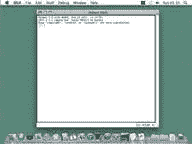

# 第一章：安装 Python 和 Pygame

> 原文：[`inventwithpython.com/pygame/chapter1.html`](https://inventwithpython.com/pygame/chapter1.html)
> 
> 译者：[飞龙](https://github.com/wizardforcel)
> 
> 协议：[CC BY-NC-SA 4.0](https://creativecommons.org/licenses/by-nc-sa/4.0/)

## 开始之前您应该知道的事情

在阅读本书之前，如果您了解一些 Python 编程知识（或者知道如何使用 Python 之外的其他语言进行编程），可能会有所帮助；但是即使您没有，您仍然可以阅读本书。编程并不像人们想象的那么难。如果您遇到问题，可以在线阅读免费书籍“使用 Python 发明自己的电脑游戏”http://inventwithpython.com，或者在 Invent with Python 维基 http://inventwithpython.com/wiki 上查找您觉得困惑的主题。

在阅读本书之前，您不需要知道如何使用 Pygame 库。下一章是关于 Pygame 的所有主要特性和功能的简要教程。

如果您还没有阅读第一本书并在计算机上安装了 Python 和 Pygame，安装说明在本章中。如果您已经安装了这两者，那么您可以跳过本章。

## 下载和安装 Python

在我们开始编程之前，您需要在计算机上安装名为 Python 解释器的软件。（在这里，您可能需要向成年人寻求帮助。）解释器是一个程序，它能理解您将用 Python 语言编写（或者说，打出来）的指令。没有解释器，您的计算机将无法运行 Python 程序。我们从现在开始将“Python 解释器”简称为“Python”。

Python 解释器软件可以从 Python 编程语言的官方网站 http://www.python.org 下载。您可能需要他人的帮助来下载和安装 Python 软件。安装方式略有不同，取决于您的计算机操作系统是 Windows、Mac OS X 还是 Ubuntu 等 Linux 操作系统。您还可以在网上找到人们在计算机上安装 Python 软件的视频，网址是 http://invpy.com/installing。

## Windows 说明

当您访问 http://python.org 时，您应该会看到左侧的链接列表（如“关于”，“新闻”，“文档”，“下载”等）。单击**下载**链接转到下载页面，然后查找名为“Python 3.2 Windows Installer（Windows 二进制文件-不包括源代码）”的文件，并单击其链接以下载 Windows 的 Python。

双击刚刚下载的*python-3.2.msi*文件以启动 Python 安装程序。（如果没有启动，请尝试右键单击文件并选择**安装**。）一旦安装程序启动，只需不断单击**下一步**按钮，并在安装程序中接受选择（无需进行任何更改）。安装完成后，单击**完成**。

## Mac OS X 说明

Mac OS X 10.5 预装了由苹果提供的 Python 2.5.1。目前，Pygame 仅支持 Python 2 而不支持 Python 3。但是，本书中的程序适用于 Python 2 和 3。

Python 网站还提供了有关在 Mac 上使用 Python 的一些额外信息，网址是 http://docs.python.org/dev/using/mac.html。

## Ubuntu 和 Linux 说明

Linux 的 Pygame 也仅支持 Python 2，不支持 Python 3。如果您的操作系统是 Ubuntu，您可以通过打开终端窗口（从桌面单击**应用程序>附件>终端**）并输入`sudo apt-get install python2.7`然后按 Enter 来安装 Python。您需要输入根密码来安装 Python，因此如果您不知道密码，请向计算机所有者询问他们输入密码。

您还需要安装 IDLE 软件。从终端中输入“`sudo apt-get install idle`”。还需要根密码来安装 IDLE（如果您不知道密码，请让计算机的所有者为您输入密码）。

## 开始 Python

我们将使用 IDLE 软件来输入和运行程序。IDLE 代表**I**nteractive **D**eve**L**opment **E**nvironment。开发环境是一种使编写 Python 程序变得容易的软件，就像文字处理软件使编写书籍变得容易一样。

如果您的操作系统是 Windows XP，您应该可以通过单击“开始”按钮，然后选择 Programs，Python 3.1，IDLE（Python GUI）来运行 Python。对于 Windows Vista 或 Windows 7，只需单击左下角的 Windows 按钮，输入`IDLE`，然后选择“IDLE（Python GUI）”。

如果您的操作系统是 Max OS X，请通过打开 Finder 窗口并单击 Applications，然后单击 Python 3.2，然后单击 IDLE 图标来启动 IDLE。

如果您的操作系统是 Ubuntu 或 Linux，请通过打开终端窗口，然后输入“`idle3`”并按 Enter 来启动 IDLE。您还可以单击屏幕顶部的 Applications，然后选择 Programming，然后选择 IDLE 3。

  

当您首次运行 IDLE 时出现的窗口称为交互式 shell。Shell 是一个允许您向计算机输入指令的程序。Python shell 允许您输入 Python 指令，并且 shell 会将这些指令发送给 Python 解释器执行。

## 安装 Pygame

Pygame 不随 Python 一起提供。与 Python 一样，Pygame 也是免费提供的。您需要下载并安装 Pygame，就像下载和安装 Python 解释器一样简单。在 Web 浏览器中，转到网址 http://pygame.org，然后单击网站左侧的“Downloads”链接。本书假设您使用的是 Windows 操作系统，但 Pygame 对每个操作系统都是相同的。您需要为您的操作系统和已安装的 Python 版本下载 Pygame 安装程序。

您不想下载 Pygame 的“源代码”，而是下载适用于您操作系统的 Pygame“二进制文件”。对于 Windows，请下载 pygame-1.9.1.win32-py3.2.msi 文件。（这是适用于 Windows 上 Python 3.2 的 Pygame。如果您安装了不同版本的 Python（如 2.7 或 2.6），请下载适用于您 Python 版本的.msi 文件。）本书编写时的 Pygame 当前版本为 1.9.1。如果您在网站上看到更新版本，请下载并安装更新的 Pygame。

对于 Mac OS X，请下载您所拥有的 Python 版本的.zip 或.dmg 文件并运行它。

对于 Linux，打开终端并运行`sudo apt-get install python-pygame`。

在 Windows 上，双击下载的文件以安装 Pygame。要检查 Pygame 是否正确安装，请在交互式 shell 中输入以下内容：

```py
>>> import pygame

```

如果按 Enter 键后没有任何显示，那么您就知道 Pygame 已成功安装。如果出现错误 ImportError: No module named pygame，则尝试重新安装 Pygame（并确保您正确输入了`import pygame`）。

本章包含五个小程序，演示了如何使用 Pygame 提供的不同功能。在最后一章中，您将使用这些功能来编写使用 Pygame 编写的 Python 完整游戏。

有关如何安装 Pygame 的视频教程可在本书网站 http://invpy.com/videos 上找到。

## 如何使用本书

“使用 Python 和 Pygame 制作游戏”与其他编程书籍不同，因为它专注于几个游戏程序的完整源代码。本书不是教授编程概念，然后让您自己想出如何使用这些概念制作程序，而是向您展示一些程序，然后解释它们是如何组合在一起的。

一般来说，你应该按顺序阅读这些章节。在这些游戏中有许多概念会反复使用，它们只在它们首次出现的第一个游戏中详细解释。但如果有一个你觉得有趣的游戏，可以直接跳到那一章。如果你超前了，可以随时回头阅读之前的章节。

## 特色程序

每章都专注于一个游戏程序，并解释代码的不同部分是如何工作的。通过逐行从本书中输入代码来复制这些程序非常有帮助。

然而，你也可以从本书的网站下载源代码文件。在网页浏览器中，访问网址 http://invpy.com/source，并按照说明下载源代码文件。但是自己输入代码确实有助于更好地学习代码。

## 下载图形和声音文件

虽然你可以直接输入本书中的代码，但你需要从 http://invpy.com/downloads 下载本书中游戏使用的图形和声音文件。确保这些图像和声音文件位于与.py Python 文件相同的文件夹中，否则你的 Python 程序将无法找到这些文件。

## 行号和空格

在输入源代码时，不要输入每行开头出现的行号。例如，如果你在书中看到这样：

```py
number = random.randint(1, 20)
spam = 42
print('Hello world!')

```

你不需要在左侧输入`1.`，或者紧随其后的空格。只需像这样输入：

```py
number = random.randint(1, 20)
spam = 42
print('Hello world!')

```

这些数字仅用于本书引用代码中特定行。它们不是实际程序的一部分。

除了行号之外，确保按照代码的原样输入。注意到一些行不是从页面的最左边开始的，而是缩进了四个或八个或更多的空格。确保在每行开头输入正确数量的空格。（由于 IDLE 中的每个字符都是相同宽度，你可以通过计算你正在查看的行上方或下方的字符数量来计算空格的数量。）

例如，在下面的代码中，你可以看到第二行缩进了四个空格，因为上一行的四个字符（`whil`）在缩进的空格上方。第三行再次缩进了四个空格（上一行的四个字符`if n`在第三行的缩进空格上方）：

```py
while spam < 10:
    if number == 42:
        print('Hello')

```

## 本书中的文本换行

本书中的一些代码行太长，无法在一页上完全显示，代码的文本会换行到下一行。当你将这些行输入到文件编辑器中时，输入所有代码在一行上而不要按回车键。

你可以通过查看代码左侧的行号来判断新的一行开始了。例如，下面的代码只有两行，即使第一行换行了：

```py
print('This is the first line! xxxxxxxxxxxxxxxxxxxxxxxxxxxxx xxxxxxxxxxxxxx’)
print('This is the second line, not the third line.')

```

## 在线检查你的代码

本书中的一些程序有点长。虽然通过逐行输入这些程序的源代码来学习 Python 非常有帮助，但你可能会因为打错字而导致程序崩溃。可能不明显打错字的位置在哪里。

你可以将源代码的文本复制粘贴到本书网站上的在线 diff 工具中。diff 工具将显示书中源代码与你输入的源代码之间的任何差异。这是一种查找程序中任何打错字的简单方法。

复制和粘贴文本是一项非常有用的计算机技能，特别是对于计算机编程。本书的网站上有关复制和粘贴的视频教程，请访问 http://invpy.com/copypaste。

在线 diff 工具位于此网页：http://invpy.com/diff/pygame。本书的网站上也有关于如何使用这个工具的视频教程。

## 更多信息链接请访问 http://invpy.com

关于编程，有很多东西可以学习。但你现在不需要学习所有这些。在这本书中有几个地方，你可能想学习这些额外的细节和解释，但如果我把它们包括在这本书中，那么会增加很多页。如果这本更大更重的书意外地掉在你身上，这些额外的页的重量会压垮你，导致死亡。相反，我在这本书中包含了“更多信息”链接，你可以在这本书的网站上查看。你不必阅读这些额外的信息来理解这本书中的任何内容，但如果你好奇的话，它们就在那里。这些（以及其他）链接已经被缩短，并以 http://invpy.com 开头。

所有这些“更多信息”链接中的信息也可以从 http://invpy.com/pygamemoreinfo 下载。

即使这本书并不危险地沉重，请不要让它无论如何掉在你身上。
