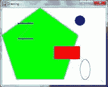

# 第二章：Pygame 基础

> 原文：[`inventwithpython.com/pygame/chapter2.html`](https://inventwithpython.com/pygame/chapter2.html)
> 
> 译者：[飞龙](https://github.com/wizardforcel)
> 
> 协议：[CC BY-NC-SA 4.0](https://creativecommons.org/licenses/by-nc-sa/4.0/)

就像 Python 自带了几个模块，比如`random`、`math`或`time`，为你的程序提供了额外的功能一样，Pygame 框架包括了几个模块，提供了绘制图形、播放声音、处理鼠标输入等功能。

本章将介绍 Pygame 提供的基本模块和函数，并假设你已经了解基本的 Python 编程。如果你对一些编程概念有困难，你可以在[`invpy.com/book`](//invpy.com/book)上在线阅读“用 Python 发明你自己的电脑游戏”一书。这本书是面向完全初学者的编程。

“Invent with Python”这本书还有几章涵盖了 Pygame。你可以在[`invpy.com/chap17`](//invpy.com/chap17)上在线阅读它们。

一旦你了解了更多关于 Pygame 的知识，你可以从[`pygame.org/docs`](http://pygame.org/docs)的在线文档中查看 Pygame 提供的其他模块。

## GUI vs. CLI

你可以使用 Python 的内置函数编写的 Python 程序只通过`print()`和`input()`函数处理文本。你的程序可以在屏幕上显示文本，并让用户从键盘输入文本。这种类型的程序具有命令行界面，或 CLI（发音类似于“climb”的第一个部分，押韵“sky”）。这些程序有一定的局限性，因为它们不能显示图形，有颜色，或使用鼠标。这些 CLI 程序只能通过`input()`函数从键盘获取输入，即使用户必须在程序能够响应输入之前按下 Enter。这意味着实时（即，继续运行代码而不等待用户）动作游戏是不可能制作的。

Pygame 提供了创建图形用户界面（GUI）程序的函数。与基于文本的 CLI 不同，具有基于图形的 GUI 的程序可以显示带有图像和颜色的窗口。

## 使用 Pygame 制作 Hello World 的源代码

我们用 Pygame 制作的第一个程序是一个小程序，它在屏幕上显示“Hello World!”的窗口。点击 IDLE 的**文件**菜单，然后**新建窗口**，打开一个新的文件编辑器窗口。在 IDLE 的文件编辑器中输入以下代码，并将其保存为*blankpygame.py*。然后通过按下**F5**或从文件编辑器顶部的菜单中选择**运行 > 运行模块**来运行程序。

记住，不要在每行开头输入数字或句号（这只是本书的参考）。

```py
import pygame, sys
from pygame.locals import *

pygame.init()
DISPLAYSURF = pygame.display.set_mode((400, 300))
pygame.display.set_caption('Hello World!')
while True: # main game loop
    for event in pygame.event.get():
        if event.type == QUIT:
            pygame.quit()
            sys.exit()
    pygame.display.update()

```

当你运行这个程序时，会出现一个黑色的窗口，就像这样：


耶！你刚刚制作了世界上最无聊的视频游戏！它只是一个空白窗口，窗口顶部显示着“Hello World!”（在称为窗口标题栏的地方，它包含标题文本）。但创建窗口是制作图形游戏的第一步。当你点击窗口角落的 X 按钮时，程序将结束，窗口将消失。

调用`print()`函数在窗口中显示文本是行不通的，因为`print()`是用于 CLI 程序的函数。`input()`也是一样，用于从用户那里获取键盘输入。Pygame 使用其他函数进行输入和输出，这些将在本章后面进行解释。现在，让我们更详细地看一下“Hello World”程序中的每一行。

## 设置 Pygame 程序

“Hello World”程序的前几行代码是几乎每个使用 Pygame 的程序的开头。

```py
import pygame, sys

```

第 1 行是一个简单的`import`语句，导入了`pygame`和`sys`模块，以便我们的程序可以使用它们中的函数。所有与图形、声音和其他 Pygame 功能相关的函数都在`pygame`模块中。

请注意，当导入`pygame`模块时，还会自动导入`pygame`模块中的所有模块，如`pygame.images`和`pygame.mixer.music`。不需要使用额外的`import`语句导入这些模块内的模块。

```py
from pygame.locals import *

```

第 2 行也是一个`import`语句。但是，它使用的是`from modulename import *`格式，而不是`import modulename`格式。通常，如果要调用模块中的函数，必须在导入模块后使用`modulename.functionname()`格式。但是，使用`from modulename import *`，可以省略`modulename.`部分，直接使用`functionname()`（就像 Python 的内置函数一样）。

我们之所以使用这种形式的`import`语句导入`pygame.locals`，是因为`pygame.locals`包含了几个常量变量，很容易识别为`pygame.locals`模块中的变量，而不需要在它们前面加上`pygame.locals.`。对于所有其他模块，通常要使用常规的`import modulename`格式。（有关为什么要这样做的更多信息，请参阅[`invpy.com/namespaces`](//invpy.com/namespaces)。）

```py
pygame.init()

```

第 4 行是`pygame.init()`函数调用，它总是需要在导入`pygame`模块后调用，并在调用任何其他 Pygame 函数之前调用。你不需要知道这个函数做了什么，你只需要知道它需要首先被调用，以便许多 Pygame 函数能够工作。如果你看到类似 pygame.error: font not initialized 的错误消息，请检查是否忘记在程序开头调用`pygame.init()`。

```py
DISPLAYSURF = pygame.display.set_mode((400, 300))

```

第 5 行是对`pygame.display.set_mode()`函数的调用，该函数返回窗口的`pygame.Surface`对象。（Surface 对象将在本章后面进行描述。）请注意，我们向函数传递了一个包含两个整数的元组值：`(400, 300)`。这个元组告诉`set_mode()`函数窗口的宽度和高度分别是多少像素。`(400, 300)`将创建一个宽度为 400 像素，高度为 300 像素的窗口。

记住要向`set_mode()`传递一个包含两个整数的元组，而不仅仅是两个整数本身。调用函数的正确方式是这样的：pygame.display.set_mode((400, 300))。像 pygame.display.set_mode(400, 300)这样的函数调用将导致以下错误：TypeError: argument 1 must be 2-item sequence, not int。

返回的`pygame.Surface`对象（我们简称为 Surface 对象）存储在名为`DISPLAYSURF`的变量中。

```py
pygame.display.set_caption('Hello World!')

```

第 6 行通过调用`pygame.display.set_caption()`函数设置窗口顶部将显示的标题文本。在这个函数调用中传递了字符串值`'Hello World!'`，以使该文本显示为标题。


## 游戏循环和游戏状态

```py
while True: # main game loop
    for event in pygame.event.get():

```

第 7 行是一个`while`循环，其条件只是简单的值`True`。这意味着它永远不会因为条件评估为`False`而退出。程序执行将退出循环的唯一方法是执行`break`语句（将执行移动到循环后的第一行）或`sys.exit()`（终止程序）。如果这样的循环在函数内部，`return`语句也会将执行移出循环（以及函数本身）。

本书中的游戏都包含这样的`while True`循环，以及一个称为“主游戏循环”的注释。游戏循环（也称为主循环）是一个循环，其中代码执行三件事：

1. 处理事件。

2. 更新游戏状态。

3. 将游戏状态绘制到屏幕上。

游戏状态简单地指的是游戏程序中所有变量的一组值。在许多游戏中，游戏状态包括跟踪玩家健康和位置的变量的值，任何敌人的健康和位置，标记在棋盘上的标记，得分，或者轮到谁了。每当发生像玩家受到伤害（降低他们的健康值）或敌人移动到某个地方，或者游戏世界发生了什么事情，我们就说游戏状态已经改变了。

如果你玩过一个可以保存的游戏，那么“保存状态”就是你保存时的游戏状态。在大多数游戏中，暂停游戏会阻止游戏状态的改变。

由于游戏状态通常是响应事件（如鼠标点击或键盘按键）或时间流逝而更新的，游戏循环会不断地每秒检查和重新检查是否有新事件发生。主循环中有代码来查看已经创建了哪些事件（使用 Pygame，这是通过调用`pygame.event.get()`函数来完成的）。主循环还有根据已创建的事件更新游戏状态的代码。这通常被称为事件处理。


## `pygame.event.Event`对象

每当用户执行一些动作（它们在本章后面列出）比如按键盘键或在程序窗口上移动鼠标时，Pygame 库会创建一个`pygame.event.Event`对象来记录这个“事件”。（这是一种称为`Event`的对象，存在于`event`模块中，而`event`模块本身位于`pygame`模块中。）我们可以通过调用`pygame.event.get()`函数来找出发生了哪些事件，它会返回一个`pygame.event.Event`对象的列表（我们简称为 Event 对象）。

Event 对象的列表将是自上次调用`pygame.event.get()`函数以来发生的每个事件。（或者，如果从未调用过`pygame.event.get()`，则是自程序启动以来发生的事件。）

```py
while True: # main game loop
    for event in pygame.event.get():

```

第 8 行是一个`for`循环，它将遍历由`pygame.event.get()`返回的 Event 对象列表。在每次循环中，一个名为`event`的变量将被赋予该列表中下一个事件对象的值。从`pygame.event.get()`返回的 Event 对象列表将按事件发生的顺序排列。如果用户先点击鼠标，然后按键盘键，那么鼠标点击的 Event 对象将是列表中的第一项，键盘按键的 Event 对象将是第二项。如果没有发生事件，那么`pygame.event.get()`将返回一个空列表。

## `QUIT`事件和`pygame.quit()`函数

```py
        if event.type == QUIT:
            pygame.quit()
            sys.exit()

```

`Event`对象有一个成员变量（也称为属性）名为`type`，它告诉我们对象代表什么类型的事件。Pygame 在`pygame.locals`模块中为每种可能的类型都有一个常量变量。第 9 行检查 Event 对象的`type`是否等于常量`QUIT`。请记住，由于我们使用了`from pygame.locals import *`形式的`import`语句，我们只需要输入`QUIT`而不是`pygame.locals.QUIT`。

如果 Event 对象是一个退出事件，那么会调用`pygame.quit()`和`sys.exit()`函数。`pygame.quit()`函数有点像`pygame.init()`函数的相反：它运行的代码会停用 Pygame 库。在终止程序之前，你的程序应该始终调用`pygame.quit()`而不是`sys.exit()`。通常情况下并不重要，因为 Python 在程序退出时会自动关闭它。但是在 IDLE 中有一个错误，如果在调用`pygame.quit()`之前终止 Pygame 程序，IDLE 会挂起。

由于我们没有运行代码来处理其他类型的事件对象的`if`语句，因此当用户点击鼠标，按键盘键，或者导致任何其他类型的事件对象被创建时，没有事件处理代码。用户可以做一些事情来创建这些事件对象，但这并不会改变程序中的任何内容，因为程序没有这些类型事件对象的事件处理代码。在第 8 行的`for`循环处理了`pygame.event.get()`返回的所有事件对象后，程序执行将继续到第 12 行。

```py
    pygame.display.update()

```

第 12 行调用`pygame.display.update()`函数，该函数将`pygame.display.set_mode()`返回的 Surface 对象绘制到屏幕上（记住我们将这个对象存储在`DISPLAYSURF`变量中）。由于 Surface 对象没有改变（例如，通过本章后面解释的一些绘图函数），每次调用`pygame.display.update()`时，相同的黑色图像都会重新绘制到屏幕上。

这就是整个程序。在第 12 行之后，无限的`while`循环再次从头开始。这个程序除了在屏幕上显示一个黑色窗口，不断检查`QUIT`事件，然后一遍又一遍地重新绘制未改变的黑色窗口之外，什么也不做。让我们学习如何在这个窗口上显示有趣的东西，而不仅仅是黑色，学习关于像素、Surface 对象、颜色对象、Rect 对象和 Pygame 绘图函数。

## 像素坐标

“Hello World”程序创建的窗口只是由屏幕上的小方点像素组成。每个像素最初是黑色的，但可以设置为不同的颜色。想象一下，如果我们有一个 8x8 像素的 Surface 对象，而不是一个宽 400 像素，高 300 像素的 Surface 对象。如果将这个微小的 8x8 Surface 放大，使每个像素看起来像网格中的一个正方形，并为 X 和 Y 轴添加数字，那么它的一个良好的表示可能看起来像这样：


我们可以使用笛卡尔坐标系来引用特定的像素。X 轴的每一列和 Y 轴的每一行都将有一个从 0 到 7 的整数“地址”，以便我们可以通过指定 X 和 Y 轴整数来定位任何像素。

例如，在上面的 8x8 图像中，我们可以看到 XY 坐标（4, 0）、（2, 2）、（0, 5）和（5, 6）的像素被涂成黑色，坐标（2, 4）的像素被涂成灰色，而所有其他像素都被涂成白色。XY 坐标也称为点。如果您上过数学课并学过笛卡尔坐标，您可能会注意到 Y 轴从*顶部*开始为 0，然后向*下*增加，而不是向上增加。这就是 Pygame 中笛卡尔坐标的工作方式（几乎所有编程语言都是如此）。

Pygame 框架通常将笛卡尔坐标表示为两个整数的元组，例如(4, 0)或(2, 2)。第一个整数是 X 坐标，第二个是 Y 坐标。（笛卡尔坐标在“用 Python 编写自己的计算机游戏”第 12 章中有更详细的介绍，网址为[`invpy.com/chap12`](//invpy.com/chap12)）

## 关于函数、方法、构造函数和模块中的函数的提醒（以及它们之间的区别）

函数和方法几乎是一样的。它们都可以被调用来执行其中的代码。函数和方法之间的区别在于方法总是附加到一个对象上。通常方法会改变关于那个特定对象的某些东西（您可以将附加的对象看作是传递给方法的一种永久参数）。

这是一个名为`foo()`的函数调用：

```py
foo()

```

这是一个方法调用，也是名为`foo()`的方法调用，它附加到一个存储在名为`duckie`的变量中的对象上：

```py
duckie.foo()

```

在模块内部调用函数可能看起来像是方法调用。要区分它们，你需要查看第一个名称，看它是一个模块的名称还是一个包含对象的变量的名称。你可以通过`sys.exit()`是一个模块内部函数调用来判断，因为程序顶部会有一个像`import sys`这样的导入语句。

构造函数与普通函数调用相同，只是它的返回值是一个新对象。仅仅通过查看源代码，函数和构造函数看起来是一样的。构造函数（有时简称为“构造函数”或者“ctor”（“see-tor”））只是给返回新对象的函数起的一个名字。但通常构造函数以大写字母开头。这就是为什么当你编写自己的程序时，函数名应该只以小写字母开头。

例如，`pygame.Rect()`和`pygame.Surface()`都是`pygame`模块内的构造函数，返回新的 Rect 和 Surface 对象。（这些对象将在后面描述。）

以下是一个函数调用、方法调用和在模块内部调用函数的示例：

```py
import whammy
fizzy()
egg = Wombat()
egg.bluhbluh()
whammy.spam()

```

尽管这些名称都是虚构的，但你可以分辨出哪个是函数调用、方法调用和在方法内部调用函数。名称`whammy`指的是一个模块，因为你可以在第一行看到它被导入。`fizzy`名称前面没有任何东西，后面跟着括号，所以你知道它是一个函数调用。

`Wombat()`也是一个函数调用，这种情况下它是一个返回对象的构造函数。（它以大写字母开头并不保证它是一个构造函数而不是普通函数，但这是一个安全的打赌。）对象存储在一个名为`egg`的变量中。`egg.bluhbluh()`调用是一个方法调用，你可以通过`bluhbluh`附加到一个包含对象的变量上来判断。

同时，`whammy.spam()`是一个函数调用，而不是方法调用。你可以通过它不是一个方法来判断，因为`whammy`的名称在之前被导入为一个模块。

## Surface 对象和窗口

Surface 对象是代表矩形 2D 图像的对象。Surface 对象的像素可以通过调用 Pygame 绘图函数（本章后面描述）来改变，然后显示在屏幕上。窗口边框、标题栏和按钮不是显示 Surface 对象的一部分。

特别是，`pygame.display.set_mode()`返回的 Surface 对象被称为显示 Surface。在显示 Surface 对象上绘制的任何东西都将在调用`pygame.display.update()`函数时显示在窗口上。在 Surface 对象上绘制（它只存在于计算机内存中）比将 Surface 对象绘制到计算机屏幕上要快得多。计算机内存比显示器上的像素更快地改变。

通常你的程序会向 Surface 对象绘制几种不同的东西。一旦你在显示 Surface 对象上绘制完这次游戏循环的所有东西（称为一帧，就像暂停的 DVD 上的静止图像一样），它就可以被绘制到屏幕上。计算机可以非常快地绘制帧，我们的程序通常会以每秒 30 帧（即 30 FPS）的速度运行。这被称为“帧率”，本章后面会解释。

在本章后面将介绍在 Surface 对象上绘制的“基本绘图函数”和“绘制图像”部分。

## 颜色

光有三种原色：红色、绿色和蓝色。（红色、蓝色和黄色是颜料和颜料的原色，但计算机显示器使用的是光，而不是颜料。）通过组合这三种颜色的不同量，你可以形成任何其他颜色。在 Pygame 中，我们用三个整数的元组表示颜色。元组中的第一个值是颜色中的红色量。整数值为`0`表示这种颜色中没有红色，值为`255`表示这种颜色中有最大量的红色。第二个值是绿色，第三个值是蓝色。用于表示颜色的这三个整数的元组通常被称为 RGB 值。

因为你可以使用每个三原色的`0`到`255`的任意组合，这意味着 Pygame 可以绘制 16,777,216 种不同的颜色（即 256 x 256 x 256 种颜色）。但是，如果尝试使用大于`255`的数字或负数，你将会得到一个看起来像“`ValueError: invalid color argument`”的错误。

例如，我们将创建元组(0, 0, 0)并将其存储在名为`BLACK`的变量中。没有红色、绿色或蓝色，得到的颜色是完全黑色。黑色是任何颜色的缺失。元组(255, 255, 255)代表最大量的红色、绿色和蓝色，得到白色。白色是红色、绿色和蓝色的完全组合。元组`(255, 0, 0)`代表最大量的红色但没有绿色和蓝色，所以得到的颜色是红色。同样，`(0, 255, 0)`是绿色，`(0, 0, 255)`是蓝色。

你可以混合红色、绿色和蓝色的量来形成其他颜色。以下是一些常见颜色的 RGB 值：

| 颜色 | RGB 值 |
| --- | --- |
| 水绿色 | `(0, 255, 255)` |
| 黑色 | `(0, 0, 0)` |
| 蓝色 | `(0, 0, 255)` |
| 紫红色 | `(255, 0, 255)` |
| 灰色 | `(128, 128, 128)` |
| 绿色 | `(0, 128, 0)` |
| 酸橙色 | `(0, 255, 0)` |
| 栗色 | `(128, 0, 0)` |
| 海军蓝 | `(0, 0, 128)` |
| 橄榄色 | `(128, 128, 0)` |
| 紫色 | `(128, 0, 128)` |
| 红色 | `(255, 0, 0)` |
| 银色 | `(192, 192, 192)` |
| 青色 | `(0, 128, 128)` |
| 白色 | `(255, 255, 255)` |
| 黄色 | `(255, 255, 0)` |

## 透明颜色

当你透过一个有深红色色调的玻璃窗户看时，所有背后的颜色都会被添加上红色色调。你可以通过在颜色值中添加第四个`0`到`255`的整数值来模仿这种效果。

这个值被称为 alpha 值。它是颜色不透明程度的度量。通常当你在表面对象上绘制一个像素时，新颜色会完全替换已经存在的颜色。但是对于具有 alpha 值的颜色，你可以只是给已经存在的颜色添加一个有色的色调。

例如，这个由三个整数组成的元组是绿色的：`(0, 255, 0)`。但是如果我们添加一个第四个整数作为 alpha 值，我们可以得到一个半透明的绿色：`(0, 255, 0, 128)`。alpha 值为`255`表示完全不透明（即完全不透明）。颜色`(0, 255, 0)`和`(0, 255, 0, 255)`看起来完全一样。alpha 值为`0`表示颜色是完全透明的。如果你在表面对象上绘制任何具有 alpha 值为`0`的颜色，它将没有任何效果，因为这种颜色是完全透明和不可见的。

为了使用透明颜色进行绘制，你必须使用`convert_alpha()`方法创建一个 Surface 对象。例如，以下代码创建了一个可以在其上绘制透明颜色的 Surface 对象：

```py
anotherSurface = DISPLAYSURF.convert_alpha()

```

一旦在存储在`anotherSurface`中的 Surface 对象上绘制了东西，那么`anotherSurface`就可以“blitted”（即复制）到`DISPLAYSURF`上，这样它就会出现在屏幕上。（见本章后面的“使用`pygame.image.load()`和`blit()`绘制图像”部分。）

需要注意的是，不能在未从`convert_alpha()`调用返回的 Surface 对象上使用透明颜色，包括从`pygame.display.set_mode()`返回的显示 Surface。

如果我们要创建一个颜色元组来绘制传说中的隐形粉红独角兽，我们将使用`(255, 192, 192, 0)`，这样看起来完全看不见，就像任何其他 alpha 值为`0`的颜色一样。毕竟，它是隐形的。


（上面是隐形粉红独角兽的绘图截图。）

## `pygame.Color`对象

您需要知道如何表示颜色，因为 Pygame 的绘图函数需要知道您想要用什么颜色绘制。三个或四个整数的元组是一种方法。另一种方法是作为`pygame.Color`对象。您可以通过调用`pygame.Color()`构造函数并传递三个或四个整数来创建 Color 对象。您可以像存储元组一样将此 Color 对象存储在变量中。尝试在交互式 shell 中输入以下内容：

```py
>>> import pygame
>>> pygame.Color(255, 0, 0)
(255, 0, 0, 255)
>>> myColor = pygame.Color(255, 0, 0, 128)
>>> myColor == (255, 0, 0, 128)
True
>>> 

```

Pygame 中的任何绘图函数（我们稍后将学习）都可以接受颜色的元组形式或 Color 对象形式作为参数。即使它们是不同的数据类型，如果它们都表示相同的颜色，Color 对象等于四个整数的元组（就像`42 == 42.0`将评估为`True`一样）。

现在您知道如何表示颜色（作为`pygame.Color`对象或三个或四个整数的元组，用于红色，绿色，蓝色，可选的 alpha）和坐标（作为两个整数的元组，用于 X 和 Y），让我们了解一下`pygame.Rect`对象，这样我们就可以开始使用 Pygame 的绘图函数。

## 矩形对象

Pygame 有两种表示矩形区域的方法（就像有两种表示颜色的方法一样）。第一种是四个整数的元组：

1. 左上角的 X 坐标。

2. 左上角的 Y 坐标。

3. 矩形的宽度（以像素为单位）。

4. 矩形的高度（以像素为单位）。

第二种方法是作为`pygame.Rect`对象，我们将简称为 Rect 对象。例如，下面的代码创建了一个顶点在(10, 20)处，宽度为 200 像素，高度为 300 像素的 Rect 对象：

```py
>>> import pygame
>>> spamRect = pygame.Rect(10, 20, 200, 300)
>>> spamRect == (10, 20, 200, 300)
True

```

这个方便的地方是 Rect 对象会自动计算矩形的其他特征的坐标。例如，如果您需要知道存储在`spamRect`变量中的`pygame.Rect`对象的右边缘的 X 坐标，您只需访问 Rect 对象的`right`属性：

```py
>>> spamRect.right
210

```

Rect 对象的 Pygame 代码自动计算了，如果左边缘位于 X 坐标 10，矩形宽度为 200 像素，那么右边缘必须位于 X 坐标 210。如果重新分配`right`属性，则所有其他属性都会自动重新计算：

```py
>>> spamRect.right = 350
>>> spamRect.left
150

```

以下是`pygame.Rect`对象提供的所有属性列表（在我们的示例中，Rect 对象存储在名为`spamRect`的变量中）：

| 属性名称 | 描述 |
| --- | --- |
| `myRect.left` | 矩形左侧的 X 坐标的整数值。 |
| `myRect.right` | 矩形右侧的 X 坐标的整数值。 |
| `myRect.top` | 矩形顶部的 Y 坐标的整数值。 |
| `myRect.bottom` | 底部 Y 坐标的整数值。 |
| `myRect.centerx` | 矩形中心的 X 坐标的整数值。 |
| `myRect.centery` | 矩形中心的 Y 坐标的整数值。 |
| `myRect.width` | 矩形的宽度的整数值。 |
| `myRect.height` | 矩形的高度的整数值。 |
| `myRect.size` | 两个整数的元组：（宽度，高度） |
| `myRect.topleft` | 两个整数的元组：（左，顶部） |
| `myRect.topright` | 两个整数的元组：（右，顶部） |
| `myRect.bottomleft` | 两个整数的元组：（左，底部） |
| `myRect.bottomright` | 两个整数的元组：（右，底部） |
| `myRect.midleft` | 两个整数的元组：（左，中央 Y） |
| `myRect.midright` | 两个整数的元组：（左，中央 Y） |
| `myRect.midtop` | 两个整数的元组：（中央 X，顶部） |
| `myRect.midbottom` | 两个整数的元组：（中央 X，底部） |

## 基本绘图函数

Pygame 提供了几个不同的函数来在表面对象上绘制不同的形状。这些形状，如矩形、圆、椭圆、线条或单个像素通常被称为绘图原语。打开 IDLE 的文件编辑器，输入以下程序，并将其保存为*drawing.py*。

```py
import pygame, sys
from pygame.locals import *

pygame.init()

# set up the window
DISPLAYSURF = pygame.display.set_mode((500, 400), 0, 32)
pygame.display.set_caption('Drawing')

# set up the colors
BLACK = (  0,   0,   0)
WHITE = (255, 255, 255)
RED = (255,   0,   0)
GREEN = (  0, 255,   0)
BLUE = (  0,   0, 255)

# draw on the surface object
DISPLAYSURF.fill(WHITE)
pygame.draw.polygon(DISPLAYSURF, GREEN, ((146, 0), (291, 106), (236, 277), (56, 277), (0, 106)))
pygame.draw.line(DISPLAYSURF, BLUE, (60, 60), (120, 60), 4)
pygame.draw.line(DISPLAYSURF, BLUE, (120, 60), (60, 120))
pygame.draw.line(DISPLAYSURF, BLUE, (60, 120), (120, 120), 4)
pygame.draw.circle(DISPLAYSURF, BLUE, (300, 50), 20, 0)
pygame.draw.ellipse(DISPLAYSURF, RED, (300, 250, 40, 80), 1)
pygame.draw.rect(DISPLAYSURF, RED, (200, 150, 100, 50))

pixObj = pygame.PixelArray(DISPLAYSURF)
pixObj[480][380] = BLACK
pixObj[482][382] = BLACK
pixObj[484][384] = BLACK
pixObj[486][386] = BLACK
pixObj[488][388] = BLACK
del pixObj

# run the game loop
while True:
    for event in pygame.event.get():
        if event.type == QUIT:
            pygame.quit()
            sys.exit()
    pygame.display.update()

```

- 当运行这个程序时，直到用户关闭窗口，将显示以下窗口：



注意我们为每种颜色创建了常量变量。这样做使我们的代码更易读，因为在源代码中看到`GREEN`比看到`(0, 255, 0)`更容易理解为代表绿色。

这些绘图函数的命名是根据它们绘制的形状命名的。你传递给这些函数的参数告诉它们在哪个表面对象上绘制，要在哪里绘制形状（以及大小），用什么颜色绘制，以及线条要多宽。你可以在*drawing.py*程序中看到这些函数是如何调用的，但这里是对每个函数的简短描述：

- **fill(color)** - `fill()`方法不是一个函数，而是`pygame.Surface`对象的一个方法。它将使用你传递给`color`参数的颜色值完全填充整个 Surface 对象。

- **pygame.draw.polygon(surface, color, pointlist, width)** - 多边形是由平面边组成的形状。`surface`和`color`参数告诉函数在哪个表面上绘制多边形，以及用什么颜色绘制它。

`pointlist`参数是一个点的元组或列表（即，XY 坐标的两个整数元组或列表）。多边形是通过在每个点和元组中的下一个点之间画线来绘制的。然后从最后一个点画一条线到第一个点。你也可以传递一个点的列表而不是一个点的元组。

`width`参数是可选的。如果你不传递它，那么绘制的多边形将被填充，就像我们屏幕上的绿色多边形被填充一样。如果你为`width`参数传递一个整数值，那么只会绘制多边形的轮廓。这个整数表示多边形轮廓的宽度。传递`1`给`width`参数会得到一个细的多边形，而传递`4`、`10`或`20`会得到更厚的多边形。如果你为`width`参数传递整数`0`，多边形将被填充（就像如果你完全不传递`width`参数一样）。

所有的`pygame.draw`绘图函数都有可选的`width`参数，它们的工作方式与`pygame.draw.polygon()`的`width`参数相同。也许`width`参数的更好名称应该是`thickness`，因为该参数控制你绘制的线条有多厚。

- **pygame.draw.line(surface, color, start_point, end_point, width)** - 这个函数在`start_point`和`end_point`参数之间画一条线。

- **pygame.draw.lines(surface, color, closed, pointlist, width)** - 这个函数从一个点到下一个点画一系列的线，就像`pygame.draw.polygon()`一样。唯一的区别是，如果你在`closed`参数中传递`False`，那么`pointlist`参数中的最后一个点到第一个点之间将不会有一条线。如果你传递`True`，那么它将会从最后一个点画一条线到第一个点。

- **pygame.draw.circle(surface, color, center_point, radius, width)** - 这个函数画一个圆。圆的中心在`center_point`参数处。传递给`radius`参数的整数设置了圆的大小。

圆的半径是从中心到边缘的距离。（圆的半径始终是直径的一半。）将`20`作为`radius`参数传递将绘制一个半径为 20 像素的圆。

+   **pygame.draw.ellipse(surface, color, bounding_rectangle, width)** - 此函数绘制椭圆（类似于被挤压或拉伸的圆）。此函数具有所有常规参数，但为了告诉函数如何绘制椭圆的大小和位置，必须指定椭圆的边界矩形。边界矩形是可以绘制在形状周围的最小矩形。以下是椭圆及其边界矩形的示例：


`bounding_rectangle`参数可以是`pygame.Rect`对象或四个整数的元组。请注意，您不像对`pygame.draw.circle()`函数那样为椭圆指定中心点。

+   **pygame.draw.rect(surface, color, rectangle_tuple, width)** - 此函数绘制矩形。`rectangle_tuple`可以是四个整数的元组（用于左上角的 XY 坐标，以及宽度和高度），也可以传递`pygame.Rect`对象。如果`rectangle_tuple`的宽度和高度相同，则将绘制一个正方形。

## `pygame.PixelArray`对象

不幸的是，您无法调用单个函数将单个像素设置为颜色（除非使用相同的起点和终点调用`pygame.draw.line()`）。Pygame 框架需要在绘制 Surface 对象之前和之后运行一些代码。如果它必须为您想要设置的每个单个像素执行此操作，您的程序将运行得更慢。（根据我的快速测试，以这种方式绘制像素要慢两到三倍。）

相反，您应该创建 Surface 对象的`pygame.PixelArray`对象（我们简称为 PixelArray 对象），然后设置单个像素。创建 Surface 对象的 PixelArray 对象将“锁定”Surface 对象。在 Surface 对象被锁定时，仍然可以调用绘图函数，但不能使用`blit()`方法在其上绘制 PNG 或 JPG 图像。（`blit()`方法将在本章后面解释。）

如果要查看 Surface 对象是否被锁定，`get_locked()` Surface 方法将返回`True`（如果被锁定）和`False`（如果未被锁定）。

从`pygame.PixelArray()`返回的 PixelArray 对象可以通过两个索引访问并设置单个像素。例如，第 28 行的`pixObj[480][380] = BLACK`将把 X 坐标为 480，Y 坐标为 380 的像素设置为黑色（请记住，`BLACK`变量存储颜色元组`(0, 0, 0)`）。

要告诉 Pygame 您已经完成了绘制单个像素，可以使用`del`语句删除 PixelArray 对象。这就是第 33 行的作用。删除 PixelArray 对象将“解锁”Surface 对象，以便您可以再次在其上绘制图像。如果忘记删除 PixelArray 对象，下次尝试使用`blit()`方法将图像绘制到 Surface 时，程序将引发错误，显示`pygame.error: Surfaces must not be locked during blit`。

## `pygame.display.update()`函数

在调用绘图函数完成使显示 Surface 对象看起来符合您的要求后，必须调用`pygame.display.update()`使显示 Surface 实际出现在用户的监视器上。

您必须记住的一件事是，`pygame.display.update()`只会使显示表面（即从调用`pygame.display.set_mode()`返回的 Surface 对象）出现在屏幕上。如果您希望其他 Surface 对象上的图像出现在屏幕上，您必须使用`blit()`方法（下面在“绘制图像”部分中解释）将它们“blit”（即复制）到显示 Surface 对象上。

## 动画

现在我们知道如何让 Pygame 框架绘制到屏幕上，让我们学习如何制作动画图片。一个只有静止不动的图像的游戏会相当乏味。（我的游戏“看这块石头”的销售情况令人失望。）动画图像是在屏幕上绘制图像，然后在短短的一瞬间后在屏幕上绘制一个略微不同的图像的结果。想象一下，程序的窗口宽 6 像素，高 1 像素，所有像素都是白色，除了 4,0 处有一个黑色像素。它会看起来像这样：


如果您更改窗口，使 3,0 为黑色，4,0 为白色，它会看起来像这样：


对于用户来说，黑色像素看起来已经“移动”到了左边。如果你重新绘制窗口，使黑色像素位于 2,0，它会继续看起来像黑色像素向左移动：


黑色像素看起来可能在移动，但这只是一种幻觉。对于计算机来说，它只是显示了三个不同的图像，每个图像恰好有一个黑色像素。考虑一下，如果以下三个图像在屏幕上快速显示：


对于用户来说，看起来猫正在向松鼠移动。但对于计算机来说，它们只是一堆像素。制作看起来可信的动画的诀窍是让您的程序向窗口绘制一幅图片，等待一小会儿，然后再绘制一幅*稍微*不同的图片。

这是一个演示简单动画的示例程序。将此代码输入到 IDLE 的文件编辑器中，并将其保存为*catanimation.py*。它还需要图像文件 cat.png 与*catanimation.py*文件在同一个文件夹中。您可以从[`invpy.com/cat.png`](//invpy.com/cat.png)下载这个图像。此代码可在[`invpy.com/catanimation.py`](//invpy.com/catanimation.py)上找到。

```py
 import pygame, sys
 from pygame.locals import *

 pygame.init()

 FPS = 30 # frames per second setting
 fpsClock = pygame.time.Clock()

 # set up the window
 DISPLAYSURF = pygame.display.set_mode((400, 300), 0, 32)
 pygame.display.set_caption('Animation')

 WHITE = (255, 255, 255)
 catImg = pygame.image.load('cat.png')
 catx = 10
 caty = 10
 direction = 'right'

 while True: # the main game loop
     DISPLAYSURF.fill(WHITE)

     if direction == 'right':
         catx += 5
         if catx == 280:
             direction = 'down'
     elif direction == 'down':
         caty += 5
         if caty == 220:
             direction = 'left'
     elif direction == 'left':
         catx -= 5
         if catx == 10:
             direction = 'up'
     elif direction == 'up':
         caty -= 5
         if caty == 10:
             direction = 'right'

     DISPLAYSURF.blit(catImg, (catx, caty))

     for event in pygame.event.get():
         if event.type == QUIT:
             pygame.quit()
             sys.exit()

     pygame.display.update()
     fpsClock.tick(FPS)

```

看那只动画猫！这个程序将比我的游戏“看这块石头 2：另一块石头”更成功。

## 每秒帧数和`pygame.time.Clock`对象

帧速率或刷新率是程序每秒绘制的图片数量，以 FPS 或每秒帧数来衡量。（在计算机显示器上，FPS 的常用名称是赫兹。许多显示器的帧速率为 60 赫兹，或每秒 60 帧。）视频游戏中的低帧速率会使游戏看起来断断续续或跳跃。如果程序有太多代码需要运行以频繁地绘制到屏幕上，那么 FPS 就会下降。但是，本书中的游戏足够简单，即使在旧计算机上也不会出现这个问题。

`pygame.time.Clock`对象可以帮助我们确保我们的程序以某个最大 FPS 运行。这个`Clock`对象将确保我们的游戏程序不会运行得太快，而是在游戏循环的每次迭代中放入小的暂停。如果没有这些暂停，我们的游戏程序将以计算机能够运行的速度运行。这对于玩家来说通常太快了，随着计算机的速度变快，游戏也会运行得更快。在游戏循环中调用`Clock`对象的`tick()`方法可以确保游戏以相同的速度运行，无论它在多快的计算机上运行。`Clock`对象在*catanimation.py*程序的第 7 行创建。

```py
 fpsClock = pygame.time.Clock()

```

`Clock`对象的`tick()`方法应该在游戏循环的最后调用，即在调用`pygame.display.update()`之后。暂停的长度是根据自上次调用`tick()`以来的时间计算的，这将发生在上一次游戏循环迭代的末尾。（第一次调用`tick()`方法时，根本不会暂停。）在动画程序中，它在第 47 行作为游戏循环中的最后一条指令运行。

你只需要知道应该在循环的每次迭代结束时调用`tick()`方法。通常是在调用`pygame.display.update()`之后。

```py
     fpsClock.tick(FPS)

```

尝试修改`FPS`常量变量以以不同的帧率运行相同的程序。将其设置为较低的值会使程序运行更慢。将其设置为较高的值会使程序运行更快。

## 使用`pygame.image.load()`和`blit()`绘制图像

如果要在屏幕上绘制简单的形状，那么绘图函数是很好用的，但是许多游戏都有图像(也称为精灵)。Pygame 能够从 PNG、JPG、GIF 和 BMP 图像文件加载图像到 Surface 对象中。这些图像文件格式之间的区别在[`invpy.com/formats`](//invpy.com/formats)中有描述。

猫的图像存储在一个名为*cat.png*的文件中。要加载此文件的图像，将字符串'cat.png'传递给`pygame.image.load()`函数。`pygame.image.load()`函数调用将返回一个 Surface 对象，该对象上绘制了图像。这个 Surface 对象将是一个独立的 Surface 对象，不同于显示 Surface 对象，因此我们必须将图像的 Surface 对象 blit(即复制)到显示 Surface 对象。Blitting 是将一个 Surface 的内容绘制到另一个 Surface 上。它是用`blit()` Surface 对象方法完成的。

如果在调用`pygame.image.load()`时出现类似“pygame.error:无法打开 cat.png”的错误消息，则在运行程序之前确保*cat.png*文件与*catanimation.py*文件在同一个文件夹中。

```py
     DISPLAYSURF.blit(catImg, (catx, caty))

```

动画程序的第 39 行使用`blit()`方法将`catImg`复制到`DISPLAYSURF`。`blit()`有两个参数。第一个是源 Surface 对象，它将被复制到`DISPLAYSURF` Surface 对象上。第二个参数是一个包含 X 和 Y 值的二元组，表示图像应该被 blit 到的左上角的位置。

如果`catx`和`caty`设置为`100`和`200`，`catImg`的宽度为`125`，高度为`79`，则此`blit()`调用将复制此图像到`DISPLAYSURF`，使`catImg`的左上角位于 XY 坐标(100, 200)，右下角的 XY 坐标位于(225, 279)。

请注意，您不能将内容 blit 到当前“锁定”的 Surface 上(例如当从中创建了 PixelArray 对象但尚未删除时)。

游戏循环的其余部分只是改变`catx`、`caty`和`direction`变量，使猫在窗口周围移动。还有一个调用`pygame.event.get()`来处理`QUIT`事件。

## 字体

如果要在屏幕上绘制文本，您*可以*写几个`pygame.draw.line()`调用来绘制每个字母的线条。这将是一个头疼的工作，要输入所有这些`pygame.draw.line()`调用并找出所有 XY 坐标，而且可能看起来不太好。


上面的消息需要调用`pygame.draw.line()`函数四十一次才能完成。相反，Pygame 提供了一些更简单的函数来处理字体和创建文本。下面是一个使用 Pygame 的字体函数的小型 Hello World 程序。将其输入到 IDLE 的文件编辑器中，并保存为*fonttext.py*：

```py
 import pygame, sys
 from pygame.locals import *

 pygame.init()
 DISPLAYSURF = pygame.display.set_mode((400, 300))
 pygame.display.set_caption('Hello World!')

 WHITE = (255, 255, 255)
 GREEN = (0, 255, 0)
 BLUE = (0, 0, 128)

 fontObj = pygame.font.Font('freesansbold.ttf', 32)
 textSurfaceObj = fontObj.render('Hello world!', True, GREEN, BLUE)
 textRectObj = textSurfaceObj.get_rect()
 textRectObj.center = (200, 150)

 while True: # main game loop
     DISPLAYSURF.fill(WHITE)
     DISPLAYSURF.blit(textSurfaceObj, textRectObj)
     for event in pygame.event.get():
         if event.type == QUIT:
             pygame.quit()
             sys.exit()
     pygame.display.update()

```

使文本显示在屏幕上有六个步骤：

1. 创建一个`pygame.font.Font 对象`。(就像第 12 行一样)

2. 使用 Font 对象的`render()`方法在其上绘制文本创建一个 Surface 对象。(第 13 行)

3. 通过调用 Surface 对象的`get_rect()`方法从 Surface 对象创建一个 Rect 对象。(第 14 行) 这个 Rect 对象将正确设置为呈现的文本的宽度和高度，但 top 和 left 属性将为`0`。

4. 通过改变 Rect 对象的属性来设置 Rect 对象的位置。在第 15 行，我们将 Rect 对象的中心设置为 200, 150。

5. 使用`pygame.display.set_mode()`返回的 Surface 对象将带有文本的 Surface 对象贴到上面。 (第 19 行)

6. 调用`pygame.display.update()`使显示 Surface 出现在屏幕上。（第 24 行）

`pygame.font.Font()`构造函数的参数是要使用的字体文件的字符串和字体大小的整数（以点为单位，就像文字处理器测量字体大小一样）。在第 12 行，我们传递了`'freesansbold.ttf'`（这是 Pygame 附带的字体）和整数`32`（32 点大小的字体）。

有关使用其他字体的更多信息，请参见[`invpy.com/usingotherfonts`](//invpy.com/usingotherfonts)。

`render()`方法调用的参数是要渲染的文本字符串，一个布尔值，用于指定是否要使用抗锯齿（本章后面将解释），文本的颜色和背景的颜色。如果要透明背景，则在方法调用中省略背景颜色参数。

## 抗锯齿

抗锯齿是一种图形技术，通过在边缘添加一点模糊来使文本和形状看起来不那么方块。使用抗锯齿绘制需要更多的计算时间，因此尽管图形可能看起来更好，但程序可能运行得更慢（但只是一点点）。

如果您放大一个有锯齿的线和一个抗锯齿的线，它们看起来像这样：


要使 Pygame 的文本使用抗锯齿，只需将`render()`方法的第二个参数传递为`True`。`pygame.draw.aaline()`和`pygame.draw.aalines()`函数具有与`pygame.draw.line()`和`pygame.draw.lines()`相同的参数，只是它们会绘制抗锯齿（平滑）线，而不是锯齿（方块）线。

## 播放声音

播放存储在声音文件中的声音比从图像文件中显示图像更简单。首先，您必须通过调用`pygame.mixer.Sound()`构造函数创建一个`pygame.mixer.Sound`对象（我们简称为 Sound 对象）。它需要一个字符串参数，即声音文件的文件名。Pygame 可以加载 WAV、MP3 或 OGG 文件。这些音频文件格式的区别在[`invpy.com/formats`](//invpy.com/formats)中有解释。

要播放此声音，请调用 Sound 对象的`play()`方法。如果要立即停止 Sound 对象的播放，请调用`stop()`方法。`stop()`方法没有参数。以下是一些示例代码：

```py
soundObj = pygame.mixer.Sound('beeps.wav')
soundObj.play()
import time
time.sleep(1) # wait and let the sound play for 1 second
soundObj.stop()

```

您可以从[`invpy.com/beeps.wav`](//invpy.com/beeps.wav)下载*beeps.wav*文件。

在调用`play()`后，程序立即继续执行；它不会等待声音播放完毕再继续下一行代码。

Sound 对象适用于在玩家受伤、挥舞剑或收集硬币时播放声音效果。但是，如果游戏中发生什么情况，无论如何都播放背景音乐，您的游戏可能会更好。Pygame 一次只能加载一个背景音乐文件进行播放。要加载背景音乐文件，请调用`pygame.mixer.music.load()`函数并传递一个字符串参数，表示要加载的声音文件。该文件可以是 WAV、MP3 或 MIDI 格式。

要开始播放加载的声音文件作为背景音乐，请调用`pygame.mixer.music.play(-1, 0.0)`函数。`-1`参数使背景音乐在达到声音文件结尾时永久循环。如果将其设置为整数`0`或更大，则音乐将只循环该次数，而不是永久循环。`0.0`表示从头开始播放声音文件。如果传递一个较大的整数或浮点数，音乐将从声音文件的那么多秒开始播放。例如，如果将第二个参数传递为`13.5`，则声音文件将从开头的第 13.5 秒开始播放。

要立即停止播放背景音乐，请调用`pygame.mixer.music.stop()`函数。此函数没有参数。

以下是一些声音方法和函数的示例代码：

```py
# Loading and playing a sound effect:
soundObj = pygame.mixer.Sound('beepingsound.wav')
soundObj.play()

# Loading and playing background music:
pygame.mixer.music.load('backgroundmusic.mp3')
pygame.mixer.music.play(-1, 0.0)
# ...some more of your code goes here...
pygame.mixer.music.stop()

```

## 总结

这本书涵盖了使用 Pygame 框架制作图形游戏的基础知识。当然，仅仅阅读这些函数的介绍可能不足以帮助你学会如何使用这些函数来制作游戏。本书的其余章节都专注于一些小型完整游戏的源代码。这将让你了解完整游戏程序的“样子”，这样你就可以得到一些关于如何编写自己的游戏程序的想法。

与“用 Python 发明自己的电脑游戏”一书不同，这本书假设你已经了解 Python 编程的基础知识。如果你对变量、函数、循环、`if`-`else`语句和条件的工作原理有困难，你可能可以通过查看代码和程序的行为来弄清楚。但如果你仍然卡住了，你可以免费在线阅读“用 Python 发明”一书（这是为完全新手编程的人准备的）[`inventwithpython.com`](//inventwithpython.com)。
