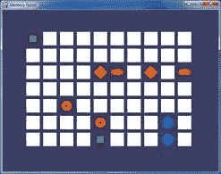
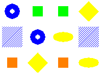
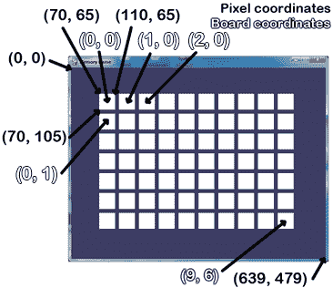

# 第三章：记忆迷题

> 原文：[`inventwithpython.com/pygame/chapter3.html`](https://inventwithpython.com/pygame/chapter3.html)
> 
> 译者：[飞龙](https://github.com/wizardforcel)
> 
> 协议：[CC BY-NC-SA 4.0](https://creativecommons.org/licenses/by-nc-sa/4.0/)



## 如何玩记忆迷题

在记忆迷题游戏中，几个图标被白色方框覆盖。每种图标有两个。玩家可以点击两个方框，看看它们后面是什么图标。如果图标匹配，那么这些方框将保持打开状态。当棋盘上的所有方框都被打开时，玩家获胜。为了给玩家一个提示，方框在游戏开始时会迅速打开一次。

## 嵌套的`for`循环

你将在记忆迷题（以及本书中大多数游戏）中看到的一个概念是在一个`for`循环内部使用另一个`for`循环。这些被称为嵌套的`for`循环。嵌套的`for`循环对于遍历两个列表的每种可能的组合非常方便。在交互式 shell 中输入以下内容：

```py
>>> for x in [0, 1, 2, 3, 4]:
...     for y in ['a', 'b', 'c']:
...         print(x, y)
...
0 a
0 b
0 c
1 a
1 b
1 c
2 a
2 b
2 c
3 a
3 b
3 c
4 a
4 b
4 c
>>> 

```

在记忆迷题代码中有几次我们需要遍历棋盘上的每个可能的 X 和 Y 坐标。我们将使用嵌套的`for`循环来确保我们得到每一种组合。请注意，内部的`for`循环（在另一个`for`循环内部的`for`循环）将在进行下一个外部`for`循环的迭代之前完成其所有迭代。如果我们颠倒`for`循环的顺序，将打印相同的值，但它们将以不同的顺序打印。将以下代码输入交互式 shell，并将其打印值的顺序与先前嵌套的`for`循环示例中的顺序进行比较：

```py
>>> for y in ['a', 'b', 'c']:
...     for x in [0, 1, 2, 3, 4]:
...         print(x, y)
...
0 a
1 a
2 a
3 a
4 a
0 b
1 b
2 b
3 b
4 b
0 c
1 c
2 c
3 c
4 c
>>> 

```

##记忆迷题的源代码

这个源代码可以从[`invpy.com/memorypuzzle.py`](http://invpy.com/memorypuzzle.py)下载。

请先在 IDLE 的文件编辑器中输入整个程序，将其保存为*memorypuzzle.py*，然后运行它。如果出现任何错误消息，请查看错误消息中提到的行号，并检查你的代码是否有任何拼写错误。你也可以将你的代码复制粘贴到[`invpy.com/diff/memorypuzzle`](http://invpy.com/diff/memorypuzzle)的网页表单中，以查看你的代码与书中代码之间的差异。

通过输入一次代码，你可能会对程序的工作方式有一些想法。当你输入完毕后，你可以自己玩这个游戏。

```py
# Memory Puzzle
# By Al Sweigart [[email protected]](/cdn-cgi/l/email-protection)
# http://inventwithpython.com/pygame
# Released under a "Simplified BSD" license

import random, pygame, sys
from pygame.locals import *

FPS = 30 # frames per second, the general speed of the program
WINDOWWIDTH = 640 # size of window's width in pixels
WINDOWHEIGHT = 480 # size of windows' height in pixels
REVEALSPEED = 8 # speed boxes' sliding reveals and covers
BOXSIZE = 40 # size of box height & width in pixels
GAPSIZE = 10 # size of gap between boxes in pixels
BOARDWIDTH = 10 # number of columns of icons
BOARDHEIGHT = 7 # number of rows of icons
assert (BOARDWIDTH * BOARDHEIGHT) % 2 == 0, 'Board needs to have an even number of boxes for pairs of matches.'
XMARGIN = int((WINDOWWIDTH - (BOARDWIDTH * (BOXSIZE + GAPSIZE))) / 2)
YMARGIN = int((WINDOWHEIGHT - (BOARDHEIGHT * (BOXSIZE + GAPSIZE))) / 2)

#            R    G    B
GRAY     = (100, 100, 100)
NAVYBLUE = ( 60,  60, 100)
WHITE    = (255, 255, 255)
RED      = (255,   0,   0)
GREEN    = (  0, 255,   0)
BLUE     = (  0,   0, 255)
YELLOW   = (255, 255,   0)
ORANGE   = (255, 128,   0)
PURPLE   = (255,   0, 255)
CYAN     = (  0, 255, 255)

BGCOLOR = NAVYBLUE
LIGHTBGCOLOR = GRAY
BOXCOLOR = WHITE
HIGHLIGHTCOLOR = BLUE

DONUT = 'donut'
SQUARE = 'square'
DIAMOND = 'diamond'
LINES = 'lines'
OVAL = 'oval'

ALLCOLORS = (RED, GREEN, BLUE, YELLOW, ORANGE, PURPLE, CYAN)
ALLSHAPES = (DONUT, SQUARE, DIAMOND, LINES, OVAL)
assert len(ALLCOLORS) * len(ALLSHAPES) * 2 >= BOARDWIDTH * BOARDHEIGHT, "Board is too big for the number of shapes/colors defined."

def main():
    global FPSCLOCK, DISPLAYSURF
    pygame.init()
    FPSCLOCK = pygame.time.Clock()
    DISPLAYSURF = pygame.display.set_mode((WINDOWWIDTH, WINDOWHEIGHT))

    mousex = 0 # used to store x coordinate of mouse event
    mousey = 0 # used to store y coordinate of mouse event
    pygame.display.set_caption('Memory Game')

    mainBoard = getRandomizedBoard()
    revealedBoxes = generateRevealedBoxesData(False)

    firstSelection = None # stores the (x, y) of the first box clicked.

    DISPLAYSURF.fill(BGCOLOR)
    startGameAnimation(mainBoard)

    while True: # main game loop
        mouseClicked = False

        DISPLAYSURF.fill(BGCOLOR) # drawing the window
        drawBoard(mainBoard, revealedBoxes)

        for event in pygame.event.get(): # event handling loop
            if event.type == QUIT or (event.type == KEYUP and event.key == K_ESCAPE):
                pygame.quit()
                sys.exit()
            elif event.type == MOUSEMOTION:
                mousex, mousey = event.pos
            elif event.type == MOUSEBUTTONUP:
                mousex, mousey = event.pos
                mouseClicked = True

        boxx, boxy = getBoxAtPixel(mousex, mousey)
        if boxx != None and boxy != None:
            # The mouse is currently over a box.
            if not revealedBoxes[boxx][boxy]:
                drawHighlightBox(boxx, boxy)
            if not revealedBoxes[boxx][boxy] and mouseClicked:
                revealBoxesAnimation(mainBoard, [(boxx, boxy)])
                revealedBoxes[boxx][boxy] = True # set the box as "revealed"
                if firstSelection == None: # the current box was the first box clicked
                    firstSelection = (boxx, boxy)
                else: # the current box was the second box clicked
                    # Check if there is a match between the two icons.
                    icon1shape, icon1color = getShapeAndColor(mainBoard, firstSelection[0], firstSelection[1])
                    icon2shape, icon2color = getShapeAndColor(mainBoard, boxx, boxy)

                    if icon1shape != icon2shape or icon1color != icon2color:
                        # Icons don't match. Re-cover up both selections.
                        pygame.time.wait(1000) # 1000 milliseconds = 1 sec
                        coverBoxesAnimation(mainBoard, [(firstSelection[0], firstSelection[1]), (boxx, boxy)])
                        revealedBoxes[firstSelection[0]][firstSelection [1]] = False
                        revealedBoxes[boxx][boxy] = False
                    elif hasWon(revealedBoxes): # check if all pairs found
                        gameWonAnimation(mainBoard)
                        pygame.time.wait(2000)

                        # Reset the board
                        mainBoard = getRandomizedBoard()
                        revealedBoxes = generateRevealedBoxesData(False)

                        # Show the fully unrevealed board for a second.
                        drawBoard(mainBoard, revealedBoxes)
                        pygame.display.update()
                        pygame.time.wait(1000)

                        # Replay the start game animation.
                        startGameAnimation(mainBoard)            
                    firstSelection = None # reset firstSelection variable

        # Redraw the screen and wait a clock tick.
        pygame.display.update()
        FPSCLOCK.tick(FPS)

def generateRevealedBoxesData(val):
    revealedBoxes = []
    for i in range(BOARDWIDTH):
        revealedBoxes.append([val] * BOARDHEIGHT)
    return revealedBoxes

def getRandomizedBoard():
    # Get a list of every possible shape in every possible color.
    icons = []
    for color in ALLCOLORS:
        for shape in ALLSHAPES:
            icons.append( (shape, color) )

    random.shuffle(icons) # randomize the order of the icons list
    numIconsUsed = int(BOARDWIDTH * BOARDHEIGHT / 2) # calculate how many icons are needed
    icons = icons[:numIconsUsed] * 2 # make two of each
    random.shuffle(icons)

    # Create the board data structure, with randomly placed icons.
    board = []
    for x in range(BOARDWIDTH):
        column = []
        for y in range(BOARDHEIGHT):
            column.append(icons[0])
            del icons[0] # remove the icons as we assign them
        board.append(column)
    return board

def splitIntoGroupsOf(groupSize, theList):
    # splits a list into a list of lists, where the inner lists have at
    # most groupSize number of items.
    result = []
    for i in range(0, len(theList), groupSize):
        result.append(theList[i:i + groupSize])
    return result

def leftTopCoordsOfBox(boxx, boxy):
    # Convert board coordinates to pixel coordinates
    left = boxx * (BOXSIZE + GAPSIZE) + XMARGIN
    top = boxy * (BOXSIZE + GAPSIZE) + YMARGIN
    return (left, top)

def getBoxAtPixel(x, y):
    for boxx in range(BOARDWIDTH):
        for boxy in range(BOARDHEIGHT):
            left, top = leftTopCoordsOfBox(boxx, boxy)
            boxRect = pygame.Rect(left, top, BOXSIZE, BOXSIZE)
            if boxRect.collidepoint(x, y):
                return (boxx, boxy)
    return (None, None)

def drawIcon(shape, color, boxx, boxy):
    quarter = int(BOXSIZE * 0.25) # syntactic sugar
    half =    int(BOXSIZE * 0.5)  # syntactic sugar

    left, top = leftTopCoordsOfBox(boxx, boxy) # get pixel coords from board coords
    # Draw the shapes
    if shape == DONUT:
        pygame.draw.circle(DISPLAYSURF, color, (left + half, top + half), half - 5)
        pygame.draw.circle(DISPLAYSURF, BGCOLOR, (left + half, top + half), quarter - 5)
    elif shape == SQUARE:
        pygame.draw.rect(DISPLAYSURF, color, (left + quarter, top + quarter, BOXSIZE - half, BOXSIZE - half))
    elif shape == DIAMOND:
        pygame.draw.polygon(DISPLAYSURF, color, ((left + half, top), (left + BOXSIZE - 1, top + half), (left + half, top + BOXSIZE - 1), (left, top + half)))
    elif shape == LINES:
        for i in range(0, BOXSIZE, 4):
            pygame.draw.line(DISPLAYSURF, color, (left, top + i), (left + i, top))
            pygame.draw.line(DISPLAYSURF, color, (left + i, top + BOXSIZE - 1), (left + BOXSIZE - 1, top + i))
    elif shape == OVAL:
        pygame.draw.ellipse(DISPLAYSURF, color, (left, top + quarter, BOXSIZE, half))

def getShapeAndColor(board, boxx, boxy):
    # shape value for x, y spot is stored in board[x][y][0]
    # color value for x, y spot is stored in board[x][y][1]
    return board[boxx][boxy][0], board[boxx][boxy][1]

def drawBoxCovers(board, boxes, coverage):
    # Draws boxes being covered/revealed. "boxes" is a list
    # of two-item lists, which have the x & y spot of the box.
    for box in boxes:
        left, top = leftTopCoordsOfBox(box[0], box[1])
        pygame.draw.rect(DISPLAYSURF, BGCOLOR, (left, top, BOXSIZE, BOXSIZE))
        shape, color = getShapeAndColor(board, box[0], box[1])
        drawIcon(shape, color, box[0], box[1])
        if coverage > 0: # only draw the cover if there is an coverage
            pygame.draw.rect(DISPLAYSURF, BOXCOLOR, (left, top, coverage, BOXSIZE))
    pygame.display.update()
    FPSCLOCK.tick(FPS)

def revealBoxesAnimation(board, boxesToReveal):
    # Do the "box reveal" animation.
    for coverage in range(BOXSIZE, (-REVEALSPEED) - 1, - REVEALSPEED):
        drawBoxCovers(board, boxesToReveal, coverage)

def coverBoxesAnimation(board, boxesToCover):
    # Do the "box cover" animation.
    for coverage in range(0, BOXSIZE + REVEALSPEED, REVEALSPEED):
        drawBoxCovers(board, boxesToCover, coverage)

def drawBoard(board, revealed):
    # Draws all of the boxes in their covered or revealed state.
    for boxx in range(BOARDWIDTH):
        for boxy in range(BOARDHEIGHT):
            left, top = leftTopCoordsOfBox(boxx, boxy)
            if not revealed[boxx][boxy]:
                # Draw a covered box.
                pygame.draw.rect(DISPLAYSURF, BOXCOLOR, (left, top, BOXSIZE, BOXSIZE))
            else:
                # Draw the (revealed) icon.
                shape, color = getShapeAndColor(board, boxx, boxy)
                drawIcon(shape, color, boxx, boxy)

def drawHighlightBox(boxx, boxy):
    left, top = leftTopCoordsOfBox(boxx, boxy)
    pygame.draw.rect(DISPLAYSURF, HIGHLIGHTCOLOR, (left - 5, top - 5, BOXSIZE + 10, BOXSIZE + 10), 4)

def startGameAnimation(board):
    # Randomly reveal the boxes 8 at a time.
    coveredBoxes = generateRevealedBoxesData(False)
    boxes = []
    for x in range(BOARDWIDTH):
        for y in range(BOARDHEIGHT):
            boxes.append( (x, y) )
    random.shuffle(boxes)
    boxGroups = splitIntoGroupsOf(8, boxes)

     drawBoard(board, coveredBoxes)
    for boxGroup in boxGroups:
        revealBoxesAnimation(board, boxGroup)
        coverBoxesAnimation(board, boxGroup)

def gameWonAnimation(board):
    # flash the background color when the player has won
    coveredBoxes = generateRevealedBoxesData(True)
    color1 = LIGHTBGCOLOR
    color2 = BGCOLOR

    for i in range(13):
        color1, color2 = color2, color1 # swap colors
        DISPLAYSURF.fill(color1)
        drawBoard(board, coveredBoxes)
        pygame.display.update()
        pygame.time.wait(300)

def hasWon(revealedBoxes):
    # Returns True if all the boxes have been revealed, otherwise False
    for i in revealedBoxes:
        if False in i:
            return False # return False if any boxes are covered.
    return True

if __name__ == '__main__':
    main()

```

## 制作和导入

```py
# Memory Puzzle
# By Al Sweigart [[email protected]](/cdn-cgi/l/email-protection)
# http://inventwithpython.com/pygame
# Released under a "Simplified BSD" license

import random, pygame, sys
from pygame.locals import *

```

程序顶部有关于游戏内容、制作者以及用户可以找到更多信息的注释。还有一条注释，指出源代码在“简化 BSD”许可下可以自由复制。简化 BSD 许可更适合软件，而不是创作共同许可（本书发布的许可），但它们基本上意思相同：人们可以自由复制和分享这个游戏。有关许可的更多信息可以在[`invpy.com/licenses`](http://invpy.com/licenses)找到。

这个程序利用了其他模块中的许多函数，所以在第 6 行导入了这些模块。第 7 行也是一个`import`语句，格式为`from (module name) import *`，这意味着你不必在前面输入模块名。`pygame.locals`模块中没有函数，但其中有几个常量变量，我们想要使用，比如`MOUSEMOTION`、`KEYUP`或`QUIT`。使用这种`import`语句的风格，我们只需要输入`MOUSEMOTION`，而不是`pygame.locals.MOUSEMOTION`。

## 魔法数字是不好的

```py
FPS = 30 # frames per second, the general speed of the program
WINDOWWIDTH = 640 # size of window's width in pixels
WINDOWHEIGHT = 480 # size of windows' height in pixels
REVEALSPEED = 8 # speed boxes' sliding reveals and covers
BOXSIZE = 40 # size of box height & width in pixels
GAPSIZE = 10 # size of gap between boxes in pixels

```

本书中的游戏程序使用了许多常量变量。你可能没有意识到它们为什么如此方便。例如，我们的代码中使用`BOXSIZE`变量，我们可以直接在代码中输入整数`40`。但是使用常量变量有两个原因。

首先，如果我们以后想要更改每个框的大小，我们将不得不浏览整个程序，并找到并替换每次输入`40`的地方。只需使用`BOXSIZE`常量，我们只需要更改第 13 行，程序的其余部分已经是最新的。这样做要好得多，特别是因为我们可能会将整数值`40`用于除了白色框的大小之外的其他用途，而意外更改`40`会导致程序中的错误。

其次，它使代码更易读。转到下一节，看看第 18 行。这设置了`XMARGIN`常量的计算，它是整个板的侧面有多少像素。这是一个看起来复杂的表达式，但你可以仔细地理清它的含义。第 18 行看起来像这样：

```py
XMARGIN = int((WINDOWWIDTH - (BOARDWIDTH * (BOXSIZE + GAPSIZE))) / 2)

```

但是，如果第 18 行没有使用常量变量，它将如下所示：

```py
XMARGIN = int((640 – (10 * (40 + 10))) / 2)

```

现在变得不可能记住程序员的确切意图是什么。源代码中的这些未解释的数字通常被称为魔术数字。每当你发现自己输入魔术数字时，你应该考虑用常量变量替换它们。对于 Python 解释器来说，前两行是完全相同的。但是对于阅读源代码并试图理解其工作原理的人类程序员来说，第 18 行的第二个版本根本没有多大意义！常量确实有助于提高源代码的可读性。

当然，你也可以用常量变量替换数字。看看下面的代码：

```py
ZERO = 0
ONE = 1
TWO = 99999999
TWOANDTHREEQUARTERS = 2.75

```

不要写那样的代码。那太傻了。

## 使用`assert`语句进行理智检查

```py
BOARDWIDTH = 10 # number of columns of icons
BOARDHEIGHT = 7 # number of rows of icons
assert (BOARDWIDTH * BOARDHEIGHT) % 2 == 0, 'Board needs to have an even number of boxes for pairs of matches.'
XMARGIN = int((WINDOWWIDTH - (BOARDWIDTH * (BOXSIZE + GAPSIZE))) / 2)
YMARGIN = int((WINDOWHEIGHT - (BOARDHEIGHT * (BOXSIZE + GAPSIZE))) / 2)

```

第 17 行的`assert`语句确保我们选择的板宽度和高度将导致偶数个框（因为在这个游戏中我们将有一对图标）。`assert`语句有三个部分：`assert`关键字，一个表达式，如果为`False`，则导致程序崩溃。表达式后的第三部分（在逗号后的字符串）是程序因断言而崩溃时出现的字符串。

带有表达式的`assert`语句基本上表示：“程序员断言这个表达式必须为`True`，否则崩溃程序。”这是向程序添加一个理智检查的好方法，以确保如果执行通过了断言，我们至少知道该代码正在按预期工作。

## 判断一个数字是偶数还是奇数

如果板宽度和高度的乘积除以 2 有余数为 0（`％`模运算符评估余数是多少），那么这个数字是偶数。偶数除以 2 将始终有零的余数。奇数除以 2 将始终有一个余数。如果你的代码需要判断一个数字是偶数还是奇数，这是一个很好的技巧：

```py
>>> isEven = someNumber % 2 == 0
>>> isOdd = someNumber % 2 != 0

```

在上面的情况下，如果`someNumber`中的整数是偶数，那么`isEven`将是`True`。如果是奇数，那么`isOdd`将是`True`。

## 尽早崩溃，经常崩溃！

程序崩溃是一件坏事。当你的程序在代码中出现错误并且无法继续时，就会发生这种情况。但也有一些情况下，尽早崩溃程序可以避免以后更糟糕的错误。

如果我们在第 15 和 16 行选择的`BOARDWIDTH`和`BOARDHEIGHT`的值导致了一个有奇数个框的板（比如如果宽度为 3，高度为 5），那么总会有一个多余的图标没有配对。这将在程序的后面导致错误，并且可能需要大量的调试工作才能找出错误的真正来源是在程序的一开始。事实上，只是为了好玩，试着注释掉断言，这样它就不会运行，然后将`BOARDWIDTH`和`BOARDHEIGHT`常量都设置为奇数。当你运行程序时，它会立即显示在*memorypuzzle.py*的第 149 行发生错误，这是在`getRandomizedBoard()`函数中！

```py
Traceback (most recent call last):
  File "C:\book2svn\src\memorypuzzle.py", line 292, in <module>
    main()
  File "C:\book2svn\src\memorypuzzle.py", line 58, in main
    mainBoard = getRandomizedBoard()
  File "C:\book2svn\src\memorypuzzle.py", line 149, in getRandomizedBoard
    columns.append(icons[0])
IndexError: list index out of range

```

我们可能会花费很多时间查看`getRandomizedBoard()`，试图弄清楚其中的问题，然后才意识到`getRandomizedBoard()`是完全正常的：错误的真正来源是在第 15 行和第 16 行，我们设置了`BOARDWIDTH`和`BOARDHEIGHT`常量。

断言确保这种情况永远不会发生。如果我们的代码将崩溃，我们希望它在检测到某些严重错误时尽快崩溃，否则该错误可能直到程序的后期才会显现。尽早崩溃！

每当程序中有一些条件必须始终始终始终为`True`时，您都要添加`assert`语句。经常崩溃！您不必过度使用`assert`语句，但是经常使用`assert`语句可以在检测错误的真正来源时大有裨益。尽早崩溃，经常崩溃！

（在您的代码中。比如说，不是骑马时。）

## 使源代码看起来漂亮

```py
#            R    G    B
GRAY     = (100, 100, 100)
NAVYBLUE = ( 60,  60, 100)
WHITE    = (255, 255, 255)
RED      = (255,   0,   0)
GREEN    = (  0, 255,   0)
BLUE     = (  0,   0, 255)
YELLOW   = (255, 255,   0)
ORANGE   = (255, 128,   0)
PURPLE   = (255,   0, 255)
CYAN     = (  0, 255, 255)

BGCOLOR = NAVYBLUE
LIGHTBGCOLOR = GRAY
BOXCOLOR = WHITE
HIGHLIGHTCOLOR = BLUE

```

请记住，Pygame 中的颜色由一个包含从`0`到`255`的三个整数的元组表示。这三个整数代表颜色中红色、绿色和蓝色的数量，这就是为什么这些元组被称为 RGB 值。请注意，22 到 31 行中元组的间距是这样的，即 R、G 和 B 整数是对齐的。在 Python 中，缩进（即行首的空格）需要精确，但是行的其余部分的间距并不那么严格。通过将元组中的整数间隔开，我们可以清楚地看到 RGB 值之间的比较。（有关间距和缩进的更多信息，请参见[`invpy.com/whitespace`](http://invpy.com/whitespace)。）

这样做可以使您的代码更易读，但不要花太多时间。代码不一定非得漂亮才能工作。在某个时候，您只会花更多的时间打空格，而不是通过可读的元组值节省的时间。

## 使用常量变量而不是字符串

```py
DONUT = 'donut'
SQUARE = 'square'
DIAMOND = 'diamond'
LINES = 'lines'
OVAL = 'oval'

```

程序还为一些字符串设置了常量变量。这些常量将用于棋盘的数据结构，跟踪棋盘上哪些空格有哪些图标。使用常量变量而不是字符串值是一个好主意。看下面的代码，来自第 187 行：

```py
    if shape == DONUT:

```

形状变量将设置为字符串`'donut'`、`'square'`、`'diamond'`、`'lines'`或`'oval'`中的一个，然后与`DONUT`常量进行比较。例如，如果我们在编写第 187 行时犯了拼写错误，就像这样：

```py
    if shape == DUNOT:

```

然后 Python 会崩溃，并显示错误消息，说没有名为`DUNOT`的变量。这很好。由于程序在第 187 行崩溃，当我们检查该行时，很容易看出错误是由拼写错误引起的。但是，如果我们使用字符串而不是常量变量，并且犯了同样的拼写错误，第 187 行将如下所示：

```py
    if shape == 'dunot':

```

这是完全可以接受的 Python 代码，因此当您运行它时，一开始不会崩溃。但是，这将导致我们程序后来出现奇怪的错误。因为代码不会立即在问题发生的地方崩溃，所以要找到它可能会更加困难。

## 确保我们有足够的图标

```py
ALLCOLORS = (RED, GREEN, BLUE, YELLOW, ORANGE, PURPLE, CYAN)
ALLSHAPES = (DONUT, SQUARE, DIAMOND, LINES, OVAL)
assert len(ALLCOLORS) * len(ALLSHAPES) * 2 >= BOARDWIDTH * BOARDHEIGHT, "Board is too big for the number of shapes/colors defined."

```

为了使我们的游戏程序能够创建每种可能的颜色和形状组合的图标，我们需要创建一个包含所有这些值的元组。还有另一个断言在第 46 行，以确保我们有足够的颜色/形状组合适应我们的棋盘大小。如果没有足够的话，程序将在第 46 行崩溃，我们将知道我们要么添加更多的颜色和形状，要么使棋盘的宽度和高度更小。有 7 种颜色和 5 种形状，我们可以制作 35（即 7 x 5）种不同的图标。因为每种图标都有一对，这意味着我们的棋盘最多可以有 70 个空格（即 35 x 2，或 7 x 5 x 2）。

## 元组与列表，不可变与可变

你可能已经注意到`ALLCOLORS`和`ALLSHAPES`变量是元组而不是列表。我们何时使用元组，何时使用列表？它们之间的区别是什么？

元组和列表在所有方面都是相同的，除了两点：元组使用括号而不是方括号，并且元组中的项不能被修改（但列表中的项可以被修改）。我们通常称列表为可变的（可以被更改），元组为不可变的（不能被更改）。

要尝试更改列表和元组中的值，请查看以下代码示例：

```py
>>> listVal = [1, 1, 2, 3, 5, 8]
>>> tupleVal = (1, 1, 2, 3, 5, 8)
>>> listVal[4] = 'hello!'
>>> listVal
[1, 1, 2, 3, 'hello!', 8]
>>> tupleVal[4] = 'hello!'
Traceback (most recent call last):
  File "<stdin>", line 1, in <module>
TypeError: 'tuple' object does not support item assignment
>>> tupleVal
(1, 1, 2, 3, 5, 8)
>>> tupleVal[4]
5

```

注意，当我们尝试更改元组中索引为`2`的项时，Python 会给出一个错误消息，表示元组对象不支持“项赋值”。

元组的不可变性有一个愚蠢的好处和一个重要的好处。愚蠢的好处是使用元组的代码比使用列表的代码稍微快一些。（Python 能够进行一些优化，因为知道元组中的值永远不会改变。）但是让你的代码运行快几纳秒并不重要。

使用元组的重要好处类似于使用常量变量的好处：这表明元组中的值永远不会改变，因此以后阅读代码的人可以说，“我可以期望这个元组永远是一样的。否则程序员会使用列表。”这也让未来阅读你代码的程序员说，“如果我看到一个列表值，我知道它可能在程序的某个时刻被修改。否则，编写这段代码的程序员会使用元组。”

你仍然可以将新的元组值分配给一个变量：

```py
>>> tupleVal = (1, 2, 3)
>>> tupleVal = (1, 2, 3, 4)

```

这段代码之所以有效是因为代码没有更改第二行的`(1, 2, 3)`元组。它是将全新的元组`(1, 2, 3, 4)`分配给`tupleVal`，并覆盖旧的元组值。但是，你不能使用方括号修改元组中的项。

字符串也是一种不可变的数据类型。你可以使用方括号来读取字符串中的单个字符，但你不能改变字符串中的单个字符。

```py
>>> strVal = 'Hello'
>>> strVal[1]
'e'
>>> strVal[1] = 'X'
Traceback (most recent call last):
  File "<stdin>", line 1, in <module>
TypeError: 'str' object does not support item assignment

```

## 一个项元组需要一个尾随逗号

关于元组的一个小细节：如果你需要编写关于一个只有一个值的元组的代码，那么它需要在最后加上一个逗号，就像这样：

```py
oneValueTuple = (42, )

```

如果你忘记了这个逗号（这很容易忘记），那么 Python 将无法区分这个和只是改变操作顺序的一对括号。例如，看下面的两行代码：

```py
variableA = (5 * 6)
variableB = (5 * 6, )

```

存储在`variableA`中的值只是整数`30`。然而，`variableB`赋值语句的表达式是单项元组值`(30, )`。空元组值不需要逗号，它们可以只是一对括号：`()`

## 在列表和元组之间转换

你可以像转换字符串和整数值一样转换列表和元组值。只需将一个元组值传递给`list()`函数，它将返回该元组值的列表形式。或者，将一个列表值传递给`tuple()`函数，它将返回该列表值的元组形式。尝试在交互式 shell 中输入以下内容：

```py
>>> spam = (1, 2, 3, 4)
>>> spam = list(spam)
>>> spam
[1, 2, 3, 4]
>>> spam = tuple(spam)
>>> spam
(1, 2, 3, 4)
>>> 

```

## `global`语句，以及全局变量为何不好

```py
def main():
    global FPSCLOCK, DISPLAYSURF
    pygame.init()
    FPSCLOCK = pygame.time.Clock()
    DISPLAYSURF = pygame.display.set_mode((WINDOWWIDTH, WINDOWHEIGHT))

    mousex = 0 # used to store x coordinate of mouse event
    mousey = 0 # used to store y coordinate of mouse event
    pygame.display.set_caption('Memory Game')

```

这是`main()`函数的开始，这是游戏代码的主要部分。`main()`函数中调用的函数将在本章后面解释。

第 49 行是一个`global`语句。`global`语句是`global`关键字后跟逗号分隔的变量名列表。然后这些变量名被标记为全局变量。在`main()`函数内，这些名称不是指可能恰好与全局变量同名的局部变量。它们*是*全局变量。在`main()`函数中分配给它们的任何值将在`main()`函数外持续存在。我们将`FPSCLOCK`和`DISPLAYSURF`变量标记为全局，因为它们在程序中的其他几个函数中使用。（更多信息请参阅[`invpy.com/scope`](http://invpy.com/scope)。）

有四条简单的规则来确定变量是局部的还是全局的：

1. 如果函数开头有一个变量的全局语句，那么该变量是全局的。

2. 如果函数中的变量名与全局变量同名，并且函数从未为变量分配值，那么该变量就是全局变量。

3. 如果函数中的变量名与全局变量同名，并且函数确实为变量分配了一个值，那么该变量是局部变量。

4. 如果在函数中没有与函数中的变量同名的全局变量，那么该变量显然是局部变量。

通常希望避免在函数内部使用全局变量。函数应该像程序中的迷你程序，具有特定的输入（参数）和输出（返回值）。但是读取和写入全局变量的函数具有额外的输入和输出。由于在调用函数之前全局变量可能已在许多地方被修改，因此跟踪涉及全局变量中设置错误值的错误可能会很棘手。

将函数作为一个单独的迷你程序，不使用全局变量，可以更容易地找到代码中的错误，因为函数的参数是明确已知的。它还使得更改函数中的代码更容易，因为如果新函数与相同的参数一起工作并给出相同的返回值，它将自动与程序的其余部分一样工作，就像旧函数一样。

基本上，使用全局变量可能会使编写程序变得更容易，但它们通常会使调试变得更加困难。

在本书中的游戏中，全局变量主要用于永远不会改变的全局常量，但需要先调用`pygame.init()`函数。由于这发生在`main()`函数中，它们在`main()`函数中设置并且必须是全局的，以便其他函数可以看到它们。但是全局变量被用作常量，不会改变，因此不太可能引起混乱的错误。

如果您不理解这一点，不要担心。只需编写代码，使您将值传递给函数，而不是让函数读取全局变量作为一般规则。

## 数据结构和二维列表

```py
    mainBoard = getRandomizedBoard()
    revealedBoxes = generateRevealedBoxesData(False)

```

`getRandomizedBoard()`函数返回表示棋盘状态的数据结构。`generateRevealedBoxesData()`函数返回表示哪些方框被覆盖的数据结构。这些函数的返回值是二维（2D）列表，或者说是列表的列表。列表的列表的值将是一个 3D 列表。另一个表示二维或多维列表的词是多维列表。

如果我们在名为`spam`的变量中存储了一个列表值，我们可以使用方括号访问该列表中的值，比如`spam[2]`来检索列表中的第三个值。如果`spam[2]`处的值本身是一个列表，那么我们可以使用另一组方括号来检索*该列表中的值*。例如，`spam[2][4]`将检索`spam`中第三个值中的第五个值。使用这种列表的列表的表示法使得将 2D 板映射到 2D 列表值变得容易。由于`mainBoard`变量将在其中存储图标，如果我们想要获取板上位置(4, 5)处的图标，我们可以使用表达式`mainBoard[4][5]`。由于图标本身存储为形状和颜色的两个元组，完整的数据结构是一个两个元组的列表的列表。呼！

这里有一个小例子。假设板看起来是这样的：



相应的数据结构将是：

```py
mainBoard = [[(DONUT, BLUE), (LINES, BLUE), (SQUARE, ORANGE)], [(SQUARE, GREEN), (DONUT, BLUE), (DIAMOND, YELLOW)], [(SQUARE, GREEN), (OVAL, YELLOW), (SQUARE, ORANGE)], [(DIAMOND, YELLOW), (LINES, BLUE), (OVAL, YELLOW)]]

```

（如果你的书是黑白的，你可以在[`invpy.com/memoryboard`](http://invpy.com/memoryboard)看到上面图片的彩色版本。）你会注意到`mainBoard[x][y]`将对应于板上坐标(x, y)处的图标。

同时，“revealed boxes”数据结构也是一个二维列表，不同于棋盘数据结构的是，它包含布尔值：如果该 x，y 坐标处的方块已经被揭示，则为`True`，如果被覆盖，则为`False`。将`False`传递给`generateRevealedBoxesData()`函数会将所有布尔值设置为`False`。（此函数将在后面详细解释。）

这两个数据结构用于跟踪游戏板的状态。

## “开始游戏”动画

```py
    firstSelection = None # stores the (x, y) of the first box clicked.

    DISPLAYSURF.fill(BGCOLOR)
    startGameAnimation(mainBoard)

```

第 61 行设置了一个名为`firstSelection`的变量，其值为`None`。(`None`是表示缺少值的值。它是数据类型`NoneType`的唯一值。更多信息请参阅[`invpy.com/None`](http://invpy.com/None)) 当玩家点击棋盘上的图标时，程序需要跟踪这是否是点击的一对图标中的第一个图标还是第二个图标。如果`firstSelection`是`None`，则点击是在第一个图标上，我们将 XY 坐标存储在`firstSelection`变量中，作为两个整数的元组（一个用于 X 值，另一个用于 Y 值）。在第二次点击时，值将是这个元组而不是`None`，这是程序跟踪到第二个图标点击的方式。第 63 行用背景颜色填充整个表面。这也会覆盖表面上原来的任何东西，这给了我们一个干净的板子来开始绘制图形。

如果你玩过记忆迷题游戏，你会注意到在游戏开始时，所有的方块都会被快速地随机覆盖和揭示，以便玩家偷看哪些图标在哪些方块下。这一切都发生在`startGameAnimation()`函数中，这将在本章后面详细解释。

给玩家这个偷看的机会很重要（但不要让玩家轻松记住图标的位置），否则他们将不知道任何图标在哪里。盲目点击图标不如有一点提示来得有趣。

## 游戏循环

```py
    while True: # main game loop
        mouseClicked = False

        DISPLAYSURF.fill(BGCOLOR) # drawing the window
        drawBoard(mainBoard, revealedBoxes)

```

游戏循环是一个无限循环，从第 66 行开始，只要游戏正在进行中就会不断迭代。请记住，游戏循环处理事件，更新游戏状态，并将游戏状态绘制到屏幕上。

记忆迷题程序的游戏状态存储在以下变量中：

+   `mainBoard`

+   `revealedBoxes`

+   `firstSelection`

+   `mouseClicked`

+   `mousex`

+   `mousey`

在记忆迷题程序的游戏循环的每次迭代中，`mouseClicked`变量存储一个布尔值，如果玩家在游戏循环中的这次迭代中点击了鼠标，则为`True`。（这是跟踪游戏状态的一部分。）

在第 69 行，表面被涂上背景颜色，擦除之前绘制的任何东西。然后程序调用`drawBoard()`根据我们传递给它的棋盘和“揭示方块”数据结构来绘制棋盘的当前状态。（这些代码行是绘制和更新屏幕的一部分。）

请记住，我们的绘图函数只在内存中的显示 Surface 对象上绘制。这个 Surface 对象直到我们调用`pygame.display.update()`才会真正出现在屏幕上，这是在第 121 行的游戏循环的末尾完成的。

## 事件处理循环

```py
        for event in pygame.event.get(): # event handling loop
            if event.type == QUIT or (event.type == KEYUP and event.key == K_ESCAPE):
                pygame.quit()
                sys.exit()
            elif event.type == MOUSEMOTION:
                mousex, mousey = event.pos
            elif event.type == MOUSEBUTTONUP:
                mousex, mousey = event.pos
                mouseClicked = True

```

第 72 行的`for`循环执行自上次游戏循环迭代以来发生的每个事件的代码。这个循环被称为事件处理循环（与游戏循环不同，尽管事件处理循环在游戏循环内部），并迭代由`pygame.event.get()`调用返回的`pygame.Event`对象列表。

如果事件对象是`QUIT`事件或`KEYUP`事件（即 Esc 键），则程序应该终止。否则，在`MOUSEMOTION`事件（即鼠标光标移动）或`MOUSEBUTTONUP`事件（即先前按下鼠标按钮，现在释放按钮）的情况下，鼠标光标的位置应该存储在`mousex`和`mousey`变量中。如果这是一个`MOUSEBUTTONUP`事件，`mouseClicked`也应该设置为`True`。

一旦我们处理了所有事件，存储在`mousex`，`mousey`和`mouseClicked`中的值将告诉我们玩家给了我们任何输入。现在我们应该更新游戏状态并将结果绘制到屏幕上。

## 检查鼠标光标在哪个方块上

```py
        boxx, boxy = getBoxAtPixel(mousex, mousey)
        if boxx != None and boxy != None:
            # The mouse is currently over a box.
            if not revealedBoxes[boxx][boxy]:
                drawHighlightBox(boxx, boxy)

```

`getBoxAtPixel()`函数将返回两个整数的元组。这些整数表示鼠标坐标所在方块的 XY 棋盘坐标。`getBoxAtPixel()`是如何做到的将在后面解释。现在我们只需要知道，如果`mousex`和`mousey`坐标在一个方块上，函数将返回 XY 棋盘坐标的元组，并存储在`boxx`和`boxy`中。如果鼠标光标不在任何方块上（例如，如果它在棋盘的一侧或在方块之间的间隙中），那么函数将返回元组`(None, None)`，并且`boxx`和`boxy`都将存储`None`。

我们只关心`boxx`和`boxy`中没有`None`的情况，所以下面几行代码是在第 83 行的`if`语句后面的块中。如果执行进入了这个块，我们知道用户将鼠标光标放在了一个方块上（也许还点击了鼠标，这取决于`mouseClicked`中存储的值）。

第 85 行的`if`语句检查方块是否被盖住，通过读取`revealedBoxes[boxx][boxy]`中存储的值。如果是`False`，那么我们知道方块被盖住了。每当鼠标光标在被盖住的方块上时，我们希望在方块周围绘制蓝色的高亮，以通知玩家他们可以点击它。这种高亮是不会为已经被揭示的方块绘制的。高亮绘制由我们的`drawHighlightBox()`函数处理，这将在后面解释。

```py
            if not revealedBoxes[boxx][boxy] and mouseClicked:
                revealBoxesAnimation(mainBoard, [(boxx, boxy)])
                revealedBoxes[boxx][boxy] = True # set the box as "revealed"

```

在第 87 行，我们检查鼠标光标不仅覆盖了一个被盖住的方块，而且鼠标也被点击了。在这种情况下，我们希望通过调用我们的`revealBoxesAnimation()`函数来播放该方块的“揭示”动画（就像本章后面解释的所有其他函数一样）。您应该注意，调用此函数只会绘制方块被揭示的动画。直到第 89 行我们设置`revealedBoxes[boxx][boxy] = True`，游戏状态的数据结构才会更新。

如果注释掉第 89 行然后运行程序，您会注意到点击方块后，揭示动画会播放，但然后方块立即再次被覆盖。这是因为`revealedBoxes[boxx][boxy]`仍然设置为`False`，因此在游戏循环的下一次迭代中，该方块将被覆盖。在我们的程序中，没有第 89 行会导致一个相当奇怪的错误。

## 处理第一个点击的方块

```py
                if firstSelection == None: # the current box was the first box clicked
                    firstSelection = (boxx, boxy)
                else: # the current box was the second box clicked
                    # Check if there is a match between the two icons.
                    icon1shape, icon1color = getShapeAndColor(mainBoard, firstSelection[0], firstSelection[1])
                    icon2shape, icon2color = getShapeAndColor(mainBoard, boxx, boxy)

```

在执行进入游戏循环之前，`firstSelection`变量被设置为`None`。我们的程序将解释为没有点击任何方块，因此如果第 90 行的条件为`True`，这意味着这是可能匹配的两个方块中的第一个被点击的。我们希望播放方块的揭示动画，然后保持该方块未覆盖。我们还将`firstSelection`变量设置为被点击方块的坐标元组。

如果这是玩家点击的第二个方块，我们希望播放该方块的揭示动画，然后检查方块下的两个图标是否匹配。`getShapeAndColor()`函数（稍后解释）将检索图标的形状和颜色值。（这些值将是`ALLCOLORS`和`ALLSHAPES`元组中的一个值。）

## 处理不匹配的图标对

```py
                    if icon1shape != icon2shape or icon1color != icon2color:
                        # Icons don't match. Re-cover up both selections.
                        pygame.time.wait(1000) # 1000 milliseconds = 1 sec
                        coverBoxesAnimation(mainBoard, [(firstSelection[0], firstSelection[1]), (boxx, boxy)])
                        revealedBoxes[firstSelection[0]][firstSelection [1]] = False
                        revealedBoxes[boxx][boxy] = False

```

第 97 行的`if`语句检查两个图标的形状或颜色是否不匹配。如果是这种情况，我们希望通过调用`pygame.time.wait(1000)`暂停游戏 1000 毫秒（即 1 秒），以便玩家有机会看到两个图标不匹配。然后播放两个方块的“覆盖”动画。我们还希望更新游戏状态，将这些方块标记为未揭示（即覆盖）。

## 处理玩家获胜

```py
                    elif hasWon(revealedBoxes): # check if all pairs found
                        gameWonAnimation(mainBoard)
                        pygame.time.wait(2000)

                        # Reset the board
                        mainBoard = getRandomizedBoard()
                        revealedBoxes = generateRevealedBoxesData(False)

                        # Show the fully unrevealed board for a second.
                        drawBoard(mainBoard, revealedBoxes)
                        pygame.display.update()
                        pygame.time.wait(1000)

                        # Replay the start game animation.
                        startGameAnimation(mainBoard)            
                    firstSelection = None # reset firstSelection variable

```

否则，如果第 97 行的条件为`False`，那么两个图标必须匹配。此时程序实际上不必对方块做任何其他操作：它可以将两个方块保持在揭示状态。但是，程序应该检查这是否是板上最后一对要匹配的图标。这是在我们的`hasWon()`函数内完成的，如果板处于获胜状态（即所有方块都被揭示），则返回`True`。

如果是这种情况，我们希望通过调用`gameWonAnimation()`来播放“游戏获胜”动画，然后稍微暂停一下，让玩家沉浸在胜利中，然后重置`mainBoard`和`revealedBoxes`中的数据结构，以开始新游戏。

117 行再次播放“开始游戏”动画。之后，程序执行将像往常一样循环执行游戏循环，玩家可以继续玩游戏，直到退出程序。

无论两个方块是否匹配，第 118 行在第二个方块被点击后将`firstSelection`变量设置回`None`，以便玩家下一个点击的方块被解释为可能匹配的图标对中的第一个点击的方块。

## 将游戏状态绘制到屏幕上。

```py
        # Redraw the screen and wait a clock tick.
        pygame.display.update()
        FPSCLOCK.tick(FPS)

```

此时，游戏状态已根据玩家的输入进行了更新，并且最新的游戏状态已绘制到`DISPLAYSURF`显示表面对象上。我们已经到达游戏循环的末尾，因此我们调用`pygame.display.update()`将`DISPLAYSURF`表面对象绘制到计算机屏幕上。

第 9 行将 FPS 常量设置为整数值`30`，这意味着我们希望游戏以（最多）30 帧每秒的速度运行。如果我们希望程序运行得更快，可以增加这个数字。如果我们希望程序运行得更慢，可以减少这个数字。甚至可以将其设置为像`0.5`这样的浮点值，这将以每秒半帧的速度运行程序，即每两秒一帧。

为了以每秒 30 帧的速度运行，每帧必须在 1/30 秒内绘制。这意味着 `pygame.display.update()` 和游戏循环中的所有代码必须在 33.3 毫秒内执行。任何现代计算机都可以轻松做到这一点，并且还有充足的时间。为了防止程序运行得太快，我们调用 `FPSCLOCK` 对象的 `tick()` 方法，让它暂停程序剩下的 33.3 毫秒。

由于这是在游戏循环的最后完成的，它确保每次游戏循环迭代花费（至少）33.3 毫秒。如果由于某种原因 `pygame.display.update()` 调用和游戏循环中的代码花费的时间超过 33.3 毫秒，那么 `tick()` 方法将不会等待，立即返回。

我一直在说其他函数将在本章后面解释。现在我们已经讨论了 `main()` 函数，你对整个程序的工作原理有了一个概念，让我们详细了解从 `main()` 调用的所有其他函数。

## 创建“已揭示的盒子”数据结构

```py
def generateRevealedBoxesData(val):
    revealedBoxes = []
    for i in range(BOARDWIDTH):
        revealedBoxes.append([val] * BOARDHEIGHT)
    return revealedBoxes

```

`generateRevealedBoxesData()` 函数需要创建一个布尔值的列表列表。布尔值将作为 `val` 参数传递给函数。我们将数据结构作为空列表存储在 `revealedBoxes` 变量中。

为了使数据结构具有 `revealedBoxes[x][y]` 结构，我们需要确保内部列表表示棋盘的垂直列而不是水平行。否则，数据结构将具有 `revealedBoxes[y][x]` 结构。

`for` 循环将创建列，然后将它们附加到 `revealedBoxes`。使用列表复制创建列列表，使得列列表具有 `BOARDHEIGHT` 规定的数量的 `val` 值。

## 创建棋盘数据结构：步骤 1 - 获取所有可能的图标

```py
def getRandomizedBoard():
    # Get a list of every possible shape in every possible color.
    icons = []
    for color in ALLCOLORS:
        for shape in ALLSHAPES:
            icons.append( (shape, color) )

```

棋盘数据结构只是一个元组的列表列表，每个元组有两个值：一个是图标的形状，一个是图标的颜色。但是创建这个数据结构有点复杂。我们需要确保棋盘上的盒子数量与图标数量完全一样，并且确保每种类型只有两个图标。

首先要做的是创建一个包含每种形状和颜色的可能组合的列表。回想一下，我们在 `ALLCOLORS` 和 `ALLSHAPES` 中有每种颜色和形状的列表，所以在第 135 和 136 行的嵌套 `for` 循环将遍历每种可能的颜色和形状组合。这些都将添加到第 137 行的 `icons` 变量中的列表中。

## 步骤 2 - 洗牌和截断所有图标的列表

```py
    random.shuffle(icons) # randomize the order of the icons list
    numIconsUsed = int(BOARDWIDTH * BOARDHEIGHT / 2) # calculate how many icons are needed
    icons = icons[:numIconsUsed] * 2 # make two of each
    random.shuffle(icons)

```

但请记住，可能的组合可能比棋盘上的空格多。我们需要通过将 `BOARDWIDTH` 乘以 `BOARDHEIGHT` 来计算棋盘上的空格数。然后我们将这个数字除以 2，因为我们将有图标的成对出现。在一个有 70 个空格的棋盘上，我们只需要 35 种不同的图标，因为每种图标将有两个。这个数字将存储在 `numIconsUsed` 中。

第 141 行使用列表切片来获取列表中的前 `numIconsUsed` 个图标。（如果你忘记了列表切片的工作原理，请查看 [`invpy.com/slicing`](http://invpy.com/slicing)。）这个列表在第 139 行被打乱，所以每局游戏它都不会是相同的图标。然后使用 `*` 运算符复制这个列表，使得每种图标都有两个。这个新的重复列表将覆盖 `icons` 变量中的旧列表。由于这个新列表的前半部分与后半部分相同，我们再次调用 `shuffle()` 方法来随机混合图标的顺序。

## 步骤 3 - 将图标放置在棋盘上

```py
    # Create the board data structure, with randomly placed icons.
    board = []
    for x in range(BOARDWIDTH):
        column = []
        for y in range(BOARDHEIGHT):
            column.append(icons[0])
            del icons[0] # remove the icons as we assign them
        board.append(column)
    return board

```

现在我们需要为棋盘创建一个列表的列表数据结构。我们可以使用嵌套的`for`循环来做到这一点，就像`generateRevealedBoxesData()`函数一样。对于棋盘上的每一列，我们将创建一个随机选择图标的列表。当我们向列添加图标时，在第 149 行，我们将从第 150 行的`icons`列表中删除它们。这样，随着`icons`列表变得越来越短，`icons[0]`将有一个不同的图标添加到列中。

为了更好地理解这一点，请将以下代码输入交互式 shell 中。注意`del`语句如何改变`myList`列表。

```py
>>> myList = ['cat', 'dog', 'mouse', 'lizard']
>>> del myList[0]
>>> myList
['dog', 'mouse', 'lizard']
>>> del myList[0]
>>> myList
['mouse', 'lizard']
>>> del myList[0]
>>> myList
['lizard']
>>> del myList[0]
>>> myList
[]
>>> 

```

因为我们删除了列表前面的项目，其他项目向前移动，以便列表中的下一个项目成为新的“第一个”项目。这与第 150 行的工作方式相同。

## 将列表拆分为列表的列表

```py
def splitIntoGroupsOf(groupSize, theList):
    # splits a list into a list of lists, where the inner lists have at
    # most groupSize number of items.
    result = []
    for i in range(0, len(theList), groupSize):
        result.append(theList[i:i + groupSize])
    return result

```

`splitIntoGroupsOf()`函数（将被`startGameAnimation()`函数调用）将一个列表拆分为一个列表的列表，其中内部列表中有`groupSize`个项目。（如果剩下的项目少于`groupSize`，最后一个列表可能会少一些。）

第 159 行对`range()`的调用使用了`range()`的三参数形式。（如果您对这种形式不熟悉，请看一下[`invpy.com/range`](http://invpy.com/range)。）让我们举个例子。如果列表的长度是`20`，`groupSize`参数是`8`，那么`range(0, len(theList), groupSize)`将评估为`range(0, 20, 8)`。这将使`i`变量在`for`循环的三次迭代中分别取值`0`、`8`和`16`。

在第 160 行的列表切片 theList[i:i + groupSize]创建了添加到`result`列表中的列表。在每次`i`为`0`、`8`和`16`（`groupSize`为`8`）的迭代中，这个列表切片表达式将是`theList[0:8]`，然后在第二次迭代时是`theList[8:16]`，然后在第三次迭代时是`theList[16:24]`。

请注意，即使在我们的示例中`theList`的最大索引是`19`，`theList[16:24]`也不会引发`IndexError`错误，即使`24`大于`19`。它只会创建一个包含列表中剩余项目的列表切片。列表切片不会破坏或更改存储在`theList`中的原始列表。它只是复制其中的一部分以评估为新的列表值。这个新的列表值是追加到第 160 行`result`变量中的列表。因此，当我们在这个函数的末尾返回`result`时，我们返回的是一个列表的列表。

## 不同的坐标系

```py
def leftTopCoordsOfBox(boxx, boxy):
    # Convert board coordinates to pixel coordinates
    left = boxx * (BOXSIZE + GAPSIZE) + XMARGIN
    top = boxy * (BOXSIZE + GAPSIZE) + YMARGIN
    return (left, top)

```

您应该熟悉笛卡尔坐标系。（如果您想对这个主题进行复习，请阅读[`invpy.com/coordinates`](http://invpy.com/coordinates)。）在我们的大多数游戏中，我们将使用多个笛卡尔坐标系。在记忆拼图游戏中使用的坐标系之一是像素或屏幕坐标。但我们还将为盒子使用另一个坐标系。这是因为使用（3，2）来指代从左边数第 4 个方块和从上方数第 3 个方块（请记住，数字从 0 开始，而不是 1）会比使用方块左上角的像素坐标（220，165）更容易。但是，我们需要一种方法来在这两个坐标系之间进行转换。

这是游戏的图片和两种不同的坐标系统。请记住，窗口宽度为 640 像素，高度为 480 像素，因此（639，479）是右下角（因为左上角的像素是（0，0），而不是（1，1））。



`leftTopCoordsOfBox()`函数将接受盒子坐标并返回像素坐标。因为一个盒子在屏幕上占据多个像素，我们将始终返回盒子左上角的单个像素。这个值将作为一个由两个整数组成的元组返回。当我们需要绘制这些盒子时，`leftTopCoordsOfBox()`函数经常会被使用来获取像素坐标。

## 从像素坐标转换为盒子坐标

```py
def getBoxAtPixel(x, y):
    for boxx in range(BOARDWIDTH):
        for boxy in range(BOARDHEIGHT):
            left, top = leftTopCoordsOfBox(boxx, boxy)
            boxRect = pygame.Rect(left, top, BOXSIZE, BOXSIZE)
            if boxRect.collidepoint(x, y):
                return (boxx, boxy)
    return (None, None)

```

我们还需要一个函数来将像素坐标（鼠标点击和鼠标移动事件使用的）转换为框坐标（这样我们就可以找出鼠标事件发生在哪个框上）。Rect 对象有一个`collidepoint()`方法，您可以传递 X 和 Y 坐标，如果坐标在 Rect 对象的区域内（即与之相撞），它将返回`True`。

为了找出鼠标坐标所在的框，我们将遍历每个框的坐标，并在具有这些坐标的 Rect 对象上调用`collidepoint()`方法。当`collidepoint()`返回`True`时，我们知道找到了被点击或移动的框，并将返回框坐标。如果它们都没有返回`True`，那么`getBoxAtPixel()`函数将返回值`(None, None)`。返回这个元组而不是简单地返回`None`，是因为`getBoxAtPixel()`的调用者期望返回两个值的元组。

## 绘制图标和语法糖

```py
def drawIcon(shape, color, boxx, boxy):
    quarter = int(BOXSIZE * 0.25) # syntactic sugar
    half =    int(BOXSIZE * 0.5)  # syntactic sugar

    left, top = leftTopCoordsOfBox(boxx, boxy) # get pixel coords from board coords

```

`drawIcon()`函数将在给定`boxx`和`boxy`参数中的空间上绘制一个图标（具有指定的`shape`和`color`）。每种可能的形状都有不同的 Pygame 绘图函数调用集，因此我们必须有一大堆`if`和`elif`语句来区分它们。（这些语句在第 187 到 198 行。）

可以通过调用`leftTopCoordsOfBox()`函数获得框的左边和顶部边缘的 X 和 Y 坐标。框的宽度和高度都在`BOXSIZE`常量中设置。然而，许多形状绘制函数调用也使用框的中点和四分点。我们可以计算这个并将其存储在变量`quarter`和`half`中。我们可以很容易地使用代码`int(BOXSIZE * 0.25)`代替变量`quarter`，但这样代码变得更易读，因为更容易理解`quarter`的含义，而不是`int(BOXSIZE * 0.25)`。

这些变量是语法糖的一个例子。语法糖是指我们添加的代码，本来可以用另一种方式编写（可能使用更少的实际代码和变量），但确实使源代码更易于阅读。常量变量是语法糖的一种形式。预先计算一个值并将其存储在变量中是另一种类型的语法糖。（例如，在`getRandomizedBoard()`函数中，我们可以很容易地将第 140 行和第 141 行的代码合并为一行代码。但将其分开阅读更容易。）我们不需要额外的`quarter`和`half`变量，但是拥有它们使得代码更易于阅读。易于阅读的代码易于调试和将来升级。

```py
    # Draw the shapes
    if shape == DONUT:
        pygame.draw.circle(DISPLAYSURF, color, (left + half, top + half), half - 5)
        pygame.draw.circle(DISPLAYSURF, BGCOLOR, (left + half, top + half), quarter - 5)
    elif shape == SQUARE:
        pygame.draw.rect(DISPLAYSURF, color, (left + quarter, top + quarter, BOXSIZE - half, BOXSIZE - half))
    elif shape == DIAMOND:
        pygame.draw.polygon(DISPLAYSURF, color, ((left + half, top), (left + BOXSIZE - 1, top + half), (left + half, top + BOXSIZE - 1), (left, top + half)))
    elif shape == LINES:
        for i in range(0, BOXSIZE, 4):
            pygame.draw.line(DISPLAYSURF, color, (left, top + i), (left + i, top))
            pygame.draw.line(DISPLAYSURF, color, (left + i, top + BOXSIZE - 1), (left + BOXSIZE - 1, top + i))
    elif shape == OVAL:
        pygame.draw.ellipse(DISPLAYSURF, color, (left, top + quarter, BOXSIZE, half))

```

每个甜甜圈、正方形、菱形、线条和椭圆函数都需要不同的绘图原语函数调用。

## 通过获取板块空间的图标形状和颜色来实现语法糖

```py
def getShapeAndColor(board, boxx, boxy):
    # shape value for x, y spot is stored in board[x][y][0]
    # color value for x, y spot is stored in board[x][y][1]
    return board[boxx][boxy][0], board[boxx][boxy][1]

```

`getShapeAndColor()`函数只有一行。您可能会想知道为什么我们要使用函数而不是在需要时键入那一行代码。这是因为它提高了代码的可读性，就像我们使用常量变量的原因一样。

像`shape, color = getShapeAndColor()`这样的代码很容易理解。但是如果你看到像`shape, color = board[boxx][boxy][0], board[boxx][boxy][1]`这样的代码，可能会更难理解。

## 绘制框盖

```py
def drawBoxCovers(board, boxes, coverage):
    # Draws boxes being covered/revealed. "boxes" is a list
    # of two-item lists, which have the x & y spot of the box.
    for box in boxes:
        left, top = leftTopCoordsOfBox(box[0], box[1])
        pygame.draw.rect(DISPLAYSURF, BGCOLOR, (left, top, BOXSIZE, BOXSIZE))
        shape, color = getShapeAndColor(board, box[0], box[1])
        drawIcon(shape, color, box[0], box[1])
        if coverage > 0: # only draw the cover if there is an coverage
            pygame.draw.rect(DISPLAYSURF, BOXCOLOR, (left, top, coverage, BOXSIZE))
    pygame.display.update()
    FPSCLOCK.tick(FPS)

```

`drawBoxCovers()`函数有三个参数：板块数据结构，每个应该绘制盖子的框的（X，Y）元组列表，以及要为框绘制的覆盖量。

由于我们想要对`boxes`参数中的每个方块使用相同的绘制代码，所以我们将在第 211 行使用`for`循环，以便在`boxes`列表中的每个方块上执行相同的代码。在这个`for`循环内部，代码应该做三件事：绘制背景颜色(覆盖之前的任何东西)，绘制图标，然后绘制所需的白色方块覆盖在图标上。`leftTopCoordsOfBox()`函数将返回方块左上角的像素坐标。第 216 行的`if`语句确保如果`coverage`中的数字恰好小于`0`，我们不会调用`pygame.draw.rect()`函数。

当`coverage`参数为`0`时，完全没有覆盖。当`coverage`设置为`20`时，有一个 20 像素宽的白色方块覆盖图标。我们希望`coverage`设置的最大尺寸是`BOXSIZE`中的数字，这样整个图标就完全被覆盖了。

`drawBoxCovers()`将在一个单独的循环中被调用，而不是游戏循环。因此，它需要有自己的`pygame.display.update()`和`FPSCLOCK.tick(FPS)`的调用来显示动画。(这意味着在这个循环内部，没有任何代码来处理生成的任何事件。这没关系，因为覆盖和揭示动画只需要一秒左右的时间来播放。)

## 处理揭示和覆盖动画

```py
def revealBoxesAnimation(board, boxesToReveal):
    # Do the "box reveal" animation.
    for coverage in range(BOXSIZE, (-REVEALSPEED) - 1, - REVEALSPEED):
        drawBoxCovers(board, boxesToReveal, coverage)

def coverBoxesAnimation(board, boxesToCover):
    # Do the "box cover" animation.
    for coverage in range(0, BOXSIZE + REVEALSPEED, REVEALSPEED):
        drawBoxCovers(board, boxesToCover, coverage)

```

记住，动画只是在短暂的时间内显示不同的图像，它们一起让人觉得屏幕上的东西在移动。`revealBoxesAnimation()`和`coverBoxesAnimation()`只需要绘制一个带有不同覆盖量的白色方块的图标。我们可以编写一个名为`drawBoxCovers()`的单个函数来做到这一点，然后让我们的动画函数为每一帧动画调用`drawBoxCovers()`。正如我们在上一节中看到的，`drawBoxCovers()`本身调用`pygame.display.update()`和`FPSCLOCK.tick(FPS)`。

为了做到这一点，我们将设置一个`for`循环来使`converage`参数递减(在`revealBoxesAnimation()`的情况下)或递增(在`coverBoxesAnimation()`的情况下)。`coverage`变量将递减/递增的数量是`REVEALSPEED`常量中的数字。在第 12 行，我们将这个常量设置为`8`，这意味着在每次调用`drawBoxCovers()`时，白色方块将在每次迭代中减少/增加 8 像素。如果我们增加这个数字，那么每次调用时将绘制更多的像素，这意味着白色方块的大小将更快地减少/增加。如果我们将其设置为`1`，那么白色方块将只在每次迭代中减少或增加 1 像素，使整个揭示或覆盖动画需要更长的时间。

想象一下像爬楼梯一样。如果在每一步上，你爬了一级楼梯，那么爬完整个楼梯就需要正常的时间。但是如果你每一步上爬两级楼梯(并且每一步的时间和以前一样长)，你就可以以两倍的速度爬完整个楼梯。如果你一次爬 8 级楼梯，那么你就可以以 8 倍的速度爬完整个楼梯。

## 绘制整个棋盘

```py
def drawBoard(board, revealed):
    # Draws all of the boxes in their covered or revealed state.
    for boxx in range(BOARDWIDTH):
        for boxy in range(BOARDHEIGHT):
            left, top = leftTopCoordsOfBox(boxx, boxy)
            if not revealed[boxx][boxy]:
                # Draw a covered box.
                pygame.draw.rect(DISPLAYSURF, BOXCOLOR, (left, top, BOXSIZE, BOXSIZE))
            else:
                # Draw the (revealed) icon.
                shape, color = getShapeAndColor(board, boxx, boxy)
                drawIcon(shape, color, boxx, boxy)

```

`drawBoard()`函数为棋盘上的每个方块调用`drawIcon()`。第 236 和 237 行的嵌套`for`循环将循环遍历每个可能的 X 和 Y 坐标的方块，并在该位置绘制图标或绘制一个白色方块(代表被覆盖的方块)。

## 绘制高亮

```py
def drawHighlightBox(boxx, boxy):
    left, top = leftTopCoordsOfBox(boxx, boxy)
    pygame.draw.rect(DISPLAYSURF, HIGHLIGHTCOLOR, (left - 5, top - 5, BOXSIZE + 10, BOXSIZE + 10), 4)

```

为了帮助玩家认识到他们可以点击覆盖的方块来揭示它，我们将在方块周围绘制一个蓝色的轮廓来突出显示它。这个轮廓是通过调用`pygame.draw.rect()`来绘制一个宽度为 4 像素的矩形。

## “开始游戏”动画

```py
def startGameAnimation(board):
    # Randomly reveal the boxes 8 at a time.
    coveredBoxes = generateRevealedBoxesData(False)
    boxes = []
    for x in range(BOARDWIDTH):
        for y in range(BOARDHEIGHT):
            boxes.append( (x, y) )
    random.shuffle(boxes)
    boxGroups = splitIntoGroupsOf(8, boxes)

```

游戏开始时播放的动画为玩家提供了所有图标位置的快速提示。为了制作这个动画，我们必须逐个显示和覆盖一组又一组的框。为此，首先我们将创建一个包含棋盘上每个可能空间的列表。在第 257 和 258 行的嵌套`for`循环将(X, Y)元组添加到`boxes`变量中的列表中。

我们将逐个显示和覆盖此列表中的前 8 个框，然后是接下来的 8 个，然后是接下来的 8 个，依此类推。然而，由于框中(X, Y)元组的顺序每次都是相同的，因此将显示相同顺序的框。(尝试注释掉第 260 行，然后运行程序几次以查看此效果。)

为了在每次游戏开始时改变框的位置，我们将调用`random.shuffle()`函数来随机打乱框列表中元组的顺序。然后当我们显示和覆盖此列表中的前 8 个框(以及之后的每组 8 个框)时，将是随机的 8 个框组。

为了获得 8 个框的列表，我们调用我们的`splitIntoGroupsOf()`函数，传递`8`和`boxes`中的列表。函数返回的列表的列表将存储在名为`boxGroups`的变量中。

## 显示和覆盖框的组

```py
     drawBoard(board, coveredBoxes)
    for boxGroup in boxGroups:
        revealBoxesAnimation(board, boxGroup)
        coverBoxesAnimation(board, boxGroup)

```

首先，我们绘制棋盘。由于`coveredBoxes`中的每个值都设置为`False`，因此这次调用`drawBoard()`最终将只绘制覆盖的白色框。`revealBoxesAnimation()`和`coverBoxesAnimation()`函数将在这些白色框的空间上绘制。

`for`循环将遍历`boxGroups`列表中的每个内部列表。我们将这些传递给`revealBoxesAnimation()`，它将执行动画，将白色框拉开以显示下面的图标。然后调用`coverBoxesAnimation()`将动画化的白色框扩展以覆盖图标。然后`for`循环进入下一个迭代，以动画化下一组 8 个框。

## “游戏赢了”动画

```py
def gameWonAnimation(board):
    # flash the background color when the player has won
    coveredBoxes = generateRevealedBoxesData(True)
    color1 = LIGHTBGCOLOR
    color2 = BGCOLOR

    for i in range(13):
        color1, color2 = color2, color1 # swap colors
        DISPLAYSURF.fill(color1)
        drawBoard(board, coveredBoxes)
        pygame.display.update()
        pygame.time.wait(300)

```

当玩家通过匹配棋盘上的每一对图标来揭开所有框时，我们希望通过闪烁背景颜色来祝贺他们。`for`循环将在`color1`变量中绘制背景颜色，然后在其上绘制棋盘。然而，在`for`循环的每次迭代中，`color1`和`color2`的值将在第 276 行互换。这样程序将在两种不同的背景颜色之间交替绘制。

请记住，此函数需要调用`pygame.display.update()`来实际使`DISPLAYSURF`表面出现在屏幕上。

## 判断玩家是否赢了

```py
def hasWon(revealedBoxes):
    # Returns True if all the boxes have been revealed, otherwise False
    for i in revealedBoxes:
        if False in i:
            return False # return False if any boxes are covered.
    return True

```

当所有图标对都匹配时，玩家赢得了比赛。由于“revealed”数据结构中的值设置为`True`，因为图标已经匹配，我们可以简单地遍历`revealedBoxes`中的每个空格，寻找`False`值。如果`revealedBoxes`中有一个`False`值，那么我们知道棋盘上仍然有未匹配的图标。

请注意，由于`revealedBoxes`是一个列表的列表，因此第 285 行的`for`循环将内部列表设置为`i`的值。但是我们可以使用`in`运算符在整个内部列表中搜索`False`值。这样我们就不需要编写额外的代码并像这样有两个嵌套的`for`循环。

```py
for x in revealedBoxes:
    for y in revealedBoxes[x]:
        if False == revealedBoxes[x][y]:
            return False

```

## 为什么要有一个`main()`函数？

```py
if __name__ == '__main__':
    main()

```

似乎将`main()`函数放在那里是毫无意义的，因为你可以将该代码放在程序底部的全局范围内，代码将运行完全相同。然而，将它们放在`main()`函数内部有两个很好的理由。

首先，这样可以拥有局部变量，否则`main()`函数中的局部变量将不得不变成全局变量。限制全局变量的数量是保持代码简单且更易于调试的好方法。(请参阅本章中的“为什么全局变量是邪恶的”部分。)

其次，这还可以让您导入程序，以便您可以从交互式 shell 中调用和测试单个函数。如果*memorypuzzle.py*文件位于 C:\Python32 文件夹中，则可以从交互式 shell 中导入它。输入以下内容以测试`splitIntoGroupsOf()`和`getBoxAtPixel()`函数，以确保它们返回正确的返回值：

```py
>>> import memorypuzzle
>>> memorypuzzle.splitIntoGroupsOf(3, [0,1,2,3,4,5,6,7,8,9])
[[0, 1, 2], [3, 4, 5], [6, 7, 8], [9]]
>>> memorypuzzle.getBoxAtPixel(0, 0)
(None, None)
>>> memorypuzzle.getBoxAtPixel(150, 150)
(1, 1)

```

当导入模块时，其中的所有代码都会运行。如果我们没有`main()`函数，并且将其代码放在全局范围内，那么游戏将在我们导入它时自动启动，这实际上不会让我们在其中调用单个函数。

这就是为什么代码在一个我们称为`main()`的单独函数中。然后我们检查内置的 Python 变量`__name__`，看看我们是否应该调用`main()`函数。如果程序本身正在运行，则 Python 解释器会自动将此变量设置为字符串`'__main__'`，如果正在导入程序，则设置为`'memorypuzzle'`。这就是为什么在交互式 shell 中执行`import memorypuzzle`语句时，`main()`函数不会运行。

这是一种方便的技术，可以从交互式 shell 中导入您正在工作的程序，并通过逐个调用测试单个函数是否返回正确的值。

## 为什么要关心可读性？

本章中的许多建议并不是关于如何编写计算机可以运行的程序，而是关于如何编写程序，以便程序员可以阅读。您可能不明白这为什么重要。毕竟，只要代码能运行，谁在乎它对人类程序员来说是难还是容易呢？

然而，关于软件的重要一点是，它很少被单独留下。当您创建自己的游戏时，您很少会“完成”程序。您总是会得到想要添加的新游戏功能的新想法，或者发现程序中的新错误。因此，重要的是您的程序是可读的，以便您可以查看代码并理解它。理解代码是更改代码以添加更多代码或修复错误的第一步。

例如，这是记忆迷题程序的一个混淆版本，完全无法阅读。如果您键入它（或从[`invpy.com/memorypuzzle_obfuscated.py`](http://invpy.com/memorypuzzle_obfuscated.py)下载它）并运行它，您会发现它与本章开头的代码完全相同。但是，如果这段代码有错误，那么阅读代码并理解发生了什么，更不用说修复错误了。

计算机不介意代码是否难以阅读。对它来说都一样。

```py
import random, pygame, sys
from pygame.locals import *
def hhh():
    global a, b
    pygame.init()
    a = pygame.time.Clock()
    b = pygame.display.set_mode((640, 480))
    j = 0
    k = 0
    pygame.display.set_caption('Memory Game')
    i = c()
    hh = d(False)
    h = None
    b.fill((60, 60, 100))
    g(i)
    while True:
        e = False
        b.fill((60, 60, 100))
        f(i, hh)
        for eee in pygame.event.get():
            if eee.type == QUIT or (eee.type == KEYUP and eee.key == K_ESCAPE):
                pygame.quit()
                sys.exit()
            elif eee.type == MOUSEMOTION:
                j, k = eee.pos
            elif eee.type == MOUSEBUTTONUP:
                j, k = eee.pos
                e = True
        bb, ee = m(j, k)
        if bb != None and ee != None:
            if not hh[bb][ee]:
                n(bb, ee)
            if not hh[bb][ee] and e:
                o(i, [(bb, ee)])
                hh[bb][ee] = True
                if h == None:
                    h = (bb, ee)
                else:
                    q, fff = s(i, h[0], h[1])
                    r, ggg = s(i, bb, ee)
                    if q != r or fff != ggg:
                        pygame.time.wait(1000)
                        p(i, [(h[0], h[1]), (bb, ee)])
                        hh[h[0]][h[1]] = False
                        hh[bb][ee] = False
                    elif ii(hh):
                        jj(i)
                        pygame.time.wait(2000)
                        i = c()
                        hh = d(False)
                        f(i, hh)
                        pygame.display.update()
                        pygame.time.wait(1000)
                        g(i)
                    h = None
        pygame.display.update()
        a.tick(30)
def d(ccc):
    hh = []
    for i in range(10):
        hh.append([ccc] * 7)
    return hh
def c():
    rr = []
    for tt in ((255, 0, 0), (0, 255, 0), (0, 0, 255), (255, 255, 0), (255, 128, 0), (255, 0, 255), (0, 255, 255)):
        for ss in ('a', 'b', 'c', 'd', 'e'):
            rr.append( (ss, tt) )
    random.shuffle(rr)
    rr = rr[:35] * 2
    random.shuffle(rr)
    bbb = []
    for x in range(10):
        v = []
        for y in range(7):
            v.append(rr[0])
            del rr[0]
        bbb.append(v)
    return bbb
def t(vv, uu):
    ww = []
    for i in range(0, len(uu), vv):
        ww.append(uu[i:i + vv])
    return ww
def aa(bb, ee):
    return (bb * 50 + 70, ee * 50 + 65)
def m(x, y):
    for bb in range(10):
        for ee in range(7):
            oo, ddd = aa(bb, ee)
            aaa = pygame.Rect(oo, ddd, 40, 40)
            if aaa.collidepoint(x, y):
                return (bb, ee)
    return (None, None)
def w(ss, tt, bb, ee):
    oo, ddd = aa(bb, ee)
    if ss == 'a':
        pygame.draw.circle(b, tt, (oo + 20, ddd + 20), 15)
        pygame.draw.circle(b, (60, 60, 100), (oo + 20, ddd + 20), 5)
    elif ss == 'b':
        pygame.draw.rect(b, tt, (oo + 10, ddd + 10, 20, 20))
    elif ss == 'c':
        pygame.draw.polygon(b, tt, ((oo + 20, ddd), (oo + 40 - 1, ddd + 20), (oo + 20, ddd + 40 - 1), (oo, ddd + 20)))
    elif ss == 'd':
        for i in range(0, 40, 4):
            pygame.draw.line(b, tt, (oo, ddd + i), (oo + i, ddd))
            pygame.draw.line(b, tt, (oo + i, ddd + 39), (oo + 39, ddd + i))
    elif ss == 'e':
        pygame.draw.ellipse(b, tt, (oo, ddd + 10, 40, 20))
def s(bbb, bb, ee):
    return bbb[bb][ee][0], bbb[bb][ee][1]
def dd(bbb, boxes, gg):
    for box in boxes:
        oo, ddd = aa(box[0], box[1])
        pygame.draw.rect(b, (60, 60, 100), (oo, ddd, 40, 40))
        ss, tt = s(bbb, box[0], box[1])
        w(ss, tt, box[0], box[1])
        if gg > 0:
            pygame.draw.rect(b, (255, 255, 255), (oo, ddd, gg, 40))
    pygame.display.update()
    a.tick(30)
def o(bbb, cc):
    for gg in range(40, (-8) - 1, -8):
        dd(bbb, cc, gg)
def p(bbb, ff):
    for gg in range(0, 48, 8):
        dd(bbb, ff, gg)
def f(bbb, pp):
    for bb in range(10):
        for ee in range(7):
            oo, ddd = aa(bb, ee)
            if not pp[bb][ee]:
                pygame.draw.rect(b, (255, 255, 255), (oo, ddd, 40, 40))
            else:
                ss, tt = s(bbb, bb, ee)
                w(ss, tt, bb, ee)
def n(bb, ee):
    oo, ddd = aa(bb, ee)
    pygame.draw.rect(b, (0, 0, 255), (oo - 5, ddd - 5, 50, 50), 4)
def g(bbb):
    mm = d(False)
    boxes = []
    for x in range(10):
        for y in range(7):
            boxes.append( (x, y) )
    random.shuffle(boxes)
    kk = t(8, boxes)
    f(bbb, mm)
    for nn in kk:
        o(bbb, nn)
        p(bbb, nn)
def jj(bbb):
    mm = d(True)
    tt1 = (100, 100, 100)
    tt2 = (60, 60, 100)
    for i in range(13):
        tt1, tt2 = tt2, tt1
        b.fill(tt1)
        f(bbb, mm)
        pygame.display.update()
        pygame.time.wait(300)
def ii(hh):
    for i in hh:
        if False in i:
            return False
    return True
if __name__ == '__main__':
    hhh()

```

永远不要编写这样的代码。如果您在浴室里面对着镜子编写代码，灯关了，阿达·洛夫莱斯的幽灵会从镜子里出来，把您扔进雅克卡德织布机的夹口。

## 总结和黑客建议

本章涵盖了记忆迷题程序的整个解释。再次阅读本章和源代码，以更好地理解它。本书中的许多其他游戏程序都使用相同的编程概念（如嵌套的`for`循环、语法糖和同一程序中的不同坐标系统），因此不会再次解释，以保持本书简短。

尝试了解代码如何工作的一个想法是故意通过注释掉随机行来破坏它。这样做可能会导致语法错误，从而完全阻止脚本的运行。但注释掉其他行将导致奇怪的错误和其他酷炫效果。尝试这样做，然后弄清楚为什么程序有它的错误。

这也是能够向程序添加自己的秘密作弊或黑客的第一步。通过打破程序的正常运行，你可以学会如何改变它以产生一些有趣的效果（比如秘密给你提示如何解决谜题）。随意尝试实验。如果你想再次玩正常的游戏，你可以随时保存未更改的源代码副本到另一个文件中。

事实上，如果你想练习修复错误，这个游戏的源代码有几个版本存在小错误。你可以从[`invpy.com/buggy/memorypuzzle`](http://invpy.com/buggy/memorypuzzle)下载这些有 bug 的版本。尝试运行程序，找出错误在哪里，以及程序为什么会那样运行。
