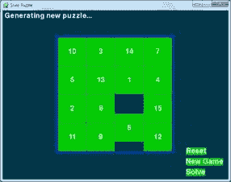
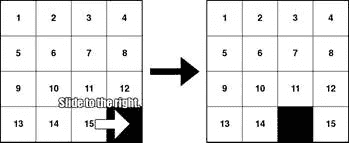
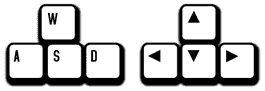
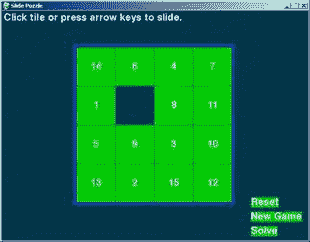
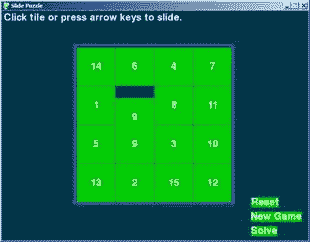

# 第四章：滑动拼图

> 原文：[`inventwithpython.com/pygame/chapter4.html`](https://inventwithpython.com/pygame/chapter4.html)
> 
> 译者：[飞龙](https://github.com/wizardforcel)
> 
> 协议：[CC BY-NC-SA 4.0](https://creativecommons.org/licenses/by-nc-sa/4.0/)



## 如何玩滑动拼图

棋盘是一个 4x4 的网格，有 15 个方块（从左到右编号为 1 到 15）和一个空白格。方块最初以随机位置开始，玩家必须将方块滑动到它们的原始顺序。

## 滑动拼图的源代码

此源代码可从[`invpy.com/slidepuzzle.py`](http://invpy.com/slidepuzzle.py)下载。如果出现任何错误消息，请查看错误消息中提到的行号，并检查代码中是否有任何拼写错误。您还可以将代码复制粘贴到[`invpy.com/diff/slidepuzzle`](http://invpy.com/diff/slidepuzzle)的网络表单中，以查看您的代码与书中代码之间的差异。

```py
# Slide Puzzle
# By Al Sweigart [[email protected]](/cdn-cgi/l/email-protection)
# http://inventwithpython.com/pygame
# Creative Commons BY-NC-SA 3.0 US

import pygame, sys, random
from pygame.locals import *

# Create the constants (go ahead and experiment with different values)
BOARDWIDTH = 4  # number of columns in the board
BOARDHEIGHT = 4 # number of rows in the board
TILESIZE = 80
WINDOWWIDTH = 640
WINDOWHEIGHT = 480
FPS = 30
BLANK = None

#                 R    G    B
BLACK =         (  0,   0,   0)
WHITE =         (255, 255, 255)
BRIGHTBLUE =    (  0,  50, 255)
DARKTURQUOISE = (  3,  54,  73)
GREEN =         (  0, 204,   0)

BGCOLOR = DARKTURQUOISE
TILECOLOR = GREEN
TEXTCOLOR = WHITE
BORDERCOLOR = BRIGHTBLUE
BASICFONTSIZE = 20

BUTTONCOLOR = WHITE
BUTTONTEXTCOLOR = BLACK
MESSAGECOLOR = WHITE

XMARGIN = int((WINDOWWIDTH - (TILESIZE * BOARDWIDTH + (BOARDWIDTH - 1))) / 2)
YMARGIN = int((WINDOWHEIGHT - (TILESIZE * BOARDHEIGHT + (BOARDHEIGHT - 1))) / 2)

UP = 'up'
DOWN = 'down'
LEFT = 'left'
RIGHT = 'right'

def main():
    global FPSCLOCK, DISPLAYSURF, BASICFONT, RESET_SURF, RESET_RECT, NEW_SURF, NEW_RECT, SOLVE_SURF, SOLVE_RECT

    pygame.init()
    FPSCLOCK = pygame.time.Clock()
    DISPLAYSURF = pygame.display.set_mode((WINDOWWIDTH, WINDOWHEIGHT))
    pygame.display.set_caption('Slide Puzzle')
    BASICFONT = pygame.font.Font('freesansbold.ttf', BASICFONTSIZE)

    # Store the option buttons and their rectangles in OPTIONS.
    RESET_SURF, RESET_RECT = makeText('Reset',    TEXTCOLOR, TILECOLOR, WINDOWWIDTH - 120, WINDOWHEIGHT - 90)
    NEW_SURF, NEW_RECT   = makeText('New Game', TEXTCOLOR, TILECOLOR, WINDOWWIDTH - 120, WINDOWHEIGHT - 60)

    SOLVE_SURF, SOLVE_RECT = makeText('Solve',    TEXTCOLOR, TILECOLOR, WINDOWWIDTH - 120, WINDOWHEIGHT - 30)

    mainBoard, solutionSeq = generateNewPuzzle(80)
    SOLVEDBOARD = getStartingBoard() # a solved board is the same as the board in a start state.
    allMoves = [] # list of moves made from the solved configuration

    while True: # main game loop
        slideTo = None # the direction, if any, a tile should slide
        msg = '' # contains the message to show in the upper left corner.
        if mainBoard == SOLVEDBOARD:
            msg = 'Solved!'

        drawBoard(mainBoard, msg)

        checkForQuit()
        for event in pygame.event.get(): # event handling loop
            if event.type == MOUSEBUTTONUP:
                spotx, spoty = getSpotClicked(mainBoard, event.pos[0], event.pos[1])

                if (spotx, spoty) == (None, None):
                    # check if the user clicked on an option button
                    if RESET_RECT.collidepoint(event.pos):
                        resetAnimation(mainBoard, allMoves) # clicked on Reset button
                        allMoves = []
                    elif NEW_RECT.collidepoint(event.pos):
                        mainBoard, solutionSeq = generateNewPuzzle(80) # clicked on New Game button
                        allMoves = []
                    elif SOLVE_RECT.collidepoint(event.pos):
                        resetAnimation(mainBoard, solutionSeq + allMoves) # clicked on Solve button
                        allMoves = []
                else:
                    # check if the clicked tile was next to the blank spot

                    blankx, blanky = getBlankPosition(mainBoard)
                    if spotx == blankx + 1 and spoty == blanky:
                        slideTo = LEFT
                    elif spotx == blankx - 1 and spoty == blanky:
                        slideTo = RIGHT
                    elif spotx == blankx and spoty == blanky + 1:
                        slideTo = UP
                    elif spotx == blankx and spoty == blanky - 1:
                        slideTo = DOWN

            elif event.type == KEYUP:
                # check if the user pressed a key to slide a tile
                if event.key in (K_LEFT, K_a) and isValidMove(mainBoard, LEFT):
                    slideTo = LEFT
                elif event.key in (K_RIGHT, K_d) and isValidMove(mainBoard, RIGHT):
                    slideTo = RIGHT
                elif event.key in (K_UP, K_w) and isValidMove(mainBoard, UP):
                    slideTo = UP
                elif event.key in (K_DOWN, K_s) and isValidMove(mainBoard, DOWN):
                    slideTo = DOWN

        if slideTo:
            slideAnimation(mainBoard, slideTo, 'Click tile or press arrow keys to slide.', 8) # show slide on screen
            makeMove(mainBoard, slideTo)
            allMoves.append(slideTo) # record the slide
        pygame.display.update()
        FPSCLOCK.tick(FPS)

def terminate():
    pygame.quit()
    sys.exit()

def checkForQuit():
    for event in pygame.event.get(QUIT): # get all the QUIT events
        terminate() # terminate if any QUIT events are present
    for event in pygame.event.get(KEYUP): # get all the KEYUP events
        if event.key == K_ESCAPE:
            terminate() # terminate if the KEYUP event was for the Esc key
        pygame.event.post(event) # put the other KEYUP event objects back

def getStartingBoard():
    # Return a board data structure with tiles in the solved state.
    # For example, if BOARDWIDTH and BOARDHEIGHT are both 3, this function
    # returns [[1, 4, 7], [2, 5, 8], [3, 6, None]]
    counter = 1
    board = []
    for x in range(BOARDWIDTH):
        column = []
        for y in range(BOARDHEIGHT):
            column.append(counter)
            counter += BOARDWIDTH
        board.append(column)
        counter -= BOARDWIDTH * (BOARDHEIGHT - 1) + BOARDWIDTH - 1

    board[BOARDWIDTH-1][BOARDHEIGHT-1] = None
    return board

def getBlankPosition(board):
    # Return the x and y of board coordinates of the blank space.
    for x in range(BOARDWIDTH):
        for y in range(BOARDHEIGHT):
            if board[x][y] == None:
                return (x, y)

def makeMove(board, move):
    # This function does not check if the move is valid.
    blankx, blanky = getBlankPosition(board)

    if move == UP:
        board[blankx][blanky], board[blankx][blanky + 1] = board[blankx][blanky + 1], board[blankx][blanky]
    elif move == DOWN:
        board[blankx][blanky], board[blankx][blanky - 1] = board[blankx][blanky - 1], board[blankx][blanky]
    elif move == LEFT:
        board[blankx][blanky], board[blankx + 1][blanky] = board[blankx + 1][blanky], board[blankx][blanky]
    elif move == RIGHT:
        board[blankx][blanky], board[blankx - 1][blanky] = board[blankx - 1][blanky], board[blankx][blanky]

def isValidMove(board, move):
    blankx, blanky = getBlankPosition(board)
    return (move == UP and blanky != len(board[0]) - 1) or \
           (move == DOWN and blanky != 0) or \
           (move == LEFT and blankx != len(board) - 1) or \
           (move == RIGHT and blankx != 0)

def getRandomMove(board, lastMove=None):
    # start with a full list of all four moves
    validMoves = [UP, DOWN, LEFT, RIGHT]

    # remove moves from the list as they are disqualified
    if lastMove == UP or not isValidMove(board, DOWN):
        validMoves.remove(DOWN)
    if lastMove == DOWN or not isValidMove(board, UP):
        validMoves.remove(UP)
    if lastMove == LEFT or not isValidMove(board, RIGHT):
        validMoves.remove(RIGHT)
    if lastMove == RIGHT or not isValidMove(board, LEFT):
        validMoves.remove(LEFT)

    # return a random move from the list of remaining moves
    return random.choice(validMoves)

def getLeftTopOfTile(tileX, tileY):
    left = XMARGIN + (tileX * TILESIZE) + (tileX - 1)
    top = YMARGIN + (tileY * TILESIZE) + (tileY - 1)
    return (left, top)

def getSpotClicked(board, x, y):
    # from the x & y pixel coordinates, get the x & y board coordinates
    for tileX in range(len(board)):
        for tileY in range(len(board[0])):
            left, top = getLeftTopOfTile(tileX, tileY)
            tileRect = pygame.Rect(left, top, TILESIZE, TILESIZE)
            if tileRect.collidepoint(x, y):
                return (tileX, tileY)
    return (None, None)

def drawTile(tilex, tiley, number, adjx=0, adjy=0):
    # draw a tile at board coordinates tilex and tiley, optionally a few
    # pixels over (determined by adjx and adjy)
    left, top = getLeftTopOfTile(tilex, tiley)
    pygame.draw.rect(DISPLAYSURF, TILECOLOR, (left + adjx, top + adjy, TILESIZE, TILESIZE))
    textSurf = BASICFONT.render(str(number), True, TEXTCOLOR)
    textRect = textSurf.get_rect()
    textRect.center = left + int(TILESIZE / 2) + adjx, top + int(TILESIZE / 2) + adjy
    DISPLAYSURF.blit(textSurf, textRect)

def makeText(text, color, bgcolor, top, left):
    # create the Surface and Rect objects for some text.
    textSurf = BASICFONT.render(text, True, color, bgcolor)
    textRect = textSurf.get_rect()
    textRect.topleft = (top, left)
    return (textSurf, textRect)

def drawBoard(board, message):
    DISPLAYSURF.fill(BGCOLOR)
    if message:
        textSurf, textRect = makeText(message, MESSAGECOLOR, BGCOLOR, 5, 5)
        DISPLAYSURF.blit(textSurf, textRect)

    for tilex in range(len(board)):
        for tiley in range(len(board[0])):
            if board[tilex][tiley]:
                drawTile(tilex, tiley, board[tilex][tiley])

    left, top = getLeftTopOfTile(0, 0)
    width = BOARDWIDTH * TILESIZE
    height = BOARDHEIGHT * TILESIZE
    pygame.draw.rect(DISPLAYSURF, BORDERCOLOR, (left - 5, top - 5, width + 11, height + 11), 4)

    DISPLAYSURF.blit(RESET_SURF, RESET_RECT)
    DISPLAYSURF.blit(NEW_SURF, NEW_RECT)
    DISPLAYSURF.blit(SOLVE_SURF, SOLVE_RECT)

def slideAnimation(board, direction, message, animationSpeed):
    # Note: This function does not check if the move is valid.

    blankx, blanky = getBlankPosition(board)
    if direction == UP:
        movex = blankx
        movey = blanky + 1
    elif direction == DOWN:
        movex = blankx
        movey = blanky - 1
    elif direction == LEFT:
        movex = blankx + 1
        movey = blanky
    elif direction == RIGHT:
        movex = blankx - 1
        movey = blanky

    # prepare the base surface
    drawBoard(board, message)
    baseSurf = DISPLAYSURF.copy()
    # draw a blank space over the moving tile on the baseSurf Surface.
    moveLeft, moveTop = getLeftTopOfTile(movex, movey)
    pygame.draw.rect(baseSurf, BGCOLOR, (moveLeft, moveTop, TILESIZE, TILESIZE))

    for i in range(0, TILESIZE, animationSpeed):
        # animate the tile sliding over
        checkForQuit()
        DISPLAYSURF.blit(baseSurf, (0, 0))
        if direction == UP:
            drawTile(movex, movey, board[movex][movey], 0, -i)
        if direction == DOWN:
            drawTile(movex, movey, board[movex][movey], 0, i)
        if direction == LEFT:
            drawTile(movex, movey, board[movex][movey], -i, 0)
        if direction == RIGHT:
            drawTile(movex, movey, board[movex][movey], i, 0)

        pygame.display.update()
        FPSCLOCK.tick(FPS)

def generateNewPuzzle(numSlides):
    # From a starting configuration, make numSlides number of moves (and
    # animate these moves).
    sequence = []
    board = getStartingBoard()
    drawBoard(board, '')
    pygame.display.update()
    pygame.time.wait(500) # pause 500 milliseconds for effect
    lastMove = None
    for i in range(numSlides):
        move = getRandomMove(board, lastMove)
        slideAnimation(board, move, 'Generating new puzzle...', int(TILESIZE / 3))
        makeMove(board, move)
        sequence.append(move)
        lastMove = move
    return (board, sequence)

def resetAnimation(board, allMoves):
    # make all of the moves in allMoves in reverse.
    revAllMoves = allMoves[:] # gets a copy of the list
    revAllMoves.reverse()

    for move in revAllMoves:
        if move == UP:
            oppositeMove = DOWN
        elif move == DOWN:
            oppositeMove = UP
        elif move == RIGHT:
            oppositeMove = LEFT
        elif move == LEFT:
            oppositeMove = RIGHT
        slideAnimation(board, oppositeMove, '', int(TILESIZE / 2))
        makeMove(board, oppositeMove)

if __name__ == '__main__':
    main()

```

## 第二节，与第一节相同

贪吃虫中的大部分代码与我们之前看过的游戏非常相似，特别是在代码开头设置常量的部分。

```py
# Slide Puzzle
# By Al Sweigart [[email protected]](/cdn-cgi/l/email-protection)
# http://inventwithpython.com/pygame
# Creative Commons BY-NC-SA 3.0 US

import pygame, sys, random
from pygame.locals import *

# Create the constants (go ahead and experiment with different values)
BOARDWIDTH = 4  # number of columns in the board
BOARDHEIGHT = 4 # number of rows in the board
TILESIZE = 80
WINDOWWIDTH = 640
WINDOWHEIGHT = 480
FPS = 30
BLANK = None

#                 R    G    B
BLACK =         (  0,   0,   0)
WHITE =         (255, 255, 255)
BRIGHTBLUE =    (  0,  50, 255)
DARKTURQUOISE = (  3,  54,  73)
GREEN =         (  0, 204,   0)

BGCOLOR = DARKTURQUOISE
TILECOLOR = GREEN
TEXTCOLOR = WHITE
BORDERCOLOR = BRIGHTBLUE
BASICFONTSIZE = 20

BUTTONCOLOR = WHITE
BUTTONTEXTCOLOR = BLACK
MESSAGECOLOR = WHITE

XMARGIN = int((WINDOWWIDTH - (TILESIZE * BOARDWIDTH + (BOARDWIDTH - 1))) / 2)
YMARGIN = int((WINDOWHEIGHT - (TILESIZE * BOARDHEIGHT + (BOARDHEIGHT - 1))) / 2)

UP = 'up'
DOWN = 'down'
LEFT = 'left'
RIGHT = 'right'

```

程序顶部的这段代码只是处理了所有基本模块的导入和创建常量。这就像上一章的记忆拼图游戏的开头一样。

## 设置按钮

```py
def main():
    global FPSCLOCK, DISPLAYSURF, BASICFONT, RESET_SURF, RESET_RECT, NEW_SURF, NEW_RECT, SOLVE_SURF, SOLVE_RECT

    pygame.init()
    FPSCLOCK = pygame.time.Clock()
    DISPLAYSURF = pygame.display.set_mode((WINDOWWIDTH, WINDOWHEIGHT))
    pygame.display.set_caption('Slide Puzzle')
    BASICFONT = pygame.font.Font('freesansbold.ttf', BASICFONTSIZE)

    # Store the option buttons and their rectangles in OPTIONS.
    RESET_SURF, RESET_RECT = makeText('Reset',    TEXTCOLOR, TILECOLOR, WINDOWWIDTH - 120, WINDOWHEIGHT - 90)
    NEW_SURF, NEW_RECT   = makeText('New Game', TEXTCOLOR, TILECOLOR, WINDOWWIDTH - 120, WINDOWHEIGHT - 60)
    SOLVE_SURF, SOLVE_RECT = makeText('Solve',    TEXTCOLOR, TILECOLOR, WINDOWWIDTH - 120, WINDOWHEIGHT - 30)

    mainBoard, solutionSeq = generateNewPuzzle(80)
    SOLVEDBOARD = getStartingBoard() # a solved board is the same as the board in a start state.

```

就像上一章一样，从 `main()` 函数调用的函数将在本章后面解释。现在，你只需要知道它们做什么以及它们返回什么值。你不需要知道它们是如何工作的。

`main()` 函数的第一部分将处理创建窗口、时钟对象和字体对象。`makeText()` 函数在程序的后面定义，但现在你只需要知道它返回一个 `pygame.Surface` 对象和一个 `pygame.Rect` 对象，可以用来制作可点击的按钮。滑动拼图游戏将有三个按钮：一个“重置”按钮，可以撤消玩家所做的任何移动，一个“新建”按钮，可以创建一个新的滑动拼图，以及一个“解决”按钮，可以为玩家解决拼图。

对于这个程序，我们将需要两个棋盘数据结构。一个棋盘将表示当前的游戏状态。另一个棋盘将使其方块处于“解决”状态，这意味着所有方块都按顺序排列。当当前游戏状态的棋盘与解决的棋盘完全相同时，我们就知道玩家赢了。（我们永远不会改变第二个棋盘。它只是用来比较当前游戏状态棋盘的。）

`generateNewPuzzle()` 将创建一个棋盘数据结构，它最初处于有序的解决状态，然后对其进行了 80 次随机滑动（因为我们向其传递了整数 `80`）。如果我们希望棋盘更加混乱，那么我们可以向其传递一个更大的整数。这将使棋盘变成一个随机混乱的状态，玩家将不得不解决它（这将存储在一个名为 `mainBoard` 的变量中）。`generateNewBoard()` 还返回了在其上执行的所有随机移动的列表（这将存储在一个名为 `solutionSeq` 的变量中）。

## 通过使用愚蠢的代码变得聪明

```py
    allMoves = [] # list of moves made from the solved configuration

```

解决滑动拼图可能会非常棘手。我们可以让计算机来做，但这需要我们找出一个可以解决滑动拼图的算法。这将非常困难，并且需要大量的聪明和努力来将其放入这个程序中。

幸运的是，有一个更简单的方法。我们可以让计算机记住创建棋盘数据结构时所做的所有随机滑动，然后通过执行相反的滑动来解决棋盘。由于棋盘最初是处于解决状态的，撤消所有滑动将使其返回到解决状态。

例如，下面我们在页面左侧的棋盘上执行了一个“向右”滑动，这将使棋盘处于页面右侧的状态：



在正确的滑动之后，如果我们进行相反的滑动（向左滑动），那么板将恢复到原始状态。因此，要在进行几次滑动后恢复到原始状态，我们只需按相反的顺序进行相反的滑动。如果我们进行了右滑动，然后又进行了右滑动，然后进行了下滑动，我们将不得不进行上滑动、左滑动和左滑动来撤消这前三次滑动。这比编写一个可以简单地查看它们的当前状态来解决这些谜题的函数要容易得多。

## 主游戏循环

```py
    while True: # main game loop
        slideTo = None # the direction, if any, a tile should slide
        msg = '' # contains the message to show in the upper left corner.
        if mainBoard == SOLVEDBOARD:
            msg = 'Solved!'

        drawBoard(mainBoard, msg)

```

在主游戏循环中，`slideTo`变量将跟踪玩家想要滑动瓷砖的方向（在游戏循环的开始时它开始为`None`，稍后设置），`msg`变量跟踪在窗口顶部显示的字符串。程序在第 64 行进行快速检查，看看板数据结构是否与存储在`SOLVEDBOARD`中的解决板数据结构具有相同的值。如果是，则`msg`变量更改为字符串`'已解决！'`。这将不会出现在屏幕上，直到调用`drawBoard()`将其绘制到`DISPLAYSURF` Surface 对象（在第 67 行执行）并调用`pygame.display.update()`将显示 Surface 对象绘制到实际计算机屏幕上（在游戏循环结束时的第 291 行执行）。

## 点击按钮

```py
        checkForQuit()
        for event in pygame.event.get(): # event handling loop
            if event.type == MOUSEBUTTONUP:
                spotx, spoty = getSpotClicked(mainBoard, event.pos[0], event.pos[1])

                if (spotx, spoty) == (None, None):
                    # check if the user clicked on an option button
                    if RESET_RECT.collidepoint(event.pos):
                        resetAnimation(mainBoard, allMoves) # clicked on Reset button
                        allMoves = []
                    elif NEW_RECT.collidepoint(event.pos):
                        mainBoard, solutionSeq = generateNewPuzzle(80) # clicked on New Game button
                        allMoves = []
                    elif SOLVE_RECT.collidepoint(event.pos):
                        resetAnimation(mainBoard, solutionSeq + allMoves) # clicked on Solve button
                        allMoves = []

```

在进入事件循环之前，程序在第 69 行调用`checkForQuit()`来查看是否已创建任何`QUIT`事件（如果有，则终止程序）。为什么我们有一个单独的函数（`checkForQuit()`函数）来处理`QUIT`事件将在后面解释。第 70 行的`for`循环执行自上次调用`pygame.event.get()`以来创建的任何其他事件的事件处理代码（或者自程序启动以来，如果以前从未调用过`pygame.event.get()`）。

如果事件类型是`MOUSEBUTTONUP`事件（即玩家在窗口的某个地方释放了鼠标按钮），那么我们将鼠标坐标传递给我们的`getSpotClicked()`函数，该函数将返回鼠标释放发生的板上位置的坐标。`event.pos[0]`是 X 坐标，`event.pos[1]`是 Y 坐标。

如果鼠标释放按钮没有发生在板上的空格之一上（但显然仍然发生在窗口的某个地方，因为创建了`MOUSEBUTTONUP`事件），那么`getSpotClicked()`将返回`None`。如果是这种情况，我们希望进行额外的检查，看看玩家是否可能点击了重置、新建或解决按钮（这些按钮不位于板上）。

这些按钮在窗口上的坐标存储在`RESET_RECT`、`NEW_RECT`和`SOLVE_RECT`变量中存储的`pygame.Rect`对象中。我们可以将事件对象的鼠标坐标传递给`collidepoint()`方法。如果鼠标坐标在 Rect 对象的区域内，则此方法将返回`True`，否则返回`False`。

## 用鼠标滑动瓷砖

```py
                else:
                    # check if the clicked tile was next to the blank spot

                    blankx, blanky = getBlankPosition(mainBoard)
                    if spotx == blankx + 1 and spoty == blanky:
                        slideTo = LEFT
                    elif spotx == blankx - 1 and spoty == blanky:
                        slideTo = RIGHT
                    elif spotx == blankx and spoty == blanky + 1:
                        slideTo = UP
                    elif spotx == blankx and spoty == blanky - 1:
                        slideTo = DOWN

```

如果`getSpotClicked()`没有返回`(None, None)`，那么它将返回一个包含两个整数值的元组，表示点击的板上的位置的 X 和 Y 坐标。然后，第 89 到 96 行的`if`和`elif`语句检查被点击的位置是否是靠近空白位置的瓷砖（否则瓷砖将没有地方滑动）。

我们的`getBlankPosition()`函数将采取板数据结构并返回空白位置的 X 和 Y 板坐标，我们将其存储在变量`blankx`和`blanky`中。如果用户点击的位置在空白处旁边，我们将使用应该滑动的值设置`slideTo`变量。

## 用键盘滑动瓷砖

```py
            elif event.type == KEYUP:
                # check if the user pressed a key to slide a tile
                if event.key in (K_LEFT, K_a) and isValidMove(mainBoard, LEFT):
                    slideTo = LEFT
                elif event.key in (K_RIGHT, K_d) and isValidMove(mainBoard, RIGHT):
                    slideTo = RIGHT
                elif event.key in (K_UP, K_w) and isValidMove(mainBoard, UP):
                    slideTo = UP
                elif event.key in (K_DOWN, K_s) and isValidMove(mainBoard, DOWN):
                    slideTo = DOWN

```

我们还可以让用户通过按键盘键来滑动瓷砖。第 100 至 107 行的`if`和`elif`语句允许用户通过按箭头键或 WASD 键（稍后解释）来设置`slideTo`变量。每个`if`和`elif`语句还都调用了`isValidMove()`来确保瓷砖可以朝那个方向滑动。（我们在鼠标点击时不必进行这个调用，因为对于相邻的空白空间的检查也会做同样的事情。）

## “等于多个值中的一个”技巧与`in`运算符

表达式`event.key in (K_LEFT, K_a)`只是 Python 中的一个技巧，使代码更简单。这是一种说“如果`event.key`等于`K_LEFT`或`K_a`中的一个，则评估为`True`”。以下两个表达式将以相同的方式进行评估：

```py
event.key in (K_LEFT, K_a)

event.key == K_LEFT or event.key == K_a

```

当你需要检查一个值是否等于多个值中的一个时，使用这个技巧可以节省一些空间。以下两个表达式将以相同的方式进行评估：

```py
spam == 'dog' or spam == 'cat' or spam == 'mouse' or spam == 'horse' or spam == 42 or spam == 'dingo'

spam in ('dog', 'cat', 'mouse', 'horse', 42, 'dingo')

```

## WASD 和箭头键

W、A、S 和 D 键（合称 WASD 键，发音为“waz-dee”）在电脑游戏中通常用来做与箭头键相同的事情，只不过玩家可以使用左手（因为 WASD 键在键盘的左侧）。W 代表上，A 代表左，S 代表下，D 代表右。你可以很容易地记住这一点，因为 WASD 键的布局与箭头键相同：



## 实际执行瓷砖滑动

```py
        if slideTo:
            slideAnimation(mainBoard, slideTo, 'Click tile or press arrow keys to slide.', 8) # show slide on screen
            makeMove(mainBoard, slideTo)
            allMoves.append(slideTo) # record the slide
        pygame.display.update()
        FPSCLOCK.tick(FPS)

```

现在所有事件都已处理完毕，我们应该更新游戏状态的变量，并在屏幕上显示新状态。如果`slideTo`已经设置（无论是由鼠标事件还是键盘事件处理代码），我们都可以调用`slideAnimation()`来执行滑动动画。参数是棋盘数据结构、滑动的方向、在滑动瓷砖时显示的消息以及滑动的速度。

在它返回后，我们需要更新实际的棋盘数据结构（由`makeMove()`函数完成），然后将滑动添加到迄今为止所有滑动的`allMoves`列表中。这样，如果玩家点击“重置”按钮，我们就知道如何撤消玩家的所有滑动。

## IDLE 和终止 Pygame 程序

```py
def terminate():
    pygame.quit()
    sys.exit()

```

这是一个我们可以调用的函数，它同时调用了`pygame.quit()`和`sys.exit()`函数。这是一种语法糖，这样我们就不必记住调用这两个函数，只需要调用一个函数即可。

## 检查特定事件，并将事件发布到 Pygame 的事件队列

```py
def checkForQuit():
    for event in pygame.event.get(QUIT): # get all the QUIT events
        terminate() # terminate if any QUIT events are present
    for event in pygame.event.get(KEYUP): # get all the KEYUP events
        if event.key == K_ESCAPE:
            terminate() # terminate if the KEYUP event was for the Esc key
        pygame.event.post(event) # put the other KEYUP event objects back

```

`checkForQuit()`函数将检查`QUIT`事件（或用户是否按下了 Esc 键），然后调用`terminate()`函数。但这有点棘手，需要一些解释。

Pygame 内部有自己的列表数据结构，它会在创建 Event 对象时将其附加到其中。这个数据结构称为事件队列。当调用`pygame.event.get()`函数而不带参数时，整个列表将被返回。但是，你可以传递一个常量，比如`QUIT`给`pygame.event.get()`，这样它就只会返回内部事件队列中的`QUIT`事件（如果有的话）。其余的事件将保留在事件队列中，以便下次调用`pygame.event.get()`时使用。

你应该注意，Pygame 的事件队列只能存储最多 127 个 Event 对象。如果你的程序不经常调用`pygame.event.get()`，并且队列填满了，那么发生的任何新事件都不会被添加到事件队列中。

第 123 行从 Pygame 的事件队列中提取了一个`QUIT`事件列表并返回它们。如果事件队列中有任何`QUIT`事件，程序将终止。

第 125 行从事件队列中提取所有`KEYUP`事件，并检查它们是否是 Esc 键。如果其中一个事件是，那么程序将终止。但是，除了 Esc 键之外，可能还有其他键的`KEYUP`事件。在这种情况下，我们需要将`KEYUP`事件放回 Pygame 的事件队列中。我们可以使用`pygame.event.post()`函数来实现这一点，该函数将传递给它的 Event 对象添加到 Pygame 事件队列的末尾。这样，当第 70 行调用`pygame.event.get()`时，非 Esc 键的`KEYUP`事件仍将存在。否则，对`checkForQuit()`的调用将“消耗”所有的`KEYUP`事件，这些事件将永远不会被处理。

`pygame.event.post()`函数也很方便，如果您希望程序将 Event 对象添加到 Pygame 事件队列中。

## 创建棋盘数据结构

```py
def getStartingBoard():
    # Return a board data structure with tiles in the solved state.
    # For example, if BOARDWIDTH and BOARDHEIGHT are both 3, this function
    # returns [[1, 4, 7], [2, 5, 8], [3, 6, None]]
    counter = 1
    board = []
    for x in range(BOARDWIDTH):
        column = []
        for y in range(BOARDHEIGHT):
            column.append(counter)
            counter += BOARDWIDTH
        board.append(column)
        counter -= BOARDWIDTH * (BOARDHEIGHT - 1) + BOARDWIDTH - 1

    board[BOARDWIDTH-1][BOARDHEIGHT-1] = None
    return board

```

`getStartingBoard()`数据结构将创建并返回一个表示“已解决”棋盘的数据结构，其中所有编号的瓷砖都是有序的，空白瓷砖位于右下角。这与内存拼图游戏中的棋盘数据结构一样，都是使用嵌套的`for`循环完成的。

但是，请注意，第一列不会是`[1, 2, 3]`，而是`[1, 4, 7]`。这是因为瓷砖上的数字是横向增加 1，而不是纵向增加。沿着列向下，数字按照棋盘宽度的大小增加（存储在`BOARDWIDTH`常量中）。我们将使用`counter`变量来跟踪应放在下一个瓷砖上的数字。当列中的瓷砖编号完成时，我们需要将`counter`设置为下一列开始的数字。

## 不跟踪空白位置

```py
def getBlankPosition(board):
    # Return the x and y of board coordinates of the blank space.
    for x in range(BOARDWIDTH):
        for y in range(BOARDHEIGHT):
            if board[x][y] == None:
                return (x, y)

```

每当我们的代码需要找到空白空间的 XY 坐标时，我们可以创建一个函数，通过遍历整个棋盘来找到空白空间的坐标，而不是在每次滑动后跟踪空白空间的位置。`None`值在棋盘数据结构中用于表示空白空间。`getBlankPosition()`中的代码简单地使用嵌套的`for`循环来找到棋盘上的空白空间。

## 通过更新棋盘数据结构进行移动

```py
def makeMove(board, move):
    # This function does not check if the move is valid.
    blankx, blanky = getBlankPosition(board)

    if move == UP:
        board[blankx][blanky], board[blankx][blanky + 1] = board[blankx][blanky + 1], board[blankx][blanky]
    elif move == DOWN:
        board[blankx][blanky], board[blankx][blanky - 1] = board[blankx][blanky - 1], board[blankx][blanky]
    elif move == LEFT:
        board[blankx][blanky], board[blankx + 1][blanky] = board[blankx + 1][blanky], board[blankx][blanky]
    elif move == RIGHT:
        board[blankx][blanky], board[blankx - 1][blanky] = board[blankx - 1][blanky], board[blankx][blanky]

```

`board`参数中的数据结构是一个表示所有瓷砖位置的二维列表。每当玩家进行移动时，程序都需要更新此数据结构。发生的情况是，瓷砖的值与空白空间的值交换。

`makeMove()`函数不必返回任何值，因为`board`参数是作为其参数传递的列表引用。这意味着我们在此函数中对`board`所做的任何更改都将应用于传递给`makeMove()`的列表值。（您可以在[`invpy.com/references`](http://invpy.com/references)上查看引用的概念。）

## 何时不使用断言

```py
def isValidMove(board, move):
    blankx, blanky = getBlankPosition(board)
    return (move == UP and blanky != len(board[0]) - 1) or \
           (move == DOWN and blanky != 0) or \
           (move == LEFT and blankx != len(board) - 1) or \
           (move == RIGHT and blankx != 0)

```

`isValidMove()`函数接收一个棋盘数据结构和玩家想要进行的移动。如果移动是可能的，则返回值为`True`，如果不可能，则返回值为`False`。例如，您不能连续一百次将瓷砖向左滑动，因为最终空白空间将位于边缘，没有更多的瓷砖可以向左滑动。

移动是否有效取决于空白空间的位置。此函数调用`getBlankPosition()`来找到空白位置的 X 和 Y 坐标。第 173 至 176 行是一个带有单个表达式的`return`语句。在前三行的末尾的`\`斜杠告诉 Python 解释器这不是代码行的结尾（即使它在行的末尾）。这将使我们能够将“代码行”分成多行以使其看起来漂亮，而不是只有一行非常长且难以阅读。

因为括号中的这个表达式是由或运算符连接的，只需要其中一个为`True`整个表达式就为`True`。每个部分都检查预期的移动是什么，然后看空白空间的坐标是否允许该移动。

## 获取一个不那么随机的移动

```py
def getRandomMove(board, lastMove=None):
    # start with a full list of all four moves
    validMoves = [UP, DOWN, LEFT, RIGHT]

    # remove moves from the list as they are disqualified
    if lastMove == UP or not isValidMove(board, DOWN):
        validMoves.remove(DOWN)
    if lastMove == DOWN or not isValidMove(board, UP):
        validMoves.remove(UP)
    if lastMove == LEFT or not isValidMove(board, RIGHT):
        validMoves.remove(RIGHT)
    if lastMove == RIGHT or not isValidMove(board, LEFT):
        validMoves.remove(LEFT)

    # return a random move from the list of remaining moves
    return random.choice(validMoves)

```

在游戏开始时，我们从解决的、有序的状态开始，通过随机滑动瓷砖来创建拼图。为了决定我们应该滑动哪个方向，我们将调用我们的`getRandomMove()`函数。通常我们可以使用`random.choice()`函数，并传递一个元组`(UP, DOWN, LEFT, RIGHT)`，让 Python 简单地随机选择一个方向值。但是滑动拼图游戏有一个小限制，阻止我们选择纯随机数。

如果你有一个滑动拼图，将一个瓷砖向左滑动，然后将一个瓷砖向右滑动，你最终会得到与开始时完全相同的棋盘。进行相反的滑动是毫无意义的。此外，如果空白空间位于右下角，那么不可能将瓷砖向上或向左滑动。

`getRandomMove()`中的代码将考虑这些因素。为了防止函数选择上次移动的值，函数的调用者可以为`lastMove`参数传递一个方向值。第 181 行从存储在`validMoves`变量中的所有四个方向值的列表开始。如果`lastMove`值（如果未设置为`None`）则从`validMoves`中删除。根据空白空间是否在棋盘的边缘，第 184 到 191 行将从`lastMove`列表中删除其他方向值。

在`lastMove`中剩下的值中，使用`random.choice()`随机选择一个值并返回。

## 将瓷砖坐标转换为像素坐标

```py
def getLeftTopOfTile(tileX, tileY):
    left = XMARGIN + (tileX * TILESIZE) + (tileX - 1)
    top = YMARGIN + (tileY * TILESIZE) + (tileY - 1)
    return (left, top)

```

`getLeftTopOfTile()`函数将棋盘坐标转换为像素坐标。对于传入的棋盘 XY 坐标，该函数计算并返回该棋盘空间左上角的像素 XY 坐标。

## 从像素坐标转换为棋盘坐标

```py
def getSpotClicked(board, x, y):
    # from the x & y pixel coordinates, get the x & y board coordinates
    for tileX in range(len(board)):
        for tileY in range(len(board[0])):
            left, top = getLeftTopOfTile(tileX, tileY)
            tileRect = pygame.Rect(left, top, TILESIZE, TILESIZE)
            if tileRect.collidepoint(x, y):
                return (tileX, tileY)
    return (None, None)

```

`getSpotClicked()`函数与`getLeftTopOfTile()`相反，它将像素坐标转换为棋盘坐标。第 205 和 206 行的嵌套循环遍历了每个可能的 XY 棋盘坐标，如果传入的像素坐标在棋盘上的空间内，则返回这些棋盘坐标。由于所有的瓷砖都有在`TILESIZE`常量中设置的宽度和高度，我们可以创建一个表示棋盘空间的 Rect 对象，方法是获取棋盘空间左上角的像素坐标，然后使用`collidepoint()` Rect 方法来查看像素坐标是否在该 Rect 对象的区域内。

如果传入的像素坐标不在任何棋盘空间上，则返回值为`(None, None)`。

## 绘制瓷砖

```py
def drawTile(tilex, tiley, number, adjx=0, adjy=0):
    # draw a tile at board coordinates tilex and tiley, optionally a few
    # pixels over (determined by adjx and adjy)
    left, top = getLeftTopOfTile(tilex, tiley)
    pygame.draw.rect(DISPLAYSURF, TILECOLOR, (left + adjx, top + adjy, TILESIZE, TILESIZE))
    textSurf = BASICFONT.render(str(number), True, TEXTCOLOR)
    textRect = textSurf.get_rect()
    textRect.center = left + int(TILESIZE / 2) + adjx, top + int(TILESIZE / 2) + adjy
    DISPLAYSURF.blit(textSurf, textRect)

```

`drawTile()`函数将在棋盘上绘制一个带编号的瓷砖。`tilex`和`tiley`参数是瓷砖的棋盘坐标。数字参数是瓷砖编号的字符串（如`'3'`或`'12'`）。`adjx`和`adjy`关键字参数用于对瓷砖位置进行微小调整。例如，将`5`传递给`adjx`会使瓷砖出现在棋盘上`tilex`和`tiley`空间的右侧 5 像素处。将`-10`传递给`adjx`会使瓷砖出现在空间的左侧 10 像素处。

当我们需要在滑动中间绘制瓷砖时，这些调整值将非常方便。如果在调用`drawTile()`时没有传递这些参数的值，则默认设置为`0`。这意味着它们将正好在由`tilex`和`tiley`给出的棋盘空间上。

Pygame 绘图函数只使用像素坐标，因此第 217 行首先将`tilex`和`tiley`的棋盘坐标转换为像素坐标，我们将把它们存储在变量`left`和`top`中（因为`getLeftTopOfTile()`返回左上角的坐标）。我们使用`pygame.draw.rect()`调用绘制瓦片的背景方块，同时在需要调整瓦片位置的情况下，将`adjx`和`adjy`的值添加到`left`和`top`中。

然后，第 219 到 222 行创建了具有数字文本的表面对象。一个用于表面对象的 Rect 对象被定位，然后用于将表面对象 blit 到显示表面。`drawTile()`函数不调用`pygame.display.update()`函数，因为调用`drawTile()`的人可能会想在将它们显示在屏幕上之前为棋盘的其余部分绘制更多的瓦片。

## 在屏幕上显示文本

```py
def makeText(text, color, bgcolor, top, left):
    # create the Surface and Rect objects for some text.
    textSurf = BASICFONT.render(text, True, color, bgcolor)
    textRect = textSurf.get_rect()
    textRect.topleft = (top, left)
    return (textSurf, textRect)

```

`makeText()`函数处理创建用于在屏幕上定位文本的表面和 Rect 对象。我们可以只调用`makeText()`而不是每次想在屏幕上制作文本时都进行所有这些调用。这节省了我们程序中需要输入的数量。（尽管`drawTile()`自己调用`render()`和`get_rect()`，因为它通过中心点而不是左上角点定位文本表面对象，并使用透明背景颜色。）

## 绘制棋盘

```py
def drawBoard(board, message):
    DISPLAYSURF.fill(BGCOLOR)
    if message:
        textSurf, textRect = makeText(message, MESSAGECOLOR, BGCOLOR, 5, 5)
        DISPLAYSURF.blit(textSurf, textRect)

    for tilex in range(len(board)):
        for tiley in range(len(board[0])):
            if board[tilex][tiley]:
                drawTile(tilex, tiley, board[tilex][tiley])

```

这个函数处理绘制整个棋盘和所有的瓦片到`DISPLAYSURF`显示表面对象。第 234 行的`fill()`方法完全覆盖了以前在显示表面对象上绘制的任何东西，这样我们就可以从头开始。

第 235 到 237 行处理在窗口顶部绘制消息。我们用它来显示“生成新的谜题…”和其他我们想要在窗口顶部显示的文本。请记住，`if`语句条件认为空字符串是`False`值，因此如果消息设置为`''`，那么条件就是`False`，第 236 和 237 行将被跳过。

接下来，嵌套的`for`循环用于通过调用`drawTile()`函数将每个瓦片绘制到显示表面对象上。

## 绘制棋盘的边框

```py
    left, top = getLeftTopOfTile(0, 0)
    width = BOARDWIDTH * TILESIZE
    height = BOARDHEIGHT * TILESIZE
    pygame.draw.rect(DISPLAYSURF, BORDERCOLOR, (left - 5, top - 5, width + 11, height + 11), 4)

```

第 244 到 247 行绘制了瓦片周围的边框。边框的左上角将位于棋盘坐标（0, 0）处的瓦片的左上角的左侧 5 像素和上侧 5 像素。边框的宽度和高度是根据棋盘的宽度和高度（存储在`BOARDWIDTH`和`BOARDHEIGHT`常量中）乘以瓦片的大小（存储在`TILESIZE`常量中）计算的。

我们在第 247 行绘制的矩形将有 4 像素的厚度，所以我们将边框向左和向上移动 5 像素，以便线的厚度不会重叠在瓦片上。我们还将宽度和长度增加 11（这 11 个像素中的 5 个是为了补偿将矩形向左和向上移动）。

## 绘制按钮

```py
    DISPLAYSURF.blit(RESET_SURF, RESET_RECT)
    DISPLAYSURF.blit(NEW_SURF, NEW_RECT)
    DISPLAYSURF.blit(SOLVE_SURF, SOLVE_RECT)

```

最后，我们在屏幕的一侧绘制按钮。这些按钮的文本和位置永远不会改变，这就是为什么它们在`main()`函数的开头被存储在常量变量中的原因。

## 动画化瓦片滑动

```py
def slideAnimation(board, direction, message, animationSpeed):
    # Note: This function does not check if the move is valid.

    blankx, blanky = getBlankPosition(board)
    if direction == UP:
        movex = blankx
        movey = blanky + 1
    elif direction == DOWN:
        movex = blankx
        movey = blanky - 1
    elif direction == LEFT:
        movex = blankx + 1
        movey = blanky
    elif direction == RIGHT:
        movex = blankx - 1
        movey = blanky

```

我们的瓦片滑动动画代码需要计算的第一件事是空白空间在哪里，移动瓦片在哪里。第 255 行的注释提醒我们，调用`slideAnimation()`的代码应确保传递给方向参数的滑动是有效的移动。

空白空间的坐标来自于对`getBlankPosition()`的调用。根据这些坐标和滑动的方向，我们可以找出瓦片将滑动的 XY 棋盘坐标。这些坐标将存储在`movex`和`movey`变量中。

## `copy()`表面方法

```py
    # prepare the base surface
    drawBoard(board, message)
    baseSurf = DISPLAYSURF.copy()
    # draw a blank space over the moving tile on the baseSurf Surface.
    moveLeft, moveTop = getLeftTopOfTile(movex, movey)
    pygame.draw.rect(baseSurf, BGCOLOR, (moveLeft, moveTop, TILESIZE, TILESIZE))

```

Surface 对象的`copy()`方法将返回一个新的 Surface 对象，其上绘制了相同的图像。但它们是两个独立的 Surface 对象。调用`copy()`方法后，如果我们使用`blit()`或 Pygame 绘图函数在一个 Surface 对象上绘制，它不会改变另一个 Surface 对象上的图像。我们将这个副本存储在第 273 行的`baseSurf`变量中。

接下来，我们在将要滑动的板块上绘制另一个空白空间。这是因为当我们绘制滑动动画的每一帧时，我们将在`baseSurf` Surface 对象的不同部分上绘制滑动板块。如果我们没有在`baseSurf` Surface 上擦除移动的板块，那么当我们绘制滑动板块时，它仍然会在那里。在这种情况下，`baseSurf` Surface 将如下所示：



然后当我们在其上绘制“9”板块向上滑动时，它会是这个样子：



通过注释掉第 276 行并运行程序，您可以自行查看。

```py
    for i in range(0, TILESIZE, animationSpeed):
        # animate the tile sliding over
        checkForQuit()
        DISPLAYSURF.blit(baseSurf, (0, 0))
        if direction == UP:
            drawTile(movex, movey, board[movex][movey], 0, -i)
        if direction == DOWN:
            drawTile(movex, movey, board[movex][movey], 0, i)
        if direction == LEFT:
            drawTile(movex, movey, board[movex][movey], -i, 0)
        if direction == RIGHT:
            drawTile(movex, movey, board[movex][movey], i, 0)

        pygame.display.update()
        FPSCLOCK.tick(FPS)

```

为了绘制滑动动画的帧，我们必须在显示 Surface 上绘制`baseSurf` Surface，然后在动画的每一帧上，将滑动板块绘制得越来越接近其最终位置，即原始空白空间的位置。相邻两个板块之间的间距与单个板块的大小相同，我们将其存储在`TILESIZE`中。代码使用`for`循环从`0`到`TILESIZE`。

通常情况下，这意味着我们会将板块绘制为 0 像素，然后在下一帧绘制为 1 像素，然后 2 像素，然后 3 像素，依此类推。每一帧将花费 1/30 秒。如果将`TILESIZE`设置为`80`（就像本书中的程序在第 12 行所做的那样），那么滑动一个板块将需要超过两秒半，这实际上有点慢。

因此，我们将使`for`循环每帧从`0`到`TILESIZE`迭代几个像素。跳过的像素数存储在`animationSpeed`中，在调用`slideAnimation()`时传入。例如，如果`animationSpeed`设置为`8`，常量`TILESIZE`设置为`80`，那么`for`循环和`range(0, TILESIZE, animationSpeed)`将将`i`变量设置为值`0`，`8`，`16`，`24`，`32`，`40`，`48`，`56`，`64`，`72`。（不包括`80`，因为`range()`函数的第二个参数是到达但不包括的。）这意味着整个滑动动画将在 10 帧内完成，这意味着它在 10/30 秒内完成（三分之一秒），因为游戏以 30 FPS 运行。

第 282 到 289 行确保我们以正确的方向绘制滑动的板块（基于`direction`变量的值）。动画完成后，函数返回。请注意，当动画正在进行时，用户创建的任何事件都不会被处理。这些事件将在下一次执行到`main()`函数的第 70 行或`checkForQuit()`函数中的代码时处理。

## 创建一个新的拼图

```py
def generateNewPuzzle(numSlides):
    # From a starting configuration, make numSlides number of moves (and
    # animate these moves).
    sequence = []
    board = getStartingBoard()
    drawBoard(board, '')
    pygame.display.update()
    pygame.time.wait(500) # pause 500 milliseconds for effect

```

`generateNewPuzzle()`函数将在每个新游戏开始时调用。它将通过调用`getStartingBoard()`创建一个新的板数据结构，然后随机打乱它。`generateNewPuzzle()`的前几行获取板然后将其绘制到屏幕上（冻结半秒钟以让玩家看到新鲜的板片刻）。

```py
    lastMove = None
    for i in range(numSlides):
        move = getRandomMove(board, lastMove)
        slideAnimation(board, move, 'Generating new puzzle...', int(TILESIZE / 3))
        makeMove(board, move)
        sequence.append(move)
        lastMove = move
    return (board, sequence)

```

`numSlides`参数将告诉函数要进行多少次这些随机移动。执行随机移动的代码是在第 305 行调用`getRandomMove()`来获取移动本身，然后调用`slideAnimation()`在屏幕上执行动画。因为执行滑动动画实际上并不会更新板数据结构，我们通过在第 307 行调用`makeMove()`来更新板。

我们需要跟踪每个随机移动，以便玩家稍后可以点击“解决”按钮，并让程序撤销所有这些随机移动。（“通过使用愚蠢的代码变得聪明”部分讨论了我们为什么以及如何这样做。）所以移动被附加到第 308 行的`sequence`移动列表中。

然后我们将随机移动存储在名为`lastMove`的变量中，这将在下一次迭代中传递给`getRandomMove()`。这可以防止下一个随机移动撤销我们刚刚执行的随机移动。

所有这些需要发生`numSlides`次，所以我们将第 305 行到 309 行放在一个`for`循环中。当棋盘被打乱后，我们返回棋盘数据结构，以及在其上进行的随机移动的列表。

## 动画化棋盘重置

```py
def resetAnimation(board, allMoves):
    # make all of the moves in allMoves in reverse.
    revAllMoves = allMoves[:] # gets a copy of the list
    revAllMoves.reverse()

    for move in revAllMoves:
        if move == UP:
            oppositeMove = DOWN
        elif move == DOWN:
            oppositeMove = UP
        elif move == RIGHT:
            oppositeMove = LEFT
        elif move == LEFT:
            oppositeMove = RIGHT
        slideAnimation(board, oppositeMove, '', int(TILESIZE / 2))
        makeMove(board, oppositeMove)

```

当玩家点击“重置”或“解决”时，滑动拼图游戏程序需要撤消对棋盘所做的所有移动。幻灯片的方向值列表将作为参数传递给`allMoves`参数。

第 315 行使用列表切片来创建`allMoves`列表的副本。记住，如果你在`:`之前不指定数字，那么 Python 会假定切片应该从列表的开头开始。如果你在`:`之后不指定数字，那么 Python 会假定切片应该一直到列表的末尾。所以`allMoves[:]`创建了整个`allMoves`列表的切片。这样可以创建实际列表的副本存储在`revAllMoves`中，而不仅仅是列表引用的副本。（详情请参阅[`invpy.com/references`](http://invpy.com/references)。）

为了撤消`allMoves`中的所有移动，我们需要按相反的顺序执行`allMoves`中的移动。有一个名为`reverse()`的列表方法，它会颠倒列表中项目的顺序。我们在第 316 行调用这个方法来颠倒`revAllMoves`列表的顺序。

在第 318 行的`for`循环遍历方向值的列表。记住，我们需要相反的移动，所以从第 319 行到 326 行的`if`和`elif`语句设置了`oppositeMove`变量中的正确方向值。然后我们调用`slideAnimation()`执行动画，以及`makeMove()`来更新棋盘数据结构。

```py
if __name__ == '__main__':
    main()

```

就像在记忆拼图游戏中一样，在执行所有`def`语句以创建所有函数之后，我们调用`main()`函数来开始程序的主要部分。

这就是滑动拼图程序的全部内容！但让我们谈谈在这个游戏中出现的一些一般编程概念。

## 时间与内存的权衡

当然，有几种不同的方法可以编写滑动拼图游戏，使其看起来和行为方式完全相同，尽管代码不同。一个任务的程序可能有许多不同的编写方式。最常见的区别是在执行时间和内存使用之间进行权衡。

通常，程序运行得越快，就越好。这对于需要进行大量计算的程序尤其如此，无论是科学天气模拟器还是需要绘制大量详细的 3D 图形的游戏。同时，尽可能少地使用内存也是很好的。程序使用的变量越多，列表越大，它所占用的内存就越多。（你可以在[`invpy.com/profiling`](http://invpy.com/profiling)找到如何测量程序的内存使用和执行时间。）

现在，这本书中的程序还不够大且复杂，不需要担心节约内存或优化执行时间。但随着你成为更有技巧的程序员，这可能需要考虑的事情。

例如，考虑`getBlankPosition()`函数。这个函数需要时间来运行，因为它需要遍历所有可能的棋盘坐标来找到空白空间的位置。相反，我们可以只有一个`blankspacex`和`blankspacey`变量，它们将具有这些 XY 坐标，这样我们就不必每次想知道它在哪里时都要遍历整个棋盘。（我们还需要代码，每当进行移动时更新`blankspacex`和`blankspacey`变量。这段代码可以放在`makeMove()`中。）使用这些变量会占用更多内存，但它们会节省执行时间，使您的程序运行更快。

另一个例子是，我们在`SOLVEDBOARD`变量中保留了一个解决状态的棋盘数据结构，以便我们可以将当前棋盘与`SOLVEDBOARD`进行比较，以查看玩家是否已经解决了谜题。每次我们想要进行这个检查时，我们可以调用`getStartingBoard()`函数并将返回的值与当前棋盘进行比较。然后我们就不需要`SOLVEDBOARD`变量了。这会为我们节省一点内存，但是我们的程序会花更长的时间运行，因为它每次进行这个检查时都会重新创建解决状态的棋盘数据结构。

然而，有一件事您必须记住。编写可读性强的代码是一项非常重要的技能。可读性强的代码是易于理解的代码，尤其是对于没有编写代码的程序员。如果另一个程序员可以查看您程序的源代码并且毫不费力地弄清楚它的作用，那么该程序就是非常易读的。可读性很重要，因为当您想要修复错误或添加新功能到您的程序时（错误和新功能**总是**会出现），那么拥有一个易读的程序会使这些任务变得更加容易。

## 没有人在乎几个字节

还有一件事可能在这本书中似乎有点愚蠢，但许多人会对此感到困惑。您应该知道，使用像`x`或`num`这样的短变量名，而不是像`blankx`或`numSlides`这样更长、更具描述性的变量名，在程序实际运行时并不会节省内存。使用这些更长的变量名更好，因为它们会使您的程序更易读。

您可能会想出一些聪明的技巧，以节省一些内存。一个技巧是，当您不再需要一个变量时，您可以重新使用该变量名称以用于不同的目的，而不仅仅是使用两个不同命名的变量。

尽量避免这种诱惑。通常，这些技巧会降低代码的可读性，并使调试程序变得更加困难。现代计算机有数十亿字节的内存，而在程序中节省几个字节并不值得为了人类程序员更加混乱而使代码更加混乱。

## 没有人在乎几百万纳秒

同样，有时您可以以某种方式重新排列代码，使其稍微快一些，减少几个纳秒。这些技巧通常也会使代码更难阅读。考虑到在您阅读这句话所花费的时间内已经过去了数十亿纳秒，程序执行时间节省几个纳秒并不会被玩家注意到。

## 总结

除了使用 Surface 对象的`copy()`方法之外，本章没有介绍任何记忆迷题游戏没有使用的新 Pygame 编程概念。只要了解一些不同的概念，您就可以创建完全不同的游戏。

为了练习，您可以从[`invpy.com/buggy/slidepuzzle`](http://invpy.com/buggy/slidepuzzle)下载 Sliding Puzzle 程序的有错误的版本。
