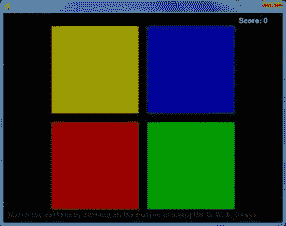

# 第五章：模拟

> 原文：[`inventwithpython.com/pygame/chapter5.html`](https://inventwithpython.com/pygame/chapter5.html)
> 
> 译者：[飞龙](https://github.com/wizardforcel)
> 
> 协议：[CC BY-NC-SA 4.0](https://creativecommons.org/licenses/by-nc-sa/4.0/)



## 如何玩模拟

模拟是 Simon 游戏的克隆版。屏幕上有四个彩色按钮。按钮以某种随机模式亮起，然后玩家必须按照正确的顺序重复这个模式。每次玩家成功模拟模式，模式就会变得更长。玩家尽可能长时间地匹配模式。

## 模拟源代码

可以从以下网址下载此源代码：[`invpy.com/simulate.py`](http://invpy.com/simulate.py)。如果出现任何错误消息，请查看错误消息中提到的行号，并检查代码中是否有任何拼写错误。您还可以将代码复制粘贴到[`invpy.com/diff/simulate`](http://invpy.com/diff/simulate)的 Web 表单中，以查看您的代码与书中代码之间的差异。

您可以从以下网址下载此程序使用的四个声音文件：

+   [`invpy.com/beep1.ogg`](http://invpy.com/beep1.ogg)

+   [`invpy.com/beep2.ogg`](http://invpy.com/beep2.ogg)

+   [`invpy.com/beep3.ogg`](http://invpy.com/beep3.ogg)

+   [`invpy.com/beep4.ogg`](http://invpy.com/beep4.ogg)

```py
# Simulate (a Simon clone)
# By Al Sweigart [[email protected]](/cdn-cgi/l/email-protection)
# http://inventwithpython.com/pygame
# Creative Commons BY-NC-SA 3.0 US

  import random, sys, time, pygame
  from pygame.locals import *

  FPS = 30
 WINDOWWIDTH = 640
 WINDOWHEIGHT = 480
 FLASHSPEED = 500 # in milliseconds
 FLASHDELAY = 200 # in milliseconds
 BUTTONSIZE = 200
 BUTTONGAPSIZE = 20
 TIMEOUT = 4 # seconds before game over if no button is pushed.

 #                R    G    B
 WHITE        = (255, 255, 255)
 BLACK        = (  0,   0,   0)
 BRIGHTRED    = (255,   0,   0)
 RED          = (155,   0,   0)
 BRIGHTGREEN  = (  0, 255,   0)
 GREEN        = (  0, 155,   0)
 BRIGHTBLUE   = (  0,   0, 255)
 BLUE         = (  0,   0, 155)
 BRIGHTYELLOW = (255, 255,   0)
 YELLOW       = (155, 155,   0)
 DARKGRAY     = ( 40,  40,  40)
 bgColor = BLACK

 XMARGIN = int((WINDOWWIDTH - (2 * BUTTONSIZE) - BUTTONGAPSIZE) / 2)
 YMARGIN = int((WINDOWHEIGHT - (2 * BUTTONSIZE) - BUTTONGAPSIZE) / 2)

# Rect objects for each of the four buttons
 YELLOWRECT = pygame.Rect(XMARGIN, YMARGIN, BUTTONSIZE, BUTTONSIZE)
 BLUERECT   = pygame.Rect(XMARGIN + BUTTONSIZE + BUTTONGAPSIZE, YMARGIN, BUTTONSIZE, BUTTONSIZE)
 REDRECT    = pygame.Rect(XMARGIN, YMARGIN + BUTTONSIZE + BUTTONGAPSIZE, BUTTONSIZE, BUTTONSIZE)
 GREENRECT  = pygame.Rect(XMARGIN + BUTTONSIZE + BUTTONGAPSIZE, YMARGIN + BUTTONSIZE + BUTTONGAPSIZE, BUTTONSIZE, BUTTONSIZE)

def main():
     global FPSCLOCK, DISPLAYSURF, BASICFONT, BEEP1, BEEP2, BEEP3, BEEP4

     pygame.init()
     FPSCLOCK = pygame.time.Clock()
     DISPLAYSURF = pygame.display.set_mode((WINDOWWIDTH, WINDOWHEIGHT))
     pygame.display.set_caption('Simulate')

     BASICFONT = pygame.font.Font('freesansbold.ttf', 16)

    infoSurf = BASICFONT.render('Match the pattern by clicking on the button or using the Q, W, A, S keys.', 1, DARKGRAY)
     infoRect = infoSurf.get_rect()
     infoRect.topleft = (10, WINDOWHEIGHT - 25)
     # load the sound files
     BEEP1 = pygame.mixer.Sound('beep1.ogg')
     BEEP2 = pygame.mixer.Sound('beep2.ogg')
     BEEP3 = pygame.mixer.Sound('beep3.ogg')
     BEEP4 = pygame.mixer.Sound('beep4.ogg')

    # Initialize some variables for a new game
     pattern = [] # stores the pattern of colors
     currentStep = 0 # the color the player must push next
     lastClickTime = 0 # timestamp of the player's last button push
     score = 0
     # when False, the pattern is playing. when True, waiting for the player to click a colored button:
     waitingForInput = False

    while True: # main game loop
         clickedButton = None # button that was clicked (set to YELLOW, RED, GREEN, or BLUE)
         DISPLAYSURF.fill(bgColor)
         drawButtons()

         scoreSurf = BASICFONT.render('Score: ' + str(score), 1, WHITE)
         scoreRect = scoreSurf.get_rect()
         scoreRect.topleft = (WINDOWWIDTH - 100, 10)
         DISPLAYSURF.blit(scoreSurf, scoreRect)

        DISPLAYSURF.blit(infoSurf, infoRect)

        checkForQuit()
         for event in pygame.event.get(): # event handling loop
             if event.type == MOUSEBUTTONUP:
                 mousex, mousey = event.pos
                 clickedButton = getButtonClicked(mousex, mousey)
            elif event.type == KEYDOWN:
                if event.key == K_q:
                     clickedButton = YELLOW
                 elif event.key == K_w:
                     clickedButton = BLUE
                 elif event.key == K_a:
                     clickedButton = RED
                 elif event.key == K_s:
                     clickedButton = GREEN

        if not waitingForInput:
             # play the pattern
             pygame.display.update()
            pygame.time.wait(1000)
            pattern.append(random.choice((YELLOW, BLUE, RED, GREEN)))
            for button in pattern:
                flashButtonAnimation(button)
                pygame.time.wait(FLASHDELAY)
            waitingForInput = True
        else:
            # wait for the player to enter buttons
            if clickedButton and clickedButton == pattern[currentStep]:
                # pushed the correct button
                flashButtonAnimation(clickedButton)
                currentStep += 1
                lastClickTime = time.time()

                if currentStep == len(pattern):
                    # pushed the last button in the pattern
                    changeBackgroundAnimation()
                    score += 1
                    waitingForInput = False
                    currentStep = 0 # reset back to first step

            elif (clickedButton and clickedButton != pattern[currentStep]) or (currentStep != 0 and time.time() - TIMEOUT > lastClickTime):
                # pushed the incorrect button, or has timed out
                gameOverAnimation()
                # reset the variables for a new game:
                pattern = []
                currentStep = 0
                waitingForInput = False
                score = 0
                pygame.time.wait(1000)
                changeBackgroundAnimation()

        pygame.display.update()
        FPSCLOCK.tick(FPS)

def terminate():
    pygame.quit()
    sys.exit()

def checkForQuit():
    for event in pygame.event.get(QUIT): # get all the QUIT events
        terminate() # terminate if any QUIT events are present
    for event in pygame.event.get(KEYUP): # get all the KEYUP events
        if event.key == K_ESCAPE:
            terminate() # terminate if the KEYUP event was for the Esc key
        pygame.event.post(event) # put the other KEYUP event objects back

def flashButtonAnimation(color, animationSpeed=50):
    if color == YELLOW:
        sound = BEEP1
        flashColor = BRIGHTYELLOW
        rectangle = YELLOWRECT
    elif color == BLUE:
        sound = BEEP2
        flashColor = BRIGHTBLUE
        rectangle = BLUERECT
    elif color == RED:
        sound = BEEP3
        flashColor = BRIGHTRED
        rectangle = REDRECT
    elif color == GREEN:
        sound = BEEP4
        flashColor = BRIGHTGREEN
        rectangle = GREENRECT

    origSurf = DISPLAYSURF.copy()
    flashSurf = pygame.Surface((BUTTONSIZE, BUTTONSIZE))
    flashSurf = flashSurf.convert_alpha()
    r, g, b = flashColor
    sound.play()
    for start, end, step in ((0, 255, 1), (255, 0, -1)): # animation loop
        for alpha in range(start, end, animationSpeed * step):
            checkForQuit()
            DISPLAYSURF.blit(origSurf, (0, 0))
            flashSurf.fill((r, g, b, alpha))
            DISPLAYSURF.blit(flashSurf, rectangle.topleft)
            pygame.display.update()
            FPSCLOCK.tick(FPS)
    DISPLAYSURF.blit(origSurf, (0, 0))

def drawButtons():
    pygame.draw.rect(DISPLAYSURF, YELLOW, YELLOWRECT)
    pygame.draw.rect(DISPLAYSURF, BLUE,   BLUERECT)
    pygame.draw.rect(DISPLAYSURF, RED,    REDRECT)
    pygame.draw.rect(DISPLAYSURF, GREEN,  GREENRECT)

def changeBackgroundAnimation(animationSpeed=40):
    global bgColor
    newBgColor = (random.randint(0, 255), random.randint(0, 255), random.randint(0, 255))

    newBgSurf = pygame.Surface((WINDOWWIDTH, WINDOWHEIGHT))
    newBgSurf = newBgSurf.convert_alpha()
    r, g, b = newBgColor
    for alpha in range(0, 255, animationSpeed): # animation loop
        checkForQuit()
        DISPLAYSURF.fill(bgColor)

        newBgSurf.fill((r, g, b, alpha))
        DISPLAYSURF.blit(newBgSurf, (0, 0))

        drawButtons() # redraw the buttons on top of the tint

        pygame.display.update()
        FPSCLOCK.tick(FPS)
    bgColor = newBgColor

def gameOverAnimation(color=WHITE, animationSpeed=50):
    # play all beeps at once, then flash the background
    origSurf = DISPLAYSURF.copy()
    flashSurf = pygame.Surface(DISPLAYSURF.get_size())
    flashSurf = flashSurf.convert_alpha()
    BEEP1.play() # play all four beeps at the same time, roughly.
    BEEP2.play()
    BEEP3.play()
    BEEP4.play()
    r, g, b = color
    for i in range(3): # do the flash 3 times
        for start, end, step in ((0, 255, 1), (255, 0, -1)):
            # The first iteration in this loop sets the following for loop
            # to go from 0 to 255, the second from 255 to 0.
            for alpha in range(start, end, animationSpeed * step): # animation loop
                # alpha means transparency. 255 is opaque, 0 is invisible
                checkForQuit()
                flashSurf.fill((r, g, b, alpha))
                DISPLAYSURF.blit(origSurf, (0, 0))
                DISPLAYSURF.blit(flashSurf, (0, 0))
                drawButtons()
                pygame.display.update()
                FPSCLOCK.tick(FPS)

def getButtonClicked(x, y):
    if YELLOWRECT.collidepoint( (x, y) ):
        return YELLOW
    elif BLUERECT.collidepoint( (x, y) ):
        return BLUE
    elif REDRECT.collidepoint( (x, y) ):
        return RED
    elif GREENRECT.collidepoint( (x, y) ):
        return GREEN
    return None

if __name__ == '__main__':
    main()

```

## 通常的起始工作

```py
# Simulate (a Simon clone)
# By Al Sweigart [[email protected]](/cdn-cgi/l/email-protection)
# http://inventwithpython.com/pygame
# Creative Commons BY-NC-SA 3.0 US

  import random, sys, time, pygame
  from pygame.locals import *

  FPS = 30
 WINDOWWIDTH = 640
 WINDOWHEIGHT = 480
 FLASHSPEED = 500 # in milliseconds
 FLASHDELAY = 200 # in milliseconds
 BUTTONSIZE = 200
 BUTTONGAPSIZE = 20
 TIMEOUT = 4 # seconds before game over if no button is pushed.

 #                R    G    B
 WHITE        = (255, 255, 255)
 BLACK        = (  0,   0,   0)
 BRIGHTRED    = (255,   0,   0)
 RED          = (155,   0,   0)
 BRIGHTGREEN  = (  0, 255,   0)
 GREEN        = (  0, 155,   0)
 BRIGHTBLUE   = (  0,   0, 255)
 BLUE         = (  0,   0, 155)
 BRIGHTYELLOW = (255, 255,   0)
 YELLOW       = (155, 155,   0)
 DARKGRAY     = ( 40,  40,  40)
 bgColor = BLACK

 XMARGIN = int((WINDOWWIDTH - (2 * BUTTONSIZE) - BUTTONGAPSIZE) / 2)
 YMARGIN = int((WINDOWHEIGHT - (2 * BUTTONSIZE) - BUTTONGAPSIZE) / 2)

```

在这里，我们设置了通常的常量，用于以后可能要修改的事物，例如四个按钮的大小，按钮用于的颜色阴影（当按钮亮起时使用的明亮颜色）以及玩家在游戏超时之前必须按下序列中的下一个按钮的时间。

## 设置按钮

```py
 # Rect objects for each of the four buttons
 YELLOWRECT = pygame.Rect(XMARGIN, YMARGIN, BUTTONSIZE, BUTTONSIZE)
 BLUERECT   = pygame.Rect(XMARGIN + BUTTONSIZE + BUTTONGAPSIZE, YMARGIN, BUTTONSIZE, BUTTONSIZE)
 REDRECT    = pygame.Rect(XMARGIN, YMARGIN + BUTTONSIZE + BUTTONGAPSIZE, BUTTONSIZE, BUTTONSIZE)
 GREENRECT  = pygame.Rect(XMARGIN + BUTTONSIZE + BUTTONGAPSIZE, YMARGIN + BUTTONSIZE + BUTTONGAPSIZE, BUTTONSIZE, BUTTONSIZE)

```

就像滑动拼图游戏中的“重置”、“解决”和“新游戏”按钮一样，模拟游戏有四个矩形区域和处理玩家在这些区域内点击时的代码。程序将需要 Rect 对象来表示四个按钮的区域，以便可以在它们上调用`collidepoint()`方法。第 36 至 39 行设置了这些 Rect 对象的适当坐标和大小。

## `main()`函数

```py
 def main():
     global FPSCLOCK, DISPLAYSURF, BASICFONT, BEEP1, BEEP2, BEEP3, BEEP4

     pygame.init()
     FPSCLOCK = pygame.time.Clock()
     DISPLAYSURF = pygame.display.set_mode((WINDOWWIDTH, WINDOWHEIGHT))
     pygame.display.set_caption('Simulate')

     BASICFONT = pygame.font.Font('freesansbold.ttf', 16)

    infoSurf = BASICFONT.render('Match the pattern by clicking on the button or using the Q, W, A, S keys.', 1, DARKGRAY)
     infoRect = infoSurf.get_rect()
     infoRect.topleft = (10, WINDOWHEIGHT - 25)
     # load the sound files
     BEEP1 = pygame.mixer.Sound('beep1.ogg')
     BEEP2 = pygame.mixer.Sound('beep2.ogg')
     BEEP3 = pygame.mixer.Sound('beep3.ogg')
     BEEP4 = pygame.mixer.Sound('beep4.ogg')

```

`main()`函数将实现程序的大部分内容，并在需要时调用其他函数。通常的 Pygame 设置函数被调用来初始化库，创建一个 Clock 对象，创建一个窗口，设置标题，并创建一个 Font 对象，用于在窗口上显示分数和说明。这些函数调用创建的对象将存储在全局变量中，以便它们可以在其他函数中使用。但它们基本上是常量，因为其中的值从不改变。

第 55 至 58 行将加载声音文件，以便模拟可以在玩家点击每个按钮时播放声音效果。`pygame.mixer.Sound()`构造函数将返回一个 Sound 对象，我们将其存储在变量`BEEP1`到`BEEP4`中，这些变量在第 42 行被设置为全局变量。

## 本程序中使用的一些局部变量

```py
     # Initialize some variables for a new game
     pattern = [] # stores the pattern of colors
     currentStep = 0 # the color the player must push next
     lastClickTime = 0 # timestamp of the player's last button push
     score = 0
     # when False, the pattern is playing. when True, waiting for the player to click a colored button:
     waitingForInput = False

```

`pattern`变量将是一个颜色值列表（`YELLOW`，`RED`，`BLUE`或`GREEN`），用于跟踪玩家必须记住的模式。例如，如果模式的值是`[RED, RED, YELLOW, RED, BLUE, BLUE, RED, GREEN]`，那么玩家首先必须点击红色按钮两次，然后是黄色按钮，然后是红色按钮，依此类推，直到最后的绿色按钮。当玩家完成每一轮时，一个新的随机颜色将被添加到列表的末尾。

`currentStep`变量将跟踪玩家必须点击的模式列表中的颜色。如果`currentStep`是`0`，`pattern`是`[GREEN, RED, RED, YELLOW]`，那么玩家必须点击绿色按钮。如果他们点击其他按钮，代码将导致游戏结束。

有一个`TIMEOUT`常量，使玩家在一定时间内点击模式中的下一个按钮，否则代码会导致游戏结束。为了检查自上次按钮点击以来是否已经过了足够的时间，`lastClickTime`变量需要跟踪玩家上次点击按钮的时间。（Python 有一个名为 time 的模块和一个`time.time()`函数来返回当前时间。这将在后面解释。）

也许很难相信，`score`变量跟踪得分。难以置信！

我们的程序还有两种模式。要么程序正在为玩家播放按钮的模式（在这种情况下，`waitingForInput`设置为`False`），要么程序已经完成了模式的播放，并正在等待用户按正确顺序点击按钮（在这种情况下，`waitingForInput`设置为`True`）。

## 绘制棋盘和处理输入

```py
     while True: # main game loop
         clickedButton = None # button that was clicked (set to YELLOW, RED, GREEN, or BLUE)
         DISPLAYSURF.fill(bgColor)
         drawButtons()

         scoreSurf = BASICFONT.render('Score: ' + str(score), 1, WHITE)
         scoreRect = scoreSurf.get_rect()
         scoreRect.topleft = (WINDOWWIDTH - 100, 10)
         DISPLAYSURF.blit(scoreSurf, scoreRect)

        DISPLAYSURF.blit(infoSurf, infoRect)

```

第 68 行是主游戏循环的开始。`clickedButton`在每次迭代开始时将被重置为`None`。如果在此迭代期间点击了按钮，那么`clickedButton`将被设置为与按钮匹配的颜色值之一（`YELLOW`、`RED`、`GREEN`或`BLUE`）。

`fill()`方法在第 70 行被调用，以重新绘制整个显示表面，这样我们就可以从头开始绘制。四个彩色按钮是通过调用`drawButtons()`（稍后解释）来绘制的。然后在 73 到 76 行创建了得分的文本。

还将有文本告诉玩家他们当前的得分是多少。与 51 行对指示文本的`render()`方法不同，得分的文本会发生变化。它起初是`'Score: 0'`，然后变成`'Score: 1'`，然后变成`'Score: 2'`，依此类推。这就是为什么我们在游戏循环内部的 73 行调用`render()`方法来创建新的 Surface 对象。由于指示文本（“按照模式匹配…”）永远不会改变，所以我们只需要在 50 行游戏循环外部调用一次`render()`。

## 检查鼠标点击

```py
         checkForQuit()
         for event in pygame.event.get(): # event handling loop
             if event.type == MOUSEBUTTONUP:
                 mousex, mousey = event.pos
                 clickedButton = getButtonClicked(mousex, mousey)

```

第 80 行快速检查是否有任何`QUIT`事件，然后第 81 行是事件处理循环的开始。任何鼠标点击的 XY 坐标将存储在`mousex`和`mousey`变量中。如果鼠标点击在四个按钮之一上，那么我们的`getButtonClicked()`函数将返回被点击的按钮的颜色对象（否则返回`None`）。

## 检查键盘按键

```py
             elif event.type == KEYDOWN:
                if event.key == K_q:
                     clickedButton = YELLOW
                 elif event.key == K_w:
                     clickedButton = BLUE
                 elif event.key == K_a:
                     clickedButton = RED
                 elif event.key == K_s:
                     clickedButton = GREEN

```

第 85 到 93 行检查是否有任何`KEYDOWN`事件（当用户在键盘上按键时创建）。Q、W、A 和 S 键对应按钮，因为它们在键盘上呈正方形排列。

Q 键位于四个键盘键的左上方，就像屏幕上的黄色按钮位于左上方一样，所以我们将按下 Q 键与点击黄色按钮相同。我们可以通过将`clickedButton`变量设置为常量变量`YELLOW`中的值来实现这一点。我们也可以对其他三个键做同样的操作。这样，用户可以用鼠标或键盘玩模拟游戏。

## 游戏循环的两种状态

```py
         if not waitingForInput:
             # play the pattern
             pygame.display.update()
            pygame.time.wait(1000)
            pattern.append(random.choice((YELLOW, BLUE, RED, GREEN)))
            for button in pattern:
                flashButtonAnimation(button)
                pygame.time.wait(FLASHDELAY)
            waitingForInput = True

```

程序可以处于两种不同的“模式”或“状态”。当`waitingForInput`为`False`时，程序将显示模式的动画。当`waitingForInput`为`True`时，程序将等待用户选择按钮。

第 97 到 105 行将涵盖程序显示模式动画的情况。由于这是在游戏开始或玩家完成模式时完成的，第 101 行将向模式列表添加一个随机颜色，使模式变长一步。然后第 102 到 104 行循环遍历模式列表中的每个值，并调用`flashButtonAnimation()`使该按钮发光。在所有按钮都发光完成后，程序将`waitingForInput`变量设置为`True`。

## 弄清楚玩家是否按下了正确的按钮

```py
        else:
            # wait for the player to enter buttons
            if clickedButton and clickedButton == pattern[currentStep]:
                # pushed the correct button
                flashButtonAnimation(clickedButton)
                currentStep += 1
                lastClickTime = time.time()

```

如果`waitingForInput`是`True`，那么第 106 行的`else`语句中的代码将执行。第 108 行检查玩家是否在游戏循环的这次迭代中点击了一个按钮，以及该按钮是否是正确的。`currentStep`变量跟踪模式列表中玩家下一个应该点击的按钮的索引。

例如，如果模式设置为[YELLOW, RED, RED]，并且`currentStep`变量设置为`0`（就像玩家刚开始游戏时一样），那么玩家应该点击的正确按钮将是`pattern[0]`（黄色按钮）。

如果玩家点击了正确的按钮，我们希望通过调用`flashButtonAnimation()`来闪烁玩家点击的按钮，然后增加`currentStep`到下一步，然后更新`lastClickTime`变量到当前时间。（`time.time()`函数返回自 1970 年 1 月 1 日以来的秒数的浮点值，因此我们可以用它来跟踪时间。）

```py
                if currentStep == len(pattern):
                    # pushed the last button in the pattern
                    changeBackgroundAnimation()
                    score += 1
                    waitingForInput = False
                    currentStep = 0 # reset back to first step

```

第 114 到 119 行位于从第 106 行开始的`else`语句内。如果执行在该`else`语句内部，我们知道玩家点击了一个按钮，而且这是正确的按钮。第 114 行检查是否这是模式列表中的最后一个正确的按钮，通过检查存储在`currentStep`中的整数是否等于模式列表中的值数量。

如果这是`True`，那么我们希望通过调用`changeBackgroundAnimation()`来改变背景颜色。这是让玩家知道他们已经完全正确输入整个模式的简单方法。分数增加，`currentStep`设置回`0`，`waitingForInput`变量设置为`False`，这样在游戏循环的下一次迭代中，代码将向模式列表添加一个新的颜色值，然后闪烁按钮。

```py
            elif (clickedButton and clickedButton != pattern[currentStep]) or (currentStep != 0 and time.time() - TIMEOUT > lastClickTime):

```

如果玩家没有点击正确的按钮，第 121 行的`elif`语句处理了玩家点击错误按钮或者玩家等待太久没有点击按钮的情况。无论哪种情况，我们都需要显示“游戏结束”动画并开始新游戏。

`elif`语句的条件中的`(clickedButton and clickedButton != pattern[currentStep])`部分检查是否点击了一个按钮，并且是错误的按钮。您可以将此与第 108 行的`if`语句的条件`clickedButton and clickedButton == pattern[currentStep]`进行比较，如果玩家点击了一个按钮，并且这是正确的按钮，则评估为`True`。

第 121 行`elif`条件的另一部分是`(currentStep != 0 and time.time() - TIMEOUT > lastClickTime)`。这处理确保玩家没有“超时”的情况。请注意，该条件的这一部分有两个由`and`关键字连接的表达式。这意味着`and`关键字的两侧都需要评估为`True`。

为了“超时”，它不能是玩家的第一个按钮点击。但一旦他们开始点击按钮，他们必须快速点击按钮，直到他们输入整个模式（或者点击了错误的模式并得到了“游戏结束”）。如果`currentStep != 0`是`True`，那么我们知道玩家已经开始点击按钮。

## 时代时间

此外，为了“超时”，当前时间（由`time.time()`返回）减去四秒（因为`4`存储在`TIMEOUT`中）必须大于上次点击按钮的时间（存储在`lastClickTime`中）。`time.time() - TIMEOUT > lastClickTime`之所以有效，是因为时代时间的工作原理。时代时间（也称为 Unix 时代时间）是自 1970 年 1 月 1 日以来的秒数。这个日期被称为 Unix 时代。

例如，当我从交互式 shell 中运行`time.time()`（不要忘记首先导入 time 模块），它看起来像这样：

```py
>>> import time
>>> time.time()
1320460242.118

```

这个数字的意思是，`time.time()`函数被调用的时刻距离 1970 年 1 月 1 日午夜已经超过了 1,320,460,242 秒。(这相当于 2011 年 11 月 4 日晚上 7 点 30 分 42 秒。您可以在[`invpy.com/epochtime`](http://invpy.com/epochtime)学习如何将 Unix 纪元时间转换为常规英文时间)

如果我稍后从交互式 shell 中调用`time.time()`，可能会看起来像这样：

```py
>>> time.time()
1320460261.315

```

从 Unix 纪元的午夜开始的 1320460261.315 秒是 2011 年 11 月 4 日晚上 7 点 31 分 01 秒。(实际上，如果您想要精确的话，是 7 点 31 分 0.315 秒。)

如果我们必须处理字符串，处理时间将会很困难。如果我们只有字符串值`'7:30:42 PM'`和`'7:31:01 PM'`进行比较，很难知道已经过去了 19 秒。但是使用纪元时间，只需要减去整数`1320460261.315 - 1320460242.118`，得到`19.197000026702881`。这个值是这两个时间之间的秒数。(额外的`0.000026702881`来自于使用浮点数进行数学运算时发生的非常小的舍入误差。它们只会偶尔发生，通常太微小而不值得关注。您可以在[`invpy.com/roundingerrors`](http://invpy.com/roundingerrors)了解更多关于浮点数舍入误差的信息。)

回到第 121 行，如果`time.time() - TIMEOUT > lastClickTime`的值为`True`，那么自`time.time()`被调用并存储在`lastClickTime`以来已经过去了 4 秒以上。如果值为`False`，则已经过去了不到 4 秒。

```py
                # pushed the incorrect button, or has timed out
                gameOverAnimation()
                # reset the variables for a new game:
                pattern = []
                currentStep = 0
                waitingForInput = False
                score = 0
                pygame.time.wait(1000)
                changeBackgroundAnimation()

```

如果玩家点击了错误的按钮或者超时了，程序应该播放“游戏结束”的动画，然后重置变量以开始新游戏。这包括将`pattern`列表设置为空列表，`currentStep`设置为`0`，`waitingForInput`设置为`False`，然后将`score`设置为`0`。稍作暂停，然后设置新的背景颜色，以提示玩家新游戏的开始，新游戏将在游戏循环的下一次迭代中开始。

## 将面板绘制到屏幕上

```py
        pygame.display.update()
        FPSCLOCK.tick(FPS)

```

就像其他游戏程序一样，在游戏循环中最后要做的事情是将显示 Surface 对象绘制到屏幕上，并调用`tick()`方法。

## 同样的`terminate()`函数

```py
def terminate():
    pygame.quit()
    sys.exit()

def checkForQuit():
    for event in pygame.event.get(QUIT): # get all the QUIT events
        terminate() # terminate if any QUIT events are present
    for event in pygame.event.get(KEYUP): # get all the KEYUP events
        if event.key == K_ESCAPE:
            terminate() # terminate if the KEYUP event was for the Esc key
        pygame.event.post(event) # put the other KEYUP event objects back

```

`terminate()`和`checkForQuit()`函数在滑动拼图章节中被使用和解释过，所以我们将跳过再次描述它们。

## 重复使用常量变量

```py
def flashButtonAnimation(color, animationSpeed=50):
    if color == YELLOW:
        sound = BEEP1
        flashColor = BRIGHTYELLOW
        rectangle = YELLOWRECT
    elif color == BLUE:
        sound = BEEP2
        flashColor = BRIGHTBLUE
        rectangle = BLUERECT
    elif color == RED:
        sound = BEEP3
        flashColor = BRIGHTRED
        rectangle = REDRECT
    elif color == GREEN:
        sound = BEEP4
        flashColor = BRIGHTGREEN
        rectangle = GREENRECT

```

根据传递给颜色参数的 Color 值的不同，声音、明亮闪光的颜色和闪光的矩形区域也会有所不同。第 151 到 166 行根据`color`参数中的值设置了三个本地变量：`sound`、`flashColor`和`rectangle`。

## 闪烁按钮的动画

```py
    origSurf = DISPLAYSURF.copy()
    flashSurf = pygame.Surface((BUTTONSIZE, BUTTONSIZE))
    flashSurf = flashSurf.convert_alpha()
    r, g, b = flashColor
    sound.play()

```

闪烁按钮的动画过程很简单：在每一帧动画上，首先绘制正常的面板，然后在上面绘制闪烁的按钮的明亮颜色版本。明亮颜色的 alpha 值在动画的第一帧开始时为`0`，然后在每一帧后慢慢增加，直到完全不透明，明亮颜色版本完全覆盖了正常按钮颜色。这将使它看起来像按钮慢慢变亮。

变亮是动画的第一部分。第二部分是按钮变暗。这是用相同的代码完成的，只是在每一帧中，alpha 值不是增加，而是减少。随着 alpha 值越来越低，覆盖在上面的明亮颜色将变得越来越不可见，直到只剩下原始的板子和暗淡的颜色可见。

要在代码中执行此操作，第 168 行创建显示 Surface 对象的副本并将其存储在`origSurf`中。第 169 行创建一个新的 Surface 对象，大小与单个按钮相同，并将其存储在`flashSurf`中。在`flashSurf`上调用`convert_alpha()`方法，以便 Surface 对象可以在其上绘制透明颜色（否则，我们使用的 Color 对象中的 alpha 值将被忽略并自动假定为 255）。在您自己的游戏程序中，如果您在使颜色透明度工作时遇到问题，请确保已在任何具有透明颜色的 Surface 对象上调用了`convert_alpha()`方法。

第 171 行创建名为`r`，`g`和`b`的单独局部变量，用于存储存储在`flashColor`中的元组的各个 RGB 值。这只是一些语法糖，使该函数中的其余代码更容易阅读。在开始执行按钮闪烁动画之前，第 172 行将播放该按钮的声音效果。声音效果开始播放后，程序执行会继续进行，因此声音将在按钮闪烁动画期间播放。

```py
    for start, end, step in ((0, 255, 1), (255, 0, -1)): # animation loop
        for alpha in range(start, end, animationSpeed * step):
            checkForQuit()
            DISPLAYSURF.blit(origSurf, (0, 0))
            flashSurf.fill((r, g, b, alpha))
            DISPLAYSURF.blit(flashSurf, rectangle.topleft)
            pygame.display.update()
            FPSCLOCK.tick(FPS)
    DISPLAYSURF.blit(origSurf, (0, 0))

```

请记住，为了执行动画，我们首先要用从`0`到`255`的递增 alpha 值绘制`flashSurf`以执行动画的变亮部分。然后为了执行变暗，我们希望 alpha 值从`255`到`0`。我们*可以*使用以下代码执行：

```py
    for alpha in range(0, 255, animationSpeed): # brightening
        checkForQuit()
        DISPLAYSURF.blit(origSurf, (0, 0))
        flashSurf.fill((r, g, b, alpha))
        DISPLAYSURF.blit(flashSurf, rectangle.topleft)
        pygame.display.update()
        FPSCLOCK.tick(FPS)
    for alpha in range(255, 0, -animationSpeed): # dimming
        checkForQuit()
        DISPLAYSURF.blit(origSurf, (0, 0))
        flashSurf.fill((r, g, b, alpha))
        DISPLAYSURF.blit(flashSurf, rectangle.topleft)
        pygame.display.update()
        FPSCLOCK.tick(FPS)

```

但请注意，`for`循环内的代码处理绘制帧并且彼此相同。如果我们像上面那样编写代码，那么第一个`for`循环将处理动画的变亮部分（其中 alpha 值从`0`到`255`），第二个`for`循环将处理动画的变暗部分（其中 alpha 值从`255`到`0`）。请注意，对于第二个`for`循环，`range()`调用的第三个参数是一个负数。

每当我们有相同的代码时，我们可能可以缩短我们的代码，这样我们就不必重复它。这就是我们在第 173 行的`for`循环中所做的，它为第 174 行的`range()`调用提供了不同的值：

```py
    for start, end, step in ((0, 255, 1), (255, 0, -1)): # animation loop
        for alpha in range(start, end, animationSpeed * step):

```

在第 173 行的`for`循环的第一次迭代中，`start`设置为`0`，`end`设置为`255`，`step`设置为`1`。这样，当执行第 174 行的`for`循环时，它调用`range(0, 255, animationSpeed)`。 （请注意，`animationSpeed * 1`与`animationSpeed`相同。将一个数字乘以`1`会给我们相同的数字。）

然后，第 174 行的`for`循环执行并执行变亮动画。

在第 173 行的`for`循环的第二次迭代（始终有两次且仅有两次此内部`for`循环的迭代）中，`start`设置为`255`，`end`设置为`0`，`step`设置为`-1`。当执行第 174 行的`for`循环时，它调用`range(255, 0, -animationSpeed)`。 （请注意，`animationSpeed * -1`评估为`-animationSpeed`，因为将任何数字乘以`-1`都会返回该数字的负形式。）

这样，我们就不必有两个单独的`for`循环，并重复其中的所有代码。以下是再次在第 174 行的`for`循环内的代码：

```py
            checkForQuit()
            DISPLAYSURF.blit(origSurf, (0, 0))
            flashSurf.fill((r, g, b, alpha))
            DISPLAYSURF.blit(flashSurf, rectangle.topleft)
            pygame.display.update()
            FPSCLOCK.tick(FPS)
    DISPLAYSURF.blit(origSurf, (0, 0))

```

我们检查任何`QUIT`事件（以防用户在动画期间尝试关闭程序），然后将`origSurf` Surface 贴到显示 Surface 上。然后我们通过调用`fill()`（提供我们在第 171 行得到的颜色的`r`，`g`，`b`值和`for`循环在`alpha`变量中设置的 alpha 值）来绘制`flashSurf` Surface。然后将`flashSurf` Surface 贴到显示 Surface 上。

然后，为了使显示 Surface 显示在屏幕上，第 179 行调用了`pygame.display.update()`。为了确保动画不会以计算机可以绘制的速度播放，我们通过调用`tick()`方法添加了短暂的暂停。（如果要看到闪烁动画播放得非常慢，请将低数字（如 1 或 2）作为`tick()`的参数，而不是`FPS`。）

## 绘制按钮

```py
def drawButtons():
    pygame.draw.rect(DISPLAYSURF, YELLOW, YELLOWRECT)
    pygame.draw.rect(DISPLAYSURF, BLUE,   BLUERECT)
    pygame.draw.rect(DISPLAYSURF, RED,    REDRECT)
    pygame.draw.rect(DISPLAYSURF, GREEN,  GREENRECT)

```

每个按钮只是一个特定颜色的矩形放在特定位置，我们只需调用`pygame.draw.rect()`四次来在显示表面上绘制按钮。我们使用的 Color 对象和 Rect 对象永远不会改变，这就是为什么我们将它们存储在像`YELLOW`和`YELLOWRECT`这样的常量变量中。

## 背景变化动画

```py
def changeBackgroundAnimation(animationSpeed=40):
    global bgColor
    newBgColor = (random.randint(0, 255), random.randint(0, 255), random.randint(0, 255))

    newBgSurf = pygame.Surface((WINDOWWIDTH, WINDOWHEIGHT))
    newBgSurf = newBgSurf.convert_alpha()
    r, g, b = newBgColor
    for alpha in range(0, 255, animationSpeed): # animation loop
        checkForQuit()
        DISPLAYSURF.fill(bgColor)

        newBgSurf.fill((r, g, b, alpha))
        DISPLAYSURF.blit(newBgSurf, (0, 0))

        drawButtons() # redraw the buttons on top of the tint

        pygame.display.update()
        FPSCLOCK.tick(FPS)
    bgColor = newBgColor

```

每当玩家完成正确输入整个模式时，背景颜色变化动画就会发生。在从第 198 行开始的每次循环迭代中，整个显示表面都必须重新绘制（与越来越不透明的新背景颜色混合，直到背景完全被新颜色覆盖）。循环的每次迭代所做的步骤是：

+   第 200 行用旧的背景颜色（存储在`bgColor`中）填充整个显示表面（存储在`DISPLAYSURF`中）。

+   第 202 行用不同的 Surface 对象（存储在`newBgSurf`中）填充新背景颜色的 RGB 值（并且每次迭代时 alpha 透明度值都会改变，因为这是第 198 行上的`for`循环所做的）。

+   第 203 行然后将`newBgSurf` Surface 绘制到`DISPLAYSURF`中的显示表面上。我们之所以没有直接在`DISPLAYSURF`上绘制半透明的新背景颜色，是因为`fill()`方法只会替换表面上的颜色，而`blit()`方法会混合颜色。

+   现在我们已经按照自己的意愿设置了背景，我们将在第 205 行调用`drawButtons()`来在其上绘制按钮。

+   第 207 和 208 行只是将显示表面绘制到屏幕上并添加了一个暂停。

`changeBackgroundAnimation()`函数开头有一个`global`语句的原因是`bgColor`变量，因为这个函数通过第 209 行的赋值语句修改了变量的内容。任何函数都可以读取全局变量的值，而不需要指定`global`语句。

如果该函数为全局变量分配一个值而没有`global`语句，那么 Python 认为该变量是一个局部变量，只是恰好与全局变量同名。`main()`函数使用`bgColor`变量，但不需要为它添加全局语句，因为它只读取`bgColor`的内容，`main()`函数从不为`bgColor`分配新值。这个概念在[`invpy.com/global`](http://invpy.com/global)上有更详细的解释。

## 游戏结束动画

```py
def gameOverAnimation(color=WHITE, animationSpeed=50):
    # play all beeps at once, then flash the background
    origSurf = DISPLAYSURF.copy()
    flashSurf = pygame.Surface(DISPLAYSURF.get_size())
    flashSurf = flashSurf.convert_alpha()
    BEEP1.play() # play all four beeps at the same time, roughly.
    BEEP2.play()
    BEEP3.play()
    BEEP4.play()
    r, g, b = color
    for i in range(3): # do the flash 3 times

```

下一行（下面的第 223 行）的`for`循环的每次迭代都会执行一次闪烁。为了完成三次闪烁，我们将所有代码放在一个具有三次迭代的`for`循环中。如果您想要更多或更少的闪烁，那么请更改传递给第 222 行的`range()`的整数。

```py
        for start, end, step in ((0, 255, 1), (255, 0, -1)):

```

第 223 行上的`for`循环与第 173 行上的完全相同。`start`、`end`和`step`变量将在下一个`for`循环（第 224 行）中用于控制`alpha`变量的变化。如果需要刷新自己对这些循环的工作原理的话，请重新阅读“按钮闪烁动画”部分。

```py
            # The first iteration in this loop sets the following for loop
            # to go from 0 to 255, the second from 255 to 0.
            for alpha in range(start, end, animationSpeed * step): # animation loop
                # alpha means transparency. 255 is opaque, 0 is invisible
                checkForQuit()
                flashSurf.fill((r, g, b, alpha))
                DISPLAYSURF.blit(origSurf, (0, 0))
                DISPLAYSURF.blit(flashSurf, (0, 0))
                drawButtons()
                pygame.display.update()
                FPSCLOCK.tick(FPS)

```

这个动画循环与“背景变化动画”部分中的以前的闪烁动画代码相同。存储在`origSurf`中的原始 Surface 对象被绘制在显示表面上，然后`flashSurf`（上面涂上新的闪烁颜色）被 blitted 到显示表面上。背景颜色设置完成后，按钮在第 232 行上方绘制。最后，通过调用`pygame.display.update()`将显示表面绘制到屏幕上。

第 226 行上的`for`循环调整了每帧动画使用的颜色的 alpha 值（起初增加，然后减少）。

## 从像素坐标转换为按钮

```py
def getButtonClicked(x, y):
    if YELLOWRECT.collidepoint( (x, y) ):
        return YELLOW
    elif BLUERECT.collidepoint( (x, y) ):
        return BLUE
    elif REDRECT.collidepoint( (x, y) ):
        return RED
    elif GREENRECT.collidepoint( (x, y) ):
        return GREEN
    return None

if __name__ == '__main__':
    main()

```

`getButtonClicked()`函数简单地接受 XY 像素坐标并返回值`YELLOW`、`BLUE`、`RED`或`GREEN`，如果其中一个按钮被点击，或者如果 XY 像素坐标不在四个按钮之上则返回`None`。

## 显式胜于隐式

您可能已经注意到`getButtonClicked()`的代码以在第 247 行以`return None`语句结束。这可能看起来像一个奇怪的输入，因为如果所有函数根本没有`return`语句，它们都会返回`None`。我们本来可以完全省略第 47 行，程序仍然会以完全相同的方式工作。那么为什么要写它呢？

通常当一个函数到达结尾并隐式地返回`None`值（也就是说，没有明确的`return`语句表明它返回`None`）调用它的代码并不关心返回值。所有函数调用都必须返回一个值（这样它们才能被计算为某个值并成为表达式的一部分），但我们的代码并不总是使用返回值。

例如，想想`print()`函数。从技术上讲，这个函数返回`None`值，但我们从来不关心它：

```py
>>> spam = print('Hello')
Hello
>>> spam == None
True
>>> 

```

然而，当`getButtonClicked()`返回`None`时，这意味着传递给它的坐标不在四个按钮之上。为了清楚地表明在这种情况下从`getButtonClicked()`返回了值`None`，我们在函数末尾有了`return None`行。

为了使您的代码更易读，最好让您的代码明确（也就是说，明确地陈述某事，即使它可能是显而易见的），而不是隐含的（也就是说，让阅读代码的人知道它的工作方式，而不是直接告诉他们）。事实上，“显式胜于隐式”是 Python Koans 中的一个。

Koans 是一组关于如何编写良好代码的小格言。在 Python 交互式 shell 中有一个彩蛋（也就是一个小小的隐藏惊喜），如果你尝试导入一个名为`this`的模块，它会显示“Python 禅宗”Koans。在交互式 shell 中试一试：

```py
>>> import this
The Zen of Python, by Tim Peters

Beautiful is better than ugly.
Explicit is better than implicit.
Simple is better than complex.
Complex is better than complicated.
Flat is better than nested.
Sparse is better than dense.
Readability counts.
Special cases aren't special enough to break the rules.
Although practicality beats purity.
Errors should never pass silently.
Unless explicitly silenced.
In the face of ambiguity, refuse the temptation to guess.
There should be one-- and preferably only one --obvious way to do it.
Although that way may not be obvious at first unless you're Dutch.
Now is better than never.
Although never is often better than *right* now.
If the implementation is hard to explain, it's a bad idea.
If the implementation is easy to explain, it may be a good idea.
Namespaces are one honking great idea -- let's do more of those!

```

如果您想了解这些个别 Koans 的更多含义，请访问[`invpy.com/zen`](http://invpy.com/zen)。
