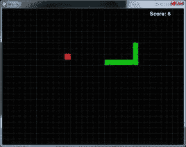

# 第六章：贪吃虫

> 原文：[`inventwithpython.com/pygame/chapter6.html`](https://inventwithpython.com/pygame/chapter6.html)
> 
> 译者：[飞龙](https://github.com/wizardforcel)
> 
> 协议：[CC BY-NC-SA 4.0](https://creativecommons.org/licenses/by-nc-sa/4.0/)

     

## 如何玩贪吃虫

贪吃虫是 Nibbles 的克隆。玩家开始控制一个不断在屏幕上移动的短蠕虫。玩家无法停止或减慢蠕虫，但他们可以控制它转向的方向。红苹果随机出现在屏幕上，玩家必须移动蠕虫以使其吃掉苹果。每次蠕虫吃掉一个苹果，蠕虫就会增长一个段，并且新的苹果会随机出现在屏幕上。如果蠕虫撞到自己或屏幕边缘，游戏就结束了。

## 贪吃虫源代码

此源代码可从[`invpy.com/wormy.py`](http://invpy.com/wormy.py)下载。如果出现任何错误消息，请查看错误消息中提到的行号，并检查代码中是否有任何拼写错误。您还可以将代码复制粘贴到[`invpy.com/diff/wormy`](http://invpy.com/diff/wormy)的 Web 表单中，以查看您的代码与书中代码之间的差异。

```py
  # Wormy (a Nibbles clone)
  # By Al Sweigart [[email protected]](/cdn-cgi/l/email-protection)
  # http://inventwithpython.com/pygame
  # Creative Commons BY-NC-SA 3.0 US

  import random, pygame, sys
  from pygame.locals import *

  FPS = 15
 WINDOWWIDTH = 640
 WINDOWHEIGHT = 480
 CELLSIZE = 20
 assert WINDOWWIDTH % CELLSIZE == 0, "Window width must be a multiple of cell size."
 assert WINDOWHEIGHT % CELLSIZE == 0, "Window height must be a multiple of cell size."
 CELLWIDTH = int(WINDOWWIDTH / CELLSIZE)
 CELLHEIGHT = int(WINDOWHEIGHT / CELLSIZE)

#             R    G    B
 WHITE     = (255, 255, 255)
 BLACK     = (  0,   0,   0)
 RED       = (255,   0,   0)
 GREEN     = (  0, 255,   0)
 DARKGREEN = (  0, 155,   0)
 DARKGRAY  = ( 40,  40,  40)
 BGCOLOR = BLACK

 UP = 'up'
 DOWN = 'down'
 LEFT = 'left'
 RIGHT = 'right'

 HEAD = 0 # syntactic sugar: index of the worm's head

def main():
     global FPSCLOCK, DISPLAYSURF, BASICFONT

     pygame.init()
     FPSCLOCK = pygame.time.Clock()
     DISPLAYSURF = pygame.display.set_mode((WINDOWWIDTH, WINDOWHEIGHT))
     BASICFONT = pygame.font.Font('freesansbold.ttf', 18)
     pygame.display.set_caption('Wormy')

     showStartScreen()
     while True:
         runGame()
         showGameOverScreen()

def runGame():
    # Set a random start point.
    startx = random.randint(5, CELLWIDTH - 6)
    starty = random.randint(5, CELLHEIGHT - 6)
    wormCoords = [{'x': startx,     'y': starty},
                  {'x': startx - 1, 'y': starty},
                  {'x': startx - 2, 'y': starty}]
    direction = RIGHT

    # Start the apple in a random place.
    apple = getRandomLocation()

    while True: # main game loop
        for event in pygame.event.get(): # event handling loop
            if event.type == QUIT:
                terminate()
            elif event.type == KEYDOWN:
                if (event.key == K_LEFT or event.key == K_a) and direction != RIGHT:
                    direction = LEFT
                elif (event.key == K_RIGHT or event.key == K_d) and direction != LEFT:
                    direction = RIGHT
                elif (event.key == K_UP or event.key == K_w) and direction != DOWN:
                    direction = UP
                elif (event.key == K_DOWN or event.key == K_s) and direction != UP:
                    direction = DOWN
                elif event.key == K_ESCAPE:
                    terminate()

        # check if the worm has hit itself or the edge
        if wormCoords[HEAD]['x'] == -1 or wormCoords[HEAD]['x'] == CELLWIDTH or wormCoords[HEAD]['y'] == -1 or wormCoords[HEAD]['y'] == CELLHEIGHT:
            return # game over
        for wormBody in wormCoords[1:]:
            if wormBody['x'] == wormCoords[HEAD]['x'] and wormBody['y'] == wormCoords[HEAD]['y']:
                return # game over

        # check if worm has eaten an apply
        if wormCoords[HEAD]['x'] == apple['x'] and wormCoords[HEAD]['y'] == apple['y']:
            # don't remove worm's tail segment
            apple = getRandomLocation() # set a new apple somewhere
        else:
            del wormCoords[-1] # remove worm's tail segment

        # move the worm by adding a segment in the direction it is moving
        if direction == UP:
            newHead = {'x': wormCoords[HEAD]['x'], 'y': wormCoords[HEAD]['y'] - 1}
        elif direction == DOWN:
            newHead = {'x': wormCoords[HEAD]['x'], 'y': wormCoords[HEAD]['y'] + 1}
        elif direction == LEFT:
            newHead = {'x': wormCoords[HEAD]['x'] - 1, 'y': wormCoords[HEAD]['y']}
        elif direction == RIGHT:
            newHead = {'x': wormCoords[HEAD]['x'] + 1, 'y': wormCoords[HEAD]['y']}
         wormCoords.insert(0, newHead)
        DISPLAYSURF.fill(BGCOLOR)
         drawGrid()
        drawWorm(wormCoords)
        drawApple(apple)
        drawScore(len(wormCoords) - 3)
        pygame.display.update()
        FPSCLOCK.tick(FPS)

def drawPressKeyMsg():
    pressKeySurf = BASICFONT.render('Press a key to play.', True, DARKGRAY)
    pressKeyRect = pressKeySurf.get_rect()
    pressKeyRect.topleft = (WINDOWWIDTH - 200, WINDOWHEIGHT - 30)
    DISPLAYSURF.blit(pressKeySurf, pressKeyRect)

def checkForKeyPress():
    if len(pygame.event.get(QUIT)) > 0:
        terminate()

    keyUpEvents = pygame.event.get(KEYUP)
     if len(keyUpEvents) == 0:
         return None
    if keyUpEvents[0].key == K_ESCAPE:
        terminate()
    return keyUpEvents[0].key

def showStartScreen():
    titleFont = pygame.font.Font('freesansbold.ttf', 100)
    titleSurf1 = titleFont.render('Wormy!', True, WHITE, DARKGREEN)
    titleSurf2 = titleFont.render('Wormy!', True, GREEN)

    degrees1 = 0
    degrees2 = 0
    while True:
        DISPLAYSURF.fill(BGCOLOR)
        rotatedSurf1 = pygame.transform.rotate(titleSurf1, degrees1)
        rotatedRect1 = rotatedSurf1.get_rect()
        rotatedRect1.center = (WINDOWWIDTH / 2, WINDOWHEIGHT / 2)
        DISPLAYSURF.blit(rotatedSurf1, rotatedRect1)

        rotatedSurf2 = pygame.transform.rotate(titleSurf2, degrees2)
        rotatedRect2 = rotatedSurf2.get_rect()
        rotatedRect2.center = (WINDOWWIDTH / 2, WINDOWHEIGHT / 2)
        DISPLAYSURF.blit(rotatedSurf2, rotatedRect2)

        drawPressKeyMsg()

        if checkForKeyPress():
            pygame.event.get() # clear event queue
             return
        pygame.display.update()
        FPSCLOCK.tick(FPS)
        degrees1 += 3 # rotate by 3 degrees each frame
        degrees2 += 7 # rotate by 7 degrees each frame

def terminate():
    pygame.quit()
    sys.exit()

def getRandomLocation():
    return {'x': random.randint(0, CELLWIDTH - 1), 'y': random.randint(0, CELLHEIGHT - 1)}

def showGameOverScreen():
    gameOverFont = pygame.font.Font('freesansbold.ttf', 150)
    gameSurf = gameOverFont.render('Game', True, WHITE)
    overSurf = gameOverFont.render('Over', True, WHITE)
    gameRect = gameSurf.get_rect()
    overRect = overSurf.get_rect()
    gameRect.midtop = (WINDOWWIDTH / 2, 10)
    overRect.midtop = (WINDOWWIDTH / 2, gameRect.height + 10 + 25)

    DISPLAYSURF.blit(gameSurf, gameRect)
    DISPLAYSURF.blit(overSurf, overRect)
    drawPressKeyMsg()
    pygame.display.update()
    pygame.time.wait(500)
    checkForKeyPress() # clear out any key presses in the event queue

    while True:
        if checkForKeyPress():
            pygame.event.get() # clear event queue
             return

def drawScore(score):
    scoreSurf = BASICFONT.render('Score: %s' % (score), True, WHITE)
    scoreRect = scoreSurf.get_rect()
    scoreRect.topleft = (WINDOWWIDTH - 120, 10)
    DISPLAYSURF.blit(scoreSurf, scoreRect)

def drawWorm(wormCoords):
    for coord in wormCoords:
        x = coord['x'] * CELLSIZE
        y = coord['y'] * CELLSIZE
        wormSegmentRect = pygame.Rect(x, y, CELLSIZE, CELLSIZE)
        pygame.draw.rect(DISPLAYSURF, DARKGREEN, wormSegmentRect)
        wormInnerSegmentRect = pygame.Rect(x + 4, y + 4, CELLSIZE - 8, CELLSIZE - 8)
        pygame.draw.rect(DISPLAYSURF, GREEN, wormInnerSegmentRect)

def drawApple(coord):
    x = coord['x'] * CELLSIZE
    y = coord['y'] * CELLSIZE
    appleRect = pygame.Rect(x, y, CELLSIZE, CELLSIZE)
    pygame.draw.rect(DISPLAYSURF, RED, appleRect)

def drawGrid():
    for x in range(0, WINDOWWIDTH, CELLSIZE): # draw vertical lines
        pygame.draw.line(DISPLAYSURF, DARKGRAY, (x, 0), (x, WINDOWHEIGHT))
    for y in range(0, WINDOWHEIGHT, CELLSIZE): # draw horizontal lines
        pygame.draw.line(DISPLAYSURF, DARKGRAY, (0, y), (WINDOWWIDTH, y))

if __name__ == '__main__':
    main()

```

## 网格


如果你玩游戏一点点，你会注意到苹果和蠕虫身体的部分总是沿着网格线。我们将这个网格中的每个正方形称为一个单元格（这不一定是网格中的空间的称呼，这只是我想出来的一个名字）。这些单元格有自己的笛卡尔坐标系，其中（0, 0）是左上角的单元格，（31, 23）是右下角的单元格。

## 设置代码

```py
  # Wormy (a Nibbles clone)
  # By Al Sweigart [[email protected]](/cdn-cgi/l/email-protection)
  # http://inventwithpython.com/pygame
  # Creative Commons BY-NC-SA 3.0 US

  import random, pygame, sys
  from pygame.locals import *

  FPS = 15
 WINDOWWIDTH = 640
 WINDOWHEIGHT = 480
 CELLSIZE = 20
 assert WINDOWWIDTH % CELLSIZE == 0, "Window width must be a multiple of cell size."
 assert WINDOWHEIGHT % CELLSIZE == 0, "Window height must be a multiple of cell size."
 CELLWIDTH = int(WINDOWWIDTH / CELLSIZE)
 CELLHEIGHT = int(WINDOWHEIGHT / CELLSIZE)

```

程序开始时的代码只是设置了游戏中使用的一些常量变量。单元格的宽度和高度存储在`CELLSIZE`中。第 13 和 14 行的`assert`语句确保单元格完全适合窗口。例如，如果`CELLSIZE`为`10`，并且`WINDOWWIDTH`或`WINDOWHEIGHT`常量设置为`15`，那么只能容纳 1.5 个单元格。`assert`语句确保窗口中只有整数个单元格。

```py
 #             R    G    B
 WHITE     = (255, 255, 255)
 BLACK     = (  0,   0,   0)
 RED       = (255,   0,   0)
 GREEN     = (  0, 255,   0)
 DARKGREEN = (  0, 155,   0)
 DARKGRAY  = ( 40,  40,  40)
 BGCOLOR = BLACK

 UP = 'up'
 DOWN = 'down'
 LEFT = 'left'
 RIGHT = 'right'

 HEAD = 0 # syntactic sugar: index of the worm's head

```

在第 19 到 32 行设置了更多的常量。`HEAD`常量将在本章后面解释。

## `main()`函数

```py
 def main():
     global FPSCLOCK, DISPLAYSURF, BASICFONT

     pygame.init()
     FPSCLOCK = pygame.time.Clock()
     DISPLAYSURF = pygame.display.set_mode((WINDOWWIDTH, WINDOWHEIGHT))
     BASICFONT = pygame.font.Font('freesansbold.ttf', 18)
     pygame.display.set_caption('Wormy')

     showStartScreen()
     while True:
         runGame()
         showGameOverScreen()

```

在贪吃虫游戏程序中，我们将代码的主要部分放在一个名为`runGame()`的函数中。这是因为我们只想在程序启动时显示“开始画面”（旋转的“贪吃虫”文本动画）一次（通过调用`showStartScreen()`函数）。然后我们想调用`runGame()`，这将开始一场贪吃虫游戏。当玩家的蠕虫撞到墙壁或自己并导致游戏结束时，此函数将返回。

在那时，我们将通过调用`showGameOverScreen()`显示游戏结束画面。当该函数调用返回时，循环将返回到开始，并再次调用`runGame()`。第 44 行的`while`循环将一直循环，直到程序终止。

## 一个单独的`runGame()`函数

```py
def runGame():
    # Set a random start point.
    startx = random.randint(5, CELLWIDTH - 6)
    starty = random.randint(5, CELLHEIGHT - 6)
    wormCoords = [{'x': startx,     'y': starty},
                  {'x': startx - 1, 'y': starty},
                  {'x': startx - 2, 'y': starty}]
    direction = RIGHT

    # Start the apple in a random place.
    apple = getRandomLocation()

```

在游戏开始时，我们希望蠕虫在随机位置开始（但不要太靠近棋盘的边缘），因此我们在`startx`和`starty`中存储一个随机坐标。（请记住，`CELLWIDTH`和`CELLHEIGHT`是窗口的宽度和高度，而不是像素的宽度和高度）。

蠕虫的身体将存储在一个字典值列表中。每个蠕虫身体段都将有一个字典值。该字典将具有`'x'`和`'y'`键，用于该身体段的 XY 坐标。身体的头部将位于`startx`和`starty`。其他两个身体段将位于头部的左侧一个和两个单元格。

蠕虫的头部将始终是`wormCoords[0]`的身体部分。为了使这段代码更易读，我们在第 32 行将`HEAD`常量设置为`0`，这样我们就可以使用`wormCoords[HEAD]`而不是`wormCoords[0]`。

## 事件处理循环

```py
    while True: # main game loop
        for event in pygame.event.get(): # event handling loop
            if event.type == QUIT:
                terminate()
            elif event.type == KEYDOWN:
                if (event.key == K_LEFT or event.key == K_a) and direction != RIGHT:
                    direction = LEFT
                elif (event.key == K_RIGHT or event.key == K_d) and direction != LEFT:
                    direction = RIGHT
                elif (event.key == K_UP or event.key == K_w) and direction != DOWN:
                    direction = UP
                elif (event.key == K_DOWN or event.key == K_s) and direction != UP:
                    direction = DOWN
                elif event.key == K_ESCAPE:
                    terminate()

```

第 61 行是主游戏循环的开始，第 62 行是事件处理循环的开始。如果事件是`QUIT`事件，那么我们调用`terminate()`（我们已经在之前的游戏程序中定义了相同的`terminate()`函数）。

否则，如果事件是`KEYDOWN`事件，那么我们检查按下的键是否是箭头键或者 WASD 键。我们希望进行额外的检查，以防蛇转向自身。例如，如果蛇正在向左移动，那么如果玩家意外按下右箭头键，蛇就会立即向右移动并撞到自己。

这就是为什么我们要检查`direction`变量的当前值。这样，如果玩家意外按下一个会导致蛇立即撞到墙壁的箭头键，我们就忽略那个按键。

## 碰撞检测

```py
        # check if the worm has hit itself or the edge
        if wormCoords[HEAD]['x'] == -1 or wormCoords[HEAD]['x'] == CELLWIDTH or wormCoords[HEAD]['y'] == -1 or wormCoords[HEAD]['y'] == CELLHEIGHT:
            return # game over
        for wormBody in wormCoords[1:]:
            if wormBody['x'] == wormCoords[HEAD]['x'] and wormBody['y'] == wormCoords[HEAD]['y']:
                return # game over

```

当蛇头移出网格边缘或者蛇头移动到已经被其他身体段占据的单元格时，蛇就撞到了。

我们可以通过检查蛇头是否移出了网格的边缘来判断。方法是看蛇头的 X 坐标（存储在`wormCoords[HEAD]['x']`中）是否为`-1`（超出了网格的左边缘）或者等于`CELLWIDTH`（超出了右边缘，因为最右边的 X 坐标比`CELLWIDTH`少 1）。

如果蛇头的 Y 坐标（存储在`wormCoords[HEAD]['y']`中）要么是`-1`（超出了顶部边缘），要么是`CELLHEIGHT`（超出了底部边缘），那么蛇头也已经移出了网格。

我们只需要在`runGame()`中返回来结束当前游戏。当`runGame()`返回到`main()`中的函数调用时，`runGame()`调用后的下一行（第 46 行）是调用`showGameOverScreen()`，它会显示大大的“游戏结束”文字。这就是为什么我们在第 79 行有`return`语句。

第 80 行循环遍历蛇头后的每个身体段在`wormCoords`中（蛇头在索引`0`）。这就是为什么`for`循环迭代`wormCoords[1:]`而不是只迭代`wormCoords`。如果身体段的`'x'`和`'y'`值与蛇头的`'x'`和`'y'`相同，那么我们也通过在`runGame()`函数中返回来结束游戏。

## 检测与苹果的碰撞

```py
        # check if worm has eaten an apply
        if wormCoords[HEAD]['x'] == apple['x'] and wormCoords[HEAD]['y'] == apple['y']:
            # don't remove worm's tail segment
            apple = getRandomLocation() # set a new apple somewhere
        else:
            del wormCoords[-1] # remove worm's tail segment

```

我们对蛇头和苹果的 XY 坐标之间进行类似的碰撞检测。如果它们匹配，我们将苹果的坐标设置为一个随机的新位置（从`getRandomLocation()`的返回值中获取）。

如果蛇头没有与苹果碰撞，那么我们删除`wormCoords`列表中的最后一个身体段。记住，负整数索引从列表末尾开始计数。所以`0`是列表中第一个项目的索引，`1`是第二个项目的索引，`-1`是列表中的最后一个项目的索引，`-2`是倒数第二个项目的索引。

第 91 到 100 行的代码（在“移动蛇”部分中描述）将根据蛇的移动方向在`wormCoords`中添加一个新的身体段（用于蛇头）。这将使蛇变长一个段。当蛇吃掉苹果时不删除最后一个身体段，蛇的整体长度增加了一个。但是当第 89 行删除最后一个身体段时，大小保持不变，因为紧接着会添加一个新的蛇头段。

## 移动蛇

```py
        # move the worm by adding a segment in the direction it is moving
        if direction == UP:
            newHead = {'x': wormCoords[HEAD]['x'], 'y': wormCoords[HEAD]['y'] - 1}
        elif direction == DOWN:
            newHead = {'x': wormCoords[HEAD]['x'], 'y': wormCoords[HEAD]['y'] + 1}
        elif direction == LEFT:
            newHead = {'x': wormCoords[HEAD]['x'] - 1, 'y': wormCoords[HEAD]['y']}
        elif direction == RIGHT:
            newHead = {'x': wormCoords[HEAD]['x'] + 1, 'y': wormCoords[HEAD]['y']}
         wormCoords.insert(0, newHead)

```

为了移动蛇，我们在`wormCoords`列表的开头添加一个新的身体段。因为身体段被添加到列表的开头，它将成为新的蛇头。新蛇头的坐标将紧邻旧蛇头的坐标。无论是向 X 坐标还是 Y 坐标添加还是减去`1`取决于蛇的移动方向。

新的蛇头段被添加到`wormCoords`中，使用`insert()`列表方法在第 100 行。

## `insert()`列表方法

与`append()`列表方法只能在列表末尾添加项目不同，`insert()`列表方法可以在列表中的任何位置添加项目。`insert()`的第一个参数是项目应该放置的索引（原本在这个索引及之后的所有项目的索引都会增加一）。如果第一个参数传递的参数大于列表的长度，项目将被简单地添加到列表的末尾（就像`append()`一样）。`insert()`的第二个参数是要添加的项目值。在交互式 shell 中输入以下内容，看看`insert()`是如何工作的：

```py
>>> spam = ['cat', 'dog', 'bat']
>>> spam.insert(0, 'frog')
>>> spam
['frog', 'cat', 'dog', 'bat']
>>> spam.insert(10, 42)
>>> spam
['frog', 'cat', 'dog', 'bat', 42]
>>> spam.insert(2, 'horse')
>>> spam
['frog', 'cat', 'horse', 'dog', 'bat', 42]
>>> 

```

## 绘制屏幕

```py
        DISPLAYSURF.fill(BGCOLOR)
         drawGrid()
        drawWorm(wormCoords)
        drawApple(apple)
        drawScore(len(wormCoords) - 3)
        pygame.display.update()
        FPSCLOCK.tick(FPS)

```

在`runGame()`函数中绘制屏幕的代码非常简单。第 101 行填充整个显示 Surface 的背景颜色。第 102 到 105 行绘制了网格、蠕虫、苹果和分数到显示 Surface 上。然后调用`pygame.display.update()`将显示 Surface 绘制到实际的计算机屏幕上。

## 将“按键开始”文本绘制到屏幕上

```py
def drawPressKeyMsg():
    pressKeySurf = BASICFONT.render('Press a key to play.', True, DARKGRAY)
    pressKeyRect = pressKeySurf.get_rect()
    pressKeyRect.topleft = (WINDOWWIDTH - 200, WINDOWHEIGHT - 30)
    DISPLAYSURF.blit(pressKeySurf, pressKeyRect)

```

当开始屏幕动画正在播放或游戏结束屏幕正在显示时，右下角会有一些小文本，上面写着“按键开始游戏”。我们不想在`showStartScreen()`和`showGameOverScreen()`中重复代码，所以我们将它放在一个单独的函数中，并从`showStartScreen()`和`showGameOverScreen()`中调用该函数。

## `checkForKeyPress()`函数

```py
def checkForKeyPress():
    if len(pygame.event.get(QUIT)) > 0:
        terminate()

    keyUpEvents = pygame.event.get(KEYUP)
     if len(keyUpEvents) == 0:
         return None
    if keyUpEvents[0].key == K_ESCAPE:
        terminate()
    return keyUpEvents[0].key

```

这个函数首先检查事件队列中是否有任何`QUIT`事件。第 117 行的`pygame.event.get()`调用返回事件队列中所有`QUIT`事件的列表（因为我们将`QUIT`作为参数传递）。如果事件队列中没有`QUIT`事件，那么`pygame.event.get()`返回的列表将是空列表：`[]`

第 117 行的`len()`调用将在`pygame.event.get()`返回空列表时返回`0`。如果`pygame.event.get()`返回的列表中有多于零个项目（记住，这个列表中的任何项目只会是`QUIT`事件，因为我们将`QUIT`作为参数传递给`pygame.event.get()`），那么第 118 行将调用`terminate()`函数，程序将终止。

之后，调用`pygame.event.get()`获取事件队列中的任何`KEYUP`事件的列表。如果按键事件是 Esc 键的话，那么程序也会在这种情况下终止。否则，`checkForKeyPress()`函数将从`pygame.event.get()`返回的列表中返回第一个按键事件对象。

## 开始屏幕

```py
def showStartScreen():
    titleFont = pygame.font.Font('freesansbold.ttf', 100)
    titleSurf1 = titleFont.render('Wormy!', True, WHITE, DARKGREEN)
    titleSurf2 = titleFont.render('Wormy!', True, GREEN)

    degrees1 = 0
    degrees2 = 0
    while True:
        DISPLAYSURF.fill(BGCOLOR)

```

当贪吃虫游戏程序首次运行时，玩家不会自动开始游戏。相反，会出现一个开始屏幕，告诉玩家他们正在运行的程序是什么。开始屏幕还给玩家一个准备游戏开始的机会（否则玩家可能不会准备好，在第一局游戏中就会失败）。

贪吃虫开始屏幕需要两个 Surface 对象，上面绘制了“Wormy！”文本。这是`render()`方法在第 130 和 131 行创建的。文本将会很大：第 129 行的`Font()`构造函数调用创建了一个大小为 100 点的 Font 对象。第一个“Wormy！”文本将是白色文本，带有深绿色背景，另一个将是绿色文本，带有透明背景。

第 135 行开始了开始屏幕的动画循环。在这个动画期间，两个文本将被旋转并绘制到显示 Surface 对象上。

## 旋转开始屏幕文本

```py
        rotatedSurf1 = pygame.transform.rotate(titleSurf1, degrees1)
        rotatedRect1 = rotatedSurf1.get_rect()
        rotatedRect1.center = (WINDOWWIDTH / 2, WINDOWHEIGHT / 2)
        DISPLAYSURF.blit(rotatedSurf1, rotatedRect1)

        rotatedSurf2 = pygame.transform.rotate(titleSurf2, degrees2)
        rotatedRect2 = rotatedSurf2.get_rect()
        rotatedRect2.center = (WINDOWWIDTH / 2, WINDOWHEIGHT / 2)
        DISPLAYSURF.blit(rotatedSurf2, rotatedRect2)

        drawPressKeyMsg()

        if checkForKeyPress():
            pygame.event.get() # clear event queue
             return
        pygame.display.update()
        FPSCLOCK.tick(FPS)

```

`showStartScreen()`函数将旋转 Surface 对象上的图像。第一个参数是要制作旋转副本的 Surface 对象。第二个参数是要旋转 Surface 的角度。`pygame.transform.rotate()`函数不会改变你传递给它的 Surface 对象，而是返回一个新的 Surface 对象，上面绘制了旋转后的图像。

请注意，这个新的 Surface 对象可能会比原来的大，因为所有 Surface 对象都代表矩形区域，旋转后的 Surface 的角会超出原始 Surface 的宽度和高度。下面的图片中有一个黑色矩形以及一个略微旋转的版本。为了制作一个可以容纳旋转后的矩形的 Surface 对象（在下面的图片中是灰色的），它必须比原始黑色矩形的 Surface 对象大：


你旋转的角度以度为单位，这是一个旋转的度量。一个圆有 360 度。完全不旋转是 0 度。逆时针旋转一四分之一是 90 度。要顺时针旋转，传递一个负整数。旋转 360 度是将图像一直旋转，这意味着最终你得到的图像与旋转 0 度时的图像相同。事实上，如果你传递给`pygame.transform.rotate()`的旋转参数是 360 或更大，那么 Pygame 会自动从中减去 360，直到得到一个小于 360 的数字。这张图片展示了不同旋转角度的几个例子：


两个旋转后的“Wormy!” Surface 对象在动画循环的每一帧上都被 blitted 到显示 Surface 上的第 140 和 145 行。

在第 147 行，`drawPressKeyMsg()`函数调用在显示 Surface 对象的下角绘制“按键开始游戏。”的文本。这个动画循环会一直循环，直到`checkForKeyPress()`返回一个不是`None`的值，这会在玩家按下一个键时发生。在返回之前，`pygame.event.get()`被调用来清除在显示开始画面时在事件队列中积累的任何其他事件。

## 旋转不完美

你可能会想为什么我们将旋转后的 Surface 存储在一个单独的变量中，而不是只覆盖`titleSurf1`和`titleSurf2`变量。有两个原因。

首先，旋转 2D 图像永远不是完全完美的。旋转后的图像总是近似的。如果你将图像逆时针旋转 10 度，然后再顺时针旋转 10 度，你得到的图像将不是你最初开始的完全相同的图像。可以把它想象成制作一份复印件，然后再复印第一份复印件，再复印另一份复印件。如果你一直这样做，图像会越来越糟糕，因为轻微的扭曲会累积起来。

（唯一的例外是如果你将图像旋转 90 度的倍数，比如 0、90、180、270 或 360 度。在这种情况下，像素可以旋转而不会出现任何失真。）

其次，如果你旋转一个 2D 图像，那么旋转后的图像会比原始图像稍微大一些。如果你旋转了旋转后的图像，那么下一个旋转后的图像将再次稍微变大。如果你一直这样做，最终图像将变得太大，Pygame 无法处理，你的程序将崩溃并显示错误消息，pygame.error: Width or height is too large。

```py
        degrees1 += 3 # rotate by 3 degrees each frame
        degrees2 += 7 # rotate by 7 degrees each frame

```

我们旋转两个“Wormy!”文本 Surface 对象的角度存储在`degrees1`和`degrees2`中。在每次动画循环迭代中，我们将`degrees1`中存储的数字增加`3`，`degrees2`增加`7`。这意味着在下一次动画循环迭代中，白色文本“Wormy!” Surface 对象将再次旋转 3 度，绿色文本“Wormy!” Surface 对象将再次旋转 7 度。这就是为什么一个 Surface 对象旋转得比另一个慢。

```py
def terminate():
    pygame.quit()
    sys.exit()

```

`terminate()`函数调用`pygame.quit()`和`sys.exit()`以正确关闭游戏。它与之前游戏程序中的`terminate()`函数相同。

## 决定苹果出现的位置

```py
def getRandomLocation():
    return {'x': random.randint(0, CELLWIDTH - 1), 'y': random.randint(0, CELLHEIGHT - 1)}

```

每当需要苹果的新坐标时，都会调用`getRandomLocation()`函数。该函数返回一个带有键`'x'`和`'y'`的字典，其值设置为随机的 XY 坐标。

## 游戏结束屏幕

```py
def showGameOverScreen():
    gameOverFont = pygame.font.Font('freesansbold.ttf', 150)
    gameSurf = gameOverFont.render('Game', True, WHITE)
    overSurf = gameOverFont.render('Over', True, WHITE)
    gameRect = gameSurf.get_rect()
    overRect = overSurf.get_rect()
    gameRect.midtop = (WINDOWWIDTH / 2, 10)
    overRect.midtop = (WINDOWWIDTH / 2, gameRect.height + 10 + 25)

    DISPLAYSURF.blit(gameSurf, gameRect)
    DISPLAYSURF.blit(overSurf, overRect)
    drawPressKeyMsg()
    pygame.display.update()

```

游戏结束屏幕与开始屏幕类似，只是没有动画。单词“Game”和“Over”被渲染到两个 Surface 对象上，然后绘制在屏幕上。

```py
    pygame.time.wait(500)
    checkForKeyPress() # clear out any key presses in the event queue

    while True:
        if checkForKeyPress():
            pygame.event.get() # clear event queue
             return

```

游戏结束文本将一直显示在屏幕上，直到玩家按下键。为了确保玩家不会意外地按下键，我们将在第 180 行调用`pygame.time.wait()`来暂停半秒钟。（500 参数代表 500 毫秒的暂停，即半秒钟。）

然后，调用`checkForKeyPress()`，以便忽略自`showGameOverScreen()`函数开始以来产生的任何按键事件。这种暂停和丢弃按键事件是为了防止以下情况发生：假设玩家试图在最后一刻转向屏幕边缘，但按键太晚按下并撞到了棋盘的边缘。如果发生这种情况，那么按键按下将会在`showGameOverScreen()`被调用之后发生，那个按键按下会导致游戏结束屏幕几乎立即消失。接下来的游戏会立即开始，并可能让玩家感到惊讶。添加这个暂停有助于使游戏更加“用户友好”。

## 绘图函数

绘制分数、蠕虫、苹果和网格的代码都放入了单独的函数中。

```py
def drawScore(score):
    scoreSurf = BASICFONT.render('Score: %s' % (score), True, WHITE)
    scoreRect = scoreSurf.get_rect()
    scoreRect.topleft = (WINDOWWIDTH - 120, 10)
    DISPLAYSURF.blit(scoreSurf, scoreRect)

```

`drawScore()`函数只是在显示 Surface 对象上渲染和绘制传入其`score`参数的分数文本。

```py
def drawWorm(wormCoords):
    for coord in wormCoords:
        x = coord['x'] * CELLSIZE
        y = coord['y'] * CELLSIZE
        wormSegmentRect = pygame.Rect(x, y, CELLSIZE, CELLSIZE)
        pygame.draw.rect(DISPLAYSURF, DARKGREEN, wormSegmentRect)
        wormInnerSegmentRect = pygame.Rect(x + 4, y + 4, CELLSIZE - 8, CELLSIZE - 8)
        pygame.draw.rect(DISPLAYSURF, GREEN, wormInnerSegmentRect)

```

`drawWorm()`函数将为蠕虫身体的每个部分绘制一个绿色框。这些部分被传递到`wormCoords`参数中，这是一个带有`'x'`键和`'y'`键的字典列表。第 196 行的`for`循环遍历`wormCoords`中的每个字典值。

因为网格坐标占据整个窗口并且从 0,0 像素开始，所以很容易从网格坐标转换为像素坐标。第 197 和 198 行简单地将`coord['x']`和`coord['y']`坐标乘以`CELLSIZE`。

第 199 行创建了一个蠕虫段的 Rect 对象，该对象将传递给第 200 行的`pygame.draw.rect()`函数。请记住，网格中的每个单元格的宽度和高度都是`CELLSIZE`，因此段的 Rect 对象的大小应该是这样的。第 200 行为段绘制了一个深绿色的矩形。然后在此之上，绘制了一个较小的明亮绿色矩形。这使得蠕虫看起来更漂亮一些。

内部明亮的绿色矩形从单元格的左上角开始向右和向下各 4 个像素。该矩形的宽度和高度比单元格尺寸小 8 个像素，因此右侧和底部也会有 4 个像素的边距。

```py
def drawApple(coord):
    x = coord['x'] * CELLSIZE
    y = coord['y'] * CELLSIZE
    appleRect = pygame.Rect(x, y, CELLSIZE, CELLSIZE)
    pygame.draw.rect(DISPLAYSURF, RED, appleRect)

```

`drawApple()`函数与`drawWorm()`非常相似，只是因为红苹果只是填满单元格的一个矩形，所以函数需要做的就是转换为像素坐标（这就是第 206 和 207 行所做的），使用苹果的位置和大小创建 Rect 对象（第 208 行），然后将这个 Rect 对象传递给`pygame.draw.rect()`函数。

```py
def drawGrid():
    for x in range(0, WINDOWWIDTH, CELLSIZE): # draw vertical lines
        pygame.draw.line(DISPLAYSURF, DARKGRAY, (x, 0), (x, WINDOWHEIGHT))
    for y in range(0, WINDOWHEIGHT, CELLSIZE): # draw horizontal lines
        pygame.draw.line(DISPLAYSURF, DARKGRAY, (0, y), (WINDOWWIDTH, y))

```

为了更容易地可视化单元格的网格，我们调用`pygame.draw.line()`来绘制网格的每条垂直和水平线。

通常，要绘制所需的 32 条垂直线，我们需要调用 32 次`pygame.draw.line()`，坐标如下：

```py
pygame.draw.line(DISPLAYSURF, DARKGRAY, (0, 0), (0, WINDOWHEIGHT))
pygame.draw.line(DISPLAYSURF, DARKGRAY, (20, 0), (20, WINDOWHEIGHT))
pygame.draw.line(DISPLAYSURF, DARKGRAY, (40, 0), (40, WINDOWHEIGHT))
pygame.draw.line(DISPLAYSURF, DARKGRAY, (60, 0), (60, WINDOWHEIGHT))
...skipped for brevity...
pygame.draw.line(DISPLAYSURF, DARKGRAY, (560, 0), (560, WINDOWHEIGHT))
pygame.draw.line(DISPLAYSURF, DARKGRAY, (580, 0), (580, WINDOWHEIGHT))
pygame.draw.line(DISPLAYSURF, DARKGRAY, (600, 0), (600, WINDOWHEIGHT))
pygame.draw.line(DISPLAYSURF, DARKGRAY, (620, 0), (620, WINDOWHEIGHT))

```

我们可以在`for`循环内只有一行代码，而不是输入所有这些代码行。注意垂直线的模式是，起点和终点的 X 坐标从`0`开始，增加到`620`，每次增加`20`。Y 坐标始终为起点`0`和终点参数`WINDOWHEIGHT`。这意味着`for`循环应该迭代`range(0, 640, 20)`。这就是为什么 213 行的`for`循环迭代`range(0, WINDOWWIDTH, CELLSIZE)`。

对于水平线，坐标将是：

```py
pygame.draw.line(DISPLAYSURF, DARKGRAY, (0, 0), (WINDOWWIDTH, 0))
pygame.draw.line(DISPLAYSURF, DARKGRAY, (0, 20), (WINDOWWIDTH, 20))
pygame.draw.line(DISPLAYSURF, DARKGRAY, (0, 40), (WINDOWWIDTH, 40))
pygame.draw.line(DISPLAYSURF, DARKGRAY, (0, 60), (WINDOWWIDTH, 60))
...skipped for brevity...
pygame.draw.line(DISPLAYSURF, DARKGRAY, (0, 400), (WINDOWWIDTH, 400))
pygame.draw.line(DISPLAYSURF, DARKGRAY, (0, 420), (WINDOWWIDTH, 420))
pygame.draw.line(DISPLAYSURF, DARKGRAY, (0, 440), (WINDOWWIDTH, 440))
pygame.draw.line(DISPLAYSURF, DARKGRAY, (0, 460), (WINDOWWIDTH, 460))

```

Y 坐标范围从`0`到`460`，每次增加`20`。X 坐标始终为起点`0`和终点参数`WINDOWWIDTH`。我们也可以在这里使用`for`循环，这样我们就不必输入所有这些`pygame.draw.line()`调用。

注意到调用所需的规律模式并使用循环是聪明的程序员的技巧，可以帮助我们节省大量的输入。我们本可以输入所有 56 个`pygame.draw.line()`调用，程序仍然可以正常工作。但通过稍微聪明一点，我们可以节省很多工作。

```py
if __name__ == '__main__':
    main()

```

在所有函数、常量和全局变量都被定义和创建之后，调用`main()`函数来启动游戏。

## 不要重复使用变量名

再次看一下`drawWorm()`函数中的一些代码行：

```py
        wormSegmentRect = pygame.Rect(x, y, CELLSIZE, CELLSIZE)
        pygame.draw.rect(DISPLAYSURF, DARKGREEN, wormSegmentRect)
        wormInnerSegmentRect = pygame.Rect(x + 4, y + 4, CELLSIZE - 8, CELLSIZE - 8)
        pygame.draw.rect(DISPLAYSURF, GREEN, wormInnerSegmentRect)

```

注意到 199 行和 201 行分别创建了两个不同的 Rect 对象。199 行创建的 Rect 对象存储在`wormSegmentRect`局部变量中，并传递给 200 行的`pygame.draw.rect()`函数。201 行创建的 Rect 对象存储在`wormInnerSegmentRect`局部变量中，并传递给 202 行的`pygame.draw.rect()`函数。

每次创建一个变量，都会占用计算机的一小部分内存。你可能会认为重用`wormSegmentRect`变量来存储两个 Rect 对象是很聪明的，就像这样：

```py
        wormSegmentRect = pygame.Rect(x, y, CELLSIZE, CELLSIZE)
        pygame.draw.rect(DISPLAYSURF, DARKGREEN, wormSegmentRect)
        wormSegmentRect = pygame.Rect(x + 4, y + 4, CELLSIZE - 8, CELLSIZE - 8)
        pygame.draw.rect(DISPLAYSURF, GREEN, wormInnerSegmentRect)

```

因为 199 行的`pygame.Rect()`返回的 Rect 对象在 200 行后不再需要，我们可以覆盖这个值并重用变量来存储 201 行的`pygame.Rect()`返回的 Rect 对象。由于我们现在使用的变量更少，我们节省了内存，对吗？

虽然这在技术上是正确的，但你真的只是节省了一点内存。现代计算机的内存有数十亿字节。所以节省并不是那么大。与此同时，重用变量会降低代码的可读性。如果一个程序员在编写后阅读这段代码，他们会看到`wormSegmentRect`被传递给 200 行和 202 行的`pygame.draw.rect()`调用。如果他们试图找到第一次给`wormSegmentRect`变量赋值的地方，他们会看到 199 行的`pygame.Rect()`调用。他们可能没有意识到 199 行的`pygame.Rect()`调用返回的 Rect 对象与 202 行的`pygame.draw.rect()`调用中传递的对象不同。

像这样的小事情会使你更难理解你的程序是如何工作的。不仅仅是其他程序员看你的代码会感到困惑。当你在写完几周后再看你自己的代码时，你可能会很难记住它是如何工作的。代码的可读性比在这里和那里节省一些内存更重要。

对于额外的编程练习，你可以从[`invpy.com/buggy/wormy`](http://invpy.com/buggy/wormy)下载贪吃虫的有 bug 版本，并尝试弄清楚如何修复这些 bug。
