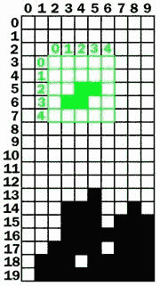

# 第七章：俄罗斯方块

> 原文：[`inventwithpython.com/pygame/chapter7.html`](https://inventwithpython.com/pygame/chapter7.html)
> 
> 译者：[飞龙](https://github.com/wizardforcel)
> 
> 协议：[CC BY-NC-SA 4.0](https://creativecommons.org/licenses/by-nc-sa/4.0/)


## 怎么玩俄罗斯方块

俄罗斯方块是俄罗斯方块的克隆。不同形状的方块（每个由四个方块组成）从屏幕顶部掉落，玩家必须引导它们下落，形成没有间隙的完整行。当形成完整的一行时，该行消失，上面的每一行都向下移动一行。玩家试图保持形成完整的行，直到屏幕填满，新的下落方块无法适应屏幕。

## 一些俄罗斯方块术语

在这一章中，我已经为游戏程序中的不同事物想出了一组术语。

+   **板** - 板由 10 x 20 个空间组成，方块会落下并堆叠起来。

+   **方块** - 方块是板上的单个填充的正方形空间。

+   **方块** - 从板的顶部掉落并且玩家可以旋转和定位的东西。每个方块都有一个形状，由 4 个方块组成。

+   **形状** - 形状是游戏中不同类型的方块。形状的名称是 T、S、Z、J、L、I 和 O。


+   **模板** - 一组形状数据结构的列表，表示了一个形状的所有可能的旋转。这些存储在变量中，名称如`S_SHAPE_TEMPLATE`或`J_SHAPE_TEMPLATE`。

+   **着陆** - 当一个方块已经到达板的底部或者与板上的方块接触时，我们说这个方块已经着陆。在这一点上，下一个方块应该开始下落。

## 俄罗斯方块源代码

这个源代码可以从[`invpy.com/tetromino.py`](http://invpy.com/tetromino.py)下载。如果出现任何错误消息，请查看错误消息中提到的行号，并检查你的代码是否有任何拼写错误。你也可以将你的代码复制粘贴到[`invpy.com/diff/tetromino`](http://invpy.com/diff/tetromino)的网页表单中，以查看你的代码与书中代码之间的差异。

你还需要将背景音乐文件放在与*tetromino.py*文件相同的文件夹中。你可以从这里下载它们：

+   [`invpy.com/tetrisb.mid`](http://invpy.com/tetrisb.mid)

+   [`invpy.com/tetrisc.mid`](http://invpy.com/tetrisc.mid)

```py
  # Tetromino (a Tetris clone)
  # By Al Sweigart [[email protected]](/cdn-cgi/l/email-protection)
  # http://inventwithpython.com/pygame
  # Creative Commons BY-NC-SA 3.0 US

  import random, time, pygame, sys
  from pygame.locals import *

  FPS = 25
 WINDOWWIDTH = 640
 WINDOWHEIGHT = 480
 BOXSIZE = 20
 BOARDWIDTH = 10
 BOARDHEIGHT = 20
 BLANK = '.'

MOVESIDEWAYSFREQ = 0.15
 MOVEDOWNFREQ = 0.1

XMARGIN = int((WINDOWWIDTH - BOARDWIDTH * BOXSIZE) / 2)
 TOPMARGIN = WINDOWHEIGHT - (BOARDHEIGHT * BOXSIZE) - 5

#               R    G    B
 WHITE       = (255, 255, 255)
 GRAY        = (185, 185, 185)
 BLACK       = (  0,   0,   0)
 RED         = (155,   0,   0)
 LIGHTRED    = (175,  20,  20)
 GREEN       = (  0, 155,   0)
 LIGHTGREEN  = ( 20, 175,  20)
 BLUE        = (  0,   0, 155)
 LIGHTBLUE   = ( 20,  20, 175)
 YELLOW      = (155, 155,   0)
 LIGHTYELLOW = (175, 175,  20)

 BORDERCOLOR = BLUE
 BGCOLOR = BLACK
 TEXTCOLOR = WHITE
 TEXTSHADOWCOLOR = GRAY
 COLORS      = (     BLUE,      GREEN,      RED,      YELLOW)
 LIGHTCOLORS = (LIGHTBLUE, LIGHTGREEN, LIGHTRED, LIGHTYELLOW)
 assert len(COLORS) == len(LIGHTCOLORS) # each color must have light color

TEMPLATEWIDTH = 5
 TEMPLATEHEIGHT = 5

 S_SHAPE_TEMPLATE = [['.....',
                      '.....',
                      '..OO.',
                      '.OO..',
                      '.....'],
                     ['.....',
                      '..O..',
                      '..OO.',
                      '...O.',
                      '.....']]

 Z_SHAPE_TEMPLATE = [['.....',
                      '.....',
                      '.OO..',
                      '..OO.',
                      '.....'],
                     ['.....',
                      '..O..',
                      '.OO..',
                      '.O...',
                      '.....']]

 I_SHAPE_TEMPLATE = [['..O..',
                      '..O..',
                      '..O..',
                      '..O..',
                      '.....'],
                     ['.....',
                      '.....',
                      'OOOO.',
                      '.....',
                      '.....']]

 O_SHAPE_TEMPLATE = [['.....',
                      '.....',
                      '.OO..',
                      '.OO..',
                      '.....']]

 J_SHAPE_TEMPLATE = [['.....',
                      '.O...',
                      '.OOO.',
                      '.....',
                      '.....'],
                     ['.....',
                      '..OO.',
                      '..O..',
                      '..O..',
                      '.....'],
                     ['.....',
                      '.....',
                      '.OOO.',
                      '...O.',
                     '.....'],
                    ['.....',
                     '..O..',
                     '..O..',
                     '.OO..',
                     '.....']]

L_SHAPE_TEMPLATE = [['.....',
                     '...O.',
                     '.OOO.',
                     '.....',
                     '.....'],
                    ['.....',
                     '..O..',
                     '..O..',
                     '..OO.',
                     '.....'],
                    ['.....',
                     '.....',
                     '.OOO.',
                     '.O...',
                     '.....'],
                    ['.....',
                     '.OO..',
                     '..O..',
                     '..O..',
                     '.....']]

T_SHAPE_TEMPLATE = [['.....',
                     '..O..',
                     '.OOO.',
                     '.....',
                     '.....'],
                    ['.....',
                     '..O..',
                     '..OO.',
                     '..O..',
                     '.....'],
                    ['.....',
                     '.....',
                     '.OOO.',
                     '..O..',
                     '.....'],
                    ['.....',
                     '..O..',
                     '.OO..',
                     '..O..',
                     '.....']]

SHAPES = {'S': S_SHAPE_TEMPLATE,
          'Z': Z_SHAPE_TEMPLATE,
          'J': J_SHAPE_TEMPLATE,
          'L': L_SHAPE_TEMPLATE,
          'I': I_SHAPE_TEMPLATE,
          'O': O_SHAPE_TEMPLATE,
          'T': T_SHAPE_TEMPLATE}

def main():
    global FPSCLOCK, DISPLAYSURF, BASICFONT, BIGFONT
    pygame.init()
    FPSCLOCK = pygame.time.Clock()
    DISPLAYSURF = pygame.display.set_mode((WINDOWWIDTH, WINDOWHEIGHT))
    BASICFONT = pygame.font.Font('freesansbold.ttf', 18)
    BIGFONT = pygame.font.Font('freesansbold.ttf', 100)
    pygame.display.set_caption('Tetromino')

    showTextScreen('Tetromino')
    while True: # game loop
        if random.randint(0, 1) == 0:
            pygame.mixer.music.load('tetrisb.mid')
        else:
            pygame.mixer.music.load('tetrisc.mid')
        pygame.mixer.music.play(-1, 0.0)
        runGame()
        pygame.mixer.music.stop()
        showTextScreen('Game Over')

def runGame():
    # setup variables for the start of the game
    board = getBlankBoard()
    lastMoveDownTime = time.time()
    lastMoveSidewaysTime = time.time()
    lastFallTime = time.time()
    movingDown = False # note: there is no movingUp variable
    movingLeft = False
    movingRight = False
    score = 0
    level, fallFreq = calculateLevelAndFallFreq(score)

    fallingPiece = getNewPiece()
    nextPiece = getNewPiece()

    while True: # main game loop
        if fallingPiece == None:
            # No falling piece in play, so start a new piece at the top
            fallingPiece = nextPiece
            nextPiece = getNewPiece()
            lastFallTime = time.time() # reset lastFallTime

            if not isValidPosition(board, fallingPiece):
                return # can't fit a new piece on the board, so game over

        checkForQuit()
        for event in pygame.event.get(): # event handling loop
            if event.type == KEYUP:
                if (event.key == K_p):
                    # Pausing the game
                    DISPLAYSURF.fill(BGCOLOR)
                    pygame.mixer.music.stop()
                    showTextScreen('Paused') # pause until a key press
                    pygame.mixer.music.play(-1, 0.0)
                    lastFallTime = time.time()
                    lastMoveDownTime = time.time()
                    lastMoveSidewaysTime = time.time()
                elif (event.key == K_LEFT or event.key == K_a):
                    movingLeft = False
                elif (event.key == K_RIGHT or event.key == K_d):
                    movingRight = False
                elif (event.key == K_DOWN or event.key == K_s):
                    movingDown = False

            elif event.type == KEYDOWN:
                # moving the block sideways
                if (event.key == K_LEFT or event.key == K_a) and isValidPosition(board, fallingPiece, adjX=-1):
                    fallingPiece['x'] -= 1
                    movingLeft = True
                    movingRight = False
                    lastMoveSidewaysTime = time.time()

                elif (event.key == K_RIGHT or event.key == K_d) and isValidPosition(board, fallingPiece, adjX=1):
                    fallingPiece['x'] += 1
                    movingRight = True
                    movingLeft = False
                    lastMoveSidewaysTime = time.time()

                # rotating the block (if there is room to rotate)
                elif (event.key == K_UP or event.key == K_w):
                    fallingPiece['rotation'] = (fallingPiece['rotation'] + 1) % len(SHAPES[fallingPiece['shape']])
                    if not isValidPosition(board, fallingPiece):
                        fallingPiece['rotation'] = (fallingPiece['rotation'] - 1) % len(SHAPES[fallingPiece['shape']])
                elif (event.key == K_q): # rotate the other direction
                    fallingPiece['rotation'] = (fallingPiece['rotation'] - 1) % len(SHAPES[fallingPiece['shape']])
                    if not isValidPosition(board, fallingPiece):
                        fallingPiece['rotation'] = (fallingPiece['rotation'] + 1) % len(SHAPES[fallingPiece['shape']])

                # making the block fall faster with the down key
                elif (event.key == K_DOWN or event.key == K_s):
                    movingDown = True
                    if isValidPosition(board, fallingPiece, adjY=1):
                        fallingPiece['y'] += 1
                    lastMoveDownTime = time.time()

                # move the current block all the way down
                elif event.key == K_SPACE:
                    movingDown = False
                    movingLeft = False
                    movingRight = False
                    for i in range(1, BOARDHEIGHT):
                        if not isValidPosition(board, fallingPiece, adjY=i):
                            break
                    fallingPiece['y'] += i - 1

        # handle moving the block because of user input
        if (movingLeft or movingRight) and time.time() - lastMoveSidewaysTime > MOVESIDEWAYSFREQ:
            if movingLeft and isValidPosition(board, fallingPiece, adjX=-1):
                fallingPiece['x'] -= 1
            elif movingRight and isValidPosition(board, fallingPiece, adjX=1):
                fallingPiece['x'] += 1
            lastMoveSidewaysTime = time.time()

        if movingDown and time.time() - lastMoveDownTime > MOVEDOWNFREQ and isValidPosition(board, fallingPiece, adjY=1):
            fallingPiece['y'] += 1
            lastMoveDownTime = time.time()

        # let the piece fall if it is time to fall
        if time.time() - lastFallTime > fallFreq:
            # see if the piece has landed
            if not isValidPosition(board, fallingPiece, adjY=1):
                # falling piece has landed, set it on the board
                addToBoard(board, fallingPiece)
                score += removeCompleteLines(board)
                level, fallFreq = calculateLevelAndFallFreq(score)
                fallingPiece = None
            else:
                # piece did not land, just move the block down
                fallingPiece['y'] += 1
                lastFallTime = time.time()

        # drawing everything on the screen
        DISPLAYSURF.fill(BGCOLOR)
        drawBoard(board)
        drawStatus(score, level)
        drawNextPiece(nextPiece)
        if fallingPiece != None:
            drawPiece(fallingPiece)

        pygame.display.update()
        FPSCLOCK.tick(FPS)

def makeTextObjs(text, font, color):
    surf = font.render(text, True, color)
    return surf, surf.get_rect()

def terminate():
    pygame.quit()
    sys.exit()

def checkForKeyPress():
    # Go through event queue looking for a KEYUP event.
    # Grab KEYDOWN events to remove them from the event queue.
    checkForQuit()

    for event in pygame.event.get([KEYDOWN, KEYUP]):
        if event.type == KEYDOWN:
            continue
        return event.key
    return None

def showTextScreen(text):
    # This function displays large text in the
    # center of the screen until a key is pressed.
    # Draw the text drop shadow
    titleSurf, titleRect = makeTextObjs(text, BIGFONT, TEXTSHADOWCOLOR)
    titleRect.center = (int(WINDOWWIDTH / 2), int(WINDOWHEIGHT / 2))
    DISPLAYSURF.blit(titleSurf, titleRect)

    # Draw the text
    titleSurf, titleRect = makeTextObjs(text, BIGFONT, TEXTCOLOR)
    titleRect.center = (int(WINDOWWIDTH / 2) - 3, int(WINDOWHEIGHT / 2) - 3)
    DISPLAYSURF.blit(titleSurf, titleRect)

    # Draw the additional "Press a key to play." text.
    pressKeySurf, pressKeyRect = makeTextObjs('Press a key to play.', BASICFONT, TEXTCOLOR)
    pressKeyRect.center = (int(WINDOWWIDTH / 2), int(WINDOWHEIGHT / 2) + 100)
    DISPLAYSURF.blit(pressKeySurf, pressKeyRect)

    while checkForKeyPress() == None:
        pygame.display.update()
        FPSCLOCK.tick()

def checkForQuit():
    for event in pygame.event.get(QUIT): # get all the QUIT events
        terminate() # terminate if any QUIT events are present
    for event in pygame.event.get(KEYUP): # get all the KEYUP events
        if event.key == K_ESCAPE:
            terminate() # terminate if the KEYUP event was for the Esc key
        pygame.event.post(event) # put the other KEYUP event objects back

def calculateLevelAndFallFreq(score):
    # Based on the score, return the level the player is on and
    # how many seconds pass until a falling piece falls one space.
    level = int(score / 10) + 1
    fallFreq = 0.27 - (level * 0.02)
return level, fallFreq

def getNewPiece():
    # return a random new piece in a random rotation and color
    shape = random.choice(list(SHAPES.keys()))
    newPiece = {'shape': shape,
                'rotation': random.randint(0, len(SHAPES[shape]) - 1),
                'x': int(BOARDWIDTH / 2) - int(TEMPLATEWIDTH / 2),
                'y': -2, # start it above the board (i.e. less than 0)
                'color': random.randint(0, len(COLORS)-1)}
    return newPiece

def addToBoard(board, piece):
    # fill in the board based on piece's location, shape, and rotation
    for x in range(TEMPLATEWIDTH):
        for y in range(TEMPLATEHEIGHT):
            if SHAPES[piece['shape']][piece['rotation']][y][x] != BLANK:
                board[x + piece['x']][y + piece['y']] = piece['color']

def getBlankBoard():
    # create and return a new blank board data structure
    board = []
    for i in range(BOARDWIDTH):
        board.append([BLANK] * BOARDHEIGHT)
    return board

def isOnBoard(x, y):
    return x >= 0 and x < BOARDWIDTH and y < BOARDHEIGHT

def isValidPosition(board, piece, adjX=0, adjY=0):
    # Return True if the piece is within the board and not colliding
    for x in range(TEMPLATEWIDTH):
        for y in range(TEMPLATEHEIGHT):
             isAboveBoard = y + piece['y'] + adjY < 0
            if isAboveBoard or SHAPES[piece['shape']][piece['rotation']][y][x] == BLANK:
                continue
            if not isOnBoard(x + piece['x'] + adjX, y + piece['y'] + adjY):
                return False
            if board[x + piece['x'] + adjX][y + piece['y'] + adjY] != BLANK:
                return False
    return True

def isCompleteLine(board, y):
    # Return True if the line filled with boxes with no gaps.
    for x in range(BOARDWIDTH):
        if board[x][y] == BLANK:
            return False
    return True

def removeCompleteLines(board):
    # Remove any completed lines on the board, move everything above them down, and return the number of complete lines.
    numLinesRemoved = 0
    y = BOARDHEIGHT - 1 # start y at the bottom of the board
    while y >= 0:
        if isCompleteLine(board, y):
            # Remove the line and pull boxes down by one line.
            for pullDownY in range(y, 0, -1):
                for x in range(BOARDWIDTH):
                    board[x][pullDownY] = board[x][pullDownY-1]
            # Set very top line to blank.
            for x in range(BOARDWIDTH):
                board[x][0] = BLANK
            numLinesRemoved += 1
            # Note on the next iteration of the loop, y is the same.
            # This is so that if the line that was pulled down is also
            # complete, it will be removed.
        else:
            y -= 1 # move on to check next row up
    return numLinesRemoved

def convertToPixelCoords(boxx, boxy):
    # Convert the given xy coordinates of the board to xy 
    # coordinates of the location on the screen.
    return (XMARGIN + (boxx * BOXSIZE)), (TOPMARGIN + (boxy * BOXSIZE))

def drawBox(boxx, boxy, color, pixelx=None, pixely=None):
    # draw a single box (each tetromino piece has four boxes)
    # at xy coordinates on the board. Or, if pixelx & pixely
    # are specified, draw to the pixel coordinates stored in
    # pixelx & pixely (this is used for the "Next" piece).
    if color == BLANK:
        return
    if pixelx == None and pixely == None:
        pixelx, pixely = convertToPixelCoords(boxx, boxy)
    pygame.draw.rect(DISPLAYSURF, COLORS[color], (pixelx + 1, pixely + 1, BOXSIZE - 1, BOXSIZE - 1))
    pygame.draw.rect(DISPLAYSURF, LIGHTCOLORS[color], (pixelx + 1, pixely + 1, BOXSIZE - 4, BOXSIZE - 4))

def drawBoard(board):
    # draw the border around the board
    pygame.draw.rect(DISPLAYSURF, BORDERCOLOR, (XMARGIN - 3, TOPMARGIN - 7, (BOARDWIDTH * BOXSIZE) + 8, (BOARDHEIGHT * BOXSIZE) + 8), 5)

    # fill the background of the board
    pygame.draw.rect(DISPLAYSURF, BGCOLOR, (XMARGIN, TOPMARGIN, BOXSIZE * BOARDWIDTH, BOXSIZE * BOARDHEIGHT))
    # draw the individual boxes on the board
    for x in range(BOARDWIDTH):
        for y in range(BOARDHEIGHT):
            drawBox(x, y, board[x][y])

def drawStatus(score, level):
    # draw the score text
    scoreSurf = BASICFONT.render('Score: %s' % score, True, TEXTCOLOR)
    scoreRect = scoreSurf.get_rect()
    scoreRect.topleft = (WINDOWWIDTH - 150, 20)
    DISPLAYSURF.blit(scoreSurf, scoreRect)

    # draw the level text
    levelSurf = BASICFONT.render('Level: %s' % level, True, TEXTCOLOR)
    levelRect = levelSurf.get_rect()
    levelRect.topleft = (WINDOWWIDTH - 150, 50)
    DISPLAYSURF.blit(levelSurf, levelRect)

def drawPiece(piece, pixelx=None, pixely=None):
    shapeToDraw = SHAPES[piece['shape']][piece['rotation']]
    if pixelx == None and pixely == None:
        # if pixelx & pixely hasn't been specified, use the location stored in the piece data structure
        pixelx, pixely = convertToPixelCoords(piece['x'], piece['y'])

    # draw each of the blocks that make up the piece
    for x in range(TEMPLATEWIDTH):
        for y in range(TEMPLATEHEIGHT):
            if shapeToDraw[y][x] != BLANK:
                drawBox(None, None, piece['color'], pixelx + (x * BOXSIZE), pixely + (y * BOXSIZE))

def drawNextPiece(piece):
    # draw the "next" text
    nextSurf = BASICFONT.render('Next:', True, TEXTCOLOR)
    nextRect = nextSurf.get_rect()
    nextRect.topleft = (WINDOWWIDTH - 120, 80)
    DISPLAYSURF.blit(nextSurf, nextRect)
    # draw the "next" piece
    drawPiece(piece, pixelx=WINDOWWIDTH-120, pixely=100)

if __name__ == '__main__':
    main()

```

## 通常的设置代码

```py
  # Tetromino (a Tetris clone)
  # By Al Sweigart [[email protected]](/cdn-cgi/l/email-protection)
  # http://inventwithpython.com/pygame
  # Creative Commons BY-NC-SA 3.0 US

  import random, time, pygame, sys
  from pygame.locals import *

  FPS = 25
 WINDOWWIDTH = 640
 WINDOWHEIGHT = 480
 BOXSIZE = 20
 BOARDWIDTH = 10
 BOARDHEIGHT = 20
 BLANK = '.'

```

这些是我们俄罗斯方块游戏使用的常量。每个方块都是一个 20 像素宽和高的正方形。板本身是 10 个方块宽和 20 个方块高。`BLANK`常量将被用作代表板数据结构中的空白空间的值。

## 设置按住键的时间常量

```py
 MOVESIDEWAYSFREQ = 0.15
 MOVEDOWNFREQ = 0.1

```

每当玩家按下左或右箭头键时，下落的方块应该向左或向右移动一个方块。然而，玩家也可以按住左或右箭头键来持续移动下落的方块。`MOVESIDEWAYSFREQ`常量将设置为每 0.15 秒按住左或右箭头键，方块将再移动一个空间。

`MOVEDOWNFREQ`常量也是同样的东西，它告诉玩家按住下箭头键时方块下落的频率。

## 更多设置代码

```py
 XMARGIN = int((WINDOWWIDTH - BOARDWIDTH * BOXSIZE) / 2)
 TOPMARGIN = WINDOWHEIGHT - (BOARDHEIGHT * BOXSIZE) - 5

```

程序需要计算板的左右两侧有多少像素，以便在程序的后面使用。`WINDOWWIDTH`是整个窗口的总宽度。板宽`BOARDWIDTH`个方块，每个方块宽`BOXSIZE`像素。如果我们从这个值中减去每个方块宽的`BOXSIZE`像素（即`BOARDWIDTH * BOXSIZE`），我们将得到板左右两侧的边距大小。如果我们将这个值除以`2`，那么我们将得到一个边距的大小。由于边距的大小相同，我们可以用`XMARGIN`来表示左侧或右侧的边距。

我们可以以类似的方式计算出棋盘顶部和窗口顶部之间的空间大小。棋盘将在窗口底部上方 5 像素处绘制，因此从`topmargin`中减去`5`来解决这个问题。


```py
 #               R    G    B
 WHITE       = (255, 255, 255)
 GRAY        = (185, 185, 185)
 BLACK       = (  0,   0,   0)
 RED         = (155,   0,   0)
 LIGHTRED    = (175,  20,  20)
 GREEN       = (  0, 155,   0)
 LIGHTGREEN  = ( 20, 175,  20)
 BLUE        = (  0,   0, 155)
 LIGHTBLUE   = ( 20,  20, 175)
 YELLOW      = (155, 155,   0)
 LIGHTYELLOW = (175, 175,  20)

 BORDERCOLOR = BLUE
 BGCOLOR = BLACK
 TEXTCOLOR = WHITE
 TEXTSHADOWCOLOR = GRAY
 COLORS      = (     BLUE,      GREEN,      RED,      YELLOW)
 LIGHTCOLORS = (LIGHTBLUE, LIGHTGREEN, LIGHTRED, LIGHTYELLOW)
 assert len(COLORS) == len(LIGHTCOLORS) # each color must have light color

```

这些块将有四种颜色：蓝色、绿色、红色和黄色。当我们画盒子时，盒子上会有浅色的细节。这意味着我们还需要创建浅蓝色、浅绿色、浅红色和浅黄色。

这四种颜色将存储在名为`COLORS`（用于正常颜色）和`LIGHTCOLORS`（用于浅色）的元组中。

## 设置块模板

```py
 TEMPLATEWIDTH = 5
 TEMPLATEHEIGHT = 5

 S_SHAPE_TEMPLATE = [['.....',
                      '.....',
                      '..OO.',
                      '.OO..',
                      '.....'],
                     ['.....',
                      '..O..',
                      '..OO.',
                      '...O.',
                      '.....']]

 Z_SHAPE_TEMPLATE = [['.....',
                      '.....',
                      '.OO..',
                      '..OO.',
                      '.....'],
                     ['.....',
                      '..O..',
                      '.OO..',
                      '.O...',
                      '.....']]

 I_SHAPE_TEMPLATE = [['..O..',
                      '..O..',
                      '..O..',
                      '..O..',
                      '.....'],
                     ['.....',
                      '.....',
                      'OOOO.',
                      '.....',
                      '.....']]

 O_SHAPE_TEMPLATE = [['.....',
                      '.....',
                      '.OO..',
                      '.OO..',
                      '.....']]

 J_SHAPE_TEMPLATE = [['.....',
                      '.O...',
                      '.OOO.',
                      '.....',
                      '.....'],
                     ['.....',
                      '..OO.',
                      '..O..',
                      '..O..',
                      '.....'],
                     ['.....',
                      '.....',
                      '.OOO.',
                      '...O.',
                     '.....'],
                    ['.....',
                     '..O..',
                     '..O..',
                     '.OO..',
                     '.....']]

L_SHAPE_TEMPLATE = [['.....',
                     '...O.',
                     '.OOO.',
                     '.....',
                     '.....'],
                    ['.....',
                     '..O..',
                     '..O..',
                     '..OO.',
                     '.....'],
                    ['.....',
                     '.....',
                     '.OOO.',
                     '.O...',
                     '.....'],
                    ['.....',
                     '.OO..',
                     '..O..',
                     '..O..',
                     '.....']]

T_SHAPE_TEMPLATE = [['.....',
                     '..O..',
                     '.OOO.',
                     '.....',
                     '.....'],
                    ['.....',
                     '..O..',
                     '..OO.',
                     '..O..',
                     '.....'],
                    ['.....',
                     '.....',
                     '.OOO.',
                     '..O..',
                     '.....'],
                    ['.....',
                     '..O..',
                     '.OO..',
                     '..O..',
                     '.....']]

```

我们的游戏程序需要知道每个形状的形状，包括它们所有可能的旋转。为了做到这一点，我们将创建字符串的列表的列表。字符串的内部列表将表示形状的单个旋转，就像这样：

```py
['.....',
 '.....',
 '..OO.',
 '.OO..',
 '.....']

```

我们将编写剩下的代码，以便它解释像上面那样的字符串列表来表示形状，其中句点是空格，O 是盒子，就像这样：


## 将“代码行”跨多行拆分

您可以看到这个列表在文件编辑器中跨越了许多行。这是完全有效的 Python，因为 Python 解释器意识到在看到`}`关闭方括号之前，列表还没有完成。缩进不重要，因为 Python 知道在列表中间不会有不同缩进的新块。下面的代码可以正常工作：

```py
spam = ['hello', 3.14, 'world', 42, 10, 'fuzz']
eggs = ['hello', 3.14,
   'world'
         , 42,
       10, 'fuzz']

```

当然，如果我们将列表中的所有项目排成一行，或者像`spam`一样放在一行上，那么`eggs`列表的代码将更易读。

通常，在文件编辑器中将一行代码跨多行拆分需要在行尾放置一个`\`字符。`\`告诉 Python，“这段代码继续到下一行。”（这个斜杠最初是在`isValidMove()`函数中的滑动拼图游戏中使用的。）

我们将通过创建这些字符串列表的列表来制作形状的“模板”数据结构，并将它们存储在变量中，比如`S_SHAPE_TEMPLATE`。这样，`len(S_SHAPE_TEMPLATE)`将表示 S 形状的可能旋转数，`S_SHAPE_TEMPLATE[0]`将表示 S 形状的第一个可能旋转。第 47 至 147 行将为每个形状创建“模板”数据结构。

想象一下，在一个小的 5x5 的空白空间板上有可能的块，板上的一些空间填满了盒子。使用`S_SHAPE_TEMPLATE[0]`的以下表达式是`True`：

```py
S_SHAPE_TEMPLATE[0][2][2] == 'O'
S_SHAPE_TEMPLATE[0][2][3] == 'O'
S_SHAPE_TEMPLATE[0][3][1] == 'O'
S_SHAPE_TEMPLATE[0][3][2] == 'O'

```

如果我们在纸上表示这个形状，它会看起来像这样：


这是我们如何将 Tetromino 块之类的东西表示为 Python 值，比如字符串和列表。`TEMPLATEWIDTH`和`TEMPLATEHEIGHT`常量只是设置每个形状旋转的每行和列的大小。 （模板始终为 5x5。）

```py
SHAPES = {'S': S_SHAPE_TEMPLATE,
          'Z': Z_SHAPE_TEMPLATE,
          'J': J_SHAPE_TEMPLATE,
          'L': L_SHAPE_TEMPLATE,
          'I': I_SHAPE_TEMPLATE,
          'O': O_SHAPE_TEMPLATE,
          'T': T_SHAPE_TEMPLATE}

```

`SHAPES`变量将是一个存储所有不同模板的字典。因为每个模板都有单个形状的所有可能旋转，这意味着`SHAPES`变量包含每个可能形状的所有可能旋转。这将是包含我们游戏中所有形状数据的数据结构。

## `main()`函数

```py
def main():
    global FPSCLOCK, DISPLAYSURF, BASICFONT, BIGFONT
    pygame.init()
    FPSCLOCK = pygame.time.Clock()
    DISPLAYSURF = pygame.display.set_mode((WINDOWWIDTH, WINDOWHEIGHT))
    BASICFONT = pygame.font.Font('freesansbold.ttf', 18)
    BIGFONT = pygame.font.Font('freesansbold.ttf', 100)
    pygame.display.set_caption('Tetromino')

    showTextScreen('Tetromino')

```

`main()`函数处理创建一些更多的全局常量，并显示程序运行时出现的开始屏幕。

```py
    while True: # game loop
        if random.randint(0, 1) == 0:
            pygame.mixer.music.load('tetrisb.mid')
        else:
            pygame.mixer.music.load('tetrisc.mid')
        pygame.mixer.music.play(-1, 0.0)
        runGame()
        pygame.mixer.music.stop()
        showTextScreen('Game Over')

```

实际游戏的代码都在`runGame()`中。这里的`main()`函数只是随机决定要开始播放什么背景音乐（*tetrisb.mid*或*tetrisc.mid* MIDI 音乐文件），然后调用`runGame()`开始游戏。当玩家失败时，`runGame()`将返回到`main()`，然后停止背景音乐并显示游戏结束画面。

当玩家按下键时，显示游戏结束屏幕的`showTextScreen()`函数将返回。游戏循环将在第 169 行回到开头，开始另一场游戏。

## 新游戏的开始

```py
def runGame():
    # setup variables for the start of the game
    board = getBlankBoard()
    lastMoveDownTime = time.time()
    lastMoveSidewaysTime = time.time()
    lastFallTime = time.time()
    movingDown = False # note: there is no movingUp variable
    movingLeft = False
    movingRight = False
    score = 0
    level, fallFreq = calculateLevelAndFallFreq(score)

    fallingPiece = getNewPiece()
    nextPiece = getNewPiece()

```

在游戏开始之前，棋子开始下落之前，我们需要将一些变量初始化为游戏开始时的值。在第 191 行，`fallingPiece`变量将被设置为当前正在下落的可以由玩家旋转的棋子。在第 192 行，`nextPiece`变量将被设置为出现在屏幕“下一个”部分的棋子，以便玩家知道在设置下落棋子后下一个棋子是什么。

## 游戏循环

```py
    while True: # main game loop
        if fallingPiece == None:
            # No falling piece in play, so start a new piece at the top
            fallingPiece = nextPiece
            nextPiece = getNewPiece()
            lastFallTime = time.time() # reset lastFallTime

            if not isValidPosition(board, fallingPiece):
                return # can't fit a new piece on the board, so game over

        checkForQuit()

```

从第 194 行开始的主游戏循环处理游戏主要部分的所有代码，当棋子下落到底部时。在下落棋子着陆后，`fallingPiece`变量被设置为`None`。这意味着`nextPiece`中的棋子应该被复制到`fallingPiece`变量中，并且应该将一个随机的新棋子放入`nextPiece`变量中。可以从`getNewPiece()`函数生成一个新棋子。`lastFallTime`变量也被重置为当前时间，以便棋子将在`fallFreq`中的秒数内下落。

`getNewPiece()`得到的棋子通常会被放置在板子的上方一点点，通常部分棋子已经在板子上。但是，如果这是一个无效的位置，因为板子已经填满了（在这种情况下，第 201 行的`isValidPosition()`调用将返回`False`），那么我们知道板子已经满了，玩家应该输掉游戏。当这种情况发生时，`runGame()`函数将返回。

## 事件处理循环

```py
        for event in pygame.event.get(): # event handling loop
            if event.type == KEYUP:

```

事件处理循环负责玩家旋转下落棋子、移动下落棋子或暂停游戏时的情况。

## 暂停游戏

```py
                if (event.key == K_p):
                    # Pausing the game
                    DISPLAYSURF.fill(BGCOLOR)
                    pygame.mixer.music.stop()
                    showTextScreen('Paused') # pause until a key press
                    pygame.mixer.music.play(-1, 0.0)
                    lastFallTime = time.time()
                    lastMoveDownTime = time.time()
                    lastMoveSidewaysTime = time.time()

```

如果玩家按下 P 键，则游戏应该暂停。我们需要隐藏板子，否则玩家可以通过暂停游戏并花时间决定移动棋子的位置来作弊。

代码通过调用`DISPLAYSURF.fill(BGCOLOR)`来清空显示表面，并停止音乐。调用`showTextScreen()`函数显示“暂停”文本，并等待玩家按键继续。

一旦玩家按下键，`showTextScreen()`将返回。第 212 行将重新开始背景音乐。此外，由于玩家暂停游戏后可能已经过了很长时间，因此`lastFallTime`、`lastMoveDownTime`和`lastMoveSidewaysTime`变量都应该被重置为当前时间（这在第 213 到 215 行完成）。

## 使用移动变量处理用户输入

```py
                elif (event.key == K_LEFT or event.key == K_a):
                    movingLeft = False
                elif (event.key == K_RIGHT or event.key == K_d):
                    movingRight = False
                elif (event.key == K_DOWN or event.key == K_s):
                    movingDown = False

```

松开箭头键（或 WASD 键）将把`movingLeft`、`movingRight`或`movingDown`变量设置回`False`，表示玩家不再想朝这些方向移动棋子。稍后的代码将根据这些“移动”变量内的布尔值来处理。请注意，上箭头和 W 键用于旋转棋子，而不是向上移动棋子。这就是为什么没有`movingUp`变量。

## 检查幻灯片或旋转是否有效

```py
            elif event.type == KEYDOWN:
                # moving the block sideways
                if (event.key == K_LEFT or event.key == K_a) and isValidPosition(board, fallingPiece, adjX=-1):
                    fallingPiece['x'] -= 1
                    movingLeft = True
                    movingRight = False
                    lastMoveSidewaysTime = time.time()

```

当按下左箭头键（并且向左移动是下落棋子的有效移动，由`isValidPosition()`调用确定）时，我们应该通过将`fallingPiece['x']`的值减去`1`来将位置改变为左边一个空格。`isValidPosition()`函数有名为`adjX`和`adjY`的可选参数。通常，`isValidPosition()`函数检查由第二个参数传递的棋子对象提供的位置。然而，有时我们不想检查棋子当前所在的位置，而是在该位置的几个空格之外。

如果我们传入`-1`作为`adjX`（“调整 X”的简称），那么它不会检查方块数据结构中位置的有效性，而是检查方块向左移动一个空格后的位置。传入`1`作为`adjX`将检查向右移动一个空格的位置。还有一个`adjY`可选参数。传入`-1`作为`adjY`将检查方块当前位置上方一个空格的位置，传入像`3`这样的值作为`adjY`将检查方块下方三个空格的位置。

将`movingLeft`变量设置为`True`，并且为了确保下落的方块不会同时向左和向右移动，将`movingRight`变量在第 228 行设置为`False`。`lastMoveSidewaysTime`变量将在第 229 行更新为当前时间。

这些变量设置使玩家可以按住箭头键不断移动方块。如果`movingLeft`变量设置为`True`，程序就会知道左箭头键（或 A 键）已经被按下但尚未松开。如果从`lastMoveSidewaysTime`存储的时间开始已经过去了 0.15 秒（存储在`MOVESIDEWAYSFREQ`中的数字），那么程序就该再次将下落的方块向左移动。

`lastMoveSidewaysTime`的工作方式就像模拟章节中的`lastClickTime`变量一样。

```py
                elif (event.key == K_RIGHT or event.key == K_d) and isValidPosition(board, fallingPiece, adjX=1):
                    fallingPiece['x'] += 1
                    movingRight = True
                    movingLeft = False
                    lastMoveSidewaysTime = time.time()

```

第 231 到 235 行的代码几乎与第 225 到 229 行相同，只是处理了当按下右箭头键（或 D 键）时将下落的方块向右移动的情况。

```py
                # rotating the block (if there is room to rotate)
                elif (event.key == K_UP or event.key == K_w):
                    fallingPiece['rotation'] = (fallingPiece['rotation'] + 1) % len(SHAPES[fallingPiece['shape']])

```

按上箭头键（或 W 键）将会将下落的方块旋转到下一个位置。所有代码需要做的就是将`fallingPiece`字典中的`'rotation'`键的值增加`1`。但是，如果增加`'rotation'`键的值使其大于总旋转次数，那么“取模”总可能的旋转次数（即`len(SHAPES[fallingPiece['shape']]`）），它将“回滚”到`0`。

以下是 J 形状的取模示例，它有 4 种可能的旋转：

```py
>>> 0 % 4
0
>>> 1 % 4
1
>>> 2 % 4
2
>>> 3 % 4
3
>>> 5 % 4
1
>>> 6 % 4
2
>>> 7 % 4
3
>>> 8 % 4
0
>>> 

```

```py
                    if not isValidPosition(board, fallingPiece):
                        fallingPiece['rotation'] = (fallingPiece['rotation'] - 1) % len(SHAPES[fallingPiece['shape']])

```

如果新旋转位置无效，因为它与棋盘上已有的一些方块重叠，那么我们希望通过从`fallingPiece['rotation']`中减去`1`来将其切换回原始旋转。我们还可以对`len(SHAPES[fallingPiece['shape']])`取模，以便如果新值为`-1`，取模将把它改回列表中的最后一个旋转。以下是对负数进行取模的示例：

```py
>>> -1 % 4
3

```

```py
                elif (event.key == K_q): # rotate the other direction
                    fallingPiece['rotation'] = (fallingPiece['rotation'] - 1) % len(SHAPES[fallingPiece['shape']])
                    if not isValidPosition(board, fallingPiece):
                        fallingPiece['rotation'] = (fallingPiece['rotation'] + 1) % len(SHAPES[fallingPiece['shape']])

```

第 242 到 245 行与 238 到 241 行的代码做了相同的事情，只是处理了玩家按下 Q 键旋转方块的情况，这时我们需要从`fallingPiece['rotation']`中减去`1`（在第 243 行完成），而不是加上`1`。

```py
                # making the block fall faster with the down key
                elif (event.key == K_DOWN or event.key == K_s):
                    movingDown = True
                    if isValidPosition(board, fallingPiece, adjY=1):
                        fallingPiece['y'] += 1
                    lastMoveDownTime = time.time()

```

如果按下下箭头或 S 键，玩家希望方块下落速度比正常速度更快。第 251 行将方块在棋盘上向下移动一个空格（但仅当它是有效的空格时）。`movingDown`变量设置为`True`，`lastMoveDownTime`重置为当前时间。稍后将检查这些变量，以便只要按住下箭头或 S 键，方块就会以更快的速度下落。

## 寻找底部

```py
                # move the current block all the way down
                elif event.key == K_SPACE:
                    movingDown = False
                    movingLeft = False
                    movingRight = False
                    for i in range(1, BOARDHEIGHT):
                        if not isValidPosition(board, fallingPiece, adjY=i):
                            break
                    fallingPiece['y'] += i - 1

```

当玩家按下空格键时，下落的方块将立即下落到棋盘上的最低处并停下。程序首先需要找出方块可以移动多少个空格直到停下。

第 256 到 258 行将所有移动变量设置为`False`（这样后续的代码会认为用户已经松开了按住的任何箭头键）。这是因为这段代码将把方块移动到绝对底部并开始下一个方块的下落，我们不希望玩家因为按住箭头键而在按下空格键时立即开始移动这些方块而感到惊讶。

找到零件可以掉落的最远距离，我们首先应该调用`isValidPosition()`，并为`adjY`参数传递整数`1`。如果`isValidPosition()`返回`False`，我们就知道零件无法再下落，已经到达底部了。如果`isValidPosition()`返回`True`，那么我们就知道它可以再往下落`1`格。

在这种情况下，我们应该将`adjY`设置为`2`调用`isValidPosition()`。如果它再次返回`True`，我们将使用`3`设置`adjY`调用`isValidPosition()`，依此类推。这就是第 259 行的`for`循环处理的：使用递增的整数值调用`isValidPosition()`传递给`adjY`，直到函数调用返回`False`。在那时，我们就知道 i 的值比底部多了一个空格。这就是为什么第 262 行将`fallingPiece['y']`增加`i - 1`而不是`i`。

（还要注意，第 259 行`for`语句中`range()`的第二个参数设置为`BOARDHEIGHT`，因为这是方块在必须触底之前可以下落的最大距离。）

## 通过按住键移动

```py
        # handle moving the block because of user input
        if (movingLeft or movingRight) and time.time() - lastMoveSidewaysTime > MOVESIDEWAYSFREQ:
            if movingLeft and isValidPosition(board, fallingPiece, adjX=-1):
                fallingPiece['x'] -= 1
            elif movingRight and isValidPosition(board, fallingPiece, adjX=1):
                fallingPiece['x'] += 1
            lastMoveSidewaysTime = time.time()

```

记住，在第 227 行，如果玩家按下左箭头键，`movingLeft`变量被设置为`True`？（在第 233 行，如果玩家按下右箭头键，`movingRight`也被设置为`True。）如果用户松开这些键，移动变量也会被设置回`False`（见第 217 行和 219 行）。

当玩家按下左或右箭头键时，`lastMoveSidewaysTime`变量也被设置为当前时间（即`time.time()`的返回值）。如果玩家继续按住箭头键不放，那么`movingLeft`或`movingRight`变量仍然会被设置为`True`。

如果用户按住键超过 0.15 秒（`MOVESIDEWAYSFREQ`中存储的值是浮点数`0.15`），那么表达式`time.time() - lastMoveSidewaysTime > MOVESIDEWAYSFREQ`会评估为`True`。如果用户既按住箭头键又过了 0.15 秒，第 265 行的条件就会为`True`，在这种情况下，我们应该将下落的方块向左或向右移动，即使用户没有再次按下箭头键。

这非常有用，因为玩家要让下落的方块在棋盘上移动多个空格，反复按箭头键会很烦人。相反，他们可以按住箭头键，方块会一直移动，直到他们松开键。当发生这种情况时，第 216 行到 221 行的代码会将移动变量设置为`False`，第 265 行的条件也会变为`False`。这就阻止了下落的方块继续滑动。

为了演示为什么`time.time() - lastMoveSidewaysTime > MOVESIDEWAYSFREQ`在`MOVESIDEWAYSFREQ`秒数过去后返回`True`，运行这个简短的程序：

```py
import time

WAITTIME = 4
begin = time.time()

while True:
    now = time.time()
    message = '%s, %s, %s' % (begin, now, (now - begin))
    if now - begin > WAITTIME:
        print(message + ' PASSED WAIT TIME!')
    else:
        print(message + ' Not yet...')
    time.sleep(0.2)

```

这个程序有一个无限循环，为了终止它，按 Ctrl-C。这个程序的输出看起来会像这样：

```py
1322106392.2, 1322106392.2, 0.0 Not yet...
1322106392.2, 1322106392.42, 0.219000101089 Not yet...
1322106392.2, 1322106392.65, 0.449000120163 Not yet...
1322106392.2, 1322106392.88, 0.680999994278 Not yet...
1322106392.2, 1322106393.11, 0.910000085831 Not yet...
1322106392.2, 1322106393.34, 1.1400001049 Not yet...
1322106392.2, 1322106393.57, 1.3710000515 Not yet...
1322106392.2, 1322106393.83, 1.6360001564 Not yet...
1322106392.2, 1322106394.05, 1.85199999809 Not yet...
1322106392.2, 1322106394.28, 2.08000016212 Not yet...
1322106392.2, 1322106394.51, 2.30900001526 Not yet...
1322106392.2, 1322106394.74, 2.54100012779 Not yet...
1322106392.2, 1322106394.97, 2.76999998093 Not yet...
1322106392.2, 1322106395.2, 2.99800014496 Not yet...
1322106392.2, 1322106395.42, 3.22699999809 Not yet...
1322106392.2, 1322106395.65, 3.45600008965 Not yet...
1322106392.2, 1322106395.89, 3.69200015068 Not yet...
1322106392.2, 1322106396.12, 3.92100000381 Not yet...
1322106392.2, 1322106396.35, 4.14899992943 PASSED WAIT TIME!
1322106392.2, 1322106396.58, 4.3789999485 PASSED WAIT TIME!
1322106392.2, 1322106396.81, 4.60700011253 PASSED WAIT TIME!
1322106392.2, 1322106397.04, 4.83700013161 PASSED WAIT TIME!
1322106392.2, 1322106397.26, 5.06500005722 PASSED WAIT TIME!
Traceback (most recent call last):
  File "C:\timetest.py", line 13, in <module>
    time.sleep(0.2)
KeyboardInterrupt

```

输出的每行的第一个数字是程序开始时`time.time()`的返回值（这个值永远不会改变）。第二个数字是`time.time()`的最新返回值（这个值在每次循环迭代时都会更新）。第三个数字是当前时间减去开始时间。这第三个数字是自`begin = time.time()`代码执行以来经过的秒数。

如果这个数字大于 4，代码将开始打印`PASSED WAIT TIME!`而不是`Not yet...`。这就是我们的游戏程序如何知道自上次运行代码以来经过了一定的时间。

在我们的俄罗斯方块程序中，`time.time() - lastMoveSidewaysTime`表达式将计算自上次`lastMoveSidewaysTime`设置为当前时间以来经过的秒数。如果这个值大于`MOVESIDEWAYSFREQ`中的值，我们就知道是时候让代码将下落的方块再移动一个空间了。

不要忘记将`lastMoveSidewaysTime`更新为当前时间！这是我们在第 270 行做的事情。

```py
        if movingDown and time.time() - lastMoveDownTime > MOVEDOWNFREQ and isValidPosition(board, fallingPiece, adjY=1):
            fallingPiece['y'] += 1
            lastMoveDownTime = time.time()

```

第 272 到 274 行几乎与第 265 到 270 行做的事情相同，只是将下落的方块向下移动。这有一个单独的移动变量（`movingDown`）和“上次”变量（`lastMoveDownTime`），以及一个不同的“移动频率”变量（`MOVEDOWNFREQ`）。

## 让方块“自然”下落

```py
        # let the piece fall if it is time to fall
        if time.time() - lastFallTime > fallFreq:
            # see if the piece has landed
            if not isValidPosition(board, fallingPiece, adjY=1):
                # falling piece has landed, set it on the board
                addToBoard(board, fallingPiece)
                score += removeCompleteLines(board)
                level, fallFreq = calculateLevelAndFallFreq(score)
                fallingPiece = None
            else:
                # piece did not land, just move the block down
                fallingPiece['y'] += 1
                lastFallTime = time.time()

```

方块自然下落的速度由`lastFallTime`变量跟踪。如果自上次下落一格以来已经过了足够长的时间，第 279 到 288 行将处理将方块下落一格。

如果第 279 行的条件为`True`，则表示方块已经落地。调用`addToBoard()`将使方块成为棋盘数据结构的一部分（以便未来的方块可以落在上面），而`removeCompleteLines()`调用将处理擦除棋盘上的任何完整行并将方块下拉。`removeCompleteLines()`函数还返回一个整数值，表示移除了多少行，因此我们将这个数字加到分数上。

因为分数可能已经改变，我们调用`calculateLevelAndFallFreq()`函数来更新当前级别和方块下落的频率。最后，我们将`fallingPiece`变量设置为`None`，表示下一个方块应该成为新的下落方块，并且应该为新的下一个方块生成一个随机的新方块。（这是在游戏循环的开头的第 195 到 199 行完成的。）

如果方块还没有落地，我们只需将其 Y 位置向下移动一个空间（在第 287 行），并将`lastFallTime`重置为当前时间（在第 288 行）。

## 在屏幕上绘制一切

```py
        # drawing everything on the screen
        DISPLAYSURF.fill(BGCOLOR)
        drawBoard(board)
        drawStatus(score, level)
        drawNextPiece(nextPiece)
        if fallingPiece != None:
            drawPiece(fallingPiece)

        pygame.display.update()
        FPSCLOCK.tick(FPS)

```

现在游戏循环已经处理了所有事件并更新了游戏状态，游戏循环只需要将游戏状态绘制到屏幕上。大部分绘制工作由其他函数处理，因此游戏循环代码只需要调用这些函数。然后调用`pygame.display.update()`使显示表面出现在实际的计算机屏幕上，`tick()`方法调用会添加一个轻微的暂停，以防游戏运行得太快。

## `makeTextObjs()`，一个制作文本的快捷函数

```py
def makeTextObjs(text, font, color):
    surf = font.render(text, True, color)
    return surf, surf.get_rect()

```

`makeTextObjs()`函数只是为我们提供了一个快捷方式。给定文本、字体对象和颜色对象，它为我们调用`render()`并返回这个文本的 Surface 和 Rect 对象。这样就省去了我们每次需要它们时编写创建 Surface 和 Rect 对象的代码。

## 相同的`terminate()`函数

```py
def terminate():
    pygame.quit()
    sys.exit()

```

`terminate()`函数与以前的游戏程序中的工作方式相同。

## 使用`checkForKeyPress()`函数等待按键事件

```py
def checkForKeyPress():
    # Go through event queue looking for a KEYUP event.
    # Grab KEYDOWN events to remove them from the event queue.
    checkForQuit()

    for event in pygame.event.get([KEYDOWN, KEYUP]):
        if event.type == KEYDOWN:
            continue
        return event.key
    return None

```

`checkForKeyPress()`函数的工作方式几乎与贪吃虫游戏中的工作方式相同。首先它调用`checkForQuit()`来处理任何`QUIT`事件（或者专门用于 Esc 键的`KEYUP`事件），如果有的话就终止程序。然后它从事件队列中提取所有的`KEYUP`和`KEYDOWN`事件。它忽略任何`KEYDOWN`事件（`KEYDOWN`只被指定给`pygame.event.get()`以清除事件队列中的这些事件）。

如果事件队列中没有`KEYUP`事件，则该函数返回`None`。

## `showTextScreen()`，一个通用的文本屏幕函数

```py
def showTextScreen(text):
    # This function displays large text in the
    # center of the screen until a key is pressed.
    # Draw the text drop shadow
    titleSurf, titleRect = makeTextObjs(text, BIGFONT, TEXTSHADOWCOLOR)
    titleRect.center = (int(WINDOWWIDTH / 2), int(WINDOWHEIGHT / 2))
    DISPLAYSURF.blit(titleSurf, titleRect)

    # Draw the text
    titleSurf, titleRect = makeTextObjs(text, BIGFONT, TEXTCOLOR)
    titleRect.center = (int(WINDOWWIDTH / 2) - 3, int(WINDOWHEIGHT / 2) - 3)
    DISPLAYSURF.blit(titleSurf, titleRect)

    # Draw the additional "Press a key to play." text.
    pressKeySurf, pressKeyRect = makeTextObjs('Press a key to play.', BASICFONT, TEXTCOLOR)
    pressKeyRect.center = (int(WINDOWWIDTH / 2), int(WINDOWHEIGHT / 2) + 100)
    DISPLAYSURF.blit(pressKeySurf, pressKeyRect)

```

我们将创建一个名为`showTextScreen()`的通用函数，而不是为开始屏幕和游戏结束屏幕创建单独的函数。`showTextScreen()`函数将绘制我们传递给文本参数的任何文本。此外，文本“按键开始游戏。”也将被显示。

请注意，第 328 至 330 行首先用较暗的阴影颜色绘制文本，然后第 333 至 335 行再次绘制相同的文本，但向左偏移 3 个像素，向上偏移 3 个像素。这会产生一个“投影”效果，使文本看起来更漂亮。您可以通过注释掉第 328 至 330 行来比较差异，以查看没有投影的文本。

`showTextScreen()`将用于开始屏幕、游戏结束屏幕，以及暂停屏幕（暂停屏幕在本章后面解释）。

```py
    while checkForKeyPress() == None:
        pygame.display.update()
        FPSCLOCK.tick()

```

我们希望文本保持在屏幕上，直到用户按下键。这个小循环将不断调用`pygame.display.update()`和`FPSCLOCK.tick()`，直到`checkForKeyPress()`返回一个非`None`的值。当用户按下键时，这种情况就会发生。

## `checkForQuit()`函数

```py
def checkForQuit():
    for event in pygame.event.get(QUIT): # get all the QUIT events
        terminate() # terminate if any QUIT events are present
    for event in pygame.event.get(KEYUP): # get all the KEYUP events
        if event.key == K_ESCAPE:
            terminate() # terminate if the KEYUP event was for the Esc key
        pygame.event.post(event) # put the other KEYUP event objects back

```

`checkForQuit()`函数可用于处理任何导致程序终止的事件。如果事件队列中有任何`QUIT`事件（由第 348 和 349 行处理），或者按下 Esc 键的`KEYUP`事件，则会发生这种情况。玩家应该能够随时按下 Esc 键退出程序。

因为第 350 行的`pygame.event.get()`调用会提取所有的`KEYUP`事件（包括不是 Esc 键的键的事件），如果事件不是针对 Esc 键的，我们希望通过调用`pygame.event.post()`函数将其放回事件队列中。

## `calculateLevelAndFallFreq()`函数

```py
def calculateLevelAndFallFreq(score):
    # Based on the score, return the level the player is on and
    # how many seconds pass until a falling piece falls one space.
    level = int(score / 10) + 1
    fallFreq = 0.27 - (level * 0.02)
return level, fallFreq

```

每当玩家完成一行时，他们的分数将增加一分。每增加十分，游戏就会升一级，方块下落速度也会加快。游戏的级别和下落频率都可以根据传递给此函数的分数进行计算。

计算级别时，我们使用`int()`函数将分数除以`10`后向下取整。因此，如果分数在`0`和`9`之间，`int()`调用将将其舍入为`0`。代码中的`+ 1`部分是因为我们希望第一个级别是级别 1，而不是级别 0。当分数达到`10`时，`int(10 / 10)`将计算为 1，`+ 1`将使级别为 2。下面是一个图表，显示了分数为 1 到 34 时的级别值：


为了计算下落频率，我们从基本时间`0.27`开始（这意味着方块自然下落一次需要 0.27 秒）。然后我们将级别乘以`0.02`，并从`0.27`的基本时间中减去。因此，在第 1 级，我们从`0.27`减去`0.02 * 1`（即`0.02`）得到`0.25`。在第 2 级，我们从`0.27`减去`0.02 * 2`（即`0.04`）得到`0.23`。您可以将方程中的级别* 0.02 部分看作“对于每个级别，方块下落速度比上一个级别快 0.02 秒”。

我们还可以制作一个图表，显示游戏每个级别下方块下落的速度：


您可以看到在第 14 级时，下落频率将小于`0`。这不会导致我们的代码出现任何错误，因为第 277 行只是检查自上次下落一格以来经过的时间是否大于计算出的下落频率。因此，如果下落频率为负数，那么第 277 行的条件将始终为`True`，方块将在游戏循环的每次迭代中下落。从第 14 级开始，方块将无法再下落得更快。

如果`FPS`设置为`25`，这意味着在达到第 14 级时，方块将以每秒 25 格的速度下落。考虑到游戏板只有 20 格高，这意味着玩家每次只有不到一秒的时间来放置每个方块！

如果您希望方块以较慢的速度开始（如果您明白我的意思）更快地下落，您可以更改`calculateLevelAndFallFreq()`使用的方程。例如，假设第 360 行是这样的：

```py
    fallFreq = 0.27 - (level * 0.01)

```

在上述情况下，方块每个级别下落的速度只会比原来快 0.01 秒，而不是 0.02 秒。图表会是这样的（原始线条也在图表中以浅灰色显示）：


如您所见，使用这个新方程，第 14 级的难度只会和原始的第 7 级一样难。您可以通过更改`calculateLevelAndFallFreq()`中的方程来使游戏变得难或易。

## 使用`getNewPiece()`函数生成方块

```py
def getNewPiece():
    # return a random new piece in a random rotation and color
    shape = random.choice(list(SHAPES.keys()))
    newPiece = {'shape': shape,
                'rotation': random.randint(0, len(SHAPES[shape]) - 1),
                'x': int(BOARDWIDTH / 2) - int(TEMPLATEWIDTH / 2),
                'y': -2, # start it above the board (i.e. less than 0)
                'color': random.randint(0, len(COLORS)-1)}
    return newPiece

```

`getNewPiece()`函数生成一个位于板顶部的随机方块。首先，为了随机选择方块的形状，我们通过在第 365 行调用`list(SHAPES.keys())`来创建所有可能形状的列表。`keys()`字典方法返回一个数据类型为`dict_keys`的值，必须在传递给`random.choice()`之前通过`list()`函数转换为列表值。这是因为`random.choice()`函数只接受列表值作为其参数。然后，`random.choice()`函数随机返回列表中的一个项目的值。

方块数据结构只是一个带有键`'shape'`、`'rotation'`、`'x'`、`'y'`和`'color'`的字典值。

`'rotation'`键的值是一个介于`0`到该形状可能的旋转数减 1 之间的随机整数。可以从表达式`len(SHAPES[shape])`中找到形状的旋转数。

请注意，我们不会将字符串值的列表（比如存储在常量中的`S_SHAPE_TEMPLATE`中的值）存储在每个方块数据结构中，以表示每个方块的盒子。相反，我们只存储一个形状和旋转的索引，这些索引指向`PIECES`常量。

`'x'`键的值始终设置为板的中间（还考虑到方块本身的宽度，这是从我们的`TEMPLATEWIDTH`常量中找到的）。`'y'`键的值始终设置为`-2`，以使其略高于板。（板的顶行是第 0 行。）

由于`COLORS`常量是不同颜色的元组，从`0`到`COLORS`的长度（减去 1）中选择一个随机数将为我们提供一个方块颜色的随机索引值。

一旦`newPiece`字典中的所有值都设置好，`getNewPiece()`函数就会返回`newPiece`。

## 将方块添加到板数据结构

```py
def addToBoard(board, piece):
    # fill in the board based on piece's location, shape, and rotation
    for x in range(TEMPLATEWIDTH):
        for y in range(TEMPLATEHEIGHT):
            if SHAPES[piece['shape']][piece['rotation']][y][x] != BLANK:
                board[x + piece['x']][y + piece['y']] = piece['color']

```

板数据结构是一个矩形空间的数据表示，用于跟踪先前着陆的方块。当前下落的方块不会在板数据结构上标记。`addToBoard()`函数的作用是获取一个方块数据结构，并将其盒子添加到板数据结构中。这是在方块着陆后发生的。

在第 376 和 377 行的嵌套`for`循环遍历方块数据结构中的每个空间，如果在空间中找到一个盒子（第 378 行），则将其添加到板上（第 379 行）。

## 创建新的板数据结构

```py
def getBlankBoard():
    # create and return a new blank board data structure
    board = []
    for i in range(BOARDWIDTH):
        board.append([BLANK] * BOARDHEIGHT)
    return board

```

用于板的数据结构相当简单：它是一个值的列表的列表。如果值与`BLANK`中的值相同，那么它就是一个空格。如果值是整数，那么它表示的是颜色，该整数在`COLORS`常量列表中索引。也就是说，`0`是蓝色，`1`是绿色，`2`是红色，`3`是黄色。

为了创建一个空白板，使用列表复制来创建`BLANK`值的列表，这代表一列。这是在第 386 行完成的。为板中的每一列创建一个这样的列表（这是第 385 行上的`for`循环所做的）。

## `isOnBoard()`和`isValidPosition()`函数

```py
def isOnBoard(x, y):
    return x >= 0 and x < BOARDWIDTH and y < BOARDHEIGHT

```

`isOnBoard()`是一个简单的函数，它检查传递的 XY 坐标是否表示存在于板上的有效值。只要 XY 坐标都不小于`0`或大于或等于`BOARDWIDTH`和`BOARDHEIGHT`常量，函数就会返回`True`。

```py
def isValidPosition(board, piece, adjX=0, adjY=0):
    # Return True if the piece is within the board and not colliding
    for x in range(TEMPLATEWIDTH):
        for y in range(TEMPLATEHEIGHT):
             isAboveBoard = y + piece['y'] + adjY < 0
            if isAboveBoard or SHAPES[piece['shape']][piece['rotation']][y][x] == BLANK:
                continue

```

`isValidPosition()`函数接收一个板数据结构和一个方块数据结构，并在方块的所有盒子都在板上且不重叠时返回`True`。这是通过取方块的 XY 坐标（实际上是方块的 5x5 盒子中右上角盒子的坐标）并添加方块数据结构内的坐标来完成的。以下是一些图片来帮助说明这一点：

| 处于有效位置的板。 | 处于无效位置的板。 |
| --- | --- |
|  |  |


在左侧的板上，下落方块的（即下落方块的左上角）XY 坐标是（2,3）。但是下落方块坐标系内的盒子有它们自己的坐标。要找到这些盒子的“板”坐标，我们只需将下落方块左上角盒子的“板”坐标和盒子的“方块”坐标相加。

在左侧的板上，下落方块的盒子位于以下“方块”坐标：

（2,2）（3,2）（1,3）（2,3）

当我们将（2,3）坐标（方块在板上的坐标）添加到这些坐标时，看起来是这样的：

（2 + 2，2 + 3）（3 + 2，2 + 3）（1 + 2，3 + 3）（2 + 2，3 + 3）

在添加了（2,3）坐标之后，盒子位于以下“板”坐标：

（4,5）（5,5）（3,6）（4,6）

现在我们可以确定下落方块的盒子在板坐标上的位置，我们可以看看它们是否与已经在板上的盒子重叠。396 和 397 行上的嵌套`for`循环遍历了下落方块的每个可能的坐标。

我们想要检查下落方块的盒子是否在板上或与板上的盒子重叠。（尽管有一个例外，即如果盒子在板上方，这是下落方块刚开始下落时可能出现的情况。）398 行创建了一个名为`isAboveBoard`的变量，如果下落方块在由 x 和 y 指向的坐标处的盒子在板上方，则设置为`True`。否则设置为`False`。

399 行上的`if`语句检查方块上的空间是否在板上方或为空白。如果其中任何一个为`True`，则代码执行`continue`语句并进入下一次迭代。（请注意，399 行的末尾是`[y][x]`而不是`[x][y]`。这是因为`PIECES`数据结构中的坐标是颠倒的。请参阅前一节“设置方块模板”）。

```py
            if not isOnBoard(x + piece['x'] + adjX, y + piece['y'] + adjY):
                return False
            if board[x + piece['x'] + adjX][y + piece['y'] + adjY] != BLANK:
                return False
    return True

```

401 行上的`if`语句检查方块是否位于板上。403 行上的`if`语句检查方块所在的板空间是否为空白。如果这些条件中的任何一个为`True`，则`isValidPosition()`函数将返回`False`。请注意，这些`if`语句还会调整传递给函数的`adjX`和`adjY`参数的坐标。

如果代码通过嵌套的`for`循环并且没有找到返回`False`的原因，那么方块的位置必须是有效的，因此函数在 405 行返回`True`。

## 检查并删除完整行

```py
def isCompleteLine(board, y):
    # Return True if the line filled with boxes with no gaps.
    for x in range(BOARDWIDTH):
        if board[x][y] == BLANK:
            return False
    return True

```

`isCompleteLine`在由`y`参数指定的行上进行了简单的检查。当板上的一行被认为是“完整”的时候，每个空间都被盒子填满。409 行上的`for`循环遍历了行中的每个空间。如果空间为空白（这是由它具有与`BLANK`常量相同的值引起的），则函数返回`False`。

```py
def removeCompleteLines(board):
    # Remove any completed lines on the board, move everything above them down, and return the number of complete lines.
    numLinesRemoved = 0
    y = BOARDHEIGHT - 1 # start y at the bottom of the board
    while y >= 0:

```

`removeCompleteLines()`函数将在传递的板数据结构中查找任何完整的行，删除这些行，然后将板上的所有盒子向下移动一行。该函数将返回已删除的行数（由`numLinesRemoved`变量跟踪），以便将其添加到得分中。

这个函数的工作方式是通过在循环中运行，从第 419 行开始，`y`变量从最低行（即`BOARDHEIGHT - 1`）开始。每当由`y`指定的行不完整时，`y`将递减到下一个更高的行。循环最终在`y`达到`-1`时停止。

```py
        if isCompleteLine(board, y):
            # Remove the line and pull boxes down by one line.
            for pullDownY in range(y, 0, -1):
                for x in range(BOARDWIDTH):
                    board[x][pullDownY] = board[x][pullDownY-1]
            # Set very top line to blank.
            for x in range(BOARDWIDTH):
                board[x][0] = BLANK
            numLinesRemoved += 1
            # Note on the next iteration of the loop, y is the same.
            # This is so that if the line that was pulled down is also
            # complete, it will be removed.
        else:
            y -= 1 # move on to check next row up
    return numLinesRemoved

```

`isCompleteLine()`函数将返回`True`，如果`y`所指的行是完整的。在这种情况下，程序需要将删除行上面的每一行的值复制到下一个更低的行。这就是第 422 行上的`for`循环所做的事情（这就是为什么它调用`range()`函数的起始位置是`y`，而不是`0`。还要注意它使用`range()`的三个参数形式，所以它返回的列表从`y`开始，到`0`结束，并且在每次迭代后“增加”了`-1`）。

让我们看下面的例子。为了节省空间，只显示了棋盘的前五行。第 3 行是一个完整的行，这意味着它上面的所有行（第 2、1 和 0 行）都必须被“拉下”。首先，第 2 行被复制到第 3 行。右边的棋盘显示了在完成此操作后棋盘的样子：


这种“下拉”实际上只是将更高行的值复制到下面的行上，即第 424 行。在将第 2 行复制到第 3 行后，然后将第 1 行复制到第 2 行，然后将第 0 行复制到第 1 行：


第 0 行（最顶部的行）没有上面的行可以复制值。但第 0 行不需要复制行，它只需要将所有空格设置为`BLANK`。这就是第 426 和 427 行所做的事情。之后，棋盘将从左边下面显示的棋盘变为右边下面显示的棋盘：


在完整的行被移除后，执行到达了从第 419 行开始的`while`循环的末尾，所以执行跳回到循环的开始。请注意，在删除行和下拉行时，`y`变量根本没有改变。因此，在下一次迭代中，`y`变量指向的仍然是之前的行。

这是必要的，因为如果有两行完整的行，那么第二行完整的行将被拉下来，也必须被移除。然后代码将删除这一行，然后进行下一次迭代。只有当没有完成的行时，`y`变量才会在第 433 行递减。一旦`y`变量被递减到`0`，执行将退出`while`循环。

## 从棋盘坐标转换为像素坐标

```py
def convertToPixelCoords(boxx, boxy):
    # Convert the given xy coordinates of the board to xy 
    # coordinates of the location on the screen.
    return (XMARGIN + (boxx * BOXSIZE)), (TOPMARGIN + (boxy * BOXSIZE))

```

这个辅助函数将棋盘的方框坐标转换为像素坐标。这个函数与前面游戏程序中使用的其他“转换坐标”函数的工作方式相同。

## 在棋盘或屏幕上绘制一个方框

```py
def drawBox(boxx, boxy, color, pixelx=None, pixely=None):
    # draw a single box (each tetromino piece has four boxes)
    # at xy coordinates on the board. Or, if pixelx & pixely
    # are specified, draw to the pixel coordinates stored in
    # pixelx & pixely (this is used for the "Next" piece).
    if color == BLANK:
        return
    if pixelx == None and pixely == None:
        pixelx, pixely = convertToPixelCoords(boxx, boxy)
    pygame.draw.rect(DISPLAYSURF, COLORS[color], (pixelx + 1, pixely + 1, BOXSIZE - 1, BOXSIZE - 1))
    pygame.draw.rect(DISPLAYSURF, LIGHTCOLORS[color], (pixelx + 1, pixely + 1, BOXSIZE - 4, BOXSIZE - 4))

```

`drawBox()`函数在屏幕上绘制一个方框。该函数可以接收`boxx`和`boxy`参数，用于指定方框应该绘制的棋盘坐标。但是，如果指定了`pixelx`和`pixely`参数，则这些像素坐标将覆盖`boxx`和`boxy`参数。`pixelx`和`pixely`参数用于绘制“下一个”方块的方框，这个方块不在棋盘上。

如果`pixelx`和`pixely`参数没有设置，则在函数开始时它们将默认设置为`None`。然后第 450 行上的`if`语句将使用`convertToPixelCoords()`的返回值覆盖`None`值。这个调用获取由`boxx`和`boxy`指定的棋盘坐标的像素坐标。

代码不会用颜色填满整个方块的空间。为了在方块之间有黑色轮廓，`pygame.draw.rect()`调用中的`left`和`top`参数会加上`+1`，`width`和`height`参数会减去`-1`。为了绘制高亮的方块，首先在第 452 行用较暗的颜色绘制方块。然后在第 453 行在较暗的方块上方绘制一个稍小的方块。

## 将所有内容绘制到屏幕上

```py
def drawBoard(board):
    # draw the border around the board
    pygame.draw.rect(DISPLAYSURF, BORDERCOLOR, (XMARGIN - 3, TOPMARGIN - 7, (BOARDWIDTH * BOXSIZE) + 8, (BOARDHEIGHT * BOXSIZE) + 8), 5)

    # fill the background of the board
    pygame.draw.rect(DISPLAYSURF, BGCOLOR, (XMARGIN, TOPMARGIN, BOXSIZE * BOARDWIDTH, BOXSIZE * BOARDHEIGHT))
    # draw the individual boxes on the board
    for x in range(BOARDWIDTH):
        for y in range(BOARDHEIGHT):
            drawBox(x, y, board[x][y])

```

`drawBoard()`函数负责调用棋盘边框和棋盘上所有方块的绘制函数。首先在`DISPLAYSURF`上绘制棋盘的边框，然后绘制棋盘的背景颜色。然后对棋盘上的每个空间调用`drawBox()`。`drawBox()`函数足够智能，如果`board[x][y]`设置为`BLANK`，它会略过这个方块。

## 绘制得分和等级文本

```py
def drawStatus(score, level):
    # draw the score text
    scoreSurf = BASICFONT.render('Score: %s' % score, True, TEXTCOLOR)
    scoreRect = scoreSurf.get_rect()
    scoreRect.topleft = (WINDOWWIDTH - 150, 20)
    DISPLAYSURF.blit(scoreSurf, scoreRect)

    # draw the level text
    levelSurf = BASICFONT.render('Level: %s' % level, True, TEXTCOLOR)
    levelRect = levelSurf.get_rect()
    levelRect.topleft = (WINDOWWIDTH - 150, 50)
    DISPLAYSURF.blit(levelSurf, levelRect)

```

`drawStatus()`函数负责在屏幕右上角渲染“得分：”和“等级：”信息的文本。

## 在棋盘上或屏幕其他位置绘制方块

```py
def drawPiece(piece, pixelx=None, pixely=None):
    shapeToDraw = SHAPES[piece['shape']][piece['rotation']]
    if pixelx == None and pixely == None:
        # if pixelx & pixely hasn't been specified, use the location stored in the piece data structure
        pixelx, pixely = convertToPixelCoords(piece['x'], piece['y'])

    # draw each of the blocks that make up the piece
    for x in range(TEMPLATEWIDTH):
        for y in range(TEMPLATEHEIGHT):
            if shapeToDraw[y][x] != BLANK:
                drawBox(None, None, piece['color'], pixelx + (x * BOXSIZE), pixely + (y * BOXSIZE))

```

`drawPiece()`函数将根据传递给它的方块数据结构绘制方块的方框。这个函数将用于绘制下落的方块和“Next”方块。由于方块数据结构将包含所有形状、位置、旋转和颜色信息，因此除了方块数据结构之外，不需要传递其他东西给这个函数。

然而，“Next”方块并没有在棋盘上绘制。在这种情况下，我们忽略存储在方块数据结构内的位置信息，而是让`drawPiece()`函数的调用者传入可选的`pixelx`和`pixely`参数来指定在窗口上绘制方块的确切位置。

如果没有传入`pixelx`和`pixely`参数，则第 484 和 486 行将使用`convertToPixelCoords()`调用的返回值覆盖这些变量。

在第 489 和 490 行的嵌套`for`循环将为需要绘制的方块调用`drawBox()`。

## 绘制“Next”方块

```py
def drawNextPiece(piece):
    # draw the "next" text
    nextSurf = BASICFONT.render('Next:', True, TEXTCOLOR)
    nextRect = nextSurf.get_rect()
    nextRect.topleft = (WINDOWWIDTH - 120, 80)
    DISPLAYSURF.blit(nextSurf, nextRect)
    # draw the "next" piece
    drawPiece(piece, pixelx=WINDOWWIDTH-120, pixely=100)

if __name__ == '__main__':
    main()

```

`drawNextPiece()`在屏幕右上角绘制“Next”方块。它通过调用`drawPiece()`函数并传入`drawPiece()`的`pixelx`和`pixely`参数来实现这一点。

这是最后一个函数。在所有函数定义执行完毕后，将运行第 505 和 506 行，然后调用`main()`函数开始程序的主要部分。

## 总结

俄罗斯方块游戏（这是更受欢迎的“俄罗斯方块”的克隆）用英语向别人解释起来相当容易：“方块从棋盘顶部掉落，玩家移动和旋转它们，使它们形成完整的线。完整的线会消失（给玩家得分），上面的线会下移。游戏会一直进行，直到方块填满整个棋盘，玩家输掉游戏。”

用简单的英语解释是一回事，但当我们必须准确告诉计算机要做什么时，就有许多细节需要填写。最初的俄罗斯方块游戏是在 1984 年由苏联的一名人，亚历克斯·帕吉特诺夫设计和编程的。这个游戏简单、有趣、令人上瘾。它是有史以来最受欢迎的视频游戏之一，已经销售了 1 亿份，许多人都创造了自己的克隆和变种。

所有这些都是由一个懂得如何编程的人创造的。

有了正确的想法和一些编程知识，你可以创造出非常有趣的游戏。通过一些练习，你将能够将你的游戏想法变成真正的程序，可能会像俄罗斯方块一样受欢迎！

为了进行额外的编程练习，你可以从[`invpy.com/buggy/tetromino`](http://invpy.com/buggy/tetromino)下载俄罗斯方块的有 bug 的版本，并尝试弄清楚如何修复这些 bug。

书籍网站上也有俄罗斯方块游戏的变体。“Pentomino”是由五个方块组成的版本。还有“Tetromino for Idiots”，其中所有的方块都只由一个小方块组成。


这些变体可以从以下网址下载：

+   [`invpy.com/pentomino.py`](http://invpy.com/pentomino.py)

+   [`invpy.com/tetrominoforidiots.py`](http://invpy.com/tetrominoforidiots.py)
