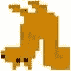
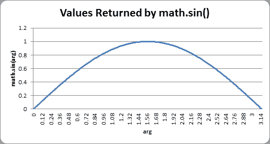

# 第八章：松鼠吃松鼠

> 原文：[`inventwithpython.com/pygame/chapter8.html`](https://inventwithpython.com/pygame/chapter8.html)
> 
> 译者：[飞龙](https://github.com/wizardforcel)
> 
> 协议：[CC BY-NC-SA 4.0](https://creativecommons.org/licenses/by-nc-sa/4.0/)

    

## 如何玩松鼠吃松鼠

松鼠吃松鼠 loosley 基于游戏“塊鼠大冒險”。玩家控制一个小松鼠，在屏幕上跳来跳去，吃掉比它小的松鼠，避开比它大的松鼠。每当玩家的松鼠吃掉比它小的松鼠时，它就会变得更大。如果玩家的松鼠被比它大的松鼠撞到，它就会失去一个生命点。当松鼠变成一个名为 Omega 松鼠的巨大松鼠时，玩家获胜。如果玩家的松鼠被撞三次，玩家就输了。

我真的不确定我是从哪里得到的一个松鼠互相吃掉的视频游戏的想法。有时候我有点奇怪。

## 松鼠吃松鼠的设计

这个游戏中有三种数据结构，它们被表示为字典值。这些类型分别是玩家松鼠、敌对松鼠和草对象。游戏中一次只有一个玩家松鼠对象。

注意：在面向对象编程中，“对象”在技术上有特定的含义。Python 确实具有面向对象编程的特性，但本书中没有涉及。从技术上讲，Pygame 对象，如“Rect 对象”或“Surface 对象”都是对象。但在本书中，我将使用术语“对象”来指代“游戏世界中存在的东西”。但实际上，玩家松鼠、敌对松鼠和草“对象”只是字典值。

所有对象的字典值中都有以下键：`'x'`、`'y'`和`'rect'`。`'x'`和`'y'`键的值给出了对象在*游戏世界坐标*中左上角的坐标。这些与像素坐标不同（这是`'rect'`键的值跟踪的内容）。游戏世界坐标和像素坐标之间的差异将在您学习摄像机概念时进行解释。

此外，玩家松鼠、敌对松鼠和草对象还有其他键，这些键在源代码的开头有一个大的注释进行了解释。

## 松鼠吃松鼠的源代码

这个源代码可以从[`invpy.com/squirrel.py`](//invpy.com/squirrel.py)下载。如果出现任何错误消息，请查看错误消息中提到的行号，并检查您的代码是否有任何拼写错误。您还可以将代码复制粘贴到[`invpy.com/diff/squirrel`](//invpy.com/diff/squirrel)的网络表单中，以查看您的代码与书中代码之间的差异。

您还需要下载以下图像文件：

+   [`invpy.com/gameicon.png`](//invpy.com/gameicon.png)

+   [`invpy.com/squirrel.png`](//invpy.com/squirrel.png)

+   [`invpy.com/grass1.png`](//invpy.com/grass1.png)

+   [`invpy.com/grass2.png`](//invpy.com/grass2.png)

+   [`invpy.com/grass3.png`](//invpy.com/grass3.png)

+   [`invpy.com/grass4.png`](//invpy.com/grass4.png)

```py
  # Squirrel Eat Squirrel (a 2D Katamari Damacy clone)
  # By Al Sweigart [[email protected]](/cdn-cgi/l/email-protection)
  # http://inventwithpython.com/pygame
  # Creative Commons BY-NC-SA 3.0 US

  import random, sys, time, math, pygame
  from pygame.locals import *

  FPS = 30 # frames per second to update the screen
 WINWIDTH = 640 # width of the program's window, in pixels
 WINHEIGHT = 480 # height in pixels
 HALF_WINWIDTH = int(WINWIDTH / 2)
 HALF_WINHEIGHT = int(WINHEIGHT / 2)

 GRASSCOLOR = (24, 255, 0)
 WHITE = (255, 255, 255)
 RED = (255, 0, 0)

CAMERASLACK = 90     # how far from the center the squirrel moves before moving the camera
MOVERATE = 9         # how fast the player moves
 BOUNCERATE = 6       # how fast the player bounces (large is slower)
 BOUNCEHEIGHT = 30    # how high the player bounces
 STARTSIZE = 25       # how big the player starts off
 WINSIZE = 300        # how big the player needs to be to win
 INVULNTIME = 2       # how long the player is invulnerable after being hit in seconds
 GAMEOVERTIME = 4     # how long the "game over" text stays on the screen in seconds
 MAXHEALTH = 3        # how much health the player starts with

 NUMGRASS = 80        # number of grass objects in the active area
 NUMSQUIRRELS = 30    # number of squirrels in the active area
 SQUIRRELMINSPEED = 3 # slowest squirrel speed
 SQUIRRELMAXSPEED = 7 # fastest squirrel speed
 DIRCHANGEFREQ = 2    # % chance of direction change per frame
 LEFT = 'left'
 RIGHT = 'right'

"""
 This program has three data structures to represent the player, enemy squirrels, and grass background objects. The data structures are dictionaries with the following keys:

 Keys used by all three data structures:
     'x' - the left edge coordinate of the object in the game world (not a pixel coordinate on the screen)
     'y' - the top edge coordinate of the object in the game world (not a pixel coordinate on the screen)
     'rect' - the pygame.Rect object representing where on the screen the object is located.
 Player data structure keys:
     'surface' - the pygame.Surface object that stores the image of the squirrel which will be drawn to the screen.
     'facing' - either set to LEFT or RIGHT, stores which direction the player is facing.
     'size' - the width and height of the player in pixels. (The width & height are always the same.)
     'bounce' - represents at what point in a bounce the player is in. 0 means standing (no bounce), up to BOUNCERATE (the completion of the bounce)
     'health' - an integer showing how many more times the player can be hit by a larger squirrel before dying.
 Enemy Squirrel data structure keys:
     'surface' - the pygame.Surface object that stores the image of the squirrel which will be drawn to the screen.
     'movex' - how many pixels per frame the squirrel moves horizontally. A negative integer is moving to the left, a positive to the right.
     'movey' - how many pixels per frame the squirrel moves vertically. A negative integer is moving up, a positive moving down.
     'width' - the width of the squirrel's image, in pixels
     'height' - the height of the squirrel's image, in pixels
     'bounce' - represents at what point in a bounce the player is in. 0 means standing (no bounce), up to BOUNCERATE (the completion of the bounce)
     'bouncerate' - how quickly the squirrel bounces. A lower number means a quicker bounce.
     'bounceheight' - how high (in pixels) the squirrel bounces
 Grass data structure keys:
     'grassImage' - an integer that refers to the index of the pygame.Surface object in GRASSIMAGES used for this grass object
 """

def main():
     global FPSCLOCK, DISPLAYSURF, BASICFONT, L_SQUIR_IMG, R_SQUIR_IMG, GRASSIMAGES

     pygame.init()
     FPSCLOCK = pygame.time.Clock()
     pygame.display.set_icon(pygame.image.load('gameicon.png'))
     DISPLAYSURF = pygame.display.set_mode((WINWIDTH, WINHEIGHT))
     pygame.display.set_caption('Squirrel Eat Squirrel')
     BASICFONT = pygame.font.Font('freesansbold.ttf', 32)

    # load the image files
     L_SQUIR_IMG = pygame.image.load('squirrel.png')
     R_SQUIR_IMG = pygame.transform.flip(L_SQUIR_IMG, True, False)
     GRASSIMAGES = []
     for i in range(1, 5):
         GRASSIMAGES.append(pygame.image.load('grass%s.png' % i))

    while True:
         runGame()

def runGame():
     # set up variables for the start of a new game
     invulnerableMode = False  # if the player is invulnerable
     invulnerableStartTime = 0 # time the player became invulnerable
     gameOverMode = False      # if the player has lost
     gameOverStartTime = 0     # time the player lost
     winMode = False           # if the player has won

    # create the surfaces to hold game text
     gameOverSurf = BASICFONT.render('Game Over', True, WHITE)
     gameOverRect = gameOverSurf.get_rect()
     gameOverRect.center = (HALF_WINWIDTH, HALF_WINHEIGHT)

     winSurf = BASICFONT.render('You have achieved OMEGA SQUIRREL!', True, WHITE)
     winRect = winSurf.get_rect()
     winRect.center = (HALF_WINWIDTH, HALF_WINHEIGHT)

    winSurf2 = BASICFONT.render('(Press "r" to restart.)', True, WHITE)
    winRect2 = winSurf2.get_rect()
    winRect2.center = (HALF_WINWIDTH, HALF_WINHEIGHT + 30)

    # camerax and cameray are where the middle of the camera view is
    camerax = 0
    cameray = 0

    grassObjs = []    # stores all the grass objects in the game
    squirrelObjs = [] # stores all the non-player squirrel objects
    # stores the player object:
    playerObj = {'surface': pygame.transform.scale(L_SQUIR_IMG, (STARTSIZE, STARTSIZE)),
                 'facing': LEFT,
                 'size': STARTSIZE,
                 'x': HALF_WINWIDTH,
                 'y': HALF_WINHEIGHT,
                 'bounce':0,
                 'health': MAXHEALTH}

    moveLeft  = False
    moveRight = False
    moveUp    = False
    moveDown  = False

    # start off with some random grass images on the screen
    for i in range(10):
        grassObjs.append(makeNewGrass(camerax, cameray))
        grassObjs[i]['x'] = random.randint(0, WINWIDTH)
        grassObjs[i]['y'] = random.randint(0, WINHEIGHT)

    while True: # main game loop
        # Check if we should turn off invulnerability
        if invulnerableMode and time.time() - invulnerableStartTime > INVULNTIME:
            invulnerableMode = False

        # move all the squirrels
        for sObj in squirrelObjs:
            # move the squirrel, and adjust for their bounce
            sObj['x'] += sObj['movex']
            sObj['y'] += sObj['movey']
            sObj['bounce'] += 1
            if sObj['bounce'] > sObj['bouncerate']:
                sObj['bounce'] = 0 # reset bounce amount

            # random chance they change direction
            if random.randint(0, 99) < DIRCHANGEFREQ:
                sObj['movex'] = getRandomVelocity()
                sObj['movey'] = getRandomVelocity()
                if sObj['movex'] > 0: # faces right
                    sObj['surface'] = pygame.transform.scale(R_SQUIR_IMG, (sObj['width'], sObj['height']))
                else: # faces left
                    sObj['surface'] = pygame.transform.scale(L_SQUIR_IMG, (sObj['width'], sObj['height']))

        # go through all the objects and see if any need to be deleted.
        for i in range(len(grassObjs) - 1, -1, -1):
            if isOutsideActiveArea(camerax, cameray, grassObjs[i]):
                del grassObjs[i]
        for i in range(len(squirrelObjs) - 1, -1, -1):
            if isOutsideActiveArea(camerax, cameray, squirrelObjs[i]):
                del squirrelObjs[i]

        # add more grass & squirrels if we don't have enough.
        while len(grassObjs) < NUMGRASS:
            grassObjs.append(makeNewGrass(camerax, cameray))
        while len(squirrelObjs) < NUMSQUIRRELS:
            squirrelObjs.append(makeNewSquirrel(camerax, cameray))

        # adjust camerax and cameray if beyond the "camera slack"
        playerCenterx = playerObj['x'] + int(playerObj['size'] / 2)
        playerCentery = playerObj['y'] + int(playerObj['size'] / 2)
         if (camerax + HALF_WINWIDTH) - playerCenterx > CAMERASLACK:
             camerax = playerCenterx + CAMERASLACK - HALF_WINWIDTH
         elif playerCenterx – (camerax + HALF_WINWIDTH) > CAMERASLACK:
             camerax = playerCenterx – CAMERASLACK - HALF_WINWIDTH
         if (cameray + HALF_WINHEIGHT) - playerCentery > CAMERASLACK:
             cameray = playerCentery + CAMERASLACK - HALF_WINHEIGHT
         elif playerCentery – (cameray + HALF_WINHEIGHT) > CAMERASLACK:
             cameray = playerCentery – CAMERASLACK - HALF_WINHEIGHT

        # draw the green background
        DISPLAYSURF.fill(GRASSCOLOR)

        # draw all the grass objects on the screen
        for gObj in grassObjs:
            gRect = pygame.Rect( (gObj['x'] - camerax,
                                  gObj['y'] - cameray,
                                  gObj['width'],
                                  gObj['height']) )
            DISPLAYSURF.blit(GRASSIMAGES[gObj['grassImage']], gRect)

        # draw the other squirrels
        for sObj in squirrelObjs:
            sObj['rect'] = pygame.Rect( (sObj['x'] - camerax,
                                         sObj['y'] - cameray - getBounceAmount(sObj['bounce'], sObj['bouncerate'], sObj['bounceheight']),
                                         sObj['width'],
                                         sObj['height']) )
            DISPLAYSURF.blit(sObj['surface'], sObj['rect'])

        # draw the player squirrel
        flashIsOn = round(time.time(), 1) * 10 % 2 == 1
        if not gameOverMode and not (invulnerableMode and flashIsOn):
            playerObj['rect'] = pygame.Rect( (playerObj['x'] - camerax,
                                              playerObj['y'] – cameray - getBounceAmount(playerObj['bounce'], BOUNCERATE, BOUNCEHEIGHT),
                                              playerObj['size'],
                                              playerObj['size']) )
            DISPLAYSURF.blit(playerObj['surface'], playerObj['rect'])

        # draw the health meter
        drawHealthMeter(playerObj['health'])

        for event in pygame.event.get(): # event handling loop
            if event.type == QUIT:
                terminate()

            elif event.type == KEYDOWN:
                if event.key in (K_UP, K_w):
                    moveDown = False
                    moveUp = True
                elif event.key in (K_DOWN, K_s):
                    moveUp = False
                    moveDown = True
                elif event.key in (K_LEFT, K_a):
                    moveRight = False
                    moveLeft = True
                    if playerObj['facing'] == RIGHT: # change player image
                        playerObj['surface'] = pygame.transform.scale(L_SQUIR_IMG, (playerObj['size'], playerObj['size']))
                    playerObj['facing'] = LEFT
                elif event.key in (K_RIGHT, K_d):
                    moveLeft = False
                    moveRight = True
                    if playerObj['facing'] == LEFT: # change player image
                        playerObj['surface'] = pygame.transform.scale(R_SQUIR_IMG, (playerObj['size'], playerObj['size']))
                    playerObj['facing'] = RIGHT
                elif winMode and event.key == K_r:
                    return

            elif event.type == KEYUP:
                # stop moving the player's squirrel
                if event.key in (K_LEFT, K_a):
                    moveLeft = False
                elif event.key in (K_RIGHT, K_d):
                    moveRight = False
                elif event.key in (K_UP, K_w):
                    moveUp = False
                elif event.key in (K_DOWN, K_s):
                    moveDown = False

                elif event.key == K_ESCAPE:
                    terminate()

        if not gameOverMode:
            # actually move the player
            if moveLeft:
                playerObj['x'] -= MOVERATE
            if moveRight:
                playerObj['x'] += MOVERATE
            if moveUp:
                playerObj['y'] -= MOVERATE
            if moveDown:
                playerObj['y'] += MOVERATE

            if (moveLeft or moveRight or moveUp or moveDown) or playerObj['bounce'] != 0:
                playerObj['bounce'] += 1

            if playerObj['bounce'] > BOUNCERATE:
                playerObj['bounce'] = 0 # reset bounce amount

            # check if the player has collided with any squirrels
            for i in range(len(squirrelObjs)-1, -1, -1):
                sqObj = squirrelObjs[i]
                if 'rect' in sqObj and playerObj['rect'].colliderect(sqObj['rect']):
                    # a player/squirrel collision has occurred
277.
                    if sqObj['width'] * sqObj['height'] <= playerObj['size']**2:
                        # player is larger and eats the squirrel
                        playerObj['size'] += int( (sqObj['width'] * sqObj['height'])**0.2 ) + 1
                        del squirrelObjs[i]

                        if playerObj['facing'] == LEFT:
                            playerObj['surface'] = pygame.transform.scale(L_SQUIR_IMG, (playerObj['size'], playerObj['size']))
                        if playerObj['facing'] == RIGHT:
                            playerObj['surface'] = pygame.transform.scale(R_SQUIR_IMG, (playerObj['size'], playerObj['size']))

                        if playerObj['size'] > WINSIZE:
                            winMode = True # turn on "win mode"

                    elif not invulnerableMode:
                        # player is smaller and takes damage
                        invulnerableMode = True
                        invulnerableStartTime = time.time()
                        playerObj['health'] -= 1
                        if playerObj['health'] == 0:
                            gameOverMode = True # turn on "game over mode"
                            gameOverStartTime = time.time()
        else:
            # game is over, show "game over" text
            DISPLAYSURF.blit(gameOverSurf, gameOverRect)
            if time.time() - gameOverStartTime > GAMEOVERTIME:
                return # end the current game

        # check if the player has won.
        if winMode:
            DISPLAYSURF.blit(winSurf, winRect)
            DISPLAYSURF.blit(winSurf2, winRect2)

        pygame.display.update()
        FPSCLOCK.tick(FPS)

def drawHealthMeter(currentHealth):
    for i in range(currentHealth): # draw red health bars
        pygame.draw.rect(DISPLAYSURF, RED,   (15, 5 + (10 * MAXHEALTH) - i * 10, 20, 10))
    for i in range(MAXHEALTH): # draw the white outlines
        pygame.draw.rect(DISPLAYSURF, WHITE, (15, 5 + (10 * MAXHEALTH) - i * 10, 20, 10), 1)

def terminate():
    pygame.quit()
    sys.exit()

def getBounceAmount(currentBounce, bounceRate, bounceHeight):
    # Returns the number of pixels to offset based on the bounce.
    # Larger bounceRate means a slower bounce.
    # Larger bounceHeight means a higher bounce.
     # currentBounce will always be less than bounceRate
    return int(math.sin( (math.pi / float(bounceRate)) * currentBounce ) * bounceHeight)

def getRandomVelocity():
    speed = random.randint(SQUIRRELMINSPEED, SQUIRRELMAXSPEED)
    if random.randint(0, 1) == 0:
        return speed
    else:
        return -speed

def getRandomOffCameraPos(camerax, cameray, objWidth, objHeight):
    # create a Rect of the camera view
    cameraRect = pygame.Rect(camerax, cameray, WINWIDTH, WINHEIGHT)
    while True:
        x = random.randint(camerax - WINWIDTH, camerax + (2 * WINWIDTH))
        y = random.randint(cameray - WINHEIGHT, cameray + (2 * WINHEIGHT))
349. # create a Rect object with the random coordinates and use colliderect()
         # to make sure the right edge isn't in the camera view.
        objRect = pygame.Rect(x, y, objWidth, objHeight)
        if not objRect.colliderect(cameraRect):
            return x, y

def makeNewSquirrel(camerax, cameray):
    sq = {}
    generalSize = random.randint(5, 25)
    multiplier = random.randint(1, 3)
    sq['width']  = (generalSize + random.randint(0, 10)) * multiplier
    sq['height'] = (generalSize + random.randint(0, 10)) * multiplier
    sq['x'], sq['y'] = getRandomOffCameraPos(camerax, cameray, sq['width'], sq['height'])
    sq['movex'] = getRandomVelocity()
    sq['movey'] = getRandomVelocity()
    if sq['movex'] < 0: # squirrel is facing left
        sq['surface'] = pygame.transform.scale(L_SQUIR_IMG, (sq['width'], sq['height']))
    else: # squirrel is facing right
        sq['surface'] = pygame.transform.scale(R_SQUIR_IMG, (sq['width'], sq['height']))
    sq['bounce'] = 0
    sq['bouncerate'] = random.randint(10, 18)
    sq['bounceheight'] = random.randint(10, 50)
    return sq

def makeNewGrass(camerax, cameray):
    gr = {}
    gr['grassImage'] = random.randint(0, len(GRASSIMAGES) - 1)
    gr['width']  = GRASSIMAGES[0].get_width()
    gr['height'] = GRASSIMAGES[0].get_height()
     gr['x'], gr['y'] = getRandomOffCameraPos(camerax, cameray, gr['width'], gr['height'])
     gr['rect'] = pygame.Rect( (gr['x'], gr['y'], gr['width'], gr['height']) )
    return gr

def isOutsideActiveArea(camerax, cameray, obj):
    # Return False if camerax and cameray are more than
    # a half-window length beyond the edge of the window.
    boundsLeftEdge = camerax - WINWIDTH
    boundsTopEdge = cameray - WINHEIGHT
    boundsRect = pygame.Rect(boundsLeftEdge, boundsTopEdge, WINWIDTH * 3, WINHEIGHT * 3)
    objRect = pygame.Rect(obj['x'], obj['y'], obj['width'], obj['height'])
    return not boundsRect.colliderect(objRect)

if __name__ == '__main__':
    main()

```

## 通常的设置代码

```py
  # Squirrel Eat Squirrel (a 2D Katamari Damacy clone)
  # By Al Sweigart [[email protected]](/cdn-cgi/l/email-protection)
  # http://inventwithpython.com/pygame
  # Creative Commons BY-NC-SA 3.0 US

  import random, sys, time, math, pygame
  from pygame.locals import *

  FPS = 30 # frames per second to update the screen
 WINWIDTH = 640 # width of the program's window, in pixels
 WINHEIGHT = 480 # height in pixels
 HALF_WINWIDTH = int(WINWIDTH / 2)
 HALF_WINHEIGHT = int(WINHEIGHT / 2)

 GRASSCOLOR = (24, 255, 0)
 WHITE = (255, 255, 255)
 RED = (255, 0, 0)

```

程序的开头分配了几个常量变量。这个程序经常使用窗口宽度和高度的一半，`HALF_WINWIDTH`和`HALF_WINHEIGHT`变量存储了这些数字。

```py
CAMERASLACK = 90     # how far from the center the squirrel moves before moving the camera

```

“相机松弛”稍后会进行解释。基本上，这意味着当玩家松鼠离窗口中心 90 像素时，相机将开始跟随玩家松鼠移动。

```py
 MOVERATE = 9         # how fast the player moves
 BOUNCERATE = 6       # how fast the player bounces (large is slower)
 BOUNCEHEIGHT = 30    # how high the player bounces
 STARTSIZE = 25       # how big the player starts off
 WINSIZE = 300        # how big the player needs to be to win
 INVULNTIME = 2       # how long the player is invulnerable after being hit in seconds
 GAMEOVERTIME = 4     # how long the "game over" text stays on the screen in seconds
 MAXHEALTH = 3        # how much health the player starts with

 NUMGRASS = 80        # number of grass objects in the active area
 NUMSQUIRRELS = 30    # number of squirrels in the active area
 SQUIRRELMINSPEED = 3 # slowest squirrel speed
 SQUIRRELMAXSPEED = 7 # fastest squirrel speed
 DIRCHANGEFREQ = 2    # % chance of direction change per frame
 LEFT = 'left'
 RIGHT = 'right'

```

这些常量旁边的注释解释了常量变量的用途。

## 描述数据结构

```py
 """
 This program has three data structures to represent the player, enemy squirrels, and grass background objects. The data structures are dictionaries with the following keys:

 Keys used by all three data structures:
     'x' - the left edge coordinate of the object in the game world (not a pixel coordinate on the screen)
     'y' - the top edge coordinate of the object in the game world (not a pixel coordinate on the screen)
     'rect' - the pygame.Rect object representing where on the screen the object is located.
 Player data structure keys:
     'surface' - the pygame.Surface object that stores the image of the squirrel which will be drawn to the screen.
     'facing' - either set to LEFT or RIGHT, stores which direction the player is facing.
     'size' - the width and height of the player in pixels. (The width & height are always the same.)
     'bounce' - represents at what point in a bounce the player is in. 0 means standing (no bounce), up to BOUNCERATE (the completion of the bounce)
     'health' - an integer showing how many more times the player can be hit by a larger squirrel before dying.
 Enemy Squirrel data structure keys:
     'surface' - the pygame.Surface object that stores the image of the squirrel which will be drawn to the screen.
     'movex' - how many pixels per frame the squirrel moves horizontally. A negative integer is moving to the left, a positive to the right.
     'movey' - how many pixels per frame the squirrel moves vertically. A negative integer is moving up, a positive moving down.
     'width' - the width of the squirrel's image, in pixels
     'height' - the height of the squirrel's image, in pixels
     'bounce' - represents at what point in a bounce the player is in. 0 means standing (no bounce), up to BOUNCERATE (the completion of the bounce)
     'bouncerate' - how quickly the squirrel bounces. A lower number means a quicker bounce.
     'bounceheight' - how high (in pixels) the squirrel bounces
 Grass data structure keys:
     'grassImage' - an integer that refers to the index of the pygame.Surface object in GRASSIMAGES used for this grass object
 """

```

从第 37 行到第 61 行的注释是一个大的、多行的字符串。它们描述了玩家松鼠、敌对松鼠和草对象的键。在 Python 中，一个独立的多行字符串值可以作为多行注释。

## `main()`函数

```py
 def main():
     global FPSCLOCK, DISPLAYSURF, BASICFONT, L_SQUIR_IMG, R_SQUIR_IMG, GRASSIMAGES

     pygame.init()
     FPSCLOCK = pygame.time.Clock()
     pygame.display.set_icon(pygame.image.load('gameicon.png'))
     DISPLAYSURF = pygame.display.set_mode((WINWIDTH, WINHEIGHT))
     pygame.display.set_caption('Squirrel Eat Squirrel')
     BASICFONT = pygame.font.Font('freesansbold.ttf', 32)

```

`main()`函数的前几行是我们以前游戏程序中看到的相同的设置代码。`pygame.display.set_icon()`是一个 Pygame 函数，用于设置窗口标题栏中的图标（就像`pygame.display.set_caption()`设置标题栏中的标题文本一样）。`pygame.display.set_icon()`的单个参数是一个小图像的 Surface 对象。理想的图像尺寸是 32 x 32 像素，尽管您可以使用其他尺寸的图像。图像将被压缩成较小的尺寸，以用作窗口的图标。

## `pygame.transform.flip()`函数

```py
     # load the image files
     L_SQUIR_IMG = pygame.image.load('squirrel.png')
     R_SQUIR_IMG = pygame.transform.flip(L_SQUIR_IMG, True, False)
     GRASSIMAGES = []
     for i in range(1, 5):
         GRASSIMAGES.append(pygame.image.load('grass%s.png' % i))

```

玩家和敌对松鼠的图像是从第 74 行的*squirrel.png*中加载的。确保这个 PNG 文件与*squirrel.py*在同一个文件夹中，否则你会得到错误 pygame.error: Couldn't open squirrel.png。

*squirrel.png*中的图像（您可以从[`invpy.com/squirrel.png`](//invpy.com/squirrel.png)下载）是一只面向左的松鼠。我们还需要一个包含面向右的松鼠图片的 Surface 对象。我们可以调用`pygame.transform.flip()`函数，而不是创建第二个 PNG 图像文件。这个函数有三个参数：要翻转的图像的 Surface 对象，一个布尔值进行水平翻转，一个布尔值进行垂直翻转。通过将第二个参数传递为`True`，第三个参数传递为`False`，返回的 Surface 对象具有面向右的松鼠的图像。我们传递的`L_SQUIR_IMG`中的原始 Surface 对象保持不变。

以下是图像水平和垂直翻转的示例：

| 原始 | 水平翻转 | 垂直翻转 | 水平和垂直翻转 |
| --- | --- | --- | --- |
|  |  |  |  |


```py
     while True:
         runGame()

```

在`main()`中的设置完成后，游戏开始调用`runGame()`。

## 比通常更详细的游戏状态

```py
 def runGame():
     # set up variables for the start of a new game
     invulnerableMode = False  # if the player is invulnerable
     invulnerableStartTime = 0 # time the player became invulnerable
     gameOverMode = False      # if the player has lost
     gameOverStartTime = 0     # time the player lost
     winMode = False           # if the player has won

```

松鼠吃松鼠游戏有很多跟踪游戏状态的变量。这些变量将在稍后在代码中使用时进行更详细的解释。

## 通常的文本创建代码

```py
     # create the surfaces to hold game text
     gameOverSurf = BASICFONT.render('Game Over', True, WHITE)
     gameOverRect = gameOverSurf.get_rect()
     gameOverRect.center = (HALF_WINWIDTH, HALF_WINHEIGHT)

     winSurf = BASICFONT.render('You have achieved OMEGA SQUIRREL!', True, WHITE)
     winRect = winSurf.get_rect()
     winRect.center = (HALF_WINWIDTH, HALF_WINHEIGHT)

    winSurf2 = BASICFONT.render('(Press "r" to restart.)', True, WHITE)
    winRect2 = winSurf2.get_rect()
    winRect2.center = (HALF_WINWIDTH, HALF_WINHEIGHT + 30)

```

这些变量包含屏幕上游戏结束后出现的“游戏结束”，“你已经获得 OMEGA 松鼠！”和“(按`r`重新开始)”文本的 Surface 对象。

## 摄像机

```py
    # camerax and cameray are where the middle of the camera view is
    camerax = 0
    cameray = 0

```

`camerax`和`cameray`变量跟踪“摄像机”的游戏坐标。想象游戏世界是一个无限的二维空间。当然，这永远无法适应任何屏幕。我们只能在屏幕上绘制无限 2D 空间的一部分。我们称这一部分的区域为摄像机，因为就像我们的屏幕只是摄像机所看到的游戏世界的区域。这是游戏世界（一个无限的绿色领域）和摄像机可以查看的区域的图片：


正如你所看到的，游戏世界的 XY 坐标将永远变大和变小。游戏世界的原点是游戏世界坐标为（0，0）的地方。你可以看到三只松鼠的位置（在游戏世界坐标中）分别为（-384，-84），（384，306）和（585，-234）。

但是我们只能在屏幕上显示 640 x 480 像素的区域（尽管如果我们向`pygame.display.set_mode()`函数传递不同的数字，这可能会改变），所以我们需要跟踪摄像机原点在游戏世界坐标中的位置。在上面的图片中，摄像机在游戏世界坐标中的位置是（-486，-330）。

下面的图片显示了相同的领域和松鼠，只是一切都是以摄像机坐标给出的：


相机可以看到的区域（称为相机视野）的中心（即其原点）位于游戏世界坐标(-486, -330)。由于相机看到的内容显示在玩家的屏幕上，因此“相机”坐标与“像素”坐标相同。要找出松鼠的像素坐标（即它们在屏幕上出现的位置），需要用松鼠的游戏坐标减去相机原点的游戏坐标。

左边的松鼠在游戏世界坐标为(-384, -84)，但在屏幕上的像素坐标为(102, 246)。（对于 X 坐标，-384 - -486 = 102，对于 Y 坐标，-84 - -330 = 246。）

当我们对其他两只松鼠进行相同的计算以找到它们的像素坐标时，我们发现它们存在于屏幕范围之外。这就是为什么它们不会出现在相机的视野中。

## “活动区域”

“活动区域”只是我想出来描述游戏世界的区域的一个名字，相机视野加上相机区域大小的周围区域：


计算某物是否在活动区域内的方法在本章后面的`isOutsideActiveArea()`函数的解释中有说明。当我们创建新的敌对松鼠或草对象时，我们不希望它们被创建在相机的视野内，因为这样看起来它们就像从无处冒出来一样。

但我们也不希望将它们创建得离相机太远，因为那样它们可能永远不会漫游到相机的视野中。在活动区域内但在相机之外是松鼠和草对象可以安全创建的地方。

此外，当松鼠和草对象超出活动区域的边界时，它们距离足够远，可以删除，以便它们不再占用内存。那么远的对象不再需要，因为它们很少可能再次出现在相机的视野中。

如果你曾经在超级任天堂上玩过超级马里奥世界，有一个很好的 YouTube 视频解释了超级马里奥世界的相机系统是如何工作的。你可以在[`invpy.com/mariocamera`](//invpy.com/mariocamera)找到这个视频。

## 跟踪游戏世界中事物的位置

```py
    grassObjs = []    # stores all the grass objects in the game
    squirrelObjs = [] # stores all the non-player squirrel objects
    # stores the player object:
    playerObj = {'surface': pygame.transform.scale(L_SQUIR_IMG, (STARTSIZE, STARTSIZE)),
                 'facing': LEFT,
                 'size': STARTSIZE,
                 'x': HALF_WINWIDTH,
                 'y': HALF_WINHEIGHT,
                 'bounce':0,
                 'health': MAXHEALTH}

    moveLeft  = False
    moveRight = False
    moveUp    = False
    moveDown  = False

```

`grassObjs`变量保存了游戏中所有草对象的列表。随着新的草对象的创建，它们被添加到这个列表中。当草对象被删除时，它们将从此列表中移除。`squirrelObjs`变量和敌对松鼠对象也是如此。

`playerObj`变量不是一个列表，而只是字典值本身。

第 120 至 123 行的移动变量跟踪着哪个箭头键（或 WASD 键）被按下，就像在之前的一些游戏程序中一样。

## 从一些草开始

```py
    # start off with some random grass images on the screen
    for i in range(10):
        grassObjs.append(makeNewGrass(camerax, cameray))
        grassObjs[i]['x'] = random.randint(0, WINWIDTH)
        grassObjs[i]['y'] = random.randint(0, WINHEIGHT)

```

活动区域应该从屏幕上可见的一些草对象开始。`makeNewGrass()`函数将创建并返回一个草对象，该对象随机位于活动区域但在相机视野之外的某个地方。这是我们调用`makeNewGrass()`时通常想要的，但由于我们希望确保前几个草对象在屏幕上，X 和 Y 坐标被覆盖。

## 游戏循环

```py
    while True: # main game loop

```

游戏循环，就像以前的游戏程序中的游戏循环一样，将处理事件，更新游戏状态，并将所有内容绘制到屏幕上。

## 检查是否禁用无敌状态

```py
        # Check if we should turn off invulnerability
        if invulnerableMode and time.time() - invulnerableStartTime > INVULNTIME:
            invulnerableMode = False

```

当玩家被敌对松鼠击中但没有死亡时，我们会让玩家在几秒钟内处于无敌状态（因为`INVULNTIME`常量设置为`2`）。在此期间，玩家的松鼠会闪烁，并且不会受到其他松鼠的伤害。如果“无敌模式”时间结束，第 134 行将把`invulnerableMode`设置为`False`。

## 移动敌对松鼠

```py
        # move all the squirrels
        for sObj in squirrelObjs:
            # move the squirrel, and adjust for their bounce
            sObj['x'] += sObj['movex']
            sObj['y'] += sObj['movey']

```

敌方松鼠都根据它们的'movex'和'movey'键中的值移动。如果这些值是正数，松鼠向右或向下移动。如果这些值是负数，它们向左或向上移动。值越大，它们在游戏循环中的每次迭代中移动得越远（这意味着它们移动得更快）。

第 137 行的`for`循环将应用此移动代码到`squirrelObjs`列表中的每个敌方松鼠对象。首先，第 139 和 140 行将调整它们的'x'和'y'键的值。

```py
            sObj['bounce'] += 1
            if sObj['bounce'] > sObj['bouncerate']:
                sObj['bounce'] = 0 # reset bounce amount

```

`sObj['bounce']`中的值在每次松鼠的游戏循环迭代中递增。当这个值为`0`时，松鼠在其弹跳的最开始。当这个值等于`sObj['bouncerate']`中的值时，该值就结束了。（这就是为什么较小的`sObj['bouncerate']`值会导致更快的弹跳。如果`sObj['bouncerate']`是`3`，那么松鼠只需要三次游戏循环迭代就能完成一次完整的弹跳。如果`sObj['bouncerate']`是`10`，那么就需要十次迭代。）

当`sObj['bounce']`大于`sObj['bouncerate']`时，它需要被重置为`0`。这就是第 142 和 143 行的作用。

```py
            # random chance they change direction
            if random.randint(0, 99) < DIRCHANGEFREQ:
                sObj['movex'] = getRandomVelocity()
                sObj['movey'] = getRandomVelocity()
                if sObj['movex'] > 0: # faces right
                    sObj['surface'] = pygame.transform.scale(R_SQUIR_IMG, (sObj['width'], sObj['height']))
                else: # faces left
                    sObj['surface'] = pygame.transform.scale(L_SQUIR_IMG, (sObj['width'], sObj['height']))

```

在游戏循环的每次迭代中，有 2%的几率松鼠会随机改变速度和方向。在第 146 行，`random.randint(0, 99)`的调用会随机选择 100 个可能的整数中的一个整数。如果这个数字小于`DIRCHANGEFREQ`（我们在第 33 行设置为`2`），那么`sObj['movex']`和`sObj['movey']`将被设置为新值。

因为这意味着松鼠可能已经改变了方向，所以`sObj['surface']`中的 Surface 对象应该被一个新的替换，它应该正确地面向左或右，并且按照松鼠的大小进行缩放。这就是第 149 到 152 行的作用。请注意，第 150 行获取了一个从`R_SQUIR_IMG`缩放的 Surface 对象，第 152 行获取了一个从`L_SQUIR_IMG`缩放的 Surface 对象。

## 删除远处的草和松鼠对象

```py
        # go through all the objects and see if any need to be deleted.
        for i in range(len(grassObjs) - 1, -1, -1):
            if isOutsideActiveArea(camerax, cameray, grassObjs[i]):
                del grassObjs[i]
        for i in range(len(squirrelObjs) - 1, -1, -1):
            if isOutsideActiveArea(camerax, cameray, squirrelObjs[i]):
                del squirrelObjs[i]

```

在游戏循环的每次迭代中，代码将检查所有草和敌方松鼠对象，看它们是否在“活动区域”之外。`isOutsideActiveArea()`函数接受摄像机的当前坐标（存储在`camerax`和`cameray`中）和草/敌方松鼠对象，并在对象不在活动区域时返回`True`。

如果是这种情况，这个对象将在第 158 行（对于草对象）或第 161 行（对于松鼠对象）被删除。这就是当玩家离它们足够远时（或者当敌方松鼠离玩家足够远时），松鼠和草对象被删除的方式。这确保了玩家附近始终有一定数量的松鼠和草对象。

## 在列表中删除项目时，以相反顺序迭代列表

删除松鼠和草对象是使用`del`运算符完成的。但是，请注意，第 156 行和 159 行的`for`循环向`range()`函数传递参数，以便编号从最后一项的索引开始，然后递减`-1`（与通常的递增`1`相反），直到达到数字`-1`。我们是按照与通常情况下相反的方式迭代列表的索引。这是因为我们正在迭代我们也正在删除项目的列表。

要看为什么需要这种反向顺序，假设我们有以下列表值：

```py
animals = ['cat', 'mouse', 'dog', 'horse']

```

所以我们想要编写代码来从列表中删除字符串'dog'的任何实例。我们可能会想要编写如下代码：

```py
for i in range(len(animals)):
    if animals[i] == 'dog':
        del animals[i]

```

但是如果我们运行这段代码，我们将得到一个`IndexError`错误，看起来像这样：

```py
Traceback (most recent call last):
  File "<stdin>", line 2, in <module>
IndexError: list index out of range

```

要看为什么会出现这个错误，让我们走一遍代码。首先，`animals`列表将被设置为`['cat', 'mouse', 'dog', 'horse']`，`len(animals)`将返回`4`。这意味着对`range(4)`的调用将导致`for`循环使用值`0`、`1`、`2`和`3`进行迭代。

当`i`设置为`2`时，`for`循环迭代，`if`语句的条件将为`True`，`del animals[i]`语句将删除`animals[2]`。这意味着之后动物列表将是`['cat', 'mouse', 'horse']`。在`'dog'`之后的所有项的索引都向下移动了一个位置，因为`'dog'`值被删除了。

但是在下一次`for`循环迭代中，`i`设置为`3`。但`animals[3]`超出了边界，因为动物列表的有效索引不再是`0`到`3`，而是`0`到`2`。对`range()`的原始调用是针对包含 4 个项目的列表。列表长度发生了变化，但`for`循环设置为原始长度。

然而，如果我们从列表的最后一个索引迭代到`0`，我们就不会遇到这个问题。以下程序删除了`animals`列表中的`'dog'`字符串，而不会引发`IndexError`错误：

```py
animals = ['cat', 'mouse', 'dog', 'horse']
for i in range(len(animals) - 1, -1, -1):
    if animals[i] == 'dog':
        del animals[i]

```

这段代码之所以不会引发错误，是因为`for`循环迭代了`3`、`2`、`1`和`0`。在第一次迭代中，代码检查`animals[3]`是否等于`'dog'`。它不是（`animals[3]`是`'horse'`），所以代码继续下一次迭代。然后检查`animals[2]`是否等于`'dog'`。是的，所以删除`animals[2]`。

删除`animals[2]`后，`animals`列表设置为['cat', 'mouse', 'horse']。在下一次迭代中，`i`设置为`1`。`animals[1]`处有一个值（`'mouse'`值），因此不会引起错误。列表中的所有项在`'dog'`之后向下移动一个位置并不重要，因为我们从列表末尾开始并向前移动，所有这些项都已经被检查过了。

同样，我们可以从`grassObjs`和`squirrelObjs`列表中删除草和松鼠对象而不会出错，因为在第 156 和 159 行的`for`循环中以相反的顺序迭代。

## 添加新的草和松鼠对象

```py
        # add more grass & squirrels if we don't have enough.
        while len(grassObjs) < NUMGRASS:
            grassObjs.append(makeNewGrass(camerax, cameray))
        while len(squirrelObjs) < NUMSQUIRRELS:
            squirrelObjs.append(makeNewSquirrel(camerax, cameray))

```

记住，`NUMGRASS`常量在程序开始时设置为`80`，`NUMSQUIRRELS`常量设置为`30`？这些变量被设置为确保活动区域中始终有足够的草和松鼠对象。如果`grassObjs`或`squirrelObjs`的长度低于`NUMGRASS`或`NUMSQUIRRELS`，则会创建新的草和松鼠对象。创建这些对象的`makeNewGrass()`和`makeNewSquirrel()`函数将在本章后面进行解释。

## 相机松弛，移动相机视图

```py
        # adjust camerax and cameray if beyond the "camera slack"
        playerCenterx = playerObj['x'] + int(playerObj['size'] / 2)
        playerCentery = playerObj['y'] + int(playerObj['size'] / 2)
         if (camerax + HALF_WINWIDTH) - playerCenterx > CAMERASLACK:
             camerax = playerCenterx + CAMERASLACK - HALF_WINWIDTH
         elif playerCenterx – (camerax + HALF_WINWIDTH) > CAMERASLACK:
             camerax = playerCenterx – CAMERASLACK - HALF_WINWIDTH
         if (cameray + HALF_WINHEIGHT) - playerCentery > CAMERASLACK:
             cameray = playerCentery + CAMERASLACK - HALF_WINHEIGHT
         elif playerCentery – (cameray + HALF_WINHEIGHT) > CAMERASLACK:
             cameray = playerCentery – CAMERASLACK - HALF_WINHEIGHT

```

玩家移动时，相机的位置（存储为`camerax`和`cameray`变量中的整数）需要更新。我将玩家在相机更新之前可以移动的像素数称为“相机松弛”。第 19 行将`CAMERASLACK`常量设置为`90`，这意味着我们的程序将在相机位置更新以跟随松鼠之前，玩家松鼠可以从中心移动 90 像素。

为了理解第 172、174、176 和 178 行`if`语句中使用的方程式，您应该注意，`(camerax + HALF_WINWIDTH)`和`(cameray + HALF_WINHEIGHT)`是当前位于屏幕中心的 XY 游戏世界坐标。`playerCenterx`和`playerCentery`设置为玩家松鼠位置的中心，也是游戏世界坐标。

对于第 172 行，如果中心 X 坐标减去玩家中心 X 坐标大于`CAMERASLACK`值，这意味着玩家在相机中心的右侧的像素数比相机松弛允许的要多。`camerax`值需要更新，以便玩家松鼠正好在相机松弛的边缘。这就是为什么第 173 行将`camerax`设置为`playerCenterx + CAMERASLACK – HALF_WINWIDTH`。请注意，更改的是`camerax`变量，而不是`playerObj['x']`值。我们想要移动相机，而不是玩家。

其他三个`if`语句对左、上和下侧采用类似的逻辑。

## 绘制背景、草地、松鼠和健康仪表

```py
        # draw the green background
        DISPLAYSURF.fill(GRASSCOLOR)

```

第 182 行开始绘制显示 Surface 对象内容的代码。首先，第 182 行绘制背景的绿色。这将覆盖 Surface 的所有先前内容，以便我们可以从头开始绘制帧。

```py
        # draw all the grass objects on the screen
        for gObj in grassObjs:
            gRect = pygame.Rect( (gObj['x'] - camerax,
                                  gObj['y'] - cameray,
                                  gObj['width'],
                                  gObj['height']) )
            DISPLAYSURF.blit(GRASSIMAGES[gObj['grassImage']], gRect)

```

第 185 行的`for`循环遍历`grassObjs`列表中的所有草地对象，并从中存储的 x、y、宽度和高度信息创建一个 Rect 对象。这个 Rect 对象存储在一个名为`gRect`的变量中。在第 190 行，`gRect`在`blit()`方法调用中用于在显示 Surface 上绘制草地图像。请注意，`gObj['grassImage']`只包含一个整数，它是`GRASSIMAGES`的索引。`GRASSIMAGES`是一个包含所有草地图像的 Surface 对象的列表。Surface 对象占用的内存比单个整数多得多，并且所有具有相似`gObj['grassImage']`值的草地对象看起来都是相同的。因此，只有将每个草地图像存储一次在`GRASSIMAGES`中，并简单地在草地对象本身中存储整数，才有意义。

```py
        # draw the other squirrels
        for sObj in squirrelObjs:
            sObj['rect'] = pygame.Rect( (sObj['x'] - camerax,
                                         sObj['y'] - cameray - getBounceAmount(sObj['bounce'], sObj['bouncerate'], sObj['bounceheight']),
                                         sObj['width'],
                                         sObj['height']) )
            DISPLAYSURF.blit(sObj['surface'], sObj['rect'])

```

绘制所有敌对松鼠游戏对象的`for`循环类似于之前的`for`循环，只是它创建的 Rect 对象保存在松鼠字典的`'rect'`键的值中。代码之所以这样做是因为我们稍后将使用这个 Rect 对象来检查敌对松鼠是否与玩家松鼠发生了碰撞。

请注意，Rect 构造函数的顶部参数不仅仅是`sObj['y'] - cameray`，而是`sObj['y'] - cameray - getBounceAmount(sObj['bounce'], sObj['bouncerate'], sObj['bounceheight'])`。`getBounceAmount()`函数将返回应该提高的顶部值的像素数。

此外，松鼠图像的 Surface 对象没有共同的列表，就像草地游戏对象和`GRASSIMAGES`一样。每个敌对松鼠游戏对象都有自己存储在`'surface'`键中的 Surface 对象。这是因为松鼠图像可以按比例缩放到不同的大小。

```py
        # draw the player squirrel
        flashIsOn = round(time.time(), 1) * 10 % 2 == 1

```

在绘制草地和敌对松鼠之后，代码将绘制玩家的松鼠。然而，有一种情况下我们会跳过绘制玩家的松鼠。当玩家与较大的敌对松鼠发生碰撞时，玩家会受到伤害并闪烁一小段时间，以表明玩家是暂时无敌的。这种闪烁效果是通过在游戏循环的一些迭代中绘制玩家松鼠但在其他迭代中不绘制来实现的。

玩家松鼠将在游戏循环迭代中绘制十分之一秒，然后在游戏循环迭代中的十分之一秒内不绘制。只要玩家是无敌的（在代码中意味着`invulnerableMode`变量设置为`True`），我们的代码将使闪烁持续两秒，因为`2`存储在第 25 行的`INVULNTIME`常量变量中。

为了确定闪烁是否打开，第 202 行从`time.time()`获取当前时间。让我们使用这个函数调用返回`1323926893.622`的例子。这个值传递给`round()`，它将其四舍五入到小数点后一位（因为`1`作为`round()`的第二个参数传递）。这意味着`round()`将返回值`1323926893.6`。

然后将这个值乘以`10`，变成`13239268936`。一旦我们将其作为整数，我们可以首先使用在“记忆拼图”章节中讨论的“模二”技巧来查看它是偶数还是奇数。`13239268936 % 2`计算结果为`0`，这意味着`flashIsOn`将被设置为`False`，因为`0 == 1`是`False`。

实际上，`time.time()`将继续返回值，最终将`False`放入`flashIsOn`，直到`1323926893.700`，即下一个十分之一秒。这就是为什么`flashIsOn`变量在十分之一秒内将不断为`False`，然后在下一个十分之一秒内为`True`（无论在那十分之一秒内发生多少次迭代）。

```py
        if not gameOverMode and not (invulnerableMode and flashIsOn):
            playerObj['rect'] = pygame.Rect( (playerObj['x'] - camerax,
                                              playerObj['y'] – cameray - getBounceAmount(playerObj['bounce'], BOUNCERATE, BOUNCEHEIGHT),
                                              playerObj['size'],
                                              playerObj['size']) )
            DISPLAYSURF.blit(playerObj['surface'], playerObj['rect'])

```

在绘制玩家松鼠之前必须有三件事是`True`。游戏必须正在进行中（即`gameOverMode`为`False`），玩家不能是无敌的，也不能在闪烁（即`invulnerableMode`和`flashIsOn`为`False`）。

绘制玩家松鼠的代码几乎与绘制敌对松鼠的代码相同。

```py
        # draw the health meter
        drawHealthMeter(playerObj['health'])

```

`drawHealthMeter()`函数在屏幕左上角绘制指示器，告诉玩家玩家松鼠在死亡之前可以被击中多少次。这个函数将在本章后面解释。

## 事件处理循环

```py
        for event in pygame.event.get(): # event handling loop
            if event.type == QUIT:
                terminate()

```

事件处理循环中首先检查的是是否生成了`QUIT`事件。如果是，则应终止程序。

```py
            elif event.type == KEYDOWN:
                if event.key in (K_UP, K_w):
                    moveDown = False
                    moveUp = True
                elif event.key in (K_DOWN, K_s):
                    moveUp = False
                    moveDown = True

```

如果按下了上下箭头键（或它们的 WASD 等效键），则该方向的移动变量（`moveRight`，`moveDown`等）应设置为`True`，相反方向的移动变量应设置为`False`。

```py
                elif event.key in (K_LEFT, K_a):
                    moveRight = False
                    moveLeft = True
                    if playerObj['facing'] == RIGHT: # change player image
                        playerObj['surface'] = pygame.transform.scale(L_SQUIR_IMG, (playerObj['size'], playerObj['size']))
                    playerObj['facing'] = LEFT
                elif event.key in (K_RIGHT, K_d):
                    moveLeft = False
                    moveRight = True
                    if playerObj['facing'] == LEFT: # change player image
                        playerObj['surface'] = pygame.transform.scale(R_SQUIR_IMG, (playerObj['size'], playerObj['size']))
                    playerObj['facing'] = RIGHT

```

`moveLeft`和`moveRight`变量在按下左箭头或右箭头键时也应该被设置。此外，`playerObj['facing']`中的值应该更新为`LEFT`或`RIGHT`。如果玩家松鼠现在面对着一个新的方向，`playerObj['surface']`的值应该被替换为正确缩放的松鼠面对新方向的图像。

如果按下左箭头键，则运行第 229 行，并检查玩家松鼠是否面向右侧。如果是这样，那么玩家松鼠图像的新缩放表面对象将存储在`playerObj['surface']`中。第 232 行的`elif`语句处理相反的情况。

```py
                elif winMode and event.key == K_r:
                    return

```

如果玩家通过变得足够大而赢得了游戏（在这种情况下，`winMode`将被设置为`True`），并且按下了 R 键，则`runGame()`应该返回。这将结束当前游戏，并且下一次调用`runGame()`时将开始新游戏。

```py
            elif event.type == KEYUP:
                # stop moving the player's squirrel
                if event.key in (K_LEFT, K_a):
                    moveLeft = False
                elif event.key in (K_RIGHT, K_d):
                    moveRight = False
                elif event.key in (K_UP, K_w):
                    moveUp = False
                elif event.key in (K_DOWN, K_s):
                    moveDown = False

```

如果玩家松开任何箭头键或 WASD 键，则代码应该将该方向的移动变量设置为`False`。这将阻止松鼠继续朝着那个方向移动。

```py
                elif event.key == K_ESCAPE:
                    terminate()

```

如果按下的键是 Esc 键，则终止程序。

## 移动玩家，并考虑反弹

```py
        if not gameOverMode:
            # actually move the player
            if moveLeft:
                playerObj['x'] -= MOVERATE
            if moveRight:
                playerObj['x'] += MOVERATE
            if moveUp:
                playerObj['y'] -= MOVERATE
            if moveDown:
                playerObj['y'] += MOVERATE

```

在第 255 行的`if`语句中的代码只有在游戏没有结束时才会移动玩家的松鼠。（这就是为什么在玩家的松鼠死亡后按箭头键没有效果。）根据哪个移动变量设置为`True`，`playerObj`字典的`playerObj['x']`和`playerObj['y']`的值应该改变`MOVERATE`。（这就是为什么`MOVERATE`中的较大值会使松鼠移动得更快。）

```py
            if (moveLeft or moveRight or moveUp or moveDown) or playerObj['bounce'] != 0:
                playerObj['bounce'] += 1

            if playerObj['bounce'] > BOUNCERATE:
                playerObj['bounce'] = 0 # reset bounce amount

```

`playerObj['bounce']`中的值跟踪玩家在反弹中的位置。这个变量存储一个从`0`到`BOUNCERATE`的整数值。就像敌对松鼠的反弹值一样，`playerObj['bounce']`值为`0`意味着玩家松鼠在反弹开始时，值为`BOUNCERATE`意味着玩家松鼠在反弹结束时。

玩家松鼠在玩家移动时或者如果玩家停止移动但松鼠还没有完成当前的反弹时会反弹。这个条件在第 266 行的`if`语句中捕获。如果任何移动变量设置为`True`或当前的`playerObj['bounce']`不是`0`（这意味着玩家当前正在反弹），则应在第 267 行递增该变量。

因为`playerObj['bounce']`变量应该只在`0`到`BOUNCERATE`的范围内，如果递增它使其大于`BOUNCERATE`，则应将其重置为`0`。

## 碰撞检测：吃或被吃

```py
            # check if the player has collided with any squirrels
            for i in range(len(squirrelObjs)-1, -1, -1):
                sqObj = squirrelObjs[i]

```

第 273 行的`for`循环将在`squirrelObjs`中的每个敌对松鼠游戏对象上运行代码。请注意，第 273 行中`range()`的参数从`squirrelObjs`的最后一个索引开始递减。这是因为此`for`循环中的代码可能会删除其中一些敌对松鼠游戏对象（如果玩家的松鼠最终吃掉它们），因此重要的是从末尾向前迭代。之前解释过的原因在“在删除列表中的项目时，以相反顺序迭代列表”部分中已经解释过。

```py
                if 'rect' in sqObj and playerObj['rect'].colliderect(sqObj['rect']):
                    # a player/squirrel collision has occurred
277.
                    if sqObj['width'] * sqObj['height'] <= playerObj['size']**2:
                        # player is larger and eats the squirrel
                        playerObj['size'] += int( (sqObj['width'] * sqObj['height'])**0.2 ) + 1
                        del squirrelObjs[i]

```

如果玩家的松鼠与其碰撞的敌对松鼠的大小相等或更大，则玩家的松鼠将吃掉那只松鼠并变大。在玩家对象的`'size'`键中添加的数字（即增长）是根据第 280 行的敌对松鼠的大小计算的。下面是显示不同大小松鼠的增长的图表。请注意，更大的松鼠会导致更多的增长：


因此，根据图表，吃掉一个宽度和高度为 45（即 1600 像素）的松鼠会使玩家变宽 5 像素，变高 5 像素。

第 281 行从`squirrelObjs`列表中删除了被吃掉的松鼠对象，这样它就不会再出现在屏幕上或更新其位置。

```py
                        if playerObj['facing'] == LEFT:
                            playerObj['surface'] = pygame.transform.scale(L_SQUIR_IMG, (playerObj['size'], playerObj['size']))
                        if playerObj['facing'] == RIGHT:
                            playerObj['surface'] = pygame.transform.scale(R_SQUIR_IMG, (playerObj['size'], playerObj['size']))

```

玩家的松鼠形象现在需要更新，因为松鼠变大了。这可以通过将原始松鼠图像传递给`pygame.transform.scale()`函数来完成，该函数将返回图像的放大版本。根据`playerObj['facing']`是否等于`LEFT`或`RIGHT`来确定我们将哪个原始松鼠图像传递给函数。

```py
                        if playerObj['size'] > WINSIZE:
                            winMode = True # turn on "win mode"

```

玩家赢得游戏的方式是使松鼠的大小大于`WINSIZE`常量变量中存储的整数。如果是这样，`winMode`变量将设置为`True`。此函数的其他部分将处理显示祝贺文本并检查玩家是否按下 R 键重新开始游戏。

```py
                    elif not invulnerableMode:
                        # player is smaller and takes damage
                        invulnerableMode = True
                        invulnerableStartTime = time.time()
                        playerObj['health'] -= 1
                        if playerObj['health'] == 0:
                            gameOverMode = True # turn on "game over mode"
                            gameOverStartTime = time.time()

```

如果玩家的面积不等于或大于敌对松鼠的面积，并且`invulnerableMode`没有设置为`True`，那么玩家将受到与这只更大松鼠碰撞的伤害。

为了防止玩家立即受到同一只松鼠的多次伤害，我们将通过在第 293 行将`invulnerableMode`设置为`True`来使玩家暂时免疫进一步的松鼠攻击。第 294 行将`invulnerableStartTime`设置为当前时间（由`time.time()`返回），以便第 133 行和第 134 行知道何时将`invulnerableMode`设置为`False`。

第 295 行将玩家的生命值减少`1`。因为玩家的生命值现在可能为`0`，所以第 296 行检查这一点，如果是，则将`gameOverMode`设置为`True`，并将`gameOverStartTime`设置为当前时间。

## 游戏结束画面

```py
        else:
            # game is over, show "game over" text
            DISPLAYSURF.blit(gameOverSurf, gameOverRect)
            if time.time() - gameOverStartTime > GAMEOVERTIME:
                return # end the current game

```

当玩家死亡时，屏幕上将显示“游戏结束”文本（在`gameOverSurf`变量中的 Surface 对象上），显示的时间为`GAMEOVERTIME`常量中的秒数。一旦经过了这段时间，`runGame()`函数将返回。

这样一来，玩家死亡后，在下一局游戏开始之前，敌对松鼠可以继续动画并在屏幕上移动几秒钟。《松鼠吃松鼠》的“游戏结束画面”不会等到玩家按键再开始新游戏。

## 获胜

```py
        # check if the player has won.
        if winMode:
            DISPLAYSURF.blit(winSurf, winRect)
            DISPLAYSURF.blit(winSurf2, winRect2)

        pygame.display.update()
        FPSCLOCK.tick(FPS)

```

如果玩家达到一定的大小（由`WINSIZE`常量决定），则在第 289 行将`winMode`变量设置为`True`。当玩家获胜时，屏幕上会出现“你已经获得 OMEGA 松鼠！”文本（存储在`winSurf`变量中的 Surface 对象）和“（按`r`重新开始）”文本（存储在`winSurf2`变量中的 Surface 对象）。游戏会一直进行，直到用户按下 R 键，此时程序执行将从`runGame()`返回。R 键的事件处理代码在第 238 行和第 239 行完成。

## 绘制图形健康仪表

```py
def drawHealthMeter(currentHealth):
    for i in range(currentHealth): # draw red health bars
        pygame.draw.rect(DISPLAYSURF, RED,   (15, 5 + (10 * MAXHEALTH) - i * 10, 20, 10))
    for i in range(MAXHEALTH): # draw the white outlines
        pygame.draw.rect(DISPLAYSURF, WHITE, (15, 5 + (10 * MAXHEALTH) - i * 10, 20, 10), 1)

```

要绘制健康仪表，首先在第 317 行的`for`循环中绘制填充的红色矩形以表示玩家的健康量。然后在第 319 行的`for`循环中，为玩家可能拥有的所有健康量（存储在`MAXHEALTH`常量中的整数值）绘制一个未填充的白色矩形。请注意，`pygame.display.update()`函数在`drawHealthMeter()`中未被调用。

## 相同的旧`terminate()`函数

```py
def terminate():
    pygame.quit()
    sys.exit()

```

`terminate()`函数与以前的游戏程序中的相同。

## 正弦函数的数学

```py
def getBounceAmount(currentBounce, bounceRate, bounceHeight):
    # Returns the number of pixels to offset based on the bounce.
    # Larger bounceRate means a slower bounce.
    # Larger bounceHeight means a higher bounce.
     # currentBounce will always be less than bounceRate
    return int(math.sin( (math.pi / float(bounceRate)) * currentBounce ) * bounceHeight)

```

有一个数学函数（类似于编程中的函数，因为它们都基于其参数“返回”或“评估”为一个数字）称为正弦（发音类似于“标志”，通常缩写为“sin”）。你可能在数学课上学过它，但如果你没有，这里将会解释。Python 将这个数学函数作为`math`模块中的 Python 函数。你可以将 int 或 float 值传递给`math.sin()`，它将返回一个称为“正弦值”的浮点值。

在交互式 shell 中，让我们看看`math.sin()`对一些值返回什么：

```py
>>> import math
>>> math.sin(1)
0.8414709848078965
>>> math.sin(2)
0.90929742682568171
>>> math.sin(3)
0.14112000805986721
>>> math.sin(4)
-0.7568024953079282
>>> math.sin(5)
-0.95892427466313845

```

预测`math.sin()`根据我们传递的值返回什么值似乎非常困难（这可能让你想知道`math.sin()`有什么用）。但是，如果我们在图表上绘制整数`1`到`10`的正弦值，我们会得到这个：


你可以在`math.sin()`返回的值中看到一种波浪形的模式。如果你找出整数之外的更多数字的正弦值（例如`1.5`和`2.5`等），然后用线连接这些点，你就可以更容易地看到这种波浪形的模式：


实际上，如果你不断添加更多的数据点到这个图表中，你会看到正弦波看起来像这样：


请注意，`math.sin(0)`返回`0`，然后逐渐增加，直到`math.sin(3.14 / 2)`返回`1`，然后开始减少，直到`math.sin(3.14)`返回`0`。数字`3.14`是数学中的一个特殊数字，称为圆周率（与美味的“派”发音相同）。这个值也存储在`math`模块中的常量变量`pi`中（这就是为什么第 333 行使用变量`math.pi`），它在技术上是浮点值`3.1415926535897931`。由于我们想要松鼠看起来像波浪，我们只关注`math.sin()`对参数`0`到`3.14`的返回值：



让我们看看`getBounceAmount()`的返回值，并确切地弄清楚它的作用。

```py
    return int(math.sin( (math.pi / float(bounceRate)) * currentBounce ) * bounceHeight)

```

请记住，在第 21 行，我们将`BOUNCERATE`常量设置为`6`。这意味着我们的代码将只将`playerObj['bounce']`从`0`增加到`6`，并且我们希望将从`0`到`3.14`的浮点值范围分成`6`部分，我们可以通过简单的除法来实现：`3.14 / 6 = 0.5235`。在图表上，“正弦波动跳跃”的`3.14`长度的`6`个相等部分中的每个部分都是`0.5235`。

您可以看到当`playerObj['bounce']`为`3`（在`0`和`6`之间）时，传递给`math.sin()`调用的值为`math.pi / 6 * 3`，即`1.5707`（在`0`和`3.1415`之间的中间值）。然后`math.sin(1.5707)`将返回`1.0`，这是正弦波的最高点（正弦波的最高点发生在波的一半处）。

随着`playerObj['bounce']`的值递增，`getBounceAmount()`函数将返回与正弦波从`0`到`3.14`具有相同弹跳形状的值。如果要使弹跳更高，则增加`BOUNCEHEIGHT`常量。如果要使弹跳更慢，则增加`BOUNCERATE`常量。

正弦函数是三角学数学中的一个概念。如果您想了解更多关于正弦波的信息，维基百科页面有详细信息：[`en.wikipedia.org/wiki/Sine`](https://en.wikipedia.org/wiki/Sine)

## 与 Python 2 版本的向后兼容性

我们调用`float()`将`bounceRate`转换为浮点数的原因很简单，即使这样程序也可以在 Python 2 版本中运行。在 Python 3 版本中，即使操作数都是整数，除法运算符也将评估为浮点值，如下所示：

```py
>>> # Python version 3
...
>>> 10 / 5
2.0
>>> 10 / 4
2.5
>>> 

```

然而，在 Python 2 版本中，如果操作数中有一个是整数，则`/`除法运算符只会评估为浮点值。如果两个操作数都是整数，则 Python 2 的除法运算符将评估为整数值（如有需要四舍五入），如下所示：

```py
>>> # Python version 2
...
>>> 10 / 5
2
>>> 10 / 4
2
>>> 10 / 4.0
2.5
>>> 10.0 / 4
2.5
>>> 10.0 / 4.0
2.5

```

但是，如果我们总是使用`float()`函数将其中一个值转换为浮点值，那么无论哪个版本的 Python 运行此源代码，除法运算符都将评估为浮点值。进行这些更改以使我们的代码与旧版本的软件兼容称为向后兼容性。保持向后兼容性很重要，因为并非每个人都会始终运行最新版本的软件，您希望确保您编写的代码与尽可能多的计算机兼容。

您并非总是可以使您的 Python 3 代码向后兼容 Python 2，但如果可能的话，您应该这样做。否则，当使用 Python 2 的人尝试运行您的游戏时，将会收到错误消息，并认为您的程序有错误。

Python 2 和 Python 3 之间的一些区别列表可以在[`inventwithpython.com/appendixa.html`](//inventwithpython.com/appendixa.html)找到。

## `getRandomVelocity()`函数

```py
def getRandomVelocity():
    speed = random.randint(SQUIRRELMINSPEED, SQUIRRELMAXSPEED)
    if random.randint(0, 1) == 0:
        return speed
    else:
        return -speed

```

`getRandomVelocity()`函数用于随机确定敌对松鼠的移动速度。此速度的范围设置在`SQUIRRELMINSPEED`和`SQUIRRELMAXSPEED`常量中，但除此之外，速度要么为负（表示松鼠向左或向上移动），要么为正（表示松鼠向右或向下移动）。随机速度为正或负的机会是五五开。

## 寻找添加新松鼠和草的位置

```py
def getRandomOffCameraPos(camerax, cameray, objWidth, objHeight):
    # create a Rect of the camera view
    cameraRect = pygame.Rect(camerax, cameray, WINWIDTH, WINHEIGHT)
    while True:
        x = random.randint(camerax - WINWIDTH, camerax + (2 * WINWIDTH))
        y = random.randint(cameray - WINHEIGHT, cameray + (2 * WINHEIGHT))
349. # create a Rect object with the random coordinates and use colliderect()
         # to make sure the right edge isn't in the camera view.
        objRect = pygame.Rect(x, y, objWidth, objHeight)
        if not objRect.colliderect(cameraRect):
            return x, y

```

当游戏世界中创建新的松鼠或草对象时，我们希望它在活动区域内（靠近玩家的松鼠），但不在摄像机的视野内（这样它就不会突然出现在屏幕上）。为此，我们创建一个代表摄像机区域的 Rect 对象（使用`camerax`，`cameray`，`WINWIDTH`和`WINHEIGHT`常量）。

接下来，我们随机生成 XY 坐标的数字，这些数字将位于活动区域内。活动区域的左边和顶部边缘分别为`camerax - WINWIDTH`和`cameray - WINHEIGHT`。活动区域的宽度和高度也是`WINWIDTH`和`WINHEIGHT`的三倍，如您在此图像中所见（其中`WINWIDTH`设置为 640 像素，`WINHEIGHT`设置为 480 像素）：


这意味着右边和底边将分别为`camerax + (2 * WINWIDTH)`和`cameray + (2 * WINHEIGHT)`。第 352 行将检查随机 XY 坐标是否会与相机视图的矩形对象发生碰撞。如果没有，那么这些坐标将被返回。如果有，那么第 346 行的`while`循环将继续生成新的坐标，直到找到可接受的坐标为止。

## 创建敌对松鼠数据结构

```py
def makeNewSquirrel(camerax, cameray):
    sq = {}
    generalSize = random.randint(5, 25)
    multiplier = random.randint(1, 3)
    sq['width']  = (generalSize + random.randint(0, 10)) * multiplier
    sq['height'] = (generalSize + random.randint(0, 10)) * multiplier
    sq['x'], sq['y'] = getRandomOffCameraPos(camerax, cameray, sq['width'], sq['height'])
    sq['movex'] = getRandomVelocity()
    sq['movey'] = getRandomVelocity()

```

创建敌对松鼠游戏对象类似于制作草地游戏对象。每个敌对松鼠的数据也存储在字典中。第 360 行和 361 行将宽度和高度设置为随机大小。使用`generalSize`变量是为了确保每只松鼠的宽度和高度不会相差太大。否则，对于宽度和高度完全随机的数字可能会给我们非常高而瘦的松鼠或非常短而宽的松鼠。松鼠的宽度和高度是这个一般大小，加上从`0`到`10`的随机数（用于轻微变化），然后乘以`multiplier`变量。

松鼠的原始 XY 坐标位置将是相机无法看到的随机位置，以防止松鼠只是在屏幕上“突然出现”。

速度和方向也是由`getRandomVelocity()`函数随机选择的。

## 翻转松鼠图像

```py
    if sq['movex'] < 0: # squirrel is facing left
        sq['surface'] = pygame.transform.scale(L_SQUIR_IMG, (sq['width'], sq['height']))
    else: # squirrel is facing right
        sq['surface'] = pygame.transform.scale(R_SQUIR_IMG, (sq['width'], sq['height']))
    sq['bounce'] = 0
    sq['bouncerate'] = random.randint(10, 18)
    sq['bounceheight'] = random.randint(10, 50)
    return sq

```

`L_SQUIR_IMG`和`R_SQUIR_IMG`常量包含左侧和右侧松鼠图像的 Surface 对象。将使用`pygame.transform.scale()`函数创建新的 Surface 对象，以匹配松鼠的宽度和高度（分别存储在`sq['width']`和`sq['height']`中）。

之后，三个与弹跳相关的值是随机生成的（除了`sq['bounce']`，它是`0`，因为松鼠总是从弹跳的开始），并且在第 372 行返回字典。

## 创建草地数据结构

```py
def makeNewGrass(camerax, cameray):
    gr = {}
    gr['grassImage'] = random.randint(0, len(GRASSIMAGES) - 1)
    gr['width']  = GRASSIMAGES[0].get_width()
    gr['height'] = GRASSIMAGES[0].get_height()
     gr['x'], gr['y'] = getRandomOffCameraPos(camerax, cameray, gr['width'], gr['height'])
     gr['rect'] = pygame.Rect( (gr['x'], gr['y'], gr['width'], gr['height']) )
    return gr

```

草地游戏对象是带有通常的`'x'`、`'y'`、`'width'`、`'height'`和`'rect'`键的字典，但也有一个`'grassImage'`键，它是`0`到`GRASSIMAGES`列表长度减一的数字。这个数字将决定草地游戏对象使用什么图像。例如，如果草地对象的`'grassImage'`键的值为`3`，那么它将使用存储在`GRASSIMAGES[3]`的 Surface 对象作为其图像。

## 检查是否在活动区域外

```py
def isOutsideActiveArea(camerax, cameray, obj):
    # Return False if camerax and cameray are more than
    # a half-window length beyond the edge of the window.
    boundsLeftEdge = camerax - WINWIDTH
    boundsTopEdge = cameray - WINHEIGHT
    boundsRect = pygame.Rect(boundsLeftEdge, boundsTopEdge, WINWIDTH * 3, WINHEIGHT * 3)
    objRect = pygame.Rect(obj['x'], obj['y'], obj['width'], obj['height'])
    return not boundsRect.colliderect(objRect)

```

如果您传递给`isOutsideActiveArea()`的对象在由`camerax`和`cameray`参数规定的“活动区域”之外，它将返回`True`。请记住，活动区域是相机视图周围大小为相机视图的区域（其宽度和高度由`WINWIDTH`和`WINHEIGHT`设置），如下所示：


我们可以创建一个代表活动区域的 Rect 对象，通过将`camerax - WINWIDTH`作为左边值和`cameray - WINHEIGHT`作为顶部边值，然后`WINWIDTH * 3`和`WINHEIGHT * 3`作为宽度和高度。一旦我们将活动区域表示为 Rect 对象，我们就可以使用`colliderect()`方法来确定`obj`参数中的对象是否与活动区域 Rect 对象发生碰撞（即在其中）。

由于玩家松鼠、敌对松鼠和草地对象都有`'x'`、`'y'`、`'width'`和`'height'`键，因此`isOutsideActiveArea()`代码可以处理任何类型的这些游戏对象。

```py
if __name__ == '__main__':
    main()

```

最后，在定义了所有函数之后，程序将运行`main()`函数并启动游戏。

## 总结

《松鼠吃松鼠》是我们的第一个游戏，其中有多个敌人同时在棋盘上移动。拥有多个敌人的关键是使用具有相同键的字典值，以便在游戏循环的迭代中对它们中的每一个运行相同的代码。

相机的概念也被引入了。在我们之前的游戏中并不需要相机，因为整个游戏世界都可以放在一个屏幕上。然而，当你制作自己的游戏涉及到玩家在一个大型游戏世界中移动时，你将需要编写代码来处理游戏世界坐标系和屏幕像素坐标系之间的转换。

最后，数学正弦函数被引入，以实现真实的松鼠跳跃（无论每次跳跃有多高或多远）。你并不需要了解很多数学知识来进行编程。在大多数情况下，只需要了解加法、乘法和负数就可以了。然而，如果你学习数学，你会经常发现数学有很多用途，可以让你的游戏更酷。

为了进行额外的编程练习，你可以从[`invpy.com/buggy/squirrel`](//invpy.com/buggy/squirrel)下载 Squirrel Eat Squirrel 的有 bug 版本，并尝试弄清楚如何修复这些 bug。
