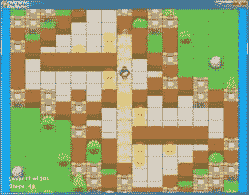
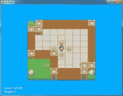
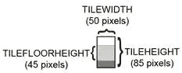
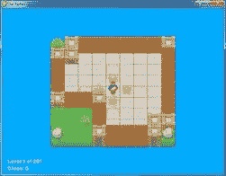

# 第九章：推星星

> 原文：[`inventwithpython.com/pygame/chapter9.html`](https://inventwithpython.com/pygame/chapter9.html)
> 
> 译者：[飞龙](https://github.com/wizardforcel)
> 
> 协议：[CC BY-NC-SA 4.0](https://creativecommons.org/licenses/by-nc-sa/4.0/)

          

## 如何玩推星星

推星星是 Sokoban 或“箱子推动者”的克隆。玩家位于一个房间，里面有几颗星星。房间中的一些瓷砖精灵上有星星标记。玩家必须想办法将星星推到有星星标记的瓷砖上。如果墙壁或其他星星在其后面，玩家就不能推动星星。玩家不能拉星星，所以如果星星被推到角落，玩家将不得不重新开始级别。当所有星星都被推到星星标记的地板瓷砖上时，级别完成，下一个级别开始。

每个级别由 2D 网格瓷砖图像组成。瓷砖精灵是相同大小的图像，可以相邻放置以形成更复杂的图像。有了一些地板和墙砖，我们可以创建许多有趣形状和大小的级别。

级别文件未包含在源代码中。相反，您可以自己创建级别文件或下载级别文件。可以从[`invpy.com/starPusherLevels.txt`](http://invpy.com/starPusherLevels.txt)下载包含 201 个级别的级别文件。运行推星星程序时，请确保此级别文件与 *starpusher.py* 文件在同一文件夹中。否则，您将收到此错误消息：AssertionError: Cannot find the level file: starPusherLevels.txt

级别设计最初由 David W. Skinner 制作。您可以从他的网站[`sneezingtiger.com/sokoban/levels.html`](http://sneezingtiger.com/sokoban/levels.html)下载更多谜题。

## 推星星的源代码

此源代码可从[`invpy.com/starpusher.py`](http://invpy.com/starpusher.py)下载。如果出现任何错误消息，请查看错误消息中提到的行号，并检查代码中是否有任何拼写错误。您还可以将代码复制并粘贴到[`invpy.com/diff/starpusher`](http://invpy.com/diff/starpusher)的网络表单中，以查看您的代码与书中代码之间的差异。

级别文件可从[`invpy.com/starPusherLevels.txt`](http://invpy.com/starPusherLevels.txt)下载。瓷砖可从[`invpy.com/starPusherImages.zip`](http://invpy.com/starPusherImages.zip)下载。

此外，就像松鼠、草地和敌人在《松鼠吃松鼠》游戏中的“对象”一样，当我在本章中说“地图对象”、“游戏状态对象”或“级别对象”时，我并不是指面向对象编程意义上的对象。这些“对象”实际上只是字典值，但由于它们代表游戏世界中的事物，因此更容易将它们称为对象。

```py
  # Star Pusher (a Sokoban clone)
  # By Al Sweigart [[email protected]](/cdn-cgi/l/email-protection)
  # http://inventwithpython.com/pygame
  # Creative Commons BY-NC-SA 3.0 US

  import random, sys, copy, os, pygame
  from pygame.locals import *

  FPS = 30 # frames per second to update the screen
 WINWIDTH = 800 # width of the program's window, in pixels
 WINHEIGHT = 600 # height in pixels
 HALF_WINWIDTH = int(WINWIDTH / 2)
 HALF_WINHEIGHT = int(WINHEIGHT / 2)

 # The total width and height of each tile in pixels.
 TILEWIDTH = 50
 TILEHEIGHT = 85
 TILEFLOORHEIGHT = 45

 CAM_MOVE_SPEED = 5 # how many pixels per frame the camera moves

 # The percentage of outdoor tiles that have additional
 # decoration on them, such as a tree or rock.
 OUTSIDE_DECORATION_PCT = 20

 BRIGHTBLUE = (  0, 170, 255)
 WHITE      = (255, 255, 255)
 BGCOLOR = BRIGHTBLUE
 TEXTCOLOR = WHITE

 UP = 'up'
 DOWN = 'down'
 LEFT = 'left'
 RIGHT = 'right'

def main():
     global FPSCLOCK, DISPLAYSURF, IMAGESDICT, TILEMAPPING, OUTSIDEDECOMAPPING, BASICFONT, PLAYERIMAGES, currentImage

     # Pygame initialization and basic set up of the global variables.
     pygame.init()
     FPSCLOCK = pygame.time.Clock()

     # Because the Surface object stored in DISPLAYSURF was returned
     # from the pygame.display.set_mode() function, this is the
     # Surface object that is drawn to the actual computer screen
     # when pygame.display.update() is called.
     DISPLAYSURF = pygame.display.set_mode((WINWIDTH, WINHEIGHT))

     pygame.display.set_caption('Star Pusher')
     BASICFONT = pygame.font.Font('freesansbold.ttf', 18)

    # A global dict value that will contain all the Pygame
     # Surface objects returned by pygame.image.load().
     IMAGESDICT = {'uncovered goal': pygame.image.load('RedSelector.png'),
                   'covered goal': pygame.image.load('Selector.png'),
                   'star': pygame.image.load('Star.png'),
                   'corner': pygame.image.load('Wall Block Tall.png'),
                   'wall': pygame.image.load('Wood Block Tall.png'),
                   'inside floor': pygame.image.load('Plain Block.png'),
                   'outside floor': pygame.image.load('Grass Block.png'),
                   'title': pygame.image.load('star_title.png'),
                   'solved': pygame.image.load('star_solved.png'),
                   'princess': pygame.image.load('princess.png'),
                   'boy': pygame.image.load('boy.png'),
                   'catgirl': pygame.image.load('catgirl.png'),
                   'horngirl': pygame.image.load('horngirl.png'),
                   'pinkgirl': pygame.image.load('pinkgirl.png'),
                   'rock': pygame.image.load('Rock.png'),
                   'short tree': pygame.image.load('Tree_Short.png'),
                   'tall tree': pygame.image.load('Tree_Tall.png'),
                   'ugly tree': pygame.image.load('Tree_Ugly.png')}

    # These dict values are global, and map the character that appears
     # in the level file to the Surface object it represents.
     TILEMAPPING = {'x': IMAGESDICT['corner'],
                    '#': IMAGESDICT['wall'],
                    'o': IMAGESDICT['inside floor'],
                    ' ': IMAGESDICT['outside floor']}
    OUTSIDEDECOMAPPING = {'1': IMAGESDICT['rock'],
                           '2': IMAGESDICT['short tree'],
                           '3': IMAGESDICT['tall tree'],
                           '4': IMAGESDICT['ugly tree']}

    # PLAYERIMAGES is a list of all possible characters the player can be.
     # currentImage is the index of the player's current player image.
    currentImage = 0
     PLAYERIMAGES = [IMAGESDICT['princess'],
                     IMAGESDICT['boy'],
                     IMAGESDICT['catgirl'],
                     IMAGESDICT['horngirl'],
                     IMAGESDICT['pinkgirl']]

    startScreen() # show the title screen until the user presses a key

     # Read in the levels from the text file. See the readLevelsFile() for
     # details on the format of this file and how to make your own levels.
     levels = readLevelsFile('starPusherLevels.txt')
    currentLevelIndex = 0

    # The main game loop. This loop runs a single level, when the user
    # finishes that level, the next/previous level is loaded.
    while True: # main game loop
        # Run the level to actually start playing the game:
        result = runLevel(levels, currentLevelIndex)

        if result in ('solved', 'next'):
            # Go to the next level.
            currentLevelIndex += 1
            if currentLevelIndex >= len(levels):
                # If there are no more levels, go back to the first one.
                currentLevelIndex = 0
        elif result == 'back':
            # Go to the previous level.
            currentLevelIndex -= 1
            if currentLevelIndex < 0:
                # If there are no previous levels, go to the last one.
                currentLevelIndex = len(levels)-1
        elif result == 'reset':
            pass # Do nothing. Loop re-calls runLevel() to reset the level

def runLevel(levels, levelNum):
     global currentImage
     levelObj = levels[levelnum]
    mapObj = decorateMap(levelObj['mapObj'], levelObj['startState']['player'])
    gameStateObj = copy.deepcopy(levelObj['startState'])
    mapNeedsRedraw = True # set to True to call drawMap()
    levelSurf = BASICFONT.render('Level %s of %s' % (levelObj['levelNum'] + 1, totalNumOfLevels), 1, TEXTCOLOR)
    levelRect = levelSurf.get_rect()
    levelRect.bottomleft = (20, WINHEIGHT - 35)
    mapWidth = len(mapObj) * TILEWIDTH
    mapHeight = (len(mapObj[0]) - 1) * (TILEHEIGHT - TILEFLOORHEIGHT) + TILEHEIGHT
    MAX_CAM_X_PAN = abs(HALF_WINHEIGHT - int(mapHeight / 2)) + TILEWIDTH
    MAX_CAM_Y_PAN = abs(HALF_WINWIDTH - int(mapWidth / 2)) + TILEHEIGHT

    levelIsComplete = False
    # Track how much the camera has moved:
    cameraOffsetX = 0
    cameraOffsetY = 0
    # Track if the keys to move the camera are being held down:
    cameraUp = False
    cameraDown = False
    cameraLeft = False
    cameraRight = False

    while True: # main game loop
        # Reset these variables:
        playerMoveTo = None
        keyPressed = False

        for event in pygame.event.get(): # event handling loop
            if event.type == QUIT:
                # Player clicked the "X" at the corner of the window.
                terminate()

            elif event.type == KEYDOWN:
                # Handle key presses
                keyPressed = True
                if event.key == K_LEFT:
                    playerMoveTo = LEFT
                elif event.key == K_RIGHT:
                    playerMoveTo = RIGHT
                elif event.key == K_UP:
                    playerMoveTo = UP
                elif event.key == K_DOWN:
                    playerMoveTo = DOWN

                # Set the camera move mode.
                elif event.key == K_a:
                    cameraLeft = True
                elif event.key == K_d:
                    cameraRight = True
                elif event.key == K_w:
                    cameraUp = True
                elif event.key == K_s:
                    cameraDown = True

                elif event.key == K_n:
                    return 'next'
                elif event.key == K_b:
                    return 'back'

                elif event.key == K_ESCAPE:
                    terminate() # Esc key quits.
                elif event.key == K_BACKSPACE:
                    return 'reset' # Reset the level.
                elif event.key == K_p:
                    # Change the player image to the next one.
                    currentImage += 1
                    if currentImage >= len(PLAYERIMAGES):
                        # After the last player image, use the first one.
                        currentImage = 0
                    mapNeedsRedraw = True

            elif event.type == KEYUP:
                # Unset the camera move mode.
                if event.key == K_a:
                    cameraLeft = False
                elif event.key == K_d:
                    cameraRight = False
                elif event.key == K_w:
                    cameraUp = False
                elif event.key == K_s:
                    cameraDown = False

        if playerMoveTo != None and not levelIsComplete:
            # If the player pushed a key to move, make the move
            # (if possible) and push any stars that are pushable.
            moved = makeMove(mapObj, gameStateObj, playerMoveTo)

            if moved:
                # increment the step counter.
                gameStateObj['stepCounter'] += 1
                mapNeedsRedraw = True

            if isLevelFinished(levelObj, gameStateObj):
                # level is solved, we should show the "Solved!" image.
                levelIsComplete = True
                keyPressed = False

        DISPLAYSURF.fill(BGCOLOR)

        if mapNeedsRedraw:
            mapSurf = drawMap(mapObj, gameStateObj, levelObj['goals'])
            mapNeedsRedraw = False

        if cameraUp and cameraOffsetY < MAX_CAM_X_PAN:
            cameraOffsetY += CAM_MOVE_SPEED
        elif cameraDown and cameraOffsetY > -MAX_CAM_X_PAN:
            cameraOffsetY -= CAM_MOVE_SPEED
        if cameraLeft and cameraOffsetX < MAX_CAM_Y_PAN:
            cameraOffsetX += CAM_MOVE_SPEED
        elif cameraRight and cameraOffsetX > -MAX_CAM_Y_PAN:
            cameraOffsetX -= CAM_MOVE_SPEED

        # Adjust mapSurf's Rect object based on the camera offset.
        mapSurfRect = mapSurf.get_rect()
        mapSurfRect.center = (HALF_WINWIDTH + cameraOffsetX, HALF_WINHEIGHT + cameraOffsetY)

        # Draw mapSurf to the DISPLAYSURF Surface object.
        DISPLAYSURF.blit(mapSurf, mapSurfRect)

        DISPLAYSURF.blit(levelSurf, levelRect)
        stepSurf = BASICFONT.render('Steps: %s' % (gameStateObj['stepCounter']), 1, TEXTCOLOR)
        stepRect = stepSurf.get_rect()
        stepRect.bottomleft = (20, WINHEIGHT - 10)
        DISPLAYSURF.blit(stepSurf, stepRect)

        if levelIsComplete:
            # is solved, show the "Solved!" image until the player
            # has pressed a key.
            solvedRect = IMAGESDICT['solved'].get_rect()
            solvedRect.center = (HALF_WINWIDTH, HALF_WINHEIGHT)
            DISPLAYSURF.blit(IMAGESDICT['solved'], solvedRect)

            if keyPressed:
                return 'solved'

        pygame.display.update() # draw DISPLAYSURF to the screen.
        FPSCLOCK.tick()

def decorateMap(mapObj, startxy):
    """Makes a copy of the given map object and modifies it.
    Here is what is done to it:
        * Walls that are corners are turned into corner pieces.
        * The outside/inside floor tile distinction is made.
        * Tree/rock decorations are randomly added to the outside tiles.

    Returns the decorated map object."""

    startx, starty = startxy # Syntactic sugar

    # Copy the map object so we don't modify the original passed
    mapObjCopy = copy.deepcopy(mapObj)

    # Remove the non-wall characters from the map data
    for x in range(len(mapObjCopy)):
        for y in range(len(mapObjCopy[0])):
            if mapObjCopy[x][y] in ('$', '.', '@', '+', '*'):
                mapObjCopy[x][y] = ' '

    # Flood fill to determine inside/outside floor tiles.
    floodFill(mapObjCopy, startx, starty, ' ', 'o')

    # Convert the adjoined walls into corner tiles.
    for x in range(len(mapObjCopy)):
        for y in range(len(mapObjCopy[0])):

            if mapObjCopy[x][y] == '#':
                if (isWall(mapObjCopy, x, y-1) and isWall(mapObjCopy, x+1, y)) or \
                   (isWall(mapObjCopy, x+1, y) and isWall(mapObjCopy, x, y+1)) or \
                   (isWall(mapObjCopy, x, y+1) and isWall(mapObjCopy, x-1, y)) or \
                   (isWall(mapObjCopy, x-1, y) and isWall(mapObjCopy, x, y-1)):
                    mapObjCopy[x][y] = 'x'

            elif mapObjCopy[x][y] == ' ' and random.randint(0, 99) < OUTSIDE_DECORATION_PCT:
                mapObjCopy[x][y] = random.choice(list(OUTSIDEDECOMAPPING.keys()))

    return mapObjCopy

def isBlocked(mapObj, gameStateObj, x, y):
    """Returns True if the (x, y) position on the map is
    blocked by a wall or star, otherwise return False."""

    if isWall(mapObj, x, y):
        return True

    elif x < 0 or x >= len(mapObj) or y < 0 or y >= len(mapObj[x]):
        return True # x and y aren't actually on the map.

    elif (x, y) in gameStateObj['stars']:
        return True # a star is blocking

    return False

def makeMove(mapObj, gameStateObj, playerMoveTo):
    """Given a map and game state object, see if it is possible for the
    player to make the given move. If it is, then change the player's
    position (and the position of any pushed star). If not, do nothing.

    Returns True if the player moved, otherwise False."""

    # Make sure the player can move in the direction they want.
    playerx, playery = gameStateObj['player']

    # This variable is "syntactic sugar". Typing "stars" is more
    # readable than typing "gameStateObj['stars']" in our code.
    stars = gameStateObj['stars']

    # The code for handling each of the directions is so similar aside
    # from adding or subtracting 1 to the x/y coordinates. We can
    # simplify it by using the xOffset and yOffset variables.
    if playerMoveTo == UP:
        xOffset = 0
        yOffset = -1
    elif playerMoveTo == RIGHT:
        xOffset = 1
        yOffset = 0
    elif playerMoveTo == DOWN:
        xOffset = 0
        yOffset = 1
    elif playerMoveTo == LEFT:
        xOffset = -1
        yOffset = 0

    # See if the player can move in that direction.
    if isWall(mapObj, playerx + xOffset, playery + yOffset):
        return False
    else:
        if (playerx + xOffset, playery + yOffset) in stars:
            # There is a star in the way, see if the player can push it.
            if not isBlocked(mapObj, gameStateObj, playerx + (xOffset*2), playery + (yOffset*2)):
                # Move the star.
                ind = stars.index((playerx + xOffset, playery + yOffset))
                stars[ind] = (stars[ind][0] + xOffset, stars[ind][1] + yOffset)
            else:
                return False
        # Move the player upwards.
        gameStateObj['player'] = (playerx + xOffset, playery + yOffset)
        return True

def startScreen():
    """Display the start screen (which has the title and instructions)
    until the player presses a key. Returns None."""

    # Position the title image.
    titleRect = IMAGESDICT['title'].get_rect()
    topCoord = 50 # topCoord tracks where to position the top of the text
    titleRect.top = topCoord
    titleRect.centerx = HALF_WINWIDTH
    topCoord += titleRect.height

    # Unfortunately, Pygame's font & text system only shows one line at
    # a time, so we can't use strings with \n newline characters in them.
    # So we will use a list with each line in it.
    instructionText = ['Push the stars over the marks.',
                       'Arrow keys to move, WASD for camera control, P to change character.',
                       'Backspace to reset level, Esc to quit.',
                       'N for next level, B to go back a level.']

    # Start with drawing a blank color to the entire window:
    DISPLAYSURF.fill(BGCOLOR)

    # Draw the title image to the window:
    DISPLAYSURF.blit(IMAGESDICT['title'], titleRect)

    # Position and draw the text.
    for i in range(len(instructionText)):
        instSurf = BASICFONT.render(instructionText[i], 1, TEXTCOLOR)
        instRect = instSurf.get_rect()
        topCoord += 10 # 10 pixels will go in between each line of text.
        instRect.top = topCoord
        instRect.centerx = HALF_WINWIDTH
        topCoord += instRect.height # Adjust for the height of the line.
        DISPLAYSURF.blit(instSurf, instRect)

    while True: # Main loop for the start screen.
        for event in pygame.event.get():
            if event.type == QUIT:
                terminate()
            elif event.type == KEYDOWN:
                if event.key == K_ESCAPE:
                    terminate()
                return # user has pressed a key, so return.

        # Display the DISPLAYSURF contents to the actual screen.
        pygame.display.update()
        FPSCLOCK.tick()

def readLevelsFile(filename):
    assert os.path.exists(filename), 'Cannot find the level file: %s' % (filename)
    mapFile = open(filename, 'r')
    # Each level must end with a blank line
    content = mapFile.readlines() + ['\r\n']
     mapFile.close()

    levels = [] # Will contain a list of level objects.
    levelNum = 0
    mapTextLines = [] # contains the lines for a single level's map.
    mapObj = [] # the map object made from the data in mapTextLines
    for lineNum in range(len(content)):
        # Process each line that was in the level file.
        line = content[lineNum].rstrip('\r\n')

        if ';' in line:
            # Ignore the ; lines, they're comments in the level file.
            line = line[:line.find(';')]

        if line != '':
            # This line is part of the map.
            mapTextLines.append(line)
        elif line == '' and len(mapTextLines) > 0:
            # A blank line indicates the end of a level's map in the file.
            # Convert the text in mapTextLines into a level object.

            # Find the longest row in the map.
            maxWidth = -1
            for i in range(len(mapTextLines)):
                if len(mapTextLines[i]) > maxWidth:
                    maxWidth = len(mapTextLines[i])
            # Add spaces to the ends of the shorter rows. This
            # ensures the map will be rectangular.
            for i in range(len(mapTextLines)):
                mapTextLines[i] += ' ' * (maxWidth - len(mapTextLines[i]))

            # Convert mapTextLines to a map object.
            for x in range(len(mapTextLines[0])):
                mapObj.append([])
            for y in range(len(mapTextLines)):
                for x in range(maxWidth):
                    mapObj[x].append(mapTextLines[y][x])

            # Loop through the spaces in the map and find the @, ., and $
            # characters for the starting game state.
            startx = None # The x and y for the player's starting position
            starty = None
            goals = [] # list of (x, y) tuples for each goal.
            stars = [] # list of (x, y) for each star's starting position.
            for x in range(maxWidth):
                for y in range(len(mapObj[x])):
                    if mapObj[x][y] in ('@', '+'):
                        # '@' is player, '+' is player & goal
                        startx = x
                        starty = y
                    if mapObj[x][y] in ('.', '+', '*'):
                        # '.' is goal, '*' is star & goal
                        goals.append((x, y))
                    if mapObj[x][y] in ('$', '*'):
                        # '$' is star
                        stars.append((x, y))

            # Basic level design sanity checks:
            assert startx != None and starty != None, 'Level %s (around line %s) in %s is missing a "@" or "+" to mark the start point.' % (levelNum+1, lineNum, filename)
            assert len(goals) > 0, 'Level %s (around line %s) in %s must have at least one goal.' % (levelNum+1, lineNum, filename)

            assert len(stars) >= len(goals), 'Level %s (around line %s) in %s is impossible to solve. It has %s goals but only %s stars.' % (levelNum+1, lineNum, filename, len(goals), len(stars))

            # Create level object and starting game state object.
            gameStateObj = {'player': (startx, starty),
                            'stepCounter': 0,
                            'stars': stars}
            levelObj = {'width': maxWidth,
                        'height': len(mapObj),
                        'mapObj': mapObj,
                        'goals': goals,
                        'startState': gameStateObj}

            levels.append(levelObj)

            # Reset the variables for reading the next map.
            mapTextLines = []
            mapObj = []
            gameStateObj = {}
            levelNum += 1
    return levels
511.
512.
def floodFill(mapObj, x, y, oldCharacter, newCharacter):
    """Changes any values matching oldCharacter on the map object to
    newCharacter at the (x, y) position, and does the same for the
    positions to the left, right, down, and up of (x, y), recursively."""

    # In this game, the flood fill algorithm creates the inside/outside
    # floor distinction. This is a "recursive" function.
    # For more info on the Flood Fill algorithm, see:
    #   http://en.wikipedia.org/wiki/Flood_fill
    if mapObj[x][y] == oldCharacter:
        mapObj[x][y] = newCharacter

    if x < len(mapObj) - 1 and mapObj[x+1][y] == oldCharacter:
        floodFill(mapObj, x+1, y, oldCharacter, newCharacter) # call right
    if x > 0 and mapObj[x-1][y] == oldCharacter:
        floodFill(mapObj, x-1, y, oldCharacter, newCharacter) # call left
    if y < len(mapObj[x]) - 1 and mapObj[x][y+1] == oldCharacter:
        floodFill(mapObj, x, y+1, oldCharacter, newCharacter) # call down
    if y > 0 and mapObj[x][y-1] == oldCharacter:
        floodFill(mapObj, x, y-1, oldCharacter, newCharacter) # call up

def drawMap(mapObj, gameStateObj, goals):
    """Draws the map to a Surface object, including the player and
    stars. This function does not call pygame.display.update(), nor
    does it draw the "Level" and "Steps" text in the corner."""

    # mapSurf will be the single Surface object that the tiles are drawn
    # on, so that it is easy to position the entire map on the DISPLAYSURF
    # Surface object. First, the width and height must be calculated.
    mapSurfWidth = len(mapObj) * TILEWIDTH
    mapSurfHeight = (len(mapObj[0]) - 1) * (TILEHEIGHT - TILEFLOORHEIGHT) + TILEHEIGHT
    mapSurf = pygame.Surface((mapSurfWidth, mapSurfHeight))
    mapSurf.fill(BGCOLOR) # start with a blank color on the surface.

    # Draw the tile sprites onto this surface.
    for x in range(len(mapObj)):
        for y in range(len(mapObj[x])):
            spaceRect = pygame.Rect((x * TILEWIDTH, y * (TILEHEIGHT - TILEFLOORHEIGHT), TILEWIDTH, TILEHEIGHT))
            if mapObj[x][y] in TILEMAPPING:
                baseTile = TILEMAPPING[mapObj[x][y]]
            elif mapObj[x][y] in OUTSIDEDECOMAPPING:
                baseTile = TILEMAPPING[' ']

            # First draw the base ground/wall tile.
            mapSurf.blit(baseTile, spaceRect)

            if mapObj[x][y] in OUTSIDEDECOMAPPING:
                # Draw any tree/rock decorations that are on this tile.
                mapSurf.blit(OUTSIDEDECOMAPPING[mapObj[x][y]], spaceRect)
            elif (x, y) in gameStateObj['stars']:
                if (x, y) in goals:
                    # A goal AND star are on this space, draw goal first.
                    mapSurf.blit(IMAGESDICT['covered goal'], spaceRect)
                # Then draw the star sprite.
                mapSurf.blit(IMAGESDICT['star'], spaceRect)
            elif (x, y) in goals:
                # Draw a goal without a star on it.
                mapSurf.blit(IMAGESDICT['uncovered goal'], spaceRect)

            # Last draw the player on the board.
            if (x, y) == gameStateObj['player']:
                # Note: The value "currentImage" refers
                # to a key in "PLAYERIMAGES" which has the
                # specific player image we want to show.
                mapSurf.blit(PLAYERIMAGES[currentImage], spaceRect)

    return mapSurf

def isLevelFinished(levelObj, gameStateObj):
    """Returns True if all the goals have stars in them."""
    for goal in levelObj['goals']:
        if goal not in gameStateObj['stars']:
            # Found a space with a goal but no star on it.
            return False
    return True

def terminate():
    pygame.quit()
    sys.exit()

if __name__ == '__main__':
    main()

```

## 初始设置

```py
  # Star Pusher (a Sokoban clone)
  # By Al Sweigart [[email protected]](/cdn-cgi/l/email-protection)
  # http://inventwithpython.com/pygame
  # Creative Commons BY-NC-SA 3.0 US

  import random, sys, copy, os, pygame
  from pygame.locals import *

  FPS = 30 # frames per second to update the screen
 WINWIDTH = 800 # width of the program's window, in pixels
 WINHEIGHT = 600 # height in pixels
 HALF_WINWIDTH = int(WINWIDTH / 2)
 HALF_WINHEIGHT = int(WINHEIGHT / 2)

 # The total width and height of each tile in pixels.
 TILEWIDTH = 50
 TILEHEIGHT = 85
 TILEFLOORHEIGHT = 45

 CAM_MOVE_SPEED = 5 # how many pixels per frame the camera moves

 # The percentage of outdoor tiles that have additional
 # decoration on them, such as a tree or rock.
 OUTSIDE_DECORATION_PCT = 20

 BRIGHTBLUE = (  0, 170, 255)
 WHITE      = (255, 255, 255)
 BGCOLOR = BRIGHTBLUE
 TEXTCOLOR = WHITE

 UP = 'up'
 DOWN = 'down'
 LEFT = 'left'
 RIGHT = 'right'

```

这些常数在程序的各个部分中使用。 `TILEWIDTH` 和 `TILEHEIGHT` 变量显示每个瓷砖图像的宽度为 50 像素，高度为 85 像素。但是，这些瓷砖在屏幕上绘制时会重叠。（稍后会解释。） `TILEFLOORHEIGHT` 指的是表示地板的瓷砖部分高 45 像素。这是一个简单地板图像的示意图：



房间外的草地瓷砖有时会添加额外的装饰（如树木或岩石）。 `OUTSIDE_DECORATION_PCT` 常数显示这些瓷砖中将随机有这些装饰的百分比。

```py
 def main():
     global FPSCLOCK, DISPLAYSURF, IMAGESDICT, TILEMAPPING, OUTSIDEDECOMAPPING, BASICFONT, PLAYERIMAGES, currentImage

     # Pygame initialization and basic set up of the global variables.
     pygame.init()
     FPSCLOCK = pygame.time.Clock()

     # Because the Surface object stored in DISPLAYSURF was returned
     # from the pygame.display.set_mode() function, this is the
     # Surface object that is drawn to the actual computer screen
     # when pygame.display.update() is called.
     DISPLAYSURF = pygame.display.set_mode((WINWIDTH, WINHEIGHT))

     pygame.display.set_caption('Star Pusher')
     BASICFONT = pygame.font.Font('freesansbold.ttf', 18)

```

这是程序开始时发生的通常 Pygame 设置。

```py
    # A global dict value that will contain all the Pygame
     # Surface objects returned by pygame.image.load().
     IMAGESDICT = {'uncovered goal': pygame.image.load('RedSelector.png'),
                   'covered goal': pygame.image.load('Selector.png'),
                   'star': pygame.image.load('Star.png'),
                   'corner': pygame.image.load('Wall Block Tall.png'),
                   'wall': pygame.image.load('Wood Block Tall.png'),
                   'inside floor': pygame.image.load('Plain Block.png'),
                   'outside floor': pygame.image.load('Grass Block.png'),
                   'title': pygame.image.load('star_title.png'),
                   'solved': pygame.image.load('star_solved.png'),
                   'princess': pygame.image.load('princess.png'),
                   'boy': pygame.image.load('boy.png'),
                   'catgirl': pygame.image.load('catgirl.png'),
                   'horngirl': pygame.image.load('horngirl.png'),
                   'pinkgirl': pygame.image.load('pinkgirl.png'),
                   'rock': pygame.image.load('Rock.png'),
                   'short tree': pygame.image.load('Tree_Short.png'),
                   'tall tree': pygame.image.load('Tree_Tall.png'),
                   'ugly tree': pygame.image.load('Tree_Ugly.png')}

```

`IMAGESDICT`是一个字典，其中存储了所有加载的图像。这样在其他函数中使用起来更容易，因为只需要将`IMAGESDICT`变量设为全局变量。如果我们将每个图像存储在单独的变量中，那么所有 18 个变量（用于此游戏中使用的 18 个图像）都需要设为全局变量。包含所有 Surface 对象的字典与图像更容易处理。

```py
     # These dict values are global, and map the character that appears
     # in the level file to the Surface object it represents.
     TILEMAPPING = {'x': IMAGESDICT['corner'],
                    '#': IMAGESDICT['wall'],
                    'o': IMAGESDICT['inside floor'],
                    ' ': IMAGESDICT['outside floor']}

```

地图的数据结构只是一个由单个字符字符串组成的二维列表。`TILEMAPPING`字典将地图数据结构中使用的字符链接到它们代表的图像。（这将在`drawMap()`函数的解释中更清楚。）

```py
     OUTSIDEDECOMAPPING = {'1': IMAGESDICT['rock'],
                           '2': IMAGESDICT['short tree'],
                           '3': IMAGESDICT['tall tree'],
                           '4': IMAGESDICT['ugly tree']}

```

`OUTSIDEDECOMAPPING`也是一个字典，将地图数据结构中使用的字符链接到加载的图像。“外部装饰”图像绘制在室外草地砖上方。

```py
    # PLAYERIMAGES is a list of all possible characters the player can be.
     # currentImage is the index of the player's current player image.
    currentImage = 0
     PLAYERIMAGES = [IMAGESDICT['princess'],
                     IMAGESDICT['boy'],
                     IMAGESDICT['catgirl'],
                     IMAGESDICT['horngirl'],
                     IMAGESDICT['pinkgirl']]

```

`PLAYERIMAGES`列表存储了玩家使用的图像。`currentImage`变量跟踪当前选择的玩家图像的索引。例如，当`currentImage`设置为`0`时，屏幕上会绘制`PLAYERIMAGES[0]`，也就是“公主”玩家图像。

```py
     startScreen() # show the title screen until the user presses a key

     # Read in the levels from the text file. See the readLevelsFile() for
     # details on the format of this file and how to make your own levels.
     levels = readLevelsFile('starPusherLevels.txt')
    currentLevelIndex = 0

```

`startScreen()`函数将持续显示初始启动屏幕（其中还包括游戏说明），直到玩家按下键。当玩家按下键时，`startScreen()`函数返回并从关卡文件中读取关卡。玩家从第一关开始，这是关卡列表中索引为`0`的关卡对象。

```py
    # The main game loop. This loop runs a single level, when the user
    # finishes that level, the next/previous level is loaded.
    while True: # main game loop
        # Run the level to actually start playing the game:
        result = runLevel(levels, currentLevelIndex)

```

`runLevel()`函数处理游戏的所有动作。它接收一个关卡对象列表和要玩的关卡在该列表中的整数索引。当玩家完成关卡时，`runLevel()`将返回以下字符串之一：`'solved'`（因为玩家已经将所有星星放在目标上），`'next'`（因为玩家想跳到下一关），`'back'`（因为玩家想回到上一关），和`'reset'`（因为玩家想重新开始当前关卡，也许是因为他们把星星推到了角落里）。

```py
        if result in ('solved', 'next'):
            # Go to the next level.
            currentLevelIndex += 1
            if currentLevelIndex >= len(levels):
                # If there are no more levels, go back to the first one.
                currentLevelIndex = 0
        elif result == 'back':
            # Go to the previous level.
            currentLevelIndex -= 1
            if currentLevelIndex < 0:
                # If there are no previous levels, go to the last one.
                currentLevelIndex = len(levels)-1

```

如果`runLevel()`返回字符串`'solved'`或`'next'`，则需要将`levelNum`增加`1`。如果这将`levelNum`增加到超出关卡数量，则将`levelNum`设置回`0`。

如果返回`'back'`，则`levelNum`减`1`。如果这使其小于`0`，则将其设置为最后一关（即`len(levels)-1`）。

```py
        elif result == 'reset':
            pass # Do nothing. Loop re-calls runLevel() to reset the level

```

如果返回值是`'reset'`，则代码不执行任何操作。`pass`语句不执行任何操作（类似于注释），但是需要因为 Python 解释器在`elif`语句后期望一个缩进的代码行。

我们可以完全从源代码中删除第 119 和 120 行，程序仍然可以正常工作。我们在这里包含它的原因是为了程序的可读性，这样如果以后对代码进行更改，我们不会忘记`runLevel()`也可以返回字符串`'reset'`。

```py
def runLevel(levels, levelNum):
     global currentImage
     levelObj = levels[levelnum]
    mapObj = decorateMap(levelObj['mapObj'], levelObj['startState']['player'])
    gameStateObj = copy.deepcopy(levelObj['startState'])

```

关卡列表包含了从关卡文件中加载的所有关卡对象。当前关卡的关卡对象（即`levelNum`设置的值）存储在`levelObj`变量中。从`decorateMap()`函数返回一个地图对象（它区分室内和室外瓷砖，并用树木和岩石装饰室外瓷砖）。并且为了跟踪玩家玩这个关卡时的游戏状态，使用`copy.deepcopy()`函数创建了存储在`levelObj`中的游戏状态对象的副本。

游戏状态对象的副本是因为存储在`levelObj['startState']`中的游戏状态对象代表了关卡开始时的游戏状态，我们不希望修改它。否则，如果玩家重新开始关卡，该关卡的原始游戏状态将丢失。

`copy.deepcopy()` 函数被使用是因为游戏状态对象是一个包含元组的字典。但从技术上讲，字典包含对元组的引用。（引用在[`invpy.com/references`](http://invpy.com/references)中有详细解释。）使用赋值语句来复制字典将复制引用而不是它们所指向的值，因此复制和原始字典仍然指向相同的元组。

`copy.deepcopy()` 函数通过复制字典中的实际元组来解决了这个问题。这样我们可以保证改变一个字典不会影响另一个字典。

```py
    mapNeedsRedraw = True # set to True to call drawMap()
    levelSurf = BASICFONT.render('Level %s of %s' % (levelObj['levelNum'] + 1, totalNumOfLevels), 1, TEXTCOLOR)
    levelRect = levelSurf.get_rect()
    levelRect.bottomleft = (20, WINHEIGHT - 35)
    mapWidth = len(mapObj) * TILEWIDTH
    mapHeight = (len(mapObj[0]) - 1) * (TILEHEIGHT - TILEFLOORHEIGHT) + TILEHEIGHT
    MAX_CAM_X_PAN = abs(HALF_WINHEIGHT - int(mapHeight / 2)) + TILEWIDTH
    MAX_CAM_Y_PAN = abs(HALF_WINWIDTH - int(mapWidth / 2)) + TILEHEIGHT

    levelIsComplete = False
    # Track how much the camera has moved:
    cameraOffsetX = 0
    cameraOffsetY = 0
    # Track if the keys to move the camera are being held down:
    cameraUp = False
    cameraDown = False
    cameraLeft = False
    cameraRight = False

```

在开始玩一个关卡时设置了更多的变量。`mapWidth` 和 `mapHeight` 变量是地图的像素大小。计算 `mapHeight` 的表达式有点复杂，因为瓷砖彼此重叠。只有底部一行瓷砖是完整的高度（这解释了表达式中的 `+ TILEHEIGHT` 部分），所有其他行的瓷砖（数量为 `(len(mapObj[0]) - 1)`）都有轻微的重叠。这意味着它们实际上每个只有 `(TILEHEIGHT - TILEFLOORHEIGHT)` 像素高。

《推星星》中的摄像头可以独立于玩家在地图上移动。这就是为什么摄像头需要自己的一组“移动”变量：`cameraUp`、`cameraDown`、`cameraLeft` 和 `cameraRight`。`cameraOffsetX` 和 `cameraOffsetY` 变量跟踪摄像头的位置。

```py
    while True: # main game loop
        # Reset these variables:
        playerMoveTo = None
        keyPressed = False

        for event in pygame.event.get(): # event handling loop
            if event.type == QUIT:
                # Player clicked the "X" at the corner of the window.
                terminate()

```

`playerMoveTo` 变量将被设置为玩家打算在地图上移动玩家角色的方向常量。`keyPressed` 变量跟踪在游戏循环的这次迭代中是否按下了任何键。稍后在玩家解决了关卡时会检查这个变量。

```py
            elif event.type == KEYDOWN:
                # Handle key presses
                keyPressed = True
                if event.key == K_LEFT:
                    playerMoveTo = LEFT
                elif event.key == K_RIGHT:
                    playerMoveTo = RIGHT
                elif event.key == K_UP:
                    playerMoveTo = UP
                elif event.key == K_DOWN:
                    playerMoveTo = DOWN

                # Set the camera move mode.
                elif event.key == K_a:
                    cameraLeft = True
                elif event.key == K_d:
                    cameraRight = True
                elif event.key == K_w:
                    cameraUp = True
                elif event.key == K_s:
                    cameraDown = True

                elif event.key == K_n:
                    return 'next'
                elif event.key == K_b:
                    return 'back'

                elif event.key == K_ESCAPE:
                    terminate() # Esc key quits.
                elif event.key == K_BACKSPACE:
                    return 'reset' # Reset the level.
                elif event.key == K_p:
                    # Change the player image to the next one.
                    currentImage += 1
                    if currentImage >= len(PLAYERIMAGES):
                        # After the last player image, use the first one.
                        currentImage = 0
                    mapNeedsRedraw = True

            elif event.type == KEYUP:
                # Unset the camera move mode.
                if event.key == K_a:
                    cameraLeft = False
                elif event.key == K_d:
                    cameraRight = False
                elif event.key == K_w:
                    cameraUp = False
                elif event.key == K_s:
                    cameraDown = False

```

这段代码处理了按下各种键时要做什么。

```py
        if playerMoveTo != None and not levelIsComplete:
            # If the player pushed a key to move, make the move
            # (if possible) and push any stars that are pushable.
            moved = makeMove(mapObj, gameStateObj, playerMoveTo)

            if moved:
                # increment the step counter.
                gameStateObj['stepCounter'] += 1
                mapNeedsRedraw = True

            if isLevelFinished(levelObj, gameStateObj):
                # level is solved, we should show the "Solved!" image.
                levelIsComplete = True
                keyPressed = False

```

如果 `playerMoveTo` 变量不再设置为 `None`，那么我们知道玩家打算移动。对 `makeMove()` 的调用处理了改变 `gameStateObj` 中玩家位置的 XY 坐标，以及推动任何星星。`makeMove()` 的返回值存储在 `moved` 中。如果这个值是 `True`，那么玩家角色就朝那个方向移动了。如果值是 `False`，那么玩家一定试图移动到一个墙上，或者推动一个背后有东西的星星。在这种情况下，玩家无法移动，地图上的任何东西都不会改变。

```py
        DISPLAYSURF.fill(BGCOLOR)

        if mapNeedsRedraw:
            mapSurf = drawMap(mapObj, gameStateObj, levelObj['goals'])
            mapNeedsRedraw = False

```

地图不需要在游戏循环的每次迭代中重新绘制。事实上，这个游戏程序已经足够复杂，这样做会导致游戏略微（但是可察觉的）减速。地图只有在发生变化时（比如玩家移动或推动星星）才需要重新绘制。因此，`mapSurf` 变量中的 Surface 对象只有在 `mapNeedsRedraw` 变量被设置为 `True` 时才会通过调用 `drawMap()` 函数进行更新。

在第 225 行绘制地图后，`mapNeedsRedraw` 变量被设置为 `False`。如果想要看到程序在游戏循环的每次迭代中绘制而变慢，可以注释掉第 226 行并重新运行程序。你会注意到移动摄像头会明显变慢。

```py
        if cameraUp and cameraOffsetY < MAX_CAM_X_PAN:
            cameraOffsetY += CAM_MOVE_SPEED
        elif cameraDown and cameraOffsetY > -MAX_CAM_X_PAN:
            cameraOffsetY -= CAM_MOVE_SPEED
        if cameraLeft and cameraOffsetX < MAX_CAM_Y_PAN:
            cameraOffsetX += CAM_MOVE_SPEED
        elif cameraRight and cameraOffsetX > -MAX_CAM_Y_PAN:
            cameraOffsetX -= CAM_MOVE_SPEED

```

如果摄像头移动变量被设置为 `True`，并且摄像头没有超过由 `MAX_CAM_X_PAN` 和 `MAX_CAM_Y_PAN` 设置的边界，那么摄像头位置（存储在 `cameraOffsetX` 和 `cameraOffsetY` 中）应该移动 `CAM_MOVE_SPEED` 像素。

请注意，在第 228 行和第 230 行有一个 `if` 和 `elif` 语句用于上下移动摄像头，然后在第 232 行和第 234 行有一个单独的 `if` 和 `elif` 语句。这样，用户可以同时在垂直和水平方向上移动摄像头。如果第 232 行是一个 `elif` 语句，这是不可能的。

```py
        # Adjust mapSurf's Rect object based on the camera offset.
        mapSurfRect = mapSurf.get_rect()
        mapSurfRect.center = (HALF_WINWIDTH + cameraOffsetX, HALF_WINHEIGHT + cameraOffsetY)

        # Draw mapSurf to the DISPLAYSURF Surface object.
        DISPLAYSURF.blit(mapSurf, mapSurfRect)

        DISPLAYSURF.blit(levelSurf, levelRect)
        stepSurf = BASICFONT.render('Steps: %s' % (gameStateObj['stepCounter']), 1, TEXTCOLOR)
        stepRect = stepSurf.get_rect()
        stepRect.bottomleft = (20, WINHEIGHT - 10)
        DISPLAYSURF.blit(stepSurf, stepRect)

        if levelIsComplete:
            # is solved, show the "Solved!" image until the player
            # has pressed a key.
            solvedRect = IMAGESDICT['solved'].get_rect()
            solvedRect.center = (HALF_WINWIDTH, HALF_WINHEIGHT)
            DISPLAYSURF.blit(IMAGESDICT['solved'], solvedRect)

            if keyPressed:
                return 'solved'

        pygame.display.update() # draw DISPLAYSURF to the screen.
        FPSCLOCK.tick()

```

237 到 261 行定位摄像头并将地图和其他图形绘制到`DISPLAYSURF`中。如果关卡已解决，则胜利图形也会绘制在其他所有内容之上。如果用户在此迭代期间按下键，则`keyPressed`变量将设置为`True`，此时`runLevel()`函数将返回。

```py
def isWall(mapObj, x, y):
    """Returns True if the (x, y) position on
    the map is a wall, otherwise return False."""
    if x < 0 or x >= len(mapObj) or y < 0 or y >= len(mapObj[x]):
        return False # x and y aren't actually on the map.
    elif mapObj[x][y] in ('#', 'x'):
        return True # wall is blocking
    return False

```

`isWall()`函数在地图对象的 XY 坐标处返回`True`，如果有墙壁。墙壁对象在地图对象中表示为`'x'`或`'#'`字符串。

```py
def decorateMap(mapObj, startxy):
    """Makes a copy of the given map object and modifies it.
    Here is what is done to it:
        * Walls that are corners are turned into corner pieces.
        * The outside/inside floor tile distinction is made.
        * Tree/rock decorations are randomly added to the outside tiles.

    Returns the decorated map object."""

    startx, starty = startxy # Syntactic sugar

    # Copy the map object so we don't modify the original passed
    mapObjCopy = copy.deepcopy(mapObj)

```

`decorateMap()`函数改变了数据结构`mapObj`，使其不像地图文件中那样简单。`decorateMap()`改变的三件事在函数顶部的注释中有解释。

```py
    # Remove the non-wall characters from the map data
    for x in range(len(mapObjCopy)):
        for y in range(len(mapObjCopy[0])):
            if mapObjCopy[x][y] in ('$', '.', '@', '+', '*'):
                mapObjCopy[x][y] = ' '

```

地图对象具有表示玩家、目标和星星位置的字符。这些对于地图对象是必要的（它们在地图文件读取后存储在其他数据结构中），因此它们被转换为空格。

```py
    # Flood fill to determine inside/outside floor tiles.
    floodFill(mapObjCopy, startx, starty, ' ', 'o')

```

`floodFill()`函数将把墙壁内的所有瓷砖从`' '`字符更改为`'o'`字符。它使用一种称为递归的编程概念来实现这一点，这在本章后面的“递归函数”部分中有解释。

```py
    # Convert the adjoined walls into corner tiles.
    for x in range(len(mapObjCopy)):
        for y in range(len(mapObjCopy[0])):

            if mapObjCopy[x][y] == '#':
                if (isWall(mapObjCopy, x, y-1) and isWall(mapObjCopy, x+1, y)) or \
                   (isWall(mapObjCopy, x+1, y) and isWall(mapObjCopy, x, y+1)) or \
                   (isWall(mapObjCopy, x, y+1) and isWall(mapObjCopy, x-1, y)) or \
                   (isWall(mapObjCopy, x-1, y) and isWall(mapObjCopy, x, y-1)):
                    mapObjCopy[x][y] = 'x'

            elif mapObjCopy[x][y] == ' ' and random.randint(0, 99) < OUTSIDE_DECORATION_PCT:
                mapObjCopy[x][y] = random.choice(list(OUTSIDEDECOMAPPING.keys()))

    return mapObjCopy

```

301 行的大型多行`if`语句检查当前 XY 坐标处的墙壁瓷砖是否是角落墙瓷砖，方法是检查是否有相邻的墙瓷砖形成角落形状。如果是，地图对象中表示普通墙壁的`'#'`字符串将被更改为表示角落墙瓷砖的`'x'`字符串。

```py
def isBlocked(mapObj, gameStateObj, x, y):
    """Returns True if the (x, y) position on the map is
    blocked by a wall or star, otherwise return False."""

    if isWall(mapObj, x, y):
        return True

    elif x < 0 or x >= len(mapObj) or y < 0 or y >= len(mapObj[x]):
        return True # x and y aren't actually on the map.

    elif (x, y) in gameStateObj['stars']:
        return True # a star is blocking

    return False

```

地图上的空格会被阻塞的三种情况：如果有星星、墙壁，或者空格的坐标超出地图的边缘。`isBlocked()`函数检查这三种情况，如果 XY 坐标被阻塞则返回`True`，否则返回`False`。

```py
def makeMove(mapObj, gameStateObj, playerMoveTo):
    """Given a map and game state object, see if it is possible for the
    player to make the given move. If it is, then change the player's
    position (and the position of any pushed star). If not, do nothing.

    Returns True if the player moved, otherwise False."""

    # Make sure the player can move in the direction they want.
    playerx, playery = gameStateObj['player']

    # This variable is "syntactic sugar". Typing "stars" is more
    # readable than typing "gameStateObj['stars']" in our code.
    stars = gameStateObj['stars']

    # The code for handling each of the directions is so similar aside
    # from adding or subtracting 1 to the x/y coordinates. We can
    # simplify it by using the xOffset and yOffset variables.
    if playerMoveTo == UP:
        xOffset = 0
        yOffset = -1
    elif playerMoveTo == RIGHT:
        xOffset = 1
        yOffset = 0
    elif playerMoveTo == DOWN:
        xOffset = 0
        yOffset = 1
    elif playerMoveTo == LEFT:
        xOffset = -1
        yOffset = 0

    # See if the player can move in that direction.
    if isWall(mapObj, playerx + xOffset, playery + yOffset):
        return False
    else:
        if (playerx + xOffset, playery + yOffset) in stars:
            # There is a star in the way, see if the player can push it.
            if not isBlocked(mapObj, gameStateObj, playerx + (xOffset*2), playery + (yOffset*2)):
                # Move the star.
                ind = stars.index((playerx + xOffset, playery + yOffset))
                stars[ind] = (stars[ind][0] + xOffset, stars[ind][1] + yOffset)
            else:
                return False
        # Move the player upwards.
        gameStateObj['player'] = (playerx + xOffset, playery + yOffset)
        return True

```

`makeMove()`函数检查移动玩家是否是有效移动。只要没有墙壁阻挡路径，或者星星后面有墙壁或星星，玩家就可以朝那个方向移动。`gameStateObj`变量将被更新以反映这一点，并且将返回`True`值告诉函数的调用者玩家已经移动。

如果玩家想要移动的空间中有星星，那么星星的位置也会改变，并且这些信息也会更新到`gameStateObj`变量中。这就是“推星星”的实现方式。

如果玩家被阻止朝所需方向移动，则不会修改`gameStateObj`，函数返回`False`。

```py
def startScreen():
    """Display the start screen (which has the title and instructions)
    until the player presses a key. Returns None."""

    # Position the title image.
    titleRect = IMAGESDICT['title'].get_rect()
    topCoord = 50 # topCoord tracks where to position the top of the text
    titleRect.top = topCoord
    titleRect.centerx = HALF_WINWIDTH
    topCoord += titleRect.height

    # Unfortunately, Pygame's font & text system only shows one line at
    # a time, so we can't use strings with \n newline characters in them.
    # So we will use a list with each line in it.
    instructionText = ['Push the stars over the marks.',
                       'Arrow keys to move, WASD for camera control, P to change character.',
                       'Backspace to reset level, Esc to quit.',
                       'N for next level, B to go back a level.']

```

`startScreen()`函数需要在窗口中心显示几行不同的文本。我们将每行存储为`instructionText`列表中的字符串。标题图像（存储在`IMAGESDICT['title']`中，作为一个 Surface 对象（最初从*star_title.png*文件加载））将被定位在窗口顶部 50 像素处。这是因为整数`50`被存储在 383 行的`topCoord`变量中。`topCoord`变量将跟踪标题图像和指示文本的 Y 轴定位。X 轴始终设置为使图像和文本居中，就像 385 行中的标题图像一样。

386 行，`topCoord`变量增加了该图像的高度。这样我们就可以修改图像，而启动屏幕代码不必更改。

```py
    # Start with drawing a blank color to the entire window:
    DISPLAYSURF.fill(BGCOLOR)

    # Draw the title image to the window:
    DISPLAYSURF.blit(IMAGESDICT['title'], titleRect)

    # Position and draw the text.
    for i in range(len(instructionText)):
        instSurf = BASICFONT.render(instructionText[i], 1, TEXTCOLOR)
        instRect = instSurf.get_rect()
        topCoord += 10 # 10 pixels will go in between each line of text.
        instRect.top = topCoord
        instRect.centerx = HALF_WINWIDTH
        topCoord += instRect.height # Adjust for the height of the line.
        DISPLAYSURF.blit(instSurf, instRect)

```

400 行是标题图像被绘制到显示表面对象的地方。从 403 行开始的`for`循环将渲染、定位和绘制`instructionText`循环中的每个指示字符串。`topCoord`变量将始终按照先前渲染文本的大小（409 行）和额外的 10 个像素（406 行）递增，以便文本行之间有 10 像素的间隔。

```py
    while True: # Main loop for the start screen.
        for event in pygame.event.get():
            if event.type == QUIT:
                terminate()
            elif event.type == KEYDOWN:
                if event.key == K_ESCAPE:
                    terminate()
                return # user has pressed a key, so return.

        # Display the DISPLAYSURF contents to the actual screen.
        pygame.display.update()
        FPSCLOCK.tick()

```

在`startScreen()`中有一个游戏循环，从第 412 行开始处理指示程序是否应终止或从`startScreen()`函数返回的事件。直到玩家执行其中一个操作，循环将继续调用`pygame.display.update()`和`FPSCLOCK.tick()`以保持开始屏幕显示在屏幕上。

## Star Pusher 中的数据结构

Star Pusher 对级别、地图和游戏状态数据结构有特定的格式。

## “游戏状态”数据结构

游戏状态对象将是一个带有三个键的字典：'player'、'stepCounter'和'stars'。

+   键为'player'的值将是当前玩家 XY 位置的两个整数元组。

+   键为'stepCounter'的值将是一个整数，用于跟踪玩家在本级别中移动了多少步（这样玩家可以尝试以更少的步骤解决谜题）。

+   键为'stars'的值是当前级别上每颗星星的 XY 值的两个整数元组的列表。

## “地图”数据结构

地图数据结构只是一个二维列表，其中使用的两个索引表示地图的 X 和 Y 坐标。列表中每个索引处的值是一个表示该地图上每个空间的标题的单个字符字符串：

+   '#' - 一个木墙。

+   'x' - 一个角落的墙。

+   '@' - 本级别玩家的起始空间。

+   '.' - 一个目标空间。

+   '$' - 一个星星在级别开始时所在的空间。

+   '+' - 一个有目标和起始玩家空间的空间。

+   '*' - 一个在级别开始时有一个目标和一颗星星的空间。

+   ' ' - 一个草地户外空间。

+   'o' - 一个内部地板空间。（这是一个小写字母 O，不是零。）

+   '1' - 草地上的岩石。

+   '2' - 草地上的矮树。

+   '3' - 草地上的高树。

+   '4' - 草地上的丑陋树。

## “级别”数据结构

级别对象包含一个游戏状态对象（将在级别刚开始时使用的状态）、一个地图对象和一些其他值。级别对象本身是一个带有以下键的字典：

+   键为'width'的值是整数，表示整个地图有多少个瓷砖宽。

+   键为'height'的值是整数，表示整个地图有多少个瓷砖高。

+   键为'mapObj'的值是这个级别的地图对象。

+   键为'goals'的值是一个包含每个目标空间在地图上 XY 坐标的两个整数元组的列表。

+   键为'startState'的值是一个游戏状态对象，用于显示级别开始时星星和玩家的起始位置。

## 读写文本文件

Python 有用于从玩家硬盘读取文件的函数。这对于让单独的文件保存每个级别的所有数据将非常有用。这也是一个好主意，因为为了获得新的级别，玩家不必更改游戏的源代码，而是可以只下载新的级别文件。

## 文本文件和二进制文件

文本文件是包含简单文本数据的文件。在 Windows 中，文本文件是由记事本应用程序、Ubuntu 上的 Gedit 和 Mac OS X 上的 TextEdit 创建的。还有许多其他称为文本编辑器的程序可以创建和修改文本文件。IDLE 自己的文件编辑器是一个文本编辑器。

文本编辑器和文字处理器（如 Microsoft Word、OpenOffice Writer 或 iWork Pages）之间的区别在于文本编辑器只有文本。您无法设置文本的字体、大小或颜色。（IDLE 会根据 Python 代码的类型自动设置文本的颜色，但您无法自行更改，因此它仍然是一个文本编辑器。）文本和二进制文件之间的区别对于这个游戏程序并不重要，但您可以在[`invpy.com/textbinary`](http://invpy.com/textbinary)上阅读相关内容。您只需要知道这一章和 Star Pusher 程序只处理文本文件。

## 写入文件

要创建一个文件，调用`open()`函数并传递两个参数：一个字符串作为文件名，另一个字符串`'w'`告诉`open()`函数您要以“写”模式打开文件。`open()`函数返回一个文件对象：

```py
>>> textFile = open('hello.txt', 'w')
>>> 

```

如果您从交互式 shell 中运行此代码，此函数创建的*hello.txt*文件将在 python.exe 程序所在的同一文件夹中创建（在 Windows 上，这可能是 C:\Python32）。如果`open()`函数是从.py 程序中调用的，则文件将在.py 文件所在的同一文件夹中创建。

“写”模式告诉`open()`创建文件（如果文件不存在）。如果文件存在，`open()`将删除该文件并创建一个新的空文件。这就像赋值语句可以创建一个新变量，或者覆盖已存在变量中的当前值一样。**这可能有些危险。**如果意外将一个重要文件的文件名发送给`open()`函数，并将`'w'`作为第二个参数，它将被删除。这可能导致必须重新安装计算机操作系统和/或发射核导弹。

文件对象有一个名为`write()`的方法，可用于向文件写入文本。只需像将字符串传递给`print()`函数一样将其传递给`write()`。不同之处在于`write()`不会自动在字符串末尾添加换行符(`'\n'`)。如果要添加换行符，必须在字符串中包含它：

```py
>>> textFile = open('hello.txt', 'w')
>>> textFile.write('This will be the content of the file.\nHello world!\n')
>>> 

```

要告诉 Python 您已经完成向该文件写入内容，应调用文件对象的`close()`方法。（尽管 Python 会在程序结束时自动关闭任何打开的文件对象。）

```py
>>> textFile.close()

```

## 从文件中读取

要读取文件的内容，将字符串`'r'`传递给`open()`函数，而不是`'w'`。然后在文件对象上调用`readlines()`方法来读取文件的内容。最后，通过调用`close()`方法关闭文件。

```py
>>> textFile = open('hello.txt', 'r')
>>> content = textFile.readlines()
>>> textFile.close()

```

`readlines()`方法返回一个字符串列表：文件中每一行的一个字符串。

```py
>>> content
['This will be the content of the file.\n', 'Hello world!\n']
>>> 

```

如果要重新读取该文件的内容，必须在文件对象上调用`close()`并重新打开它。

作为`readlines()`的替代方案，您还可以调用`read()`方法，它将返回文件的整个内容作为单个字符串值：

```py
>>> textFile = open('hello.txt', 'r')
>>> content = textFile.read()
>>> content
'This will be the content of the file.\nHello world!\n'

```

顺便说一句，如果省略`open()`函数的第二个参数，Python 将假定您要以读模式打开文件。因此，`open('foobar.txt', 'r')`和`open('foobar.txt')`做的事情完全相同。

## 关于 Star Pusher 地图文件格式

我们需要特定格式的级别文本文件。哪些字符代表墙壁、星星或玩家的起始位置？如果我们有多个级别的地图，如何知道一个级别的地图何时结束，下一个级别何时开始？

幸运的是，我们将使用的地图文件格式已经为我们定义好了。有许多 Sokoban 游戏（您可以在[`invpy.com/sokobanclones`](http://invpy.com/sokobanclones)找到更多），它们都使用相同的地图文件格式。如果您从[`invpy.com/starPusherLevels.txt`](http://invpy.com/starPusherLevels.txt)下载关卡文件并在文本编辑器中打开，您会看到类似于这样的内容：

```py
; Star Pusher (Sokoban clone)
; http://inventwithpython.com/blog
; By Al Sweigart [email protected]
;
; Everything after the ; is a comment and will be ignored by the game that
; reads in this file.
;
; The format is described at:
; http://sokobano.de/wiki/index.php?title=Level_format
;   @ - The starting position of the player.
;   $ - The starting position for a pushable star.
;   . - A goal where a star needs to be pushed.
;   + - Player & goal
;   * - Star & goal
;  (space) - an empty open space.
;   # - A wall.
;
; Level maps are separated by a blank line (I like to use a ; at the start
; of the line since it is more visible.)
;
; I tried to use the same format as other people use for their Sokoban games,
; so that loading new levels is easy. Just place the levels in a text file
; and name it "starPusherLevels.txt" (after renaming this file, of course).

; Starting demo level:
 ########
##      #
#   .   #
#   $   #
# .$@$. #
####$   #
   #.   #
   #   ##
   #####

```

文件顶部的注释解释了文件的格式。加载第一个级别时，它看起来像这样：



```py
def readLevelsFile(filename):
    assert os.path.exists(filename), 'Cannot find the level file: %s' % (filename)

```

`os.path.exists()`函数将返回`True`，如果由传递给函数的字符串指定的文件存在。如果不存在，`os.path.exists()`将返回`False`。

```py
    mapFile = open(filename, 'r')
    # Each level must end with a blank line
    content = mapFile.readlines() + ['\r\n']
     mapFile.close()

    levels = [] # Will contain a list of level objects.
    levelNum = 0
    mapTextLines = [] # contains the lines for a single level's map.
    mapObj = [] # the map object made from the data in mapTextLines

```

用于读取文件的级别文件的文件对象存储在`mapFile`中。级别文件的所有文本都存储在`content`变量中的字符串列表中，并在末尾添加了一个空行。（稍后会解释为什么这样做。）

创建级别对象后，它们将存储在`levels`列表中。`levelNum`变量将跟踪级别文件中找到的级别数量。`mapTextLines`列表将是`content`列表中单个地图的字符串列表（与`content`存储级别文件中所有地图的字符串方式相反）。`mapObj`变量将是一个二维列表。

```py
    for lineNum in range(len(content)):
        # Process each line that was in the level file.
        line = content[lineNum].rstrip('\r\n')

```

第 437 行的`for`循环将逐行遍历从级别文件中读取的每一行。行号将存储在`lineNum`中，行的文本字符串将存储在行中。字符串末尾的任何换行符将被剥离。

```py
        if ';' in line:
            # Ignore the ; lines, they're comments in the level file.
            line = line[:line.find(';')]

```

地图文件中分号后存在的任何文本都被视为注释并被忽略。这就像 Python 注释的`#`符号一样。为了确保我们的代码不会意外地将注释视为地图的一部分，`line`变量被修改，以便它只包含分号之前（但不包括）的文本。请记住，这只是更改`content`列表中的字符串，而不是更改硬盘上的级别文件。

```py
        if line != '':
            # This line is part of the map.
            mapTextLines.append(line)

```

地图文件中可以有多个级别的地图。`mapTextLines`列表将包含当前加载的级别的地图文件中的文本行。只要当前行不为空，该行将被附加到`mapTextLines`的末尾。

```py
        elif line == '' and len(mapTextLines) > 0:
            # A blank line indicates the end of a level's map in the file.
            # Convert the text in mapTextLines into a level object.

```

当地图文件中有空行时，表示当前级别的地图已结束。未来的文本行将用于后续级别。但是，请注意，`mapTextLines`中必须至少有一行，以便多个连续的空行不被视为多个级别的起始和结束。

```py
            # Find the longest row in the map.
            maxWidth = -1
            for i in range(len(mapTextLines)):
                if len(mapTextLines[i]) > maxWidth:
                    maxWidth = len(mapTextLines[i])

```

`mapTextLines`中的所有字符串都需要具有相同的长度（以便它们形成一个矩形），因此它们应该用额外的空格填充，直到它们的长度与最长的字符串一样长。`for`循环遍历`mapTextLines`中的每个字符串，并在找到新的最长字符串时更新`maxWidth`。执行完此循环后，`maxWidth`变量将设置为`mapTextLines`中最长字符串的长度。

```py
            # Add spaces to the ends of the shorter rows. This
            # ensures the map will be rectangular.
            for i in range(len(mapTextLines)):
                mapTextLines[i] += ' ' * (maxWidth - len(mapTextLines[i]))

```

第 459 行的`for`循环再次遍历`mapTextLines`中的字符串，这次是为了添加足够的空格字符，以使每个字符串的长度与`maxWidth`一样长。

```py
            # Convert mapTextLines to a map object.
            for x in range(len(mapTextLines[0])):
                mapObj.append([])
            for y in range(len(mapTextLines)):
                for x in range(maxWidth):
                    mapObj[x].append(mapTextLines[y][x])

```

`mapTextLines`变量只存储一个字符串列表。（列表中的每个字符串代表一行，字符串中的每个字符代表不同列的字符。这就是为什么第 467 行的 Y 和 X 索引被颠倒，就像 Tetromino 游戏中的`SHAPES`数据结构一样。）但是地图对象将是一个单字符字符串的列表的列表，以便`mapObj[x][y]`引用 XY 坐标处的瓦片。第 463 行的`for`循环为`mapTextLines`中的每一列添加一个空列表到`mapObj`中。

嵌套的`for`循环在第 465 和 466 行将使用单个字符字符串填充这些列表，以表示地图上的每个瓦片。这创建了 Star Pusher 使用的地图对象。

```py
            # Loop through the spaces in the map and find the @, ., and $
            # characters for the starting game state.
            startx = None # The x and y for the player's starting position
            starty = None
            goals = [] # list of (x, y) tuples for each goal.
            stars = [] # list of (x, y) for each star's starting position.
            for x in range(maxWidth):
                for y in range(len(mapObj[x])):
                    if mapObj[x][y] in ('@', '+'):
                        # '@' is player, '+' is player & goal
                        startx = x
                        starty = y
                    if mapObj[x][y] in ('.', '+', '*'):
                        # '.' is goal, '*' is star & goal
                        goals.append((x, y))
                    if mapObj[x][y] in ('$', '*'):
                        # '$' is star
                        stars.append((x, y))

```

创建地图对象后，第 475 和 476 行的嵌套`for`循环将遍历每个空格，以找到 XY 坐标的三个事物：

1. 玩家的起始位置。这将存储在`startx`和`starty`变量中，然后稍后在第 494 行存储在游戏状态对象中。

2. 所有星星的起始位置将存储在`stars`列表中，该列表稍后将存储在第 496 行的游戏状态对象中。

3. 所有目标的位置。这些将存储在`goals`列表中，稍后将在第 500 行存储在级别对象中。

请记住，游戏状态对象包含所有可能发生变化的事物。这就是为什么玩家的位置存储在其中（因为玩家可以四处移动），星星也存储在其中（因为玩家可以推动星星）。但是目标存储在级别对象中，因为它们永远不会移动。

```py
            # Basic level design sanity checks:
            assert startx != None and starty != None, 'Level %s (around line %s) in %s is missing a "@" or "+" to mark the start point.' % (levelNum+1, lineNum, filename)
            assert len(goals) > 0, 'Level %s (around line %s) in %s must have at least one goal.' % (levelNum+1, lineNum, filename)
            assert len(stars) >= len(goals), 'Level %s (around line %s) in %s is impossible to solve. It has %s goals but only %s stars.' % (levelNum+1, lineNum, filename, len(goals), len(stars))

```

此时，级别已经被读取并处理。为了确保这个级别能够正常工作，必须通过一些断言。如果这些断言的条件中有任何一个为`False`，那么 Python 将产生一个错误（使用`assert`语句中的字符串）来指出级别文件的问题。

第一条断言在第 489 行检查，以确保地图上某处列出了玩家的起点。第二条断言在第 490 行检查，以确保地图上至少有一个目标（或更多）。第 491 行的第三个断言检查，以确保每个目标至少有一个星星（但允许星星的数量多于目标）。

```py
            # Create level object and starting game state object.
            gameStateObj = {'player': (startx, starty),
                            'stepCounter': 0,
                            'stars': stars}
            levelObj = {'width': maxWidth,
                        'height': len(mapObj),
                        'mapObj': mapObj,
                        'goals': goals,
                        'startState': gameStateObj}

            levels.append(levelObj)

```

最后，这些对象被存储在游戏状态对象中，游戏状态对象本身存储在级别对象中。级别对象被添加到级别对象列表中的 503 行。当所有地图都被处理完毕时，`readLevelsFile()`函数将返回这个`levels`列表。

```py
            # Reset the variables for reading the next map.
            mapTextLines = []
            mapObj = []
            gameStateObj = {}
            levelNum += 1
    return levels

```

现在这个级别已经处理完毕，`mapTextLines`、`mapObj`和`gameStateObj`的变量应该被重置为空值，以便下一个级别从级别文件中读取。`levelNum`变量也会增加 1，以便下一个级别的级别编号。

## 递归函数

在学习`floodFill()`函数的工作原理之前，你需要了解递归。递归是一个简单的概念：递归函数就是调用自身的函数，就像下面程序中的函数一样：（不过不要在每行开头输入字母）

```py
A. def passFortyTwoWhenYouCallThisFunction(param):
B.     print('Start of function.')
C.     if param != 42:
D.         print('You did not pass 42 when you called this function.')
E.         print('Fine. I will do it myself.')
F.         passFortyTwoWhenYouCallThisFunction(42) # this is the recursive call
G.     if param == 42:
H.         print('Thank you for passing 42 when you called this function.')
I.     print('End of function.')

 passFortyTwoWhenYouCallThisFunction(41)

```

（在你自己的程序中，不要让函数的名称像`passFortyTwoWhenYouCallThisFunction()`那么长。我只是在愚蠢和傻里愚蠢。愚蠢。）

当你运行这个程序时，`def`语句在 A 行执行时定义了函数。执行的下一行代码是 K 行，它调用`passFortyTwoWhenYouCallThisFunction()`并传递（哇！）`41`。结果，函数在 F 行调用自身并传递 42。我们称这个调用为递归调用。

这是我们程序的输出：

```py
Start of function.
You did not pass 42 when you called this function.
Fine. I will do it myself.
Start of function.
Thank you for passing 42 when you called this function.
End of function.
End of function.

```

注意，“函数开始。”和“函数结束。”文本出现了两次。让我们弄清楚到底发生了什么，以及发生的顺序。

在 K 行，函数被调用并传递 41 作为参数。B 行打印出“函数开始”。C 行的条件将是`True`（因为`41 != 42`），所以 C 行和 D 行将打印出它们的消息。然后 F 行将递归调用函数并传递 42 作为参数。因此，执行再次从 B 行开始，并打印出“函数开始”。C 行的条件这次是`False`，所以它跳到 G 行并发现条件为`True`。这导致 H 行被调用并在屏幕上显示“谢谢……”。然后函数的最后一行，I 行，将执行打印出“函数结束”。函数返回到调用它的行。

但请记住，调用函数的代码行是 F 行。在这个原始调用中，参数被设置为`41`。代码继续到 G 行并检查条件，这是`False`（因为`41 == 42`是`False`），所以它跳过了 H 行的`print()`调用。相反，它运行了 I 行的`print()`调用，使“函数结束。”再次显示。

由于已经到达函数的末尾，它返回到调用此函数调用的代码行，这是 K 行。在 K 行之后没有更多的代码行，所以程序终止。

请注意，局部变量不仅仅是函数的局部变量，而是特定函数调用的局部变量。

## 堆栈溢出

每次调用函数时，Python 解释器都会记住是哪一行代码进行了调用。这样，当函数返回时，Python 就知道从哪里恢复执行。记住这一点会占用一点内存。这通常不是什么大问题，但看看这段代码：

```py
def funky():
    funky()

funky()

```

如果您运行此程序，将会得到大量输出，看起来像这样：

```py
...
  File "C:\test67.py", line 2, in funky
    funky()
  File "C:\test67.py", line 2, in funky
    funky()
  File "C:\test67.py", line 2, in funky
    funky()
  File "C:\test67.py", line 2, in funky
    funky()
  File "C:\test67.py", line 2, in funky
    funky()
RuntimeError: maximum recursion depth exceeded

```

`funky()`函数什么也不做，只是调用自身。然后在那个调用中，函数再次调用自身。然后再次调用自身，一次又一次。每次调用自身时，Python 都必须记住是哪一行代码发起了调用，以便在函数返回时可以在那里恢复执行。但`funky()`函数永远不会返回，它只是不断地调用自身。

这就像无限循环错误一样，程序一直运行而不停止。为了防止内存耗尽，Python 将在调用深度达到 1000 次后引发错误并使程序崩溃。这种类型的错误称为堆栈溢出。

即使没有递归函数，这段代码也会导致堆栈溢出：

```py
def spam():
    eggs()

def eggs():
    spam()

spam()

```

当您运行此程序时，会导致如下错误：

```py
...
  File "C:\test67.py", line 2, in spam
    eggs()
  File "C:\test67.py", line 5, in eggs
    spam()
  File "C:\test67.py", line 2, in spam
    eggs()
  File "C:\test67.py", line 5, in eggs
    spam()
  File "C:\test67.py", line 2, in spam
    eggs()
RuntimeError: maximum recursion depth exceeded

```

## 使用基本情况预防堆栈溢出

为了防止堆栈溢出错误，必须有一个基本情况，函数在那里停止进行新的递归调用。如果没有基本情况，那么函数调用将永远不会停止，最终会发生堆栈溢出。这是一个具有基本情况的递归函数的示例。基本情况是当 param 参数等于 2 时。

```py
def fizz(param):
    print(param)
    if param == 2:
        return
    fizz(param - 1)

fizz(5)

```

当您运行此程序时，输出将如下所示：

```py
5
4
3
2

```

这个程序没有堆栈溢出错误，因为一旦 param 参数设置为`2`，`if`语句的条件将为`True`，函数将返回，然后其余的调用也将依次返回。

尽管如果您的代码永远不会达到基本情况，那么这将导致堆栈溢出。如果我们将`fizz(5)`调用更改为`fizz(0)`，那么程序的输出将如下所示：

```py
  File "C:\rectest.py", line 5, in fizz
    fizz(param - 1)
  File "C:\rectest.py", line 5, in fizz
    fizz(param - 1)
  File "C:\rectest.py", line 5, in fizz
    fizz(param - 1)
  File "C:\rectest.py", line 2, in fizz
    print(param)
RuntimeError: maximum recursion depth exceeded

```

递归调用和基本情况将用于执行泛洪填充算法，接下来将对其进行描述。

## 泛洪填充算法

泛洪填充算法用于在 Star Pusher 中将级别墙壁内部的所有地板瓷砖更改为使用“内部地板”瓷砖图像，而不是“外部地板”瓷砖（默认情况下地图上的所有瓷砖都是如此）。原始的`floodFill()`调用在第 295 行。它将任何用' '字符串表示的瓷砖（表示室外地板）转换为'o'`字符串（表示室内地板）。

```py
def floodFill(mapObj, x, y, oldCharacter, newCharacter):
    """Changes any values matching oldCharacter on the map object to
    newCharacter at the (x, y) position, and does the same for the
    positions to the left, right, down, and up of (x, y), recursively."""

    # In this game, the flood fill algorithm creates the inside/outside
    # floor distinction. This is a "recursive" function.
    # For more info on the Flood Fill algorithm, see:
    #   http://en.wikipedia.org/wiki/Flood_fill
    if mapObj[x][y] == oldCharacter:
        mapObj[x][y] = newCharacter

```

第 522 和 523 行将传递给`floodFill()`的 XY 坐标处的瓷砖转换为`newCharacter`字符串，如果它最初与`oldCharacter`字符串相同。

```py
    if x < len(mapObj) - 1 and mapObj[x+1][y] == oldCharacter:
        floodFill(mapObj, x+1, y, oldCharacter, newCharacter) # call right
    if x > 0 and mapObj[x-1][y] == oldCharacter:
        floodFill(mapObj, x-1, y, oldCharacter, newCharacter) # call left
    if y < len(mapObj[x]) - 1 and mapObj[x][y+1] == oldCharacter:
        floodFill(mapObj, x, y+1, oldCharacter, newCharacter) # call down
    if y > 0 and mapObj[x][y-1] == oldCharacter:
        floodFill(mapObj, x, y-1, oldCharacter, newCharacter) # call up

```

这四个`if`语句检查 XY 坐标右侧、左侧、下方和上方的瓷砖是否与`oldCharacter`相同，如果是，则对`floodFill()`进行递归调用。

为了更好地理解`floodFill()`函数的工作原理，这里有一个不使用递归调用，而是使用 XY 坐标列表来跟踪地图上应该被检查并可能更改为`newCharacter`的空格的版本。

```py
def floodFill(mapObj, x, y, oldCharacter, newCharacter):
    spacesToCheck = []
    if mapObj[x][y] == oldCharacter:
        spacesToCheck.append((x, y))
    while spacesToCheck != []:
        x, y = spacesToCheck.pop()
        mapObj[x][y] = newCharacter

        if x < len(mapObj) - 1 and mapObj[x+1][y] == oldCharacter:
            spacesToCheck.append((x+1, y)) # check right
        if x > 0 and mapObj[x-1][y] == oldCharacter:
            spacesToCheck.append((x-1, y)) # check left
        if y < len(mapObj[x]) - 1 and mapObj[x][y+1] == oldCharacter:
            spacesToCheck.append((x, y+1)) # check down
        if y > 0 and mapObj[x][y-1] == oldCharacter:
            spacesToCheck.append((x, y-1)) # check up

```

如果您想阅读一个更详细的关于递归的教程，以猫和僵尸为例，请访问[`invpy.com/recursivezombies`](http://invpy.com/recursivezombies)。

## 绘制地图

```py
def drawMap(mapObj, gameStateObj, goals):
    """Draws the map to a Surface object, including the player and
    stars. This function does not call pygame.display.update(), nor
    does it draw the "Level" and "Steps" text in the corner."""

    # mapSurf will be the single Surface object that the tiles are drawn
    # on, so that it is easy to position the entire map on the DISPLAYSURF
    # Surface object. First, the width and height must be calculated.
    mapSurfWidth = len(mapObj) * TILEWIDTH
    mapSurfHeight = (len(mapObj[0]) - 1) * (TILEHEIGHT - TILEFLOORHEIGHT) + TILEHEIGHT
    mapSurf = pygame.Surface((mapSurfWidth, mapSurfHeight))
    mapSurf.fill(BGCOLOR) # start with a blank color on the surface.

```

`drawMap()`函数将返回一个 Surface 对象，上面绘制了整个地图（以及玩家和星星）。需要从`mapObj`计算出这个 Surface 所需的宽度和高度（在第 543 和 544 行完成）。在第 545 行创建了将绘制所有内容的 Surface 对象。首先，在第 546 行将整个 Surface 对象绘制为背景颜色。

```py
    # Draw the tile sprites onto this surface.
    for x in range(len(mapObj)):
        for y in range(len(mapObj[x])):
            spaceRect = pygame.Rect((x * TILEWIDTH, y * (TILEHEIGHT - TILEFLOORHEIGHT), TILEWIDTH, TILEHEIGHT))

```

第 549 和 550 行的嵌套`for`循环将遍历地图上的每个可能的 XY 坐标，并在该位置绘制适当的瓷砖图像。

```py
            if mapObj[x][y] in TILEMAPPING:
                baseTile = TILEMAPPING[mapObj[x][y]]
            elif mapObj[x][y] in OUTSIDEDECOMAPPING:
                baseTile = TILEMAPPING[' ']

            # First draw the base ground/wall tile.
            mapSurf.blit(baseTile, spaceRect)

```

`baseTile`变量设置为要在迭代当前 XY 坐标处绘制的瓷砖图像的 Surface 对象。如果单字符字符串在`OUTSIDEDECOMAPPING`字典中，则将使用`TILEMAPPING[' ']`（基本室外地板瓷砖的单字符字符串）。

```py
            if mapObj[x][y] in OUTSIDEDECOMAPPING:
                # Draw any tree/rock decorations that are on this tile.
                mapSurf.blit(OUTSIDEDECOMAPPING[mapObj[x][y]], spaceRect)

```

此外，如果瓷砖在`OUTSIDEDECOMAPPING`字典中列出，相应的树木或岩石图像应该绘制在刚刚在该 XY 坐标处绘制的瓷砖上。

```py
            elif (x, y) in gameStateObj['stars']:
                if (x, y) in goals:
                    # A goal AND star are on this space, draw goal first.
                    mapSurf.blit(IMAGESDICT['covered goal'], spaceRect)
                # Then draw the star sprite.
                mapSurf.blit(IMAGESDICT['star'], spaceRect)

```

如果地图上的此 XY 坐标处有一个星星（可以通过检查`gameStateObj['stars']`列表中的`(x, y)`是否存在来找到），那么应该在此 XY 坐标处绘制一个星星（在第 568 行完成）。在绘制星星之前，代码应该首先检查此位置是否也有一个目标，如果是的话，应该先绘制“覆盖的目标”瓷砖。

```py
            elif (x, y) in goals:
                # Draw a goal without a star on it.
                mapSurf.blit(IMAGESDICT['uncovered goal'], spaceRect)

```

如果地图上的此 XY 坐标处有一个目标，那么“未覆盖的目标”应该绘制在瓷砖的顶部。绘制未覆盖的目标是因为如果执行已经到达第 569 行的`elif`语句，我们知道第 563 行的`elif`语句的条件为`False`，并且在此 XY 坐标处也没有星星。

```py
            # Last draw the player on the board.
            if (x, y) == gameStateObj['player']:
                # Note: The value "currentImage" refers
                # to a key in "PLAYERIMAGES" which has the
                # specific player image we want to show.
                mapSurf.blit(PLAYERIMAGES[currentImage], spaceRect)

    return mapSurf

```

最后，`drawMap()`函数检查玩家是否位于此 XY 坐标，如果是，则玩家的图像将覆盖在瓷砖上。第 580 行位于从第 549 行和 550 行开始的嵌套`for`循环之外，因此在返回 Surface 对象时，整个地图已经绘制在上面。

## 检查关卡是否完成。

```py
def isLevelFinished(levelObj, gameStateObj):
    """Returns True if all the goals have stars in them."""
    for goal in levelObj['goals']:
        if goal not in gameStateObj['stars']:
            # Found a space with a goal but no star on it.
            return False
    return True

```

`isLevelFinished()`函数在所有目标都被星星覆盖时返回`True`。有些关卡可能有比目标更多的星星，因此重要的是检查所有目标是否被星星覆盖，而不是检查所有星星是否覆盖了目标。

第 585 行的`for`循环遍历`levelObj['goals']`中的目标（这是每个目标的 XY 坐标元组列表），并检查`gameStateObj['stars']`列表中是否有相同的 XY 坐标的星星（`not in`运算符在这里起作用，因为`gameStateObj['stars']`是这些相同 XY 坐标的元组列表）。代码第一次发现一个没有星星的目标在相同的位置时，函数返回`False`。

如果它通过了所有的目标并在每个目标上找到了一个星星，`isLevelFinished()`返回`True`。

```py
def terminate():
    pygame.quit()
    sys.exit()

```

这个`terminate()`函数与之前的所有程序中的函数相同。

```py
if __name__ == '__main__':
    main()

```

在定义了所有函数之后，调用第 602 行的`main()`函数开始游戏。

## 总结

在松鼠吃松鼠游戏中，游戏世界非常简单：只是一个无限的绿色平原，上面随机散布着草图像。推星星游戏引入了新的东西：具有独特设计的具有瓷砖图形的关卡。为了将这些关卡以计算机可读的格式存储，它们被输入到文本文件中，并且程序中的代码读取这些文件并为关卡创建数据结构。

实际上，推星星程序不仅仅是一个简单的单一地图游戏，更像是一个基于关卡文件加载自定义地图的系统。通过修改关卡文件，我们可以改变游戏世界中墙壁、星星和目标出现的位置。推星星程序可以处理关卡文件设置的任何配置（只要通过确保地图合理的`assert`语句）。

您甚至不需要知道如何编写 Python 代码来制作自己的关卡。修改*starPusherLevels.txt*文件的文本编辑程序是任何人都需要拥有自己的推星星游戏关卡编辑器的全部。

为了进行额外的编程练习，您可以从[`invpy.com/buggy/starpusher`](http://invpy.com/buggy/starpusher)下载推星星的有 bug 版本，并尝试找出如何修复这些 bug。
