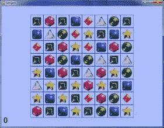

# 第十章：四个额外游戏

> 原文：[`inventwithpython.com/pygame/chapter10.html`](https://inventwithpython.com/pygame/chapter10.html)
> 
> 译者：[飞龙](https://github.com/wizardforcel)
> 
> 协议：[CC BY-NC-SA 4.0](https://creativecommons.org/licenses/by-nc-sa/4.0/)

本章包括四个额外游戏的源代码。不幸的是，本章中只有源代码（包括注释），没有对代码的详细解释。到目前为止，您可以通过查看源代码和注释来玩这些游戏并弄清楚代码的工作原理。

这些游戏包括：

+   **Flippy** – 一个“Othello”克隆，玩家试图翻转计算机 AI 玩家的方块。

+   **Ink Spill** – 一个使用泛洪填充算法的“Flood It”克隆。

+   **Four in a Row** – 一个“Connect Four”克隆，与计算机 AI 玩家对战。

+   **Gemgem** – 一个“Bejeweled”克隆，玩家交换宝石以尝试获得三个相同的宝石排成一行。

如果您对本书中的源代码有任何疑问，请随时通过电子邮件联系作者[[email protected]](/cdn-cgi/l/email-protection)。

如果您想练习修复错误，这些程序的错误版本也是可用的：

+   [`invpy.com/buggy/flippy`](//invpy.com/buggy/flippy)

+   [`invpy.com/buggy/inkspill`](//invpy.com/buggy/inkspill)

+   [`invpy.com/buggy/fourinarow`](//invpy.com/buggy/fourinarow)

+   [`invpy.com/buggy/gemgem`](//invpy.com/buggy/gemgem)

## Flippy，一个“Othello”克隆

     

Othello，也被称为 Reversi，是一个 8x8 的棋盘，棋子一面是黑色，另一面是白色。起始棋盘如图 10-1 所示。每个玩家轮流放置自己颜色的新方块。任何处于新方块和同色其他方块之间的对手方块都会被翻转。游戏的目标是尽可能多地拥有自己颜色的方块。例如，图 10-2 是当白方在 5, 6 处放置一个新的白色方块时的情况。

| Reversi 游戏的起始棋盘上有两个白色方块和两个黑色方块。| 白方放置一个新方块。|
| --- | --- |
|  |  |

5, 5 处的黑色方块位于新的白色方块和已有的白色方块 5, 4 之间。该黑色方块被翻转并成为新的白色方块，使得棋盘看起来像图 10-3。黑方接下来也进行类似的移动，在 4, 6 处放置一个黑色方块，翻转了 5, 4 处的白色方块。这导致了一个看起来像图 10-4 的棋盘。

| 白方的移动将翻转黑方的一个方块。| 黑方放置一个新方块，翻转白方的一个方块。|
| --- | --- |
|  |  |

只要它们处于玩家新方块和已有方块之间，所有方向上的方块都会被翻转。在图 10-5 中，白方在 3, 6 处放置一个方块，并在两个方向上翻转了黑色方块（由线标记）。结果如图 10-6 所示。

| 白方在 3, 6 处的第二步将翻转两个黑方的方块。| 白方的第二步后的棋盘。|
| --- | --- |
|  |  |


正如您所看到的，每个玩家可以在一两步内迅速占据棋盘上大部分方块。玩家必须始终进行至少占据一个方块的移动。游戏在玩家无法进行移动或者棋盘完全填满时结束。拥有最多自己颜色方块的玩家获胜。

您可以从维基百科了解更多关于 Reversi 的信息：[`en.wikipedia.org/wiki/Reversi`](https://en.wikipedia.org/wiki/Reversi)

这个游戏的文本版本使用`print()`和`input()`而不是 Pygame，出现在“用 Python 发明自己的计算机游戏”第 15 章。您可以阅读该章节了解计算机 AI 算法是如何组合的。[`inventwithpython.com/chapter15.html`](//inventwithpython.com/chapter15.html)

这个游戏的电脑 AI 非常出色，因为计算机很容易模拟每一种可能的走法，并选择翻转最多瓷砖的走法。每当我玩的时候，它通常都会打败我。

## Flippy 的源代码

此源代码可从[`invpy.com/flippy.py`](//invpy.com/flippy.py)下载。

Flippy 使用的图像文件可以从[`invpy.com/flippyimages.zip`](//invpy.com/flippyimages.zip)下载。

```py
 # Flippy (an Othello or Reversi clone)
 # By Al Sweigart [[email protected]](/cdn-cgi/l/email-protection)
 # http://inventwithpython.com/pygame
 # Released under a "Simplified BSD" license

 # Based on the "reversi.py" code that originally appeared in "Invent
 # Your Own Computer Games with Python", chapter 15:
 #   http://inventwithpython.com/chapter15.html

 import random, sys, pygame, time, copy
 from pygame.locals import *

 FPS = 10 # frames per second to update the screen
 WINDOWWIDTH = 640 # width of the program's window, in pixels
 WINDOWHEIGHT = 480 # height in pixels
 SPACESIZE = 50 # width & height of each space on the board, in pixels
 BOARDWIDTH = 8 # how many columns of spaces on the game board
 BOARDHEIGHT = 8 # how many rows of spaces on the game board
 WHITE_TILE = 'WHITE_TILE' # an arbitrary but unique value
 BLACK_TILE = 'BLACK_TILE' # an arbitrary but unique value
 EMPTY_SPACE = 'EMPTY_SPACE' # an arbitrary but unique value
 HINT_TILE = 'HINT_TILE' # an arbitrary but unique value
 ANIMATIONSPEED = 25 # integer from 1 to 100, higher is faster animation

 # Amount of space on the left & right side (XMARGIN) or above and below
 # (YMARGIN) the game board, in pixels.
 XMARGIN = int((WINDOWWIDTH - (BOARDWIDTH * SPACESIZE)) / 2)
 YMARGIN = int((WINDOWHEIGHT - (BOARDHEIGHT * SPACESIZE)) / 2)

 #              R    G    B
 WHITE      = (255, 255, 255)
 BLACK      = (  0,   0,   0)
 GREEN      = (  0, 155,   0)
 BRIGHTBLUE = (  0,  50, 255)
 BROWN      = (174,  94,   0)

 TEXTBGCOLOR1 = BRIGHTBLUE
 TEXTBGCOLOR2 = GREEN
 GRIDLINECOLOR = BLACK
 TEXTCOLOR = WHITE
 HINTCOLOR = BROWN

 def main():
     global MAINCLOCK, DISPLAYSURF, FONT, BIGFONT, BGIMAGE

     pygame.init()
     MAINCLOCK = pygame.time.Clock()
     DISPLAYSURF = pygame.display.set_mode((WINDOWWIDTH, WINDOWHEIGHT))
     pygame.display.set_caption('Flippy')
     FONT = pygame.font.Font('freesansbold.ttf', 16)
     BIGFONT = pygame.font.Font('freesansbold.ttf', 32)

     # Set up the background image.
     boardImage = pygame.image.load('flippyboard.png')
     # Use smoothscale() to stretch the board image to fit the entire board:
     boardImage = pygame.transform.smoothscale(boardImage, (BOARDWIDTH * SPACESIZE, BOARDHEIGHT * SPACESIZE))
     boardImageRect = boardImage.get_rect()
     boardImageRect.topleft = (XMARGIN, YMARGIN)
     BGIMAGE = pygame.image.load('flippybackground.png')
     # Use smoothscale() to stretch the background image to fit the entire window:
     BGIMAGE = pygame.transform.smoothscale(BGIMAGE, (WINDOWWIDTH, WINDOWHEIGHT))
     BGIMAGE.blit(boardImage, boardImageRect)

     # Run the main game.
     while True:
         if runGame() == False:
             break

 def runGame():
     # Plays a single game of reversi each time this function is called.

     # Reset the board and game.
     mainBoard = getNewBoard()
     resetBoard(mainBoard)
     showHints = False
     turn = random.choice(['computer', 'player'])

     # Draw the starting board and ask the player what color they want.
     drawBoard(mainBoard)
     playerTile, computerTile = enterPlayerTile()

     # Make the Surface and Rect objects for the "New Game" and "Hints" buttons
     newGameSurf = FONT.render('New Game', True, TEXTCOLOR, TEXTBGCOLOR2)
     newGameRect = newGameSurf.get_rect()
     newGameRect.topright = (WINDOWWIDTH - 8, 10)
     hintsSurf = FONT.render('Hints', True, TEXTCOLOR, TEXTBGCOLOR2)
     hintsRect = hintsSurf.get_rect()
     hintsRect.topright = (WINDOWWIDTH - 8, 40)

     while True: # main game loop
         # Keep looping for player and computer's turns.
         if turn == 'player':
             # Player's turn:
             if getValidMoves(mainBoard, playerTile) == []:
                 # If it's the player's turn but they
                 # can't move, then end the game.
                 break
             movexy = None
             while movexy == None:
                 # Keep looping until the player clicks on a valid space.

                 # Determine which board data structure to use for display.
                 if showHints:
                     boardToDraw = getBoardWithValidMoves(mainBoard, playerTile)
                 else:
                     boardToDraw = mainBoard

                 checkForQuit()
                 for event in pygame.event.get(): # event handling loop
                     if event.type == MOUSEBUTTONUP:
                         # Handle mouse click events
                         mousex, mousey = event.pos
                         if newGameRect.collidepoint( (mousex, mousey) ):
                             # Start a new game
                             return True
                         elif hintsRect.collidepoint( (mousex, mousey) ):
                             # Toggle hints mode
                             showHints = not showHints
                         # movexy is set to a two-item tuple XY coordinate, or None value
                         movexy = getSpaceClicked(mousex, mousey)
                         if movexy != None and not isValidMove(mainBoard, playerTile, movexy[0], movexy[1]):
                             movexy = None

                 # Draw the game board.
                 drawBoard(boardToDraw)
                 drawInfo(boardToDraw, playerTile, computerTile, turn)

                 # Draw the "New Game" and "Hints" buttons.
                 DISPLAYSURF.blit(newGameSurf, newGameRect)
                 DISPLAYSURF.blit(hintsSurf, hintsRect)

                 MAINCLOCK.tick(FPS)
                 pygame.display.update()

             # Make the move and end the turn.
             makeMove(mainBoard, playerTile, movexy[0], movexy[1], True)
             if getValidMoves(mainBoard, computerTile) != []:
                 # Only set for the computer's turn if it can make a move.
                 turn = 'computer'

         else:
             # Computer's turn:
             if getValidMoves(mainBoard, computerTile) == []:
                 # If it was set to be the computer's turn but
                 # they can't move, then end the game.
                 break

             # Draw the board.
             drawBoard(mainBoard)
             drawInfo(mainBoard, playerTile, computerTile, turn)

             # Draw the "New Game" and "Hints" buttons.
             DISPLAYSURF.blit(newGameSurf, newGameRect)
             DISPLAYSURF.blit(hintsSurf, hintsRect)

             # Make it look like the computer is thinking by pausing a bit.
             pauseUntil = time.time() + random.randint(5, 15) * 0.1
             while time.time() < pauseUntil:
                 pygame.display.update()

             # Make the move and end the turn.
             x, y = getComputerMove(mainBoard, computerTile)
             makeMove(mainBoard, computerTile, x, y, True)
             if getValidMoves(mainBoard, playerTile) != []:
                 # Only set for the player's turn if they can make a move.
                 turn = 'player'

     # Display the final score.
     drawBoard(mainBoard)
     scores = getScoreOfBoard(mainBoard)

     # Determine the text of the message to display.
     if scores[playerTile] > scores[computerTile]:
         text = 'You beat the computer by %s points! Congratulations!' % \
                (scores[playerTile] - scores[computerTile])
     elif scores[playerTile] < scores[computerTile]:
         text = 'You lost. The computer beat you by %s points.' % \
                (scores[computerTile] - scores[playerTile])
     else:
         text = 'The game was a tie!'

     textSurf = FONT.render(text, True, TEXTCOLOR, TEXTBGCOLOR1)
     textRect = textSurf.get_rect()
     textRect.center = (int(WINDOWWIDTH / 2), int(WINDOWHEIGHT / 2))
     DISPLAYSURF.blit(textSurf, textRect)

     # Display the "Play again?" text with Yes and No buttons.
     text2Surf = BIGFONT.render('Play again?', True, TEXTCOLOR, TEXTBGCOLOR1)
     text2Rect = text2Surf.get_rect()
     text2Rect.center = (int(WINDOWWIDTH / 2), int(WINDOWHEIGHT / 2) + 50)

     # Make "Yes" button.
     yesSurf = BIGFONT.render('Yes', True, TEXTCOLOR, TEXTBGCOLOR1)
     yesRect = yesSurf.get_rect()
     yesRect.center = (int(WINDOWWIDTH / 2) - 60, int(WINDOWHEIGHT / 2) + 90)

     # Make "No" button.
     noSurf = BIGFONT.render('No', True, TEXTCOLOR, TEXTBGCOLOR1)
     noRect = noSurf.get_rect()
     noRect.center = (int(WINDOWWIDTH / 2) + 60, int(WINDOWHEIGHT / 2) + 90)

     while True:
         # Process events until the user clicks on Yes or No.
         checkForQuit()
         for event in pygame.event.get(): # event handling loop
             if event.type == MOUSEBUTTONUP:
                 mousex, mousey = event.pos
                 if yesRect.collidepoint( (mousex, mousey) ):
                     return True
                 elif noRect.collidepoint( (mousex, mousey) ):
                     return False
         DISPLAYSURF.blit(textSurf, textRect)
         DISPLAYSURF.blit(text2Surf, text2Rect)
         DISPLAYSURF.blit(yesSurf, yesRect)
         DISPLAYSURF.blit(noSurf, noRect)
         pygame.display.update()
         MAINCLOCK.tick(FPS)

 def translateBoardToPixelCoord(x, y):
     return XMARGIN + x * SPACESIZE + int(SPACESIZE / 2), YMARGIN + y * SPACESIZE + int(SPACESIZE / 2)

 def animateTileChange(tilesToFlip, tileColor, additionalTile):
     # Draw the additional tile that was just laid down. (Otherwise we'd
     # have to completely redraw the board & the board info.)
     if tileColor == WHITE_TILE:
         additionalTileColor = WHITE
     else:
         additionalTileColor = BLACK
     additionalTileX, additionalTileY = translateBoardToPixelCoord(additionalTile[0], additionalTile[1])
     pygame.draw.circle(DISPLAYSURF, additionalTileColor, (additionalTileX, additionalTileY), int(SPACESIZE / 2) - 4)
     pygame.display.update()

     for rgbValues in range(0, 255, int(ANIMATIONSPEED * 2.55)):
         if rgbValues > 255:
             rgbValues = 255
         elif rgbValues < 0:
             rgbValues = 0

         if tileColor == WHITE_TILE:
             color = tuple([rgbValues] * 3) # rgbValues goes from 0 to 255
         elif tileColor == BLACK_TILE:
             color = tuple([255 - rgbValues] * 3) # rgbValues goes from 255 to 0

         for x, y in tilesToFlip:
             centerx, centery = translateBoardToPixelCoord(x, y)
             pygame.draw.circle(DISPLAYSURF, color, (centerx, centery), int(SPACESIZE / 2) - 4)
         pygame.display.update()
         MAINCLOCK.tick(FPS)
         checkForQuit()

 def drawBoard(board):
     # Draw background of board.
     DISPLAYSURF.blit(BGIMAGE, BGIMAGE.get_rect())

     # Draw grid lines of the board.
     for x in range(BOARDWIDTH + 1):
         # Draw the horizontal lines.
         startx = (x * SPACESIZE) + XMARGIN
         starty = YMARGIN
         endx = (x * SPACESIZE) + XMARGIN
         endy = YMARGIN + (BOARDHEIGHT * SPACESIZE)
         pygame.draw.line(DISPLAYSURF, GRIDLINECOLOR, (startx, starty), (endx, endy))
     for y in range(BOARDHEIGHT + 1):
         # Draw the vertical lines.
         startx = XMARGIN
         starty = (y * SPACESIZE) + YMARGIN
         endx = XMARGIN + (BOARDWIDTH * SPACESIZE)
         endy = (y * SPACESIZE) + YMARGIN
         pygame.draw.line(DISPLAYSURF, GRIDLINECOLOR, (startx, starty), (endx, endy))

     # Draw the black & white tiles or hint spots.
     for x in range(BOARDWIDTH):
         for y in range(BOARDHEIGHT):
             centerx, centery = translateBoardToPixelCoord(x, y)
             if board[x][y] == WHITE_TILE or board[x][y] == BLACK_TILE:
                 if board[x][y] == WHITE_TILE:
                     tileColor = WHITE
                 else:
                     tileColor = BLACK
                 pygame.draw.circle(DISPLAYSURF, tileColor, (centerx, centery), int(SPACESIZE / 2) - 4)
             if board[x][y] == HINT_TILE:
                 pygame.draw.rect(DISPLAYSURF, HINTCOLOR, (centerx - 4, centery - 4, 8, 8))

 def getSpaceClicked(mousex, mousey):
     # Return a tuple of two integers of the board space coordinates where
     # the mouse was clicked. (Or returns None not in any space.)
     for x in range(BOARDWIDTH):
         for y in range(BOARDHEIGHT):
             if mousex > x * SPACESIZE + XMARGIN and \
                mousex < (x + 1) * SPACESIZE + XMARGIN and \
                mousey > y * SPACESIZE + YMARGIN and \
                mousey < (y + 1) * SPACESIZE + YMARGIN:
                 return (x, y)
     return None

 def drawInfo(board, playerTile, computerTile, turn):
     # Draws scores and whose turn it is at the bottom of the screen.
     scores = getScoreOfBoard(board)
     scoreSurf = FONT.render("Player Score: %s    Computer Score: %s    %s's Turn" % (str(scores[playerTile]), str(scores[computerTile]), turn.title()), True, TEXTCOLOR)
     scoreRect = scoreSurf.get_rect()
     scoreRect.bottomleft = (10, WINDOWHEIGHT - 5)
     DISPLAYSURF.blit(scoreSurf, scoreRect)

 def resetBoard(board):
     # Blanks out the board it is passed, and sets up starting tiles.
     for x in range(BOARDWIDTH):
         for y in range(BOARDHEIGHT):
             board[x][y] = EMPTY_SPACE

     # Add starting pieces to the center
     board[3][3] = WHITE_TILE
     board[3][4] = BLACK_TILE
     board[4][3] = BLACK_TILE
     board[4][4] = WHITE_TILE

 def getNewBoard():
     # Creates a brand new, empty board data structure.
     board = []
     for i in range(BOARDWIDTH):
         board.append([EMPTY_SPACE] * BOARDHEIGHT)

     return board

 def isValidMove(board, tile, xstart, ystart):
     # Returns False if the player's move is invalid. If it is a valid
     # move, returns a list of spaces of the captured pieces.
     if board[xstart][ystart] != EMPTY_SPACE or not isOnBoard(xstart, ystart):
         return False

     board[xstart][ystart] = tile # temporarily set the tile on the board.

     if tile == WHITE_TILE:
         otherTile = BLACK_TILE
     else:
         otherTile = WHITE_TILE

     tilesToFlip = []
     # check each of the eight directions:
     for xdirection, ydirection in [[0, 1], [1, 1], [1, 0], [1, -1], [0, -1], [-1, -1], [-1, 0], [-1, 1]]:
         x, y = xstart, ystart
         x += xdirection
         y += ydirection
         if isOnBoard(x, y) and board[x][y] == otherTile:
             # The piece belongs to the other player next to our piece.
             x += xdirection
             y += ydirection
             if not isOnBoard(x, y):
                 continue
             while board[x][y] == otherTile:
                 x += xdirection
                 y += ydirection
                 if not isOnBoard(x, y):
                     break # break out of while loop, continue in for loop
             if not isOnBoard(x, y):
                 continue
             if board[x][y] == tile:
                 # There are pieces to flip over. Go in the reverse
                 # direction until we reach the original space, noting all
                 # the tiles along the way.
                 while True:
                     x -= xdirection
                     y -= ydirection
                     if x == xstart and y == ystart:
                         break
                     tilesToFlip.append([x, y])

     board[xstart][ystart] = EMPTY_SPACE # make space empty
     if len(tilesToFlip) == 0: # If no tiles flipped, this move is invalid
         return False
     return tilesToFlip

 def isOnBoard(x, y):
     # Returns True if the coordinates are located on the board.
     return x >= 0 and x < BOARDWIDTH and y >= 0 and y < BOARDHEIGHT

 def getBoardWithValidMoves(board, tile):
     # Returns a new board with hint markings.
     dupeBoard = copy.deepcopy(board)

     for x, y in getValidMoves(dupeBoard, tile):
         dupeBoard[x][y] = HINT_TILE
     return dupeBoard

 def getValidMoves(board, tile):
     # Returns a list of (x,y) tuples of all valid moves.
     validMoves = []

     for x in range(BOARDWIDTH):
         for y in range(BOARDHEIGHT):
             if isValidMove(board, tile, x, y) != False:
                 validMoves.append((x, y))
     return validMoves

 def getScoreOfBoard(board):
     # Determine the score by counting the tiles.
     xscore = 0
     oscore = 0
     for x in range(BOARDWIDTH):
         for y in range(BOARDHEIGHT):
             if board[x][y] == WHITE_TILE:
                 xscore += 1
             if board[x][y] == BLACK_TILE:
                 oscore += 1
     return {WHITE_TILE:xscore, BLACK_TILE:oscore}

 def enterPlayerTile():
     # Draws the text and handles the mouse click events for letting
     # the player choose which color they want to be.  Returns
     # [WHITE_TILE, BLACK_TILE] if the player chooses to be White,
     # [BLACK_TILE, WHITE_TILE] if Black.

     # Create the text.
     textSurf = FONT.render('Do you want to be white or black?', True, TEXTCOLOR, TEXTBGCOLOR1)
     textRect = textSurf.get_rect()
     textRect.center = (int(WINDOWWIDTH / 2), int(WINDOWHEIGHT / 2))

     xSurf = BIGFONT.render('White', True, TEXTCOLOR, TEXTBGCOLOR1)
     xRect = xSurf.get_rect()
     xRect.center = (int(WINDOWWIDTH / 2) - 60, int(WINDOWHEIGHT / 2) + 40)

     oSurf = BIGFONT.render('Black', True, TEXTCOLOR, TEXTBGCOLOR1)
     oRect = oSurf.get_rect()
     oRect.center = (int(WINDOWWIDTH / 2) + 60, int(WINDOWHEIGHT / 2) + 40)

     while True:
         # Keep looping until the player has clicked on a color.
         checkForQuit()
         for event in pygame.event.get(): # event handling loop
             if event.type == MOUSEBUTTONUP:
                 mousex, mousey = event.pos
                 if xRect.collidepoint( (mousex, mousey) ):
                     return [WHITE_TILE, BLACK_TILE]
                 elif oRect.collidepoint( (mousex, mousey) ):
                     return [BLACK_TILE, WHITE_TILE]

         # Draw the screen.
         DISPLAYSURF.blit(textSurf, textRect)
         DISPLAYSURF.blit(xSurf, xRect)
         DISPLAYSURF.blit(oSurf, oRect)
         pygame.display.update()
         MAINCLOCK.tick(FPS)

 def makeMove(board, tile, xstart, ystart, realMove=False):
     # Place the tile on the board at xstart, ystart, and flip tiles
     # Returns False if this is an invalid move, True if it is valid.
     tilesToFlip = isValidMove(board, tile, xstart, ystart)

     if tilesToFlip == False:
         return False

     board[xstart][ystart] = tile

     if realMove:
         animateTileChange(tilesToFlip, tile, (xstart, ystart))

     for x, y in tilesToFlip:
         board[x][y] = tile
     return True

 def isOnCorner(x, y):
     # Returns True if the position is in one of the four corners.
     return (x == 0 and y == 0) or \
            (x == BOARDWIDTH and y == 0) or \
            (x == 0 and y == BOARDHEIGHT) or \
            (x == BOARDWIDTH and y == BOARDHEIGHT)

 def getComputerMove(board, computerTile):
     # Given a board and the computer's tile, determine where to
     # move and return that move as a [x, y] list.
     possibleMoves = getValidMoves(board, computerTile)

     # randomize the order of the possible moves
     random.shuffle(possibleMoves)

     # always go for a corner if available.
     for x, y in possibleMoves:
         if isOnCorner(x, y):
             return [x, y]

     # Go through all possible moves and remember the best scoring move
     bestScore = -1
     for x, y in possibleMoves:
         dupeBoard = copy.deepcopy(board)
         makeMove(dupeBoard, computerTile, x, y)
         score = getScoreOfBoard(dupeBoard)[computerTile]
         if score > bestScore:
             bestMove = [x, y]
             bestScore = score
     return bestMove

 def checkForQuit():
     for event in pygame.event.get((QUIT, KEYUP)): # event handling loop
         if event.type == QUIT or (event.type == KEYUP and event.key == K_ESCAPE):
             pygame.quit()
             sys.exit()

 if __name__ == '__main__':
     main()

```

## Ink Spill，一个“Flood It”克隆

      

游戏“Flood It”从一个填满彩色瓷砖的棋盘开始。在每一轮中，玩家选择一个新颜色来涂抹左上角的瓷砖，以及相邻的相同颜色的瓷砖。这个游戏使用了泛洪填充算法（在 Star Pusher 章节中有描述）。游戏的目标是在用完所有回合之前将整个棋盘变成单一颜色。

这个游戏还有一个设置屏幕，玩家可以更改棋盘的大小和游戏的难度。如果玩家对颜色感到厌倦，他们还可以切换到其他几种颜色方案。

## Ink Spill 的源代码

此源代码可从[`invpy.com/inkspill.py`](//invpy.com/inkspill.py)下载。

Flippy 使用的图像文件可以从[`invpy.com/inkspillimages.zip`](//invpy.com/inkspillimages.zip)下载。

```py
 # Ink Spill (a Flood It clone)
 # http://inventwithpython.com/pygame
 # By Al Sweigart [[email protected]](/cdn-cgi/l/email-protection)
 # Released under a "Simplified BSD" license

 import random, sys, webbrowser, copy, pygame
 from pygame.locals import *

 # There are different box sizes, number of boxes, and
 # life depending on the "board size" setting selected.
 SMALLBOXSIZE  = 60 # size is in pixels
 MEDIUMBOXSIZE = 20
 LARGEBOXSIZE  = 11

 SMALLBOARDSIZE  = 6 # size is in boxes
 MEDIUMBOARDSIZE = 17
 LARGEBOARDSIZE  = 30

 SMALLMAXLIFE  = 10 # number of turns
 MEDIUMMAXLIFE = 30
 LARGEMAXLIFE  = 64

 FPS = 30
 WINDOWWIDTH = 640
 WINDOWHEIGHT = 480
 boxSize = MEDIUMBOXSIZE
 PALETTEGAPSIZE = 10
 PALETTESIZE = 45
 EASY = 0   # arbitrary but unique value
 MEDIUM = 1 # arbitrary but unique value
 HARD = 2   # arbitrary but unique value

 difficulty = MEDIUM # game starts in "medium" mode
 maxLife = MEDIUMMAXLIFE
 boardWidth = MEDIUMBOARDSIZE
 boardHeight = MEDIUMBOARDSIZE

 #            R    G    B
 WHITE    = (255, 255, 255)
 DARKGRAY = ( 70,  70,  70)
 BLACK    = (  0,   0,   0)
 RED      = (255,   0,   0)
 GREEN    = (  0, 255,   0)
 BLUE     = (  0,   0, 255)
 YELLOW   = (255, 255,   0)
 ORANGE   = (255, 128,   0)
 PURPLE   = (255,   0, 255)

 # The first color in each scheme is the background color, the next six are the palette colors.
 COLORSCHEMES = (((150, 200, 255), RED, GREEN, BLUE, YELLOW, ORANGE, PURPLE),
                 ((0, 155, 104),  (97, 215, 164),  (228, 0, 69),  (0, 125, 50),   (204, 246, 0),   (148, 0, 45),    (241, 109, 149)),
                 ((195, 179, 0),  (255, 239, 115), (255, 226, 0), (147, 3, 167),  (24, 38, 176),   (166, 147, 0),   (197, 97, 211)),
                 ((85, 0, 0),     (155, 39, 102),  (0, 201, 13),  (255, 118, 0),  (206, 0, 113),   (0, 130, 9),     (255, 180, 115)),
                 ((191, 159, 64), (183, 182, 208), (4, 31, 183),  (167, 184, 45), (122, 128, 212), (37, 204, 7),    (88, 155, 213)),
                 ((200, 33, 205), (116, 252, 185), (68, 56, 56),  (52, 238, 83),  (23, 149, 195),  (222, 157, 227), (212, 86, 185)))
 for i in range(len(COLORSCHEMES)):
     assert len(COLORSCHEMES[i]) == 7, 'Color scheme %s does not have exactly 7 colors.' % (i)
 bgColor = COLORSCHEMES[0][0]
 paletteColors =  COLORSCHEMES[0][1:]

 def main():
     global FPSCLOCK, DISPLAYSURF, LOGOIMAGE, SPOTIMAGE, SETTINGSIMAGE, SETTINGSBUTTONIMAGE, RESETBUTTONIMAGE

     pygame.init()
     FPSCLOCK = pygame.time.Clock()
     DISPLAYSURF = pygame.display.set_mode((WINDOWWIDTH, WINDOWHEIGHT))

     # Load images
     LOGOIMAGE = pygame.image.load('inkspilllogo.png')
     SPOTIMAGE = pygame.image.load('inkspillspot.png')
     SETTINGSIMAGE = pygame.image.load('inkspillsettings.png')
     SETTINGSBUTTONIMAGE = pygame.image.load('inkspillsettingsbutton.png')
     RESETBUTTONIMAGE = pygame.image.load('inkspillresetbutton.png')

     pygame.display.set_caption('Ink Spill')
     mousex = 0
     mousey = 0
     mainBoard = generateRandomBoard(boardWidth, boardHeight, difficulty)
     life = maxLife
     lastPaletteClicked = None

     while True: # main game loop
         paletteClicked = None
         resetGame = False

         # Draw the screen.
         DISPLAYSURF.fill(bgColor)
         drawLogoAndButtons()
         drawBoard(mainBoard)
         drawLifeMeter(life)
         drawPalettes()

         checkForQuit()
         for event in pygame.event.get(): # event handling loop
             if event.type == MOUSEBUTTONUP:
                 mousex, mousey = event.pos
                 if pygame.Rect(WINDOWWIDTH - SETTINGSBUTTONIMAGE.get_width(),
                                WINDOWHEIGHT - SETTINGSBUTTONIMAGE.get_height(),
                                SETTINGSBUTTONIMAGE.get_width(),
                                SETTINGSBUTTONIMAGE.get_height()).collidepoint(mousex, mousey):
                     resetGame = showSettingsScreen() # clicked on Settings button
                 elif pygame.Rect(WINDOWWIDTH - RESETBUTTONIMAGE.get_width(),
                                  WINDOWHEIGHT - SETTINGSBUTTONIMAGE.get_height() - RESETBUTTONIMAGE.get_height(),
                                  RESETBUTTONIMAGE.get_width(),
                                  RESETBUTTONIMAGE.get_height()).collidepoint(mousex, mousey):
                     resetGame = True # clicked on Reset button
                 else:
                     # check if a palette button was clicked
                     paletteClicked = getColorOfPaletteAt(mousex, mousey)

         if paletteClicked != None and paletteClicked != lastPaletteClicked:
             # a palette button was clicked that is different from the
             # last palette button clicked (this check prevents the player
             # from accidentally clicking the same palette twice)
             lastPaletteClicked = paletteClicked
             floodAnimation(mainBoard, paletteClicked)
             life -= 1

             resetGame = False
             if hasWon(mainBoard):
                 for i in range(4): # flash border 4 times
                     flashBorderAnimation(WHITE, mainBoard)
                 resetGame = True
                 pygame.time.wait(2000) # pause so the player can bask in victory
             elif life == 0:
                 # life is zero, so player has lost
                 drawLifeMeter(0)
                 pygame.display.update()
                 pygame.time.wait(400)
                 for i in range(4):
                     flashBorderAnimation(BLACK, mainBoard)
                 resetGame = True
                 pygame.time.wait(2000) # pause so the player can suffer in their defeat

         if resetGame:
             # start a new game
             mainBoard = generateRandomBoard(boardWidth, boardHeight, difficulty)
             life = maxLife
             lastPaletteClicked = None

         pygame.display.update()
         FPSCLOCK.tick(FPS)

 def checkForQuit():
     # Terminates the program if there are any QUIT or escape key events.
     for event in pygame.event.get(QUIT): # get all the QUIT events
         pygame.quit() # terminate if any QUIT events are present
         sys.exit()
     for event in pygame.event.get(KEYUP): # get all the KEYUP events
         if event.key == K_ESCAPE:
             pygame.quit() # terminate if the KEYUP event was for the Esc 
             sys.exit()
         pygame.event.post(event) # put the other KEYUP event objects back

 def hasWon(board):
     # if the entire board is the same color, player has won
     for x in range(boardWidth):
         for y in range(boardHeight):
             if board[x][y] != board[0][0]:
                 return False # found a different color, player has not won
     return True

 def showSettingsScreen():
     global difficulty, boxSize, boardWidth, boardHeight, maxLife, paletteColors, bgColor

     # The pixel coordinates in this function were obtained by loading
     # the inkspillsettings.png image into a graphics editor and reading
     # the pixel coordinates from there. Handy trick.

     origDifficulty = difficulty
     origBoxSize = boxSize
     screenNeedsRedraw = True

     while True:
         if screenNeedsRedraw:
             DISPLAYSURF.fill(bgColor)
             DISPLAYSURF.blit(SETTINGSIMAGE, (0,0))

             # place the ink spot marker next to the selected difficulty
             if difficulty == EASY:
                 DISPLAYSURF.blit(SPOTIMAGE, (30, 4))
             if difficulty == MEDIUM:
                 DISPLAYSURF.blit(SPOTIMAGE, (8, 41))
             if difficulty == HARD:
                 DISPLAYSURF.blit(SPOTIMAGE, (30, 76))

             # place the ink spot marker next to the selected size
             if boxSize == SMALLBOXSIZE:
                 DISPLAYSURF.blit(SPOTIMAGE, (22, 150))
             if boxSize == MEDIUMBOXSIZE:
                 DISPLAYSURF.blit(SPOTIMAGE, (11, 185))
             if boxSize == LARGEBOXSIZE:
                 DISPLAYSURF.blit(SPOTIMAGE, (24, 220))

             for i in range(len(COLORSCHEMES)):
                 drawColorSchemeBoxes(500, i * 60 + 30, i)

             pygame.display.update()

         screenNeedsRedraw = False # by default, don't redraw the screen
         for event in pygame.event.get(): # event handling loop
             if event.type == QUIT:
                 pygame.quit()
                 sys.exit()
             elif event.type == KEYUP:
                 if event.key == K_ESCAPE:
                     # Esc key on settings screen goes back to game
                     return not (origDifficulty == difficulty and origBoxSize == boxSize)
             elif event.type == MOUSEBUTTONUP:
                 screenNeedsRedraw = True # screen should be redrawn
                 mousex, mousey = event.pos # syntactic sugar

                 # check for clicks on the difficulty buttons
                 if pygame.Rect(74, 16, 111, 30).collidepoint(mousex, mousey):
                     difficulty = EASY
                 elif pygame.Rect(53, 50, 104, 29).collidepoint(mousex, mousey):
                     difficulty = MEDIUM
                 elif pygame.Rect(72, 85, 65, 31).collidepoint(mousex, mousey):
                     difficulty = HARD

                 # check for clicks on the size buttons
                 elif pygame.Rect(63, 156, 84, 31).collidepoint(mousex, mousey):
                     # small board size setting:
                     boxSize = SMALLBOXSIZE
                     boardWidth = SMALLBOARDSIZE
                     boardHeight = SMALLBOARDSIZE
                     maxLife = SMALLMAXLIFE
                 elif pygame.Rect(52, 192, 106,32).collidepoint(mousex, mousey):
                     # medium board size setting:
                     boxSize = MEDIUMBOXSIZE
                     boardWidth = MEDIUMBOARDSIZE
                     boardHeight = MEDIUMBOARDSIZE
                     maxLife = MEDIUMMAXLIFE
                 elif pygame.Rect(67, 228, 58, 37).collidepoint(mousex, mousey):
                     # large board size setting:
                     boxSize = LARGEBOXSIZE
                     boardWidth = LARGEBOARDSIZE
                     boardHeight = LARGEBOARDSIZE
                     maxLife = LARGEMAXLIFE
                 elif pygame.Rect(14, 299, 371, 97).collidepoint(mousex, mousey):
                     # clicked on the "learn programming" ad
                     webbrowser.open('http://inventwithpython.com') # opens a web browser
                 elif pygame.Rect(178, 418, 215, 34).collidepoint(mousex, mousey):
                     # clicked on the "back to game" button
                     return not (origDifficulty == difficulty and origBoxSize == boxSize)

                 for i in range(len(COLORSCHEMES)):
                     # clicked on a color scheme button
                     if pygame.Rect(500, 30 + i * 60, MEDIUMBOXSIZE * 3, MEDIUMBOXSIZE * 2).collidepoint(mousex, mousey):
                         bgColor = COLORSCHEMES[i][0]
                         paletteColors  = COLORSCHEMES[i][1:]

 def drawColorSchemeBoxes(x, y, schemeNum):
     # Draws the color scheme boxes that appear on the "Settings" screen.
     for boxy in range(2):
         for boxx in range(3):
             pygame.draw.rect(DISPLAYSURF, COLORSCHEMES[schemeNum][3 * boxy + boxx + 1], (x + MEDIUMBOXSIZE * boxx, y + MEDIUMBOXSIZE * boxy, MEDIUMBOXSIZE, MEDIUMBOXSIZE))
             if paletteColors == COLORSCHEMES[schemeNum][1:]:
                 # put the ink spot next to the selected color scheme
                 DISPLAYSURF.blit(SPOTIMAGE, (x - 50, y))

 def flashBorderAnimation(color, board, animationSpeed=30):
     origSurf = DISPLAYSURF.copy()
     flashSurf = pygame.Surface(DISPLAYSURF.get_size())
     flashSurf = flashSurf.convert_alpha()
     for start, end, step in ((0, 256, 1), (255, 0, -1)):
         # the first iteration on the outer loop will set the inner loop
         # to have transparency go from 0 to 255, the second iteration will
         # have it go from 255 to 0\. This is the "flash".
         for transparency in range(start, end, animationSpeed * step):
             DISPLAYSURF.blit(origSurf, (0, 0))
             r, g, b = color
             flashSurf.fill((r, g, b, transparency))
             DISPLAYSURF.blit(flashSurf, (0, 0))
             drawBoard(board) # draw board ON TOP OF the transparency layer
             pygame.display.update()
             FPSCLOCK.tick(FPS)
     DISPLAYSURF.blit(origSurf, (0, 0)) # redraw the original surface

 def floodAnimation(board, paletteClicked, animationSpeed=25):
     origBoard = copy.deepcopy(board)
     floodFill(board, board[0][0], paletteClicked, 0, 0)

     for transparency in range(0, 255, animationSpeed):
         # The "new" board slowly become opaque over the original board.
         drawBoard(origBoard)
         drawBoard(board, transparency)
         pygame.display.update()
         FPSCLOCK.tick(FPS)

 def generateRandomBoard(width, height, difficulty=MEDIUM):
     # Creates a board data structure with random colors for each box.
     board = []
     for x in range(width):
         column = []
         for y in range(height):
             column.append(random.randint(0, len(paletteColors) - 1))
         board.append(column)

     # Make board easier by setting some boxes to same color as a neighbor.

     # Determine how many boxes to change.
     if difficulty == EASY:
         if boxSize == SMALLBOXSIZE:
             boxesToChange = 100
         else:
             boxesToChange = 1500
     elif difficulty == MEDIUM:
         if boxSize == SMALLBOXSIZE:
             boxesToChange = 5
         else:
             boxesToChange = 200
     else:
         boxesToChange = 0

     # Change neighbor's colors:
     for i in range(boxesToChange):
         # Randomly choose a box whose color to copy
         x = random.randint(1, width-2)
         y = random.randint(1, height-2)

         # Randomly choose neighbors to change.
         direction = random.randint(0, 3)
         if direction == 0: # change left and up neighbor
             board[x-1][y] = board[x][y]
             board[x][y-1] = board[x][y]
         elif direction == 1: # change right and down neighbor
             board[x+1][y] = board[x][y]
             board[x][y+1] = board[x][y]
         elif direction == 2: # change right and up neighbor
             board[x][y-1] = board[x][y]
             board[x+1][y] = board[x][y]
         else: # change left and down neighbor
             board[x][y+1] = board[x][y]
             board[x-1][y] = board[x][y]
     return board

 def drawLogoAndButtons():
     # draw the Ink Spill logo and Settings and Reset buttons.
     DISPLAYSURF.blit(LOGOIMAGE, (WINDOWWIDTH - LOGOIMAGE.get_width(), 0))
     DISPLAYSURF.blit(SETTINGSBUTTONIMAGE, (WINDOWWIDTH - SETTINGSBUTTONIMAGE.get_width(), WINDOWHEIGHT - SETTINGSBUTTONIMAGE.get_height()))
     DISPLAYSURF.blit(RESETBUTTONIMAGE, (WINDOWWIDTH - RESETBUTTONIMAGE.get_width(), WINDOWHEIGHT - SETTINGSBUTTONIMAGE.get_height() - RESETBUTTONIMAGE.get_height()))

 def drawBoard(board, transparency=255):
     # The colored squares are drawn to a temporary surface which is then
     # drawn to the DISPLAYSURF surface. This is done so we can draw the
     # squares with transparency on top of DISPLAYSURF as it currently is.
     tempSurf = pygame.Surface(DISPLAYSURF.get_size())
     tempSurf = tempSurf.convert_alpha()
     tempSurf.fill((0, 0, 0, 0))

     for x in range(boardWidth):
         for y in range(boardHeight):
             left, top = leftTopPixelCoordOfBox(x, y)
             r, g, b = paletteColors[board[x][y]]
             pygame.draw.rect(tempSurf, (r, g, b, transparency), (left, top, boxSize, boxSize))
     left, top = leftTopPixelCoordOfBox(0, 0)
     pygame.draw.rect(tempSurf, BLACK, (left-1, top-1, boxSize * boardWidth + 1, boxSize * boardHeight + 1), 1)
     DISPLAYSURF.blit(tempSurf, (0, 0))

 def drawPalettes():
     # Draws the six color palettes at the bottom of the screen.
     numColors = len(paletteColors)
     xmargin = int((WINDOWWIDTH - ((PALETTESIZE * numColors) + (PALETTEGAPSIZE * (numColors - 1)))) / 2)
     for i in range(numColors):
         left = xmargin + (i * PALETTESIZE) + (i * PALETTEGAPSIZE)
         top = WINDOWHEIGHT - PALETTESIZE - 10
         pygame.draw.rect(DISPLAYSURF, paletteColors[i], (left, top, PALETTESIZE, PALETTESIZE))
         pygame.draw.rect(DISPLAYSURF, bgColor,   (left + 2, top + 2, PALETTESIZE - 4, PALETTESIZE - 4), 2)

 def drawLifeMeter(currentLife):
     lifeBoxSize = int((WINDOWHEIGHT - 40) / maxLife)

     # Draw background color of life meter.
     pygame.draw.rect(DISPLAYSURF, bgColor, (20, 20, 20, 20 + (maxLife * lifeBoxSize)))

     for i in range(maxLife):
         if currentLife >= (maxLife - i): # draw a solid red box
             pygame.draw.rect(DISPLAYSURF, RED, (20, 20 + (i * lifeBoxSize), 20, lifeBoxSize))
         pygame.draw.rect(DISPLAYSURF, WHITE, (20, 20 + (i * lifeBoxSize), 20, lifeBoxSize), 1) # draw white outline

 def getColorOfPaletteAt(x, y):
     # Returns the index of the color in paletteColors that the x and y parameters
     # are over. Returns None if x and y are not over any palette.
     numColors = len(paletteColors)
     xmargin = int((WINDOWWIDTH - ((PALETTESIZE * numColors) + (PALETTEGAPSIZE * (numColors - 1)))) / 2)
     top = WINDOWHEIGHT - PALETTESIZE - 10
     for i in range(numColors):
         # Find out if the mouse click is inside any of the palettes.
         left = xmargin + (i * PALETTESIZE) + (i * PALETTEGAPSIZE)
         r = pygame.Rect(left, top, PALETTESIZE, PALETTESIZE)
         if r.collidepoint(x, y):
             return i
     return None # no palette exists at these x, y coordinates

 def floodFill(board, oldColor, newColor, x, y):
     # This is the flood fill algorithm.
     if oldColor == newColor or board[x][y] != oldColor:
         return

     board[x][y] = newColor # change the color of the current box

     # Make the recursive call for any neighboring boxes:
     if x > 0:
         floodFill(board, oldColor, newColor, x - 1, y) # on box to the left
     if x < boardWidth - 1:
         floodFill(board, oldColor, newColor, x + 1, y) # on box to the right
     if y > 0:
         floodFill(board, oldColor, newColor, x, y - 1) # on box to up
     if y < boardHeight - 1:
         floodFill(board, oldColor, newColor, x, y + 1) # on box to down

 def leftTopPixelCoordOfBox(boxx, boxy):
     # Returns the x and y of the left-topmost pixel of the xth & yth box.
     xmargin = int((WINDOWWIDTH - (boardWidth * boxSize)) / 2)
     ymargin = int((WINDOWHEIGHT - (boardHeight * boxSize)) / 2)
     return (boxx * boxSize + xmargin, boxy * boxSize + ymargin)

 if __name__ == '__main__':
     main()

```

## 四子连珠，一个“四子连珠”克隆

      

游戏“四子连珠”有一个 7x6 的棋盘，玩家轮流从棋盘顶部放置标记。标记将从每列的顶部掉落，并停在底部或该列的最顶部标记上。当四个标记水平、垂直或对角线排成一行时，玩家获胜。

这个游戏的 AI 非常出色。它模拟了它可以做的每一种可能的走法，然后模拟了人类玩家对每一种走法的可能响应，然后模拟了它可以对此做出的每一种可能的走法，然后模拟了人类玩家对每一种走法的可能响应！经过所有这些思考，计算机确定了哪一步最有可能导致它获胜。

所以电脑有点难以战胜。我通常输给它。

由于您可以在自己的回合上进行七种可能的走法（除非某些列已满），对手可以进行七种可能的走法，对此有七种可能的走法，对此有七种可能的走法，这意味着在每一回合，计算机都在考虑 7 x 7 x 7 x 7 = 2,401 种可能的走法。您可以通过将`DIFFICULTY`常量设置为更高的数字来让计算机进一步考虑游戏，但是当我将其设置为大于`2`的值时，计算机需要很长时间来计算自己的回合。

您还可以通过将`DIFFICULTY`设置为`1`来降低电脑的难度。然后，计算机只考虑自己的每一步和玩家对这些步骤的可能响应。如果将`DIFFICULTY`设置为`0`，那么计算机将失去所有智能，只会进行随机移动。

## 四子连珠的源代码

此源代码可从[`invpy.com/fourinarow.py`](//invpy.com/fourinarow.py)下载。

Flippy 使用的图像文件可以从[`invpy.com/fourinarowimages.zip`](//invpy.com/fourinarowimages.zip)下载。

```py
 # Four-In-A-Row (a Connect Four clone)
 # By Al Sweigart [[email protected]](/cdn-cgi/l/email-protection)
 # http://inventwithpython.com/pygame
 # Released under a "Simplified BSD" license

 import random, copy, sys, pygame
 from pygame.locals import *

 BOARDWIDTH = 7  # how many spaces wide the board is
 BOARDHEIGHT = 6 # how many spaces tall the board is
 assert BOARDWIDTH >= 4 and BOARDHEIGHT >= 4, 'Board must be at least 4x4.'

 DIFFICULTY = 2 # how many moves to look ahead. (>2 is usually too slow)

 SPACESIZE = 50 # size of the tokens and individual board spaces in pixels

 FPS = 30 # frames per second to update the screen
 WINDOWWIDTH = 640 # width of the program's window, in pixels
 WINDOWHEIGHT = 480 # height in pixels

 XMARGIN = int((WINDOWWIDTH - BOARDWIDTH * SPACESIZE) / 2)
 YMARGIN = int((WINDOWHEIGHT - BOARDHEIGHT * SPACESIZE) / 2)

 BRIGHTBLUE = (0, 50, 255)
 WHITE = (255, 255, 255)

 BGCOLOR = BRIGHTBLUE
 TEXTCOLOR = WHITE

 RED = 'red'
 BLACK = 'black'
 EMPTY = None
 HUMAN = 'human'
 COMPUTER = 'computer'

 def main():
     global FPSCLOCK, DISPLAYSURF, REDPILERECT, BLACKPILERECT, REDTOKENIMG
     global BLACKTOKENIMG, BOARDIMG, ARROWIMG, ARROWRECT, HUMANWINNERIMG
     global COMPUTERWINNERIMG, WINNERRECT, TIEWINNERIMG

     pygame.init()
     FPSCLOCK = pygame.time.Clock()
     DISPLAYSURF = pygame.display.set_mode((WINDOWWIDTH, WINDOWHEIGHT))
     pygame.display.set_caption('Four in a Row')

     REDPILERECT = pygame.Rect(int(SPACESIZE / 2), WINDOWHEIGHT - int(3 * SPACESIZE / 2), SPACESIZE, SPACESIZE)
     BLACKPILERECT = pygame.Rect(WINDOWWIDTH - int(3 * SPACESIZE / 2), WINDOWHEIGHT - int(3 * SPACESIZE / 2), SPACESIZE, SPACESIZE)
     REDTOKENIMG = pygame.image.load('4row_red.png')
     REDTOKENIMG = pygame.transform.smoothscale(REDTOKENIMG, (SPACESIZE, SPACESIZE))
     BLACKTOKENIMG = pygame.image.load('4row_black.png')
     BLACKTOKENIMG = pygame.transform.smoothscale(BLACKTOKENIMG, (SPACESIZE, SPACESIZE))
     BOARDIMG = pygame.image.load('4row_board.png')
     BOARDIMG = pygame.transform.smoothscale(BOARDIMG, (SPACESIZE, SPACESIZE))

     HUMANWINNERIMG = pygame.image.load('4row_humanwinner.png')
     COMPUTERWINNERIMG = pygame.image.load('4row_computerwinner.png')
     TIEWINNERIMG = pygame.image.load('4row_tie.png')
     WINNERRECT = HUMANWINNERIMG.get_rect()
     WINNERRECT.center = (int(WINDOWWIDTH / 2), int(WINDOWHEIGHT / 2))

     ARROWIMG = pygame.image.load('4row_arrow.png')
     ARROWRECT = ARROWIMG.get_rect()
     ARROWRECT.left = REDPILERECT.right + 10
     ARROWRECT.centery = REDPILERECT.centery

     isFirstGame = True

     while True:
         runGame(isFirstGame)
         isFirstGame = False

 def runGame(isFirstGame):
     if isFirstGame:
         # Let the computer go first on the first game, so the player
         # can see how the tokens are dragged from the token piles.
         turn = COMPUTER
         showHelp = True
     else:
         # Randomly choose who goes first.
         if random.randint(0, 1) == 0:
             turn = COMPUTER
         else:
             turn = HUMAN
         showHelp = False

     # Set up a blank board data structure.
     mainBoard = getNewBoard()

     while True: # main game loop
         if turn == HUMAN:
             # Human player's turn.
             getHumanMove(mainBoard, showHelp)
             if showHelp:
                 # turn off help arrow after the first move
                 showHelp = False
             if isWinner(mainBoard, RED):
                 winnerImg = HUMANWINNERIMG
                 break
             turn = COMPUTER # switch to other player's turn
         else:
             # Computer player's turn.
             column = getComputerMove(mainBoard)
             animateComputerMoving(mainBoard, column)
             makeMove(mainBoard, BLACK, column)
             if isWinner(mainBoard, BLACK):
                 winnerImg = COMPUTERWINNERIMG
                 break
             turn = HUMAN # switch to other player's turn

         if isBoardFull(mainBoard):
             # A completely filled board means it's a tie.
             winnerImg = TIEWINNERIMG
             break

     while True:
         # Keep looping until player clicks the mouse or quits.
         drawBoard(mainBoard)
         DISPLAYSURF.blit(winnerImg, WINNERRECT)
         pygame.display.update()
         FPSCLOCK.tick()
         for event in pygame.event.get(): # event handling loop
             if event.type == QUIT or (event.type == KEYUP and event.key == K_ESCAPE):
                 pygame.quit()
                 sys.exit()
             elif event.type == MOUSEBUTTONUP:
                 return

 def makeMove(board, player, column):
     lowest = getLowestEmptySpace(board, column)
     if lowest != -1:
         board[column][lowest] = player

 def drawBoard(board, extraToken=None):
     DISPLAYSURF.fill(BGCOLOR)

     # draw tokens
     spaceRect = pygame.Rect(0, 0, SPACESIZE, SPACESIZE)
     for x in range(BOARDWIDTH):
         for y in range(BOARDHEIGHT):
             spaceRect.topleft = (XMARGIN + (x * SPACESIZE), YMARGIN + (y * SPACESIZE))
             if board[x][y] == RED:
                 DISPLAYSURF.blit(REDTOKENIMG, spaceRect)
             elif board[x][y] == BLACK:
                 DISPLAYSURF.blit(BLACKTOKENIMG, spaceRect)

     # draw the extra token
     if extraToken != None:
         if extraToken['color'] == RED:
             DISPLAYSURF.blit(REDTOKENIMG, (extraToken['x'], extraToken['y'], SPACESIZE, SPACESIZE))
         elif extraToken['color'] == BLACK:
             DISPLAYSURF.blit(BLACKTOKENIMG, (extraToken['x'], extraToken['y'], SPACESIZE, SPACESIZE))

     # draw board over the tokens
     for x in range(BOARDWIDTH):
         for y in range(BOARDHEIGHT):
             spaceRect.topleft = (XMARGIN + (x * SPACESIZE), YMARGIN + (y * SPACESIZE))
             DISPLAYSURF.blit(BOARDIMG, spaceRect)

     # draw the red and black tokens off to the side
     DISPLAYSURF.blit(REDTOKENIMG, REDPILERECT) # red on the left
     DISPLAYSURF.blit(BLACKTOKENIMG, BLACKPILERECT) # black on the right

 def getNewBoard():
     board = []
     for x in range(BOARDWIDTH):
         board.append([EMPTY] * BOARDHEIGHT)
     return board

 def getHumanMove(board, isFirstMove):
     draggingToken = False
     tokenx, tokeny = None, None
     while True:
         for event in pygame.event.get(): # event handling loop
             if event.type == QUIT:
                 pygame.quit()
                 sys.exit()
             elif event.type == MOUSEBUTTONDOWN and not draggingToken and REDPILERECT.collidepoint(event.pos):
                 # start of dragging on red token pile.
                 draggingToken = True
                 tokenx, tokeny = event.pos
             elif event.type == MOUSEMOTION and draggingToken:
                 # update the position of the red token being dragged
                 tokenx, tokeny = event.pos
             elif event.type == MOUSEBUTTONUP and draggingToken:
                 # let go of the token being dragged
                 if tokeny < YMARGIN and tokenx > XMARGIN and tokenx < WINDOWWIDTH - XMARGIN:
                     # let go at the top of the screen.
                     column = int((tokenx - XMARGIN) / SPACESIZE)
                     if isValidMove(board, column):
                         animateDroppingToken(board, column, RED)
                         board[column][getLowestEmptySpace(board, column)] = RED
                         drawBoard(board)
                         pygame.display.update()
                         return
                 tokenx, tokeny = None, None
                 draggingToken = False
         if tokenx != None and tokeny != None:
             drawBoard(board, {'x':tokenx - int(SPACESIZE / 2), 'y':tokeny - int(SPACESIZE / 2), 'color':RED})
         else:
             drawBoard(board)

         if isFirstMove:
             # Show the help arrow for the player's first move.
             DISPLAYSURF.blit(ARROWIMG, ARROWRECT)

         pygame.display.update()
         FPSCLOCK.tick()

 def animateDroppingToken(board, column, color):
     x = XMARGIN + column * SPACESIZE
     y = YMARGIN - SPACESIZE
     dropSpeed = 1.0

     lowestEmptySpace = getLowestEmptySpace(board, column)

     while True:
         y += int(dropSpeed)
         dropSpeed += 0.5
         if int((y - YMARGIN) / SPACESIZE) >= lowestEmptySpace:
             return
         drawBoard(board, {'x':x, 'y':y, 'color':color})
         pygame.display.update()
         FPSCLOCK.tick()

 def animateComputerMoving(board, column):
     x = BLACKPILERECT.left
     y = BLACKPILERECT.top
     speed = 1.0
     # moving the black tile up
     while y > (YMARGIN - SPACESIZE):
         y -= int(speed)
         speed += 0.5
         drawBoard(board, {'x':x, 'y':y, 'color':BLACK})
         pygame.display.update()
         FPSCLOCK.tick()
     # moving the black tile over
     y = YMARGIN - SPACESIZE
     speed = 1.0
     while x > (XMARGIN + column * SPACESIZE):
         x -= int(speed)
         speed += 0.5
         drawBoard(board, {'x':x, 'y':y, 'color':BLACK})
         pygame.display.update()
         FPSCLOCK.tick()
     # dropping the black tile
     animateDroppingToken(board, column, BLACK)

 def getComputerMove(board):
     potentialMoves = getPotentialMoves(board, BLACK, DIFFICULTY)
     # get the best fitness from the potential moves
     bestMoveFitness = -1
     for i in range(BOARDWIDTH):
         if potentialMoves[i] > bestMoveFitness and isValidMove(board, i):
             bestMoveFitness = potentialMoves[i]
     # find all potential moves that have this best fitness
     bestMoves = []
     for i in range(len(potentialMoves)):
         if potentialMoves[i] == bestMoveFitness and isValidMove(board, i):
             bestMoves.append(i)
     return random.choice(bestMoves)

 def getPotentialMoves(board, tile, lookAhead):
     if lookAhead == 0 or isBoardFull(board):
         return [0] * BOARDWIDTH

     if tile == RED:
         enemyTile = BLACK
     else:
         enemyTile = RED

     # Figure out the best move to make.
     potentialMoves = [0] * BOARDWIDTH
     for firstMove in range(BOARDWIDTH):
         dupeBoard = copy.deepcopy(board)
         if not isValidMove(dupeBoard, firstMove):
             continue
         makeMove(dupeBoard, tile, firstMove)
         if isWinner(dupeBoard, tile):
             # a winning move automatically gets a perfect fitness
             potentialMoves[firstMove] = 1
             break # don't bother calculating other moves
         else:
             # do other player's counter moves and determine best one
             if isBoardFull(dupeBoard):
                 potentialMoves[firstMove] = 0
             else:
                 for counterMove in range(BOARDWIDTH):
                     dupeBoard2 = copy.deepcopy(dupeBoard)
                     if not isValidMove(dupeBoard2, counterMove):
                         continue
                     makeMove(dupeBoard2, enemyTile, counterMove)
                     if isWinner(dupeBoard2, enemyTile):
                         # a losing move automatically gets the worst fitness
                         potentialMoves[firstMove] = -1
                         break
                     else:
                         # do the recursive call to getPotentialMoves()
                         results = getPotentialMoves(dupeBoard2, tile, lookAhead - 1)
                         potentialMoves[firstMove] += (sum(results) / BOARDWIDTH) / BOARDWIDTH
     return potentialMoves

 def getLowestEmptySpace(board, column):
     # Return the row number of the lowest empty row in the given column.
     for y in range(BOARDHEIGHT-1, -1, -1):
         if board[column][y] == EMPTY:
             return y
     return -1

 def isValidMove(board, column):
     # Returns True if there is an empty space in the given column.
     # Otherwise returns False.
     if column < 0 or column >= (BOARDWIDTH) or board[column][0] != EMPTY:
         return False
     return True

 def isBoardFull(board):
     # Returns True if there are no empty spaces anywhere on the board.
     for x in range(BOARDWIDTH):
         for y in range(BOARDHEIGHT):
             if board[x][y] == EMPTY:
                 return False
     return True

 def isWinner(board, tile):
     # check horizontal spaces
     for x in range(BOARDWIDTH - 3):
         for y in range(BOARDHEIGHT):
             if board[x][y] == tile and board[x+1][y] == tile and board[x+2][y] == tile and board[x+3][y] == tile:
                 return True
     # check vertical spaces
     for x in range(BOARDWIDTH):
         for y in range(BOARDHEIGHT - 3):
             if board[x][y] == tile and board[x][y+1] == tile and board[x][y+2] == tile and board[x][y+3] == tile:
                 return True
     # check / diagonal spaces
     for x in range(BOARDWIDTH - 3):
         for y in range(3, BOARDHEIGHT):
             if board[x][y] == tile and board[x+1][y-1] == tile and board[x+2][y-2] == tile and board[x+3][y-3] == tile:
                 return True
     # check \ diagonal spaces
     for x in range(BOARDWIDTH - 3):
         for y in range(BOARDHEIGHT - 3):
             if board[x][y] == tile and board[x+1][y+1] == tile and board[x+2][y+2] == tile and board[x+3][y+3] == tile:
                 return True
     return False

 if __name__ == '__main__':
     main()

```

## Gemgem，一个“宝石迷阵”克隆

    

“宝石迷阵”是一个宝石掉落填满棋盘的游戏。玩家可以交换任意两个相邻的宝石，尝试在一行中匹配三个宝石（垂直或水平，但不是对角线）。匹配的宝石然后消失，为从顶部掉落新宝石让路。匹配超过三个宝石，或引发宝石匹配的连锁反应将获得更多分数。玩家的分数会随时间缓慢下降，因此玩家必须不断进行新的匹配。当棋盘上无法进行匹配时，游戏结束。

## Gemgem 的源代码

这个源代码可以从[`invpy.com/gemgem.py`](//invpy.com/gemgem.py)下载。

Flippy 使用的图像文件可以从[`invpy.com/gemgemimages.zip`](//invpy.com/gemgemimages.zip)下载。

```py
 # Gemgem (a Bejeweled clone)
 # By Al Sweigart [[email protected]](/cdn-cgi/l/email-protection)
 # http://inventwithpython.com/pygame
 # Released under a "Simplified BSD" license

 """
 This program has "gem data structures", which are basically dictionaries
 with the following keys:
   'x' and 'y' - The location of the gem on the board. 0,0 is the top left.
                 There is also a ROWABOVEBOARD row that 'y' can be set to,
                 to indicate that it is above the board.
   'direction' - one of the four constant variables UP, DOWN, LEFT, RIGHT.
                 This is the direction the gem is moving.
   'imageNum'  - The integer index into GEMIMAGES to denote which image
                 this gem uses.
 """

 import random, time, pygame, sys, copy
 from pygame.locals import *

 FPS = 30 # frames per second to update the screen
 WINDOWWIDTH = 600  # width of the program's window, in pixels
 WINDOWHEIGHT = 600 # height in pixels

 BOARDWIDTH = 8 # how many columns in the board
 BOARDHEIGHT = 8 # how many rows in the board
 GEMIMAGESIZE = 64 # width & height of each space in pixels

 # NUMGEMIMAGES is the number of gem types. You will need .png image
 # files named gem0.png, gem1.png, etc. up to gem(N-1).png.
 NUMGEMIMAGES = 7
 assert NUMGEMIMAGES >= 5 # game needs at least 5 types of gems to work

 # NUMMATCHSOUNDS is the number of different sounds to choose from when
 # a match is made. The .wav files are named match0.wav, match1.wav, etc.
 NUMMATCHSOUNDS = 6

 MOVERATE = 25 # 1 to 100, larger num means faster animations
 DEDUCTSPEED = 0.8 # reduces score by 1 point every DEDUCTSPEED seconds.

 #             R    G    B
 PURPLE    = (255,   0, 255)
 LIGHTBLUE = (170, 190, 255)
 BLUE      = (  0,   0, 255)
 RED       = (255, 100, 100)
 BLACK     = (  0,   0,   0)
 BROWN     = ( 85,  65,   0)
 HIGHLIGHTCOLOR = PURPLE # color of the selected gem's border
 BGCOLOR = LIGHTBLUE # background color on the screen
 GRIDCOLOR = BLUE # color of the game board
 GAMEOVERCOLOR = RED # color of the "Game over" text.
 GAMEOVERBGCOLOR = BLACK # background color of the "Game over" text.
 SCORECOLOR = BROWN # color of the text for the player's score

 # The amount of space to the sides of the board to the edge of the window
 # is used several times, so calculate it once here and store in variables.
 XMARGIN = int((WINDOWWIDTH - GEMIMAGESIZE * BOARDWIDTH) / 2)
 YMARGIN = int((WINDOWHEIGHT - GEMIMAGESIZE * BOARDHEIGHT) / 2)

 # constants for direction values
 UP = 'up'
 DOWN = 'down'
 LEFT = 'left'
 RIGHT = 'right'

 EMPTY_SPACE = -1 # an arbitrary, nonpositive value
 ROWABOVEBOARD = 'row above board' # an arbitrary, noninteger value

 def main():
     global FPSCLOCK, DISPLAYSURF, GEMIMAGES, GAMESOUNDS, BASICFONT, BOARDRECTS

     # Initial set up.
     pygame.init()
     FPSCLOCK = pygame.time.Clock()
     DISPLAYSURF = pygame.display.set_mode((WINDOWWIDTH, WINDOWHEIGHT))
     pygame.display.set_caption('Gemgem')
     BASICFONT = pygame.font.Font('freesansbold.ttf', 36)

     # Load the images
     GEMIMAGES = []
     for i in range(1, NUMGEMIMAGES+1):
         gemImage = pygame.image.load('gem%s.png' % i)
         if gemImage.get_size() != (GEMIMAGESIZE, GEMIMAGESIZE):
             gemImage = pygame.transform.smoothscale(gemImage, (GEMIMAGESIZE, GEMIMAGESIZE))
         GEMIMAGES.append(gemImage)

     # Load the sounds.
     GAMESOUNDS = {}
     GAMESOUNDS['bad swap'] = pygame.mixer.Sound('badswap.wav')
     GAMESOUNDS['match'] = []
     for i in range(NUMMATCHSOUNDS):
         GAMESOUNDS['match'].append(pygame.mixer.Sound('match%s.wav' % i))

     # Create pygame.Rect objects for each board space to
     # do board-coordinate-to-pixel-coordinate conversions.
     BOARDRECTS = []
     for x in range(BOARDWIDTH):
         BOARDRECTS.append([])
         for y in range(BOARDHEIGHT):
             r = pygame.Rect((XMARGIN + (x * GEMIMAGESIZE),
                              YMARGIN + (y * GEMIMAGESIZE),
                              GEMIMAGESIZE,
                              GEMIMAGESIZE))
             BOARDRECTS[x].append(r)

     while True:
         runGame()

 def runGame():
     # Plays through a single game. When the game is over, this function returns.

     # initialize the board
     gameBoard = getBlankBoard()
     score = 0
     fillBoardAndAnimate(gameBoard, [], score) # Drop the initial gems.

     # initialize variables for the start of a new game
     firstSelectedGem = None
     lastMouseDownX = None
     lastMouseDownY = None
     gameIsOver = False
     lastScoreDeduction = time.time()
     clickContinueTextSurf = None

     while True: # main game loop
         clickedSpace = None
         for event in pygame.event.get(): # event handling loop
             if event.type == QUIT or (event.type == KEYUP and event.key == K_ESCAPE):
                 pygame.quit()
                 sys.exit()
             elif event.type == KEYUP and event.key == K_BACKSPACE:
                 return # start a new game

             elif event.type == MOUSEBUTTONUP:
                 if gameIsOver:
                     return # after games ends, click to start a new game

                 if event.pos == (lastMouseDownX, lastMouseDownY):
                     # This event is a mouse click, not the end of a mouse drag.
                     clickedSpace = checkForGemClick(event.pos)
                 else:
                     # this is the end of a mouse drag
                     firstSelectedGem = checkForGemClick((lastMouseDownX, lastMouseDownY))
                     clickedSpace = checkForGemClick(event.pos)
                     if not firstSelectedGem or not clickedSpace:
                         # if not part of a valid drag, deselect both
                         firstSelectedGem = None
                         clickedSpace = None
             elif event.type == MOUSEBUTTONDOWN:
                 # this is the start of a mouse click or mouse drag
                 lastMouseDownX, lastMouseDownY = event.pos

         if clickedSpace and not firstSelectedGem:
             # This was the first gem clicked on.
             firstSelectedGem = clickedSpace
         elif clickedSpace and firstSelectedGem:
             # Two gems have been clicked on and selected. Swap the gems.
             firstSwappingGem, secondSwappingGem = getSwappingGems(gameBoard, firstSelectedGem, clickedSpace)
             if firstSwappingGem == None and secondSwappingGem == None:
                 # If both are None, then the gems were not adjacent
                 firstSelectedGem = None # deselect the first gem
                 continue

             # Show the swap animation on the screen.
             boardCopy = getBoardCopyMinusGems(gameBoard, (firstSwappingGem, secondSwappingGem))
             animateMovingGems(boardCopy, [firstSwappingGem, secondSwappingGem], [], score)

             # Swap the gems in the board data structure.
             gameBoard[firstSwappingGem['x']][firstSwappingGem['y']] = secondSwappingGem['imageNum']
             gameBoard[secondSwappingGem['x']][secondSwappingGem['y']] = firstSwappingGem['imageNum']

             # See if this is a matching move.
             matchedGems = findMatchingGems(gameBoard)
             if matchedGems == []:
                 # Was not a matching move; swap the gems back
                 GAMESOUNDS['bad swap'].play()
                 animateMovingGems(boardCopy, [firstSwappingGem, secondSwappingGem], [], score)
                 gameBoard[firstSwappingGem['x']][firstSwappingGem['y']] = firstSwappingGem['imageNum']
                 gameBoard[secondSwappingGem['x']][secondSwappingGem['y']] = secondSwappingGem['imageNum']
             else:
                 # This was a matching move.
                 scoreAdd = 0
                 while matchedGems != []:
                     # Remove matched gems, then pull down the board.

                     # points is a list of dicts that tells fillBoardAndAnimate()
                     # where on the screen to display text to show how many 
                     # points the player got. points is a list because if 
                     # the player gets multiple matches, then multiple points text should appear.
                     points = []
                     for gemSet in matchedGems:
                         scoreAdd += (10 + (len(gemSet) - 3) * 10)
                         for gem in gemSet:
                             gameBoard[gem[0]][gem[1]] = EMPTY_SPACE
                         points.append({'points': scoreAdd,
                                        'x': gem[0] * GEMIMAGESIZE + XMARGIN,
                                        'y': gem[1] * GEMIMAGESIZE + YMARGIN})
                     random.choice(GAMESOUNDS['match']).play()
                     score += scoreAdd

                     # Drop the new gems.
                     fillBoardAndAnimate(gameBoard, points, score)

                     # Check if there are any new matches.
                     matchedGems = findMatchingGems(gameBoard)
             firstSelectedGem = None

             if not canMakeMove(gameBoard):
                 gameIsOver = True

         # Draw the board.
         DISPLAYSURF.fill(BGCOLOR)
         drawBoard(gameBoard)
         if firstSelectedGem != None:
             highlightSpace(firstSelectedGem['x'], firstSelectedGem['y'])
         if gameIsOver:
             if clickContinueTextSurf == None:
                 # Only render the text once. In future iterations, just
                 # use the Surface object already in clickContinueTextSurf
                 clickContinueTextSurf = BASICFONT.render('Final Score: %s (Click to continue)' % (score), 1, GAMEOVERCOLOR, GAMEOVERBGCOLOR)
                 clickContinueTextRect = clickContinueTextSurf.get_rect()
                 clickContinueTextRect.center = int(WINDOWWIDTH / 2), int(WINDOWHEIGHT / 2)
             DISPLAYSURF.blit(clickContinueTextSurf, clickContinueTextRect)
         elif score > 0 and time.time() - lastScoreDeduction > DEDUCTSPEED:
             # score drops over time
             score -= 1
             lastScoreDeduction = time.time()
         drawScore(score)
         pygame.display.update()
         FPSCLOCK.tick(FPS)

 def getSwappingGems(board, firstXY, secondXY):
     # If the gems at the (X, Y) coordinates of the two gems are adjacent,
     # then their 'direction' keys are set to the appropriate direction
     # value to be swapped with each other.
     # Otherwise, (None, None) is returned.
     firstGem = {'imageNum': board[firstXY['x']][firstXY['y']],
                 'x': firstXY['x'],
                 'y': firstXY['y']}
     secondGem = {'imageNum': board[secondXY['x']][secondXY['y']],
                  'x': secondXY['x'],
                  'y': secondXY['y']}
     highlightedGem = None
     if firstGem['x'] == secondGem['x'] + 1 and firstGem['y'] == secondGem['y']:
         firstGem['direction'] = LEFT
         secondGem['direction'] = RIGHT
     elif firstGem['x'] == secondGem['x'] - 1 and firstGem['y'] == secondGem['y']:
         firstGem['direction'] = RIGHT
         secondGem['direction'] = LEFT
     elif firstGem['y'] == secondGem['y'] + 1 and firstGem['x'] == secondGem['x']:
         firstGem['direction'] = UP
         secondGem['direction'] = DOWN
     elif firstGem['y'] == secondGem['y'] - 1 and firstGem['x'] == secondGem['x']:
         firstGem['direction'] = DOWN
         secondGem['direction'] = UP
     else:
         # These gems are not adjacent and can't be swapped.
         return None, None
     return firstGem, secondGem

 def getBlankBoard():
     # Create and return a blank board data structure.
     board = []
     for x in range(BOARDWIDTH):
         board.append([EMPTY_SPACE] * BOARDHEIGHT)
     return board

 def canMakeMove(board):
     # Return True if the board is in a state where a matching
     # move can be made on it. Otherwise return False.

     # The patterns in oneOffPatterns represent gems that are configured
     # in a way where it only takes one move to make a triplet.
     oneOffPatterns = (((0,1), (1,0), (2,0)),
                       ((0,1), (1,1), (2,0)),
                       ((0,0), (1,1), (2,0)),
                       ((0,1), (1,0), (2,1)),
                       ((0,0), (1,0), (2,1)),
                       ((0,0), (1,1), (2,1)),
                       ((0,0), (0,2), (0,3)),
                       ((0,0), (0,1), (0,3)))

     # The x and y variables iterate over each space on the board.
     # If we use + to represent the currently iterated space on the
     # board, then this pattern: ((0,1), (1,0), (2,0))refers to identical
     # gems being set up like this:
     #
     #     +A
     #     B
     #     C
     #
     # That is, gem A is offset from the + by (0,1), gem B is offset
     # by (1,0), and gem C is offset by (2,0). In this case, gem A can
     # be swapped to the left to form a vertical three-in-a-row triplet.
     #
     # There are eight possible ways for the gems to be one move
     # away from forming a triple, hence oneOffPattern has 8 patterns.

     for x in range(BOARDWIDTH):
         for y in range(BOARDHEIGHT):
             for pat in oneOffPatterns:
                 # check each possible pattern of "match in next move" to
                 # see if a possible move can be made.
                 if (getGemAt(board, x+pat[0][0], y+pat[0][1]) == \
                     getGemAt(board, x+pat[1][0], y+pat[1][1]) == \
                     getGemAt(board, x+pat[2][0], y+pat[2][1]) != None) or \
                    (getGemAt(board, x+pat[0][1], y+pat[0][0]) == \
                     getGemAt(board, x+pat[1][1], y+pat[1][0]) == \
                     getGemAt(board, x+pat[2][1], y+pat[2][0]) != None):
                     return True # return True the first time you find a pattern
     return False

 def drawMovingGem(gem, progress):
     # Draw a gem sliding in the direction that its 'direction' key
     # indicates. The progress parameter is a number from 0 (just
     # starting) to 100 (slide complete).
     movex = 0
     movey = 0
     progress *= 0.01

     if gem['direction'] == UP:
         movey = -int(progress * GEMIMAGESIZE)
     elif gem['direction'] == DOWN:
         movey = int(progress * GEMIMAGESIZE)
     elif gem['direction'] == RIGHT:
         movex = int(progress * GEMIMAGESIZE)
     elif gem['direction'] == LEFT:
         movex = -int(progress * GEMIMAGESIZE)

     basex = gem['x']
     basey = gem['y']
     if basey == ROWABOVEBOARD:
         basey = -1

     pixelx = XMARGIN + (basex * GEMIMAGESIZE)
     pixely = YMARGIN + (basey * GEMIMAGESIZE)
     r = pygame.Rect( (pixelx + movex, pixely + movey, GEMIMAGESIZE, GEMIMAGESIZE) )
     DISPLAYSURF.blit(GEMIMAGES[gem['imageNum']], r)

 def pullDownAllGems(board):
     # pulls down gems on the board to the bottom to fill in any gaps
     for x in range(BOARDWIDTH):
         gemsInColumn = []
         for y in range(BOARDHEIGHT):
             if board[x][y] != EMPTY_SPACE:
                 gemsInColumn.append(board[x][y])
         board[x] = ([EMPTY_SPACE] * (BOARDHEIGHT - len(gemsInColumn))) + gemsInColumn

 def getGemAt(board, x, y):
     if x < 0 or y < 0 or x >= BOARDWIDTH or y >= BOARDHEIGHT:
         return None
     else:
         return board[x][y]

 def getDropSlots(board):
     # Creates a "drop slot" for each column and fills the slot with a
     # number of gems that that column is lacking. This function assumes
     # that the gems have been gravity dropped already.
     boardCopy = copy.deepcopy(board)
     pullDownAllGems(boardCopy)

     dropSlots = []
     for i in range(BOARDWIDTH):
         dropSlots.append([])

     # count the number of empty spaces in each column on the board
     for x in range(BOARDWIDTH):
         for y in range(BOARDHEIGHT-1, -1, -1): # start from bottom, going up
             if boardCopy[x][y] == EMPTY_SPACE:
                 possibleGems = list(range(len(GEMIMAGES)))
                 for offsetX, offsetY in ((0, -1), (1, 0), (0, 1), (-1, 0)):
                     # Narrow down the possible gems we should put in the
                     # blank space so we don't end up putting an two of
                     # the same gems next to each other when they drop.
                     neighborGem = getGemAt(boardCopy, x + offsetX, y + offsetY)
                     if neighborGem != None and neighborGem in possibleGems:
                         possibleGems.remove(neighborGem)

                 newGem = random.choice(possibleGems)
                 boardCopy[x][y] = newGem
                 dropSlots[x].append(newGem)
     return dropSlots

 def findMatchingGems(board):
     gemsToRemove = [] # a list of lists of gems in matching triplets that should be removed
     boardCopy = copy.deepcopy(board)

     # loop through each space, checking for 3 adjacent identical gems
     for x in range(BOARDWIDTH):
         for y in range(BOARDHEIGHT):
             # look for horizontal matches
             if getGemAt(boardCopy, x, y) == getGemAt(boardCopy, x + 1, y) == getGemAt(boardCopy, x + 2, y) and getGemAt(boardCopy, x, y) != EMPTY_SPACE:
                 targetGem = boardCopy[x][y]
                 offset = 0
                 removeSet = []
                 while getGemAt(boardCopy, x + offset, y) == targetGem:
                     # keep checking, in case there's more than 3 gems in a row
                     removeSet.append((x + offset, y))
                     boardCopy[x + offset][y] = EMPTY_SPACE
                     offset += 1
                 gemsToRemove.append(removeSet)

             # look for vertical matches
             if getGemAt(boardCopy, x, y) == getGemAt(boardCopy, x, y + 1) == getGemAt(boardCopy, x, y + 2) and getGemAt(boardCopy, x, y) != EMPTY_SPACE:
                 targetGem = boardCopy[x][y]
                 offset = 0
                 removeSet = []
                 while getGemAt(boardCopy, x, y + offset) == targetGem:
                     # keep checking if there's more than 3 gems in a row
                     removeSet.append((x, y + offset))
                     boardCopy[x][y + offset] = EMPTY_SPACE
                     offset += 1
                 gemsToRemove.append(removeSet)

     return gemsToRemove

 def highlightSpace(x, y):
     pygame.draw.rect(DISPLAYSURF, HIGHLIGHTCOLOR, BOARDRECTS[x][y], 4)

 def getDroppingGems(board):
     # Find all the gems that have an empty space below them
     boardCopy = copy.deepcopy(board)
     droppingGems = []
     for x in range(BOARDWIDTH):
         for y in range(BOARDHEIGHT - 2, -1, -1):
             if boardCopy[x][y + 1] == EMPTY_SPACE and boardCopy[x][y] != EMPTY_SPACE:
                 # This space drops if not empty but the space below it is
                 droppingGems.append( {'imageNum': boardCopy[x][y], 'x': x, 'y': y, 'direction': DOWN} )
                 boardCopy[x][y] = EMPTY_SPACE
     return droppingGems

 def animateMovingGems(board, gems, pointsText, score):
     # pointsText is a dictionary with keys 'x', 'y', and 'points'
     progress = 0 # progress at 0 represents beginning, 100 means finished.
     while progress < 100: # animation loop
         DISPLAYSURF.fill(BGCOLOR)
         drawBoard(board)
         for gem in gems: # Draw each gem.
             drawMovingGem(gem, progress)
         drawScore(score)
         for pointText in pointsText:
             pointsSurf = BASICFONT.render(str(pointText['points']), 1, SCORECOLOR)
             pointsRect = pointsSurf.get_rect()
             pointsRect.center = (pointText['x'], pointText['y'])
             DISPLAYSURF.blit(pointsSurf, pointsRect)

         pygame.display.update()
         FPSCLOCK.tick(FPS)
         progress += MOVERATE # progress the animation a little bit more for the next frame

 def moveGems(board, movingGems):
     # movingGems is a list of dicts with keys x, y, direction, imageNum
     for gem in movingGems:
         if gem['y'] != ROWABOVEBOARD:
             board[gem['x']][gem['y']] = EMPTY_SPACE
             movex = 0
             movey = 0
             if gem['direction'] == LEFT:
                 movex = -1
             elif gem['direction'] == RIGHT:
                 movex = 1
             elif gem['direction'] == DOWN:
                 movey = 1
             elif gem['direction'] == UP:
                 movey = -1
             board[gem['x'] + movex][gem['y'] + movey] = gem['imageNum']
         else:
             # gem is located above the board (where new gems come from)
             board[gem['x']][0] = gem['imageNum'] # move to top row

 def fillBoardAndAnimate(board, points, score):
     dropSlots = getDropSlots(board)
     while dropSlots != [[]] * BOARDWIDTH:
         # do the dropping animation as long as there are more gems to drop
         movingGems = getDroppingGems(board)
         for x in range(len(dropSlots)):
             if len(dropSlots[x]) != 0:
                 # cause the lowest gem in each slot to begin moving in the DOWN direction
                 movingGems.append({'imageNum': dropSlots[x][0], 'x': x, 'y': ROWABOVEBOARD, 'direction': DOWN})

         boardCopy = getBoardCopyMinusGems(board, movingGems)
         animateMovingGems(boardCopy, movingGems, points, score)
         moveGems(board, movingGems)

         # Make the next row of gems from the drop slots
         # the lowest by deleting the previous lowest gems.
         for x in range(len(dropSlots)):
             if len(dropSlots[x]) == 0:
                 continue
             board[x][0] = dropSlots[x][0]
             del dropSlots[x][0]

 def checkForGemClick(pos):
     # See if the mouse click was on the board
     for x in range(BOARDWIDTH):
         for y in range(BOARDHEIGHT):
             if BOARDRECTS[x][y].collidepoint(pos[0], pos[1]):
                 return {'x': x, 'y': y}
     return None # Click was not on the board.

 def drawBoard(board):
     for x in range(BOARDWIDTH):
         for y in range(BOARDHEIGHT):
             pygame.draw.rect(DISPLAYSURF, GRIDCOLOR, BOARDRECTS[x][y], 1)
             gemToDraw = board[x][y]
             if gemToDraw != EMPTY_SPACE:
                 DISPLAYSURF.blit(GEMIMAGES[gemToDraw], BOARDRECTS[x][y])

 def getBoardCopyMinusGems(board, gems):
     # Creates and returns a copy of the passed board data structure,
     # with the gems in the "gems" list removed from it.
     #
     # Gems is a list of dicts, with keys x, y, direction, imageNum

     boardCopy = copy.deepcopy(board)

     # Remove some of the gems from this board data structure copy.
     for gem in gems:
         if gem['y'] != ROWABOVEBOARD:
             boardCopy[gem['x']][gem['y']] = EMPTY_SPACE
     return boardCopy

 def drawScore(score):
     scoreImg = BASICFONT.render(str(score), 1, SCORECOLOR)
     scoreRect = scoreImg.get_rect()
     scoreRect.bottomleft = (10, WINDOWHEIGHT - 6)
     DISPLAYSURF.blit(scoreImg, scoreRect)

 if __name__ == '__main__':
     main()

```

## 摘要

希望这些游戏程序给了你自己关于你想制作什么游戏以及如何编写它们的想法。即使你没有自己的想法，尝试编写你玩过的其他游戏的克隆版本也是很好的练习。

以下是一些可以教你更多关于 Python 编程的网站：

+   [`pygame.org`](http://pygame.org) - 官方 Pygame 网站上有数百个游戏的源代码，这些游戏利用了 Pygame 库。通过下载和阅读其他人的源代码，你可以学到很多东西。

+   [`python.org/doc/`](https://python.org/doc/) - 更多 Python 教程和所有 Python 模块和函数的文档。

+   [`pygame.org/docs/`](http://pygame.org/docs/) - Pygame 模块和函数的完整文档

+   [`reddit.com/r/learnpython`](http://reddit.com/r/learnpython) 和 [`reddit.com/r/learnprogramming`](http://reddit.com/r/learnprogramming) 有很多用户可以帮助你找到学习编程的资源。

+   [`inventwithpython.com/pygame`](//inventwithpython.com/pygame) - 本书的网站，包括这些程序的所有源代码和额外信息。该网站还包含 Pygame 程序中使用的图像和声音文件。

+   [`inventwithpython.com`](//inventwithpython.com) - 《用 Python 发明你自己的计算机游戏》一书的网站，涵盖基本的 Python 编程。

+   [`invpy.com/wiki`](//invpy.com/wiki) - 一个涵盖个别 Python 编程概念的维基，如果你需要了解特定内容，可以查阅。

+   [`invpy.com/traces`](//invpy.com/traces) - 一个帮助你逐步跟踪本书中程序执行的网络应用。

+   [`invpy.com/videos`](//invpy.com/videos) - 与本书中程序配套的视频。

+   [`gamedevlessons.com`](http://gamedevlessons.com) - 一个关于如何设计和编程视频游戏的有用网站。

+   [[email protected]](/cdn-cgi/l/email-protection) - 我的电子邮件地址。随时给我发电子邮件，询问关于本书或 Python 编程的问题。

或者你可以通过搜索全球网络了解更多关于 Python 的信息。前往搜索网站[`google.com`](https://google.com)，搜索“Python 编程”或“Python 教程”以找到更多关于 Python 编程的网站。

现在开始发明你自己的游戏。祝你好运！
