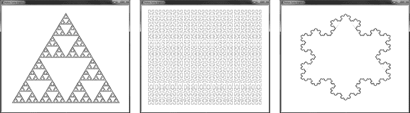

# 引言

> 原文：[Introduction](https://inventwithpython.com/recursion/chapter0.html)
> 
> 译者：[飞龙](https://github.com/wizardforcel)
> 
> 协议：[CC BY-NC-SA 4.0](https://creativecommons.org/licenses/by-nc-sa/4.0/)


递归编程技术可以产生优雅的代码解决方案。然而，更常见的情况是它会使程序员感到困惑。这并不意味着程序员可以（或应该）忽视递归。尽管它以具有挑战性而闻名，但递归是一个重要的计算机科学主题，可以为编程本身提供深刻的见解。至少，了解递归可以帮助你在编程工作面试中脱颖而出。

如果你是一个对计算机科学感兴趣的学生，递归是一个必须克服的障碍，以理解许多流行的算法。如果你是一个编程训练营的毕业生或自学的程序员，成功地绕过了更理论性的计算机科学主题，递归问题仍然会在白板编程面试中出现。如果你是一个有经验的软件工程师，在之前从未接触过递归算法，你可能会发现递归是你知识中一个令人尴尬的空白。

不用担心。递归并不像教授它那样难以理解。正如我将在第一章中解释的那样，我认为递归的普遍误解是由于教学不佳而不是任何固有的困难。由于递归函数在日常编程中并不常用，许多人可以很好地没有它们。

但递归算法背后存在着一定的概念美，即使你不经常应用它们，也可以帮助你理解编程。递归也有视觉美。这种技术是*分形*的惊人数学艺术的基础，如图 1 所示的自相似形状。



图 1：这些分形的例子包括 Sierpiński 三角形（左）、希尔伯特曲线（中）和科赫雪花（右）。

然而，这本书并不完全是在赞美递归。我对这种技术提出了一些尖锐的批评。在存在更简单解决方案的情况下，递归被过度使用。递归算法可能难以理解，性能较差，并容易导致堆栈溢出错误。某种类型的程序员可能使用递归，并不是因为它是解决特定问题的正确技术，而只是因为他们觉得当他们编写其他程序员难以理解的代码时更聪明。计算机科学家约翰·威兰德博士曾说过：“当你在计算机科学领域获得博士学位时，他们会带你去一个特殊的房间，并解释你绝不能在现实生活中使用递归。它的唯一目的是让本科生的编程变得困难。”

因此，无论你是想在编程面试中获得优势，想创建美丽的数学艺术，还是固执地寻求最终理解这个概念的迷人特性，这本书将是你进入递归的兔子洞的向导（以及兔子洞内部的兔子洞）。递归是计算机科学中将专业人士与初学者区分开的主题之一。通过阅读本书，你将掌握一项重要的技能，并了解它的黑暗秘密：递归并不像人们想象的那么复杂。

## 这本书是为谁写的？

这本书是为那些对递归算法感到害怕或感兴趣的人写的。递归是一个对初学者或大一计算机科学学生来说似乎像黑魔法的主题之一。大多数递归课程很难理解，使这个主题看起来令人沮丧，甚至可怕。对于这些读者，我希望本书直接的解释和丰富的例子可以帮助他们最终理解这个主题。

这本书的唯一先决条件是具有 Python 或 JavaScript 编程语言的基本编程经验，这些章节的代码示例使用这些语言。本书的程序已经被简化到它们的本质；如果你知道如何调用和创建函数以及全局变量和局部变量之间的区别，你就足够了。

## 关于本书

本书共有 14 章：

**第一部分：理解递归**

1.  第一章：什么是递归？解释了递归以及它是编程语言实现函数和函数调用的自然结果。本章还认为递归并不像许多人声称的那样优雅、神秘。

1.  第二章：递归与迭代深入探讨了递归和迭代技术之间的差异（以及许多相似之处）。

1.  第三章：经典递归算法涵盖了著名的递归程序，如汉诺塔、泛洪填充算法等。

1.  第四章：回溯和树遍历算法讨论了递归特别适用的问题：遍历树数据结构，比如解决迷宫和导航目录时。

1.  第五章：分治算法讨论了递归如何将大问题分解为更小的子问题，并涵盖了几种常见的分治算法。

1.  第六章：排列和组合涵盖了涉及排序和匹配的递归算法，以及这些技术应用到的常见编程问题。

1.  第七章：记忆化和动态规划解释了一些简单的技巧，以提高在现实世界中应用递归时的代码效率。

1.  第八章：尾递归优化涵盖了尾递归优化，这是一种用于改进递归算法性能的常见技术，以及它的工作原理。

1.  第九章：绘制分形介绍了可以通过递归算法以编程方式生成的有趣艺术。本章利用海龟图形生成其图像。

**第二部分：项目**

1.  第十章：文件查找器涵盖了一个可以根据您提供的自定义搜索参数搜索计算机上文件的项目。

1.  第十一章：迷宫生成器涵盖了一个自动生成任意大小迷宫的项目，使用了递归回溯算法。

1.  第十二章：滑块拼图求解器涵盖了一个解决滑块拼图（也称为 15 拼图）的项目。

1.  第十三章：分形艺术生成器探索了一个可以制作自己设计的自定义分形艺术的项目。

1.  第十四章：Droste 生成器探索了一个使用 Pillow 图像处理模块制作递归图片的项目。

## 动手实验计算机科学

单单阅读关于递归的内容并不能教会你如何独立实现它。本书包含了许多 Python 和 JavaScript 编程语言的递归代码示例供您实验。如果您是编程新手，您可以阅读我的书《用 Python 自动化繁琐工作》，第二版（No Starch Press，2019 年），或者 Eric Matthes 的《Python 编程快速上手》，第二版（No Starch Press，2019 年）来介绍编程和 Python 编程语言。

我建议使用调试器逐行执行这些程序。 *调试器*允许您逐行执行程序并检查程序的状态，从而可以准确定位错误发生的位置。《用 Python 自动化繁琐工作》，第二版，第十一章介绍了如何使用 Python 调试器，并可在[`automatetheboringstuff.com/2e/chapter11`](https://automatetheboringstuff.com/2e/chapter11)免费在线阅读。

本书的章节展示了 Python 和 JavaScript 代码示例。Python 代码保存在*.py*文件中，JavaScript 代码保存在*.html*文件中（而不是*.js*文件）。例如，看下面的`hello.py`文件：

```py
print('Hello, world!')
```

以及以下的`hello.html`文件：

```js
<script type="text/javascript">
document.write("Hello, world!<br />");
</script>
```

这两个代码清单充当了一块罗塞塔石，描述了以两种不同语言产生相同结果的程序。

我鼓励您使用键盘手动复制这些程序，而不是简单地将它们的源代码复制粘贴到一个新文件中。这有助于您对程序的“肌肉记忆”，并迫使您在输入每一行时考虑它。

*.html*文件在技术上不是有效的，因为它们缺少几个必要的 HTML 标签，例如`<html>`和`<body>`，但您的浏览器仍然可以显示输出。这些标签是故意省略的。本书中的程序是为了简单和可读性而编写的，而不是为了展示 Web 开发的最佳实践。

### 安装 Python

虽然每台计算机都有一个可以查看本书中*.html*文件的 Web 浏览器，但如果您希望运行本书的 Python 代码，则必须单独安装 Python。您可以从[`python.org/downloads`](https://python.org/downloads)免费下载 Microsoft Windows、Apple macOS 和 Ubuntu Linux 的 Python。确保下载 Python 3 的版本（如 3.10），而不是 Python 2。Python 3 对语言进行了一些不兼容的更改，本书中的程序可能无法在 Python 2 上正确运行，如果能运行的话。

### 运行 IDLE 和 Python 代码示例

您可以使用 Python 自带的 IDLE 编辑器编写 Python 代码，也可以安装免费的编辑器，例如来自[`codewith.mu`](https://codewith.mu)的 Mu 编辑器，来自[`www.jetbrains.com/pycharm/download`](https://www.jetbrains.com/pycharm/download)的 PyCharm 社区版，或来自[`code.visualstudio.com/Download`](https://code.visualstudio.com/Download)的 Microsoft Visual Studio Code。

要在 Windows 上打开 IDLE，打开屏幕左下角的开始菜单，在搜索框中输入`IDLE`，然后选择**IDLE（Python 3.10 64 位）**。

在 macOS 上，打开 Finder 窗口，点击**应用程序**▶**Python 3.10**，然后点击 IDLE 图标。

在 Ubuntu 上，选择**应用程序**▶**附件**▶**终端**，然后输入`IDLE 3`。您也可以点击屏幕顶部的**应用程序**，选择**编程**，然后点击**IDLE 3**。

IDLE 有两种类型的窗口。交互式 shell 窗口有`>>>`提示符，用于逐个运行 Python 指令。当您想要尝试 Python 代码的一部分时，这是很有用的。文件编辑器窗口是您可以输入完整的 Python 程序并将它们保存为*.py*文件的地方。这是您将输入本书中 Python 程序的源代码的方式。要打开新的文件编辑器窗口，点击**文件**▶**新建文件**。您可以通过点击**运行**▶**运行模块**或按**F5**来运行程序。

### 在浏览器中运行 JavaScript 代码示例

您的计算机的 Web 浏览器可以运行 JavaScript 程序并显示它们的输出，但要编写 JavaScript 代码，您需要一个文本编辑器。像记事本或 TextMate 这样的简单程序就可以，但您也可以安装专门用于编写代码的文本编辑器，例如来自[`www.sublimetext.com`](https://www.sublimetext.com)的 IDLE 或 Sublime Text。

在输入 JavaScript 程序代码后，将文件保存为*.html*文件，而不是*.js*文件。在 Web 浏览器中打开它们以查看结果。任何现代 Web 浏览器都可以用于此目的。
