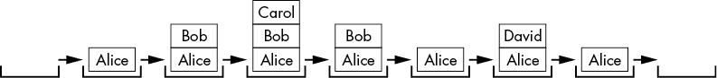

# 一、什么是递归？

> 原文：[Chapter 1 - What Is Recursion?](https://inventwithpython.com/recursion/chapter1.html)
> 
> 译者：[飞龙](https://github.com/wizardforcel)
> 
> 协议：[CC BY-NC-SA 4.0](https://creativecommons.org/licenses/by-nc-sa/4.0/)


递归有着令人望而生畏的声誉。人们认为很难理解，但其核心只依赖于两件事：函数调用和栈数据结构。

大多数新程序员通过跟踪执行来追踪程序的操作。这是阅读代码的简单方法：你只需把手指放在程序顶部的代码行上，然后向下移动。有时你的手指会回到原点；其他时候，它会进入一个函数，然后返回。这使得很容易可视化程序的操作和顺序。

但要理解递归，你需要熟悉一个不太明显的数据结构，称为*调用栈*，它控制程序的执行流程。大多数编程初学者不了解栈，因为编程教程在讨论函数调用时通常甚至不提及它们。此外，自动管理函数调用的调用栈在源代码中根本看不到。

当你看不见并且不知道它的存在时，很难理解某件事！在本章中，我们将拉开窗帘，消除递归难以理解的夸大概念，你将能够欣赏其中的优雅之处。 

## 递归的定义

在开始之前，让我们先把陈词滥调的递归笑话搞定，比如：“要理解递归，你必须先理解递归。”

在我写这本书的几个月里，我可以向你保证，这个笑话听得越多就越好笑。

另一个笑话是，如果你在谷歌上搜索*递归*，结果页面会问你是否是指*递归*。点击链接，如图 1-1 所示，会带你到...*递归*的搜索结果。


图 1-1：*递归*的谷歌搜索结果链接到*递归*的谷歌搜索结果。

图 1-2 显示了网络漫画 xkcd 中的一个递归笑话。


图 1-2：我如此元，甚至这个首字母缩略词（I.S. M.E.T.A.）([xkcd.com/917](http://xkcd.com/917) by Randall Munroe)

关于 2010 年科幻动作电影《盗梦空间》的大多数笑话都是递归笑话。电影中的角色在梦中有梦，而这些梦中还有梦。

最后，作为计算机科学家，谁能忘记希腊神话中的递归半人马怪物？正如你在图 1-3 中所看到的，它是半马半递归半人马。


图 1-3：递归半人马。Joseph Parker 提供的图片。

根据这些笑话，你可能会得出结论，递归是一种元、自我引用、梦中梦、无限镜中镜的东西。让我们建立一个具体的定义：*递归*是指其定义包括自身的东西。也就是说，它具有自我引用的定义。

图 1-4 中的谢尔宾斯基三角形被定义为一个等边三角形，中间有一个倒置的三角形，形成三个新的等边三角形，每个三角形都包含一个谢尔宾斯基三角形。谢尔宾斯基三角形的定义包括谢尔宾斯基三角形。


图 1-4：谢尔宾斯基三角形是包含谢尔宾斯基三角形的分形（递归形状）。

在编程上下文中，*递归函数*是调用自身的函数。在我们探索递归函数之前，让我们退一步，了解正常函数是如何工作的。程序员往往认为函数调用理所当然，但即使是有经验的程序员也会发现值得回顾下一节中的函数。

## 什么是函数？

*函数*可以被描述为程序中的迷你程序。它们是几乎每种编程语言的特性。如果您需要在程序中的三个不同位置运行相同的指令，而不是将源代码复制粘贴三次，您可以在函数中编写一次代码并调用函数三次。有益的结果是更短和更易读的程序。程序也更容易更改：如果您需要修复错误或添加功能，您只需要在一个地方更改程序，而不是三个地方。

所有编程语言在它们的函数中实现了四个特性：

1.  函数有在调用函数时运行的代码。

1.  *参数*（即值）在调用函数时传递。这是函数的输入，函数可以有零个或多个参数。

1.  函数返回一个*返回值*。这是函数的输出，尽管一些编程语言允许函数不返回任何东西或返回像`undefined`或`None`这样的空值。

1.  程序记住了调用函数的代码行，并在函数完成执行时返回到它。

不同的编程语言可能具有其他特性，或者对如何调用函数有不同的选项，但它们都具有这四个一般元素。您可以在源代码中直观地看到这四个元素中的前三个，但是当函数返回时，程序如何跟踪执行应该返回到哪里呢？

为了更好地理解问题，创建一个`functionCalls.py`程序，其中包含三个函数：`a()`调用`b()`，`b()`调用`c()`：

**Python**

```py
def a():
    print('a() was called.')
    b()
    print('a() is returning.')

def b():
    print('b() was called.')
    c()
    print('b() is returning.')

def c():
    print('c() was called.')
    print('c() is returning.')

a()
```

这段代码等同于以下`functionCalls.html`程序：

**JavaScript**

```js
<script type="text/javascript">
function a() {
    document.write("a() was called.<br />");
    b();
    document.write("a() is returning.<br />");
}

function b() {
    document.write("b() was called.<br />");
    c();
    document.write("b() is returning.<br />");
}

function c() {
    document.write("c() was called.<br />");
    document.write("c() is returning.<br />");
}

a();
</script>
```

当您运行此代码时，输出如下：

```py
a() was called.
b() was called.
c() was called.
c() is returning.
b() is returning.
a() is returning.
```

输出显示了函数`a()`，`b()`和`c()`的开始。然后，当函数返回时，输出以相反的顺序出现：`c()`，`b()`，然后是`a()`。注意文本输出的模式：每次函数返回时，它都记住了最初调用它的代码行。当`c()`函数调用结束时，程序返回到`b()`函数并显示`b()正在返回`。然后`b()`函数调用结束，程序返回到`a()`函数并显示`a()正在返回`。最后，程序返回到程序末尾的原始`a()`函数调用。换句话说，函数调用并不会使程序的执行成为单向行程。

但程序如何记住是`a()`还是`b()`调用了`c()`？这个细节由程序隐式处理，使用一个调用栈。要理解调用栈如何记住函数调用结束时执行返回的位置，我们首先需要了解栈是什么。

## 什么是栈？

之前我提到过一个陈词滥调的笑话，“要理解递归，你必须先理解递归。”但这实际上是错误的：要真正理解递归，你必须先理解栈。

*栈*是计算机科学中最简单的数据结构之一。它像列表一样存储多个值，但与列表不同的是，它只限制您在栈的“顶部”添加或删除值。对于使用列表或数组实现的栈，“顶部”是最后一个项目，在列表或数组的右端。添加值称为*推送*值到栈上，而删除值称为*弹出*值出栈。

想象一下，您正在与某人进行一场漫谈。您正在谈论您的朋友 Alice，然后想起了关于您同事 Bob 的故事，但为了讲清楚这个故事，您首先必须解释一些关于您表妹 Carol 的事情。您讲完了关于 Carol 的故事，然后回到谈论 Bob，当您讲完了关于 Bob 的故事后，您又回到了谈论 Alice。然后您想起了您的兄弟 David，于是您讲了一个关于他的故事。最终，您回到了最初关于 Alice 的故事。

您的对话遵循类似堆栈的结构，就像图 1-5 中的那样。对话类似于堆栈，因为当前话题总是在堆栈的顶部。



图 1-5：您的漫谈对话堆栈

在我们的对话堆栈中，新话题被添加到堆栈的顶部，并在完成时被移除。之前的话题在堆栈中的当前话题下面被“记住”。

如果我们限制自己使用`append()`和`pop()`方法来执行推入和弹出操作，我们可以将 Python 列表用作堆栈。JavaScript 数组也可以通过它们的`push()`和`pop()`方法用作堆栈。

例如，考虑这个`cardStack.py`程序，它将扑克牌的字符串值推入和弹出到名为`cardStack`的列表的末尾：

**Python**

```py
cardStack = [] # ❶
cardStack.append('5 of diamonds') # ❷
print(','.join(cardStack))
cardStack.append('3 of clubs')
print(','.join(cardStack))
cardStack.append('ace of hearts')
print(','.join(cardStack))
cardStack.pop() # ❸
print(','.join(cardStack))
```

以下的`cardStack.html`程序包含了 JavaScript 中的等效代码：

**JavaScript**

```js
<script type="text/javascript">
let cardStack = []; // ❶
cardStack.push("5 of diamonds"); // ❷
document.write(cardStack + "<br />");
cardStack.push("3 of clubs");
document.write(cardStack + "<br />");
cardStack.push("ace of hearts");
document.write(cardStack + "<br />");
cardStack.pop() // ❸
document.write(cardStack + "<br />");
</script>
```

当您运行此代码时，输出如下所示：

```py
5 of diamonds
5 of diamonds,3 of clubs
5 of diamonds,3 of clubs,ace of hearts
5 of diamonds,3 of clubs
```

堆栈从空开始❶。推入堆栈的是代表卡片的三个字符串❷。然后弹出堆栈❸，这将移除红桃 A 并再次将梅花三放在堆栈的顶部。`cardStack`堆栈的状态在图 1-6 中进行了跟踪，从左到右。


图 1-6：堆栈开始为空。然后将卡片推入和弹出堆栈。

您只能看到卡堆中的最顶部卡片，或者在我们程序的堆栈中，最顶部的值。在最简单的堆栈实现中，您无法看到堆栈中有多少张卡片（或值）。您只能看到堆栈是否为空。

堆栈是一种*LIFO*数据结构，代表*后进先出*，因为推入堆栈的最后一个值是弹出的第一个值。这种行为类似于您的网络浏览器的“返回”按钮。您的浏览器标签的历史记录就像一个包含您按顺序访问的所有页面的堆栈。浏览器始终显示历史记录“堆栈”中的顶部网页。单击链接会将新网页推入历史记录堆栈，而单击“返回”按钮会弹出顶部网页并显示其下面的网页。

## 调用堆栈是什么？

程序也使用堆栈。程序的*调用堆栈*，也简称为*堆栈*，是一堆帧对象。*帧对象*，也简称为*帧*，包含有关单个函数调用的信息，包括调用函数的代码行，因此当函数返回时，执行可以回到那里。

当调用函数时，将创建帧对象并将其推送到堆栈上。当函数返回时，该帧对象将从堆栈中弹出。如果我们调用一个调用一个调用函数的函数，调用堆栈将在堆栈上有三个帧对象。当所有这些函数返回时，调用堆栈将在堆栈上有零个帧对象。

程序员不必编写处理帧对象的代码，因为编程语言会自动处理它们。不同的编程语言有不同的实现帧对象的方式，但通常它们包含以下内容：

+   返回地址，或者函数返回时执行的位置

+   传递给函数调用的参数

+   在函数调用期间创建的一组局部变量

例如，看一下以下`localVariables.py`程序，它有三个函数，就像我们之前的`functionCalls.py`和`functionCalls.html`程序一样：

**Python**

```py
def a():
    spam = 'Ant' # ❶
    print('spam is ' + spam) # ❷
    b() # ❸
    print('spam is ' + spam)

def b():
    spam = 'Bobcat' # ❹
    print('spam is ' + spam)
    c() # ❺
    print('spam is ' + spam)

def c():
    spam = 'Coyote' # ❻
    print('spam is ' + spam)

a() # ❼
```

这个`localVariables.html`是等效的 JavaScript 程序：

**JavaScript**

```js
<script type="text/javascript">
function a() {
    let spam = "Ant"; // ❶
    document.write("spam is " + spam + "<br />"); // ❷
    b(); // ❸
    document.write("spam is " + spam + "<br />");
}

function b() {
    let spam = "Bobcat";//# ❹
    document.write("spam is " + spam + "<br />");
    c(); // ❺
 document.write("spam is " + spam + "<br />");
}

function c() {
    let spam = "Coyote"; // ❻
    document.write("spam is " + spam + "<br />");
}

a(); // ❼
</script>
```

当您运行此代码时，输出如下所示：

```py
spam is Ant
spam is Bobcat
spam is Coyote
spam is Bobcat
spam is Ant
```

当程序调用函数`a()` ❼时，将创建一个帧对象并将其放置在调用堆栈顶部。该帧存储传递给`a()`的任何参数（在本例中没有），以及局部变量`spam` ❶和`a()`函数返回时执行的位置。

当调用`a()`时，它显示其局部`spam`变量的内容，即`Ant` ❷。当`a()`中的代码调用函数`b()` ❸时，将创建一个新的帧对象并将其放置在调用堆栈上方，用于`a()`的帧对象。`b()`函数有自己的局部`spam`变量 ❹，并调用`c()` ❺。为`c()`调用创建一个新的帧对象并将其放置在调用堆栈上，其中包含`c()`的局部`spam`变量 ❻。随着这些函数的返回，帧对象从调用堆栈中弹出。程序执行知道要返回到哪里，因为返回信息存储在帧对象中。当执行从所有函数调用返回时，调用堆栈为空。

图 1-7 显示了每个函数调用和返回时调用堆栈的状态。请注意，所有局部变量都具有相同的名称：`spam`。我这样做是为了突出局部变量始终是具有不同值的单独变量，即使它们与其他函数中的局部变量具有相同的名称。


图 1-7：*localVariables*程序运行时调用堆栈的状态

正如您所看到的，编程语言可以具有相同名称（`spam`）的单独的局部变量，因为它们保存在单独的帧对象中。当在源代码中使用局部变量时，将使用顶部帧对象中具有该名称的变量。

每个运行的程序都有一个调用堆栈，多线程程序每个线程都有一个调用堆栈。但是当您查看程序的源代码时，您无法在代码中看到调用堆栈。调用堆栈不像其他数据结构一样存储在变量中；它在后台自动处理。

调用堆栈在源代码中不存在的事实是递归对初学者如此令人困惑的主要原因：递归依赖于程序员甚至看不到的东西！揭示堆栈数据结构和调用堆栈的工作原理消除了递归背后的许多神秘之处。函数和堆栈都是简单的概念，我们可以将它们结合起来理解递归是如何工作的。

## 递归函数和堆栈溢出是什么？

*递归函数*是调用自身的函数。这个`shortest.py`程序是递归函数的最短可能示例：

**Python**

```py
def shortest():
    shortest()

shortest()
```

前面的程序等同于这个`shortest.html`程序：

**JavaScript**

```js
<script type="text/javascript">
function shortest() {
    shortest();
}

shortest();
</script>
```

`shortest()`函数除了调用`shortest()`函数什么也不做。当这发生时，它再次调用`shortest()`函数，然后`shortest()`会调用`shortest()`，依此类推，看起来永远不会停止。这类似于地壳靠着一只巨大的空间乌龟的背部，而那只乌龟又靠着另一只乌龟。在那只乌龟下面：另一只乌龟。如此循环，永无止境。

但是这个“无穷递归”的理论并不能很好地解释宇宙学，也不能很好地解释递归函数。由于调用堆栈使用了计算机的有限内存，这个程序不能永远继续下去，就像无限循环那样。这个程序唯一能做的就是崩溃并显示错误消息。

`shortest.py`的 Python 输出看起来像这样：

```py
Traceback (most recent call last):
  File "shortest.py", line 4, in <module>
    shortest()
  File "shortest.py", line 2, in shortest
    shortest()
  File "shortest.py", line 2, in shortest
    shortest()
  File "shortest.py", line 2, in shortest
    shortest()
  [Previous line repeated 996 more times]
RecursionError: maximum recursion depth exceeded
```

`shortest.html`的 JavaScript 输出在 Google Chrome 网页浏览器中看起来像这样（其他浏览器会有类似的错误消息）：

```py
Uncaught RangeError: Maximum call stack size exceeded
    at shortest (shortest.html:2)
    at shortest (shortest.html:3)
    at shortest (shortest.html:3)
    at shortest (shortest.html:3)
    at shortest (shortest.html:3)
    at shortest (shortest.html:3)
    at shortest (shortest.html:3)
    at shortest (shortest.html:3)
    at shortest (shortest.html:3)
    at shortest (shortest.html:3)
```

这种错误被称为*堆栈溢出*。（这就是流行网站[`stackoverflow.com`](https://stackoverflow.com)得名的地方。）不断的函数调用而没有返回会使调用堆栈增长，直到计算机为调用堆栈分配的所有内存都被用完。为了防止这种情况，Python 和 JavaScript 解释器在一定数量的不返回值的函数调用后会终止程序。

这个限制被称为*最大递归深度*或*最大调用堆栈大小*。对于 Python，这被设置为 1,000 个函数调用。对于 JavaScript，最大调用堆栈大小取决于运行代码的浏览器，但通常至少为 10,000 左右。把堆栈溢出想象成当调用堆栈变得“太高”（也就是消耗了太多的计算机内存）时发生，就像图 1-8 中的情况。


图 1-8：当调用堆栈变得太高时，堆栈溢出就会发生，有太多的帧对象占用了计算机的内存。

堆栈溢出不会损坏计算机。计算机只是检测到函数调用的限制已经达到并终止程序。最坏的情况下，你会丢失程序中的任何未保存的工作。堆栈溢出可以通过有一个叫做*基本情况*的东西来防止，接下来会解释。

## 基本情况和递归情况

堆栈溢出示例有一个`shortest()`函数调用`shortest()`但从不返回。为了避免崩溃，需要有一个情况，或一组情况，使得函数停止调用自身，而是直接返回。这被称为*基本情况*。相比之下，函数递归调用自身的情况被称为*递归情况*。

所有递归函数都需要至少一个基本情况和至少一个递归情况。如果没有基本情况，函数永远不会停止进行递归调用，最终导致堆栈溢出。如果没有递归情况，函数永远不会调用自身，只是一个普通函数，而不是递归函数。当你开始编写自己的递归函数时，一个很好的第一步是找出基本情况和递归情况应该是什么。

看一下这个`shortestWithBaseCase.py`程序，它定义了不会因堆栈溢出而崩溃的最短递归函数：

**Python**

```py
def shortestWithBaseCase(makeRecursiveCall):
    print('shortestWithBaseCase(%s) called.' % makeRecursiveCall)
    if not makeRecursiveCall:
        # BASE CASE
        print('Returning from base case.')
        return # ❶
    else:
        # RECURSIVE CASE
        shortestWithBaseCase(False) # ❷
        print('Returning from recursive case.')
        return

print('Calling shortestWithBaseCase(False):')
shortestWithBaseCase(False) # ❸
print()
print('Calling shortestWithBaseCase(True):')
shortestWithBaseCase(True) # ❹
```

这段代码等同于以下`shortestWithBaseCase.html`程序：

**JavaScript**

```js
<script type="text/javascript">
function shortestWithBaseCase(makeRecursiveCall) {
    document.write("shortestWithBaseCase(" + makeRecursiveCall + 
     ") called.<br />");
    if  (makeRecursiveCall === false) {
        // BASE CASE
        document.write("Returning from base case.<br />");
        return; // ❶
 } else {
        // RECURSIVE CASE
        shortestWithBaseCase(false); // ❷
        document.write("Returning from recursive case.<br />");
        return;
    }
}

document.write("Calling shortestWithBaseCase(false):<br />");
shortestWithBaseCase(false); // ❸
document.write("<br />");
document.write("Calling shortestWithBaseCase(true):<br />");
shortestWithBaseCase(true); // ❹
</script>
```

当你运行这段代码时，输出看起来像这样：

```py
Calling shortestWithBaseCase(False):
shortestWithBaseCase(False) called.
Returning from base case.

Calling shortestWithBaseCase(True):
shortestWithBaseCase(True) called.
shortestWithBaseCase(False) called.
Returning from base case.
Returning from recursive case.
```

这个函数除了提供递归的简短示例外并没有做任何有用的事情（并且通过删除文本输出可以使其更短，但文本对我们的解释很有用）。当调用`shortestWithBaseCase(False)`时❸，基本情况被执行，函数仅返回❶。然而，当调用`shortestWithBaseCase(True)`时❹，递归情况被执行，并调用`shortestWithBaseCase(False)`❷。

重要的是要注意，当从❷递归调用`shortestWithBaseCase(False)`并返回时，执行不会立即回到❹处的原始函数调用。递归调用后的递归情况中的其余代码仍然会运行，这就是为什么输出中会出现`Returning from recursive case.`。从基本情况返回并不会立即返回到之前发生的所有递归调用。这在下一节中的`countDownAndUp()`示例中将是重要的要记住的。

## 递归调用前后的代码

递归情况中的代码可以分为两部分：递归调用前的代码和递归调用后的代码。（如果在递归情况中有两个递归调用，比如第二章中的斐波那契数列示例，那么会有一个前、一个中和一个后。但现在让我们保持简单。）

重要的是要知道，达到基本情况并不一定意味着递归算法的结束。它只意味着基本情况不会继续进行递归调用。

例如，考虑这个`countDownAndUp.py`程序，其递归函数从任何数字倒数到零，然后再次升到该数字：

Python

```py
def countDownAndUp(number):
    print(number) # ❶
    if number == 0:
        # BASE CASE
        print('Reached the base case.') # ❷
        return
    else:
        # RECURSIVE CASE
        countDownAndUp(number - 1) # ❸
        print(number, 'returning') # ❹
        return

countDownAndUp(3) # ❺
```

这里是等效的`countDownAndUp.html`程序：

JavaScript

```js
<script type="text/javascript">
function countDownAndUp(number) {
    document.write(number + "<br />"); // ❶
    if (number === 0) {
        // BASE CASE
        document.write("Reached the base case.<br />"); // ❷
        return;
    } else {
        // RECURSIVE CASE
        countDownAndUp(number - 1); // ❸
        document.write(number + " returning<br />"); // ❹
        return;
    }
}

countDownAndUp(3); # ❺
</script>
```

当运行此代码时，输出如下：

```py
3
2
1
0
Reached the base case.
1 returning
2 returning
3 returning
```

请记住，每次调用函数时，都会创建一个新帧并推送到调用堆栈上。这个帧是存储所有局部变量和参数（如`number`）的地方。因此，对于调用堆栈上的每个帧都有一个单独的`number`变量。这是关于递归经常令人困惑的另一个要点：尽管从源代码看，似乎只有一个`number`变量，但请记併，因为它是局部变量，实际上对于每个函数调用都有一个不同的`number`变量。

当调用`countDownAndUp(3)`时❺，会创建一个帧，该帧的局部变量`number`设置为`3`。函数将`number`变量打印到屏幕上❶。只要`number`不是`0`，就会递归调用`countDownAndUp()`，参数为`number - 1`❸。当调用`countDownAndUp(2)`时，会推送一个新帧到堆栈上，并且该帧的局部变量`number`设置为`2`。同样，递归情况被触发，调用`countDownAndUp(1)`，再次触发递归情况并调用`countDownAndUp(0)`。

连续进行递归函数调用然后从递归函数调用返回的模式是导致数字倒数出现的原因。一旦调用`countDownAndUp(0)`，就会达到基本情况❷，不会再进行递归调用。然而，这并不是我们程序的结束！当达到基本情况时，局部变量`number`为`0`。但当基本情况返回并且帧从调用堆栈中弹出时，其下面的帧有自己的局部变量`number`，其值始终为`1`。当执行返回到调用堆栈中的前一个帧时，递归调用后的代码会被执行❹。这就是导致数字升序出现的原因。图 1-9 显示了在递归调用`countDownAndUp()`并返回时调用堆栈的状态。


图 1-9：调用堆栈跟踪每个函数调用中`number`局部变量的值

当基本情况达到时，代码不会立即停止，这一点对于下一章中的阶乘计算非常重要。请记住，递归情况之后的任何代码仍然必须运行。

此时，您可能会认为递归的`countDownAndUp()`函数设计过于复杂，难以理解。为什么不使用迭代解决方案来打印数字呢？*迭代*方法通常被认为是递归的相反，它使用循环重复任务直到完成。

每当您问自己，“使用循环会更容易吗？”答案几乎肯定是“是”，您应该避免使用递归解决方案。递归对于初学者和有经验的程序员都可能很棘手，递归代码并不自动比迭代代码“更好”或“更优雅”。可读性强、易于理解的代码比递归提供的任何所谓的优雅更重要。然而，在某些情况下，算法可以清晰地映射到递归方法。涉及树状数据结构并需要回溯的算法特别适合使用递归。这些想法在第二章和第四章中进一步探讨。

## 总结

递归经常会让新手程序员感到困惑，但它建立在一个简单的思想上，即函数可以调用自身。每次进行函数调用时，都会向调用堆栈添加一个新的帧对象，其中包含与调用相关的信息（例如局部变量和函数返回时执行移动到的返回地址）。调用堆栈作为一个堆栈数据结构，只能通过向其“顶部”添加或删除数据来改变。这分别称为*推入*和*弹出*堆栈。

程序隐式处理调用堆栈，因此没有调用堆栈变量。调用函数会将一个帧对象推入调用堆栈，从函数返回会从调用堆栈中弹出一个帧对象。

递归函数有递归情况，即进行递归调用的情况，和基本情况，即函数简单返回的情况。如果没有基本情况或者错误阻止基本情况运行，执行将导致堆栈溢出，从而使程序崩溃。

递归是一种有用的技术，但递归并不会自动使代码“更好”或更“优雅”。这个想法在下一章中会更详细地探讨。

## 进一步阅读

您可以在 2018 年北湾 Python 大会上找到有关递归的其他介绍，标题为“递归入门：递归初学者指南”，网址为[`youtu.be/AfBqVVKg4GE`](https://youtu.be/AfBqVVKg4GE)。YouTube 频道 Computerphile 还在其视频“地球上的递归是什么？”中介绍了递归，网址为[`youtu.be/Mv9NEXX1VHc`](https://youtu.be/Mv9NEXX1VHc)。最后，V. Anton Spraul 在他的书*像程序员一样思考*（No Starch Press，2012）和他的视频“递归（像程序员一样思考）”中讨论了递归，网址为[`youtu.be/oKndim5-G94`](https://youtu.be/oKndim5-G94)。维基百科的递归文章在[`en.wikipedia.org/wiki/Recursion`](https://en.wikipedia.org/wiki/Recursion)中有详细介绍。

您可以为 Python 安装`ShowCallStack`模块。该模块添加了一个`showcallstack()`函数，您可以将其放在代码中的任何位置，以查看程序在特定点的调用堆栈状态。您可以在[`pypi.org/project/ShowCallStack`](https://pypi.org/project/ShowCallStack)下载该模块并找到相关说明。

## 练习题

通过回答以下问题来测试你的理解能力：

1.  一般来说，什么是递归的东西？

1.  在编程中，什么是递归函数？

1.  函数有哪四个特征？

1.  什么是堆栈？

1.  向堆栈的顶部添加和移除值的术语是什么？

1.  假设你将字母*J*推送到堆栈，然后推送字母*Q*，然后弹出堆栈，然后推送字母*K*，然后再次弹出堆栈。堆栈是什么样子？

1.  被推送和弹出到调用堆栈上的是什么？

1.  是什么导致堆栈溢出？

1.  什么是基本情况？

1.  什么是递归情况？

1.  递归函数有多少个基本情况和递归情况？

1.  如果一个递归函数没有基本情况会发生什么？

1.  如果一个递归函数没有递归情况会发生什么？

