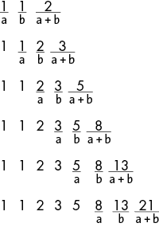
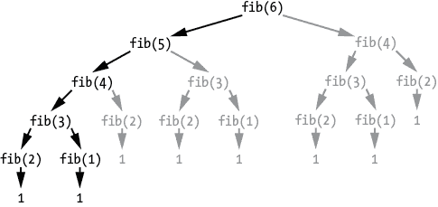
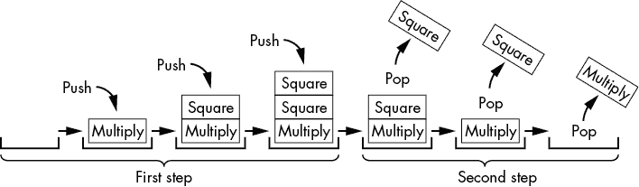
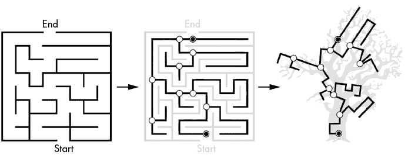
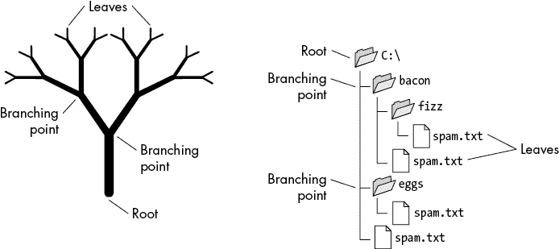

# 二、递归与迭代

> 原文：[Chapter 2 - Recursion vs. Iteration](https://inventwithpython.com/recursion/chapter2.html)
> 
> 译者：[飞龙](https://github.com/wizardforcel)
> 
> 协议：[CC BY-NC-SA 4.0](https://creativecommons.org/licenses/by-nc-sa/4.0/)


递归和迭代都没有一般上是更好的技术。事实上，任何递归代码都可以用循环和堆栈编写成迭代代码。递归并没有某种特殊的能力使其能够执行迭代算法无法执行的计算。任何迭代循环都可以重写为递归函数。

本章比较和对比了递归和迭代。我们将研究经典的斐波那契和阶乘函数，并看看它们的递归算法为什么有关键的弱点。我们还将通过考虑指数算法来探索递归方法可以产生的见解。总的来说，本章揭示了递归算法的所谓优雅之处，并展示了递归解决方案何时有用以及何时不适用。

## 计算阶乘

许多计算机科学课程使用阶乘计算作为递归函数的经典示例。一个整数（我们称之为*n*）的阶乘是从 1 到*n*的所有整数的乘积。例如，4 的阶乘是 4 × 3 × 2 × 1，即 24。感叹号是阶乘的数学表示法，如 4!，表示*4 的阶乘*。表 2-1 显示了前几个阶乘。

表 2-1：前几个整数的阶乘

| ***n*!** |  | **展开形式** |  | **乘积** |
| --- | --- | --- | --- | --- |
| 1! | = | 1 | = | 1 |
| 2! | = | 1 × 2 | = | 2 |
| 3! | = | 1 × 2 × 3 | = | 6 |
| 4! | = | 1 × 2 × 3 × 4 | = | 24 |
| 5! | = | 1 × 2 × 3 × 4 × 5 | = | 120 |
| 6! | = | 1 × 2 × 3 × 4 × 5 × 6 | = | 720 |
| 7! | = | 1 × 2 × 3 × 4 × 5 × 6 × 7 | = | 5,040 |
| 8! | = | 1 × 2 × 3 × 4 × 5 × 6 × 7 × 8 | = | 40,320 |

阶乘在各种计算中都有用途——例如，找到某物排列的排列数。如果你想知道有多少种方式可以将四个人——Alice、Bob、Carol 和 David——排成一行，答案就是 4 的阶乘。四个可能的人可以先站在队伍中（4）；然后对于这四个选项中的每一个，还有三个人可以站在第二位（4 × 3）；然后两个人可以站在第三位（4 × 3 × 2）；最后一个人站在第四位（4 × 3 × 2 × 1）。人们可以排成队伍的方式数量——也就是排列的数量——就是人数的阶乘。

现在让我们来看看计算阶乘的迭代和递归方法。

### 迭代阶乘算法

用迭代方法计算阶乘相当直接：在循环中将整数 1 到*n*相乘。*迭代*算法总是使用循环。`factorialByIteration.py`程序看起来像这样：

**Python**

```py
def factorial(number):
    product = 1
    for i in range(1, number + 1):
        product = product * i
    return product
print(factorial(5))
```

而`factorialByIteration.html`程序看起来像这样：

**JavaScript**

```js
<script type="text/javascript">
function factorial(number) {
    let product = 1;
    for (let i = 1; i <= number; i++) {
        product = product * i;
    }
    return product;
}
document.write(factorial(5));
</script>
```

当你运行这段代码时，输出会显示 5!的计算结果如下：

```py
120
```

用迭代方法计算阶乘没有问题；它很直接并且完成了任务。但是让我们也看看递归算法，以便更好地理解阶乘和递归本身的性质。

### 递归阶乘算法

注意 4 的阶乘是 4 × 3 × 2 × 1，5 的阶乘是 5 × 4 × 3 × 2 × 1。所以你可以说 5! = 5 × 4!。这是*递归*，因为 5 的阶乘（或任何数字*n*）的定义包括 4 的阶乘（数字*n* - 1）的定义。依此类推，4! = 4 × 3!，以此类推，直到必须计算 1!，即基本情况，它只是 1。

递归阶乘算法的 Python 程序`factorialByRecursion.py`使用了递归阶乘算法：

**Python**

```py
def factorial(number):
    if number == 1:
        # BASE CASE
        return 1
    else:
        # RECURSIVE CASE
        return number * factorial(number - 1) # ❶
print(factorial(5))
```

而`factorialByRecursion.html`的 JavaScript 程序与等效代码看起来是这样的：

**JavaScript**

```js
<script type="text/javascript">
function factorial(number) {
    if (number == 1) {
        // BASE CASE
        return 1;
 } else {
        // RECURSIVE CASE
        return number * factorial(number - 1); // ❶
    }
}
document.write(factorial(5));
</script>
```

当你运行这段代码递归计算 5!时，输出与迭代程序的输出相匹配：

```py
120
```

对许多程序员来说，这个递归代码看起来很奇怪。你知道`factorial(5)`必须计算 5 × 4 × 3 × 2 × 1，但很难指出这个乘法发生在哪一行代码上。

混淆是因为递归情况有一行 ❶，其中一半在递归调用之前执行，另一半在递归调用返回后执行。我们不习惯一行代码只有一半在执行。

第一部分是`factorial(number - 1)`。这涉及计算`number - 1`并创建一个递归函数，导致调用栈中推送一个新的帧对象。这发生在递归调用之前。

代码再次运行时，旧的帧对象是在`factorial(number - 1)`返回后。当调用`factorial(5)`时，`factorial(number - 1)`将是`factorial(4)`，返回值是`24`。这时第二部分代码运行。`return number * factorial(number - 1)`现在看起来像`return` `5 * 24`，这就是为什么`factorial(5)`返回`120`。

图 2-1 跟踪了调用栈的状态，帧对象被推送（当递归函数调用时发生）和帧对象被弹出（当递归函数调用返回时）。注意乘法发生在递归调用之后，而不是之前。

当原始函数调用`factorial()`返回时，它返回了计算出的阶乘。

### 为什么递归阶乘算法很糟糕

用于计算阶乘的递归实现有一个关键的弱点。计算 5 的阶乘需要五次递归函数调用。这意味着在基本情况到达之前，调用栈上会有五个帧对象。这不可扩展。

如果你想计算 1001 的阶乘，递归的`factorial()`函数必须进行 1001 次递归函数调用。然而，你的程序很可能在完成之前引起堆栈溢出，因为进行如此多的函数调用而不返回会超过解释器的最大调用栈大小。这很糟糕；你绝对不会想在真实世界的代码中使用递归阶乘函数。


图 2-1：调用栈的状态，递归调用`factorial()`后的返回

另一方面，迭代阶乘算法将快速高效地完成计算。可以使用一些编程语言中的一种称为*尾递归优化*的技术来避免堆栈溢出。第八章涵盖了这个主题。然而，这种技术进一步复杂化了递归函数的实现。对于计算阶乘，迭代方法是最简单和最直接的。

## 计算斐波那契序列

*斐波那契序列*是介绍递归的另一个经典例子。数学上，整数的斐波那契序列以数字 1 和 1（有时是 0 和 1）开始。序列中的下一个数字是前两个数字的和。这创建了序列 1, 1, 2, 3, 5, 8, 13, 21, 34, 55, 89, 144 等，永远不会结束。

如果我们将序列中的最新两个数字称为*a*和*b*，您可以在图 2-2 中看到序列是如何增长的。



图 2-2：斐波那契序列的每个数字都是前两个数字的和。

让我们探索一些迭代和递归解决方案的代码示例，用于生成斐波那契数。

### 迭代斐波那契算法

迭代斐波那契示例很简单，由一个简单的`for`循环和两个变量`a`和`b`组成。这个`fibonacciByIteration.py` Python 程序实现了迭代斐波那契算法：

**Python**

```py
def fibonacci(nthNumber):
    a, b = 1, 1 # ❶
    print('a = %s, b = %s' % (a, b))
    for i in range(1, nthNumber):
        a, b = b, a + b # Get the next Fibonacci number. # ❷
        print('a = %s, b = %s' % (a, b))
    return a

print(fibonacci(10))
```

这个`fibonacciByIteration.html`程序包含了等效的 JavaScript 代码：

**JavaScript**

```js
<script type="text/javascript">
function fibonacci(nthNumber) {
    let a = 1, b = 1; // ❶
    let nextNum;
    document.write('a = ' + a + ', b = ' + b + '<br />');
    for (let i = 1; i < nthNumber; i++) {
        nextNum = a + b; // Get the next Fibonacci number. // ❷
        a = b;
        b = nextNum;
 document.write('a = ' + a + ', b = ' + b + '<br />');
    }
    return a;
};

document.write(fibonacci(10));
</script>
```

当您运行此代码来计算第 10 个斐波那契数时，输出如下：

```py
a = 1, b = 1
a = 1, b = 2
a = 2, b = 3
# --snip--
a = 34, b = 55
55
```

程序只需要一次跟踪序列中的最新两个数字。由于斐波那契序列中的前两个数字被定义为 1，我们将`1`存储在变量`a`和`b`中❶。在`for`循环内，通过将`a`和`b`相加来计算序列中的下一个数字❷，这成为`b`的下一个值，而`a`获得`b`的前一个值。当循环结束时，`b`包含第*n*个斐波那契数，因此返回它。

### 递归斐波那契算法

计算斐波那契数涉及递归属性。例如，如果要计算第 10 个斐波那契数，您将第九个和第八个斐波那契数相加。要计算这些斐波那契数，您将第八个和第七个，然后第七个和第六个斐波那契数相加。会发生大量重复计算：注意到将第九个和第八个斐波那契数相加涉及再次计算第八个斐波那契数。您继续递归，直到达到第一个或第二个斐波那契数的基本情况，它们始终为 1。

递归斐波那契函数在这个`fibonacciByRecursion.py` Python 程序中：

```py
def fibonacci(nthNumber):
    print('fibonacci(%s) called.' % (nthNumber))
    if nthNumber == 1 or nthNumber == 2: # ❶
        # BASE CASE
        print('Call to fibonacci(%s) returning 1.' % (nthNumber))
        return 1
    else:
        # RECURSIVE CASE
        print('Calling fibonacci(%s) and fibonacci(%s).' % (nthNumber - 1, nthNumber - 2))
        result = fibonacci(nthNumber - 1) + fibonacci(nthNumber - 2)
        print('Call to fibonacci(%s) returning %s.' % (nthNumber, result))
        return result

print(fibonacci(10))
```

这个`fibonacciByRecursion.html`文件包含了等效的 JavaScript 程序：

```js
<script type="text/javascript">
function fibonacci(nthNumber) {
    document.write('fibonacci(' + nthNumber + ') called.<br />');
    if (nthNumber === 1 || nthNumber === 2) { // ❶
        // BASE CASE
        document.write('Call to fibonacci(' + nthNumber + ') returning 1.<br />');
        return 1;
    }
    else {
        // RECURSIVE CASE
        document.write('Calling fibonacci(' + (nthNumber - 1) + ') and fibonacci(' + (nthNumber - 2) + ').<br />');
        let result = fibonacci(nthNumber - 1) + fibonacci(nthNumber - 2);
        document.write('Call to fibonacci(' + nthNumber + ') returning ' + result + '.<br />');
        return result;
    }
}

document.write(fibonacci(10) + '<br />');
</script>
```

当您运行此代码来计算第 10 个斐波那契数时，输出如下：

```py
fibonacci(10) called.
Calling fibonacci(9) and fibonacci(8).
fibonacci(9) called.
Calling fibonacci(8) and fibonacci(7).
fibonacci(8) called.
Calling fibonacci(7) and fibonacci(6).
fibonacci(7) called.
# --snip--
Call to fibonacci(6) returning 8.
Call to fibonacci(8) returning 21.
Call to fibonacci(10) returning 55.
55
```

大部分代码用于显示这个输出，但`fibonacci()`函数本身很简单。基本情况——不再进行递归调用的情况——发生在`nthNumber`为`1`或`2`时❶。在这种情况下，函数返回`1`，因为第一个和第二个斐波那契数始终为 1。任何其他情况都是递归情况，因此返回的值是`fibonacci(nthNumber - 1)`和`fibonacci(nthNumber - 2)`的和。只要原始的`nthNumber`参数是大于`0`的整数，这些递归调用最终会达到基本情况并停止进行更多的递归调用。

还记得递归阶乘示例中的“递归调用之前”和“递归调用之后”部分吗？因为递归斐波那契算法在其递归情况中进行了两次递归调用，所以你应该记住它有三个部分：“第一个递归调用之前”，“第一个递归调用之后但第二个递归调用之前”，以及“第二个递归调用之后”。但相同的原则适用。不要认为因为达到了基本情况，递归调用之后就不再需要运行任何代码。只有在原始函数调用返回后，递归算法才算完成。

你可能会问：“迭代斐波那契解决方案是否比递归斐波那契解决方案更简单？”答案是“是的”。更糟糕的是，递归解决方案存在一个关键的低效性，下一节将对此进行解释。

### 为什么递归斐波那契算法很糟糕

与递归阶乘算法一样，递归斐波那契算法也存在一个关键的弱点：它一遍又一遍地重复相同的计算。图 2-3 显示了调用`fibonacci(6)`（在树形图中标记为`fib(6)`以简洁表示）时调用了`fibonacci(5)`和`fibonacci(4)`。



图 2-3：从`fibonacci(6)`开始进行的递归函数调用的树形图。冗余的函数调用以灰色显示。

这会引起其他函数调用的级联，直到它们达到`fibonacci(2)`和`fibonacci(1)`的基本情况，返回`1`。但请注意，`fibonacci(4)`被调用了两次，`fibonacci(3)`被调用了三次，依此类推。这会使整体算法变慢，因为存在不必要的重复计算。随着要计算的斐波那契数变得更大，这种低效性会变得更糟。虽然迭代斐波那契算法可以在不到一秒的时间内完成`fibonacci(100)`，但递归算法需要超过一百万年才能完成。

## 将递归算法转换为迭代算法

将递归算法转换为迭代算法总是可能的。虽然递归函数通过调用自身重复计算，但这种重复可以通过循环来执行。递归函数还利用调用堆栈；然而，迭代算法可以用堆栈数据结构来替代。因此，任何递归算法都可以通过使用循环和堆栈来进行迭代执行。

为了证明这一点，这里有一个名为`factorialEmulateRecursion.py`的 Python 程序，它实现了一个迭代算法来模拟递归算法：

```py
callStack = [] # The explicit call stack, which holds "frame objects". ❶
callStack.append({'returnAddr': 'start', 'number': 5}) # "Call" the "factorial() function". ❷
returnValue = None

while len(callStack) > 0:
    # The body of the "factorial() function":

    number = callStack[-1]['number'] # Set number parameter.
    returnAddr = callStack[-1]['returnAddr']

    if returnAddr == 'start':
        if number == 1:
            # BASE CASE
            returnValue = 1
            callStack.pop() # "Return" from "function call". ❸
            continue
        else:
            # RECURSIVE CASE
            callStack[-1]['returnAddr'] = 'after recursive call'
            # "Call" the "factorial() function":
            callStack.append({'returnAddr': 'start', 'number': number - 1}) # ❹
            continue
    elif returnAddr == 'after recursive call':
        returnValue = number * returnValue
        callStack.pop() # "Return from function call". ❺
        continue

print(returnValue)
```

`factorialEmulateRecursion.html`程序包含了等效的 JavaScript 代码：

```js
<script type="text/javascript">
let callStack = []; // The explicit call stack, which holds "frame objects". // ❶
callStack.push({"returnAddr": "start", "number": 5}); // "Call" the "factorial() function". // ❷
let returnValue;

while (callStack.length > 0) {
// The body of the "factorial() function":
    let number = callStack[callStack.length - 1]["number"]; // Set number parameter.
    let returnAddr = callStack[callStack.length - 1]["returnAddr"];

    if (returnAddr == "start") {
        if (number === 1) {
            // BASE CASE
            returnValue = 1;
            callStack.pop(); // "Return" from "function call". // ❸
            continue;
        } else {
            // RECURSIVE CASE
 callStack[callStack.length - 1]["returnAddr"] = "after recursive call";
            // "Call" the "factorial() function":
            callStack.push({"returnAddr": "start", "number": number - 1}); // ❹
            continue;
        }
    } else if (returnAddr == "after recursive call") {
        returnValue = number * returnValue;
        callStack.pop(); // "Return from function call". // ❺
        continue;
    }
}

document.write(returnValue + "<br />");
</script> 
```

请注意，这个程序没有递归函数；它根本没有任何函数！该程序通过使用列表作为堆栈数据结构（存储在`callStack`变量中❶）来模拟调用堆栈，从而模拟递归函数调用。存储返回地址信息和`nthNumber`本地变量的字典模拟了帧对象❷。该程序通过将这些帧对象推送到调用堆栈❹来模拟函数调用，并通过从调用堆栈中弹出帧对象 35 来模拟从函数调用返回。

任何递归函数都可以以这种方式被写成迭代的。虽然这段代码非常难以理解，你永远不会以这种方式编写一个真实的阶乘算法，但它确实证明了递归没有任何迭代代码没有的固有能力。

## 将迭代算法转换为递归算法

同样，将迭代算法转换为递归算法总是可能的。迭代算法只是使用循环的代码。重复执行的代码（循环的主体）可以放在递归函数的主体中。就像循环主体中的代码被重复执行一样，我们需要重复调用函数来执行它的代码。我们可以通过从函数本身调用函数来做到这一点，创建一个递归函数。

`hello.py`中的 Python 代码演示了通过使用循环打印`Hello, world!`五次，然后还使用递归函数：

**Python**

```py
print('Code in a loop:')
i = 0
while i < 5:
    print(i, 'Hello, world!')
    i = i + 1

print('Code in a function:')
def hello(i=0):
    print(i, 'Hello, world!')
    i = i + 1
    if i < 5:
        hello(i) # RECURSIVE CASE
 else:
        return # BASE CASE
hello()
```

等价的 JavaScript 代码在`hello.html`中：

**JavaScript**

```js
<script type="text/javascript">
document.write("Code in a loop:<br />");
let i = 0;
while (i < 5) {
    document.write(i + " Hello, world!<br />");
    i = i + 1;
}

document.write("Code in a function:<br />");
function hello(i) {
    if (i === undefined) {
        i = 0; // i defaults to 0 if unspecified.
    }

    document.write(i + " Hello, world!<br />");
    i = i + 1;
    if (i < 5) {
        hello(i); // RECURSIVE CASE
    }
    else {
        return; // BASE CASE
    }
}
hello();
</script>
```

这些程序的输出如下：

```py
Code in a loop:
0 Hello, world!
1 Hello, world!
2 Hello, world!
3 Hello, world!
4 Hello, world!
Code in a function:
0 Hello, world!
1 Hello, world!
2 Hello, world!
3 Hello, world!
4 Hello, world!
```

`while`循环有一个条件，`i < 5`，用于确定程序是否继续循环。同样，递归函数使用这个条件作为它的递归情况，这会导致函数调用自身并执行`Hello, world!`来再次显示它的代码。

对于一个更真实的例子，以下是迭代和递归函数，它们返回字符串`haystack`中子字符串`needle`的索引。如果没有找到子字符串，这些函数返回`-1`。这类似于 Python 的`find()`字符串方法和 JavaScript 的`indexOf()`字符串方法。这个`findSubstring.py`程序有一个 Python 版本：`

`**Python**

```py
def findSubstringIterative(needle, haystack):
    i = 0
    while i < len(haystack):
        if haystack[i:i + len(needle)] == needle:
            return i # Needle found.
        i = i + 1
    return -1 # Needle not found.

def findSubstringRecursive(needle, haystack, i=0):
    if i >= len(haystack):
        return -1 # BASE CASE (Needle not found.)

    if haystack[i:i + len(needle)] == needle:
        return i # BASE CASE (Needle found.)
    else:
        # RECURSIVE CASE
        return findSubstringRecursive(needle, haystack, i + 1)

print(findSubstringIterative('cat', 'My cat Zophie'))
print(findSubstringRecursive('cat', 'My cat Zophie'))
```

这个`findSubstring.html`程序有等价的 JavaScript 版本：

**JavaScript**

```js
<script type="text/javascript">
function findSubstringIterative(needle, haystack) {
    let i = 0;
    while (i < haystack.length) {
        if (haystack.substring(i, i + needle.length) == needle) {
            return i; // Needle found.
        }
        i = i + 1
    }
    return -1; // Needle not found.
}

function findSubstringRecursive(needle, haystack, i) {
    if (i === undefined) {
        i = 0;
    }

    if (i >= haystack.length) {
        return -1; // # BASE CASE (Needle not found.)
    }

    if (haystack.substring(i, i + needle.length) == needle) {
        return i; // # BASE CASE (Needle found.)
    } else {
        // RECURSIVE CASE
        return findSubstringRecursive(needle, haystack, i + 1);
    }
}

document.write(findSubstringIterative("cat", "My cat Zophie") + "<br />");
document.write(findSubstringRecursive("cat", "My cat Zophie") + "<br />");
</script>
```

这些程序调用`findSubstringIterative()`和`findSubstringRecursive()`，它们返回`3`，因为这是在`My cat Zophie`中找到`cat`的索引：

```py
3
3
```

本节中的程序表明，将任何循环转换为等价的递归函数总是可能的。虽然用递归替换循环是可能的，但我建议不要这样做。这是为了递归而递归，而且由于递归通常比迭代代码更难理解，代码的可读性会下降。

## 案例研究：计算指数

尽管递归不一定会产生更好的代码，但采用递归方法可以让你对编程问题有新的见解。作为一个案例研究，让我们来看看如何计算指数。

*指数*是通过将一个数字乘以自身来计算的。例如，指数“三的六次方”，或 3⁶，等于将 3 乘以自身六次：3 × 3 × 3 × 3 × 3 × 3 = 729。这是一个如此常见的操作，以至于 Python 有`**`运算符，JavaScript 有内置的`Math.pow()`函数来执行指数运算。我们可以用 Python 代码`3 ** 6`和 JavaScript 代码`Math.pow(3, 6)`来计算 3⁶。

但让我们编写我们自己的指数计算代码。解决方案很简单：创建一个循环，重复地将一个数字乘以自身，并返回最终的乘积。下面是一个迭代的`exponentByIteration.py` Python 程序：

**Python**

```py
def exponentByIteration(a, n):
    result = 1
    for i in range(n):
        result *= a
    return result

print(exponentByIteration(3, 6))
print(exponentByIteration(10, 3))
print(exponentByIteration(17, 10))
```

这里是一个等价的 JavaScript`exponentByIteration.html`程序：

**JavaScript**

```js
<script type="text/javascript">
function exponentByIteration(a, n) {
    let result = 1;
    for (let i = 0; i < n; i++) {
 result *= a;
    }
    return result;
}

document.write(exponentByIteration(3, 6) + "<br />");
document.write(exponentByIteration(10, 3) + "<br />");
document.write(exponentByIteration(17, 10) + "<br />");
</script>
```

当你运行这些程序时，输出如下：

```py
729
1000
2015993900449
```

这是一个直接的计算，我们可以很容易地用循环来编写。使用循环的缺点是，随着指数变大，函数的速度变慢：计算 3¹²需要的时间是 3⁶的两倍，而 3⁶⁰⁰需要的时间是 3⁶的一百倍。在下一节中，我们将通过递归来解决这个问题。

### 创建一个递归指数函数

让我们想一想，比如说，3⁶的指数的递归解决方案会是什么样的。由于乘法的结合性质，3 × 3 × 3 × 3 × 3 × 3 与(3 × 3 × 3) × (3 × 3 × 3)是相同的，这与(3 × 3 × 3)²是相同的。由于(3 × 3 × 3)与 3³是相同的，我们可以确定 3⁶与(3³)²是相同的。这是数学所称的*幂规则*的一个例子：(*a*^(*m*))^(*n*) = *a*^(*mn*)。数学还给了我们*乘法规则*：*a*^(*n*) × *a*^(*m*) = *a*^(*n*) ^(+ m)，包括*a*^(*n*) × *a* = *a*^(*n*) ^(+ 1)。

我们可以使用这些数学规则来制作一个`exponentByRecursion()`函数。如果调用`exponentByRecursion(3, 6)`，它与`exponentByRecursion(3, 3) * exponentByRecursion(3, 3)`是相同的。当然，我们实际上不必进行两次`exponentByRecursion(3, 3)`调用：我们可以将返回值保存到一个变量中，然后将其乘以自身。

这对于偶数次幂有效，但对于奇数次幂呢？如果我们必须计算 3⁷，或 3 × 3 × 3 × 3 × 3 × 3 × 3，这与(3 × 3 × 3 × 3 × 3 × 3) × 3 相同，或(3⁶) × 3。然后我们可以进行相同的递归调用来计算 3⁶。

这些是递归情况，但基本情况是什么？从数学上讲，任何数的零次幂被定义为 1，而任何数的一次幂就是这个数本身。因此，对于任何函数调用`exponentByRecursion(a, n)`，如果`n`是`0`或`1`，我们可以简单地返回`1`或`a`，因为`a``0`总是`1`，而`a``1`总是`a`。

利用所有这些信息，我们可以为`exponentByRecursion()`函数编写代码。以下是带有 Python 代码的`exponentByRecursion.py`文件：

**Python**

```py
def exponentByRecursion(a, n):
    if n == 1:
        # BASE CASE
        return a
    elif n % 2 == 0:
        # RECURSIVE CASE (When n is even.)
        result = exponentByRecursion(a, n // 2)
        return result * result
    elif n % 2 == 1:
        # RECURSIVE CASE (When n is odd.)
        result = exponentByRecursion(a, n // 2)
        return result * result * a

print(exponentByRecursion(3, 6))
print(exponentByRecursion(10, 3))
print(exponentByRecursion(17, 10))
```

以下是`exponentByRecursion.html`中等效的 JavaScript 代码：

**JavaScript**

```js
<script type="text/javascript">
function exponentByRecursion(a, n) {
    if (n === 1) {
        // BASE CASE
        return a;
    } else if (n % 2 === 0) {
        // RECURSIVE CASE (When n is even.)
        result = exponentByRecursion(a, n / 2);
        return result * result;
    } else if (n % 2 === 1) {
        // RECURSIVE CASE (When n is odd.)
        result = exponentByRecursion(a, Math.floor(n / 2));
        return result * result * a;
    }
}

document.write(exponentByRecursion(3, 6));
document.write(exponentByRecursion(10, 3));
document.write(exponentByRecursion(17, 10));
</script>
```

当运行此代码时，输出与迭代版本相同：

```py
729
1000
2015993900449
```

每个递归调用实际上将问题规模减半。这就是使我们的递归指数算法比迭代版本更快的原因；迭代地计算 3¹⁰⁰⁰需要 1000 次乘法操作，而递归计算只需要 23 次乘法和除法。在性能分析器下运行 Python 代码时，迭代地计算 3¹⁰⁰⁰100,000 次需要 10.633 秒，但递归计算只需要 0.406 秒。这是一个巨大的改进！

### 基于递归洞察力创建一个迭代指数函数

我们最初的迭代指数函数采用了一种直接的方法：循环的次数与指数幂相同。然而，这对于更大的幂并不适用。我们的递归实现迫使我们考虑如何将这个问题分解为更小的子问题。这种方法事实证明更加高效。

因为每个递归算法都有一个等效的迭代算法，我们可以基于递归算法使用的幂规则创建一个新的迭代指数函数。以下`exponentWithPowerRule.py`程序有这样一个函数：

**Python**

```py
def exponentWithPowerRule(a, n):
    # Step 1: Determine the operations to be performed.
    opStack = []
    while n > 1:
        if n % 2 == 0:
            # n is even.
            opStack.append('square')
            n = n // 2
        elif n % 2 == 1:
            # n is odd.
            n -= 1
            opStack.append('multiply')

    # Step 2: Perform the operations in reverse order.
    result = a # Start result at `a`.
    while opStack:
        op = opStack.pop()

        if op == 'multiply':
            result *= a
        elif op == 'square':
            result *= result

    return result

print(exponentWithPowerRule(3, 6))
print(exponentWithPowerRule(10, 3))
print(exponentWithPowerRule(17, 10))
```

以下是`exponentWithPowerRule.html`中等效的 JavaScript 程序：

**JavaScript**

```js
<script type="text/javascript">
function exponentWithPowerRule(a, n) {
    // Step 1: Determine the operations to be performed.
    let opStack = [];
    while (n > 1) {
 if (n % 2 === 0) {
            // n is even.
            opStack.push("square");
            n = Math.floor(n / 2);
        } else if (n % 2 === 1) {
            // n is odd.
            n -= 1;
            opStack.push("multiply");
        }
    }

    // Step 2: Perform the operations in reverse order.
    let result = a; // Start result at `a`.
    while (opStack.length > 0) {
        let op = opStack.pop();

        if (op === "multiply") {
            result = result * a;
        } else if (op === "square") {
            result = result * result;
        }
    }

    return result;
}

document.write(exponentWithPowerRule(3, 6) + "<br />");
document.write(exponentWithPowerRule(10, 3) + "<br />");
document.write(exponentWithPowerRule(17, 10) + "<br />");
</script>
```

我们的算法通过将`n`减半（如果它是偶数）或减 1（如果它是奇数）来不断减少`n`，直到它变为`1`。这给了我们必须执行的平方或乘以`a`的操作。完成此步骤后，我们按相反的顺序执行这些操作。通用的堆栈数据结构（与调用堆栈分开）对于颠倒这些操作的顺序非常有用，因为它是一种先进后出的数据结构。第一步将平方或乘以`a`的操作推送到`opStack`变量中的堆栈。在第二步中，它在弹出堆栈时执行这些操作。

例如，调用`exponentWithPowerRule(6, 5)`来计算 6⁵，将`a`设置为`6`，将`n`设置为`5`。函数注意到`n`是奇数。这意味着我们应该从`n`中减去`1`得到`4`，并将一个乘以`a`的操作推送到`opStack`。现在`n`是`4`（偶数），我们将其除以`2`得到`2`，并将一个平方操作推送到`opStack`。由于`n`现在是`2`并且再次是偶数，我们将其除以`2`得到`1`，并将另一个平方操作推送到`opStack`。现在`n`是`1`，我们已经完成了这一步。

要执行第二步，我们将`result`开始为`a`（即`6`）。我们弹出 opStack 堆栈以获得一个平方操作，告诉程序将`result`设置为`result * result`（即`result`2）或`36`。我们弹出 opStack 的下一个操作，又是一个平方操作，所以程序将`result`中的`36`更改为`36 * 36`，或`1296`。我们弹出 opStack 的最后一个操作，它是一个乘以`a`的操作，所以我们将`result`中的`1296`乘以`a`（即`6`）得到`7776`。opStack 上没有更多的操作，所以函数现在已经完成。当我们再次检查我们的数学时，我们发现 6⁵确实是 7,776。

opStack 中的堆栈在函数调用`exponentWithPowerRule(6, 5)`执行时看起来像图 2-4。



图 2-4：在函数调用`exponentWithPowerRule(6, 5)`期间 opStack 中的堆栈

当您运行此代码时，输出与其他指数程序相同：

```py
729
1000
2015993900449
```

使用幂规则的迭代指数函数具有递归算法的改进性能，同时不会遭受堆栈溢出的风险。如果没有递归思维的见解，我们可能不会想到这种新的、改进的迭代算法。

## 何时需要使用递归？

您永远不需要使用递归。没有编程问题需要递归。本章已经表明，递归没有魔力可以做迭代代码和堆栈数据结构中的循环无法做的事情。实际上，递归函数可能是您尝试实现的内容的过于复杂的解决方案。

然而，正如我们在上一节中创建的指数函数所示，递归可以为我们如何思考编程问题提供新的见解。编程问题的三个特征，当存在时，使其特别适合递归方法：

+   它涉及树状结构。

+   它涉及回溯。

+   它并不是如此深度递归，以至于可能导致堆栈溢出。

树具有*自相似*结构：分叉点看起来类似于较小子树的根。递归通常涉及自相似性和可以分解为更小、相似子问题的问题。树的根类似于对递归函数的第一次调用，分叉点类似于递归情况，叶子类似于没有更多递归调用的基本情况。

迷宫也是一个具有树状结构并需要回溯的问题的很好例子。在迷宫中，分叉点出现在您必须选择许多路径中的一个时。如果您到达了死胡同，那么您已经遇到了基本情况。然后您必须回溯到先前的分叉点，选择一个不同的路径继续前进。

图 2-5 显示了一个迷宫的路径在视觉上形变成生物树的样子。尽管迷宫路径和树形路径在视觉上有所不同，但它们的分叉点在数学上是相关的。从数学上讲，这些图是等价的。



图 2-5：一个迷宫（左）以及其内部路径（中）形变成生物树的形状（右）

许多编程问题都具有这种树状结构。例如，文件系统具有树状结构；子文件夹看起来像较小文件系统的根文件夹。图 2-6 将文件系统与树进行了比较。



图 2-6：文件系统类似于树结构。

在文件夹中搜索特定文件名是一个递归问题：您搜索文件夹，然后递归搜索文件夹的子文件夹。没有子文件夹的文件夹是导致递归搜索停止的基本情况。如果您的递归算法找不到它正在寻找的文件名，它会回溯到先前的父文件夹，并从那里继续搜索。

第三点是实用性问题。如果您的树结构具有如此多层的分支，以至于递归函数在到达叶子之前就会导致堆栈溢出，那么递归就不是一个合适的解决方案。

另一方面，递归是创建编程语言编译器的最佳方法。编译器设计是一个庞大的课题，超出了本书的范围。但是编程语言有一组语法规则，可以将源代码分解成类似于语法规则可以将英语句子分解成树状图的树状结构。递归是应用于编译器的理想技术。

我们将在本书中识别许多递归算法，它们通常具有树状结构或回溯特性，非常适合递归。

## 提出递归算法

希望本章让您对递归函数与您可能更熟悉的迭代算法有了一个坚实的概念。本书的其余部分将深入探讨各种递归算法的细节。但是，您应该如何编写自己的递归函数呢？

第一步总是要确定递归情况和基本情况。您可以采用自顶向下的方法，将问题分解为与原始问题相似但更小的子问题；这就是您的*递归情况*。然后考虑子问题何时足够小以获得一个微不足道的答案；这就是您的*基本情况*。您的递归函数可能有多个递归情况或基本情况，但所有递归函数都至少有一个递归情况和至少一个基本情况。

递归斐波那契算法就是一个例子。斐波那契数是前两个斐波那契数的和。我们可以将查找斐波那契数的问题分解为查找两个较小斐波那契数的子问题。我们知道前两个斐波那契数都是 1，所以一旦子问题足够小，就可以得到基本情况的答案。

有时候，先采用自下而上的方法考虑基本情况，然后再看如何从中构建和解决更大的问题。递归阶乘问题就是一个例子。1 的阶乘是 1。这形成了基本情况。下一个阶乘是 2！，你可以通过将 1！乘以 2 来创建它。之后的阶乘，3！，是通过将 2！乘以 3 来创建的，依此类推。通过这种一般模式，我们可以找出我们算法的递归情况会是什么。

## 总结

在这一章中，我们涵盖了计算阶乘和斐波那契数列，这两个经典的递归编程问题。本章介绍了这些算法的迭代和递归实现。尽管它们是递归的经典示例，但它们的递归算法存在严重的缺陷。递归阶乘函数可能会导致堆栈溢出，而递归斐波那契函数执行了太多的冗余计算，以至于在现实世界中效率太低。

我们探讨了如何从迭代算法创建递归算法，以及如何从递归算法创建迭代算法。迭代算法使用循环，任何递归算法都可以通过使用循环和堆栈数据结构来进行迭代执行。递归通常是一个过于复杂的解决方案，但涉及树状结构和回溯的编程问题特别适合递归实现。

编写递归函数是一种随着练习和经验而提高的技能。本书的其余部分涵盖了几个众所周知的递归示例，并探讨了它们的优势和局限性。

## 进一步阅读

您可以在 Computerphile YouTube 频道的视频“Programming Loops vs. Recursion”中找到有关比较迭代和递归的更多信息，网址为[`youtu.be/HXNhEYqFo0o`](https://youtu.be/HXNhEYqFo0o)。如果您想比较迭代和递归函数的性能，您需要学习如何使用分析器。Python 分析器在我的书*Beyond the Basic Stuff with Python*（No Starch Press, 2020）的第十三章中有解释，可以在[`inventwithpython.com/beyond/chapter13.html`](https://inventwithpython.com/beyond/chapter13.html)上阅读。官方的 Python 文档也涵盖了分析器，网址为[`docs.python.org/3/library/profile.html`](https://docs.python.org/3/library/profile.html)。Mozilla 网站上解释了 JavaScript 的 Firefox 分析器，网址为[`developer.mozilla.org/en-US/docs/Tools/Performance`](https://developer.mozilla.org/en-US/docs/Tools/Performance)。其他浏览器也有类似于 Firefox 的分析器。

## 练习问题

通过回答以下问题来测试您的理解：

1.  4 的阶乘是多少？

1.  你如何使用(*n* – 1)的阶乘来计算*n*的阶乘？

1.  递归阶乘函数的关键弱点是什么？

1.  斐波那契数列的前五个数字是什么？

1.  为了得到第*n*个斐波那契数，你需要加上哪两个数字？

1.  递归斐波那契函数的关键弱点是什么？

1.  迭代算法总是使用什么？

1.  总是可以将迭代算法转换为递归算法吗？

1.  总是可以将递归算法转换为迭代算法吗？

1.  任何递归算法都可以通过使用哪两种方法来进行迭代执行？

1.  适合递归解决方案的编程问题具有哪三个特征？

1.  何时需要递归来解决编程问题？

## 练习项目

练习时，为以下每个任务编写一个函数：

1.  迭代计算从`1`到`n`的整数序列的和。这类似于`factorial()`函数，只是它执行加法而不是乘法。例如，`sumSeries(1)`返回`1`，`sumSeries(2)`返回`3`（即`1 + 2`），`sumSeries(3)`返回`6`（即`1 + 2 + 3`），依此类推。这个函数应该使用循环而不是递归。可以参考本章的`factorialByIteration.py`程序。

1.  编写`sumSeries()`的递归形式。这个函数应该使用递归函数调用而不是循环。可以参考本章的`factorialByRecursion.py`程序。

1.  在一个名为`sumPowersOf2()`的函数中迭代计算前`n`个 2 的幂的和。2 的幂是 2、4、8、16、32 等等。在 Python 中，这些是通过`2 ** 1`、`2 ** 2`、`2 ** 3`、`2 ** 4`、`2 ** 5`等等计算的。在 JavaScript 中，这些是通过`Math.pow(2, 1)`、`Math.pow(2, 2)`等等计算的。例如，`sumPowersOf2(1)`返回`2`，`sumPowersOf2(2)`返回`6`（即`2 + 4`），`sumPowersOf2(3)`返回`14`（即`2 + 4 + 8`），依此类推。

1.  编写`sumPowersOf2()`的递归形式。这个函数应该使用递归函数调用而不是循环。

