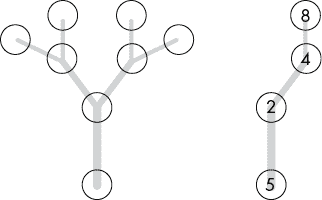
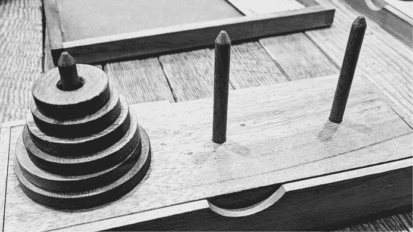
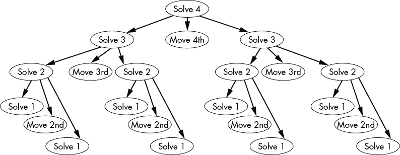
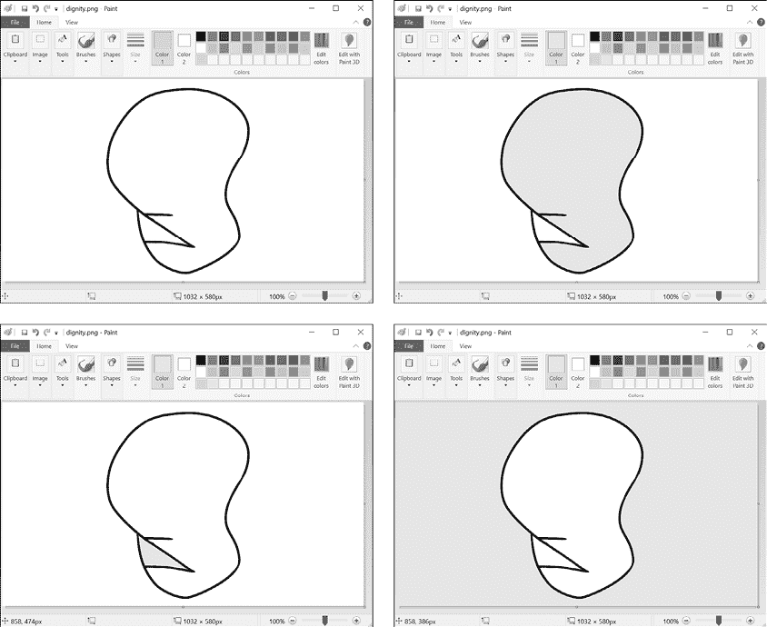

# 三、经典递归算法

> 原文：[Chapter 3 - Classic Recursion Algorithms](https://inventwithpython.com/recursion/chapter3.html)
> 
> 译者：[飞龙](https://github.com/wizardforcel)
> 
> 协议：[CC BY-NC-SA 4.0](https://creativecommons.org/licenses/by-nc-sa/4.0/)


如果你上了计算机科学课，递归单元肯定会涵盖本章介绍的一些经典算法。编码面试（由于缺乏合适的评估候选人的方法，通常抄袭大一计算机科学课程笔记）也可能涉及到它们。本章介绍了递归中的六个经典问题以及它们的解决方案。

我们首先介绍三个简单的算法：对数组中的数字求和、反转文本字符串以及检测字符串是否为回文。然后我们探讨解决汉诺塔难题的算法，实现泛洪填充绘图算法，并解决荒谬的递归 Ackermann 函数。

在这个过程中，你将学习到递归函数参数中的头尾技术。当尝试提出递归解决方案时，我们还会问自己三个问题：什么是基本情况？递归函数调用传递了什么参数？递归函数调用传递的参数如何接近基本情况？随着经验的增加，回答这些问题应该会更加自然。

## 对数组中的数字求和

我们的第一个例子很简单：给定一个整数列表（在 Python 中）或一个整数数组（在 JavaScript 中），返回所有整数的总和。例如，像`sum([5, 2, 4, 8])`这样的调用应该返回`19`。

这个问题用循环很容易解决，但用递归解决需要更多的思考。在阅读第二章之后，你可能也会注意到这个算法与递归的能力不够匹配，无法证明递归的复杂性。然而，在编码面试中，对数组中的数字求和（或者基于线性数据结构处理数据的其他计算）是一个常见的递归问题，值得我们关注。

为了解决这个问题，让我们来看看实现递归函数的*头尾技术*。这个技术将递归函数的数组参数分成两部分：*头*（数组的第一个元素）和*尾*（包括第一个元素之后的所有内容的新数组）。我们定义递归的`sum()`函数来通过将头部添加到尾部数组的总和来找到数组参数的整数的总和。为了找出尾部数组的总和，我们将其递归地作为数组参数传递给`sum()`。

因为尾部数组比原始数组参数少一个元素，所以我们最终将调用递归函数并传递一个空数组。空数组参数很容易求和，不需要更多的递归调用；它只是`0`。根据这些事实，我们对三个问题的答案如下：

1.  什么是基本情况？一个空数组，其和为`0`。

1.  递归函数调用传递了什么参数？原始数字数组的尾部，比原始数组参数少一个数字。

1.  这个参数如何变得更接近基本情况？数组参数每次递归调用都会减少一个元素，直到变成长度为零的空数组。

这是`sumHeadTail.py`，一个用于对数字列表求和的 Python 程序：

**Python**

```py
def sum(numbers):
    if len(numbers) == 0: # BASE CASE
        return 0 # ❶
    else: # RECURSIVE CASE
        head = numbers[0] # ❷
        tail = numbers[1:] # ❸
        return head + sum(tail) # ❹

nums = [1, 2, 3, 4, 5]
print('The sum of', nums, 'is', sum(nums))
nums = [5, 2, 4, 8]
print('The sum of', nums, 'is', sum(nums))
nums = [1, 10, 100, 1000]
print('The sum of', nums, 'is', sum(nums))
```

这是等效的 JavaScript 程序`sumHeadTail.html`：

**JavaScript**

```js
<script type="text/javascript">
function sum(numbers) {
    if (numbers.length === 0) { // BASE CASE
        return 0; // ❶
    } else { // RECURSIVE CASE
        let head = numbers[0]; // ❷
        let tail = numbers.slice(1, numbers.length); // ❸
        return head + sum(tail); // ❹
    }
}

let nums = [1, 2, 3, 4, 5];
document.write('The sum of ' + nums + ' is ' + sum(nums) + "<br />");
nums = [5, 2, 4, 8];
document.write('The sum of ' + nums + ' is ' + sum(nums) + "<br />");
nums = [1, 10, 100, 1000];
document.write('The sum of ' + nums + ' is ' + sum(nums) + "<br />");
</script>
```

这些程序的输出如下所示：

```py
The sum of [1, 2, 3, 4, 5] is 15
The sum of [5, 2, 4, 8] is 19
The sum of [1, 10, 100, 1000] is 1111
```

当使用空数组参数调用时，我们的函数的基本情况简单地返回`0`❶。在递归情况中，我们从原始的`numbers`参数中形成头❷和尾部❸。请记住，`tail`的数据类型是一个数字数组，就像`numbers`参数一样。但是`head`的数据类型只是一个单一的数字值，而不是一个带有一个数字值的数组。`sum()`函数的返回值也是一个单一的数字值，而不是一个数字数组；这就是为什么我们可以在递归情况中将`head`和`sum(tail)`相加❹。

每次递归调用都将一个越来越小的数组传递给`sum()`，使其更接近空数组的基本情况。例如，图 3-1 显示了对`sum([5, 2, 4, 8])`的调用堆栈的状态。

在这个图中，堆栈中的每张卡片代表一个函数调用。每张卡片的顶部是函数名和调用时传递的参数。其下是局部变量：`numbers`参数，以及在调用过程中创建的`head`和`tail`局部变量。卡片底部是函数调用返回的`head + sum(tail)`表达式。当创建一个新的递归函数时，一个新的卡片被推到堆栈上。当函数调用返回时，顶部的卡片从堆栈中弹出。

![一系列代表调用堆栈上的帧对象的卡片堆叠。依次，新的顶部卡片代表对 sum()传递[5, 2, 4, 8]的调用，然后传递[2, 4, 8]，然后传递[4, 8]，然后传递[8]，然后传递一个空列表。然后顶部卡片被移除，首先移除空列表卡片，然后[8]卡片，然后[4, 8]卡片，然后[2, 4, 8]卡片，然后[5, 2, 4, 8]卡片。](img/f03001.png)

图 3-1：当运行`sum([5, 2, 4, 8])`时调用堆栈的状态

我们可以使用`sum()`函数作为应用头尾技术到其他递归函数的模板。例如，你可以将`sum()`函数从对数字数组求和的函数更改为`concat()`函数，用于将字符串数组连接在一起。基本情况将返回一个空字符串作为空数组参数，而递归情况将返回头字符串与传递尾部的递归调用的返回值连接在一起。

回想一下第二章，递归特别适用于涉及树状结构和回溯的问题。数组、字符串或其他线性数据结构可以被视为树状结构，尽管这是一个只有一个分支的树，就像图 3-2 中所示的那样。



图 3-2：一个`[5, 2, 4, 8]`数组（右侧）就像一个只有一个分支的树状数据结构（左侧）。

我们的递归函数不必要的关键“告诉”是它从不在处理的数据上进行任何回溯。它对数组中的每个元素进行单次遍历，这是基本循环可以完成的事情。此外，Python 递归求和函数比直接迭代算法慢大约 100 倍。即使性能不是问题，递归`sum()`函数如果传递一个要求求和的数目为数万的列表会导致堆栈溢出。递归是一种高级技术，但并不总是最佳方法。

在第五章中，我们将研究使用分而治之策略的递归求和函数，在第八章中，我们将研究使用尾调用优化的递归函数。这些替代的递归方法解决了本章中求和函数的一些问题。

## 反转字符串

像对数组中的数字求和一样，反转字符串是另一个经常被引用的递归算法，尽管迭代解决方案很简单。因为字符串本质上是一个由单个字符组成的数组，所以我们将为我们的`rev()`函数采用头部和尾部的方法，就像我们为求和算法所做的那样。

让我们从可能的最小的字符串开始。一个空字符串和一个单字符字符串已经是它们自己的反转。这自然形成了我们的基本情况：如果字符串参数是`''`或`′A′`这样的字符串，我们的函数应该简单地返回字符串参数。

对于更长的字符串，让我们尝试将字符串分割成头部（仅为第一个字符）和尾部（第一个字符之后的所有字符）。对于一个两个字符的字符串，比如`′XY′`，`′X′`是头部，`′Y′`是尾部。要反转字符串，我们需要将头部放在尾部后面：`′YX′`。

这个算法对更长的字符串有效吗？要反转像`′CAT′`这样的字符串，我们会将它分成头部`′C′`和尾部`′AT′`。但仅仅将头部放在尾部后面并不能反转字符串；它给我们的是`′ATC′`。实际上，我们想要做的是将头部放在尾部的*反转*后面。换句话说，`′AT′`会反转成`′TA′`，然后将头部添加到末尾会产生反转后的字符串`′TAC′`。

我们如何反转尾部？嗯，我们可以递归调用`rev()`并将尾部传递给它。暂时忘记我们函数的实现，专注于它的输入和输出：`rev()`接受一个字符串参数，并返回一个将参数的字符反转的字符串。

考虑如何实现像`rev()`这样的递归函数可能很困难，因为它涉及到一个鸡和蛋的问题。为了编写`rev()`的递归情况，我们需要调用一个反转字符串的函数，也就是`rev()`。只要我们对我们的递归函数的参数和返回值有一个坚实的理解，我们就可以使用“信任飞跃”技术来解决这个鸡和蛋问题，即使我们还没有完成编写它。

在递归中进行信任飞跃并不是一个可以保证您的代码无错误的神奇技术。它只是一种观点，可以打破您在思考如何实现递归函数时可能遇到的心理程序员障碍。信任飞跃要求您对递归函数的参数和返回值有坚定的理解。

请注意，信任飞跃技术只有在编写递归情况时才有帮助。您必须将一个接近基本情况的参数传递给递归调用。您不能简单地传递递归函数接收到的相同参数，就像这样：

```py
def rev(theString):
    return rev(theString) # This won't magically work.
```

继续我们的`′CAT′`例子，当我们将尾部`′AT′`传递给`rev()`时，在*那个*函数调用中，头部是`′A′`，尾部是`′T′`。我们已经知道单个字符字符串的反转就是它自己；这是我们的基本情况。因此，对`rev()`的第二次调用将`′AT′`反转为`′TA′`，这正是之前对`rev()`的调用所需要的。图 3-3 显示了在所有对`rev()`的递归调用期间调用堆栈的状态。

让我们问`rev()`函数的三个递归算法问题：

1.  基本情况是什么？零个或一个字符的字符串。

1.  递归函数调用传递了什么参数？原始字符串参数的尾部，比原始字符串参数少一个字符。

1.  这个参数如何变得更接近基本情况？每次递归调用时，数组参数都会减少一个元素，直到成为一个零长度的数组。


图 3-3：`rev()`函数反转`CAT`字符串时调用堆栈的状态

这是一个用于反转字符串的 Python 程序`reverseString.py`：

**Python**

```py
def rev(theString):
    if len(theString) == 0 or len(theString) == 1: # ❶
        # BASE CASE
        return theString
    else:
        # RECURSIVE CASE
        head = theString[0] # ❷
        tail = theString[1:] # ❸
        return rev(tail) + head # ❹

print(rev('abcdef'))
print(rev('Hello, world!'))
print(rev(''))
print(rev('X'))
```

这是`reverseString.html`中等效的 JavaScript 代码：

**JavaScript**

```js
<script type="text/javascript">
function rev(theString) {
    if (theString.length === 0 || theString.length === 1) { // ❶
        // BASE CASE
        return theString;
    } else {
        // RECURSIVE CASE
        var head = theString[0]; // ❷
        var tail = theString.substring(1, theString.length); // ❸
   return rev(tail) + head; // ❹
    }
}

document.write(rev("abcdef") + "<br />");
document.write(rev("Hello, world!") + "<br />");
document.write(rev("") + "<br />");
document.write(rev("X") + "<br />");
</script>
```

这些程序的输出如下：

```py
fedcba
!dlrow ,olleH

X
```

我们的递归函数`rev()`返回与参数`theString`相反的字符串。让我们考虑最简单的字符串进行反转：空字符串和单个字符字符串会“反转”成它们自己。这是我们将开始的两个基本情况（尽管我们将它们与`or`或`||`布尔运算符结合在一起）。对于递归情况，我们从`theString`中的第一个字符形成`head`，从第一个字符之后的每个字符形成`tail`。然后递归情况返回`tail`的反转，后跟`head`字符。

## 检测回文

*回文*是一个正向和反向拼写相同的单词或短语。*Level*、*race car*、*taco cat*和*a man, a plan, a canal . . . Panama*都是回文的例子。如果您想要检测一个字符串是否是回文，您可以编写一个递归的`isPalindrome()`函数。

基本情况是零个或一个字符的字符串，根据其性质，无论是正向还是反向，它总是相同的。我们将使用类似于头尾技术的方法，只是我们将把字符串参数分成头部、中间和尾部字符串。如果头部和尾部字符相同，并且中间字符也形成回文，那么字符串就是回文。递归来自将中间字符串传递给`isPalindrome()`。

让我们问`isPalindrome()`函数的三个递归算法问题：

1.  基本情况是什么？零个或一个字符的字符串，它返回`True`，因为它总是一个回文。

1.  递归函数调用传递了什么参数？字符串参数的中间字符。

1.  这个参数如何变得更接近基本情况？每次递归调用时，字符串参数都会减少两个字符，直到成为零个或一个字符的字符串。

这是一个用于检测回文的 Python 程序`palindrome.py`：

**Python**

```py
def isPalindrome(theString):
    if len(theString) == 0 or len(theString) == 1:
        # BASE CASE
        return True
    else:
        # RECURSIVE CASE
        head = theString[0] # ❶
        middle = theString[1:-1] # ❷
        last = theString[-1] # ❸
        return head == last and isPalindrome(middle) # ❹

text = 'racecar'
print(text + ' is a palindrome: ' + str(isPalindrome(text)))
text = 'amanaplanacanalpanama'
print(text + ' is a palindrome: ' + str(isPalindrome(text)))
text = 'tacocat'
print(text + ' is a palindrome: ' + str(isPalindrome(text)))
text = 'zophie'
print(text + ' is a palindrome: ' + str(isPalindrome(text)))
```

以下是`palindrome.html`中等效的 JavaScript 代码：

**JavaScript**

```js
<script type="text/javascript">
function isPalindrome(theString) {
    if (theString.length === 0 || theString.length === 1) {
        // BASE CASE
        return true;
    } else {
        // RECURSIVE CASE
        var head = theString[0]; // ❶
        var middle = theString.substring(1, theString.length -1); // ❷
        var last = theString[theString.length - 1]; // ❸
        return head === last && isPalindrome(middle); // ❹
    }
}

text = "racecar";
document.write(text + " is a palindrome: " + isPalindrome(text) + "<br />");
text = "amanaplanacanalpanama";
document.write(text + " is a palindrome: " + isPalindrome(text) + "<br />");
text = "tacocat";
document.write(text + " is a palindrome: " + isPalindrome(text) + "<br />");
text = "zophie";
document.write(text + " is a palindrome: " + isPalindrome(text) + "<br />");
</script>
```

这些程序的输出如下：

```py
racecar is a palindrome: True
amanaplanacanalpanama is a palindrome: True
tacocat is a palindrome: True
zophie is a palindrome: False
```

基本情况返回`True`，因为零个或一个字符的字符串总是回文。否则，字符串参数被分成三部分：第一个字符❶，最后一个字符❸，以及它们之间的中间字符❷。

递归情况下的`return`语句❹利用了*布尔短路*，这是几乎所有编程语言的特性。在使用`and`或`&&`布尔运算符连接的表达式中，如果左侧表达式为`False`，则右侧表达式是`True`还是`False`都无所谓，因为整个表达式都将是`False`。布尔短路是一种优化，如果左侧为`False`，则跳过`and`运算符的右侧表达式的评估。因此，在表达式`head == last and isPalindrome(middle)`中，如果`head == last`为`False`，则递归调用`isPalindrome()`将被跳过。这意味着一旦头部和尾部字符串不匹配，递归就会停止并简单地返回`False`。

这个递归算法仍然是顺序的，就像前面章节中的求和和反转字符串函数一样，只是不是从数据的开始到结束，而是从数据的两端向中间移动。使用简单循环的迭代版本更加直接。我们在本书中介绍递归版本，因为这是一个常见的编码面试问题。

## 解决汉诺塔

汉诺塔是一个涉及堆叠的塔的难题。难题以最大的圆盘在底部开始，圆盘尺寸逐渐减小。每个圆盘的中心都有一个孔，这样圆盘可以在杆上相互堆叠。图 3-4 显示了一个木制的汉诺塔难题。



图 3-4：木制汉诺塔难题套装

要解决这个难题，玩家必须遵循三条规则将圆盘从一根杆移动到另一根杆： 

+   玩家一次只能移动一个圆盘。

+   玩家只能将圆盘移动到塔的顶部或从塔的顶部移动。

+   玩家永远不能将较大的圆盘放在较小的圆盘上。

Python 的内置`turtledemo`模块有一个汉诺塔演示，您可以通过在 Windows 上运行`python -m turtledemo`或在 macOS/Linux 上运行`python3 -m turtledemo`，然后从示例菜单中选择**minimum_hanoi**来查看。汉诺塔动画也可以通过互联网搜索轻松找到。

解决汉诺塔难题的递归算法并不直观。让我们从最小的情况开始：一个只有一个圆盘的汉诺塔。解决方案很简单：将圆盘移动到另一个杆上，然后完成。解决两个圆盘的情况稍微复杂一些：将较小的圆盘移动到一个杆上（我们称之为*临时杆*），将较大的圆盘移动到另一个杆上（我们称之为*结束杆*），最后将较小的圆盘从临时杆移动到结束杆。现在两个圆盘按正确顺序放在结束杆上。

一旦解决了三个圆盘的塔，你会发现出现了一个模式。要解决从起始杆到结束杆的*n*个圆盘的塔，必须执行以下操作：

1.  通过将这些圆盘从起始杆移动到临时杆来解决*n* - 1 个圆盘的难题。

1.  将第*n*个圆盘从起始杆移动到结束杆。

1.  通过将这些圆盘从临时杆移动到结束杆来解决*n* - 1 个圆盘的难题。

就像斐波那契算法一样，汉诺塔算法的递归情况不是只做一次递归调用，而是做两次。如果我们画出一个解决四个盘子汉诺塔问题的操作的树形图，它看起来像图 3-6。解决四个盘子的难题需要与解决三个盘子的难题相同的步骤，以及移动第四个盘子和再次执行解决三个盘子难题的步骤。同样，解决三个盘子的难题需要与解决两个盘子的难题相同的步骤，再加上移动第三个盘子，依此类推。解决一个盘子的难题是微不足道的基本情况：它只涉及移动盘子。

图 3-5 中的树状结构暗示了递归方法对于解决汉诺塔难题是理想的。在这棵树中，执行从上到下，从左到右移动。

虽然对于人类来说，解决三个盘子或四个盘子的汉诺塔很容易，但是盘子数量的增加需要指数级增加的操作次数才能完成。对于*n*个盘子，至少需要 2*n* - 1 次移动才能解决。这意味着 31 个盘子的塔需要超过十亿次移动才能完成！



图 3-5：解决四个盘子汉诺塔的一系列操作

让我们为创建递归解决方案提出三个问题：

1.  基本情况是什么？解决一个盘子的塔。

1.  传递给递归函数调用的参数是什么？解决一个比当前大小小一个盘子的塔。

1.  这个参数如何变得更接近基本情况？要解决的塔的大小每递归调用一次减少一个盘子，直到它是一个只有一个盘子的塔。

以下的`towerOfHanoiSolver.py`程序解决了汉诺塔难题，并显示了每一步的可视化：

```py
import sys

# Set up towers A, B, and C. The end of the list is the top of the tower.
  TOTAL_DISKS = 6 ❶

# Populate Tower A:
  TOWERS = {'A': list(reversed(range(1, TOTAL_DISKS + 1))), ❷
          'B': [],
          'C': []}

def printDisk(diskNum):
    # Print a single disk of width diskNum.
    emptySpace = ' ' * (TOTAL_DISKS - diskNum)
    if diskNum == 0:
        # Just draw the pole.
        sys.stdout.write(emptySpace + '||' + emptySpace)
    else:
        # Draw the disk.
        diskSpace = '@' * diskNum
        diskNumLabel = str(diskNum).rjust(2, '_')
        sys.stdout.write(emptySpace + diskSpace + diskNumLabel + diskSpace + emptySpace)

def printTowers():
    # Print all three towers.
 for level in range(TOTAL_DISKS, -1, -1):
        for tower in (TOWERS['A'], TOWERS['B'], TOWERS['C']):
            if level >= len(tower):
                printDisk(0)
            else:
                printDisk(tower[level])
        sys.stdout.write('\n')
    # Print the tower labels A, B, and C.
    emptySpace = ' ' * (TOTAL_DISKS)
    print('%s A%s%s B%s%s C\n' % (emptySpace, emptySpace, emptySpace, emptySpace, emptySpace))

def moveOneDisk(startTower, endTower):
    # Move the top disk from startTower to endTower.
    disk = TOWERS[startTower].pop()
    TOWERS[endTower].append(disk)

def solve(numberOfDisks, startTower, endTower, tempTower):
    # Move the top numberOfDisks disks from startTower to endTower.
    if numberOfDisks == 1:
        # BASE CASE
        moveOneDisk(startTower, endTower) ❸
        printTowers()
        return
    else:
        # RECURSIVE CASE
        solve(numberOfDisks - 1, startTower, tempTower, endTower) ❹
        moveOneDisk(startTower, endTower) ❺
        printTowers()
        solve(numberOfDisks - 1, tempTower, endTower, startTower) ❻
        return

# Solve:
printTowers()
solve(TOTAL_DISKS, 'A', 'B', 'C')

# Uncomment to enable interactive mode:
#while True:
#    printTowers()
#    print('Enter letter of start tower and the end tower. (A, B, C) Or Q to quit.')
#    move = input().upper()
#    if move == 'Q':
#        sys.exit()
#    elif move[0] in 'ABC' and move[1] in 'ABC' and move[0] != move[1]:
#        moveOneDisk(move[0], move[1])
```

这个`towerOfHanoiSolver.html`程序包含了等效的 JavaScript 代码：

```js
<script type="text/javascript">
// Set up towers A, B, and C. The end of the array is the top of the tower.
  var TOTAL_DISKS = 6; // ❶
  var TOWERS = {"A": [], // ❷
              "B": [],
              "C": []};

// Populate Tower A:
for (var i = TOTAL_DISKS; i > 0; i--) {
    TOWERS["A"].push(i);
}

function printDisk(diskNum) {
    // Print a single disk of width diskNum.
    var emptySpace = " ".repeat(TOTAL_DISKS - diskNum);
    if (diskNum === 0) {
        // Just draw the pole.
        document.write(emptySpace + "||" + emptySpace);
    } else {
        // Draw the disk.
        var diskSpace = "@".repeat(diskNum);
        var diskNumLabel = String("___" + diskNum).slice(-2);
        document.write(emptySpace + diskSpace + diskNumLabel + diskSpace + emptySpace);
    }
}

function printTowers() {
    // Print all three towers.
    var towerLetters = "ABC";
    for (var level = TOTAL_DISKS; level >= 0; level--) {
        for (var towerLetterIndex = 0; towerLetterIndex < 3; towerLetterIndex++) {
            var tower = TOWERS[towerLetters[towerLetterIndex]];
            if (level >= tower.length) {
                printDisk(0);
            } else {
                printDisk(tower[level]);
            }
        }
        document.write("<br />");
    }
    // Print the tower labels A, B, and C.
    var emptySpace = " ".repeat(TOTAL_DISKS);
    document.write(emptySpace + " A" + emptySpace + emptySpace +
" B" + emptySpace + emptySpace + " C<br /><br />");
}

function moveOneDisk(startTower, endTower) {
    // Move the top disk from startTower to endTower.
    var disk = TOWERS[startTower].pop();
    TOWERS[endTower].push(disk);
}

function solve(numberOfDisks, startTower, endTower, tempTower) {
    // Move the top numberOfDisks disks from startTower to endTower.
    if (numberOfDisks == 1) {
        // BASE CASE
        moveOneDisk(startTower, endTower); ❸
        printTowers();
        return;
    } else {
        // RECURSIVE CASE
        solve(numberOfDisks - 1, startTower, tempTower, endTower); ❹
 moveOneDisk(startTower, endTower); ❺
        printTowers();
        solve(numberOfDisks - 1, tempTower, endTower, startTower); ❻
        return;
    }
}

// Solve:
document.write("<pre>");
printTowers();
solve(TOTAL_DISKS, "A", "B", "C");
document.write("</pre>");
</script>
```

当您运行此代码时，输出显示了每个盘子的移动，直到整个塔从 A 塔移动到 B 塔为止：

```py
      ||            ||            ||      
     @_1@           ||            ||      
    @@_2@@          ||            ||      
   @@@_3@@@         ||            ||      
  @@@@_4@@@@        ||            ||      
 @@@@@_5@@@@@       ||            ||      
@@@@@@_6@@@@@@      ||            ||      
       A             B             C

      ||            ||            ||      
      ||            ||            ||      
    @@_2@@          ||            ||      
   @@@_3@@@         ||            ||      
  @@@@_4@@@@        ||            ||      
 @@@@@_5@@@@@       ||            ||      
@@@@@@_6@@@@@@      ||           @_1@     
       A             B             C
--snip--
      ||            ||            ||      
      ||            ||            ||      
      ||            ||            ||      
      ||            ||            ||      
      ||          @@_2@@          ||      
     @_1@        @@@_3@@@         ||      
@@@@@@_6@@@@@@  @@@@_4@@@@   @@@@@_5@@@@@ 
--snip--
       A             B             C
      ||            ||            ||      
      ||           @_1@           ||      
      ||          @@_2@@          ||      
      ||         @@@_3@@@         ||      
      ||        @@@@_4@@@@        ||      
      ||       @@@@@_5@@@@@       ||      
      ||      @@@@@@_6@@@@@@      ||      
       A             B             C
```

Python 版本也有交互模式，您可以在`towerOfHanoiSolver.py`的末尾取消注释代码行以玩交互版本。

您可以通过将程序顶部的`TOTAL_DISKS`常量❶设置为`1`或`2`来从较小的情况开始运行程序。在我们的程序中，Python 中的整数列表和 JavaScript 中的整数数组表示一个柱子。整数表示一个盘子，较大的整数表示较大的盘子。列表或数组的起始整数在柱子的底部，结束整数在柱子的顶部。例如，`[6, 5, 4, 3, 2, 1]`表示具有六个盘子的起始柱子，最大的盘子在底部，而`[]`表示没有盘子的柱子。`TOWERS`变量包含这三个列表❷。

基本情况只是将最小的盘子从起始柱移动到结束柱❸。*n*个盘子的递归情况执行三个步骤：解决*n* - 1 的情况❹，移动第*n*个盘子❺，然后再次解决*n* - 1 的情况❻。

## 使用泛洪填充

图形程序通常使用*泛洪填充算法*来填充任意形状的相同颜色区域为另一种颜色。图 3-6 显示了左上角的一个这样的形状。随后的面板显示了用灰色填充的形状的三个不同部分。泛洪填充从一个白色像素开始，一直扩散，直到遇到非白色像素，填充封闭空间。

泛洪填充算法是递归的：它从将单个像素更改为新颜色开始。然后在具有相同旧颜色的像素的任何邻居上调用递归函数。然后移动到邻居的邻居，依此类推，将每个像素转换为新颜色，直到填充封闭空间。

基本情况是像素的颜色是图像的边缘，或者不是旧颜色。由于达到基本情况是停止图像中每个像素的递归调用“传播”的唯一方法，因此该算法具有将所有连续像素从旧颜色更改为新颜色的紧急行为。

让我们问一下关于`floodFill()`函数的三个递归算法问题：

1.  什么是基本情况？当 x 和 y 坐标是不是旧颜色的像素，或者在图像的边缘时。

1.  递归函数调用传递了哪些参数？当前像素的四个相邻像素的 x 和 y 坐标是四个递归调用的参数。

1.  这些参数如何接近基本情况？相邻像素的颜色与旧颜色或图像边缘不同。无论哪种情况，最终算法都会用完要检查的像素。



图 3-6：图形编辑器中的原始形状（左上角）和填充了三个不同区域的相同形状，颜色为浅灰色

我们的示例程序不是图像，而是使用单字符字符串列表来形成文本字符的 2D 网格，以表示“图像”。每个字符串代表一个“像素”，特定字符代表“颜色”。`floodfill.py` Python 程序实现了泛洪填充算法、图像数据和一个在屏幕上打印图像的函数：

**Python**

```py
import sys

# Create the image (make sure it's rectangular!)
im = [list('..########################...........'), # ❶
      list('..#......................#...#####...'),
      list('..#..........########....#####...#...'),
      list('..#..........#......#............#...'),
      list('..#..........########.........####...'),
      list('..######......................#......'),
      list('.......#..#####.....###########......'),
      list('.......####...#######................')]

HEIGHT = len(im)
WIDTH = len(im[0])

def floodFill(image, x, y, newChar, oldChar=None):
    if oldChar == None:
        # oldChar defaults to the character at x, y.
        oldChar = image[y][x] # ❷
    if oldChar == newChar or image[y][x] != oldChar:
        # BASE CASE
        return

    image[y][x] = newChar # Change the character.

    # Uncomment to view each step:
    #printImage(image)

    # Change the neighboring characters.
    if y + 1 < HEIGHT and image[y + 1][x] == oldChar:
        # RECURSIVE CASE
        floodFill(image, x, y + 1, newChar, oldChar) # ❸
    if y - 1 >= 0 and image[y - 1][x] == oldChar:
        # RECURSIVE CASE
        floodFill(image, x, y - 1, newChar, oldChar) # ❹
    if x + 1 < WIDTH and image[y][x + 1] == oldChar:
        # RECURSIVE CASE
        floodFill(image, x + 1, y, newChar, oldChar) # ❺
    if x - 1 >= 0 and image[y][x - 1] == oldChar:
        # RECURSIVE CASE
        floodFill(image, x - 1, y, newChar, oldChar) # ❻
    return # BASE CASE # ❼

def printImage(image):
    for y in range(HEIGHT):
        # Print each row.
        for x in range(WIDTH):
            # Print each column.
            sys.stdout.write(image[y][x])
        sys.stdout.write('\n')
    sys.stdout.write('\n')

printImage(im)
floodFill(im, 3, 3, 'o')
printImage(im)
```

`floodfill.html`程序包含了等效的 JavaScript 代码：

**JavaScript**

```js
<script type="text/javascript">
// Create the image (make sure it's rectangular!)
var im = ["..########################...........".split(""), // ❶
          "..#......................#...#####...".split(""),
          "..#..........########....#####...#...".split(""),
          "..#..........#......#............#...".split(""),
          "..#..........########.........####...".split(""),
          "..######......................#......".split(""),
          ".......#..#####.....###########......".split(""),
          ".......####...#######................".split("")];

var HEIGHT = im.length;
var WIDTH = im[0].length;

function floodFill(image, x, y, newChar, oldChar) {
    if (oldChar === undefined) {
        // oldChar defaults to the character at x, y.
        oldChar = image[y][x]; // ❷
    }
    if ((oldChar == newChar) || (image[y][x] != oldChar)) {
        // BASE CASE
        return;
    }

    image[y][x] = newChar; // Change the character.

    // Uncomment to view each step:
    //printImage(image);

    // Change the neighboring characters.
    if ((y + 1 < HEIGHT) && (image[y + 1][x] == oldChar)) {
        // RECURSIVE CASE
        floodFill(image, x, y + 1, newChar, oldChar); // ❸
    }
    if ((y - 1 >= 0) && (image[y - 1][x] == oldChar)) {
        // RECURSIVE CASE
        floodFill(image, x, y - 1, newChar, oldChar); // ❹
    }
    if ((x + 1 < WIDTH) && (image[y][x + 1] == oldChar)) {
        // RECURSIVE CASE
        floodFill(image, x + 1, y, newChar, oldChar); // ❺
    }
    if ((x - 1 >= 0) && (image[y][x - 1] == oldChar)) {
        // RECURSIVE CASE
        floodFill(image, x - 1, y, newChar, oldChar); // ❻
    }
    return; // BASE CASE # ❼
}

function printImage(image) {
    document.write("<pre>");
    for (var y = 0; y < HEIGHT; y++) {
        // Print each row.
        for (var x = 0; x < WIDTH; x++) {
            // Print each column.
            document.write(image[y][x]);
        }
        document.write("\n");
    }
    document.write("\n</ pre>");
}

printImage(im);
floodFill(im, 3, 3, "o");
printImage(im);
</script>
```

当运行此代码时，程序从坐标 3,3 开始填充由`#`字符绘制的形状的内部。它用`o`字符替换所有句号字符(`.`)。以下输出显示了之前和之后的图像：

```py
..########################...........
..#......................#...#####...
..#..........########....#####...#...
..#..........#......#............#...
..#..........########.........####...
..######......................#......
.......#..#####.....###########......
.......####...#######................

..########################...........
..#oooooooooooooooooooooo#...#####...
..#oooooooooo########oooo#####ooo#...
..#oooooooooo#......#oooooooooooo#...
..#oooooooooo########ooooooooo####...
..######oooooooooooooooooooooo#......
.......#oo#####ooooo###########......
.......####...#######................
```

如果要查看泛洪填充算法在填充新字符时的每一步，请取消注释`floodFill()`函数中的`printImage(image)`行❶，然后再次运行程序。

图像由一个字符串字符的 2D 数组表示。我们可以将这个`image`数据结构、一个`x`坐标和一个`y`坐标以及一个新字符传递给`floodFill()`函数。函数会注意当前在`x`和`y`坐标处的字符，并将其保存到`oldChar`变量中❷。

如果`image`中坐标`x`和`y`处的当前字符与`oldChar`不同，这是我们的基本情况，函数就简单地返回。否则，函数继续进行四个递归情况：传递当前坐标的底部❸、顶部❹、右侧❺和左侧❻邻居的 x 和 y 坐标。在进行了这四个潜在的递归调用之后，函数的结尾是一个隐式的基本情况，在我们的程序中通过`return`语句❼明确表示。

泛洪填充算法不一定要是递归的。对于大图像，递归函数可能会导致堆栈溢出。如果我们使用循环和堆栈来实现泛洪填充，堆栈将以起始像素的 x 和 y 坐标开始。循环中的代码将弹出堆栈顶部的坐标，如果该坐标的像素与`oldChar`匹配，它将推送四个相邻像素的坐标。当堆栈为空时，因为基本情况不再将邻居推送到堆栈中，循环就结束了。

然而，泛洪填充算法不一定要使用堆栈。先进后出堆栈的推送和弹出对于回溯行为是有效的，但在泛洪填充算法中处理像素的顺序可以是任意的。这意味着我们同样可以有效地使用一个随机删除元素的集合数据结构。你可以在[`nostarch.com/recursive-book-recursion`](https://nostarch.com/recursive-book-recursion)的可下载资源中找到这些迭代泛洪填充算法的实现，分别是 `floodFillIterative.py` 和 `floodFillIterative.html`。

## 使用 Ackermann 函数

*Ackermann 函数* 是以其发现者威廉·阿克曼命名的。数学家大卫·希尔伯特的学生（我们在第九章讨论的希尔伯特曲线分形），阿克曼于 1928 年发表了他的函数。数学家罗莎·彼得和拉斐尔·罗宾逊后来开发了本节中所介绍的函数的版本。

虽然 Ackermann 函数在高等数学中有一些应用，但它主要以高度递归函数的例子而闻名。即使是对其两个整数参数的轻微增加也会导致其递归调用次数大幅增加。

Ackermann 函数接受两个参数 `m` 和 `n`，并且当 `m` 为 `0` 时有一个基本情况，返回 `n + 1`。有两种递归情况：当 `n` 为 `0` 时，函数返回 `ackermann(m - 1, 1)`，当 `n` 大于 `0` 时，函数返回 `ackermann(m - 1, ackermann(m, n - 1))`。这些情况可能对你来说没有意义，但可以说，Ackermann 函数的递归调用次数增长得很快。调用 `ackermann(1, 1)` 会导致三次递归函数调用。调用 `ackermann(2, 3)` 会导致 43 次递归函数调用。调用 `ackermann(3, 5)` 会导致 42,437 次递归函数调用。调用 `ackermann(5, 7)` 会导致... 好吧，实际上我不知道有多少次递归函数调用，因为这将需要计算几倍于宇宙年龄的时间。

让我们回答构建递归算法时提出的三个问题：

1.  什么是基本情况？当 `m` 为 `0` 时。

1.  递归函数调用传递了什么参数？下一个 `m` 参数传递了要么 `m` 要么 `m - 1`；下一个 `n` 参数传递了 `1`、`n - 1` 或 `ackermann(m, n - 1)` 的返回值。

1.  这些参数如何接近基本情况？`m` 参数总是要么减小，要么保持相同的大小，所以它最终会达到 `0`。

以下是一个 `ackermann.py` Python 程序：

```py
def ackermann(m, n, indentation=None):
    if indentation is None:
        indentation = 0
    print('%sackermann(%s, %s)' % (' ' * indentation, m, n))

    if m == 0:
        # BASE CASE
        return n + 1
    elif m > 0 and n == 0:
        # RECURSIVE CASE
 return ackermann(m - 1, 1, indentation + 1)
    elif m > 0 and n > 0:
        # RECURSIVE CASE
        return ackermann(m - 1, ackermann(m, n - 1, indentation + 1), indentation + 1)

print('Starting with m = 1, n = 1:')
print(ackermann(1, 1))
print('Starting with m = 2, n = 3:')
print(ackermann(2, 3))
```

以下是等效的 `ackermann.html` JavaScript 程序：

```js
<script type="text/javascript">
function ackermann(m, n, indentation) {
    if (indentation === undefined) {
        indentation = 0;
    }
    document.write(" ".repeat(indentation) + "ackermann(" + m + ", " + n + ")\n");

    if (m === 0) {
        // BASE CASE
        return n + 1;
    } else if ((m > 0) && (n === 0)) {
        // RECURSIVE CASE
        return ackermann(m - 1, 1, indentation + 1);
    } else if ((m > 0) && (n > 0)) {
        // RECURSIVE CASE
        return ackermann(m - 1, ackermann(m, n - 1, indentation + 1), indentation + 1);
    }
}

document.write("<pre>");
document.write("Starting with m = 1, n = 1:<br />");
document.write(ackermann(1, 1) + "<br />");
document.write("Starting with m = 2, n = 3:<br />");
document.write(ackermann(2, 3) + "<br />");
document.write("</pre>");
</script>
```

当你运行这段代码时，输出的缩进（由 `indentation` 参数设置）告诉你给定递归函数调用在调用堆栈上的深度：

```py
Starting with m = 1, n = 1:
ackermann(1, 1)
 ackermann(1, 0)
  ackermann(0, 1)
 ackermann(0, 2)
3
Starting with m = 2, n = 3:
ackermann(2, 3)
 ackermann(2, 2)
  ackermann(2, 1)
   ackermann(2, 0)
--snip--
    ackermann(0, 6)
   ackermann(0, 7)
  ackermann(0, 8)
9
```

你也可以尝试 `ackermann(3, 3)`，但任何更大的参数可能需要太长时间来计算。为了加快计算速度，尝试注释掉除了打印 `ackermann()` 的最终返回值之外的所有 `print()` 和 `document.write()` 调用。

请记住，即使像 Ackermann 函数这样的递归算法也可以作为迭代函数实现。迭代 Ackermann 算法在[`nostarch.com/recursive-book-recursion`](https://nostarch.com/recursive-book-recursion)的可下载资源中实现为 `ackermannIterative.py` 和 `ackermannIterative.html`。

## 摘要

本章涵盖了一些经典的递归算法。对于每一个，我们都提出了三个重要的问题，你在设计自己的递归函数时应该总是问的：什么是基本情况？递归函数调用传递了什么参数？这些参数如何接近基本情况？如果它们没有，你的函数将继续递归，直到导致堆栈溢出。

求和、字符串反转和回文检测递归函数都可以很容易地用简单的循环实现。关键的线索是它们都只对给定的数据进行一次遍历，没有回溯。正如第二章所解释的，递归算法特别适用于涉及类似树状结构并需要回溯的问题。

解决汉诺塔难题的树状结构表明它涉及回溯，因为程序执行从树的顶部到底部，从左到右运行。这使得它成为递归的一个主要候选者，特别是因为解决方案需要对较小的塔进行两次递归调用。

洪水填充算法直接适用于图形和绘图程序，以及检测连续区域形状的其他算法。如果你在图形程序中使用了油漆桶工具，你可能使用了洪水填充算法的一个版本。

阿克曼函数是递归函数在输入增加时增长速度之快的一个很好的例子。虽然它在日常编程中没有太多实际应用，但没有讨论递归的讨论是不完整的。但是，就像所有递归函数一样，它可以用循环和栈来实现。

## 进一步阅读

维基百科上有更多关于汉诺塔问题的信息，网址为[`en.wikipedia.org/wiki/Tower_of_Hanoi`](https://en.wikipedia.org/wiki/Tower_of_Hanoi)，而 Computerphile 的视频“Recursion 'Super Power' (in Python)”则介绍了如何在 Python 中解决汉诺塔问题，网址为[`youtu.be/8lhxIOAfDss`](https://youtu.be/8lhxIOAfDss)。3Blue1Brown 的两部视频系列“Binary, Hanoi, and Sierpiński”通过探索汉诺塔、二进制数和谢尔宾斯基三角形分形之间的关系，提供了更详细的信息，网址为[`youtu.be/2SUvWfNJSsM`](https://youtu.be/2SUvWfNJSsM)。

维基百科上有一个关于洪水填充算法在小图像上运行的动画，网址为[`en.wikipedia.org/wiki/Flood_fill`](https://en.wikipedia.org/wiki/Flood_fill)。

Computerphile 的视频“The Most Difficult Program to Compute?”讨论了阿克曼函数，网址为[`youtu.be/i7sm9dzFtEI`](https://youtu.be/i7sm9dzFtEI)。如果你想了解更多关于阿克曼函数在可计算性理论中的地位，Hackers in Cambridge 频道有一个关于原始递归和部分递归函数的五部视频系列，网址为[`youtu.be/yaDQrOUK-KY`](https://youtu.be/yaDQrOUK-KY)。该系列需要观众进行大量的数学思考，但你不需要太多的先前数学知识。

## 练习问题

通过回答以下问题来测试你的理解：

1.  数组或字符串的头部是什么？

1.  数组或字符串的尾部是什么？

1.  本章对每个递归算法提出了哪三个问题？

1.  递归中的信任飞跃是什么？

1.  你在进行递归函数编写之前需要了解什么才能做出信任的飞跃？

1.  线性数据结构（如数组或字符串）如何类似于树状结构？

1.  递归的`sum()`函数是否涉及对其处理的数据的回溯？

1.  在洪水填充程序中，尝试更改`im`变量的字符串，创建一个未完全封闭的*C*形状。当你尝试从*C*的中间进行洪水填充时会发生什么？

1.  回答本章中每个递归算法的三个问题：

1.  基本情况是什么？

1.  递归函数调用传递了什么参数？

1.  这个论点如何接近基本情况？

然后重新创建本章的递归算法，而不查看原始代码。

## 实践项目

为以下每个任务编写一个函数：

1.  使用头尾技术，创建一个递归的`concat()`函数，该函数接受一个字符串数组，并将这些字符串连接成一个字符串返回。例如，`concat(['Hello', 'World'])`应返回`HelloWorld`。

1.  使用头尾技术，创建一个递归的`product()`函数，该函数接受一个整数数组，并返回它们的总乘积。这段代码几乎与本章中的`sum()`函数相同。但是，请注意，只有一个整数的数组的基本情况返回整数，空数组的基本情况返回`1`。

1.  使用泛洪填充算法，计算二维网格中的“房间”或封闭空间的数量。您可以通过创建嵌套的`for`循环，在网格中的每个字符上调用泛洪填充函数（如果是句点），以将句点更改为井字符。例如，以下数据将导致程序在网格中找到六个句点的位置，这意味着有五个房间（以及所有房间之外的空间）。

```py
    ...##########....................................
    ...#........#....####..................##########
    ...#........#....#..#...############...#........#
    ...##########....#..#...#..........#...##.......#
    .......#....#....####...#..........#....##......#
    .......#....#....#......############.....##.....#
    .......######....#........................##....#
    .................####........####..........######
```

