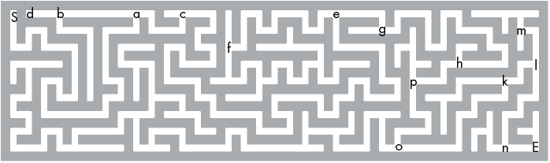
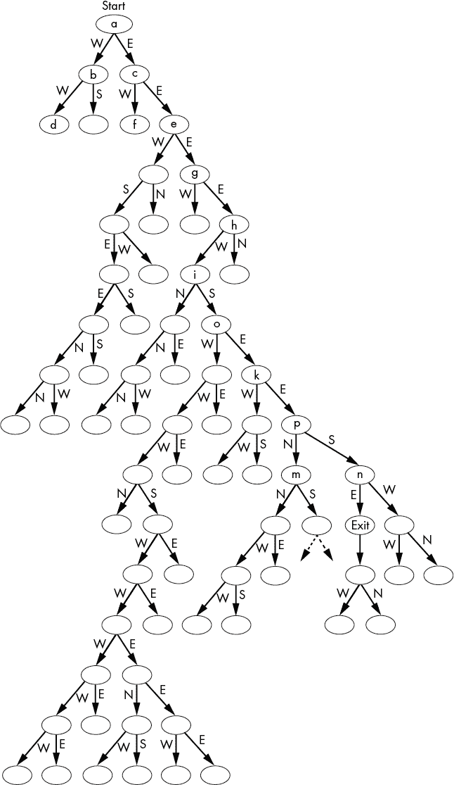

# 四、回溯和树遍历算法

> 原文：[Chapter 4 - Backtracking and Tree Traversal Algorithms](https://inventwithpython.com/recursion/chapter4.html)
> 
> 译者：[飞龙](https://github.com/wizardforcel)
> 
> 协议：[CC BY-NC-SA 4.0](https://creativecommons.org/licenses/by-nc-sa/4.0/)


在前几章中，您已经了解到递归特别适用于涉及树状结构和回溯的问题，例如解迷宫算法。要了解原因，请考虑树干分成多个分支。这些分支本身又分成其他分支。换句话说，树具有递归的、自相似的形状。

迷宫可以用树数据结构表示，因为迷宫分支成不同的路径，这些路径又分成更多的路径。当您到达迷宫的死胡同时，必须回溯到较早的分叉点。

遍历树图的任务与许多递归算法紧密相关，例如本章中的解迷宫算法和第十一章中的迷宫生成程序。我们将研究树遍历算法，并使用它们来在树数据结构中查找特定名称。我们还将使用树遍历算法来获取树中最深的节点的算法。最后，我们将看到迷宫可以表示为树数据结构，并使用树遍历和回溯来找到从迷宫起点到出口的路径。

## 使用树遍历

如果您在 Python 和 JavaScript 中编程，通常会使用列表、数组和字典数据结构。只有在处理特定计算机科学算法的低级细节时，才会遇到树数据结构，例如抽象语法树、优先队列、Adelson-Velsky-Landis（AVL）树等概念，超出了本书的范围。但是，树本身是非常简单的概念。

*树* *数据结构*是由节点组成的数据结构，这些节点通过边连接到其他节点。*节点*包含数据，而*边*表示与另一个节点的关系。节点也称为*顶点*。树的起始节点称为*根*，末端的节点称为*叶子*。树始终只有一个根。

顶部的*父节点*与它们下面的零个或多个*子节点*之间有边。因此，叶子是没有子节点的节点，父节点是非叶节点，子节点是所有非根节点。树中的节点可以有多个子节点。将子节点连接到根节点的父节点也称为子节点的*祖先*。父节点和叶节点之间的子节点称为父节点的*后代*。树中的父节点可以有多个子节点。但是，除了根节点外，每个子节点都只有一个父节点。在树中，任何两个节点之间只能存在一条路径。

图 4-1 显示了一棵树的示例，以及三个不是树的结构示例。

四个图。第一个标有“树”的图有一个 A 节点，有两个子节点 B 和 C；B 有一个子节点 D；C 有两个子节点 E 和 F；E 有两个子节点 G 和 H。第二个图标有“不是树（子节点有多个父节点）”，有一个 A 节点，有两个子节点 B 和 C；B 有两个子节点 D 和 E；C 有两个子节点 E 和 F；E 有两个子节点 G 和 H。第三个图标有“不是树（子节点循环到祖先节点）”，有一个 A 节点，有两个子节点 B 和 C；B 有一个子节点 D；C 有两个子节点 E 和 F；D 有一个子节点 A；E 有两个子节点 G 和 H。第四个图标有“不是树（多个根节点）”，有两个根节点 Z 和 A；Z 有一个子节点 B；A 有两个子节点 B 和 C；B 有一个子节点 D；C 有两个子节点 E 和 F；E 有两个子节点 G 和 H。

图 4-1：一棵树（左）和三个非树的示例

正如你所看到的，子节点必须有一个父节点，不能有创建循环的边，否则该结构将不再被视为树。我们在本章中涵盖的递归算法仅适用于树数据结构。

### Python 和 JavaScript 中的树形数据结构

树形数据结构通常向下生长，根在顶部。图 4-2 显示了使用以下 Python 代码（也是有效的 JavaScript 代码）创建的树：

```py
root  = {'data': 'A', 'children': []}
node2 = {'data': 'B', 'children': []}
node3 = {'data': 'C', 'children': []}
node4 = {'data': 'D', 'children': []}
node5 = {'data': 'E', 'children': []}
node6 = {'data': 'F', 'children': []}
node7 = {'data': 'G', 'children': []}
node8 = {'data': 'H', 'children': []}
root['children'] = [node2, node3]
node2['children'] = [node4]
node3['children'] = [node5, node6]
node5['children'] = [node7, node8]
```

树形图和节点的先序、后序和中序遍历顺序。树的根节点是 A，有两个子节点 B 和 C。B 有一个子节点 D。C 有两个子节点 E 和 F，E 有两个子节点 G 和 H。先序遍历：A，B，D，C，E，G，H，F。后序遍历：D，B，G，H，E，F，C，A。中序遍历：D，B，A，G，E，H，C，F。

图 4-2：根为`A`，叶为`D`，`G`，`H`和`F`的树，以及其遍历顺序

树中的每个节点包含一段数据（从`A`到`H`的字母字符串）和其子节点的列表。图 4-2 中的先序、后序和中序信息将在后续章节中解释。

在这棵树的代码中，每个节点由一个 Python 字典（或 JavaScript 对象）表示，其中键`data`存储节点的数据，键`children`有其他节点的列表。我使用`root`和`node2`到`node8`变量来存储每个节点，并使代码更易读，但这不是必需的。以下 Python/JavaScript 代码等同于前面的代码清单，尽管对人类来说更难阅读：

```py
root = {'data': 'A', 'children': [{'data': 'B', 'children': 
[{'data': 'D', 'children': []}]}, {'data': 'C', 'children': 
[{'data': 'E', 'children': [{'data': 'G', 'children': []}, 
{'data': 'H', 'children': []}]}, {'data': 'F', 'children': []}]}]}
```

图 4-2 中的树是一种特定类型的数据结构，称为*有向无环图*（DAG）。在数学和计算机科学中，*图*是节点和边的集合，树是图的一种。图是*有向*的，因为其边有一个方向：从父节点到子节点。DAG 中的边不是无向的，即双向的。（一般树没有这个限制，可以有双向的边，包括从子节点返回到父节点。）图是*无环*的，因为没有从子节点到其祖先节点的循环，或*循环*；树的“分支”必须保持在同一方向上不断增长。

您可以将列表、数组和字符串视为线性树；根是第一个元素，节点只有一个子节点。这种线性树在其一个叶节点处终止。这些线性树称为*链表*，因为每个节点只有一个“下一个”节点，直到列表的末尾。图 4-3 显示了存储单词*HELLO*中字符的链表。

线性树图有五个节点。根节点`H`有一个子节点`E`，它有一个子节点`L`，它有一个子节点`L`，它有一个子节点`O`。

图 4-3：存储`HELLO`的链表数据结构。链表可以被认为是一种树数据结构。

我们将使用图 4-2 中的树代码作为本章的示例。树遍历算法将通过跟随边访问树中的每个节点，从根节点开始。

### 遍历树

我们可以编写代码从`root`中的根节点开始访问任何节点的数据。例如，在将树代码输入 Python 或 JavaScript 交互式 shell 后，运行以下命令：

```py
>>> root['children'][1]['data']
'C'
>>> root['children'][1]['children'][0]['data']
'E'
```

我们的树遍历代码可以写成一个递归函数，因为树数据结构具有自相似的结构：父节点有子节点，每个子节点都是其自己子节点的父节点。树遍历算法确保您的程序可以访问或修改树中每个节点的数据，无论其形状或大小如何。

让我们针对树遍历代码提出三个关于递归算法的问题：

1.  什么是基本情况？叶节点，它没有更多的子节点，也不需要更多的递归调用，导致算法回溯到先前的父节点。

1.  传递给递归函数调用的参数是什么？要遍历的节点，其子节点将是下一个要遍历的节点。

1.  这个参数如何变得更接近基本情况？DAG 中没有循环，因此遵循后代节点将始终最终到达叶节点。

请记住，特别深的树数据结构会导致堆栈溢出，因为算法遍历更深的节点。这是因为每个更深入树的层级都需要另一个函数调用，太多的函数调用而没有返回会导致堆栈溢出。然而，广泛、平衡良好的树不太可能会那么深。如果 1000 级深的树中的每个节点都有两个子节点，那么树将有大约 2¹⁰⁰⁰个节点。这比宇宙中的原子还多，而且您的树数据结构不太可能那么大。

树有三种树遍历算法：先序、后序和中序。我们将在接下来的三个部分讨论每一个。

### 先序树遍历

*先序树遍历*算法在遍历子节点之前访问节点的数据。如果您的算法需要在访问子节点的数据之前访问父节点的数据，则使用先序遍历。例如，在创建树数据结构的副本时使用先序遍历，因为您需要在副本树中创建子节点之前创建父节点。

以下的`preorderTraversal.py`程序有一个`preorderTraverse()`函数，它在访问节点数据之前首先遍历每个子节点，然后将其打印到屏幕上：

**Python**

```py
root = {'data': 'A', 'children': [{'data': 'B', 'children': 
[{'data': 'D', 'children': []}]}, {'data': 'C', 'children': 
[{'data': 'E', 'children': [{'data': 'G', 'children': []}, 
{'data': 'H', 'children': []}]}, {'data': 'F', 'children': []}]}]}

def preorderTraverse(node):
    print(node['data'], end=' ') # Access this node's data.
    if len(node['children']) > 0: # ❶
        # RECURSIVE CASE
        for child in node['children']:
            preorderTraverse(child) # Traverse child nodes.
    # BASE CASE
    return # ❷

preorderTraverse(root)
```

等效的 JavaScript 程序在`preorderTraversal.html`中：

**JavaScript**

```js
<script type="text/javascript">
root = {"data": "A", "children": [{"data": "B", "children": 
[{"data": "D", "children": []}]}, {"data": "C", "children": 
[{"data": "E", "children": [{"data": "G", "children": []}, 
{"data": "H", "children": []}]}, {"data": "F", "children": []}]}]};

function preorderTraverse(node) {
    document.write(node["data"] + " "); // Access this node's data.
    if (node["children"].length > 0) { // ❶
        // RECURSIVE CASE
        for (let i = 0; i < node["children"].length; i++) {

 preorderTraverse(node["children"][i]); // Traverse child nodes.
        }
    }
    // BASE CASE
    return; // ❷
}

preorderTraverse(root);
</script>
```

这些程序的输出是按照先序顺序的节点数据：

```py
A B D C E G H F
```

当您查看图 4-1 中的树时，请注意先序遍历顺序在显示右节点之前显示左节点，并且在显示顶部节点之前显示底部节点。

所有树遍历都是通过将根节点传递给递归函数开始的。该函数进行递归调用，并将每个根节点的子节点作为参数传递。由于这些子节点有自己的子节点，遍历将继续直到到达没有子节点的叶节点。在这一点上，函数调用简单地返回。

如果节点有任何子节点❶，则递归情况发生，在这种情况下，将使用每个子节点作为节点参数进行递归调用。无论节点是否有子节点，基本情况始终发生在函数结束时返回❷。

### 后序树遍历

后序树遍历在访问节点数据之前遍历节点的子节点。例如，在删除树并确保不通过首先删除其父节点而使子节点“孤立”来访问根节点的情况下使用此遍历。以下 postorderTraversal.py 程序中的代码类似于前一节中的先序遍历代码，只是递归函数调用在 print()调用之前。

Python

```py
root = {'data': 'A', 'children': [{'data': 'B', 'children': 
[{'data': 'D', 'children': []}]}, {'data': 'C', 'children': 
[{'data': 'E', 'children': [{'data': 'G', 'children': []}, 
{'data': 'H', 'children': []}]}, {'data': 'F', 'children': []}]}]}

def postorderTraverse(node):
    for child in node['children']:
        # RECURSIVE CASE
        postorderTraverse(child) # Traverse child nodes.
    print(node['data'], end=' ') # Access this node's data.
    # BASE CASE
    return

postorderTraverse(root)
```

postorderTraversal.html 程序包含等效的 JavaScript 代码：

JavaScript

```js
<script type="text/javascript">
root = {"data": "A", "children": [{"data": "B", "children": 
[{"data": "D", "children": []}]}, {"data": "C", "children": 
[{"data": "E", "children": [{"data": "G", "children": []}, 
{"data": "H", "children": []}]}, {"data": "F", "children": []}]}]};

function postorderTraverse(node) {
    for (let i = 0; i < node["children"].length; i++) {
        // RECURSIVE CASE
        postorderTraverse(node["children"][i]); // Traverse child nodes.
    }
    document.write(node["data"] + " "); // Access this node's data.
    // BASE CASE
    return;
}

postorderTraverse(root);
</script>
```

这些程序的输出是节点数据按后序顺序排列：

```py
D B G H E F C A
```

节点的后序遍历顺序显示左节点的数据在右节点之前，底部节点在顶部节点之前。当我们比较 postorderTraverse()和 preorderTraverse()函数时，我们发现名称有点不准确：pre 和 post 不是指节点被访问的顺序。节点总是以相同的顺序遍历；我们首先遍历子节点（称为深度优先搜索），而不是在深入之前访问每个级别的节点（称为广度优先搜索）。pre 和 post 指的是节点的数据何时被访问：在遍历节点的子节点之前或之后。

### 中序树遍历

二叉树是最多有两个子节点的树数据结构，通常称为左子节点和右子节点。中序树遍历遍历左子节点，然后访问节点数据，然后遍历右子节点。这种遍历在处理二叉搜索树的算法中使用（这超出了本书的范围）。inorderTraversal.py 程序包含执行这种遍历的 Python 代码：

Python

```py
root = {'data': 'A', 'children': [{'data': 'B', 'children': 
[{'data': 'D', 'children': []}]}, {'data': 'C', 'children': 
[{'data': 'E', 'children': [{'data': 'G', 'children': []}, 
{'data': 'H', 'children': []}]}, {'data': 'F', 'children': []}]}]}

def inorderTraverse(node):
    if len(node['children']) >= 1:
        # RECURSIVE CASE
 inorderTraverse(node['children'][0]) # Traverse the left child.
    print(node['data'], end=' ') # Access this node's data.
    if len(node['children']) >= 2:
        # RECURSIVE CASE
        inorderTraverse(node['children'][1]) # Traverse the right child.
    # BASE CASE
    return

inorderTraverse(root)
```

inorderTraversal.html 程序包含等效的 JavaScript 代码：

JavaScript

```js
<script type="text/javascript">
root = {"data": "A", "children": [{"data": "B", "children": 
[{"data": "D", "children": []}]}, {"data": "C", "children": 
[{"data": "E", "children": [{"data": "G", "children": []}, 
{"data": "H", "children": []}]}, {"data": "F", "children": []}]}]};

function inorderTraverse(node) {
    if (node["children"].length >= 1) {
        // RECURSIVE CASE
        inorderTraverse(node["children"][0]); // Traverse the left child.
    }
    document.write(node["data"] + " "); // Access this node's data.
    if (node["children"].length >= 2) {
        // RECURSIVE CASE
        inorderTraverse(node["children"][1]); // Traverse the right child.
    }
    // BASE CASE
    return;
}

inorderTraverse(root);
</script>
```

这些程序的输出如下：

```py
D B A G E H C F
```

中序遍历通常指的是二叉树的遍历，尽管在遍历第一个节点之后和遍历最后一个节点之前处理节点数据将计为任何大小的树的中序遍历。

## 在树中查找八个字母的名称

我们可以使用深度优先搜索来查找树数据结构中的特定数据，而不是在遍历它们时打印出每个节点中的数据。我们将编写一个算法，用于在图 4-4 中搜索具有确切八个字母的名称的树。这是一个相当牵强的例子，但它展示了算法如何使用树遍历从树数据结构中检索数据。


图 4-4：存储在我们的 depthFirstSearch.py 和 depthFirstSearch.html 程序中的名称的树

让我们对我们的树遍历代码的递归算法提出三个问题。它们的答案类似于树遍历算法的答案：

1.  基本情况是什么？要么是叶节点导致算法回溯，要么是包含八个字母名称的节点。

1.  递归函数调用传递了什么参数？要遍历到的节点，其子节点将是下一个要遍历的节点。

1.  这个参数如何接近基本情况？DAG 中没有循环，因此遵循后代节点将始终最终到达叶节点。

深度优先搜索.py 程序包含执行先序遍历的 Python 代码：

Python

```py
root = {'name': 'Alice', 'children': [{'name': 'Bob', 'children': 
[{'name': 'Darya', 'children': []}]}, {'name': 'Caroline', 
'children': [{'name': 'Eve', 'children': [{'name': 'Gonzalo', 
'children': []}, {'name': 'Hadassah', 'children': []}]}, {'name': 'Fred', 'children': []}]}]}

def find8LetterName(node):
    print(' Visiting node ' + node['name'] + '...')

    # Preorder depth-first search:
    print('Checking if ' + node['name'] + ' is 8 letters...')
    if len(node['name']) == 8: return node['name'] # BASE CASE # ❶

    if len(node['children']) > 0:
        # RECURSIVE CASE
        for child in node['children']:
            returnValue = find8LetterName(child)
            if returnValue != None:
                return returnValue

 # Postorder depth-first search:
    #print('Checking if ' + node['name'] + ' is 8 letters...')
    #if len(node['name']) == 8: return node['name'] # BASE CASE # ❷

    # Value was not found or there are no children.
    return None # BASE CASE

print('Found an 8-letter name: ' + str(find8LetterName(root)))
```

depthFirstSearch.html 程序包含等效的 JavaScript 程序：

JavaScript

```js
<script type="text/javascript">
root = {'name': 'Alice', 'children': [{'name': 'Bob', 'children': 
[{'name': 'Darya', 'children': []}]}, {'name': 'Caroline', 
'children': [{'name': 'Eve', 'children': [{'name': 'Gonzalo', 
'children': []}, {'name': 'Hadassah', 'children': []}]}, {'name': 'Fred', 'children': []}]}]};

function find8LetterName(node, value) {
    document.write("Visiting node " + node.name + "...<br />");

    // Preorder depth-first search:
    document.write("Checking if " + node.name + " is 8 letters...<br />");
    if (node.name.length === 8) return node.name; // BASE CASE // ❶

    if (node.children.length > 0) {
        // RECURSIVE CASE
        for (let child of node.children) {
            let returnValue = find8LetterName(child);
            if (returnValue != null) {
                return returnValue;
            }
        }
    }

    // Postorder depth-first search:
    document.write("Checking if " + node.name + " is 8 letters...<br />");
    //if (node.name.length === 8) return node.name; // BASE CASE // ❷

    // Value was not found or there are no children.
    return null; // BASE CASE
}

document.write("Found an 8-letter name: " + find8LetterName(root));
</script>
```

这些程序的输出如下：

```py
Visiting node Alice...
Checking if Alice is 8 letters...
Visiting node Bob...
Checking if Bob is 8 letters...
Visiting node Darya...
Checking if Darya is 8 letters...
Visiting node Caroline...
Checking if Caroline is 8 letters...
Found an 8-letter name: Caroline
```

`find8LetterName()`函数的操作方式与我们先前的树遍历函数相同，只是不打印节点的数据，而是检查节点中存储的名称，并返回它找到的第一个八个字母的名称。您可以通过注释掉先前的名称长度比较和`Checking if`行❶，并取消注释后面的名称长度比较和`Checking if`行❷，将先序遍历更改为后序遍历。当您进行此更改时，函数找到的第一个八个字母的名称是`Hadassah`：

```py
Visiting node Alice...
Visiting node Bob...
Visiting node Darya...
Checking if Darya is 8 letters...
Checking if Bob is 8 letters...
Visiting node Caroline...
Visiting node Eve...
Visiting node Gonzalo...
Checking if Gonzalo is 8 letters...
Visiting node Hadassah...
Checking if Hadassah is 8 letters...
Found an 8-letter name: Hadassah
```

虽然两种遍历顺序都可以正确找到一个八个字母的名称，但更改树遍历的顺序可能会改变程序的行为。

## 获取最大树深度

算法可以通过递归询问其子节点有多深来确定树中最深的分支。节点的*深度*是它与根节点之间的边的数量。根节点本身的深度为 0，根节点的直接子节点的深度为 1，依此类推。您可能需要这些信息作为更大算法的一部分，或者为了收集关于树数据结构的一般大小的信息。

我们可以有一个名为`getDepth()`的函数，以一个节点作为参数，并返回其最深子节点的深度。叶节点（基本情况）只返回`0`。

例如，给定图 4-1 中树的根节点，我们可以调用`getDepth()`并将其传递给根节点（`A`节点）。这将返回其子节点`B`和`C`节点的深度，再加一。函数必须递归调用`getDepth()`来获取这些信息。最终，`A`节点将在`C`上调用`getDepth()`，它将在`E`上调用它。当`E`用其两个子节点`G`和`H`调用`getDepth()`时，它们都返回`0`，因此在`E`上调用`getDepth()`返回`1`，使得在`C`上调用`getDepth()`返回`2`，并使在`A`（根节点）上调用`getDepth()`返回`3`。我们树的最大深度为三级。

让我们为`getDepth()`函数提出三个递归算法问题：

1.  什么是基本情况？没有子节点的叶节点，其本质上具有一级深度。

1.  递归函数调用传递了什么参数？我们想要找到最大深度的节点。

1.  这个参数如何变得更接近基本情况？DAG 没有循环，因此跟随后代节点最终会到达一个叶节点。

以下`getDepth.py`程序包含了一个递归的`getDepth()`函数，返回树中最深节点包含的级数：

**Python**

```py
root = {'data': 'A', 'children': [{'data': 'B', 'children': 
[{'data': 'D', 'children': []}]}, {'data': 'C', 'children': 
[{'data': 'E', 'children': [{'data': 'G', 'children': []}, 
{'data': 'H', 'children': []}]}, {'data': 'F', 'children': []}]}]}

def getDepth(node):
    if len(node['children']) == 0:
        # BASE CASE
        return 0
    else:
        # RECURSIVE CASE
        maxChildDepth = 0
        for child in node['children']:
            # Find the depth of each child node:
            childDepth = getDepth(child)
            if childDepth > maxChildDepth:
                # This child is deepest child node found so far:
                maxChildDepth = childDepth
        return maxChildDepth + 1

print('Depth of tree is ' + str(getDepth(root)))
```

`getDepth.html`程序包含了 JavaScript 等效代码：

**JavaScript**

```js
<script type="text/javascript">
root = {"data": "A", "children": [{"data": "B", "children": 
[{"data": "D", "children": []}]}, {"data": "C", "children": 
[{"data": "E", "children": [{"data": "G", "children": []}, 
{"data": "H", "children": []}]}, {"data": "F", "children": []}]}]};

function getDepth(node) {
    if (node.children.length === 0) {
        // BASE CASE
        return 0;
    } else {
        // RECURSIVE CASE
        let maxChildDepth = 0;
        for (let child of node.children) {
            // Find the depth of each child node:
 let childDepth = getDepth(child);
            if (childDepth > maxChildDepth) {
                // This child is deepest child node found so far:
                maxChildDepth = childDepth;
            }
        }
        return maxChildDepth + 1;
    }
}

document.write("Depth of tree is " + getDepth(root) + "<br />");
</script>
```

这些程序的输出如下：

```py
Depth of tree is 3
```

这与我们在图 4-2 中看到的相匹配：从根节点`A`到最低节点`G`和`H`的级数是三级。

## 解决迷宫

虽然迷宫的形状和大小各不相同，*简单连通迷宫*，也称为*完美迷宫*，不包含循环。完美迷宫在任何两点之间都有且仅有一条路径，例如开始和出口。这些迷宫可以用 DAG 表示。

例如，图 4-5 显示了我们的迷宫程序解决的迷宫，图 4-6 显示了其 DAG 形式。大写的*S*标记着迷宫的开始，大写的*E*标记着出口。迷宫中标有小写字母的一些交叉点对应于 DAG 中的节点。



图 4-5：本章中我们的迷宫程序解决的迷宫。一些交叉点有小写字母，对应于图 4-6 中的节点。



图 4-6：在迷宫的 DAG 表示中，节点表示交叉点，边表示从交叉点到北、南、东或西的路径。一些节点具有小写字母，以对应图 4-5 中的交叉点。

由于这种结构上的相似性，我们可以使用树遍历算法来解决迷宫。这个树图中的节点表示迷宫解算器可以选择要遵循到下一个交叉点的北、南、东或西路径之一。根节点是迷宫的起点，叶节点表示死胡同。

递归情况发生在树遍历算法从一个节点移动到下一个节点时。如果树遍历到达叶节点（迷宫中的死胡同），算法已经达到了一个基本情况，并且必须回溯到较早的节点并跟随不同的路径。一旦算法到达出口节点，它从根节点到出口节点的路径代表了迷宫的解决方案。让我们问我们的三个递归算法关于解迷宫算法的问题：

1.  什么是基本情况？到达死胡同或迷宫的出口。

1.  递归函数调用传递了什么参数？x，y 坐标，迷宫数据以及已经访问过的 x，y 坐标的列表。

1.  这个参数如何变得更接近基本情况？像泛洪填充算法一样，x，y 坐标不断移动到相邻的坐标，直到最终到达死胡同或最终出口。

这个`mazeSolver.py`程序包含了 Python 代码，用于解决存储在`MAZE`变量中的迷宫：

**Python**

```py
# Create the maze data structure:
# You can copy-paste this from inventwithpython.com/examplemaze.txt
MAZE = """
#######################################################################
#S#                 #       # #   #     #         #     #   #         #
# ##### ######### # ### ### # # # # ### # # ##### # ### # # ##### # ###
# #   #     #     #     #   # # #   # #   # #       # # # #     # #   #
# # # ##### # ########### ### # ##### ##### ######### # # ##### ### # #
#   #     # # #     #   #   #   #         #       #   #   #   #   # # #
######### # # # ##### # ### # ########### ####### # # ##### ##### ### #
#       # # # #     # #     # #   #   #   #     # # #   #         #   #
# # ##### # # ### # # ####### # # # # # # # ##### ### ### ######### # #
# # #   # # #   # # #     #     #   #   #   #   #   #     #         # #
### # # # # ### # # ##### ####### ########### # ### # ##### ##### ### #
#   # #   # #   # #     #   #     #       #   #     # #     #     #   #
# ### ####### ##### ### ### ####### ##### # ######### ### ### ##### ###
#   #         #     #     #       #   # #   # #     #   # #   # #   # #
### ########### # ####### ####### ### # ##### # # ##### # # ### # ### #
#   #   #       # #     #   #   #     #       # # #     # # #   # #   #
# ### # # ####### # ### ##### # ####### ### ### # # ####### # # # ### #
#     #         #     #       #           #     #           # #      E#
#######################################################################
""".split('\n')

# Constants used in this program:
EMPTY = ' '
START = 'S'
EXIT = 'E'
PATH = '.'

# Get the height and width of the maze:
HEIGHT = len(MAZE)
WIDTH = 0
for row in MAZE: # Set WIDTH to the widest row's width.
    if len(row) > WIDTH:
        WIDTH = len(row)
# Make each row in the maze a list as wide as the WIDTH:
for i in range(len(MAZE)):
    MAZE[i] = list(MAZE[i])
    if len(MAZE[i]) != WIDTH:
        MAZE[i] = [EMPTY] * WIDTH # Make this a blank row.

def printMaze(maze):
    for y in range(HEIGHT):
        # Print each row.
        for x in range(WIDTH):
            # Print each column in this row.
            print(maze[y][x], end='')
        print() # Print a newline at the end of the row.
    print()

def findStart(maze):
    for x in range(WIDTH):
        for y in range(HEIGHT):
            if maze[y][x] == START:
                return (x, y) # Return the starting coordinates.

def solveMaze(maze, x=None, y=None, visited=None):
    if x == None or y == None:
        x, y = findStart(maze)
        maze[y][x] = EMPTY # Get rid of the 'S' from the maze.
    if visited == None:
        visited = [] # Create a new list of visited points.  # ❶

    if maze[y][x] == EXIT:
         return True # Found the exit, return True.

    maze[y][x] = PATH # Mark the path in the maze.
    visited.append(str(x) + ',' + str(y))  # ❷
    #printMaze(maze) # Uncomment to view each forward step. # ❸

    # Explore the north neighboring point:
    if y + 1 < HEIGHT and maze[y + 1][x] in (EMPTY, EXIT) and \
    str(x) + ',' + str(y + 1) not in visited:
        # RECURSIVE CASE
        if solveMaze(maze, x, y + 1, visited):
            return True # BASE CASE
    # Explore the south neighboring point:
    if y - 1 >= 0 and maze[y - 1][x] in (EMPTY, EXIT) and \
    str(x) + ',' + str(y - 1) not in visited:
        # RECURSIVE CASE
        if solveMaze(maze, x, y - 1, visited):
            return True # BASE CASE
 # Explore the east neighboring point:
    if x + 1 < WIDTH and maze[y][x + 1] in (EMPTY, EXIT) and \
    str(x + 1) + ',' + str(y) not in visited:
        # RECURSIVE CASE
        if solveMaze(maze, x + 1, y, visited):
            return True # BASE CASE
    # Explore the west neighboring point:
    if x - 1 >= 0 and maze[y][x - 1] in (EMPTY, EXIT) and \
    str(x - 1) + ',' + str(y) not in visited:
        # RECURSIVE CASE
        if solveMaze(maze, x - 1, y, visited):
            return True # BASE CASE

    maze[y][x] = EMPTY # Reset the empty space.
    #printMaze(maze) # Uncomment to view each backtrack step. # ❹

    return False # BASE CASE

printMaze(MAZE)
solveMaze(MAZE)
printMaze(MAZE)
```

`mazeSolver.html`程序包含了 JavaScript 等效代码：

**JavaScript**

```js
<script type="text/javascript">
// Create the maze data structure:
// You can copy-paste this from inventwithpython.com/examplemaze.txt
let MAZE = `
#######################################################################
#S#                 #       # #   #     #         #     #   #         #
# ##### ######### # ### ### # # # # ### # # ##### # ### # # ##### # ###
# #   #     #     #     #   # # #   # #   # #       # # # #     # #   #
# # # ##### # ########### ### # ##### ##### ######### # # ##### ### # #
#   #     # # #     #   #   #   #         #       #   #   #   #   # # #
######### # # # ##### # ### # ########### ####### # # ##### ##### ### #
#       # # # #     # #     # #   #   #   #     # # #   #         #   #
# # ##### # # ### # # ####### # # # # # # # ##### ### ### ######### # #
# # #   # # #   # # #     #     #   #   #   #   #   #     #         # #
### # # # # ### # # ##### ####### ########### # ### # ##### ##### ### #
#   # #   # #   # #     #   #     #       #   #     # #     #     #   #
# ### ####### ##### ### ### ####### ##### # ######### ### ### ##### ###
#   #         #     #     #       #   # #   # #     #   # #   # #   # #
### ########### # ####### ####### ### # ##### # # ##### # # ### # ### #
#   #   #       # #     #   #   #     #       # # #     # # #   # #   #
# ### # # ####### # ### ##### # ####### ### ### # # ####### # # # ### #
#     #         #     #       #           #     #           # #      E#
#######################################################################
`.split("\n");

// Constants used in this program:
const EMPTY = " ";
const START = "S";
const EXIT = "E";
const PATH = ".";

// Get the height and width of the maze:
const HEIGHT = MAZE.length;
let maxWidthSoFar = MAZE[0].length;
for (let row of MAZE) { // Set WIDTH to the widest row's width.
    if (row.length > maxWidthSoFar) {
        maxWidthSoFar = row.length;
    }
}
const WIDTH = maxWidthSoFar;
// Make each row in the maze a list as wide as the WIDTH:
for (let i = 0; i < MAZE.length; i++) {
    MAZE[i] = MAZE[i].split("");
    if (MAZE[i].length !== WIDTH) {
        MAZE[i] = EMPTY.repeat(WIDTH).split(""); // Make this a blank row.
    }
}

function printMaze(maze) {
    document.write("<pre>");
    for (let y = 0; y < HEIGHT; y++) {
        // Print each row.
        for (let x = 0; x < WIDTH; x++) {
            // Print each column in this row.
            document.write(maze[y][x]);
        }
        document.write("\n"); // Print a newline at the end of the row.
    }
    document.write("\n</ pre>");
}

function findStart(maze) {
    for (let x = 0; x < WIDTH; x++) {
        for (let y = 0; y < HEIGHT; y++) {
            if (maze[y][x] === START) {
                return [x, y]; // Return the starting coordinates.
            }
        }
    }
}

function solveMaze(maze, x, y, visited) {
    if (x === undefined || y === undefined) {
        [x, y] = findStart(maze);
        maze[y][x] = EMPTY; // Get rid of the 'S' from the maze.
    }
    if (visited === undefined) {
        visited = []; // Create a new list of visited points. // ❶
    }

    if (maze[y][x] == EXIT) {
         return true; // Found the exit, return true.
    }

    maze[y][x] = PATH; // Mark the path in the maze.
    visited.push(String(x) + "," + String(y));  // ❷
   //printMaze(maze) // Uncomment to view each forward step. # ❸

    // Explore the north neighboring point:
    if ((y + 1 < HEIGHT) && ((maze[y + 1][x] == EMPTY) || 
    (maze[y + 1][x] == EXIT)) && 
    (visited.indexOf(String(x) + "," + String(y + 1)) === -1)) {
        // RECURSIVE CASE
        if (solveMaze(maze, x, y + 1, visited)) {
            return true; // BASE CASE
        }
    }
    // Explore the south neighboring point:
    if ((y - 1 >= 0) && ((maze[y - 1][x] == EMPTY) || 
    (maze[y - 1][x] == EXIT)) && 
    (visited.indexOf(String(x) + "," + String(y - 1)) === -1)) {
        // RECURSIVE CASE
        if (solveMaze(maze, x, y - 1, visited)) {
            return true; // BASE CASE
        }
    }
    // Explore the east neighboring point:
    if ((x + 1 < WIDTH) && ((maze[y][x + 1] == EMPTY) || 
    (maze[y][x + 1] == EXIT)) && 
    (visited.indexOf(String(x + 1) + "," + String(y)) === -1)) {
        // RECURSIVE CASE
        if (solveMaze(maze, x + 1, y, visited)) {
            return true; // BASE CASE
        }
    }
    // Explore the west neighboring point:
    if ((x - 1 >= 0) && ((maze[y][x - 1] == EMPTY) || 
    (maze[y][x - 1] == EXIT)) && 
    (visited.indexOf(String(x - 1) + "," + String(y)) === -1)) {
        // RECURSIVE CASE
        if (solveMaze(maze, x - 1, y, visited)) {
            return true; // BASE CASE
        }
    }

    maze[y][x] = EMPTY; // Reset the empty space.
    //printMaze(maze); // Uncomment to view each backtrack step. # ❹
    return false; // BASE CASE
}

printMaze(MAZE);
solveMaze(MAZE);
printMaze(MAZE);
</script>
```

这段代码与递归解迷宫算法无直接关系。`MAZE`变量将迷宫数据存储为多行字符串，其中井号表示墙壁，`S`表示起点，`E`表示出口。这个字符串被转换为一个包含字符串列表的列表，每个字符串表示迷宫中的一个单个字符。这使我们能够访问`MAZE[y][x]`（注意`y`在前）以获取原始`MAZE`字符串中 x，y 坐标处的字符。`printMaze()`函数可以接受这个列表-列表数据结构并在屏幕上显示迷宫。`findStart()`函数接受这个数据结构并返回`S`起点的 x，y 坐标。随意编辑迷宫字符串——但请记住，为了使解决算法起作用，迷宫不能有任何循环。

递归算法在`solveMaze()`函数中。这个函数的参数是迷宫数据结构，当前的 x 和 y 坐标，以及一个`visited`列表（如果没有提供，则创建）❶。`visited`列表包含先前访问过的所有坐标，因此当算法从死胡同回溯到较早的交叉点时，它知道它以前尝试过哪些路径，并且可以尝试不同的路径。从起点到出口的路径通过用句点（来自`PATH`常量）替换迷宫数据结构中的空格（匹配`EMPTY`常量）来标记。

解迷宫算法类似于我们在第三章中的泛洪填充程序，它“扩散”到相邻的坐标，但当它到达死胡同时，它会回溯到较早的交叉点。`solveMaze()`函数接收指示算法当前位置的 x，y 坐标。如果这是出口，函数返回`True`，导致所有递归调用也返回`True`。迷宫数据结构保持标记为解决方案路径。

否则，算法会在迷宫数据结构中标记当前的 x，y 坐标，并将这些坐标添加到`visited`列表中❷。然后它会查看当前坐标北面的 x，y 坐标，看看那个点是否没有超出地图边缘，是空白或出口空间，并且以前没有被访问过。如果满足这些条件，算法将使用北面的坐标进行递归调用`solveMaze()`。如果不满足这些条件或递归调用`solveMaze()`返回`False`，算法将继续检查南、东和西坐标。与泛洪填充算法一样，使用相邻坐标进行递归调用。

要更好地了解这个算法的工作原理，请取消`solveMaze()`函数内的两个`printMaze(MAZE)`调用❸ ❹。这将显示迷宫数据结构在尝试新路径、到达死胡同、回溯和尝试不同路径时的情况。

## 总结

本章探讨了几种使用树数据结构和回溯的算法，这些算法是适合使用递归算法解决的问题的特点。我们介绍了树数据结构，它由包含数据的节点和将节点联系在一起的边组成，这些边以父-子关系相互关联。特别是，我们研究了一种特定类型的树，称为有向无环图（DAG），它经常在递归算法中使用。递归函数调用类似于在树中遍历到子节点，而从递归函数调用返回类似于回溯到以前的父节点。

虽然递归在简单的编程问题中被滥用，但它非常适合涉及类似树的结构和回溯的问题。利用这些类似树的结构的想法，我们编写了几个用于遍历、搜索和确定树结构深度的算法。我们还展示了一个简单连通的迷宫具有类似树的结构，并利用递归和回溯来解决迷宫。

## 进一步阅读

树和树遍历远不止本章中介绍的 DAG 的简要描述。维基百科的文章[`en.wikipedia.org/wiki/Tree_(data_structure)`](https://en.wikipedia.org/wiki/Tree_(data_structure))和[`en.wikipedia.org/wiki/Tree_traversal`](https://en.wikipedia.org/wiki/Tree_traversal)为这些概念提供了额外的背景信息，这些概念在计算机科学中经常使用。

Computerphile YouTube 频道还有一个名为“Maze Solving”的视频，讨论了这些概念。V. Anton Spraul，*Think Like a Programmer*（No Starch Press，2012）的作者，还有一个名为“Backtracking”的迷宫解决视频，网址为[`youtu.be/gBC_Fd8EE8A`](https://youtu.be/gBC_Fd8EE8A)。freeCodeCamp 组织（[`freeCodeCamp.org`](https://freeCodeCamp.org)）在[`youtu.be/A80YzvNwqXA`](https://youtu.be/A80YzvNwqXA)上有一个关于回溯算法的视频系列。

除了解迷宫外，递归回溯算法还使用递归生成迷宫。您可以在[`en.wikipedia.org/wiki/Maze_generation_algorithm#Recursive_backtracker`](https://en.wikipedia.org/wiki/Maze_generation_algorithm#Recursive_backtracker)找到更多关于这个和其他迷宫生成算法的信息。

## 练习问题

通过回答以下问题来测试您的理解能力：

1.  节点和边是什么？

1.  根节点和叶节点是什么？

1.  树遍历有哪三种顺序？

1.  *DAG*代表什么？

1.  什么是循环，DAG 有循环吗？

1.  什么是二叉树？

1.  二叉树中的子节点称为什么？

1.  如果父节点有一条边指向子节点，并且子节点有一条边返回父节点，这个图被认为是 DAG 吗？

1.  树遍历算法中的回溯是什么？

对于以下树遍历问题，您可以使用第四章“Python 和 JavaScript 中的树数据结构”中的 Python/JavaScript 代码作为您的树，以及`mazeSolver.py`和`mazeSolver.html`程序中的多行`MAZE`字符串作为迷宫数据。

1.  回答本章中每个递归算法的三个问题：

1.  什么是基本情况？

1.  递归函数调用传递了什么参数？

1.  这个论点如何更接近基本情况？

然后，重新创建本章中的递归算法，而不看原始代码。

## 练习项目

练习时，为以下每个任务编写一个函数：

1.  创建一个逆中序搜索，执行中序遍历，但在遍历左子节点之前遍历右子节点。

1.  创建一个函数，给定一个根节点作为参数，通过向原始树的每个叶节点添加一个子节点，使树深度增加一级。这个函数需要执行树遍历，检测是否已经到达叶节点，然后向叶节点添加一个且仅一个子节点。确保不要继续向这个新叶节点添加子节点，因为这最终会导致堆栈溢出。

