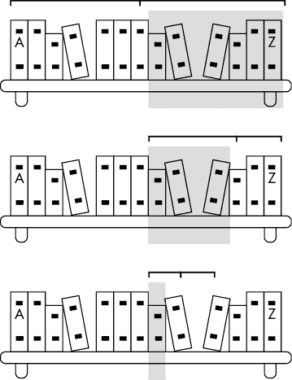
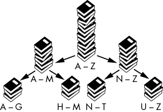
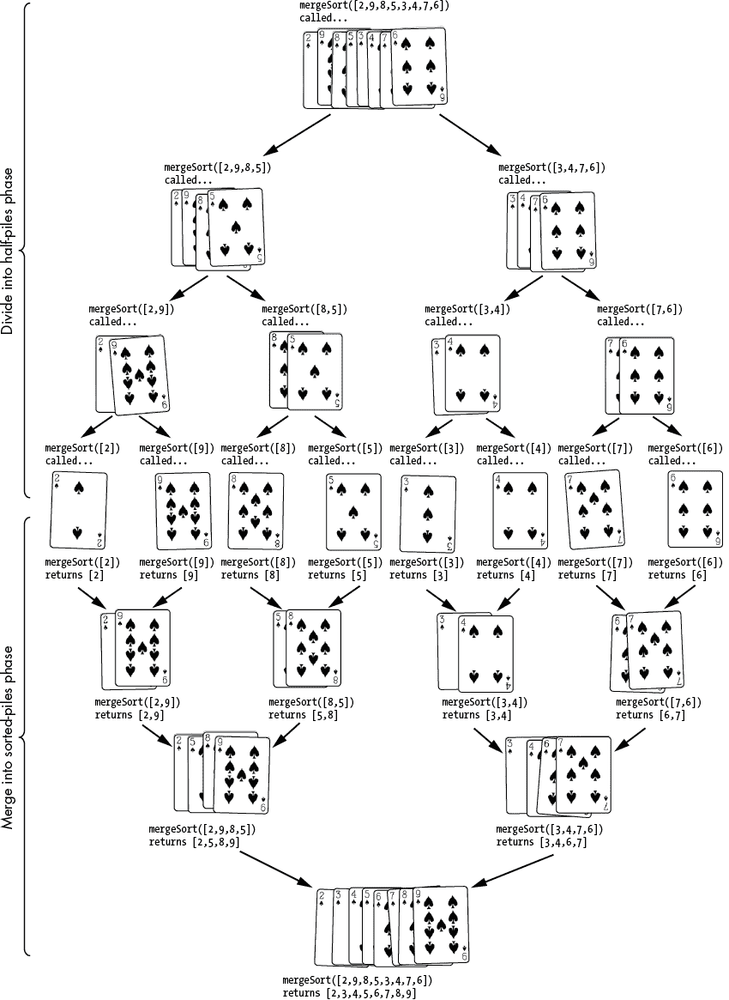
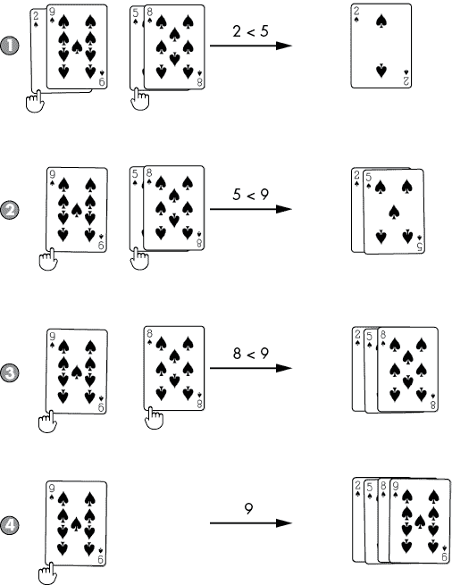
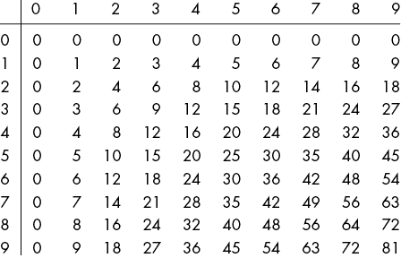
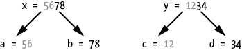

# 五、分而治之算法

> 原文：[Chapter 5 - Divide-and-Conquer Algorithms](https://inventwithpython.com/recursion/chapter5.html)
> 
> 译者：[飞龙](https://github.com/wizardforcel)
> 
> 协议：[CC BY-NC-SA 4.0](https://creativecommons.org/licenses/by-nc-sa/4.0/)


*分而治之算法*是将大问题分解为更小的子问题，然后将这些子问题分解为更小的问题，直到变得微不足道。这种方法使递归成为一种理想的技术：递归情况将问题分解为自相似的子问题，基本情况发生在子问题被减少到微不足道的大小时。这种方法的一个好处是这些问题可以并行处理，允许多个中央处理单元（CPU）核心或计算机处理它们。

在本章中，我们将研究一些常见的使用递归进行分而治之的算法，例如二分查找、快速排序和归并排序。我们还将重新审视对整数数组求和，这次采用分而治之的方法。最后，我们将看一下更神秘的 Karatsuba 乘法算法，它是在 1960 年开发的，为计算机硬件的快速整数乘法奠定了基础。

## 二分查找：在按字母顺序排列的书架上找书

假设你有一个有 100 本书的书架。你记不得你有哪些书，也不知道它们在书架上的确切位置，但你知道它们是按标题字母顺序排列的。要找到你的书*Zebras: The Complete Guide*，你不会从书架的开头开始，那里有*Aaron Burr Biography*，而是朝书架的末尾。如果你还有关于 zebras、动物园和合子的书，你的斑马书就不会是书架上的最后一本书，但会很接近。因此，你可以利用书是按字母顺序排列的这一事实，以及*Z*是字母表的最后一个字母作为*启发式*，或者近似线索，向书架的末尾而不是开头寻找。

*二分查找*是一种在排序列表中定位目标项的技术，它通过反复确定项在列表的哪一半来进行。搜索书架的最公正的方法是从中间的一本书开始，然后确定你要找的目标书是在左半部分还是右半部分。

然后，您可以重复这个过程，如图 5-1 所示：查看您选择的一半中间的书，然后确定您的目标书是否在左侧四分之一还是右侧四分之一。您可以一直这样做，直到找到书，或者找到书应该在的地方但却没有找到，并宣布书不存在于书架上。



图 5-1：二分搜索反复确定范围的哪一半包含排序数组中的目标项。

这个过程的扩展效率很高；将要搜索的书籍数量加倍只会增加搜索过程的一步。对于有 50 本书的书架进行线性搜索需要 50 步，对于有 100 本书的书架进行线性搜索需要 100 步。但对于有 50 本书的书架进行二分搜索只需要 6 步，而对于有 100 本书的书架只需要 7 步。

让我们对我们的二分搜索实现提出三个递归问题：

1.  什么是基本情况？搜索长度为 1 的项目范围。

1.  传递给递归函数调用的参数是什么？我们正在搜索的列表范围的左右端的索引。

1.  这个参数如何接近基本情况？每次递归调用时，范围的大小减半，因此最终变为一个项目长。

检查我们`binarySearch.py`程序中的以下`binarySearch()`函数，它在排序值`haystack`的排序列表中定位值`needle`：

**Python**

```py
def binarySearch(needle, haystack, left=None, right=None):
    # By default, `left` and `right` are all of `haystack`:
    if left is None:
        left = 0 # `left` defaults to the 0 index.
    if right is None:
        right = len(haystack) - 1 # `right` defaults to the last index.

    print('Searching:', haystack[left:right + 1])

    if left > right: # BASE CASE
         return None # The `needle` is not in `haystack`.

    mid = (left + right) // 2
    if needle == haystack[mid]: # BASE CASE
         return mid # The `needle` has been found in `haystack`
    elif needle < haystack[mid]: # RECURSIVE CASE
         return binarySearch(needle, haystack, left, mid - 1)
    elif needle > haystack[mid]: # RECURSIVE CASE
         return binarySearch(needle, haystack, mid + 1, right)

print(binarySearch(13, [1, 4, 8, 11, 13, 16, 19, 19]))
```

`binarySearch.html`程序有这个 JavaScript 等价物：

**JavaScript**

```js
<script type="text/javascript">
function binarySearch(needle, haystack, left, right) {
    // By default, `left` and `right` are all of `haystack`:
    if (left === undefined) {
        left = 0; // `left` defaults to the 0 index.
    }
    if (right === undefined) {
        right = haystack.length - 1; // `right` defaults to the last index.
    }

 document.write("Searching: [" + 
    haystack.slice(left, right + 1).join(", ") + "]<br />");

    if (left > right) { // BASE CASE
         return null; // The `needle` is not in `haystack`.
    }

    let mid = Math.floor((left + right) / 2);
    if (needle == haystack[mid]) { // BASE CASE
         return mid; // The `needle` has been found in `haystack`.
    } else if (needle < haystack[mid]) { // RECURSIVE CASE
         return binarySearch(needle, haystack, left, mid - 1);
    } else if (needle > haystack[mid]) { // RECURSIVE CASE
         return binarySearch(needle, haystack, mid + 1, right);
    }
}

document.write(binarySearch(13, [1, 4, 8, 11, 13, 16, 19, 19]));
</script>
```

当您运行这些程序时，将搜索列表`[1, 4, 8, 11, 13, 16, 19, 19]`中的`13`，输出如下：

```py
Searching: [1, 4, 8, 11, 13, 16, 19, 19]
Searching: [13, 16, 19, 19]
Searching: [13]
4
```

目标值`13`确实在列表中的索引`4`处。

代码计算了由`left`和`right`索引定义的范围的中间索引（存储在`mid`中）。起初，这个范围是整个项目列表的长度。如果`mid`索引处的值与`needle`相同，则返回`mid`。否则，我们需要弄清楚我们的目标值是在范围的左半部分（在这种情况下，要搜索的新范围是`left`到`mid - 1`）还是在右半部分（在这种情况下，要搜索的新范围是`mid + 1`到`end`）。

我们已经有一个可以搜索这个新范围的函数：`binarySearch()`本身！对新范围进行递归调用。如果我们最终到达搜索范围的右端在左端之前的点，我们知道我们的搜索范围已经缩小到零，我们的目标值找不到。

请注意，递归调用返回后，代码不执行任何操作；它立即返回递归函数调用的返回值。这个特性意味着我们可以为这个递归算法实现尾递归优化，这是我们在第八章中解释的一种做法。但也意味着二分搜索可以很容易地作为一个不使用递归函数调用的迭代算法来实现。本书的可下载资源位于[`nostarch.com/recursive-book-recursion`](https://nostarch.com/recursive-book-recursion)，其中包括用于比较递归二分搜索的迭代二分搜索的源代码。

## 快速排序：将未排序的书堆分成排序的堆

请记住，`binarySearch()`的速度优势来自于项目中的值是排序的。如果值是无序的，算法将无法工作。输入*quicksort*，这是由计算机科学家 Tony Hoare 在 1959 年开发的递归排序算法。

快速排序使用一种称为*分区*的分而治之技术。想象一下分区：想象你有一大堆未按字母顺序排列的书。拿起一本书并把它放在书架上的正确位置意味着当书架变得满时，你将花费大量时间重新排列书架。如果你首先将书堆分成两堆：一个*A*到*M*的堆和一个*N*到*Z*的堆会有所帮助。（在这个例子中，*M*将是我们的*枢轴*。）

你还没有对这堆进行排序，但你已经*分区*了。分区很容易：书不必放在两堆中的一个正确的位置，它只需放在正确的堆中。然后你可以进一步将这两堆分成四堆：*A*到*G*，*H*到*M*，*N*到*T*，和*U*到*Z*。这在图 5-2 中显示。如果你继续分区，最终会得到每堆包含一本书的情况（基本情况），而且这些堆现在是按顺序排列的。这意味着书现在也是按顺序排列的。这种重复的分区是快速排序的工作原理。

对于*A*到*Z*的第一次分区，我们选择*M*作为枢轴值，因为它是在*A*和*Z*之间的中间字母。然而，如果我们的书集包括一本关于亚伦·伯尔的书和 99 本关于斑马、和风、动物园、合子和其他*Z*主题的书，我们的两个分区堆将会严重失衡。我们会在*A*到*M*堆中有一本单独的亚伦·伯尔的书，而在*M*到*Z*堆中有其他所有的书。当分区均匀平衡时，快速排序算法的工作速度最快，因此在每个分区步骤中选择一个好的枢轴值是很重要的。



图 5-2：快速排序通过反复将项目分成两组来工作。

然而，如果你对你要排序的数据一无所知，那么选择一个理想的枢轴是不可能的。这就是为什么通用的快速排序算法简单地使用范围中的最后一个值作为枢轴值。

在我们的实现中，每次调用`quicksort()`都会给出一个要排序的项目数组。它还给出了`left`和`right`参数，指定了要对该数组中的索引范围进行排序，类似于`binarySearch()`的 left 和 right 参数。算法选择一个枢轴值与范围中的其他值进行比较，然后将这些值放在范围的左侧（如果它们小于枢轴值）或右侧（如果它们大于枢轴值）。这是分区步骤。接下来，`quicksort()`函数在这两个更小的范围上递归调用，直到一个范围已经减少到零。随着递归调用的进行，列表变得越来越有序，直到最终整个列表按正确的顺序排列。

请注意，该算法会就地修改数组。有关详细信息，请参见第四章中的“就地修改列表或数组”。因此，`quicksort()`函数不会返回一个排序好的数组。基本情况只是返回以停止产生更多的递归调用。

让我们对我们的二分搜索实现提出三个递归问题：

1.  基本情况是什么？给定一个要排序的范围，其中包含零个或一个项目，并且已经按顺序排列。

1.  递归函数调用传递了什么参数？我们正在排序的列表中范围的左右端的索引。

1.  这个论点如何接近基本情况？每次递归调用时，范围的大小减半，所以最终变为空。

`quicksort.py` Python 程序中的以下`quicksort()`函数将 items 列表中的值按升序排序：

```py
def quicksort(items, left=None, right=None):
    # By default, `left` and `right` span the entire range of `items`:
    if left is None:
        left = 0 # `left` defaults to the 0 index.
    if right is None:
        right = len(items) - 1 # `right` defaults to the last index.

 print('\nquicksort() called on this range:', items[left:right + 1])
    print('................The full list is:', items)

    if right <= left: # ❶
        # With only zero or one item, `items` is already sorted.
        return  # BASE CASE

    # START OF THE PARTITIONING
    i = left # i starts at the left end of the range. ❷
    pivotValue = items[right] # Select the last value for the pivot.

    print('....................The pivot is:', pivotValue)

    # Iterate up to, but not including, the pivot:
    for j in range(left, right):
        # If a value is less than the pivot, swap it so that it's on the
        # left side of `items`:
        if items[j] <= pivotValue:
            # Swap these two values:
            items[i], items[j] = items[j], items[i] ❸
            i += 1

    # Put the pivot on the left side of `items`:
    items[i], items[right] = items[right], items[i]
    # END OF THE PARTITIONING

    print('....After swapping, the range is:', items[left:right + 1])
    print('Recursively calling quicksort on:', items[left:i], 'and', items[i + 1:right + 1])

    # Call quicksort() on the two partitions:
    quicksort(items, left, i - 1)   # RECURSIVE CASE
    quicksort(items, i + 1, right)  # RECURSIVE CASE

myList = [0, 7, 6, 3, 1, 2, 5, 4]
quicksort(myList)
print(myList)
```

`quicksort.html`程序包含了 JavaScript 等效程序：

```js
<script type="text/javascript">
function quicksort(items, left, right) {
    // By default, `left` and `right` span the entire range of `items`:
    if (left === undefined) {
        left = 0; // `left` defaults to the 0 index.
    }
    if (right === undefined) {
        right = items.length - 1; // `right` defaults to the last index.
    }

    document.write("<br /><pre>quicksort() called on this range: [" + 
    items.slice(left, right + 1).join(", ") + "]</pre>");
    document.write("<pre>................The full list is: [" + items.join(", ") + "]</pre>");

    if (right <= left) { // ❶
        // With only zero or one item, `items` is already sorted.
 return; // BASE CASE
    }

    // START OF THE PARTITIONING
    let i = left; ❷ // i starts at the left end of the range.
    let pivotValue = items[right]; // Select the last value for the pivot.

    document.write("<pre>....................The pivot is: " + pivotValue.toString() + 
"</pre>");

    // Iterate up to, but not including, the pivot:
    for (let j = left; j < right; j++) {
        // If a value is less than the pivot, swap it so that it's on the
        // left side of `items`:
        if (items[j] <= pivotValue) {
            // Swap these two values:
            [items[i], items[j]] = [items[j], items[i]]; ❸
            i++;
        }
    }

    // Put the pivot on the left side of `items`:
    [items[i], items[right]] = [items[right], items[i]];
    // END OF THE PARTITIONING

    document.write("<pre>....After swapping, the range is: [" + items.slice(left, right + 1).join(", ") + "]</pre>");
    document.write("<pre>Recursively calling quicksort on: [" + items.slice(left, i).join(", ") + "] and [" + items.slice(i + 1, right + 1).join(", ") + "]</pre>");

    // Call quicksort() on the two partitions:
    quicksort(items, left, i - 1); // RECURSIVE CASE
    quicksort(items, i + 1, right); // RECURSIVE CASE
}

let myList = [0, 7, 6, 3, 1, 2, 5, 4];
quicksort(myList);
document.write("<pre>[" + myList.join(", ") + "]</pre>");
</script>
```

这段代码类似于二分搜索算法中的代码。作为默认值，我们将`items`数组中范围的`left`和`right`端设置为整个数组的开始和结束。如果算法达到了`right`端在`left`端之前或在`left`端之前的基本情况（一个或零个项目的范围），则排序完成❶。

在每次调用`quicksort()`时，我们对当前范围内的项目进行分区（由`left`和`right`中的索引定义），然后交换它们，使得小于枢纽值的项目最终位于范围的左侧，而大于枢纽值的项目最终位于范围的右侧。例如，如果数组`[81, 48, 94, 87, 83, 14, 6, 42]`中的枢纽值为`42`，则分区后的数组将是`[14, 6, 42, 81, 48, 94, 87, 83]`。请注意，分区后的数组与排序后的数组不同：尽管`42`左侧的两个项目小于`42`，`42`右侧的五个项目大于`42`，但项目并不按顺序排列。

`quicksort()`函数的主要部分是分区步骤。要了解分区的工作原理，想象一个索引`j`，它从范围的左端开始并向右端移动❷。我们将索引`j`处的项目与枢纽值进行比较，然后向右移动以比较下一个项目。枢纽值可以任意选择范围内的任何值，但我们将始终使用范围的右端的值。

想象一下第二个索引`i`，它也从左端开始。如果索引`j`处的项目小于或等于枢纽值，则交换索引`i`和`j`处的项目❸，并将`i`增加到下一个索引。因此，`j`在与枢纽值进行比较后总是增加（即向右移动），而`i`只有在索引`j`处的项目小于或等于枢纽值时才会增加。

`i`和`j`这两个名称通常用于保存数组索引的变量。其他人的`quicksort()`实现可能会使用`j`和`i`，甚至完全不同的变量。重要的是要记住，这两个变量存储索引并且表现如此。

例如，让我们来看看数组`[0, 7, 6, 3, 1, 2, 5, 4]`的第一次分区，范围由`left`为`0`和`right`为`7`定义，覆盖数组的整个大小。`pivot`将是右端的值`4`。`i`和`j`索引从索引`0`开始，即范围的左端。在每一步中，索引`j`总是向右移动。只有当索引`j`处的值小于或等于枢纽值时，索引`i`才会移动。`items`数组，`i`索引和`j`索引的初始状态如下：

```py
items:   [0, 7, 6, 3, 1, 2, 5, 4]
indices:  0  1  2  3  4  5  6  7
          ^
i = 0     i
j = 0     j
```

索引`j`处的值（为`0`）小于或等于枢纽值（为`4`），因此交换`i`和`j`处的值。这实际上没有产生任何变化，因为`i`和`j`是相同的索引。此外，增加`i`，使其向右移动。`j`索引在与枢纽值进行比较时每次都会增加。变量的状态现在如下所示：

```py
items:   [0, 7, 6, 3, 1, 2, 5, 4]
indices:  0  1  2  3  4  5  6  7
             ^
i = 1        i
j = 1        j
```

索引`j`处的值（为`7`）不小于或等于枢纽值（为`4`），因此不交换值。请记住，`j`始终增加，但只有在执行交换后`i`才会增加——因此`i`始终在`j`处或左侧。变量的状态现在如下所示：

```py
items:   [0, 7, 6, 3, 1, 2, 5, 4]
indices:  0  1  2  3  4  5  6  7
             ^
i = 1        i  ^
j = 2           j
```

索引`j`处的值（为`6`）不小于或等于枢纽值（为`4`），因此不交换值。变量的状态现在如下所示：

```py
items:   [0, 7, 6, 3, 1, 2, 5, 4]
indices:  0  1  2  3  4  5  6  7
             ^
i = 1        i     ^
j = 3              j
```

索引`j`处的值（为`3`）小于或等于枢纽值（为`4`），因此交换`i`和`j`处的值。`7`和`3`交换位置。此外，增加`i`，使其向右移动。变量的状态现在如下所示：

```py
items:   [0, 3, 6, 7, 1, 2, 5, 4]
indices:  0  1  2  3  4  5  6  7
                ^
i = 2           i     ^
j = 4                 j
```

索引`j`处的值（为`1`）小于或等于枢纽值（为`4`），因此交换`i`和`j`处的值。`6`和`1`交换位置。此外，增加`i`，使其向右移动。变量的状态现在如下所示：

```py
items:   [0, 3, 1, 7, 6, 2, 5, 4]
indices:  0  1  2  3  4  5  6  7
                   ^
i = 3              i     ^
j = 5                    j
```

索引`j`处的值（为`2`）小于或等于枢纽值（为`4`），因此交换`i`和`j`处的值。`7`和`2`交换位置。此外，增加`i`，使其向右移动。变量的状态现在如下所示：

```py
items:   [0, 3, 1, 2, 6, 7, 5, 4]
indices:  0  1  2  3  4  5  6  7
                      ^
i = 4                 i     ^
j = 6                       j
```

索引`j`处的值（为`6`）不小于或等于枢轴值（为`4`），因此不交换值。现在变量的状态如下：

```py
items:   [0, 3, 1, 2, 6, 7, 5, 4]
indices:  0  1  2  3  4  5  6  7
                      ^
i = 4                 i        ^
j = 7                          j
```

我们已经到达了分区的末尾。索引`j`位于枢轴值（始终是范围中最右边的值）处，因此让我们最后一次交换`i`和`j`，以确保枢轴不在分区的右半部分。`6`和`4`交换位置。现在变量的状态如下：

```py
items:   [0, 3, 1, 2, 4, 7, 5, 6]
indices:  0  1  2  3  4  5  6  7
                      ^
i = 4                 i        ^
j = 7                          j
```

注意`i`索引的变化：由于交换的结果，该索引始终会接收小于枢轴值的值；然后`i`索引向右移动以接收未来小于枢轴值的值。因此，`i`索引左侧的所有值都小于或等于枢轴，而`i`索引右侧的所有值都大于枢轴。

整个过程会重复进行，我们会在左右分区上递归调用`quicksort()`。当我们对这两半进行分区（然后对这两半的四半进行分区，再进行更多递归的`quicksort()`调用，依此类推），整个数组最终会被排序。

当我们运行这些程序时，输出显示了对`[0, 7, 6, 3, 1, 2, 5, 4]`列表进行排序的过程。点的行用于在编写代码时对齐输出：

```py
quicksort() called on this range: [0, 7, 6, 3, 1, 2, 5, 4]
................The full list is: [0, 7, 6, 3, 1, 2, 5, 4]
....................The pivot is: 4
....After swapping, the range is: [0, 3, 1, 2, 4, 7, 5, 6]
Recursively calling quicksort on: [0, 3, 1, 2] and [7, 5, 6]

quicksort() called on this range: [0, 3, 1, 2]
................The full list is: [0, 3, 1, 2, 4, 7, 5, 6]
....................The pivot is: 2
....After swapping, the range is: [0, 1, 2, 3]
Recursively calling quicksort on: [0, 1] and [3]

quicksort() called on this range: [0, 1]
................The full list is: [0, 1, 2, 3, 4, 7, 5, 6]
....................The pivot is: 1
....After swapping, the range is: [0, 1]
Recursively calling quicksort on: [0] and []

quicksort() called on this range: [0]
................The full list is: [0, 1, 2, 3, 4, 7, 5, 6]

quicksort() called on this range: []
................The full list is: [0, 1, 2, 3, 4, 7, 5, 6]

quicksort() called on this range: [3]
................The full list is: [0, 1, 2, 3, 4, 7, 5, 6]

quicksort() called on this range: [7, 5, 6]
................The full list is: [0, 1, 2, 3, 4, 7, 5, 6]
....................The pivot is: 6
....After swapping, the range is: [5, 6, 7]
Recursively calling quicksort on: [5] and [7]

quicksort() called on this range: [5]
................The full list is: [0, 1, 2, 3, 4, 5, 6, 7]

quicksort() called on this range: [7]
................The full list is: [0, 1, 2, 3, 4, 5, 6, 7]

Sorted: [0, 1, 2, 3, 4, 5, 6, 7]
```

快速排序是一种常用的排序算法，因为它易于实现，而且速度快。另一种常用的排序算法——归并排序也很快，而且使用了递归。我们接下来会介绍它。

## 归并排序：将小堆纸牌合并成更大的排序好的堆

计算机科学家约翰·冯·诺伊曼于 1945 年开发了*归并排序*。它采用了分割-合并的方法：每次对`mergeSort()`的递归调用都将未排序的列表分成两半，直到它们被分割成长度为零或一的列表。然后，随着递归调用的返回，这些较小的列表被合并成排序好的顺序。当最后一个递归调用返回时，整个列表将被排序。

例如，分割步骤将列表`[2, 9, 8, 5, 3, 4, 7, 6]`分成两个列表，如`[2, 9, 8, 5]`和`[3, 4, 7, 6]`，然后传递给两个递归函数调用。在基本情况下，列表已经被分成了零个或一个项目的列表。没有项目或一个项目的列表自然是排序好的。递归调用返回后，代码将这些小的排序好的列表合并成更大的排序好的列表，直到最终整个列表被排序。图 5-3 展示了使用归并排序对纸牌进行排序的示例。



图 5-3：归并排序的分割和合并阶段

例如，在分割阶段结束时，我们有八个单独的数字列表：`[2]`, `[9]`, `[8]`, `[5]`, `[3]`, `[4]`, `[7]`, `[6]`。只有一个数字的列表自然是按顺序排列的。将两个排序好的列表合并成一个更大的排序好的列表涉及查看两个较小列表的开头，并将较小的值附加到较大的列表上。图 5-4 显示了合并`[2, 9]`和`[5, 8]`的示例。在合并阶段中重复执行此操作，直到最终结果是原始的`mergeSort()`调用以排序顺序返回完整列表。



图 5-4：合并步骤比较较小排序列表开头的两个值，并将它们移动到较大的排序列表中。合并四张卡只需要四个步骤。

让我们问一下我们的三个递归算法问题关于归并排序算法：

1.  什么是基本情况？ 给定一个要排序的列表，其中有零个或一个项目，已经按排序顺序排列。

1.  递归函数调用传递了什么参数？ 由原始列表的左半部分和右半部分制成的列表。

1.  这个参数如何接近基本情况？ 传递给递归调用的列表的大小是原始列表的一半，因此最终成为零个或一个项目的列表。

`mergeSort.py` Python 程序中的以下`mergeSort()`函数将项目列表中的值按升序排序：

```py
import math

def mergeSort(items):
    print('.....mergeSort() called on:', items)

    # BASE CASE - Zero or one item is naturally sorted:
    if len(items) == 0 or len(items) == 1:
        return items # ❶

    # RECURSIVE CASE - Pass the left and right halves to mergeSort():
    # Round down if items doesn't divide in half evenly:
    iMiddle = math.floor(len(items) / 2) # ❷

    print('................Split into:', items[:iMiddle], 'and', items[iMiddle:])

    left = mergeSort(items[:iMiddle]) # ❸
    right = mergeSort(items[iMiddle:])

    # BASE CASE - Returned merged, sorted data:
    # At this point, left should be sorted and right should be
    # sorted. We can merge them into a single sorted list.
    sortedResult = []
    iLeft = 0
    iRight = 0
    while (len(sortedResult) < len(items)):
        # Append the smaller value to sortedResult.
        if left[iLeft] < right[iRight]: # ❹
            sortedResult.append(left[iLeft])
            iLeft += 1
        else:
            sortedResult.append(right[iRight])
            iRight += 1

        # If one of the pointers has reached the end of its list,
        # put the rest of the other list into sortedResult.
        if iLeft == len(left):
            sortedResult.extend(right[iRight:])
            break
        elif iRight == len(right):
            sortedResult.extend(left[iLeft:])
            break

    print('The two halves merged into:', sortedResult)

    return sortedResult # Returns a sorted version of items.

myList = [2, 9, 8, 5, 3, 4, 7, 6]
myList = mergeSort(myList)
print(myList)
```

`mergeSort.html`程序包含等效的 JavaScript 程序：

```js
<script type="text/javascript">
function mergeSort(items) {
    document.write("<pre>" + ".....mergeSort() called on: [" + 
    items.join(", ") + "]</pre>");

    // BASE CASE - Zero or one item is naturally sorted:
    if (items.length === 0 || items.length === 1) { // BASE CASE
        return items; // ❶
    }

    // RECURSIVE CASE - Pass the left and right halves to mergeSort():
    // Round down if items doesn't divide in half evenly:
    let iMiddle = Math.floor(items.length / 2); // ❷

    document.write("<pre>................Split into: [" + items.slice(0, iMiddle).join(", ") + 
    "] and [" + items.slice(iMiddle).join(", ") + "]</pre>");

    let left = mergeSort(items.slice(0, iMiddle)); // ❸
    let right = mergeSort(items.slice(iMiddle));

    // BASE CASE - Returned merged, sorted data:
    // At this point, left should be sorted and right should be
    // sorted. We can merge them into a single sorted list.
    let sortedResult = [];
    let iLeft = 0;
    let iRight = 0;
    while (sortedResult.length < items.length) {
        // Append the smaller value to sortedResult.
        if (left[iLeft] < right[iRight]) { // ❹
            sortedResult.push(left[iLeft]);
            iLeft++;
        } else {
            sortedResult.push(right[iRight]);
            iRight++;
        }

        // If one of the pointers has reached the end of its list,
        // put the rest of the other list into sortedResult.
        if (iLeft == left.length) {
            Array.prototype.push.apply(sortedResult, right.slice(iRight));
            break;
        } else if (iRight == right.length) {
            Array.prototype.push.apply(sortedResult, left.slice(iLeft));
            break;
        }
    }

    document.write("<pre>The two halves merged into: [" + sortedResult.join(", ") + 
    "]</pre>");

    return sortedResult; // Returns a sorted version of items.
}

let myList = [2, 9, 8, 5, 3, 4, 7, 6];
myList = mergeSort(myList);
document.write("<pre>[" + myList.join(", ") + "]</pre>");
</script>
```

`mergeSort()`函数（以及对`mergeSort()`函数的所有递归调用）接受一个未排序的列表并返回一个排序的列表。该函数的第一步是检查列表是否只包含零个或一个项目❶。这个列表已经排序，所以函数原样返回列表。

否则，函数确定列表的中间索引❷，以便我们知道在哪里将其分成左半部分和右半部分列表，然后传递给两个递归函数调用❸。递归函数调用返回排序的列表，我们将其存储在左侧和右侧变量中。

下一步是将这两个排序好的半列表合并成一个排序好的完整列表，命名为`sortedResult`。我们将为`left`和`right`列表维护两个索引，命名为`iLeft`和`iRight`。在循环内，将两个值中较小的一个❹附加到`sortedResult`，并递增其相应的索引变量（`iLeft`或`iRight`）。如果`iLeft`或`iRight`达到其列表的末尾，则将另一半列表中剩余的项目附加到`sortedResult`。

让我们跟随一个合并步骤的示例，如果递归调用已经返回了`[2, 9]`作为`left`和`[5, 8]`作为`right`。由于这些列表是从`mergeSort()`调用返回的，我们总是可以假设它们是排序好的。我们必须将它们合并成一个单独的排序好的列表，以便当前的`mergeSort()`调用将其返回给其调用者。

`iLeft`和`iRight`索引从`0`开始。我们比较`left[iLeft]`（为`2`）和`right[iRight]`（为`5`）的值，以找到较小的值：

```py
sortedResult = []
      left: [2, 9]    right: [5, 8]
   indices:  0  1             0  1
 iLeft = 0   ^
iRight = 0                    ^
```

由于`left[iLeft]`的值`2`是较小的值，我们将其附加到`sortedResult`并将`iLeft`从`0`增加到`1`。 变量的状态现在如下：

```py
sortedResult = [2]
      left: [2, 9]    right: [5, 8]
   indices:  0  1             0  1
 iLeft = 1      ^
iRight = 0                    ^
```

再次比较`left[iLeft]`和`right[iRight]`，我们发现`9`和`5`中，`right[iRight]`的`5`更小。 代码将`5`附加到`sortedResult`并将`iRight`从`0`增加到`1`。 变量的状态现在如下：

```py
sortedResult = [2, 5]
      left: [2, 9]    right: [5, 8]
 indices:  0  1             0  1
 iLeft = 1      ^
iRight = 1                       ^
```

再次比较`left[iLeft]`和`right[iRight]`，我们发现`9`和`8`中，`right[iRight]`的`8`更小。 代码将`8`附加到`sortedResult`并将`iRight`从`0`增加到`1`。 现在变量的状态如下：

```py
sortedResult = [2, 5, 8]
      left: [2, 9]    right: [5, 8]
   indices:  0  1             0  1
 iLeft = 1      ^
iRight = 2                         ^
```

因为`iRight`现在是`2`，等于`right`列表的长度，所以从`iLeft`索引到末尾的`left`中剩余的项目被附加到`sortedResult`，因为`right`中没有更多的项目可以与它们进行比较。这使得`sortedResult`成为`[2, 5, 8, 9]`，它需要返回的排序列表。这个合并步骤对每次`mergeSort()`调用都执行，以产生最终排序的列表。

当我们运行`mergeSort.py`和`mergeSort.html`程序时，输出显示了对`[2, 9, 8, 5, 3, 4, 7, 6]`列表进行排序的过程。

```py
.....mergeSort() called on: [2, 9, 8, 5, 3, 4, 7, 6]
................Split into: [2, 9, 8, 5] and [3, 4, 7, 6]
.....mergeSort() called on: [2, 9, 8, 5]
................Split into: [2, 9] and [8, 5]
.....mergeSort() called on: [2, 9]
................Split into: [2] and [9]
.....mergeSort() called on: [2]
.....mergeSort() called on: [9]
The two halves merged into: [2, 9]
.....mergeSort() called on: [8, 5]
................Split into: [8] and [5]
.....mergeSort() called on: [8]
.....mergeSort() called on: [5]
The two halves merged into: [5, 8]
The two halves merged into: [2, 5, 8, 9]
.....mergeSort() called on: [3, 4, 7, 6]
................Split into: [3, 4] and [7, 6]
.....mergeSort() called on: [3, 4]
................Split into: [3] and [4]
.....mergeSort() called on: [3]
.....mergeSort() called on: [4]
The two halves merged into: [3, 4]
.....mergeSort() called on: [7, 6]
................Split into: [7] and [6]
.....mergeSort() called on: [7]
.....mergeSort() called on: [6]
The two halves merged into: [6, 7]
The two halves merged into: [3, 4, 6, 7]
The two halves merged into: [2, 3, 4, 5, 6, 7, 8, 9]
[2, 3, 4, 5, 6, 7, 8, 9]
```

从输出中可以看出，该函数将`[2, 9, 8, 5, 3, 4, 7, 6]`列表分成`[2, 9, 8, 5]`和`[3, 4, 7, 6]`，并将它们传递给递归的`mergeSort()`调用。第一个列表进一步分成`[2, 9]`和`[8, 5]`。`[2, 9]`列表分成`[2]`和`[9]`。这些单值列表不能再分割，所以我们已经达到了基本情况。这些列表合并成排序后的顺序为`[2, 9]`。函数将`[8, 5]`列表分成`[8]`和`[5]`，达到基本情况，然后合并成`[5, 8]`。

`[2, 9]`和`[5, 8]`列表分别按顺序排序。记住，`mergeSort()`不只是将列表简单地*连接*成`[2, 9, 5, 8]`，这样不会按顺序排序。相反，该函数将它们*合并*成排序后的列表`[2, 5, 8, 9]`。当原始的`mergeSort()`调用返回时，返回的完整列表已完全排序。

## 对整数数组求和

我们已经在第三章中使用头尾技术对整数数组求和进行了讨论。在本章中，我们将使用分治策略。由于加法的结合律意味着将 1 + 2 + 3 + 4 相加与将 1 + 2 和 3 + 4 的和相加是相同的，我们可以将要求和的大数组分成两个要求和的小数组。

好处在于，对于更大的数据集，我们可以将子问题分配给不同的计算机，并让它们并行工作。无需等待数组的前半部分被求和，另一台计算机就可以开始对后半部分进行求和。这是分治技术的一个很大的优势，因为 CPU 的速度并没有提高多少，但我们可以让多个 CPU 同时工作。

让我们对求和函数的递归算法提出三个问题：

1.  基本情况是什么？要么是包含零个数字的数组（返回`0`），要么是包含一个数字的数组（返回该数字）。

1.  递归函数调用传递了什么参数？要么是数字数组的左半部分，要么是右半部分。

1.  这个参数如何变得更接近基本情况？每次数组的大小减半，最终变成一个包含零个或一个数字的数组。

`sumDivConq.py` Python 程序实现了`sumDivConq()`函数中的分治策略，用于对数字进行求和。

**Python**

```py
def sumDivConq(numbers):
    if len(numbers) == 0: # BASE CASE
        return 0 # ❶
    elif len(numbers) == 1: # BASE CASE
        return numbers[0] # ❷
    else: # RECURSIVE CASE
        mid = len(numbers) // 2 # ❸
        leftHalfSum = sumDivConq(numbers[0:mid])
 rightHalfSum = sumDivConq(numbers[mid:len(numbers) + 1])
        return leftHalfSum + rightHalfSum # ❹

nums = [1, 2, 3, 4, 5]
print('The sum of', nums, 'is', sumDivConq(nums))
nums = [5, 2, 4, 8]
print('The sum of', nums, 'is', sumDivConq(nums))
nums = [1, 10, 100, 1000]
print('The sum of', nums, 'is', sumDivConq(nums))
```

`sumDivConq.html`程序包含了 JavaScript 的等效内容。

**JavaScript**

```js
<script type="text/javascript">
function sumDivConq(numbers) {
    if (numbers.length === 0) { // BASE CASE
        return 0; // ❶
    } else if (numbers.length === 1) { // BASE CASE
        return numbers[0]; // ❷
    } else { // RECURSIVE CASE
        let mid = Math.floor(numbers.length / 2); // ❸
        let leftHalfSum = sumDivConq(numbers.slice(0, mid));
        let rightHalfSum = sumDivConq(numbers.slice(mid, numbers.length + 1));
        return leftHalfSum + rightHalfSum; // ❹
    }
}

let nums = [1, 2, 3, 4, 5];
document.write('The sum of ' + nums + ' is ' + sumDivConq(nums) + "<br />");
nums = [5, 2, 4, 8];
document.write('The sum of ' + nums + ' is ' + sumDivConq(nums) + "<br />");
nums = [1, 10, 100, 1000];
document.write('The sum of ' + nums + ' is ' + sumDivConq(nums) + "<br />");
</script>
```

该程序的输出是：

```py
The sum of [1, 2, 3, 4, 5] is 15
The sum of [5, 2, 4, 8] is 19
The sum of [1, 10, 100, 1000] is 1111
```

`sumDivConq()`函数首先检查`numbers`数组是否包含零个或一个数字。这些微不足道的基本情况很容易求和，因为它们不需要进行加法：返回`0`或数组中的单个数字。其他情况是递归的；计算数组的中间索引，以便对数字数组的左半部分和右半部分进行单独的递归调用。这两个返回值的和成为当前`sumDivConq()`调用的返回值。

由于加法的结合性质，没有理由要求一个数字数组必须由单个计算机按顺序相加。我们的程序在同一台计算机上执行所有操作，但对于大数组或比加法更复杂的计算，我们的程序可以将一半数据发送到其他计算机上进行处理。这个问题可以分解成类似的子问题，这是一个递归方法可以被采用的重要提示。

## Karatsuba 乘法

`*`运算符使得在高级编程语言（如 Python 和 JavaScript）中进行乘法变得容易。但是低级硬件需要一种使用更原始操作进行乘法的方法。我们可以使用循环仅使用加法来相乘两个整数，比如下面的 Python 代码来相乘`5678 * 1234`：

```py
>>> x = 5678
>>> y = 1234
>>> product = 0
>>> for i in range(x):
...     product += y
...
>>> product
7006652
```

然而，这段代码对大整数的扩展效率并不高。*Karatsuba 乘法*是一种快速的递归算法，由 Anatoly Karatsuba 于 1960 年发现，可以使用加法、减法和预先计算的所有单个数字乘积的乘法表来相乘整数。这个乘法表，如图 5-5 所示，被称为*查找表*。

我们的算法不需要相乘单个数字，因为它可以直接在表中查找。通过使用内存存储预先计算的值，我们增加了内存使用量以减少 CPU 运行时间。



图 5-5：查找表，比如这个包含所有单个数字乘积的表，可以使我们的程序避免重复计算，因为计算机将预先计算的值存储在内存中以供以后检索。

我们将在高级语言（如 Python 或 JavaScript）中实现 Karatsuba 乘法，就好像`*`运算符并不存在一样。我们的`karatsuba()`函数接受两个整数参数`x`和`y`进行相乘。Karatsuba 算法有五个步骤，前三个步骤涉及对从`x`和`y`派生的较小的、分解的整数进行递归调用`karatsuba()`。基本情况发生在`x`和`y`参数都是单个数字时，此时可以在预先计算的查找表中找到乘积。

我们还定义了四个变量：`a`和`b`分别是`x`的数字的一半，`c`和`d`分别是`y`的数字的一半，如图 5-6 所示。例如，如果`x`和`y`分别是`5678`和`1234`，那么`a`是`56`，`b`是`78`，`c`是`12`，`d`是`34`。



图 5-6：要相乘的整数`x`和`y`被分成一半`a`、`b`、`c`和`d`。

以下是 Karatsuba 算法的五个步骤：

1.  将`a`和`c`相乘，可以从乘法查找表中查找，也可以通过对`karatsuba()`进行递归调用来实现。

1.  将`b`和`d`相乘，可以从乘法查找表中查找，也可以通过对`karatsuba()`进行递归调用来实现。

1.  将`a + c`和`b + d`相乘，可以从乘法查找表中查找，也可以通过对`karatsuba()`进行递归调用来实现。

1.  计算第 3 步 - 第 2 步 - 第 1 步。

1.  用零填充第 1 步和第 4 步的结果，然后将它们加到第 2 步。

第 5 步的结果是`x`和`y`的乘积。如何用零填充第 1 步和第 4 步的结果的具体方法将在本节后面解释。

让我们向`karatsuba()`函数提出三个递归算法的问题：

1.  基本情况是什么？相乘单个数字，可以在预先计算的查找表中找到。

1.  递归函数调用传递了什么参数？从`x`和`y`参数派生的`a`、`b`、`c`和`d`的值。

1.  这个参数是如何变得更接近基本情况的呢？因为`a`、`b`、`c`和`d`分别是`x`和`y`的一半，并且它们自己被用作下一个递归调用的`x`和`y`参数，递归调用的参数变得越来越接近基本情况所需的单个数字。

我们的 Python 实现 Karatsuba 乘法在`karatsubaMultiplication.py`程序中：

```py
import math

# Create a lookup table of all single-digit multiplication products:
MULT_TABLE = {} # ❶
for i in range(10):
    for j in range(10):
 MULT_TABLE[(i, j)] = i * j

def padZeros(numberString, numZeros, insertSide):
    """Return a string padded with zeros on the left or right side."""
    if insertSide == 'left':
        return '0' * numZeros + numberString
    elif insertSide == 'right':
        return numberString + '0' * numZeros

def karatsuba(x, y):
    """Multiply two integers with the Karatsuba algorithm. Note that
    the * operator isn't used anywhere in this function."""
    assert isinstance(x, int), 'x must be an integer'
    assert isinstance(y, int), 'y must be an integer'
    x = str(x)
    y = str(y)

    # At single digits, look up the products in the multiplication table:
    if len(x) == 1 and len(y) == 1: # BASE CASE
        print('Lookup', x, '*', y, '=', MULT_TABLE[(int(x), int(y))])
        return MULT_TABLE[(int(x), int(y))]

    # RECURSIVE CASE
    print('Multiplying', x, '*', y)

    # Pad with prepended zeros so that x and y are the same length:
    if len(x) < len(y): # ❷
        # If x is shorter than y, pad x with zeros:
        x = padZeros(x, len(y) - len(x), 'left')
    elif len(y) < len(x):
        # If y is shorter than x, pad y with zeros:
        y = padZeros(y, len(x) - len(y), 'left')
    # At this point, x and y have the same length.

    halfOfDigits = math.floor(len(x) / 2) # ❸

    # Split x into halves a & b, split y into halves c & d:
    a = int(x[:halfOfDigits])
    b = int(x[halfOfDigits:])
    c = int(y[:halfOfDigits])
    d = int(y[halfOfDigits:])

    # Make the recursive calls with these halves:
    step1Result = karatsuba(a, c) # ❹ # Step 1: Multiply a & c.
    step2Result = karatsuba(b, d) # Step 2: Multiply b & d.
    step3Result = karatsuba(a + b, c + d) # Step 3: Multiply a + b & c + d.

    # Step 4: Calculate Step 3 - Step 2 - Step 1:
    step4Result = step3Result - step2Result - step1Result # ❺

    # Step 5: Pad these numbers, then add them for the return value:
    step1Padding = (len(x) - halfOfDigits) + (len(x) - halfOfDigits)
    step1PaddedNum = int(padZeros(str(step1Result), step1Padding, 'right'))

    step4Padding = (len(x) - halfOfDigits)
 step4PaddedNum = int(padZeros(str(step4Result), step4Padding, 'right'))

    print('Solved', x, 'x', y, '=', step1PaddedNum + step2Result + step4PaddedNum)

    return step1PaddedNum + step2Result + step4PaddedNum # ❻

# Example: 1357 x 2468 = 3349076
print('1357 * 2468 =', karatsuba(1357, 2468))
```

JavaScript 的等价代码在`karatsubaMultiplication.html`中。

```js
<script type="text/javascript">

// Create a lookup table of all single-digit multiplication products:
let MULT_TABLE = {}; // ❶
for (let i = 0; i < 10; i++) {
    for (let j = 0; j < 10; j++) {
        MULT_TABLE[[i, j]] = i * j;
    }
}

function padZeros(numberString, numZeros, insertSide) {
    // Return a string padded with zeros on the left or right side.
    if (insertSide === "left") {
        return "0".repeat(numZeros) + numberString;
    } else if (insertSide === "right") {
        return numberString + "0".repeat(numZeros);
    }
}

function karatsuba(x, y) {
    // Multiply two integers with the Karatsuba algorithm. Note that
    // the * operator isn't used anywhere in this function.
    console.assert(Number.isInteger(x), "x must be an integer");
    console.assert(Number.isInteger(y), "y must be an integer");
    x = x.toString();
    y = y.toString();

    // At single digits, look up the products in the multiplication table:  
    if ((x.length === 1) && (y.length === 1)) { // BASE CASE
        document.write("Lookup " + x.toString() + " * " + y.toString() + " = " + 
        MULT_TABLE[[parseInt(x), parseInt(y)]] + "<br />");
        return MULT_TABLE[[parseInt(x), parseInt(y)]];
    }

    // RECURSIVE CASE
    document.write("Multiplying " + x.toString() + " * " + y.toString() + 
    "<br />");

    // Pad with prepended zeros so that x and y are the same length:
    if (x.length < y.length) { // ❷
        // If x is shorter than y, pad x with zeros:
        x = padZeros(x, y.length - x.length, "left");
    } else if (y.length < x.length) {
        // If y is shorter than x, pad y with zeros:
 y = padZeros(y, x.length - y.length, "left");
    }
    // At this point, x and y have the same length.

    let halfOfDigits = Math.floor(x.length / 2); // ❸

    // Split x into halves a & b, split y into halves c & d:
    let a = parseInt(x.substring(0, halfOfDigits));
    let b = parseInt(x.substring(halfOfDigits));
    let c = parseInt(y.substring(0, halfOfDigits));
    let d = parseInt(y.substring(halfOfDigits));

    // Make the recursive calls with these halves:
    let step1Result = karatsuba(a, c); // ❹ // Step 1: Multiply a & c.
    let step2Result = karatsuba(b, d); // Step 2: Multiply b & d.
    let step3Result = karatsuba(a + b, c + d); // Step 3: Multiply a + b & c + d.

    // Step 4: Calculate Step 3 - Step 2 - Step 1:
    let step4Result = step3Result - step2Result - step1Result; // ❺

    // Step 5: Pad these numbers, then add them for the return value:
    let step1Padding = (x.length - halfOfDigits) + (x.length - halfOfDigits);
    let step1PaddedNum = parseInt(padZeros(step1Result.toString(), step1Padding, "right"));

    let step4Padding = (x.length - halfOfDigits);
    let step4PaddedNum = parseInt(padZeros((step4Result).toString(), step4Padding, "right"));

    document.write("Solved " + x + " x " + y + " = " + 
    (step1PaddedNum + step2Result + step4PaddedNum).toString() + "<br />");

    return step1PaddedNum + step2Result + step4PaddedNum; // ❻
}

// Example: 1357 x 2468 = 3349076
document.write("1357 * 2468 = " + karatsuba(1357, 2468).toString() + "<br />");
</script>
```

当你运行这段代码时，输出如下：

```py
Multiplying 1357 * 2468
Multiplying 13 * 24
Lookup 1 * 2 = 2
Lookup 3 * 4 = 12
Lookup 4 * 6 = 24
Solved 13 * 24 = 312
Multiplying 57 * 68
Lookup 5 * 6 = 30
Lookup 7 * 8 = 56
Multiplying 12 * 14
Lookup 1 * 1 = 1
Lookup 2 * 4 = 8
Lookup 3 * 5 = 15
Solved 12 * 14 = 168
Solved 57 * 68 = 3876
Multiplying 70 * 92
Lookup 7 * 9 = 63
Lookup 0 * 2 = 0
Multiplying 7 * 11
Lookup 0 * 1 = 0
Lookup 7 * 1 = 7
Lookup 7 * 2 = 14
Solved 07 * 11 = 77
Solved 70 * 92 = 6440
Solved 1357 * 2468 = 3349076
1357 * 2468 = 3349076
```

这个程序的第一部分发生在调用`karatsuba()`之前。我们的程序需要在`MULT_TABLE`变量中创建乘法查找表。通常，查找表是直接硬编码在源代码中的，从`MULT_TABLE[[0, 0]] = 0`到`MULT_TABLE[[9, 9]] = 81`。但为了减少输入量，我们将使用嵌套的`for`循环来生成每个乘积。访问`MULT_TABLE[[m, n]]`会给我们整数`m`和`n`的乘积。

我们的`karatsuba()`函数还依赖于一个名为`padZeros()`的辅助函数，它在字符串的左侧或右侧填充额外的零。这种填充是在 Karatsuba 算法的第五步中完成的。例如，`padZeros("42", 3, "left")`返回字符串`00042`，而`padZeros("99", 1, "right")`返回字符串`990`。

`karatsuba()`函数本身首先检查基本情况，即`x`和`y`是单个数字。这些可以使用查找表相乘，并且它们的乘积会立即返回。其他情况都是递归情况。

我们需要将`x`和`y`整数转换为字符串，并调整它们，使它们包含相同数量的数字。如果其中一个数字比另一个短，就会在左侧填充 0。例如，如果`x`是`13`，`y`是`2468`，我们的函数调用`padZeros()`，这样`x`就可以被替换为`0013`。这是因为我们随后创建`a`、`b`、`c`和`d`变量，每个变量包含`x`和`y`的一半数字。`a`和`c`变量必须具有相同数量的数字，以使 Karatsuba 算法起作用，`b`和`d`变量也是如此。

请注意，我们使用除法和向下取整来计算`x`的数字的一半是多少。这些数学运算和乘法一样复杂，可能在我们为 Karatsuba 算法编程的低级硬件上不可用。在实际实现中，我们可以使用另一个查找表来存储这些值：`HALF_TABLE = [0, 0, 1, 1, 2, 2, 3, 3...]`，以此类推。查找`HALF_TABLE[n]`将得到`n`的一半，向下取整。一个仅有 100 个项目的数组就足以满足大多数情况，可以避免我们的程序进行除法和取整。但我们的程序是用来演示的，所以我们将使用`/`运算符和内置的取整函数。

一旦这些变量被正确设置，我们就可以开始进行递归函数调用。前三个步骤涉及使用参数`a`和`b`、`c`和`d`，最后是`a + b`和`c + d`进行递归调用。第四步是将前三步的结果相互相减。第五步是将第一步和第四步的结果右侧填充 0，然后加上第二步的结果。

## Karatsuba 算法背后的代数

这些步骤可能看起来像魔术，所以让我们深入代数，看看为什么它们有效。我们使用 1,357 作为*x*和 2,468 作为*y*，作为我们要相乘的整数。我们还考虑一个新变量*n*，表示*x*或*y*的数字位数。由于*a*是 13，*b*是 57，我们可以计算原始*x*为 10^(*n*)^(/2) × *a* + *b*，即 10² × 13 + 57 或 1,300 + 57，即 1,357。同样，*y*也是 10^(*n*)^(/2) × *c* + *d*。

这意味着*x* × *y*的乘积=（10^(*n*)^(/2) × *a* + *b*）×（10^(*n*)^(/2) × *c* + *d*）。通过一些代数运算，我们可以将这个方程重写为*x* × *y* = 10*n* × *ac* + 10^(*n*)^(/2) × (*ad* + *bc*) + *bd*。对于我们的示例数字，这意味着 1,357 × 2,468 = 10,000 × (13 × 24) + 100 × (13 × 68 + 57 × 24) + (57 × 68)。这个方程的两边都计算为 3,349,076。

我们将*xy*的乘法分解为*ac*、*ad*、*bc*和*bd*的乘法。这构成了我们递归函数的基础：我们通过使用较小数字的乘法（记住，*a*、*b*、*c*和*d*是*x*或*y*的一半的数字）来定义*x*和*y*的乘法，这接近了将单个数字相乘的基本情况。我们可以使用查找表而不是乘法来执行单个数字的乘法。

因此，我们需要递归计算*ac*（Karatsuba 算法的第一步）和*bd*（第二步）。我们还需要计算(*a* + *b*)(*c* + *d*)作为第三步，我们可以将其重写为*ac* + *ad* + *bc* + *bd*。我们已经从前两步得到了*ac*和*bd*，所以减去这些值给了我们*ad* + *bc*。这意味着我们只需要进行一次乘法（和一次递归调用）来计算(*a* + *b*)(*c* + *d*)，而不是计算*ad* + *bc*需要两次。而*ad* + *bc*是我们原始方程中 10*n*^(/2) × (*ad* + *bc*)的一部分。

通过填充零位数，可以通过 10*n*和 10^(*n*)^(/2)的幂来进行乘法：例如，10,000 × 123 是 1,230,000。因此，对于这些乘法，没有必要进行递归调用。最后，将*x* × *y*的乘法分解为三个较小乘积的乘法，需要进行三次递归调用：`karatsuba(a, c)`、`karatsuba(b, d)`和`karatsuba((a + b), (c + d))`。

通过仔细研究本节，您可以理解 Karatsuba 算法背后的代数。我无法理解的是，23 岁的学生 Anatoly Karatsuba 是如何在不到一周的时间里聪明地设计出这个算法的。

## 总结

将问题分解为更小的、自相似的问题是递归的核心，使得这些分而治之的算法特别适合递归技术。在本章中，我们为数组中数字求和的第三章程序创建了一个分而治之的版本。这个版本的一个好处是，在将问题分解为多个子问题时，可以将子问题分配给其他计算机并行处理。

二分搜索算法通过不断缩小搜索范围的方式在排序数组中搜索。线性搜索从开头开始搜索整个数组，而二分搜索利用数组的排序顺序来定位它正在寻找的项目。性能提升如此之大，以至于值得对未排序的数组进行排序，以便对其项目进行二分搜索。

在本章中，我们介绍了两种流行的排序算法：快速排序和归并排序。快速排序根据一个枢轴值将数组分成两个分区。然后算法递归地对这两个分区进行分割，重复这个过程，直到分区的大小为一个单独的项目。在这一点上，分区和其中的项目都是按排序顺序排列的。归并排序采取相反的方法。算法首先将数组分成较小的数组，然后将这些较小的数组合并成排序顺序。

最后，我们介绍了 Karatsuba 乘法，这是一种递归算法，用于执行整数乘法，当`*`乘法运算符不可用时。这在低级硬件编程中会出现，因为它没有内置的乘法指令。Karatsuba 算法将两个整数相乘分解为三个较小整数的乘法。为了基本情况下的单个数字相乘，该算法在查找表中存储了从 0 × 0 到 9 × 9 的每个乘积。

本章中的算法是大一计算机科学学生学习的许多数据结构和算法课程的一部分。在下一章中，我们将继续研究计算的核心算法，包括计算排列和组合的算法。

## 进一步阅读

YouTube 的 Computerphile 频道有关于快速排序的视频，网址为[`youtu.be/XE4VP_8Y0BU`](https://youtu.be/XE4VP_8Y0BU)，以及关于归并排序的视频，网址为[`youtu.be/kgBjXUE_Nwc`](https://youtu.be/kgBjXUE_Nwc)。如果你想要更全面的教程，免费的“Algorithmic Toolbox”在线课程涵盖了许多大一数据结构和算法课程会涵盖的相同主题，包括二分搜索、快速排序和归并排序。你可以在[`www.coursera.org/learn/algorithmic-toolbox`](https://www.coursera.org/learn/algorithmic-toolbox)上报名参加这门 Coursera 课程。

排序算法经常在大 O 算法分析课程中相互比较，你可以在我的书*Beyond the Basic Stuff with Python*（No Starch Press, 2020）的第十三章中阅读有关此内容。你可以在[`inventwithpython.com/beyond`](https://inventwithpython.com/beyond)上在线阅读这一章。Python 开发者 Ned Batchelder 在 2018 年的 PyCon 演讲中描述了大 O 和“随着数据增长，代码的减速”，演讲的名称也是这个名字，网址为[`youtu.be/duvZ-2UK0fc`](https://youtu.be/duvZ-2UK0fc)。

分治算法很有用，因为它们经常可以并行在多台计算机上运行。Guy Steele Jr.在 Google TechTalk 上发表了题为“Four Solutions to a Trivial Problem”的演讲，网址为[`youtu.be/ftcIcn8AmSY`](https://youtu.be/ftcIcn8AmSY)。

Tim Roughgarden 教授为斯坦福大学制作了一段关于 Karatsuba 乘法的视频讲座，网址为[`youtu.be/JCbZayFr9RE`](https://youtu.be/JCbZayFr9RE)。

为了帮助你理解快速排序和归并排序，获取一副扑克牌或者简单地在索引卡上写上数字，并按照这两种算法的规则手动排序它们。这种离线方法可以帮助你记住快速排序的中轴和分区以及归并排序的分治。

## 练习问题

通过回答以下问题来测试你的理解：

1.  与第三章中的头尾求和算法相比，本章中的分治求和算法有什么好处？

1.  如果在书架上搜索 50 本书的二分搜索需要六步，那么搜索两倍的书需要多少步？

1.  二分搜索算法能搜索未排序的数组吗？

1.  分区和排序是一样的吗？

1.  快速排序的分区步骤发生了什么？

1.  快速排序中的中轴值是多少？

1.  快速排序的基本情况是什么？

1.  `quicksort()`函数有多少递归调用？

1.  数组`[0, 3, 1, 2, 5, 4, 7, 6]`在以`4`为中轴值时没有正确分区？

1.  归并排序的基本情况是什么？

1.  `mergeSort()`函数有多少递归调用？

1.  当归并排序算法对数组`[12, 37, 38, 41, 99]`和`[2, 4, 14, 42]`进行排序时，结果数组是什么？

1.  查找表是什么？

1.  在乘法整数*x*和*y*的 Karatsuba 算法中，变量*a*、*b*、*c*和*d*分别存储什么？

1.  回答关于本章中每个递归算法的三个问题：

1.  基本情况是什么？

1.  递归函数调用传递了什么参数？

1.  这个参数如何变得更接近基本情况？

然后，重新创建本章中的递归算法，而不看原始代码。

## 练习项目

为了练习，为以下每个任务编写一个函数：

1.  创建一个具有从 0×0 到 999×999 的乘法查找表的`karatsuba()`函数的版本，而不是从 0×0 到 9×9。粗略估计使用这个更大的查找表在循环中计算`karatsuba(12345678, 87654321)` 10,000 次所需的时间，与原始查找表相比。如果这仍然运行得太快以至于无法测量，增加迭代次数到 100,000 或 1,000,000 或更多。（提示：您应该删除或注释掉`karatsuba()`函数内的`print()`和`document.write()`调用，以进行此定时测试。）

1.  创建一个函数，在一个包含 10,000 个整数的大数组上执行线性搜索 10,000 次。粗略估计这需要多长时间，如果程序执行得太快，增加迭代次数到 100,000 或 1,000,000。将此与第二个函数在执行相同数量的二进制搜索之前对数组进行排序所需的时间进行比较。

