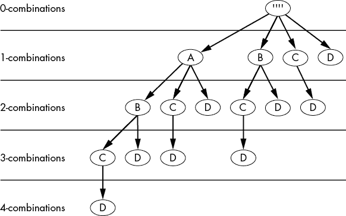

# 六、排列和组合

> 原文：[Chapter 6 - Permutations and Combinations](https://inventwithpython.com/recursion/chapter6.html)
> 
> 译者：[飞龙](https://github.com/wizardforcel)
> 
> 协议：[CC BY-NC-SA 4.0](https://creativecommons.org/licenses/by-nc-sa/4.0/)


涉及排列和组合的问题特别适合递归。这在*集合论*中很常见，集合论是处理对象集合的选择、排列和操作的数学逻辑分支。

处理我们短期记忆中的小集合很简单。我们可以轻松地想出一组三个或四个对象的每种可能顺序（即*排列*）或组合。对更大集合中的项目进行排序和组合需要相同的过程，但很快就变成了我们人类大脑无法完成的任务。在那一点上，引入计算机来处理随着我们向集合中添加更多对象而发生的组合爆炸变得实际。

在其核心，计算大群体的排列和组合涉及计算较小群体的排列和组合。这使得这些计算适合递归。在本章中，我们将看看用于生成字符串中所有可能排列和组合的递归算法。我们将扩展到生成所有可能的平衡括号组合（正确匹配的开括号顺序与闭括号）。最后，我们将计算集合的幂集，即集合的所有可能子集的集合。

本章中的许多递归函数都有一个名为`indent`的参数。这并不是由实际的递归算法使用的；相反，它是由它们的调试输出使用的，以便您可以看到哪个递归级别产生了输出。每次递归调用时缩进增加一个空格，并在调试输出中呈现为句点，以便轻松计算缩进级别。

## 集合论术语

本章并没有像数学或计算机科学教科书那样完全涵盖集合论。但它涵盖了足够的内容，以证明从解释该学科的基本术语开始是有道理的，因为这样做将使本章的其余部分更容易理解。*集合*是一组唯一对象，称为*元素*或*成员*。例如，字母*A*、*B*和*C*形成了一个三个字母的集合。在数学（以及 Python 代码语法）中，集合用大括号括起来，对象之间用逗号分隔：{A, B, C}。

集合的顺序并不重要；集合{A，B，C}与集合{C，B，A}是相同的集合。集合具有不同的元素，这意味着没有重复：{A，C，A，B}有重复的*A*，因此不是一个集合。

如果一个集合只包含另一个集合的成员，则称其为另一个集合的*子集*。例如，{A，C}和{B，C}都是{A，B，C}的子集，但{A，C，D}不是它的子集。相反，{A，B，C}是{A，C}和{B，C}的*超集*，因为它包含它们的所有元素。*空集*{}是一个不包含任何成员的集合。空集被认为是每个可能集合的子集。

一个子集也可以包括另一个集合的所有元素。例如，{A，B，C}是{A，B，C}的一个子集。但是，*真子集*或*严格子集*是一个不包含所有集合元素的子集。没有集合是其自身的真子集：因此{A，B，C}是一个子集，但不是{A，B，C}的真子集。所有其他子集都是真子集。图 6-1 显示了集合{A，B，C}及其一些子集的图形表示。


图 6-1：集合{A，B，C}在虚线内以及其一些子集{A，B，C}，{A，C}和{ }在实线内的图形表示。圆圈代表集合，字母代表元素。

一个集合的*排列*是集合中所有元素的特定顺序。例如，集合{A，B，C}有六个排列：ABC，ACB，BAC，BCA，CAB 和 CBA。我们称这些*排列*为*无重复*的*排列*，或者*无替换*的*排列*，因为每个元素在排列中不会出现超过一次。*

*一个*组合*是一个集合的元素选择。更正式地说，*k-组合*是从一个集合中选择 k 个元素的子集。与排列不同，组合没有顺序。例如，集合{A，B，C}的 2-组合是{A，B}，{A，C}和{B，C}。集合{A，B，C}的 3-组合是{A，B，C}。

“n 选 k”一词指的是可以从 n 个元素的集合中选择 k 个元素的可能组合（不重复）。 （一些数学家使用“n 选 r”一词。）这个概念与元素本身无关，只与它们的数量有关。例如，4 选 2 是 6，因为有六种方法可以从四个元素的集合{A，B，C，D}中选择两个元素：{A，B}，{A，C}，{A，D}，{B，C}，{B，D}和{C，D}。同时，3 选 3 是 1，因为从三个元素的集合{A，B，C}中只有一种 3 个元素的组合，即{A，B，C}本身。计算 n 选 k 的公式是（n！）/（k！×（n-k）！）。回想一下，n！是阶乘的表示法：5！是 5×4×3×2×1。

术语*n multichoose k*指的是可以从 n 个元素的集合中选择 k 个元素的可能组合*带有重复*。因为 k-组合是集合，而集合不包含重复元素，所以 k-组合不会重复。当我们使用带有重复元素的 k-组合时，我们特别称它们为*带重复的 k-组合*。

请记住，无论有无重复，您都可以将排列视为集合中所有元素的特定排列，而组合是集合中某些元素的无序选择。排列有顺序并使用集合中的所有元素，而组合没有顺序并使用集合中的任意数量的元素。为了更好地了解这些术语，表 6-1 显示了集合{A，B，C}的排列和组合之间的区别，有无重复。

表 6-1：集合{A，B，C}的所有可能排列和组合，有无重复。

| | **排列** | **组合** |
| --- | --- | --- |
| **无重复** | ABC，ACB，BAC，BCA，CAB | （无），A，B，C，AB，AC，BC，ABC |
| **有重复** | AAA，AAB，AAC，ABA，ABB，ABC，ACA，ACB，ACC，BAA，BAB，BAC，BBA，BBB，BBC，BCA，BCB，BCC，CAA，CAB，CAC，CBA，CBB，CBC，CCA，CCB，CCC | （无），A，B，C，AA，AB，AC，BB，BC，CC，AAA，AAB，AAC，ABB，ABC，ACC，BBB，BBC，BCC，CCC |

当我们向集合添加元素时，排列和组合的数量会迅速增长，这种*组合爆炸*由表 6-2 中的公式捕捉到。例如，一个包含 10 个元素的集合有 10！，或 3,628,800 个可能的排列，但是一个包含两倍元素的集合有 20！，或 2,432,902,008,176,640,000 个排列。

表 6-2：计算*n*元素集合的可能排列和组合的数量，有重复和无重复

|  | **排列** | **组合** |
| --- | --- | --- |
| **无重复** | *n*! | 2*n* |
| **有重复** | *n*^(*n*) | 2*n* 选择 *n*，或 (2*n*)!/(*n*!)² |

请注意，没有重复的排列总是与集合的大小相同。例如，{A，B，C}的排列总是三个字母长：ABC，ACB，BAC 等。然而，有重复的排列可以是任意长度。表 6-1 显示了{A，B，C}的三个字母排列，范围从 AAA 到 CCC，但是你也可以有有重复的五个字母排列，范围从 AAAAA 到 CCCCC。有重复的*n*元素的排列的长度为*k*的数量是*n*^(*k*)。表 6-2 将其列为*n*^(*n*)，表示有重复的*n*元素的排列也是*n*元素长的排列。

排列的顺序很重要，但组合的顺序不重要。虽然 AAB，ABA 和 BAA 被视为具有重复的相同组合，但它们被视为具有重复的三个不同排列。

## 寻找没有重复的所有排列：婚礼座位表

想象一下，你必须为一个有着微妙社交要求的婚礼宴会安排座位表。一些客人彼此讨厌，而其他人则要求坐在一个有影响力的客人附近。长方形桌子上的座位形成一排，而不是一个圆圈。对于你的计划来说，看到每个客人的所有可能的排列，也就是每个客人的没有重复的排列，将是有帮助的。没有重复发生，因为每个客人在座位表中只出现一次。

让我们以 Alice，Bob 和 Carol，或{A，B，C}为例。图 6-2 显示了这三位婚礼客人的所有六种可能排列。

我们确定没有重复的排列数量的一种方法是使用头尾递归策略。我们从集合中选择一个元素作为头部。然后我们得到剩余元素的每个排列（构成尾部），对于每个排列，我们将头部放在排列的每个可能位置上。

在我们的 ABC 示例中，我们将从 Alice（A）作为头部开始，Bob 和 Carol（BC）作为尾部。{B，C}的排列是 BC 和 CB。（我们如何得到 BC 和 CB 将在下一段解释，所以现在先把这个问题放在一边。）我们将 A 放在 BC 的每个可能位置上。也就是说，我们将 Alice 放在 Bob 之前（ABC），在 Bob 和 Carol 之间（BAC），和在 Carol 之后（BCA）。这样就创建了 ABC，BAC 和 BCA 的排列。我们还将 A 放在 CB 的每个可能位置上，创建了 ACB，CAB 和 CBA。这样就创建了 Alice，Bob 和 Carol 在宴会桌上的所有六种排列。现在我们可以选择导致最少争吵的安排（或者如果你想要一个难忘的婚礼宴会，也可以选择导致最多争吵的安排）。


图 6-2：桌子上三位婚礼客人的六种可能排列

当然，要得到{B，C}的每个排列，我们需要用 B 作为头部，C 作为尾部递归重复这个过程。单个字符的排列是字符本身；这是我们的基本情况。通过将头部 B 放在 C 的每个可能位置上，我们得到了上一段中使用的 BC 和 CB 排列。请记住，虽然集合的顺序无关紧要（如{B，C}与{C，B}相同），但排列的顺序很重要（BC 不是 CB 的重复）。

我们的递归排列函数接受一个字符字符串作为参数，并返回这些字符的每种可能排列的字符串数组。让我们针对这个函数的递归算法提出三个问题：

1.  什么是基本情况？单个字符字符串或空字符串的参数，返回一个只包含该字符串的数组。

1.  递归函数调用传递了什么参数？缺少一个字符的字符串参数。为每个缺失的字符进行了单独的递归调用。

1.  这个参数如何接近基本情况？字符串的大小缩小，最终变成一个单字符字符串。

递归排列算法在`permutations.py`中实现：

```py
def getPerms(chars, indent=0):
    print('.' * indent + 'Start of getPerms("' + chars + '")')
    if len(chars) == 1: # ❶
        # BASE CASE
        print('.' * indent + 'When chars = "' + chars + '" base case returns', chars)
        return [chars]

    # RECURSIVE CASE
    permutations = []
    head = chars[0] # ❷
    tail = chars[1:]
 tailPermutations = getPerms(tail, indent + 1)
    for tailPerm in tailPermutations: # ❸
        print('.' * indent + 'When chars =', chars, 'putting head', head, 'in all places in', tailPerm)
        for i in range(len(tailPerm) + 1): # ❹
            newPerm = tailPerm[0:i] + head + tailPerm[i:]
            print('.' * indent + 'New permutation:', newPerm)
            permutations.append(newPerm)
    print('.' * indent + 'When chars =', chars, 'results are', permutations)
    return permutations

print('Permutations of "ABCD":')
print('Results:', ','.join(getPerms('ABCD')))
```

等效的 JavaScript 程序在`permutations.html`中：

```js
<script type="text/javascript">
function getPerms(chars, indent) {
    if (indent === undefined) {
        indent = 0;
    }
    document.write('.'.repeat(indent) + 'Start of getPerms("' + chars + '")<br />');
    if (chars.length === 1) { // ❶
        // BASE CASE
        document.write('.'.repeat(indent) + "When chars = \"" + chars + 
        "\" base case returns " + chars + "<br />");
        return [chars];
    }
    // RECURSIVE CASE
    let permutations = [];
    let head = chars[0]; // ❷
    let tail = chars.substring(1);
    let tailPermutations = getPerms(tail, indent + 1);
    for (tailPerm of tailPermutations) { // ❸
        document.write('.'.repeat(indent) + "When chars = " + chars + 
        " putting head " + head + " in all places in " + tailPerm + "<br />");
        for (let i = 0; i < tailPerm.length + 1; i++) { // ❹
            let newPerm = tailPerm.slice(0, i) + head + tailPerm.slice(i);
            document.write('.'.repeat(indent) + "New permutation: " + newPerm + "<br />");
            permutations.push(newPerm);
        }
    }
    document.write('.'.repeat(indent) + "When chars = " + chars + 
    " results are " + permutations + "<br />");
    return permutations;
}

document.write("<pre>Permutations of \"ABCD\":<br />");
document.write("Results: " + getPerms("ABCD") + "</pre>");
</script>
```

这些程序的输出如下：

```py
Permutations of "ABCD":
Start of getPerms("ABCD")
.Start of getPerms("BCD")
..Start of getPerms("CD")
...Start of getPerms("D")
...When chars = "D" base case returns D
..When chars = CD putting head C in all places in D
..New permutation: CD
..New permutation: DC
..When chars = CD results are ['CD', 'DC']
.When chars = BCD putting head B in all places in CD
.New permutation: BCD
.New permutation: CBD
.New permutation: CDB
.When chars = BCD putting head B in all places in DC
.New permutation: BDC
.New permutation: DBC
.New permutation: DCB
.When chars = BCD results are ['BCD', 'CBD', 'CDB', 'BDC', 'DBC', 'DCB']
# --snip--
When chars = ABCD putting head A in all places in DCB
New permutation: ADCB
New permutation: DACB
New permutation: DCAB
New permutation: DCBA
When chars = ABCD results are ['ABCD', 'BACD', 'BCAD', 'BCDA', 'ACBD', 'CABD', 'CBAD', 'CBDA', 'ACDB','CADB', 'CDAB', 'CDBA', 'ABDC', 'BADC', 'BDAC', 'BDCA', 'ADBC', 'DABC', 'DBAC', 'DBCA', 'ADCB', 'DACB', 'DCAB', 'DCBA']
Results: ABCD,BACD,BCAD,BCDA,ACBD,CABD,CBAD,CBDA,ACDB,CADB,CDAB,CDBA,ABDC,
BADC,BDAC,BDCA,ADBC,DABC,DBAC,DBCA,ADCB,DACB,DCAB,DCBA
```

当调用`getPerms()`时，首先检查基本情况❶。如果`chars`字符串只有一个字符长，它只能有一个排列：`chars`字符串本身。函数将此字符串返回为数组。

否则，在递归情况下，函数将`chars`参数的第一个字符分为`head`变量和其余部分为`tail`变量❷。函数调用`getPerms()`递归获取`tail`字符串的所有排列。第一个`for`循环❸遍历这些排列的每一个，第二个`for`循环❹通过将`head`字符放在字符串的每个可能位置来创建一个新的排列。

例如，如果`getPerms()`的`chars`参数为`ABCD`，`head`为`A`，`tail`为`BCD`。`getPerms('BCD')`调用返回一个尾部排列的数组，`['BCD'，'CBD'，'CDB'，'BDC'，'DBC'，'DCB']`。第一个`for`循环从`BCD`排列开始，第二个`for`循环将`A`字符串放在`head`的每个可能位置，产生`ABCD`，`BACD`，`BCAD`，`BCDA`。这将重复进行剩余的尾部排列，并由`getPerms()`函数返回整个列表。

## 使用嵌套循环获取排列：一个不太理想的方法

假设我们有一个简单的自行车锁，如图 6-3，有一个四位数字组合。这个组合有 10,000 种数字排列（0000 到 9999），但只有一个可以打开它。（它们被称为*组合锁*；然而，在这种情况下更准确的称呼应该是*重复排列锁*，因为顺序很重要。）

现在假设我们有一个更简单的锁，只有五个字母 A 到 E。我们可以计算可能组合的数量为 5⁴，或 5×5×5×5，即 625。一个由*n*个可能性的集合中选择的每个字符的*k*字符组合锁是*n*^(*k*)。但是获取组合本身的列表要复杂一些。


图 6-3：四位数字组合自行车锁有 10⁴，或 10,000 种可能的重复排列（照片由 Shaun Fisher 提供，CC BY 2.0 许可）。

使用*嵌套循环*获得重复排列的一种方法是，即一个循环内嵌另一个循环。内部循环遍历集合中的每个元素，而外部循环也做同样的事情，同时重复内部循环。创建所有可能的*k*字符排列，每个字符从*n*个可能性的集合中选择，需要*k*个嵌套循环。

例如，`nestedLoopPermutations.py`包含生成{A，B，C，D，E}的所有 3 组合的代码：

**Python**

```py
for a in ['A', 'B', 'C', 'D', 'E']:
    for b in ['A', 'B', 'C', 'D', 'E']:
        for c in ['A', 'B', 'C', 'D', 'E']:
            for d in ['A', 'B', 'C', 'D', 'E']:
                print(a, b, c, d)
```

* nestedLoopPermutations.html *包含等效的 JavaScript 程序：

**JavaScript**

```js
<script>
for (a of ['A', 'B', 'C', 'D', 'E']) {
    for (b of ['A', 'B', 'C', 'D', 'E']) {
        for (c of ['A', 'B', 'C', 'D', 'E']) {
            for (d of ['A', 'B', 'C', 'D', 'E']) {
                document.write(a + b + c + d + "<br />")
            }
        }
    }
}
</script>
```

这些程序的输出如下：

```py
A A A A
A A A B
A A A C
A A A D
A A A E
A A B A
A A B B
# --snip--
E E E C
E E E D
E E E E
```

使用四个嵌套循环生成排列的问题在于，它仅适用于恰好为四个字符的排列。嵌套循环无法为任意长度生成排列。相反，我们可以使用递归函数，如下一节所述。

您可以通过本章中的示例来记住有和没有重复的排列之间的区别。没有重复的排列会遍历集合中元素的所有可能的排序，就像我们的婚礼座位表示例一样。有重复的排列会遍历组合锁的所有可能组合；顺序很重要，同一个元素可以出现多次。

## 重复排列：密码破解器

假设您收到了一份来自一位最近去世的记者的敏感加密文件。在他们的最后一条消息中，记者告诉您该文件包含了一个邪恶的亿万富翁的逃税记录。他们没有解密文件的密码，但他们知道密码正好是四个字符长；可能的字符是数字 2、4 和 8 以及字母 J、P 和 B。这些字符可以出现多次。例如，可能的密码是 JPB2、JJJJ 和 2442。

根据这些信息生成所有可能的四位密码列表，您希望获得集合{J，P，B，2，4，8}的所有可能的四元素重复排列。密码中的每个字符都可以是六个可能的字符之一，使得有 6×6×6×6，或 6⁴，即 1,296 种可能的排列。我们要生成{J，P，B，2，4，8}的排列，而不是组合，因为顺序很重要；JPB2 与 B2JP 是不同的密码。

让我们向这三个递归算法问题询问有关我们排列函数的问题。我们将使用更具描述性的名称`permLength`，而不是*k*：

1.  什么是基本情况？`permLength`参数为`0`，表示排列长度为零，表明`prefix`参数现在包含完整的排列，因此应该在数组中返回`prefix`。

1.  递归函数调用传递了什么参数？`chars`字符串是要获取排列的字符，`permLength`参数开始为`chars`的长度，`prefix`参数开始为空字符串。递归调用会递减`permLength`参数，同时将`chars`中的一个字符附加到`prefix`参数。

1.  这个参数如何接近基本情况？最终，`permLength`参数递减为`0`。

递归排列重复的算法在`permutationsWithRepetition.py`中实现：

```py
def getPermsWithRep(chars, permLength=None, prefix=''):
    indent = '.' * len(prefix)
    print(indent + 'Start, args=("' + chars + '", ' + str(permLength) + ', "' + prefix + '")')
    if permLength is None:
        permLength = len(chars)

    # BASE CASE
    if (permLength == 0): # ❶
        print(indent + 'Base case reached, returning', [prefix])
        return [prefix]

    # RECURSIVE CASE
    # Create a new prefix by adding each character to the current prefix.
    results = []
    print(indent + 'Adding each char to prefix "' + prefix + '".')
    for char in chars:
        newPrefix = prefix + char # ❷

        # Decrease permLength by one because we added one character to the prefix.
        results.extend(getPermsWithRep (chars, permLength - 1, newPrefix)) # ❸
    print(indent + 'Returning', results)
    return results

print('All permutations with repetition of JPB123:')
print(getPermsWithRep('JPB123', 4))
```

等效的 JavaScript 程序在`permutationsWithRepetition.html`中：

```js
<script type="text/javascript">
function getPermsWithRep(chars, permLength, prefix) {
    if (permLength === undefined) {
        permLength = chars.length;
    }
    if (prefix === undefined) {
        prefix = "";
    }
    let indent = ".".repeat(prefix.length);
    document.write(indent + "Start, args=(\"" + chars + "\", " + permLength + 
    ", \"" + prefix + "\")<br />");

    // BASE CASE
    if (permLength === 0) { // ❶
        document.write(indent + "Base case reached, returning " + [prefix] + "<br />");
        return [prefix];
    }

    // RECURSIVE CASE
    // Create a new prefix by adding each character to the current prefix.
    let results = [];
    document.write(indent + "Adding each char to prefix \"" + prefix + "\".<br />");
    for (char of chars) {
        let newPrefix = prefix + char; // ❷

        // Decrease permLength by one because we added one character to the prefix.
        results = results.concat(getPermsWithRep(chars, permLength - 1, newPrefix)); // ❸
    }
    document.write(indent + "Returning " + results + "<br />");
    return results;
}

document.write("<pre>All permutations with repetition of JPB123:<br />");
document.write(getPermsWithRep('JPB123', 4) + "</pre>");
</script>
```

这些程序的输出如下所示：

```py
All permutations with repetition of JPB123:
Start, args=("JPB123", 4, "")
Adding each char to prefix "".
.Start, args=("JPB123", 3, "J")
.Adding each char to prefix "J".
..Start, args=("JPB123", 2, "JJ")
..Adding each char to prefix "JJ".
...Start, args=("JPB123", 1, "JJJ")
...Adding each char to prefix "JJJ".
....Start, args=("JPB123", 0, "JJJJ")
....Base case reached, returning ['JJJJ']
....Start, args=("JPB123", 0, "JJJP")
....Base case reached, returning ['JJJP']
# --snip--
Returning ['JJJJ', 'JJJP', 'JJJB', 'JJJ1', 'JJJ2', 'JJJ3', 
'JJPJ', 'JJPP', 'JJPB', 'JJP1', 'JJP2', 'JJP3', 'JJBJ', 'JJBP', 
'JJBB', 'JJB1', 'JJB2', 'JJB3', 'JJ1J', 'JJ1P', 'JJ1B', 'JJ11', 
'JJ12', 'JJ13', 'JJ2J', 'JJ2P', 'JJ2B', 'JJ21', 'JJ22', 'JJ23', 
'JJ3J', 'JJ3P', 'JJ3B', 'JJ31', 'JJ32', 'JJ33', 'JPJJ', 
# --snip--
```

`getPermsWithRep()`函数有一个`prefix`字符串参数，默认情况下为空字符串。当调用该函数时，首先检查基本情况❶。如果`permLength`，即排列的长度，为`0`，则返回一个包含`prefix`的数组。

否则，在递归情况下，对于`chars`参数中的每个字符，函数创建一个新的前缀❷传递给递归的`getPermsWithRep()`调用。这个递归调用将`permLength - 1`作为`permLength`参数传递。

`permLength`参数从排列的长度开始，每次递归调用递减一次❸。`prefix`参数从空字符串开始，每次递归调用增加一个字符。因此，当达到`k == 0`的基本情况时，`prefix`字符串就是`k`的完整排列长度。

例如，让我们考虑调用`getPermsWithRep('ABC', 2)`的情况。`prefix`参数默认为空字符串。该函数对`ABC`的每个字符进行递归调用，并将其连接到空前缀字符串作为新前缀。调用`getPermsWithRep('ABC', 2)`会进行三次递归调用：

+   `getPermsWithRep('ABC', 1, 'A')`

+   `getPermsWithRep('ABC', 1, 'B')`

+   `getPermsWithRep('ABC', 1, 'C')`

这三个调用将各自进行三次递归调用，但将`permLength`的值设为`0`而不是`1`。基本情况发生在`permLength == 0`时，因此它们返回它们的前缀。这就是生成所有九个排列的方式。`getPermsWithRep()`函数以相同的方式生成更大集合的排列。

## 使用递归获取 K-组合

回想一下，对于排列而言，顺序并不重要。然而，生成集合的所有*k*-组合有点棘手，因为你不希望算法生成重复项：如果你从集合{A，B，C}创建 AB 2-组合，你不希望也创建 BA，因为它与 AB 是相同的 2-组合。

要弄清楚如何编写递归代码来解决这个问题，让我们看看树如何以可视化方式描述生成集合的所有*k*-组合。图 6-4 显示了来自集合{A，B，C，D}的所有组合的树。



图 6-4：显示来自集合{A，B，C，D}的每个可能*k*-组合（从 0 到 4）的树

例如，要从这棵树中收集 3-组合，从顶部的根节点开始，进行深度优先树遍历到 3-组合级别，同时记住每个节点的字母直到底部。（深度优先搜索在第四章中讨论。）我们的第一个 3-组合将从根到 1-组合级别的 A 开始，然后到 2-组合级别的 B，然后到 3-组合级别的 C，我们停在那里，得到了我们完整的 3-组合：ABC。对于下一个组合，我们从根到 A 到 B 到 D，得到了组合 ABD。我们继续为 ACD 和 BCD 做同样的操作。我们的树在 3-组合级别有四个节点，从{A，B，C，D}中有四个 3-组合：ABC，ABD，ACD 和 BCD。

请注意，我们通过从根节点开始使用空字符串创建了图 6-4 中的树。这是 0-组合级别，并且适用于从集合中选择零个元素的所有组合；它只是一个空字符串。根的子节点都是来自集合的所有元素。在我们的情况下，这是来自{A，B，C，D}的所有四个元素。虽然集合没有顺序，但在生成这棵树时，我们需要一致地使用集合的 ABCD 顺序。这是因为每个节点的子节点都包括在 ABCD 字符串中它之后的字母：所有 A 节点都有 B、C 和 D 子节点；所有 B 节点都有 C 和 D 子节点；所有 C 节点只有一个 D 子节点；所有 D 节点没有子节点。

虽然它与递归组合函数没有直接关系，但也注意每个级别的*k*-组合数量的模式：

+   0-组合和 4-组合级别都有一个组合：空字符串和 ABCD，分别。

+   1-组合和 3-组合级别都有四个组合：A，B，C，D 和 ABC，ABD，ACD，BCD，分别。

+   中间的 2-组合级别有最多的六个组合：AB，AC，AD，BC，BD 和 CD。

组合数量增加、在中间达到峰值，然后减少的原因是*k*-组合是彼此的镜像。例如，1-组合是由未被选中的元素构成 3-组合的：

+   1-组合 A 是 3-组合 BCD 的镜像。

+   1-组合 B 是 3-组合 ACD 的镜像。

+   1-组合 C 是 3-组合 ABD 的镜像。

+   1-组合 D 是 3-组合 ABC 的镜像。

我们将创建一个名为`getCombos()`的函数，它接受两个参数：一个`chars`字符串，其中包含要获取组合的字母，以及组合的大小`k`。返回值是一个字符串数组，其中包含来自字符串`chars`的组合，每个组合的长度为`k`。

我们将使用`chars`参数的头部-尾部技术。例如，假设我们调用`getCombos('ABC', 2)`来从{A, B, C}获取所有 2-组合。该函数将`A`设置为头部，`BC`设置为尾部。图 6-5 显示了从{A, B, C}选择 2-组合的树。


图 6-5：树状图显示了从集合{A, B, C}中的每个可能的 2-组合

让我们问一下我们的三个递归算法问题：

1.  什么是基本情况？第一个基本情况是`k`参数为`0`，这意味着请求 0-组合，无论`chars`是什么，它总是一个空字符串数组。第二种情况是如果`chars`是空字符串，则是一个空数组，因为从空字符串中无法生成任何可能的组合。

1.  传递给递归函数调用的参数是什么？对于第一个递归调用，传递了`chars`的尾部和`k - 1`。对于第二个递归调用，传递了`chars`的尾部和`k`。

1.  这个参数如何接近基本情况？由于递归调用会减少`k`并从`chars`参数中删除头部，最终`k`参数会减少到`0`，或者`chars`参数会变成空字符串。

生成组合的 Python 代码在`combinations.py`中：

**Python**

```py
def getCombos(chars, k, indent=0):
    debugMsg = '.' * indent + "In getCombos('" + chars + "', " + str(k) + ")"
    print(debugMsg + ', start.')
    if k == 0:
        # BASE CASE
        print(debugMsg + " base case returns ['']")
        # If k asks for 0-combinations, return '' as the selection of
        # zero letters from chars.
        return ['']
    elif chars == '':
        # BASE CASE
        print(debugMsg + ' base case returns []')
        return [] # A blank chars has no combinations, no matter what k is.

    # RECURSIVE CASE
    combinations = []
    # First part, get the combos that include the head: # ❶
    head = chars[:1]
    tail = chars[1:]
    print(debugMsg + " part 1, get combos with head '" + head + "'")
    tailCombos = getCombos(tail, k - 1, indent + 1) # ❷
    print('.' * indent + "Adding head '" + head + "' to tail combos:")
    for tailCombo in tailCombos:
        print('.' * indent + 'New combination', head + tailCombo)
        combinations.append(head + tailCombo)

    # Second part, get the combos that don't include the head: # ❸
    print(debugMsg + " part 2, get combos without head '" + head + "')")
    combinations.extend(getCombos(tail, k, indent + 1)) # ❹

    print(debugMsg + ' results are', combinations)
    return combinations

print('2-combinations of "ABC":')
print('Results:', getCombos('ABC', 2))
```

等效的 JavaScript 程序在`combinations.html`中：

```js
<script type="text/javascript">
function getCombos(chars, k, indent) {
    if (indent === undefined) {
        indent = 0;
    }
    let debugMsg = ".".repeat(indent) + "In getCombos('" + chars + "', " + k + ")";
    document.write(debugMsg + ", start.<br />");
    if (k == 0) {
        // BASE CASE
        document.write(debugMsg + " base case returns ['']<br />");
        // If k asks for 0-combinations, return '' as the selection of zero letters from chars.
        return [""];
    } else if (chars == "") {
        // BASE CASE
        document.write(debugMsg + " base case returns []<br />");
 return []; // A blank chars has no combinations, no matter what k is.
    }

    // RECURSIVE CASE
    let combinations = [];
    // First part, get the combos that include the head: // ❶
    let head = chars.slice(0, 1);
    let tail = chars.slice(1, chars.length);
    document.write(debugMsg + " part 1, get combos with head '" + head + "'<br />");
    let tailCombos = getCombos(tail, k - 1, indent + 1); // ❷
    document.write(".".repeat(indent) + "Adding head '" + head + "' to tail combos:<br />");
    for (tailCombo of tailCombos) {
        document.write(".".repeat(indent) + "New combination " + head + tailCombo + "<br />");
        combinations.push(head + tailCombo);
    }
    // Second part, get the combos that don't include the head: // ❸
    document.write(debugMsg + " part 2, get combos without head '" + head + "')<br />");
    combinations = combinations.concat(getCombos(tail, k, indent + 1)); // ❹

    document.write(debugMsg + " results are " + combinations + "<br />");
    return combinations;
}

document.write('<pre>2-combinations of "ABC":<br />');
document.write("Results: " + getCombos("ABC", 2) + "<br /></pre>");
</script>
```

这些程序的输出如下：

```py
2-combinations of "ABC":
In getCombos('ABC', 2), start.
In getCombos('ABC', 2) part 1, get combos with head 'A'
.In getCombos('BC', 1), start.
.In getCombos('BC', 1) part 1, get combos with head 'B'
..In getCombos('C', 0), start.
..In getCombos('C', 0) base case returns ['']
.Adding head 'B' to tail combos:
.New combination B
.In getCombos('BC', 1) part 2, get combos without head 'B')
..In getCombos('C', 1), start.
..In getCombos('C', 1) part 1, get combos with head 'C'
...In getCombos('', 0), start.
...In getCombos('', 0) base case returns ['']
..Adding head 'C' to tail combos:
..New combination C
..In getCombos('C', 1) part 2, get combos without head 'C')
...In getCombos('', 1), start.
...In getCombos('', 1) base case returns []
..In getCombos('C', 1) results are ['C']
.In getCombos('BC', 1) results are ['B', 'C']
Adding head 'A' to tail combos:
New combination AB
New combination AC
In getCombos('ABC', 2) part 2, get combos without head 'A')
.In getCombos('BC', 2), start.
.In getCombos('BC', 2) part 1, get combos with head 'B'
..In getCombos('C', 1), start.
..In getCombos('C', 1) part 1, get combos with head 'C'
...In getCombos('', 0), start.
...In getCombos('', 0) base case returns ['']
..Adding head 'C' to tail combos:
..New combination C
..In getCombos('C', 1) part 2, get combos without head 'C')
...In getCombos('', 1), start.
...In getCombos('', 1) base case returns []
..In getCombos('C', 1) results are ['C']
.Adding head 'B' to tail combos:
.New combination BC
.In getCombos('BC', 2) part 2, get combos without head 'B')
..In getCombos('C', 2), start.
..In getCombos('C', 2) part 1, get combos with head 'C'
...In getCombos('', 1), start.
...In getCombos('', 1) base case returns []
..Adding head 'C' to tail combos:
..In getCombos('C', 2) part 2, get combos without head 'C')
...In getCombos('', 2), start.
...In getCombos('', 2) base case returns []
..In getCombos('C', 2) results are []
.In getCombos('BC', 2) results are ['BC']
In getCombos('ABC', 2) results are ['AB', 'AC', 'BC']
Results: ['AB', 'AC', 'BC']
```

每个`getCombos()`函数调用都有两个递归调用，用于算法的两个部分。对于我们的`getCombos('ABC', 2)`示例，第一部分❶是获取包含头部`A`的所有组合。在树中，这会生成 1-组合级别下 A 节点下的所有组合。

我们可以通过将尾部和`k - 1`传递给第一个递归函数调用`getCombos('BC', 1)` ❷来实现这一点。我们将`A`添加到这个递归函数调用返回的每个组合中。让我们使用信任原则，假设我们的`getCombos()`正确返回了一个*k*-组合列表`['B', 'C']`，即使我们还没有完成编写它。现在我们已经有了包含头部`A`的所有*k*-组合的数组来保存我们的结果：`['AB', 'AC']`。

第二部分❸获取不包括头部`A`的所有组合。在树中，这会生成 1-组合级别中 A 节点右侧的所有组合。我们可以通过将尾部和`k`传递给第二个递归函数调用`getCombos('BC', 2)`来实现这一点。这将返回`['BC']`，因为 BC 是 BC 的唯一 2-组合。

`getCombos('ABC', 2)`的两个递归调用的结果，`['AB', 'AC']`和`['BC']`被连接在一起并返回：`['AB', 'AC', 'BC']` ❹。`getCombos()`函数以相同的方式生成更大集合的组合。

## 获取平衡括号的所有组合

如果每个开括号后面都紧跟一个闭括号，则字符串具有*平衡括号*。例如，`′()()′`和`′(())′`是两对平衡括号的字符串，但`′)(()′`和`′(()′`则不是平衡的。这些字符串也被称为*Dyck words*，以数学家瓦尔特·冯·迪克命名。

一个常见的编码面试问题是编写一个递归函数，给定括号对的数量，生成所有可能的平衡括号的组合。例如，调用`getBalancedParens(3)`应该返回`['((()))', '(()())', '(())()', '()(())', '()()()']`。请注意，调用`getBalancedParens(``n``)`会返回长度为 2*n*的字符串，因为每个字符串由*n*对括号组成。

“我们可以尝试通过找到括号字符的所有排列来解决这个问题，但这将导致平衡和不平衡的括号字符串。即使稍后过滤掉无效的字符串，对于*n*对括号，存在 2*n*!种排列。该算法速度太慢，不实用。

相反，我们可以实现一个递归函数来生成所有平衡括号的字符串。我们的`getBalancedParens()`函数接受一个整数，表示括号对的数量，并返回一个平衡括号字符串的列表。该函数通过添加开放或关闭括号来构建这些字符串。只有在剩余要使用的开放括号时才能添加开放括号。只有在迄今为止添加的开放括号比关闭括号多时才能添加关闭括号。

我们将使用名为`openRem`和`closeRem`的函数参数跟踪剩余要使用的开放和关闭括号的数量。当前正在构建的字符串是另一个名为`current`的函数参数，它与*permutationsWithRepetition*程序中的`prefix`参数具有类似的作用。第一个基本情况发生在`openRem`和`closeRem`都为`0`且没有更多的括号要添加到`current`字符串时。第二个基本情况发生在两个递归情况在添加开放和/或关闭括号后接收到平衡括号字符串列表之后。

让我们问一下关于`getBalancedParens()`函数的三个递归算法问题：

1.  什么是基本情况？当剩余要添加到正在构建的字符串中的开放和关闭括号的数量达到`0`时。第二个基本情况总是在递归情况完成后发生。

1.  递归函数调用传递了什么参数？括号对的总数（`pairs`），剩余要添加的开放和关闭括号的数量（`openRem`和`closeRem`），以及当前正在构建的字符串（`current`）。

1.  这个参数如何接近基本情况？当我们向`current`添加更多的开放和关闭括号时，我们递减`openRem`和`closeRem`参数，直到它们变为 0。

`balancedParentheses.py`文件包含了我们平衡括号递归函数的 Python 代码：

```py
def getBalancedParens(pairs, openRem=None, closeRem=None, current='', indent=0):
    if openRem is None: # ❶
        openRem = pairs
    if closeRem is None:
        closeRem = pairs

    print('.' * indent, end='')
    print('Start of pairs=' + str(pairs) + ', openRem=' + 
    str(openRem) + ', closeRem=' + str(closeRem) + ', current="' + current + '"')
    if openRem == 0 and closeRem == 0: # ❷
        # BASE CASE
        print('.' * indent, end='')
        print('1st base case. Returning ' + str([current]))
        return [current] # ❸

    # RECURSIVE CASE
    results = []
    if openRem > 0: # ❹
        print('.' * indent, end='')
        print('Adding open parenthesis.')
        results.extend(getBalancedParens(pairs, openRem - 1, closeRem, 
        current + '(', indent + 1))
    if closeRem > openRem: # ❺
        print('.' * indent, end='')
        print('Adding close parenthesis.')
        results.extend(getBalancedParens(pairs, openRem, closeRem - 1, 
        current + ')', indent + 1))

    # BASE CASE
    print('.' * indent, end='')
    print('2nd base case. Returning ' + str(results))
    return results # ❻

print('All combinations of 2 balanced parentheses:')
print('Results:', getBalancedParens(2))
```

`balancedParentheses.html`文件包含了该程序的 JavaScript 等效代码：

```js
<script type="text/javascript">
function getBalancedParens(pairs, openRem, closeRem, current, indent) {
    if (openRem === undefined) { // ❶
        openRem = pairs;
    }
    if (closeRem === undefined) {
        closeRem = pairs;
    }
    if (current === undefined) {
        current = "";
    }
 if (indent === undefined) {
        indent = 0;
    }

    document.write(".".repeat(indent) + "Start of pairs=" + 
    pairs + ", openRem=" + openRem + ", closeRem=" + 
    closeRem + ", current=\"" + current + "\"<br />");
    if (openRem === 0 && closeRem === 0) { // ❷
        // BASE CASE
        document.write(".".repeat(indent) + 
        "1st base case. Returning " + [current] + "<br />");
        return [current]; // ❸
    }

    // RECURSIVE CASE
    let results = [];
    if (openRem > 0) { // ❹
        document.write(".".repeat(indent) + "Adding open parenthesis.<br />");
        Array.prototype.push.apply(results, getBalancedParens(
        pairs, openRem - 1, closeRem, current + '(', indent + 1));
    }
    if (closeRem > openRem) { // ❺
        document.write(".".repeat(indent) + "Adding close parenthesis.<br />");
        results = results.concat(getBalancedParens(
        pairs, openRem, closeRem - 1, current + ')', indent + 1));
    }

    // BASE CASE
    document.write(".".repeat(indent) + "2nd base case. Returning " + results + "<br />");
    return results; // ❻
}

document.write(<pre>"All combinations of 2 balanced parentheses:<br />");
document.write("Results: ", getBalancedParens(2), "</pre>");
</script>
```

这些程序的输出如下：

```py
All combinations of 2 balanced parentheses:
Start of pairs=2, openRem=2, closeRem=2, current=""
Adding open parenthesis.
.Start of pairs=2, openRem=1, closeRem=2, current="("
.Adding open parenthesis.
..Start of pairs=2, openRem=0, closeRem=2, current="(("
..Adding close parenthesis.
...Start of pairs=2, openRem=0, closeRem=1, current="(()"
...Adding close parenthesis.
....Start of pairs=2, openRem=0, closeRem=0, current="(())"
....1st base case. Returning ['(())']
...2nd base case. Returning ['(())']
..2nd base case. Returning ['(())']
.Adding close parenthesis.
..Start of pairs=2, openRem=1, closeRem=1, current="()"
..Adding open parenthesis.
...Start of pairs=2, openRem=0, closeRem=1, current="()("
...Adding close parenthesis.
....Start of pairs=2, openRem=0, closeRem=0, current="()()"
....1st base case. Returning ['()()']
...2nd base case. Returning ['()()']
..2nd base case. Returning ['()()']
.2nd base case. Returning ['(())', '()()']
2nd base case. Returning ['(())', '()()']
Results: ['(())', '()()']
```

`getBalancedParens()`函数❶在用户调用时需要一个参数，即括号对的数量。但是，它需要在递归调用中传递额外的信息。这些信息包括剩余要添加的开放括号的数量（`openRem`），剩余要添加的关闭括号的数量（`closeRem`）和当前正在构建的平衡括号字符串（`current`）。`openRem`和`closeRem`都以与`pairs`参数相同的值开始，而`current`则以空字符串开始。`indent`参数仅用于调试输出，以显示程序的递归函数调用级别。

函数首先检查剩余要添加的开放和关闭括号的数量❷。如果两者都是`0`，我们已经达到了第一个基本情况，并且`current`中的字符串已经完成。由于`getBalancedParens()`函数返回一个字符串列表，我们将`current`放入列表中并返回它❸。

否则，函数继续进行递归。如果可能的话，剩余的开放括号❹，函数调用`getBalancedParens()`并向当前参数添加一个开放括号。如果剩余的关闭括号比开放括号多❺，函数调用`getBalancedParens()`并向当前参数添加一个关闭括号。这个检查确保不会添加不匹配的关闭括号，因为这会使字符串不平衡，比如`())`中的第二个关闭括号。

在这些递归情况之后是一个无条件的基本情况，它返回从两个递归函数调用返回的所有字符串（当然还有这些递归函数调用所做的递归函数调用，依此类推）❻。

## 幂集：查找集合的所有子集

一个集合的*幂集*是该集合的每个可能子集的集合。例如，{A, B, C}的幂集是{{ }, {A}, {B}, {C}, {A, B}, {A, C}, {B, C}, {A, B, C}}。这等同于集合的每个可能*k*组合的集合。毕竟，{A, B, C}的幂集包含了它的所有 0-组合、1-组合、2-组合和 3-组合。

如果你正在寻找一个现实世界的例子，你需要生成一个集合的幂集，想象一下一个面试官要求你生成一个集合的幂集。你几乎不可能需要为任何其他原因生成一个集合的幂集，包括你正在面试的工作。

要找到集合的每个幂集，我们可以重用我们现有的`getCombos()`函数，用每个可能的*k*参数重复调用它。这种方法被`powerSetCombinations.py`和`powerSetCombinations.html`程序采用，这些程序可以从[`nostarch.com/recursive-book-recursion`](https://nostarch.com/recursive-book-recursion)的可下载资源文件中获得。

然而，我们可以使用更有效的方法来生成幂集。让我们考虑{A, B}的幂集，即{{A, B}, {A}, {B}, { }}。现在假设我们再添加一个元素 C 到集合中，并且想要生成{A, B, C}的幂集。我们已经生成了{A, B}的幂集中的四个集合；此外，我们有这些相同的四个集合，但是加上了元素 C：{{A, B, C}, {A, C}, {B, C}, {C}}。表 6-3 显示了向集合添加更多元素如何向其幂集添加更多集合的模式。

表 6-3：随着新元素（加粗）添加到集合中，幂集如何增长

| **带有新元素的集合** | **幂集的新集合** | **完整的幂集** |
| --- | --- | --- |
| { } | { } | {{ }} |
| {A} | {A} | {{ }, **{A}**} |
| {A, B} | {B}, {A, B} | {{ }, {A}, **{B}**, **{A, B}**} |
| {A, B, C} | {C}, {A, C}, {B, C}, {A, B, C} | {{ }, {A}, {B}, **{C}**, {A, B}, **{A, C}**, **{B, C}**, **{A, B, C}**} |
| {A, B, C, D} | {D}, {A, D}, {B, D}, {C, D}, {A, B, D}, {A, C, D}, {B, C, D}, {A, B, C, D} | {{ }, {A}, {B}, {C}, **{D}**, {A, B}, {A, C}, **{A, D}**, {B, C}, **{B, D}**, **{C, D}**, {A, B, C}, {A, B, D}, {A, C, D}, **{B, C, D}**, **{A, B, C, D}**} |

更大集合的幂集类似于更小集合的幂集，这暗示我们可以创建一个递归函数来生成它们。基本情况是一个空集，它的幂集是一个只有空集的集合。我们可以使用头尾技术来实现这个递归函数。对于我们添加的每个新元素，我们希望得到尾部的幂集以添加到我们的完整幂集中。我们还将头元素添加到尾部幂集中的每个集合中。这些一起形成了`chars`参数的完整幂集。

让我们问三个递归算法问题关于我们的幂集算法：

1.  什么是基本情况？如果`chars`是空字符串（空集），函数返回一个只有空字符串的数组，因为空集是空集的唯一子集。

1.  递归函数调用传递了什么参数？`chars`的尾部被传递。

1.  这个参数如何接近基本情况？由于递归调用从`chars`参数中删除头部，最终`chars`参数变为空字符串。

`getPowerSet()`递归函数在`powerSet.py`中实现：

**Python**

```py
def getPowerSet(chars, indent=0):
    debugMsg = '.' * indent + 'In getPowerSet("' + chars + '")'
    print(debugMsg + ', start.')

    if chars == '': # ❶
        # BASE CASE
        print(debugMsg + " base case returns ['']")
        return ['']

    # RECURSIVE CASE
    powerSet = []
    head = chars[0]
    tail = chars[1:]

    # First part, get the sets that don't include the head:
    print(debugMsg, "part 1, get sets without head '" + head + "'")
    tailPowerSet = getPowerSet(tail, indent + 1) # ❷

    # Second part, get the sets that include the head:
    print(debugMsg, "part 2, get sets with head '" + head + "'")
    for tailSet in tailPowerSet:
        print(debugMsg, 'New set', head + tailSet)
        powerSet.append(head + tailSet) # ❸

    powerSet = powerSet + tailPowerSet
    print(debugMsg, 'returning', powerSet)
    return powerSet # ❹

print('The power set of ABC:')
print(getPowerSet('ABC'))
```

等效的 JavaScript 代码在`powerSet.html`中：

```js
<script type="text/javascript">
function getPowerSet(chars, indent) {
    if (indent === undefined) {
        indent = 0;
    }
    let debugMsg = ".".repeat(indent) + 'In getPowerSet("' + chars + '")';
    document.write(debugMsg + ", start.<br />");

    if (chars == "") { // ❶
        // BASE CASE
        document.write(debugMsg + " base case returns ['']<br />");
        return [''];
    }

    // RECURSIVE CASE
    let powerSet = [];
    let head = chars[0];
    let tail = chars.slice(1, chars.length);

 // First part, get the sets that don't include the head:
    document.write(debugMsg + 
    " part 1, get sets without head '" + head + "'<br />");
    let tailPowerSet = getPowerSet(tail, indent + 1); // ❷

    // Second part, get the sets that include the head:
    document.write(debugMsg + 
    " part 2, get sets with head '" + head + "'<br />");
    for (tailSet of tailPowerSet) {
        document.write(debugMsg + " New set " + head + tailSet + "<br />");
        powerSet.push(head + tailSet); // ❸
    }

    powerSet = powerSet.concat(tailPowerSet);
    document.write(debugMsg + " returning " + powerSet + "<br />");
    return powerSet; // ❹
}

document.write("<pre>The power set of ABC:<br />")
document.write(getPowerSet("ABC") + "<br /></pre>");
</script>
```

程序输出如下：

```py
The power set of ABC:
In getPowerSet("ABC"), start.
In getPowerSet("ABC") part 1, get sets without head 'A'
.In getPowerSet("BC"), start.
.In getPowerSet("BC") part 1, get sets without head 'B'
..In getPowerSet("C"), start.
..In getPowerSet("C") part 1, get sets without head 'C'
...In getPowerSet(""), start.
...In getPowerSet("") base case returns ['']
..In getPowerSet("C") part 2, get sets with head 'C'
..In getPowerSet("C") New set C
..In getPowerSet("C") returning ['C', '']
.In getPowerSet("BC") part 2, get sets with head 'B'
.In getPowerSet("BC") New set BC
.In getPowerSet("BC") New set B
.In getPowerSet("BC") returning ['BC', 'B', 'C', '']
In getPowerSet("ABC") part 2, get sets with head 'A'
In getPowerSet("ABC") New set ABC
In getPowerSet("ABC") New set AB
In getPowerSet("ABC") New set AC
In getPowerSet("ABC") New set A
In getPowerSet("ABC") returning ['ABC', 'AB', 'AC', 'A', 'BC', 'B', 'C', '']
['ABC', 'AB', 'AC', 'A', 'BC', 'B', 'C', '']
```

`getPowerSet()`函数接受一个参数：包含原始集合字符的字符串`chars`。基本情况发生在`chars`是空字符串❶时，表示空集。回想一下，幂集是原始集合的所有子集。因此，空集的幂集只是包含空集的集合，因为空集是空集的唯一子集。这就是为什么基本情况返回`['']`。

递归情况分为两部分。第一部分是获取`chars`尾部的幂集。我们将使用信任原则，假设调用`getPowerSet()`返回尾部的幂集正确❷，即使在这一点上我们仍在编写`getPowerSet()`的代码。

为了形成`chars`的完整幂集，递归情况的第二部分通过将头部添加到每个尾部幂集来形成新集合❸。与第一部分的集合一起，这形成了`chars`的幂集，在函数结束时返回❹。

## 总结

排列和组合是许多程序员不知道如何开始解决的两个问题领域。虽然递归通常是常见编程问题的过于复杂的解决方案，但它非常适合本章任务的复杂性。

本章以简要介绍集合论开始。这为我们的递归算法操作的数据结构奠定了基础。集合是不同元素的集合。子集包括集合中的一些或所有元素。虽然集合的元素没有顺序，排列是集合中元素的特定顺序。而组合没有顺序，是集合中元素的特定选择。集合的*k*组合是从集合中选择的*k*个元素的子集。

排列和组合可以包括一个元素，也可以重复元素。我们称这些为无重复排列或组合和有重复排列或组合。这些由不同的算法实现。

本章还解决了在编码面试中常用的平衡括号问题。我们的算法通过从空字符串开始并添加开放和关闭括号来构建平衡括号的字符串。这种方法涉及回溯到较早的字符串，使递归成为一种理想的技术。

最后，本章介绍了一个用于生成幂集的递归函数，即集合中所有可能的*k*组合的集合。我们创建的递归函数比反复调用组合函数来生成每个可能大小的子集要高效得多。

## 进一步阅读

生成排列和组合只是揭示了你可以用排列和组合以及数学逻辑领域*集合论*做什么的冰山一角。以下维基百科文章提供了这些主题的更多细节，每个链接到维基百科文章：

+   [`en.wikipedia.org/wiki/Set_theory`](https://en.wikipedia.org/wiki/Set_theory)

+   [`en.wikipedia.org/wiki/Combination`](https://en.wikipedia.org/wiki/Combination)

+   [`en.wikipedia.org/wiki/Permutation`](https://en.wikipedia.org/wiki/Permutation)

Python 标准库提供了排列、组合和其他算法的实现，位于其`itertools`模块中。该模块在[`docs.python.org/3/library/itertools.html`](https://docs.python.org/3/library/itertools.html)中有文档。

排列和组合也在统计和概率数学课程中涵盖。可在 Khan Academy 的计数、排列和组合单元中找到[`www.khanacademy.org/math/statistics-probability/counting-permutations-and-combinations`](https://www.khanacademy.org/math/statistics-probability/counting-permutations-and-combinations)。

## 练习问题

通过回答以下问题来测试您的理解：

1.  集合的元素是否有特定顺序？排列呢？组合呢？

1.  一个包含*n*个元素的集合有多少排列（不重复）？

1.  一个包含*n*个元素的集合有多少组合（不重复）？

1.  {A，B，C}是{A，B，C}的子集吗？

1.  计算*n*选择*k*的公式是什么，即从*n*个元素的集合中选择*k*个元素的可能组合数？

1.  确定以下哪些是排列或组合，有或没有重复：

1.  AAA，AAB，AAC，ABA，ABB，ABC，ACA，ACB，ACC，BAA，BAB，BAC，BBA，BBB，BBC，BCA，BCB，BCC，CAA，CAB，CAC，CBA，CBB，CBC，CCA，CCB，CCC

1.  ABC，ACB，BAC，BCA，CAB

1.  （无），A，B，C，AB，AC，BC，ABC

1.  （无），A，B，C，AA，AB，AC，BB，BC，CC，AAA，AAB，AAC，ABB，ABC，ACC，BBB，BBC，BCC，CCC

1.  绘制一个树图，可用于生成集合{A，B，C，D}的所有可能组合。

1.  回答本章中每个递归算法的递归解决方案的三个问题：

1.  基本情况是什么？

1.  递归函数调用传递了什么参数？

1.  这个论点如何接近基本情况？

然后，重新创建本章中的递归算法，而不查看原始代码。

## 练习项目

为练习，编写一个执行以下任务的函数：

1.  本章中的排列函数操作字符串值中的字符。修改它，使得集合由列表（在 Python 中）或数组（在 JavaScript 中）表示，元素可以是任何数据类型的值。例如，您的新函数应该能够生成整数值的排列，而不是字符串。

1.  本章中的组合函数操作字符串值中的字符。修改它，使得集合由列表（在 Python 中）或数组（在 JavaScript 中）表示，元素可以是任何数据类型的值。例如，您的新函数应该能够生成整数值的组合，而不是字符串。

