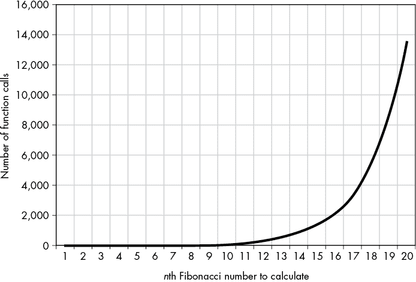

# 七、记忆化和动态规划

> 原文：[Chapter 7 - Memoization and Dynamic Programming](https://inventwithpython.com/recursion/chapter7.html)
> 
> 译者：[飞龙](https://github.com/wizardforcel)
> 
> 协议：[CC BY-NC-SA 4.0](https://creativecommons.org/licenses/by-nc-sa/4.0/)


在本章中，我们将探讨记忆化，这是一种使递归算法运行更快的技术。我们将讨论记忆化是什么，如何应用它，以及它在函数式编程和动态规划领域的用处。我们将使用第二章中的斐波那契算法来演示我们编写的代码和 Python 标准库中可以找到的记忆化功能。我们还将了解为什么记忆化不能应用于每个递归函数。

## 记忆化

*记忆化*是记住函数对其提供的特定参数的返回值的技术。例如，如果有人让我找到 720 的平方根，即乘以自身的结果为 720 的数字，我将不得不坐下来用铅笔和纸几分钟（或在 JavaScript 中调用`Math.sqrt(720)`或在 Python 中调用`math.sqrt(720)`）来算出答案：26.832815729997478。如果他们几秒钟后再问我，我就不必重复计算，因为我已经有了答案。通过缓存先前计算的结果，记忆化通过增加内存使用量来节省执行时间。

将*记忆化*与*记忆*混淆是许多人现代的错误。 （随时可以做一个备忘录来提醒自己它们的区别。）

### 自顶向下的动态规划

记忆化是*动态规划*中的一种常见策略，这是一种涉及将大问题分解为重叠子问题的计算机编程技术。这听起来很像我们已经看到的普通递归。关键区别在于动态规划使用具有重复递归情况的递归；这些是*重叠*子问题。

例如，让我们考虑第二章中的递归斐波那契算法。进行递归`fibonacci(6)`函数调用将依次调用`fibonacci(5)`和`fibonacci(4)`。接下来，`fibonacci(5)`将调用`fibonacci(4)`和`fibonacci(3)`。斐波那契算法的子问题重叠，因为`fibonacci(4)`调用以及许多其他调用都是重复的。这使得生成斐波那契数成为一个动态规划问题。

这里存在一个低效：多次执行相同的计算是不必要的，因为`fibonacci(4)`将始终返回相同的值，即整数`3`。相反，我们的程序可以记住，如果递归函数的参数是`4`，函数应立即返回`3`。

图 7-1 显示了所有递归调用的树状图，包括记忆化可以优化的冗余函数调用。与此同时，快速排序和归并排序是递归分而治之算法，但它们的子问题不重叠；它们是独特的。动态规划技术不适用于这些排序算法。


图 7-1：从`fibonacci(6)`开始进行的递归函数调用的树状图。冗余的函数调用以灰色显示。

动态规划的一种方法是对递归函数进行记忆化，以便将先前的计算记住以供将来的函数调用使用。如果我们可以重用先前的返回值，重叠子问题就变得微不足道了。

使用记忆化的递归称为*自顶向下动态规划*。这个过程将一个大问题分解成更小的重叠子问题。相反的技术，*自底向上动态规划*，从较小的子问题（通常与基本情况有关）开始，并“构建”到原始大问题的解决方案。从第一个和第二个斐波那契数作为基本情况开始的迭代斐波那契算法就是自底向上动态规划的一个例子。自底向上方法不使用递归函数。

请注意，不存在自顶向下递归或自底向上递归。这些是常用但不正确的术语。所有递归已经是自顶向下的，因此*自顶向下递归*是多余的。而且没有底向上方法使用递归，因此没有*自底向上递归*这种东西。

### 函数式编程中的记忆化

并非所有函数都可以进行记忆化。为了理解原因，我们必须讨论*函数式编程*，这是一种强调编写不修改全局变量或任何*外部状态*（如硬盘上的文件、互联网连接或数据库内容）的函数的编程范式。一些编程语言，如 Erlang、Lisp 和 Haskell，都是围绕函数式编程概念进行设计的。但你可以将函数式编程特性应用到几乎任何编程语言，包括 Python 和 JavaScript。

函数式编程包括确定性和非确定性函数、副作用和纯函数的概念。介绍中提到的`sqrt()`函数是一个*确定性*函数，因为当传入相同的参数时，它总是返回相同的值。然而，Python 的`random.randint()`函数返回一个随机整数，是*非确定性*的，因为即使传入相同的参数，它也可能返回不同的值。`time.time()`函数返回当前时间，也是非确定性的，因为时间不断向前推移。

*副作用*是函数对其代码和局部变量之外的任何东西所做的任何更改。为了说明这一点，让我们创建一个实现 Python 减法运算符（`-`）的`subtract()`函数：

**Python**

```py
>>> def subtract(number1, number2):
...     return number1 - number2
...
>>> subtract(123, 987)
-864
```

这个`subtract()`函数没有副作用；调用这个函数不会影响程序代码外的任何东西。从程序或计算机的状态来看，无法判断`subtract()`函数之前是否被调用过一次、两次或一百万次。函数可能会修改函数内部的局部变量，但这些更改是局限于函数内部的，并与程序的其余部分隔离开来。

现在考虑一个`addToTotal()`函数，它将数字参数添加到名为`TOTAL`的全局变量中：

**Python**

```py
>>> TOTAL = 0
>>> def addToTotal(amount):
...     global TOTAL
...     TOTAL += amount
...     return TOTAL
...
>>> addToTotal(10)
10
>>> addToTotal(10)
20
>>> TOTAL
20
```

`addToTotal()`函数确实有副作用，因为它修改了函数外存在的元素：`TOTAL`全局变量。

副作用不仅仅是对全局变量的简单更改。它还包括更新或删除文件、在屏幕上打印文本、打开数据库连接、对服务器进行身份验证，或者对函数外的数据进行任何其他操作。函数调用在返回后留下的任何痕迹都是副作用。

如果一个函数是确定性的，没有副作用，那么它被称为*纯函数*。只有纯函数应该被记忆化。在接下来的部分中，当我们对递归斐波那契函数和`doNotMemoize`程序的不纯函数进行记忆化时，你会明白为什么。

### 记忆化递归斐波那契算法

让我们对第二章的递归斐波那契函数进行记忆化。请记住，这个函数非常低效：在我的计算机上，递归`fibonacci(40)`调用需要 57.8 秒来计算。与此同时，`fibonacci(40)`的迭代版本实际上太快了，以至于我的代码分析器无法测量：0.000 秒。

记忆化可以极大地加速函数的递归版本。例如，图 7-2 显示了原始和记忆化`fibonacci()`函数对前 20 个斐波那契数的函数调用次数。原始的、非记忆化的函数正在进行大量不必要的计算。

原始的`fibonacci()`函数的函数调用次数急剧增加（顶部），而记忆化的`fibonacci()`函数的函数调用次数增长缓慢（底部）。



图 7-2：原始的`fibonacci()`函数的函数调用次数急剧增加（顶部），而记忆化的`fibonacci()`函数的函数调用次数增长缓慢（底部）。

Python 版本的记忆化斐波那契算法在`fibonacciByRecursionMemoized.py`中。第二章原始`fibonacciByRecursion.html`程序的添加已用粗体标记：

```py
fibonacciCache = {} # ❶ # Create the global cache.

def fibonacci(nthNumber, indent=0):
    global fibonacciCache
    indentation = '.' * indent
    print(indentation + 'fibonacci(%s) called.' % (nthNumber))

    if nthNumber in fibonacciCache:
        # If the value was already cached, return it.
        print(indentation + 'Returning memoized result: %s' % (fibonacciCache[nthNumber]))
        return fibonacciCache[nthNumber] # ❷

    if nthNumber == 1 or nthNumber == 2:
        # BASE CASE
        print(indentation + 'Base case fibonacci(%s) returning 1.' % (nthNumber))
        fibonacciCache[nthNumber] = 1 # ❸ # Update the cache.
        return 1
    else:
        # RECURSIVE CASE
        print(indentation + 'Calling fibonacci(%s) (nthNumber - 1).' % (nthNumber - 1))
        result = fibonacci(nthNumber - 1, indent + 1)

        print(indentation + 'Calling fibonacci(%s) (nthNumber - 2).' % (nthNumber - 2))
        result = result + fibonacci(nthNumber - 2, indent + 1)

        print('Call to fibonacci(%s) returning %s.' % (nthNumber, result))
        fibonacciCache[nthNumber] = result # ❹ # Update the cache.
        return result

print(fibonacci(10))
print(fibonacci(10)) # ❺
```

JavaScript 版本的记忆化斐波那契算法在`fibonacciByRecursionMemoized.html`中。第二章原始`fibonacciByRecursion.html`程序的添加已用粗体标记：

**JavaScript**

```js
<script type="text/javascript">

let fibonacciCache = {}; // Create the global cache. // ❶

function fibonacci(nthNumber, indent) {
    if (indent === undefined) {
        indent = 0;
    }
    let indentation = '.'.repeat(indent);
    document.write(indentation + "fibonacci(" + nthNumber + ") called.
<br />");

    if (nthNumber in fibonacciCache) {
        // If the value was already cached, return it.
        document.write(indentation +
        "Returning memoized result: " + fibonacciCache[nthNumber] + "<br />");
        return fibonacciCache[nthNumber]; // ❷
    }

    if (nthNumber === 1 || nthNumber === 2) {
        // BASE CASE
        document.write(indentation + 
        "Base case fibonacci(" + nthNumber + ") returning 1.<br />");
        fibonacciCache[nthNumber] = 1; // Update the cache. // ❸
        return 1;
 } else {
        // RECURSIVE CASE
        document.write(indentation + 
        "Calling fibonacci(" + (nthNumber - 1) + ") (nthNumber - 1).<br />");
        let result = fibonacci(nthNumber - 1, indent + 1);

        document.write(indentation + 
        "Calling fibonacci(" + (nthNumber - 2) + ") (nthNumber - 2).<br />");
        result = result + fibonacci(nthNumber - 2, indent + 1);

        document.write(indentation + "Returning " + result + ".<br />");
        fibonacciCache[nthNumber] = result; // Update the cache. // ❹
        return result;
    }
}

document.write("<pre>");
document.write(fibonacci(10) + "<br />");
document.write(fibonacci(10) + "<br />"); // ❺
document.write("</pre>");
</script>
```

如果你将这个程序的输出与第二章中的原始递归斐波那契程序进行比较，你会发现它要短得多。这反映了为达到相同结果所需的计算量的大幅减少：

```py
fibonacci(10) called.
Calling fibonacci(9) (nthNumber - 1).
.fibonacci(9) called.
.Calling fibonacci(8) (nthNumber - 1).
..fibonacci(8) called.
..Calling fibonacci(7) (nthNumber - 1).
# --snip--
.......Calling fibonacci(2) (nthNumber - 1).
........fibonacci(2) called.
........Base case fibonacci(2) returning 1.
.......Calling fibonacci(1) (nthNumber - 2).
........fibonacci(1) called.
........Base case fibonacci(1) returning 1.
Call to fibonacci(3) returning 2.
......Calling fibonacci(2) (nthNumber - 2).
.......fibonacci(2) called.
.......Returning memoized result: 1
# --snip--
Calling fibonacci(8) (nthNumber - 2).
.fibonacci(8) called.
.Returning memoized result: 21
Call to fibonacci(10) returning 55.
55
fibonacci(10) called.
Returning memoized result: 55
55
```

为了对这个函数进行记忆，我们将创建一个全局变量命名为`fibonacciCache`的字典（在 Python 中）或对象（在 JavaScript 中）❶。它的键是传递给`nthNumber`参数的参数，它的值是`fibonacci()`函数返回的整数，给定该参数。每个函数调用首先检查它的`nthNumber`参数是否已经在缓存中。如果是，缓存的返回值就会被返回❷。否则，函数会正常运行（尽管它也会在函数返回之前将结果添加到缓存中❸ ❹）。

记忆函数实际上扩展了斐波那契算法中的基本情况数量。原始的基本情况只适用于第一个和第二个斐波那契数：它们立即返回`1`。但是，每当递归情况返回一个整数时，它就成为所有未来`fibonacci()`调用的基本情况。结果已经在`fibonacciCache`中，可以立即返回。如果您之前已经调用过`fibonacci(99)`，它就像`fibonacci(1)`和`fibonacci(2)`一样成为一个基本情况。换句话说，记忆通过增加基本情况的数量来改善具有重叠子问题的递归函数的性能。请注意，当我们的程序第二次尝试找到第 10 个斐波那契数时❺，它立即返回了记忆的结果：`55`。

请记住，虽然记忆可以减少递归算法所做的冗余函数调用的数量，但它不一定会减少调用堆栈上的帧对象的增长。记忆不会防止堆栈溢出错误。再次强调，您可能最好放弃递归算法，选择更直接的迭代算法。

## Python 的 functools 模块

通过添加一个全局变量和管理它的代码来为每个想要记忆的函数实现缓存可能会相当麻烦。Python 的标准库有一个`functools`模块，其中有一个名为`@lru_cache()`的函数装饰器，它可以自动记忆它装饰的函数。在 Python 语法中，这意味着在函数的`def`语句之前添加`@lru_cache()`。

缓存可以设置内存大小限制。装饰器名称中的*lru*代表*最近最少使用*的缓存替换策略，这意味着当缓存达到限制时，最近最少使用的条目将被新条目替换。LRU 算法简单快速，尽管其他缓存替换策略可用于不同的软件需求。

`fibonacciFunctools.py`程序演示了`@lru_cache()`装饰器的使用。第二章中原始的`fibonacciByRecursion.py`程序的添加已经用粗体标记出来：

**Python**

```py
import functools

@functools.lru_cache()
def fibonacci(nthNumber):
    print('fibonacci(%s) called.' % (nthNumber))
 if nthNumber == 1 or nthNumber == 2:
        # BASE CASE
        print('Call to fibonacci(%s) returning 1.' % (nthNumber))
        return 1
    else:
        # RECURSIVE CASE
        print('Calling fibonacci(%s) (nthNumber - 1).' % (nthNumber - 1))
        result = fibonacci(nthNumber - 1)

        print('Calling fibonacci(%s) (nthNumber - 2).' % (nthNumber - 2))
        result = result + fibonacci(nthNumber - 2)

        print('Call to fibonacci(%s) returning %s.' % (nthNumber, result))
        return result

print(fibonacci(99))
```

与在`fibonacciByRecursionMemoized.py`中实现自己的缓存所需的添加相比，使用 Python 的`@lru_cache()`装饰器要简单得多。通常，使用递归算法计算`fibonacci(99)`需要几个世纪。通过记忆，我们的程序在几毫秒内显示了`218922995834555169026`的结果。

记忆是一种对具有重叠子问题的递归函数很有用的技术，但它可以应用于任何纯函数，以加快运行时，代价是计算机内存。

## 当您记忆不纯函数时会发生什么？

您不应该将`@lru_cache`添加到不纯的函数中，这意味着它们是不确定的或具有副作用。记忆通过跳过函数中的代码并返回先前缓存的返回值来节省时间。这对于纯函数来说是可以的，但对于不纯函数可能会导致各种错误。

在非确定性函数中，例如返回当前时间的函数，记忆化会导致函数返回不正确的结果。对于具有副作用的函数，例如向屏幕打印文本的函数，记忆化会导致函数跳过预期的副作用。`doNotMemoize.py`程序演示了当`@lru_cache`函数装饰器（在前一节中描述）记忆化这些不纯函数时会发生什么：

**Python**

```py
import functools, time, datetime

@functools.lru_cache()
def getCurrentTime():
    # This nondeterministic function returns different values each time
    # it's called.
    return datetime.datetime.now()

@functools.lru_cache()
def printMessage():
    # This function displays a message on the screen as a side effect.
 print('Hello, world!')

print('Getting the current time twice:')
print(getCurrentTime())
print('Waiting two seconds...')
time.sleep(2)
print(getCurrentTime())

print()

print('Displaying a message twice:')
printMessage()
printMessage()
```

当您运行此程序时，输出如下：

```py
Getting the current time twice:
2022-07-30 16:25:52.136999
Waiting two seconds...
2022-07-30 16:25:52.136999

Displaying a message twice:
Hello, world!
```

请注意，尽管第二次调用`getCurrentTime()`比第一次调用晚了两秒，但返回的结果相同。而对`printMessage()`的两次调用中，只有第一次调用会在屏幕上显示`Hello, world!`消息。

这些错误很微妙，因为它们不会导致明显的崩溃，而是导致函数的行为不正确。无论如何记忆化函数，一定要彻底测试它们。

## 总结

记忆化（不是记忆）是一种优化技术，可以通过记住相同计算的先前结果来加速具有重叠子问题的递归算法。记忆化是动态规划领域的常见技术。通过交换计算机内存使用量以改善运行时间，记忆化使一些原本难以处理的递归函数成为可能。

然而，记忆化不能防止堆栈溢出错误。请记住，记忆化并不是使用简单迭代解决方案的替代品。仅仅为了使用递归而使用递归的代码并不会自动比非递归代码更加优雅。

记忆化函数必须是纯函数——即它们必须是确定性的（每次给定相同的参数返回相同的值）并且不能具有副作用（影响函数之外的计算机或程序的任何内容）。纯函数通常在函数式编程中使用，函数式编程大量使用递归。

记忆化是通过为每个要记忆化的函数创建一个称为*缓存*的数据结构来实现的。您可以自己编写此代码，但 Python 具有内置的`@functools.lru_cache()`装饰器，可以自动记忆化它装饰的函数。

## 进一步阅读

动态规划算法不仅仅是简单地记忆化函数。这些算法通常在编程面试和编程竞赛中使用。Coursera 提供了一个免费的“动态规划，贪婪算法”课程[`www.coursera.org/learn/dynamic-programming-greedy-algorithms`](https://www.coursera.org/learn/dynamic-programming-greedy-algorithms)。freeCodeCamp 组织还在[`www.freecodecamp.org/news/learn-dynamic-programing-to-solve-coding-challenges`](https://www.freecodecamp.org/news/learn-dynamic-programing-to-solve-coding-challenges)上推出了一系列关于动态规划的课程。

如果您想了解有关 LRU 缓存和其他与缓存相关的函数的更多信息，请参阅官方 Python 文档中的`functools`模块[`docs.python.org/3/library/functools.html`](https://docs.python.org/3/library/functools.html)。有关其他类型的缓存替换算法的更多信息，请参阅维基百科[`en.wikipedia.org/wiki/Cache_replacement_policies`](https://en.wikipedia.org/wiki/Cache_replacement_policies)。

## 练习问题

通过回答以下问题来测试您的理解：

1.  什么是记忆化？

1.  动态规划问题与常规递归问题有何不同？

1.  函数式编程强调什么？

1.  一个函数必须具备哪两个特征才能成为纯函数？

1.  返回当前日期和时间的函数是确定性函数吗？

1.  记忆化如何改善具有重叠子问题的递归函数的性能？

1.  将`@lru_cache()`函数装饰器添加到归并排序函数中会提高其性能吗？为什么？

1.  在函数的局部变量中改变值是副作用的一个例子吗？

1.  记忆化能防止堆栈溢出吗？

