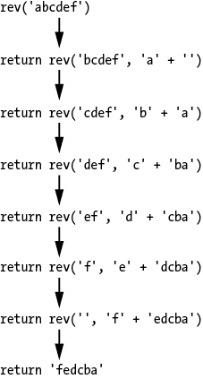

# 八、尾调用优化

> 原文：[Chapter 8 - Tail Call Optimization](https://inventwithpython.com/recursion/chapter8.html)
> 
> 译者：[飞龙](https://github.com/wizardforcel)
> 
> 协议：[CC BY-NC-SA 4.0](https://creativecommons.org/licenses/by-nc-sa/4.0/)


在上一章中，我们介绍了使用记忆化来优化递归函数。本章探讨了一种称为*尾调用优化*的技术，这是编译器或解释器提供的一种功能，用于避免堆栈溢出。尾调用优化也称为*尾调用消除*或*尾递归消除*。

本章旨在解释尾调用优化，而不是为其背书。我甚至会建议*永远*不要使用尾调用优化。正如你将看到的，重新排列函数的代码以使用尾调用优化通常会使其变得难以理解。你应该考虑尾调用优化更像是一种黑客或变通方法，用于使递归在你本不应该使用递归算法的情况下工作。记住，一个复杂的递归解决方案并不自动成为一个优雅的解决方案；简单的编码问题应该用简单的非递归方法来解决。

许多流行编程语言的实现甚至不提供尾调用优化作为一项功能。这些包括 Python、JavaScript 和 Java 的解释器和编译器。然而，尾调用优化是一种你应该熟悉的技术，以防你在你的代码项目中遇到它。

## 尾递归和尾调用优化的工作原理

要利用尾调用优化，一个函数必须使用*尾递归*。在尾递归中，递归函数调用是递归函数的最后一个操作。在代码中，这看起来像是一个`return`语句返回递归调用的结果。

要看到这个过程，回想一下第二章中的`factorialByRecursion.py`和`factorialByRecursion.html`程序。这些程序计算了一个整数的阶乘；例如，5！等于 5 × 4 × 3 × 2 × 1，即 120。这些计算可以通过递归来进行，因为`factorial(n)`等同于`n * factorial(n - 1)`，其中`n == 1`是基本情况，返回`1`。

让我们重写这些程序以使用尾递归。下面的`factorialTailCall.py`程序有一个使用尾递归的`factorial()`函数：

**Python**

```py
def factorial(number, accum=1):
    if number == 1:
        # BASE CASE
        return accum
    else:
        # RECURSIVE CASE
        return factorial(number - 1, accum * number)

print(factorial(5))
```

`factorialTailCall.html`程序有等效的 JavaScript 代码：

**JavaScript**

```js
<script type="text/javascript">
function factorial(number, accum=1) {
    if (number === 1) {
        // BASE CASE
        return accum;
    } else {
        // RECURSIVE CASE
        return factorial(number - 1, accum * number);
    }
}

document.write(factorial(5));
</script>
```

请注意，`factorial()`函数的递归情况以`return`语句结束，返回对`factorial()`的递归调用的结果。为了允许解释器或编译器实现尾调用优化，递归函数所做的最后一个操作必须是返回递归调用的结果。在进行递归调用和`return`语句之间不能发生任何指令。基本情况返回`accum`参数。这是累加器，在下一节中解释。

要理解尾调用优化的工作原理，记住第一章中函数调用时发生了什么。首先，创建一个帧对象并将其存储在调用堆栈上。如果函数调用另一个函数，将创建另一个帧对象并将其放在调用堆栈的第一个帧对象的顶部。当函数返回时，你的程序会自动从调用堆栈的顶部删除帧对象。

堆栈溢出发生在太多的函数调用没有返回的情况下，导致帧对象的数量超过调用堆栈的容量。对于 Python 来说，这个容量是 1,000 个函数调用，对于 JavaScript 程序来说大约是 10,000 个。虽然这些数量对于典型程序来说已经足够了，但递归算法可能会超过这个限制，导致堆栈溢出，从而使你的程序崩溃。

回想一下第二章，帧对象存储了函数调用中的局部变量，以及函数完成时返回的指令地址。然而，如果函数递归情况中的最后一个动作是返回递归函数调用的结果，就没有必要保留局部变量。函数在递归调用之后不涉及任何局部变量，因此当前帧对象可以立即被删除。下一个帧对象的返回地址信息可以与被删除的旧帧对象的返回地址相同。

由于当前帧对象被删除而不是保留在调用堆栈上，调用堆栈永远不会增长并且永远不会导致堆栈溢出！

回想一下第一章，所有递归算法都可以使用堆栈和循环来实现。由于尾调用优化消除了对调用堆栈的需求，我们实际上是在使用递归来模拟循环的迭代代码。然而，在本书的前面，我曾经说过适合递归解决方案的问题涉及类似树的数据结构和回溯。没有调用堆栈，没有尾递归函数可能做任何回溯工作。在我看来，每个可以使用尾递归实现的算法都更容易和更可读地使用循环来实现。仅仅因为递归而使用递归并不会自动更加优雅。

## 尾递归中的累加器

尾递归的缺点在于它要求重新排列递归函数，使得最后一个动作是返回递归调用的返回值。这会使我们的递归代码变得更加难以阅读。事实上，本章的`factorialTailCall.py`和`factorialTailCall.html`程序中的`factorial()`函数比第二章的`factorialByRecursion.py`和`factorialByRecursion.html`程序中的版本更难理解一些。

在我们的尾调用`factorial()`函数中，一个名为`accum`的新参数跟随着递归函数调用产生的计算结果。这被称为*累加器*参数，它跟踪了一个计算的部分结果，否则这个结果将会被存储在一个局部变量中。并不是所有的尾递归函数都使用累加器，但它们充当了尾递归无法在最后的递归调用之后使用局部变量的一种变通方法。请注意，在`factorialByRecursion.py`的`factorial()`函数中，递归情况是`return number * factorial(number - 1)`。乘法发生在`factorial(number - 1)`递归调用之后。`accum`累加器取代了`number`局部变量的位置。

还要注意，`factorial()`的基本情况不再返回`1`，而是返回`accum`累加器。当`factorial()`被调用时，`number == 1`并且达到基本情况时，`accum`存储了要返回的最终结果。调整代码以使用尾调用优化通常涉及更改基本情况以返回累加器的值。

你可以把`factorial(5)`函数调用看作是转换成以下的`return`，如图 8-1 所示。


图 8-1：`factorial(5)`转换为整数 120 的过程

重新排列递归调用作为函数中的最后一个动作，并添加累加器，会使你的代码变得比典型的递归代码更难理解。但这并不是尾递归的唯一缺点，我们将在下一节中看到。

## 尾递归的限制

尾递归函数需要重新排列它们的代码，使其适合编译器或解释器的尾调用优化功能。然而，并非所有编译器和解释器都提供尾调用优化作为一项功能。值得注意的是，CPython（从[`python.org`](https://python.org)下载的 Python 解释器）不实现尾调用优化。即使你将递归函数写成递归调用作为最后一个动作，它仍会在足够多的函数调用后导致堆栈溢出。

此外，CPython 可能永远不会将尾调用优化作为一项功能。Python 编程语言的创始人 Guido van Rossum 解释说，尾调用优化可能会使程序更难调试。尾调用优化会从调用堆栈中移除帧对象，从而移除帧对象可以提供的调试信息。他还指出，一旦实现了尾调用优化，Python 程序员将开始编写依赖于该功能的代码，他们的代码将无法在不实现尾调用优化的非 CPython 解释器上运行。

最后，我同意，van Rossum 不同意递归是日常编程的基本重要部分的观点。计算机科学家和数学家倾向于把递归放在一个高位。但尾调用优化只是一个解决方案，使一些递归算法实际可行，而不是简单地因堆栈溢出而崩溃。

虽然 CPython 不支持尾调用优化，但这并不意味着实现 Python 语言的其他编译器或解释器不能具有尾调用优化。除非尾调用优化明确地成为编程语言规范的一部分，否则它不是编程语言的特性，而是编程语言的个别编译器或解释器的特性。

缺乏尾调用优化并不是 Python 独有的。自第 8 版以来，Java 编译器也不支持尾调用优化。尾调用优化是 JavaScript 的 ECMAScript 6 版本的一部分；然而，截至 2022 年，只有 Safari 浏览器的 JavaScript 实现实际上支持它。确定你的编程语言的编译器或解释器是否实现了这一功能的一种方法是编写一个尾递归阶乘函数，尝试计算 100,000 的阶乘。如果程序崩溃，那么尾调用优化没有被实现。

就个人而言，我认为尾递归技术不应该被使用。正如第二章所述，任何递归算法都可以用循环和堆栈来实现。尾调用优化通过有效地移除调用堆栈来防止堆栈溢出。因此，所有尾递归算法都可以仅用循环来实现。由于循环的代码比递归函数简单得多，应该在任何可以使用尾调用优化的地方使用循环。

此外，即使实现了尾调用优化，也可能存在潜在问题。由于尾递归仅在函数的最后一个动作是返回递归调用的返回值时才可能发生，因此对于需要两个或更多递归调用的算法来说，尾递归是不可能的。例如，考虑斐波那契数列算法调用`fibonacci(n - 1)`和`fibonacci(n - 2)`。尽管后者的递归调用可以进行尾调用优化，但对于足够大的参数，第一个递归调用将导致堆栈溢出。

## 尾递归案例研究

让我们来检查一些在本书中早些时候展示的递归函数，看看它们是否适合尾递归。请记住，由于 Python 和 JavaScript 实际上并未实现尾调用优化，这些尾递归函数仍然会导致堆栈溢出错误。这些案例研究仅用于演示目的。

### 尾递归反转字符串

第一个例子是我们在第三章中制作的反转字符串的程序。这个尾递归函数的 Python 代码在`reverseStringTailCall.py`中：

Python

```py
def rev(theString, accum=''): # ❶
    if len(theString) == 0:
        # BASE CASE
        return accum # ❷
    else:
        # RECURSIVE CASE
        head = theString[0]
        tail = theString[1:]
        return rev(tail, head + accum) # ❸

text = 'abcdef'
print('The reverse of ' + text + ' is ' + rev(text))
```

等效的 JavaScript 在`reverseStringTailCall.html`中：

JavaScript

```js
<script type="text/javascript">
function rev(theString, accum='') { // ❶
    if (theString.length === 0) {
        // BASE CASE
        return accum; // ❷
    } else {
        // RECURSIVE CASE
        let head = theString[0];
        let tail = theString.substring(1, theString.length);
        return rev(tail, head + accum); // ❸
    }
}

let text = "abcdef";
document.write("The reverse of " + text + " is " + rev(text) + "<br />");
</script>
```

将`reverseString.py`和`reverseString.html`中的原始递归函数转换为涉及添加累加器参数。如果没有为它传递参数，则默认情况下将累加器命名为`accum`，设置为空字符串❶。我们还将基本情况从`return ''`更改为`return accum`❷，将递归情况从`return rev(tail) + head`（在递归调用返回后执行字符串连接）更改为`return rev(tail, head + accum)`❸。您可以将`rev('abcdef')`函数调用视为转换为以下`return`，如图 8-2 所示。

通过有效地使用累加器作为跨函数调用共享的本地变量，我们可以使`rev()`函数成为尾递归。



图 8-2：`rev('abcdef')`对字符串`fedcba`进行的转换过程

### 尾递归查找子字符串

一些递归函数自然地使用尾递归模式。如果您查看第二章中`findSubstring.py`和`findSubstring.html`程序中的`findSubstringRecursive()`函数，您会注意到递归情况的最后操作是返回递归函数调用的值。不需要进行任何调整使此函数成为尾递归。

### 尾递归指数

`exponentByRecursion.py`和`exponentByRecursion.html`程序，也来自第二章，不是尾递归的好候选。这些程序有两个递归情况，当`n`参数为偶数或奇数时。这没问题：只要所有递归情况都将递归函数调用的返回值作为它们的最后操作，函数就可以使用尾调用优化。

但是，请注意`n 为偶数`的 Python 代码递归情况：

Python

```py
# --snip--
    elif n % 2 == 0:
        # RECURSIVE CASE (when n is even)
        result = exponentByRecursion(a, n / 2)
        return result * result
# --snip--
```

并注意等效的 JavaScript 递归情况：

JavaScript

```py
# --snip-- 
  } else if (n % 2 === 0) {
        // RECURSIVE CASE (when n is even)
        result = exponentByRecursion(a, n / 2);
        return result * result; 
# --snip--
```

这个递归情况没有递归调用作为它的最后操作。我们可以摆脱`result`本地变量，而是两次调用递归函数。这将减少递归情况到以下内容：

```py
# --snip--
return exponentByRecursion(a, n / 2) * exponentByRecursion(a, n / 2)
# --snip--
```

但是，现在我们有两个对`exponentByRecursion()`的递归调用。这不仅使算法执行的计算量翻倍，而且函数执行的最后操作是将两个返回值相乘。这与递归斐波那契算法的问题相同：如果递归函数有多个递归调用，那么至少有一个递归调用不能是函数的最后操作。

### 尾递归奇偶数

要确定一个整数是奇数还是偶数，可以使用`％`模数运算符。表达式`number％2 == 0`如果`number`是偶数，则为`True`，如果`number`是奇数，则为`False`。但是，如果您更喜欢过度设计更“优雅”的递归算法，可以在`isOdd.py`中实现以下`isOdd()`函数（`isOdd.py`的其余部分稍后在本节中介绍）：

Python

```py
def isOdd(number):
    if number == 0:
        # BASE CASE
        return False
    else:
        # RECURSIVE CASE
        return not isOdd(number - 1)
print(isOdd(42))
print(isOdd(99))
# --snip--
```

等效的 JavaScript 在`isOdd.html`中：

JavaScript

```js
<script type="text/javascript">

function isOdd(number) {
    if (number === 0) {
        // BASE CASE
        return false;
 } else {
        // RECURSIVE CASE
        return !isOdd(number - 1);
    }
}
document.write(isOdd(42) + "<br />");
document.write(isOdd(99) + "<br />");
# --snip--
```

我们有两个`isOdd()`的基本情况。当`number`参数为`0`时，函数返回`False`以表示*偶数*。为简单起见，我们的`isOdd()`实现仅适用于正整数。递归情况返回`isOdd(number - 1)`的相反值。

您可以通过一个例子看到这是如何工作的：当调用`isOdd(42)`时，函数无法确定`42`是偶数还是奇数，但知道答案与`41`是奇数还是偶数相反。函数将返回`not isOdd(41)`。这个函数调用，反过来返回`isOdd(40)`的相反布尔值，依此类推，直到`isOdd(0)`返回`False`。递归函数调用的数量决定了在最终返回值返回之前作用于返回值的`not`运算符的数量。

然而，这个递归函数对于大数参数会导致堆栈溢出。调用`isOdd(100000)`会导致 100,001 个函数调用而没有返回，这远远超出了任何调用堆栈的容量。我们可以重新排列函数中的代码，使递归情况的最后一个操作是返回递归函数调用的结果，使函数成为尾递归。我们在`isOdd.py`中的`isOddTailCall()`中这样做。以下是`isOdd.py`程序的其余部分：

**Python**

```py
# --snip--
def isOddTailCall(number, inversionAccum=False):
    if number == 0:
        # BASE CASE
        return inversionAccum
    else:
        # RECURSIVE CASE
        return isOddTailCall(number - 1, not inversionAccum)

print(isOddTailCall(42))
print(isOddTailCall(99))
```

JavaScript 等效代码在`isOdd.html`的其余部分中：

**JavaScript**

```py
# --snip--
function isOddTailCall(number, inversionAccum) {
    if (inversionAccum === undefined) {
        inversionAccum = false;
    }

    if (number === 0) {
        // BASE CASE
        return inversionAccum;
    } else {
 // RECURSIVE CASE
        return isOddTailCall(number - 1, !inversionAccum);
    }
}

document.write(isOdd(42) + "<br />");
document.write(isOdd(99) + "<br />");
</script>
```

如果这个 Python 和 JavaScript 代码是由支持尾调用优化的解释器运行的，调用`isOddTailCall(100000)`不会导致堆栈溢出。然而，尾调用优化仍然比简单使用`％`模运算符确定奇偶性要慢得多。

如果您认为递归，无论是否有尾递归，是确定正整数是否为奇数的一种极其低效的方法，那么您是完全正确的。与迭代解决方案不同，递归可能会因堆栈溢出而失败。添加尾调用优化以防止堆栈溢出并不能修复不适当使用递归的效率缺陷。作为一种技术，递归并不自动比迭代解决方案更好或更复杂。而且尾递归永远不是比循环或其他简单解决方案更好的方法。

## 总结

尾调用优化是编程语言的编译器或解释器的一个特性，可以用于特别编写为尾递归的递归函数。尾递归函数将递归函数调用的返回值作为递归情况中的最后一个操作返回。这允许函数删除当前帧对象，并防止调用堆栈在进行新的递归函数调用时增长。如果调用堆栈不增长，递归函数不可能导致堆栈溢出。

尾递归是一种解决方案，允许一些递归算法在处理大参数时不会崩溃。然而，这种方法需要重新排列代码，可能需要添加一个累加器参数。这可能会使您的代码更难理解。您可能会发现，牺牲代码的可读性不值得使用递归算法而不是迭代算法。

## 进一步阅读

Stack Overflow（网站，而不是编程错误）在[`stackoverflow.com/questions/33923/what-is-tail-recursion`](https://stackoverflow.com/questions/33923/what-is-tail-recursion)上对尾递归的基础进行了详细讨论。

Van Rossum 在两篇博文中写到了他决定不使用尾递归的原因，网址分别为[`neopythonic.blogspot.com.au/2009/04/tail-recursion-elimination.html`](https://neopythonic.blogspot.com.au/2009/04/tail-recursion-elimination.html)和[`neopythonic.blogspot.com.au/2009/04/final-words-on-tail-calls.html`](https://neopythonic.blogspot.com.au/2009/04/final-words-on-tail-calls.html)。

Python 的标准库包括一个名为`inspect`的模块，允许您在 Python 程序运行时查看调用堆栈上的帧对象。`inspect`模块的官方文档位于[`docs.python.org/3/library/inspect.html`](https://docs.python.org/3/library/inspect.html)，Doug Hellmann 的 Python 3 Module of the Week 博客上有一个教程，网址为[`pymotw.com/3/inspect`](https://pymotw.com/3/inspect)。

## 练习问题

通过回答以下问题来测试您的理解：

1.  尾调用优化可以防止什么？

1.  递归函数的最后一个动作与尾递归函数有什么关系？

1.  所有编译器和解释器都实现尾调用优化吗？

1.  什么是累加器？

1.  尾递归的缺点是什么？

1.  快速排序算法（第五章介绍）可以重写以使用尾调用优化吗？

