# 九、绘制分形

> 原文：[Chapter 9 - Drawing Fractals](https://inventwithpython.com/recursion/chapter9.html)
> 
> 译者：[飞龙](https://github.com/wizardforcel)
> 
> 协议：[CC BY-NC-SA 4.0](https://creativecommons.org/licenses/by-nc-sa/4.0/)


！[](img/chapterart.png)

当然，递归最有趣的应用是绘制分形。 *分形*是在不同尺度上重复自己的形状，有时是混乱的。 这个术语是由分形几何学的创始人 Benoit B. Mandelbrot 在 1975 年创造的，源自拉丁语*frāctus*，意思是破碎或断裂，就像破碎的玻璃一样。 分形包括许多自然和人造形状。 在自然界中，您可能会在树的形状，蕨类叶子，山脉，闪电，海岸线，河网和雪花的形状中看到它们。 数学家，程序员和艺术家可以根据一些递归规则创建复杂的几何形状。

递归可以使用惊人地少的代码行生成复杂的分形艺术。 本章介绍了 Python 的内置`turtle`模块，用于使用代码生成几种常见的分形。 要使用 JavaScript 创建海龟图形，您可以使用 Greg Reimer 的`jtg`库。 为简单起见，本章仅介绍了 Python 分形绘图程序，而没有 JavaScript 等价物。 但是，本章介绍了`jtg`JavaScript 库。

## 海龟图形

*海龟图形*是 Logo 编程语言的一个特性，旨在帮助孩子们学习编码概念。 此功能自那时以来已在许多语言和平台上复制。 其核心思想是一个叫做*海龟*的对象。

海龟充当可编程笔，在 2D 窗口中绘制线条。 想象一只真正的海龟在地面上拿着一支笔，随着它移动，它在身后画一条线。 海龟可以调整其笔的大小和颜色，或者“抬起笔”，以便在移动时不绘制。 海龟程序可以产生复杂的几何图形，如图 9-1。

当您将这些指令放在循环和函数中时，即使是小程序也可以创建令人印象深刻的几何图形。 考虑以下`spiral.py`程序：

**Python**

```py
import turtle
turtle.tracer(1, 0) # Makes the turtle draw faster.
for i in range(360):
    turtle.forward(i)
    turtle.left(59)
turtle.exitonclick() # Pause until user clicks in the window.
```

当您运行此程序时，海龟窗口会打开。 海龟（由三角形表示）将在图 9-1 中追踪螺旋图案。 虽然不是分形，但它是一幅美丽的图画。

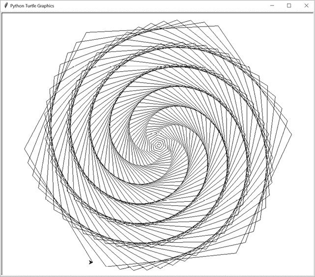

图 9-1：使用 Python 的`turtle`模块绘制的螺旋

海龟图形系统中的窗口使用笛卡尔 x 和 y 坐标。 水平 x 坐标的数字向右增加，向左减少，而垂直 y 坐标的数字向上增加，向下减少。 这两个坐标一起可以为窗口中的任何点提供唯一的地址。 默认情况下，*原点*（坐标点在 0,0 处）位于窗口的中心。

海龟还有一个*heading*，或者方向，是从 0 到 359 的数字（一个圆被分成 360 度）。 在 Python 的`turtle`模块中，0 的 heading 面向东（朝屏幕的右边缘），并且顺时针增加； 90 的 heading 面向北，180 的 heading 面向西，270 的 heading 面向南。 在 JavaScript 的`jtg`库中，此方向被旋转，以便 0 度面向北，并且逆时针增加。 图 9-2 演示了 Python`turtle`模块和 JavaScript`jtg`库的 heading。

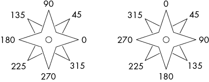

图 9-2：Python 的`turtle`模块（左）和 JavaScript 的`jtg`库（右）中的航向

在 JavaScript 的`jtg`库中，进入[`inventwithpython.com/jtg`](https://inventwithpython.com/jtg)，将以下代码输入到页面底部的文本字段中：

**JavaScript**

```py
for (let i = 0; i < 360; i++) { t.fd(i); t.lt(59) }
```

这将在网页的主要区域绘制与图 9-1 中显示的相同螺旋线。

## 基本海龟函数

海龟图形中最常用的函数会导致海龟改变航向并向前或向后移动。`turtle.left()`和`turtle.right()`函数从当前航向开始旋转海龟一定角度，而`turtle.forward()`和`turtle.backward()`函数根据当前位置移动海龟。

表 9-1 列出了一些海龟的函数。第一个函数（以`turtle.`开头）是为 Python，第二个（以`t.`开头）是为 JavaScript。完整的 Python 文档可在[`docs.python.org/3/library/turtle.html`](https://docs.python.org/3/library/turtle.html)找到。在 JavaScript 的`jtg`软件中，您可以按 F1 键显示帮助屏幕。

表 9-1：Python 的`turtle`模块和 JavaScript 的`jtg`库中的海龟函数

| **Python** | **JavaScript** | **描述** |
| --- | --- | --- |
| `goto(x, y)` | `xy(x, y)` | 将海龟移动到 x，y 坐标。 |
| `setheading(deg)` | `heading(deg)` | 设置海龟的航向。在 Python 中，0 度是东（右）。在 JavaScript 中，0 度是北（向上）。 |
| `forward(steps)` | `fd(steps)` | 以面对的方向将海龟向前移动一定步数。 |
| `backward(steps)` | `bk(steps)` | 以面对的相反方向将海龟向后移动一定步数。 |
| `left(deg)` | `lt(deg)` | 将海龟的航向向左转动。 |
| `right(deg)` | `rt(deg)` | 将海龟的航向向右转动。 |
| `penup()` | `pu()` | “提起笔”以使海龟在移动时停止绘制。 |
| `pendown()` | `pd()` | “放下笔”以使海龟在移动时开始绘制。 |
| `pensize(size)` | `thickness(size)` | 更改海龟绘制线条的粗细。默认值为`1`。 |
| `pencolor(color)` | `color(color)` | 更改海龟绘制线条的颜色。这可以是常见颜色的字符串，如`red`或`white`。默认值为`black`。 |
| `xcor()` | `get.x()` | 返回海龟当前的 x 坐标。 |
| `ycor()` | `get.y()` | 返回海龟当前的 y 坐标。 |
| `heading()` | `get.heading()` | 以 0 到 359 的浮点数返回海龟当前的航向。在 Python 中，0 度是东（右）。在 JavaScript 中，0 度是北（向上）。 |
| `reset()` | `reset()` | 清除任何绘制的线条，并将海龟移回原始位置和航向。 |
| `clear()` | `clean()` | 清除任何绘制的线条，但不移动海龟。 |

表 9-2 中列出的函数仅在 Python 的`turtle`模块中可用。

表 9-2：仅 Python 的海龟函数

| **Python** | **描述** |
| --- | --- |
| `begin_fill()` | 开始绘制填充形状。此调用之后绘制的线条将指定填充形状的周长。 |
| `end_fill()` | 绘制以调用`turtle.begin_fill()`开始的填充形状。 |
| `fillcolor( color )` | 设置用于填充形状的颜色。 |
| `hideturtle()` | 隐藏代表海龟的三角形。 |
| `showturtle()` | 显示代表海龟的三角形。 |
| `tracer( drawingUpdates , delay )` | 调整绘制速度。将`delay`设置为`0`，表示在乌龟绘制每条线后延迟 0 毫秒。传递给`drawingUpdates`的数字越大，乌龟绘制的速度就越快，因为模块在更新屏幕之前绘制的次数越多。 |
| `update()` | 将任何缓冲线（稍后在本节中解释）绘制到屏幕上。在乌龟完成绘制后调用此函数。 |
| `setworldcoordinates( llx , lly , urx, ury )` | 重新调整窗口显示坐标平面的哪一部分。前两个参数是窗口左下角的 x、y 坐标。后两个参数是窗口右上角的 x、y 坐标。 |
| `exitonclick()` | 当用户单击任何位置时，暂停程序并关闭窗口。如果在程序的最后没有这个命令，乌龟图形窗口可能会在程序结束时立即关闭。 |

在 Python 的`turtle`模块中，线条会立即显示在屏幕上。然而，这可能会减慢绘制数千条线的程序。更快的方法是*缓冲*——即暂时不显示几条线，然后一次性显示它们。

通过调用`turtle.tracer(1000, 0)`，你可以指示`turtle`模块在程序创建了 1,000 条线之前不显示这些线。在程序完成调用绘制线条的函数后，最后调用`turtle.update()`来显示剩余的缓冲线。如果你的程序仍然花费太长时间来绘制图像，可以将一个更大的整数，如`2000`或`10000`，作为第一个参数传递给`turtle.tracer()`。

## 谢尔宾斯基三角形

在纸上绘制的最简单的分形是*谢尔宾斯基三角形*，它是在第一章介绍的。这个分形是由波兰数学家瓦茨瓦夫·谢尔宾斯基于 1915 年描述的（甚至早于术语*分形*的出现）。然而，这种图案至少有数百年的历史。

要创建一个谢尔宾斯基三角形，首先绘制一个等边三角形——一个三边长度相等的三角形，就像图 9-3 中左边的那个。然后在第一个三角形内部绘制一个倒置的等边三角形，就像图 9-3 中右边的那个。你将得到一个形状，如果你熟悉*塞尔达传说*视频游戏，它看起来像三角力量。

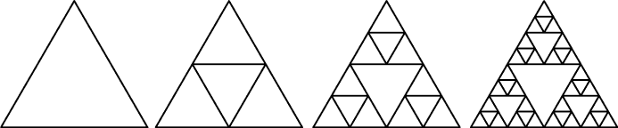

图 9-3：一个等边三角形（左）和一个倒置的三角形相加形成了一个谢尔宾斯基三角形，递归地添加了额外的三角形

当你绘制内部的倒置三角形时，一个有趣的事情发生了。你形成了三个新的正立等边三角形。在这三个三角形的每一个内部，你可以绘制另一个倒置的三角形，这样就会创建出九个三角形。这种递归在数学上可以无限进行，尽管在现实中，你的笔无法不断地绘制更小的三角形。

这种描述一个与自身的一部分相似的完整对象的属性被称为*自相似性*。递归函数可以产生这些对象，因为它们一遍又一遍地“调用”自己。实际上，这段代码最终必须达到一个基本情况，但在数学上，这些形状具有无限的分辨率：你理论上可以永远放大这个形状。

让我们编写一个递归程序来创建谢尔宾斯基三角形。递归的`drawTriangle()`函数将绘制一个等边三角形，然后递归调用这个函数三次来绘制内部的等边三角形，就像图 9-4 中那样。`midpoint()`函数找到距离函数传递的两个点等距离的点。这对于内部三角形使用这些等距离的点作为它们的顶点是很重要的。

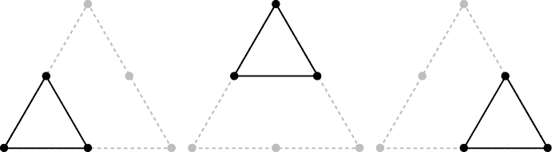

图 9-4：三个内部三角形，中点用大点显示

请注意，此程序调用了`turtle.setworldcoordinates(0, 0, 700, 700)`，这使得 0, 0 原点位于窗口的左下角。右上角的 x、y 坐标为 700, 700。`sierpinskiTriangle.py`的源代码如下：

```py
import turtle
turtle.tracer(100, 0) # Increase the first argument to speed up the drawing.
turtle.setworldcoordinates(0, 0, 700, 700)
turtle.hideturtle()

MIN_SIZE = 4 # Try changing this to decrease/increase the amount of recursion.

def midpoint(startx, starty, endx, endy):
    # Return the x, y coordinate in the middle of the four given parameters.
    xDiff = abs(startx - endx)
    yDiff = abs(starty - endy)
    return (min(startx, endx) + (xDiff / 2.0), min(starty, endy) + (yDiff / 2.0))

def isTooSmall(ax, ay, bx, by, cx, cy):
    # Determine if the triangle is too small to draw.
    width = max(ax, bx, cx) - min(ax, bx, cx)
    height = max(ay, by, cy) - min(ay, by, cy)
    return width < MIN_SIZE or height < MIN_SIZE

def drawTriangle(ax, ay, bx, by, cx, cy):
    if isTooSmall(ax, ay, bx, by, cx, cy):
        # BASE CASE
        return
    else:
        # RECURSIVE CASE
        # Draw the triangle.
        turtle.penup()
        turtle.goto(ax, ay)
        turtle.pendown()
        turtle.goto(bx, by)
        turtle.goto(cx, cy)
        turtle.goto(ax, ay)
        turtle.penup()

        # Calculate midpoints between points A, B, and C.
        mid_ab = midpoint(ax, ay, bx, by)
        mid_bc = midpoint(bx, by, cx, cy)
        mid_ca = midpoint(cx, cy, ax, ay)

        # Draw the three inner triangles.
        drawTriangle(ax, ay, mid_ab[0], mid_ab[1], mid_ca[0], mid_ca[1])
        drawTriangle(mid_ab[0], mid_ab[1], bx, by, mid_bc[0], mid_bc[1])
        drawTriangle(mid_ca[0], mid_ca[1], mid_bc[0], mid_bc[1], cx, cy)
        return

# Draw an equilateral Sierpinski triangle.
drawTriangle(50, 50, 350, 650, 650, 50)

# Draw a skewed Sierpinski triangle.
#drawTriangle(30, 250, 680, 600, 500, 80)

turtle.exitonclick()
```

当你运行这段代码时，输出看起来像图 9-5。

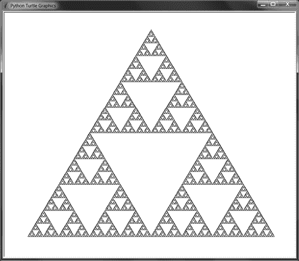

图 9-5：标准谢尔宾斯基三角形

谢尔宾斯基三角形不一定要用等边三角形来绘制。只要使用外部三角形的中点来绘制内部三角形，你可以使用任何类型的三角形。注释掉第一个`drawTriangle()`调用，并取消注释第二个（在`# Draw a skewed Sierpinski triangle.`注释下面），然后再次运行程序。输出将看起来像图 9-6。

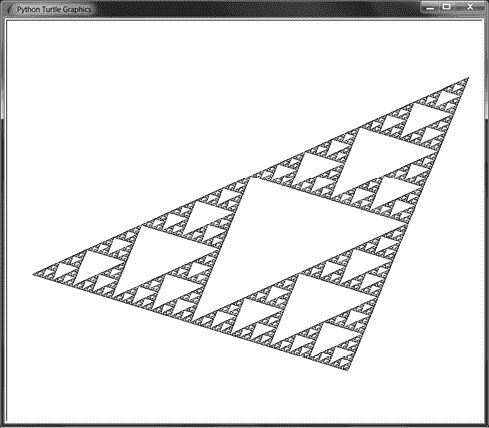

图 9-6：一个倾斜的谢尔宾斯基三角形

`drawTriangle()`函数接受六个参数，对应于三角形的三个点的 x、y 坐标。尝试尝试不同的值来调整谢尔宾斯基三角形的形状。你也可以将`MIN_SIZE`常量更改为较大的值，以使程序更快地达到基本情况，并减少绘制的三角形数量。

## 谢尔宾斯基地毯

一个类似于谢尔宾斯基三角形的分形形状可以使用矩形来绘制。这种模式被称为*Sierpiński carpet*。想象将一个黑色矩形分成 3×3 的网格，然后“切除”中心矩形。在网格的周围八个矩形中重复这种模式。当这样递归地完成时，你会得到一个像图 9-7 的图案。

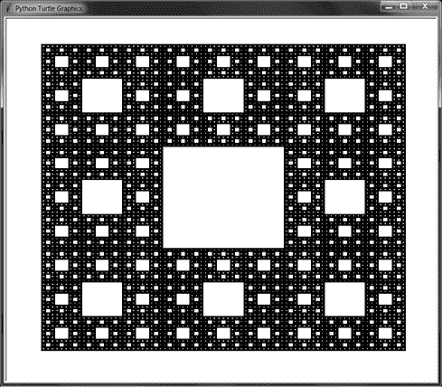

图 9-7：谢尔宾斯基地毯

绘制地毯的 Python 程序使用`turtle.begin_fill()`和`turtle.end_fill()`函数来创建实心的填充形状。乌龟在这些调用之间绘制的线用于绘制形状，就像图 9-8 中那样。

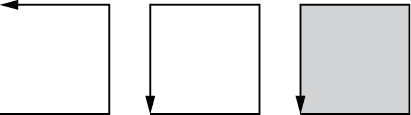

图 9-8：调用`turtle.begin_fill()`，绘制路径，然后调用`turtle.end_fill()`创建填充形状。

当 3×3 的矩形变得小于一边的六个步骤时，基本情况就会到达。你可以将`MIN_SIZE`常量更改为较大的值，以使程序更快地达到基本情况。`sierpinskiCarpet.py`的源代码如下：

```py
import turtle
turtle.tracer(10, 0) # Increase the first argument to speed up the drawing.
turtle.setworldcoordinates(0, 0, 700, 700)
turtle.hideturtle()

MIN_SIZE = 6 # Try changing this to decrease/increase the amount of recursion.
DRAW_SOLID = True

def isTooSmall(width, height):
    # Determine if the rectangle is too small to draw.
    return width < MIN_SIZE or height < MIN_SIZE

def drawCarpet(x, y, width, height):
    # The x and y are the lower-left corner of the carpet.

    # Move the pen into position.
    turtle.penup()
    turtle.goto(x, y)

    # Draw the outer rectangle.
    turtle.pendown()
    if DRAW_SOLID:
        turtle.fillcolor('black')
        turtle.begin_fill()
    turtle.goto(x, y + height)
    turtle.goto(x + width, y + height)
    turtle.goto(x + width, y)
    turtle.goto(x, y)
    if DRAW_SOLID:
        turtle.end_fill()
    turtle.penup()

    # Draw the inner rectangles.
    drawInnerRectangle(x, y, width, height)

def drawInnerRectangle(x, y, width, height):
    if isTooSmall(width, height):
        # BASE CASE
        return
    else:
        # RECURSIVE CASE

        oneThirdWidth = width / 3
        oneThirdHeight = height / 3
        twoThirdsWidth = 2 * (width / 3)
        twoThirdsHeight = 2 * (height / 3)

 # Move into position.
        turtle.penup()
        turtle.goto(x + oneThirdWidth, y + oneThirdHeight)

        # Draw the inner rectangle.
        if DRAW_SOLID:
            turtle.fillcolor('white')
            turtle.begin_fill()
        turtle.pendown()
        turtle.goto(x + oneThirdWidth, y + twoThirdsHeight)
        turtle.goto(x + twoThirdsWidth, y + twoThirdsHeight)
        turtle.goto(x + twoThirdsWidth, y + oneThirdHeight)
        turtle.goto(x + oneThirdWidth, y + oneThirdHeight)
        turtle.penup()
        if DRAW_SOLID:
            turtle.end_fill()

        # Draw the inner rectangles across the top.
        drawInnerRectangle(x, y + twoThirdsHeight, oneThirdWidth, oneThirdHeight)
        drawInnerRectangle(x + oneThirdWidth, y + twoThirdsHeight, oneThirdWidth, oneThirdHeight)
        drawInnerRectangle(x + twoThirdsWidth, y + twoThirdsHeight, oneThirdWidth, oneThirdHeight)

        # Draw the inner rectangles across the middle.
        drawInnerRectangle(x, y + oneThirdHeight, oneThirdWidth, 
        oneThirdHeight)
        drawInnerRectangle(x + twoThirdsWidth, y + oneThirdHeight, oneThirdWidth, 
        oneThirdHeight)

        # Draw the inner rectangles across the bottom.
        drawInnerRectangle(x, y, oneThirdWidth, oneThirdHeight)
        drawInnerRectangle(x + oneThirdWidth, y, oneThirdWidth, oneThirdHeight)
        drawInnerRectangle(x + twoThirdsWidth, y, oneThirdWidth, 
        oneThirdHeight)

drawCarpet(50, 50, 600, 600)
turtle.exitonclick()
```

您还可以将`DRAW_SOLID`常量设置为`False`并运行程序。这将跳过对`turtle.begin_fill()`和`turtle.end_fill()`的调用，以便只绘制矩形的轮廓，如图 9-9 所示。

尝试将不同的参数传递给`drawCarpet()`。前两个参数是地毯左下角的 x、y 坐标，而后两个参数是宽度和高度。您还可以将`MIN_SIZE`常量更改为较大的值，以使程序更快地达到基本情况，并减少绘制的矩形数量。

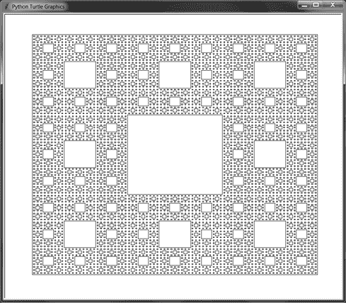

图 9-9：Sierpiński 地毯，只绘制了矩形的轮廓

另一个 3D Sierpiński 地毯使用立方体而不是正方形。在这种形式中，它被称为*Sierpiński 立方体*或*Menger 海绵*。它最早由数学家卡尔·门格在 1926 年描述。图 9-10 显示了在视频游戏*Minecraft*中创建的 Menger 海绵。

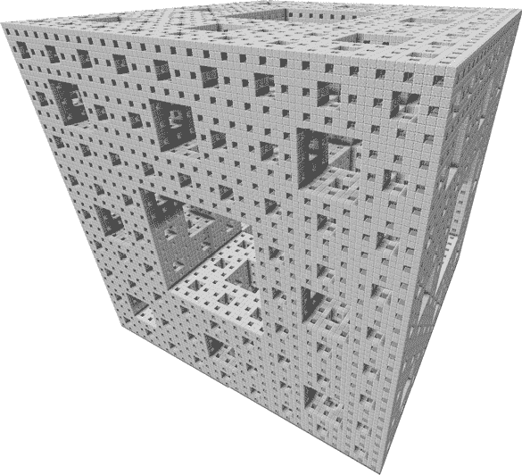

图 9-10：3D Menger 海绵分形

## 分形树

虽然 Sierpiński 三角形和地毯等人造分形是完全自相似的，但分形可以包括没有完美自相似性的形状。数学家 Benoit B. Mandelbrot（他的中间名字母递归地代表 Benoit B. Mandelbrot）构想的分形几何包括自然形状，如山脉、海岸线、植物、血管和星系的聚类。仔细观察，这些形状继续由简化几何的光滑曲线和直线难以包容的“粗糙”形状组成。

例如，我们可以使用递归来复制*分形树*，无论是完全还是不完全自相似。生成树需要创建一个具有两个子分支的分支，这些分支从父分支发出，角度和长度减小。它们产生的 Y 形状被递归重复，以创建一棵树的逼真图像，如图 9-11 和 9-12 所示。

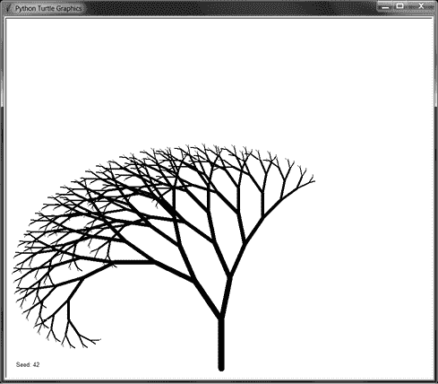

图 9-11：使用一致的角度和长度生成的完全自相似的分形树

电影和视频游戏可以在*程序生成*中使用这种递归算法，自动（而不是手动）创建树、蕨类植物、花朵和其他植物等 3D 模型。使用算法，计算机可以快速创建由数百万棵独特树组成的整个森林，节省了大量人类 3D 艺术家的辛苦努力。

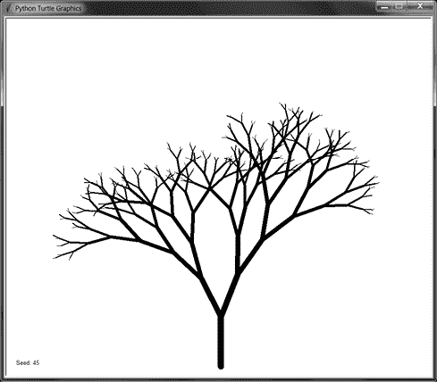

图 9-12：使用随机改变分支角度和长度创建的更真实的树

我们的分形树程序每两秒显示一个新的随机生成的树。`fractalTree.py`的源代码如下：

**Python**

```py
import random
import time
import turtle
turtle.tracer(1000, 0) # Increase the first argument to speed up the drawing.
turtle.setworldcoordinates(0, 0, 700, 700)
turtle.hideturtle()

def drawBranch(startPosition, direction, branchLength):
    if branchLength < 5:
        # BASE CASE
        return

    # Go to the starting point & direction.
    turtle.penup()
    turtle.goto(startPosition)
    turtle.setheading(direction)

    # Draw the branch (thickness is 1/7 the length).
    turtle.pendown()
    turtle.pensize(max(branchLength / 7.0, 1))
    turtle.forward(branchLength)

    # Record the position of the branch's end.
    endPosition = turtle.position()
    leftDirection = direction + LEFT_ANGLE
    leftBranchLength = branchLength - LEFT_DECREASE
    rightDirection = direction - RIGHT_ANGLE
    rightBranchLength = branchLength - RIGHT_DECREASE

 # RECURSIVE CASE
    drawBranch(endPosition, leftDirection, leftBranchLength)
    drawBranch(endPosition, rightDirection, rightBranchLength)

seed = 0
while True:
    # Get pseudorandom numbers for the branch properties.
    random.seed(seed)
    LEFT_ANGLE     = random.randint(10,  30)
    LEFT_DECREASE  = random.randint( 8,  15)
    RIGHT_ANGLE    = random.randint(10,  30)
    RIGHT_DECREASE = random.randint( 8,  15)
    START_LENGTH   = random.randint(80, 120)

    # Write out the seed number.
    turtle.clear()
    turtle.penup()
    turtle.goto(10, 10)
    turtle.write('Seed: %s' % (seed))

    # Draw the tree.
    drawBranch((350, 10), 90, START_LENGTH)
    turtle.update()
    time.sleep(2)

    seed = seed + 1
```

这个程序产生完全自相似的树，因为`LEFT_ANGLE`、`LEFT_DECREASE`、`RIGHT_ANGLE`和`RIGHT_DECREASE`变量最初是随机选择的，但对所有递归调用保持不变。`random.seed()`函数为 Python 的随机函数设置一个种子值。*随机数种子值*使程序产生看似随机的数字，但对树的每个分支使用相同的随机数序列。换句话说，相同的*种子*值每次运行程序都会产生相同的*树*。（我从不为我说的双关语道歉。）

要看到这个过程，输入以下内容到 Python 交互式 shell 中：

**Python**

```py
>>> import random
>>> random.seed(42)
>>> [random.randint(0, 9) for i in range(20)]
 [1, 0, 4, 3, 3, 2, 1, 8, 1, 9, 6, 0, 0, 1, 3, 3, 8, 9, 0, 8]
>>> [random.randint(0, 9) for i in range(20)]
 [3, 8, 6, 3, 7, 9, 4, 0, 2, 6, 5, 4, 2, 3, 5, 1, 1, 6, 1, 5]
>>> random.seed(42)
>>> [random.randint(0, 9) for i in range(20)]
 [1, 0, 4, 3, 3, 2, 1, 8, 1, 9, 6, 0, 0, 1, 3, 3, 8, 9, 0, 8]
```

在这个例子中，我们将随机种子设置为 42。当我们生成 20 个随机整数时，我们得到`1`、`0`、`4`、`3`等。我们可以生成另外 20 个整数，并继续接收随机整数。然而，如果我们将种子重置为`42`，再次生成 20 个随机整数，它们将与之前的相同的“随机”整数。

如果你想创建一个更自然、不那么自相似的树，用以下行替换`#记录分支末端的位置。`注释后的行。这会为*每个*递归调用生成新的随机角度和分支长度，更接近树在自然界中生长的方式：

**Python**

```py
 # Record the position of the branch's end.
    endPosition = turtle.position()
    leftDirection = direction + random.randint(10, 30)
    leftBranchLength = branchLength - random.randint(8, 15)
    rightDirection = direction - random.randint(10, 30)
    rightBranchLength = branchLength - random.randint(8, 15)
```

你可以尝试不同范围的`random.randint()`调用，或者尝试添加更多的递归调用，而不仅仅是两个分支。

## 英国海岸线有多长？科赫曲线和雪花

在我告诉你关于科赫曲线和雪花之前，考虑这个问题：英国的海岸线有多长？看一下图 9-13。左边的地图有一个粗略的测量，将海岸线长度约为 2000 英里。但右边的地图有一个更精确的测量，包括了更多海岸的角落，长度约为 2800 英里。

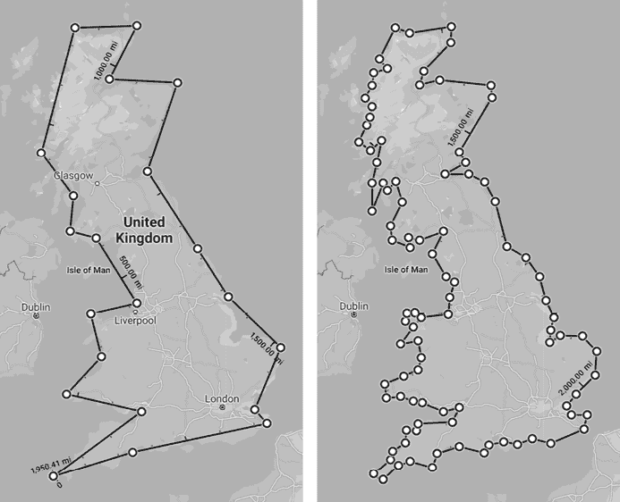

图 9-13：大不列颠岛，粗略测量（左）和更精确测量（右）。更精确地测量海岸线长度增加了 800 英里。

曼德布罗特关于英国海岸线等分形的关键见解是，你可以继续越来越近地观察，每个尺度上都会有“粗糙”。因此，随着你的测量变得越来越精细，海岸线的长度也会变得越来越长。这条“海岸线”将沿着泰晤士河上游，深入陆地沿着一岸，然后回到英吉利海峡的另一岸。因此，对于我们关于大不列颠海岸线长度的问题的答案是，“这取决于。”

*Koch 曲线*分形具有与其海岸线长度或周长相关的类似特性。Koch 曲线最早由瑞典数学家赫尔格·冯·科赫于 1902 年提出，是最早被数学描述的分形之一。要构造它，取长度为*b*的线段并将其分成三等分，每部分长度为*b*/3。用长度也为*b*/3 的“凸起”替换中间部分。这个凸起使得 Koch 曲线比原始线段更长，因为现在我们有四条长度为*b*/3 的线段。（我们将排除原始线段的中间部分。）这个凸起的创建可以在新的四条线段上重复。图 9-14 展示了这个构造过程。

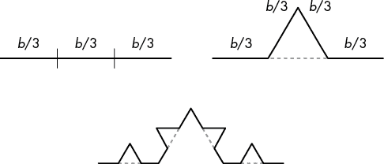

图 9-14：将线段分成三等分（左），在中间部分添加一个凸起（右）。现在我们有长度为*b*/3 的四段线段，可以再次添加凸起（底部）。

要创建*科赫雪花*，我们从一个等边三角形开始，并从其三边构造三个科赫曲线，如图 9-15 所示。

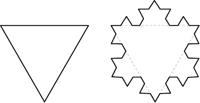

图 9-15：在等边三角形的三边上创建三个科赫曲线，形成科赫雪花

每次创建一个新的凸起，都会将曲线的长度从三个*b*/3 长度增加到四个*b*/3 长度，或 4*b*/3。如果你继续在等边三角形的三边上这样做，你将创建科赫雪花，就像图 9-16 中所示的那样。（小点状图案是因为轻微的舍入误差导致`turtle`模块无法完全擦除中间的*b*/3 段。）你可以继续永远创建新的凸起，尽管我们的程序在它们变得小于几个像素时停止。

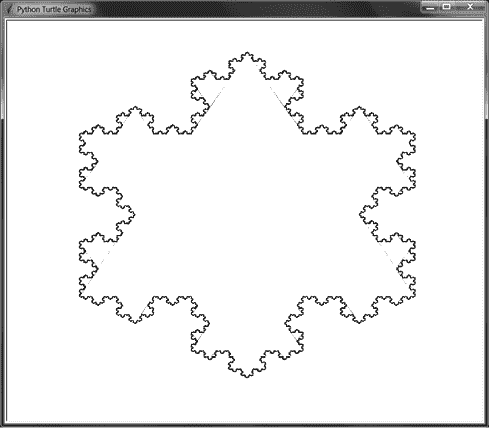

图 9-16：科赫雪花。由于小的舍入误差，一些内部线条仍然存在。

`kochSnowflake.py`的源代码如下：

**Python**

```py
import turtle
turtle.tracer(10, 0) # Increase the first argument to speed up the drawing.
turtle.setworldcoordinates(0, 0, 700, 700)
turtle.hideturtle()
turtle.pensize(2)

def drawKochCurve(startPosition, heading, length):
    if length < 1:
        # BASE CASE
        return
    else:
        # RECURSIVE CASE
        # Move to the start position.
        recursiveArgs = []
        turtle.penup()
        turtle.goto(startPosition)
        turtle.setheading(heading)
        recursiveArgs.append({'position':turtle.position(),
                              'heading':turtle.heading()})

        # Erase the middle third.
        turtle.forward(length / 3)
        turtle.pencolor('white')
        turtle.pendown()
 turtle.forward(length / 3)

        # Draw the bump.
        turtle.backward(length / 3)
        turtle.left(60)
        recursiveArgs.append({'position':turtle.position(),
                              'heading':turtle.heading()})
        turtle.pencolor('black')
        turtle.forward(length / 3)
        turtle.right(120)
        recursiveArgs.append({'position':turtle.position(),
                              'heading':turtle.heading()})
        turtle.forward(length / 3)
        turtle.left(60)
        recursiveArgs.append({'position':turtle.position(),
                              'heading':turtle.heading()})

        for i in range(4):
            drawKochCurve(recursiveArgs[i]['position'],
                     recursiveArgs[i]['heading'],
                     length / 3)
        return

def drawKochSnowflake(startPosition, heading, length):
    # A Koch snowflake is three Koch curves in a triangle.

    # Move to the starting position.
    turtle.penup()
    turtle.goto(startPosition)
    turtle.setheading(heading)

    for i in range(3):
        # Record the starting position and heading.
        curveStartingPosition = turtle.position()
        curveStartingHeading = turtle.heading()
        drawKochCurve(curveStartingPosition,
                      curveStartingHeading, length)

        # Move back to the start position for this side.
        turtle.penup()
        turtle.goto(curveStartingPosition)
        turtle.setheading(curveStartingHeading)

        # Move to the start position of the next side.
        turtle.forward(length)
        turtle.right(120)

drawKochSnowflake((100, 500), 0, 500)
turtle.exitonclick()
```

科赫雪花有时也被称为*科赫岛*。它的海岸线将是无限长的。虽然科赫雪花可以放入本书一页的有限区域，但其周长的长度是无限的，证明了，尽管看起来违反直觉，有限可以包含无限！

## 希尔伯特曲线

*填充曲线*是一条 1D 曲线，它弯曲直到完全填满 2D 空间而不交叉。德国数学家大卫·希尔伯特于 1891 年描述了他的填充曲线。如果你将一个 2D 区域分成一个网格，希尔伯特曲线的单一 1D 线可以穿过网格中的每个单元格。

图 9-17 包含希尔伯特曲线的前三次递归。下一次递归包含前一次递归的四个副本，虚线显示了这四个副本如何连接在一起。

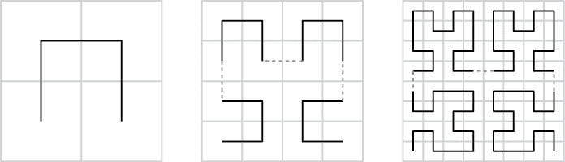

图 9-17：希尔伯特填充曲线的前三次递归

当单元格变成无穷小点时，1D 曲线可以像 2D 正方形一样填满整个 2D 空间。令人费解的是，这样可以从严格的 1D 线创建一个 2D 形状！

`hilbertCurve.py`的源代码如下：

**Python**

```py
import turtle
turtle.tracer(10, 0) # Increase the first argument to speed up the drawing.
turtle.setworldcoordinates(0, 0, 700, 700)
turtle.hideturtle()

LINE_LENGTH  = 5 # Try changing the line length by a little.
ANGLE = 90 # Try changing the turning angle by a few degrees.
LEVELS = 6 # Try changing the recursive level by a little.
DRAW_SOLID = False
#turtle.setheading(20) # Uncomment this line to draw the curve at an angle.

def hilbertCurveQuadrant(level, angle):
    if level == 0:
        # BASE CASE
        return
    else:
        # RECURSIVE CASE
        turtle.right(angle)
        hilbertCurveQuadrant(level - 1, -angle)
        turtle.forward(LINE_LENGTH)
 turtle.left(angle)
        hilbertCurveQuadrant(level - 1, angle)
        turtle.forward(LINE_LENGTH)
        hilbertCurveQuadrant(level - 1, angle)
        turtle.left(angle)
        turtle.forward(LINE_LENGTH)
        hilbertCurveQuadrant(level - 1, -angle)
        turtle.right(angle)
        return

def hilbertCurve(startingPosition):
    # Move to starting position.
    turtle.penup()
    turtle.goto(startingPosition)
    turtle.pendown()
    if DRAW_SOLID:
        turtle.begin_fill()

    hilbertCurveQuadrant(LEVELS, ANGLE) # Draw lower-left quadrant.
    turtle.forward(LINE_LENGTH)

    hilbertCurveQuadrant(LEVELS, ANGLE) # Draw lower-right quadrant.
    turtle.left(ANGLE)
    turtle.forward(LINE_LENGTH)
    turtle.left(ANGLE)

    hilbertCurveQuadrant(LEVELS, ANGLE) # Draw upper-right quadrant.
    turtle.forward(LINE_LENGTH)

    hilbertCurveQuadrant(LEVELS, ANGLE) # Draw upper-left quadrant.

    turtle.left(ANGLE)
    turtle.forward(LINE_LENGTH)
    turtle.left(ANGLE)
    if DRAW_SOLID:
        turtle.end_fill()

hilbertCurve((30, 350))
turtle.exitonclick()
```

尝试通过减小`LINE_LENGTH`来缩短线段的长度，同时增加`LEVELS`来增加递归的层次。因为这个程序只使用海龟的相对移动，你可以取消注释`turtle.setheading(20)`这一行来以 20 度角绘制希尔伯特曲线。图 9-18 显示了使用`LINE_LENGTH`为`10`和`LEVELS`为`5`时产生的绘图。

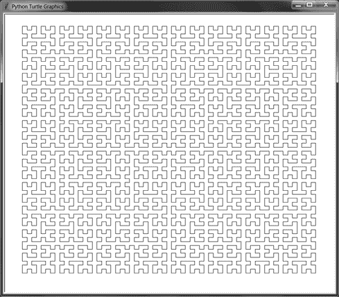

图 9-18：希尔伯特曲线的五个级别，线长为`10`

希尔伯特曲线进行 90 度（直角）转弯。但尝试将`ANGLE`变量调整几度至`89`或`86`，并运行程序查看变化。您还可以将`DRAW_SOLID`变量设置为`True`，以生成填充的希尔伯特曲线，如图 9-19。

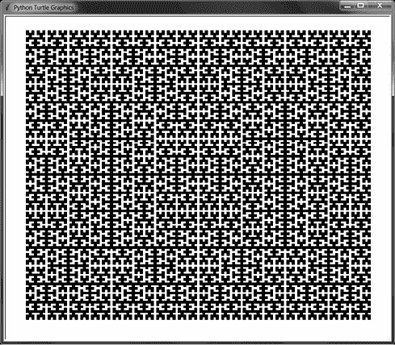

图 9-19：填充的希尔伯特曲线的六个级别，线长为`5`

## 总结

分形的广阔领域结合了编程和艺术的最有趣的部分，使得这一章节成为最有趣的写作。数学家和计算机科学家谈论他们领域的高级主题产生的美丽和优雅，但递归分形能够将这种概念上的美丽转化为任何人都能欣赏的视觉美。

本章介绍了几种分形和绘制它们的程序：谢尔宾斯基三角形、谢尔宾斯基地毯、程序生成的分形树、科赫曲线和雪花、以及希尔伯特曲线。所有这些都是使用 Python 的`turtle`模块和递归调用自身的函数绘制的。

## 进一步阅读

要了解更多关于使用 Python 的`turtle`模块绘图的知识，我在[`github.com/asweigart/simple-turtle-tutorial-for-python`](https://github.com/asweigart/simple-turtle-tutorial-for-python)写了一个简单的教程。我还在[`github.com/asweigart/art-of-turtle-programming`](https://github.com/asweigart/art-of-turtle-programming)上有一个个人的乌龟程序集合。

关于英国海岸线长度的问题来自曼德布罗特在 1967 年的一篇论文的标题。这个想法在维基百科上有很好的总结。可汗学院有更多关于科赫雪花几何的内容。

3Blue1Brown YouTube 频道有关分形的出色动画，特别是“分形通常不是自相似”的视频和“分形魅力：填充曲线”视频。

其他填充曲线需要递归来绘制，例如皮亚诺曲线、戈斯珀曲线和龙曲线，值得在网上进行研究。

## 练习问题

通过回答以下问题来测试您的理解：

1.  什么是分形？

1.  笛卡尔坐标系中的 x 和 y 坐标代表什么？

1.  笛卡尔坐标系中的原点坐标是什么？

1.  什么是程序生成？

1.  什么是种子值？

1.  科赫雪花的周长有多长？

1.  什么是填充曲线？

## 练习项目

为了练习，为以下每个任务编写一个程序：

1.  创建一个乌龟程序，绘制如图 9-20 所示的盒子分形。这个程序类似于本章介绍的谢尔宾斯基地毯程序。使用`turtle.begin_fill()`和`turtle.end_fill()`函数来绘制第一个大的黑色正方形。然后将这个正方形分成九个相等的部分，在顶部、左侧、右侧和底部的正方形中绘制白色正方形。对四个角落的正方形和中心正方形重复这个过程。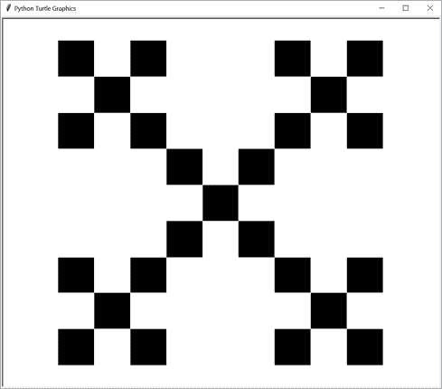

图 9-20：一个绘制了两层的盒子分形

1.  创建一个乌龟程序，绘制 Peano 填充曲线。这类似于本章中的希尔伯特曲线程序。图 9-21 显示了 Peano 曲线的前三次迭代。虽然每个希尔伯特曲线迭代被分割成 2×2 的部分（依次分割成 2×2 的部分），Peano 曲线被分割成 3×3 的部分。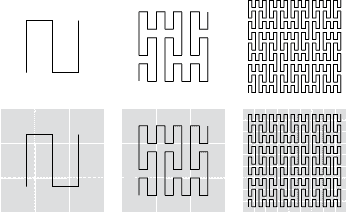

图 9-21：Peano 曲线的前三次迭代，从左到右。底部一行包括每个曲线部分分割的 3×3 部分。`*``
