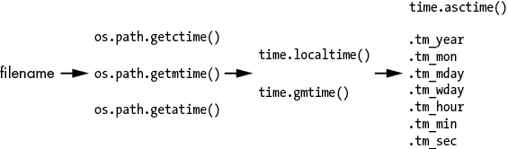

# 十、文件查找器

> 原文：[Chapter 10 - File Finder](https://inventwithpython.com/recursion/chapter10.html)
> 
> 译者：[飞龙](https://github.com/wizardforcel)
> 
> 协议：[CC BY-NC-SA 4.0](https://creativecommons.org/licenses/by-nc-sa/4.0/)


在本章中，你将编写自己的递归程序，根据自定义需求搜索文件。你的计算机已经有一些文件搜索命令和应用程序，但通常它们只能根据部分文件名检索文件。如果你需要进行奇特、高度特定的搜索怎么办？例如，如果你需要找到所有具有偶数字节的文件，或者文件名包含每个元音字母的文件？

你可能永远不需要专门进行这些搜索，但是你可能会有奇怪的搜索条件。如果你不能自己编写这个搜索，你就会很倒霉。

正如你所学到的，递归特别适用于具有树状结构的问题。你的计算机上的文件系统就像一棵树，就像你在图 2-6 中看到的那样。每个文件夹都分成子文件夹，这些子文件夹又可以分成其他子文件夹。我们将编写一个递归函数来遍历这棵树。

## 完整的文件搜索程序

让我们首先看一下递归文件搜索程序的完整源代码。本章的其余部分将逐个解释代码的每个部分。将文件搜索程序的源代码复制到名为`fileFinder.py`的文件中：

```py
import os

def hasEvenByteSize(fullFilePath):
    """Returns True if fullFilePath has an even size in bytes,
    otherwise returns False."""
    fileSize = os.path.getsize(fullFilePath)
    return fileSize % 2 == 0

def hasEveryVowel(fullFilePath):
    """Returns True if the fullFilePath has a, e, i, o, and u,
    otherwise returns False."""
    name = os.path.basename(fullFilePath).lower()
    return ('a' in name) and ('e' in name) and ('i' in name) and ('o' in name) and ('u' in name)

def walk(folder, matchFunc):
    """Calls the match function with every file in the folder and its
    subfolders. Returns a list of files that the match function
    returned True for."""
    matchedFiles = [] # This list holds all the matches.
    folder = os.path.abspath(folder) # Use the folder's absolute path.

    # Loop over every file and subfolder in the folder:
    for name in os.listdir(folder):
        filepath = os.path.join(folder, name)
        if os.path.isfile(filepath):
            # Call the match function for each file:
            if matchFunc(filepath):
                matchedFiles.append(filepath)
        elif os.path.isdir(filepath):
            # Recursively call walk for each subfolder, extending
            # the matchedFiles with their matches:
            matchedFiles.extend(walk(filepath, matchFunc))
    return matchedFiles

print('All files with even byte sizes:')
print(walk('.', hasEvenByteSize))
print('All files with every vowel in their name:')
print(walk('.', hasEveryVowel))
```

文件搜索程序的主要函数是`walk()`，它在基本文件夹及其子文件夹中“遍历”整个文件范围。它调用另外两个实现自定义搜索条件的函数中的一个。在这个程序的上下文中，我们将这些称为*匹配函数*。匹配函数调用返回`True`，如果文件符合搜索条件；否则，返回`False`。

`walk()`函数的工作是为它遍历的每个文件夹中的每个文件调用匹配函数。让我们更详细地看一下代码。

## 匹配函数

在 Python 中，你可以将函数本身作为参数传递给函数调用。在下面的示例中，`callTwice()`函数调用其函数参数两次，无论是`sayHello()`还是`sayGoodbye()`：

**Python**

```py
>>> def callTwice(func):
...     func()
...     func()
...
>>> def sayHello():
...     print('Hello!')
...
>>> def sayGoodbye():
...     print('Goodbye!')
...
>>> callTwice(sayHello)
Hello!
Hello!
>>> callTwice(sayGoodbye)
Goodbye!
Goodbye!
```

`callTwice()`函数调用作为`func`参数传递给它的任何函数。请注意，我们从函数参数中省略了括号，而是写成`callTwice(sayHello)`，而不是`callTwice(sayHello())`。这是因为我们传递的是`sayHello()`函数本身，而不是调用`sayHello()`并传递其返回值。

`walk()`函数接受一个匹配函数参数作为其搜索条件。这使我们能够自定义文件搜索的行为，而无需修改`walk()`函数本身的代码。我们稍后会看一下`walk()`。首先，让我们看一下程序中的两个示例匹配函数。

### 查找具有偶数字节的文件

第一个匹配函数找到具有偶数字节大小的文件：

**Python**

```py
import os

def hasEvenByteSize(fullFilePath):
    """Returns True if fullFilePath has an even size in bytes,
    otherwise returns False."""
    fileSize = os.path.getsize(fullFilePath)
    return fileSize % 2 == 0
```

我们导入`os`模块，该模块在整个程序中用于通过`getsize()`、`basename()`等函数获取有关计算机上文件的信息。然后我们创建一个名为`hasEvenByteSize()`的匹配函数。所有匹配函数都接受一个名为`fullFilePath`的字符串参数，并返回`True`或`False`来表示匹配或不匹配。

`os.path.getsize()`函数确定`fullFilePath`中文件的大小（以字节为单位）。然后我们使用`%`模运算符来确定这个数字是否是偶数。如果是偶数，`return`语句返回`True`；如果是奇数，返回`False`。例如，让我们考虑 Windows 操作系统中附带的记事本应用程序的大小（在 macOS 或 Linux 上，尝试在*/bin/ls*程序上运行这个函数）：

**Python**

```py
>>> import os
>>> os.path.getsize('C:/Windows/system32/notepad.exe')
211968
>>> 211968 % 2 == 0
True
```

`hasEvenByteSize()`匹配函数可以使用任何 Python 函数来查找有关`fullFilePath`文件的更多信息。这使您能够为任何搜索条件编写代码。当`walk()`对文件夹和子文件夹中的每个文件调用匹配函数时，匹配函数会为每个文件返回`True`或`False`。这告诉`walk()`文件是否匹配。

### 查找包含所有元音字母的文件名

让我们来看下一个匹配函数：

```py
def hasEveryVowel(fullFilePath):
    """Returns True if the fullFilePath has a, e, i, o, and u,
    otherwise returns False."""
    name = os.path.basename(fullFilePath).lower()
    return ('a' in name) and ('e' in name) and ('i' in name) and ('o' in name) and ('u' in name)
```

我们调用`os.path.basename()`来从文件路径中删除文件夹名称。Python 对字符串进行区分大小写的比较，这确保了`hasEveryVowel()`不会因为文件名中的元音字母是大写而漏掉任何元音字母。例如，调用`os.path.basename('C:/Windows/system32/notepad.exe')`返回字符串`notepad.exe`。这个字符串的`lower()`方法调用返回字符串的小写形式，这样我们只需要检查其中的小写元音字母。本章后面的“用于处理文件的有用 Python 标准库函数”探讨了一些更多用于获取文件信息的函数。

我们使用一个带有长表达式的`return`语句，如果`name`包含`a`、`e`、`i`、`o`或`u`，则表达式求值为`True`，表示文件符合搜索条件。否则，`return`语句返回`False`。

## 递归`walk()`函数

匹配函数检查文件是否符合搜索条件，而`walk()`函数找到所有要检查的文件。递归的`walk()`函数会传入一个要搜索的基础文件夹的名称，以及一个要对文件夹中的每个文件调用的匹配函数。

`walk()`函数也会递归地对基础文件夹中的每个子文件夹进行调用。这些子文件夹成为递归调用中的基础文件夹。让我们对这个递归函数提出三个问题：

1.  什么是基本情况？当函数完成对给定基础文件夹中的每个文件和子文件夹的处理时。

1.  递归函数调用传递了什么参数？要搜索的基础文件夹和用于查找匹配文件的匹配函数。对于该文件夹中的每个子文件夹，都会使用子文件夹作为新的文件夹参数进行递归调用。

1.  这个参数如何变得更接近基本情况？最终，函数要么在所有子文件夹上递归调用自身，要么遇到没有任何子文件夹的基础文件夹。

图 10-1 显示了一个示例文件系统以及对`walk()`的递归调用，它以`C:\`为基础文件夹进行调用。


图 10-1：一个示例文件系统和递归的`walk()`函数对其的调用

让我们来看一下`walk()`函数的代码：

```py
def walk(folder, matchFunc):
    """Calls the match function with every file in the folder and its
    subfolders. Returns a list of files that the match function
    returned True for."""
    matchedFiles = [] # This list holds all the matches.
    folder = os.path.abspath(folder) # Use the folder's absolute path.
```

`walk()`函数有两个参数：`folder`是要搜索的基础文件夹的字符串（我们可以传入'.'来指代 Python 程序所在的当前文件夹），`matchFunc`是一个 Python 函数，它接受一个文件名并在函数说它是搜索匹配时返回`True`。否则，函数返回`False`。

函数的下一部分检查`folder`的内容：

**Python**

```py
 # Loop over every file and subfolder in the folder:
    for name in os.listdir(folder):
        filepath = os.path.join(folder, name)
        if os.path.isfile(filepath):
```

`for`循环调用`os.listdir()`返回`folder`文件夹内容的列表。此列表包括所有文件和子文件夹。对于每个文件，我们通过将文件夹与文件或文件夹的名称连接起来创建完整的绝对路径。如果名称指的是文件，则`os.path.isfile()`函数调用返回`True`，我们将检查文件是否是搜索匹配项：

**Python**

```py
 # Call the match function for each file:
            if matchFunc(filepath):
                matchedFiles.append(filepath)
```

我们调用匹配函数，将`for`循环当前文件的完整绝对文件路径传递给它。请注意，`matchFunc`是`walk()`的一个参数的名称。如果`hasEvenByteSize()`，`hasEveryVowel()`或另一个函数作为`matchFunc`参数的参数传递，则`walk()`将调用该函数。如果`filepath`包含根据匹配算法匹配的文件，则将其添加到`matches`列表中：

**Python**

```py
 elif os.path.isdir(filepath):
            # Recursively call walk for each subfolder, extending
            # the matchedFiles with their matches:
            matchedFiles.extend(walk(filepath, matchFunc))
```

否则，如果`for`循环的文件是子文件夹，则`os.path.isdir()`函数调用返回`True`。然后我们将子文件夹传递给递归函数调用。递归调用返回子文件夹（及其子文件夹）中所有匹配文件的列表，然后将其添加到`matches`列表中：

```py
 return matchedFiles
```

`for`循环完成后，`matches`列表包含此文件夹（及其所有子文件夹）中的所有匹配文件。此列表成为`walk()`函数的返回值。

## 调用 walk()函数

现在我们已经实现了`walk()`函数和一些匹配函数，我们可以运行我们自定义的文件搜索。我们将`'.'`字符串作为`walk()`的第一个参数传递，这是一个特殊的目录名称，表示*当前目录*，以便它使用程序运行的文件夹作为基本文件夹进行搜索：

**Python**

```py
print('All files with even byte sizes:')
print(walk('.', hasEvenByteSize))
print('All files with every vowel in their name:')
print(walk('.', hasEveryVowel))
```

此程序的输出取决于计算机上的文件，但这演示了您如何为任何搜索条件编写代码。例如，输出可能如下所示：

**Python**

```py
All files with even byte sizes:
['C:\\Path\\accesschk.exe', 'C:\\Path\\accesschk64.exe', 
'C:\\Path\\AccessEnum.exe', 'C:\\Path\\ADExplorer.exe', 
'C:\\Path\\Bginfo.exe', 'C:\\Path\\Bginfo64.exe', 
'C:\\Path\\diskext.exe', 'C:\\Path\\diskext64.exe', 
'C:\\Path\\Diskmon.exe', 'C:\\Path\\DiskView.exe', 
'C:\\Path\\hex2dec64.exe', 'C:\\Path\\jpegtran.exe', 
'C:\\Path\\Tcpview.exe', 'C:\\Path\\Testlimit.exe', 
'C:\\Path\\wget.exe', 'C:\\Path\\whois.exe']
All files with every vowel in their name:
['C:\\Path\\recursionbook.bat']
```

## 用于处理文件的有用的 Python 标准库函数

让我们看看一些函数，这些函数在编写自己的匹配函数时可能会对您有所帮助。Python 附带的标准库模块中有几个有用的函数，用于获取有关文件的信息。其中许多位于`os`和`shutil`模块中，因此您的程序必须在调用这些函数之前运行`import os`或`import shutil`。

### 查找有关文件名称的信息

传递给匹配函数的完整文件路径可以使用`os.path.basename()`和`os.path.dirname()`函数分解为基本名称和目录名称。您还可以调用`os.path.split()`将这些名称作为元组获取。在 Python 的交互式 shell 中输入以下内容。在 macOS 或 Linux 上，尝试使用`/bin/ls`作为文件名：

**Python**

```py
>>> import os
>>> filename = 'C:/Windows/system32/notepad.exe'
>>> os.path.basename(filename)
'notepad.exe'
>>> os.path.dirname(filename)
'C:/Windows/system32'
>>> os.path.split(filename)
('C:/Windows/system32', 'notepad.exe')
>>> folder, file = os.path.split(filename)
>>> folder
'C:/Windows/system32'
>>> file
'notepad.exe'
```

您可以在这些字符串值上使用 Python 的任何字符串方法来帮助评估文件是否符合您的搜索条件，例如`hasEveryVowel()`匹配函数中的`lower()`。

### 查找有关文件时间戳的信息

文件具有指示它们创建时间、上次修改时间和上次访问时间的时间戳。Python 的`os.path.getctime()`，`os.path.getmtime()`和`os.path.getatime()`分别将这些时间戳作为浮点值返回，指示自*Unix 纪元*以来的秒数，即 1970 年 1 月 1 日协调世界时（UTC）时区的午夜。在交互式 shell 中输入以下内容：

**Python**

```py
> import os
> filename = 'C:/Windows/system32/notepad.exe'
> os.path.getctime(filename)
1625705942.1165037
> os.path.getmtime(filename)
1625705942.1205275
> os.path.getatime(filename)
1631217101.8869188
```

这些浮点值对程序来说很容易使用，因为它们只是单个数字，但您需要使用 Python 的`time`模块中的函数使它们对人类更容易阅读。`time.localtime()`函数将 Unix 纪元时间戳转换为计算机所在时区的`struct_time`对象。`struct_time`对象具有几个属性，其名称以`tm_`开头，用于获取日期和时间信息。在交互式 shell 中输入以下内容：

**Python**

```py
>>> import os
>>> filename = 'C:/Windows/system32/notepad.exe'
>>> ctimestamp = os.path.getctime(filename)
>>> import time
>>> time.localtime(ctimestamp)
time.struct_time(tm_year=2021, tm_mon=7, tm_mday=7, tm_hour=19, 
tm_min=59, tm_sec=2, tm_wday=2, tm_yday=188, tm_isdst=1)
>>> st = time.localtime(ctimestamp)
>>> st.tm_year
2021
>>> st.tm_mon
7
>>> st.tm_mday
7
>>> st.tm_wday
2
>>> st.tm_hour
19
>>> st.tm_min
59
>>> st.tm_sec
2
```

请注意，`tm_mday`属性是月份的日期，范围是`1`到`31`。`tm_wday`属性是星期几，从星期一的`0`开始，星期二的`1`，依此类推，直到星期日的`6`。

如果需要`time_struct`对象的简短、可读的字符串，请将其传递给`time.asctime()`函数：

Python

```py
>>> import os
>>> filename = 'C:/Windows/system32/notepad.exe'
>>> ctimestamp = os.path.getctime(filename)
>>> import time
>>> st = time.localtime(ctimestamp)
>>> time.asctime(st)
'Wed Jul  7 19:59:02 2021'
```

而`time.localtime()`函数返回本地时区的`struct_time`对象，`time.gmtime()`函数返回 UTC 或格林威治标准时间时区的`struct_time`对象。将以下内容输入交互式 shell：

Python

```py
>>> import os
>>> filename = 'C:/Windows/system32/notepad.exe'
>>> ctimestamp = os.path.getctime(filename)
>>> import time
>>> ctimestamp = os.path.getctime(filename)
>>> time.localtime(ctimestamp)
time.struct_time(tm_year=2021, tm_mon=7, tm_mday=7, tm_hour=19, 
tm_min=59, tm_sec=2, tm_wday=2, tm_yday=188, tm_isdst=1)
>>> time.gmtime(ctimestamp)
time.struct_time(tm_year=2021, tm_mon=7, tm_mday=8, tm_hour=0, 
tm_min=59, tm_sec=2, tm_wday=3, tm_yday=189, tm_isdst=0)
```

这些`os.path`函数（返回 Unix 纪元时间戳）与`time`函数（返回`struct_time`对象）之间的交互可能会令人困惑。图 10-2 显示了从文件名字符串开始的代码链，以获取时间戳的各个部分。



图 10-2：从文件名到时间戳的各个属性

最后，`time.time()`函数返回自 Unix 纪元以来到当前时间的秒数。

### 修改您的文件

`walk()`函数返回与您的搜索条件匹配的文件列表后，您可能希望对它们进行重命名、删除或执行其他操作。Python 标准库中的`shutil`和`os`模块具有执行此操作的函数。此外，第三方模块`send2trash`也可以将文件发送到操作系统的回收站，而不是永久删除它们。

要移动文件，请使用`shutil.move()`函数并提供两个参数。第一个参数是要移动的文件，第二个是要将其移动到的文件夹。例如，您可以调用以下内容：

Python

```py
>>> import shutil
>>> shutil.move('spam.txt', 'someFolder')
'someFolder\\spam.txt'
```

`shutil.move()`函数返回文件的新文件路径字符串。您还可以指定文件名以同时移动和重命名文件：

Python

```py
>>> import shutil
>>> shutil.move('spam.txt', 'someFolder\\newName.txt')
'someFolder\\newName.txt'
```

如果第二个参数缺少文件夹，您可以只指定一个新名称以在当前文件夹中重命名文件：

Python

```py
>>> import shutil
>>> shutil.move('spam.txt', 'newName.txt')
'newName.txt'
```

请注意，`shutil.move()`函数既移动又重命名文件，类似于 Unix 和 macOS 的`mv`命令移动和重命名文件。没有单独的`shutil.rename()`函数。

要复制文件，请使用`shutil.copy()`函数并提供两个参数。第一个参数是要复制的文件的文件名，第二个参数是副本的新名称。例如，您可以调用以下内容：

Python

```py
>>> import shutil
>>> shutil.copy('spam.txt', 'spam-copy.txt')
'spam-copy.txt'
```

`shutil.copy()`函数返回副本的名称。要删除文件，请调用`os.unlink()`函数并将要删除的文件的名称传递给它：

Python

```py
>>> import os
>>> os.unlink('spam.txt')
>>>
```

使用*unlink*而不是*delete*的名称是因为它删除了与文件链接的文件名的技术细节。但由于大多数文件只有一个链接的文件名，这种取消链接也会删除文件。如果您不理解这些文件系统概念，也没关系，只需知道`os.unlink()`会删除文件。

调用`os.unlink()`会永久删除文件，如果程序中的错误导致函数删除错误的文件，这可能是危险的。相反，您可以使用`send2trash`模块的`send2trash()`函数将文件放入操作系统的回收站。要安装此模块，请在 Windows 命令提示符上运行`run python -m pip install --user send2trash`，或在 macOS 或 Linux 终端上运行`run python3 -m pip install`。安装模块后，您将能够使用`import send2trash`导入它。

将以下内容输入交互式 shell：

Python

```py
>>> open('deleteme.txt', 'w').close() # Create a blank file.
>>> import send2trash
>>> send2trash.send2trash('deleteme.txt')
```

此示例创建一个名为`deleteme.txt`的空文件。调用`send2trash.send2trash()`（模块和函数同名），此文件将被移除到回收站。

## 摘要

本章的文件搜索项目使用递归来“遍历”文件夹及其所有子文件夹的内容。文件查找程序的`walk()`函数递归地导航这些文件夹，将自定义搜索条件应用于每个子文件夹中的每个文件。搜索条件被实现为匹配函数，这些函数被传递给`walk()`函数。这使我们能够通过编写新函数而不是修改`walk()`中的代码来更改搜索条件。

我们的项目有两个匹配函数，用于查找文件大小为偶数字节或包含其名称中的每个元音字母，但您可以编写自己的函数传递给`walk()`。这就是编程的力量；您可以为自己的需求创建商业应用程序中不可用的功能。

## 进一步阅读

Python 内置的`os.walk()`函数的文档（类似于文件查找器项目中的`walk()`函数）位于[`docs.python.org/3/library/os.html#os.walk`](https://docs.python.org/3/library/os.html#os.walk)。您还可以在我的书*Automate the Boring Stuff with Python*第九章中了解有关计算机文件系统和 Python 文件函数的更多信息，第 2 版（No Starch Press，2019）位于[`automatetheboringstuff.com/2e/chapter9`](https://automatetheboringstuff.com/2e/chapter9)。

Python 标准库中的`datetime`模块还有更多与时间戳数据交互的方法。您可以在*Automate the Boring Stuff with Python*第十七章中了解更多信息，第 2 版位于[`automatetheboringstuff.com/2e/chapter17`](https://automatetheboringstuff.com/2e/chapter17)。

