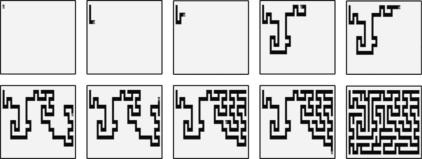
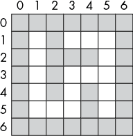

# 十一、迷宫生成器

> 原文：[Chapter 11 - Maze Generator](https://inventwithpython.com/recursion/chapter11.html)
> 
> 译者：[飞龙](https://github.com/wizardforcel)
> 
> 协议：[CC BY-NC-SA 4.0](https://creativecommons.org/licenses/by-nc-sa/4.0/)


第四章描述了一个解决迷宫的递归算法，但另一个递归算法生成迷宫。在本章中，我们将以第四章中迷宫求解程序相同的格式生成迷宫。因此，无论您是迷宫的解决者还是创建者，现在您都有能力将编程应用于此任务。

该算法通过访问迷宫中的一个起始空间，然后递归地访问相邻的空间来工作。随着算法继续访问相邻空间，迷宫的走廊被“刻出”。如果算法到达没有相邻空间的死胡同，它会回溯到先前的空间，直到找到一个未访问的相邻空间，并继续从那里访问。当算法回溯到起始空间时，整个迷宫已经生成。

我们将在这里使用的递归回溯算法生成的迷宫倾向于具有长走廊（连接分支交叉点的迷宫空间）并且相当容易解决。但是，这种算法比许多其他迷宫生成算法（如 Kruskal 算法或 Wilson 算法）更容易实现，因此它是该主题的很好介绍。

## 完整的迷宫生成器程序

让我们首先看一下程序的完整 Python 和 JavaScript 源代码，该程序使用递归回溯算法生成迷宫。本章的其余部分将逐个解释代码的每个部分。

将此 Python 代码复制到名为`mazeGenerator.py`的文件中：

**Python**

```py
import random

WIDTH = 39 # Width of the maze (must be odd).
HEIGHT = 19 # Height of the maze (must be odd).
assert WIDTH % 2 == 1 and WIDTH >= 3
assert HEIGHT % 2 == 1 and HEIGHT >= 3
SEED = 1
random.seed(SEED)

# Use these characters for displaying the maze:
EMPTY = ' '
MARK = '@'
WALL = chr(9608) # Character 9608 is '█'
NORTH, SOUTH, EAST, WEST = 'n', 's', 'e', 'w'

# Create the filled-in maze data structure to start: 
maze = {}
for x in range(WIDTH):
    for y in range(HEIGHT):
        maze[(x, y)] = WALL # Every space is a wall at first.

def printMaze(maze, markX=None, markY=None):
    """Displays the maze data structure in the maze argument. The
    markX and markY arguments are coordinates of the current
    '@' location of the algorithm as it generates the maze."""

    for y in range(HEIGHT):
        for x in range(WIDTH):
            if markX == x and markY == y:
                # Display the '@' mark here:
                print(MARK, end='')
            else:
                # Display the wall or empty space:
                print(maze[(x, y)], end='')
        print() # Print a newline after printing the row.

def visit(x, y):
    """"Carve out" empty spaces in the maze at x, y and then
    recursively move to neighboring unvisited spaces. This
    function backtracks when the mark has reached a dead end."""
 maze[(x, y)] = EMPTY # "Carve out" the space at x, y.
    printMaze(maze, x, y) # Display the maze as we generate it.
    print('\n\n')

    while True:
        # Check which neighboring spaces adjacent to
        # the mark have not been visited already:
        unvisitedNeighbors = []
        if y > 1 and (x, y - 2) not in hasVisited:
            unvisitedNeighbors.append(NORTH)

        if y < HEIGHT - 2 and (x, y + 2) not in hasVisited:
            unvisitedNeighbors.append(SOUTH)

        if x > 1 and (x - 2, y) not in hasVisited:
            unvisitedNeighbors.append(WEST)

        if x < WIDTH - 2 and (x + 2, y) not in hasVisited:
            unvisitedNeighbors.append(EAST)

        if len(unvisitedNeighbors) == 0:
            # BASE CASE
            # All neighboring spaces have been visited, so this is a
            # dead end. Backtrack to an earlier space:
            return
        else:
            # RECURSIVE CASE
            # Randomly pick an unvisited neighbor to visit:
            nextIntersection = random.choice(unvisitedNeighbors)

            # Move the mark to an unvisited neighboring space:

            if nextIntersection == NORTH:
                nextX = x
                nextY = y - 2
                maze[(x, y - 1)] = EMPTY # Connecting hallway.
            elif nextIntersection == SOUTH:
                nextX = x
                nextY = y + 2
                maze[(x, y + 1)] = EMPTY # Connecting hallway.
            elif nextIntersection == WEST:
                nextX = x - 2
                nextY = y
                maze[(x - 1, y)] = EMPTY # Connecting hallway.
            elif nextIntersection == EAST:
                nextX = x + 2
                nextY = y
                maze[(x + 1, y)] = EMPTY # Connecting hallway.

            hasVisited.append((nextX, nextY)) # Mark as visited.
            visit(nextX, nextY) # Recursively visit this space.

# Carve out the paths in the maze data structure:
hasVisited = [(1, 1)] # Start by visiting the top-left corner.
visit(1, 1)

# Display the final resulting maze data structure:
printMaze(maze)
```

将此 JavaScript 代码复制到名为`mazeGenerator.html`的文件中：

**JavaScript**

```js
<script type="text/javascript">

const WIDTH = 39; // Width of the maze (must be odd).
const HEIGHT = 19; // Height of the maze (must be odd).
console.assert(WIDTH % 2 == 1 && WIDTH >= 2);
console.assert(HEIGHT % 2 == 1 && HEIGHT >= 2);

// Use these characters for displaying the maze:
const EMPTY = "&nbsp;";
const MARK = "@";
const WALL = "&#9608;"; // Character 9608 is ′█′
const [NORTH, SOUTH, EAST, WEST] = ["n", "s", "e", "w"];

// Create the filled-in maze data structure to start:
let maze = {};
for (let x = 0; x < WIDTH; x++) {
    for (let y = 0; y < HEIGHT; y++) {
        maze[[x, y]] = WALL; // Every space is a wall at first.
    }
}

function printMaze(maze, markX, markY) {
    // Displays the maze data structure in the maze argument. The
    // markX and markY arguments are coordinates of the current
    // '@' location of the algorithm as it generates the maze.
    document.write('<code>');
    for (let y = 0; y < HEIGHT; y++) {
        for (let x = 0; x < WIDTH; x++) {
            if (markX === x && markY === y) {
                // Display the ′@′ mark here:
                document.write(MARK);
            } else {
                // Display the wall or empty space:
                document.write(maze[[x, y]]);
            }
        }
        document.write('<br />'); // Print a newline after printing the row.
    }
    document.write('</code>');
}

function visit(x, y) {
    // "Carve out" empty spaces in the maze at x, y and then
    // recursively move to neighboring unvisited spaces. This
    // function backtracks when the mark has reached a dead end.

 maze[[x, y]] = EMPTY; // "Carve out" the space at x, y.
    printMaze(maze, x, y); // Display the maze as we generate it.
    document.write('<br /><br /><br />');

    while (true) {
        // Check which neighboring spaces adjacent to
        // the mark have not been visited already:
        let unvisitedNeighbors = [];
        if (y > 1 && !JSON.stringify(hasVisited).includes(JSON.stringify([x, y - 2]))) {
            unvisitedNeighbors.push(NORTH);
        }
        if (y < HEIGHT - 2 && 
        !JSON.stringify(hasVisited).includes(JSON.stringify([x, y + 2]))) {
            unvisitedNeighbors.push(SOUTH);
        }
        if (x > 1 && 
        !JSON.stringify(hasVisited).includes(JSON.stringify([x - 2, y]))) {
            unvisitedNeighbors.push(WEST);
        }
        if (x < WIDTH - 2 && 
        !JSON.stringify(hasVisited).includes(JSON.stringify([x + 2, y]))) {
            unvisitedNeighbors.push(EAST);
        }

        if (unvisitedNeighbors.length === 0) {
            // BASE CASE
            // All neighboring spaces have been visited, so this is a
            // dead end. Backtrack to an earlier space:
            return;
        } else {
            // RECURSIVE CASE
            // Randomly pick an unvisited neighbor to visit:
            let nextIntersection = unvisitedNeighbors[
            Math.floor(Math.random() * unvisitedNeighbors.length)];

            // Move the mark to an unvisited neighboring space:
            let nextX, nextY;
            if (nextIntersection === NORTH) {
                nextX = x;
                nextY = y - 2;
                maze[[x, y - 1]] = EMPTY; // Connecting hallway.
            } else if (nextIntersection === SOUTH) {
                nextX = x;
                nextY = y + 2;
                maze[[x, y + 1]] = EMPTY; // Connecting hallway.
            } else if (nextIntersection === WEST) {
                nextX = x - 2;
                nextY = y;
                maze[[x - 1, y]] = EMPTY; // Connecting hallway.
            } else if (nextIntersection === EAST) {
                nextX = x + 2;
                nextY = y;
                maze[[x + 1, y]] = EMPTY; // Connecting hallway.
            }
 hasVisited.push([nextX, nextY]); // Mark space as visited.
            visit(nextX, nextY); // Recursively visit this space.
        }
    }
}

// Carve out the paths in the maze data structure:
let hasVisited = [[1, 1]]; // Start by visiting the top-left corner.
visit(1, 1);

// Display the final resulting maze data structure:
printMaze(maze);
</script>
```

当您运行此程序时，它会产生大量文本，将填满终端窗口或浏览器，并显示迷宫构建的每一步。您将不得不向上滚动以查看整个输出。

迷宫数据结构开始时是一个完全填满的二维空间。递归回溯算法在这个迷宫中给出一个起始点，然后访问一个先前未访问的相邻空间，在这个过程中“挖出”任何走廊空间。然后它在一个以前未访问过的相邻空间上递归调用自身。如果所有相邻空间都已经被访问过，算法就会陷入死胡同，并回溯到先前访问过的空间以访问它的未访问的邻居。当算法回溯到起始位置时，程序结束。

通过运行迷宫生成器程序，您可以看到这个算法的运行过程。当迷宫被挖出时，它会使用`@`字符显示当前的 x，y 坐标。这个过程看起来像图 11-1。请注意，右上角的第五张图在到达死胡同后回溯到了一个先前的空间，以探索从那个空间的新邻居方向。



图 11-1：递归回溯算法“挖出”的迷宫

让我们更详细地看一下代码。

## 设置迷宫生成器的常量

迷宫生成器使用了几个常量，我们可以在运行程序之前更改这些常量以改变迷宫的大小和外观。这些常量的 Python 代码如下：

**Python**

```py
import random

WIDTH = 39 # Width of the maze (must be odd).
HEIGHT = 19 # Height of the maze (must be odd).
assert WIDTH % 2 == 1 and WIDTH >= 3
assert HEIGHT % 2 == 1 and HEIGHT >= 3
SEED = 1
random.seed(SEED)
```

JavaScript 代码如下：

**JavaScript**

```js
<script type="text/javascript">

const WIDTH = 39; // Width of the maze (must be odd).
const HEIGHT = 19; // Height of the maze (must be odd).
console.assert(WIDTH % 2 == 1 && WIDTH >= 3);
console.assert(HEIGHT % 2 == 1 && HEIGHT >= 3);
```

常量`WIDTH`和`HEIGHT`决定了迷宫的大小。它们必须是奇数，因为我们的迷宫数据结构要求迷宫的访问空间之间有墙壁，留下奇数维度。为了确保`WIDTH`和`HEIGHT`常量被正确设置，我们使用断言来阻止程序如果常量不是奇数或太小的话。

程序依赖于一个随机种子值来根据相同的种子值重现相同的迷宫。这个程序的 Python 版本让我们通过调用`random.seed()`函数来设置这个值。不幸的是，JavaScript 没有一种明确设置种子值的方法，每次运行程序都会生成不同的迷宫。

Python 代码继续设置一些常量：

**Python**

```py
# Use these characters for displaying the maze:
EMPTY = ' '
MARK = '@'
WALL = chr(9608) # Character 9608 is '█'
NORTH, SOUTH, EAST, WEST = 'n', 's', 'e', 'w'
```

这些常量的 JavaScript 代码如下：

**JavaScript**

```py
// Use these characters for displaying the maze:
const EMPTY = "&nbsp;";
const MARK = "@";
const WALL = "&#9608;"; // Character 9608 is ′█′
const [NORTH, SOUTH, EAST, WEST] = ["n", "s", "e", "w"];
```

`EMPTY`和`WALL`常量影响了迷宫在屏幕上的显示方式。`MARK`常量用于指出算法在迷宫中的位置。`NORTH`，`SOUTH`，`EAST`和`WEST`常量表示标记可以通过迷宫的方向，并用于使代码更易读。

## 创建迷宫数据结构

迷宫数据结构是一个 Python 字典或 JavaScript 对象，它的键是 Python 元组或 JavaScript 数组，表示迷宫中每个空间的 x，y 坐标。这些键的值是`WALL`或`EMPTY`常量的字符串。这个字符串表示这个空间是迷宫中的阻挡墙还是可通过的空白空间。

例如，图 11-2 中的迷宫由以下数据结构表示：

```py
{(0, 0): '█', (0, 1): '█', (0, 2): '█', (0, 3): '█', (0, 4): '█', 
(0, 5): '█', (0, 6): '█', (1, 0): '█', (1, 1): ' ', (1, 2): ' ', 
(1, 3): ' ', (1, 4): ' ', (1, 5): ' ', (1, 6): '█', (2, 0): '█', 
(2, 1): '█', (2, 2): '█', (2, 3): '█', (2, 4): '█', (2, 5): ' ', 
(2, 6): '█', (3, 0): '█', (3, 1): ' ', (3, 2): '█', (3, 3): ' ', 
(3, 4): ' ', (3, 5): ' ', (3, 6): '█', (4, 0): '█', (4, 1): ' ', 
(4, 2): '█', (4, 3): ' ', (4, 4): '█', (4, 5): '█', (4, 6): '█', 
(5, 0): '█', (5, 1): ' ', (5, 2): ' ', (5, 3): ' ', (5, 4): ' ', 
(5, 5): ' ', (5, 6): '█', (6, 0): '█', (6, 1): '█', (6, 2): '█', 
(6, 3): '█', (6, 4): '█', (6, 5): '█', (6, 6): '█'}
```



图 11-2：一个可以用数据结构表示的示例迷宫

程序必须从每个空间设置为`WALL`开始。然后递归的`visit()`函数通过将空间设置为`EMPTY`来挖出迷宫的走廊和交叉点：

**Python**

```py
# Create the filled-in maze data structure to start:
maze = {}
for x in range(WIDTH):
    for y in range(HEIGHT):
        maze[(x, y)] = WALL # Every space is a wall at first.
```

相应的 JavaScript 代码如下：

**JavaScript**

```py
// Create the filled-in maze data structure to start:
let maze = {};
for (let x = 0; x < WIDTH; x++) {
    for (let y = 0; y < HEIGHT; y++) {
        maze[[x, y]] = WALL; // Every space is a wall at first.
    }
}
```

我们在`maze`全局变量中创建空字典（在 Python 中）或对象（在 JavaScript 中）。`for`循环遍历每个可能的 x，y 坐标，将每个设置为`WALL`，以创建一个完全填充的迷宫。调用`visit()`将从这个数据结构中刻出迷宫的走廊，将其中的空间设置为`EMPTY`。

## 打印迷宫数据结构

为了表示迷宫作为数据结构，Python 程序使用字典，JavaScript 程序使用对象。在这个结构中，键是包含两个整数的列表或数组，分别代表 x 和 y 坐标，而值要么是`WALL`要么是`EMPTY`单字符字符串。因此，我们可以在 Python 代码中通过`maze[(x, y)]`或在 JavaScript 代码中通过`maze[[x, y]]`访问迷宫中坐标 x，y 的墙壁或空走廊空间。

`printMaze()`的 Python 代码如下开始：

**Python**

```py
def printMaze(maze, markX=None, markY=None):
    """Displays the maze data structure in the maze argument. The
    markX and markY arguments are coordinates of the current
    '@' location of the algorithm as it generates the maze."""

    for y in range(HEIGHT):
        for x in range(WIDTH):
```

`printMaze()`的 JavaScript 代码如下开始：

**JavaScript**

```py
function printMaze(maze, markX, markY) {
    // Displays the maze data structure in the maze argument. The
    // markX and markY arguments are coordinates of the current
    // '@' location of the algorithm as it generates the maze.
    document.write('<code>');
 for (let y = 0; y < HEIGHT; y++) {
        for (let x = 0; x < WIDTH; x++) {
```

`printMaze()`函数在屏幕上打印作为迷宫参数传递的迷宫数据结构。可选地，如果传递了`markX`和`markY`整数参数，则在打印的迷宫中，`MARK`常量（我们设置为`@`）将出现在这些 x，y 坐标上。为了确保迷宫以等宽字体打印，JavaScript 版本在打印迷宫本身之前写入 HTML 标签`<code>`。没有这个 HTML 标签，迷宫将在浏览器中显示扭曲。

在函数内部，嵌套的`for`循环遍历迷宫数据结构中的每个空间。这些`for`循环分别从`0`到`HEIGHT`的 y 坐标和从`0`到`WIDTH`的 x 坐标进行迭代。

在内部的`for`循环中，如果当前的 x，y 坐标与标记的位置（算法当前正在刻划的位置）匹配，程序会在`MARK`常量中显示`@`。Python 代码如下：

**Python**

```py
 if markX == x and markY == y:
                # Display the '@' mark here:
                print(MARK, end='')
            else:
                # Display the wall or empty space:
                print(maze[(x, y)], end='')

        print() # Print a newline after printing the row.
```

JavaScript 代码如下：

**JavaScript**

```py
 if (markX === x && markY === y) {
                // Display the ′@′ mark here:
                document.write(MARK);
            } else {
                // Display the wall or empty space:
                document.write(maze[[x, y]]);
            }
        }
        document.write('<br />'); // Print a newline after printing the row.
    }
    document.write('</code>');
}
```

否则，程序通过在`maze`数据结构中打印`maze[(x, y)]`（在 Python 中）或`maze[[x, y]]`（在 JavaScript 中）来显示`WALL`或`EMPTY`常量的字符。在内部的`for`循环完成对 x 坐标的迭代后，我们在行末打印一个换行符，为下一行做准备。

## 使用递归回溯算法

`visit()`函数实现了递归回溯算法。该函数有一个列表（在 Python 中）或数组（在 JavaScript 中），用于跟踪先前的`visit()`函数调用已经访问过的 x，y 坐标。它还就地修改了存储迷宫数据结构的全局`maze`变量。`visit()`的 Python 代码如下开始：

**Python**

```py
def visit(x, y):
    """"Carve out" empty spaces in the maze at x, y and then
    recursively move to neighboring unvisited spaces. This
    function backtracks when the mark has reached a dead end."""
    maze[(x, y)] = EMPTY # "Carve out" the space at x, y.
    printMaze(maze, x, y) # Display the maze as we generate it.
    print('\n\n')
```

`visit()`的 JavaScript 代码如下开始：

**JavaScript**

```py
function visit(x, y) {
    // "Carve out" empty spaces in the maze at x, y and then
    // recursively move to neighboring unvisited spaces. This
    // function backtracks when the mark has reached a dead end.

    maze[[x, y]] = EMPTY; // "Carve out" the space at x, y.
    printMaze(maze, x, y); // Display the maze as we generate it.
    document.write('<br /><br /><br />');
```

`visit()`函数接受 x，y 坐标作为迷宫中算法正在访问的位置的参数。然后函数将`maze`中这个位置的数据结构更改为空格。为了让用户看到迷宫生成的进展，它调用`printMaze()`，将`x`和`y`参数作为标记的当前位置传递进去。

接下来，递归回溯调用`visit()`，使用先前未访问的相邻空间的坐标。Python 代码继续如下：

**Python**

```py
 while True:
        # Check which neighboring spaces adjacent to
        # the mark have not been visited already:
        unvisitedNeighbors = []
        if y > 1 and (x, y - 2) not in hasVisited:
            unvisitedNeighbors.append(NORTH)

        if y < HEIGHT - 2 and (x, y + 2) not in hasVisited:
            unvisitedNeighbors.append(SOUTH)

        if x > 1 and (x - 2, y) not in hasVisited:
            unvisitedNeighbors.append(WEST)

        if x < WIDTH - 2 and (x + 2, y) not in hasVisited:
            unvisitedNeighbors.append(EAST)
```

JavaScript 代码继续如下：

```py
 while (true) {
        // Check which neighboring spaces adjacent to
        // the mark have not been visited already:
        let unvisitedNeighbors = [];
        if (y > 1 && !JSON.stringify(hasVisited).includes(JSON.stringify([x, y - 2]))) {
            unvisitedNeighbors.push(NORTH);
        }
        if (y < HEIGHT - 2 && !JSON.stringify(hasVisited).includes(JSON.stringify([x, y + 2]))) {
            unvisitedNeighbors.push(SOUTH);
        }
        if (x > 1 && !JSON.stringify(hasVisited).includes(JSON.stringify([x - 2, y]))) {
            unvisitedNeighbors.push(WEST);
        }
        if (x < WIDTH - 2 && !JSON.stringify(hasVisited).includes(JSON.stringify([x + 2, y]))) {
            unvisitedNeighbors.push(EAST);
        }
```

`while`循环会继续循环，只要迷宫中这个位置还有未访问的相邻空间。我们在`unvisitedNeighbors`变量中创建一个未访问的相邻空间的列表或数组。四个`if`语句检查当前的 x，y 位置是否不在迷宫的边界上（这样我们仍然有相邻的空间要检查），以及相邻空间的 x，y 坐标是否已经出现在`hasVisited`列表或数组中。

如果所有相邻空间都已经被访问，函数将返回，以便可以回溯到较早的空间。Python 代码继续检查基本情况：

**Python**

```py
 if len(unvisitedNeighbors) == 0:
            # BASE CASE
            # All neighboring spaces have been visited, so this is a
            # dead end. Backtrack to an earlier space:
            return
```

JavaScript 代码如下所示：

**JavaScript**

```py
 if (unvisitedNeighbors.length === 0) {
            // BASE CASE
            // All neighboring spaces have been visited, so this is a
            // dead end. Backtrack to an earlier space:
            return;
```

递归回溯算法的基本情况是当没有未访问的相邻空间时发生。在这种情况下，函数简单地返回。`visit()`函数本身没有返回值。相反，递归函数调用`visit()`以副作用的方式修改全局`maze`变量中的迷宫数据结构。当对`maze()`的原始函数调用返回时，`maze`全局变量包含完全生成的迷宫。

Python 代码继续到这样的递归情况：

**Python**

```py
 else:
            # RECURSIVE CASE
            # Randomly pick an unvisited neighbor to visit:
            nextIntersection = random.choice(unvisitedNeighbors)

            # Move the mark to an unvisited neighboring space:

            if nextIntersection == NORTH:
                nextX = x
                nextY = y - 2
                maze[(x, y - 1)] = EMPTY # Connecting hallway.
            elif nextIntersection == SOUTH:
                nextX = x
                nextY = y + 2
                maze[(x, y + 1)] = EMPTY # Connecting hallway.
            elif nextIntersection == WEST:
                nextX = x - 2
                nextY = y
                maze[(x - 1, y)] = EMPTY # Connecting hallway.
            elif nextIntersection == EAST:
                nextX = x + 2
                nextY = y
                maze[(x + 1, y)] = EMPTY # Connecting hallway.

            hasVisited.append((nextX, nextY)) # Mark space as visited.
            visit(nextX, nextY) # Recursively visit this space.
```

JavaScript 代码如下继续：

**JavaScript**

```py
 } else {
            // RECURSIVE CASE
            // Randomly pick an unvisited neighbor to visit:
            let nextIntersection = unvisitedNeighbors[
            Math.floor(Math.random() * unvisitedNeighbors.length)];

            // Move the mark to an unvisited neighboring space:
            let nextX, nextY;
            if (nextIntersection === NORTH) {
                nextX = x;
                nextY = y - 2;
                maze[[x, y - 1]] = EMPTY; // Connecting hallway.
            } else if (nextIntersection === SOUTH) {
                nextX = x;
                nextY = y + 2;
                maze[[x, y + 1]] = EMPTY; // Connecting hallway.
            } else if (nextIntersection === WEST) {
                nextX = x - 2;
                nextY = y;
                maze[[x - 1, y]] = EMPTY; // Connecting hallway.
            } else if (nextIntersection === EAST) {
                nextX = x + 2;
                nextY = y;
 maze[[x + 1, y]] = EMPTY;    // Connecting hallway.
            }
            hasVisited.push([nextX, nextY]); // Mark space as visited.
            visit(nextX, nextY);             // Recursively visit this space.
        }
    }
}
```

`unvisitedNeighbors`列表或数组包含一个或多个`NORTH`、`SOUTH`、`WEST`和`EAST`常量。我们选择其中一个方向作为下一个递归调用`visit()`的方向，然后使用这个方向的相邻空间的坐标设置`nextX`和`nextY`变量。

之后，我们将`nextX`和`nextY`的 x、y 坐标添加到`hasVisited`列表或数组中，然后对这个相邻空间进行递归调用。这样，`visit()`函数将继续访问相邻空间，通过将`maze`中的位置设置为`EMPTY`来 carve out 迷宫走廊。当前空间和相邻空间之间的连接走廊也被设置为`EMPTY`。

当没有相邻空间存在时，基本情况简单地返回到较早的位置。在`visit()`函数中，执行跳回到`while`循环的开始。`while`循环中的代码再次检查哪些相邻空间尚未被访问，并对其中一个进行递归`visit()`调用，或者如果所有相邻空间已经被访问，则返回。

随着迷宫填满走廊并且每个空间都被访问，递归调用将继续返回，直到原始的`visit()`函数调用返回。此时，迷宫变量包含完全生成的迷宫。

## 开始递归调用链

递归`visit()`使用两个全局变量，`maze`和`hasVisited`。`hasVisited`变量是一个包含算法访问过的每个空间的 x、y 坐标的列表或数组，并且从`(1, 1)`开始，因为那是迷宫的起点。这在 Python 代码中如下：

**Python**

```py
# Carve out the paths in the maze data structure:
hasVisited = [(1, 1)] # Start by visiting the top-left corner.
visit(1, 1)

# Display the final resulting maze data structure:
printMaze(maze)
```

这个 JavaScript 代码如下：

**JavaScript**

```py
// Carve out the paths in the maze data structure:
let hasVisited = [[1, 1]]; // Start by visiting the top-left corner.
visit(1, 1);

// Display the final resulting maze data structure:
printMaze(maze);
```

在设置`hasVisited`以包括 1, 1 的 x、y 坐标（迷宫的左上角）之后，我们使用这些坐标调用`visit()`。这个函数调用将导致生成迷宫走廊的所有递归函数调用。当这个函数调用返回时，`hasVisited`将包含迷宫的每个 x、y 坐标，而`maze`将包含完全生成的迷宫。

## 总结

正如你刚学到的，我们不仅可以使用递归来解决迷宫问题（通过遍历它们作为树数据结构），还可以使用递归回溯算法来生成迷宫。该算法在迷宫中“carves out”走廊，在遇到死胡同时回溯到较早的点。一旦算法被迫回溯到起点，迷宫就完全生成了。

我们可以将没有循环的良好连接的迷宫表示为 DAG——即树数据结构。递归回溯算法利用了递归算法适用于涉及树状数据结构和回溯的问题的思想。

## 进一步阅读

维基百科通常有关于迷宫生成的条目，其中包括关于递归回溯算法的部分，网址为[`en.wikipedia.org/wiki/Maze_generation_algorithm#Recursive_backtracker`](https://en.wikipedia.org/wiki/Maze_generation_algorithm#Recursive_backtracker)。我创建了一个基于浏览器的递归回溯算法的动画，展示了走廊的“雕刻”过程，网址为[`scratch.mit.edu/projects/17358777`](https://scratch.mit.edu/projects/17358777)。

如果你对迷宫生成感兴趣，你应该阅读 Jamis Buck 的《程序员的迷宫：编写自己的曲折小通道》（Pragmatic Bookshelf，2015）。

