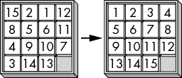
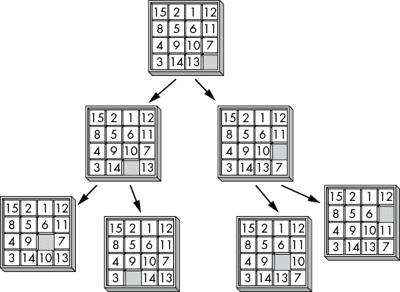
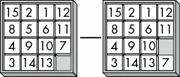
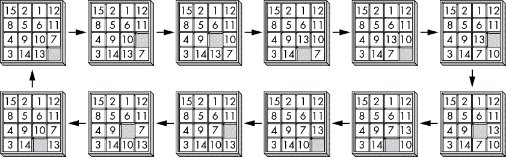
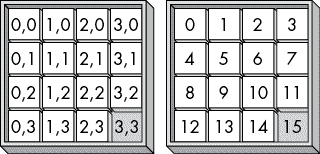
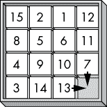

# 十二、滑动瓷砖求解器

> 原文：[Chapter 12 - Sliding-Tile Solver](https://inventwithpython.com/recursion/chapter12.html)
> 
> 译者：[飞龙](https://github.com/wizardforcel)
> 
> 协议：[CC BY-NC-SA 4.0](https://creativecommons.org/licenses/by-nc-sa/4.0/)


*滑动瓷砖拼图*，或*15 拼图*，是一个小拼图游戏，由一个 4×4 棋盘上的 15 个编号滑动瓷砖组成。一个瓷砖是缺失的，允许相邻的瓷砖滑入棋盘上的空白空间。玩家的目标是将瓷砖移动到数字顺序，就像图 12-1 中一样。这个游戏的一些版本在瓷砖上有一个图片的碎片，当拼图完成时可以组成一个完整的图像。



图 12-1：从数字滑动瓷砖拼图的混乱状态（左）到解决的有序状态（右）的解决方案

顺便说一句，数学家已经证明，即使最难的 15 拼图也可以在 80 步内解决。

## 递归解决 15 拼图

解决 15 拼图的算法类似于解决迷宫的算法。棋盘的每个状态（即，瓷砖的一种排列）都可以被看作是一个迷宫交叉口，有四条走廊可以通向。在 15 拼图的情况下，将瓷砖沿着四个方向滑动就像选择一个走廊，通向下一个交叉口。

就像你可以将迷宫转化为 DAG 一样，你也可以将 15 拼图转化为树图，就像图 12-2 一样。棋盘状态是节点，最多有四条边（代表滑动瓷砖的方向）通向其他节点（代表结果状态）。根节点是 15 拼图的起始状态。解决状态节点是瓷砖正确排列的状态。从根节点到解决状态的路径详细说明了解决拼图所需的滑动。



图 12-2：解决 15 拼图的任务可以表示为一个图，其中瓷砖状态为节点，滑动为边。

有一些聪明的算法可以解决 15 拼图，但我们也可以递归地探索整个树图，直到找到从根节点到解决节点的路径。这个拼图的树可以用深度优先搜索（DFS）算法进行搜索。然而，与连接良好的迷宫不同，15 拼图的树图不是 DAG。相反，图的节点是*无向*的，因为你可以通过撤消之前做的滑动来遍历边的两个方向。

图 12-3 显示了两个节点之间的无向边的示例。因为可以在这两个节点之间来回移动，我们的 15 拼图算法在找到解决方案之前可能会遇到堆栈溢出。



图 12-3：15 拼图的节点之间有无向边（没有箭头头）因为滑动可以通过执行相反的滑动来撤消。

为了优化我们的算法，我们将避免撤销上一次滑动的滑动。然而，仅凭这种优化无法使算法免受堆栈溢出的影响。虽然它使树图中的*边缘*变得有向，但它并不会将拼图求解算法转变为 DAG，因为它具有从较低节点到较高节点的循环或循环。如果您以循环模式滑动瓷砖，就会发生这些循环，如图 12-4 所示。



图 12-4：15 拼图图中循环的一个例子

图中的循环意味着底部的后续节点可能会回到顶部的节点。我们的求解算法可能会在这个循环中“卡住”，永远不会探索具有实际解决方案的分支。在实践中，这个无限循环会导致堆栈溢出。

我们仍然可以使用递归来解决 15 拼图。我们只需要为最大移动次数添加自己的基本情况，以避免导致堆栈溢出。然后，当达到最大滑动次数时，算法将开始回溯到较早的节点。如果 15 拼图求解器项目无法在 10 次滑动的所有可能组合中找到解决方案，它将尝试使用最多 11 次滑动。如果拼图在 11 次移动中无法解决，项目将尝试 12 次移动，依此类推。这可以防止算法陷入探索无限循环移动而不是探索较少移动可能解决方案的困境。

## 完整的滑动瓷砖求解程序

让我们首先看一下滑动瓷砖拼图求解程序的完整源代码。本章的其余部分将逐个解释代码的每个部分。

将代码的 Python 版本复制到名为`slidingTileSolver.py`的文件中：

**Python**

```py
import random, time

DIFFICULTY = 40 # How many random slides a puzzle starts with.
SIZE = 4 # The board is SIZE x SIZE spaces.
random.seed(1) # Select which puzzle to solve.

BLANK = 0
UP = 'up'
DOWN = 'down'
LEFT = 'left'
RIGHT = 'right'

def displayBoard(board):
    """Display the tiles stored in `board` on the screen."""
    for y in range(SIZE): # Iterate over each row.
        for x in range(SIZE): # Iterate over each column.
            if board[y * SIZE + x] == BLANK:
                print('__ ', end='') # Display blank tile.
            else:
                print(str(board[y * SIZE + x]).rjust(2) + ' ', end='')
        print() # Print a newline at the end of the row.

def getNewBoard():
    """Return a list that represents a new tile puzzle."""
    board = []
    for i in range(1, SIZE * SIZE):
        board.append(i)
    board.append(BLANK)
    return board

def findBlankSpace(board):
    """Return an [x, y] list of the blank space's location."""
    for x in range(SIZE):
 for y in range(SIZE):
            if board[y * SIZE + x] == BLANK:
                return [x, y]

def makeMove(board, move):
    """Modify `board` in place to carry out the slide in `move`."""
    bx, by = findBlankSpace(board)
    blankIndex = by * SIZE + bx

    if move == UP:
        tileIndex = (by + 1) * SIZE + bx
    elif move == LEFT:
        tileIndex = by * SIZE + (bx + 1)
    elif move == DOWN:
        tileIndex = (by - 1) * SIZE + bx
    elif move == RIGHT:
        tileIndex = by * SIZE + (bx - 1)

    # Swap the tiles at blankIndex and tileIndex:
    board[blankIndex], board[tileIndex] = board[tileIndex], board[blankIndex]

def undoMove(board, move):
    """Do the opposite move of `move` to undo it on `board`."""
    if move == UP:
        makeMove(board, DOWN)
    elif move == DOWN:
        makeMove(board, UP)
    elif move == LEFT:
        makeMove(board, RIGHT)
    elif move == RIGHT:
        makeMove(board, LEFT)

def getValidMoves(board, prevMove=None):
    """Returns a list of the valid moves to make on this board. If
    prevMove is provided, do not include the move that would undo it."""

    blankx, blanky = findBlankSpace(board)

    validMoves = []
    if blanky != SIZE - 1 and prevMove != DOWN:
        # Blank space is not on the bottom row.
        validMoves.append(UP)

    if blankx != SIZE - 1 and prevMove != RIGHT:
        # Blank space is not on the right column.
        validMoves.append(LEFT)

    if blanky != 0 and prevMove != UP:
        # Blank space is not on the top row.
        validMoves.append(DOWN)

 if blankx != 0 and prevMove != LEFT:
        # Blank space is not on the left column.
        validMoves.append(RIGHT)

    return validMoves

def getNewPuzzle():
    """Get a new puzzle by making random slides from the solved state."""
    board = getNewBoard()
    for i in range(DIFFICULTY):
        validMoves = getValidMoves(board)
        makeMove(board, random.choice(validMoves))
    return board

def solve(board, maxMoves):
    """Attempt to solve the puzzle in `board` in at most `maxMoves`
    moves. Returns True if solved, otherwise False."""
    print('Attempting to solve in at most', maxMoves, 'moves...')
    solutionMoves = [] # A list of UP, DOWN, LEFT, RIGHT values.
    solved = attemptMove(board, solutionMoves, maxMoves, None)

    if solved:
        displayBoard(board)
        for move in solutionMoves:
            print('Move', move)
            makeMove(board, move)
            print() # Print a newline.
            displayBoard(board)
            print() # Print a newline.

        print('Solved in', len(solutionMoves), 'moves:')
        print(', '.join(solutionMoves))
        return True # Puzzle was solved.
    else:
        return False # Unable to solve in maxMoves moves.

def attemptMove(board, movesMade, movesRemaining, prevMove):
    """A recursive function that attempts all possible moves on `board`
    until it finds a solution or reaches the `maxMoves` limit.
    Returns True if a solution was found, in which case `movesMade`
    contains the series of moves to solve the puzzle. Returns False
    if `movesRemaining` is less than 0."""

    if movesRemaining < 0:
        # BASE CASE - Ran out of moves.
        return False

    if board == SOLVED_BOARD:
        # BASE CASE - Solved the puzzle.
        return True

    # RECURSIVE CASE - Attempt each of the valid moves:
 for move in getValidMoves(board, prevMove):
        # Make the move:
        makeMove(board, move)
        movesMade.append(move)

        if attemptMove(board, movesMade, movesRemaining - 1, move):
            # If the puzzle is solved, return True:
            undoMove(board, move) # Reset to the original puzzle.
            return True

        # Undo the move to set up for the next move:
        undoMove(board, move)
        movesMade.pop() # Remove the last move since it was undone.
    return False # BASE CASE - Unable to find a solution.

# Start the program:
SOLVED_BOARD = getNewBoard()
puzzleBoard = getNewPuzzle()
displayBoard(puzzleBoard)
startTime = time.time()

maxMoves = 10
while True:
    if solve(puzzleBoard, maxMoves):
        break # Break out of the loop when a solution is found.
    maxMoves += 1
print('Run in', round(time.time() - startTime, 3), 'seconds.')
```

将代码的 JavaScript 版本复制到名为`slidingTileSolver.html`的文件中：

```js
<script type="text/javascript">
const DIFFICULTY = 40; // How many random slides a puzzle starts with.
const SIZE = 4; // The board is SIZE x SIZE spaces.

const BLANK = 0;
const UP = "up";
const DOWN = "down";
const LEFT = "left";
const RIGHT = "right";

function displayBoard(board) {
    // Display the tiles stored in `board` on the screen.
    document.write("<pre>");
    for (let y = 0; y < SIZE; y++) { // Iterate over each row.
        for (let x = 0; x < SIZE; x++) { // Iterate over each column.
            if (board[y * SIZE + x] == BLANK) {
                document.write('__ '); // Display blank tile.
            } else {
                document.write(board[y * SIZE + x].toString().padStart(2) + " ");
            }
        }
 document.write("<br />"); // Print a newline at the end of the row.
    }
    document.write("</pre>");
}

function getNewBoard() {
    // Return a list that represents a new tile puzzle.
    let board = [];
    for (let i = 1; i < SIZE * SIZE; i++) {
        board.push(i);
    }
    board.push(BLANK);
    return board;
}

function findBlankSpace(board) {
    // Return an [x, y] array of the blank space's location.
    for (let x = 0; x < SIZE; x++) {
        for (let y = 0; y < SIZE; y++) {
            if (board[y * SIZE + x] === BLANK) {
                return [x, y];
            }
        }
    }
}

function makeMove(board, move) {
    // Modify `board` in place to carry out the slide in `move`.
    let bx, by;
    [bx, by] = findBlankSpace(board);
    let blankIndex = by * SIZE + bx;

    let tileIndex;
    if (move === UP) {
        tileIndex = (by + 1) * SIZE + bx;
    } else if (move === LEFT) {
        tileIndex = by * SIZE + (bx + 1);
    } else if (move === DOWN) {
        tileIndex = (by - 1) * SIZE + bx;
    } else if (move === RIGHT) {
        tileIndex = by * SIZE + (bx - 1);
    }

    // Swap the tiles at blankIndex and tileIndex:
    [board[blankIndex], board[tileIndex]] = [board[tileIndex], board[blankIndex]];
}

function undoMove(board, move) {
    // Do the opposite move of `move` to undo it on `board`.
 if (move === UP) {
        makeMove(board, DOWN);
    } else if (move === DOWN) {
        makeMove(board, UP);
    } else if (move === LEFT) {
        makeMove(board, RIGHT);
    } else if (move === RIGHT) {
        makeMove(board, LEFT);
    }
}

function getValidMoves(board, prevMove) {
    // Returns a list of the valid moves to make on this board. If
    // prevMove is provided, do not include the move that would undo it.

    let blankx, blanky;
    [blankx, blanky] = findBlankSpace(board);

    let validMoves = [];
    if (blanky != SIZE - 1 && prevMove != DOWN) {
        // Blank space is not on the bottom row.
        validMoves.push(UP);
    }
    if (blankx != SIZE - 1 && prevMove != RIGHT) {
        // Blank space is not on the right column.
        validMoves.push(LEFT);
    }
    if (blanky != 0 && prevMove != UP) {
        // Blank space is not on the top row.
        validMoves.push(DOWN);
    }
    if (blankx != 0 && prevMove != LEFT) {
        // Blank space is not on the left column.
        validMoves.push(RIGHT);
    }
    return validMoves;
}

function getNewPuzzle() {
    // Get a new puzzle by making random slides from the solved state.
    let board = getNewBoard();
    for (let i = 0; i < DIFFICULTY; i++) {
        let validMoves = getValidMoves(board);
        makeMove(board, validMoves[Math.floor(Math.random() * validMoves.length)]);
    }
    return board;
}

function solve(board, maxMoves) {
    // Attempt to solve the puzzle in `board` in at most `maxMoves`
    // moves. Returns true if solved, otherwise false.
    document.write("Attempting to solve in at most " + maxMoves + " moves...<br />");
    let solutionMoves = []; // A list of UP, DOWN, LEFT, RIGHT values.
 let solved = attemptMove(board, solutionMoves, maxMoves, null);

    if (solved) {
        displayBoard(board);
        for (let move of solutionMoves) {
            document.write("Move " + move + "<br />");
            makeMove(board, move);
            document.write("<br />"); // Print a newline.
            displayBoard(board);
            document.write("<br />"); // Print a newline.
        }
        document.write("Solved in " + solutionMoves.length + " moves:<br />");
        document.write(solutionMoves.join(", ") + "<br />");
        return true; // Puzzle was solved.
    } else {
        return false; // Unable to solve in maxMoves moves.
    }
}

function attemptMove(board, movesMade, movesRemaining, prevMove) {
    // A recursive function that attempts all possible moves on `board`
    // until it finds a solution or reaches the `maxMoves` limit.
    // Returns true if a solution was found, in which case `movesMade`
    // contains the series of moves to solve the puzzle. Returns false
    // if `movesRemaining` is less than 0.

    if (movesRemaining < 0) {
        // BASE CASE - Ran out of moves.
        return false;
    }

    if (JSON.stringify(board) == SOLVED_BOARD) {
        // BASE CASE - Solved the puzzle.
        return true;
    }

    // RECURSIVE CASE - Attempt each of the valid moves:
    for (let move of getValidMoves(board, prevMove)) {
        // Make the move:
        makeMove(board, move);
        movesMade.push(move);

        if (attemptMove(board, movesMade, movesRemaining - 1, move)) {
            // If the puzzle is solved, return true:
            undoMove(board, move); // Reset to the original puzzle.
            return true;
        }

        // Undo the move to set up for the next move:
        undoMove(board, move);
        movesMade.pop(); // Remove the last move since it was undone.
    }
    return false; // BASE CASE - Unable to find a solution.
}
 // Start the program:
const SOLVED_BOARD = JSON.stringify(getNewBoard());
let puzzleBoard = getNewPuzzle();
displayBoard(puzzleBoard);
let startTime = Date.now();

let maxMoves = 10;
while (true) {
    if (solve(puzzleBoard, maxMoves)) {
        break; // Break out of the loop when a solution is found.
    }
    maxMoves += 1;
}
document.write("Run in " + Math.round((Date.now() - startTime) / 100) / 10 + " seconds.<br />");
</script>
```

程序的输出如下所示：

```py
 7  1  3  4
 2  5 10  8
__  6  9 11
13 14 15 12
Attempting to solve in at most 10 moves...
Attempting to solve in at most 11 moves...
Attempting to solve in at most 12 moves...
# --snip--
 1  2  3  4
 5  6  7  8
 9 10 11 __
13 14 15 12

Move up

 1  2  3  4
 5  6  7  8
 9 10 11 12
13 14 15 __

Solved in 18 moves:
left, down, right, down, left, up, right, up, left, left, down, 
right, right, up, left, left, left, up
Run in 39.519 seconds.
```

请注意，当 JavaScript 在浏览器中运行时，代码必须在显示任何输出之前完成。在那之前，它可能会看起来已经冻结，您的浏览器可能会询问您是否想要提前停止它。您可以忽略这个警告，让程序继续工作，直到解决了拼图。

程序的递归`attemptMove()`函数通过尝试每种可能的滑动组合来解决滑动瓷砖拼图。该函数给出一个要尝试的移动。如果这解决了拼图，函数将返回一个布尔值`True`。否则，它将调用`attemptMove()`以及它可以进行的所有其他可能移动，并在超过最大移动次数之前找不到解决方案时返回一个布尔值`False`。我们稍后将更详细地探讨这个函数。

我们用来表示滑动瓷砖板的数据结构是一个整数列表（在 Python 中）或数组（在 JavaScript 中），其中`0`表示空白空间。在我们的程序中，这个数据结构通常存储在一个名为`board`的变量中。`board[y * SIZE + x]`处的值与板上坐标 x，y 处的瓷砖匹配，如图 12-5 所示。例如，如果`SIZE`常量为`4`，则在坐标 3, 1 处的值可以在`board[1 * 4 + 3]`找到。

这个小计算使我们能够使用一维数组或列表来存储二维瓷砖板的值。这种编程技术不仅在我们的项目中有用，而且对于任何必须存储在数组或列表中的二维数据结构都很有用，比如以字节流存储的二维图像。



图 12-5：板上每个空间的 x、y 坐标（左）和相应的数据结构索引（右）

让我们来看一些示例数据结构。之前在图 12-1 的左侧显示的混乱瓷砖的板将被表示为以下内容：

1.  `[15, 2, 1, 12, 8, 5, 6, 11, 4, 9, 10, 7, 3, 14, 13, 0]`

在图 12-1 的右侧，解决的有序拼图将被表示为：

1.  `[1, 2, 3, 4, 5, 6, 7, 8, 9, 10, 11, 12, 13, 14, 15, 0]`

我们程序中的所有函数都将期望遵循这种格式的板数据结构。

不幸的是，4×4 版本的滑动瓷砖拼图有太多可能的移动，普通笔记本电脑需要数周才能解决。您可以将`SIZE`常量从`4`更改为`3`，以解决一个更简单的 3×3 版本的拼图。完成的、有序的 3×3 拼图的数据结构将如下所示：

1.  `[1, 2, 3, 4, 5, 6, 7, 8, 0]`。

## 设置程序的常量

在源代码的开头，程序使用一些常量使代码更易读。Python 代码如下：

**Python**

```py
import random, time

DIFFICULTY = 40 # How many random slides a puzzle starts with.
SIZE = 4 # The board is SIZE x SIZE spaces.
random.seed(1) # Select which puzzle to solve.

BLANK = 0
UP = 'up'
DOWN = 'down'
LEFT = 'left'
RIGHT = 'right'
```

JavaScript 代码如下：

**JavaScript**

```js
<script type="text/javascript">
const DIFFICULTY = 40; // How many random slides a puzzle starts with.
const SIZE = 4; // The board is SIZE x SIZE spaces.

const BLANK = 0;
const UP = "up";
const DOWN = "down";
const LEFT = "left";
const RIGHT = "right";
```

为了获得可重现的随机数，Python 程序将随机数种子设置为`1`。相同的种子值将始终产生相同的随机拼图，这对于调试很有用。您可以将种子值更改为任何其他整数以创建不同的拼图。JavaScript 没有办法设置其随机种子值，`slidingtilesolver.html`也没有类似的功能。

`SIZE`常量设置了方形板的大小。您可以将此大小更改为任何值，但 4×4 板是标准的，而 3×3 板对于测试很有用，因为程序很快就能解决它们。`BLANK`常量在拼图数据结构中用于表示空白空间，必须保持为`0`。`UP`、`DOWN`、`LEFT`和`RIGHT`常量用于使代码可读，类似于第十一章中迷宫生成器项目中的`NORTH`、`SOUTH`、`WEST`和`EAST`常量。

## 将滑动瓷砖拼图表示为数据

滑动瓷砖板的数据结构只是一个整数列表或数组。它代表实际拼图板的方式是程序中的函数如何使用它。该程序中的`displayBoard()`、`getNewBoard()`、`findBlankSpace()`和其他函数都处理这个数据结构。

### 显示板

第一个函数`displayBoard()`在屏幕上打印板数据结构。`displayBoard()`函数的 Python 代码如下：

**Python**

```py
def displayBoard(board):
    """Display the tiles stored in `board` on the screen."""
    for y in range(SIZE): # Iterate over each row.
        for x in range(SIZE): # Iterate over each column.
            if board[y * SIZE + x] == BLANK:
                print('__ ', end='') # Display blank tile.
            else:
                print(str(board[y * SIZE + x]).rjust(2) + ' ', end='')
        print() # Print a newline at the end of the row.
```

`displayBoard()`函数的 JavaScript 代码如下：

```py
function displayBoard(board) {
    // Display the tiles stored in `board` on the screen.
    document.write("<pre>");
    for (let y = 0; y < SIZE; y++) { // Iterate over each row.
        for (let x = 0; x < SIZE; x++) { // Iterate over each column.
            if (board[y * SIZE + x] == BLANK) {
                document.write('__ '); // Display blank tile.
            } else {
                document.write(board[y * SIZE + x].toString().padStart(2) + " ");
            }
        }
        document.write("<br />");
    }
    document.write("</pre>");
}
```

嵌套的一对`for`循环遍历板上的每一行和每一列。第一个`for`循环遍历 y 坐标，第二个`for`循环遍历 x 坐标。这是因为程序需要在打印换行字符之前打印单行的所有列，以继续下一行。

`if`语句检查当前 x、y 坐标处的瓷砖是否为空白瓷砖。如果是，程序打印两个下划线并带有一个尾随空格。否则，`else`块中的代码打印带有尾随空格的瓷砖编号。尾随空格是屏幕上分隔瓷砖编号的内容。如果瓷砖编号是一个数字，`rjust()`或`padStart()`方法将插入一个额外的空格，以便瓷砖编号与屏幕上的两位数对齐。

例如，假设左侧的混乱拼图在图 12-1 中由这个数据结构表示：

`[15, 2, 1, 12, 8, 5, 6, 11, 4, 9, 10, 7, 3, 14, 13, 0]`

当数据结构传递给`displayBoard()`时，它会打印以下文本：

```py
15  2  1 12 
 8  5  6 11 
 4  9 10  7 
 3 14 13 __
```

### 创建一个新的板数据结构

接下来，`getNewBoard()`函数返回一个新的板数据结构，其中瓷砖放在它们有序的、解决的位置上。`getNewBoard()`函数的 Python 代码如下：

Python

```py
def getNewBoard():
    """Return a list that represents a new tile puzzle."""
    board = []
    for i in range(1, SIZE * SIZE):
        board.append(i)
    board.append(BLANK)
    return board
```

`getNewBoard()`函数的 JavaScript 代码如下：

JavaScript

```py
function getNewBoard() {
    // Return a list that represents a new tile puzzle.
    let board = [];
    for (let i = 1; i < SIZE * SIZE; i++) {
        board.push(i);
    }
    board.push(BLANK);
    return board;
}
```

`getNewBoard()`函数返回适合于`SIZE`常量（3×3 或 4×4）中的整数的板数据结构。`for`循环生成这个列表或数组，其中包含从`1`到`SIZE`的平方，最后一个是`0`（存储在`BLANK`常量中的值），表示右下角的空白空间。

### 找到空白空间的坐标

我们的程序使用`findBlankSpace()`函数来找到板上空白空间的 x、y 坐标。Python 代码如下：

Python

```py
def findBlankSpace(board):
    """Return an [x, y] list of the blank space's location."""
    for x in range(SIZE):
        for y in range(SIZE):
            if board[y * SIZE + x] == BLANK:
                return [x, y]
```

JavaScript 代码如下：

JavaScript

```py
function findBlankSpace(board) {
    // Return an [x, y] array of the blank space's location.
    for (let x = 0; x < SIZE; x++) {
        for (let y = 0; y < SIZE; y++) {
            if (board[y * SIZE + x] === BLANK) {
                return [x, y];
            }
        }
    }
}
```

像`displayBoard()`函数一样，`findBlankSpace()`函数有一对嵌套的`for`循环。这些`for`循环将循环遍历板数据结构中的每个位置。当`board[y * SIZE + x]`代码找到空白空间时，它会以 Python 列表或 JavaScript 数组中的两个整数的形式返回 x 和 y 坐标。

### 进行移动

接下来，`makeMove()`函数接受两个参数：一个板数据结构和一个`UP`、`DOWN`、`LEFT`或`RIGHT`方向，用于在该板上滑动一个瓷砖。这段代码相当重复，所以使用`bx`和`by`这样的简短变量名来表示空白空间的 x 和 y 坐标。

为了进行移动，板数据结构交换了移动瓷砖的值与空白瓷砖的`0`的值。`makeMove()`函数的 Python 代码如下：

Python

```py
def makeMove(board, move):
    """Modify `board` in place to carry out the slide in `move`."""
    bx, by = findBlankSpace(board)
    blankIndex = by * SIZE + bx

    if move == UP:
        tileIndex = (by + 1) * SIZE + bx
    elif move == LEFT:
        tileIndex = by * SIZE + (bx + 1)
    elif move == DOWN:
        tileIndex = (by - 1) * SIZE + bx
    elif move == RIGHT:
        tileIndex = by * SIZE + (bx - 1)

    # Swap the tiles at blankIndex and tileIndex:
    board[blankIndex], board[tileIndex] = board[tileIndex], board[blankIndex]
```

`makeMove()`函数的 JavaScript 代码如下：

```py
function makeMove(board, move) {
    // Modify `board` in place to carry out the slide in `move`.
    let bx, by;
    [bx, by] = findBlankSpace(board);
    let blankIndex = by * SIZE + bx;

 let tileIndex;
    if (move === UP) {
        tileIndex = (by + 1) * SIZE + bx;
    } else if (move === LEFT) {
        tileIndex = by * SIZE + (bx + 1);
    } else if (move === DOWN) {
        tileIndex = (by - 1) * SIZE + bx;
    } else if (move === RIGHT) {
        tileIndex = by * SIZE + (bx - 1);
    }

    // Swap the tiles at blankIndex and tileIndex:
    [board[blankIndex], board[tileIndex]] = [board[tileIndex], board[blankIndex]];
}
```

`if`语句根据`move`参数确定要移动的瓷砖的索引。然后，函数通过交换`board[blankindex]`处的`BLANK`值和`board[tileIndex]`处的编号瓷砖来“滑动”瓷砖。`makeMove()`函数不返回任何内容。相反，它直接修改了`board`数据结构。

Python 有`a, b = b, a`的语法来交换两个变量的值。对于 JavaScript，我们需要将它们包装在一个数组中，比如`[a, b] = [b, a]`来执行交换。我们在函数的最后使用这种语法来交换`board[blankIndex]`和`board[tileIndex]`中的值。

### 撤消移动

接下来，在递归算法的回溯部分，我们的程序需要撤消移动。这就像在与初始移动相反的方向上进行移动一样简单。`undoMove()`函数的 Python 代码如下：

Python

```py
def undoMove(board, move):
    """Do the opposite move of `move` to undo it on `board`."""
    if move == UP:
        makeMove(board, DOWN)
    elif move == DOWN:
        makeMove(board, UP)
    elif move == LEFT:
        makeMove(board, RIGHT)
    elif move == RIGHT:
        makeMove(board, LEFT)
```

`undoMove()`函数的 JavaScript 代码如下：

JavaScript

```py
function undoMove(board, move) {
    // Do the opposite move of `move` to undo it on `board`.
    if (move === UP) {
        makeMove(board, DOWN);
    } else if (move === DOWN) {
        makeMove(board, UP);
    } else if (move === LEFT) {
        makeMove(board, RIGHT);
 } else if (move === RIGHT) {
        makeMove(board, LEFT);
    }
}
```

我们已经将交换逻辑编程到`makeMove()`函数中，所以`undoMove()`可以调用该函数来执行与`move`参数相反的方向。这样，通过`makeMove(someBoard, someMove)`函数调用在一个假设的`someBoard`数据结构上进行的假设的`someMove`移动可以通过调用`undoMove(someBoard, someMove)`来撤消。

## 设置一个新的谜题

要创建一个新的打乱的拼图，我们不能简单地将方块放在随机位置，因为一些方块的配置会产生无效的、无法解决的拼图。相反，我们需要从一个已解决的拼图开始，然后进行许多随机移动。解决这个拼图就变成了弄清楚哪些滑动可以撤消这些随机滑动，以恢复到原始的有序配置。

但并不总是可以在四个方向中的每个方向上进行移动。例如，如果空白区域在右下角，就像图 12-6 中一样，方块只能向下或向右滑动，因为没有方块可以向左或向上滑动。此外，如果在图 12-6 中向上滑动 7 号方块是上一个移动，那么向下滑动就会被移除作为有效的移动，因为它会撤消上一个移动。



图 12-6：如果空白区域在右下角，向下和向右是唯一有效的滑动方向。

为了帮助我们，我们需要一个`getValidMoves()`函数，它可以告诉我们在给定的板块数据结构上哪些滑动方向是可能的：

Python

```py
def getValidMoves(board, prevMove=None):
    """Returns a list of the valid moves to make on this board. If
    prevMove is provided, do not include the move that would undo it."""

    blankx, blanky = findBlankSpace(board)

    validMoves = []
 if blanky != SIZE - 1 and prevMove != DOWN:
        # Blank space is not on the bottom row.
        validMoves.append(UP)

    if blankx != SIZE - 1 and prevMove != RIGHT:
        # Blank space is not on the right column.
        validMoves.append(LEFT)

    if blanky != 0 and prevMove != UP:
        # Blank space is not on the top row.
        validMoves.append(DOWN)

    if blankx != 0 and prevMove != LEFT:
        # Blank space is not on the left column.
        validMoves.append(RIGHT)

    return validMoves
```

这个函数的 JavaScript 代码如下：

JavaScript

```py
function getValidMoves(board, prevMove) {
    // Returns a list of the valid moves to make on this board. If
    // prevMove is provided, do not include the move that would undo it.

    let blankx, blanky;
    [blankx, blanky] = findBlankSpace(board);

    let validMoves = [];
    if (blanky != SIZE - 1 && prevMove != DOWN) {
        // Blank space is not on the bottom row.
        validMoves.push(UP);
    }
    if (blankx != SIZE - 1 && prevMove != RIGHT) {
        // Blank space is not on the right column.
        validMoves.push(LEFT);
    }
    if (blanky != 0 && prevMove != UP) {
        // Blank space is not on the top row.
        validMoves.push(DOWN);
    }
    if (blankx != 0 && prevMove != LEFT) {
        // Blank space is not on the left column.
        validMoves.push(RIGHT);
    }
    return validMoves;
}
```

`getValidMoves()`函数的第一件事是调用`findBlankSpace()`并将空白区域的 x、y 坐标存储在变量`blankx`和`blanky`中。接下来，函数使用一个空的 Python 列表或空的 JavaScript 数组设置了`validMoves`变量，用于保存滑动的所有有效方向。

回顾图 12-5，y 坐标为`0`表示板块的顶边缘。如果`blanky`，空白区域的 y 坐标，不是`0`，那么我们知道空白区域不在顶边缘。如果前一个移动也不是`DOWN`，那么*up*就是一个有效的移动，代码会将`UP`添加到`validMoves`中。

同样，左边缘的 x 坐标为`0`，底边缘的 y 坐标为`SIZE - 1`，右边缘的 x 坐标为`SIZE - 1`。使用表达式`SIZE - 1`可以确保这段代码无论板块是 3×3、4×4 还是其他任何尺寸都能正常工作。`getValidMoves()`函数对所有四个方向进行这些检查，然后返回`validMoves`。

接下来，`getNewPuzzle()`函数返回程序要解决的打乱板块的数据结构。不能简单地将方块随机放在板块上，因为一些方块的配置会产生无法解决的拼图。为了避免这种情况，`getNewPuzzle()`函数从有序的解决板块开始，然后对其应用大量的随机滑动。解决这个拼图实际上就是找出撤消这些滑动的移动。`getNewPuzzle()`函数的 Python 代码如下：

Python

```py
def getNewPuzzle():
    """Get a new puzzle by making random slides from the solved state."""
    board = getNewBoard()
    for i in range(DIFFICULTY):
        validMoves = getValidMoves(board)
        makeMove(board, random.choice(validMoves))
    return board
```

JavaScript 代码如下：

```py
function getNewPuzzle() {
    // Get a new puzzle by making random slides from the solved state.
    let board = getNewBoard();
    for (let i = 0; i < DIFFICULTY; i++) {
        let validMoves = getValidMoves(board);
        makeMove(board, validMoves[Math.floor(Math.random() * validMoves.length)]);
    }
    return board;
}
```

调用`getNewBoard()`获取了一个有序、解决状态的板块数据结构。`for`循环调用`getValidMoves()`来获取给定板块当前状态下的有效移动列表，然后从列表中随机选择一个移动调用`makeMove()`。无论`validMoves`列表或数组包含什么组合的`UP`、`DOWN`、`LEFT`和`RIGHT`值，Python 中的`random.choice()`函数和 JavaScript 中的`Math.floor()`和`Math.random()`函数都会处理从`validMoves`中进行随机选择。

`DIFFICULTY`常量确定`for`循环从`makeMove()`中应用多少随机滑动。`DIFFICULTY`中的整数越高，拼图就会变得更加混乱。尽管这会导致一些纯粹偶然地撤销先前的移动的移动，例如向左滑动然后立即向右滑动，但是通过足够的滑动，函数会产生一个彻底混乱的棋盘。为了测试目的，`DIFFICULTY`设置为`40`，允许程序在大约一分钟内产生一个解决方案。对于一个更真实的 15 拼图，你应该将`DIFFICULTY`改为`200`。

在创建和打乱`board`棋盘数据结构之后，`getNewPuzzle()`函数返回它。

## 递归解决滑动拼图

现在我们已经有了创建和操作拼图数据结构的函数，让我们创建通过递归滑动每个可能方向的拼图解决函数。

`attemptMove()`函数在一个棋盘数据结构上执行单个滑动，然后递归调用自身，对棋盘可以进行的每个有效移动调用一次。存在多个基本情况。如果棋盘数据结构处于已解状态，则函数返回布尔值`True`；如果达到了最大移动次数，则返回布尔值`False`。此外，如果递归调用返回了`True`，那么`attemptMove()`应该返回`True`，如果所有有效移动的递归调用都返回了`False`，那么`attemptMove()`应该返回`False`。

### solve()函数

`solve()`函数接受一个棋盘数据结构和算法在回溯之前应尝试的最大移动次数。然后它执行对`attemptMove()`的第一次调用。如果这第一次对`attemptMove()`的调用返回`True`，那么`solve()`中的代码会显示解决拼图的一系列步骤。如果返回`False`，那么`solve()`中的代码会告诉用户在这个最大移动次数下找不到解决方案。

Python 中的`solve()`代码开始如下：

**Python**

```py
def solve(board, maxMoves):
    """Attempt to solve the puzzle in `board` in at most `maxMoves`
    moves. Returns True if solved, otherwise False."""
    print('Attempting to solve in at most', maxMoves, 'moves...')
    solutionMoves = [] # A list of UP, DOWN, LEFT, RIGHT values.
    solved = attemptMove(board, solutionMoves, maxMoves, None)
```

JavaScript 中的`solve()`代码开始如下：

```py
function solve(board, maxMoves) {
    // Attempt to solve the puzzle in `board` in at most `maxMoves`
    // moves. Returns true if solved, otherwise false.
    document.write("Attempting to solve in at most " + maxMoves + " moves...<br />");
    let solutionMoves = []; // A list of UP, DOWN, LEFT, RIGHT values.
    let solved = attemptMove(board, solutionMoves, maxMoves, null);
```

`solve()`函数有两个参数：`board`包含要解决的拼图的数据结构，`maxMoves`是函数应该尝试的最大移动次数。`solutionMoves`列表或数组包含产生解决状态的`UP`、`DOWN`、`LEFT`和`RIGHT`值的序列。`attemptMove()`函数在进行递归调用时会修改这个列表或数组。如果初始的`attemptMove()`函数找到解决方案并返回`True`，`solutionMoves`包含解决方案的移动序列。

然后`solve()`函数对`attemptMove()`进行初始调用，并将其返回的`True`或`False`存储在`solved`变量中。`solve()`函数的其余部分处理这两种情况：

**Python**

```py
 if solved:
        displayBoard(board)
        for move in solutionMoves:
            print('Move', move)
            makeMove(board, move)
            print() # Print a newline.
            displayBoard(board)
            print() # Print a newline.

        print('Solved in', len(solutionMoves), 'moves:')
        print(', '.join(solutionMoves))
        return True # Puzzle was solved.
    else:
        return False # Unable to solve in maxMoves moves.
```

JavaScript 代码如下：

**JavaScript**

```py
 if (solved) {
        displayBoard(board);
        for (let move of solutionMoves) {
            document.write("Move " + move + "<br />");
            makeMove(board, move);
            document.write("<br />"); // Print a newline.
            displayBoard(board);
            document.write("<br />"); // Print a newline.
        }
        document.write("Solved in " + solutionMoves.length + " moves:<br />");
        document.write(solutionMoves.join(", ") + "<br />");
        return true; // Puzzle was solved.
    } else {
        return false; // Unable to solve in maxMoves moves.
    }
}
```

如果`attemptMove()`找到解决方案，程序会运行`solutionMoves`列表或数组中收集的所有移动，并在每次滑动后显示棋盘。这向用户证明了`attemptMove()`收集的移动是拼图的真正解决方案。最后，`solve()`函数本身返回`True`。如果`attemptMove()`无法找到解决方案，`solve()`函数会简单地返回`False`。

### attemptMove()函数

让我们来看看`attemptMove()`，这是我们解决拼图的核心递归函数。记住滑动拼图产生的树图；调用`attemptMove()`来表示某个方向就像是沿着图的边缘前进到下一个节点。递归的`attemptMove()`调用会在树中进一步前进。当这个递归的`attemptMove()`调用返回时，它会回溯到先前的节点。当`attemptMove()`回溯到根节点时，程序执行已经返回到`solve()`函数。

Python 代码`attemptMove()`的开始如下：

Python

```py
def attemptMove(board, movesMade, movesRemaining, prevMove):
    """A recursive function that attempts all possible moves on `board`
    until it finds a solution or reaches the `maxMoves` limit.
    Returns True if a solution was found, in which case `movesMade`
    contains the series of moves to solve the puzzle. Returns False
    if `movesRemaining` is less than 0."""

    if movesRemaining < 0:
        # BASE CASE - Ran out of moves.
        return False

    if board == SOLVED_BOARD:
        # BASE CASE - Solved the puzzle.
        return True
```

`attemptMove()`的 JavaScript 代码如下：

JavaScript

```py
function attemptMove(board, movesMade, movesRemaining, prevMove) {
    // A recursive function that attempts all possible moves on `board`
    // until it finds a solution or reaches the `maxMoves` limit.
    // Returns true if a solution was found, in which case `movesMade`
    // contains the series of moves to solve the puzzle. Returns false
    // if `movesRemaining` is less than 0.

    if (movesRemaining < 0) {
        // BASE CASE - Ran out of moves.
        return false;
    }

    if (JSON.stringify(board) == SOLVED_BOARD) {
        // BASE CASE - Solved the puzzle.
        return true;
    }
```

`attemptMove()`函数有四个参数。`board`参数包含要解决的瓷砖拼图板数据结构。`movesMade`参数包含`attemptMove()`就地修改的列表或数组，添加了递归算法产生的`UP`、`DOWN`、`LEFT`和`RIGHT`值。如果`attemptMove()`解决了拼图，`movesMade`将包含导致解决方案的移动。这个列表或数组也是`solve()`函数中的`solutionMoves`变量所指的。

`solve()`函数使用其`maxMoves`变量作为对`attemptMove()`的初始调用中的`movesRemaining`参数。每个递归调用传递`maxMoves - 1`作为`maxMoves`的下一个值，导致在进行更多递归调用时减少。当它变小于`0`时，`attemptMove()`函数停止进行额外的递归调用并返回`False`。

最后，`prevMove`参数包含前一次调用`attemptMove()`所做的`UP`、`DOWN`、`LEFT`或`RIGHT`值，以便它不会撤消该移动。对于对`attemptMove()`的初始调用，`solve()`函数传递 Python 的`None`或 JavaScript 的`null`值作为此参数，因为没有先前的移动存在。

`attemptMove()`代码的开始检查两个基本情况，如果`movesRemaining`变得小于`0`，则返回`False`，如果`board`处于解决状态，则返回`True`。`SOLVED_BOARD`常量包含一个处于解决状态的板，我们可以将其与`board`中的数据结构进行比较。

`attemptMove()`的下一部分执行它在这个板上可以做的每个有效移动。Python 代码如下：

Python

```py
 # RECURSIVE CASE - Attempt each of the valid moves:
    for move in getValidMoves(board, prevMove):
        # Make the move:
        makeMove(board, move)
        movesMade.append(move)

        if attemptMove(board, movesMade, movesRemaining - 1, move):
            # If the puzzle is solved, return True:
            undoMove(board, move) # Reset to the original puzzle.
            return True
```

JavaScript 代码如下：

JavaScript

```py
 // RECURSIVE CASE - Attempt each of the valid moves:
    for (let move of getValidMoves(board, prevMove)) {
        // Make the move:
        makeMove(board, move);
        movesMade.push(move);

        if (attemptMove(board, movesMade, movesRemaining - 1, move)) {
            // If the puzzle is solved, return True:
            undoMove(board, move); // Reset to the original puzzle.
            return true;
        }
```

`for`循环将移动变量设置为`getValidMoves()`返回的每个方向。对于每次移动，我们调用`makeMove()`来修改板数据结构并将移动添加到`movesMade`中的列表或数组中。

接下来，代码递归调用`attemptMove()`来探索由`movesRemaining`设置的深度内所有可能的未来移动范围。将板和`movesMade`变量转发到这个递归调用。代码将递归调用的`movesRemaining`参数设置为`movesRemaining - 1`，使其减少一个。它还将`prevMode`参数设置为`move`，以便它不会立即撤消刚刚做出的移动。

如果递归调用返回`True`，则存在解决方案，并记录在`movesMade`列表或数组中。我们调用`undoMove()`函数，以便在执行返回到`solve()`后，`board`将包含原始拼图，然后返回`True`以指示已找到解决方案。

Python 代码`attemptMove()`的继续如下：

Python

```py
 # Undo the move to set up for the next move:
        undoMove(board, move)
        movesMade.pop() # Remove the last move since it was undone.
    return False # BASE CASE - Unable to find a solution.
```

JavaScript 代码如下：

JavaScript

```py
 // Undo the move to set up for the next move:
        undoMove(board, move);
        movesMade.pop(); // Remove the last move since it was undone.
    }
    return false; // BASE CASE - Unable to find a solution.
}
```

如果`attemptMove()`返回`False`，则找不到解决方案。在这种情况下，我们调用`undoMove()`并从`movesMade`列表或数组中删除最新的移动。

所有这些都是针对每个有效方向完成的。如果对这些方向的`attemptMove()`调用在达到最大移动次数之前找到解决方案，则`attemptMove()`函数返回`False`。

## 开始解算器

`solve()`函数对于启动对`attemptMove()`的初始调用很有用，但程序仍然需要进行一些设置。此 Python 代码如下：

Python

```py
# Start the program:
SOLVED_BOARD = getNewBoard()
puzzleBoard = getNewPuzzle()
displayBoard(puzzleBoard)
startTime = time.time()
```

此设置的 JavaScript 代码如下：

JavaScript

```py
// Start the program:
const SOLVED_BOARD = JSON.stringify(getNewBoard());
let puzzleBoard = getNewPuzzle();
displayBoard(puzzleBoard);
let startTime = Date.now();
```

首先，`SOLVED_BOARD`常量设置为由`getNewBoard()`返回的有序的解决板。这个常量不是在源代码的顶部设置的，因为需要在调用它之前定义`getNewBoard()`函数。

接下来，从`getNewPuzzle()`返回一个随机拼图并存储在`puzzleBoard`变量中。这个变量包含将要解决的拼图板数据结构。如果您想解决特定的 15 拼图而不是随机的拼图，您可以用包含您想要解决的拼图的列表或数组替换对`getNewPuzzle()`的调用。

`puzzleBoard`中的板被显示给用户，并且当前时间存储在`startTime`中，以便程序可以计算算法的运行时间。Python 代码继续如下：

**Python**

```py
maxMoves = 10
while True:
    if solve(puzzleBoard, maxMoves):
        break # Break out of the loop when a solution is found.
    maxMoves += 1
print('Run in', round(time.time() - startTime, 3), 'seconds.')
```

JavaScript 代码如下：

```py
let maxMoves = 10;
while (true) {
    if (solve(puzzleBoard, maxMoves)) {
        break; // Break out of the loop when a solution is found.
    }
    maxMoves += 1;
}
document.write("Run in " + Math.round((Date.now() - startTime) / 100) / 10 + " seconds.<br />");
</script>
```

程序开始尝试在最多 10 步内解决`puzzleBoard`中的拼图。无限的`while`循环调用`solve()`。如果找到解决方案，`solve()`会在屏幕上打印解决方案并返回`True`。在这种情况下，这里的代码可以跳出无限的`while`循环并打印算法的总运行时间。

否则，如果`solve()`返回`False`，则`maxMoves`增加`1`，循环再次调用`solve()`。这使程序尝试逐渐更长的移动组合来解决拼图。这种模式一直持续到`solve()`最终返回`True`。

## 总结

15 拼图是将递归原则应用于现实问题的一个很好的例子。递归可以对 15 拼图产生的状态树图执行深度优先搜索，以找到通往解决方案状态的路径。然而，一个纯粹的递归算法是行不通的，这就是为什么我们不得不进行一些调整。

问题在于 15 拼图有大量可能的状态，并且不形成 DAG。图中的边是无向的，并且图中包含循环。我们的解决算法需要确保它不会进行立即撤销上一步移动的移动，以便以一个方向遍历图。它还需要有算法愿意进行的最大移动次数，然后才开始回溯；否则，循环保证算法最终会递归太多并导致堆栈溢出。

递归并不一定是解决滑块拼图的最佳方法。除了最简单的拼图之外，通常的笔记本电脑根本无法在合理的时间内解决太多的组合。然而，我喜欢 15 拼图作为递归练习，因为它将 DAGs 和 DFS 的理论思想与现实问题联系起来。虽然 15 拼图是一个多世纪前发明的，但计算机的出现为探索解决这些有趣玩具的技术提供了丰富的工具。

## 进一步阅读

15-puzzles 的维基百科条目[`en.wikipedia.org/wiki/15_puzzle`](https://en.wikipedia.org/wiki/15_puzzle)详细介绍了它们的历史和数学背景。

您可以在我的书《The Big Book of Small Python Projects》（No Starch Press，2021）中找到可玩的滑块拼图游戏的 Python 源代码，并在线查看[`inventwithpython.com/bigbookpython/project68.html`](https://inventwithpython.com/bigbookpython/project68.html)。

