# 十三、分形艺术生成器

> 原文：[Chapter 13 - Fractal Art Maker](https://inventwithpython.com/recursion/chapter13.html)
> 
> 译者：[飞龙](https://github.com/wizardforcel)
> 
> 协议：[CC BY-NC-SA 4.0](https://creativecommons.org/licenses/by-nc-sa/4.0/)


第九章向您介绍了使用`turtle` Python 模块绘制许多著名分形的程序，但您也可以使用本章中的项目制作自己的分形艺术。分形艺术生成器程序使用 Python 的`turtle`模块将简单的形状转化为复杂的设计，只需很少的额外代码。

本章的项目带有九个示例分形，尽管您也可以编写新的函数来创建您自己设计的分形。修改示例分形以产生完全不同的艺术品，或者从头开始编写代码来实现您自己的创意愿景。

## 内置分形

您可以指示计算机创建无限数量的分形。图 13-1 显示了本章中将使用的分形艺术生成器程序中附带的九个分形。这些是通过绘制简单的正方形或等边三角形作为基本形状，然后在它们的递归配置中引入轻微差异来产生完全不同的图像。

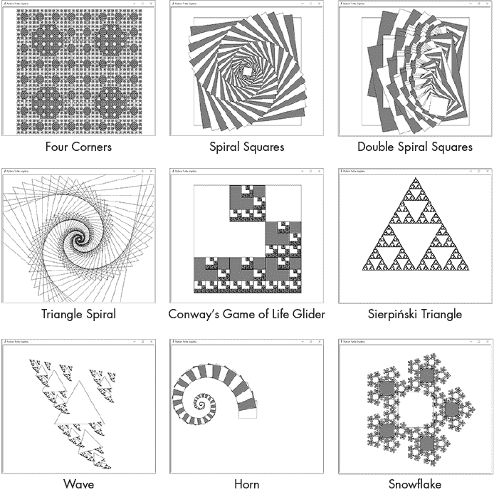

图 13-1：分形艺术生成器程序附带的九个示例分形

您可以通过将程序顶部的`DRAW_FRACTAL`常量设置为从`1`到`9`的整数，然后运行分形艺术生成器程序来生成所有这些分形。您还可以将`DRAW_FRACTAL`设置为`10`或`11`，以分别绘制组成这些分形的基本正方形和三角形形状，如图 13-2 所示。

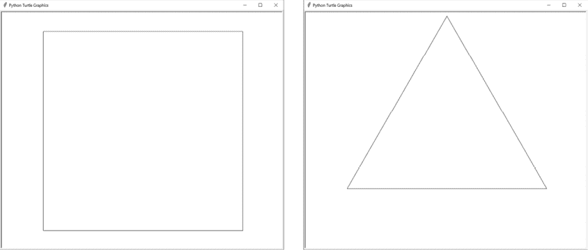

图 13-2：调用`drawFilledSquare()`（左）和`drawTriangleOutline()`（右）的结果

这些形状相当简单：一个填充有白色或灰色的正方形，以及一个简单的三角形轮廓。`drawFractal()`函数使用这些基本形状来创建令人惊叹的分形。

## 分形艺术生成器算法

分形艺术生成器的算法有两个主要组成部分：一个形状绘制函数和递归的`drawFractal()`函数。

形状绘制函数绘制基本形状。分形艺术生成器程序配备了先前在图 13-2 中显示的两个形状绘制函数，`drawFilledSquare()`和`drawTriangleOutline()`，但您也可以创建自己的形状绘制函数。我们将一个形状绘制函数作为参数传递给`drawFractal()`函数，就像我们在第十章中将匹配函数传递给文件查找器的`walk()`函数一样。

`drawFractal()`函数还具有一个参数，指示在对`drawFractal()`进行递归调用之间对形状的大小、位置和角度进行更改。我们将在本章后面介绍这些具体细节，但让我们看一个例子：分形 7，它绘制了一个波浪状的图像。

该程序通过调用`drawTriangleOutline()`形状绘制函数来生成波形分形，该函数创建一个单独的三角形。对`drawFractal()`的额外参数告诉它进行三次递归调用`drawFractal()`。图 13-3 显示了原始调用`drawFractal()`产生的三角形以及三次递归调用产生的三角形。

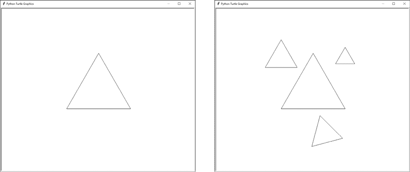

图 13-3：第一次调用`drawFractal()`产生的三角形（左）和第一组三次递归调用（右）

第一个递归调用告诉`drawFractal()`调用`drawTriangleOutline()`，但三角形的大小是上一个三角形的一半，并且位于其上一个三角形的左上方。第二个递归调用产生了一个三角形，位于其上一个三角形的右上方，大小为其 30％。第三个递归调用产生了一个三角形，位于其上一个三角形的下方，大小为其一半，并且相对于其旋转了 15 度。

这三个对`drawFractal()`的递归调用中的每一个都会再次对`drawFractal()`进行三次递归调用，从而产生九个新的三角形。新的三角形与其上一个三角形相比，其大小、位置和角度都发生了相同的变化。左上角的三角形始终是上一个三角形的一半大小，而底部三角形始终旋转 15 度。图 13-4 显示了递归的第一级和第二级产生的三角形。

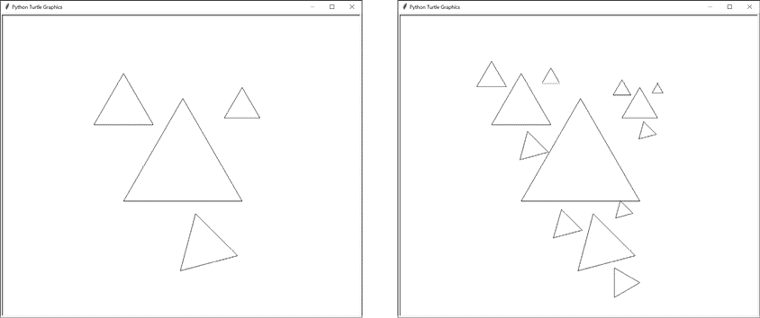

图 13-4：对`drawFractal()`的递归调用的第一级（左）和第二级递归调用的九个新三角形（右）

对`drawFractal()`的这九个调用分别产生了九个新的三角形，每个调用再次对`drawFractal()`进行三次递归调用，从而在下一级递归中产生 27 个新的三角形。随着递归模式的继续，最终三角形变得如此小，以至于`drawFractal()`停止进行新的递归调用。这是递归`drawFractal()`函数的一个基本情况。另一个情况是当递归深度达到指定级别时。无论哪种情况，这些递归调用都会产生图 13-5 中的最终 Wave 分形。

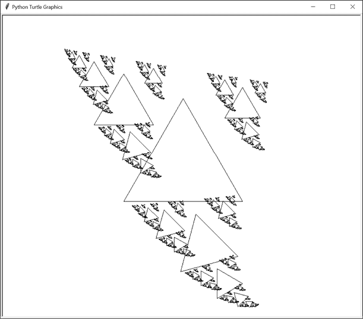

图 13-5：每个三角形递归生成三个新三角形后的最终 Wave 分形

图 13-1 中的九个示例分形是使用两个形状绘制函数和对`drawFractal()`参数的一些更改制作的。让我们看看分形艺术生成器的代码，以了解它是如何实现的。

## 完整的分形艺术制作程序

将以下代码输入到一个新文件中，并将其保存为[fractalArtMaker.py](http://fractalArtMaker.py)。此程序依赖于 Python 内置的`turtle`模块，因此本章的项目不使用 JavaScript 代码：

**Python**

```py
import turtle, math

DRAW_FRACTAL = 1 # Set to 1 through 11 and run the program.

turtle.tracer(5000, 0) # Increase the first argument to speed up the drawing.
turtle.hideturtle()

def drawFilledSquare(size, depth):
    size = int(size)

    # Move to the top-right corner before drawing:
    turtle.penup()
    turtle.forward(size // 2)
    turtle.left(90)
    turtle.forward(size // 2)
    turtle.left(180)
    turtle.pendown()

    # Alternate between white and gray (with black border):
    if depth % 2 == 0:
        turtle.pencolor('black')
        turtle.fillcolor('white')
    else:
        turtle.pencolor('black')
        turtle.fillcolor('gray')

    # Draw a square:
    turtle.begin_fill()
    for i in range(4): # Draw four lines.
        turtle.forward(size)
        turtle.right(90)
    turtle.end_fill()

def drawTriangleOutline(size, depth):
    size = int(size)

    # Move the turtle to the top of the equilateral triangle:
    height = size * math.sqrt(3) / 2
    turtle.penup()
    turtle.left(90) # Turn to face upward.
    turtle.forward(height * (2/3)) # Move to the top corner.
    turtle.right(150) # Turn to face the bottom-right corner.
    turtle.pendown()

    # Draw the three sides of the triangle:
    for i in range(3):
        turtle.forward(size)
        turtle.right(120)

def drawFractal(shapeDrawFunction, size, specs, maxDepth=8, depth=0):
    if depth > maxDepth or size < 1:
        return # BASE CASE

    # Save the position and heading at the start of this function call:
    initialX = turtle.xcor()
    initialY = turtle.ycor()
    initialHeading = turtle.heading()

 # Call the draw function to draw the shape:
    turtle.pendown()
    shapeDrawFunction(size, depth)
    turtle.penup()

    # RECURSIVE CASE
    for spec in specs:
        # Each dictionary in specs has keys 'sizeChange', 'xChange',
        # 'yChange', and 'angleChange'. The size, x, and y changes
        # are multiplied by the size parameter. The x change and y
        # change are added to the turtle's current position. The angle
        # change is added to the turtle's current heading.
        sizeCh = spec.get('sizeChange', 1.0)
        xCh = spec.get('xChange', 0.0)
        yCh = spec.get('yChange', 0.0)
        angleCh = spec.get('angleChange', 0.0)

        # Reset the turtle to the shape's starting point:
        turtle.goto(initialX, initialY)
        turtle.setheading(initialHeading + angleCh)
        turtle.forward(size * xCh)
        turtle.left(90)
        turtle.forward(size * yCh)
        turtle.right(90)

        # Make the recursive call:
        drawFractal(shapeDrawFunction, size * sizeCh, specs, maxDepth, 
        depth + 1)

if DRAW_FRACTAL == 1:
    # Four Corners:
    drawFractal(drawFilledSquare, 350,
        [{'sizeChange': 0.5, 'xChange': -0.5, 'yChange': 0.5},
         {'sizeChange': 0.5, 'xChange': 0.5, 'yChange': 0.5},
         {'sizeChange': 0.5, 'xChange': -0.5, 'yChange': -0.5},
         {'sizeChange': 0.5, 'xChange': 0.5, 'yChange': -0.5}], 5)
elif DRAW_FRACTAL == 2:
    # Spiral Squares:
    drawFractal(drawFilledSquare, 600, [{'sizeChange': 0.95,
        'angleChange': 7}], 50)
elif DRAW_FRACTAL == 3:
    # Double Spiral Squares:
    drawFractal(drawFilledSquare, 600,
        [{'sizeChange': 0.8, 'yChange': 0.1, 'angleChange': -10},
         {'sizeChange': 0.8, 'yChange': -0.1, 'angleChange': 10}])
elif DRAW_FRACTAL == 4:
    # Triangle Spiral:
    drawFractal(drawTriangleOutline, 20,
        [{'sizeChange': 1.05, 'angleChange': 7}], 80)
elif DRAW_FRACTAL == 5:
    # Conway's Game of Life Glider:
    third = 1 / 3
    drawFractal(drawFilledSquare, 600,
        [{'sizeChange': third, 'yChange': third},
 {'sizeChange': third, 'xChange': third},
         {'sizeChange': third, 'xChange': third, 'yChange': -third},
         {'sizeChange': third, 'yChange': -third},
         {'sizeChange': third, 'xChange': -third, 'yChange': -third}])
elif DRAW_FRACTAL == 6:
    # Sierpiński Triangle:
    toMid = math.sqrt(3) / 6
    drawFractal(drawTriangleOutline, 600,
        [{'sizeChange': 0.5, 'yChange': toMid, 'angleChange': 0},
         {'sizeChange': 0.5, 'yChange': toMid, 'angleChange': 120},
         {'sizeChange': 0.5, 'yChange': toMid, 'angleChange': 240}])
elif DRAW_FRACTAL == 7:
    # Wave:
    drawFractal(drawTriangleOutline, 280,
        [{'sizeChange': 0.5, 'xChange': -0.5, 'yChange': 0.5},
         {'sizeChange': 0.3, 'xChange': 0.5, 'yChange': 0.5},
         {'sizeChange': 0.5, 'yChange': -0.7, 'angleChange': 15}])
elif DRAW_FRACTAL == 8:
    # Horn:
    drawFractal(drawFilledSquare, 100,
        [{'sizeChange': 0.96, 'yChange': 0.5, 'angleChange': 11}], 100)
elif DRAW_FRACTAL == 9:
    # Snowflake:
    drawFractal(drawFilledSquare, 200,
        [{'xChange': math.cos(0 * math.pi / 180),
          'yChange': math.sin(0 * math.pi / 180), 'sizeChange': 0.4},
         {'xChange': math.cos(72 * math.pi / 180),
          'yChange': math.sin(72 * math.pi / 180), 'sizeChange': 0.4},
         {'xChange': math.cos(144 * math.pi / 180),
          'yChange': math.sin(144 * math.pi / 180), 'sizeChange': 0.4},
         {'xChange': math.cos(216 * math.pi / 180),
          'yChange': math.sin(216 * math.pi / 180), 'sizeChange': 0.4},
         {'xChange': math.cos(288 * math.pi / 180),
          'yChange': math.sin(288 * math.pi / 180), 'sizeChange': 0.4}])
elif DRAW_FRACTAL == 10:
    # The filled square shape:
    turtle.tracer(1, 0)
    drawFilledSquare(400, 0)
elif DRAW_FRACTAL == 11:
    # The triangle outline shape:
    turtle.tracer(1, 0)
    drawTriangleOutline(400, 0)
else:
    assert False, 'Set DRAW_FRACTAL to a number from 1 to 11.'

turtle.exitonclick() # Click the window to exit.
```

运行此程序时，它将显示来自图 13-1 的九个分形图像中的第一个。您可以将`DRAW_FRACTAL`常量更改为源代码开头的任何整数，从`1`到`9`，然后再次运行程序以查看新的分形。在了解程序如何工作之后，您还可以创建自己的形状绘制函数，并调用`drawFractal()`来生成自己设计的分形。

## 设置常量和乌龟配置

程序的第一行涵盖了基于乌龟的程序的基本设置步骤：

**Python**

```py
import turtle, math

DRAW_FRACTAL = 1 # Set to 1 through 11 and run the program.

turtle.tracer(5000, 0) # Increase the first argument to speed up the drawing.
turtle.hideturtle()
```

程序导入了用于绘图的`turtle`模块。它还导入了`math`模块，用于`math.sqrt()`函数，Sierpiński Triangle 分形将使用该函数，以及`math.cos()`和`math.sin()`函数，用于 Snowflake 分形。

`DRAW_FRACTAL`常量可以设置为从`1`到`9`的任何整数，以绘制程序生成的九个内置分形中的一个。您还可以将其设置为`10`或`11`，以分别显示正方形或三角形形状绘制函数的输出。

我们还调用一些海龟函数来准备绘制。`turtle.tracer(5000, 0)`调用加快了分形的绘制速度。`5000`参数告诉`turtle`模块在渲染屏幕上的绘制之前等待处理 5000 个海龟绘制指令，`0`参数告诉它在每个绘制指令后暂停 0 毫秒。否则，如果我们只想要最终图像，`turtle`模块会在每个绘制指令后渲染图像，这会显著减慢程序。

如果你想要减慢绘制速度并观察生成的线条，你可以将这个调用改为`turtle.tracer(1, 10)`。在制作自己的分形图案时，这可能有助于调试绘制中的任何问题。

`turtle.hideturtle()`调用隐藏了屏幕上代表海龟当前位置和方向的三角形形状。我们调用这个函数是为了让标记不出现在最终图像中。

## 使用形状绘制函数

`drawFractal()`函数使用传递给它的形状绘制函数来绘制分形的各个部分。这通常是一个简单的形状，比如正方形或三角形。分形的美丽复杂性是由于`drawFractal()`递归调用这个函数来绘制整个分形的每个组件。

Fractal Art Maker 的形状绘制函数有两个参数：`size`和`depth`。`size`参数是它绘制的正方形或三角形的边长。形状绘制函数应该始终使用基于`size`的参数来调用`turtle.forward()`，以便长度在每个递归级别上与`size`成比例。避免像`turtle.forward(100)`或`turtle.forward(200)`这样的代码；而是使用基于`size`参数的代码，比如`turtle.forward(size)`或`turtle.forward(size * 2)`。在 Python 的`turtle`模块中，`turtle.forward(1)`将海龟移动一个*单位*，这不一定等同于一个像素。

形状绘制函数的第二个参数是`drawFractal()`的递归深度。对`drawFractal()`的原始调用将`depth`参数设置为`0`。对`drawFractal()`的递归调用使用`depth + 1`作为`depth`参数。在 Wave 分形中，窗口中心的第一个三角形的深度参数为`0`。接下来创建的三个三角形的深度为`1`。围绕这三个三角形的九个三角形的深度为`2`，依此类推。

你的形状绘制函数可以忽略这个参数，但使用它可以导致基本形状的有趣变化。例如，`drawFilledSquare()`形状绘制函数使用`depth`来在绘制白色正方形和灰色正方形之间进行交替。如果你想为 Fractal Art Maker 程序创建自己的形状绘制函数，请记住它们必须接受`size`和`depth`参数。

### drawFilledSquare()函数

`drawFilledSquare()`函数绘制了一个边长为`size`的填充正方形。为了给正方形上色，我们使用了`turtle`模块的`turtle.begin_fill()`和`turtle.end_fill()`函数，使正方形变成白色或灰色，带有黑色边框，具体取决于`depth`参数是偶数还是奇数。因为这些正方形是填充的，稍后绘制在它们上面的任何正方形都会覆盖它们。

就像 Fractal Art Maker 程序的所有形状绘制函数一样，`drawFilledSquare()`接受`size`和`depth`参数：

```py
def drawFilledSquare(size, depth):
    size = int(size)
```

`size`参数可以是带有小数部分的浮点数，这有时会导致`turtle`模块绘制略微不对称和不均匀的图案。为了防止这种情况，函数的第一行将`size`四舍五入为整数。

当函数绘制正方形时，它假设海龟位于正方形的中心。因此，海龟必须首先移动到正方形的右上角，相对于它的初始方向：

**Python**

```py
 # Move to the top-right corner before drawing:
    turtle.penup()
    turtle.forward(size // 2)
    turtle.left(90)
    turtle.forward(size // 2)
    turtle.left(180)
    turtle.pendown()
```

`drawFractal()`函数在调用形状绘制函数时总是将笔放下并准备绘制，因此`drawFilledSquare()`必须调用`turtle.penup()`以避免在移动到起始位置时绘制一条线。为了找到相对于正方形中心的起始位置，海龟必须先向前移动正方形长度的一半（即`size // 2`），到达正方形的未来右边缘。接下来，海龟向上转 90 度，然后向前移动`size // 2`个单位到达右上角。现在海龟面朝错误的方向，所以它向后转了 180 度，并放下笔，这样就可以开始绘制了。

`请注意，*top-right*和*up*是相对于海龟最初面对的方向。如果海龟开始面对 0 度向右，或者其朝向为 90、42 或任何其他角度，此代码同样有效。当您创建自己的形状绘制函数时，坚持使用相对海龟移动函数，如`turtle.forward()`、`turtle.left()`和`turtle.right()`，而不是绝对海龟移动函数，如`turtle.goto()`。

接下来，`depth`参数告诉函数它应该绘制白色正方形还是灰色正方形：

Python

```py
 # Alternate between white and gray (with black border):
    if depth % 2 == 0:
        turtle.pencolor('black')
        turtle.fillcolor('white')
    else:
        turtle.pencolor('black')
        turtle.fillcolor('gray')
```

如果`depth`是偶数，则`depth % 2 == 0`条件为`True`，正方形的*填充颜色*为白色。否则，代码将填充颜色设置为灰色。无论哪种情况，由*笔颜色*确定的正方形边框都设置为黑色。要更改这两种颜色中的任何一种，请使用常见颜色名称的字符串，如`red`或`yellow`，或包含一个井号和六个十六进制数字的 HTML 颜色代码，如`#24FF24`表示酸橙绿，`#AD7100`表示棕色。

网站[`html-color.codes`](https://html-color.codes)有许多 HTML 颜色代码的图表。这本黑白书中的分形缺乏颜色，但您的计算机可以以丰富的颜色范围呈现自己的分形！

颜色设置好后，我们最终可以绘制实际正方形的四条线：

Python

```py
 # Draw a square:
    turtle.begin_fill()
    for i in range(4): # Draw four lines.
        turtle.forward(size)
        turtle.right(90)
    turtle.end_fill()
```

为了告诉`turtle`模块我们打算绘制填充形状而不仅仅是轮廓，我们调用了`turtle.begin_fill()`函数。接下来是一个`for`循环，绘制长度为`size`的线并将海龟向右转 90 度。`for`循环重复四次，以创建正方形。当函数最终调用`turtle.end_fill()`时，填充的正方形出现在屏幕上。

### drawTriangleOutline()函数

第二个形状绘制函数绘制了边长为`size`的等边三角形的轮廓。该函数绘制的三角形是以一个顶点在顶部，两个顶点在底部的方向。图 13-6 说明了等边三角形的各种尺寸。

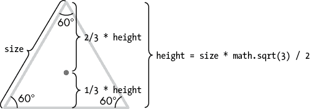

图 13-6：边长为`size`的等边三角形的测量

在我们开始绘制之前，我们必须根据其边长确定三角形的高度。几何学告诉我们，对于边长为*L*的等边三角形，三角形的高度*h*为*L*乘以根号 3 除以 2。在我们的函数中，*L*对应于`size`参数，因此我们的代码设置高度变量如下：

```py
`height = size * math.sqrt(3) / 2`
```

几何学还告诉我们，三角形的中心距离底边的高度为高度的三分之一，距离顶点的高度为高度的三分之二。这为我们提供了将海龟移动到起始位置所需的信息：

Python

```py
def drawTriangleOutline(size, depth):
    size = int(size)

    # Move the turtle to the top of the equilateral triangle:
    height = size * math.sqrt(3) / 2
    turtle.penup()
    turtle.left(90) # Turn to face upward.
    turtle.forward(height * (2/3)) # Move to the top corner.
    turtle.right(150) # Turn to face the bottom-right corner.
    turtle.pendown()
```

为了到达顶角，我们将乌龟左转 90 度面朝上（相对于乌龟原始朝向右转 0 度），然后向前移动`height * (2/3)`个单位。乌龟仍然面朝上，所以要开始在右侧绘制线条，乌龟必须右转 90 度面向右侧，然后再转 60 度面向三角形的右下角。这就是为什么我们调用`turtle.right(150)`。

此时，乌龟已准备好开始绘制三角形，因此我们通过调用`turtle.pendown()`来放下画笔。`for`循环将处理绘制三条边：

**Python**

```py
 # Draw the three sides of the triangle:
    for i in range(3):
        turtle.forward(size)
        turtle.right(120)
```

绘制实际三角形是向前移动`size`单位，然后向右转 120 度，分别进行三次。第三次和最后一次 120 度转向使乌龟面对其原始方向。您可以在图 13-7 中看到这些移动和转向。

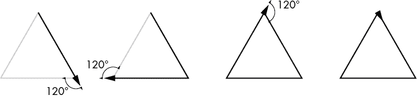

图 13-7：绘制等边三角形涉及三次向前移动和三次 120 度转向。

`drawTriangleOutline()`函数只绘制轮廓而不是填充形状，因此不像`drawFilledSquare()`那样调用`turtle.begin_fill()`和`turtle.end_fill()`。

## 使用分形绘图函数

现在我们有两个样本绘图函数可以使用，让我们来看一下分形艺术制作项目中的主要函数`drawFractal()`。这个函数有三个必需参数和一个可选参数：`shapeDrawFunction`，`size`，`specs`和`maxDepth`。

`shapeDrawFunction`参数期望一个函数，比如`drawFilledSquare()`或`drawTriangleOutline()`。`size`参数期望传递给绘图函数的起始大小。通常，值在`100`到`500`之间是一个不错的起始大小，尽管这取决于您的形状绘制函数中的代码，并且找到合适的值可能需要进行实验。

`specs`参数期望一个字典列表，指定递归调用`drawFractal()`时递归形状应该如何改变大小、位置和角度。这些规格稍后在本节中描述。

为了防止`drawFractal()`递归调用导致堆栈溢出，`maxDepth`参数保存了`drawFractal()`应该递归调用自身的次数。默认情况下，`maxDepth`的值为`8`，但如果需要更多或更少的递归形状，可以提供不同的值。

第五个参数`depth`由`drawFractal()`的递归调用处理，并默认为`0`。调用`drawFractal()`时不需要指定它。

### 设置函数

`drawFractal()`函数的第一件事是检查其两个基本情况：

**Python**

```py
def drawFractal(shapeDrawFunction, size, specs, maxDepth=8, depth=0):
    if depth > maxDepth or size < 1:
        return # BASE CASE
```

如果`depth`大于`maxDepth`，函数将停止递归并返回。另一个基本情况是如果`size`小于`1`，此时绘制的形状将太小而无法在屏幕上看到，因此函数应该简单地返回。

我们用三个变量`initialX`，`initialY`和`initialHeading`来跟踪乌龟的原始位置和朝向。这样，无论形状绘制函数将乌龟定位在何处或者朝向何方，`drawFractal()`都可以将乌龟恢复到原始位置和朝向，以便进行下一次递归调用：

**Python**

```py
 # Save the position and heading at the start of this function call:
    initialX = turtle.xcor()
    initialY = turtle.ycor()
    initialHeading = turtle.heading()
```

`turtle.xcor()`和`turtle.ycor()`函数返回乌龟在屏幕上的绝对 x 和 y 坐标。`turtle.heading()`函数返回乌龟指向的方向，单位为度。

接下来的几行调用传递给`shapeDrawFunction`参数的形状绘制函数：

**Python**

```py
 # Call the draw function to draw the shape:
    turtle.pendown()
    shapeDrawFunction(size, depth)
    turtle.penup()
```

由于作为`shapeDrawFunction`参数的值是一个函数，代码`shapeDrawFunction(size, depth)`调用此函数，并使用`size`和`depth`中的值。在`shapeDrawFunction()`调用之前和之后分别将笔降下和抬起，以确保形状绘制函数始终可以期望在绘制开始时笔是放下的。

### 使用规范字典

在调用`shapeDrawFunction()`之后，`drawFractal()`的其余代码致力于根据`specs`列表中的规范进行递归调用`drawFractal()`。对于每个字典，`drawFractal()`都会对`drawFractal()`进行一次递归调用。如果`specs`是一个具有一个字典的列表，则每次调用`drawFractal()`都会导致对`drawFractal()`的一次递归调用。如果`specs`是一个具有三个字典的列表，则每次调用`drawFractal()`都会导致对`drawFractal()`的三次递归调用。

`specs`参数中的字典为每个递归调用提供了规范。这些字典中的每一个都具有`sizeChange`、`xChange`、`yChange`和`angleChange`键。这些键规定了分形的大小、海龟的位置以及海龟的航向如何在递归的`drawFractal()`调用中改变。表 13-1 描述了规范中的四个键。

表 13-1：规范字典中的键

| **键** | **默认值** | **描述** |
| --- | --- | --- |
| `sizeChange` | `1.0` | 下一个递归形状的大小值是当前大小乘以这个值。 |
| `xChange` | `0.0` | 下一个递归形状的 x 坐标是当前 x 坐标加上当前大小乘以这个值。 |
| `yChange` | `0.0` | 下一个递归形状的 y 坐标是当前 y 坐标加上当前大小乘以这个值。 |
| `angleChange` | `0.0` | 下一个递归形状的起始角度是当前起始角度加上这个值。 |

让我们来看一下四角分形的规范字典，它产生了之前在图 13-1 中显示的左上角图像。对于四角分形的`drawFractal()`调用，传递了以下字典列表作为`specs`参数：

**Python**

```py
[{'sizeChange': 0.5, 'xChange': -0.5, 'yChange': 0.5},
 {'sizeChange': 0.5, 'xChange': 0.5, 'yChange': 0.5},
 {'sizeChange': 0.5, 'xChange': -0.5, 'yChange': -0.5},
 {'sizeChange': 0.5, 'xChange': 0.5, 'yChange': -0.5}]
```

`specs`列表有四个字典，因此每次调用`drawFractal()`绘制一个正方形，都会递归调用`drawFractal()`四次，以绘制另外四个正方形。图 13-8 显示了这些正方形的进展（在白色和灰色之间交替）。

为了确定下一个要绘制的正方形的大小，`sizeChange`键的值乘以当前的`size`参数。`specs`列表中的第一个字典具有`sizeChange`值为`0.5`，这使得下一个递归调用具有大小参数为`350 * 0.5`，即`175`个单位。这使得下一个正方形的大小是前一个正方形的一半。例如，`sizeChange`值为`2.0`会使下一个正方形的大小加倍。如果字典没有`sizeChange`键，则该值默认为`1.0`，表示大小不变。

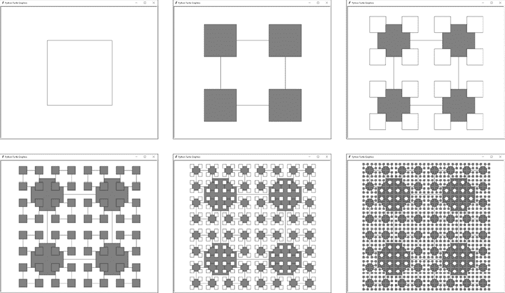

图 13-8：四角示例的每一步从左到右，从上到下。每个正方形在其角落递归产生四个更小的正方形，颜色在白色和灰色之间交替。

要确定下一个正方形的 x 坐标，首个字典的`xChange`值，在这种情况下是`-0.5`，乘以大小。当`size`为`350`时，这意味着下一个正方形相对于海龟当前位置有一个 x 坐标为`-175`单位。这个`xChange`值和`yChange`键的值为`0.5`，将下一个正方形的位置放置在当前正方形位置的左侧和上方 50%的距离。这恰好将其居中在当前正方形的左上角。

如果你看一下`specs`列表中的其他三个字典，你会注意到它们的`sizeChange`值都是`0.5`。它们之间的区别在于它们的`xChange`和`yChange`值将它们放置在当前正方形的其他三个角落。因此，下一个四个正方形是在当前正方形的四个角上居中绘制的。

这个例子中`specs`列表中的字典没有`angleChange`值，因此这个值默认为`0.0`度。正的`angleChange`值表示逆时针旋转，而负值表示顺时针旋转。

每个字典代表每次递归函数调用时要绘制的一个单独的正方形。如果我们从`specs`列表中删除第一个字典，每个`drawFractal()`调用将只产生三个正方形，就像图 13-9 中一样。

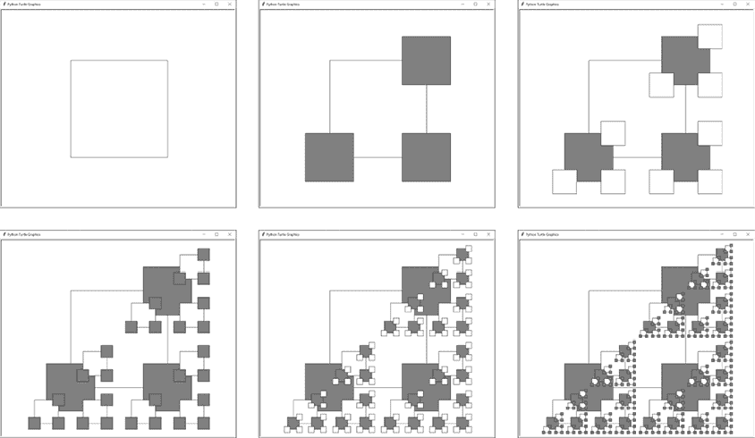

图 13-9：从`specs`列表中删除第一个字典的四个角分形

### 应用规范

让我们看看`drawFractal()`中的代码实际上是如何做我们描述的一切的：

**Python**

```py
 # RECURSIVE CASE
    for spec in specs:
        # Each dictionary in specs has keys 'sizeChange', 'xChange',
        # 'yChange', and 'angleChange'. The size, x, and y changes
        # are multiplied by the size parameter. The x change and y
        # change are added to the turtle's current position. The angle
        # change is added to the turtle's current heading.
        sizeCh = spec.get('sizeChange', 1.0)
        xCh = spec.get('xChange', 0.0)
        yCh = spec.get('yChange', 0.0)
        angleCh = spec.get('angleChange', 0.0)
```

`for`循环将`specs`列表中的单个规范字典分配给循环变量`spec`的每次迭代。`get()`字典方法调用从这个字典中提取`sizeChange`、`xChange`、`yChange`和`angleChange`键的值，并将它们分配给更短的名称`sizeCh`、`xCh`、`yCh`和`angleCh`变量。如果键在字典中不存在，`get()`方法会替换默认值。

接下来，海龟的位置和朝向被重置为首次调用`drawFractal()`时指示的值。这确保了来自先前循环迭代的递归调用不会使海龟停留在其他位置。然后根据`angleCh`、`xCh`和`yCh`变量改变朝向和位置：

**Python**

```py
 # Reset the turtle to the shape's starting point:
        turtle.goto(initialX, initialY)
        turtle.setheading(initialHeading + angleCh)

        turtle.forward(size * xCh)
        turtle.left(90)
        turtle.forward(size * yCh)
        turtle.right(90)
```

x-change 和 y-change 位置是相对于海龟当前的朝向来表达的。如果海龟的朝向是`0`，海龟的相对 x 轴与屏幕上的实际 x 轴相同。然而，如果海龟的朝向是`45`，海龟的相对 x 轴就会倾斜 45 度。沿着海龟的相对 x 轴“向右”移动将以一个向上和向右的角度移动。

这就是为什么通过`size * xCh`向前移动会沿着其相对 x 轴移动。如果`xCh`为负，`turtle.forward()`会沿着海龟的相对 x 轴向左移动。`turtle.left(90)`调用将海龟指向其相对 y 轴，`turtle.forward(size * yCh)`将海龟移动到下一个形状的起始位置。然而，`turtle.left(90)`调用改变了海龟的朝向，所以调用`turtle.right(90)`将其重置回原始方向。

图 13-10 展示了这四行代码如何沿着海龟的相对 x 轴向右移动，沿着相对 y 轴向上移动，并且无论初始朝向如何，都将其保留在正确的朝向。

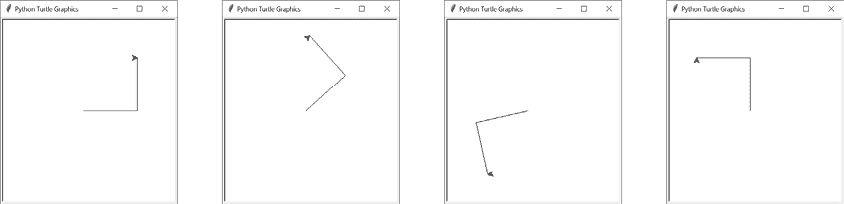

图 13-10：在这四个图像中，海龟总是沿着其初始朝向的相对 x 轴和 y 轴移动 100 个单位“向右”和“向上”。

最后，当乌龟处于正确的位置和朝向下一个形状时，我们对 drawFractal()进行递归调用：

**Python**

```py
 # Make the recursive call:
        drawFractal(shapeDrawFunction, size * sizeCh, specs, maxDepth, 
        depth + 1)
```

shapeDrawFunction，specs 和 maxDepth 参数未经修改地传递给递归 drawFractal()调用。 但是，传递 size * sizeCh 作为下一个 size 参数以反映递归形状的 size 的变化，并且传递 depth + 1 作为 depth 参数以增加下一个形状绘制函数调用的深度。

## 创建示例分形

既然我们已经介绍了形状绘制函数和递归 drawFractal()函数的工作原理，让我们来看看随附 Fractal Art Maker 的九个示例分形。 您可以在图 13-1 中看到这些示例。

### Four Corners

第一个分形是 Four Corners，它开始作为一个大正方形。 随着函数调用自身，分形的规格导致在正方形的四个角落绘制四个较小的正方形：

**Python**

```py
if DRAW_FRACTAL == 1:
    # Four Corners:
    drawFractal(drawFilledSquare, 350,
        [{'sizeChange': 0.5, 'xChange': -0.5, 'yChange': 0.5},
         {'sizeChange': 0.5, 'xChange': 0.5, 'yChange': 0.5},
         {'sizeChange': 0.5, 'xChange': -0.5, 'yChange': -0.5},
         {'sizeChange': 0.5, 'xChange': 0.5, 'yChange': -0.5}], 5)
```

这里对 drawFractal()的调用将最大深度限制为 5，因为再多会使分形变得如此密集，以至于细节变得难以看清。 这个分形出现在图 13-8 中。

### 螺旋正方形

*Spiral Squares fractal*也以一个大正方形开始，但每次递归调用时只创建一个新的正方形：

**Python**

```py
elif DRAW_FRACTAL == 2:
    # Spiral Squares:
    drawFractal(drawFilledSquare, 600, [{'sizeChange': 0.95,
        'angleChange': 7}], 50)
```

这个正方形稍小，并旋转了 7 度。 所有正方形的中心都没有改变，所以不需要向规范中添加 xChange 和 yChange 键。 默认的最大深度为 8 太小，无法得到有趣的分形，因此我们将其增加到 50 以产生催眠螺旋图案。

### 双螺旋正方形

*Double Spiral Squares fractal*类似于 Spiral Squares，只是每个正方形创建两个较小的正方形。 这会产生有趣的扇形效果，因为第二个正方形稍后绘制，往往会覆盖先前绘制的正方形：

**Python**

```py
elif DRAW_FRACTAL == 3:
    # Double Spiral Squares:
    drawFractal(drawFilledSquare, 600,
        [{'sizeChange': 0.8, 'yChange': 0.1, 'angleChange': -10},
         {'sizeChange': 0.8, 'yChange': -0.1, 'angleChange': 10}])
```

正方形的创建略高于或低于其上一个正方形，并且旋转了 10 度或-10 度。

### Triangle Spiral

*Triangle Spiral* *fractal*，螺旋正方形的另一种变体，使用 drawTriangleOutline()形状绘制函数而不是 drawFilledSquare()：

**Python**

```py
elif DRAW_FRACTAL == 4:
    # Triangle Spiral:
    drawFractal(drawTriangleOutline, 20,
        [{'sizeChange': 1.05, 'angleChange': 7}], 80)
```

与螺旋正方形分形不同，Triangle Spiral 分形从 20 个单位的小 size 开始，并在每个递归级别略微增加大小。 sizeChange 键大于 1.0，因此形状始终在增大。 这意味着当递归达到深度 80 时，基本情况发生，因为 size 小于 1 的基本情况永远不会发生。

### 康威的生命游戏 Glider

*康威的生命游戏*是细胞自动机的著名例子。 游戏的简单规则导致在 2D 网格上出现有趣且极其混乱的图案。 其中一种图案是由 5 个单元格组成的 3×3 空间的*Glider*：

**Python**

```py
elif DRAW_FRACTAL == 5:
    # Conway's Game of Life Glider:
    third = 1 / 3
    drawFractal(drawFilledSquare, 600,
        [{'sizeChange': third, 'yChange': third},
         {'sizeChange': third, 'xChange': third},
         {'sizeChange': third, 'xChange': third, 'yChange': -third},
         {'sizeChange': third, 'yChange': -third},
         {'sizeChange': third, 'xChange': -third, 'yChange': -third}])
```

这里的 Glider 分形在其五个单元格中各有额外的 Glider 绘制。 third 变量有助于精确设置 3×3 空间中递归形状的位置。

您可以在我的书《The Big Book of Small Python Projects》（No Starch Press，2021）中找到康威的生命游戏的 Python 实现，并在[`inventwithpython.com/bigbookpython/project13.html`](https://inventwithpython.com/bigbookpython/project13.html)上找到在线版本。 不幸的是，数学家和教授约翰·康威于 2020 年 4 月因 COVID-19 并发症去世。

### 谢尔宾斯基三角形

我们在第九章创建了 Sierpiński Triangle 分形，但是我们的 Fractal Art Maker 也可以使用 drawTriangleOutline()形状函数重新创建它。 毕竟，谢尔宾斯基三角形是一个内部绘制了三个较小的等边三角形的等边三角形：

**Python**

```py
elif DRAW_FRACTAL == 6:
    # Sierpiński Triangle:
    toMid = math.sqrt(3) / 6
    drawFractal(drawTriangleOutline, 600,
        [{'sizeChange': 0.5, 'yChange': toMid, 'angleChange': 0},
         {'sizeChange': 0.5, 'yChange': toMid, 'angleChange': 120},
         {'sizeChange': 0.5, 'yChange': toMid, 'angleChange': 240}])
```

这些较小三角形的中心距离上一个三角形的中心是`size * math.sqrt(3) / 6`单位。这三次调用将乌龟的方向调整为`0`、`120`和`240`度，然后在乌龟的相对 y 轴上移动。

### 波形

我们在本章的开头讨论了*波形分形*，你可以在图 13-5 中看到它。这个相对简单的分形创建了三个较小且不同的递归三角形：

**Python**

```py
elif DRAW_FRACTAL == 7:
    # Wave:
    drawFractal(drawTriangleOutline, 280,
        [{'sizeChange': 0.5, 'xChange': -0.5, 'yChange': 0.5},
         {'sizeChange': 0.3, 'xChange': 0.5, 'yChange': 0.5},
         {'sizeChange': 0.5, 'yChange': -0.7, 'angleChange': 15}])
```

### 角

*角分形*类似于公羊的角：

**Python**

```py
elif DRAW_FRACTAL == 8:
    # Horn:
    drawFractal(drawFilledSquare, 100,
        [{'sizeChange': 0.96, 'yChange': 0.5, 'angleChange': 11}], 100)
```

这个简单的分形由一系列正方形组成，每个正方形都比前一个正方形稍微小一些，向上移动，并旋转`11`度。我们将最大递归深度增加到`100`，以将角延伸成紧密的螺旋。

### 雪花

最终的分形*雪花*由以五边形图案布置的正方形组成。这类似于四角分形，但它使用了五个均匀间隔的递归正方形，而不是四个：

**Python**

```py
elif DRAW_FRACTAL == 9:
    # Snowflake:
    drawFractal(drawFilledSquare, 200,
        [{'xChange': math.cos(0 * math.pi / 180),
          'yChange': math.sin(0 * math.pi / 180), 'sizeChange': 0.4},
         {'xChange': math.cos(72 * math.pi / 180),
          'yChange': math.sin(72 * math.pi / 180), 'sizeChange': 0.4},
         {'xChange': math.cos(144 * math.pi / 180),
          'yChange': math.sin(144 * math.pi / 180), 'sizeChange': 0.4},
         {'xChange': math.cos(216 * math.pi / 180),
          'yChange': math.sin(216 * math.pi / 180), 'sizeChange': 0.4},
         {'xChange': math.cos(288 * math.pi / 180),
          'yChange': math.sin(288 * math.pi / 180), 'sizeChange': 0.4}])
```

这个分形使用三角函数中的余弦和正弦函数，在 Python 的`math.cos()`和`math.sin()`函数中实现，来确定如何沿着 x 轴和 y 轴移动正方形。一个完整的圆有 360 度，所以为了均匀地在这个圆中间放置五个递归正方形，我们将它们放置在 0、72、144、216 和 288 度的间隔处。`math.cos()`和`math.sin()`函数希望角度参数是弧度而不是度数，所以我们必须将这些数字乘以`math.pi / 180`。

最终的结果是，每个正方形都被另外五个正方形所包围，这些正方形又被另外五个正方形所包围，依此类推，形成了一个类似雪花的晶体状分形。

### 生成单个正方形或三角形

为了完整起见，你还可以将`DRAW_FRACTAL`设置为`10`或`11`，以查看单次调用`drawFilledSquare()`和`drawTriangleOutline()`在乌龟窗口中产生的效果。这些形状的大小为`600`：

**Python**

```py
elif DRAW_FRACTAL == 10:
    # The filled square shape:
    turtle.tracer(1, 0)
    drawFilledSquare(400, 0)
elif DRAW_FRACTAL == 11:
    # The triangle outline shape:
    turtle.tracer(1, 0)
    drawTriangleOutline(400, 0)
turtle.exitonclick() # Click the window to exit.
```

在根据`DRAW_FRACTAL`中的值绘制分形或形状之后，程序调用`turtle.exitonclick()`，这样乌龟窗口会一直保持打开，直到用户点击它。然后程序终止。

## 创建你自己的分形

你可以通过改变传递给`drawFractal()`函数的规范来创建自己的分形。首先考虑每次调用`drawFractal()`生成多少个递归调用，以及形状的大小、位置和方向应该如何改变。你可以使用现有的形状绘制函数，也可以创建自己的函数。

例如，图 13-11 展示了九个内置的分形，除了正方形和三角形函数已经交换。其中一些产生了平淡的形状，但其他一些可能会产生意想不到的美丽。

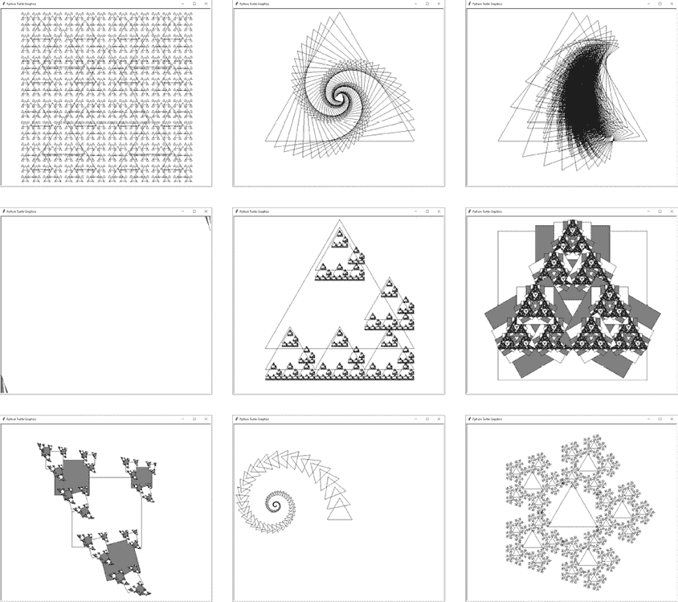

图 13-11：分形艺术制作器附带的九个分形，形状绘制函数已经交换

## 总结

分形艺术制作器项目展示了递归的无限可能性。一个简单的递归`drawFractal()`函数，配合一个绘制形状的函数，可以创造出各种各样的详细几何艺术。

在分形艺术制作器的核心是递归的`drawFractal()`函数，它接受另一个函数作为参数。这个第二个函数通过使用规范字典列表中给定的大小、位置和方向，重复绘制一个基本形状。

你可以测试无限数量的形状绘制函数和规范设置。让你的创造力驱动你的分形项目，当你在这个程序中进行实验时。

## 进一步阅读

有一些网站可以让您创建分形。交互式分形树在[`www.visnos.com/demos/fractal`](https://www.visnos.com/demos/fractal)上有滑块可以改变二叉树分形的角度和大小参数。[`procedural-snowflake.glitch.me`](https://procedural-snowflake.glitch.me)上的程序性雪花可以在您的浏览器中生成新的雪花。Nico 的分形机在[`sciencevsmagic.net/fractal`](https://sciencevsmagic.net/fractal)上创建分形的动画图。您可以通过在网络上搜索*分形生成器*或*在线分形生成器*来找到其他网站。

