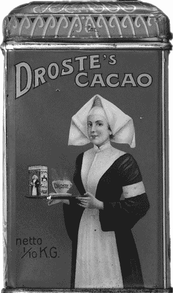
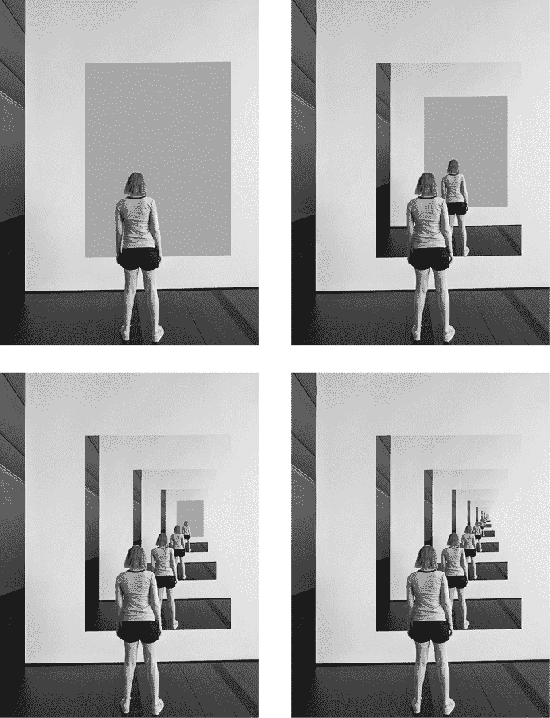
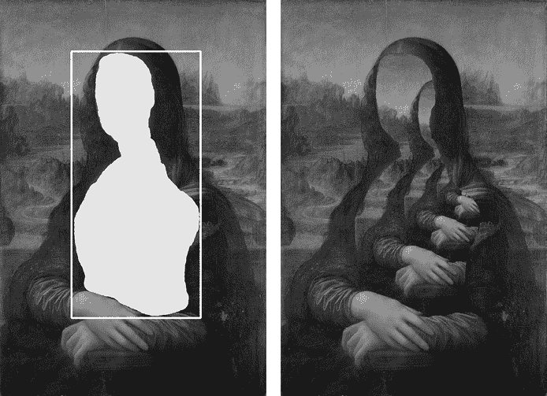
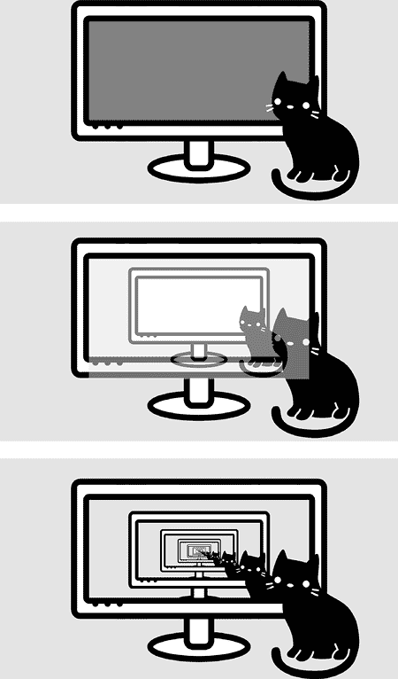
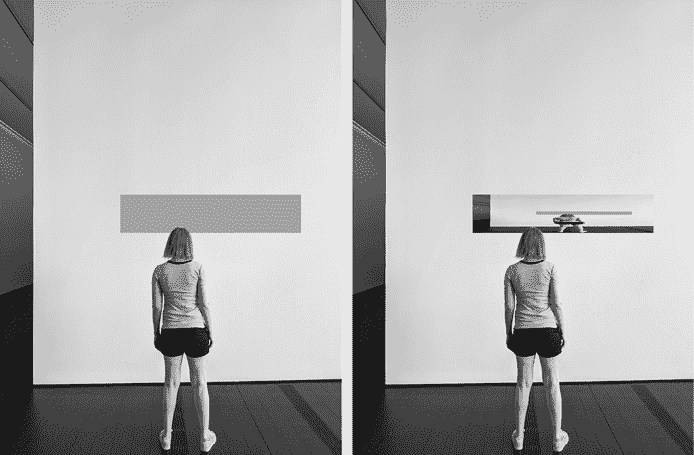

# 十四、Droste 生成器

> 原文：[Chapter 14 - Droste Maker](https://inventwithpython.com/recursion/chapter14.html)
> 
> 译者：[飞龙](https://github.com/wizardforcel)
> 
> 协议：[CC BY-NC-SA 4.0](https://creativecommons.org/licenses/by-nc-sa/4.0/)


*Droste 效应*是一种递归艺术技术，以荷兰品牌 Droste 可可的 1904 年插图命名。在图 14-1 中，这个罐子上有一个护士拿着一个托盘，托盘上有一个 Droste 可可的罐子，罐子上有这个插图。

在本章中，我们将创建一个 Droste 生成器程序，可以从您拥有的任何照片或图纸生成类似的递归图像，无论是一个在博物馆观看自己展品的参观者，一只猫在另一只猫前面的计算机显示器，还是其他任何东西。



图 14-1: Droste 可可罐上的递归插图

使用诸如 Microsoft Paint 或 Adobe Photoshop 之类的图形程序，您将通过用纯品红色覆盖图像的一部分来准备图像，指示递归图像的放置位置。Python 程序使用 Pillow 图像库读取这些图像数据并生成递归图像。

首先，我们将介绍如何安装 Pillow 库以及 Droste 生成器算法的工作原理。接下来，我们将提供程序的 Python 源代码，并解释代码。

## 安装 Pillow Python 库

本章的项目需要 Pillow 图像库。这个库允许您的 Python 程序创建和修改图像文件，包括 PNG、JPEG 和 GIF。它有几个函数可以执行调整大小、复制、裁剪和其他常见的图像操作。

要在 Windows 上安装此库，请打开命令提示窗口并运行`py -m pip install --user pillow`。要在 macOS 或 Linux 上安装此库，请打开终端窗口并运行 python3 `-m pip install --user pillow`。此命令使 Python 使用 pip 安装程序从[`pypi.org`](https://pypi.org)官方 Python 软件包索引下载模块。

要验证安装是否成功，请打开 Python 终端并运行`from PIL import Image`。（虽然库的名称是 Pillow，但安装的 Python 模块名为`PIL`，大写字母。）如果没有出现错误，则库已正确安装。

Pillow 的官方文档可以在[`pillow.readthedocs.io`](https://pillow.readthedocs.io)找到。

## 绘制您的图像

下一步是通过将图像的一部分设置为 RGB（红色、绿色、蓝色）颜色值（255, 0, 255）来准备图像。计算机图形通常使用品红色来标记图像的哪些像素应该被渲染为透明。我们的程序将把这些品红色像素视为视频制作中的绿屏，用初始图像的调整版本替换它们。当然，这个调整后的图像将有自己更小的品红区域，程序将用另一个调整后的图像替换它。当最终图像没有更多品红像素时，基本情况发生，此时算法完成。

图 14-2 显示了随着调整大小的图像递归应用到品红色像素而创建的图像的进展。在这个例子中，一个模特站在一个被品红色像素替换的艺术博物馆展品前，将照片本身变成了展品。你可以从[`inventwithpython.com/museum.png`](https://inventwithpython.com/museum.png)下载这个基础图像。

确保在你的图像中只使用纯(255, 0, 255)品红色来绘制品红色区域。一些工具可能会产生淡化效果，产生更自然的外观。例如，Photoshop 的画笔工具会在绘制区域的轮廓上产生淡化的品红色像素，所以你需要使用铅笔工具，它只使用你选择的精确纯品红色来绘制。如果你的图形程序不允许你指定绘制的精确 RGB 颜色，你可以从[`inventwithpython.com/magenta.png`](https://inventwithpython.com/magenta.png)的 PNG 图像中复制和粘贴颜色。

图像中的品红色区域可以是任意大小或形状；它不必是一个精确的、连续的矩形。你可以在图 14-2 中看到，博物馆参观者切入品红色矩形，将他们放在递归图像的前面。

如果你用 Droste Maker 制作自己的图像，你应该使用 PNG 图像文件格式而不是 JPEG。JPEG 图像使用*有损*压缩技术来保持文件大小小，引入了轻微的瑕疵。这些通常对人眼来说是不可察觉的，不会影响整体图像质量。然而，这种有损压缩会用稍微不同色调的品红色像素取代纯(255, 0, 255)品红色。PNG 图像的*无损*压缩确保这种情况不会发生。



图 14-2：图像递归应用到品红色像素。如果你在本书中查看黑白图像，品红色区域是博物馆参观者前面的矩形。

## 完整的 Droste Maker 程序

以下是`drostemaker.py`的源代码；因为这个程序依赖于仅限于 Python 的 Pillow 库，所以在本书中这个项目没有 JavaScript 的等价物：

```py
from PIL import Image

def makeDroste(baseImage, stopAfter=10):
    # If baseImage is a string of an image filename, load that image:
    if isinstance(baseImage, str):
        baseImage = Image.open(baseImage)

    if stopAfter == 0:
        # BASE CASE
        return baseImage
    # The magenta color has max red/blue/alpha, zero green:
    if baseImage.mode == 'RGBA':
        magentaColor = (255, 0, 255, 255)
    elif baseImage.mode == 'RGB':
        magentaColor = (255, 0, 255)

    # Find the dimensions of the base image and its magenta area:
    baseImageWidth, baseImageHeight = baseImage.size
    magentaLeft = None
    magentaRight = None
    magentaTop = None
    magentaBottom = None

    for x in range(baseImageWidth):
        for y in range(baseImageHeight):
            if baseImage.getpixel((x, y)) == magentaColor:
                if magentaLeft is None or x < magentaLeft:
                    magentaLeft = x
                if magentaRight is None or x > magentaRight:
                    magentaRight = x
                if magentaTop is None or y < magentaTop:
                    magentaTop = y
                if magentaBottom is None or y > magentaBottom:
                    magentaBottom = y

    if magentaLeft is None:
        # BASE CASE - No magenta pixels are in the image.
        return baseImage

    # Get a resized version of the base image:
    magentaWidth = magentaRight - magentaLeft + 1
    magentaHeight = magentaBottom - magentaTop + 1
    baseImageAspectRatio = baseImageWidth / baseImageHeight
    magentaAspectRatio = magentaWidth / magentaHeight

    if baseImageAspectRatio < magentaAspectRatio:
        # Make the resized width match the width of the magenta area:
        widthRatio = magentaWidth / baseImageWidth
        resizedImage = baseImage.resize((magentaWidth, 
        int(baseImageHeight * widthRatio) + 1), Image.NEAREST)
    else:
        # Make the resized height match the height of the magenta area:
        heightRatio =  magentaHeight / baseImageHeight
 resizedImage = baseImage.resize((int(baseImageWidth * 
        heightRatio) + 1, magentaHeight), Image.NEAREST)

    # Replace the magenta pixels with the smaller, resized image:
    for x in range(magentaLeft, magentaRight + 1):
        for y in range(magentaTop, magentaBottom + 1):
            if baseImage.getpixel((x, y)) == magentaColor:
                pix = resizedImage.getpixel((x - magentaLeft, y - magentaTop))
                baseImage.putpixel((x, y), pix)

    # RECURSIVE CASE:
    return makeDroste(baseImage, stopAfter=stopAfter - 1)

recursiveImage = makeDroste('museum.png')
recursiveImage.save('museum-recursive.png')
recursiveImage.show()
```

在运行这个程序之前，将你的图像文件放在与`drostemaker.py`相同的文件夹中。程序将递归图像保存为*museum-recursive.png*，然后打开一个图像查看器来显示它。如果你想在你自己添加了品红色区域的图像上运行程序，用你的图像文件的名称替换源代码末尾的`makeDroste('museum.png')`，用你想要用来保存递归图像的名称替换`save('museum-recursive.png')`。

## 设置

Droste Maker 程序只有一个函数`makeDroste()`，它接受一个 Pillow `Image`对象或一个图像文件名的字符串。该函数返回一个 Pillow `Image`对象，其中任何品红色像素都被同一图像的版本递归地替换：

**Python**

```py
from PIL import Image

def makeDroste(baseImage, stopAfter=10):
    # If baseImage is a string of an image filename, load that image:
    if isinstance(baseImage, str):
        baseImage = Image.open(baseImage)
```

程序开始时从 Pillow 库（作为 Python 模块命名为`PIL`）导入`Image`类。在`makeDroste()`函数内部，我们检查`baseImage`参数是否是一个字符串，如果是，我们将其替换为从相应图像文件加载的 Pillow `Image`对象。

接下来，我们检查`stopAfter`参数是否为`0`。如果是，我们已经达到了算法的一个基本情况，函数将返回基础图像的 Pillow `Image`对象：

**Python**

```py
 if stopAfter == 0:
        # BASE CASE
        return baseImage
```

如果函数调用没有提供`stopAfter`，则`stopAfter`参数默认为`10`。在此函数中稍后对`makeDroste()`的递归调用将`stopAfter - 1`作为该参数的参数传递，以便它在每次递归调用时减少，并接近`0`的基本情况。

例如，将`0`传递给`stopAfter`会导致函数立即返回与基本图像相同的递归图像。将`1`传递给`stopAfter`会替换品红区域为递归图像一次，进行一次递归调用，达到基本情况，并立即返回。将`2`传递给`stopAfter`会导致两次递归调用，依此类推。

该参数防止函数在品红区域特别大时递归，直到导致堆栈溢出。它还允许我们传递比`10`更小的参数，以限制放置在基本图像中的递归图像的数量。例如，通过为`stopAfter`参数传递`0`、`1`、`2`和`3`，可以创建图 14-2 中的四幅图像。

接下来，我们检查基本图像的颜色模式。这可以是`RGB`，表示具有红绿蓝像素的图像，或者`RGBA`，表示具有像素 alpha 通道的图像。*alpha 值*表示像素的透明级别。以下是代码：

**Python**

```py
 # The magenta color has max red/blue/alpha, zero green:
    if baseImage.mode == 'RGBA':
        magentaColor = (255, 0, 255, 255)
    elif baseImage.mode == 'RGB':
        magentaColor = (255, 0, 255)
```

Droste Maker 需要知道颜色模式，以便它可以找到品红像素。每个通道的值范围从`0`到`255`，品红像素具有最大量的红色和蓝色，但没有绿色。此外，如果存在 alpha 通道，对于完全不透明的颜色，它将设置为`255`，对于完全透明的颜色，它将设置为`0`。根据`baseImage.mode`中给出的图像颜色模式，`magentaColor`变量设置为品红像素的正确元组值。

## 寻找品红区域

在程序可以递归地将图像插入品红区域之前，它必须找到图像中品红区域的边界。这涉及找到图像中最左、最右、最上和最下的品红像素。

虽然品红区域本身不需要是一个完美的矩形，但程序需要知道品红的矩形边界，以便正确调整图像以进行插入。例如，图 14-3 显示了*蒙娜丽莎*的基本图像，其中品红区域用白色轮廓标出。品红像素被替换以生成递归图像。



图 14-3：带有白色轮廓的品红区域的基本图像（左）及其生成的递归图像（右）

为了计算调整大小和调整后图像的放置位置，程序从`baseImage`中 Pillow`Image`对象的`size`属性中检索基本图像的宽度和高度。以下行初始化了四个变量，用于品红区域的四个边缘——`magentaLeft`，`magentaRight`，`magentaTop`和`magentaBottom`——并将其值设置为`None`：

**Python**

```py
 # Find the dimensions of the base image and its magenta area:
    baseImageWidth, baseImageHeight = baseImage.size
    magentaLeft = None
    magentaRight = None
    magentaTop = None
    magentaBottom = None
```

这些边缘变量的值在接下来的代码中被整数`x`和`y`坐标替换：

**Python**

```py
 for x in range(baseImageWidth):
        for y in range(baseImageHeight):
            if baseImage.getpixel((x, y)) == magentaColor:
                if magentaLeft is None or x < magentaLeft:
                    magentaLeft = x
                if magentaRight is None or x > magentaRight:
                    magentaRight = x
                if magentaTop is None or y < magentaTop:
                    magentaTop = y
                if magentaBottom is None or y > magentaBottom:
                    magentaBottom = y
```

这些嵌套的`for`循环在基本图像的每个可能的 x、y 坐标上迭代`x`和`y`变量。我们检查每个坐标处的像素是否为存储在`magentaColor`中的纯品红色，然后更新`magentaLeft`变量，如果品红像素的坐标比`magentaLeft`中当前记录的更靠左，则对其他三个方向也是如此。

当嵌套的`for`循环完成时，`magentaLeft`，`magentaRight`，`magentaTop`和`magentaBottom`将描述基本图像中品红像素的边界。如果图像没有品红像素，这些变量将保持设置为它们最初的`None`值：

**Python**

```py
 if magentaLeft is None:
        # BASE CASE - No magenta pixels are in the image.
        return baseImage
```

如果嵌套的`for`循环完成后`magentaLeft`（或者实际上是这四个变量中的任何一个）仍然设置为`None`，则图像中没有品红像素。这是我们递归算法的基本情况，因为随着每次对`makeDroste()`的递归调用，品红区域会变得越来越小。此时，函数返回`baseImage`中的 Pillow`Image`对象。

## 调整基本图像的大小

我们需要将基本图像调整大小以完全覆盖品红区域，不多不少。图 14-4 显示了完整的调整大小后的图像透明地叠加在原始基本图像上。这个调整大小后的图像被裁剪，以便只有覆盖品红像素的部分被复制到最终图像中。



图 14-4：带有显示器中品红区域的基本图像（顶部），覆盖在基本图像上的调整大小后的图像（中部），以及替换仅品红像素的最终递归图像（底部）

我们不能简单地将基本图像调整大小到品红区域的尺寸，因为两者不太可能具有相同的*长宽比*，即宽度除以高度的比例。这样做会导致一个看起来被拉伸或压缩的递归图像，就像图 14-5 一样。

相反，我们必须使调整大小后的图像足够大，以完全覆盖品红区域，但仍保留图像的原始长宽比。这意味着要么将调整大小后的图像的宽度设置为品红区域的宽度，使得调整大小后的图像的高度等于或大于品红区域的高度，要么将调整大小后的图像的高度设置为品红区域的高度，使得调整大小后的图像的宽度等于或大于品红区域的宽度。



图 14-5：将图像调整大小到品红区域的尺寸可能会导致不同的长宽比，使其看起来被拉伸或压缩。

为了计算正确的调整尺寸，程序需要确定基本图像和品红区域的长宽比：

**Python**

```py
 # Get a resized version of the base image:
    magentaWidth = magentaRight - magentaLeft + 1
    magentaHeight = magentaBottom - magentaTop + 1
    baseImageAspectRatio = baseImageWidth / baseImageHeight
    magentaAspectRatio = magentaWidth / magentaHeight
```

从`magentaRight`和`magentaLeft`，我们可以计算出品红区域的宽度。`+1`是为了一个小的必要调整：如果品红区域的右侧 x 坐标为 11，左侧为 10，宽度将为两个像素。这是通过(`magentaRight - magentaLeft + 1`)正确计算的，而不是(`magentaRight - magentaLeft`)。

因为长宽比是宽度除以高度，具有大长宽比的图像比宽度大，具有小长宽比的图像比高度大。长宽比为 1.0 描述了一个完美的正方形。接下来的行设置了基本图像和品红区域的长宽比后调整大小图像的尺寸：

```py
 if baseImageAspectRatio < magentaAspectRatio:
        # Make the resized width match the width of the magenta area:
        widthRatio = magentaWidth / baseImageWidth
        resizedImage = baseImage.resize((magentaWidth, 
        int(baseImageHeight * widthRatio) + 1), Image.NEAREST)
 else:
        # Make the resized height match the height of the magenta area:
        heightRatio =  magentaHeight / baseImageHeight
        resizedImage = baseImage.resize((int(baseImageWidth * 
        heightRatio) + 1, magentaHeight), Image.NEAREST)
```

如果基础图像的宽高比小于品红色区域的宽高比，则调整大小后的图像的宽度应与品红色区域的宽度匹配。如果基础图像的宽高比大，则调整大小后的图像的高度应与品红色区域的高度匹配。然后，我们通过将基础图像的高度乘以宽度比例或将基础图像的宽度乘以高度比例来确定另一个维度。这确保了调整大小后的图像既完全覆盖品红色区域，又保持与其原始宽高比的比例。

我们调用`resize()`方法一次，以生成一个新的 Pillow`Image`对象，其大小与基础图像的宽度或高度匹配。第一个参数是一个(宽度，高度)元组，用于新图像的大小。第二个参数是 Pillow 库中的`Image.NEAREST`常量，告诉`resize()`方法在调整图像大小时使用最近邻算法。这可以防止`resize()`方法混合像素颜色以产生平滑的图像。

我们不希望这样，因为这可能会使调整大小后的图像中的品红色像素与相邻的非品红色像素模糊在一起。我们的`makeDroste()`函数依赖于检测具有精确 RGB 颜色(255, 0, 255)的品红色像素，并且会忽略这些略微偏离的品红色像素。最终结果将是品红色区域周围有一个粉红色的轮廓，这将破坏我们的图像。最近邻算法不会进行这种模糊处理，使我们的品红色像素恰好保持在(255, 0, 255)的品红色。

## 在图像中递归放置图像

基础图像调整大小后，我们可以将调整大小后的图像放置在基础图像上。但是，调整大小后的图像的像素应该只放置在基础图像中的品红色像素上。调整大小后的图像将被放置在这样一个位置，即调整大小后的图像的左上角位于品红色区域的左上角：

**Python**

```py
 # Replace the magenta pixels with the smaller, resized image:
    for x in range(magentaLeft, magentaRight + 1):
        for y in range(magentaTop, magentaBottom + 1):
            if baseImage.getpixel((x, y)) == magentaColor:
                pix = resizedImage.getpixel((x - magentaLeft, y - magentaTop))
                baseImage.putpixel((x, y), pix)
```

两个嵌套的`for`循环遍历品红色区域中的每个像素。请记住，品红色区域不一定是一个完美的矩形，因此我们要检查当前坐标处的像素是否为品红色。如果是，我们从调整大小后的图像中获取相应坐标处的像素颜色，并将其放置在基础图像上。两个嵌套的`for`循环完成循环后，基础图像中的品红色像素将被调整大小后的图像中的像素替换。

然而，调整大小后的图像本身可能有品红色的像素，如果是这样，这些像素现在将成为基础图像的一部分，就像图 14-2 的右上图中一样。我们需要将修改后的基础图像传递给递归的`makeDroste()`调用：

**Python**

```py
 # RECURSIVE CASE:
    return makeDroste(baseImage, stopAfter - 1)
```

这一行是我们递归算法中的递归调用，也是`makeDroste()`函数中的最后一行代码。这种递归处理了从调整大小后的图像复制的新品红色区域。请注意，传递给`stopAfter`参数的值是`stopAfter - 1`，确保它更接近`0`的基本情况。

最后，Droste Maker 程序通过将`′museum.png′`传递给`makeDroste()`来开始，以获得递归图像的 Pillow`Image`对象。我们将其保存为一个名为*museum-recursive.png*的新图像文件，并在新窗口中显示递归图像供用户查看：

**Python**

```py
recursiveImage = makeDroste('museum.png')
recursiveImage.save('museum-recursive.png')
recursiveImage.show()
```

您可以将这些文件名更改为计算机上您想要与程序一起使用的任何图像。

`makeDroste()`函数需要使用递归实现吗？简单地说，不需要。请注意，问题中没有涉及类似树状结构，并且算法不进行回溯，这表明递归可能是对这段代码过度设计的方法。

## 总结

本章的项目是一个程序，可以生成递归 Droste 效应图像，就像 Droste 的 Cacao 旧罐头上的插图一样。该程序通过使用纯品红像素（RGB 值为（255, 0, 255））来标记图像中应该被较小版本替换的部分来工作。由于这个较小的版本也将有自己较小的品红区域，替换将重复进行，直到品红区域消失以生成递归图像。

我们递归算法的基本情况是当图像中没有更多品红像素可以放置较小的递归图像，或者`stopAfter`计数器达到`0`时。否则，递归情况将图像传递给`makeDroste()`函数，以继续用更小的递归图像替换品红区域。

您可以修改自己的照片以添加品红像素，然后通过 Droste Maker 运行它们。在一个展览中观看自己的博物馆参观者，猫坐在猫前面的计算机显示器前，以及无面孔的《蒙娜丽莎》图像只是您可以用这个递归程序创造的超现实可能性的一些例子。

## 进一步阅读

维基百科关于 Droste 效应的文章[`en.wikipedia.org/wiki/Droste_effect`](https://en.wikipedia.org/wiki/Droste_effect)中有除 Droste 的 Cacao 之外使用 Droste 效应的产品的例子。荷兰艺术家 M.C. Escher 的作品《Print Gallery》是一个著名的场景，其中也包含了自身，您可以在[`en.wikipedia.org/wiki/Print_Gallery_(M._C._Escher)`](https://en.wikipedia.org/wiki/Print_Gallery_(M._C._Escher))了解更多信息。

在 Numberphile YouTube 频道上名为“The Neverending Story (and Droste Effect)”的视频中，Clifford Stoll 博士讨论了递归和 Droste 的 Cacao 盒子艺术[`youtu.be/EeuLDnOupCI`](https://youtu.be/EeuLDnOupCI)。

我的书《Automate the Boring Stuff with Python》第二版（No Starch Press，2019）的第十九章提供了 Pillow 库的基本教程[`automatetheboringstuff.com/2e/chapter19`](https://automatetheboringstuff.com/2e/chapter19)。
